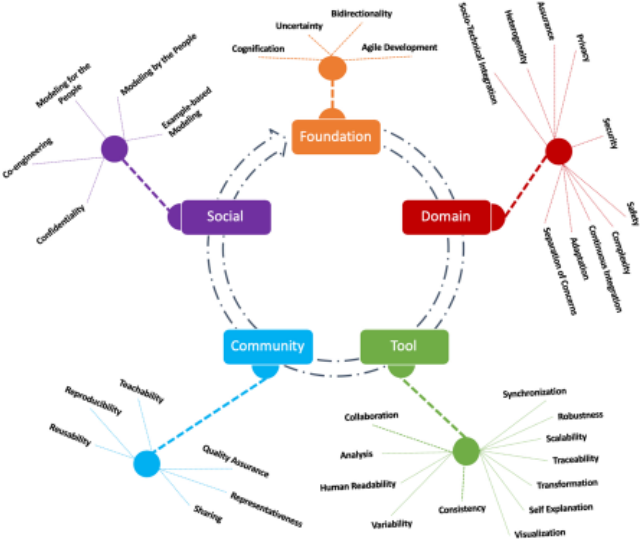
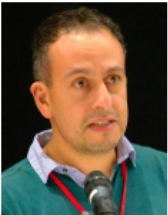
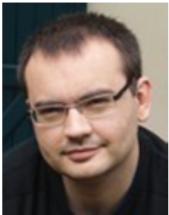

> Converted from [`grand-challenges-in-model-driven-engineering.pdf`](grand-challenges-in-model-driven-engineering.pdf) with docling. Figures are in [`grand-challenges-in-model-driven-engineering-images/`](grand-challenges-in-model-driven-engineering-images/). Page numbers for each section are in [`INDEX.md`](../../INDEX.md).

## EXPERT VOICE

## Grand challenges in model-driven engineering: an analysis of the state of the research

Antonio Bucchiarone 1 · Jordi Cabot 2 · Richard F. Paige 3,4 · Alfonso Pierantonio 5

Received: 21 November 2019 / Accepted: 4 December 2019 / Published online: 6 January 2020 ©The Author(s) 2020

## Abstract

In 2017 and 2018, two events were held-in Marburg, Germany, and San Vigilio di Marebbe, Italy, respectively-focusing on an analysis of the state of research, state of practice, and state of the art in model-driven engineering (MDE). The events brought together experts from industry, academia, and the open-source community to assess what has changed in research in MDEover the last 10 years, what challenges remain, and what new challenges have arisen. This article reports on the results of those meetings, and presents a set of grand challenges that emerged from discussions and synthesis. These challenges could lead to research initiatives for the community going forward.

Keywords Model-driven engineering · Grand challenge · Research roadmap

## 1 Introduction

The field of model-driven engineering [1] (MDE) has evolved substantially from the earliest work on UML in the 1990s, through to seminal research on metamodeling, model transformation, and model management in the earlyto-mid-2000s. MDE has made incredible contributions to leverage abstraction and automation in almost every area of software and systems development and analysis. In many domains, including railway systems, automotive, business process engineering, and embedded systems, models are key to success in modern software engineering processes. How-

Communicated by Bernhard Rumpe.

- B Richard F. Paige paigeri@mcmaster.ca

Antonio Bucchiarone bucchiarone@fbk.eu

Jordi Cabot jordi.cabot@icrea.cat

Alfonso Pierantonio alfonso.pierantonio@univaq.it

- 1 Fondazione Bruno Kessler, Trento, Italy
- 2 ICREA and UOC, Barcellona, Spain
- 3 University of York, York, UK
- 4 McMaster University, Hamilton, Canada
- 5 Università degli Studi di L'Aquila, L'Aquila, Italy

ever, this success has led to an even higher demand for better tools, theories, and general awareness about modeling, its scope, and application. The changing face of MDE is reflected in the surveys (both broad and specific), roadmaps, and research challenge workshops found in the literature [25].

In 2017 and 2018, the research community held two events: the Grand Challenges in MDE workshop, 1 colocated with STAF 2017 in Marburg, Germany in July 2017; and the Winter Modeling Meeting , 2 held in San Vigilio di Marebbe, Italy, in January 2018. Experts from industry and academia attended these meetings and presented their views that reflected on the research roadmaps of the past, and the challenges facing the community in the future. This article attempts to synthesize the discussion at these two meetings. Moreover, it outlines how far the community has come in addressing challenges presented in previously published research roadmaps (particularly [3,4]), and what new challenges have arisen in the intervening years. The meetings were attended by an overlapping set of experts with different backgrounds and experience. The Grand Challenges in MDE 2017 workshop was a traditional workshop with paper submissions and presentations, along with extensive discussion. The Winter Modeling Meeting 2018 was an invitation-only workshop with focused sessions on research challenges as well as educational challenges facing MDE. The interested reader can find lists of participants and papers for these workshop on the aforementioned websites.

[1 http://www.edusymp.org/Grand2017/en.](http://www.edusymp.org/Grand2017/en)

[2 http://eventmall.info/AMM2018/.](http://eventmall.info/AMM2018/)

This article attempts to summarize the discussion of world experts in MDE at these two venues, capturing a vision of the grand challenges facing the community. As such, it may provide useful context for future research projects, research grant proposals, or presentations made to funding bodies. The paper starts with a brief reflection on research challenges identified in previous roadmaps, in order to contextualize the new challenges. Then, the paper summarizes the key challenges identified during discussions at the Grand Challenges in MDE 2017 workshop and the Winter Modeling Meeting 2018. It then concludes with a brief summary of where the authors believe the field of MDE research is going.

## 2 Analysis of past challenges

There has been substantial progress in research on MDE since the late 1990s and early 2000s. This was analyzed and the state of the art synthesized, in a selection of research roadmaps and challenge papers published at the time. In this section, we briefly reflect on past research challenges in MDE, in order to contextualize the results of the two workshops.

## 2.1 Pre-2007 challenges

The period from the late 1990s through to around 2007 was dominated by modeling language issues. This was a time where the Unified Modeling Language (UML) was undergoing considerable changes to its semantics, infrastructure and superstructure, and there was a very substantial body of research considering precise semantics of such modeling languages, as well as the metamodeling process [6-9]. The key use case for modeling was code generation, as embodied by research on model-to-text transformation languages [10] and standards, 3 and the popularity of code generators that were offered 'out of the box' in modeling tools, such as the Kennedy Carter (now Abstract Solutions) 4 or Artisan (now PTC Integrity Modeler) 5 tools.

This was also a period with substantial effort in standardization, which led to the production of the Meta-Object Facility (MOF), 6 Model-Driven Architecture (MDA), 7 the Object Constraint Language (OCL), 8 and Query-ViewTransformation (QVT) 9 specifications. Researchers in modeling engaged in a significant way with relevant standardization efforts, with varying degrees of success. In essence, this period laid the groundwork for more recent research, providing the foundations needed for more advanced research on modeling tools and model management.

[3 https://www.omg.org/spec/MOFM2T/1.0/.](https://www.omg.org/spec/MOFM2T/1.0/)

[4 https://abstractsolutions.co.uk/our-services/executable-uml/.](https://abstractsolutions.co.uk/our-services/executable-uml/)

[5 https://www.ptc.com/en/products/plm/plm-products/integritymodeler.](https://www.ptc.com/en/products/plm/plm-products/integrity-modeler)

[6 https://www.omg.org/mof/.](https://www.omg.org/mof/)

[7 https://www.omg.org/mda/.](https://www.omg.org/mda/)

## 2.2 Challenges from 2007 through present day

More recently, various research roadmaps [4,5,11] identified a variety of significant research challenges, many of which have seen substantial research effort. The key issues that were identified in these previously published roadmaps include the following

- Language engineering (e.g., [12]) principles, practices, and patterns for specifying abstract and concrete syntax, as well as semantics. Research challenges related to understanding the language engineering process were also identified.
- Languageworkbenches (popularized in 2005)-i.e., tools for defining and composing domain-specific languages and their IDEs: the fundamental research against this challenge led to the development of modern language workbenches such as JetBrains MPS, 10 Xtext, 11 Kermeta, 12 Racket 13 and Spoofax. 14
- Model management -processes and tasks for manipulating and analyzing models: the fundamental research in this area led to theoretical results (e.g., identification of different model management tasks, such as model merging and comparison) as well as technical contributions (e.g., model management platforms such as AtlanMod 15 and Epsilon 16 ).
- Model analysis the challenge of techniques for analyzing models (e.g., for performance or correctness [13]), along with principles relate to understanding what makes a good model.
- Models at runtime the use of models to manage and understand systems after they have been deployed and as they execute behavior [14]. Substantial research has taken place regarding this challenging to identify techniques

[8 https://www.omg.org/spec/OCL/About-OCL/.](https://www.omg.org/spec/OCL/About-OCL/)

[9 https://www.omg.org/spec/QVT/About-QVT/.](https://www.omg.org/spec/QVT/About-QVT/)

[10 https://www.jetbrains.com/mps/.](https://www.jetbrains.com/mps/)

[11 https://www.eclipse.org/Xtext/.](https://www.eclipse.org/Xtext/)

[12 http://www.kermeta.org/.](http://www.kermeta.org/)

[13 https://racket-lang.org.](https://racket-lang.org/)

[14 http://strategoxt.org/Spoofax.](http://strategoxt.org/Spoofax)

[15 http://www.atlanmod.org/.](http://www.atlanmod.org/)

[16 http://www.eclipse.org/epsilon.](http://www.eclipse.org/epsilon)

- and tools for automatically reflecting changes from a system into changes in models, and vice versa. This particular challenge is at the intersection of modeling and artificial intelligence research.
- Modeling repositories (such as REMODD [15], the Atlantic Zoo, 17 and MDEForge [16]), which provide persistence for modeling artifacts such as models, transformations, and metamodels: There was an identified need for not only more modeling artifacts to support research, but facilities to make it easier for engineers to store and acquire such artifacts. The adoption of such repositories is sporadic in the community.
- Scalability across different dimensions given progress against some of the other challenges listed above, the ambition of researchers and engineers increased. As a result, demand for support for working with very large models (with hundreds of thousands of elements, if not more), large metamodels, large transformations etc., increased [17]. This in turn led to fundamental work on understanding the performance of modeling infrastructure, on fragmenting and splitting large models and metamodels, and on scheduling the execution of transformations to optimize their performance.

Substantial progress was made in these areas over the last period of time, and active research continues against many of these areas. These challenges fed in to the discussion sessions at the Grand Challenges in MDE 2017 workshop, and the Winter Modeling Meeting in 2018, as we now discuss.

## 3 Technical challenges

This section describes the technical challenges discussed in both events. We split them up into foundation , domain , and tool challenges, respectively. The categorization is not strict since it does not have crispy boundaries; on the contrary, it is a pragmatic one and aims at facilitating the presentation of the challenges. As a consequence, some challenges necessarily span more than one category.

The majority of the presented challenges are of technical nature, but, as the MDE ecosystem matures and the technical issues are addressed, we believe the social and community challenges will become the critical factors for the success of MDE. The next sections shed some more light on these aspects.

## 3.1 Foundation challenges

The foundation dimension comprehends all the challenges concerning conceptual and theoretical aspects of MDE, covering all the phases of software development (i.e., modeling, deployment, execution, and maintenance). Modeling is a well-established and successful discipline that has been practiced for decades. As a consequence, there might be good reasons for which companies want to exploit these (long-lived) models posing the question about how do we allow legacy models (and hence legacy modeling formats) to remain in existence. Supporting such tasks can take advantage of modeling itself by allowing legacy models to co-exist with modern modeling technologies. In this context, agile and lean software development is increasingly adopted in the software industry. No matter of fact: This is changing the way software is described. Companies must not move away from modeling, making model-driven development valuable at the age of agile development.

[17 https://www.imt-atlantique.fr/fr.](https://www.imt-atlantique.fr/fr)

As we will see in the domain challenges section, there is a compelling need to improve the MDE solutions in order to support those processes that intrinsically include also social aspects as in multi-disciplinarity and heterogeneous environments. Thus, proper model management is an increasingly pressing challenge. In this setting, How to transform a software engineer into a system engineer that must be able to combine different types of models leads to an integrated view on a system? How can we virtualize these complex systems that are based on a collection of heterogeneous models?

In systems running in an open environment (i.e., Smart* systems ), uncertainty during the design of software models is caused by many design alternatives, incomplete information, conflicting stakeholder opinions. How to use MDE to (i) connect discussion models with software artifacts, (ii) relate different models to different choices, (iii) detect proposed solutions for each choice, (iv) learn a Design Space Exploration specification from proposed solution examples, (v) support fuzzy/naturalistic argumentation, (vi) leverage/integrate flexible modeling tools, are all needed aspects to take into account.

Considering the runtime phase of such systems, and the adaptive nature of most of the complex systems developed in the last years, we can say that software changes are ubiquitous and unavoidable . To manage them, we need to go toward a theory of software agility in MDE able to consider different kinds of maintenance, including repair and improvement, adaptation to a new platform, extension with new functionality, reuse in different contexts, refactoring to make the above kinds of maintenance more accessible). At the same time, we need to introduce theories and techniques able to detect/predict software anomalies and suggest the needed software evolutions.

To automatize and make more powerful all the maintenance solutions, we need to extend the MDE techniques exploiting AI techniques that nowadays are ready to be used for complex and highly dynamic systems. MDE techniques can help in the improvement of AI, machine learning, and other cognification techniques. At the same time, cognification techniques can be exploited to improve and bring quantifiable and perceivable advantages to MDE solutions [18]. Machine learning is a technique that builds on the premise of having a tremendous impact not only on the way software behaves and is realized, but also on society. However, its adoptions requires massive skill sets that current professional profiles fail to meet despite the increasing demand. Machine learning practice would be easier if the learning curve for the needed skills would be more convenient. Model-driven software engineering and humancomputer interaction design can help in abstracting machine learning technology and, starting from these abstractions, enabling automated code generation.

Due to the complexity of the targeted systems, there is a strong need to increase the usability of the Model Transformation techniques . Model transformations are cornerstone components of any project adopting model-driven techniques, particularly model-to-model model transformations. Current transformation languages, e.g., ATL, QVT, ETL, Henshin, VIATRA, and Stratego, provide rather powerful features and useful capabilities. However, their current adoption in the industry seems to be marginal when compared to Java and others. Difficulties are related to the semantic intricacy of MTLs that despite their apparent simplicity (which helps introducing subtle critical errors); lack of debugging methods and tools; lack of performance, scalability, and inability to deal even with mid-sized models; little or no support for parallelization, concurrent execution or distribution; and poor interoperability. In the same context, bidirectionality in model transformations is all important as it permits two or moremodelstoremainconsistentwhiletheyundergomodifications. Current approaches often present idiosyncrasies that prevent the implementors from having complete control on the generated solutions. This is due to difficulties in assuring that a transformation is deterministic, making necessary in a class of problems the explicit management of the uncertainty related to the decision to pick the right solution. Understanding, which are the different application scenarios for deterministic and non-deterministic transformations, may mitigate the difficulties in adopting bidirectionality.

## 3.2 Domain challenges

This dimension comprehends all the issues related to the nature of the application domains of the systems developed using MDE. Application domains like automotive, aerospace, nuclear, and healthcare aimed to assure a set of particular properties (i.e., privacy, security, safety). To reduce risks and to ensure that the software developed is reliable, assurance case modeling becomes an important part of the model-driven engineering techniques. At the same time, complex systems that also consider the social aspects (i.e., sociotechnical systems), are composed of different and heterogeneous artifacts. A modeling framework to support the integration of data from sensors, open data, laws, regulations, scientific models (computational and data-intensive sciences), engineering models, and user preferences is needed (i.e., DSLs for sociotechnical integration ). Finally, the Internet of Things (IoT) domain represents a great opportunity for model-driven engineering applications in a wide range of domains, e.g., smart cities, smart buildings, industry 4.0, automotive, and health care. The answer that we still have to respond is: Can MDE play a key role in the future of IoT and smart systems? .

For sure, MDE allows coping with the complexity of reality by abstracting the relevant aspects for a particular application into corresponding models. In this respect, an MDE based solution is needed for smart city applications (i.e., in domains like Smart Mobility). MDE is a strategic piece of a framework to realize advanced solutions by taking into account different aspects and stakeholders involved in the smart cities domain. Different views allow for the separation of concerns that, together to a higher level of abstraction, reduce the complexity of dealing with complex systems specification-continuous deployment and adaptation using MDE. The relationships between the views, their corresponding semantics, and the configuration of the different applications/services available in a city, constitute a megamodel [19]. In this dimension, in the last 10 years, various engineering disciplines have emerged and are involved in the engineering process. How to transition from implicit to explicit knowledge about MDE in particular fields (i.e., Cyber-Physical Production Systems)?

## 3.3 Tool and implementation challenges

Lack of good tooling is often mentioned as one key aspect hampering the adoption of MDE. We discussed that potential factors that may favor the adoption of model-driven development include adopting textual languages and treating the code as model, good and easy tooling (like modern IDEs), component-based solutions, and high-quality generated code.

Lots of interesting tools for building visual editors are currently available. Visualization and visual editor frameworks are meant to help with working with complex problems; however, too many difficulties are still encountered when designers use them for real. Thus, understanding the principles of building visual editors or visualization frameworks that can apply to complex problems, and analyzing where do our current frameworks/tools fall short should be a major concern.

Describing a complex system requires modeling different heterogeneous views [20] that need to be linked although they belong to different steps. Analyzing how to build correspondences among such artifacts and understanding the semantics of such links is important in order to be able to insure traceability from requirements to implementation, and deduce requirements from the system. When several stakeholders are involved, artifacts must be linked to them as well and therefore understand the kind of requirements are existing. In this context, expressing the requirements in a human-readable notation that can be understood by a computer program can be highly relevant as well as and consequently understanding how to make the link among the involved artifact expressing the system and requirements in a same formalism (Single Model Principle).

Over the last decade, scalability has been denoted as one of the main challenges in model-driven engineering [11,17]. As one participant pointed out, vanilla (out-of-the-box) EMF only works for simple projects. The problem is not just the size of the models but the diversity of artifacts, including models, metamodels, transformations, and dependencies, in any non-trivial project. There is a need to tame the accidental complexity of MDE itself. Running large transformations is as important as running transformations on large and heterogeneous models. Besides this, work on parallel and incremental querying and transformation is needed. In this sense, [21] defended the need for artifact models. According to [22] these artifacts should be viewed as data to which apply 'classical' data analysis exploitation techniques (e.g., those coming from the information retrieval community).

Also, while participants agreed that we do have a reasonably robust MDE tool infrastructure (e.g., metamodeling and transformation languages), many core MDE aspects could still be improved. [23] highlighted the need to simplify the creation of proper tool support for executable languages by providing various analysis tools for executable domainspecific modeling languages out of the box based on single formalizations of their execution semantics. Similarly, [24] proposed a more general formalization of model synchronization and consistency management aspects that could be reused across different tools. This could also help with the challenge of making 'chaining transformations' as straightforward as composing functions.

Another discussion point led to the argument that MDE tools should become more intelligent and self-aware. Several AI techniques could be used to cognify model-driven techniques [18] and to improve the autonomy of MDE tools (e.g., smart model autocompletion). Indeed, more and more MDE tools need to collaborate and agree on how to manage and evolve (runtime) models according to a shared set of goals [25]. Self-explanation capabilities will be critical in this scenario. This would also require considering time and timing issues as a first-class dimension (to be able to reason on when the model changes were done) as described in [26].

## 4 Social and community challenges

It emerged from the discussions that addressing the technical challenges often required also to consider social and community aspects in order to be able to validate such technical solutions or to be sure that it will be adopted in practice.

## 4.1 Social aspects

A critical discussion on social challenges took up the argumentthat MDEshouldbethecatalyst to enable non-technical people to build the tools they need in their domains (Modeling by the People, for the People [27]). While this is one of the main selling arguments for MDE, it is still tricky for some modeling aspects, like the definition of desired consistency properties [28]. Ideally, instead of starting from scratch, stakeholders could be assisted in exploring the design space of potential models to be built [29], where these potential models (and their relationships) should be informed by domain information, e.g., regulatory texts from which some initial models could be inferred.

One possible solution, which was suggested during the discussion session, would be to facilitate deeper use of example-based modeling, even as a combination of formal and informal techniques to describe valid scenarios. It was also suggested to explore a kind of an Excel-like approach where one directly works at the instance-level all the time. It has also been proposed to expect less from the modelers, enabling practically useful analysis with minimal upfront modeling effort. Indeed, 'how much modeling is enough' is a question that deserves to be explored, and that would help bridge modeling with agile approaches.

As a consequence of this discussion, the workshop considered whether any reluctance to employ MDE tools might be related to concerns over the Intellectual Property of the resulting models. This may be especially important in co-engineering projects where models are typically shared with third parties. Adapting well-known intellectual property management techniques (e.g., watermarking, fingerprinting, or obfuscation) to MDE artifacts may be one way forward to increasing confidence.

A more extreme suggestion involved moving to domainspecific MDE. Instead of considering MDE as if it was one general-purpose approach for systems and software engineering, we could start talking about 'MDE for banking', 'MDE for insurance', 'MDE for health', and so on. Each domain might require different solutions, going far beyond the current approach of proposing different domainspecific languages for each sector. Domain-specific MDE could involve, for instance, tools explicitly tailored for different stakeholders in terms they understand (which may have a higher chance of being adopted).

Fig. 1 Challenges classification

## 4.2 Community aspects

Interestingly, it has been recognized from many sides how individuals can not easily address particular problems that instead affect the community as a whole and require more infrastructural solutions. One of the critical arguments made was that researchers and practitioners of MDE are primarily to blame for not having succeeded in selling the global software engineering community on the benefits of MDE. The workshop attendees challenged the notion of 'blame', but acknowledged that the community would benefit from further MDE evangelism, as well as talking with software practitioners about MDE in a language that speaks to them.

There was also a strong consensus on the need for large model repositories where models could be endowed with confidence measures about their quality , e.g., via a community-based curation effort that tags the models contributed by others. This is especially needed for performing automated analysis that could influence the evolution of our field. However, quality assurance of models alone is not enough; we also need to ensure the representativeness of models. (It was noted that most contributed models in existing repositories do not have constraints.)

Another major community issue is how to teach students (who are the next generation of potential MDE practitioners and researchers). The workshop discussion considered whether we may need to change the way we teach MDE and focus first on teaching students on how to 'use' MDE tools (and realizing the advantages of that) instead of teaching them how to 'build' MDE tools. In the end, it is more likely that students end up belonging to the first group (MDE users) than to the second one (MDE builders) during their professional life. One way or the other, the workshop attendees concluded: setting up proper MDE teaching environments is still discouragingly hard.

Both richer model repositories and more MDE usefocused teaching require excellent collections of (reproducible, reusable, teachable) MDE projects, and not just individual models that anybody interested in MDE could easily import and explore [30].

## 5 Discussion

In this section, we briefly discuss the outcome of the proposed challenge classification. As aforementioned, the challenges have been arranged in different categories that reflect the issues and problematic areas of the current state of the art in model-driven engineering.

In particular, Fig. 1 illustrates such categories that, in turn, have been further refined to better characterize the challenge extension and boundary. Moreover, the main categories have been ordered according to their chronological relevance, e.g., the foundation challenges emerged before the domain and tool ones because most of the times tools have been developed for specific domains and based on theories and foundational elements. The advent of tools challenges somewhat corresponds also to an higher awareness about the limitations and difficulties in the practice of modeling partly due also to inflated expectations. For instance, the idea that most of the tools are lacking quality overwhelmingly emerged throughout the community that reacted in many different forms (e.g, publishing surveys on success stories and failures, organizing focused workshops and seminars, and so on). In other terms, the difficulties, which have been identified by the individual researchers and practitioners or within small organizations, started to be slowly part of a conventional wisdom. Atthesametime,socialaspects becomealsorelevant in many different directions, including collaborative modeling, confidentiality issues, and several forms of design-by-example.

## 6 Conclusions

In this article, we presented the grand challenges in the model-drivenengineeringfield according to the expert participants in the two events we organized to discuss the future of MDE. We have classified them in different categories trying also to order them respect to their chronological relevance. We hope that this analysis not only represents a snapshot of the challenges faced in this research field but contributes to stimulate researchers, practitioners, and tool developers to tackle and explore some of them. At the same time, it provides a useful context for future research projects, research grant proposals and new research directions. We hope in a few years we can look back at this list and see many of them crossed out as a sign of the continuous advancement and maturity of our community.

Open Access This article is licensed under a Creative Commons Attribution 4.0 International License, which permits use, sharing, adaptation, distribution and reproduction in any medium or format, as long as you give appropriate credit to the original author(s) and the source, provide a link to the Creative Commons licence, and indicate if changes were made. The images or other third party material in this article are included in the article's Creative Commons licence, unless indicated otherwise in a credit line to the material. If material is not included in the article's Creative Commons licence and your intended use is not permitted by statutory regulation or exceeds the permitted use, you will need to obtain permission directly from the copyright holder. To view a copy of this licence, visit http://creativecomm ons.org/licenses/by/4.0/.

## References

1. Schmidt, D.C.: Model-driven engineering. Comput. IEEE Comput. Soc. 39 (2), 25 (2006)
2. Mussbacher, G., Amyot, D., Breu, R., Bruel, J.-M., Cheng, B.H.C., Collet, P., Combemale, B., France, R.B., Heldal, R., Hill, J., et al.: The relevance of model-driven engineering thirty years from now. In: International Conference on Model Driven Engineering Languages and Systems, pp. 183-200. Springer (2014)
3. Van Der Straeten, R., Mens, T., Van Baelen, S.: Challenges in model-driven software engineering. In: International Conference on Model Driven Engineering Languages and Systems, pp. 35-47. Springer (2008)
4. France, R., Rumpe, B.: Model-driven development of complex software:aresearchroadmap.In:2007FutureofSoftwareEngineering, pp. 37-54. IEEE Computer Society (2007)
5. France, R.B., Rumpe, B.: The evolution of modeling research challenges. Softw. Syst. Model. 12 (2), 223-225 (2013)
6. Evans, A., France, R.B., Lano, K., Rumpe, B.: The UML as a formal modeling notation. In: The Unified Modeling Language, UML'98: Beyond the Notation, First International Workshop, Mulhouse, France, June 3-4, 1998, Selected Papers, pp. 336-348 (1998)
7. Evans, A., Kent, S.: Core meta-modelling semantics of UML: the puml approach. In: Proceedings of the UML'99: The Unified Modeling Language-Beyond the Standard, Second International Conference,FortCollins,CO,USA,October28-30,1999,pp.140155 (1999)
8. Evans, A., Lano, K., France, R.B., Rumpe, B.: Meta-modeling semantics of UML. CoRR. (2014). arXiv:1409.6917
9. Störrle, H., Hausmann, J.H.: Towards a formal semantics of UML 2.0 activities. In: Software Engineering 2005, Fachtagung des GIFachbereichs Softwaretechnik, 8.-11.3.2005 in Essen, pp. 117-128 (2005)
10. Oldevik, J., Neple, T., Grønmo, R., Aagedal, J.Ø., Berre, A.: Towardstandardisedmodeltotexttransformations.In:Proceedings of the Model Driven Architecture-Foundations and Applications, First European Conference, ECMDA-FA 2005, Nuremberg, Germany, November 7-10, 2005, pp. 239-253 (2005)
11. Kolovos, D.S., Rose, L.M., Matragkas, N., Paige, R.F., Guerra, E., Cuadrado, J.S., De Lara, J., Ráth, I., Varró, D., Tisi, M., et al.: A research roadmap towards achieving scalability in model driven engineering. In: Proceedings of the Workshop on Scalability in Model Driven Engineering, p. 2. ACM (2013)
12. Laemmel, R.: Software Languages: Syntax, Semantics and Metaprogramming. Springer, Berlin (2018)
13. Moreno, G.A., Merson, P.: Model-driven performance analysis. In: Becker, S., Plasil, F., Reussner, R. (eds.) Quality of Software Architectures. Models and Architectures. Springer, Berlin (2008)
14. Bencomo, N., Götz, S., Song, H.: Models@run.time: a guided tour of the state of the art and research challenges. Softw. Syst. Model. 18 (5), 3049-3082 (2019)
15. France, R., Bieman, J., Cheng, B.H.C.: Repository for model driven development (ReMoDD). In: International Conference on Model Driven Engineering Languages and Systems, pp. 311-317. Springer (2006)

16. Basciani, F., Di Rocco, J., Di Ruscio, D., Di Salle, A., Iovino, L., Pierantonio, A.: Mdeforge: an extensible web-based modeling platform. In: CloudMDE@ MoDELS, pp. 66-75 (2014)
17. Kolovos, D.S., Paige, R.F., Polack, F.A.C.: The grand challenge of scalability for model driven engineering. In: International Conference on Model Driven Engineering Languages and Systems, pp. 48-53. Springer (2008)
18. Cabot, J., Clarisó, R., Brambilla, M., Gérard, S.: Cognifying modeldriven software engineering. In: Seidl, M., Zschaler S. (eds.) Software Technologies: Applications and Foundations-STAF 2017 Collocated Workshops, Marburg, Germany, July 17-21, 2017, Revised Selected Papers, volume 10748 of Lecture Notes in Computer Science, pp. 154-160. Springer (2018)
19. Favre, Jean-Marie, Nguyen, Tam: Towards a megamodel to model software evolution through transformations. Electron. Notes Theor. Comput. Sci. 127 (3), 59-74 (2005)
20. Brunelière, Hugo, Burger, Erik, Cabot, Jordi, Wimmer, Manuel: A feature-based survey of model view approaches. Softw. Syst. Model. 18 (3), 1931-1952 (2019)
21. Butting, A., Greifenberg, T., Rumpe, B., Wortmann, A.: On the need for artifact models in model-driven systems engineering projects. In: Seidl, M., Zschaler S. (eds.) Software Technologies: Applications and Foundations-STAF 2017 Collocated Workshops, Marburg, Germany, July 17-21, 2017, Revised Selected Papers, volume 10748 of Lecture Notes in Computer Science, pp. 146-153. Springer (2018)
22. Babur, Ö., Cleophas, L., van den Brand, M., Tekinerdogan, B., Aksit, M.: Models, more models, and then a lot more. In: Seidl, M., Zschaler S. (eds.) Software Technologies: Applications and Foundations-STAF 2017 Collocated Workshops, Marburg, Germany, July 17-21, 2017, Revised Selected Papers, volume 10748 of Lecture Notes in Computer Science, pp. 129-135. Springer (2018)
23. Mayerhofer, T., Combemale, B.: The tool generation challenge for executable domain-specific modeling languages. In: Seidl, M., Zschaler S. (eds.) Software Technologies: Applications and Foundations-STAF 2017 Collocated Workshops, Marburg, Germany, July 17-21, 2017, Revised Selected Papers, volume 10748 of Lecture Notes in Computer Science, pp. 193-199. Springer (2018)
24. Diskin, Z., König, H., Lawford, M., Maibaum, T.: Toward product lines of mathematical models for software model management. In: Seidl, M., Zschaler S. (eds.) Software Technologies: Applications and Foundations-STAF 2017 Collocated Workshops, Marburg, Germany, July 17-21, 2017, Revised Selected Papers, volume 10748 of Lecture Notes in Computer Science, pp. 200216. Springer (2018)
25. García-Domínguez, A., Bencomo, N.: Non-human modelers: challenges and roadmap for reusable self-explanation. In: Seidl, M., Zschaler S. (eds.) Software Technologies: Applications and Foundations-STAF 2017 Collocated Workshops, Marburg, Germany, July 17-21, 2017, Revised Selected Papers, volume 10748 of Lecture Notes in Computer Science, pp. 161-171. Springer (2018)
26. Bill, R., Mazak, A., Wimmer, M., Vogel-Heuser, B.: On the need for temporal model repositories. In: Seidl, M., Zschaler S. (eds.) Software Technologies: Applications and Foundations-STAF 2017 Collocated Workshops, Marburg, Germany, July 17-21, 2017, Revised Selected Papers, volume 10748 of Lecture Notes in Computer Science, pp. 136-145. Springer (2018)
27. Kelly, S.: Modelling by the people, for the people. In: Seidl, M., Zschaler S. (eds.) Software Technologies: Applications and Foundations-STAF 2017 Collocated Workshops, Marburg, Germany, July 17-21, 2017, Revised Selected Papers, volume 10748 of Lecture Notes in Computer Science, pp. 178-183. Springer (2018)
28. Gogolla, M., Hilken, F., Kästner, A.: Some narrow and broad challenges in MDD. In: Seidl, M., Zschaler S. (eds.) Software Technologies: Applications and Foundations-STAF 2017 Collocated Workshops, Marburg, Germany, July 17-21, 2017, Revised
14. Selected Papers, volume 10748 of Lecture Notes in Computer Science, pp. 172-177. Springer (2018)
29. Kulkarni, V., Reddy, S.: From building systems right to building right systems-A generic architecture and its model based realization. In: Seidl, M., Zschaler S. (eds.) Software Technologies: Applications and Foundations-STAF 2017 Collocated Workshops, Marburg, Germany, July 17-21, 2017, Revised Selected Papers, volume 10748 of Lecture Notes in Computer Science, pp. 184-192. Springer (2018)
30. Di Rocco, J., Di Ruscio, D., Iovino, L., Laemmel, R., Pierantonio, A.: MDE adoption-a three-legged chair. In: Proceedings of the Workshop on Grand Challenges in Modeling at STAF (2017)

Publisher's Note Springer Nature remains neutral with regard to jurisdictional claims in published maps and institutional affiliations.

Antonio Bucchiarone is Senior Researcher within the DAS Research Unit at Fondazione Bruno Kessler (FBK) of Trento, Italy. His main research interests include: Self-Adaptive (Collective) Systems, Domain Specific Languages for Socio-Technical System, and AI planning techniques for Automatic and Runtime Service Composition. He received a Ph.D. in Computer Science and Engineering from the IMT School for Advanced Studies Lucca in 2008 and since 2004 he has been a

collaborator of Formal Methods and Tools Group at ISTI-CNR of Pisa (Italy). He has been actively involved in various European research projects in the field of Self-Adaptive Systems, Smart Mobility and Constructions and Service-Oriented Computing. He was the general chair of the 12th IEEE International Conference on Self-Adaptive and Self Organizing Systems (SASO 2018) and part the Program Committees of various international conferences the field of Self-Adaptative Systems (SASO), Service-Oriented Computing (ICSOC), and Software Architecture (ACM SAC).

Jordi Cabot received the B.Sc. and Ph.D. degrees in computer science from the Technical University of Catalonia. He was a Leader of an INRIA and LINA Research Group at École des Mines de Nantes, France, a Post-Doctoral Fellow with the University of Toronto, a Senior Lecturer with the Open University of Catalonia, and a Visiting Scholar with the Politecnico di Milano. He is currently an ICREA Research Professor at the Internet Interdisciplinary Institute. His research inter-

ests include software and systems modeling, formal verification and the role AI can play in software development (and vice versa). He has published over 150 peer-reviewed conference and journal papers on these topics. Apart from his scientific publications, he writes and blogs about all these topics in several sites.

Richard F. Paige is Professor of Software Engineering at McMaster University, Canada, and holds the Chair of Enterprise Systems at the University of York, UK. He has published around 300 papers on topics related to software engineering, safety and security. He has chaired numerous software engineering conferences and workshops and is on the editorial boards of Software and Systems Modeling, the Journal of Object Technology and Empirical Software Engineering. His research inter-

ests are in model management, model-based systems engineering, software processes, agile methods, and safety critical systems.

Alfonso Pierantonio is Professor in Computer Science at Università degli Studi dell'Aquila, Italy. His research interests include ModelDriven Engineering with a specific emphasis on co-evolution, bidirectionality, and analytics. He has been involved in several national and international projects including H2020 ITN Lowcomote and H2020 Typhon. He has been general chair of STAF 2015, PC chair of ECMFA 2018 and on the organizing, steering, and program committees of many international

conferences. He is the editor-in-chief of the Journal of Object Technology (JOT) and a member of the editorial board of the Journal on Software and Systems Modeling (SoSyM).

