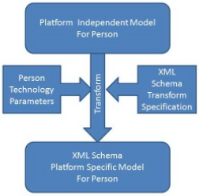

> Converted from [`mda-guide-rev-2.0.pdf`](mda-guide-rev-2.0.pdf) with docling. Figures are in [`mda-guide-rev-2.0-images/`](mda-guide-rev-2.0-images/). Page numbers for each section are in [`INDEX.md`](../../INDEX.md).

## Object Management Group Model Driven Architecture (MDA) MDA Guide rev. 2.0

OMG Document ormsc/2014-06-01

## Executive Summary

This guide describes the Model Driven Architecture (MDA) approach as defined by the Object Management Group (OMG).  MDA provides an approach for deriving value from models and architecture in support of the full life cycle of physical, organizational and I.T. systems 1 .  The MDA approach  represents and supports everything from requirements to business modeling to technology implementations.  By using MDA models, we are able to better deal with the complexity of large systems and the interaction and collaboration between organizations, people, hardware, software.

The primary feature of MDA which enables us to deal with complexity and derive value from models and modeling is defining the structure, semantics, and notations of models using industry standards - models conforming to these standards are 'MDA Models'. MDA models can then be used for the production of documentation, acquisition specifications, system specifications, technology artifacts (e.g. 'source code') and executable systems.

MDA leverages models to enhance the agility of planning, design, and other lifecycle processes, and improve the quality and maintainability of the resulting products. MDA can also be used to relate the models to implemented solutions and related artifacts, such as when transforming a software design model to executable code, or relating the design model to its requirements.

The MDA set of standards includes the representation and exchange of models in a variety of modeling languages, the transformation of models, the production of stakeholder documentation, and the execution of models.  MDA models can represent systems at any level of abstraction or  from different viewpoints, ranging from enterprise architectures to technology implementations. MDA 'connects the dots' between these different viewpoints and abstractions.

This MDA guide describes the MDA vision, standards and value proposition for decision makers and developers who are considering or employing a model driven approach.

This white paper is part of a set of MDA resources which may be found on 'http://www.omg.org/mda/'. Please see this web site for more information.

1 A  'System', in this context, is any arrangement of parts and their interrelationships, working together as a whole.  This is inclusive of designs at all levels such as an entire enterprise, a process, information structures or I.T. systems.

## · The MDA approach to deriving value from models

The essential goal of MDA is to derive value from models and modeling that helps us deal with the complexity and interdependence of complex systems.  There are multiple ways to derive value as summarized below.

## Models as communications vehicles

A fundamental value proposition for models and modeling is to facilitate a team or community coming to a common understanding and/or consensus.  MDA standards assist in three ways:

- Providing well defined terms, icons and notations that assist in a common understanding of a subject area
- Providing the foundation for models as semantic data to be managed, versioned and shared
- Providing libraries of reusable (asset) models such as common vocabularies and rules, reusable processes, business object models, or architectural design patterns

Models also become part of the 'corporate memory' of an organization, capturing the requirements, design and intent of its organization, processes, information and services.

## Derivation via automated transformation

Deriving artifacts and implementations from models may be fully or partially automated. Automation reduces the time and cost of realizing a design, reduces the time and cost for changes and maintenance and produces results that ensure consistency across all of the derived artifacts.  For example, manually producing all of the web service artifacts required to implement a set of processes and services for an organization is difficult and error-prone.  Producing execution artifacts from a model is more reliable and faster. Producing derivative artifacts can also be intermixed with model execution, simulation and analytics.

Automated derivation involves a platform independent 'source model' with some parameters for how that source model is to be interpreted, a 'transformation' and a platform specific 'target artifact'.  In many cases the target artifact is another model. Derivation also includes logical inference as defined in ontology languages such as OWL and common logic.  Producing 'code' from models is one of the first uses of MDA and a continued value proposition. However, as we will see below, it is not the only value proposition.

## Model Analytics

Once models are captured as semantic data various analytics can be executed across those models including model validation, statistics and metrics.  Analytics assists in decision making, monitoring and quality assessment.

## Model Simulation and Execution

Models as data can drive simulation engines that can assist in both analytics and execution of the designs captured in models. Simulation assists in the human understanding of how a modeled system will function as well as a way to validate that models are correct.

Models can, in some cases be directly executed - serving as the 'source code' for highlevel applications that implement processes, data repositories and service endpoints. Model execution provides a direct and immediate path to realizing a design with a minimum of technical details being exposed.  DBMS Schema and process models are well-known categories of (partially) executable models.

## Deriving information from models

Well defined models can be used to derive other information - information that can be inferred directly from information in source models as well as models and other artifacts. Derivative information that can be derived from models includes:

- Process playbooks
- ·
- Derived insights

For example from a set of process models, a tool could derive responsibilities of a particular organization unit represented on one or more swimlanes, or discover an unanticipated side-effect.

- Documentation
- Acquisition specifications (i.e. RFPs)
- I.T. Systems

## Structuring Unstructured Information

There are vast quantities of unstructured data in documents, web pages and diagrams. While the MDA technologies do not directly address extracting unstructured information, MDA does provide a way to define the structured representation of these documents. Software that scans or extracts information from unstructured text can use MDA models as the repository for the resulting manually enriched semantic data.

## · The Structure and Semantics of Models

The foundation of MDA is capturing models as data that we can query, analyze, report on, validate, simulate, and transform into other useful formats (such as executable code). There are MDA standards for how we represent models as data, standards for the meaning of model data for a multitude of purposes, standards for how we render model data and standards for transforming between different representations for different purposes.

Consider a 'whiteboard' session with a team of collaborators.  In that session you may draw some diagrams on a whiteboard that help communicate concepts to achieve a mutual understanding.  That mutual understanding comes from the team having a common understanding of the symbols used on the whiteboard, perhaps the presenter explained the symbols they used, or perhaps these are understood within your community.

This whiteboard diagram can have a lot of value within that meeting; it is a useful informal model.  But, after the meeting it is lost; perhaps we take a picture of the white board so we can keep a copy, or perhaps we reproduce it in a drawing tool.  Another example of an informal model is the design every software developer has in their head prior to writing code.  But such white-board sessions and 'in the head designs' have their limits - we need something more durable.

What we need is data - data with well-defined structures and meanings that represents the facts and concepts behind the pictures.  The data is 'behind' the diagrams; in fact diagrams can be thought of as one possible rendering of data for a particular purpose. The whiteboard session is great for a meeting but as soon as possible we want to capture the information represented on the white board as data with well-defined meaning.  The well-defined meaning is the semantics of the data, the definition of what the data means in the context of our models.

What can we do with models as semantic data?  Once we have the data semantics behind the diagrams we can:

- Manage and evolve the data
- Query, validate and analyze the data
- Share the data with others
- Repurpose it for other uses
- Make connections between related models
- Make other diagrams or renderings that may make sense to others
- Derive derivative value using software tools

## What We Model - the Domain Subject Area

There are models of different things for different purposes. The subject area establishes the context and scope of the model. Each subject area is considered a domain.  High-level domains include:

- Telecommunications
- Healthcare
- Retail
- Manufacturing
- Transportation
- Defense
- Government
- And many others…

A more specific domain may be the subject of a particular model for a company, government agency or defense mission.  These are models of the system we design and want to make real.

Different perspectives on the same subject area are considered viewpoints.  These different viewpoints may look quite different so as to be meaningful to different stakeholders.  The models can be segregated based on the domain and viewpoint these domains and viewpoints.

## 3.Basic Concepts of MDA

This section introduces the major concepts of MDA and sets the context for more detailed treatments of these concepts in the MDA Foundation Model [1].  Note that additional terms are defined in the glossary.

## System

A system is a collection of parts and relationships among these parts that may be organized to accomplish some purpose.

In MDA, the term 'system' can refer to an information processing system but it is also applied more generally. Thus a system may include anything: a system of hardware, software, and people, an enterprise, a federation of enterprises, a business process, some combination of parts of different systems, a federation of systems - each under separate control, a program in a computer, a system of programs, a single computer, a system of computers, a computer or system of computers embedded in some machine, etc.

One of the key strengths of modeling, and one that distinguishes it from implementation technologies like software source code,  is that it is an excellent way to represent, understand and specify systems .

## Model

A model in the context of MDA is information selectively representing some aspect of a system based on a specific set of concerns. The model is related to the system by an explicit or implicit mapping.  A model should include the set of information about a system that is within scope, the integrity rules that apply to that system, and the meaning of terms used.

A model may represent the business, domain, software, hardware, environment, and other domain-specific aspects of a system.  Such a model can include many kinds of expression; for example a model of a software system could include a UML class diagram, E/R (Entity-Relationship) diagrams, and images of the user interface, while a model of a physical system could include a representation of the hardware and physical environment, and a performance simulation.  A model of an enterprise may include business processes, services, information, or resources.  Some of these expressions are human readable; others exist in electronic media. For these expressions, there may exist several notations and formats. By a single model, we mean the whole set of expressions constituting information about a system.

A model may also be distinguished by the "temporal mode" of its subject: Some models represent a system as it exists today ('as-is') and some other models may represent a system (or a possible variant of it) as it should be in a future point of time ('to-be').

## Modeling Language

To be useful, any model needs to be expressed in a way that communicates information about a system among involved stakeholders that can be correctly interpreted by the stakeholders and supporting technologies.  This requires that the model be expressed in a language understood by these stakeholders and their supporting technologies.  Achieving this understanding implies that the structure, terms, notations, syntax, semantics, and integrity rules of the information in the model are well defined and consistently represented.  The structure, terms, notations, syntax, semantics, and integrity rules that are used to express a model constitute the modeling language .

Well-known modeling languages include UML, SQL Schema, BPMN, E/R, OWL, and XML Schema.

In that we have models and modeling languages there must be some connection between them: a model is said to conform to a modeling language.  That is, everything that is said in some model is allowed to be said by the modeling language.  Formal modeling languages have some way to determine if a model conforms to a modeling language. In contrast, informal modeling languages (perhaps one used on a white board) have no such test of conformance - their meaning is then more easily misinterpreted or lost.

There is a certain circularity to models and modeling languages.  The best way to express a modeling language is as a model - this is called a metamodel . A metamodel is a model that defines a modeling language and is also expressed using a modeling language. Modeling tools typically help a modeler create models that conform to the metamodel of the language they are using.

## Architecture

The purpose of architecture is to define or improve systems or systems of systems. The architectural process encompasses understanding the scope of the systems of interest, understanding stakeholder requirements, and arriving at a design to satisfy those requirements.

The two word-senses in which architecture is used are:

- A set of models with the purpose of representing a system of interest.
- The activity and or practice of creating the set of models representing a system.

Model Driven Architecture  advocates the application of modeling to the architectural process and formalizes the resulting artifacts such that the realization or improvement of the system may be more actionable, less expensive and less risky.

## View and Viewpoint

A viewpoint specifies a reusable set of criteria for the construction, selection, and presentation of a portion of the information about a system, addressing particular stakeholder concerns.

A view is a representation of a particular system that conforms to a viewpoint.  We could, for example, have a view representing the security concerns of a payroll system.

In addition, if we are creating a model of a system that shares information there may be views for:

- The meaning of the information to be shared
- How the information is to be structured when shared
- What information is to be shared with whom and under what conditions
- The protocol by which the information consumer requests or is sent the information
- Integrity and business rules
- What technology is used to actually transmit the information
- How the shared information is derived from our internal data

Note that the above views are interrelated, that is there are connections between them that may or may not be visible in any one viewpoint.

## Abstraction

Abstraction deals with the concepts of understanding a system in a more general way; said in more operational terms, with abstraction one eliminates certain elements from the defined scope; this may result in introducing a higher level viewpoint at the expense of removing detail.  A model is considered more abstract if it encompasses a broader set of systems and less abstract if it is more specific to a single system or restricted set of systems.

For example a very abstract concept of a postal address may be a piece of information that allows for the delivery of mail to a specific location.  A less abstract definition may enumerate qualities of a postal address, such as name, city, country, state and postal code. An even less abstract form may be a SQL Schema for an address while a fully nonabstract postal address could be 8605 Westwood Center Drive, Vienna VA USA.

Modeling and abstraction go hand-in-hand and allow us to understand and even specify a system while 'abstracting away' some details such as the specifics of how it may be implemented in a particular platform or technology.  The more abstract a model the wider array of systems it represents, but a more abstract model also needs more details filled in for it to be able to be actionable.

Another important dimension in abstraction is the relationship of a model element to the thing it is modeling: some model elements (e.g. a class "customer") represent a pure conceptual thing, whereas other model elements (e.g. the instance specification "Barak Obama") represent things that really exists in the real world.

One of the capabilities of MDA is automating the transformation between levels of abstraction by the use of patterns. For example, given a more abstract definition of a postal address we may be able to apply a pattern to produce a SQL Schema representation for an address.  This capability is the foundation of the 'technology independence' MDA is known for and the automation of software solutions from models.

## Architectural Layers

It is useful to identify particular 'layers' of an architecture with respect to its level of abstraction.  While there can be any number of architectural layers, a broad categorization of this concept is:

- Business or domain models - models of the actual people, places, things, and laws of a domain.  The 'instances' of these models are 'real things', not representations of those things in an information system. In MDA domain models have historically been called a 'CIM' for 'Computation Independent Model'.
- Logical system models - models of the way the components of a system interact with each other, with people and with organizations to assist an organization or community in achieving its goals.
- Implementation models - the way in which a particular system or subsystem is implemented such that it carries out its functions.  Implementation models are typically tied to a particular implementation technology or platform.

## Transformation

Transformation deals with producing different models, viewpoints, or artifacts from a model based on a transformation pattern.  In general, transformation can be used to produce one representation from another, or to cross levels of abstraction or architectural layers.

When transformation is used to produce one representation from another, the conceptual content stays the same but the information is presented in another form. For example, you may create HTML documentation for an information model - but the information model content is the same - just available in HTML. Often, transformations combine multiple input models into an output model. For example, a technology-independent model may be transformed into a technology-specific model by combining it with a model of the technology to be used (e.g. J2EE).

In that you can have models of different levels of abstraction and different concerns that represent different yet related viewpoints, transformation can be used to cross levels of abstraction, going from a more abstract representation and, based on patterns, producing a more concrete representation - this is essentially 'forward engineering' with MDA. It is also possible to go from a concrete representation (Say, a XML Schema) to a more abstract representation - say a UML class model.

MDA transformation specifications provide the mechanisms to transform between representations and levels of abstraction or architectural layers.

## Separation of Concerns

One of the essential characteristics of quality architecture is separation of concerns. When concerns are separated it is possible to deal with, understand and specify one aspect of a system without undue dependencies on other aspects.   Separation of concerns enables greater agility, ability to deal with change and a 'divide and conquer' approach to realizing a system.

MDA helps support separation of concerns by enabling different viewpoints of a system as well as the transformation between levels of abstraction.  In particular, MDA focuses on the separation of the business concerns of a system from the technology-dependent implementation concerns of components of that system.  This enables technology independence, agility and resilience in a dynamic environment where both business and technology concerns may change over time or across organizational boundaries.

## Platform

A platform is the set of resources on which a system is realized.  This set of resources is used to implement or support the system.

In the context of a technology implementation, the platform supports the execution of the application.  Together the application and the platform constitute the system.  The application provides the functional part of the system as described by the model.

Here are examples of types of platforms:

## Business or domain platform types

- An organizational structure
- A set of buildings, machines or other physical plants
- Employees of an organization (human resources)
- Agreements supporting an organization or community

## Computer Hardware and Software platform types

- Batch:  A platform that supports a series of independent programs that each run to completion before the next starts.
- Dataflow: A platform that supports a continuous flow of data between software parts.
- Embedded: A platform specialized for detection of changes in and exercise of control over the environment of a system.
- AJAX: A platform (composed of other platforms) that enables interactive web applications.
- CORBA:  An object platform that enables the remote invocation and event architectural styles.
- Eclipse RCP: A Java language platform for software development tools and for applications generally.

- OSGi: An object platform originally designed for remotely managed software on small hardware
- J2EE Application Server:  Oracle WebLogic Server, IBM WebSphere software platform, and many others
- Microsoft .NET
- RTOS: Nucleus PLUS, INTEGRITY, Tornado, and many others
- Athlon 64 X2, ARM 11, PowerPC G5, 8051, and many, many others

The specification of a platform may be a specification of the interface that platform provides for applications or may be a specification of the implementation of that platform.  Note also that platforms may be described as MDA models which then utilize other platforms.  For example, a CORBA implementation may use the JAVA platform which may then use an Intel I5 processor platform.

## 4. MDA Model Transformation and Execution

A featured value proposition of MDA is automating the path from stakeholder-focused models to executable information systems.  By automating the path from high-level models to executable information systems, we reduce the time, cost, and risk of producing and maintaining those systems while improving their fitness for purpose.

Not all models are intended for or suitable for automation to execution -  The models need to be sufficiently detailed and precise such that all the business requirements for the information systems are expressed in the models.  MDA serves to separate the concerns between those business system requirements and the technology that implements them. This separation of concerns is achieved by using parameterized patterns to define how a business-focused model is transformed into a technology solution.

## Automating the path from models to executable systems

There are two primary approaches to automating the path from models to executable systems. These are:

- A transformation pattern is applied to the model, producing technology specific artifacts or models. For example, a business information model may be transformed to XML Schema and/or C# or Java code.
- A model execution engine, implemented in some platform technology, directly executes the model - treating it as interpretable source code. That engine may then be able to  produce or consume XML messages.

Both the transformation pattern and the execution engine achieve the same result - what was specified in model form becomes usable as an executable system, or perhaps a system simulation.

## Platform specific and independent models

In section 3, above, we defined the concept of a 'Platform'. Some platform is required for any information system to execute.  The implementation derived from transformation or an execution engine is specific to such a platform. When a model of a system is defined in terms of a specific platform it is called a 'Platform Specific Model' (PSM).  A model that is independent of such a platform is called a 'Platform Independent Model' (PIM).  MDA automates the production of a PSM model (that is closer to the technology) from a PIM, which is closer to business concepts and requirements. A transformation specification (which may also be a model) specifies how a PIM is transformed into a PSM based on parameters provided by developers. The parameters specify what models are transformed to what technology using specific technology choices.

## Example Transformation Pattern

For example, an information model about a 'Person' is platform independent -  That is, it could be realized by any number of platform technologies. The model transformation is parameterized, selecting XML Schema as the platform and a specific XML 'style' and naming rules. The XML schema pattern would have parameters defined for these XML specific choices (e.g. when to use elements vs. attributes).

The diagram on the right illustrates this transformation pattern.

- 'Platform Independent Model for Person' - the logical information model representing person information.
- 'XML Schema Transformation' - a reusable component that executes the transformation, this component is specific to XML schema but allows for some options.
- 'Person Technology Parameters' - a small specification that selects XML schema as the desired technology and supplies any parameters required by the transform component.
- 'Transform' the actual transformation which produces the XML schema PSM for person.
- 'XML Schema Platform Specific Model for Person' - a XML schema representation for Person as defined by the PIM.

Note that the same PIM may be parameterized differently and thus support different technologies. Multiple technologies could be used in the same system (e.g. for XML schema, SQL, and a user interface) or across different systems (e.g. supporting Java and C#).

It should be noted that the produced executable solution may or may not be complete - In some cases, MDA is used for just a portion of the system (e.g. the definition of business processes or component interfaces) and other implementation components are added using traditional languages. Other MDA solutions generate entire systems or system components.

## Considerations for automating the path from models to executable systems

The following are some of the advantages and overheads associated with automating the path from models to executable systems:

- Business stakeholders are more able to engage in and validate a business focused model, thus improving the resulting system's fitness for purpose. This does require effort on the part of business stakeholders to understand the business focused models.
- Once the transformation specification for a platform is created, it can be reused many times and for a variety of PIMs.
- Optimization can be enacted once in a transformation, to benefit all systems produced by that transformation.
- Transforms can be subject to careful scrutiny for cybersecurity and reliability; these features will then be passed on to the PSM.
- The reuse of the transformation leverages developer output, reducing coding time and cost. There may be an initial investment in producing the transforms for a specific platform, if one does not already exist for the platforms of interest.
- Due to the use of patterns, the produced system is very consistent and maps directly to the PIM requirements. If the transform is correct, the system will execute the PIM correctly.
- Investment in PIMs can be leveraged as follows:
- o Multiple technologies can be supported from the same PIM: across system components, across systems, and across time.
- o Changes in business requirements, as represented in the PIM, can be easily propagated to all PSM components.
- o Changes in technologies can be reflected in the transforms and then easily propagated to all PSM components.

While our example uses the transformation pattern, the same advantages and overheads exist for direct model execution.

## Layers of applying the PIM and PSM pattern

The concept of a platform can exist at many levels -  For example, XML may be considered a platform but XML is independent of the language used, so it may be mapped to a language like Java or C. C is independent of the processor used so C may be mapped to a Pentium or ARM CPU. Since platforms exist at many levels so do the PIM

and PSM. A PSM is any model that is more technology specific than a related PIM. The PIM/PSM pattern relates these different levels of abstraction and the concepts of PIM and PSM are, therefore, relative.

When considered with respect to architectural layers (above), the PIM/PSM pattern can be applied to crossing any layer or sub-layer.   Historically in MDA the term 'CIM' has also been used for a pure business model, one that may need additional system design decisions applied to produce a PIM for a system. A CIM only describes business concepts whereas a PIM may define a high-level systems architecture to meet business needs. For example, a PIM may define a Service Oriented Architecture (SOA) for an information sharing need defined in a CIM.

## 5. System Lifecycle Support in MDA

MDA has an impact on a System's 'System Development Life Cycle' (SDLC). A SDLC is the process that starts with a system initiative and results in a solution. A properly defined SDLC is important for managing any systems effort, but is crucial for large enterprise and government systems.

The following summarize some of the impacts MDA can have on the SDLC:

- Stakeholders are more engaged in understanding and validating the system. More effort is placed on producing an accurate and complete model.  Optimally, MDA starts with requirements gathering and understanding the business needs.
- More effort is placed 'up front' in defining or tuning and testing the transforms for a specific set of platform technologies. However early iterations may use less robust or tuned transforms.
- These up-front investments yield returns as system requirements evolve over time, thus supporting an agile methodology
- Components defined in models have clear boundaries and interfaces that developers can 'code into' and quality control can validate
- Project resources can be more easily divided between a 'PIM Team' and a 'PSM Team' that can work somewhat independently, yet when combined produce a robust solution.
- Much less time is spent on coding and debugging.
- A system may be simulated prior to committing to full implementation. Simulation helps evaluate side effects, performance and user satisfaction.
- Changes are more easily managed, and can even be encouraged.
- Model based designs can also help automate the quality control and software assurance processes.
- The more structured MDA-SDLC reduces risk and unnecessary divergence internal to a system.

The net result is that a system's effort moves and requires somewhat different expertise. Once a team has mastered the MDA process they can function much more effectively as a 'software development machine' with very reliable and repeatable results. Use of MDA is not an all-or-nothing proposition - initial MDA efforts may focus on the systems structure and interfaces while still using more manual techniques within components. More mature MDA teams can then automate more of the system as experience and confidence grows.

## 6. Set of MDA Standards

MDA is a family of standards, not a single standard. This section provides a high-level overview of the MDA standards and provides pointers to resources detailing specific standards and their status.

Each of the following sections outlines an MDA standards area and provides a link to web pages for more detail. Note that some standards may appear in more than one category.

## Foundational model management and transformation

The Meta Object Facility (MOF), provides a key foundation for OMG's Model-Driven Architecture, which unifies every step of development and integration from business modeling, through architectural and application modeling, to development, deployment, maintenance, and evolution.  MOF uses 'meta-models' specified in UML to describe modeling languages as inter-related objects. Related standards specify how to exchange models using a specific XML structure, called XMI. MOF also includes a family of specifications for managing the life cycle and interchange of models. MOF makes models into machine readable data.

A key to the MDA capability is model transformation. Model transformation using Query View Transform (QVT) provides the standards based mechanisms to produce one model from another based on patterns. Other standards provide the specifications to import and export models from various textual formats.

More on MOF and related specifications can be found here: http://www.omg.org/mof/

## Unified Modeling Language and Horizontal Profiles

The Unified Modeling Language™ (UML) is a family of modeling notations unified by a common meta-model covering multiple aspects of business and systems modeling. Included in the core of UML are meta-models and notations for:

- Object Oriented Class Modeling
- Processes and activities
- Use Cases
- State Machines
- Message exchange sequencing

- Component modeling
- Composite structure
- Communications and collaboration

A key feature of UML is the ability to extend UML using 'profiles' such that it can be tailored to specific requirements, extending and tailoring the core UML capabilities in a unified tooling environment. Profiles have been defined for both horizontal (general) and domain specific needs.

See specific information on the UML family of standards here: http://www.uml.org/

## Application of MDA to specific requirements

The following represent some of the modeling areas for which OMG has defined MDA standards. More information about these and other areas may be found on the OMG web site: http://www.omg.org/mda/specs.htm

- Systems modeling
- Business modeling
- Process modeling
- Services modeling
- Information and data modeling
- Enterprise architecture modeling
- Ontology modeling
- Modernization, cyber security, and software assurance
- Software &amp; platform technology modeling
- Vertical domain standards such as manufacturing, finance, government, healthcare, telecom, etc.

## Reference:

[1] MDA Foundation Model, OMG document ormsc/10-09-06