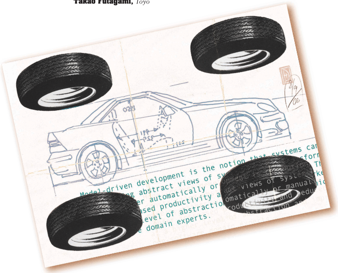
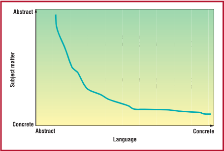

> Converted from [`model-driven-development-guest-editors-introduction.pdf`](model-driven-development-guest-editors-introduction.pdf) with docling. Figures are in [`model-driven-development-guest-editors-introduction-images/`](model-driven-development-guest-editors-introduction-images/). Page numbers for each section are in [`INDEX.md`](../../INDEX.md).

## Model-Driven Development

Stephen J. Mellor,

Anthony N. Clark, King's College London

Takao Futagami, Project Technology Toyo

M

odel-driven development is simply the notion that we can construct a model of a system that we can then transform into the real thing.

By this definition, we are all-right nowmodel-driven  developers.  When  we  write  a program  in  Smalltalk,  Java,  or  C#,  we  don't expect it to execute directly. We expect it to be transformed into the language of some virtual machine that can cause our model to do its job.

But this is not how many developers think about 'models' today. Too often, they equate models with simply drawing picturesremoved from real systems development and needlessly  heavy  on  process.  Before  deconstructing  this  narrow  perception,  let's  take  a deeper look at what a model is and isn't.

## What is a model?

A  model  is  a  coherent  set  of  formal  elements  describing  something  (for  example,  a system, bank, phone, or train) built for some purpose that is amenable to a particular form of analysis, such as

- ■ Communication of ideas between people and machines
- ■ Completeness checking
- ■ Race condition analysis
- ■ Test case generation
- ■ Viability  in  terms  of  indicators  such  as cost and estimation
- ■ Standards
- ■ Transformation into an implementation

Each model addresses some number of subject matters. For example, we could build a bank model, ignoring security and user interface aspects,  or  we  could  model  a  combination  of these domains. We choose which subject matters to include and which to ignore, although we might then need to weave several models together. When a model's subject matter has a high degree of abstraction, the model is closer to  the  eventual  user's  language-that  is,  a smaller gap exists between a noncomputer expert and the model.

Additionally, we express a model in a language that exists at some (language) abstraction level. A model written in the C modeling language will ignore (or 'abstract away') the realization  of  function  calls  and  expressions, leaving CPU-oriented issues such as register allocation  to  the  compiler  or  to  a  virtual  machine interpreter that adds such realizations at runtime.  Similarly,  a  model  expressed  in  the Unified Modeling Language will ignore the realization  of  associations,  leaving  those  decisions to a model compiler or human designer.

Figure 1. A language's abstraction level and the degree of abstraction of the subject matter under study. Start with an abstract problem (for example, a bank) with an abstract modeling language (for example, the Unified Modeling Language) and end with a concrete statement of the solution in a low-level concrete language (for example, Java).

Figure  1  illustrates  these  two  dimensions: the language's abstraction level and the degree of  abstraction  of  the  subject  matter  under study. The subject matter axis has an inverted scale, which leads to a neat curve with analysis models at the top and design models lower down. However, we don't have to migrate in both dimensions at once, and there are plenty of reasons why we shouldn't.

## Help or hindrance?

A  model  need  not  be  complete.  Often,  a graphical  model  excludes  code,  although  it's by  no  means  necessary  now  that  UML  is  a computationally  complete  language.  Moreover,  a  model  has  multiple  views,  some  of which are revealed. For example, we can expose  individual  collaborating  state  machines on a statechart diagram, or we can emphasize their collaborations directly using a sequence diagram.  Clearly,  any  set  of  diagrammatic views must be consistent with the underlying model of which they are projections. Incompleteness and a high degree of abstraction do not equate to imprecision. Not all models are or need to be executable or even formal, but those that are can benefit from automation.

We  use  models  to  increase  productivity.

## TLAs You Need

OMG : The Object Management Group is an international, not-for-profit industrial consortium that creates and maintains software interoperability specifications. The OMG's specifications include the UML modeling notation, XMI (XML metadata interchange), CORBA (common object request broker architecture) middleware, and dozens of domain-specific interoperability specifications in such areas as transportation, life sciences, telecommunications, and manufacturing.

UML: The Unified Modeling Language is an industry standard visual language for modeling software systems. These models capture knowledge about a system at various abstraction levels, ranging from requirements and analysis models to design models. This means that modelers can specify software systems using higher-level domain-oriented concepts that abstract away much of the underlying implementation technology used to realize such systems. UML enables automated tools that interchange and transform models as part of the process and generate a system's implementation artifacts (typically source code and metadata).

MOF : The Meta-Object Facility is OMG's standard for metadata and model management and lies at the heart of MDA. It specifies how to define metamodels (using a UML subset), generate XML schemas for interchange, and generate application programming interfaces for manipulating actual models (for example, UML designs). It is also being extended to specify services for managing models and their elements such as identity, life cycle, versioning, views, and-very importantly for MDAtransformations.

MDA : The Model-Driven Architecture is a set of OMG standards that enables the specification of models and their transformation into other models and complete systems. MDA separates subject matters so that application-oriented models are independently reusable across multiple implementations and vice versa.

PIM : A platform-independent model is a model that contains no reference to the platforms on which it depends. (MDA classifies the relative relationship between two models in terms of the platform , the set of technologies a model assumes to exist.)

PSM: A platform-specific model is the result of weaving a PIM with the platforms on which it depends.

TLA : Three-letter acronym.

It's cheaper to write one line of Java than to write  10  lines  of  assembly  language.  Similarly, or so the argument goes, it's cheaper to build a graphical model in UML, say, than to write  in  Java.  We  pause  now  to  allow  the squirming to abate.

The squirming comes about because others argue that models offer more hindrance than help.  Some proponents of Extreme processes argue  that  a  model  is  often  used  to  mean  a blueprint that acts as an interface between developers. Moreover, they argue that this interface has flaws:

- ■ The  analyst's  concerns  are  not  the  programmer's-so  much  so  that  analysis blueprints are merely advisory, and likely bad advice at that.
- ■ The language in which modelers construct the blueprints is often ill defined and difficult to translate reliably into code.
- ■ The  blueprints  are  out-of-date  before they're even finished.
- ■ Modelers often intend these blueprints to predict the unpredictable-the creative act of inventing abstractions in code.

These arguments are valid to the extent that models  are  transformed  by  passing  through the developer's mind. When models are fully automated-as with executable models (such as  models  constructed  with  a  programming language)-or successively extended by adding content, these arguments become less persuasive.

Furthermore,  model-driven  development offers the potential for automatic transformation of high-level abstract application-subject matter models into running systems. In this issue,  Bran  Selic  ('The  Pragmatics  of  ModelDriven  Software  Development')  argues  that modeling technology has matured to the point where it can offer significant leverage in all aspects of software development. He also argues that,  in  an  increasing  number  of  application areas, you can generate much of the application code directly from models.

Automation  doesn't  remove  the  requirement for creativity. Rather, it formalizes existing solutions and raises the level at which we can apply creativity, thus giving the developer more leverage. In turn, we must now ask how we  can  produce  developers  that  think  at  a level of abstraction above the currently fashionable programming language or technology.

## Models and metamodels

To make automation a reality, models must have  a  defined  meaning,  and  that's  a  loaded topic itself. A language consists of syntax and semantics. The syntax can be human- or machine-centric. Semantics define what the syntax means by linking the syntax to a semantic domain, rather like arithmetic expressions 'mean'  numbers.  Ed  Seidewitz's  article'What  Models  Mean'-tackles  this  tricky topic by relating the meaning of computer system  models  to  how  people  use  models  in mathematics and physics. Conrad Bock, in a short article, 'UML without Pictures,' neatly highlights  the  separation  of  a  modeling  language's meaning from its syntax, which is important  because  developers  must  base  automation  on  a  definition  of  the  language's meaning.

Model-driven  development  automates  the transformation  of  models  from  one  form  to another. We express each model, both source and  target,  in  some  language.  The  target model's language, for example, might define a meaning  for  remote  access  of  objects,  even though the source model's language does not. We must define the two languages somehow, and because modeling is  an  appropriate  formalism to formalize knowledge, we can define a  modeling  language's  syntax  and  semantics by  building  a  model  of  the  modeling  language-a  so-called  metamodel.  (The  Greek word meta means 'after.') For example, the UML standard is written in UML (the UML metamodel),  which  raises  interesting  issues with respect to the precise definition of a language  defined  in  terms  of  itself.  In  'ModelDriven Development: A Metamodeling Foundation,' Colin Atkinson and Thomas Kühne investigate  model-driven  development's  technical foundations and discuss the role of metamodeling in a supporting infrastructure.

## Mapping functions

The  productivity  gains  accrued  by  using models  in  a  defined  modeling  language  pale against  those  accrued  by  defining  mappings between models. Consider the case  in  which an expert designer transforms an application model by applying knowledge of transaction safety and rollback or squeezes an application into an embedded system-on-a-chip. When the inevitable happens and the application is extended  or  the  underlying  technology  is  enhanced, it's difficult to reuse the expert knowledge,  particularly  in  a  consistent  way  across an  integrated  system.  Practically,  that  expert knowledge is lost; more accurately, that knowledge is embedded in code ready for architectural  archeology  by  someone  who  probably 'wouldn't have done it that way!'

Model-driven development captures expert knowledge  as  mapping  functions  that  transform between one model and another. Executing  those  mapping  functions  transforms  one model into another form. Mapping functions capture  expert  knowledge,  so  designers  can reuse it when an application changes or when any  of  the  technologies  the  application  depends  on  change.  This  effectively  decouples the several models so that each can evolve independently, which in turn increases the models' longevity.

Shane  Sendall  and  Wojtek  Kozaczynski ('Model Transformation: The Heart and Soul of  Model-Driven  Software  Development') give  an  overview  of  the  issues  involved  in model  transformation,  and  Robert  France, Sudipto  Ghosh,  Eunjee  Song,  and  Dae-Kyoo Kim ('A Metamodeling Approach to PatternBased  Model  Refactoring')  neatly  illustrate the concept of capturing expert knowledge by describing an approach for model refactoring based  on  patterns.  In  'Model  Metamorphosis,' Torben Weis, Andreas Ulbrich, and Kurt Giehs  describe  a  scheme  for  transforming models  using  a  graphical  modeling  language that veils explicit reference to the metamodels involved.

Conceptual  models  express  requirements that we can then address in engineering models.  These  models  address  the  requirements with commitments about how things get done. Because  conceptual  and  engineering  models address different problem domains, modelers seldom try to relate one to the other. When the modeler  does  make  this  effort-linking  the conceptual  requirement  to  the  engineering means-interesting  things  become  possible. Peter  Denno,  Michelle  Potts  Steves,  Don Libes, and Edward J. Barkmeyer explore this issue in 'Model-Driven Integration Using Existing Models.'

## Agile MDA

Mapping  functions  access models  expressed in a modeling language as defined by its metamodel. We can express all metamodels using  the  OMG  Meta-Object  Facility,  which enables  standard  definitions  for  mapping functions between metamodels. This proposed standard is called QVT. It provides a standard How we can produce developers that think at a level of abstraction above the currently fashionable programming language or technology?

## About the Authors

Stephen J. Mellor is vice president and cofounder of Project Technology, a company focused on tools to execute and translate UML models in the context of Agile MDA. His work focuses on creating effective engineering approaches to software development. He received a BA in computer science from the University of Essex, UK. He's the coauthor of Model-Driven Architecture Distilled (Addison-Wesley, 2004). He is a member of the IEEE Software Industrial Advisory Board. Contact him at steve@projtech.com; www.projtech.com.

Anthony N. Clark is a lecturer in computer science at King's College London. His research interests include designing and implementing languages for system modeling. He received a PhD in computer science from London University. He is a member of the British Computer Society. Contact him at the Dept. of Computer Science, King's College London, Strand, London, UK WC2R 2LS; anclark@dcs.kcl.ac.uk; www.dcs.kcl.ac.uk/staff/anclark.

Takao Futagami is a chief consultant at Toyo. His research interests focus on embedded engineering. He received a bachelor's degree in physics from Tsukuba University. He is a member of the Information Processing Society of Japan. Contact him at Toyo Corp., 1-1-6 Yaesu, Tokyo, Japan; futagami@sonata.plala.or.jp; www.toyo.co.jp/ss.

scheme for querying, viewing, and transforming metamodels represented in OMG MOF.

Successive model transformations provide a basis for mapping between analysis and design  models  that  use  different  metamodels. However, this raises an issue: Mapping functions are inextricably linked to the metamodels that they transform. This could lead-and some  would  argue  that  it  already  has-to metamodel 'silos' that link vertical domains (such as telecommunications) to implementation technologies (such as sophisticated distribution  profiles)  or  Web  services  to  JavaBeans.  This  approach  results  in  models  that are not universal, but instead mix the modeling language (the metamodel) and the subject matter at hand. This is a form of architectural mismatch , a term coined by David Garlan to refer  to  components  that  require  tubes  and tubes  of  glue  code  to  fit  together-the  very problem MDA is intended to avoid!

Figure 1 suggests that we can model subject matters using languages at varying abstraction levels and can use the same language to model domains at different abstraction levels. In other words, it makes sense to model a bank, a security subject matter, a user interface, or even an operating system using the same abstract modeling  language.  Consequently,  mapping  functions will always apply to models expressed in that modeling language, broadening their applicability and increasing their longevity.

Capturing models at a single (high) level of language abstraction requires computationally complete models, which in turn means that we can execute and then translate them to the target software platform. We would express these models using a single executable, translatable formalism  using  several  subsets  of  the  UML notation.  Each  model  would  state  one  fact about its subject matter in just one place, even though it does not (yet) incorporate other required  domains  or  the  mechanisms  actually required to make the model run in its target environment.

This  is  an  agile  form  of  model-driven  development in which each model stands alone, complete, capable of execution and being woven together with other models.

A  more  general  expression  of  the  challenges addressed here is the notion of weaving  models  together.  Each  subject  matter model  captures  a  single  cross-cutting  concern  in  the  system,  called  an aspect in  the programming  world.  Vinay  Kulkarni  and Sreedhar Reddy, in 'Separation of Concerns in  Model-Driven  Development,'  describe  a system that applies these concepts in a modeling environment.

M odel-driven development is still not widespread,  but  the  potential  is large.  A  software  development environment with off-the-shelf models and mapping functions changes the way in which we build systems. Instead of building and rebuilding systems as the application or the technological  infrastructure  changes-an  expensive proposal to be sure-we'll select models, subset or extend them, then weave them together with other models to build the system.

Model-driven development enables reuse at the domain level, increases quality as models are successively improved, reduces costs by using an automated process, and increases software solutions' longevity. In this way, models become assets instead of expenses-quite the business proposition!