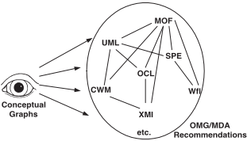
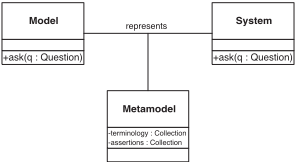
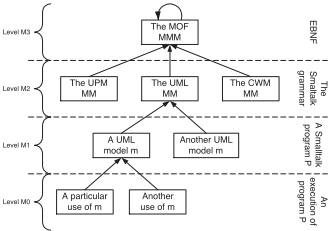
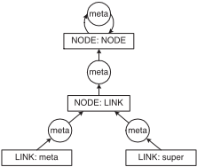
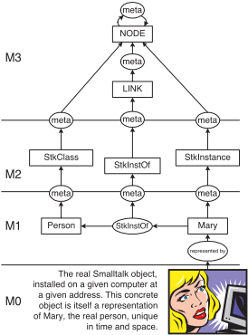
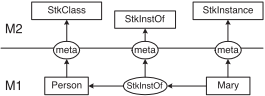
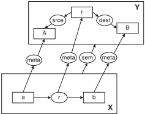
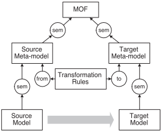

> Converted from [`towards-a-precise-definition-of-the-omg-mda-framework.pdf`](towards-a-precise-definition-of-the-omg-mda-framework.pdf) with docling. Figures are in [`towards-a-precise-definition-of-the-omg-mda-framework-images/`](towards-a-precise-definition-of-the-omg-mda-framework-images/). Page numbers for each section are in [`INDEX.md`](../../INDEX.md).

## Towards a Precise Definition of the OMG/MDA Framework

Jean B´ ezivin LRSG, Universit´ e de Nantes 2, rue de la Houssini` ere, BP 92208 44322 Nantes cedex3, France Jean.Bezivin@sciences.univ-nantes.fr Olivier Gerb´ e HEC - Montr´ eal 3000, chemin de la Cˆ ote-Sainte-Catherine Montr´ eal (Qu´ ebec) Canada H3T 2A7 Olivier.Gerbe@hec.ca

## Abstract

We are currently witnessing an important paradigm shift in information system construction, namely the move from object and component technology to model technology. The object technology revolution has allowed the replacement of the over twenty-year-old step-wise procedural decomposition paradigm with the more fashionable object composition paradigm. Surprisingly, this evolution seems to have triggered another even more radical change, the current trend toward model transformation. A concrete example is the Object Management Group's rapid move from its previous Object Management Architecture vision to the latest Model-Driven Architecture. This paper proposes an interpretation of this evolution through abstract investigation. In order to stay as language-independent as possible, we have employed the neutral formalism of Sowa's conceptual graphs to describe the various situations characterizing this organization. This will allow us to identify potential problems in the proposed modeling framework and suggest some possible solutions.

## 1 Introduction

This paper provides an understanding of the extent and importance of the recent move from object-based to modelbased information system architectures. Our point of departure will be the study of a proposed new vision of the Object ManagementGroup (OMG), called Model Driven Architecture (MDA) [14, 8]. The OMG has proposed a modeling language called UML (Unified Modeling Language [13]) for describing many types of object-oriented software artifacts. The scope of applicability of UML is not yet completely clear. In order to allow other similar languages to be defined as well, the OMG uses a general framework based on the MOF (Meta-Object Facility [12]). Some of the current confusion concerning the application of these conceptual tools may have resulted from the fact that they are selfdefined and mutually dependent, as we shall see later. In order to gain a better understanding of them, this paper will use an external and neutral formalism to describe the situation and identify the problems that may arise. The formalism employed will be Sowa's conceptual graphs [20, 21], chosen for their simplicity and precision.

This paper will focus on the characteristics of new model-centred frameworks. In section 2 we present the formalism of conceptual graphs, and in section 3 we discuss the main characteristics of the OMG/MDA framework, which is replacing the OMA (Object Management Architecture). Section 4 introduces the framework we will use in Section 5 to discuss a number of open questions in applied model engineering, where we try to shed some light on these issues. We conclude by summarizing the original contribution of this work.

## 2 Presentation of Conceptual Graphs

J. Sowa introduced conceptual graphs (CGs) in 1984. They form a coherent system for the graphical representation of logic (existential graphs), and were invented at the beginning of the 20th century by C. S. Pierce [16].

This section presents the formalism of conceptual graphs. Only a minimum explanation is provided as required by the rest of the paper. More information on conceptual graphs can be found in [21, 5], or in the various annual ICCS conferences on the subject.

The fact that the company BricABrac employs John Pendibidu may be described in CGs by the following linear textual description:

[Company: BricABrac] AX (emp) AX [Employee: John Pendibidu]

This can be considered a type of shorthand for the graphical representation provided in Figure 1.

The fact that a company employs an employee may be described by:

[Company:*x] AX (emp) AX [Employee:*y]

Figure 1. Graphical Representation of a Conceptual Graph.


There exists an operator called AU that allows translation of CGs to first order predicate logic. The previous statement may then be rendered as:

<!-- formula-not-decoded -->

where the binary predicate employs corresponds to the relation emp of the previous descriptions. Other research establishing the basis of correspondence between CGs and First Order Predicate Logic may be found in [1].

A conceptual graph is composed of concepts and relations. Concept nodes are organized as a lattice with a corresponding ordering relation. A concept type corresponds to a definition graph, to which any instance of the concept should conform.

The following defines the concept type Employee .

```
Type Employee(x) is [Person:*x] AW (emp) AW [Company:*y]
```

This states that an employee is a person working for a company.

This paper assumes that CGs are the global modeling language used to describe various recommendations of the OMG (Figure 2) including UML, MOF, SPE (Software Process engineering), CWM (Common Warehouse Matadata), Wfl (Workflow), etc. This formalism may be overdimensioned for the task at hand, but we consider this an advantage rather than a shortcoming. In order to describe a situation where standards such as UML or the MOF define themselves as competing modeling languages as well, it is useful to base our work on an independent formalism that has at least equal or, preferably, more expressive power. This is the case for CGs.

Figure 2. MDA Observation With CGs.



## 3 From OMA to MDA

## 3.1 Systems, models and meta-models

The most important word in Model Driven Architecture is model , and we must begin by defining the term. A model is a simplification of a system built with an intended goal in mind (Figure 3). The model should be able to answer questions in place of the actual system. The answers provided by the model should be the same as those given by the system itself, on the condition that questions are within the domain defined by the general goal of the system.

In order to be useful, a model should be easier to use than the original system. To achieve this, many details from the source system are abstracted out, and only a few are implemented in the target model. This simplification (or abstraction) is the essence of modeling. Modeling is one of the most common human activities, as it usually precedes action. When one needs to apply exactly the same modeling operation several times or if it is to be applied by different people, the use of a meta-model is appropriate.

A meta-model is the explicit specification of an abstraction (a simplification). It uses a specific language for expressing this abstraction: CGs, KIF (Knowledge Interchange Format)[10]or MOF are potential candidates for the task. In order to define the abstraction, the meta-model identifies a list of relevant concepts and a list of relevant relationships between these concepts. This is what we refer to as terminology in Figure 3. In some cases this may suffice, but in many situations it needs to be completed by a set of logical assertions. Languages such as KIF are able to express both terminology and assertion layers. With other languages, such as MOF, a specific formalism for the assertions must be added (OCL). Figure 3 illustrates relationships between systems, models and meta-models.

Figure 3. Relations Between a System and a Model.



A meta-model defines a set of concepts and the relations between these concepts and is used as an abstraction filter in a particular modeling activity. The notion of the metamodel is strongly related to the notion of ontology [15], used in knowledge representation communities. We can extract a particular model from a system by using a specific meta-model or ontology.

Different models of the same system can be observed and manipulated, and each one can be represented by a different meta-model. Obviously several models that have been extracted from the same system using different meta-models will remain related. Other operations on models are also possible, and for the most part they are based on transformation operations. In order to transform them we require that models and composite models (models composed of several models), including corresponding meta-models, are organized in a regular manner.

Before proposing such an organization, we need to acquire a deeper understanding of the relationship between a model and its meta-model. More precisely, what is the nature of the information contained in a meta-model and what role is played by a meta-model?

## 3.2 Meta-modeling layers

Since the definition of UML, we have seen a new wave of proposals at the OMG, evidence of a new era and a new vision. At the centre of this evolution is the MOF, a unique and self-defined meta-meta-model. The concept of a MOF has emerged progressively over the last ten years in the work of different communities like CDIF [6, 9] and IRDS [17]. It acts as a framework to define and use meta-models [11, 7]. The need for MOF resulted from the fact that UML was only one of the meta-models in the software development landscape. Because of the risk posed by the presence of a variety of different, incompatible meta-models being defined and evolving independently (data warehouse, workflow, software process, etc.), there was an urgent need for a global integration framework for all the meta-models in the software development industry. The solution was therefore a language for defining meta-models, i.e. a meta-metamodel. This is the role of the MOF. As a consequence, a layered architecture has now been defined.

This layered architecture has the following levels.

- AF M3: the meta-meta-model level (contains only the MOF)
- AF M2: the meta-model level (contains any kind of metamodel, including the UML meta-model)
- AF M1: the model level (any model with a corresponding meta-model from M2).
- AF M0: the concrete level (any real situation, unique in space and time, represented by a given model from M1).

A parallel may be drawn with formal programming languages (see the right side of Figure 4). Level M3 corresponds to the meta-grammar level (for example, EBNF notation), level M2 corresponds to the grammar level, and level M1 corresponds to the program level. Level M0 corresponds to one given dynamic execution of a program, but it is unrelated to modeling (it does not contain model elements, but rather real or imaginary situational items and facts). A given execution of a program at level M0 is not itself a model; it is depicted by a model (the source code of the program that describes the infinite number of different executions of the program). Exactly the same situation exists in the four OMG meta-modeling layers.

Figure 4. Several Spaces, Pertaining to Different Levels.



## 4 A Framework for Understanding MDA

This section presents the framework used to illustrate our understanding of MDA. To define our framework, we will draw on the conceptual graph formalism introduced in Section 2.

The framework is presented in Figure 5. It is based on the MOF, and concepts have been renamed to clarify the description and avoid the using of the same vocabulary in describing the vocabulary itself. We will call NODE the MOF::Class and LINK the MOF::Association . These notions, used in the MOF at level M3, apply to everything located at level M3 or below. The MOF::Specialize relationship is represented by the super relation. Although not directly present in the MOF, we have also made explicit an instantiation relation called meta , for sake of clarity.

Using the linear form of the conceptual graph, the framework of Figure 5 may be expressed as follows:

```
[NODE:NODE] AX (meta) AX [NODE:NODE] [NODE:LINK] AX (meta) AX [NODE:NODE] [LINK:meta] AX (meta) AX [NODE:LINK]
```

Figure 5. Our Framework.



[LINK:super] AX (meta) AX [NODE:LINK]

The NODE concept is an 'instance' of itself. The LINK concept is an 'instance' of NODE and meta and super concepts are 'instances' of LINK . It is immediately apparent that the notation of concepts in CGs is a shortcut to stating that an element is an 'instance' of another element, as in [LINK:super] , which states that super is an instance of LINK .

The framework is taking shape but is still incomplete. One particular element that is missing is what we will call a CONTEXT , which corresponds to a MOF::Package and is similar in some ways to a CG context. The three contexts underlying the framework, MODEL , METAMODEL and METAMETAMODEL , are not represented in the drawing. They are, however, real entities.

```
[NODE:CONTEXT] AX (meta) AX [NODE:NODE] [NODE:MODEL] AX (meta) AX [NODE:CONTEXT] [NODE:METAMODEL] AX (meta) AX [NODE:CONTEXT] [NODE:METAMETAMODEL] AX (meta) AX [NODE:CONTEXT]
```

Figure 6, which provides a complete representation of the framework from level M3 to level M0, provides a better understanding of how the framework is used. At level M1 of a given model corresponding to a particular Smalltalk program, the Smalltalk object Mary is an instance (in the sense of the Smalltalk language) of the Smalltalk class Person . In the upper layer (level M2), we find elements of the Smalltalk meta-model, namely the concepts of Instance and Class and the relation instance, StkInstOf, between Class and Instance.

As will be seen in the next section, this example will prove useful when we address questions concerning the organization of models and meta-models.

## 5 Some Central Issues in Model Engineering

Now that the OMG approach has been at least partially described, we can begin discussing its strengths and the potential problems that remain. A significant amount of literature exists concerning modeling layers: How many layers do we need? May we have more than four layers? Is there a fundamental difference between a model and a meta-model, or between a meta-model and a meta-meta-model? Can a model specialize another model? Can a meta-model specialize another meta-model? etc. We do not intend to address all these questions, only highlight some aspects of the overall model organization problem.

Figure 6. A Complete Picture.



We have seen that meta-models are found at level M2. In order to avoid possible confusion and better illustrate basic principles, we will consider a Smalltalk meta-model rather than the classical example of the UML meta-model. Java or C# would have served our purposes just as well.

## 5.1 The double instantiation problem

One of the topics currently generating a great deal of discussion is the double instantiation problem [3]. Is it possible for an entity to be, at the same time, an instance of several classes? In other words, considering Figure 7, should the answer to the question 'Who is Mary?' be 'Mary is a person', 'Mary is a Smalltalk instance', or both? A quick look at Figure 7 is sufficient to conclude that this is not an issue.

This situation could be described in the CG linear form as follows:

```
[NODE:StkInstance] AX (meta) AX [NODE:NODE] [NODE:StkClass] AX (meta) AX [NODE:NODE] [NODE:StkInstOf] AX (meta) AX [NODE:LINK]
```

```
[NODE:Person] AX (meta) AX [NODE:StkClass] [LINK:StkInstOf] AX (meta) AX [NODE:StkInstOf] [NODE:Mary] AX (meta) AX [NODE:StkInstance] [NODE:Mary] AX (StkInstOf) AX [NODE:Person]
```

There are two types of definitions of Mary here: local (contextual) and global. The global definition ('Mary is a Smalltalk instance') uses the underlying global typing system of the MOF, whereas the local definition ('Mary is a Person') relies on the context of the defining Smalltalk meta-model. There is no ambiguity. If we were using the UML meta-model instead of the Smalltalk meta-model, Mary could be a Person in this context, Person being a UMLclass.

Figure 7. The Difference Between a Contextual and a Global Definition.



It is clear that there can be many local instanceOf relations. These should not be confused with the unique and global type/instance relation that we have named meta and which corresponds to the MOF typing hierarchy. In Figure 6 we have presented a fragment of a Smalltalk model (i.e. program) at level M1. This model is constrained by the Smalltalk meta-model at level M2. This is clearly a simplification of the situation. In order to pursue this example further, we could have noted that the Smalltalk language allows dealing explicitly with meta-classes and therefore added the following element:

```
[NODE:StkMetaClass] AX (meta) AX [NODE:NODE] [NODE:Person] AX (StkInstOf) AX [NODE:Person class]
```

Notice that this new statement in the meta-model requires a definition of the notion of meta-class (StkMetaClass) in the Smalltalk meta-model. The statement above demonstrates, however, that the relation between a class and its meta-class is identical to the relation between an instance and its class ( StkInstOf ).

It is of paramount importance that this relation StkInstOf does not cross the hypothetical boundary between layer M1 and M0. If this were not the case, the result would be an arbitrary number of levels, as the relation between the Smalltalk class Person and the Smalltalk meta-class Person Class would cross another boundary between metamodeling layers.

## 5.2 Explicit specification

Again, our example as illustrated in Figure 6 is very limited. We could have also included another Smalltalk class named AnimatedBeing , and made Person inherit of AnimatedBeing in the Smalltalk sense.

```
[NODE:Person] AX (StkInherits) AX [NODE:AnimatedBeing] [NODE:AnimatedBeing] AX (StkInstOf) AX [NODE:AnimatedBeing class]
```

The point here is that the relation StkInherits represents the Smalltalk language inheritance relation. There are many such relations in various environments, and they are all different from each other, in spite of their similarities. If we were in a Java environment, we would call this relation JavaExtends , and show how it would apply (in a different way) to notions of JavaClass and JavaInterfaces . There are many similar but different local inheritance (also specialization, generalization, or extension) relationships. These should not be confused with each other. Moreover, they should not be confused with a global specialization relation similar to the MOF::Specialize relation defined at level M3, here named super . Creating all these different relations improves the precision of the various models. This appears necessary if we want to avoid confusion.

As demonstrated above, there is a great deal to be gained from a precise and explicit definition of a meta-model[4]. For example, for any Smalltalk class, 'the super-class of its meta-class is the meta-class of its super-class' could be written in CGs. Such an assertion could also be added to the Smalltalk meta-model in OCL.

## 5.3 Relationships between a model and a metamodel

Models and meta-models are different kinds of contexts. They delimit local spaces in the global knowledge context. The basic property of these spaces is that no overlapping is allowed. Embedding is possible, however, as a context may contain any element, including another context.

Figure 8 illustrates relationships between a given model X and its meta-model Y. Let us consider model X containing entities a and b . There exists one (and only one) meta-model Y defining the 'semantics' of X . The relationship between a model and its meta-model (or between a meta-model and its meta-meta-model) is called the sem relationship.

The significance of the sem relationship is as follows. All entities of model X fi nd their definition in meta-model Y . Relationships meta and sem are mutually related. If an entity of model X has a meta relationship with an entity of meta-model Y , then X and Y are linked by a sem relationship.

Figure 8. Fundamental Relations Between a Space X and a Meta-Space Y.



The situation illustrated in Figure 8 may be stated in CGs with the following assertions.

```
[NODE:X] AX (meta) AX [NODE:MODEL] [NODE:Y] AX (meta) AX [NODE:METAMODEL] [NODE:X] AX (sem) AX [NODE:Y] [NODE:r] AX (srce) AX [A] [NODE:r] AX (dest) AX [NODE:B] [LINK:r] AX (meta) AX [NODE:r] [NODE:a] AX (meta) AX [NODE:A] [NODE:b] AX (meta) AX [NODE:B] [NODE:a] AX (r) AX [NODE:b]
```

The meta relation may be considered global and basic. The sem relation is derived from the meta relation. It indicates at which level a space stands; if it is at level M1 it is a model, if at level M2 it is a meta-model and if it stands at level M3 it is a meta-meta-model. Relationships meta and sem are inherently different. The approach known as loose metamodeling considers these relations identical. The loose approach creates many problems and is more and more frequently replaced by the strict meta-modeling approach [2].

It is clear that there are many reasons to avoid stating that 'a model is an instance of a meta-model because its elements are instances of meta-model elements'. It is also clear that the following assertion cannot be made:

```
[MODEL:X] AX (meta) AX [METAMODEL:Y] because it was previously stated that: [MODEL:X] AX (meta) AX [NODE:MODEL]
```

The relationship meta is unique in the sense that, in the global context, a node may have one and only one metanode, as seen in Section 5.1.

## 5.4 What is a layer?

The global modeling context is therefore composed of three kinds of local spaces: model, meta-model and metameta-model.

With respect to developing meta-modeling layers, there are many ways to approach the problem. Some of these have already been introduced.

- AF There is a long tradition of using a layered architecture in information systems (e.g. IRDS) and CASE tools engineering (e.g. CDIF). Many independent efforts have converged toward similar architectures.
- AF It is possible to establish analogies with other domains; for example, formal grammars for programming languages.
- AF The decomposition is a natural one, i.e. layer M3 is universal for the entire information systems/software engineering field. Any feature that could be useful to all meta-models should be at level M3. There is no absolute means of distinguishing between a model and a meta-model; this problem is one of point of view and corresponds to the precise task performed. It should be taken as an additional argument for maintaining a clear separation between layers M1, M2 and M3.

In addition to these arguments, it is possible to establish a formal characterization of the notion of a meta-modeling layer. The basis for this is the sem relation presented in Figure 8. The contexts related by the sem relation form a hierarchy, where the context at the top is the only one that is self-defined:

```
[UNIVERSE] AX (sem) AX [UNIVERSE]
```

The context UNIVERSE is the MOF in our MDA organization. This allows a deduction of which contexts lie at level M2 and which lie at level M1, given their distance to the MOF measured by the sem relation. The relationship is actually a bit more complex than described above, because we need to take into account variants of meta-models (discussed below). It is possible, however, to establish a formal characterization of the sem relation in terms of the meta relation and of the layer the context belongs to. This has been discussed in [19], where the three-layers conjecture has been demonstrated.

## 5.5 What is a transformation?

At the heart of the MDA approach is the question of model transformation. For example, the designer and programmer would be given profiles, UML for CORBA or UML for C++, and then, with the help of some limited facilities provided by the UML CASE tool vendors, use these dialects of UML to prepare the transformation between a UMLdesign model and IDL or C++ code.

In fact, the potential applications are based in more general approaches currently under study in many different contexts. For example, a typical proposal has been made in [18]. If we were to consider two meta-models, the source model could be UML and the target model could be Java or, more realistically, the EJB meta-model. The transformation from a UML model to EJB code may be specified by a set of rules defined in terms of the corresponding meta-models. The expression of these rules is facilitated if a basic generic framework is present in the MOF. Suggestions for building this framework may be found in the CWM meta-model. The transformation engine itself may be built on any technology, such as the XSLT tools.

When studying Figure 9 raises questions concerning the status of the Transformation Rules Context. Does it also have the status of a meta-model? Should it use basic facilities (transformation primitives) provided by the MOF? These are typical questions that remain open in the definition of a MDA framework.

Figure 9. Meta-Model Based Model Transformation.



## 6 Conclusion

Within many environments like the OMG, meta-model technologies are now becoming 'ready for prime time'. The move from procedural technology to object technology has triggered a more radical change how we think about information systems and software engineering. Model engineering has significant potential as an avenue of research. It consists of bestowing first-class status on models and model elements, similarly to the first class status given to objects and classes in the 1980's, the beginning of the object technology era. Two important areas of interest are models of software components and models of software processes. The move from the implicit to the explicit is characteristic of model engineering. The fundamental change is that models are no longer used only for documentation, but can be directly used to drive tool development. This principle is at the core of the new MDA organization proposed by the OMG. One of the consequences is that it will be possible to better separate the various business models from the many technical models (platforms).

The correspondence between meta-models and formal grammars could and should be pursued much further than it has been possible to do here. It is clear that there are many similarities between them. The notions of a terminal and a non terminal exist in the formal grammar of the Java language as well as in the UML meta-model.

This paper has shown that the notion of a modeling layer is quite different from the notion of an abstraction layer. The evidence for this is the precise kind of relation existing between two adjacent layers. We have proposed a strict interpretation of these layers, where there are exactly three modeling layers. Our interpretation is based on the fact that the so-called fourth layer is not a model, but is itself a system (the situation being modeled). As a consequence, the relation between an element of a system at level M0 and an element at level M1 may be given any name, such as representedBy , but cannot be named instanceOf .

Our interpretation of the layered meta-modeling architecture does not correspond to the conventional view, but does not contradict it, either. It has many advantages, one of them being closure on the debate over the variable number of meta-modeling layers. As is clearly shown in Figure 7, a new layer is not created whenever a relation instanceOf is found.

Another contribution of this work has been that a clear distinction has been drawn between a unique global typing relation, here called meta and defined at level M3, and many other contextual relations, often called instanceOf and usually defined inside various meta-models. The confusion between all these typing relations has also created many doubts about the organization of meta-modeling layers.

Among the inherent problems that remain to be discussed and solved, we would like to mention profiles, the creation of precise definitions of a meta-model profile, a model profile and even a meta-meta-model profile.

## 7 Acknowledgements

Many issues presented here have benefited from discussions and work done with Richard Lemesle and Erwan Breton. Mikael Peltier has provided much insight on the implementation of meta-model driven model transformation.Valuable suggestions for improving this paper have been made by Mariano Belaunde, Guy Genilloud, Joaquin Miller and Thomas Kuehne.

## References

- [1] G. Amati and I. Ounis. Conceptual Graphs and First Order Logic. The Computer Journal , 43(1), 2000.
- [2] C. Atkinson. Supporting and Applying the UML Conceptual Framework. In J. B´ ezivin and P. A. Muller, editors, Proceedings of UML'98, Beyond the Notation , Mulhouse, France, 1998. Springer Verlag. LNCS 1618.
- [3] C. Atkinson and T. K¨ uhne. The Essence of Multilevel Metamodeling. In Proceedings of UML'2001 Conference on Modeling Languages, Concepts and Tools , Toronto, Ontario, Canada, October 1-5 2001.
- [4] M. Belaunde. A Standalone Metamodel for Expressing Model Relationships. 2001. Available at http://universalis.elibel.tm.fr/publications/ RelationshipMetamodelV02.pdf.
- [5] M. Chein and M.L. Mugnier. Conceptual Graphs: Fundamental Notions. Revue d'intelligence artificielle , 6(4):365-406, 1992.
- [6] CDIF Technical Committee. CDIF: Case Data Interchange Format, Framework for Modeling and Extensibility . Electronics Industry Associate, 1994. Interim Standard EIA/IS-107.
- [7] S. Crawley, S. Davis, J. Indulska, S. McBride, and K. Raymond. Meta-Meta is Better-Better. October 1997.
- [8] D. DSouza. OMG's MDA, An Architecture for Modeling , 2001. OMG document available at http://www.omg.org/mda/presentations.htm.
- [9] J. Ernst. Introduction to CDIF , 1997. Available at www.metamodel.com.
- [10] M. Genesereth. Knowledge Interchange Format - draft proposed American National Standard (dpANS) NCTIS.T2/98-004 , 1998. Available at http://logic.stanford.edu/kif/kif.html.
- [11] O. Gerb´ e and B. Kerherv´ e. Modeling and Metamodeling Requirements for Knowledge Management. In J. B´ ezivin, J. Ernst, and W. Pidcock, editors, Proceedings of OOPSLA Workshop on Model Engineering with CDIF , Vancouver, Canada, October 1998.
- [12] Object Management Group. Meta Object Facility (MOF) Specification , 1997. OMG Document AD/9708-14.
- [13] Object Management Group. Unified Modeling Language Specification , 1999. OMG Document AD/9906-08.
- [14] Object Management Group and R. Soley. ModelDriven Architecture , 2000. OMG document available at www.omg.org.
- [15] N. Guarino and C. Welty. Towards a methodology for ontology based model engineering. In International Workshop on Model Engineering (in conjunction with ECOOP'2000) , Nice / Sophia Antipolis, France, June 2000. Available at http://www.metamodel.com/IWME00/program.html.
- [16] N. Houser, D. Roberts, and J. Van Evra. Studies in the Logic of Charles Sanders Peirce . Indiana University Press, 1997.
- [17] ANSI IRDS. Conceptual Schema and Modeling Language Analysis , 1993. Technical Report X3H4/93196.
- [18] R. Lemesle. Transformation Rules Based on Metamodeling. In Proceedings of EDOC'98 , pages 113122, La Jolla, CA, November 1998.
- [19] R. Lemesle. Techniques de mod´ elisation et de m´ etamod´ elisation . PhD thesis, Universit´ e de Nantes, 2000.
- [20] J. Sowa. Conceptual Structure: Information Processing in Mind and Machine . Addison-Wesley, 1984.
- [21] J. Sowa. Knowledge Representation : Logical, Philosophical, and Computational Foundations . BrooksCole, 2000.