> Converted from [`a-tutorial-on-metamodelling-for-grammar-researchers.pdf`](a-tutorial-on-metamodelling-for-grammar-researchers.pdf) with docling. Figures are in [`a-tutorial-on-metamodelling-for-grammar-researchers-images/`](a-tutorial-on-metamodelling-for-grammar-researchers-images/). Page numbers for each section are in [`INDEX.md`](../../INDEX.md).


Contents lists available at ScienceDirect

## Science of Computer Programming

www.elsevier.com/locate/scico

## A tutorial on metamodelling for grammar researchers

Richard F. Paige ∗ , Dimitrios S. Kolovos, Fiona A.C. Polack

Department of Computer Science, University of York, Deramore Lane, York, YO10 5GH, United Kingdom

## h i g h l i g h t s

- We provide a tutorial introduction to metamodelling.
- We examine three distinctive examples of metamodelling.
- We compare metamodelling with basic grammar technology.

## a r t i c l e i n f o

## a b s t r a c t

Article history:

Received

22 March 2013

Received in revised form 20 March 2014

Accepted

5 May 2014

Available online

28 May 2014

Metamodelling

Keywords: Models Grammars Bridges

Unification

## 1. Introduction

Grammarware is the collection of grammars and grammar-aware theories and software [23]. The definition is very broad, and includes context-free grammars, graph grammars, XML schemas, class dictionaries and other techniques. In this paper, we restrict our focus to a subset of grammarware techniques - those that exploit context-free grammars (e.g., Backus-Naur Form, traditional parsing and semantic analysis techniques); these should be familiar to a significant number of readers Modelware , by contrast, is the collection of models, metamodels, model-aware theories and software systems. At the heart of modelware - influencing its theories, practices, tools and applications - is metamodelling. This paper provides an introduction to metamodelling for grammar researchers, focusing on traditional grammar technologies like context-free grammars and parsers. Our specific focus is on how metamodelling is used for language engineering , e.g., for implementing editors and analysis tools for domain-specific languages, general-purpose languages, etc. We assume that such researchers are comfortable and experienced with defining and implementing grammars (e.g., using Extended Backus-Naur Form (EBNF)), parser generator tools, and grammar-based manipulation of languages (e.g., for compilation, analysis, extraction and comparison); advanced grammar-based techniques (such as graph grammars and attribute grammars) are out of scope for comparison

* Corresponding author. E-mail addresses: richard.paige@york.ac.uk (R.F. Paige), dimitris.kolovos@york.ac.uk (D.S. Kolovos), fi ona.polack@york.ac.uk (F.A.C. Polack).

A metamodel has been defined as: a model of a model; a definition of a language; a description of abstract syntax; and a description of a domain. Because of these varied definitions, it is difficult to explain why metamodels are constructed, what can be done with them, and how they are built. This tutorial introduces the key concepts, terminology and philosophy behind metamodelling, focusing on its use for language engineering , and expressed in a way that is intended to be accessible to researchers who may be more familiar with the use of traditional context-free grammar techniques. We highlight the main differences between metamodelling and grammar-based approaches, describe how to map metamodelling concepts and techniques to grammar concepts and techniques, and highlight some of the strengths and weaknesses of metamodelling via a set of small, but realistic examples.

© 2014 Elsevier B.V. All rights reserved.

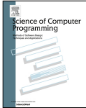


and consideration in this paper. We also assume that these researchers have little or no experience with metamodelling, but are interested in the terminology relevant to metamodelling, how metamodelling is done, and what can be done with metamodels. Such researchers may be motivated to fi nd ways to explain their research to modellers, and may seek to better understand modelling research.

The entry barrier to metamodelling can be high, not least because of the cumbersome terminology, and an absence of standard definitions. In this tutorial, we aim to lower the entry barrier to metamodelling, by building on essential knowledge of grammars.

We start the tutorial in Section 2 with some basic definitions, illustrated with very small examples of metamodels, constructed in different languages, that will hopefully be accessible and reasonably familiar to grammar researchers. In Section 3 we discuss the different motivations that exist for constructing metamodels, and suggest a number of activities and tasks that are possible once metamodels have been constructed and implemented. We also explain a typical metamodelling process, which will help to clarify some of the key differences between metamodelling and grammar-based approaches to language design. In Section 4, we compare metamodelling and grammars in some detail, in terms of some basic terminology, key conceptual differences, and the strengths and weaknesses of modelware and grammarware. We also briefly explain how to map key concepts from modelware to grammarware, focusing on the technical level (i.e., how implementation concepts from metamodelling can be encoded as grammar concepts). Finally, in Section 5, we present three examples that apply the metamodelling process, showing the construction of metamodels, and illustrating how they may be used to solve a selection of problems.

This paper is a substantially extended and thoroughly revised version of a tutorial that was fi rst presented in [28]. Besides being a complete revision of the text from that paper, additional material includes a simple comparison of metamodelling and grammar concepts and techniques, a mapping from metamodel concepts to grammar concepts, and an additional detailed example shows the use of metamodelling techniques in the complex systems domain.

## 2. Definitions and examples

To understand what is a metamodel, and to define it precisely, it is convenient to fi rst define model . We take a broad interpretation of the term, as captured in the following definition.

Definition. A model is a formal description of phenomena of interest, constructed for a specific purpose, and amenable to manipulation by automated tools.

Let us consider each part in turn. Descriptions (used in the sense of Jackson [22]) are fundamental in software and systems engineering; a formal description is made according to rules that have been specified, and that can be checked against. A model abstracts from the real world; as such, some phenomena are considered to be in-scope, and others are out-of-scope. Descriptions are also externalised (i.e., they are not mental models, or what are sometimes called representations ) and can be exchanged and shared between stakeholders. Many different descriptions can be constructed of the same phenomena; it is important to understand the purpose to which the description will be put. For example, an operational model of sensor behaviour may be appropriate for simulation or exhaustive state exploration, but it would be inconvenient for proof of certain properties (because an operational model may lead to a very large state space in, e.g., a model checker). Finally, the manipulation of models by automated tools encompasses automatable model management tasks such as model transformation, comparison or validation. Models can thus be of phenomena related to, for example, systems or software engineering, or experimental science, or other problems.

Given a model, when is it valid? For example, given a fi nite state machine diagram, how can we determine if it is a valid diagram? Parts of the model validation problem are conceptually identical to the problem of determining whether a sentence is valid according to a grammar. For a fi nite state machine diagram we would want to ensure that only valid symbols (rounded rectangles, arrows, labels) are used, and that only states are connected by transitions (for example). We need an equivalent to a grammar, for models; the equivalent is, at least informally, a metamodel (though as we shall see, metamodels can express simple validity properties that go beyond those expressible using BNF).

Many definitions have been provided of the term metamodel. Among key literature in the area are Bézivin's papers on software modernisation [2] and On the Unification Power of Models [3]; and Atkinson and Kühne's Model-Driven Development: a Metamodelling Foundation [1]. The Object Management Group (OMG) has published numerous metamodel-related standards, including its MDA Foundation Model [12] which includes the OMG definitions of metamodelling. As yet, there is no expert consensus on a precise definition of metamodel, and differences in terminology across the definitions promote confusion.

Since our purpose is to lower the entry barrier to metamodelling, we adopt a simple definition, which is compatible with other researchers' definitions, but expressed in an unambiguous way.

Definition. A metamodel is a description of the abstract syntax of a language, capturing its concepts and relationships, using modelling infrastructure.

A language may be general-purpose (e.g., UML, SysML) or it may be domain-specific (e.g., for computer forensics [30]) - the latter we term domain-specific languages (DSLs). Both types of languages (for software or systems engineering) have an

```
class CITIZEN inherit PERSON feature ANY spouse: CITIZEN children, parents: SET[CITIZEN] single: BOOLEAN is do Result := (spouse = Void) end feature {BIG_GOVERNMENT} divorce is require not single do .. end ensure single and ( old spouse).single invariant single or spouse.spouse = Current ; parents.count <= 2 end -- CITIZEN
```

Listing 1: Fragment of an Eiffel program.

abstract syntax, a concrete syntax, and a semantics. A description of abstract syntax is a formal expression of concepts and relationships that is amenable to processing by software. The concepts captured in a metamodel are the important terms that the language is defined to express. The relationships defines how concepts can be combined to produce meaningful expressions in the language. It is worth noting that abstract syntax in the modelling world is subtly different from abstract syntax used in the grammar community. In particular, a metamodel is regularly used to capture relationships between properties of concepts (e.g., simple type rules, or what is sometimes called elements of static semantics ), whereas in grammars these are typically expressed via, e.g., scope rules, in a way that is orthogonal to the abstract syntax. We will see metamodelling examples of this shortly.

Modelling infrastructure is an important element of the definition; without it, there would be little difference between a metamodel and a grammar. The modelling infrastructure supports the unification principle of metamodelling: that models and metamodels (and indeed operations upon each) are treated uniformly. In other words, metamodels are also models ; this is likely not surprising for grammar researchers (where grammars for EBNF are also grammars) - however, all modelling infrastructure (e.g., Ecore, MOF) implements this unification principle, and it underpins all widely used modelling tools. Implementations of the unification principle for grammars are - likely for accidental reasons - not as common, nor as frequently used: typically, each EBNF/context-free grammar tool implements its own syntax for writing grammars.

Any machine-processable language, textual or visual, can be given a metamodel. Let's look at two small examples.

## 2.1. Example 1: a metamodel for Eiffel (a textual language)

Consider, fi rstly, Listing 1, which is a part of an object-oriented program written in the Eiffel language [26]. An EBNF grammar for Eiffel can be found in Eiffel reference books, and the Eiffel compiler implements parsing algorithms for Eiffel. However, if we identify a suitable metamodelling infrastructure, we can also define a metamodel for Eiffel, describing the important concepts and relationships of Eiffel programs.

For now, it is sufficient to assume that the 'metamodelling infrastructure' is some technology that allows entities (holding data) to be precisely defined, related and instantiated. Thus, for example, an object-oriented programming language might suffice as the metamodelling infrastructure in which to describe Eiffel (this is not completely correct; we clarify this shortly). The metamodel uses the semantics of the metamodelling infrastructure, a form of referential semantics for the concepts and logic of the languages defined by the metamodel. In this example, the metamodel for Eiffel is described in Java. Listing 2 gives part of the metamodel, focusing on Eiffel classes and features (operations and attributes), invariants and parents.

What do these Java classes describe? The fi rst describes an entity (called EIFFEL\_CLASS ) that consists of several public fields. Each fi eld is a List . The fi rst fi eld of this class describes the features of EIFFEL\_CLASS (the Eiffel attributes and operations), the second the invariants , and the third the parent classes. The generic parameters of the Lists are important, and are key parts of the metamodel: they represent descriptions of other important entities in the metamodel, viz., EIFFEL\_FEATURE and EIFFEL\_INVARIANT s. Note that EIFFEL\_INVARIANT encodes the concepts and relationships of Eiffel invariants, particularly their abstract syntax; an evaluation function would be needed to evaluate the invariant on an object state.

It is useful to observe that EIFFEL\_CLASS abstracts from the order in which features, invariants, and parents appear in an instance - that is, invariants, feature declarations and inheritance clauses can be interleaved. For example, a valid instance of EIFFEL\_CLASS might fi rst define a procedure, then an invariant, and then an inheritance clause. This is not quite valid Eiffel (according to [26]) because inheritance clauses must appear before any feature declarations, and invariants must appear after feature declarations. We could capture these additional conditions using, for example, well-formedness constraints; our next example illustrates how to use such constraints.

```
class EIFFEL_CLASS { public List<EIFFEL_FEATURE> features; public List<EIFFEL_INVARIANT> invariants; public List<EIFFEL_CLASS> parents; } class EIFFEL_FEATURE { public String name; public EIFFEL_TYPE feature_type; }
```

Listing 2: Part of an Eiffel metamodel specified in Java.

Fig. 1. A simple ER diagram metamodel specified in UML.

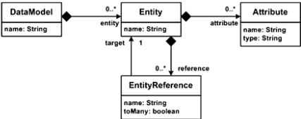

Class EIFFEL\_FEATURE is partially described: each Eiffel feature has a name and an EIFFEL\_TYPE ; a more elaborate metamodel for Eiffel features would perhaps distinguish operations (which may be procedures that change object state, or functions that are side-effect free, optionally with parameters) from attributes. Such a metamodel can be found in [27], expressed in a variety of different styles.

The Java program in Listing 2 is a description of what is generally referred to as the abstract syntax of parts of the Eiffel language.

Describing the abstract syntax is the fi rst step in a metamodelling process that leads to the development of a rich modelling language and editor toolset, with, for example, semantics, model editing support and interoperability with other languages. In practice, in modelware, describing abstract syntax is often the only step taken. We present a metamodelling process later.

Why might we want to create a metamodel for Eiffel? After all, Eiffel already has widely accepted grammars/EBNF, with parsers. Among reasons for creating a metamodel are the enabling of the use of model management technology and tools (e.g., for model refactoring or model merging), and interoperation between existing Eiffel grammar-based tools and model management tools. Other motivations are discussed later.

## 2.2. Example 2: metamodel for ER diagrams (a visual language)

Our second example is a metamodel for a visual language. When working with databases, we construct data models. A simple data model consists of a number of entities containing attributes, as well as references to other entities. Data models can be expressed in some form of entity-relationship (ER) diagrams. Here, the modelling infrastructure used to express the metamodel is UML [14].

Fig. 1 gives an example of a metamodel for part of a simple ER diagram language. The metamodel diagram describes the concepts: DataModel , Entity , Attribute and EntityReference . Each concept has a number of attributes, particularly ones describing name s of concepts. The concepts are also related: in particular, a DataModel is composed of zero or more Entity concepts, and an Entity is, in turn, composed of a number of Attribute concepts. The EntityReference concept is a little different, in that it refers to exactly one Entity concept (the arrow without a diamond, pointing at Entity ). The relationship from Entity to EntityReference uses a solid diamond (composition), meaning that if an entity is removed or deleted from a model, so too are its entity references; in contrast, if an entity reference is removed, the entities to which it applies are not eliminated. This is a typical behaviour of a simple ER diagram editing tool.

Once again, this metamodel captures the abstract syntax of a language; it says nothing about the concrete syntax or the semantics that the end-users of the ER language might apply. By decoupling the definition of abstract and concrete syntax, we potentially allow ourselves fl exibility in designing and deploying different concrete syntaxes (e.g., a visual syntax and a textual syntax) that conform to the abstract syntax. However, modelling needs more than this to be useful.

There is an important point to note about the example metamodel shown in Fig. 1: it allows models to be instantiated that are not desired. Consider the Entity concept, which has a name fi eld. When we construct an ER diagram, we populate it with a number of entities, each of which are instances of the Entity concept. Each of these entities must have a name.

context DataModel inv

:

self .entity - &gt;collect(name) - &gt;asSet().size() = self.entity.size()

## Listing 3: OCL well-formedness rule.

However, there is nothing in the metamodel shown in Fig. 1 that requires entities to have unique names, nothing to prevent us from using the same name for every entity. If we wish to enforce unique entity naming in the metamodel and language definition, we need to augment the description of abstract syntax with well-formedness rules - constraints on the metamodel that prevent ill-formed models from being constructed. If we were using Java to express a metamodel, we could write a simple method that traverses the Lists of concepts to ensure that all entities have a unique name. When using UML concrete syntax to express a metamodel, we typically use the OMG standard Object Constraint Language (OCL) for this purpose. An example of an OCL constraint for this metamodel is shown in Listing 3. It states that, in the context of any DataModel , names of entities must be unique (there are a number of different ways to express this).

In grammar terms, such a well-formedness rule corresponds to a static semantics. It is perhaps noteworthy that some static semantic rules in metamodelling can be captured using metamodelling infrastructure (and not a constraint language like OCL) directly, e.g., multiplicity constraints on references, whereas with traditional context-free grammars such rules are out of scope (and would be captured using attributes or other means).

## 2.3. Mathematical definitions

A mathematical definition of metamodel appears in [4]; we restate it (slightly changed) here. The definition is founded on notions of graphs. First, we precisely define model .

Definition. A model M is a triple ( G , Ω, μ) where G is a directed multigraph, Ω is a reference model associated with a (potentially different) directed multigraph G Ω , and μ is a mapping function that associates elements of G with nodes of G Ω .

The mapping between model and reference model is called conformance ; this is the fundamental relationship involved in defining metamodels. Models are said to conform to one or more metamodels. The issue of when models should conform to a metamodel is one for debate, and typically depends on the tools that are being used to construct the models. Generally, for a tool to be able to load and process the model, the model must conform to a metamodel.

To understand what follows, it is helpful to recall the unification principle mentioned earlier: a metamodel is also a model.

The definition of model is precise but broad, and allows arbitrary notions of conformance to be defined. In practice in Model-Driven Engineering, three specific types of model are distinguished.

- Terminal Model: a terminal model has a reference model, Ω that is a metamodel . A classic example of this is where M is a UML class diagram and Ω is the UML metamodel.
- Metamodel: a metamodel has a reference model, Ω that is a metametamodel . A metametamodel (defined precisely next) is, informally, a language used specifically and only for expressing metamodels. A classic example of this is where M is the UML metamodel and Ω is MOF, the OMG standard through which metamodels are defined. Ecore (which is part of Eclipse EMF) is an implementation of a simplified form of MOF.
- Metametamodel: a metametamodel has a reference model, Ω , that is itself; in other words, metametamodels are selfdefining and they are used to implement themselves. More precisely, in a metametamodel, M = Ω . MOF and Ecore are both examples of metametamodels and are self-defining, making use of the reflective programming capabilities of their platforms (in this case, Java). Interestingly, Ecore in comparison with the UML metamodel is relatively straightforward (in terms of number of concepts and their relationships). 1

## 2.4. Standard technologies for implementing metamodels

A number of standard technologies are widely used for metamodelling. We summarise the most well known ones here.

- The OMG's metamodelling stack is based on the Meta-Object Facility (MOF) [13]; MOF is a metametamodel - that is, it is a domain-specific language for metamodelling. MOF is reflective, and is used to define metamodels such as the UML, and many others. The OMG stack is generally called a four-level stack: at the top of the stack is MOF, which defines metamodels that sit at the next level of the stack. Below metamodels are models, which are instances of metamodels. Finally, models themselves can be instantiated, and these instances are at the bottom of the stack.

MOF is sufficient to define the abstract syntax of languages, but does not provide native support for, for instance, well-formedness rules. MOF actually consists of two versions ( Essential MOF and Complete MOF ), and OCL is normally used to define well-formedness rules: e.g., the UML metamodel is defined in terms of MOF and OCL. As yet, there is no widely accepted standard for defining concrete syntax or semantics of a language. Some metamodellers use HUTN [11] as a concrete syntax, and some use UML directly to define the semantics of languages; OMG is working on a Diagram Definition standard to support some concrete syntax [15]. An implementation of MOF was available via the NetBeans Metadata Repository (MDR) - though the project now appears to be discontinued.

1 This is not the case for MOF, which has a complex relationship with the UML metamodel, and is not discussed further here.

- The Eclipse Modelling Framework (EMF) supports the Ecore standard, which is a simplified implementation of MOF. Ecore is currently the de facto standard for metamodelling, and is used in the Eclipse implementation of UML, along with many other general-purpose and domain-specific language (DSL) tools.
- MetaDepth is a so-called deep metamodelling infrastructure [6]. It avoids a well-known issue with the OMG metamodelling approach, wherein some concepts appear in multiple levels of the stack (objects, for example, are concepts appearing both in metamodels and models). Another approach that avoids this issue is the Golden Braid architecture [5].
- XML is sometimes used as a modelling technology, with XML schemas providing an approximate equivalent to a metamodel. There are advantages to using XML: it is a widely understood and used technology; there are excellent tools for editing and validating XML documents; and XML can be imported and manipulated by many applications. In [25], it is argued that the entry barrier to MDE modelling can be reduced through using XML as a modelling technology and schemas to support metamodelling. However, XML (and XSD) focuses on concrete syntax, does not easily support graph structures (except by using IDs and IDREFs), can be very verbose for language definition, and is likely less than popular to use directly as a modelling language, when compared with alternatives.

## 2.5. Summary

The example metamodels presented in this section, described using Java and UML's class diagram concrete syntax, illustrate how to define the abstract syntax of languages using mechanisms other than EBNF. We return to discussion of the characteristics of metamodelling infrastructures, as well as the overall metamodelling process, shortly. Before that, we motivate metamodelling, and address the question why construct metamodels in the fi rst place? In doing so, we illustrate some of the key differences between metamodels and grammars.

## 3. Why metamodel?

Metamodels are constructed for many reasons. A common one is to precisely describe a language so that modelling tools such as editors can be created to support use of the language. However, this is also a reason why EBNFs and context-free grammars are created. Indeed, both the construction of grammars and metamodels share a number of common use cases; some typical grammar use cases were presented in [31]. We create metamodels and grammars in order to:

- present and process large amounts of documentation in a structured and repeatable way;
- enable traceability use cases, where we link machine-processable artefacts (models, programs, grammars, metamodels) to each other and to external artefacts (without metamodels), such as documentation, web pages, and requirements;
- generate valid, well-formed text from a variety of input sources (models, metamodels, programs);
- document and support language evolution over time;
- compare languages, in terms of their features, their structures, and their patterns.
- precisely define languages in a way that allows us to use (software) tools to check sentences written in the languages;

Once constructed, a metamodel enables many engineering tasks. Typical tasks and scenarios that are supported by metamodels include:

- Creating well-formed models that conform to the concepts and logic expressed in the metamodel. This is analogous to creating well-formed sentences that conform to an EBNF grammar. Conceptually, this is similar to the next task (checking properties) though we explicitly distinguish it because conformance is a fundamental property of models: it distinguishes valid from invalid models, and from a practical perspective, it distinguishes models that can be loaded into an editor (e.g., an Eclipse editor) from those that cannot. Conformance checking is normally provided by the metamodelling infrastructure that is used (e.g., Ecore, MOF).
- Checking that models satisfy desirable (or mandatory) properties, such as the OCL constraint presented earlier (Listing 3). We distinguish properties from conformance; that is, we check properties on models that conform to their metamodel (though in practice, we might use similar algorithms or techniques for checking conformance and for property checking). We can have any number of properties - for instance, we might add to the simple ER diagram metamodel (Fig. 1) constraints to disallow models where names of Entity concepts and EntityReference concepts are the same. We could express all the properties in a set of OCL rules applied to the metamodel, or we could transform our model into a form that allows properties to be easily checked (e.g., using a theorem prover). This is analogous to writing a type (or property) checker for an abstract syntax tree using, for example, a tree walker, or by using grammarbased static semantics constraints. In metamodelling, the property checking that is carried out abstracts away from the internal algorithms needed to traverse trees or data structures, using instead so-called navigation expressions .

- Transforming models (that conform to a metamodel) into models that conform to a (potentially different) metamodel. This is called model transformation . An example of this is transforming a UML class diagram model into a relational database model. In grammar terms, this scenario is similar to one where an object-oriented data structure (e.g., in Java) is programmatically transformed into another (e.g., SQL instructions), where both the source and target languages have context-free grammars. Special cases of model transformation include update-in-place transformations (where the source and target metamodels are the same), and model merging (where two or more input models are combined in a single output model). Conceptually there is little difference between model and program transformation, except for the artefacts involved (model/metamodel/graph versus program/grammar/tree), though model transformations are more directly applicable to graphical languages.
- Generating arbitrary text from models that conform to a metamodel. For example, you can produce documentation, or code, or web pages from a model. This process - called model-to-text transformation, is generally distinguished from model transformation as it produces an artefact that does not conform to a metamodel. This might correspond, in the grammar world, to a transformation that takes strings (conforming to a grammar) as input and produces arbitrary text that does not conform to a specified grammar.
- Comparing models that conform to the same metamodel, or to different metamodels. Comparison could be done as a precursor to version control on models, or to highlight differences between models, or as part of a testing process. Model comparison is roughly equivalent to the process of program comparison, e.g., as is used in code clone detection or code versioning/differencing.

## 3.1. Metamodelling process

In practice, metamodelling follows a well-defined (though certainly not standardised) process, evolved over a long time, in particular as a consequence of the development of UML, and drawing on significant experience in building DSLs. The objective of the metamodelling process is to develop a specification (ideally with supporting tools) for a language. The process is usually iterative, and is non-trivial: a complex modelling domain, such as real-time and embedded systems with both fi ne- and coarse-grained modelling requirements invariably leads to an extensive modelling language, and hence to a complicated metamodel or set of metamodels. Nevertheless, the process that is followed for developing a complicated metamodel is generally no different than that for a simple one. The basic steps, taken from [5], are as follows. 2 We use these steps in the examples that follow.

1. Select a metamodelling infrastructure (see Section 2.4).
2. Define an abstract syntax using the metamodelling infrastructure.
3. Define well-formedness rules and any operations on the metamodel.
4. Define one or more concrete syntaxes that conform to the abstract syntax.
5. Define semantics.
6. Define mappings to other languages, e.g., using transformations.

The second phase - defining an abstract syntax - receives the most attention in published examples of metamodelling. The abstract syntax of a language can be defined in many different ways; the two most common approaches are to define the abstract syntax from scratch (using the metamodelling infrastructure; we provide examples of this later), or to modify/customise an existing abstract syntax (e.g., modifying the abstract syntax of a general-purpose language like UML).

In language development, the metamodelling process may end at different stages. A proof-of-concept or prototype metamodel may terminate after the second or third step: it may be that the existence of an abstract syntax (which can be manipulated by a reflective editor) is enough to validate the prototype. For deployment in a production-quality language workbench, the fi rst fi ve steps will be carried out. To support working with legacy/brownfield 3 development, as well as integration with other software development tools, all six steps may be needed, and the mappings themselves may need to be validated.

## 4. Modelware versus grammarware

As our previous discussion has implied, there is substantial overlap between grammars and metamodels, and grammarbased and model-based technology, both in terms of what can be done with them, and in terms of their concepts and construction. In this section we attempt to draw out the differences and similarities in a number of ways: fi rst by consolidating and comparing the fundamental terminology, then by contrasting terminology and strengths and weaknesses, and finally by indicating how metamodel concepts can be mapped to grammar concepts.

2

The steps are similar to those used in grammar-based language definition, e.g., see

[19].

3 Greenfield development of software starts from scratch, with no dependence on previous software/requirements; brownfield development involves consideration and interoperation with existing systems.

Table 1 Relating metamodel and grammar terminology.

| Metamodelling term   | Purpose                                | Grammar term            |
|----------------------|----------------------------------------|-------------------------|
| Model                | A description to be processed by tools | Sentence                |
| Metamodel            | A language definition                  | Grammar                 |
| Metametamodel        | A language for defining languages      | Self-describing grammar |

## 4.1. Terminology comparison

Grammars and metamodels serve similar purposes but their theories and tools are based on different terminology. We summarise this essential terminology in Table 1, which we use to relate modelware terminology to grammarware terminology in terms of common purposes.

The last row of Table 1 requires some discussion. A model is an instance of a metamodel; a model is also said to conform to its metamodel. Similarly, a sentence conforms to its EBNF/grammar. The question then is: what do you use to describe language definitions? More concretely, in grammars, in what language do you define an EBNF? In metamodelling, in what language do you define a metamodel? In both technology paradigms (or technology spaces [7]) you need a language for defining languages - in the case of modelware, you use a metametamodel (such as Ecore); in grammars you can use a reflexive EBNF. In both cases, the language is self-defining , in the sense that it is its own meta-description. The advantage of this approach is that the technology hierarchy (e.g., a model conforms to a metamodel that conforms to a metametamodel) terminates, and thus the technology can be bootstrapped and implemented. A disadvantage is that it can be difficult to determine what an element in a model (or a sentence) actually includes. For example, consider a UML class called Person . This is (informally) an instance of a Classifier from the UML metamodel, which is in turn an instance of a MOF (metametamodel) class: the Person class includes features inherited from both the UML metamodel and the metametamodel.

## 4.2. Conceptual comparison

It appears that what you can do with metamodels you can do with grammars (and vice versa). At the very least, there are many similarities between the two approaches. So what are the key differences between metamodelware and grammarware? Again, this is a matter of debate, but there are a number of important differences worth elaborating.

- Trees and graphs: Metamodelling, and metamodelling infrastructure, is designed to be applicable to both tree-based languages (where the abstract syntax is a tree) and graph-based languages (where the abstract syntax is a graph). By contrast, grammars are most appropriate to the definition of tree-based languages. This doesn't mean that you cannot apply grammar technology to graph-based languages, only that it may be awkward to do so. Note that this distinction ignores technology such as Xtext, 4 which is arguably both grammar- (engineers use grammars to define languages) and metamodel-based (EMF and metamodelling technology is used internally to represent languages); arguably, the differences between grammars and metamodelling are blurring.
- Abstract vs. concrete syntax fi rst: When defining a new language, the metamodel engineer always starts with the definition of the abstract syntax of the language, and uses this to later develop concrete syntax and operations (such as transformations) on models. In doing so, the metamodel engineer takes a modelling approach to language definition, starting with a conceptual model (i.e., the abstract syntax), that is later refined to an implementation (e.g., concrete syntax, operational semantics defined using transformations). The picture is not so clear with grammar-based approaches. In some situations, the grammar engineer starts by defining a concrete syntax (e.g., using an EBNF tool), and an abstract syntax is inferred or constructed. This is the approach taken in classical parsing technology (such as Yacc/Bison). However, other grammar technology and tools, such as ANTLR, 5 are more fl exible and support abstract syntax (in the form of trees) as a fi rst-class engineering artefact; moreover, formal semantics developments that are based on grammars typically only make use of a definition of abstract syntax.
- Metamodel-concrete syntax vs. grammar-AST: For defining textual languages, metamodel and grammar-based approaches converge. After defining the abstract syntax of the language (the metamodel), the metamodel engineer needs to define the textual concrete syntax of the language. On the other hand, after defining the grammar of the language, the grammar engineer will need to define the DOM/AST of the language so that any further manipulation happens on a semantically-rich structure rather than on a homogeneous concrete syntax tree. Whether these steps happen automatically (via tools) or manually depends on the technology chosen to support the language engineering process.
- Semantics: with metamodelling approaches, the focus is most significantly on the development of language syntax and, perhaps, well-formedness rules and operations upon models, leading to the construction of language editors. Language semantics is not broadly supported by metamodelling frameworks like Ecore, and typically language semantics is provided by transformation, simulation, or by constructing bespoke interpreters. By contrast, grammar-based approaches

[4 http :/ /www.eclipse .org /Xtext/.](http://www.antlr.org/)

5 http :/ /www.antlr.org.

- are seemingly well integrated with techniques for providing language semantics (e.g., denotational or operational semantics rules can be applied directly to abstract syntax).
- Standards: In the metamodel space, there is a widely accepted de facto standard for defining the abstract syntax of languages (EMF/Ecore). In the grammarware world, there is a variety of EBNF-derived grammar definition languages which are not generally consistent with each other: there have been efforts to standardise EBNF [20], but they do not seem to have had the same impact as metamodelling standards. Interestingly, the significant standardisation effort in modelware has led to a number of standards (MOF, QVT, etc.) that are influential but less widely used than alternatives (EMF/Ecore, ATL, etc.). Nevertheless, standards are important for industrial uptake.
- Standard tools: The dominance, in metamodelling work, of the EMF de facto standard has led to the development of a large number of model/DOM management languages and tools which can work with models conforming to any language defined using MOF/Ecore, regardless of its concrete syntax(es). Such tools include model-to-model and model-to-text transformation languages, model validation and refactoring engines, model comparison and merging tools, etc. The absence of such a dominant framework for constructing consistent DOM/AST implementations in grammarware hampers the development of language-agnostic tools.
- Concrete syntax tools: Once the abstract syntax of a language is defined in the metamodel world, there is a selection of mature tools that the engineer can use to develop textual (e.g., Xtext, EMFText), graphical (e.g., GMF, Graphiti), or hybrid concrete syntaxes for the same abstract syntax. To our knowledge there are no widely accepted toolkits for developing alternative graphical syntaxes for textual languages in the grammar world, though powerful toolkits such as TXL easily support development of alternative textual syntaxes.
- Metamodels as models: Metamodels and models are unified by their metamodelling infrastructure, and can generally be treated interchangeably. To put it another way, by construction, a metamodel can be treated like any other kind of model. As yet, EBNF is not treated uniformly like any other grammar in grammar-based tools: modelling tools can share metamodels, but grammar-based tools cannot as easily share grammars.

There are two key differences between metamodels and grammars. The fi rst is the graph versus tree difference, discussed earlier; the second is that in MDE everything is a model, including metamodels, the infrastructure upon which metamodels are defined (we discuss this later), transformations, comparisons, properties, etc. The unification of models and metamodels is both conceptual (like it is for grammars and meta-grammars) and practical (all metamodelling infrastructure implements it, whereas for grammar technology, standardised meta-grammars are not widely used).

This unified treatment of the universe of discourse has both advantages and disadvantages. For one, it is conceptually elegant: everything is a model, you just need to understand what type of model it is in order to process it effectively. Second, it allows remarkably generic and fl exible programs to be written that process models. Third, it can be used to manage the semantic gaps that arise between software engineering artefacts; for example, the mapping from architectural design to detailed design may be simplified assuming that models (with metamodels) are used to capture both styles of design. However, there is a price to be paid: models have deep structure - e.g., a class in a UML diagram is an instance of a UML classifier which is an instance of a MOF element. Deep structure may lead to inefficiencies, for instance in persisting models, and thereafter loading them and processing them, because the structural relationships between elements in different meta-levels must be maintained as the models are modified.

## 4.3. Strengths and weaknesses

Are there general advantages or disadvantages to using grammar-based approaches versus metamodel-based approaches? Arguably not - they address similar conceptual and technical problems, are used to define abstract and concrete syntax, and enable automated processing of languages, and programs/models that conform to those language definitions. Nevertheless, there are some basic lessons that can be synthesised.

- Implementing a textual language may initially require less effort using grammar technology than metamodel technology, in terms of producing a functioning editor. With metamodelling technology, not only must a metamodel be constructed, but also a mapping to concrete syntax (assuming that a trivial tree-based editor is insufficient). Modern grammar toolkits can produce a functional editor for a textual language from either a description of abstract syntax or concrete syntax.
- Implementing a graphical language may initially require less effort using metamodel technology than grammar technology, in terms of producing a functioning editor usable by a software engineer. The separation of abstract and concrete syntax inherent to metamodelling and the typical graph structures inherent to graphical languages allow graphical syntaxes and editors to be easily attached to a metamodel.
- There are numerous situations in which grammar and metamodel techniques should be used together. We mentioned Xtext earlier: Xtext has a grammar front-end and a metamodel back-end , and as such allows grammar and metamodel tools to be used systematically and synergistically (e.g., by sharing and manipulating EMF/Ecore models). This is a good example of where using grammars and metamodels together enhances tool interoperability. Another example is in the production of industrial-strength graphical editors, for languages such as SysML - both metamodels and grammars are needed, the former to support development of the graphical editor (e.g., the palette, drawing frame, drag-and-drop

interface); the latter to support smart textual annotation (e.g., syntax highlighting or code completion when editing names/attributes of SysML elements).

## 4.4. Mapping metamodels to grammars

We have presented terminological and conceptual comparisons of metamodels and grammars, and highlighted some strengths and weaknesses. How do we bridge these technological spaces? Should the need arise, how do we move from using metamodels to grammars, or from grammars to metamodels? In defining bridges between technological spaces, it may be possible to precisely define the differences and strengths of each approach.

There has been substantial work on mapping grammars to metamodels; this work is often used to bootstrap an MDE project or workflow from one that has previously only used grammar technology. This mapping process involves producing a model or metamodel from grammars. State-of-the-art tools such as Xtext (there are many others) support the inference of an Ecore model from a grammar, and also use Ecore as a back end for representing languages. Another approach is Grammar2MoL, which exploits model transformations to carry out the inference.

The mapping from metamodels to grammars is less studied [10]. A metamodel-to-grammar mapping is a special kind of model-to-text (M2T) transformation. Generally, in M2T transformation, the output is a stream of characters that is constructed by application of templates to model elements. Checking the conformance of this output stream to an EBNF or grammar is something that is not often done; it is normally the templates that are validated (e.g., by testing). A mapping from metamodel-to-grammar using M2T transformations would likely need to ensure conformance of the generated text with a grammar. An alternative would be to define a metamodel-to-grammar mapping using the platform-specific (native) implementation of metamodels (e.g., XMI, MDL) and grammar tools such as TXL or Stratego. However, working with native metamodel implementations can be challenging and awkward (especially for large metamodels such as UML MARTE or AUTOSAR), and integrating such grammar tools and grammar-based programs with model management operations in a workflow or toolchain can be complex. To illustrate one way in which metamodel concepts can be mapped to grammars, we provide small examples, based on [9], that show how concepts from the Ecore metamodelling technology can be mapped to EBNF (or context-free grammar) concepts - noting that there are numerous other ways in which metamodels can be mapped to grammars. Given a mapping from Ecore to a suitable EBNF, it is then possible to transform Ecore models (i.e., metamodels) into grammars, and thereafter to build toolchains that include both MDE components and grammar-based components.

The important elements in Ecore are classes, datatypes, attributes, and references (references may be containment relationships between objects). The Ecore elements are implemented using EClass , EDatatype , EAttribute and EReference classes. 6 Note that there is no generalisation (inheritance) relationship in Ecore; instead, parent-child relationships are encoded using references.

Ecore elements can be mapped to EBNF constructs as follows.

- An EClass C is mapped to a non-terminal symbol C . The contents of the EClass must also be mapped (by applying other mapping rules). It may be useful to delimit the mapped content of C by using a user-defined keyword in the right-hand side of the production rule defining C . For example, an EClass Player could be mapped to the production rule

```
Player ::= ' player ' . . .
```

where the string player is used to delimit the mapped contents of EClass Player .

- Where an Ecore model includes multiplicity values on references, these can be mapped directly to EBNF constructs. For example, a 0 .. 1 multiplicity in Ecore can be mapped to ? (optional) in EBNF. The ∗ multiplicity could be mapped to the Kleene closure operator in EBNF.
- Ecore supports a variety of Datatypes (Booleans, doubles, characters) which do not have a direct mapping in EBNF but have platform-specific representations. Given that Ecore datatypes are encapsulations of Java primitives, the Ecore datatypes would be ideally mapped to their Java equivalents. Datatypes are typically used with EAttributes (representing attributes of EClasses). Thus, we generally map attributes and datatypes together. Some examples follow.
- Consider an EClass named Player with an EAttribute isAlive: EBoolean . This could be mapped to the following production rule:

```
Player ::= ' player ' ( ' alive ' ) ?
```

The optionality in the production rule captures the two possible values of the EBoolean attribute.

- Suppose the same EClass has an additional EAttribute, name: EString . This attribute could be mapped to a string literal value (perhaps prefixed by an optional keyword, to reflect the name of the attribute), as in the following production rule:

```
Player ::= ' player ' ( ' alive ' ) ? < ID _ Player >
```

6 See http :/ /download .eclipse .org /modeling /emf /emf /javadoc ?org /eclipse /emf /ecore /package-summary.html for details.

```
context Conference inv : self .speakers - >includes( self .elements - >select(t:Track).slots.talk.presenter)
```

Listing 4: OCL well-formedness rule for conference timetable.

In other words, we treat the name attribute as an identifier and introduce a non-terminal for the EClass being mapped.

- Ecore makes substantial use of references between elements; references can be used to describe, for example, generalisations between classes, associations (as in UML) or compositions (containment). Simple references (where each end of the reference is named, and there are no circular dependencies) in Ecore can be mapped to non-terminals. For example, consider an Ecore model with an EClass Player that references an EClass Item ; the reference is named possessions with multiplicity ∗ (this represents the items carried by a player in a game). The model could be mapped to the following production rule.

```
Player ::= ' possessions '' ( ' < ID _ Item > ∗ ' ) '
```

A systematic presentation of a mapping from modelware to grammarware, for MOF to a Java-based implementation of EBNF can be found in [9].

## 5. Examples

In this section we present several examples of metamodelling. For the fi rst example, we present an abstract syntax and a concrete syntax, defined and implemented using Eclipse's EMF and GMF. For the second example, we present both abstract and concrete syntaxes, and brief details of a model transformation that uses the metamodel to support a real scenario. For the third example, we use metamodelling for comparing and linking languages that support complex systems modelling and simulation.

## 5.1. Conference language

This example presents the development of the abstract and concrete syntax (that is, significant parts of a DSL) for defining schedules for a conference. The idea is to provide a customised editor for domain-experts (e.g., conference managers, general chairs) who know about important concepts like participants, tracks (presentations on a particular theme) and slots where talks can be scheduled in a track. These domain-experts are not knowledgeable about metamodelling. We aim to build a simple editor that supports creation of conference models that take into account important conference timetabling concepts.

For illustrative purposes we use the EMF modelling infrastructure. The next step in the process of Section 3.1 is to define an abstract syntax. This requires us to think about the key concepts and structures of a conference timetable. What are these? There are tracks , consisting of a number of slots into which talks can be scheduled. Talks have participants (we may need to be sure that we avoid clashes, as a participant may need to give several talks). There is also the critical conference session - lunch.

Based on this, we can define an abstract syntax metamodel. In the process of defining this metamodel, we identify a number of recurring concepts: some concepts have names, and some concepts include timing information. These recurring concepts are extracted and abstracted, using inheritance (which MOF/Ecore supports). Generally, if you fi nd recurring concepts or properties in a metamodel, then just as in object-oriented programming, you may want to encapsulate these in their own (meta-)class.

We implemented our metamodel using the Ecore metamodelling language of EMF. A graphical view of the metamodel is shown in Fig. 2. The types used for the fi elds ( EInt and EString ) are built-in Ecore types.

The next step would be to define any well-formedness rules on the abstract syntax; this could be done using OCL. For example, we may want to state that each speaker at the conference is a presenter of a talk scheduled in a slot (in effect, this ensures that we haven't missed anyone, i.e., that all talks have a registered speaker who is scheduled into a slot). This could be expressed in OCL, see Listing 4.

The next step of the process of Section 3.1 is to define a concrete syntax, based on the abstract syntax. We typically do this in collaboration with the end-users/domain-experts. As we have chosen EMF as our metamodelling infrastructure, an obvious mechanism to use for this is Eclipse's Graphical Modelling Framework (GMF) as a mechanism to define our concrete syntax. We also choose to build a graphical syntax, as conference timetablers may be more comfortable with this. An example graphical concrete syntax, implemented using Eclipse's GMF, is shown in Fig. 3; note that this is not a definition of concrete syntax, but an example model expressed using the concrete syntax. We consider how to define concrete syntax shortly.

The graphical syntax conforms to the abstract syntax of Fig. 2. Indeed, the Lunch slot is an instance of the Lunch metaclass; all graphical concepts and relationships are instances of abstract syntax concepts. We represent Track s as rounded rectangles (with calendar annotations), and Slot s as dashed rectangles (with clock annotations), for example. GMF provides the support needed to specify and implement this concrete syntax, though the effort required is substantial. For a detailed explanation of how GMF works and why the effort involved to use it is significant, see [24]. In particular, to build an editor with GMF requires creation of four consistent models, where relationships between said models are not always obvious, and are not easy to manage.

Fig. 2. Metamodel, in Ecore's EMF notation, defining the abstract syntax for Conference timetabling.

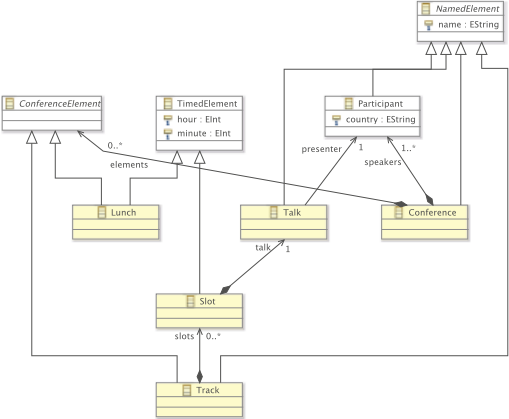

Fig. 3. Example conference model expressed using graphical concrete syntax, implemented using Eclipse GMF.

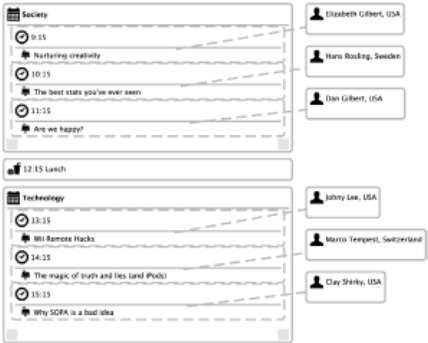

```
@namespace(uri="conference", prefix="conference") package conference; @gmf.node(label="name") abstract class NamedElement { attr String [1] name; } @gmf.diagram class Conference extends NamedElement { val ConferenceElement[ ∗ ] elements; val Participant[+] speakers; } abstract class ConferenceElement { } class Track extends ConferenceElement, NamedElement { @gmf.compartment(layout="list") val Slot[ ∗ ] slots; } @gmf.node(border.style="dash") class Slot extends TimedElement { @gmf.compartment(layout="list", collapsible="false") val Talk[1] talk; } class Talk extends NamedElement { @gmf.link(style="dash") ref Participant[1] presenter; } @gmf.node(label="name,country", label.pattern="{0}, {1}") class Participant extends NamedElement { attr String [1] country; } @gmf.node(label="hour,minute", label.pattern="{0}:{1} Lunch") class Lunch extends ConferenceElement, TimedElement { } @gmf.node(label="hour,minute", label.pattern="{0}:{1}") class TimedElement { attr int [1] hour; attr int [1] minute; }
```

Listing 5: Definition of a graphical syntax for the Conference DSL.

To define the concrete syntax and implement a GMF editor, instead of using GMF directly, we made use of the EuGENia 7 toolset [24]. EuGENia uses model transformation to automatically generate the models required by GMF to produce a concrete syntax editor. The transformations are defined on an annotated version of the metamodel that appears in Listing 5. In this listing we have used a textual syntax to describe the metamodel, in contrast to the graphical syntax of Ecore used earlier in Fig. 2.

To demonstrate the orthogonality between the abstract and concrete syntaxes, we have also developed a textual syntax for the same language using the EMFText [17] toolkit. 8 Listing 6 demonstrates the model of Fig. 3 represented using this textual syntax.

To define the concrete syntax, we needed to write an extended grammar that refers to the abstract syntax of the language. From this grammar EMFText generated a parser that can parse text that conforms to the grammar to in-memory models that conform to the abstract syntax of the Conference language, and vice-versa. It also generated IDE tooling such as a sophisticated editor supporting code completion, syntax highlighting etc. A subset of the extended BNF-like grammar

7 http :/ /www.eclipse .org /epsilon /doc /eugenia/.

8 http :/ /www.emftext .org.

## CONFERENCE "TED"

```
TRACK "Society" : AT 09:15 : TALK "Nurturing creativity" PRESENTED BY AT 10:15 : TALK "The best stats you've ever seen" PRESENTED BY "Hans Rosling" AT 11:15 : TALK "Are we happy?" PRESENTED BY "Dan Gilbert"
```

```
"Elizabeth Gilbert" AT 12:15 LUNCH TRACK "Technology" : AT 13:15 : TALK "Wii Remote Hacks" PRESENTED BY "Johny Lee" AT 14:15 : TALK "The magic of truth and lies (and iPods)" PRESENTED BY "Marco Tempest" AT 15:15 : TALK "Why SOPA is a bad idea" PRESENTED BY "Clay Shirky" REGISTERED SPEAKERS : "Elizabeth Gilbert" FROM USA, "Hans Rosling" FROM Sweden, "Dan Gilbert" FROM USA, "Johny Lee" FROM USA, "Marco Tempest" FROM Switzerland, "Clay Shirky" FROM USA Listing 6: The model of Fig. 3 expressed using a textual syntax. RULES { Conference ::= "CONFERENCE" #1 name['"','"'] !0 ( !0 elements ) ∗ !0 "REGISTERED" "SPEAKERS" ":" !0 speakers ("," !0 speakers) ∗ ; Participant ::= name ['"','"'] #1 "FROM" #1 country []; Talk ::= "TALK" #1 name['"','"'] #1 "PRESENTED" "BY" presenter['"','"'] !0; Track ::= "TRACK" #1 name['"','"'] ":" !0 (slots) ∗ ; Slot ::= "AT" #1 hour[] #0 ":" #0 minute[] ":" #1 talk; Lunch ::= "AT" hour[] #0 ":" #0 minute[] #1 "LUNCH" !0; }
```

Listing 7: A subset of the EMFText grammar defining a textual syntax for the Conference DSL.

appears in Listing 7. 9 In this grammar, ::= statements represent production rules for the respective concepts of the abstract syntax (e.g. Conference , Talk ) and comprise of a mix of keyword tokens (e.g. CONFERENCE , SPEAKERS ), and references to structural features of these concepts (e.g. name , talk ). 10 It is instructive to reflect between this listing and the metamodel presented in Fig. 3 (and the corresponding graphical concrete syntax definition, based on the metamodel, in Listing 5).

Due to the architecture of EMF, programs that work with Conference models (e.g., to validate them, transform them etc.) are agnostic of the actual concrete syntax in which the models are concretely described. That is, these programs operate on the abstract syntax of Conference models, something that is typical of modelware tools.

## 5.2. Proposal language

Our second example illustrates the development of languages and tools to support writing grant proposals. In some grant proposals, there are numerous tables that have to be produced, summarising the deliverables of the project, the research milestones , the work packages that break up the project into parts, the tasks associated with these work packages, and the partners that carry out these tasks. The information is repeated multiple times in different ways: summary tables (e.g., capturing all work packages and the effort associated with the project), task tables for each work package (summarising the tasks and effort associated with each task and work package), Gantt chart, etc. It is easy for information to become

9 Although we have intentionally kept the Conference language - and as a result, its textual concrete syntax - simple, it should be mentioned that EMFText has been used to implement the complete textual syntax of Java 5.

10 For a complete reference of the EMFText grammar definition language the reader can refer to http :/ /www.emftext .org /index .php /EMFText \_ Documentation.

Fig. 4. Project content metamodel.

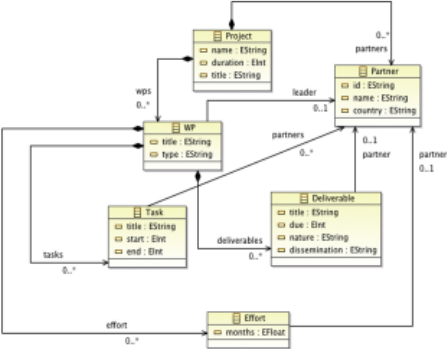

```
context Task inv : self .startdate < self .enddate context Project inv :
```

self .workpackage.leader.size() = self.partner.size()

Listing 8: OCL well-formedness rules for proposal system.

inconsistent: invariably a significant part of debugging a project proposal is ensuring that the tables and Gantt chart are consistent.

To help manage project proposals more effectively, we develop a metamodelling toolset to support construction of project models that capture the key details. A single model is used to describe project work packages, tasks, partners, etc., and is used thereafter to automatically generate the content needed in the project proposal. The content can be inserted into the proposal directly.

We work through this metamodelling example using parts of the process from Section 3.1. We fi rst present an abstract syntax metamodel, capturing the key concepts of the domain. This is presented in Fig. 4.

We next create well-formedness constraints (e.g., that work packages have distinct names). These are generally straightforward. An important constraint might be that the start date of each task is before the end date, and that each partner leads at least one work package. See Listing 8.

Now we consider concrete syntax. We choose to use XML as the concrete syntax of this language. XML is widely used and understood, numerous smart editors exist to create and validate it, and all our partners were already familiar with it. Each concept in the abstract syntax is mapped directly to an XML concept, which is straightforward.

From models that are expressed in the XML concrete syntax, we can use MDE techniques and tools to automatically generate the information that we need for our project proposal. For example, we have implemented model transformations that automatically generate Gantt charts (in L A T E X format) that show the main deliverables from the work packages of the project, shown in Fig. 5. The Gantt chart that is produced by the typesetting macros is shown in Fig. 6.

From the same project model, we can also automatically generate work package effort tables, as well as summary tables of deliverables and work packages. By construction, these are consistent. These transformations could, of course, be implemented using grammar-based techniques, which would require implementation of a grammar and program transformations that generate L A T E X. There is no specific conceptual advantage to using metamodel technology over grammars for this example, though should we want to provide a graphical editor for project data in the future, use of metamodelling technology may provide advantages.

Fig. 5. L A T E X macros generated automatically from project model.

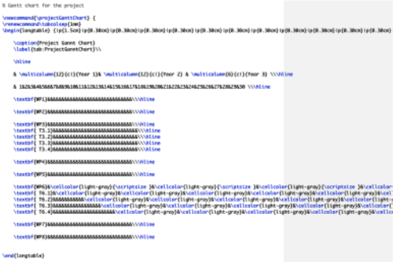

Fig. 6. Generated Gantt chart.

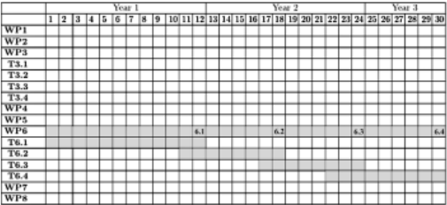

## 5.3. Complex systems example

Our fi nal example shows the power of metamodelling for comparing and linking languages. A model has been expressed in two well-defined modelling notations, which need to be combined to support transformation of the models to code. The path illustrated works from existing metamodels, giving a DSL-by-customisation (as opposed to developing a DSL ab initio , from the required model syntaxes).

The example is drawn from research that is developing support for agent-based computer simulations of complex biological systems that complement laboratory study. The simulations represent the behaviour of biological entities (e.g., cells) as agents, with a simple state and basic operations. To support laboratory research, a key requirements is fl exibility - it must be easy to adapt and extend the simulations, whilst retaining the confidence of domain experts and software engineers. Quality control is enhanced by using abstract models that domain experts understand, but that also support seamless, repeatable development to code - for instance, using model-to-text transformations.

The example here is typical. Agents represent cells. Each type of agent has some high-level behaviour, but the exact behaviour of individual agents is determined by the internal state of the individual agent. In this example, the starting point is that the biological domain experts can understand simple Petri nets, but we need to model cell-level behaviour as well as cell-type transitions. Our solution is to model this layered behaviour by creating and linking different models at the two levels of abstraction.

Fig. 7. Part of the Petri net for prostate cell division and differentiation, based on [8]. Circles are places, here representing Stem Cells (SC), Transit Amplifying Cells (TA), and the daughter cells that results from division of Stem Cells (dSC). Bars are transitions, which consume a token (representing a cell) from the source place and produce a token in the target place.

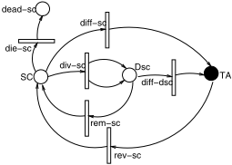

The next subsection fi rst introduces the domain models, and the rationale for each model. In Subsection 5.3.2, we work through the metamodelling steps, showing the selection of concepts from existing metamodels and the extension and linkage of the resultant metamodels to form a single DSL. In practice, this DSL has been used as the basis for generating a simulator, using manual transformation to Erlang code - full automation of the process is in progress.

## 5.3.1. The domain model

In the example described here, we need to capture a very abstract view of cell division and differentiation, sufficient to simulate a steady-state organism, and to allow modification of transition rates to reproduce and investigate mutation effects. The system under consideration is part of the prostate cell processes implicated in conditions such as cancer that are caused by aberrations in proliferation. Cells exist in a number of states that can be distinguished in prostate tissue samples using biological markers. Laboratory research has shown individual cells transitioning through these states, and can provide approximate transition rates or probabilities at the cell-type level. Biologically, a cell spends much of the time in a quiescent state; the time in which a particular transition can be made can also be estimated - as can the likelihood of cell death, which is independent of quiescence.

We can think of cells as occupying some distribution of parameter space; some cells are inherently more likely than others to transition (generally or in some specific cases); similarly, some cells are inherently more tardy than others. Eventually, the simulation will be used to explore the effect of rare events on individual cells, represented through the propagation of changes to transition rates.

To capture the probability of cells of one type undergoing a transition to another type, the biological domain experts proposed, and the software engineers accepted as appropriate, Petri net modelling. the fi rst part of the Petri net model is shown in Fig. 7 (the full model has 2 more distinguishable cell types, plus appropriate structural places and dead-cell places).

Individual cells are represented as Petri net tokens. Cell-level behaviour is inherently variable, and it biologically essential that a cell-token can only take part in a transition between cell-places when the cell is in an appropriate internal state. Thus we add a model of internal cell states and state transitions associated to each Petri net Place. This lower level transition system can most readily be expressed using a simple state chart notation. Again, the trigger for a transition is based on a biologically-derived rates or probability. The use of a Petri net and separate state charts to model this system is a conceptually cleaner solution than overloading the Petri net with notions of token state and sub-transitions. An example state chart is given in Fig. 8.

The domain model expressed in the state charts and Petri net has been extensively reviewed by both biologists and software engineers, and is agreed to be a suitable abstract design for the simulator. However, we must now create a fl exible, extensible implementation that can be manipulated via these abstract models. The fi rst step that we take, the subject of this example, is to create a DSL from the standard definitions of the Petri net and state diagram languages.

## 5.3.2. Creating and using the metamodel

To construct a single DSL, we start the metamodelling process described in Section 3.1. First, we note the steps and what is required. We then illustrate steps 2 and 3 in more detail.

Step 1, Section 3.1 requires that we select a metamodelling infrastructure. Both Petri nets and state charts have existing metamodels - as discussed in [29]. We take as the starting point for the DSL, the standard high level Petri net graphs (HLPNG) extension of the Petri net core metamodel [21,18], and the state diagram concepts from UML 2.4.1 [16]. Both metamodels are defined using MOF, and their concepts are thus fundamentally compatible.

Step 2, Section 3.1 requires us to define an abstract syntax in MOF. In developing a DSL by customising existing metamodels, this is a non-trivial step, comprising the following tasks:

Fig. 8. A state chart showing the possible transitions of an individual cell whilst in the stem cell (SC) place of the Petri net (Fig. 7), based on [8]. Arrows represent transitions due to events, which may be internal or external. External event transitions come from the solid circles, and go to the nested circles. States (rectangles) have duration, whilst transitions are conceptually instantaneous changes of state.

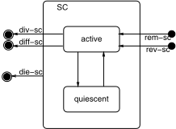

- select the appropriate concepts from the language definitions of HLPNG Petri net and UML state diagrams;
- merge the metamodel fragments into a single DSL that could be given its own graphical syntax, graphical editor, etc., and that can form the basis for transformation into textual languages such as code.
- modify the metamodel fragments to incorporate the required DSL semantics;

The well-formedness rules of the DSL ( step 3, Section 3.1 ) include existing well-formedness conditions from the existing metamodels, and new conditions needed to define the semantic mappings between the Petri net and state chart notations. In order to define the mappings, we need to modify the abstract syntax represented in the Petri net metamodel. Thus, steps 2 and 3 are interrelated, and the following describes both the definition-by-customisation of the abstract syntax of the DSL, and the well-formedness mapping rules.

The next step, step 4 of the metamodelling process (Section 3.1) is to define appropriate concrete syntaxes. In one sense, this is trivial, since the DSL can adopt the concrete syntax of the source models. However, model-driven engineering and modelling approaches would not currently support development of a graphical editor that requires the 'expansion' of a high-level model concept (a Petri net place) to reveal a lower-level model (a state diagram). Creation of a model at a single level of abstraction requires creation of a new concrete syntax.

Step 5 requires us to define the semantics of the new DSL. However, this is inherent, captured in the original language definitions, and the modifications described above.

Finally, step 6 , defining mappings to other languages, is the goal of the metamodelling exercise outlined here: from the completed DSL, mappings can be defined using MDE transformations to code and other models, as has been illustrated in the other examples, above.

## 5.3.3. Creation of a unified DSL metamodel

Selecting appropriate concepts . from the existing metamodels gives the (leaf) components listed in Table 2. Disambiguation or meta-concepts with the same name from each metamodel uses PN for Petri net and SD for state diagram.

The selected concepts listed in Table 2 are subclasses of metaconcepts in the published metamodels. For example, some of the extracted parts of the structure of the HLPNG Petri net metamodel is shown in Fig. 9. The structure of the extracted UML metaconcepts for the state diagram is shown in Fig. 10.

Modifying the metamodel concepts . starts from the requirements for the new DSL:

1. The Condition for a PNTransition includes the condition that the state of the token allows that transition: in Fig. 7, for instance, a PNTransition from SC to TA requires that the SC token (cell) is in the active state, and that the diff-sc event fires (Fig. 8).
2. In order to preserve the variable characteristics of individual cells, the state (the current attribute values) of a token (cell) must be preserved in a PNTransition . In Fig. 7, for instance, the diffSC transition must use the state of the token consumed from the SC Place to create the token produced in the TA Place.

The main changes needed are to the Petri net. A new meta-class called State Seq. is introduced, a subclass of attribute , to represent the state of a token consumed by a PNTransition : the type of State Seq. is the type of the Place from which the token is consumed - defined by a meta-association from the new State Seq. class to the existing Type class. The structure of the change is shown in Fig. 11.

In Fig. 11, the structure of the Condition annotation is shown. Condition is stated to be a Boolean expression [18]. No structural change is required to define that the Condition becomes a conjunction of the HLPNG Boolean expression and an appropriate interpretation of the signal from the state diagram, but an additional metamodel constraint is required.

Finally, no structural changes are needed to the state diagram metamodel.

Table 2

Required Petri net and state diagram metamodel concepts.

| Concept      | Informal meaning                                                                                                                                                                                                                                                                                                        |
|--------------|-------------------------------------------------------------------------------------------------------------------------------------------------------------------------------------------------------------------------------------------------------------------------------------------------------------------------|
| Place        | A Place holds Petri net tokens of its type until a transition condition is true.                                                                                                                                                                                                                                        |
| PNTransition | When a transition condition is true, a PNTransition consumes one or more tokens and may produce one or more tokens; the tokens produced have the type of the target Place(s).                                                                                                                                           |
| Arc          | Denotes which Places are sources (targets) for which PNTransitions.                                                                                                                                                                                                                                                     |
| PNName       | Denotes the name of an Arc , Place or PNTransition .                                                                                                                                                                                                                                                                    |
| Marker       | Denotes the number of Petri net tokens in a Place .                                                                                                                                                                                                                                                                     |
| Condition    | Denotes the condition for a Petri net token taking part in a PNTransition.                                                                                                                                                                                                                                              |
| Type         | Denotes the type of a Petri net Place , which defines the type of its tokens.                                                                                                                                                                                                                                           |
| State        | A label given to an object (of a UML class), defined according to a specific set of attribute values. Note that the attribute values may include the name of the state.                                                                                                                                                 |
| SDTransition | When the set of attribute values of an object (of a UML class) no longer mets the definition of its current state, it makes an instantaneous SDTransition to another state. The SDTransition may be triggered externally (forcing the object into a new state) or internally (due to internal behaviour of the object). |
| Trigger      | The result of an event that causes the condition for a SDTransition to become true.                                                                                                                                                                                                                                     |

Fig. 9. Part of the Petri net core metamodel, based on [21,18]. A Petri net comprises Objects , which may be Nodes or Arcs . The nodes are Places and Transitions . Reference nodes and transitions allow the Petri net to be split into sub-diagrams.

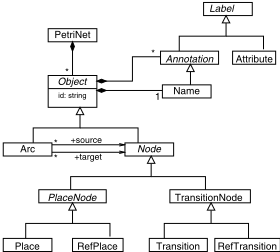

Merging the metamodels . is accomplished by linking the relevant concepts from the two metamodels, and defining wellformedness conditions.

To support persistent cell states, the State Seq. attribute needs linking to the state diagram State , so that both contain the same data details. The State is also of the same Type as the associated Place . This can be expressed both by structural meta-associations, and by the well-formedness condition that the name (from MOF NamedElement ) of the state diagram is the same as the Name of its associated Place .

To support the use of the state-diagram State in determining the fi ring of a PNTransition , the Condition for fi ring must conjoin any Petri net Condition with a value which is true only if the state diagram exit event, with the same name as the arc from the relevant Place to the relevant Transition , is generated. The complementary action, resulting from production of a new Petri net token, is to generate an entry event with matching name on the state diagram associated with the target Place , so that the new token starts in the relevant state diagram State .

The combined metamodel supports the cell division and differentiation DSL, in which states and places are named with biologically-meaningful terms. The attributes of the state, which come from the class type of the relevant Petri net Place via the token (or cell), will include attributes defining the probability of transition between (named) states and places, and a probability modifier that can be used to modify Petri-net transition probabilities for this specific cell (token), to represent mutation effects. The triggering semantics conforms to the definition of the UML state chart trigger (defined in the communications sub-package [16]).

Fig. 10. Relevant extract of the StateMachine concepts from the OMG's UML 2.4.1 metamodel [16]. A StateMachine comprises named States and named Transitions . A Trigger relates states and transitions. See text for a note on the abstract naming classes, which reference the kernel package of the UML metamodel [16].

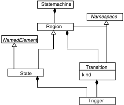

Fig. 11. The annotation definitions from the HLPNG metamodel, extended to define a temporary data store on TransitionNode as an Attribute (see [18]). State Seq. takes its type from that of the associated PlaceNode (see text).

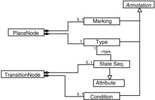

The cell division and differentiation DSL now forms the basis for a traceable simulator development. The abstract models in the DSL were easily understood by all the collaborators, and have been checked for biological accuracy by the collaborators, and confirmed fi t for purpose; the latter has been demonstrated by development of a simulator, which is outside of the scope of this paper.

## 6. Conclusions

We have given an overview of metamodelling, concentrating on examples and key lessons for grammar researchers. In particular, we have tried to highlight the key differences between building a language via grammars, and building a language via metamodels. In practice, this involves different technology choices, leading to different implications. Metamodelling supports definition of languages through use of graph concepts and constructs; grammars are grounded in the use of tree concepts and constructs. With metamodelling, the unification power of modelling is fundamental: everything (including models and metamodels) can be treated as models, thus allowing engineers to use and reuse tools and infrastructure for multiple purposes. Eclipse is a good example of such fl exible and reusable infrastructure. The downside of metamodelling is its hidden complexity: behind every model, there may be a complex metamodel, but also complex metamodelling infrastructure, which can make it difficult to understand how models have been implemented, but also how models and metamodels should change over time. Nevertheless, the power of metamodelling and its infrastructure can lead to practical automation of numerous repetitive tasks, using generic and standardised tools, and can easily allow implementation of different visual and textual concrete syntaxes for the same abstract syntax. In practice, the distinctions between metamodelling, grammars, modelware and grammarware are blurring, and it will be increasingly possible in the future to use said tools and language workbenches collaboratively to solve language engineering problems.

## References

- [1] [Colin Atkinson, Thomas Kühne, Model-driven development: a metamodeling foundation, IEEE Softw. 20 (5) (2003) 36-41.](http://refhub.elsevier.com/S0167-6423(14)00245-7/bib42657A6976696E3034s1)
- [2] [Jean Bézivin, Model engineering for software modernization, in: WCRE, 2004, p. 4.](http://refhub.elsevier.com/S0167-6423(14)00245-7/bib42657A6976696E3035s1)
- [3] Jean Bézivin, On the unification power of models, Softw. Syst. Model. 4 (2) (2005) 171-188.

- [4] Jean Bézivin, Salim Bouzitouna, Marcos Didonet Del Fabro, Marie-Pierre Gervais, Frédéric Jouault, Dimitrios S. Kolovos, Ivan Kurtev, Richard F. Paige, A canonical scheme for model composition, in: ECMDA-FA, 2006, pp. 346-360.
- [5] Tony Clark, Paul Sammut, James Willans, Applied metamodelling: a foundation for language driven development, second edition, http://eprints.mdx. ac.uk/6060/1/Clark-Applied\_Metamodelling\_%28Second\_Edition%29%5B1%5D.pdf, 2004.
- [6] [Juan de Lara, Esther Guerra, Deep meta-modelling with metadepth, in: TOOLS (48), 2010, pp. 1-20.](http://refhub.elsevier.com/S0167-6423(14)00245-7/bib446A7572696347443036s1)
- [7] [Dragan Djuric, Dragan Gasevic, Vladan Devedzic, The Tao of modeling spaces, J. Object Technol. 5 (8) (2006) 125-147.](http://refhub.elsevier.com/S0167-6423(14)00245-7/bib44726F6F70s1)
- [8] Alistair Droop, Philip Garnett, Fiona A.C. Polack, Susan Stepney, Multiple model simulation: modelling cell division and differentiation in the prostate, in: CoSMoS Workshop, Luniver Press, 2011, pp. 79-111.
- [9] Angelo Gargantini, Elvinia Riccobene, Patrizia Scandurra, Deriving a textual notation from a metamodel, in: Proc. of Workshop on Milestones, Models and Mappings for Model-Driven Architecture (3M4MDA'06), in: CTITSeries, vol. WP06-02, ISSN 1574-0846, 2006.
- [10] Thomas Goldschmidt, Steffen Becker, Axel Uhl, Classification of concrete textual syntax mapping approaches, in: ECMDA-FA, 2008, pp. 169-184.
- [11] Object Management Group, Human-usable textual notation (HUTN) specification, http://www.omg.org/technology/documents/formal/hutn.htm, 2004.
- [12] Object Management Group, A proposal for an MDA foundation model (2005-04-01), http://www.omg.org/cgi-bin/doc?ormsc/05-04-01, 2005.
- [13] Object Management Group, Meta-object facility 2.0 core specification, http://www.omg.org/spec/MOF/2.0/, 2006.
- [14] Object Management Group, Unified modelling language (UML) 2.2 specification, http://www.omg.org/spec/UML/2.2/, 2009.
- [15] Object Management Group, Diagram definition v1.0 ftf specification, http://www.omg.org/cgi-bin/doc?ptc/2011-07-13, 2011.
- [16] Object Management Group, Unified modelling language (UML) 2.4.1 superstructure specification, http://www.omg.org/spec/UML/2.4.1/Superstructure/ PDF, 2011.
- [17] Florian Heidenreich, Jendrik Johannes, Sven Karol, Mirko Seifert, Christian Wende, Derivation and refinement of textual syntax for models, in: ECMDAFA, 2009, pp. 114-129.
- [18] Lom Messan Hillah, Ekaart Kindler, Fabrice Kordon, Laure Petrucci, Nicolas Trèves, The Petri net markup language and ISO/IEC 15909-2, in: Workshop and Tutorial on Practical Use of Coloured Petri Nets and the CPN Tools, Aarhus University, 2009.
- [19] [Richard C. Holt, Phillip Matthews, Alan Rosselet, Jim Cordy, The Turing Programming Language: Design and Definition, Prentice Hall, 1987.](http://www.iso.org/iso/iso_catalogue/catalogue_tc/catalogue_detail.htm?csnumber=26153)
- [20] ISO, ISO/IEC 14977:1996 extended BNF, http://www.iso.org/iso/iso\_catalogue/catalogue\_tc/catalogue\_detail.htm?csnumber=26153, 1996.
- [21] Software and systems engineering - high-level Petri nets, Part 2: transfer format, International Standard ISO/IEC 15909, WD 15909-2:2005(E), www.petrinets.info/docs/ISO-IEC15909-2.WD.V0.9.0.pdf, 2005.
- [22] [Michael Jackson, Software Requirements and Specifications, ACM Press, 1995.](http://refhub.elsevier.com/S0167-6423(14)00245-7/bib475741s1)
- [23] [Paul Klint, Ralf Lämmel, Chris Verhoef, Toward an engineering discipline for grammarware, ACM Trans. Softw. Eng. Methodol. 14 (3) (2005) 331-380.](http://refhub.elsevier.com/S0167-6423(14)00245-7/bib4B6F6C6F766F7352415050423130s1)
- [24] Dimitrios S. Kolovos, Louis M. Rose, Saad bin Abid, Richard F. Paige, Fiona A.C. Polack, Goetz Botterweck, Taming EMF and GMF using model transformation, in: MoDELS (1), 2010, pp. 211-225.
- [25] Dimitrios S. Kolovos, Louis M. Rose, James R. Williams, Nikolas Drivalos Matragkas, Richard F. Paige, A lightweight approach for managing XML documents with MDE languages, in: ECMFA, 2012, pp. 118-132.
- [26] [Bertrand Meyer, Object-Oriented Software Construction, second edition, Prentice Hall, 1997.](http://refhub.elsevier.com/S0167-6423(14)00245-7/bib5061696765424F3037s1)
- [27] Richard F. Paige, Phillip J. Brooke, Jonathan S. Ostroff, Metamodel-based model conformance and multiview consistency checking, ACM Trans. Softw. Eng. Methodol. 16 (3) (2007).
- [28] Richard F. Paige, Dimitrios S. Kolovos, Fiona A.C. Polack, Metamodelling for grammarware researchers, in: Proc. Software Language Engineering, 2012, pp. 64-82.
- [29] Fiona A.C. Polack, Choosing and adapting design notations in the principled development of complex systems simulations for research, in: Modelling the Physical World at Models, ACM Digital Library, 2012.
- [30] [Jeroen van den Bos, Tijs van der Storm, Bringing domain-specific languages to digital forensics, in: ICSE, 2011, pp. 671-680.](http://refhub.elsevier.com/S0167-6423(14)00245-7/bib424E462D5741532D4845524532303132s1)
- [31] Vadim Zaytsev, BNF WAS HERE: what have we done about the unnecessary diversity of notation for syntactic definitions, in: Marjan Mernik, Barrett Bryant (Eds.), Programming Languages Track. Proceedings of the 27th ACM Symposium on Applied Computing (SAC 2012), vol. II, Riva del Garda, Trento, Italy, ACM, March 2012, pp. 1910-1915.