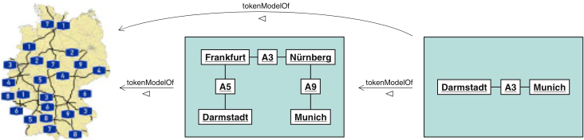
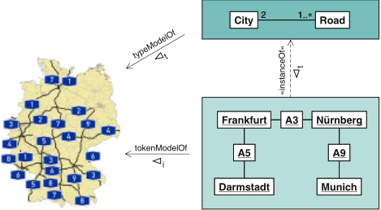
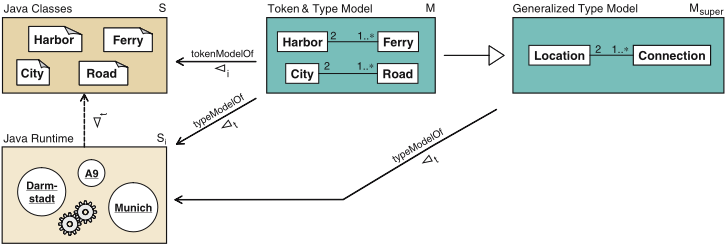
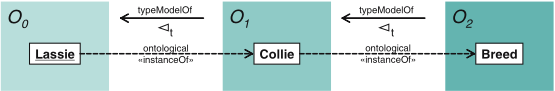
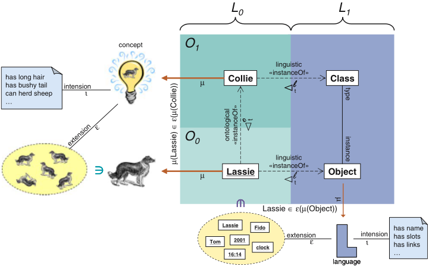
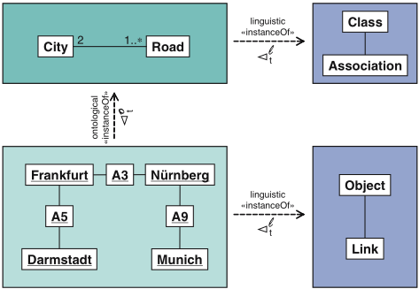
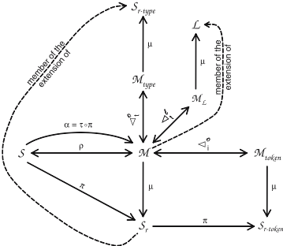
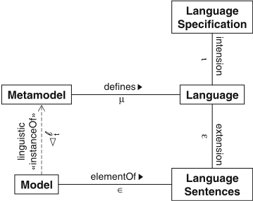
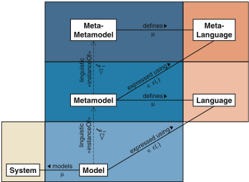

> Converted from [`matters-of-metamodeling.pdf`](matters-of-metamodeling.pdf) with docling. Figures are in [`matters-of-metamodeling-images/`](matters-of-metamodeling-images/). Page numbers for each section are in [`INDEX.md`](../../INDEX.md).

## SPECIAL SECTION PAPER

## Matters of (meta-) modeling

Thomas Kühne

Received: 16 November 2004 / Accepted: 19 December 2005 / Published online: 27 July 2006 ©Springer-Verlag 2006

Abstract With the recent trend to model driven engineering a common understanding of basic notions such as 'model' and 'metamodel' becomes a pivotal issue. Even though these notions have been in widespread use for quite a while, there is still little consensus about when exactly it is appropriate to use them. The aim of this article is to start establishing a consensus about generally acceptable terminology. Its main contributions are the distinction between two fundamentally different kinds of model roles, i.e. 'token model' versus 'type model' (The terms 'type' and 'token' have been introduced by C.S. Peirce, 1839-1914.), a formal notion of 'metaness', and the consideration of 'generalization' as yet another basic relationship between models. In particular, the recognition of the fundamental difference between the above mentioned two kinds of model roles is crucial in order to enable communication among the modeldriven engineering community that is free of both unnoticedmisunderstandingsandunnecessarydisagreement.

Keywords Model driven engineering · Modeling · Metamodeling · Token model · Type model

## 1 Introduction

Everytime a new research area gains momentum, the task of defining its central notions needs to be addressed. Communities can take a surprisingly long time to come

Communicated by Dr. Reiko Heckel.

B

T. Kühne (

)

Darmstadt University of Technology,

e-mail: kuehne@informatik.tu-darmstadt.de

to an agreement about what notions like 'object' and 'component' should encompass. Although such efforts can be tedious and are renown for causing research meetings to stall on the 'definition problem', they are necessary in order to enable unambiguous communication among community members. A number of efforts to establish an unambiguous vocabulary (e.g., [1,2]) testify to the need for a shared conceptualization in model engineering. If the community continues to maintain different ontologies for the basic terms of their discipline, any communication may create the illusion of agreement where there is none, i.e., unnoticed misunderstandings, and raise barriers of communication where they are just accidental.

In the following we will focus on the term 'model' in the context of model driven engineering. Our models are thus all language-based in nature, unlike, e.g., physical scale models and they describe something as opposed to models in mathematics which are understood as interpretations of a theory [3].

Inanattempttodefinethescopeofthenotion'model' we should consider how it has been traditionally used in software engineering. From this perspective, a model is an artifact formulated in a modeling language, such as UML [4], describing a system through the help of various diagram types. Typically, such model descriptions are graph-based and are rendered visually.

In our model driven engineering context such a characterization would be too narrow. Other artifacts, such as Java programs, are considered to be models as well, since they can also be understood as describing systems (e.g., all possible execution traces of a program). This liberal use of 'model' is the result of applying the powerful principle of unification ('Everything is a model' [5]). Its intent is to get as much out of the new development paradigm as possible. For instance, if transformations are considered models as well [5] then - since the fundamental operation in model driven engineering is a 'model to model' transformation - using the standard general infrastructure, one may obtain a particular transformation by transforming another one.

Obviously,evenif'everythingisamodel'wereunconditionally true, this would not relieve us from the task of defining the fundamental model relationships. At least in a relative way one needs to be able to speak about different roles (such as system, model and element) and corresponding relationships (such as representation and instantiation), independently of what is and what is not considered a model, e.g., whether or not the modeled system is a model itself, or the elements of a model are models again, etc.

Not before the same 'notion definition' task was completed for the basic notions of object-orientation, i.e., not before notions like instantiation and inheritance were fully understood, the full potential of object-orientation was unfolded. For instance, a solid notion of subtyping as a discipline for inheritance is crucial to build safely reusable software. We need to achieve the same clarity and consensus for the basic notions of model driven engineering as well, in order to unlock its full potential.

The remainder of this article first attempts to home in on a characterization of 'model' in the context of model driven engineering that everyone may subscribe to. Next we will distinguish two fundamentally different kinds of model roles. Only after the difference between these two kinds has been made explicit, will we be able to further define basic model notions and properties, such as 'metamodel' and 'generalization' between models. We complement this discussion by relating the notions 'metamodel' and 'language' with each other and then conclude.

## 2 What is a model?

In this section we attempt to define a scope for the notion 'model' that is broad enough to include everything useful, but narrow enough so that it does not become useless. After all, if a notion includes everything, it loses its discrimination property. As an analogy, practically everything could be characterized as an 'object' but as a technical term it only provides value in communication if not everything is included by the term 'object'. Likewise the notion 'model' should include 'transformation' but not in an opportunistic manner (if it is considered useful then it is deemed correct) but in a way that includes 'transformation' in a well defined scope of sufficient size but without unnecessary breadth. In our context the following definition is useful:

A model is an abstraction of a (real or languagebased) system allowing predictions or inferences to be made.

While the aim of this article is not to present any proofs or a complete formalization of modeling, we nevertheless try to disambiguate and concisely present the essence of informal textual statements with some formal syntax and hence denote the relationship between a system S and a model of it as

<!-- formula-not-decoded -->

In general, ◁ establishes a many-to-many relationship since one model may describe several systems and one system may be described by several models. Mathematically, ◁ therefore is a binary relation. A subset of this relation is the representation 1 relation ρ , hence

ρ(

S

,

M

)

→

S

◁

M

.

While the 'model-of' ( ◁ ) relation includes any accidental, legally conforming 'system/model' pair, relation ρ is meant to capture only such pairs where the model is specifically intended to represent the corresponding system. We are thus able to state that a model M 2 models another model M 1 , but that both represent a single original system:

<!-- formula-not-decoded -->

Figure 1 shows a corresponding example featuring two map models. Fig. 1 and most other figures use standard UML notation [4] with the usual meaning of objects, classes, associations, dashed dependency lines with 'instance-of' stereotypes to denote instantiation, etc. Only a few non-UML elements are used for illustrative purposes. Associations are often annotated with the notation we successively introduce in order to connect the textual definitions to the examples shown in figures. For easy reference, Table 2 serves as a final summary to the notation introduced and Fig. 7 illustrates the most important relationships accordingly.

1 Here, we use 'representation' as in 'be a placeholder/representative for', not to be confused with 'presentation' as in 'concrete syntax for communication purposes'.

Fig. 1 Token models and model transitivity

In order to be able to discuss various model properties later on, we also assume an abstraction function α that produces a model from a system:

<!-- formula-not-decoded -->

In the spirit of [6], we are assuming that S is already available in a formal representation. For instance, a structured set ' ( S , rs ) ' with elements (from S ) and relationships (from rs ) between those elements is an adequate choice.

If System is the real (e.g., physical) system under study, then S can be thought of as being generated by a process 'modeling' from System . While one could argue that process 'modeling' embodies the very operation we are trying to study, our approach works without any loss of generality. For our purposes it is irrelevant whether the system we abstract from, conceptualize, etc., is real or already is a representation of a real system. 2 Any philosophical and epistemological issues of the process 'modeling' , e.g., how to extract structure and properties from a real system with practically infinitely many properties and possibly unobservable behavior into a formal representation, are not of interest to us in this context, since weare focusing on 'model' as a technical term in model driven engineering rather than investigating the process of creating representations of reality.

## 2.1 Model features

According to Stachowiak [7] a model needs to possess three features (see Table 1). The first two features are covered at once if one informally speaks of a model as a 'projection', as this implies both that something is projected (the original) and that some information is lost during the projection. Formally, relating to equation 2:

2 Actually, we do loose the property of real systems to be nonlanguage-based, i.e., not being an expression of a language, but this does not become relevant before Sect. 5.

Table 1 Model features according to Stachowiak

| Mapping feature   | Amodel is based on an original 3                                                |
|-------------------|---------------------------------------------------------------------------------|
| Reduction feature | Amodelonly reflects a (relevant) selection of an original's properties          |
| Pragmatic feature | A model needs to be usable in place of an original with respect to some purpose |

<!-- formula-not-decoded -->

Model abstraction ( α ) then consists of projection ( π ), some further abstraction ( α ′ ) on elements (including relationships), and a translation τ to another representation, i.e., the modeling language. With projection π we associate any filtering of elements both reducing their number and individual information content. Projection π is an injective homomorphism, i.e., a structure preserving operation.

Following [8], we regard a function h : X ↦→ Y as a homomorphism if

<!-- formula-not-decoded -->

where ⊕ is an operation on X and ⊗ is an operation on Y . As a result, π preserves the structure of the original for those parts that it retains and creates a one-to-one relationship between target and (a subset of the) source.

For later reference, we label the reduced intermediate result between projection and further abstraction as:

<!-- formula-not-decoded -->

Exactly what information of the system is left after projection, depends on the ultimate purpose of the model - Stachowiak's third feature - the pragmatic useability of the model, i.e., who the model is for and for what purpose. Steinmüller [9] even includes both the sender and the recipient as being relevant. According to Steinmüller a model is information

3 We have so far referred to the original as the 'system'

- on something (content, meaning),
- created by someone (sender),
- for somebody (receiver),
- for some purpose (usage context).

Acommonpurpose for a model is that it is used in place of the system. Any answers obtained from the model should then be the same as those given by the system provided the model is adequate [1] / correct [10]. Typically, the motivation for using a model is cost-saving as it is often cheaper and/or quicker to obtain answers from a model than from the system. Often models are even known to be imprecise or false in some respect, but this does not automatically mean that they are inadequate. Such imprecisions, at best, may not affect the properties of interest at all or, slightly worse, may just make their evaluation more uneconomic or, worse, skew them but to an acceptable extent only.

## 2.2 Motivation for modeling

In software engineering, models typically come in two flavors: descriptive and prescriptive . Descriptive models are used to capture some knowledge, e.g., requirements, a domain analysis, etc.

Prescriptive models (aka, 'specification models' [10]) are used as blueprints (construction plans) for system designs, implementations, etc. Nowadays, the main purpose of blueprints is to support planning and early validation, i.e., finding errors as early as possible and partially evaluating a system before it is realized, but the value obtainable from their prescriptive nature is limited because of the lack of rigor and preciseness regarding their meaning. It is one of the primary goals of model driven engineering to shift the emphasis from informal, non-binding models to rigorous, binding models.

Note that the idea of a model as a construction plan is, in principle, in conflict with the required 'mapping' feature. There is no 'original' to map the model to (yet). Still, Webster's new encyclopedic dictionary [11] includes the following definition of 'model':

## (a) a theoretical projection of a possible or imaginary system.

In other words, the 'original' might be something yet to be built or it may remain completely imaginary. Only the former possibility seems to be of relevance in our context and we still accept construction plans as models since there clearly is an intended system the model will represent. In order to deemphasize the connotation of 'original' as preceding the model in time with respect to existence, a sometimes more suitable term for 'original' is 'subject'.

## 2.3 Are transformations models?

So far, our notion of 'model' is in accordance with established definitions, but does it include unconventional interpretations of model, such as 'transformation'? In fact, a (model-to-model) transformation is indeed information on a mapping from one model to another, created by a transformation engineer, for the transformation engine, in order to automate a translation process. So a transformation refers to an original (the actual mapping links between actual models) and only reflects relevant properties of the original since it does not spell out all individual mapping links but only describes the mapping scheme in terms of the model languages. This is true as long as one understands 'transformation' as 'description of a transformation function'. If we interpret 'transformation' to be all the actual links from all elements from the source model to all elements of the target model then transformations should not be considered as models, as we can then no longer point out any reduction feature. 4 This view is in accordance with the terminology offered by [2], where actual connections/links are referred to as 'transformationInstance' and only descriptions of 'transformationFunctions' are referred to as 'transformationModels'.

## 2.4 A copy is not a model

Obviously, for the sake of making as many artifacts as possible eligible to be considered models, we could drop the demand on models to have a reduction feature. However, this could be the threshold beyond which the notion starts deteriorating into something more or less meaningless.

Note that we are only able to speak about the absence of reduction because our subjects are finite representations already. Any representation of a real world subject automatically implies reduction and thus can be granted model status.

In the context of descriptions, whose subjects are finite formal representations, we may even consider accepting another of the definitions for 'model' from Webster's new encyclopedic dictionary [11]

## (b) a small but exact copy of something

4 Unless, of course, the transformation is a model of a real transformation going on between the originals of the respective source and target models. However, this is an exceptional case we are not further considering here.

as long as 'exact' refers to the properties one wants to retain but is not understood to mean 'complete'.

If I build a car according to an original being precise in every minute detail, I have not constructed a model but a copy. 5 If I use the copy in a crash test, I have not performed a model simulation, but a real test run. Exact copies neither offer the advantages of models (typically cost reduction) nor do they entail their disadvantages (typically inaccuracy with regard to the original). In other words, 'no abstraction' → 'no model'. If, in order to maximize the unification principle, we would still accept copies as models then we should at least refer to them as degenerate models .

## 3 Kinds of model roles

Intriguingly the discussion so far has not had to take into account the existence of two fundamentally different kinds of models. If in personal communication one expert thought of the one kind and another expert thought of the other kind, so far they would have always been in agreement. However, as soon as further characterizations are attempted, such as 'transitivity of the 'modelof' relationship' or 'under which circumstances is a model a metamodel?', the experts would start disagreeing and may only consolidate their views again when discovering their different mindsets.

There are of course many ways in which one can distinguish models, such as 'product versus process models' or 'static versus dynamic models' but for the following discussion these differences are irrelevant. The two kinds of models which are able to create communication chasms between experts talking about basic modeling notions are token and type models. As the section title indicates these kinds are not absolute properties of models but depend on their relationship to the system.

## 3.1 Token models

A typical example for a token model is a map (see the middle part of Fig. 1). Note that here (on the left hand side of Fig. 1) and elsewhere we use depictions of real world systems for model subjects for illustrative purposes only, so that the latter can be better recognized as subjects as opposed to being regarded as models themselves. In our formal treatment, however, we continue to assume model subjects to be representations already.

Elements of a token model capture singular (as opposed to universal) aspects of the original's elements, i.e., they model individual properties of the elements in the system.

5 In our context we can also refute the model status of the copy by observing that it is not a language-based description of an original.

When using UML, a natural choice for creating a token model is the object diagram since it captures the system's elements that one is interested in in a one-toone mapping and represents them with their individual attribute values. Note, however, that depending on the nature of the subject, class diagrams may also be appropriate (see Sect. 3.2, in particular Fig. 3).

Formally, with respect to equation 3 we have

<!-- formula-not-decoded -->

In other words, the abstraction process for creating token models involves no further abstraction beyond projection and translation [see Eq. (3)]. 6 As a consequence, elements of a token model are designators for those elements in the system S which are also retained in the reduced system S r [see Eq. (4)]. We therefore have a one-to-one correspondence between relationships and elements in the model M and a subset of these in system S . This property implies that the 'token-model-of' relationship must be transitive. A chain of token models can be regarded as a chain of designators, linearly referencing each other and then, ultimately, the system. Hence, the designators of the last token model transitively reach down to a subset of the system's elements.

It is instructive to realize that coarsely capturing elements of a system in a model (through π ) - e.g., not distinguishing between two-lane or three-lane motorways and representing them all as just plain 'motorway' elements - must not be confused with generalization. The former is a projection of elements onto the same number of elements designating the originals in an abstract way, i.e.,

<!-- formula-not-decoded -->

whereas generalization is the union of two or more special concepts into one general concept. However, there is of course a correspondence between the equivalence relationship ∼ π mapping different source elements onto the same target element

<!-- formula-not-decoded -->

and generalization: The extension of a general concept may exactly define the elements which are considered to be equivalent to each other by ∼ π , in the presence of more differentiating, special concepts.

6 Here, we restrict our notion of 'model' to pure abstractions of their subjects. Any additional information they might contain - potentially completely unrelated to the subject - are not considered by this treatment.

In the context of this article, a 'concept' implies an intensional abstraction of predicates which characterize the same elements in a description independent manner. For instance, we know that UnfeatheredBipeds(X) ∼ ScriptUsingMammal(X) so that one may refer to the characterized elements with the concept HumanBeing(X) . If C is a concept we use ε( C ) to refer to its extension (all elements falling under the concept C ) and ι( C ) to refer to its intension (a conjunction of predicates characterizing whether an element belongs to the concept or not) [12], so that

<!-- formula-not-decoded -->

Hence, with respect to 'generalization' we can state intensionally

<!-- formula-not-decoded -->

and extensionally:

ε( C special ) ⊆ ε( C general ) .

In UML parlance token models are sometimes referred to as 'snapshot models' since they can be used to capture a single configuration of a dynamic system. Their fine-grained representation of a system - retaining system elements in a one-to-one fashion - makes them ideal for capturing detail that changes dynamically in time. Other possible names for token models are 'representation model' (due to the direct representation character), 'instance model' (since the model elements are instances as opposed to types), 'singular model' (because the elements designate individuals rather than universals), or 'extensional model' (as they are enumerative with respect to system elements).

In software engineering, stereotypical usages for token models include the capturing of initial system configurations, or system snapshots as a basis for simulations (e.g., regarding performance). Token models are also often what people have in mind when talking about models in general. The often used example of a building plan for a house, is a token model.

## 3.2 Type models

As we have seen in the previous section, token models have many useful applications. However, they do little to condense complex systems to concise descriptions, due to their one-to-one representation of elements in the (relevant part of the) system. Type models are much more economic in this respect. For good reasons the human mind exploits the power of type models by using object properties (e.g., four legged, furry, sharp teeth, and stereovision) to classify objects (e.g., as a predator) and then draw conclusions according to properties known about the object class (e.g., 'dangerous'). This way the human mind does not need to memorize all particular observations and arrive at decisions afresh, but just collects concepts and their universal properties [13].

Most models used in model driven engineering are type models. In contrast to token models, type models capture the universal aspects of a system's elements by means of classification .

Figure 2 shows (at the top) a type model for the modeled country, using UML's natural diagram kind for type models: the class diagram. Instead of representing all the particular elements and their links, the type model captures the types of interest and their associations only. Thus 'schema model', 'classification model', 'universal model', or 'intensional model' are further appropriate names.

Formally, with respect to Eq. (3) we have

<!-- formula-not-decoded -->

where Lambda1 is a classification function, classifying elements (including relationships), which are considered equivalent to each other with respect to certain properties, under one respective type. Hence, the complete abstraction function for creating type models involves classification in addition to projection and translation [see Eq. (3)].

Function Lambda1 is also a homomorphism. If it classifies every system element (from S r ) into its own singleton set then it is even an isomorphism. Of course, the usefulness of type models stems from the fact that this is typically not the case.

One may check whether a model M token conforms to another model M type (e.g., whether the bottom-right token model in Fig. 2 conforms to the type model above it), by attempting to construct a homomorphism Lambda1 from M token to M type.

Such a homomorphism Lambda1 [see Eq. (6)], implies an equivalence relation ∼ Lambda1 on M token , defining which objects and relationships are to be considered equivalent, i.e., be of the same type:

<!-- formula-not-decoded -->

Hence, M type may be regarded as the quotient of M token with respect to the equivalence relation ∼ Lambda1 .

<!-- formula-not-decoded -->

Since type models are created by classification we mayalsosaythat model M token is an 'instance of' model M type.

Before we proceed to discuss why recognizing the difference between token and type models is important, we should clarify that being a token or a type model depends on the relationship to the modeled system, not on any intrinsic model property.

Fig. 2 Kinds of model roles

## 3.3 Why roles?

Figure 3 shows (at the middle top) a model that is usually considered a type model as its elements designate universals, i.e., classify individual objects existing during the runtime execution of a Java program. However, at the same time it is also a token model for the corresponding Java classes. The class diagram does not capture the universal aspects of the Java classes but directly represents them in a one-to-one mapping.

Hence, one needs to be careful to not judge the role of a model only by its contained elements. Consider the product model of a pet store. Whereas normally an element named 'Collie' would represent a concept with an extension, i.e., many collie instances, in the case of the pet store it is simply an object representing one of the many animal types one may order. 'Collie' then just designates an individual (one choice in the shop) and hence the corresponding model is a token model despite the fact that 'Collie' is usually associated with a type.

Conversely, the use of an element 'Lassie' typically indicates that the respective model is a token model for particular collies. Yet, it could be a type model for actual collie instances, in which 'Lassie' classifies all those collies that could play the role of the movie character 'Lassie'. Indeed, famous 'Lassie' was brought to life by many 'Lassie' dog actors. Once again, the standard use of 'Lassie' as an object is not a reliable indicator of the actual nature of the corresponding model.

In characterizing a model as being either a token or a type model, one must therefore always specify with respect to which model subject. More precisely, as clearly demonstrated by Fig. 3, models as such, may not be characterized at all, but one may only characterize the reference mode of a model with respect to a subject.

## 3.4 Classification versus generalization

Equations (5) and (6) show that element abstraction ( α ′ ) resolves to id for token, and to Lambda1 for type models respectively. In both cases one might be tempted to introduce Gamma1 as a generalization function and consider α ′ = Gamma1 for token, and α ′ = Gamma1 ◦ Lambda1 for type models, respectively.

The generalization function Gamma1 maps equivalent subject elements onto the same model element, using some equivalence relation ∼ Gamma1 . This must not be confused with classification ( Lambda1 ) since the intention of the latter is to obtain a universal for equivalent elements, whereas the intention of generalization is to increase the extension of already existing universals. In other words, even though Gamma1 also maps many concepts to one (super-) concept , it is not the same operation as classification which maps many elements to one concept .

In the following we will attach a subscript 'i' (as in 'instances', aka 'tokens' ) to the 'model-of' relationship, i.e., write S ◁ i M , in order to signal that model M can be regarded as a token model of system S . We will use a subscript 't' (as in 'types'), i.e., write S ◁ t M , in order to signal that M can be regarded as a type model of system S . Obviously ◁ i and ◁ t are constrained in the following way: If a model M can be regarded as a token model for a system S and the system has an instance S i then M is a type model for S i , i.e.,

<!-- formula-not-decoded -->

Some interesting observations can be made considering Fig. 3 with S referring to 'Java Classes' and S i referring to 'Java Runtime' (see top-right labels on boxes in Fig. 3). If S i ◁ t S ∧ S ◁ i M , and M super = Gamma1 ( M )

Fig. 3 Model reference modes and generalization

then

- S i ◁ t M super: the supermodel M super is a type model for S i . This is expected, as S i can be viewed as a direct instance of M and thus also as an indirect instance of M super.
- ¬ ( S ◁ i M super ) : the supermodel M super is not a token model of its submodel's subject ( S ), assuming that all elements in S should still be represented. Of course, if we were prepared to ignore some elements, e.g., 'Harbor' and 'Ferry' then M super could be considered a token model of S . However, if we still want to represent all elements then one element in M super would have to represent two elements in S , which is not possible using a token model.
- ¬ ( M ◁ t M super ) : the supermodel M super is of course not a type for M , as generalization is not classification.
- ¬ ( M ◁ i M super ) , the supermodel M super is not a token model of M , as its elements do not represent the elements of M in a one-to-one fashion. Note, that it is possible to reinterpret M super to be a reduced version of M , thus completely ignoring the way M super was obtained. Under this assumption, i.e., that one does not intend to capture all elements of M but only one representative for each generalization in M super, it is indeed possible to state M ◁ i M super, bearing in mind that this is a complete reinterpretation of M super's original role as the supermodel for M .

If one considers system representation ( ρ( S , M ) ) and model instantiation ( M 1 ◁ t M 2) as 'basic notions in modelengineering'[5],thentheabovediscussionmakes it apparent that model generalization is another basic notion whose interplay with the first two notions needs to be defined. We have seen that to do this it was crucial to distinguish between token and type model roles.

Comingbacktoouroriginal question of whether generalization might be admissible as an additional abstraction function we can now answer the question for token and type models respectively: For token models the answer is 'no', i.e., α ′ = id is mandatory. Allowing generalization would make them type models of their subjects. Aswehaveseenabove, generalization only makes sense for type models.

For type models the answer is a twofold 'yes': First, one may just use generalization ( α ′ = Gamma1 ) with the prerequisite that the subject must have a type model role, since if the subject has a token model role only (consider model M from Fig. 3 and delete 'Java Runtime') then the resulting super model (here M super) does not represent a subject, neither as a type- nor as a token model.

One might of course consider establishing a new subject-model relationship, e.g, 'abstract token model'. In fact the resulting elements within the model would look like the elements in role-level collaborations of UML interaction diagrams. Yet, clearly such 'abstract objects' or 'roles' are neither objects (they represent more than oneelementfromthesubject)nortraditionaltypes(they do not classify elements from the subject in an intensional manner as types/classes do). The best interpretations the author can think of for such entities are that they are

- Placeholders for true objects, i.e., constrained (by attribute values) variables. An application for such placeholders are interaction diagrams used to represent program code.
- Stereotypical objects, which result from using an alternative projection function π ′ that is not constrained to maintain a one-to-one mapping, but may project many elements from the system onto the same element in the model. An application for such stereotypical objects are object diagrams which are not meant to be actual system snapshots, but illustrations of how object roles perform certain interactions in general.

The second 'yes' with respect to using generalization in the abstraction function for type models relates to the combination of generalization together with classification ( α ′ = Gamma1 ◦ Lambda1 ) to obtain a generalized version of a type model. Note that the same result can be achieved by a Lambda1 ′ that directly maps to the generalized types. Conversely, we can state that any type model can be produced by first creating an isomorphic type model from the subject (through Lambda1 singleton), where each element is represented with a singleton type, and then generalizing the resulting types (through an adequate Gamma1 ).

Nowthat we have established the different characteristics of token and type model roles and also investigated their interplay with three basic model relationships (representation, instantiation, and generalization), we are in a position to answer the question when it is appropriate to characterize a model as a metamodel.

## 4 What is a metamodel?

Aliteral analysis of 'metamodel' suggests to investigate what the prefix 'meta' signifies in other, similar contexts. Apparently the prefix 'meta' is used whenever an operation is applied twice. For instance, a discussion abouthowtoconductadiscussionisa'meta-discussion', or learning general learning strategies while learning a particular subject is 'meta-learning'. As a final example consider mathematicians like Hilbert who were concerned about a proper founding of mathematics and worked on subjects like proof theory in the nineteenth century. In order to make sure that ordinary mathematics could be performed reliably, they used mathematical methods, which is why this new subject area was coined 'metamathematics', as mathematical methods were applied to mathematics itself.

In summary, the prefix 'meta' is used before some operation f in order to denote that it was applied twice.

Instead of stating ' f - f ', as in 'class-class' one states 'metaf ', e.g., 'meta-class'. For any further application of the operation, another 'meta' prefix is added to yield 'meta-meta-class', etc.

Indeed,wecanfindmanysupportingstatementsdefining 'metamodel' as implying that 'modeling' has taken place twice, e.g.,

'[A metamodel is] a model of models' [14]. Also

'A model is an instance of a metamodel' [15]. implies that a metamodel is a model of another model.

However, if we look at the right hand side model of Fig. 1, showing a model of the model in the middle of Fig. 1 (we might be talking about a map that uses a larger scale or just provides less information than the original map), it does not seem justified to label it a 'metamodel'. After all, it enjoys the same relationship to the original system as its subject model, whereas real 'metaness' involves some 'detachment' with respect to the original. For instance, 'meta-discussions' take one further away from the ordinary discussion and 'metalearning' has no immediate effect on learning a particular subject. Even though, regarding Fig. 1, we have S ◁ 2 M , i.e., we need two steps to get back to the original system, we have to refrain from accepting M as a metamodel because we also have the overarching link, i.e., S ◁ M , identifying M as an ordinary (non-meta-) model.

Indeed, when we characterize 'metaness' as a twolevel detachment of the original - through the double application of some operation f - we need to exclude transitive f 's. Generalizing a superclass, for instance, yields another superclass only, even though we might be tempted to first construct 'super-superclass' and then read that as 'meta-superclass'. Due to the transitivity of generalization, however, 'super-super' is just the same as 'super'. Hence, any relation between two entities, which is going to be used to build up a meta-entity must not be transitive.

In order to define this formally, we use relation composition ( R ◦ S ) and compose a relation with itself:

<!-- formula-not-decoded -->

Intuitively, e 1 R n e 2 means that there is a path of length n from e 1 to e 2 within relation R . The standard 'transitive' property for relations may hence be expressed as e 1 R 2 e 2 → e 1 Re 2.

We now demand a relation R suitable for building meta-levels to be:

<!-- formula-not-decoded -->

Fig. 4 Ontological metamodeling

Notethat'acyclic'impliesboth'irreflexive' ( ¬∃ e : eRe ) and 'asymmetric' ( ∀ e 1 , e 2 : e 1 Re 2 →¬ e 2 Re 1 ), but extends the exclusion of cycles above length two as well.

Considering 'model instantiation' (e.g., ◁ t ) as a candidate for a meta-level constructing relation, we can confirm that it should not map elements to themselves, 7 should not claim that elements are mutual instances of each other (creating circular definitions), and finally should disallow transitivity of any length. This is why our 'anti-transitive' property excludes transitivity not just for two levels, but for any chain-length with n ≥ 2.

The above constraints guarantee a (meta-) level-constructing relationship, however, relationships might be 'loose' in the sense that they may cross more than one level boundary. If this is undesired, as it is for strict metamodeling [16], a further property is required:

## level - respecting ∀ n , m :

<!-- formula-not-decoded -->

Using this novel, purposed designed property for relations, we can make sure that all paths from one element e 1 to another element e 2 have the same lengths. Note, that unique paths are unproblematic anyway as they assign levels to their involved elements 'by definition' without any possibility of inconsistencies. Multiple paths, however, may exist due to multiple classification. Note that property 'level-respecting' implies property 'anti-transitive', which then might be discarded.

Going back to our initial question we can now firmly reject any potential 'metamodel status' of the right hand side model of Fig. 1, since the relationship ◁ between the models is actually the 'token-model-of' ( ◁ i ) relationship, which is transitive and therefore not suitable to constitute metamodels. Hence, a token model of a token model is not a metamodel.

7 Self-description is useful for self-terminating meta-hierarchy tops, however. This rather special application, which makes sense for linguistic hierarchies (see Sect. 4.1) only, can be admitted as a special case.

Figure 4 shows a model (at the right hand side) which is truly a metamodel. 8 This time the relationship between the models is 'type-model-of' ( ◁ t ) and therefore the litmus test, whether the relationship is not transitive, succeeds. As a result, we can confirm that the phrase 'A metamodel is a model of a model' is true, provided that the respective 'model-of' relationship is not transitive.

Note that in order to create a metamodel we need the same non-transitive relationship (e.g., 'type-model-of') twice. Even given that in Fig. 3 'Java Classes' is a type model of 'Java Runtime' and 'Token &amp; Type Model' is a (token) model of 'Java Classes', this does not make the latter a metamodel of 'Java Runtime', as we are missing another 'type model' relationship.

## 4.1 Flavors of model and element instantiation

We have seen that we can construct a model M 2 of another model M 1 so that M 2 is not a model of M 1 's subject S : S ◁ 2 t M 2 ↛ S ◁ t M 2. An alternative way, to achieve such anti-transitivity, potentially giving rise to metamodels, is not to model the content of model M 1 , but the language that was used to write model M 1 . The model on the right hand side of Fig. 5 (at L 1 ) specifies (the abstract syntax of) the language used to create the token and type models, in this case a tiny portion of the UML, which is why the respective 'instanceOf' relationships are labeled with ◁ l t (' l ' for linguistic).

In order to be able to discuss (in Sect. 4.2) which of the models in Fig. 6 might be granted metamodel status and to fully appreciate the discussion (in Sect. 5) on whether or not it is reasonable to associate models with language definitions, we need to make the difference between linguistic ( ◁ l t ) and ontological ( ◁ o t ) instantiation [17] explicit. Note that while it is possible to distinguish between the instantiation relationship between models (called 'sem' in [1]) and the (inter-level) instantiation relationship between model elements (called 'meta'

8 We could have also extended Fig. 2 to include yet another type model, e.g., containing elements 'LocationType' and 'ConnectorType', but Fig. 4 shows a nice natural name for a metatype ('Breed').

Fig. 5 Ontological versus linguistic Instantiation

in [1]) we will just use one overloaded term for both cases.

What does it mean for a model (-element) to be an instance of another model (-element)? Figure 5 depicts that the answer depends on whether one is talking about ontological or linguistic instantiation.

Ontological instantiation can be defined as

<!-- formula-not-decoded -->

or alternatively

<!-- formula-not-decoded -->

Seetheleft hand side of Fig. 5 for a corresponding visualization, 9 which uses real images for denoting the meaning of models for illustrative purposes only.

For an object to be considered an ontological instance of a type, we expect its referenced element to be in the extension of the concept referenced by the type (Definition 7). The intensional variant (Definition 8) demands that the referenced domain element satisfies the intension (a conjunction of predicates) of the referenced concept.

9 For the sake of simplicity we are just considering two ontological levels, whereas in principle there could be n .

Ontological instantiation between two elements or models is therefore based on the relationship between them in terms of their meaning. For ontological domain models we may set this meaning to be the corresponding elements in the reduced system S r , which in turn reference elements in the original system S , i.e. μ( M ) = π( S ) . This way we can distinguish between the original system that is represented ( ρ ) by the model and - a possibly much less rich - meaning of the model ( μ ) (see also Fig. 7).

Note that practical modeling languages, like UML, additionally define syntactic conformance rules between e and T [see Eq. (7)]. This conformance is based on whether or not e can be regarded as an instance of T syntactically. This makes sense, as the real ontological test can not be performed automatically.

Linguistic instantiation can be defined as

<!-- formula-not-decoded -->

or alternatively

<!-- formula-not-decoded -->

See the bottom part of Fig. 5 for a corresponding visualization. Linguistic instantiation between an element and a linguistic type is based on the assumption that the type represents a (fragment of a) language defining which expressions are valid sentences of it. Therefore, in definition 10 we simply apply the intension of the type - a predicate - to the element. Note that the element appears as itself, instead of being an argument for μ , since linguistic instantiation concerns the form of elements themselves, as opposed to their content (and meaning respectively) as is the case with ontological instantiation.

Fig. 6 Linguistic metamodels

As can be seen in Fig. 5, language concepts, such as 'Object' and 'Class' on the right hand side, do not reference any subjects from the domain on the left hand side. This illustrates that a linguistic model M l is never a model of its subject model's subject:

<!-- formula-not-decoded -->

## whereas

<!-- formula-not-decoded -->

## 4.2 Is the UML metamodel a metamodel?

Figure 6 shows one model (bottom-left) depicted by an object diagram and one corresponding ontological type model depicted as a class diagram (top-left). For both, the corresponding excerpts from the linguistic UML metamodel (here, unconnected), are shown on the right hand side. Which of these four models/model-fragments can be granted metamodel status?

The top-left type model is not a metamodel with respect to the subject S (not shown in Fig. 6) of the bottom-left model. According to the test we have developed at the beginning of Sect. 4, we require a sequence of two non-transitive 'model-of' relationships, but we only have a single 'type model-of' relationship, making the top-left model a simple type model of S [see Eq. (12)].

Fig. 7 Relations and functions

The interesting cases are the two models at the right handsideofFig.6. The bottom-right model is not a result of applying the same non-transitiv 'model-of' operation twice to system S , but might still be called a metamodel on the basis that it is a model of a model, without also being a model of the bottom-left model's subject S [see Definition (11)]. Hence, even though it does not maintain an R 2 relationship to S , it nevertheless, engages in an overall anti-transitive relationship.

The reason why we are discussing this 'unclean' case of a metamodel is the OMG's policy of referring to the bottom-right model as a metamodel [15]. In fact, for old versions of the four-layer architecture (where objects like 'Frankfurt' were located at the M 0 level, classes like 'City' at the M 1 level and elements of the UML superstructure like 'Class' at the M 2 level) this seemed plausible as the language level M 2 could be thought of maintaining a two-level 'type-model-of' relationship ( ◁ 2 t ) with user objects at level M 0. Yet, with the change (correction) of the interpretation of M 0 as not belonging to the model stack [1], user model objects moved to M 1 and now are only in one-level type-model-of relationship with the UML language definition at M 2 ( ◁ t ). One might think that there is still a two-level 'type-modelof' chain to the real user individuals at M 0, but this is not the case as the relationship between M 1 and M 0 concerning individuals is not 'type-of' but 'represents' ( ρ ). Consequently, there is no clean case of a two-level type-model chain.

What about the top-right model of Fig. 6? Superficially it appears to feature a two-level type-model chain, as there are two ◁ t relationships from the bottom-left to the top-right model. However, the two ◁ relationships are not of the same kind. Ontological instantiation ( ◁ o t ) relates two models whose subjects are in the same domain but on different logical levels. Linguistic instantiation ( ◁ l t ) relates a model with the definition of the language of which it is an expression. Ergo, the top-right model is on the same linguistic level as the bottom right model, because the intermediate ontological instantiation does not count with respect to linguistic metalevels.

Therefore, strictly speaking, neither of the two right hand side models of Fig. 6 are pure metamodels in the sense of repeating the same non-transitive operation twice. If one wants to stick to the term 'metamodel' for level M 2 (and the right hand side models of Fig. 6, respectively) one has to do so on the basis that linguistic models are models of models without violating anti-transitivity.

Figure 7 and Table 2 summarize the concepts and notation introduced so far. 10 We will make use of these in the next section in order to finally explore whether the use of 'model' is adequate in the case of linguistic models, and if so, why.

## 5 Are metamodels language definitions?

The first task in answering this question is to make the question more precise: With respect to ontological metamodels (e.g., the rightmost model of Fig. 4) we can observe that their primary purpose is not to define a language. Albeit this is not how most users think about their domain models, one may still regard them as defining a vocabulary plus constraints to be used in the next lower ontological level, just as a class diagram can be regarded to define a vocabulary plus constraints, i.e., a language, for all object diagrams conforming to it. This is not surprising as the definitions for ontological and linguistic instantiation (Definitions 8 and 10, respectively) only differ in the 'detour' via the domain subjects in the ontological case. However, for all intents and purposes one can still answer the question whether ontological metamodels are language definitions with 'no', unless we interpret an ontological metamodel as a domain specific language definition, thus turning it into a linguistic metamodel.

10 Figure 7 does not use the UML notation but indicates relations with lines featuring arrow heads on both sides and functions with lines featuring one arrow head only; the two dashed lines being exceptions to this rule.

So let us concentrate on the question what the relationship between linguistic metamodels and languages is. A few quotes indicate that there is at least a perceived, close relationship:

'[A metamodel is a] model that defines the language for expressing a model [15].'

'A metamodel is a model of a language of models [2].'

'A metamodel is a specification model for which the systems under study being specified are models in a certain modeling language [10].'

Reconstructing these statements in our framework yields: A metamodel MM is the model of a model M , i.e., M ◁ l t MM , if M ∈ ε(μ( MM )) or equivalently, making the language involved explicit: M ∈ ε( L ) ∧ L = μ( MM ) (see Fig. 8 for one language and Fig. 9 for a language stack). We use a language concept L and refer to the language specification with ι( L ) , and to the set of all sentences of L with ε( L ) .

As a result, a model is an instance of a metamodel if it is an element of the set of all sentences which can be generated with the language associated with the metamodel (also see Definition 9). Note that in formal treatments the term 'language' is often associated with the said set of all language sentences (labeled 'Language Sentences' in Fig. 8). In practice, this language extension is almost always defined by an intensional definition, i.e., rules characterizing whether or not an expression is a sentence of the language. Hence, we also could have interpreted the metamodel to be directly one of many equivalent language specifications, i.e., MM ∼ ι( L ) . Our choice presented above, however, has the advantage of being more symmetric in comparison to ontological instantiation.

Table 2 Notation overview

| Notation   | Name                 | Description                                                                                                                                                                                                                                                                                             |
|------------|----------------------|---------------------------------------------------------------------------------------------------------------------------------------------------------------------------------------------------------------------------------------------------------------------------------------------------------|
| α          | abstraction          | Creates a model from a system using projection ( π ) and possibly classification ( Lambda1 ) and generalization ( Gamma1 ), hence S ◁ α( S )                                                                                                                                                            |
| Lambda1    | classification       | Creates a type model, hence M ◁ t Lambda1( M )                                                                                                                                                                                                                                                          |
| Gamma1     | generalization       | Creates a supermodel, hence S ◁ t M → S ◁ t Gamma1( M )                                                                                                                                                                                                                                                 |
| π          | projection           | Ahomomorphic mapping creating a reduced system from a given system, using selection and reduction of information                                                                                                                                                                                        |
| ρ          | represents           | Records the intention of a model to represent a system                                                                                                                                                                                                                                                  |
| μ          | meaning              | Assigns meaning to a model (element); if ρ( S , M ) then one may define μ( M ) = π( S )                                                                                                                                                                                                                 |
| ◁          | model-of             | Holds between a system and a model describing the former                                                                                                                                                                                                                                                |
| ◁ i        | token model-of       | Holds between a system and a model representing the former in a one-to-one fashion; model elements may be regarded as designators for system elements                                                                                                                                                   |
| ◁ t        | type model-of        | Holds between a system and a model classifying the former in a many-to-one fashion; model elements are regarded as classifiers for system elements                                                                                                                                                      |
| ◁ o        | ontological model-of | Indicates that the model controls the content of its elements, hence S ◁ o t M ⇌ μ( S ) ∈ ε(μ( M )) and S ◁ o i M ⇌ μ( M ) = π(μ( S )) ; assuming μ( S ) = S , for systems which do not model anything, we have S ◁ o i M ⇌ μ( M ) = π( S ) and thus ρ( S , M ) → S ◁ o i M (see definition of μ above) |
| ◁ l        | linguistic model-of  | Indicates that the model controls the form of its elements; this automatically implies ◁ l t and hence S ◁ l t M ⇌ S ∈ ε(μ( M ))                                                                                                                                                                        |

Fig. 8 Metamodels as language definitions

Let us refocus on the initial question of whether the term 'model' is appropriate for a language specification, such as the M 2 layer of the OMG's four-layer architecture. Surely we should not use the term 'model' simply because the specification was expressed using a modeling language. For a true model we would still expect some reduction feature, which is in conflict with the expectation that a language specification should be precise and complete.

One might argue that just the abstract syntax of the language is defined by a metamodel and other aspects belonging to a complete language specification, such as concrete syntax and semantics are left out. But would we want to stop using the term 'metamodel' if these aspects were somehow included in the future?

Fortunately, we do not need to engage in a discussion abouttheexistence of a reduction feature with respect to the language specification . To justify the model nature of a language specification, expressed through a so-called metamodel, it is sufficient to recognize that it universally captures all models that may be expressed with it, i.e, are instances of it. Hence, it is its capacity as a type model for all the models expressible with it - as opposed to its capacity as a token model for the language specification - that qualifies it as a model. A language metamodel therefore does not deserve its name for what it means (a language), but for what it classifies (linguistic instances of it).

## 6 Related work

Bézivin [5] and Favre [2] recommend 'conformantTo' and 'ConformsTo' over 'instanceOf' in the context of relating models to each other in order to distinguish the conformance relationship between models from the instantiation relationship known from object-orientation (i.e., between objects and classes). For better or for worse, however, 'instanceOf' is already a widely used term [15] for relating models to each other, and it appears justifiable to overload the term in this way, given the analogy between the type-model/token-model and class/object pairs, respectively.

Table 3 Instantiation terminology for the OMG stack

|      | Intra-level            | Inter-level           |
|------|------------------------|-----------------------|
| [1]  | instOf                 | meta                  |
| [5]  | instanceOf             | conformantTo          |
| [15] | snapshot               | instanceOf            |
| [17] | ontological instanceOf | linguistic instanceOf |

Be that as it may, in the context of a description hierarchy such as the OMG four-layer architecture, there are good reasons to have different names for inter-level and intra-level relationships between elements. Any combination making the difference explicit seems to be acceptable (see Table 3 for a comparison of terminology and Sect. 4.1 for a corresponding discussion).

Strahringer also takes a systematic look at how description hierarchies are constructed and coins the term 'metaization principle' 11 for the operation that is repeatedly applied from level to level [18]. She also points out that counting meta levels, e.g., in order to ascertain whether a metamodeling level has been reached, has to be done with respect to one 'metaization principle' only, in case several are employed in a description chain. She does not, however, formally define the requirements for a metaization principle which allows the construction of a meta-hierarchy.

Strahringer's analysis of the relationship between models and languages [18] is similar to ours (see Fig. 9), however, using a different distribution of elements to levels and a different terminology.

Seidewitzdistinguishes two kinds of meaning for models [10]: He describes an interpretation ('meaning in the first sense') of a model

'…as a mapping of elements of the model to elements of the SUS 12 … [i.e., for instance, this] class model means that the Java program must contain these classes.'

He describes the theory of a modeling language ('meaning in the second sense') as

'the relationship of a given model to other models derivable from it. …[i.e., for instance, this] class model means that instances of these classes are related in this way.'

Seidewitz's two kinds of meaning may hence be explained in our terminology by considering whether the model in question is an ontological model or a linguistic model. The 'meaning' of an ontological model ( interpretation ) relates (horizontally) to the domain of interest (through μ and ρ ). The 'meaning' of a linguistic model ( theory of a modeling language ) relates (vertically) to the next metalevel below, enabling other models to be checked against the linguistic model for conformance (through the ' ∈ ε(μ( MM )) ' check).

11 In German: 'Metaisierungsprinzip'.

12 System under study.

Fig. 9 Language definition stack

Seidewitz's recognition of both interpretation and theory of a modeling language as being relevant for models in general is also matched by our observation that a model with an ontological intention can always also be used with a linguistic interpretation in order to provide a syntactic conformance check for subjects of which it is a type model.

Favre also defines a function μ relating a model to the system it represents [2]. Since 'represents', in the sense of 'could be regarded as a model for' is not a manyto-one, i.e., functional, relation, the author assumes that Favre also means μ( M ) to refer to a single associated meaning of M .

Furthermore, Favre defines a 'meta-step' pattern, whichissimilartothecharacterizationoflinguistic instantiation presented here. According to Favre, a model M conforms to a metamodel MM , if it is an element of the language represented by the metamodel, i.e., (using our notation)

<!-- formula-not-decoded -->

Favre, thus interprets the metamodel to directly represent all language sentences ε( L ) . In contrast, the approach presented here

M ◁ l t MM ⇌ M ∈ ε( L ) ∧ L = μ( MM ) , assumes linguistic models to represent language concepts which in turn have an extension (set of all language sentences) and an intension (a language specification).

13 In this context, another useful condition made by Favre, μ( M ) = S , is not important.

## 7 Conclusion

In order to establish a commonly agreed terminology it is essential for the model driven engineering community to define under which circumstances the notions 'model' and 'metamodel' and its associated basic relationships are applicable. This article argued for maintaining the required features already known for technical models and refrain from overly extending the notion of 'model', e.g., to include 'copies'.

Weused an approach where the subjects of modeling are already available in a finite representation. We have intentionally ignored the process of capturing systems from the real world into a representation, as this necessarily implies a number of abstraction operations which then are no longer optional. The approach used in this article made it possible to discuss abstraction functions with varying reduction degrees (including the extreme case of no reduction at all, i.e., exact copying), something simply impossible when dealing with real world subjects.

In order to be able to judge under which circumstances a model might be granted 'metamodel' status, it was extremely helpful to distinguish between token model and type model roles. Without such a means of discrimination, a discussion about statements like 'A metamodel is a model of a model' cannot be settled systematically.

Wehave introduced a systematic definition, based on acyclic and (the novel notion of) level-respecting relations, to decide under which circumstances a model maybe granted 'metamodel' status. It became apparent that the OMG's policy of referring to the UML language definition as the 'UML metamodel' no longer has a straightforward justification with respect to the latest version of the four-layer architecture, but can be justified to allow a consistent interpretation based on anti-transitivity of model relationships.

We used the terms 'role' and 'reference mode' to emphasize the fact that whether a model is a token or a type model depends on its relationship to its subject. This is an important observation as we have seen examples of models being both a token and a type model at the same time (with respect to different subjects).

The reference mode 'token model' clearly demonstrates that the 'represents' relationship from a model to a system does not correspond to 'instanceOf' from object-technology. It turns out to be wrong to interpret systems to be instances of their token models. While the reduction feature of token models may sometimes create the impression that classification occurred, really only representation takes place.

We have, furthermore, shown that 'generalization' is also a basic relationship between models in addition to 'instantiation' and 'representation'. Again, the distinction between token and type models significantly simplified the analysis of the interplay of the generalization relationship with the other basic relationships.

Finally, we argued that language definitions may rightfully be referred to as (meta-) models regarding their type model capacity as opposed to their token model capacity.

The author believes that the recognition of token and type model roles and an explicit treatment of all basic notions in modeling, including 'generalization', may drastically simplify disputes about fundamental issues, such as the 'metamodel' definition, and will provide a useful basis to build on.

Acknowledgements The author would like to thank the participants of the Dagstuhl seminar 04101 on 'Model-Driven Language Engineering' for many stimulating discussion. In particular (in alphabetical order) Pieter van Gorp, Martin Grosse-Rhode, Reiko Heckel, and Tom Mens further contributed by sending emails to the author with their views on what modeling is about. Discussions with Colin Atkinson and Friedrich Steimann led to insights which motivatedandinfluencedthis article. Finally, I'm grateful for many comments contributed by Wolfgang Hesse and the commitment of the anonymous reviewers which led to a number of significant improvements.

## References

1. Bézivin, J., Gerbé, O.: Towards a precise definition of the OMG/MDA framework. In: Proceedings of the 16 th International Conference on Automated Software Engineering Coronado Island, pp 273-280 (2001)
2. Favre, J.-M.: Towards a basic theory to model driven engineering. In: Third Workshop in Software Model Engineering (WiSME@UML) (2004)
3. Chang, C.-C.: Model Theory, 2nd edn. North-Holland, Amsterdam (1977)
4. Rumbaugh, J., Jacobson, I., Booch, G.: The Unified Modeling Language Reference Manual. Addison-Wesley, Reading (1999)
5. Bézivin, J.: In search of a basic principle for model driven engineering. Special Novática Issue 'UML and Model Engineering', V(2) (2004)
6. Kaschek, R.: A little theory of abstraction. In: Rumpe, B. Hesse, W. (eds.) Modellierung 2004, Proceedings zur Tagung, 23.-26. März 2004, Marburg, vol. 45 of LNI, pp 75-92. GI (2004)
7. Stachowiak, H.: Allgemeine Modelltheorie. Springer, Wien (1973)
8. Bird, R.S.: An introduction to the theory of lists. Technical Report PRG-56, Oxford University (1986)
9. Steinmüller, W.: Informationstechnologie und Gesellschaft: Einführung in die Angewandte Informatik. Wissenschaftliche Buchgesellschaft, Darmstadt (1993)

10. Seidewitz, E.: What models mean. IEEE Softw. 20 (5), 26-32 (2003)
11. Harkavy, M., et al. (eds): Webster's New Encyclopedic Dictionary. Black Dog &amp; Leventhal publishers Inc., New York (1994)
12. Carnap, R.: Meaning and Necessity: A Study in Semantics and Modal Logic. University of Chicago Press, Chicago (1947)
13. Ludewig, J.: Models in software engineering: an introduction. J. Softw. Syst. Mode. 2 (1), 5-14 (2003)
14. OMG: MDA Guide Version 1.0.1 Version 1.0.1, OMG document omg/03-06-01 (2003)
15. OMG: Unified Modeling Language Infrastructure Specification, Version 2.0, Version 2.0, OMG document ptc/03-09-15 (2004)
16. Atkinson, C., Kühne, T.: Profiles in a strict metamodeling framework. J. Sci. Comput. Program. 44 (1), 5-22 (2002)
17. Atkinson, C., Kühne, T.: Model-driven development: a metamodeling foundation. IEEE Softw. 20 (5), 36-41 (2003)
18. Strahringer, S.: Metamodellierung als Instrument des Methodenvergleichs. Shaker Verlag, Aachen (1996)

## Author Biography

ThomasKühne is an Assistant Professor at the Darmstadt UniversityofTechnology.Prior to that he was an Acting Professor at the University of Mannheim and a Lecturer at Staffordshire University (UK). His interests are centered on object technology, programming language design, component architectures, and metamodeling. He received a Ph.D. and M.Sc. from the Darmstadt University of Technology, Germany in 1998 and 1992 respectively.

