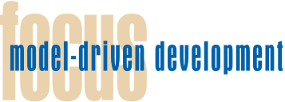
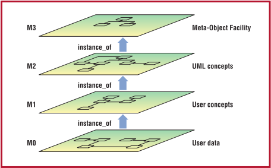
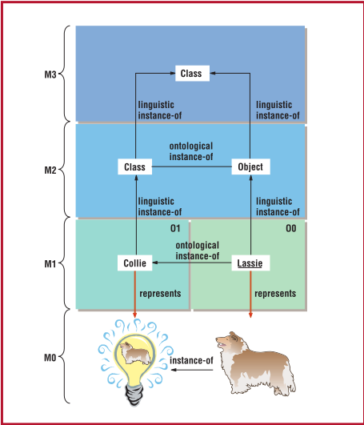
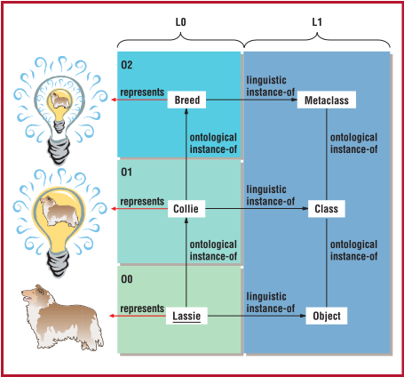
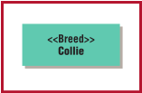
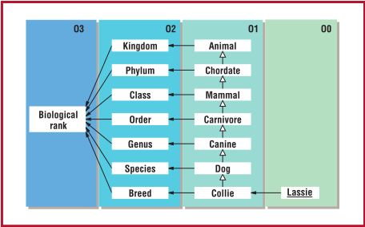

> Converted from [`model-driven-development-a-metamodeling-foundation.pdf`](model-driven-development-a-metamodeling-foundation.pdf) with docling. Figures are in [`model-driven-development-a-metamodeling-foundation-images/`](model-driven-development-a-metamodeling-foundation-images/). Page numbers for each section are in [`INDEX.md`](../../INDEX.md).

## Model-Driven Development: A Metamodeling Foundation

Colin Atkinson, University of Mannheim

Thomas Kühne, Darmstadt University of Technology

E ver since human beings started using computers, researches have been working to raise the abstraction level at which software engineers write programs. The first Fortran compiler was a major milestone in computer science because, for the first time, it let programmers specify what the machine should do rather than how it should do it.  Since  then,  engineers  have  continued  apace  to  raise  programming  abstraction levels. Today's object-oriented languages let programmers tackle

problems of a complexity they never dreamed of in the early days of programming.

Model-driven  development 1,2 is  a  natural continuation of this trend. Instead of requiring developers  to  spell  out  every  detail  of  a  system's  implementation  using  a  programming language, it lets them model what functionality is needed and what overall architecture the system should have. Nowadays, compilers automatically  handle  issues  such  as  object  allocation, method lookup, and exception handling, which were programmed manually just a few

Although metamodeling is an essential foundation for model-driven development, the traditional 'language definition' interpretation of metamodeling doesn't meet all the technical requirements for an MDD infrastructure. However, it can easily be extended to provide the necessary support.

years ago. By raising abstraction levels still further, MDD aims to automate many of the complex (but routine) programming tasks-such as providing support for system persistence, interoperability, and distribution-which still have to be done manually today.

Because of MDD's potential to dramatically change the way we develop applications, companies are already working hard to deliver supporting technology. However, there is no universally  accepted  definition  of  precisely  what MDD is and what support for it entails. In particular, many requirements for MDD supportwhere they've been identified-are still implicit. So, after reviewing the underlying motivations for MDD, this article sets out a concrete set of requirements that MDD infrastructures should support. It then analyzes the technical implications of these requirements and offers some basic principles by which they can be supported.

## Requirements for model-driven development

The underlying motivation for MDD is to improve productivity-that is, to increase the return  a  company  derives  from  its  software development effort. It delivers this benefit in two basic ways:

- ■ It  improves  developers'  short-term  productivity by increasing a primary software artifact's  value  in  terms  of  how  much functionality it delivers.
- ■ It improves developers' long-term productivity by reducing the rate at which a primary software artifact becomes obsolete.

The short-term productivity  level  depends on  how  much  functionality  you  can  derive from  a  primary  software  artifact.  The  more executable  functionality  it  can  generate,  the higher the productivity will be. To date, most tool support for MDD centers on this form of productivity; most tool vendors have focused their  efforts  on  automating  code  production from  visual  models.  However,  this  addresses only one of the two main aspects of MDD.

The  long-term  productivity  level  depends on a primary software artifact's longevity. The longer an artifact stays valuable, the greater its return on investment will be. Thus, a second and  strategically  more  important  aspect  of MDD is reducing primary artifacts' sensitivity to  change.  Four  main  fundamental  forms  of change are particularly important:

1. Personnel . As long as developers store vital development knowledge in their minds, software  organizations  run  the  risk  of  losing such information through personnel fluctuations, which are all too frequent. To ensure that software artifacts outlive their creator's tenure, they must be accessible and useful to as wide a range of people as possible. In addition to being presented concisely, software artifacts  should  take  a  form  that  all  interested stakeholders, including customers, can understand  easily.  Technically  this  implies that software artifacts must be described using a concise and tailorable notation .
2. Requirements . Changing requirements have always been a big problem in software engineering,  but  never  more  than  today.  Not only must developers supply new features and capabilities at an ever-increasing rate,

but the impact of these changes on the system's existing parts must be low in terms of maintenance efforts and disrupting online systems. They can't simply take enterprise applications offline for extended periods of time to extend the system; they must realize changes while a system is running. At a technical level, this implies the need to support the dynamic addition of new types at runtime.

3. Development platforms . Primary software artifacts that are tied to one tool are only useful for the lifetime of that tool. But because tools are constantly evolving, it's obviously advantageous to decouple artifacts from  their  development  environments. Thus, another technical requirement is that tools should store artifacts in formats that other  tools  can  use;  they  should  support high interoperability levels .
4. Deployment platforms .  As  soon  as  developers master one new platform technology, another comes along to take its place. To increase  primary  software  artifacts'  lifetime,  developers  must  shield  them  from changes  at  the  platform  level.  Technically this means that, to the greatest possible extent, they must automate the process of obtaining platform-specific software artifacts from platform-independent ones by applying user-definable mappings .

These forms of change can happen concurrently,  so  the  techniques  for  accommodating them must at least be compatible with one another, and at best complement each other synergistically. However, before we enhance and combine existing techniques for this purpose, let's  summarize  the  technical  requirements these  techniques  should  support.  An  MDDsupporting infrastructure must define

1. The concepts available for creating models and the rules governing their use
2. The notation to use in depicting models
3. How  the  model's  elements  represent  realworld elements, including software artifacts
4. Concepts to facilitate dynamic user extensions  to  model  concepts,  model  notation, and the models created from them
5. Concepts  to  facilitate  the  interchange  of model concepts and notation, and the models created from them
6. Concepts to facilitate user-defined mappings from models to other artifacts, including code

The underlying motivation for MDD is to improve productivity.

Figure 1. Traditional Object Management Group modeling infrastructure.

Having clarified what capabilities we would like an MDD infrastructure to provide, we can look at how to satisfy these requirements.

## Toward an MDD infrastructure

Based on these requirements, it's clear that one of the technological foundations for MDD support  is  visual  modeling.  Visual  modeling not only directly addresses Requirements 1-3 just  described,  but  also  has  a  long  record  of success in various engineering disciplines-including software engineering-as a way of effectively using human visual perception.

The technology with the best track record for  supporting  flexible  language  extension  is object  orientation.  By  letting  developers  extend the set of available types, object-oriented languages directly support Requirement 4, albeit  in  a  static  (that  is,  offline)  way.  Objectorientation is therefore generally regarded as one of the other key foundations of MDD.

Finally, the approach that's been most effective at addressing Requirements 5 and 6 defined earlier is the use of metalevel description techniques. These are vital for providing dynamic as well as static support for Requirement 4. With metalevel description  techniques  of  modeling  constructs and user types, you can fully customize models to  a  certain  domain,  or  class  of  stakeholders, and add new types dynamically at runtime.

The challenge we face in creating an infrastructure for MDD, therefore, is optimally integrating visual modeling, object orientation, and metalevel  description  techniques.  We  will  first analyze the existing approach for doing this and then suggest some enhancements that better address all six technical requirements listed earlier.

## Traditional MDD infrastructure

Figure  1  illustrates  the  traditional  fourlayer  infrastructure  that  underpins  the  first generation of MDD technologies-namely the Unified  Modeling  Language 3 and  the  MetaObject Facility. 4

This infrastructure consists of a hierarchy of model levels, each (except the top) being characterized as an instance of the level above. The bottom level, M0, holds the user data -the actual  data  objects  the  software  is  designed  to manipulate. The next level, M1, is said to hold a model of the M0 user data. User models reside at this level. Level M2 holds a model of the information at M1. Because it's a model of a model, it's often referred to as a metamodel. Finally,  level  M3  holds  a  model  of  the  information at M2, and therefore is often called the meta-metamodel.  For  historical  reasons,  it's also referred to as the Meta-Object Facility.

This  venerable  four-layer  architecture  has the  advantage  of  easily  accommodating  new modeling standards (for example, the Common Warehouse  Metamodel)  as  MOF  instances  at the M2 level. MOF-aware tools can thus support  the  manipulation  of  new  modeling  standards  and  enable  information  interchange across MOF-compatible modeling standards.

Although it's been a successful foundation for  first-generation  MDD  technologies,  this traditional infrastructure doesn't scale up well to handle all technical Requirements 1-6 described  earlier.  In  particular,  we  can  identify four key problems:

- ■ No explanation  exists  of  how  entities  in the infrastructure relate to the real world. Does  the  infrastructure  accommodate real-world elements or do they lie outside?
- ■ The infrastructure implies that all instanceof relationships between elements are fundamentally of the same kind. Is this a valid approach or should we be more discriminating?
- ■ No explicit principle exists for judging at which level a particular element should reside. Using a single instance-of relationship to  define  the  metalevels  always  seems  to introduce inconsistencies.  Can  we  use  instantiation to define metalevel boundaries and, if so, how?
- ■ A preference exists for using metalevel description (sometimes in the form of stereotypes) to provide predefined concepts. How can we integrate the other way of supplying predefined  concepts-libraries  of  (super-) types, to be used or specialized-within the architecture?

| Table 1 Language definition - Concept   | Table 1 Language definition - Purpose                          | Table 1 Language definition - UML solution                                             |
|-----------------------------------------|----------------------------------------------------------------|----------------------------------------------------------------------------------------|
| Abstract syntax                         | The concepts from which models are created (see Requirement 1) | Class diagram at level M2                                                              |
| Concrete syntax                         | Concrete rendering of these concepts (see Requirement 2)       | UML notation, informally specified                                                     |
| Well-formedness                         | Rules for applying the concepts (see Requirement 1)            | Constraints on the abstract Syntax (using the Object Constraint Language, for example) |
| Semantics                               | Description of a model's meaning (see Requirement 3)           | Natural language specification                                                         |

To address these problems, we must adopt a more sophisticated view of metamodeling's role in MDD and refine the simple one-size-fits-all view of instantiation. Regarding all instance-of relationships  as  being  of  essentially  the  same form and playing the same role doesn't scale up well for Requirements 1-6. Instead, it's helpful to  identify  two  separate  orthogonal  dimensions of metamodeling, giving rise to two distinct forms of instantiation. 5,6 One dimension is  concerned  with  language  definition  and hence  uses linguistic  instantiation .  The  other dimension  is  concerned  with  domain  definition  and  thus  uses ontological  instantiation . Both forms occur simultaneously and serve to precisely locate a model element with the language-ontology space.

## Linguistic metamodeling

As indicated before, Requirements 1-3 essentially state the need for a language-definition capability (see Table 1). Much of the recent work on enhancing the infrastructure, therefore, has focused  on  using  metamodeling  as  a  language definition tool. With this emphasis, the linguistic  instance-of  relationship  is  viewed  as  dominant and levels M2 and M3 are regarded as language definition layers.

This approach relegates ontological instanceof  relationships,  which  relate  user  concepts  to their domain types, to a secondary role. In other words,  whereas  linguistic  instance-of  relationships  cross  (and  form  the  basis  for)  linguistic metalevels, ontological instance-of relationships don't cross such levels; they relate entities within a given level. Figure 2 shows this latest interpretation of the four-layer architecture as embraced by the new UML 2.0 and MOF 2.0 standards. Although  the  latter  take  a  predominantly  linguistic view, it's useful to nevertheless let ontological (intralevel) instantiation establish its own kind of ontological (vertical) metalevel boundaries, as the different shades in level M1 in Figure 2 indicate.

As well as making the existence of two orthogonal metadimensions explicit, Figure 2 illustrates  the  relationship  between  model  elements and corresponding real-world elements. User objects no longer inhabit the M0 levelinstead,  the  real-world  elements  that  they model  do.  (The  lightbulb  denotes  the  mental concept 'Collie.') Note that the real Lassie is represented by object Lassie ; that is, instanceof  is  no  longer  used  to  characterize  the  real Lassie as an instance of Collie .  User  objects (that is, model representatives of real-world objects) now occupy the M1 level, along with the types  they  are  ontological  instances  of.  (User data is  also  considered  part  of  the  real  world even though it's artificial and might even represent  other  real-world  elements.)  Every  level from M1 on is regarded as a model expressed in the language defined at the level above it.

Figure 2. Linguistic metamodeling view.

Figure 3. Ontological metamodeling view.

Figure 4. Ontological metamodeling through stereotypes.

## Ontological metamodeling

Although  linguistic  metamodeling  addresses many of the technical requirements, it isn't sufficient on its own. In particular, Requirement 4 calls  for  the  capability  to  dynamically  extend the set of domain types available for modeling, and this in turn requires the capability to define domain metatypes, or types of types. We refer to this  as ontological  metamodeling because  it's concerned with describing what concepts exist in a certain domain and what properties they have.

Figure 2 contains an example of ontological instantiation. The model element Lassie is an ontological instance of Collie , and thus resides at a lower ontological level than Collie . This expresses the fact that in the real world, the mental concept Collie is the logical type of Lassie.

Figure 2 only contains two ontological model levels, O0 and O1, both contained in linguistic level M1, but we can naturally extend this dimension to give further ontological levels. Figure  3  features  another  ontological  level,  O2, showing that we can regard Collie as an instance  of Breed .  An  ontological  metatype  not only distinguishes one type from another but also can be used to define metatype properties. For example, Breed distinguishes types such as Collie and  Poodle  from  other  types  (such  as  CD  and DVD) and can also be used to define breed properties, such as where a particular breed originated or what other breed it was developed from.

Figure 3 also makes another important point regarding  the  relationship  of  the  two  metadimensions,  linguistic  and  ontological,  because it's a 90-degree clockwise rotation of Figure 2, adding level O2. We have also relabeled levels MO and M1 to LO and L1 to emphasize their linguistic role. Instead of arranging the linguistic metalevels horizontally so as to suggest that the  traditional  infrastructure's  metalevels  are linguistic,  Figure  3  arranges  the  ontological metalevels horizontally to suggest that the traditional metalevels are ontological. Both arrangements are equally valid because the traditional infrastructure made no distinction between  ontological  or  linguistic  instantiation and no choice about its metalevels' meaning.

Not only are  both  arrangements-or  viewpoints-equally  valid,  they  are  equally  useful. Just as ontological metamodeling is relegated to a  secondary  role  when  we  take  the  linguistic viewpoint, linguistic metamodeling is relegated to a secondary role when we take the ontological  viewpoint.  Ideally,  an  MDD  infrastructure should give equal importance to both ontological and linguistic metamodeling; neither should be subservient to the other. Unfortunately, this isn't the case in the new UML 2.0 infrastructure.

UML 2.0 and MOF 2.0 emphasize the linguistic dimension. Levels O0 and O1 exist in M1 but aren't explicitly separated by a metalevel boundary . Ontological metamodeling is not excluded per se, but the encouraged mechanisms for enabling it-profiles and stereotypes-have known limitations. While it's possible to express that Collie is an instance of Breed (see Figure 4), the full arsenal of M1 modeling concepts isn't available for stereotype modeling-for example, a visual model of associations and generalization relationships between metaconcepts.

However, researchers have long recognized the  ability  to  freely  model  with  metaconcepts (that is, fully use an O2 level) as useful. Being able to use metaconcepts such as TreeSpecies 7 or Breed is a big advantage. Figure 5 shows perhaps one of the most mature, established examples of ontological metamodeling: the biological  taxonomy for living beings. Metaconcepts such as Breed, Species, and so on serve to let new creature classes be added to the taxonomy. In a software system, they would facilitate the dynamic  addition  of  new  types  at  runtime. Note that you can't cast Breed, Species, and so on as supertypes at the O1 level. While it makes sense to say that Lassie is a Collie, a Dog, and so on, it doesn't make sense to say that Lassie is a  Breed,  a  Species,  and  so  on.  Also,  it  isn't  a problem to accommodate level O3 (see Figure 5)  in  the  ontological  metadimension,  while stereotypes aren't designed to support this.

Ontological metamodeling is particularly important  for  MDD because it's  explicitly  called for in two of the main strategies for model transformation defined  in  the  MDA  User's  Guide. 8 First, it's the basis for the marking mechanism that's envisaged as one of the key ways to support the user-driven definition of model transformation,  that  is,  to  support  Requirement  6. Second, it's the basis for defining mappings in the framework-based version of type-level transformation. This assumes the existence of an ontologically  predefined  set  of  superclasses  (with associated predefined mappings) that users specialize with their own application classes.

W e've  defined  a  concrete  set  of  requirements that an ideal MDD infrastructure should support. We've also  argued  that  explicitly  distinguishing  the two orthogonal forms of metamodeling-linguistic  and  ontological-is  the  key  to  fixing some  of  the  problems  in  the  first-generation MDD infrastructure  and  to  scaling  it  up  to satisfy all the identified requirements.

The  forthcoming  revision  of  the  OMG's MDD infrastructure in the UML 2.0 and MOF 2.0 standards represents a significant step forward in that, for the first time, it accommodates two  distinct  forms  of  instantiation.  However, two significant problems remain.

First, although the distinction is present, it isn't explicit enough. Although the infrastructure recognizes linguistic metalevel boundaries, ontological boundaries remain implicit. When coupled  with  the  fact  that  stereotypes  remain  the preferred mechanism for user metamodeling, it's clear that the new standard is still unduly balanced towards linguistic metamodeling.

Second, in the current profile  mechanism, there's still a bias toward locating predefined concepts  at  the  metalevel  (that  is,  as  part  of the modeling language) rather than as regular user types at the M1 level. This is despite the fact  that  libraries  or  frameworks  at  the  M1 level have established a strong track record for making predefined concepts available  for  direct use or specialization by users. In fact, the MDA  User's  Guide 8 explicitly  exploits  this form of reuse and predefinition as a means for defining reusable type mappings.

Despite this reservation, the new OMG MDD infrastructure does represent a significant step forward  and  provides  most  of  the  identified technical capabilities. We hope that this article might help improve subsequent versions of the infrastructure in the future.

## References

1. J. Mukerji and J. Miller, eds., 'Model Driven Architecture,' www.omg.org/cgi-bin/doc?ormsc/2001-07-01.
2. D.S. Frankel, Model Driven Architecture: Applying MDA to Enterprise Computing , OMG Press, 2003.
3. OMG Unified Modeling Language Specification , Object Management Group, 2003, http://doc.omg.org/formal/ 03-03-01.
4. Meta Object Facility (MOF) Specification , Object Management Group, 2003, http://doc.omg.org/formal/02-04-03.
5. C. Atkinson and T. Kühne, 'Rearchitecting the UML Infrastructure,' ACM Trans. Modeling and Computer Simulation , vol. 12, no. 4, Oct. 2002, pp. 290-321.
6. J. Bézivin and R. Lemesle, 'Ontology-Based Layered Semantics for Precise OA&amp;D Modeling,' Object-Oriented Technology , LNCS 1,357, Springer-Verlag, 1998, pp. 151-154.
7. J. Odell, 'Power Types,' J. Object-Oriented Programming , vol. 7, no. 2, Mar./Apr. 1994, pp. 8-12.
8. XMIVersion 1 Production of XML Schema Specification , Object Management Group, 2003, http://doc.omg. org/formal/03-05-01.

For more information on this or any other computing topic, please visit our Digital Library at http://computer.org/publications/dlib.

## About the Authors

Colin Atkinson holds the chair of software engineering at the University of Mannheim. His research interests focus on object and component technology and their use in the systematic development of software systems. He received his PhD in computer science from Imperial College London. Contact him at FG Software Engineering, University of Mannheim, L 15, 16, 5. OG, Zi. 520, 68161 Mannheim, Germany; atkinson@informatik.uni-mannheim.de.

Thomas Kühne is an assistant professor at the Darmstadt University of Technology. His research interests focus on object technology, programming language design, component architectures, and metamodeling. He received his PhD from the Darmstadt University of Technology. Contact him at FG Metamodeling, TU Darmstadt, Wilhelminenstr. 7, 64283 Darmstadt, Germany; kuehne@informatik.tu-darmstadt.de.

Figure 5. Ontological metamodel of biological classification.