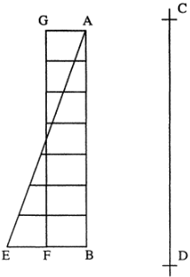
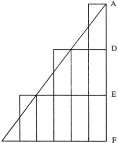
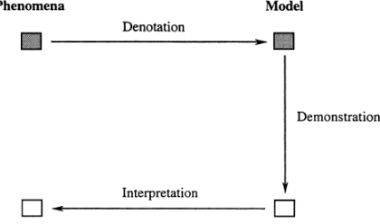
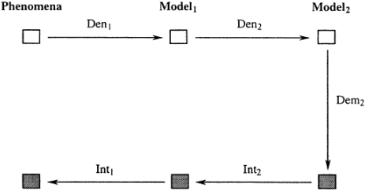

> Converted from [`models-and-representation.pdf`](models-and-representation.pdf) with docling. Figures are in [`models-and-representation-images/`](models-and-representation-images/). Page numbers for each section are in [`INDEX.md`](../../INDEX.md).

## Models and Representation

Author(s): R. I. G. Hughes

Source: Philosophy of Science, Dec., 1997, Vol. 64, Supplement. Proceedings of the 1996 Biennial Meetings of the Philosophy of Science Association. Part II: Symposia Papers (Dec., 1997), pp. S325-S336

Published by: Cambridge University Press

[Stable URL: https://www.jstor.org/stable/188414](https://www.jstor.org/stable/188414)

## Accessibility support:

This file was last remediated 2026-09-01. If you experience accessibility issues with this file, report them here

JSTOR is a not-for-profit service that helps scholars, researchers, and students discover, use, and build upon a wide range of content in a trusted digital archive. We use information technology and tools to increase productivity and .facilitate new forms of scholarship. For more information about JSTOR, please contact support@jstor.org

Your use of the JSTOR archive indicates your acceptance of the Terms &amp; Conditions of Use, available at https://about.jstor.org/terms

Cambridge University Press is collaborating with JSTOR to digitize, preserve and extend access to Philosophy of Science

## Models and Representation

## R. I. G. Hughest

London School of Economics

A general account of modeling in physics is proposed. Modeling is shown to involve three components: denotation, demonstration, and interpretation. Elements of the physical world are denoted by elements of the model; the model possesses an internal dynamic that allows us to demonstrate theoretical conclusions; these in turn need to be interpreted if we are to make predictions. The DDI account can be readily extended in ways that correspond to different aspects of scientific practice.

1. Introduction. One major philosophical insight recovered by the semantic view of theories is that the statements of physical theory are not, strictly speaking, statements about the physical world. They are statements about theoretical constructs. If the theory is satisfactory, then these constructs stand in a particular relation to the world. To flesh out these claims, we need to say more about what kinds of constructs are involved, and what relation is postulated between them and the physical world. To call the theoretical constructs "models," and the relation "representation," does not get us very far. Scientific models, as the term is now used, are many and various. If our philosophical account of theorizing is to be in terms of models, then we need both to recognize this diversity and to identify whatever common elements exist within it. The characteristic perhaps the only characteristicthat all theoretical models have in common is that they provide representations of parts of the world, or of the world as we describe it. But the concept of representation is as slippery as that of a model. On the one hand, not all representations of the world are theoretical models; Vermeer's "View of Delft" is a case in point. On the other, the representations used in physics are not, in any obvious sense, all of one kind. What, we may ask, does the representation of a crystal as an

tDepartment of Philosophy, Logic and Scientific Method, London School of Economics and Political Science, Houghton Street, London WC2 2AE, UK.

Philosophy of Science, 64 (Proceedings) pp. S325-S336. 0031-8248/97/64supp-0030$0.00 Copyright 1997 by the Philosophy of Science Association. All rights reserved.

S325

S326 R. I. G. HUGHES

arrangement of rods and spheres have in common with the representation of the motion of a falling body by the equation s = gt2/2? Apart, of course, from being the sort of representation that a model provides.

2. Galileo's Diagrams. Galileo's writings offer a good place to start. Much of the Third Day of his Discourses Concerning Two New Sciences is given over to kinematics, specifically to "Naturally Accelerated Motions." In Proposition I, Theorem I of this section of the work Galileo relates the distance traveled in a given time by a uniformly accelerating object starting from rest with that traveled in the same time by an object moving with uniform speed. He concludes that the two distances will be equal, provided that the final speed of the accelerating object is twice the uniform speed of the other. To demonstrate this proposition (i.e., to prove it), Galileo uses a simple geometrical diagram (Fig. 1). He writes,

Let line AB represent the time in which the space CD is traversed by a moveable in uniformly accelerated movement from rest at C. Let EB, drawn in any way upon AB, represent the maximum and final degree of speed increased in the instants of the time AB. All the lines reaching AE from single points of the line AB and drawn parallel to BE will represent the increasing degrees of speed after the instant A. Next, I bisect BE at F, and I draw FG and A G parallel to BA and BF; the parallelogram A GFB will [thus] be constructed, equal to the triangle AEB, its side GF bisecting AE at I. (Galileo 1638, 165)

Figure 1.

After a short discussion, he concludes,

[I]t appears that there are just as many momenta of speed consumed in the accelerated motion according to the increasing parallels of triangle AEB, as in the equable motion according to the parallels of the parallelogram GB (sic). For the deficit of momenta in the first half of the accelerated motion (the momenta represented by the parallels in the triangle AGI falling short) is made up for by the momenta represented by the parallels of triangle IEF. (p. 167)

Galileo's analysis is explicitly in terms of representations. He represents a time interval by the length of a vertical line and an object's speed at any instant by the length of a horizontal line.' From our perspective, it is surprising that, after drawing attention to the equality of the two areas AEB and AFGB, Galileo does not go on to associate this equality with the equality of the distances traveled. Nonetheless, an argument relying on such an association is implicit in the diagram that accompanies the discussion of Corollary I to Proposition II (see Fig. 2). The corollary states,

[I]f there are any number of equal times taken successively from the first instant or beginning of [a uniformly accelerated] motion, say AD, DE, EF, and FG, in which spaces HL, LM, MN, and NI are traversed, then these spaces will be to one another as are the odd numbers from unity, that is, as 1,3,5,7. (p. 167)

In the diagram, alongside the line segments AD, DE, and EF that represent the first three time intervals, we find, respectively, one, three, and five rectangles, all congruent to each other.2

Galileo's strategy is to take a problem in physics and represent it geometrically. The solution to the problem is then read off from the geometrical representation. In brief, he reaches his answer by changing the question; a problem in kinematics becomes a problem in geometry.

This simple example suggests a very general account of theoretical representation. I call it the DDI account. On this account the use of a S328 R. I. G. HUGHES

1. Though the lines representing speeds are drawn as horizontal lines in his diagrams, Galileo does not insist on this; they are drawn, he says, "in any way" upon the time axis. The representation is thus given only as much geometrical structure as his problem needs.

2. In Galileo's text, the diagram accompanies the discussion after the Corollary. I have relettered the points on it to match the letters used in the Corollary itself.

model in physics involves three components: denotation, demonstration, and interpretation (see Fig. 3). The three components appear very clearly in Galileo's corollary: time intervals are denoted by distances along a vertical axis, speeds by lengths of horizontal lines. Demonstration then takes place entirely within the model. Elementary geometry

Figure 2.

Phenomena Model shows that the three areas ABC, CBFI, and IFPO are in the ratios 1:3:5. This geometrical result is then interpreted kinematically; a ratio of areas is interpreted as a ratio of distances.

Figure 3.

But this is not quite the whole story. As Simplicio says,

I am [now] able to see why the matter must proceed in this way, once the definition of uniformly accelerated motion has been postulated and accepted. But I am still doubtful whether this is the acceleration employed by nature in the motion of her falling heavy bodies. (p. 169)

We might phrase similar doubts rather differently. From our point of view, the outstanding question is not whether the acceleration employed by nature is, in fact, uniform; it is whether the motion of an actual falling body can be adequately represented in this way. For us, Galileo's representation of uniformly accelerated motion as a straight line in a geometrical diagram is a representation of a representation. Thus even so apparently straightforward an example of theoretical representation as Galileo's turns out to involve a hidden complexity.

The DDI account handles this complexity with ease, as I will show. But before doing so I need to say more about the three components that, on this account, are characteristic of theoretical representation.

3. Denotation. Let me forestall possible misunderstandings. I am not arguing that denotation, demonstration, and interpretation constitute a set of speech acts individually necessary and jointly sufficient for an act of theoretical representation to take place. I am making the more modest suggestion that, if we examine a theoretical model with these three activities in mind, we shall achieve some insight into the kind of representation that it provides. Furthermore, we shall rarely be led to assert things that are false.

We shall not, for instance, be led to say that theoretical models are similar to, or resemble their subjects in certain respects and to specified degrees.3 There are, unquestionably, some scientific models of which this is true. It is true, for instance, of the model used in the 18th century by Joseph Smeaton to investigate the relative merits of overshot and undershot water wheels. This was a miniature water wheel, similar to working water wheels in a precise geometrical sense.4 It would be a defect of the DDI account if it did not extend to material models like these; nevertheless, in their similarity to their subjects they are the exception, not the rule.

3. As does Ronald Giere, for example; see Giere 1985, 90.

4. Davis Baird discusses these in his 1994, and at greater length in an unpublished ms.

S330 R. I. G. HUGHES

To take a more typical example, we may model an actual pendulum, a weight hanging by a cord, as an ideal pendulum. We may even be tempted to say that in both cases the relation between the pendulum's length and its periodic time is approximately the same, and that they are in that respect similar to each other. But the ideal pendulum has no length, and there is no time in which it completes an oscillation. It is an abstract object, similar to material pendulums in no obvious sense. More illuminating, albeit less fashionable, would be the suggestion that material pendulums participated in its form. Instead I propose that we attend to Nelson Goodman's dictum (1968, 5) that "denotation is the core of representation and is independent of resemblance." Following Goodman, I take a model of a physical system to "be a symbol for it, stand for it, refer to it" (ibid.). Just as a vertical line in one of Galileo's diagrams denotes a time interval, elements of a scientific model denote elements of its subject; in Duhem's words (1906, 20), theoretical terms "bear to the latter only the relation of sign to the thing signified."

A view of scientific theory that placed a similar emphasis on denotation was proposed in 1953 by Stephen Toulmin. A theory, he said (1953, Ch. 4) is like a map. The positive analogy between a map and a physical theory is considerable; for present purposes, however, it is more instructive to look at the negative analogy between them, the places where they differ rather than correspond.

The first disanalogy is that a map refers only to an existing particular, whereas in general a physical theory deals with a whole class of systems, some actual, others merely possible. Given this generality of scope, the view that scientific theories denote what they represent needs to be argued for, rather than just asserted. Observe, first, that some theories do represent particulars. Cosmology does so, by definition. There are also physical theories that apply only to specific types; an obvious example is Bohr's theory (or model) of the hydrogen atom. I will assume without argument that our concept of denotation allows us to denote a type. (Think of the pictures in a flora or an illustrated dictionary.) I will call a theory like Bohr's a local theory, and the model it defines a local model. It deals with a clearly specified type of physical system. In contrast, a global theory like classical mechanics or quantum theory deals with a heterogeneous collection of physical systems. In a trivial sense, all the systems dealt with by, say, quantum mechanics can indeed be described as belonging to one type; each is a token of the type 4 4system-whose-behavior-can-be-modeled-by-quantum-mechanics. " But clearly, no model defined by quantum mechanics represents that type. Antecedent to the theory no such "type" exists. Nonetheless, by definition each individual system of that sort can be represented by a particular model defined in terms of the theory (in short, each can be represented as a quantum system), and it is at this level of specificity that denotation comes into play.

A global theory defines, not a particular model, but a class of models. In Newtonian mechanics these models involve different configurations of masses and forces, all governed by Newton's laws of motion. The first half of Book I of Newton's Principia, for example, is devoted to the behavior of theoretical systems consisting of non-interacting masses moving in a centripetal force field. Quantum mechanics, on the other hand, starts from simple energy configurations like the infinite potential wells, simple harmonic oscillators, and Coulomb potentials that are introduced in basic texts, and deduces the permissible wavefunctions of systems in these configurations. (See Cartwright 1983, 136.)

In either case, when we apply the theory we either settle for one of the standard models or order a custom-built one. Essentially, a global theory is a set of instructions for building a great variety of local models. In any application of the theory it is a local model that represents an individual physical system, or type of system. There is thus no significant difference between the representations supplied by local and global theories; neither presents a challenge to the maxim: No representation without denotation.

4. Demonstration. The second disanalogy is that theories, unlike maps, are always representations-as, representations of the kind exemplified by Joshua Reynolds' painting of Mrs. Siddons as the Muse of Tragedy. In this painting Reynolds invites us to think of his primary subject, Mrs. Siddons, in terms of another, the Muse of Tragedy, and to allow the connotations of this secondary subject to guide our perception of Mrs. Siddons. Similarly the wave theory of light represents light as a wave motion. It invites us to think of optical phenomena in terms of the propagation of waves, and so to anticipate and explain the behavior of light.

This aspect of theoretical representation is not confined to analogical models. Perhaps surprisingly, it is also characteristic of abstract mathematical representations, and is made explicit when we talk, for instance, of representing a plasma as a classical system, or as a quantum system. A mathematical representation should not be thought of simply as an idealization or an abstraction. Like an analogical representation, it presents us with a secondary subject that has, so to speak, a life of its own. In other words, the representation has an internal dynamic whose effects we can examine. From the behavior of the model we can draw hypothetical conclusions about the world over and above the data we started with.

Furthermore-and here the contrast with maps is pronounced-the S332 R. I. G. HUGHES

additional facts that theoretical representations supply may be not simply new, but novel. Obvious examples are the bright spot in the center of the shadow of a small disk whose existence was entailed by Fresnel's wave theory of light, and the peculiar joint probabilities of spaceseparated pairs of events predicted by quantum mechanics.

Of course, not all theories lead to novel conclusions. But the same internal dynamic that permits the prediction of novel facts will also allow the prediction of everyday ones. Equally, it will allow us to confirm that the theory tallies with what we already know. Its function is epistemological. To be predictive, a science must provide representations that have a dynamic of this kind built into them. That is one reason why mathematical models are the norm in physics. Their internal dynamic is supplied, at least in part, by the deductive resources of the mathematics they employ.

Even so, mathematical models are not the only ones possible. Material models also possess the requisite dynamic. If we want to apply the wave theory of light to two-slit interference, for example, we can do one of two things. We can either model the phenomenon mathematically, or we can get out a ripple tank and model light as a wave motion in the literal sense. In either case we will find that the distance between interference fringes varies inversely with the separation of the sources, and also with the frequency of the waves.

The same result appears whether we use the mathematical or the material model. The internal dynamic of the mathematical model is supplied by a mixture of geometry and algebra, that of the material model by the natural processes involved in the propagation of water waves. The internal dynamic of a computer simulation of the phenomenon would be something else again. But all these modes of representation share this common feature; they contain resources which enable us to demonstrate the results we are interested in. I choose the term "demonstration" in order to play upon its diachronic ambiguity. Whereas in the 17th century geometrical theorems were said to be "demonstrated," nowadays we demonstrate physical phenomena in the laboratory. Mathematical models enable us to demonstrate results in the first sense, material models in the second.

5. Interpretation and the Nesting of Models. The results we demonstrate with a ripple tank are, in the first instance, results about ripples. From them we draw conclusions about the behavior of light. Galileo's diagram shown in Figure 2 displays three sets of rectangles. From the number of rectangles in each set we infer the ratios of three distances. In each case the conclusions demonstrated within the model have to be interpreted in terms of its subject. Interpretation, the third movement of the triad, denotation, demonstration, interpretation, yields the predictions of the theory. Only after interpretation can we see whether theoretical conclusions correspond to the phenomena, and hence whether the theory is empirically adequate.

Heinrich Hertz, whose account of theories is an ancestor of the representational view, thought of theories as providing images (Bilder). In theorizing, he writes (1894, 1-2), "We form for ourselves images or symbols of external objects .... The images which we here speak of are our conception of things. They are in conformity with things in one important respect, namely in satisfying [a specific] requirement." The requirement he speaks of is that of empirical adequacy; we require that, "[T]he necessary consequents of the images in thought are always the images of the necessary consequents of the things pictured."

To compare vocabularies: What we call "denotation" is for Hertz the relation between images and external objects. The necessity Hertz attaches to the "necessary consequents of the images in thought" is a theoretical necessity, associated on our account, with demonstration. It is defined by the dynamic of the model. In contrast, the necessity attached to the "necessary consequents of the things pictured" is physical necessity.5 On the DDI account interpretation is a function that takes us from what we have demonstrated, the necessary consequents of the images, back into the world of things. Hertz's requirement stipulates that these theoretical consequents must themselves be images; specifically that they must denote the "necessary consequents of the things pictured." The requirement of empirical adequacy is thus the requirement that interpretation is the inverse of denotation.

This is an elegant, albeit obvious, result. Nonetheless, its elegance cannot disguise the fact that Hertz's account of theoretical representation, and the DDI account as I have so far presented it, are in an important respect misleading. I have hinted as much in saying that models may "represent the world as we describe it," in characterizing Galileo's diagrams as "representations of representations," and in my brief discussion of the local models governed by global theories.

In that discussion I pointed out that, in order to apply a foundational theory to a particular physical system we need to model the system in terms of the configurations amenable to theoretical treatment. This procedure may itself require considerable ingenuity, even if the physical system is comparatively simple. Notoriously, if we model a 3-body system within Newtonian celestial mechanics, analytic solu- S334 R. I. G. HUGHES

5. Here I am glossing, not endorsing, Hertz's account. Whether we have, or need, a coherent notion of physical necessity is a subject for debate.

tions of the relevant equations are unobtainable. Newton's strategy in treating the solar system is, first, to represent it as an abstract system of non-interacting bodies in a centripetal field, and subsequently to adjust this model to allow for perturbations due to interactions between selected pairs of bodies. Similarly, to give a quantum mechanical account of even so elementary a system as the hydrogen atom, we start by modeling it in terms of the Coulomb potential between an electron and a proton; only later do we take account of the spin of the electron by adding so-called "radiative corrections" to allow for the Lamb shift.6

On their own, complexities of this sort do not require us to modify the basic DDI account of representation. They simply show that, even in a mathematical theory, demonstration cannot to be equated with pure mathematical deduction; of comparable importance are approximative methods and perturbation techniques. But they also suggest that the resources available for demonstration may influence, and indeed dictate, the form of the theoretical model. They suggest that before we can apply the equations of the theory we will need, in Cartwright's words (1983, 133), a prepared description of the phenomena.

Two major trends within 20th century physics, however, lead to the use of models that are not, in this sense, prepared. They are the widespread use of the method of hypothesis, the use, that is, of local models to explain specific phenomena, and the emergence of a new theory of

Phenomena Model1 Model2

Figure 4.

6. For a discussion of this example, see Cartwright 1983, 137-138.

matter. Often the two go together. To take an elementary example, we explain why metals are in general good electrical conductors by giving an account of their structure in the solid state. A metallic crystal, we say, consists of a lattice of positive ions immersed in a gas of free electrons; it follows that a potential difference between the ends of a conductor will result in a drift of electrons, and hence of negative charge, through the conductor. This description of a conductor is not a prepared description, as Cartwright uses the term. It has undoubtedly been prepared in some sense, but with a very different agenda in mind, an agenda set by the nature of the explanandum rather than the requirements of quantum theory. In order to give a quantum-mechanical account of the lattice-and-electron-gas model, we would have to redescribe it as a quantum system. In other words, we would need to construct a representation of a representation.

Until Cartwright's work in the early 1980s, philosophers of physics had paid scant attention to this hierarchy of theoretical representations. Yet, as the example shows, no account of theory based on a simple dichotomy between observational and theoretical statements, or between external objects and our images of them, will do justice to theoretical practice. In contrast, the DDI account readily accommodates a hierarchy of this kind. For the model used at an early stage of theorizing (model,) can itself be the subject of another model at a deeper level (model2). In the example above, model, would be the lattice-andelectron-gas model, and model2 the system redescribed and amenable to treatment by quantum mechanics. As Figure 4 shows, the whole three-step process associated with model2 (denotation2-demonstration2interpretation2) effectively acts as the demonstration step for model1; it takes us from the images supplied by model1 to their theoretical consequents. The theory in question is the one used in demonstration2, in tandem with the practices that link the two models.

The question we started with was this: What kind of representation does a scientific model provide? The answer, in summary form, is that a scientific model provides a representation-as; it represents a primary subject in terms of a secondary subject, the model itself. The internal dynamic of the model allows the demonstration of new, and sometimes novel, conclusions. Representations of this kind may be nested one within another, so that one model provides the internal dynamic for another. Designedly skeletal, this account would need to be supplemented on a case-by-case basis to reveal, within individual examples, the strategies of theory entry, the techniques of demonstration, and the practices, theoretical and experimental, that link theoretical prediction with experimental test.

S336 R. I. G. HUGHES

## REFERENCES

- Baird, D. (1994), "Meaning in a Material Medium", in D. Hull, M. Forbes, and R. M. Burian (eds.), PSA 1994, v. 2. East Lansing, MI: Philosophy of Science Association, 441-451.
- Cartwright, N. (1983), How the Laws of Physics Lie. Oxford: Clarendon Press.
- Duhem, P. ([1906] 1991), The Aim and Structure of Physical Theory. P. P. Wiener, trans. Princeton: Princeton University Press.
- Galileo, G. ([1638] 1974), Two New Sciences. S. Drake, trans. Madison, WI: University of Wisconsin Press.
- Giere, R. (1985), "Constructive Realism", in P. Churchland and C. Hooker (eds.), Images of Science. Chicago: University of Chicago Press, pp. 75-98.
- . (1988), Explaining Science. A Cognitive Approach. Chicago: University of Chicago Press.
- Goodman, N. (1968), Languages of Art. Indianapolis: Bobbs Merrill.
- Hertz, H. ([1894] 1956), The Principles of Mechanics. R.S. Cohen, trans. New York: Dover Books.
- Toulmin, S. (1953), The Philosophy of Science: An Introduction. London: Hutchinson.