> Converted from [`on-the-unification-power-of-models.pdf`](on-the-unification-power-of-models.pdf) with docling. Figures are in [`on-the-unification-power-of-models-images/`](on-the-unification-power-of-models-images/). Page numbers for each section are in [`INDEX.md`](../../INDEX.md).

## Expert's voice

## Ontheunificationpowerofmodels

## Jean B´ ezivin

ATLAS Group, (INRIA &amp; LINA) University of Nantes, 2, rue de la Houssini` ere, BP 92208, 44322 Nantes Cedex 3, France e-mail: Jean.Bezivin@lina.univ-nantes.fr

Published online: 10 May 2005 -  Springer-Verlag 2005

Abstract. In November 2000, the OMG made public the MDA TM initiative, a particular variant of a new global trend called MDE (Model Driven Engineering). The basic ideas of MDA are germane to many other approaches such as generative programming, domain specific languages, model-integrated computing, generic model management, software factories, etc. MDA may be defined as the realization of MDE principles around a set of OMG standards like MOF, XMI, OCL, UML, CWM, SPEM, etc. MDE is presently making several promises about the potential benefits that could be reaped from a move from code-centric to model-based practices. When we observe these claims, we may wonder when they may be satisfied: on the short, medium or long term or even never perhaps for some of them. This paper tries to propose a vision of the development of MDE based on some lessons learnt in the past 30 years in the development of object technology. The main message is that a basic principle (' Everything is an object ') was most helpful in driving the technology in the direction of simplicity, generality and power of integration. Similarly in MDE, the basic principle that ' Everything is a model ' has many interesting properties, among others the capacity to generate a realistic research agenda. We postulate here that two core relations ( representation and conformance ) are associated to this principle, as inheritance and instantiation were associated to the object unification principle in the class-based languages of the 80's. We suggest that this may be most useful in understanding many questions about MDE in general and the MDA approach in particular. We provide some illustrative examples. The personal position taken in this paper would be useful if it could generate a critical debate on the research directions in MDE.

This paper is based on a guest talk presentation given at the UML'2003 conference in San Francisco and entitled: ' MDA TM : From Hype to Hope, and Reality '

Keywords:

MDE-MDA-Models - Metamodels

## 1 Introduction

There is presently an important paradigm shift in the field of software engineering that may have important consequences on the way information systems are built and maintained. Presenting their ' software factor y' approach, J. Greenfield and K. Short write in [14]:

'The software industry remains reliant on the craftsmanship of skilled individuals engaged in labor intensive manual tasks. However, growing pressure to reduce cost and time to market and to improve software quality may catalyze a transition to more automated methods. We look at how the software industry may be industrialized, and we describe technologies that might be used to support this vision. We suggest that the current software development paradigm, based on object orientation, may have reached the point of exhaustion, and we propose a model for its successor.'

The central idea of object composition is progressively being replaced by the notion of model transformation. One can view these in continuity or in rupture. The idea of software systems being composed of interconnected objects is not in opposition with the idea of the software life cycle being viewed as a chain of model transformations.

In this paper we compare the evolution and achievements of object technology in the past period with the new proposals and claims of MDE. The main message is that a basic principle in object technology ('Everything is an object' [P1]) was most helpful in driving the technology in the direction of simplicity, generality and power of integration. Similarly in MDE today, the basic principle that 'Everything is a model' [P2] has many interesting properties, among others the capacity to generate a realistic research agenda, as will be detailed in Sect. 5. We suggest that this may be most useful in understanding many questions about MDE in general and the MDA TM approach in particular.

| Everything is an object [P1]   |
|--------------------------------|
| Everything is a model [P2]     |

As suggested by Figs. 1 and 2, the core conceptual tools that were in focus in the 80's are being renewed. At the beginning of object technology, what was important was that an object could be an instance of a class and a class could inherit from another class. This may be seen as a minimal definition in support of principle [P1]. We call the two basic relations instanceOf and inheritsFrom . Very differently, what seem to be important now is that a particular view (or aspect) of a system can be captured by a model and that each model is written in the language of its metamodel. This may be seen as a minimal definition in support of principle [P2]. We call the two basic relations representedBy and conformsTo . It is very likely that the discussions on the exact meaning of these two central relations associated to principle [P2] will take some time to settle. Similarly to the sometimes-heated initial discussions on the two relations related to principle [P1] of object-oriented programming, this is also likely to generate many lively debates. The definitions we propose here are very loose and preliminary, but we are still at the stage of identifying the hard core principles of MDE.

The danger would be to use the old [P1] relations within the new context of MDE, for example by stating that a model in an instanceOf a metamodel 1 . This point of view often leads to many confusion and does not help in clarifying a complex evolution.

Fig. 1. Basic notions in object technology [P1]

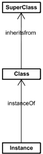

Fig. 2. Basic notions in MDE [P2]

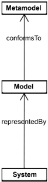

Separate consideration of the set of relations [P1] and [P2] will also help to assess that MDE and the object technology views of the software development world should not be considered as opposite but as complementary approaches.

The MDE approach has not a unique goal. Among the objectives pursued, one may list the separation from business-neutral descriptions and platform dependent implementations, the identification, precise expression, separation and combination of specific aspects of a system under development with domain-specific languages, the establishment of precise relations between these different languages in a global framework and in particular the possibility to express operational transformations between them.

Similarly, when object technology was introduced, it had no unique goal. In order to fulfill object technology multiple objectives, principle [P1] has been most helpful in the last period but seems now to have reached its limit for the increasingly complex and rapidly evolving systems we are building today. A complete new rise in abstraction seems absolutely necessary. Principle [P2] is a candidate for the paradigm shift corresponding to this important and necessary evolution.

To make this more concrete, let us take as an example one of the first objective of MDA: separating the business part from the platform part of systems in order to independently control their evolution [27]. Applying principle [P1] to this problem yielded the MVC architecture where a pure business class (called a Model ) relates in a precise standard way with two other classes (called a View and a Controller ) handling platform-specific presentation and rendering on one side and device-based dialogue control on the other side. The object technology abstraction mechanisms have partially contributed to solve the problem (GUI architecture). Unfortunately they fall short in solving it in its entirety (separating business from platform). The hope is to apply principle [P2] to the same problem in a very different and more general way: a platform-based transformation could produce an executable system from a business description, bound to this specific platform, from the neutral description of a business system. The complete feasibility and practicability of this process has still to be demonstrated, but we can nevertheless see how differently both [P1] and [P2] attack this problem, with different levels of ambition.

1 More generally, there is an over-usage of this instanceOf relation in MDE. Used in different contexts, with different meanings, this may cause additional confusion. Careful distinction between at least three different usages of this relation is suggested in [3] and [8].

This paper is organized as follows. In Sect. 2 we look at object technology and how it has achieved progresses through the unification principle. In Sect. 3 we discuss one view of the unification principle in MDE. In Sect. 4 we review some examples of models for illustrative purpose. In Sect. 5 we show how a research agenda for MDE could be inferred from the generalized application of principle [P2].

## 2 The lessons of object technology

When we look at the two basic relations of Fig. 1, we find them to be quite characteristic of object-technology. However this has not always been so clear. In programming languages like ThingLab [9], a partOf explicit relation was also proposed as an integral part of the language. In other object-oriented languages like Self , the concept of class itself was absent and thus this language was not based on the set of relations of Fig. 1. In modern languages like Java , the additional concept of Interface is also part of the scope. There were heated debates in the 80's about the exact meaning of these relations, including the controversies between single and multiple inheritance.

Nevertheless the definition of class-based programming languages like Java or C# are more or less based on the central organization depicted in Fig. 1, with rather consensual definitions of this set of relations. What we call an object is an instance of a class, this class possibly inheriting from another class.

Based on these common assumptions, some languages may go beyond these definitions, for example by providing more or less general metaclass organization schemes (a class being an instance of a metaclass). As a consequence, when we talk about an object, the context is important. In a general context, we usually mean an entity corresponding to the scheme defined in Fig. 1. If we need to be more specific, we refer to a C# object, a Java object, a C ++object, an Eiffel object, a CLOS object, etc., with usually additional properties.

## 2.1 Towards unification

Since the inception of object technology, the unification principle has been an engine for progress. The very basic idea of an object in Simula was a device that could unify data and process, a significant first step in achieving principle [P1]. Simula walked an initial path in this direction and its authors may be credited from having proposed the basic scheme of Fig. 1.

After Simula , the language that has probably most influenced the development of industrial object technology was Smalltalk . This language, through several iterations, going from Smalltalk-72 to Smalltalk 80 , tried to push as far as possible this idea that everything is an object in several ways:

- Starting from the relations in Fig. 1, the consideration of classes as objects directly induced the necessity to consider metaclasses as independent entities. Furthermore the consideration of metaclasses as objects made necessary to provide a global and regular scheme for organizing this system where the superclass of a metaclass was identical to the metaclass of the super-class. Other schemes like CLOS , ObjVlisp , etc. have also been proposed, that tried to push further this principle that everything is an object.
- Considering integer or boolean values as objects was a radical position at the time since it lead to view the expression i + j as the sending of message + with argument j to object i and not as the operator + applied to operands i and j . Of course the concept of primitive method allowed dealing with this uniform view without severe performance penalties. The distinction between primitive data types and object-based data types, at the language level, is probably not the best solution and Smalltalk avoided this pitfall by treating this distinction only at the implementation level. To this respect again, Smalltalk was an improvement on most of its successors, to use the famous formulation of C.A.R. Hoare.
- Another step was to consider messages themselves as objects. Here again the language designers managed to provide a uniform view with reasonable implementation overhead by allowing messages to be reified as true objects when needed, i.e. for example on sending errors. In these cases the doesNotUnderstand : method could be used to deal with a real message object, instance of the MessageSend class.
- As a last example we may also quote the efforts to deal with methods as objects. The unification of block closures and methods was not completely achieved in Smalltalk-80 , but the fact that block were true objects allowed to investigate a lot of interesting issues, like extensible control structures built up from simple message passing mechanisms.

Many of these advances were unfortunately not selected in modern convergence languages like Java or C# . However we can see that much progress in object technology has been made while this [P1] principle was actively pursued.

## 2.2 Incomplete achievements

On the contrary, the recent period of object technology shows many examples of situations where abandoning the quest for this [P1] principle has lead to some difficulties or at least some incomplete achievements. We may give some examples.

- With procedural technology, the notion of multiple entry point could be used to define an application as a set of services. This was used in many methods based on stepwise refinement in the 70's. What modern object-oriented programming languages have been able to offer is that unique entry point philosophy, the 'infamous' public static void main (Strings [] args). We probably missed one opportunity to represent, at the programming level, an application and its entry points by an object and its methods. In order to compensate this drawback on the programming side, I. Jacobson introduced the concept of Use Case in the UML language but this was outside the scope of the programming language itself. The impendence mismatch between these two views may partially explain the success today of service-oriented computing on object-oriented computing.
- The first real life deployment of object-oriented systems showed that the complexity of such systems could not be only encapsulated in the class definition themselves, but in the subtle relations between these classes. The normal reaction was to invent a new language based on design patterns. Unfortunately, here also, the principle of unification could not be fully applied. As a consequence design patterns cannot be seen, for the time being, as entities respecting principle [P1].
- More recently, there was recognition that objectoriented techniques were not sufficient to express the various aspects on a system. The Aspect Oriented Programming movement is currently trying to find solutions to this problem based on code-centric approaches. The objective of considering aspects as fullfledged objects, respecting principle [P1], has not yet been completely realized.

There are a lot of missed (or at least incompletely matched) opportunitiesinobject-orientedtechnology[13]. One of the major ones was the rendezvous between objects and the Web (it would have been a nice property if every object could have been identified by a URI). The marriage of objects and databases has produced limited results, far to corresponding to the initial hopes. In spite of many clever research ideas, the unification of objects and processes is not still achieved on practical basis (e.g. in workflow systems). We could also mention the limited contribution to reusability 2 . The origin of many of these problems may be traced to some form of abandoning the search for unification after the Smalltalk period. As a consequence, object-oriented computing is no more in a situation to play the role of an integration technology. Instead it is today in the state of a very useful technology to be integrated with other technologies like service-oriented computing and many others.

## 3 MDE:concepts and goals

As the notion of object was central to the software development practices of the 80's, the notion of model seems today to focus much attention. The question of defining what a model is, on a practical basis, will probably take as much time and energy to settle as the definition of the notion of an object. We propose in this paper to start from the two basic relations associated to principle [P2].

## 3.1 On the meaning of models

Whenwelook at the general definition of a model, we find a set of different ones, some of them even being contradictories. For example, on the ten definitions given in the Encarta Encyclopedia [11], there are essentially two that corresponds to our purpose in the context of MDE:

' mod · el [m´ odd'l] noun (plural mod · els )

1. copy of an object: a copy of an object, especially one made on a smaller scale than the original ( often used before a noun )
5. simplified version: a simplified version of something complex used, for example, to analyze and solve problems or make predictions a financial model '

These two meanings roughly correspond to the consensual definition given by J. Rothenberg in [25]:

'Modeling, in the broadest sense, is the costeffective use of something in place of something else for some cognitive purpose. It allows us to use something that is simpler, safer or cheaper than reality instead of reality for some purpose. A model represents reality for the given purpose; the model is an abstraction of reality in the sense that it cannot represent all aspects of reality. This allows us to deal with the world in a simplified manner, avoiding the complexity, danger and irreversibility of reality.'

2 Object technology promised for example application extensibility through class inheritance. We know today that one important kind of application extensibility is implemented with plugins, as in the Eclipse system for example. This concept of plug-in does not owe much to class inheritance.

The word model comes from the Latin modullus through the Italian modello 3 . Initially modullus was the diminutive of modus , meaning a special constraint ratio, used in architecture, between parts of a building in construction.

Modeling is essential to human activity because every action is preceded by the construction (implicit or explicit) of a model. The medical technique of bloodletting for example was based on an incorrect model of the body 4 . If the model is incorrect, the action may be inappropriate 5 .

There are plenty of practical usages of models: statistical model, meteorological model, biological models, ecological models, economical models, etc. Computer science may be mainly described as the science of building software models. If the use of the word model in engineering sciences is quite recent, the idea itself goes back to ages. Plato (427-347 BC) in the Timaeus already used the concept of irrigation channels to describe blood vessels. Later, this same model was 'refined' by the English physiologist W. Harvey (1578-1657), to characterize the blood circulatory system.

The blood circulatory model is only one view or aspect on the human body among many others (skeleton, muscular, digestive, respiratory, endocrinous, nervous, etc.). The human body being the system, a different model characterizes each aspect. This is the first relation representedBy associated to principle [P2].

There are still a lot of tentatives for building models, for example models of the brain, of the human genome, etc. A process of trial and error usually elaborates models progressively. In human history, models that have concentrated much energy are geographical models or maps. Even after the roundness of the earth was commonly accepted, it took quite a time to the first explorers to progressively assess their maps of the world.

Today we are using a lot of different maps. If one wishes to ride a bike or a truck through a given territory, the map used will be different. If one wants to visit museums or to rapidly drive on highways in the same area, different maps of the same territory will also be useful. Map making is usually a human activity. In certain cases automation may help (e.g. satellite photography) and in very specific situations we can have automatic map production. Similar remarks will apply to automatic model production in the information system area. A map is a representation of a given territory. The first relation

3 Another previous import of modullus in the Middle Ages also gave the word mould.

4 Hyppocrates and many others believed that the four crucial elements earth, air, water and fire were balanced within the human body as the four humors: blood, phlegm, and black and yellow bile. In this context, disease was due to an imbalance in the four humors and treatment involved restoring their balance through bloodletting.

5 Georges Washington died after heavy blood loss sustained in a bloodletting treatment for laryngitis.

( representedBy ) of principle [P2] clearly appears in these situations.

This example of geographical maps has much inspired the reflection on modeling practices. The notion of preciseness of a model for example has progressively been considered as a relative notion. A model is not intended to capture all the aspects of a system, but mainly to abstract out only some of these characteristics. Instead a system is usually represented by a set of different models, each one capturing some specific aspects.

Many authors, from L. Carroll to J.-L. Borges or U. Eco, have told the same story of people competing to build complete models of a system, for example maps at the 1:1 scale 6 . For example in ' Mary and Bruno concluded ', L. Carroll narrates the following story:

'That's another thing we've learned from your Nation,' said Mein Herr, 'map-making. But we've carried it much further than you. What do you consider the largest map that would be really useful?'

- 'About six inches to the mile.'

'Only six inches!' exclaimed Mein Herr. 'We very soon got to six yards to the mile. Then we tried a hundred yards to the mile. And then came the grandest idea of all! We actually made a map of the country, on the scale of a mile to the mile!'

'Have you used it much?' I enquired.

'It has never been spread out, yet,' said Mein Herr: 'the farmers objected: they said it would cover the whole country, and shut out the sunlight! So we now use the country itself, as its own map, and I assure you it does nearly as well.

But there are many other lessons to be learnt from geographical maps as well. If we look at the map presented in Fig. 3, we see in the bottom-left corner some information expressed, as in the remainder of the map, in a graphical form. But the nature of this information is different from the one in the remainder of the map. It is a legend indicating how to interpret the map itself. A map would be useless without a legend. Loosing the legend and this map would be impossible to interpret. There may also be implicit elements in a map, for example the scale or the direction (the top of the map represents the North direction), etc.

We say that the map conforms to its legend, i.e. that the map is written in the (graphical) language defined by its legend. This immediately generalizes to a model conforming to its metamodel, the second relation ( conformsTo ) associated with principle [P2].

The relation between a model and its metamodel is also related to the relation between a program and the programming language in which it is written, defined by its grammar, or between an XML document and the defining XML schema or DTD.

6 This story may be usefully recalled when one tries to capture in a UML model the totality of aspects of a Java program.

Fig. 3. Map of France in 1453 from the Historical Atlas by R. Shepherd

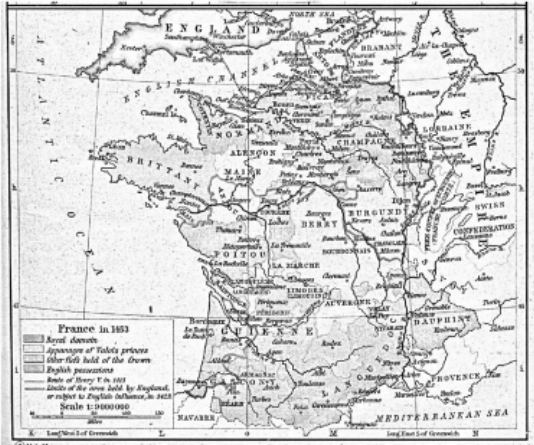

Similarly to discussions that took place about the distinction between instantiation and inheritance, there may also be discussions on the two relations associated to principle [P2]. One of them is particularly confusing on the meaning of the expression ' the model of a model '. This is usually shorthand for 'coercing' the model as a system and extracting another model from it. For example we could have a map of the area of Seattle at scale 1:50 000. Then we could consider this map as a system and derive from it another map at scale 1:100000. So the normal interpretation of 'the model of a model' is more naturally related to the representedBy relation and not to a metamodel 7 . To make clearer this distinction, let us look at Fig. 4. This famous painting by R. Magritte reads ' This is not a pipe ' below the picture of a pipe, insisting on the fact that the painting of a pipe may be useful for several purposes, but certainly not to smoke tobacco. Similarly we may have a painting of the painting, and so on. This is what we call a model of a model but this is not a metamodel.

Of course this discussion may clarify the first relation of [P2] ( representedBy ), but difficulties lay also in the definition of the second relation ( conformsTo ). The na¨ ıve introduction to these concepts needs to be elaborated on a more precise and formal way. In particular, one dimension that is absent in the previous discussion is the need for coordinating different maps. Since we said that we will use different maps to express different views on a given territory, and since these maps may be jointly used, then we must take some actions to allow the coordination between these views. Let us suppose that towns, on different maps, are differently drawn. We would need to assess that these towns correspond to similar entities, enabling them to act as 'join points' between different views. We may state that each legend defines some kind of 'domain specific language', but how may these languages be related? The limits of the analogy show up here in this case, because what we would need is a language for describing legends, what we shall call a metametamodel.

7 Asked about the reason of interpreting 'the model of a model is a metamodel', a student answered that this was because he remembered that 'a class of a class is a metaclass'. This shows again at the same time the danger of approximations, uncontrolled analogies and mixing the two systems of relations associated to [P1] and [P2].

Fig. 4. 'Ceci n'est pas une pipe', painting by Magritte revisited

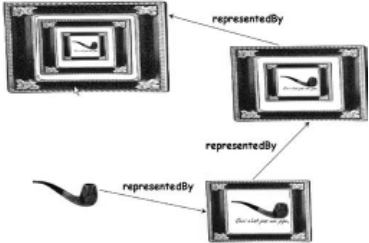

The postulate of the existence, in each technical space [18], of a unique metametamodel, is essential if we want to compare, transform, merge, make differences, etc. between different models. In MDE this postulate is essential since the number of different domain specific languages is very rapidly growing, with the danger of fragmentation. In MDA, the unique metametamodel is the MOF(Meta-Object Facility).

## 3.2 From contemplative to operational models

One important difference between the old modeling practices and modern MDE is that the new vision is not to use models only as simple documentation but as formal input / output for computer-based tools implementing precise operations. As a consequence model-engineering frameworks have progressively evolved towards solid proposals like the MDA defined by the OMG. We may clearly see the three levels of principles (general MDE principles as described in this paper), of standards (e.g. the OMG / MDAsetofstandards), and of tools (like the EMF, Eclipse Modeling Framework or the Visual Studio Team system).

Progressively we come to understand much better the possibilities and limits of this new way of considering information systems. The notion of a metamodel is strongly related to the notion of ontology. A metamodel is a formal specification of an abstraction, usually consensual and normative. From a given system we can extract a particular model with the help of a specific metamodel. A metamodel acts as a precisely defined filter expressed in a given formalism.

To make this more concrete, let us take one example. Suppose we want to consider a system S composed of several users accessing a UNIX operating system. We wish to take a model of this (Fig. 5). The first step will be to define the aspects which we are interested in, and ignore the aspects we want to discard.

Fig. 5. Extracting a model from a system

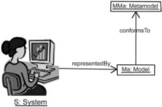

We do this with a metamodel MMa like the following one:

```
class(User,Group,File,Directory,FileElement); association(belongsTo,User*,Group) association(owns,User,FileElement*) association(contains,Directory,FileElement*) inherits(File,FileElement); inherits(Directory,FileElement);
```

This means that we are only interested in Users , Groups of users and FileElements like Directories and Files . Furthermore, we would like to consider only the facts that a File or Directory is contained into a Directory or is owned by a User or that a given User belongs to a Group . Simple multiplicity indication is provided here by starred names.

Metamodel MMa , applied to system S , will for example yield the following Ma model:

```
meta(Bob,User); meta(Jim,User); meta(Esther,User); meta(Mary,User); meta(Student,Group); meta(Teacher,Group); meta(F1,File); meta(F2,File); meta(F3,File); meta(F4,File); meta(F5,File); meta(D1,Directory); meta(D2,Directory); meta(D3,Directory); belongsTo(Esther,Teacher); belongsTo(Mary,Teacher); belongsTo(Jim,Student); belongsTo(Bob,Student); owns(Esther,D1); owns(Esther,F1); owns(Mary,D2); owns(Mary,F2); owns(Bob,D3); owns(Bob,F3); owns(Jim,F4); owns(Jim,F5); contains(D1,F1); contains(D2,F2); contains(D3,F3); contains(D2,D3); contains(D1,F4); contains(D2,F5);
```

This means for example that User Jim belongs to the Student Group and owns File F 4, contained in Directory D 1. The relation conformsTo (Ma, MMa) is holding at the global level and summarizes the various meta (X,Y) relations between any model element X and metamodel element Y .

It is worthwhile mentioning how this organization may lead at least to partial automation. One may understand how a UNIX shell script P could automatically generate a model similar to Ma . This script may be composed of classical UNIX commands like fi nd , ls , grep , sed , awk , etc. The interesting question however is how far this script P could be derived from the specification of metamodel MMa . By decorating each metamodel element of MMa with the UNIX code in charge of discovering the corresponding element ( Class or Association ), we progress towards this goal. Producing a model like Ma corresponds then to a graph exploration of metamodel MMa , with execution of the associated UNIX discovery code for each visited element.

We have used the textual notation of sNets [20] for defining the MMa metamodel and the Ma metamodel above. Of course, the same could also be expressed in a more classical way, like a visual UML-like notation, as suggested by Fig. 6. The use of visual notations may be very helpful, but is not one essential basic principles of MDE. The visual expression of a metamodel as presented in Fig. 6 is a convenience. Since defining metamodels is an activity much less frequent than defining models, specialized tools for performing this task are not economically interesting to build. This is why usually one has a tool for building models and will use it, in a special way, to build metamodels. Since the most popular metamodel in the MDA space is UML for the time being, the natural way is to use a UML case tool for building a metamodel. This is made even simpler by the alignment of the MOF (the standard language to write metamodels) with a limited subset of UML.

The basic use of a metamodel is that it facilitates the separation of concerns. When dealing with a given system, one may observe and work with different models of this same system, each one characterized by a given metamodel. When several models have been extracted from the same system with different metamodels, these models remain related and, to some extent, the opposite operation may apply, namely combination of concerns.

The organization of the classical four-level architecture of OMG should more precisely be named a 3+1 architecture as illustrated in Fig. 7. At the bottom level, the M 0 layer is the real system. A model represents this system at level M 1 . This model conforms to its metamodel defined at level M 2 and the metamodel itself conforms to the metametamodel at level M3. The metametamodel conforms to itself. This is very similar to the organization of programming languages. A self-representation of the EBNF notation takes some lines. This notation allows defining infinity of well-formed grammars. A given grammar, for example the grammar of the Pascal language, allows defining the infinity of syntactically correct Pascal programs.

Fig. 6. Another expression for the MMa metamodel

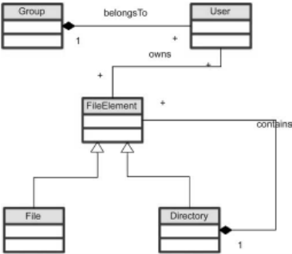

Fig. 7. The 3+1 MDA organisation

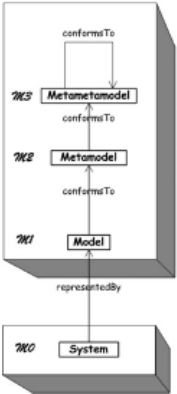

As previously stated, one of the best-known metamodels in the MDA is the UML metamodel. Many CASE tools have been built to support this graphical language. However the real power of the MDA framework comes from the existence of level M 3 . This allows building coordination between models, based on different metamodels. One example of such coordination is model transformation, but there are many others that could be envisioned like model weaving. The existence, in the MDA, of the MOFrecommendation [21] at level M3 allows using standardized metamodels (like CWM, SPEM, EDOC, etc.). Furthermore the MOF allows defining bridges between the MDA technical space and other spaces like the XML document space (through the XMI standard [23] for serialization) or the Java technical space (through the JMI standard for accessing model elements). Many other standard projections could be useful as well like on middleware spaces (CMI for CORBA Model Interchange). Separation between content and presentation of models may also be achieved by standard projection on rendering spaces like SVG. So any MDA-model contains information but lacks facilities to handle it. One classical possibility is to use projections to other technical spaces where these facilities are available. If we want to transport a model, than we may use the XMI projection on the XML space; if we want fine-grained access to model elements, then we may use the JMI projection on the Java space; if we want to display the model, we may use projection on SVG space, and so on. Projections are associated to the MOF and may be seen as additional facilities of level M 3 .

## 4 On various kinds of models

The impact of MDA on the organization of software production and maintenance workbenches is beginning to appear. The UML metamodel, which was previously at the center of these workbenches, is now only one metamodel among others. At the same time, we see a number of new tools appearing, like independent transformation engines and frameworks. All these tools operate on top of a model and metamodel repository. Each of them implements a limited set of specific operations on models and metamodels. Their behavior is sometimes partially driven by generic uploadable metamodels. The MDA landscape is going to be populated by a high number of metamodels, like the programming language technical space which is populated by a high number of language grammars or the XML document space populated by DTDs and XML schemas. Most tools were fixed metamodels tools (mainly UML-based) and now we see a new generation emerging of variable metamodel tools, these tools themselves being sometimes partially generated from the metamodel definition.

When principle [P2] is accepted, we will see hundreds or even thousands of metamodels being defined and used. Each metamodel will correspond to a specific need, goal or situation.

For example some metamodels are object-oriented, some are not. In this section we give some illustrative examples of the great variety of different models. An example of an object-oriented metamodel is given in [6]. Showing a Smalltalk metamodel (at the M 2 level), and a Smalltalk program (at the M 1 level), this example has the advantage of clarifying the correspondences between metaprogramming and metamodeling organizations. These are orthogonal dimensions, presented horizontally for the Smalltalk metaprogramming approach and vertically for the metamodeling approach. For example the question 'what is Felix ?' has two complementary answers: horizontally Felix is a Cat and vertically Felix is a Smalltalk instance .

The Smalltalk metamodel presented in Fig. 8 is obviously much simplified and is not the only possible one. Many other different aspects of a Smalltalk system could be of interest and captured by different metamodels. For example the following metamodel states that a Smalltalk-80 system is composed of a set of Categories , containing each a number of Classes , each Class containing a number of Variables and Methods (class or instance variables and methods), the Methods being themselves organized in containers called Protocols . Furthermore a number of global variables ( PoolVariables ) may be associated to several Classes . The domain specific language defined by the metamodel below could be combined with the metamodel provided at level M2 in Fig. 8.

```
class(Method, Protocol, Class, Category, Body); class(Variable, InstVar, ClassVar, PoolVar); association(methodOf, Method*, Class); association(classes, Class*, Category); association(methods, Method*, Protocol); association(variables, Variable*, Class); association(pools, PoolVar*, Class*); association(body, Method, String); inherits(InstVar, Variable); inherits(ClassVar, Variable); inherits(PoolVar, Variable);
```

After this presentation of the Smalltalk example, some remarks may complement this view:

- There is no standard view of a given system. The two presented Smalltalk views are only some among

Fig. 8. Metamodelling vs. metaprogramming

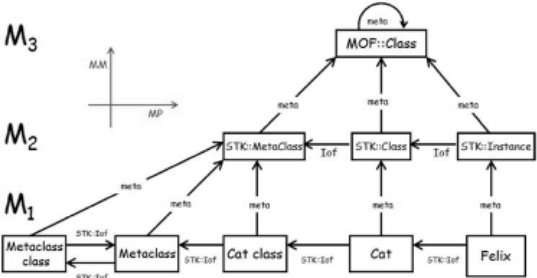

- many possibilities. For example, another different metamodel may contain the concept of Method interpreted not as above as a primitive String type, but as a structured organization of syntactic concepts. Any metamodel is associated with an envisioned goal of the extracted model. Also class inheritance relations are not shown in this metamodel to keep things simple, but could easily be added.
- If we consider the two previously presented Smalltalk views, we may notice that they are nearly disjoint, except from the concept of Class (or of Stk::Class in Fig. 8) acting as some kind of 'joint point' between the twoseparateaspects. These joint points may be used in a weaving operation between both metamodels.
- One interesting property of these small granularity metamodels is that they may be used for specific purposes but also they may also be jointly used. More a metamodel is voluminous less are the chances that it could be reused in joint application.
- It is quite easy to integrate, into the same metamodel, conceptual categories that concern several different areas, like the syntactic definition of a language and the architecture of the programming environment or IDE. An example for Smalltalk with class categories or method protocols has been given.
- One consideration that could be raised again at this point is about the relation between principles [P1] and [P2]. When we look at Fig. 1 in the light of the illustration of Fig. 8, the idea that comes to mind is that object orientation can be captured by a basic metamodel, alongside a set of extensions and adaptations of this metamodel for various other situations. For example a metamodel for the Java language could be seen as an extension of the metamodel corresponding to Fig. 1.
- We have chosen to present metamodels of the Smalltalk system. Of course we could also have taken other examples like Simula-67, Objective-C, C++, Java, C#, CLOS, etc. If we had taken the Eiffel language, then the concept of Contract would also have been present. All these considered languages are class-based languages. We could also have built a somewhat different metamodel of Self, an objectoriented prototype-based language. Having all these metamodels may serve not only to compare the languages but also to build operational bridges between them.
- MDA is able to capture object organizations as well as other organizations. This is the source of its integration capacity. For example a metamodel for simple relational database management system, as pictured in Fig. 9 does not correspond to any object-oriented artifact. However this could be most useful for expressing conversion rules between relational and object oriented organizations.

Some metamodels may be similar to grammars, but generally they are more versatile. The correspondence between these notions is a subject of current work. Besides the fact that a metamodel is usually graph-based and a grammar tree-based, there are several differences in application between these notions. Automatic translation tools between different technical spaces are being built, encompassing metamodels to / from grammars or metamodels to / from XML schemas.

A model is a representation of a system. Some systems are static, i.e. they don't change with time or may be considered as such. The USA census of year 2000 is a model of a system considered as stable on a given time of April 1, 2000 with 281 421 906 people of various name, sex, age, origin and many other characteristics. Obviously the model of a static system is itself static.

Fig. 9. Example of a relational DBMS metamodel

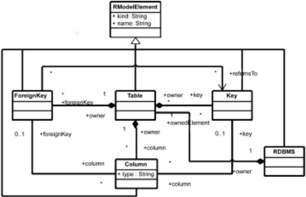

On the contrary of this example, most systems are dynamic, i.e. they change in time. But at the same time most models are static, i.e. they don't change in time. This is a highly interesting property of models because it facilitates reasoning on these models. A source program is a static model because the code does not change with time 8 . This characteristic allows for example to establish axiomatic proofs of a program.

A StateChart is a static model of a dynamic system, and many models are of this kind. However, in some cases we may also have dynamic models, i.e. models evolving in time.

Let us take an airport as a system. Let us build a simulation of this airport. The airport is represented by the simulation, i.e. the simulation has a behavior that represents the behavior of the real airport. The simulation is a dynamic model. Now if the simulation is written in a given programming language like Simula, the source program of the simulation itself is a static model of the dynamic simulation execution.

Figure 10 summarizes this, by showing that there are static and dynamic systems on one side, static and dynamic models on the other side. The only combination that seems to make no meaning is a dynamic model of a static system. All other cases make sense, with the most commonsituation being the case of a static model of a dynamic system. Whatever the kind of system or model, dynamic or static, we see that the representation relation is defined here by contextual substitutability . This means that a model should be able to answer a given set of questions in the same way the system would answer these same questions.

Another important distinction between models is the difference between product and process models. The relation between process and product is a recurrent theme in computer science. Many contributions suggest strong structural correspondence between process and product models, and several authors have provided empirical evidence of this in the last decades. These observations were usually made on the occasion of establishing guiding rules or applied model elaboration. When discussions about Structured Programming were active, N. Wirth noticed that:

8 Excluding the special case of self-modifying programs

' . . . structuring considerations of program and data are often closely related. Hence, it is only natural to subject also the specification of data to a process of stepwise refinement. Moreover, this process is naturally carried out simultaneously with the refinement of the program'.

The relation between process and products take more importance when they are expressed as formal models, within a common framework. One typical example in the MDA area was the decision to separate the search for unified modeling techniques in two phases. In the first one a metamodel for defining software artifacts (UML) was proposed, i.e. a software product metamodel. After that, a second metamodel for expressing software processes could be designed (SPEM). There are several relations between these two coordinated standards (UML 2.0 and SPEM 2.0).

There are many other situations where a product / process couple exists in the MDE landscape, for example when considering component / workflow systems. The product metamodel has a role similar to data structure definition while the process metamodel is more related to generic definition of control structures. The area of intermodel relationship (similarly to XLink and related facilities in the XML technical space) has however yet to mature. This may be viewed as a special case of establishing global relations between models and metamodels.

Another possible direction is between prescriptive and descriptive models [24]. A descriptive model is a representation of a system already existing. A prescriptive model is a representation of a system intended to be built. As a matter of fact, there is little difference between these two kinds of models. In the first case, a model is built by observation of a system while in the second case a system is built by observation of a model. What is different is how these models are used. In the first case the model may be used to understand a system or to extract some aspects of this system that could be useful to build another system later. In the second case, the model may be used as a guide, a blueprint for building a new system. In both cases the same representedBy relation holds at the end.

Fig. 10. Relation between static and dynamic models and systems

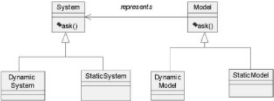

The classification of all these metamodels is a subject of high interest. The variety of different metamodels also suggests a secondary specialization relation between metamodels that could be added to complete principle [P2]. There is no yet consensus on this relation that could be used to build a lattice of metamodels, with a top element (the metamodel selecting nothing) and a bottom element (the metamodel selecting all).

Of course the ambition here is completely different from general purpose ontology initiatives like Worldnet or Cyc. The applicability domain is limited by the perimeter of information systems building and maintenance and not general knowledge management.

It is likely that large monolithic metamodels like UML 2.0 will see some limitations to their usage because of their complexities. There are several reasons for this. The major one is that most usages rely only on a small subset of the entire metamodel. Any well designed process should provide a precise characterization of these subsets. Although there are some conceptual tools to do this (UML profiles are one example), it is much more difficult to work by restriction than by extension. Working by extension means dealing with a much more important number of metamodels of high abstraction. Tools to deal with this important number of combinable and extensible metamodels are still to be invented. Present navigator architectures, often based on the class browsers of the 80's, are not sufficient to handle this new situation. We need some support for 'modeling in the large', i.e. establishing and using global relations between models, metamodels and the associated metadata.

In this rapid evolution of the industrial landscape, we clearly see the impact of principle [P2] at work. One may not accept to have only, for example, one standard UML to Java transformation option, 'hardwired' in a given UMLCASE tool. On the contrary, one will use this UML tool to capture UML models, and then choose among a large library of transformations, the ones that would suit its own goal and environment. If none is found, one may specialize some of them to correspond to particular needs. Besides transformation tools, there will also be verification, metrication, legacy recovery, model weaving tools and much more. All these tools will uniformly access models, metamodels, and their elements through a common standard repository API. This regular industrial organization of the tool cooperation, in the software production chain, is made possible because of the unification power of models.

## 5 Aproposed research agenda

The MDA has demonstrated the realism of MDE principles. From there on, we may now envision a path of increasing applicability. Several potential progresses may be associated to the experimental application of principle [P2]. Many open research problems may be related to a loose or strict application of this principle. There is also a need for a deeper understanding of the two associated basic relations.

## 5.1 Applying the unification principle

As announced in the introduction, it is our claim that the more we stick to the basic [P2] principle, the more we may hope to see a very general, sound, regular, long-lasting and widely applicable set of techniques. Many of the examples given below suggest research paths that could be investigated in the near future.

Programs as models. Programs are expressed in a programming language. If we make explicit the correspondence between a grammar and a metamodel, programs may be converted into equivalent MDA-models. In the same way a Java program may be converted into an XMLmodel, i.e. into an XML document conformant to the JavaML DTD [1] for example. The problem is thus to be able to implement agile bridging between these different spaces (MDA, XML and Program space). This is a matter of changing the representation, knowing that each technical space has some advantages and drawbacks. For example the programming technical space illustrated in the left of Fig. 11 has the advantage of granting natural executability, the MDA and XML technical spaces on the other side having the advantage of allowing easier interoperation with other specific standards and tools.

Traces as models. A program may also be considered as a static system because its code does not change with time. Another interesting system is one particular execution of a program, which is a dynamic system. As previously discussed, we can have models of dynamic as well as static systems. One example of a model of the dynamic execution of a program is a trace. A trace is an interesting example of a model. It may be based on a metamodel and will express the specific events traced (object creation, process activations, method calls, exception events, etc.).

Fig. 11. The same program represented in different technical spaces

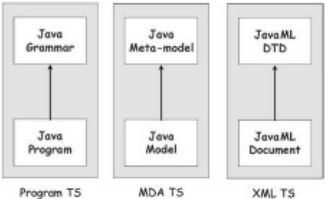

Platforms as models. In the traditional MDA approach, the objective is to be able to generate platform specific models (PSMs) from platform independent models (PIMs). In order to carry this task with sufficient automacity we need to have precise models of the targeted platforms like the Web , CORBA , DotNet , EJB , etc. Platform description models (PDMs) seem presently to be the missing link of the MDA. Answering the question of what is a platform may be difficult, but until a precise answer is given to this question, the notion of platform dependence and independence (PSMs and PIMs) may stand more in the marketing than in the technical and scientific vocabulary.

There is a considerable work to be done to characterize a platform. How is this related to a virtual machine (e.g. JVM) or to a specific language (e.g. Java)? How is this related to a general implementation framework (e.g. DotNet or EJB) or even to a class library? How to capture the notion of abstraction between two platforms, one built on top of the other one? The notion of a platform is relative because, for example, to the platform builder, the platform will look like a business model. One may also consider that there are different degrees of platform independence, but here again no precise characterization of this may be seriously established before we have an initial definition of the concept of platform.

One possible hint to answering this question would be to use insight from the work of M. Jackson [16]. As suggested by Fig. 12, the idea of considering on one side the world, on the other side the machine and to interpret the intersection as shared phenomenon, bear some similarities with the classical ' Y development cycle', revisited in MDA style. The lowest part of Fig. 12 suggests that the production of a PSM may be more a model weaving than a direct model transformation operation.

Legacy as models. There is more than forward engineering in MDE. Platform of the past ( Cobol , PL / 1 , Pascal , CICS , etc.) should be considered as well as platforms of the present or platforms of the future. The extraction of MDE-models from legacy systems is more difficult but looks as one of the great challenges of the future. There is much more to legacy extraction than just conversion from old programming languages.

Fig. 12. The world and the machine

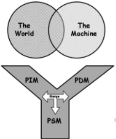

Model elements as models. In many cases we have the situation where we need models with elements representing other models or metamodels, for example to describe the software assets of a company. Of course each such element has a 'type' corresponding to its own metamodel. Model and metamodel portfolio management is a subject of high practical interest that has still to be conceptually investigated.

Transformations as models. As a special example of the search for uniformity, let us look more in detail at the example of transformations as models [4]. We shall elaborate more on this to illustrate our main point. As in other technical spaces, the MDA realized there was a need for some kind of unified transformation language or at least a family of such languages. One idea initially suggested by R. Lemesle [20] was to extend the metametamodel (MOF) with basic transformation facilities. Another idea proposed later was to define transformations DSLs, leading to the MOF / QVT request for proposal [22]. This latter approach will allow dealing with several different transformation languages in the MDA space, or at least with a family of transformation languages.

A transformation generates a target model Mb from a source model Ma (Fig. 13). Applying principle [P2], the transformation Mt itself should be a model. From that point, there are several conclusions that could be drawn. Some of them are being more important than others:

Fig. 13. Model transformation

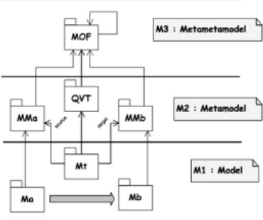

- Since often models may have a visual presentation, this can provide a natural way to graphically depict transformations.
- A model conforms to a metamodel. The source and target models conform to metamodels MMa and MMb . Similarly the transformation Mt : Ma-&gt; Mb (i.e. the transformation program itself) conforms to a metamodel MMt defining the common model transformation language .
- One nice consequence of this regular organization is that we may envision the possibility of higher-level transformations, i.e. transformations taking other transformations as input and / or producing transformations as output.
- This regular organization does not bear an important implementation overhead. As a matter of fact, the transformation engine is installed on a model and metamodel repository, uniformly considering the six input, output and transformation models and metamodels ( Ma , Mb , Mt , MMa , MMb and MMt ).
- When we say that the result of a transformation is to generate a model Mb from a model Ma , we have a bit oversimplified the situation. As a matter of fact we also need to generate a traceability model Mtr that could be used with the target model Mb for various reasons. Obviously this traceability model also conforms to a specific metamodel. There are several possible traceability metamodels.

Perhaps the domain of model transformation is the one that is presently the most illustrative of the benefits that could be reaped from a general application of principle [P2]. In our first experiments with the ATL language [7], some of these advantages have been noticed. In this ATL project, a transformation virtual machine has been defined with a set of bytecode operations accessing the model and metamodel elements, providing independence from the underlying layer ( EMF , MDR , etc.). The idea that a common language could be used for any kind of input or output metamodels is now established. The fact that all input, output and traceability models and metamodels are similarly considered, allows basing the transformation virtual machines on a very well defined API for accessing to the various elements of these models and metamodels.

Metamodels as models. There is no reason that we could not apply transformations to metamodels themselves as we apply them to models. It is even possible to consider special operations taking a model as input and promoting it as a metamodel. One example of such a tool is the UML2MOF component available in the MDR / NetBeans space but this may also be considered as standard model transformation operations, expressed for example in languages like ATL.

Verification as models. Many operations on models may be seen as special cases of transformations. A refactoring, an improvement or verification could be viewed as regular operations on models. Verification for example could take a model and a set of verification rules as its input.

Components as models. Since there are so many different kinds of models, we need to consider them as uniformly as possible for several operations like storage, retrieval, etc. This has given rise to this idea of general model components [5]. This notion of model component is different from the classical notion of 'objects components', ` a la EJB for example. The notion of MDA component is related to issues of packaging, typing, naming, referencing, etc.

This list is obviously very incomplete. When we consider MDE with this unified vision, many well-known situations may be integrated into a more general consideration. To take one additional example, the seminal work of R. Floyd (' Assigning meanings to programs ', [12]) that founded the research field of programming axiomatics may be viewed as 'decorating' a flowchart model with an axioms model. This may lead us first to consider decorations 9 as models, then to understand the nature of the binding between the flowchart model and the axioms model, this binding being itself some kind of correspondence model. Finally, these considerations may lead us to generalize R. Floyd's approach and to add on the research agenda a new item on 'Assigning meaning to models'. Model weaving and model transformation will be essential to the study of this subject.

## 5.2 Some open research issues in MDE

Besides the previous open problems directly derived from the basic unification principle, some additional investigations will be also quite important in the field. Most of them seek to achieve a better understanding of the two [P2] relations and their possible extensions.

Regarding the correspondence between system elements and model elements, we have yet a lot of progresses to make in understanding the representation relation between a system and a model. If we have a discrete system composed of system elements, then the model represented as a set of model elements may be considered as a subset of the first one. But this probably does not capture all the aspects of the reality like the class as the set of its instances does not capture the totality of the meaning of the instanceOf relation.

One troubling issue in a theory of modeling is that a same thing may be considered at different points in time as a system or as a model. For example an abacus may be considered as a physical system made of beams, beads and roads but at the same time it may be a model of the business system and transactions for a shopkeeper in Asia. There are several theories proposing an interpretation of this situation. One of them is related to semiotics [28]. In Fig. 14, a cat is represented by a symbol in the Sowa meaning triangle, like a purchased article price may be represented by a set of beads in a Chinese abacus.

9 Some also talk about techniques for 'marking' models.

Fig. 14. The Sowa meaning triangle

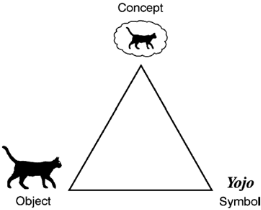

Another possible interpretation could be to consider an explicit 'casting' conversion for considering a model as a system. We mentioned this earlier when talking about deriving a 1:100 000 map from a 1:50 000 map. This explicit asSystem operation, applied to model M , would allow to extract again a new model M ′ from model M . In current practice this is a frequently observed operation. The question again is how to relate this ' model of a model ' relation with a normal model transformation operation.

When the meaning of the two basic [P2] relations will have been settled, then additional secondary relations may be considered to extend the scope of this principle [P2]. The first candidate, mentioned already from place to place in this paper, would be an extension relation between metamodels. For the time being, the ad-hoc mechanism of profiles has been used to this purpose, but it probably brings more problems than solutions. Several important questions should be answered before a precise metamodel extension mechanism could be defined and this device should have very well specified properties. A metamodel should be able to extend one or more other metamodels by adding new elements. The extension mechanism should be completely defined at level M3 (i.e. at the metametamodel level) in order to be truly metamodel agnostic. The added elements should be related to elements in the base metamodel or to other added elements by a precisely defined relation. We have yet to see a complete proposal for a general, precisely defined metamodel extension mechanism; this issue is high in priority position in the list of model engineering issues to solve.

As already mentioned, the solutions to many problems need a prior definition of the exact status of the relations between elements of different metamodels (global inter-model relations), between elements of a same metamodel (intra-model relations) and between a model and elements of a model. The same also applies to relations between different metamodels or even relations between models and metamodels.

Many operations, of different arities, on models and metamodels have yet to be identified [5]. Model transformation is only one of them. Among important other operations that need to be specified, one may quote for example model weaving, model merging, model difference ( diff on models), model metrication (establishing measures on models), metamodel alignment, etc. General operations may be applied to most models but specific operations may be applied to specific kinds of models only. One example of a general operation that could be applied to any kind of model is the serialization projection (in XMI format for example). One example of an operation that could only be applied to a transformation model is preliminary verification with respect to a couple of metamodels (source and target). Such a preliminary verification of a transformation model could be checked before applying this transformation to a specific model. The notion of operation signature in terms of the involved metamodels has been proposed in [5]. Strict definition of these model operation signatures may help to precisely identify the functionalities of various MDE tools like CASE tools and to separate automatic operations (e.g. transformations) from manual ones (e.g. model capture, model browsing, etc.). This notion of model operation signatures hands itself easily to transformation into a system of model-based Web services going as far as service discovery in a general MDE platform.

Similarly to normalization properties that were defined on RDBMS, suitable properties could be associated to metamodels. Perhaps the best starting point to define this would be the proposals made in ontology engineering by N. Guarino [15]. More generally, many known results and operations in ontology engineering may be of high relevance to model engineering as well.

Another set of issues are related to the evolution (versioning) of metamodels. This is not something new but results previously obtained in other domains would have to be adapted to MDE. It is unlikely that this problem may be confined to the definition and implementation of model and metamodel repositories. Revisiting the issues of model management in the context of changing metamodels is an important practical issue.

The MDE perimeter is constantly broadening. Behind each file format, each Visio stencil, each tool API or proprietary data format, etc. there are metamodels hiding that could be usefully exposed and made explicit. MDE is not only directed towards code generation, but may also be used to facilitate bridging between different tools. By basing this 'bridge engineering' on a higher abstract level than simple XML exchanges (by the way of metamodels), it may become possible to achieve an important gain in interoperability.

There are even more speculative uses of MDE in future information systems. Since each model brings with it its metamodel, automatic application adaptation will be made possible, opening the way for plug-and-play model adaptation. A typical application may also be built on some code stub and an associated metamodel stub. Extensibility of this application may be obtained with an extension of the stub metamodel. For example it could be possible to deliver such application extensibility with { p, x } pairs where p is a plugin (in the sense of an Eclipse plugin) and x is the corresponding extension to the stub metamodel.

## 5.3 Applications, consequences and perspectives

Whenlooking at several remarks that have been proposed in this section, a normal reaction is to say that these are in no way innovative because they correspond to old recognized practices. This is absolutely true. The applicability of MDE very often meets implicit good practices that have previously been applied by skilled personnel in specific areas. The contribution of MDE is twofold. First it may broaden the applicability scope by bringing the benefits of this recognized know-how to a larger community, mainly through partial automation. Second it improves the good practices by making them explicit, allowing a better understanding and generalization of this know-how.

One frequent objection to MDE is that this approach is related to CASE and metaCASE tools that were proposed in the 80's and that were not able to prove their wide applicability at the time. Why would a similar approach work today if it has not been able to become main-stream earlier? Better technological support for visual systems is not a satisfactory answer even if this may help. A much stronger argument is that model unification is going to bring through principle [P2] a completely new way to deal with the architecture of such tools and frameworks.

The subject of model unification does not only concern the strict boundaries of software engineering. Presenting the generic model management approach in the database field, P. Bernstein states in [2]:

'By model we mean a complex structure that represents a design artifact, such as a relational schema, object-oriented interface, UML model, XML DTD, web-site schema, semantic network, complex document, or software configuration. Many uses of models involve managing changes in models and transformations of data from one model into another. These uses require an explicit representation of mappings between models. We propose to make database systems easier to use for these applications by making model and model mapping first-class objects with special operations that simplify their use. We call this capacity model management.'

What has been said of MDE in this section may apply to many other technical spaces as well [18]. As suggested by Fig. 11 for example, a source program written in the Java language could be called a Java-model and an XML document could be called an XML-model. Prefixing the word model by the technical space to which it pertains is more than a convenience notation. Usually a technical space is based on a uniform representation system (trees, graphs, hypergraphs, or other algebraic structures.) that could be described by a metametamodel and related facilities. The XML space is based on trees, but these trees have properties different from syntax-oriented trees. An XMLdocument may be well formed (i.e. compatible with the XML metametamodel, but also valid with respect to a particular DTD. This is similar to a model being well formed (with respect to the MOF) or valid with respect to a particular metamodel (e.g. to the UML metamodel). Looking at the similar architecture of various technical spaces may show synergies between these (for example Grammarware [17] or semantic Web) and even operational bridges allowing to convert an α -model into a β - model, α and β being different technical spaces.

## 6 Conclusions

Object technology was invented in 1965 in a lab of the University of Oslo. Even if the industry waited more than fifteen years to adopt this practice as mainstream, we have now got a long observation period that may allow us to draw some conclusions from the past, that may help us also understanding more precisely the present and imagine the future. The main opinion presented here is that object technology made progresses as long as it tried to follow the basic unification principle stating 'Everything is an object' and stopped progressing when this basic principle was more or less forgotten. From a very different point of view, the same pattern seems to be occurring today in MDE. We express the idea that the new unification principle that 'Everything is a model' may be a strong principle to follow today if we want such initiatives as MDAto become successful in the coming years.

Considering everything as a model in a software development approach has many consequences that we are progressively discovering. This paper has probably shown only some of them. Besides the advantages of conceptual simplicity, this also leads to clear architecture, efficient implementation, high scalability and good flexibility. Many current projects of implementation of open MDEplatforms are starting to demonstrate this on practical grounds.

Since computer science mainly deal with the building of executable models, there is an urgent need to understand exactly which systems theses models represent, i.e. to have a clear definition of the representedBy relation. The second question is about which language we are going to use to build these models, Java or UML or other alternatives? This second question relates to the understanding of the conformsTo relation. These two relations are not independent since we represent a system by using a language compliant to a given metamodel. The metamodel provides the concepts and relations that will be used to filter the relevant entities of a given system in order to extract the model.

In [19], P. Ladkin quotes B. Cantwell Smith [10] as stating:

'What about the [relationship between model and real-world]? The answer, and one of the main points I hope you will take away from this discussion, is that, at this point in intellectual history, we have no theory of this [...] relationship.'

Computer science until now has mainly focused on the building of special kinds of models (mainly executable models written in programming languages). It may be time to extend the variety of languages we are using for building software models and to understand more precisely what are the exact sources of the models we are building. MDE being based on the two relations of conformance and representation may be viewed as taking its inspiration both from language engineering (for the first relation of conformance ) and from ontology engineering (for the second relation of representation ).

Acknowledgements. I would like to thank the members of the CNRS MDE / AS group and of Dagstuhl seminar #04101 for participating in various discussions on the topics discussed here. The responsibility for how their suggestions were interpreted (or misinterpreted) in this version remains, of course, entirely mine. I also want to specially thank William Cook, Jean-Marie Favre, Jean-Marc J´ ez´ equel, Fr´ ed´ eric Jouault, Joaquin Miller and Bernard Rumpe for many clarifying discussions on these subjects. Many other people have been influential in the last years on the ideas presented here, as Steve Cook, David Frankell, Stuart Kent, Shridhar Iyengar, and many others too numerous to be named here. Finally I also acknowledge the influence on the ideas presented here of many authors of similar studies and particularly Dave Thomas [29] and Ed Seidewitz [26]. Part of the present work has been funded by the European Commission under the 'Information Society Technologies' Sixth Framework Programme (2002-2006) by the Modelware project FP6-IP 511731.

## References

1. Badros GJ (2000) JavaML An XML-Based Source Code representation for Java Programs.
2. http: / / www.cs.washington.edu / homes / gjb / JavaML /
2. Bernstein PA, Levy AL, Pottinger RA (2000) A Vision for Management of Complex Systems, MSR-TR-2000-53. ftp: / / ftp.research.microsoft.com / pub / tr / tr-2000-53.pdf
3. B´ ezivin J, Lemesle R (2000) Some Initial Considerations on the Layered Organization of Metamodels. In: SCI 2000 / ISAS 2000, International Conference on Information Systems, Analysis and Synthesis, vol IX, Orlando, August 2000
4. B´ ezivin J (2001) From Object-Composition to Model-Transformation with the MDA. TOOLS-USA'2001, Santa Barbara, USA
5. B´ ezivin J, G´ erard S, Muller PA, Rioux L (2003) MDA Components: Challenges and Opportunities. Metamodelling for MDA Workshop, York, 2003
6. B´ ezivin J, Gerb´ e O (2001) Towards a Precise Definition of the OMG / MDA(TM) Framework. ASE'01, Automated Software Engineering, San Diego, USA, November 26-29, 2001
7. B´ ezivin J, Jouault F, Valduriez P (2005) The ATLAS Model Management Architecture and ATL papers. http: / / www.sciences.univ-nantes.fr / lina / atl /
8. B´ ezivin J, Lemesle R (1997) Ontology-based Layered Semantics for Precise OA&amp;D Modeling. In: ECOOP'97 Workshop on Precise Semantics for Object-Oriented Modeling Techniques, pp 31-37. http: / / www.db.informatik.uni-bremen.de / umlbib / conf / ECOOP97PSMT.html
9. Borning A (1979) ThingLab - A Constraint-Oriented Simulation Laboratory. Ph.D. dissertation, Dep. Computer Science, Stanford Univ., Stanford, Calif., March 1979 (revised version available as Rep. SSL-79-3, Xerox PARC, Palo Alto, Calif., July 1979)
10. Cantwell Smith B (1985) Limits of Correctness in Computers. Report CSLI-85-36, Center for the Study of Language and Information, Stanford University, California, October 1985, pp 275-293
11. Encarta MSDN Encyclopedia (2005) http: / / encarta.msn.com /
12. Floyd RW (1967) Assigning Meaning to Programs. In: Proc. Symposium on Applied Mathematics, Vol. 1, pp. 19-32. American Mathematical Society
13. Gabriel G (2002) Objects Have Failed OOPSLA'02 debate. Seattle, Washington. http: / / www.dreamsongs.com / NewFiles / ObjectsHaveFailed.pdf
14. Greenfield J, Short K (2003) Software factories Assembling Applications with Patterns, Models, Frameworks and Tools. In: OOPSLA'03, Anaheim, CA, Companion Volume, pp 16-27
15. Guarino N, Welty C (2000) Towards a Methodology for Ontology-based MDE. In: B´ ezivin J, Ernst J (eds) First International Workshop on MDE, Nice, France, June 13, 2000. Available from http: / / www.metamodel.com / IWME00 /
16. Jackson M (1995) The World and the Machine; a Keynote Address at ICSE-17. In: Proceedings of ICSE-17, ACM Press, 1995
17. Klint P, L¨ ammel R, Verhoef C (2003) Towards an engineering discipline for grammarware. Working draft paper July 2003. http: / / www.cs.vu.nl / grammarware /
18. Kurtev I, B´ ezivin J, Aksit M (2002) Technical Spaces: An Initial Appraisal. In: CoopIS, DOA'2002 Federated Conferences, Industrial track, Irvine
19. Ladkin P (1996) On needing models. Universit¨ at Bielefeld, 22 / 02 / 96. http: / / www.rvs.uni-bielefeld.de / publications /
20. Lemesle R (1998) Transformation rules based on metamodeling. In: EDOC'98, San Diego, 3-5 November 1998. http: / / www.sciences.univ-nantes.fr / lina / atl / publications /
21. Object Management Group OMG / MOF Meta Object Facility (MOF) Specification, September 1997. http: / / www.omg.org / docs / ad / 97-08-14.pdf
22. Object Management Group OMG / RFP / QVT MOF 2.0 Query / Views / Transformations RFP, October 2002. http: / / www.omg.org / docs / ad / 02-04-10.pdf
23. Object Management Group XML Model Interchange (XMI), October 1998. http: / / www.omg.org / docs / ad / 98-10-05.pdf
24. Rothenberg J (1990) Prototyping as Modeling: What is Being Modeled? Rand Note N-3191-DARPA, July 1990
25. Rothenberg J (1989) The Nature of Modeling. In: William LE, Loparo KA, Nelson NR (eds) Artificial Intelligence, Simulation, and Modeling. John Wiley and Sons, Inc., New York, pp 75-92
26. Seidewitz E (2003) What models mean. IEEE Software 20(5):26-32, September / October 2003
27. Soley R, the OMG staff (2000) Model-Driven Architecture. November 2000.
29. ftp: / / ftp.omg.org / pub / docs / omg / 00-11-05.pdf
28. Sowa J (2000) Ontology, Metadata, and Semiotics. In: ICCS'2000, Darmstadt, Germany, August 14, 2000. Published in: Ganter B, Mineau GW (eds) Conceptual Structures: Logical, Linguistic, and Computational Issues. Lecture Notes in AI #1867. Springer-Verlag, Berlin, pp 55-81. http: / / www.bestweb.net / ∼ sowa / peirce / ontometa.htm
29. Thomas D (2004) MDA: Revenge of the Modelers or UML Utopia. IEEE Software, May 2004

Jean B´ ezivin is professor of Computer Science at the University of Nantes, France, member of the ATLAS

research group recently created in Nantes (INRIA &amp; LINA-CNRS) by P. Valduriez. He has been very active in Europe in the Object-Oriented community, starting the ECOOP series of conference (with P. Cointe), the TOOLS series of conferences (with B. Meyer), the OCM meetings (with S. Caussarieu and Y. Gallison) and more recently the UML/MoDELS series of conferences (with P.-A. Muller). He also organized several workshops at OOPSLA like in 1995 on 'Use Case Technology', in 1998 on 'MDE with CDIF', at ECOOP in 2000 on 'MDE', etc. His present research interests include model engineering, legacy reverse engineering, and more especially model-transformation languages and frameworks.