> Converted from [`eclipse-ocl-6.6-documentation.pdf`](eclipse-ocl-6.6-documentation.pdf) with docling. Figures are in [`eclipse-ocl-6.6-documentation-images/`](eclipse-ocl-6.6-documentation-images/). Page numbers for each section are in [`INDEX.md`](../../INDEX.md).

## OCL Documentation

Christian Damus, Adolfo Sánchez-Barbudo Herrera, Axel Uhl, Edward Willink and contributors

Copyright 2002 - 2018

| 1. Overview and Getting Started                                                                                                                                                                                             | ....................................................................................... 1 1                                                                                           |
|-----------------------------------------------------------------------------------------------------------------------------------------------------------------------------------------------------------------------------|---------------------------------------------------------------------------------------------------------------------------------------------------------------------------------------|
| 1.1. What is OCL? .................................................................................................... 1.2. How Does It Work?                                                                               | ............................................................................................ 1                                                                                        |
| 1.2.1. Editing ...................................................................................................                                                                                                          | 1                                                                                                                                                                                     |
| 1.2.2. Execution                                                                                                                                                                                                            | ................................................................................................ 1                                                                                    |
| 1.2.3. Debugging                                                                                                                                                                                                            | .............................................................................................. 2                                                                                      |
| 1.2.4. Testing                                                                                                                                                                                                              | ................................................................................................... 2                                                                                 |
| 1.3. Eclipse OCL is Extensible ....................................................................................                                                                                                         | 2                                                                                                                                                                                     |
| 1.4. Who Uses OCL and Eclipse OCL? ........................................................................                                                                                                                 | 2                                                                                                                                                                                     |
| 1.5. Who is Behind Eclipse OCL?                                                                                                                                                                                             | 3                                                                                                                                                                                     |
| 1.6. Getting Started                                                                                                                                                                                                        | ............................................................................... ................................................................................................... 3 |
| 2. Users Guide ................................................................................................................                                                                                             | 5                                                                                                                                                                                     |
| 2.1. The two Eclipse OCLs                                                                                                                                                                                                   | ......................................................................................... 5                                                                                           |
| 2.1.1. The Classic Eclipse OCL metamodels                                                                                                                                                                                   | 5                                                                                                                                                                                     |
| .......................................................... 2.1.2. The Unified or Pivot Eclipse OCL metamodel                                                                                                                | ............................................... 5                                                                                                                                     |
| 2.1.3. The transition                                                                                                                                                                                                       | .......................................................................................... 6                                                                                          |
| 2.1.4. Migration                                                                                                                                                                                                            | ................................................................................................ 7                                                                                    |
| 2.1.5. APIs ......................................................................................................                                                                                                          | 8                                                                                                                                                                                     |
| 2.2. The Essential OCL Language                                                                                                                                                                                             | ................................................................................ 9                                                                                                    |
| 2.2.1. Syntax                                                                                                                                                                                                               | .................................................................................................... 9                                                                                |
| 2.3. The OCLinEcore Language .................................................................................                                                                                                              | 19                                                                                                                                                                                    |
| 2.3.1. Syntax ..................................................................................................                                                                                                            | 19                                                                                                                                                                                    |
| 2.3.2. Limitations ............................................................................................                                                                                                             | 31                                                                                                                                                                                    |
| 2.4. The Complete OCL Language .............................................................................                                                                                                                | 31                                                                                                                                                                                    |
| 2.4.1. Syntax ..................................................................................................                                                                                                            | 31                                                                                                                                                                                    |
| 2.5. The OCL Standard Library Language ................................................................... 2.5.1. Syntax .................................................................................................. | 37 37                                                                                                                                                                                 |
| 2.6. Editors                                                                                                                                                                                                                | 41                                                                                                                                                                                    |
| ............................................................................................................ 2.6.1. Syntax coloring ......................................................................................  | 41                                                                                                                                                                                    |
| 2.6.2. Validation .............................................................................................                                                                                                             | 42                                                                                                                                                                                    |
| 2.6.3. Hover Text ............................................................................................                                                                                                              | 42                                                                                                                                                                                    |
| 2.6.4. Content Assist ........................................................................................                                                                                                              | 42                                                                                                                                                                                    |
| 2.6.5. Code Templates ......................................................................................                                                                                                                | 42                                                                                                                                                                                    |
| 2.6.6. Open Declaration ....................................................................................                                                                                                                | 42                                                                                                                                                                                    |
| 2.7. OCL Nature and Builder Auto-Validation ..............................................................                                                                                                                  | 43                                                                                                                                                                                    |
| 2.7.1. Configuring the OCL Nature and Builder                                                                                                                                                                               | .................................................... 43                                                                                                                               |
| 2.7.2. Ecore and UML Auto-Validation ...............................................................                                                                                                                        | 43                                                                                                                                                                                    |
| 2.7.3. Building on pre-Photon / 2018 releases 2.8. Console                                                                                                                                                                  | ....................................................... 44                                                                                                                            |
| ...........................................................................................................                                                                                                                 | 44                                                                                                                                                                                    |
| 2.8.1. Context Object Selection 2.8.2. Editing ..................................................................................................                                                                           | .......................................................................... 45 45                                                                                                      |
| 2.8.3. Editor Keys ...........................................................................................                                                                                                              | 45                                                                                                                                                                                    |
| 2.8.4. Results ..................................................................................................                                                                                                           | 45                                                                                                                                                                                    |
| 2.8.5. Tool Bar ...............................................................................................                                                                                                             | 45                                                                                                                                                                                    |
| 2.9. Validity View (new in Luna)                                                                                                                                                                                            | ............................................................................... 46                                                                                                    |
| 2.9.1. View Tool Bar .......................................................................................                                                                                                                | 47                                                                                                                                                                                    |
| 2.9.2. Model Elements Pane ..............................................................................                                                                                                                   | 48 49                                                                                                                                                                                 |
| 2.9.3. Metamodel Constraints Pane .................................................................................                                                                                                         | ..................................................................... 50                                                                                                              |
| 2.9.4. Constraint Locators Debugger (new in Luna) ...................................................................................                                                                                       |                                                                                                                                                                                       |
| 2.10. 2.10.1. Launching ............................................................................................                                                                                                        | 51 51                                                                                                                                                                                 |
| 2.10.2. Stepping ..............................................................................................                                                                                                             |                                                                                                                                                                                       |
|                                                                                                                                                                                                                             | 53                                                                                                                                                                                    |
| 2.10.3. Variables View .....................................................................................                                                                                                                | 54                                                                                                                                                                                    |
| 2.10.4. Breakpoints View ........................................................................................                                                                                                           | .................................................................................. 54 54                                                                                              |
| 2.10.5. Outline View                                                                                                                                                                                                        |                                                                                                                                                                                       |
| 2.11. OCL Integration .............................................................................................. 2.11.1. OCL execution in Ecore / EMF                                                                   | 54                                                                                                                                                                                    |
| Delegates 2.11.2. Custom Validation Messages ...................................................................                                                                                                            | .................................................. 54 54                                                                                                                              |

|                                                                                                                                                                                                                                           | 2.11.3. CompleteOCL Validation .......................................................................                                                                                                                                    | 55    |
|-------------------------------------------------------------------------------------------------------------------------------------------------------------------------------------------------------------------------------------------|-------------------------------------------------------------------------------------------------------------------------------------------------------------------------------------------------------------------------------------------|-------|
|                                                                                                                                                                                                                                           | 2.11.4. OCLinEcore for Xtext Validation .............................................................                                                                                                                                     | 56    |
|                                                                                                                                                                                                                                           | 2.11.5. Complete OCL for Xtext Validation .........................................................                                                                                                                                       | 56    |
| 2.12.                                                                                                                                                                                                                                     | OCL in UML (using Papyrus) ...........................................................................                                                                                                                                    | 56    |
|                                                                                                                                                                                                                                           | 2.12.1. UML Integration ...................................................................................                                                                                                                               | 56    |
|                                                                                                                                                                                                                                           | 2.12.2. Class Diagram                                                                                                                                                                                                                     | 57    |
|                                                                                                                                                                                                                                           | ...................................................................................... 2.12.3. State Machine Diagram ..........................................................................                                           | 61    |
| 2.13.                                                                                                                                                                                                                                     | OCL Constraint Examples for UML (using Papyrus) ..............................................                                                                                                                                            | 62    |
|                                                                                                                                                                                                                                           | 2.13.1. Model Constraints .................................................................................                                                                                                                               | 63    |
|                                                                                                                                                                                                                                           | 2.13.2. Profile Constraints .................................................................................                                                                                                                             | 66    |
| 2.14.                                                                                                                                                                                                                                     | User Interface .................................................................................................                                                                                                                          | 70    |
|                                                                                                                                                                                                                                           | 2.14.1. Project Property Pages ...........................................................................                                                                                                                                | 70    |
|                                                                                                                                                                                                                                           | 2.14.2. Workspace Preference Pages ...................................................................                                                                                                                                    | 71    |
|                                                                                                                                                                                                                                           | 2.14.3. Overall Options ....................................................................................                                                                                                                              | 71    |
|                                                                                                                                                                                                                                           | 2.14.4. Ecore and UML Options ........................................................................                                                                                                                                    | 72    |
|                                                                                                                                                                                                                                           | 2.14.5. UML Options .......................................................................................                                                                                                                               | 73    |
|                                                                                                                                                                                                                                           | 2.14.6. Model Registry .....................................................................................                                                                                                                              | 73    |
|                                                                                                                                                                                                                                           | 2.14.7. Syntax Coloring ....................................................................................                                                                                                                              | 73    |
|                                                                                                                                                                                                                                           | 2.14.8. Editor Templates ...................................................................................                                                                                                                              | 73    |
|                                                                                                                                                                                                                                           | 2.14.9. OCLinEcore Options .............................................................................                                                                                                                                  | 74    |
| 3. The OCL Standard                                                                                                                                                                                                                       | Library ........................................................................................                                                                                                                                          | 75    |
| 3.1. 3.2.                                                                                                                                                                                                                                 | Precedences .................................................................................................... Bag(T) .......................................................................................................           | 75    |
| 3.3.                                                                                                                                                                                                                                      | Boolean .....................................................................................................                                                                                                                             | 75 76 |
| 3.4.                                                                                                                                                                                                                                      | Class ........................................................................................................                                                                                                                            | 78    |
| 3.5.                                                                                                                                                                                                                                      | Collection(T) .........................................................................................                                                                                                                                   | 78    |
| 3.6.                                                                                                                                                                                                                                      | Enumeration .............................................................................................                                                                                                                                 | 81    |
| 3.7.                                                                                                                                                                                                                                      | EnumerationLiteral ...............................................................................                                                                                                                                        | 81    |
| 3.8.                                                                                                                                                                                                                                      | Integer .....................................................................................................                                                                                                                             | 81    |
| 3.9.                                                                                                                                                                                                                                      | Map(K, V) ................................................................................................                                                                                                                                | 82    |
| 3.10.                                                                                                                                                                                                                                     | OclAny                                                                                                                                                                                                                                    | 83    |
| 3.11.                                                                                                                                                                                                                                     | ..................................................................................................... .......................................................................................                                             | 84    |
| 3.12.                                                                                                                                                                                                                                     | OclComparable OclElement .............................................................................................                                                                                                                    | 85    |
| 3.13. OclEnumeration                                                                                                                                                                                                                      | ..................................................................................... OclInvalid .............................................................................................                                            | 86    |
| 3.14.                                                                                                                                                                                                                                     | OclLambda                                                                                                                                                                                                                                 | 86    |
| 3.15.                                                                                                                                                                                                                                     | ............................................................................................... OclMessage                                                                                                                                | 87 87 |
| 3.16.                                                                                                                                                                                                                                     | ............................................................................................. OclSelf                                                                                                                                     |       |
| 3.17. 3.18.                                                                                                                                                                                                                               | ................................................................................................... OclState .................................................................................................                            | 87 87 |
| 3.19.                                                                                                                                                                                                                                     | OclStereotype .......................................................................................                                                                                                                                     | 87    |
| 3.20.                                                                                                                                                                                                                                     | OclSummable ...........................................................................................                                                                                                                                   | 88    |
| 3.21.                                                                                                                                                                                                                                     | OclTuple .................................................................................................                                                                                                                                | 88    |
| 3.22.                                                                                                                                                                                                                                     | OclType ...................................................................................................                                                                                                                               | 88    |
| 3.23.                                                                                                                                                                                                                                     | OclVoid ...................................................................................................                                                                                                                               | 88    |
| 3.24.                                                                                                                                                                                                                                     | OrderedCollection(T) .........................................................................                                                                                                                                            | 89    |
|                                                                                                                                                                                                                                           | OrderedSet(T) .......................................................................................                                                                                                                                     | 89    |
| 3.25.                                                                                                                                                                                                                                     | Real                                                                                                                                                                                                                                      | 90    |
| 3.26.                                                                                                                                                                                                                                     | .........................................................................................................                                                                                                                                 |       |
| 3.27.                                                                                                                                                                                                                                     | Sequence(T) ........................................................................................... .....................................................................................................                             | 91    |
| 3.28.                                                                                                                                                                                                                                     | Set(T) State                                                                                                                                                                                                                              | 92 93 |
| 3.29.                                                                                                                                                                                                                                     | ....................................................................................................... String                                                                                                                            |       |
| 3.30.                                                                                                                                                                                                                                     | .....................................................................................................                                                                                                                                     | 93 95 |
| 3.31.                                                                                                                                                                                                                                     | Type ......................................................................................................... UniqueCollection(T) ...........................................................................                            | 95    |
| 3.32.                                                                                                                                                                                                                                     |                                                                                                                                                                                                                                           | 96    |
| 3.33. UnlimitedNatural ................................................................................. 4. Tutorials ................................................................................................................... | 3.33. UnlimitedNatural ................................................................................. 4. Tutorials ................................................................................................................... | 97    |
| 4.1.                                                                                                                                                                                                                                      | OCLinEcore tutorial ..........................................................................................                                                                                                                            | 97    |
|                                                                                                                                                                                                                                           | 4.1.1. Overview ............................................................................................. References                                                                                                                  | 97 97 |
|                                                                                                                                                                                                                                           | 4.1.2. .............................................................................................                                                                                                                                      |       |

| 4.1.3. Installing the Eclipse OCL Examples ..........................................................                                                                                                                      | 97                                                   |
|----------------------------------------------------------------------------------------------------------------------------------------------------------------------------------------------------------------------------|------------------------------------------------------|
| 4.1.4. Troubleshooting ......................................................................................                                                                                                              | 97                                                   |
| 4.1.5. Using the OCLinEcore text editor for Ecore                                                                                                                                                                          | ................................................. 98 |
| 4.1.6. Create a Dynamic Model Instance ............................................................                                                                                                                        | 102                                                  |
| 4.1.7. Enrich the meta-model with OCL .............................................................                                                                                                                        | 105                                                  |
| 4.1.8. The OCL Console                                                                                                                                                                                                     | 106                                                  |
| ................................................................................. 4.1.9. Helper Features and Operations ...............................................................                                    | 107                                                  |
| 4.1.10. Generating Java Code ..........................................................................                                                                                                                    | 110                                                  |
| 4.1.11. Summary ...........................................................................................                                                                                                                | 114                                                  |
| 4.2. Complete OCL tutorial .....................................................................................                                                                                                           | 114                                                  |
| 4.2.1. Overview ............................................................................................                                                                                                               | 114                                                  |
| 4.2.2. Complete OCL Utility ............................................................................                                                                                                                   | 114                                                  |
| 4.2.3. Load Complete OCL Tutorial Example Project ...........................................                                                                                                                              | 114                                                  |
| 4.2.4. Complete OCL Language Overview .........................................................                                                                                                                            | 116                                                  |
| 4.2.5. OCL->Load Document Menu Action .......................................................                                                                                                                              | 119                                                  |
| 4.2.6. Example Complete OCL complements for Ecore                                                                                                                                                                          | ......................................... 121        |
| 4.2.7. Validating Ecore with additional Complete OCL                                                                                                                                                                       | ......................................... 122        |
| 4.2.8. Editing the Complete OCL .....................................................................                                                                                                                      | 123                                                  |
| 4.2.9. Example Complete OCL complements for UML                                                                                                                                                                            | ......................................... 123        |
| 4.2.10. Example Complete OCL complements for Xtext                                                                                                                                                                         | ....................................... 124          |
| 4.2.11. Complete OCL Editor ..........................................................................                                                                                                                     | 125                                                  |
| 4.2.12. Royal and Loyal Example .....................................................................                                                                                                                      | 125                                                  |
| 4.2.13. Summary ...........................................................................................                                                                                                                | 125                                                  |
| 4.3. Safe navigation tutorial .....................................................................................                                                                                                        | 125                                                  |
| 4.3.1. Overview ............................................................................................ 4.3.2. References ........................................................................................... | 125 125                                              |
| 4.3.3. Evaluation hazards ................................................................................                                                                                                                 | 125                                                  |
| 4.3.4. Enable Safe Navigation Diagnosis ............................................................                                                                                                                       | 126                                                  |
| 4.3.5. Safe Navigation Diagnosis ......................................................................                                                                                                                    | 126                                                  |
| 4.3.6. Safe Navigation Operators ......................................................................                                                                                                                    | 127                                                  |
| 4.3.7. Null-free Collections ..............................................................................                                                                                                                | 127                                                  |
| 4.3.8. Declaring Null-free Collections in Ecore ...................................................                                                                                                                        | 128                                                  |
| 4.3.9. Declaring Null-free Collections in UML ....................................................                                                                                                                         | 128                                                  |
| 4.4. Code Generation tutorial ...................................................................................                                                                                                          | 129                                                  |
| 4.4.1. Load OCLinEcore Tutorial Example Project ...............................................                                                                                                                            | 129                                                  |
| 4.4.2. Direct code ..........................................................................................                                                                                                              | 129                                                  |
| 4.4.3. Using a GenAnnotation .......................................................................... .............................................................................................                      | 129                                                  |
| 4.5. Debugger tutorial                                                                                                                                                                                                     | 130                                                  |
| 4.5.1. Load OCLinEcore Tutorial Example Project ............................................... 4.5.2. The OCL Debugger                                                                                                    | 130                                                  |
| ............................................................................... 4.5.3. Very Simple Debug session                                                                                                           | 130 131                                              |
| .................................................................... 4.5.4. Debugging a Validation failure ................................................................                                                |                                                      |
| 4.5.5. Debugging Complete OCL validation failure ..............................................                                                                                                                            | 134                                                  |
| 4.5.6. Console experiments ..............................................................................                                                                                                                  | 137 138                                              |
| 4.5.7. Longer range stepping ............................................................................                                                                                                                  | 138                                                  |
| .........................................................................................                                                                                                                                  |                                                      |
| 4.5.8. Break points 4.6.                                                                                                                                                                                                   | 139 139                                              |
| Validation tutorial ............................................................................................ 4.6.1. Load Complete OCL Tutorial Example Project ...........................................             | 139                                                  |
| 4.6.2. Load Test Model ..................................................................................                                                                                                                  | 139                                                  |
| 4.6.3. EMF Validation ....................................................................................                                                                                                                 | 140                                                  |
| 4.7. Working with Classic OCL ............................................................................... .............................................................................................                | 143 143                                              |
| 4.7.1. Overview                                                                                                                                                                                                            |                                                      |
| 4.7.2. References ........................................................................................... 4.7.3. Parsing OCL Expressions .......................................................................       | 143 143                                              |
| 4.7.4. Parsing OCL Constraints ........................................................................                                                                                                                    | 144 145                                              |
| 4.7.5. Evaluating OCL Expressions and Constraints .............................................                                                                                                                            |                                                      |
| 4.7.6. Implementing Content Assist ................................................................... 4.7.7. Working with the AST ...........................................................................             | 146 147                                              |

| 4.7.8. Serialization .........................................................................................                                                                                                        | 148                                   |
|-----------------------------------------------------------------------------------------------------------------------------------------------------------------------------------------------------------------------|---------------------------------------|
| 4.7.9. Summary .............................................................................................                                                                                                          | 149                                   |
| 4.8. Extensions (in the Unified/Pivot OCL prototype) ...................................................                                                                                                              | 149                                   |
| 4.8.1. Models ................................................................................................                                                                                                        | 149                                   |
| 4.8.2. XMI ...................................................................................................                                                                                                        | 149                                   |
| 4.8.3. Templates ............................................................................................                                                                                                         | 150                                   |
| 4.8.4. Extensibility .........................................................................................                                                                                                        | 150                                   |
| 4.8.5. Operation Overloading ...........................................................................                                                                                                              | 150                                   |
| 4.8.6. Stereotypes ..........................................................................................                                                                                                         | 150                                   |
| 4.8.7. Safe Navigation ....................................................................................                                                                                                           | 150                                   |
| 4.8.8. Reflection ............................................................................................                                                                                                        | 150                                   |
| 4.8.9. Lambda Expressions ..............................................................................                                                                                                              | 150                                   |
| 4.8.10. Map(K,V) ..........................................................................................                                                                                                           | 150                                   |
| 4.9. Installing the Eclipse OCL Examples and Editors ..................................................                                                                                                               | 151                                   |
| 4.9.1. Troubleshooting ....................................................................................                                                                                                           | 153                                   |
| 5. Examples .................................................................................................................                                                                                         | 154                                   |
| 5.1. Royal and Loyal Example Project .......................................................................                                                                                                          | 154                                   |
| 5.2. Empty Example Project ....................................................................................                                                                                                       | 154                                   |
| 5.3. OCLinEcore Tutorial Example Project .................................................................                                                                                                            | 154                                   |
| 5.4. Complete OCL Tutorial Example Project .............................................................                                                                                                              | 154                                   |
| 5.5. OCL Interpreter Example ..................................................................................                                                                                                       | 154                                   |
| 5.5.1. Introduction .........................................................................................                                                                                                         | 154                                   |
| 5.5.2. References ...........................................................................................                                                                                                         | 155                                   |
| 5.5.3. Description ..........................................................................................                                                                                                         | 155                                   |
| 5.5.4. Support for Ecore and UML Models .........................................................                                                                                                                     | 156                                   |
| 5.5.5. Example Code ......................................................................................                                                                                                            | 157                                   |
| 6. Classic Ecore/UML Programmers Guide .....................................................................                                                                                                          | 158                                   |
| 6.1. Parsing Constraints and Queries ......................................................................... 6.1.1. The OCL Environment ........................................................................... | 159 159                               |
| 6.1.2. Creating an OCL Environment ................................................................                                                                                                                   | 161                                   |
| 6.1.3. The OCL Helper ...................................................................................                                                                                                             | 161                                   |
| 6.1.4. Operation and Attribute Contexts .............................................................                                                                                                                 | 163                                   |
| 6.2. Evaluating Constraints and Queries .....................................................................                                                                                                         | 163                                   |
| 6.2.1. The OCL Query ....................................................................................                                                                                                             | 163                                   |
| 6.3. Parsing OCL Documents ...................................................................................                                                                                                        | 165                                   |
| 6.3.1. The OCL Input .....................................................................................                                                                                                            | 166                                   |
| 6.3.2. Accessing the Constraints .......................................................................                                                                                                              | 167 167                               |
| 6.4. OCL Relationship to Metamodels .......................................................................                                                                                                           | 168                                   |
| 6.4.1. The Ecore Metamodel Binding ................................................................                                                                                                                   |                                       |
| 6.4.2. The UML Metamodel Binding .................................................................                                                                                                                    | 169 171                               |
| 6.5. Content Assist Support .....................................................................................                                                                                                     | 172                                   |
| 6.5.1. Syntax Completion Choices ....................................................................                                                                                                                 | 172                                   |
| 6.6. OCL Abstract Syntax Model ............................................................................. ..........................................................                                               | 173                                   |
| 6.6.1. The Visitable and Visitor Interfaces 6.6.2. Implementing a Visitor ..........................................................................                                                                  | 173                                   |
| 6.6.3. The OppositePropertyCallExp Extension ...................................................                                                                                                                      | 174                                   |
| 6.7. Customizing the Environment ............................................................................                                                                                                         | 175                                   |
| 6.7.1. Defining Global Variables ......................................................................                                                                                                               | 175                                   |
| 6.7.2. Defining Helper Operations in Java                                                                                                                                                                             | 176                                   |
| .......................................................... 6.7.3. Selecting a Package Lookup Strategy                                                                                                                 | 179                                   |
| ........................................................ 6.7.4. Customizing Hidden Opposite Lookup and Navigation                                                                                                     | ................................. 180 |
|                                                                                                                                                                                                                       | 181                                   |
| 6.8. OCL Persistence ..............................................................................................                                                                                                   | 181                                   |
| 6.8.1. The Type Resolver ................................................................................ 6.9. Creating Metamodel Bindings                                                                            | 183                                   |
| ............................................................................ 6.9.1. The OCL Abstract Syntax                                                                                                           | 183                                   |
| Model ............................................................. 6.10. Incrementally Re-Evaluating OCL Expressions Using the Editors                                                                               | Impact Analyzer ............... 185   |
| 6.10.1. Using the Impact Analyzer in EMF .............................................. ...............................................................................                                               | 187                                   |
| 6.10.2. Algorithm Outline                                                                                                                                                                                             | 188                                   |

| 6.10.3. Impact Analyzer Configuration, Scopes ...................................................                                                                                                                             | 188                                                                                       |
|-------------------------------------------------------------------------------------------------------------------------------------------------------------------------------------------------------------------------------|-------------------------------------------------------------------------------------------|
| 6.11. Delegates ......................................................................................................                                                                                                        | 188                                                                                       |
| 6.11.1. GenModel Settings ..............................................................................                                                                                                                      | 189                                                                                       |
| 6.11.2. OCL Delegate URIs                                                                                                                                                                                                     | ............................................................................. 189         |
| 6.11.3. Standalone Initialization                                                                                                                                                                                             | ........................................................................ 189              |
| 6.11.4. Invocation Delegates ...........................................................................                                                                                                                      | 189                                                                                       |
| 6.11.5. Setting Delegates ................................................................................                                                                                                                    | 190                                                                                       |
| 6.11.6. Validation Delegates ............................................................................                                                                                                                     | 190                                                                                       |
| 6.11.7. Validation Messages ............................................................................                                                                                                                      | 190                                                                                       |
| 6.11.8. Query Delegates                                                                                                                                                                                                       | ................................................................................. 191     |
| 6.12. Ecore/UML Standalone Configuration ...............................................................                                                                                                                      | 191                                                                                       |
| 6.12.1. Ecore ................................................................................................                                                                                                                | 191                                                                                       |
| 6.12.2. UML .................................................................................................                                                                                                                 | 191                                                                                       |
| 6.12.3. Xtext Editors ......................................................................................                                                                                                                  | 192                                                                                       |
| 7. Unified or Pivot Programmers Guide .........................................................................                                                                                                               | 193                                                                                       |
| 7.1. Validators ......................................................................................................                                                                                                        | 194                                                                                       |
| 7.1.1. OCLinEcoreEObjectValidator ..................................................................                                                                                                                          | 194                                                                                       |
| 7.1.2. CompleteOCLEObjectValidator ...............................................................                                                                                                                            | 194                                                                                       |
| 7.2. The Pivot Evaluator .........................................................................................                                                                                                            | 194                                                                                       |
| 7.2.1. The Evolving Pivot Value System ............................................................                                                                                                                           | 195                                                                                       |
| 7.2.2. The Pivot Value System .........................................................................                                                                                                                       | 195                                                                                       |
| 7.2.3. The Pivot Evaluator Type System ............................................................                                                                                                                           | 196                                                                                       |
| 7.2.4. The Pivot Evaluator Implementation System ..............................................                                                                                                                               | 196                                                                                       |
| 7.2.5. Polymorphic Implementations                                                                                                                                                                                            | .................................................................. 196                    |
| 7.3. Pivot Standalone Configuration .......................................................................... 7.3.1. Models ................................................................................................ | 197 197                                                                                   |
| 7.3.2. OCL Standard Library ...........................................................................                                                                                                                       | 198                                                                                       |
| 7.3.3. Pivot Delegates                                                                                                                                                                                                        | ..................................................................................... 198 |
| 7.3.4. Xtext Parsers ........................................................................................                                                                                                                 | 198                                                                                       |
| 7.3.5. platform:/plugin and platform:/resource URIs .............................................                                                                                                                             | 198                                                                                       |
| 7.3.6. Classpath .............................................................................................                                                                                                                | 199                                                                                       |
| 7.4. Pivot Thread Safety .........................................................................................                                                                                                            | 199                                                                                       |
| 7.4.1. Code Generated Evaluation                                                                                                                                                                                              | ..................................................................... 200                 |
| 7.4.2. Interpreted Evaluation ............................................................................                                                                                                                    | 200                                                                                       |
| 7.4.3. OCL Analysis .......................................................................................                                                                                                                   | 200                                                                                       |
| 7.5. Parsing Constraints and Queries .........................................................................                                                                                                                | 200                                                                                       |
| 7.5.1. The OCL Facade ..................................................................................                                                                                                                      | 200                                                                                       |
| 7.5.2. OCL Handles .......................................................................................                                                                                                                    | 201                                                                                       |
| 7.5.3. Class Context .......................................................................................                                                                                                                  | 202                                                                                       |
| 7.5.4. Operation and Property Contexts                                                                                                                                                                                        | .............................................................. 202                        |
| 7.5.5. Errors ..................................................................................................                                                                                                              | 202 203                                                                                   |
| 7.5.6. The OCL Helper ...................................................................................                                                                                                                     |                                                                                           |
| 7.6. Evaluating Constraints and Queries ....................................................................................                                                                                                  | ..................................................................... 203 203             |
| 7.6.1. The OCL Query 7.6.2. Object representations ............................................................................                                                                                               | 205                                                                                       |
| 7.6.3. Multiple Evaluations                                                                                                                                                                                                   | .............................................................................. 205        |
| ...............................................................................                                                                                                                                               | 205                                                                                       |
| 7.6.4. Succint Evaluations 7.7. Parsing OCL Documents                                                                                                                                                                         | ................................................................................... 206   |
| 7.7.1. The OCL Input .....................................................................................                                                                                                                    | 206                                                                                       |
| 7.7.2. Traversing the Constraints                                                                                                                                                                                             | 207                                                                                       |
| ...................................................................... 7.7.3. Accessing the Constraints .......................................................................                                               | 207                                                                                       |
| 7.7.4. Using the Constraints to Validate a Model ................................................. .......................................................................                                                    | 207                                                                                       |
| 7.8. OCL Relationship to Metamodels                                                                                                                                                                                           | 208                                                                                       |
| 7.8.1. The Pivot Metamodel Binding .................................................................                                                                                                                          | 209                                                                                       |
| 7.9. ................................................................................................................                                                                                                         | 210                                                                                       |
| Ids 7.9.1. Id Equality ...........................................................................................                                                                                                            | 210                                                                                       |
| 7.9.2. IdManager ...........................................................................................                                                                                                                  | 210                                                                                       |
| 7.9.3. CollectionTypeId ...................................................................................                                                                                                                   | 210                                                                                       |

| 7.9.4. TupleTypeId .........................................................................................                                                                                                                            | 211     |
|-----------------------------------------------------------------------------------------------------------------------------------------------------------------------------------------------------------------------------------------|---------|
| 7.9.5. LambdaTypeId .....................................................................................                                                                                                                               | 211     |
| 7.9.6. ParameterIds ........................................................................................                                                                                                                            | 211     |
| 7.9.7. TuplePartId ..........................................................................................                                                                                                                           | 211     |
| 7.9.8. TemplateParameterId .............................................................................                                                                                                                                | 211     |
| 7.9.9. Code Generation ...................................................................................                                                                                                                              | 211     |
| 8. API Reference ..........................................................................................................                                                                                                             | 212     |
| 8.1. Javadoc ..........................................................................................................                                                                                                                 | 212     |
| 8.2. Extension points ..............................................................................................                                                                                                                    | 212     |
| 9. Building the OCL Project .........................................................................................                                                                                                                   | 213     |
| 9.1. GenModel GenAnnotations ...............................................................................                                                                                                                            | 213     |
| 9.1.1. http://www.eclipse.org/OCL/GenModel GenAnnotation Source ......................                                                                                                                                                  | 213     |
| 9.1.2. http://www.eclipse.org/OCL/GenModel/ToString ........................................                                                                                                                                            | 213     |
| 9.1.3. http://www.eclipse.org/OCL/GenModel/Visitor ...........................................                                                                                                                                          | 213     |
| 9.1.4. http://www.eclipse.org/OCL/GenModel/CopyAndPaste ................................                                                                                                                                                | 214     |
| 9.1.5. Implementation Details .......................................................................... A. Glossary .................................................................................................................. | 214 216 |

## Chapter 1. Overview and Getting Started

For a quick demonstration of OCL enrichment of an Ecore meta-model with computed constraints go to Getting Started.

A PDF version of this documentation is available at OCL 6.6.0 Documentation.

## 1.1. What is OCL?

- EMF is Modeled Structure

The Eclipse Modeling Framework ( EMF )  supports  the  definition  of  structural  meta-models  and  the subsequent use of models conforming to these meta-models. EMF also supports generating of Java code to represent the meta-models. Additional Java code can be provided to add behavior to the structural meta-models.

- OCL is EMF and Modeled Behavior

OCL provides a modeling language that allows the behavior to be embedded within the structural metamodels or provided as a complement to those meta-models. As a modeling language, OCL understands the models and so OCL code is much more compact than the equivalent Java. OCL code can be statically checked, whereas the corresponding Java code often uses reflection and so cannot be checked.

Eclipse OCL is an implementation of the OMG OCL 2.4 specification for use with Ecore and UML metamodels.

## 1.2. How Does It Work?

OCL is a programming language, so you will want to edit it, execute it and debug it.

## 1.2.1. Editing

Eclipse OCL supports entry of semantically checked OCL expressions

- embedded within Ecore using the OCLinEcore editor
- as complementary documents using the Complete OCL editor
- interactive entry and evaluation using the Interactive OCL console.
- programmatic entry and evaluation using the Java API

EMF supports entry of unchecked OCL

- embedded within Ecore using the Sample Ecore Editor properties view

Eclipse UML supports entry of unchecked OCL

- embedded within UML OpaqueExpressions using the UML Model Editor properties view

Papyrus supports entry of semantically checked OCL expressions

- embedded within UML OpaqueExpressions using the Essential OCL editor

## 1.2.2. Execution

Eclipse OCL supports OCL execution

- interactive entry and evaluation using the Interactive OCL console.
- programmatic entry and evaluation using the Java API

EMF support for generated models enables OCL execution of

- constraints, operation bodies and property initializers using the Java API

EMF support for dynamic models enables OCL execution of

- constraints using the Validation Delegate API
- operation bodies using the Invocation Delegate API

- property initializers using the Setting Delegate API
- queries using the Query Delegate API

All OCL execution is normally interpreted and starts from the OCL source text (Concrete Syntax). There is therefore a first time parsing overhead to create the compiled form (Abstract Syntax). The compiled form is cached to avoid repeated parsing costs.

Altenatively the direct Java code generator may be used as described in the Code Generator Tutorial.

## 1.2.3. Debugging

Since OCL is used embedded in a larger environment, debugging is not easy to provide for OCL in isolation.  The  OCL  debugger  provides  a  variety  of  launch  mechanisms  that  enable  re-use  of  model element and/or constraint selections.

Alternatively the following approaches may be useful within other toosl

- use the hover-text in the semantic editor to understand the expression types
- use the quick-fixes in the semantic editor for possible corrections
- if the same fix is suggested more than once, try restarting the editor
- use the completion assist in the semantic editor for possible syntaxes
- use intermediate invariants to check partial results
- use the optional explanation messages for an invariant to provide a 'printf'
- use the Interactive Xtext OCL console to practice a problematic expression on a model

## 1.2.4. Testing

Once again, since OCL is used embedded in a larger environment, testing is not easy to provide for OCL in isolation. The following approaches may be useful.

- use the Interactive Xtext OCL console to practice sub-expressions of a problematic expression on a model

The Eclipse OCL development uses an extended JUnit framework that allows the Eclipse OCL code to be tested by assertions such as:

assertQueryInvalid(null, "let b : Boolean = null in true and b"); assertQueryResults(null, "Set{'b'}", "Set{'a', 'b', 'c'} - Set{'c', 'a'}");

(The null first argument may be a context object.)

See the org.eclipse.ocl.examples.xtext.tests plugin for further details.

## 1.3. Eclipse OCL is Extensible

The Classic Eclipse OCL is used as a component in a variety of other Eclipse projects such as Acceleo, BIRT, GMF, Modisco, QVTo. Ecore models are used directly, which leads to some internal difficulties.

The new Unified Eclipse OCL exploits Xtext and uses Ecore models indirectly via a UML-aligned Pivot models. This provides a choice between the classic APIs that offer limited forward functionality, and the new APIs that some of which are promoted to non-experimental form in the Mars release. Many remain experimental and internal.

The new code already offers a fully modeled Standard Library that can be extended or replaced. The new OCL grammars are extended internally from Essential OCL to OCLinEcore or Complete OCL, and externally to QVT Core and QVT Relational. The associated Concrete Syntax to Abstract Syntax mapping is not yet model-driven and so harder to extend.

Full model-driven extensibility is planned for a future release.

## 1.4. Who Uses OCL and Eclipse OCL?

The OCL specification is defined by the OMG . It originally evolved as part of UML where it is used for the detailed mathematical aspects that are not appropriate for graphical exposition. OCL 2.0 was split off from UML 2.0 in recognition of its greater utility.

Within the OMG context, OCL has been re-used as the foundation for the MOFM2T(Model to Text) Model-to-Text transformation language and the QVT Model-to-Model transformation language. Eclipse implementations of these are available as the Acceleo and QVT Operational projects.

Eclipse OCL is an implementation of the OCL specification for use in conjunction with EMF and in particular Ecore and UML2 meta-models. As the behavioral extension for EMF, Eclipse OCL can be used wherever EMF can.

As a specification language, OCL is frequently used when the behavior of models is formally specified.

The use of OCL as an execution language has been hindered by the quality of tool support. Beyond the research domain, many usages have been proprietary. One advanced proprietary usage at SAP has been contributed to Eclipse OCL and is available as the Impact Analyzer. This supports strategic planning of run-time notifications so that derived model properties can be updated efficiently in response to a change to a model. Thousand-fold speed improvements are achievable on large models using OCL rather than Java because OCL has a formal model-based semantics that is amenable to analysis.

The  use  of  OCL  in  general  is  eased  by  the  provision  of  good  editors  exploiting  Xtext  to  provide comprehensive semantic feedback in a familiar editing style.

The use of OCL for execution is enhanced by providing direct Java code generation for OCL embedded in models. This should alleviate many of the performance concerns for interpreted execution of embedded OCL.

Debugging of OCL execution is now possible using the OCL debugger and the OCL Console can be used for OCL experimentation.

## 1.5. Who is Behind Eclipse OCL?

Eclipse OCL is an Open Source project. The original code for OCL 1.x was contributed by IBM. It has evolved to support OCL 2.x under the auspices of Eclipse.

There is now a significant personnel and corporate overlap between the Eclipse OCL committers and the OMG OCL RTF and so Eclipse OCL is pioneering solutions to many of the under-specification problems in the OCL specification.

You can expect future changes in OMG OCL to have an implementation in Eclipse OCL to demonstrate their  viability.  It  is  likely  that  the  next  version  of  the  OCL  specification  will  use  Eclipse  OCL  and M2T(Model to Text) tooling to eliminate inconsistencies. Eclipse OCL is currently in use to check that the OCL used in the UML 2.5 specification is syntactically and semantically correct.

Direct tooling of the UML 2.5 and OCL 2.5 specifications for a future Eclipse release may demonstrate that the OCL aspects of the specifications is also functionally consistent.

## 1.6. Getting Started

For a very quick demonstration of OCL, you may follow this very abbreviated version of the OCLinEcore tutorial, where you can find Installation instructions. Once you have the OCL Examples and Editors feature installed you may follow these instructions to get an insight into the capabilities of OCL and the Eclipse OCL tooling.

Invoke File-&gt;New-&gt;Project... then  select Examples then OCL  (Object  Constraint  Language) Plugins then OCLinEcore  Tutorial and Finish to create a small example project called org.eclipse.ocl.examples.project.oclinecoretutorial . It contains

- model/Tutorial.ecore - a small Library meta-model
- model/Tutorial.xmi - an even smaller Library model
- model/Tutorial.genmodel - a gebnerator for Java code

Select model/Tutorial.ecore and use the right button to invoke Open With-&gt;OCLinEcore Editor . This gives you a textual view of the Ecore file with embedded OCL invariants such as the Book constraint

```
invariant SufficientCopies: library.loans->select((book = self))->size() <= copies;
```

This invariant is named SufficientCopies. It

- navigates from the implicit self (a Book)

- via the library
- to its loans which it searches
- to select those loans that satisfy the predicate
- loaned book is equal to the self Book
- the size (number) of loans is computed
- and compared to the number of copies of the self Book

The invariant is satisfied if it evaluates true; i.e. if the number of loans is less than or equal to the number of copies.

You can see this invariant at work, by selecting model/Tutorial.xmi and using the right button to invoke Open With-&gt;Sample Reflective Ecore Model Editor .  This gives you a tree view of a small library model.

Expand the root element and then select the Library lib element and use the right button menu to invoke Validate . You should get a pop-up reporting problems during Validation. Click Details and you will see that one of the problems is with the SufficientCopies invariant we have just looked at. If you browse the Properties View for model/Tutorial.xmi , you can verify that there are three loans but only two copies for the offending Book.

You may evaluate custom OCL queries interactively. From the editor for Tutorial.xmi , invoke OCL&gt;Show Xtext OCL Console from the context menu. Select Book b2 in the editor, then in the bottom line of the console enter the OCL expression loans.member and then Enter. The results are shown in the panel and identify that all three loans are by Member m3 .

The  expression loans.member is an  abbreviated  form  of self.loans-&gt;collect(aLoan  :  Loan  | aLoan.member) and demonstrates OCL's ability to perform many useful navigations over multi-element properties. The expression

- navigates from self, the Book b2 selection
- to its loans, using Book::loans which is a derived property defined in OCL
- for each of the loans, the iterator variable, aLoan, is assigned to the loan and
- the body, aLoan.member is evaluated to return the member making the loan
- the resulting members are collected to return a collection result
- the result is displayed on three lines in the results panel

You can step through execution using the OCL debugger. In the Console View type PageUp to restore the earlier text entry, then with Book b2 still selected in the editor, click the debug icon in the Console tool bar. The debugger should open automatically, but if it doesn't, use Window-&gt;Show View-&gt;Debug from the Eclipse menu bar. The Variables View shows model elemnt values. Click F5 or Step Into a few times to progress execution.

You have now seen

- an Xtext editor that embeds OCL directly in Ecore models to provide programmed enrichment
- execution of OCL while validating a model using conventional Ecore tooling
- an interactive Console for custom OCL evaluations
- execution of a derived property defined in OCL
- the ability of OCL to express operations on multi-elements compactly
- the ability to debug OCL execution and browse data

You have not

- written any Java code
- generated any plugins
- needed to start an additional Eclipse session

Please follow the tutorials, examples and reference material for further information.

## Chapter 2. Users Guide

The core functionality of OCL that supports expressions over models is called the Essential OCL. This language is of very limited use by itself since there is no way in which the models can be provided. Essential OCL is therefore extended in various ways to provide this missing context.

The Complete OCL provides a language for a document in which OCL complements an existing metamodel with invariants, and additional features.

OCLinEcore embeds OCL within the annotations of an Ecore model to enrich that model.

UML supports the use of OCL constraints as a form of OpaqueExpression, and UML tools such as Papyrus support those constraints for UML models.

The Eclipse OCL project provides four OCL languages to support these usages.

- Essential OCL provides the core extensible capability of specifying expressions for models.
- Complete OCL provides the ability to use OCL in a self-standing document to complement an existing meta-model with invariants, and additional features.
- OCLinEcore enables OCL to be embedded within an Ecore meta-model to add invariants for classifiers, bodies for operations and computed values for properties.
- OCLstdlib supports the definition of the standard and custom OCL Standard Libraries.

## 2.1. The two Eclipse OCLs

The Eclipse OCL project is making a transition to a new underlying infrastructure.

## 2.1.1. The Classic Eclipse OCL metamodels

The Classic code base emphasized utility for Java programmers. It originally supported Ecore metamodels  and  evolved  to  support  UML  as  well.  An  OCL  Console  was  added  to  support  interactive experimentation with OCL expressions.

Interactions  with  the  QVTd  project  resulted  in  a  refactoring  of  the  grammars  so  that  they  could  be extended for use by QVT. At the same time the grammars were migrated to use LPG 2.

The  dual  support  for  Ecore  and  UML  was  achieved  by  a  shared  generic  meta-model  in  which  the distinctions  between  Ecore  and  UML  meta-models  were  accommodated  by  substantial  (often  ten parameter) template parameters lists. Sometimes these lists are hidden by derived bindings, but sometimes the full lists are exposed. This gives rather cumbersome Java code for the OCL developers and OCL consumers alike.

The classic evaluator is tightly coupled to Ecore which might appear efficient, but the lack of separation of OCL-specification semantics from Java-implementation semantics makes accurate implementation of equality in nested collections hard to achieve.

The classic code endeavored to comply with OCL specification despite significant ambiguities in the specification, but since the classic code evolved from an OCL 1.x compliance and Ecore utility there are a number of areas where accurate OMG compliance is hard to achieve.

The classic code is provided primarily by the following plugins

- org.eclipse.ocl
- org.eclipse.ocl.ecore
- org.eclipse.ocl.uml

## 2.1.2. The Unified or Pivot Eclipse OCL metamodel

The Unified or Pivot metamodel is a prototype for a resolution of a number of fundamental problems with the OCL 2.4 specification. The Pivot metamodel is derived from the UML metamodels for UML and OCL to provide a unified metamodel for UML with executable semantics.

In practice, when using the Pivot metamodel for Ecore or UML metamodels, a Pivot metamodel instance is created on the fly to provide the unified merged OCL functionality for the Ecore or UML metamodel instances.

From the specification perspective, the Pivot metamodel

- is UML-aligned
- supports modeling of the OCL standard library
- supports 'merging' of additional Complete OCL definitions
- supports an interchangeable XMI representation
- supports a fully reflective oclType()

From the Eclipse perspective, the Pivot metamodel

- hides Ecore differences with respect to EMOF
- hides MDT/UML2 differences with respect to UML
- allows much of the semantics to be defined by a single library model
- allows user extension and replacement of the library model
- allows for exact OMG compliance

At the same time, the Values package that forms part of the specification has been partially implemented. This allows a clear separation of OCL-semantics.

The unified code is provided by the

- org.eclipse.ocl.pivot

with additional optional support for UML in

- org.eclipse.ocl.pivot.uml

Additional editing functionality using Xtext is provided by plugins sharing the prefix

- org.eclipse.ocl.xtext

Further functionality that remains of exampe qulaity may be fopund in plugins sharing the prefix

- org.eclipse.ocl.examples

All APIs in Xtext and Examples plugins are preliminary, as are APIS in classes including 'internal' in method, class or package name.

## 2.1.3. The transition

This transition started in the Helios (3.0) release for which Xtext editors were provided for OCLinEcore, Complete OCL and the OCL Standard Library. There was then no Pivot meta-model and so the editors offered only syntactic validation. It was not possible to persist an AST as XMI or to evaluate code that had been parsed by the Xtext parsers. It was necessary to re-parse with the LPG parsers.

In the Indigo (3.1) release, the Pivot metamodel prototype was introduced and used to support semantic validation within the Xtext editors. The OCL Standard Library was realised using the Pivot metamodel and a new highly extensible evaluator was implemented. These facilities are used by the new OCL Xtext Console.

Therefore when using the OCL Xtext Console the contributing tools are

- Essential OCL Xtext editor
- Pivot Metamodel
- OCL-2.5.oclstdlib library
- Pivot Evaluator
- Pivot Debugger

When using the classic OCL Console the contributing tools are

- LPG parser and hand-coded Syntax Helper
- Ecore (or UML) metamodel bindings
- Hand coded library implementation
- Classic evaluator

Since these tools are different there may be occasions where the increased OMG compliance of the Pivot metamodel gives different behavior to the classic metamodels.

In the Juno (3.2/4.0) release, there is a preliminary Java code generator for the Pivot metamodel so that all the parsing overheads and significant parts of the execution overheads of OCL embedded in Ecore models occurs at genmodel time rather than during execution.

In the Kepler (3.3/4.1) release, the code generator was substantially improved and a number of internal APIs have evolved accordingly. UML support was improved to facilitate usage within Papyrus, and extensibility was improved for use by QVTd.

In the Luna (3.4/5.0) release, further code generation improvements have been made and major new User Interface capabilities added. There is at last an OCL debugger and a Constraint Validity View.

In the Mars (1.0/6.0) release, the transition is nominally complete and the main org.eclipse.ocl.examples.* plugins have been renamed to org.eclipse.ocl.*. All functionality should use the new Pivot metamodel by default. However the classic Ecore and UML support will remain for compatibility. Unfortunately time ran out and so review and revision hads to be truncated. Documentation is sadly deficient.

The  Neon  (1.1/6.1),  Neon++(1.2/6.2),  Oxygen  (1.3/6.3)  and  Photon  (1.4/6.4)  resolve  a  variety  of extensibility issues highlighted by Eclipse QVTd. (The double Neon release was necessiated by SSPI breakage in Xtext 2.9. The Neon release continuing with pre-Xtext 2.9 API, Neon++ migrating.)

Hopefully the future (2.0/7.0) release will track the actual OCL 2.5 submission.

## 2.1.4. Migration

The difficulties of moving from the Ecore/UML-based OCL to the Pivot-based OCL depend on the style of usage.

## 2.1.4.1. Language

The OCL Concrete Syntax is the same for both Eclipse OCLs and Pivot-based Xtext tooling has been in use for Ecore-based OCL for a few releases.

The Pivot-based OCL supports a number of new prototype facilities such as null-free collections, template types, map types and lambda types that are not available with the Ecore-based tooling.

## 2.1.4.2. AS Models

The Abstract Syntax models are superficially similar; both have an OCLExpression, however the details are quite different.

The OMG OCL specification requires the AS model to be serializeable in XMI. This is not possible with the current OCL specifications. The intent is partially satisfied for the Ecore/UML-based models using proprietary solutions. The Pivot-based models are fully serializeable and prototype a solution that may be adopted by OCL 2.5.

The  Ecore/UML-based  models  extend  the  Ecore.ecore/UML.ecore  models  and  so  use  for  instance EStructuralFeature/org.eclipse.uml2.uml.Property as the type of a PropertyCallExp.referredProperty.

The Pivot-based models are UML-aligned and self-contained and so a PropertyCallExp.referredProperty is  an  org.eclipse.ocl.pivot.Property.  Property  names  are  derived  from  UML  but  made  consistent; 'many' properties use a plural name; and 'composed; properties use 'owned'/'owning'. Thus UML's Class.ownedAttribute aligns to Pivot's Class.ownedProperties.

Since the Pivot-based models have no dependence on an external model, the Pivot Visitors provide an ability to visit all classes, whereas the Ecore/UML-based visitors are partial; Ecore/UML classes must use an EcoreSwitch instead.

The Ecore/UML based models have no support for UML reflection. A form of reflection is available with eClass(), but the result type names are necessarily EClass.

The Pivot-based models support consistent reflection using oclType() which return an ocl.eclipse.ocl.pivot.Class.

The Ecore/UML-based OCL does not use models for additional facilities defined by Complete OCL; an irregular Java API is available.

The Pivot-based approach creates an additional Package for the Complete OCL contributions and behaves as if the complementing Package was merged with the complemented Package.

## 2.1.4.3. CS Models

The Concrete Syntax models are non-normative and have very little commonality.

The Ecore/UML-based models are designed for use with the LPG LALR parser.

The Pivot-based models are designed for use with Xtext and LL ANTLR tooling.

Any user code that uses the CS models is likely to be very tightly coupled to internal APIs and so will need rebuilding and quite possibly updating for each new release.

## 2.1.4.4. The OCL Facade

The complexities of the underlying OCL support are hidden by an OCL Facade, with similar interfaces in all three variants.

- org.eclipse.ocl.ecore.OCL
- org.eclipse.ocl.uml.OCL
- org.eclipse.ocl.pivot.utilities.OCL

Contrasting the deliberately similar examples in

- Classic Ecore/UML Programmers Guide
- Unified or Pivot Programmers Guide

may be instructive.

The Pivot approach is simplified a little by the dual Facade/Handle behavior which ensures that OCL facilities are garbage collected.

## 2.1.4.5. The OCL Architecture

While many of the internal classes share similar intents and names between the approaches, the details have evolved as the new approach has learned from its predecessor

- long template parameter lists are eliminated
- APIs are more strongly typed using e.g. TypedElement rather than String 'name' arguments
- API compatible extension APIs are folded into a single new API
- full auto-generated Visitor hierarchies are exploited

and of course Xtext is far from identical to LPG.

## 2.1.5. APIs

Eclipse OCL has two different styles of APIs

## 2.1.5.1. Tool APIs

The  major  tool  APIs  originally  provided  by  the  org.eclipse.ocl.OCL  class  have  evolved  only slightly  to  org.eclipse.ocl.ecore.OCL  and  org.eclipse.ocl.uml.OCL  for  the  classic  metamodels  and org.eclipse.ocl.pivot.OCL for the Pivot metamodel.

These APIs support the use of OCL as a tool to parse and evaluate constraints and queries.

These  APIs  will  change  very  little;  just  the  package  changes  according  to  the  chosen  metamodel representation.

## 2.1.5.2. Internal APIs

The internal parsing APIs were made public in 1.3.0 to support parser extension by QVT. These APIs are very tightly coupled to a particular LPG implementation of a particular OCL grammar formulation. It is extremely difficult to replicate these APIs for the ANTLR grammar that underlies the Xtext editors. It is also doubtful whether these APIs can be preserved as the OCL specification is clarified to more clearly specify what words are reserved and what is extensible.

It is therefore unlikely that the internal APIs for the classic metamodels will be replicated for the Pivot metamodel. However since an LPG grammar is significantly (ten-times) smaller and perhaps a bit faster (two-times) it is planned to provide an automated Xtext to LPG translation so that a smaller LPG grammar can populate the same auto-generated Concrete Syntax structures as the ANTLR grammar.

This  functionality  is  intended  to  form  part  of  a  new  grammar  extension  API  that  will  enable  OCLextending languages such as QVT to re-use and extend not only the grammar but also all the semantic scope resolution and concrete to abstract syntax mappings.

## 2.1.5.3. Versions

Eclipse version numbering policy requires that a major version change occurs when any re-exported component has a major version number change. Consequently when Eclipse UML moved from to UML 2.4 support (4.0.0) and again to UML 2.5 (5.0.0) a corresponding change was forced on the Classic UML support  and  this  is  the  number  that  then  applies  to  the  whole  of  Eclipse  OCL.  However  the Ecore dependencies are unchanged and so Ecore dependent releases have advanced more slowly; 3.2 accompanying 4.0 and now 3.5 accompanying 6.0.

This is probably just as confusing for the developers as for consumers. It is however necessary to ensure that the minor changes in the Classic Ecore functionality are not presented as major changes to consumers.

The current OCL version variaously referred to as:

- 6.0 as the outer version of the OCL master feature
- 3.5 as the version of the Ecore OCL plugins (compatible with 3.0)
- 1.0 as the version of the new Pivot OCL plugins

## 2.2. The Essential OCL Language

The core functionality of OCL that supports expressions over models is called the Essential OCL. This language is of very limited use by itself since there is no way in which the models can be provided.

Essential OCL is extended in various ways to provide this missing context.

The Complete OCL provides a language for a document in which OCL complements an existing metamodel with invariants, and additional features. Complete OCL is part of the OMG OCL specification.

OCLinEcore embeds OCL within the annotations of an Ecore model to enrich that model. OCLinEcore is defined an Eclipse OCL. It is not part of the OMG OCL specification.

UML supports the use of OCL constraints as a form of OpaqueExpression, and UML tools such as Papyrus support those constraints for UML models.

## 2.2.1. Syntax

The Eclipse OCL realization of the Essential OCL grammar is provided in the following subsections, starting with the expression terms and then elaborating the operators.

## 2.2.1.1. Grammar Implementation

The grammar used by the Xtext editors may be found at:

/src/org/eclipse/ocl/examples/xtext/essentialocl/EssentialOCL.xtext

in the org.eclipse.ocl.xtext.essentialocl plugin.

## 2.2.1.2. Grammar Approach

The  OCL  2.4  grammar  is  ambiguous  and  consequently  has  disambigating  rules.  How  those disambiguating rules are applied is an implementation detail.

The disambiguating approach taken in Eclipse OCL is to parse an unambiguous larger language that unifies all the ambiguities. Subsequent semantic validation distinguishes between the ambiguities and diagnoses expressions from the larger language that are not valid OCL expressions.

From a technical point of view this makes the grammar simpler and more regular, and the implementation more modular and configurable by the library model.

From a user's point of view, slightly wrong expressions may be syntactically valid and so semantic validation  may  produce  a  more  helpful  diagnostic.  However  completion  assist  may  offer  illegal expressions from the larger language.

## 2.2.1.3. OCL Expression

The Exp syntax defines an OCL expression.


Expressions consist of a variety of operators and expression terms that are defined at the top level by an InfixedExp. We will first define the terms of an expression and then define the various forms of operators that bind expression terms together.

## 2.2.1.4. PrimaryExp

The PrimaryExp syntax identifies the basic building blocks of an OCL expression.

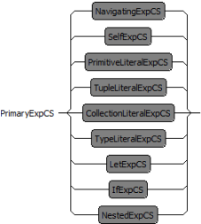

Literals such as

- PrimitiveLiteralExpCS - true or 3.14159
- CollectionLiteralExpCS - Set{1..5}
- TupleLiteralExpCS - Tuple{name:String='me',at:String='here')
- TypeLiteralExpCS - Integer or Set&lt;Integer&gt;

The context object

- SelfExpCS - self

Compound expressions such as

- NestedExpCS - (x)
- IfExpCS - if x then y else z endif
- LetExpCS - let x : Integer in x + x

Navigation expressions such as

- NavigatingExpCS - x or x.Y::z-&gt;iterate(a:Integer;acc:Integer|acc+a)

## 2.2.1.5. SelfExp

The SelfExp syntax supports the use of the prevailing context object in an expression.


## 2.2.1.6. PrimitiveLiteralExp

The PrimitiveLiteralExp syntax supports the use of a known value in an expression.

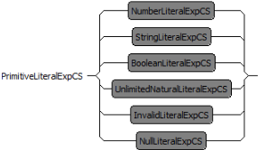

The value may be

- NumberLiteralExpCS - 4 or 3.14159
- StringLiteralExpCS - 'a string'
- BooleanLiteralExpCS - true or false
- UnlimitedNaturalLiteralExpCS - *
- InvalidLiteralExpCS - invalid
- NullLiteralExpCS - null

## 2.2.1.7. NumberLiteralExp

The NumberLiteralExp syntax supports the use of a numeric value in an expression.

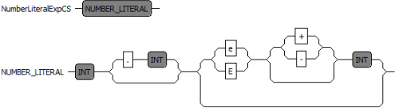

A numeric value is

- an integer such as 4
- fixed point number such as 3.1
- floating point number such as 12.8e-5 .

A numeric value does not have a leading - ; negative numbers are parsed as the application of a unary negate operator to a positive number.

A numeric value may not have a trailing decimal point.

A numeric value may not have a redundant leading zero.

## 2.2.1.8. StringLiteralExp

The StringLiteralExp syntax supports the use of a string value in an expression.

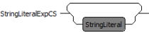

A string is specified as a character sequence between single quotes.

e.g. 'This is a string'

The standard Java and C backslash escapes can be used for awkward characters such as a single quote.

\b -- #x08: backspace BS

\t -- #x09: horizontal tab HT

\n -- #x0a: linefeed LF

\f -- #x0c: form feed FF

\r -- #x0d: carriage return CR

<!-- formula-not-decoded -->

## 2.2.1.9. BooleanLiteralExp

The BooleanLiteralExp syntax supports the use of boolean values in an expression.

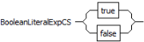

The Boolean values are true and false .

## 2.2.1.10. UnlimitedNaturalLiteralExp

The  UnlimitedNaturalLiteralExp  syntax  supports  the  use  of  the  non-numeric  unlimited  value  in  an expression.

The Non-numeric unlimited value is * . Other UnlimitedNatural values are NumberLiteralExpCS.

## 2.2.1.11. InvalidLiteralExp

The InvalidLiteralExp syntax supports the use of an invalid value in an expression.

The invalid value is invalid .

## 2.2.1.12. NullLiteralExp

The NullLiteralExp syntax supports the use of a null or unspecified value in an expression.

The null value is null .

## 2.2.1.13. CollectionLiteralExp

The CollectionLiteralExp syntax supports the creation of a collection of values for use in an expression.

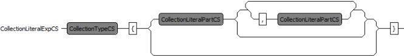

A collection literal comprises the CollectionType followed by braces enclosing a comma-separated list of zero or more CollectionLiteralParts.

<!-- formula-not-decoded -->

Note that null, collection and tuple values are permitted in collections but that invalid values are not. A collection 'containing' an invalid value is flattened to the invalid value.

## 2.2.1.14. CollectionLiteralPart

The CollectionLiteralPart syntax supports the use of a value or range of values in a collection of values.


A single item collection literal part may be any expression (except invalid). e.g. 1+2

A multi-item collection literal part comprises the inclusive range of values between two integer limits.

1..3 is the three values 1 , 2 , 3 .

1..-1 is the three values 1 , 0 , -1 .

## 2.2.1.15. TupleLiteralExp

The TupleLiteralExp syntax supports the use of a tuple of named expression values in an expression.

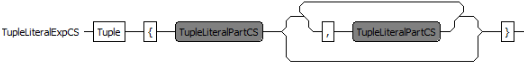

A tuple literal comprises the Tuple keyword followed by braces enclosing a comma-separated list of one or more TupleLiteralParts.

Tuple{year:Integer='2000',month:String='January',day:Integer='1'}

## 2.2.1.16. TupleLiteralPart

The TupleLiteralPart syntax supports the use of a named expression value in a tuple of such values.

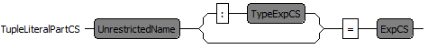

The part comprises the name, an optional type and a value. If the type is omitted, it is inferred from the value.

leapyear : Boolean = true

## 2.2.1.17. TypeLiteralExp

The  TypeLiteralExp  syntax  supports  the  use  of  types  as  values  in  an  expression.  This  is  useful  for expressions such as myCollection.oclAsType(Set&lt;MyType&gt;) .


A TypeLiteralExp comprises a TypeLiteral.

## 2.2.1.18. NestedExp

The NestedExp syntax supports the use of an inner expression as a term in an outer expression ensuring that the operator precedence of the inner expression is not affected by the outer expression,

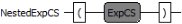

A nested expression is just an expression surrounded by parentheses.

## 2.2.1.19. IfExp

The IfExp syntax supports the use of a conditional choice of expression value in an expression.


An if expression comprises a condition expression to be tested followed by a then-expression to be evaluated if the condition is true and an else-expression for evaluation if the expression is false.

if this.size &gt; that.size then this else that endif

Note that the else-expression is required and so there is no ambiguity when multiple if expressions are nested.

## 2.2.1.20. LetExp

The LetExp syntax supports the introduction of local variables to facilitate re-use of intermediate results within an expression.

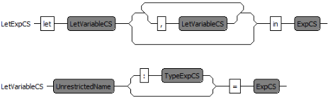

A let expression comprises the let keyword followed by one or more comma-separated let variables and then the in keyword and the in-expression to be evaluated with the help of the extra variables.

Each let variable comprises a name, an optional type and an expression to initialize the variable. If the type is omitted, it is inferred from the initializer.

```
let test : String = 'prefix[contents]suffix', start : Integer = test.indexOf('['), finish : Integer = test.indexOf(']') in test.substring(start,finish)
```

The let syntax has no terminating keyword such as endlet and so there is an ambiguity for for instance 1 + let b : Integer = 2 in b + 4 . The ambiguity is resolved as 1 + let b : Integer = 2 in (b + 4) by selecting the longest possible in-expression.

## 2.2.1.21. NameExp

The NameExp syntax supports the use of the name of a model element such as a property, operation or type in an expression.

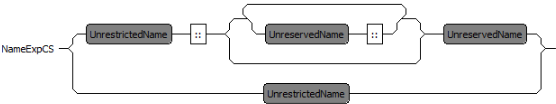

A name expression comprises a name optionally prefixed by double-colon separate path names.

The first name is an UnrestrictedName, that is a name that does not clash with any OCL reserved words such as else or built-in types such as String . Subsequent names are UnreservedName allowing the re-use of built-in type names but not reserved words.

## 2.2.1.22. IndexExp

The IndexExp syntax supports the application of qualifiers to a model property to distinguish the source or select a particular association.

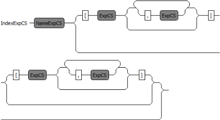

A NameExp identifying a model property is optionally qualified by a first list of qualifiers and a second list of qualifiers.

This syntax is experimental and the qualifiers are not yet supported for evaluation.

## 2.2.1.23. NavigatingExp

The NavigatingExp syntax supports the navigation of models using model properties, operations and iterations.


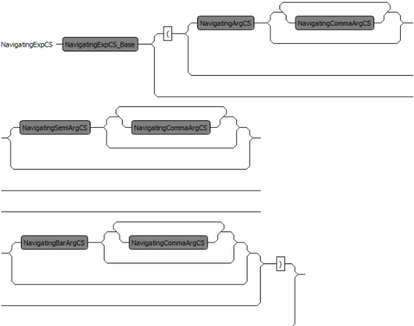

An IndexExp identifying a potentially qualified model feature is optionally followed by a parenthesized arguments. If the parenthesized arguments are omitted the model feature should be a Property. If the arguments are present the model feature should be an iteration or operation.

The  diverse  syntaxes  specified  by  OCL  2.4  for  OperationCallExpCS  and  IteratorExpCS  create ambiguities that are difficult to parse. The merged grammar used by Eclipse OCL gathers argument contributions without imposing premature validation.

The  parenthesized  arguments  may  be  empty,  or  may  comprise  one  or  more  parameters,  optional accumulators and optional bodies.

The comma-separated list of parameters starts with a NavigatingArgCS, followed by any number of NavigatingCommaArgCS.

simpleCall(simpleArgument)

The optional comma-separated list of accumulators are introduced by a semi-colon-prefixed NavigatingSemiArgCS, followed by any number of NavigatingCommaArgCS.

some-&gt;iterate(p; anAccumulator : Integer = 0 | p.size())

The optional comma-separated list of bodies are introduced by a vertical-bar-prefixed NavigatingBarArgCS, followed by any number of NavigatingCommaArgCS.

some-&gt;exists(p | p.size())

## 2.2.1.24. NavigatingArg

The NavigatingArg syntaxes supports the parsing of potential parameters, accumulators and bodies for use in NavigatingExps.

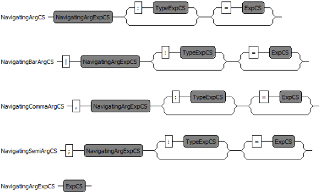

Each syntax supports an optional type and an optional initializer for an expression.

## 2.2.1.25. PrefixedExp

The PrefixedExp syntax supports the application of zero or more prefix unary operators to an expression.

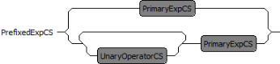

The prefix operator precedes an expression: -4 or not(this or that)

The unary operators are

- - negate
- not logical complement

## 2.2.1.26. InfixedExp

The InfixedExp syntax supports the application of zero or more infix binary operators between expression terms.

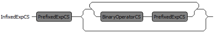

The infix operators separate expression terms: 1 + 2 / 3 * 4 / 5 + 6 .

The infix operators are

- The NavigationOperators
- * , / multiply and divide
- + , - add and subtract
- &lt; , &lt;= , &gt;= , &gt; relational comparisons
- = , &lt;&gt; equality and inequality
- and logical and
- or inclusive or
- xor exclusive or
- implies logical implication

The precedence and associativity of the operators is defined by the OCL Standard Library model, not by the grammar. The OCL 2.4 library precedence is as presented above with all operators left associative. The example above is therefore interpreted as (1 + (((2 / 3) * 4) / 5)) + 6 .

## 2.2.1.27. NavigationOperators

The NavigationOperators operators are

- . for object navigation
- -&gt; for collection navigation

## 2.2.1.28. TypeExp

The TypeExp syntax supports the use of types as expressions.

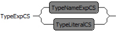

A type expression may be a

- TypeNameExpCS - a user-defined type
- TypeLiteralCS - a built-in or aggregate type

## 2.2.1.29. TypeNameExp

The TypeNameExp syntax supports the use of a user-defined types as a declaration or expression.

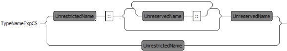

A name expression comprises the name of a type optionally prefixed by double-colon separate path names.

The first name is an UnrestrictedName, that is a name that does not clash with any OCL reserved words such as else or built-in types such as String . Subsequent names are UnreservedName allowing the re-use of built-in type names but not reserved words.

## 2.2.1.30. TypeLiteral

The TypeLiteral syntax supports the use of built-in or aggregate types as declarations or expressions.

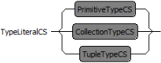

A Type literal may be a

- PrimitiveTypeCS
- CollectionTypeCS
- TupleTypeCS

## 2.2.1.31. PrimitiveType

The PrimitiveType syntax supports the definition of a built-in type for use in a declaration or expression.


The built-in types are

- Boolean
- Integer

- Real
- String
- UnlimitedNatural
- OclAny
- OclInvalid
- OclVoid

## 2.2.1.32. CollectionType

The  CollectionType  syntax  supports  the  definition  of  a  collection  type  for  use  in  a  declaration  or expression.

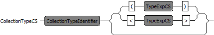

A collection type comprises the CollectionTypeIdentifier followed by a Type Expression defining the type of the collection elements.

Set(String) or Sequence&lt;Bag&lt;Integer&gt;&gt;

The built-in CollectionTypeIdentifiers are

- Collection
- Bag
- OrderedSet
- Sequence
- Set

OCL 2.4 specifies the use of parentheses to surround the element type. Eclipse OCL additionally allows angle brackets as specified by UML and as may be required to support more general templated types.

## 2.2.1.33. TupleType

The TupleType syntax supports the definition of a tuple type for use in a declaration or expression.

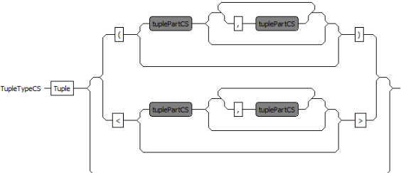

A  tuple  type  comprises  the Tuple keyword  followed  by  a  comma-separated  list  of  one  or  more TupleParts.

OCL 2.4 specifies the use of parentheses to surround the parts. Eclipse OCL additionally allows angle brackets as specified by UML and as may be required to support more general templated types.

Tuple&lt;year:Integer,month:String,day:Integer&gt;

## 2.2.1.34. TuplePart

The TuplePart syntax supports the definition of an element of a TupleType.


The part comprises the name and a type and a value.

leapyear : Boolean

## 2.2.1.35. UnreservedName

The Essential OCL reserved words are and , else , endif , false , if , implies , in , invalid , let , not , null , or , self , then , true , xor . These can only be used as names when escaped as in \_'self' .

## 2.2.1.36. UnrestrictedName

The  Essential  OCL  restricted  words  are  the  reserved  words  above  and  the  OCL  reserved  type names  which  are Bag , Boolean , Collection , Integer , Lambda , OclAny , OclInvalid , OclMessage , OclSelf , OclVoid , OrderedSet , Real , Sequence , Set , String , Tuple , UnlimitedNatural .  An UnrestrictedName can be used in any context. The reserved type names can be used following a :: qualification, Without qualification unrestricted names must be escaped as \_'Boolean' .

Lambda is used in experimental syntax that realizes iterator bodies as lambda-expressions.

## 2.3. The OCLinEcore Language

Ecore Abstract Syntax supports the use of OCL embedded within EAnnotations.

The OCLinEcore language provides a textual Concrete Syntax that makes both Ecore and OCL accessible to users. Examples may be found in OCLinEcore Library Metamodel and OCLinEcore Helpers.

The  OCLinEcore  tooling  provides  a  rich  editing  environment  based  on  Xtext  with  strong  semantic checking.

OCLinEcore is more than just an editor for OCL in Ecore, it is useful for

- providing a coherent textual view of an Ecore meta-model
- providing syntax sugar for some Ecore conventions
- editing and validating OCL
- integrating OCL into Ecore

It is planned to take the syntactic sugar further and provide full support for all class-related UML concepts. The language therefore uses UML as its point of reference wherever possible.

The  OCLinEcore  tooling  may  be  used  directly  on  *.ecore  files,  or  on  their  *.oclinecore  textual counterparts.

Please follow the OCLinEcore tutorial for an introduction to the language and its tooling.

## 2.3.1. Syntax

The  OCLinEcore  syntax  has  a  consistent  structure  influenced  by  the  informal  definitions  in  OMG specifications and by the Ecore hierarchy. Most Ecore concepts are represented by a syntax of the form:

- optional primary adjectives
- mandatory keyword
- mandatory name facet
- further facets
- an optional braced clause of secondary adjectives
- an optional braced clause of elements
- composed elements
- annotations

- constraints

Thus in:

abstract class Example extends Base { interface } { ... }

- abstract is a primary adjective
- class is a keyword
- Example is the name facet
- extends Base is a further facet
- { interface } supports the secondary interface adjective.
- { ... } provides a nested context for class content.

## 2.3.1.1. Grammar Implementation

The grammar used by the Xtext editors may be found at:

/src/org/eclipse/ocl/examples/xtext/oclinecore/OCLinEcore.xtext

in  the  org.eclipse.ocl.xtext.oclinecore  plugin.  The  OCLinEcore  grammar  extends  the  Essential  OCL grammar.

## 2.3.1.2. Module

The Module syntax supports the overall structure of an Ecore file

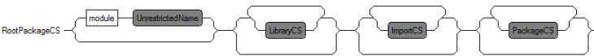

The definition of the module comprises

- optional module declaration
- optional specification of the OCL Standard libraries
- optional import of referenced Ecore or UML or OCLinEcore resources
- a hierarchy of Packages

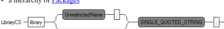

Zero or more external libraries may be imported so that their definitions are merged to form a composite library of basic and extended evaluation capability.

The implicit import of the default OCL Standard Library is suppressed, if any library is imported. The default library may be extended by specifying it as the first library import.

library ocl : 'http://www.eclipse.org/ocl/3.1.0/OCL.oclstdlib'

The namespace URI of the first library package defines the namespace URI of the composite library. The namespace URI of subsequent library imports may not conflict, but may be null.

Zero or more external metamodels may be imported.

## 2.3.1.3. Package

The Package syntax supports a nested hierarchy of packages and classifiers


A Package has a name and optionally a namespace prefix and namespace URI.

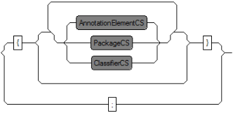

The content of a Package may comprise Packages, Classifiers and Annotations.

## 2.3.1.4. Classifier

The Classifier syntax supports the definition of types within a Package.

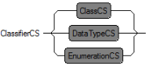

A Classifier may be

- a Class
- a DataType
- an Enumeration with associated EnumerationLiterals

## 2.3.1.5. DataType

The DataType syntax supports the definition of an EDataType.

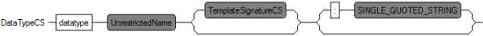

A DataType has a name and optionally template parameters and an instance class name.

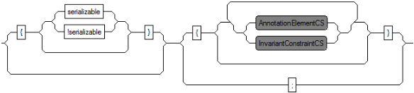

A DataType may be serializable; by default it is not.

The content of a DataType may comprise invariants and Annotations.

## 2.3.1.6. Enumeration

The Enumeration syntax supports the definition of an EEnum.

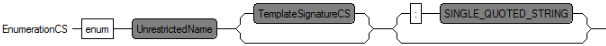

An Enumeration has a name and optionally template parameters and an instance class name.

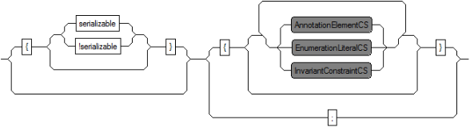

An Enumeration may be serializable; by default it is not.

The content of an Enumeration may comprise enumeration literals, invariants and Annotations.

## 2.3.1.7. EnumerationLiteral

The EnumerationLiteral syntax supports the definition of an EEnumLiteral.

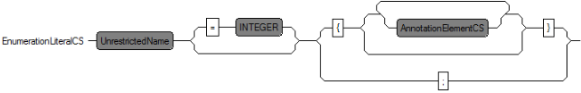

An EnumerationLiteral has a name and optionally a value.

The content of an EnumerationLiteral may comprise Annotations.

## 2.3.1.8. Class

The Class syntax supports the definition of an EClass.

- optional abstract prefix
- optional extension of other classifiers
- optional invariants, annotations, features and operations


A Class may be abstract has a name and optionally template parameters.

(NB, the 'abstract' prefix is optional, even though the figure indicates that it is mandatory.)

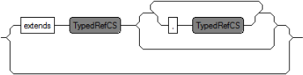

A Class may extend one or more other Classes that may be specialized using the template parameters.

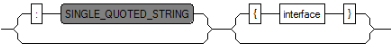

A Class may have an instance class name, and may also be declared to be an interface.

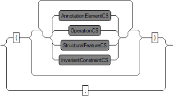

The content of a Class may comprise Annotations, Operations, StructuralFeatures and invariants.

## 2.3.1.9. StructuralFeature

The StructuralFeature syntax supports the definition of the StructuralFeatures.

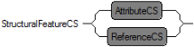

A StructuralFeature may be

- an Attribute
- a Reference

## 2.3.1.10. Attribute

The Attribute syntax supports the definition of an EAttribute; a Property with a DataType value.

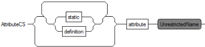

An Attribute may be static and has a name.

The static qualifier supports declaration of static properties which are supported by UML and OCL. Note that Ecore does not support static properties.

The definition qualifier is an obsolete experimental syntax for Complete OCL definitions.


An Attribute may may have a Type and multiplicity.

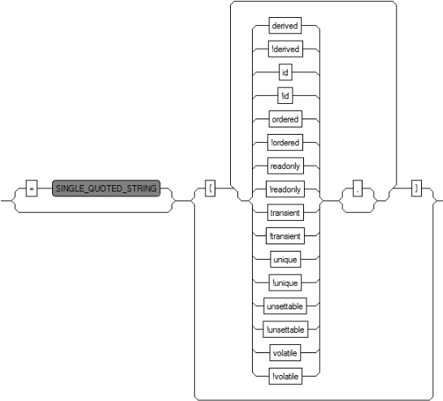

An Attribute may a simple initializer and a variety of qualifiers:

- derived specifies a derived attribute (default !derived )
- id specifies that the attribute provides the identifier if its class (default !id )
- ordered specifies that the attribute elements are ordered (default !ordered )
- readonly specifies that the attribute elements are readonly (not changeable) (default !readonly )
- transient specifies that the attribute elements are computed on the fly (default !transient )
- unique specifies that there are no duplicate attribute elements (default unique )
- unsettable specifies that attribute element may have no value (default !unsettable )
- volatile specifies that the attribute elements are not persisted (default !volatile )

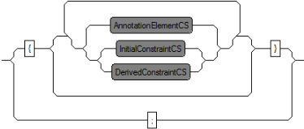

The content of an Attribute may comprise Annotations, initial and derived constraints.

A simple constant value may be defined using the initializer. A computed value requires the use of a constraint. If both initial and derived constraints are present, the initial constraint is ignored.

The defaults for multiplicity lower and upper bound and for ordered and unique follow the UML specification and so corresponds to a single element Set that is [1] {unique,!ordered} . Note that UML defaults differ from the Ecore defaults which correspond to an optional element OrderedSet, that is [?] {ordered,unique} .

## 2.3.1.11. Reference

The Reference syntax supports the definition of an EReference; a Property with a Class value.

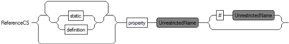

An Reference may be static and has a name and optionally an opposite name.

The static qualifier supports declaration of static properties which are supported by UML and OCL. Note that Ecore does not support static properties.

The definition qualifier is an obsolete experimental syntax for Complete OCL definitions.

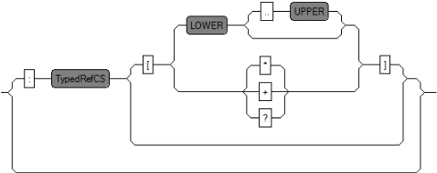

A Reference may may have a Type and multiplicity.

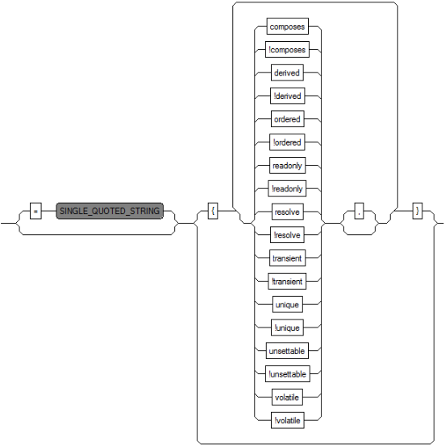

A Reference may a simple initializer and a variety of qualifiers:

- composes specifies a composed (containing) reference (default !composes )
- derived specifies a derived reference (default !derived )
- ordered specifies that the reference elements are ordered (default !ordered )
- readonly specifies that the reference elements are readonly (not changeable) (default !readonly )
- resolve specifies that the reference elements proxies may need resolution (default !resolve )
- transient specifies that the reference elements are computed on the fly (default !transient )
- unique specifies that there are no duplicate reference elements (default unique )
- unsettable specifies that reference element may have no value (default !unsettable )
- volatile specifies that the reference elements are not persisted (default !volatile )

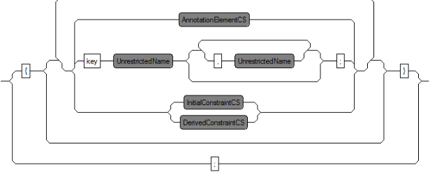

The content of a Reference may comprise keys, Annotations, initial and derived constraints.

A simple constant value may be defined using the initializer. A computed value requires the use of a constraint. If both initial and derived constraints are present, the initial constraint is ignored.

The defaults for multiplicity lower and upper bound and for ordered and unique follow the UML specification and so corresponds to a single element Set that is [1] {unique,!ordered} . Note that UML defaults differ from the Ecore defaults which correspond to an optional element OrderedSet, that is [?] {ordered,unique} .

## 2.3.1.12. Operation

The Operation syntax supports the definition of an EOperation.

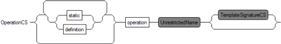

An Operation may be static and has a name and optionally template parameters.

The static qualifier supports declaration of static operations which are supported by UML and OCL. Note that Ecore does not support static operations.

The definition qualifier is an obsolete experimental syntax for Complete OCL definitions.

An Operation has zero of more Parameters.

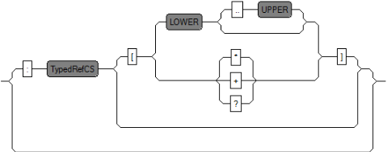

An Operation may have a return Type and multiplicity.

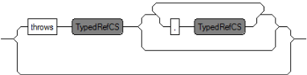

An Operation may declare zero or more throw Exceptions.

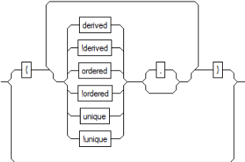

An Operation may have a variety of qualifiers:

- derived specifies a derived operation (default !derived )
- ordered specifies that the returned elements are ordered (default !ordered )
- unique specifies that there are no duplicate returned elements (default unique )

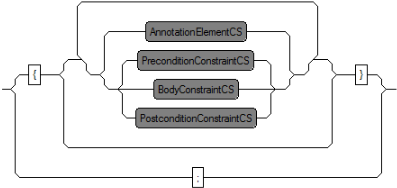

The  content  of  an  Operation  may  comprise  Annotations,  precondition,  postcondition  and  body constraints.

The static qualifier supports declaration of static operations which are supported by UML and OCL. Note that Ecore does not support static operations.

The definition qualifier is an obsolete experimental syntax for Complete OCL definitions.

The defaults for multiplicity lower and upper bound and for ordered and unique follow the UML specification and so corresponds to a single element Set that is [1] {unique,!ordered} . Note that UML defaults differ from the Ecore defaults which correspond to an optional element OrderedSet, that is [?] {ordered,unique} .

## 2.3.1.13. Parameter

The Parameter syntax supports the definition of an EParameter.

A Parameter has a name, optional "Type:#OCLinEcore-TypeRef and multiplicity

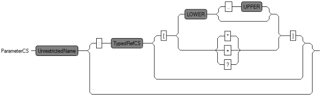

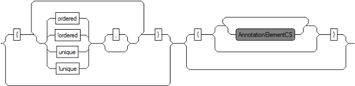

A Parameter may have a variety of qualifiers:

- ordered specifies that the returned elements are ordered (default !ordered )
- unique specifies that there are no duplicate returned elements (default unique )

The content of a Parameter may comprise Annotations.

The defaults for multiplicity lower and upper bound and for ordered and unique follow the UML specification and so corresponds to a single element Set that is [1] {unique,!ordered} . Note that UML defaults differ from the Ecore defaults which correspond to an optional element OrderedSet, that is [?] {ordered,unique} .

## 2.3.1.14. Types

The  Type  syntax  supports  the  definition  of  EType  and  EGenericType  in  conjunction  with  an ETypedElement. The syntax is very similar to Java.

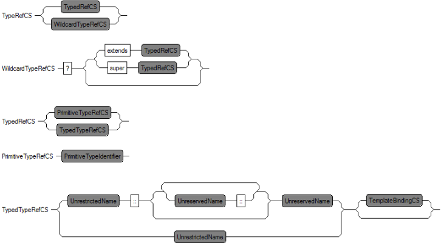

PrimitiveTypeRefCS provides  access  to  the  built-in  OCL  types  and  their  corrersponding  Ecore counterparts

| OCL type         | Ecore type   |
|------------------|--------------|
| Boolean          | EBoolean     |
| Integer          | EBigInteger  |
| Real             | EBigDecimal  |
| String           | EString      |
| UnlimitedNatural | EBigInteger  |

TypedTypeRefCS provides for user defined types and their template parameterisation.

## 2.3.1.15. AnnotationElement

The  AnnotationElement  syntax  supports  the  definition  of  an  EAnnotation  hierarchy  with  details, references and contents.

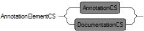

An AnnotationElement may be Annotation or Documentation.

## 2.3.1.16. Annotation

The Annotation syntax supports the definition of an EAnnotation hierarchy with details, references and contents.


An Annotation has a source URI, which may be specified without quotes if the URI is just a name.

An Annotation may have Details.


The content of an Annotation may comprise

- Annotations
- content elements
- names that reference other elements

## 2.3.1.17. Detail

The Detail syntax supports the definition of a detail of an EAnnotation.


A detail comprises a detail key and optional value.

## 2.3.1.18. Documentation

The Documentation syntax is an experimental syntactic sugar for a genmodel annotation.


It is likely to be replaced by a Javadoc-style comment that will be persisted in Ecore.

## 2.3.1.19. Constraints

The  Constraints  syntax  supports  the  embedding  of  OCL  expressions  as  invariants  for  classes,  as preconditions, postconditions or bodies for operations and initial or derived values for properties.


The  integration  occurs  through  the SpecificationCS rule  that  invokes  an  ExpCS.  (The  alternative UnquotedString is an implementation detail that supports the import from Ecore where the OCL is in unparsed textual form rather than an analyzed syntax tree.)

A class invariant may be callable to specify that the Ecore representation is to use the EOperation rather than EAnnotation representation.

A class invariant optionally supports a second OCL expression as a parenthesis on the invariant name. This parenthesized expression is invoked when an invariant fails in order to provide a user-defined failure message. Whether this message is an error or a warning is determined by the evaluation of the invariant:

## 2.3.1.20. Terminals

The OCLinEcore grammar extens the Esstial OCL grammar which should be consulted for definition of INT, and ExpCS.


## 2.3.1.21. Names

An Unrestricted name is any name other than the OCL reserved keywords. See UnrestrictedName.

An Unreserved name is any name other than the OCL reserved keywords above or the OCL reserved types. See UnreservedName.

If you need to use any of these names or non-alphanumeric names, you must use the escaped string syntax for a name: e.g. \_'true' . The usual Java backslash escapes, with the exception of octal are supported: \_'new-lines\n\x0a\u000a'

## 2.3.1.22. Comments

Single line comments are supported by ignoring all text following -- .

Multi line comments are supported by ignoring all text within /* ... */ .

Documentation  comments  are  supported  for  all  text  within /** ... */ .  Unfortunately  no documentation EAnnotation is currently created.

## 2.3.2. Limitations

OCLinEcore supports the full capabilities of Ecore, however the support for upper and lower bounds on generic types has not been adequately tested.

OCLinEcore provides primary syntaxes for some Ecore conventions such as genmodel annotations and constraints; much more support is needed for feature maps.

## 2.4. The Complete OCL Language

The Complete OCL provides a language for a document in which OCL complements an existing metamodel with invariants, and additional features.

## 2.4.1. Syntax

The Complete OCL syntax is defined by the OMG OCL 2.4 specification.

The syntax comprises keywords such as context followed by appropriate names and punctuation and OCL expressions.

With the exception of endpackage there is no terminating punctuation and so the consequences of a syntax error can be quite far-reaching while editing a document. Concentrate on the first error.

A substantial example of Complete OCL may be found by installing the RoyalAndLoyal Example Project.

## 2.4.1.1. Grammar Implementation

The grammar used by the Xtext editors may be found at:

/src/org/eclipse/ocl/examples/xtext/completeocl/CompleteOCL.xtext

in the org.eclipse.ocl.xtext.completeocl plugin. The Complete OCL grammar extends the Essential OCL grammar.

## 2.4.1.2. Complete OCL Document

The Document syntax defines a Complete OCL document, for which *.ocl is the default extension.


A Complete OCL document may

- import meta-models to be complemented
- include additional Complute OCL documents
- specify one or more Standard Library documents

and then provide complements for one of more Packages, Classifiers or Features.

The import, include and library declarations are Eclipse OCL extensions. The OCL 2.4 specification provides no mechanism for a Complete OCL document to reference external material.

The primary definitions of each meta-model may be imported by specifying the URI of a Package and optionally an alias for that Package.

The import may be from a *.ecore, *.uml or *.oclinecore file.


Additional  documents  complementing  meta-model  may  be  included  by  specifying  the  URI  of  the Complete OCL document.


Zero or more external libraries may be imported so that their definitions are merged to form a composite library of basic and extended evaluation capability.

The implicit import of the default OCL Standard Library is suppressed, if any library is imported. The default library may be extended by specifying it as the first library import.

library ocl : 'http://www.eclipse.org/ocl/3.1.0/OCL.oclstdlib'

The namespace URI of the first library package defines the namespace URI of the composite library. The namespace URI of subsequent library imports may not conflict, but may be null.

## 2.4.1.3. PackageDeclaration

The PackageDeclaration syntax identifies a Package to be complemented.


The package keyword is followed by the optionally qualified name of the package to be complemented.


The name is followed by the declaration contexts to be complemented and finally an endpackage keyword.

## 2.4.1.4. ContextDecl

The ContextDecl syntax identifies a model element to be complemented.


A complemented context may be a

- Classifier Context
- Operation Context
- Property Context

## 2.4.1.5. ClassifierContextDecl

The ClassifierContextDecl syntax identifies a Classifier to be complemented.


The context keyword is followed by an optional declaration of the name of the context variable. If omitted the context variable is named self .


Then the optionally qualified name of the classifier to be complemented is defined. Qualification is required if the classifier context is specified directly as part of the document. Qualification may be omitted when the classifier context is specified as part of a package declaration.


Finally the content of the classifier context may comprise

- Def to define an additional feature
- Inv to define an invariant

## 2.4.1.6. Def

The Def syntax defines an additional Feature for a Classifier.


The definition may define a static feature with a feature name.

A further name may be specified for no very obvious purpose other than symmetry with an invariant. The optional name is not used.


A parenthesized  parameter  list  must  be  specified  to  define  an  operation  and  omitted  for  a  property definition.


Then the property or optional operation return type is specified followed by the specification of the property initializer or operation body.

An additional definition is usable within an OCL expression as if it was defined in the complemented meta-model. For the purposes of reflection the additional appear as part of the complemented meta-model, however they remain complements and are not persisted with that meta-model.

## 2.4.1.7. Inv

The Inv syntax defines an invariant for a Classifier.


The  inv  keyword  is  followed  by  an  optional  invariant  name  an  optional  violation  message  and  the specification of the invariant.

The optional name may be used by validation environments to identify the invariant in a control panel and in diagnostic messages.

The optional violation message provides an OCL expression that may be used by a validation environment to provide a custom message to explain a broken invariant. The severity of the invariant violationm may be controlled by the value of the invariant expression.

- true indicates that the invariant was satisfied
- false indicates that the invariant was violated with warning severity
- null indicates that the invariant was violated with error severity
- invalid indicates that the invariant failed to evaluate

In  the  Indigo  release,  the  local  variables  of  the  invariant  are  not  accessible  to  the  violation  message expression. This will be changed in a future release.

In the Indigo release, custom messages are available when a CompleteOCLEObjectValidator is used as the EValidator. This is not the case for validation in the Sample Ecore Editor and so a default message using the invariant name and the failing object is provided.

## 2.4.1.8. OperationContextDecl

The OperationContextDecl syntax identifies an Operation to be complemented.


The context keyword is followed by the optionally qualified name of the operation to be complemented. Qualification is always required since the operation context may be specified as part of the document or a package declaration but not a classifier.

The name is followed by a parenthesized parameter list.


Finally an optional return type and the operation constraints are specified. The operation constraints may comprise

- a Body to define operation body
- Pre to define a precondition on the operation
- Post to define a postcondition on the operation

Any number of preconditions and postconditions can be specified. Only one body is permitted.

## 2.4.1.9. Parameter

The Parameter syntax identifies a Parameter of an Operation to be complemented.


A parameter comprises an optional name and Essential OCL type declaration.

The parameter name may be omitted for Operation Contexts if the parameter name is not used by any of the constraints.

The parameter name is required for Operation Definitions.

Note that  the  type  declarations  are  Essential  OCL  types  such  as Sequence&lt;String&gt; rather  than UML's and OCLinEcore's String[*]  {ordered  !unique} .  There  are  plans  to  unify  these syntaxes.

## 2.4.1.10. Body

The Body syntax defines the body for a complemented Operation.


The body keyword is followed by an optional name and the body specification.

The optional name is not used.

## 2.4.1.11. Post

The Post syntax defines a postcondition for a complemented Operation.


The post keyword is followed by an optional name and the postcondition specification.

The optional name may be used by a validation environment to identify a failing postcondition.

The Indigo release parses and persists postconditions but does not evaluate them.

## 2.4.1.12. Pre

The Pre syntax defines a precondition for a complemented Operation.


The pre keyword is followed by an optional name and the precondition specification.

The optional name may be used by a validation environment to identify a failing precondition.

The Indigo release parses and persists preconditions but does not evaluate them.

## 2.4.1.13. PropertyContextDecl

The PropertyContextDecl syntax identifies a Property to be complemented.


The context keyword is followed by the optionally qualified name of the property to be complemented. Qualification is always required since the property context may be specified as part of the document or a package declaration but not a classifier.


Finally  the  property  type  and  the  property  constraints  are  specified.  The  property  constraints  may comprise

- an Init to specify an initialization
- a Der to specify a derivation

An initialization is specified to define the property value when the property is created.

A derivation is specified to define the property value at all times.

It does not therefore make sense to specify both an an initial and an all-time value. If both are specified the derivation is used.

## 2.4.1.14. Init

The Init syntax defines an initial value for a complemented Property.


The init keyword and colon are followed by the initial value specification.

## 2.4.1.15. Der

The Der syntax defines a derived value for a complemented Property.


The der keyword and colon are followed by the derived value specification.

## 2.4.1.16. Specification

The Specification syntax provides an OCL expression to specify some aspect of a complemented model.


The specification comprises and Essential OCL Expression.

## 2.4.1.17. NavigatingExp

The NavigatingExp syntax defines enhancements to the Essential OCL NavigatingExp syntax.


The  name  of  a  model  element  may  have  a  further  @pre  qualification  for  use  within  an  operation postcondition. It allows the postcondition to access the value on entry to an operation.


? may be specified as the argument in a navigating expression to indicate unknown values when testing sent messages.

## 2.4.1.18. NavigationOperators

The Essential OCL NavigationOperators are extended to support

- ^ to test whether a message has been sent message
- ^^ to reference the content of a message

## 2.4.1.19. UnreservedName

The Complete OCL reserved words are unchanged from Essential OCL, consequently a Complete OCL Unreserved name is the same as an Essential OCL UnreservedName.

## 2.4.1.20. UnrestrictedName

The Complete OCL has two additional built-in types: OclMessage and OclState . These names and the Essential OCL RestrictedNames are not available without qualification or escaping.

## 2.5. The OCL Standard Library Language

The OCL Standard Library Language is used to define the OCL Standard Library, for which *.oclstdlib is the default extension.

The standard library can be replaced or extended.

The  source  for  the  OCL  Standard  Library  may  be  found  at  model/OCL-2.5.oclstdlib  in  the org.eclipse.ocl.library plugin.

## 2.5.1. Syntax

## 2.5.1.1. Grammar Implementation

The grammar used by the Xtext editors may be found at:

/src/org/eclipse/ocl/examples/xtext/oclstdlib/OCLstdlib.xtext

in the org.eclipse.ocl.xtext.oclstdlib plugin. The OCL Standard Library grammar extends the Essential OCL grammar.

## 2.5.1.2. OCL Standard Library Document

The Library syntax defines an OCL Standard Library document, for which *.oclstdlib is the default extension.


Zero or more library documents may be imported for use within the composite library whose name must be specified.


A namespace prefix and namespace URI may optionally be specified.


The body of the document comprises

- optional module declaration
- optional specification of the OCL Standard libraries
- optional import of referenced Ecore or UML or OCLinEcore resources
- Precedences
- a hierarchy of Packages
- a hierarchy of Classifiers
- Annotations


Zero or more external libraries may be imported so that their definitions are merged to form a composite library of basic and extended evaluation capability.

The default library may be extended by specifying it as the first library import.

library 'http://www.eclipse.org/ocl/3.1.0/OCL.oclstdlib'

The namespace URI of the first library package defines the namespace URI of the composite library. The namespace URI of subsequent library imports may not conflict, but may be null.

## 2.5.1.3. Precedence

The Precedence syntax defines the precedence and associativity of infix operators.


Each entry in a list of precedences names a precedence level taht can then be used by an infix operator. Each level can be either left or right associative.

Multiple  lists  of  precedence  levels  can  be  merged  from  imported  libraries  provided  the  lists  are interleaveable with conflict or ambiguity.

## 2.5.1.4. Package

The Package syntax defines a nested hierarchy of packages and classifiers .


A Package has a name and optionally a namespace prefix and namespace URI.


The content of a Package may comprise Packages, Classifiers and Annotations.

## 2.5.1.5. Class and Classifier

The Class and Classifier syntax define a type within a Package.


A Class has a name and optionally template parameters. A class may also name the metatype such as PrimitiveType that the Class is an instance of.


A Class may extend one or more other Classes that may be specialized using the template parameters.


The content of a Class may comprise Operations, Properties, Invariants and Annotations.

## 2.5.1.6. Inv

The Inv syntax defines an invariant constraint.

## 2.5.1.7. Operation

The general Operation syntax defines a conventional Operation or Iteration.


## 2.5.1.8. LibOperation

The LibOperation syntax defines a conventional Operation.


An Operation may be static and has a name and optionally template parameters.


An Operation has a return Type. An infix operation may specify a precedence level. An operation may specify the name of a Java class implementing the org.eclipse.ocl.library.LibraryOperation interface. This class is used when evaluating the operation.


The content of an Operation may comprise Preconditions, Postconditions and Annotations.

The static qualifier supports declaration of static library operations such as allInstances() that are invoked on types rather than objects.

## 2.5.1.9. LibIteration

The LibIteration syntax defines an Iteration.


An Iteration has a name and optionally template parameters.


An Iteration has one or more comma-separated Iterators.

Optionally following a semicolon, an Iteration has one or more comma-separated Accumulators.

Optionally following a bar, an Iteration has one or more comma-separated Parameters.


An Iteration has a return Type. An Iteration may specify the name of a Java class implementing the org.eclipse.ocl.library.LibraryIteration interface. This class is used when evaluating the iteration.


The content of an Iteration may comprise Preconditions, Postconditions and Annotations.

## 2.5.1.10. Iterator

The Iterator syntax defines an Iterator.


## 2.5.1.11. Accumulator

The Accumulator syntax defines an Accumulator.


## 2.5.1.12. Parameter

The Parameter syntax defines a Parameter.


## 2.5.1.13. Pre

The Pre syntax defines a precondition constraint.

## 2.5.1.14. Post

The Post syntax defines a postcondition constraint.

## 2.5.1.15. LibProperty


A Property may specify the name of a Java class implementing the org.eclipse.ocl.library.LibraryProperty interface. This class is used when evaluating the iteration.

The content of a Property may comprise Annotations.

## 2.5.1.16. Specification

The Specification syntax integrates an OCL Expression as the specification of a constraint.


## 2.6. Editors

The four editors are all generated using Xtext, and so exhibit similar behavior to other Eclipse editors.

The standard facilities are

- syntax coloring
- folding
- outline view
- hover text
- syntax validation
- semantic validation

The following facilities have partial functionality

- go to definition
- content assist
- templates
- quick fixes
- find references

The following facilities have little or no functionality

- rename element
- final validation

## 2.6.1. Syntax coloring

The editors use similar colors to JDT.

- green for comments
- bold purple for keywords
- grey for numbers

- blue for strings

Additionally

- italics for text referencing a definition

References for which the name of the definition matches a keyword use italics in the same way as other cross references. Names of a definition matching a keyword use bold purple in the same way as keywords.

The syntax coloring may be changed using the Window-&gt;Preferences-&gt;OCL pages.

## 2.6.2. Validation

Syntax errors are detected and offending text is underlined with accompanying annotations and problem markers.

If  there  are  no  syntax  errors,  semantic  validation  is  performed  with  similar  feedback  of  problems. Semantic validation is not performed when there are syntax errors since a single syntax error may provoke many hundreds of semantic errors. These can make the original syntax error difficult to resolve.

The  use  of  the  well-formedness  rules  for  a  final  validation  of  the  Abstract  Syntax  is  only  partially implemented, since correction of the OCL in the OMG specifiucation is still work in progress.

By default, the Xtext nature is not added to projects using OCL editors and so no builder runs in the background creating problem markers for OCL files. This is generally beneficial when you have many files for which the over-enthusiastic rebuilds waste build time, or experimental files for which the many errors clutter the Problem View.

If your OCL is good quality, you may activate the Xtext nature and builder by selecting the project and then invoking Configure-&gt;Add Xtext Nature .

## 2.6.3. Hover Text

Hover text has been implemented to provide feedback on the usage and type of expression terms. For instance hovering over the size operation in the example below reveals that it is an Operation for the Loan specialization of Collection .

(Note that the Class specialization for Loan is incorrectly shown again as an Operation specialization.)

## 2.6.4. Content Assist

Typing Ctrl and Space activates the Content Assist pop-up to offer suggestions as to what might be typed to the right of the cursor.


## 2.6.5. Code Templates

Code templates are provided for many of the major constructs and some expression elements.

You may define your own templates. If you would like to contribute them, please raise a Bugzilla.

## 2.6.6. Open Declaration

It is possible to navigate to a definition provided an editor is already open for the definition.

## 2.7. OCL Nature and Builder Auto-Validation

The build of an OCL or OCL-containing source file validates the ource file and updates markers in the Problems View to identify issues that the user may care to address. Double-clicking on the Problems View Marker opens an editor to faciltate fixing the problem.

The build validation occurs whenever a source file changes or is 'cleaned' and when the containing project has the OCL nature configured.

If the Eclipse Workspace is configured to auto-build, the OCL builder runs automatically and so autovalidation occurs.

## 2.7.1. Configuring the OCL Nature and Builder

The OCL Nature may be added or removed from a Project by selecting the project in an Explorer View and invoking Configure-&gt;Convert to OCL Project or Configure-&gt;Unconfigure OCL from the context menu. Alternatively the new Project Natures page may be used from the Project Properties page.

Configuing the OCL nature modifies the .project file to add the org.eclipse.ocl.pivot.ui.oclnature nature and org.eclipse.ocl.pivot.ui.oclbuilder . The builder has an argument dictionaries to select file extensions and file paths that are included or excluded by the builder.

```
<arguments> <dictionary> <key>disabledExtensions</key> <value>*,essentialocl</value> </dictionary> <dictionary> <key>disabledPaths</key> <value>bin/**,target/**</value> </dictionary> <dictionary> <key>enabledExtensions</key> <value>ecore,ocl,oclinecore,oclstdlib,uml</value> </dictionary> <dictionary> <key>enabledPaths</key> <value>**</value> </dictionary> </arguments>
```

The  default  configuration  enables  validation  of ecore,ocl,oclinecore,oclstdlib,uml extensions  and disables all other extensions, redundantly adding an explicit essentialocl exclusion to make the syntax more obvious to a casual reader. (*.essentialocl files may contain a single OCL expression, but since they lack any embedding within a model, they are not generally useful.)

The default configuration enables all paths except the bin and target paths where the Java builder or Maven builders may place copies of files that are not usually worth revalidating as distinct files.

The configuration in the .project file may be edited with a text editor; there is currently no dedicated user interface.

## 2.7.2. Ecore and UML Auto-Validation

The EMF and UML projects provide no nature or builder and so Problems View markers for *.ecore and *.uml files are dependent on the problems in the prevailing selection at the time of the preceding manual validation.

Since OCL may be embedded with *.ecore or *.uml files, the OCL nature and builder provide the option to auto-validate these files.

By default, your project has no OCL nature so no Ecore or UML auto-validation occurs.

If you choose to add the OCL nature, the default settings that enable *.ecore and *.uml auto-validation apply. The Problems View markers resulting from auto-validation are updated after a file is saved; any markers that the Ecore or UML editors created are replaced.

If  you find that the auto-validation of some *.ecore and *.uml causes problems, perhaps because the reported errors are not a concern for your usage, you may edit the .project file configuration.

You may remove ecore and/or uml from the enabledExtensions to suppress Ecore and/or UML autovalidation completely.

You may add individual files or file patterns to the disabledPaths to be more selective about disabling auto-validation.

## 2.7.3. Building on pre-Photon / 2018 releases

The OCL builder and nature are new in the Eclipse OCL 2018 release (Photon). They comply with the standard Eclipse idiom.

In earlier releases, the EMF idiom was followed whereby Problems View markers were created by their save action of an appropriate editor. Problems in files that had not been saved were often not visible and so diagnosis only occurred when some consuming application complained..

## 2.8. Console

There are two interactive OCL consoles that enable OCL expressions to be evaluated on a model.

The classic Interactive Console may be created by invoking OCL-&gt;Show OCL Console from the right button menu of some model editors such as the Sample Ecore Model Editor . Alternatively the Console view may be created by Window-&gt;Show View-&gt;Console followed by selecting Interactive OCL from the Open Console pull-down in the Console View tool bar. See the OCLinEcore Tutorial for detailed step-by-step pictures.

The Pivot Interactive Xtext Console may be similarly created by OCL-&gt;Show Xtext OCL Console from the menu or Interactive Xtext OCL from the pull-down.

The two consoles should exhibit similar behaviors, however not all facilities of the classic console have yet been reproduced on the new.


The Console, shown in the bottom half of the figure, comprises a combined Title and Tool Bar, Results Panel and Entry Panel.

## 2.8.1. Context Object Selection

Expressions are evaluated with respect to a context object self that has a corresponding metamodel type. This object is defined by selecting any widget whose implementation is adaptable to an EObject. Therefore selecting an EAttribute in the Sample Ecore Editor will make the selected EAttribute self and EAttribute the metamodel type. In the figure selecting the Member named m1 in the Sample Reflective Ecore Model Editor has made Member the select type of self and m1 the selected context object. For the Pivot Console there is additional support to use selections from the Outline of an Xtext editor or Variables View of the OCL Debugger as the context object.

The Pivot Console displays the selected object and type in the Console title.

The classic Console relies on the platform selection mechanism to show the selected object in the overall Eclipse Status display at the bottom left of the workspace window. This display may be lost when the selection is changed to a non-EObject selection.

## 2.8.2. Editing

The bottom panel supports entry and evaluation of a multi-line expression. The expression is evaluated when Enter is entered.

The classic Console has hand-coded syntax highlighting and context assist that may be activated by typing Ctrl + Space .

The Pivot Console uses the Xtext EssentialOCL editor and largely auto-generated syntax highlighting, error indications, hover text, quick fixes and context assist that may be activated by typing Ctrl + Space .

The content assist for the Pivot Console has not yet been customized, so the classic Console content assist is probably more comprehensive, however the Pivot Console shares the same library definitions as the other editors and so is more consistent.

## 2.8.3. Editor Keys

The Page-Up and Page-Down keys may be used to scroll through the history of input commands enabling previous commands to be re-used. Use of the Page keys is necessary since the input is potentially multiline and so Up and Down navigate over the multiple lines.

## 2.8.4. Results

The larger middle panel displays the results of each evaluation in a scrolling window.

## 2.8.5. Tool Bar

## 2.8.5.1. Ecore/UML binding

The classic Console provides a selection to determine whether the context object has a type defined by an Ecore or UML metamodel. This selection is not required for the Pivot Console which automatically converts Ecore or UML models to Pivot models.

## 2.8.5.2. M1/M2

The classic Console provides a selection to determine whether the selected metamodel binding is that for objects (M2) or types (M1). This selection is not needed for the Pivot Console since the Pivot metamodel is an instance of itself.

## 2.8.5.3. Clear Console

The standard clear console functionality clears the results pane.

## 2.8.5.4. Close Console

The standard close console functionality closes the current console.

## 2.8.5.5. Debug

Starts the OCL Debugger using the current mouse selection as self and the text in the Console input as the exopression to execute.

## 2.8.5.6. Load/Save an expression

The classic Console provides an ability to save and reload edited expressions as XMI files. The XMI is a pragmatic Eclipse Ecore realisation of the OCL specification for which XMI interchange is not realisable.

The Pivot Console provides a similar ability to save and reload edited expressions as XMI files. The XMI is a prototype that might evolve and be adopted by a future version of the OCL specification. This functionality has not been properly tested.

## 2.9. Validity View (new in Luna)

The standard EMF validation capabilities provide a useful overview of problems:

- as markers in the source model,
- as markers in the Problems View,
- in Pop-up dialogs.

The Validity View provides a much more detailed view of the problems and so assists in debugging bad models and/or bad constaints.

The Validity View may be shown by invoking OCL-&gt;Show Validity View from the right button menu of some model editors such as the Sample Ecore Model Editor . Alternatively the Validity View view may be created by Window-&gt;Show View-&gt;Other... OCL-&gt;Validity View .


The left-hand pane titled Model Elements provides a tree view of the Resources in a ResourceSet in a similar fashion to the Sample Ecore Editor. However an additional child element (in blue italics) is added for each constraint applicable to its parent element. Checkboxes enable or disable the element from revalidations and JUnit-like status icons show the status of the most recent validation. Hovertext provides further detail.

The right-hand pane titled Metamodel Constraints provides a tree view of the model hierarchies that contribute  constraints.  An  additional  child  element  is  added  for  each  model  element  to  which  the constraint applies.

The displays track the mouse selection in other views. Whenever the mouse selection can be resolved to an EObject, that EObject's ResourceSet populates the left hand pane and constraints affecting the left hand pane populate the right hand pane. Tracking the mouse selection is quite expensive, and probably irritating. It can be inhibited by pinning the view to the current selection.

## html

## model

There is generally much too much detail if all elements and constraints are considered and so the view provides many facilities to facilitate focusing on the interesting combinations.

## 2.9.1. View Tool Bar

The View Tool Bar is at the top and right of the view following the Validity View title. It provides facilities common to both Model Elements and Metamodel Constraints.

## 2.9.1.1. Expand All

The plus icon causes the Model Elements and Metamodel Constraints to be fully expanded to display all their contents. Beware that for large models this may result in slow screen updates.

## 2.9.1.2. Collapse All

The minus icon causes the Model Elements and Metamodel Constraints to collapse to display only their top level elements.

## 2.9.1.3. Pin

The pin icon toggles the track current cursor selection. When unpinned, the default, any change in mouse selection  may  cause  recomputation  of  Model  Elements  and  Metamodel  Constraints  contents.  When pinned the contents are stable.

## 2.9.1.4. Refresh

The double arrow icon causes the Model Elements and Metamodel Constraints to be recomputed. This may be necessary for a metamodel change to be used.

## 2.9.1.5. Run

The  white  triangle  in  green  circle  icon  runs  a  validation  on  all  enabled  model  element/constraint combinations updating the status indications for constraints in the left hand Model Element and model elements in right hand Constraint pane.

## 2.9.1.6. Filter

The Filtering menu hides unwanted contributions to the display. Each of the validation result statuses can be individually enabled.

- Show all errors
- Show all infos
- Show all failures
- Show all warnings
- Show all successes

By default none of the selections are enabled so everything is shown. As soon as a specific status is enabled all display elements with other non-enabled statuses are hidden. Thus selecting just *Show all warnings" hides error/info/failure/success results.

## 2.9.1.7. Save

The floppy disk icon supports export of the validation results.

The available export formats are extensible through the org.eclipse.ocl.examples.emf.validation.validity.validity\_exporter extension point.

The default exporters support

An HTML file summarising the results.

An XMI model conforming to validity.ecore containing all results with references to the model elements and constraints.

## text

A text file summarising the results.

## 2.9.2. Model Elements Pane

The Model Elements Pane is the left hand pane of the Validity View.

It comprises a title and tool bar, text filter and scrollable tree of model elements and their constraints.

## 2.9.2.1. Model Elements Tool Bar

The Model Elements Tool Bar is at the top and right of the left hand pane following the Model Elements title. It provides facilities specific to the Model Elements.

## Expand All

The plus icon causes the Model Elements to be fully expanded to display all their contents. Beware that for large models this may result in slow screen updates.

## Collapse All

The minus icon causes the Model Elements to collapse to display only their top level elements.

## Enable All

The tick icon causes all Model Elements to be enabled and so included in the next validation.

## Disable All

The no-tick icon causes all Model Elements to be disabled and so excluded from the next validation.

## Show/Hide disabled

The document icon with a query controls whether disabled Model Element selections are visible. A diagonal strikethrough shows when selections are hidden.

By default disabled selections are hidden, which allows the unwanted root elements of large models to be unchecked and so hidden before a slow attempt is made to display them.

## 2.9.2.2. Text Filter

The text filter takes a StringMatcher pattern that selects which elements are visible. The pattern may contain

- a * to match zero or more characters
- a ? to match exactly one character
- a \ to escape the following character

## 2.9.2.3. Model Elements tree

The scrollable tree shows the containment hierarchy of all elements in the ResourceSet containing the model element identified by the mouse selection.

The +/- collapse/expand icons preceding each element enable interesting elements to be shown and others folded away.

Each element is  preceded  by  a  check  box  that  enables  its  usage  within  the  next  validation  run.  All elements may be enabled or disabled using the icons in the Model Elements Tool Bar. Enabling/disabling individual elements enables/disables the element's descendants and propagates a partial enable/disable to the element's ancestors.

The checkbox is followed by a validation status icon.

- tick for validation successful
- red cross for validation unsuccessful but incomplete
- blue cross for validation failure (incomplete)
- amber warning for a validation warning
- question mark for no validation performed

The status icon is followed by an element-specific icon identifying its type and label.

Double-clicking a leaf Constraint in the left-hand pane makes the corresponding constraint and parent model-element visible in the right-hand pane.

## 2.9.2.4. Model Elements Context Menu

The context menu in the model elements tree offers the following facilities in addition to those also available in the toolbar.

## Validate Selection

Revalidates all constraints applicable to the selected Model Element and its children.

## Debug Single Enabled Selection

Launches the debugger for the selected Model Element and associated Constraint.

The entry is greyed out if more than one Constraint is selected, so the invocation should normally be made from a leaf Constraint result.

Debug launching is only available for OCL constraints in Luna SR0.

## Show in Editor

Opens an editor for the selected Model Element or Metamodel Constraint.

Opening is not available for all forms of constraint in Luna SR0.

## 2.9.3. Metamodel Constraints Pane

The Metamodel Constraints Pane is the right hand pane of the Validity View.

It comprises a title and tool bar, text filter and scrollable tree of metamodel constraints and the model elements to which they apply.

## 2.9.3.1. Metamodel Constraints Tool Bar

The  Metamodel  Constraints  Tool  Bar  is  at  the  top  and  right  of  the  right  hand  pane  following  the Metamodel Constraints title. It provides facilities specific to the Metamodel Constraints.

## Expand All

The plus icon causes the Metamodel Constraints to be fully expanded to display all their contents. Beware that for large models this may result in slow screen updates.

## Collapse All

The minus icon causes the Metamodel Constraints to collapse to display only their top level elements.

## Enable All

The tick icon causes all Metamodel Constraints to be enabled and so included in the next validation.

## Disable All

The  no-tick  icon  causes  all  Metamodel  Constraints  to  be  disabled  and  so  excluded  from  the  next validation.

## Show/Hide disabled

The document icon with a query controls whether disabled Metamodel Constraints selections are visible.

A diagonal strikethrough shows when selections are hidden.

By default disabled selections are hidden, which allows the unwanted root elements of large metamodels to be unchecked and so hidden before a slow attempt is made to display them.

## 2.9.3.2. Text Filter

The text filter takes a StringMatcher pattern that selects which elements are visible. The pattern may contain

- a * to match zero or more characters
- a ? to match exactly one character

- a \ to escape the following character

## 2.9.3.3. Metamodel Constraints tree

The scrollable tree shows the containment hierarchy of all constraints applicable to model elements in the ResourceSet containing the model element identified by the mouse selection.

The +/- collapse/expand icons preceding each element enable interesting elements to be shown and others folded away.

Each element is  preceded  by  a  check  box  that  enables  its  usage  within  the  next  validation  run.  All elements may be enabled or disabled using the icons in the Model Elements Tool Bar. Enabling/disabling individual elements enables/disables the element's descendants and propagates a partial enable/disable to the element's ancestors.

The checkbox is followed by a validation status icon.

- tick for validation successful
- red cross for validation unsuccessful but incomplete
- blue cross for validation failure (incomplete)
- amber warning for a validation warning
- question mark for no validation performed

The status icon is followed by an element-specific icon identifying its type and label.

Double-clicking a leaf Model Element in the right-hand pane makes the corresponding Model Element and parent Metamodel Constraint visible in the left-hand pane.

## 2.9.3.4. Metamodel Constraints Context Menu

The context menu in the metamodel constraints tree offers the following facilities in addition to those also available in the toolbar.

## Validate Selection

Revalidates all model elements applicable to the selected constraint and its children.

## Debug Single Enabled Selection

Launches the debugger for the selected Model Element and associated Constraint.

The entry is greyed out if more than one Constraint is selected, so the invocation should normally be made from a leaf Model Element result.

Debug launching is only available for OCL constraints in Luna SR0.

## Show in Editor

Opens an editor for the selected Model Element or Metamodel Constraint.

Opening is not available for all forms of constraint in Luna SR0.

## 2.9.4. Constraint Locators

The constraints displayed in the right hand pane are located by constraint locators that are registered with the org.eclipse.ocl.examples.emf.validation.validity.constraint\_locator extension point. A constraint locator  implements  org.eclipse.ocl.examples.emf.validation.validity.locator.ConstraintLocator  or  the org.eclipse.ocl.examples.emf.validation.validity.ui.locator.ConstraintUILocator to define location, presentation, execution and debug launching of a particular kind of constraint.

Constraint locators are associated with metamodel namespaces which are determined by the nsURI of the EPackage that contains the EClass of a Model Element EObject. Constraint locators may be registered for a particular metamodel namespace or for no namespace. Those registered for no namespace are activated whenever a namespace is encountered for which no specific constraint locators are registered.

The following Constraint Locators are available by default.

## 2.9.4.1. org.eclipse.ocl.examples.emf.validation.validity.locator.EClassConstraintLocator

This constraint locator supports discovery of constraints realized by invariant EOperations in the Java code generated by an EMF genmodel.

## 2.9.4.2. org.eclipse.ocl.examples.emf.validation.validity.locator.EValidatorConstraintLocato

This  constraint  locator  supports  reflective  discovery  of  validateXXXX  methods  in  the  Java  code generated by an EMF genmodel using the EValidatorRegistry to identify the relevant Java code.

## 2.9.4.3. org.eclipse.ocl.examples.validity.locator.DelegateUIConstraintLocator

This constraint locator supports OCL constraints represented as EAnnotations in Ecore metamodels.

## 2.9.4.4. org.eclipse.ocl.examples.validity.locator.PivotUIConstraintLocator

This constraint locator supports discovery of org.eclipse.ocl.pivot.Constraint classes in Pivot metamodels.

## 2.9.4.5. org.eclipse.ocl.examples.validity.locator.UMLUIConstraintLocator

This constraint locator supports discovery of org.eclipse.uml2.uml.Constraint  classes  in  UML metamodels.

## 2.10. Debugger (new in Luna)

The OCL debugger supports debugging OCL constraints. It is a customization of the standard Eclipse debugger and so most of the facilities should be familiar to users of the Eclipse Java debugger.


The screenshot shows

- Debug Stack Trace showing the context of nested evaluation environments
- Variables View showing intermediate and local variables
- Editor showing input and context after a couple of steps
- Outline showing the Concrete Syntax Tree context

The OCL Debugger is very new, there are no doubt many opportunities for ergonomic improvements and bug fixes. Please raise a Bugzilla .

## 2.10.1. Launching

Launching the debugger for an OCL constraint requires the user to provide two pieces of information

- the expression or constraint to evaluate

- the self object upon which to operate

These may be provided in a variety of ways

## 2.10.1.1. Selected model object and manually entered expression

An arbitrary OCL expression may be entered in the Xtext OCL Console and evaluated on a model object selected using a mouse selection. The Debugger is invoked from the debug icon on the Console Tool Bar.


Clicking  the  debug  icon  creates  a  dummy  Complete  OCL  file  and  then  launches  the  debugger.  The expression is encapsulated as an oclDebugExpression operation extension to the type of the selected object.  The  file  provides  the  source  for  source  level  debugging.  The  console  may  be  re-used  while debugging.

## 2.10.1.2. Selected model object/constraint combination

The Validity View provides fine-grained display of the evaluation of each constraint applicable to a model element and vice-versa. One of these model element/constraint combinations may be selected and the debugger launched using Debug Single Enabled Selection to investigate why validation is producing unexpected results.


## 2.10.1.3. Selected model object and selected constraint

An OCL Expression launch configuration may be created to select a model element and a constraint for execution or debugging.

The  launch  configuration  may  be  created  using Run-&gt;Run  Configurations... or Debug-&gt;Debug Configurations... from the Eclipse Menu Bar. This requires both Model Element and Constraint to be selected separately.


Alternatively the context menu in model editors offers an OCL-&gt;Debug... option that creates a Debug Configuration in which the Model Element is pre-selected from the invoking context.

## 2.10.2. Stepping

OCL expressions  can  be  very  compact  and  generally  occur  embedded  in  a  larger  application.  The debugger is therefore optimized for this usage.

Rather than the line-based stepping typical of the Java debugger, the OCL debugger supports term by term stepping, highlighting the next term to be evaluated and showing the intermediate results as $-prefixed names in the Variables View.

The OCL debugger interpretation of the Step functionalities is adjusted to facilitate stepping to many points in a complex expression without needing to reformat the source with line breaks..

The Example Debugger View shows the imminent execution of '.size()' after stepping into 'self' and '.name'.

## 2.10.2.1. Step Into

A single OCL AST node is executed. The results can be inspected as inputs of a subsequent AST node.

## 2.10.2.2. Step Over

Execution proceeds until the next OCL AST node is associated with a new source line number.

## 2.10.2.3. Step Return

Execution proceeds until the next OCL AST node is associated with a reduced stack depth. Iterations introduce nested stack entries so step return can step out of an iteration. let expressions and nested OCL calls also introduce additional stack nesting.

## 2.10.2.4. Resume

Execution proceeds until the next breakpoint.

## 2.10.3. Variables View

The Variables View enables the local variables and intermediate results to be examined using OCL syntaxes such as single quotes for Strings.

The Example Debugger View shows the 'self' variable, which is an 'ecore::Package' instance, opened to show its fields, amongst which the name is 'tutorial'.

Intermediate variables are named using the property name of the subsequent AST node's input. Thus '$source' shows the OperationCallExp.source input already computed as 'self.name'. Multiple inputs are diasmbiguated by suffixing as in '$argument[0]'.

'$pc' identifies the next instruction, which can be examined in just the same way as any other variable.

## 2.10.4. Breakpoints View

Line breakpoints can be set in the Complete OCL editor and examined in the Breakpoints View. Execution stops when an OCL AST node has been executed that is associated with the line of a breakpoint.

No filtering facilities are yet available.

## 2.10.5. Outline View

The Outline currently shows the OCL Concrete Syntax Tree which is structurally similar to the Abstract Syntax Tree that is executed. .

It would be more useful to show the AST and support Node breakpoints on it.

## 2.11. OCL Integration

The OCLinEcore Editor editor enables OCL to be embedded in Ecore. This section explains how that OCL is executed.

The Complete OCL editor enables OCL to be provided as a complementing document. This section explains how that complement is installed to become part of the complemented model.

The Interactive OCL console allows you to load OCL and execute OCL expression interactively.

The Java API explains how you can take control of the OCL installation and activation.

## 2.11.1. OCL execution in Ecore / EMF Delegates

The EMF delegate mechanisms and EAnnotations that enable EMF to delegate to OCL to support

- validation of invariants
- execution of operation bodies
- evaluation of property initial and derived values

are described in the Delegates section of the Programmers Guide.

## 2.11.2. Custom Validation Messages

Eclipse OCL supports the production of custom messages by defining a String-valued message expression as a parenthesized clause on an invariant.

## 2.11.2.1. Underlying support

An OCL invariant is an expression that returns a true or false value.

In Juno and Kepler, Eclipse OCL supported an extension whereby a null return indicated an 'error' rather than a 'warning', and an invalid return was 'fatal'.

Luna supports a rich-invariant idiom whereby an invariant can compute a tuple of results, only one of which is actually returned by tooling that does not understand the idiom. Rather than

invariant InvariantName:

boolean-valued-invariant-expression;

You can code additional information by recoding

ocl-status-expression

as

```
invariant InvariantName: Tuple{ status=boolean-valued-invariant-expression, message=string-valued-message-expression, severity=integer-valued-severity-expression, -- -ve error,0 ok,+ve warn ...                          -- more custom fields as desired }.status;
```

The idiom is a little verbose, but compatible with all OCL tooling. Eclipse OCL provides some editor enhancements to make the usage more acceptable.

## 2.11.2.2. Editor syntax

In the OCLinEcoreTutorial Example there is an alternative syntax for custom messages.

```
invariant SufficientCopies:
```

```
library.loans->select((book = self))->size() <= copies;
```

may be changed to

```
invariant SufficientCopies('There are ' + library.loans->select((book = self))->size().toString() + ' loans for the ' + copies.toString() + ' copies of \'' + name + '\''): library.loans->select((book = self))->size() <= copies;
```

```
The 'SufficientCopies' constraint is violated on 'Book b2'.
```

```
to replace the default diagnostic: by There are 3 loans for the 2 copies of 'b2'.
```

Unfortunately, in the Photon release, EMF does not support this customization. This must be activated explicitly using an EValidator that is aware of the ValidationDelegateExtension extended API. This is available by using the OCLinEcoreEObjectValidator.

## 2.11.3. CompleteOCL Validation

Integration of Complete OCL documents is harder because Complete OCL complements pre-existing models. These cannot always be aware of the existence of that complement, since the author of a model cannot know what complements may be added by its users.

The complete model formed from the primary models and the OCL complements is application-specific and so applications must gather the contributions together. Prior to the Indigo release, this restricted Complete OCL usage to Java applications that could gather the complements.

The CompleteOCLEObjectValidator may be used to install a Complete OCL document.

In  many  editors  an OCL-&gt;Load Document is  available  in  the  context  menu  to  facilitate  loading  a complementary Complete OCL document.


You may drag and drop one or more files from within Eclipse or outside Eclipse into the dialog, or use one of the browser buttons to locate a Complete OCL document.

## 2.11.3.1. Browse Registered OCL Files...

The org.eclipse.ocl.xtext.completeocl.complete\_ocl\_registry may be used to register Complete OCL files against the nsURIs that they complement. These extension points may be defined in plugins or projects.

In  either  case  clicking Browse Registered OCL Files... presents  a  list  of  registered  Complete  OCL documents applicable to the context from which the dialog was invoked.

## 2.11.3.2. Browse File System...

The Browse File System... button present a file system explorer so that a Complete OCL document file can found anywhere.

## 2.11.3.3. Browse Workspace...

The Browse Workspace... button present a workspace explorer so that a Complete OCL document file can found within the workspace.

## 2.11.4. OCLinEcore for Xtext Validation

If you want to use OCLinEcore as a validation language for Xtext you must:

Use a manually maintained Ecore model to define your parsed grammar model, otherwise your embedded OCL will be lost each time you regenerate the editor.  For  non-trivial  models,  switching  from  autogenerated to manual maintenance is a good idea, since you may need to control changes carefully to maintain upward compatibility for existing models.

Modify the Validator class generated by genmodel to extend OCLinEcoreEObjectValidator rather than EObjectValidator. See OCLinEcoreEObjectValidator for details.

## 2.11.5. Complete OCL for Xtext Validation

If you want to use Complete  OCL  as  a  validation language for Xtext, you may  use the CompleteOCLEObjectValidator to register the Complete OCL for EMF Validation. This may readily be achieved by reusing the empty example JavaValidator created by Xtext to install the Complete OCL. If your Xtext language is States , and your Complete OCL is model/States.ocl in StatesProject you should change your StatesJavaValidator to:

```
public class StatesJavaValidator extends AbstractStatesJavaValidator { @Override public void register(EValidatorRegistrar registrar) { super.register(registrar); StatesPackage ePackage = StatesPackage.eINSTANCE; URI oclURI = URI.createPlatformResourceURI( "/StatesProject/model/States.ocl", true); registrar.register(ePackage, new CompleteOCLEObjectValidator(ePackage, oclURI)); } }
```

## 2.12. OCL in UML (using Papyrus)

(This documentation applies to Papyrus 1.0.0.)

The behaviour of a UML model may be elaborated using OCL to define

- operation bodies
- property derivations/initializers
- class invariants to be observed by user model instances
- stereotype invariants to be observed by user model elements
- guards for state machines

## 2.12.1. UML Integration

Although the UML metamodel makes extensive use of OCL to specify its own well-formedness, there is no explicit ability to use OCL within UML. Usage of OCL, or any other language, is enabled by the flexibility of the ValueSpecification class and the OpaqueExpression extension.

The metamodel specifies the usage of a ValueSpecification wherever a value can sensibly be provided by a variety of technologies. Simple values can be provided by, for instance, a LiteralString or LiteralInteger.

More interesting values by an OpaqueExpression that has two interesting list features, one of language names and the other of string bodies in the corresponding language. The lists provide an ability to provide implementations in a variety of languages. In practice only one is used and if the language name is omitted, an implementation default of OCL is assumed.

Specification of a behaviour such as 'name.toUpper()' can be achieved by an OpaqueExpression in which the language is Sequence('OCL') and the body is Sequence('name.toUpper()'). The OCL is therefore embedded in a textual form that has no knowledge of the classes in the OCL metamodel.

Users  of  the  OCL  Java  API  may  avoid  the  need  to  incur  OCL  parsing  costs  by  exploiting OCL's  ExpressionInOCL  class  that  extends  ValueSpecification  and  delegates  functionality  to  an OCLExpression.

## 2.12.2. Class Diagram

## 2.12.2.1. Class Invariant

A class invariant specifies a constraint that must be true for all well-formed instances of the class. It is specified in Papyrus, by:

- create a Constraint Node on a Class Diagram
- select Constraint on palette
- click on diagram where you want it
- click on the Class you want as the Constraint context
- optionally replace the auto-generated Constraint name
- select the Constraint
- type a new name in the Properties View
- define the Specification of the Constraint with OCL text
- select the Constraint
- type F2 (or click again) to open the Essential OCL editor
- enter the required constraint text
- click outside the editor to close


The «Context» link provides a graphical view of the Context selection in the Properties View. It is the context that defines the type of OCL's self and so defines what is constrained.

You may edit the OCL text using direct edit as described above or from The Properties View. (Note that the editor has a significant start up time on the first usage, so be patient).

Your  OCL  text  entry  is  validated  automatically;  an  error  or  warning  marker  will  be  shown  on  the Constraint if it is not satisfactory. Once you have corrected the errors you may need to invoke Validate&gt;Model Tree to make the marker go away.


## 2.12.2.2. Operation Precondition, Postcondition and Body

Preconditions specify constraints that must be satisfied before operation execution starts.

Postconditions specify constraints that must be satisfied after operation execution finishes. Postconditions may use the reserved parameter name result to refer to the one result permitted by OCL. The @pre suffix may be used to refer to the state of variables prior to execution of the operation.

In  OCL,  a  body-expression  defines  the  functionality  of  a  query  operation  as  a  result-type-valued expression  such  as some-computation .  In  contrast  in  UML,  a  body-condition  defines  the functionality of the operation as a Boolean-valued constraint on the result such as result = (somecomputation) . Papyrus supports the OCL interpretation and so the result = (...) wrapper may be omitted.

In Papyrus, once the operation has been defined, preconditions, postconditions and a body-condition are all drawn by

- create a Constraint Node on a Class Diagram
- select Constraint on palette
- click on diagram where you want it
- type Esc since context links cannot be drawn to operations
- optionally replace the auto-generated Constraint name
- select the Constraint
- type a new name in the Properties View
- define the Constraint Context
- select the Operation
- use the appropriate Add Elements (+ icon) for Precondition or Postcondition, or the Body condition ... browser to locate the constraint
- define the Specification of the Constraint with OCL text
- select the Constraint
- type F2 (or click again) to open the Essential OCL editor
- enter the required constraint text
- click outside the editor to close

Note that the context of Operation Constraints must be specified by assigning a Constraint to one of the precondition/postcondition/bodycondition roles. Assignment of the context of the constraint directly fails to allocate the constraint to its role.


Note that in Papyrus 1.0, there is no stereotype display to indicate the precondition/postcondition/bodycondition role.

Note that the OCL expressions for preconditions and postconditions should be Boolean-valued. The result-valued body-expression form should be used for a body-condition.

The owning type of the Operation is used as OCL's self context.

The Operation should be a query if a body-condition is provided.

In Luna, use of result within postconditions incorrectly reports an unknown property. The error can be ignored.

## 2.12.2.3. Property Initializers

An OpaqueExpression whose value is an OCL expression string can be used to define the default or derived value of a Property initializer.

- select the Property to make the Properties View relevant
- click the Create a new Object (+ icon) for the Default value
- Select OpaqueExpression from the menu
- click the Add elements (+ icon) for the Language
- select OCL in the left pane and click the right arrow to move to the right pane
- click OK
- enter the OCL text in the large pane
- click OK

Unfortunately, in Luna, the context does not appear to be correctly set for editor, so there is an error on self and no syntax help.


## 2.12.2.4. Profile Constraint

A Profile Constraint is very similar to a Class Invariant. However since the Profile is Constraint is drawn at M2, it may be evaluated at M1 to check a UML Class Diagram for consistency. In contrast a Class Invariant drawn at M1, may be evaluated by user tooling at M0 to validate user models. It is specified in Papyrus, by:

- create a Constraint Node on a Profile Diagram
- select Constraint on palette
- click on diagram where you want it
- click on the Stereotype you want as the Constraint context
- optionally replace the auto-generated Constraint name
- select the Constraint
- type a new name in the Properties View
- define the Specification of the Constraint with OCL text
- select the Constraint
- type F2 (or click again) to open the Essential OCL editor
- enter the required constraint text
- click outside the editor to close

The OCL text can also be edited within the Properties View.


## 2.12.3. State Machine Diagram

The primary element of a StateMachine diagram is the StateMachine, which is a Type, but does not normally have Properties. A StateMachine should therefore be defined as a nested type of a containing type. This may be achieved within Papyrus Model Explorer by dragging the StateMachine to be a child of a Class.

## 2.12.3.1. Statemachine Constraint

A Constraint may be applied to a Statemachine in the same way as for a Class to specify an invariant of the Statemachine.

## 2.12.3.2. Statemachine Transition Guard

The guard condition of a Statemachine Transition may be specified by associating a Constraint with a Transition. The Transition should already exist and the Statemachine should be a nested type of a suitable type for OCL's self . The guard condition is drawn in Papyrus by

- create a Constraint Node on a StateMachine Diagram
- select Constraint on palette
- click on diagram where you want it
- optionally enter the required constraint text
- type Esc to close editor
- optionally replace the auto-generated Constraint name
- select the Constraint, if not already selected
- type a new name in the Properties View
- define the Constraint Context
- select the Constraint, if not already selected
- use the Context ... browser in the Properties View to locate the transition
- define the Specification of the Constraint with OCL text
- select the Constraint, if not already selected
- type F2 (or click again) to open the Essential OCL editor
- enter the required constraint text
- click outside the editor to close


The required Transition is specified as the Guard of the Transition.

The owning type of the Statemachine defines OCL's self . In the absence of an owning type self will be undefined and OCL constraint validation will fail. You must therefore ensure that the StateMachine has a Class parent and that the Class has the required properties; name for this example. Once Class and properties are defined using a Class diagram. The

## 2.13. OCL Constraint Examples for UML (using Papyrus)

(This documentation applies to Papyrus 3.0.0 and Eclipse Oxygen.)

The OCL in UML (using Papyrus) section shows how Papyrus may be used to create and maintain OCL expressions that enrich a UML model or profile.

In this section we show how some simple and not so simple OCL examples can solve useful specification problems.

OCL Constraints may be specified at any meta-level. A class-level defines the types and properties that are used by the instance-level. The OCL constraints validate that the instances are compliant. The OCL therefore executes on instances of the instance-level using the types and properties of the class-level.

A Constraint may be used just to document the design intent, but given an appropriate environment a constraint may be tested and/or used to verify the consistency of models. This may be

- a test model defined by using UML InstanceSpecification to instantiate the UML model.
- a live model created by instantiating the Ecore equivalent of the UML model
- a UML model that conforms to a UML profile

In all cases when a validation of the model is requested, the validator attempts to execute each possible constraint on each possible instance to which it applies. When executing the constraint, the validator binds the self variable to the instance to be validated. The type of self is determined by the context of the Constraint. In Papyrus this context is determined by the non-Constraint end of the &lt;&lt;context&gt;&gt; link from Constraint. The result of evaluating a Constraint should true or false . If true , the constraint is satisfied. If false the constraint is violated and some diagnostic should be shown to the user.

In Model Constraints, we provide examples that apply to the elements of UML model. The Constraints are evaluated on the instances of the model. How violations are diagnosed depends on the synthesis of model instances and the corresponding run-time environment.

In Profile Constraints, we provide examples that apply to the elements of a UML profile. The Constraints are evaluated to verify consistent usage of the elements in the model. Violations are diagnosed within the UML editor.

## 2.13.1. Model Constraints

## 2.13.1.1. Simple Metamodel


The figure shows a metamodel specified in UML as a Papyrus Class Diagram. The upper half shows a simple metamodel comprising just a Person class. A Person has a String -valued name and may have a partner , parents and/or children .

Some constraints  such  as  the parents[0..2] limitation  on  the  the  number  of  parents  to  2  may be  specified  directly  using  UML  capabilities  without  any  use  of  OCL.  But  many  more  challenging restrictions require OCL constraints, for which five examples are provided in the lower half of the figure.

## 2.13.1.2. Scalar Constraints

To help understand the way in which OCL evaluates, it is helpful to consider some instances that conform to the constrained model


The figure shows a model comprising three persons whose names are father , mother and baby .

The notation in the figure is similar to a UML Object Diagram. This should be drawable in Papyrus, unfortunately a number of bugs prevent this in the Oxygen release of Papyrus .  The notation deviates slightly  from  UML  by  only  underlining  type  name,  and  by  using  rounded  rectangles  to  distinguish DataType values from Class instances.

The three instances of Person are shown as three rectangles, with an instance name such as pa and underlined type Person . The three names are shown as rounded rectangles with values such as father and type String . The association between a Person instance and their name is shown by a directed link from the Person instance to the value. The link is labelled with the relationship role which is name .

The partner relationship role is similarly shown by a directed link from pa to ma and vice-versa.

## NameIsAlphabetic

The simplest example constraint uses a regular expression to specify that the name must consist of just alphabetic characters.

self.name.matches('[a-zA-Z]*')

The . is the OCL Object navigation operator. It separates a cascade of navigation steps each of which returns a result value.

Evaluation starts at self , which rather like this in Java, is bound to an object whose type is the context of the Constraint. The result is therefore a Person object such as pa .

The property navigation step name , traverses the relationship whose role is name . The navigation steps from pa to the father value. The result is a String comprising father .

The operation call step matches('[a-zA-Z]*') , executes the regular expression matching function using the provided regex. The final result is true or false .

## NoSelfPartnership

Another very simple example constraint checks that the partner relationship does not have the same Person as both its source and target.

self.partner &lt;&gt; self

The OCL comprises two navigation expressions separated by the infix &lt;&gt; operator.

The first, self.partner , navigates from self to compute a result comprising the partner of the self context instance.

The second, self just returns the context instance.

The not-equals &lt;&gt; infix operator compares its preceding and following arguments and provides a true result when the arguments are not-equal, false when equal.

## 2.13.1.3. Collection Constraints

The  one-to-one  relationships  between  objects  and  values  have  a  simple  implementation  typically involving a pointer. One-to-many and many-to-many relationships are more complex since a collection of values is involved.


The figure above elaborates the earlier figure to show the to-many relationships. The figure also uses a  simpler  representation  of  the  object  to  value  relationships  by  embedding  each name value  within its Person instance.  One-to-one  object  relationships  such  as partner are  unaffected.  To-many relationships such as parents are shown using a multi-object drawn as three overlaid rectangles. Each multi-object  is  typically  a  collection  owned  by  the  relationship  source  and  shown  by  a  solid  arrow labelled  with  the  relationship  name.  Each  element  of  the  collection  is  identified  by  a  dashed  arrow. child therefore has two parents ; pa and ma .  Many-to-many relationships are convently realized as independent one-to-many relationships in each direction. The children opposite of parents is therefore shown by a children multi-object for each parent identifying the one child.

When Ecore is used to implement UML, the multi-object is realized in exactly this way by an EList .

OCL  provides  an  ability  to  use  these  multi-objects  within  expressions.  The  multi-object  is  a Collection , or more specifically a Bag , OrderedSet , Sequence or Set depending on whether the to-many-relationship is specified to be ordered and/or unique .

In OCL, -&gt; is the collection navigation operator that enables an evaluation to exploit all the target objects.

## EachChildHasTwoParents

Each child should have two parents, but in any finite model there must be some Person instances for which the parents are omitted. Hence the model specifies a [0..2] multiplicity rather than precisely [2..2]. We may remedy this deficiency with an OCL constraint.

self.children-&gt;forAll(child | child.parents-&gt;size() = 2)

The self and children navigate from the context object to locate the collection of all children of the context instance as the navigation result.

The -&gt; collection operator and the subsequent forAll(child | ...) iteration cause an iteration to be performed over the children, assigning each child in turn to the child iterator variable. The ... iterator body is evaluated for each child and accumulated so that the result of the forAll is only true if the body evaluation for each child is also true .

The iteration body navigates from each child to  select  the  collection  of  all  of  its parents .  Then the -&gt; collection navigation operator invokes the collection operation size() to compute the size of the collection. This size is compared using the = (equals) operator to the constant 2 . The iteration body therefore returns false unless the number of parents is equal to 2.

This example can be written more compactly as

children-&gt;forAll(parents-&gt;size() = 2)

since an implicit iterator is the default source for navigation within an iteration body, and self is the default outside.

## AcyclicAncestry

The instances of a user model often form an acyclic graph. It is therefore desirable to specify this as an OCL constraint so that any cycles are detected by an OCL model validator. This is fairly easy to specify with the help of the OCL transitive closure iteration.

self.parents-&gt;closure(parent | parent.parents)-&gt;excludes(self)

Once again the self.parents navigation returns the collection of all parents of the context instance. This collection is used as a seed from which the closure(parent | ... ) collection iteration grows the final result by repeatedly aggregating the result of the ... body evaluation. Each element of the interim result is bound to the parent iterator until there are no values left in the result for which the iteration body has not been evaluated.

The parent.parents iteration  body  just  returns  all  parents  of  a  given  parent  so  that  the  closure progressively aggregates the grandparents then great-grandparents, then ...

Once the closure completes, it returns a Set (or OrderedSet ) of all ancestors which is passed to the the excludes Collection operator to confirm that the self instance is not an ancestor of itself.

This example can be written more compactly as

parents-&gt;closure(parents)-&gt;excludes(self)

## EachChildsParentsArePartners

A user model may not always allow arbitrary relationships between its instances. An OCL constraint can impose discipline, and within a more complex OCL constraint one or more let-variables may provide structure that aids readability.

In our example we may wish to impose a requirement that the two parents of a child are partners.

let selfAndPartner = self.oclAsSet()-&gt;including(self.partner) in self.children-&gt;forAll(child | selfAndPartner-&gt;includesAll(child.parents))

The let  selfAndPartner  ...  in  ... assigns  the  value  of  a  first ... expression  to  the selfAndPartner let-variable so that selfAndPartner can then be used in the evaluation of the second ... expression that provides the final result. The let-variable allows a sub-computation to be reused many times, or just to be assigned to a readable name.

The  let-variable  is  computed  by  first  using self.oclAsSet() to  compute  a  single  element  Set containing self It  then  uses  the  collection  operation including(self.partner) to  compute another set containing all (one) elements of the original set and also including another element. The result is therefore a set of the two elements, self and self.partner .

As before self.children-&gt;forAll(child | ...) binds each child to the child iterator and requires that the ... body evaluates to true for all values of child . The body verifies that the pair of persons cached in the selfAndPartner includes each person identified by child.parents .

This example can be written more compactly as

let selfAndPartner = self-&gt;including(partner) in children-&gt;forAll(selfAndPartner = parents)

The  more  compact  form  exploits  an  implicit  invocation  of oclAsSet() that  occurs  when  a -&gt; collection navigation operator has a non-collection as its source.

Eliminating  the  explicit child iterator  from  the forAll iteration  is  permissible  but  perhaps unwise  since  an  occasional  OCL  user  may  struggle  to  understand  whether  the  final parents is self.parents or child.parents .

## 2.13.2. Profile Constraints

A UML Profile provides an ability to extend an existing metamodel by defining Stereotypes that may be added to elements of the metamodel. The Ecore.profile.uml which annotates UML.uml to define the Eclipse UML support is a good example of such usage. The contrived example here that extends a single class metamodel would be much better realized by a new metamodel.

## 2.13.2.1. Example Profile

Our contrived example provides two forms of extension, Gender and Role intended for a Person element, but since we are defining a profile we must define the extension for Person 's metaclass which is Class . We also define another extension, Vehicle , that is sensible for a Class but clearly stupid for a Person .


A Person may have a Gender defined as an abstract stereotype from which the concrete Male and Female stereotypes derive.

A Person may have one or more Role 's defined as an abstract stereotype from which the concrete Astronaut and Priest stereotypes  derive.  A Priest provides  an  additional priesthood enumeration property that identifies the religious affiliation of the priest.

These  definitions  are  drawn  as  an  extension  link  from  a  base  stereotype  such  as Gender ,  to  a metaclass,  such  as Class .  The  link  is  a  UML Extension that  is  a  form  of Association and so  has  two  automatically  synthesized Property elements  for  its  ends.  The  property  role  names are  derived  by  applying base\_ or extension\_ prefixes  to  the  target  class/metaclass  names.  The base\_Class property  therefore  identifies  the Class metaclass  end  of  the Extension ,  and  the extension\_Gender identifies the Gender end.

The extension\_ property has a multiplicity for which [0..1] specifies that at most one application of the Gender stereotype is permissible. Alternatively a [0..*] multiplicity specifies that zero or more applications of the Role stereotype are possible; a priest may also be an astronaut. Specification of non-zero lowerbounds is possible but not generally appropriate since the application is to the metaclass. Mandating that a Gender is always applied leads to stupidities if a completely independent class such as an Road are also modeled.

The extension multiplicity provides a very limited imposition of design rules on the use of the stereotypes. Generally much more complex rules requiring OCL constraints are required. Four examples are shown and explained later.

(The Oxygen release of Papyrus provides a misleading editing interface for stereotype multiplicities. Use only the advanced properties after selecting the extension in the Model Explorer View) .

## 2.13.2.2. Example Profiled Model

The application of stereotypes is relatively straightforward and not the topic of this section. A profile is applied to the model, so that its stereotypes can be applied to the elements.


Applied  stereotypes  are  shown  within  guilemets.  The  example  above  shows  definition  of  a  derived Person class named Priestess to which the Female and Priest stereotypes have been applied. Not shown in the diagram, is the definition of the Priest::priesthood metaproperty with the RABBI value.

The UML representation is deceptively simple and consequently rather confusing when writing OCL constraints. We need to look at the equivalent object model that the OCL evaluation uses.


The figure  shows  just  the Priestess class.  In  the  centre,  an  instance  of  the Class metaclass  is instantiated as a Class named Priestess with the inherited String-valued Property named name . Each Stereotype metaclass is instantiated as an element without a type specification. The elements are named Priest and Female .

The type specification is missing because the UML specification has no primary need for the concept of a stereotype instance. This omission leads to a complexity in the XMI serialization for UML. The omitted type is indicated by the guilemets surrounding the names.

The  relationships  between Priestess and «Female» show  the  synthesized base\_Class and extension\_Gender relationships. Note that it is extension\_Gender rather than extension\_Female since  the  profile  defined Gender as  an  extension  of  the Class metaclass. Female is a derivation of the defined extension.

The relationships between Priestess and «Priest» are more complex since more than one Role may be applied. The extension\_Role therefore identifies a collection of zero or more Role 's. The example shows that the collection contains just the one «Priest» element.

We may now examine some example constraints to see how this model is used by constraint evaluation.

## MaleOrFemale

A  simple  example  constraint  on  an  abstract «Gender» stereotype  confirms  that  only  one  of  the «Female» or «Male» stereotypes is applied.

let gender = self.base\_Class.extension\_Gender in gender.oclIsKindOf(Male) &lt;&gt; gender.oclIsKindOf(Female)

The navigation starts with self bound to a «Gender» instance since that is the «context» of the Constraint definition. Navigation to base\_Class locates the instance of Class to which the stereotype is  provided. The further navigation to extension\_Gender locates a «Gender» instance for any corresponding application of the stereotype. This instance is saved in the gender let-variable.

The subsequent operation navigation from gender using oclIsKindOf(Male) returns true if gender is a Male stereotype instance, false otherwise. The similar test for oclIsKindOf(Female) is compared so that the constraint is only true when the applied stereotypes differ.

This Constraint is somewhat redundant since the at-most-one multiplicity on a «Gender» stereotype inhibits any double application. The let-variable gender is therefore always the same as self . This constraint can therefore be written more compactly as:

```
true
```

## GenderIsRequired

A more useful constraint mandates that every non-abstract class to which a «Role» is applied also has an application of the «Gender» stereotype.

```
not self.base_Class.isAbstract implies self.base_Class.extension_Gender <> null
```

When this is evaluated for our single instance example model, evaluation starts with self bound to the «Priest» stereotype instance since the «context» of the constraint definition is the Role from which Priest derives.

self.base\_Class navigates  from  the «Priest» stereotype  instance  to  the Priestess class instance,  where  the isAbstract navigation  is  used  to  test  the UML::Class::isAbstract property to determine whether Priestess is abstract or not.

The x implies y infix operator is often more readable that (not x) or y ; it conveniently shortcircuits evaluation of a garbage second expression when the first expression is false . In this example the subsequent evaluation is bypassed for instances of abstract classes.

The self.base\_Class.extension\_Gender navigates first to the Priestess class instance and then on to a «Gender» stereotype instance. This navigation returns a non-null object if there is such an instance, or null if there is not. The &lt;&gt; null comparison therefore returns true when a Gender stereotype has been applied; or false when not-applied.

Note that the examples specify a relevant stereotype as the «context» . It is possible to write an identical constraint when the Class metaclass is specified as the «context» .

```
not isAbstract implies
```

```
extension_Role->notEmpty() implies extension_Gender <> null
```

However this is inefficient since it must be executed for all possible classes where it performs a double test 'any Role' then 'check Gender'. By defining the constraint on the Role , the first test is performed for free. Redundant evaluations for e.g. Road elements are avoided. Of course a separate constraint that Role should only be applied to Person may be desirable.

```
base_Class.oclIsKindOf(Person)
```

## CatholicPriestsAreMale

Stronger constraints may mandate a business rule such as requiring that CATHOLIC priests are male.

```
self.priesthood = Priesthood::CATHOLIC implies self.base_Class.extension_Gender.oclIsKindOf(Male)
```

The  left  hand  side  of  the implies restricts  the  constraint  to  the  case  where  the priesthood meta-property  has  been  assigned  the CATHOLIC enumeration  value.  In  our  single  class  example,  a Priestess is assigned the value RABBI and so the test always fails. If a further CatholicPriest class is defined, this constraint then becomes useful, since the right hand side of the implies expression checks that the «Gender» stereotype instance is present and is a «Male» stereotype instance.

## AtMostOnePriesthood

Since multiple «Role» stereotype instances are permitted, we may require a business rule to prohibit the application of two Priest stereotypes.

```
self.base_Class.extension_Role->selectByKind(Priest)->size() = 1
```

As before self is  a «Role» stereotype instance so that navigation to base\_Class identifies the Person class that has been stereotyped. The extension\_Role identifies the collection of all applied Role stereotypes since multiple applications are permitted.

The -&gt; collection navigation operator and the collection operation selectByKind(Priest) returns a filtered collection that selects only those stereotype instances that are, or derive from, the Priest stereotype. The further -&gt; collection navigation operator and the size() collection operation compute the size of this collection. The constraint result is true if the size equals 1; false otherwise.

## -&gt;notEmpty()

The -&gt;notEmpty() collection navigation and operation is convenient to test whether one or more applications of a stereotype are present.

self.base\_Class.extension\_Role-&gt;notEmpty()

It is not uncommon to see -&gt;notEmpty() used when at most one application is possible.

self.base\_Class.extension\_Gender-&gt;notEmpty()

This is not wrong, but is slightly inefficient since it provokes the following automatic non-collection to set conversion.

self.base\_Class.extension\_Gender.oclAsSet()-&gt;notEmpty()

It is more efficient to write

self.base\_Class.extension\_Gender &lt;&gt; null

## 2.14. User Interface

The user interface comprises

- Editors
- Console
- Debugger
- Validity View
- Workspace Preference Pages
- Project Property Pages
- OCL-&gt;Load Document Menu Action

## 2.14.1. Project Property Pages

The Project Property Pages are accessible by invoking Properties from the right button context menu of a project.


In principle, it is possible to specify project-specific settings, however in practice is not often possible for application code to determine the prevailing project. Project-specific properties are therefore often ignored and may be removed in a future release.

The Property pages are:

- Overall Options
- OCLinEcore editor Options
- Options applicable to the Ecore and UML bindings
- Options applicable to just the UML bindings
- The Model Registry

## 2.14.2. Workspace Preference Pages

The Workspace Preference Pages are accessible by invoking Preferences from the Window menu on the toolbar.


The Preference pages are:

- Overall Options
- OCLinEcore editor Options
- Options applicable to the Ecore and UML bindings
- Options applicable to just the UML bindings
- Editor Syntax Coloring
- Editor Templates

## 2.14.3. Overall Options

The two overall options are independent of the Ecore/UML/Pivot bindings.

## 2.14.3.1. Default Delegation Mode

The Eclipse OCL project provides two execution engines which may be used to support EMF Delegates.


## http://www.eclipse.org/emf/2002/Ecore/OCL/LPG

EMF  Delegate  annotations  referencing  the http://www.eclipse.org/emf/2002/Ecore/ OCL/LPG URI are serviced by the classic evaluator that uses the LPG parser.

This URI was introduced in the Indigo release.

## http://www.eclipse.org/emf/2002/Ecore/OCL/Pivot

EMF  Delegate  annotations  referencing  the http://www.eclipse.org/emf/2002/Ecore/ OCL/Pivot URI  are  serviced  by  the  new  experimental  evaluator  that  uses  the  UML-aligned  Pivot model.

This URI was introduced in the Indigo release and was imposed by the Indigo OCLinEcore editor.

## http://www.eclipse.org/emf/2002/Ecore/OCL

EMF Delegate annotations referencing the http://www.eclipse.org/emf/2002/Ecore/OCL URI are serviced by the evaluator selected on the preference page by the Default Delegation Mode.

This URI was introduced in the Helios release and was imposed by the Helios OCLinEcore editor.

Use of an Indigo or Juno editor converts the URI to use the Pivot evaluator.

In Kepler, a prevailing URI in the input file is preserved, unless changed by the context menu setting. If no prevailing URI exists a default is determined by an OCLinEcore preference setting that defaults to the Pivot evaluator.

## 2.14.3.2. Code Generation Mode

Juno introduced an experimental ability to replace the delegated interpreted execution of OCL by direct execution of compiled Java code. This facility has been substantially improved and tested for the Kepler release.

Optimisations for Luna included inlining the bodies directly into the EMF Impl classes.

Mars has useful fixes and benefits from safe navigation analyses.

Further optimisations are scheduled for future releases.


This option may be selected to change the realization of OCL option.

## Delegate for interpretation at run-time

Selecting the default delegation mode retains the Helios and Indigo functionality whereby genmodel generates Java code that encodes the OCL expressions as text strings. Each expression is lazily compiled at run-time with the result being cached to reduce overheads for repeated execution.

## Generate Java code in xxxBodies classes

Selecting Java code generation causes genmodel to run Xtend templates that generate

- a Package Tables.java file
- inline OCL implementations within the Class Impl.java files

The  tables  file  contains  an  optimised  model  representation  allowing  polymorphic  operations  to  be dispatched in constant time.

The implementation files contain Java code corresponding to each OCL expression defining operation bodies or property initializers.

Disclaimer: the generated code is experimental has yet to be optimized and so is only about five times faster than the interpreted execution.

## 2.14.4. Ecore and UML Options

The options for the Ecore and UML bindings.


## 2.14.5. UML Options

The options for the UML binding.


## 2.14.6. Model Registry

The Model Registry is now deprecated.

## 2.14.7. Syntax Coloring

The standard Xtext syntax coloring facilities are provided for each of the OCL editors.

## 2.14.8. Editor Templates

The standard Xtext editor template facilities are provided for each of the OCL editors.

## 2.14.9. OCLinEcore Options

The options for the OCLinEcore editor.


OCL embedded in Ecore can be executed with either the Classic evaluator or the new Pivot evaluator depending on the URI used to define the embedded EAnnotations. This preference determines the URI written to Ecore files when no URI was previously in use.

Selecting http://www.eclipse.org/emf/2002/Ecore/OCL makes no choice and so defers to the user's run-time delegation choice.

Selecting http://www.eclipse.org/emf/2002/Ecore/OCL/Pivot is recommended since the OCLinEcore editor and Pivot evaluator both use the Xtext parser. This should avoid problems whereby not all facilities of the new Pivot grammar are supported by the Classic grammic or LPG evaluator.

Selecting http://www.eclipse.org/emf/2002/Ecore/OCL/LPG may  be  appropriate  if evaluation using the classic LPG evaluator is important.

## Chapter 3. The OCL Standard Library

This documentation on the OCL Standard Library is auto-generated from the org.eclipse.ocl.pivot/model/ OCL-2.5.oclstdlib that defines the behaviour of the Pivot evaluator and the Xtext editors. It is similar to the OCL 2.4 functionality. It is a prototype of functionality for OCL 2.5 where the use of models may eliminate ambiguities.

The library support for the Ecore and UML bindings in Luna has been upgraded so that the available operations are similar to those documented here for the Pivot binding.

## 3.1.  Precedences

NAVIGATION &gt; UNARY &gt; MULTIPLICATIVE &gt; ADDITIVE &gt; RELATIONAL &gt; EQUALITY &gt; AND &gt; OR &gt; XOR &gt; IMPLIES

## 3.2. Bag(T)

A bag is a collection with duplicates allowed. That is, one object can be an element of a bag many times. There is no ordering defined on the elements in a bag. Bag is itself an instance of the metatype BagType.

conformsTo Collection(T)

## Operations

```
=(object2 : OclSelf[?]) : Boolean[1] precedence: EQUALITY
```

True if self and bag contain the same elements, the same number of times. &lt;&gt;(object2 : OclSelf[?]) : Boolean[1] precedence: EQUALITY excluding(object : OclAny[?]) : Bag(T) The bag containing all elements of self apart from all occurrences of object. excludingAll(objects : Collection(OclAny)) : Bag(T) The bag containing all elements of self apart from all occurrences of all objects. flatten(T2)() : Bag(T2) Redefines the Collection operation. If the element type is not a collection type, this results in the same bag as self . If the element type is a collection type, the result is the bag containing all the elements of all the recursively flattened elements of self . including(object : T[?]) : Bag(T) The bag containing all elements of self plus object. includingAll(objects : Collection(T)) : Bag(T) The bag containing all elements of self and objects. selectByKind(TT)(type : TT[?]) : Bag(TT) selectByType(TT)(type : TT[?]) : Bag(TT) Iterations closure(i : T[1] | lambda : Lambda T() : Set(T)[?]) : Set(T) The closure of applying body transitively to every distinct element of the source collection. collect(V)(i : T[?] | lambda : Lambda T() : V[?]) : Bag(V) collectNested(V)(i : T[?] | lambda : Lambda T() : V[?]) : Bag(V) The Bag of elements  which  results  from  applying  body  to  every  member  of  the  source  nonordered collection. reject(i : T[?] | lambda : Lambda T() : Boolean[1]) : Bag(T)

The sub-bag of the source bag for which body is false .

```
self->reject(iterator | body) = self->select(iterator | not body)
```

.

```
select(i : T[?] | lambda : Lambda T() : Boolean[1]) : Bag(T) The sub-bag of the source bag for which body is true . self->select(iterator | body) = self->iterate(iterator; result : Bag(T) = Bag{} | if body then result->including(iterator) else result endif) sortedBy(i : T[?] | lambda : Lambda T() : OclAny[?]) : Sequence(T)
```

Results in the Sequence containing all elements of the source collection. The element for which body has the lowest value comes first, and so on. The type of the body expression must have the &lt; operation defined. The &lt; operation must return a Boolean value and must be transitive (i.e., if a &lt; b and b &lt; c then a &lt; c).

## 3.3. Boolean

The standard type Boolean represents the common true/false values. Boolean is itself an instance of the metatype PrimitiveType (from UML).

conformsTo OclAny

## Operations

```
=(object2 : OclSelf[?]) : Boolean[1] precedence: EQUALITY
```

Returns true if the logical value of self is the same as the numeric value of object2, false otherwise.

```
<>(object2 : OclSelf[?]) : Boolean[1] precedence: EQUALITY
```

Returns true if  the  logical value of self is  the  not  same as the numeric value of object2, false otherwise.

```
allInstances() : Set(OclSelf) Returns Set{false, true} . and(b : Boolean[?]) : Boolean[?] invalidating validating precedence: AND
```

false if either self or b is false . Otherwise invalid if either self or b is invalid . Otherwise null if either self or b is null . Otherwise true .

```
body: if self.oclIsInvalid() then if b.oclIsInvalid() then self elseif b = false then false else self endif elseif self = false then false elseif b.oclIsInvalid() then b elseif b = false then false elseif self = null then null elseif b = null then null else true endif
```

```
and2(b : Boolean[?]) : Boolean[?]
```

false if either self or b is false . Otherwise true .

```
body: if self = false then false elseif b = false then false else true endif
```

```
implies(b : Boolean[?]) : Boolean[?] invalidating validating precedence: IMPLIES
```

true if self is false ,  or  if b is true .  Otherwise invalid if  either self or b is invalid . Otherwise null if either self or b is null . Otherwise false .

```
body: if self.oclIsInvalid() then if b.oclIsInvalid() then self elseif b = true then true else self endif elseif self = false then true elseif b.oclIsInvalid() then b elseif b = true then true elseif self = null then null elseif b = null then b else false endif implies2(b : Boolean[?]) : Boolean[?] true if self is false , or if b is true . Otherwise false . body: if self = false then true elseif b = true then true else false endif not() : Boolean[?] validating precedence: UNARY true if self is false . false if self is true . null if self is null . Otherwise invalid . body: if self.oclIsInvalid() then self elseif self = null then null else self = false endif not2() : Boolean[1] true if self is false . Otherwise false . body: if self then false else true endif or(b : Boolean[?]) : Boolean[?] invalidating validating precedence: OR true if either self or b is true . Otherwise invalid if either self or b is invalid . Otherwise null if either self or b is null . Otherwise false . body: if self.oclIsInvalid() then if b.oclIsInvalid() then self elseif b = true then true else self endif elseif self = true then true elseif b.oclIsInvalid() then b elseif b = true then true elseif self = null then null elseif b = null then null else false endif or2(b : Boolean[?]) : Boolean[?] true if either self or b is true . Otherwise false . body: if self = true then true elseif b = true then true else false endif toString() : String[1] Converts self to a string value. xor(b : Boolean[?]) : Boolean[?] precedence: XOR true if self is true and b is false , or if self is false and b is true . false if self is true and b is true ,  or  if self is false and b is false .  Otherwise invalid if  either self or b is invalid . Otherwise null .
```

```
body: if self.oclIsInvalid() then self elseif b.oclIsInvalid() then b elseif self = null then null elseif b = null then null else self <> b endif
```

```
xor2(b : Boolean[?]) : Boolean[?] true if self <> b Otherwise false .
```

body: self &lt;&gt; b

## 3.4. Class

conformsTo OclAny

## 3.5. Collection(T)

Collection is the abstract supertype of all collection types in the OCL Standard Library. Each occurrence of an object in a collection is called an element. If an object occurs twice in a collection, there are two elements.

This sub clause defines the properties on Collections that have identical semantics for all collection subtypes. Some operations may be defined within the subtype as well, which means that there is an additional postcondition or a more specialized return value. Collection is itself an instance of the metatype CollectionType.

The definition of several common operations is different for each subtype. These operations are not mentioned in this sub clause.

The semantics of the collection operations is given in the form of a postcondition that uses the IterateExp of  the  IteratorExp  construct.  The  semantics  of  those  constructs  is  defined  in  Clause  10  ('Semantics Described using UML'). In several cases the postcondition refers to other collection operations, which in turn are defined in terms of the IterateExp or IteratorExp constructs.

Well-formedness rules

A collection cannot contain invalid values.

context Collection inv: self-&gt;forAll(not oclIsInvalid())

conformsTo OclAny

## Attributes

```
lower : Integer[1]
```

Evaluates to the lower bound on the number of collection elements.

```
upper : Integer[1]
```

Evaluates to the upper bound on the number of collection elements.

## Associations

```
elementType : T[1]
```

Evaluates to the type of the collection elements.

## Operations

```
=(object2 : OclSelf[?]) : Boolean[1] precedence: EQUALITY
```

True if c is a collection of the same kind as self and contains the same elements in the same quantities and in the same order, in the case of an ordered collection type.

```
<>(object2 : OclSelf[?]) : Boolean[1] precedence: EQUALITY
```

True if c is not equal to self .

asBag() : Bag(T)

The Bag that contains all the elements from self .

asOrderedSet() : OrderedSet(T)

An OrderedSet that contains all the elements from self , with duplicates removed, in an order dependent on the particular concrete collection type.

```
asSequence() : Sequence(T)
```

A Sequence that contains all the elements from self , in an order dependent on the particular concrete collection type.

asSet() : Set(T) The Set containing all the elements from self , with duplicates removed. count(object : OclAny[?]) : Integer[1] The number of times that object occurs in the collection self . excludes(object : OclAny[?]) : Boolean[1] True if object is not an element of self , false otherwise. excludesAll(T2)(c2 : Collection(T2)) : Boolean[1] Does self contain none of the elements of c2 ? excluding(object : OclAny[?]) : Collection(T) The collection containing all elements of self apart from object. excludingAll(objects : Collection(OclAny)) : Collection(T) The collection containing all elements of self apart from all occurrences of all objects.

```
flatten(T2)() : Collection(T2)
```

If the element type is not a collection type, this results in the same collection as self . If the element type is a collection type, the result is a collection containing all the elements of all the recursively flattened elements of self .

```
includes(object : OclAny[?]) : Boolean[1]
```

True if object is an element of self , false otherwise.

```
includesAll(T2)(c2 : Collection(T2)) : Boolean[1]
```

Does self contain all the elements of c2 ?

including(object : T[?]) : Collection(T)

The collection containing all elements of self plus object.

```
includingAll(objects : Collection(T)) : Collection(T)
```

The collection containing all elements of self and objects.

```
intersection(u : UniqueCollection(T)) : Set(T)
```

The intersection of self and a unique collection; the set of all elements that are in both self and u.

```
intersection(c : Collection(T)) : Bag(T)
```

The intersection of self and bag; the bag of all elements that are in both self and c.

```
isEmpty() : Boolean[1]
```

Is self the empty collection?

Note: null-&gt;isEmpty() returns true in virtue of the implicit casting from null to Bag{} .

```
max() : T[1]
```

The element with the maximum value of all elements in self . Elements must be of a type supporting the max operation. The max operation - supported by the elements - must take one parameter of type T and be both associative and commutative. UnlimitedNatural, Integer and Real fulfill this condition.

```
min() : T[1]
```

The element with the minimum value of all elements in self . Elements must be of a type supporting the min operation. The min operation - supported by the elements - must take one parameter of type T and be both associative and commutative. UnlimitedNatural, Integer and Real fulfill this condition.

notEmpty() : Boolean[1] Is self not the empty collection?

null-&gt;notEmpty() returns false in virtue of the implicit casting from null to Bag{} .

product(T2)(c2 : Collection(T2)) : Set(Tuple(first:T[1], second:T2[1])) The cartesian product operation of self and c2. selectByKind(TT)(type : TT[?]) : Collection(TT) selectByType(TT)(type : TT[?]) : Collection(TT) size() : Integer[1] The number of elements in the collection self . sum() : T[1] The addition of all elements in self . Elements must be of an OclSummable type to provide the zero() and sum() operations. The sum operation must be both associative: a.sum(b).sum© = a.sum(b.sum©), and commutative: a.sum(b) = b.sum(a). Integer and Real fulfill this condition. If the sum operation is not both associative and commutative, the sum expression is not well-formed, which may result in unpredictable results during evaluation. If an implementation is able to detect a lack of associativity or commutativity, the implementation may bypass the evaluation and return an invalid result. union(c : Collection(T)) : Bag(T) The bag consisting of all elements in self and all elements in c. Iterations any(i : T[?] | body : Lambda T() : Boolean[1]) : T[?] Returns any element in the source collection for which body evaluates to true . Returns invalid if the body evaluates to invalid for any element, otherwise if there are one or more elements for which the body is true , an indeterminate choice of one of them is returned, otherwise the result is invalid . let source : Collection(T) = ..., body : Lambda T() : Boolean = ... in source-&gt;any(iterator | body) = source&gt;select(iterator | body) &gt;asSequence() &gt;first() collect(V)(i : T[?] | lambda : Lambda T() : V[?]) : Collection(V) The Collection of elements that results from applying body to every member of the source set. The result is flattened. Notice that this is based on collectNested, which can be of different type depending on the type of source. collectNested is defined individually for each subclass of CollectionType. collectNested(V)(i : T[?] | lambda : Lambda T() : V[?]) : Collection(V) The Collection of elements which results from applying body to every member of the source collection. exists(i : T[?] | lambda : Lambda T() : Boolean[?]) : Boolean[?] Results in true if body evaluates to true for at least one element in the source collection. exists(i  :  T[?],  j  :  T[?]  |  lambda  :  Lambda  T()  :  Boolean[?])  : Boolean[?] forAll(i : T[?] | lambda : Lambda T() : Boolean[?]) : Boolean[?] Results in true if  the body expression evaluates to true for each element in the source collection; otherwise, result is false . forAll(i  :  T[?],  j  :  T[?]  |  lambda  :  Lambda  T()  :  Boolean[?])  : Boolean[?] isUnique(i : T[?] | lambda : Lambda T() : OclAny[?]) : Boolean[1] Results in true if body evaluates to a different value for each element in the source collection; otherwise, result is false . iterate(Tacc)(i : T[?]acc : ; Tacc[?] | lambda : Lambda T() : Tacc[?]) : Tacc[?] one(i : T[?] | lambda : Lambda T() : Boolean[1]) : Boolean[1] Results in true if there is exactly one element in the source collection for which body is true . reject(i : T[?] | lambda : Lambda T() : Boolean[1]) : Collection(T)

```
The sub-collection of the source collection for which body is false . select(i : T[?] | lambda : Lambda T() : Boolean[1]) : Collection(T) The sub-collection of the source collection for which body is true . sortedBy(i : T[?] | lambda : Lambda T() : OclAny[?]) : Sequence(T)
```

Results in the Collection containing all elements of the source collection. The element for which body has the lowest value comes first, and so on. The type of the body expression must have the &lt; operation defined. The &lt; operation must return a Boolean value and must be transitive (i.e., if a &lt; b and b &lt; c then a &lt; c).

## 3.6. Enumeration

@Deprecated:  Use  OclEnumeration  The  Enumeration  type  is the type of an OrderedSet of EnumerationLiteral.

## conformsTo OclAny Attributes allLiterals : OrderedSet(EnumerationLiteral) Evaluates to the literals of the enumeration. Operations allInstances() : Set(OclSelf) Return a set of all enumeration values of self .

## 3.7. EnumerationLiteral

The standard type EnumerationLiteral represents a named constant value of an Enumeration.

conformsTo OclAny

## Attributes

```
Enumeration : Bag(Enumeration[*|?]) OclEnumeration : Bag(OclEnumeration[*|?])
```

## 3.8. Integer

The standard type Integer represents the mathematical concept of integer. Integer is itself an instance of the metatype PrimitiveType (from UML).

conformsTo Real

## Operations

```
*(i : OclSelf[?]) : Integer[1] precedence: MULTIPLICATIVE The value of the multiplication of self and i. +(i : OclSelf[?]) : Integer[1] precedence: ADDITIVE The value of the addition of self and i. -() : Integer[1] precedence: UNARY The negative value of self . -(i : OclSelf[?]) : Integer[1] precedence: ADDITIVE The value of the subtraction of i from self . /(i : OclSelf[?]) : Real[1] invalidating precedence: MULTIPLICATIVE The value of self divided by i. Evaluates to invalid if r is equal to zero. abs() : Integer[1] The absolute value of self . div(i : Integer[?]) : Integer[1]
```

```
The number of times that i fits completely within self . max(i : OclSelf[?]) : Integer[1] The maximum of self an i. min(i : OclSelf[?]) : Integer[1] The minimum of self an i. mod(i : Integer[?]) : Integer[1] The result is self modulo i. toString() : String[1] Converts self to a string value. toUnlimitedNatural() : UnlimitedNatural[1]
```

Converts  a  non-negative self to  an  UnlimitedNatural  value.  A  negative self is  converted  to invalid . An automatic coersion may be synthesized if the coercion enables an operation reference to be resolved in an expression where no operation was available without coercion.

## 3.9. Map(K, V)

A Map provides a Set of key values, each of which has an associated value. Keys and values may be null, but neither may be invalid.

```
conformsTo OclAny Associations keyType : K[?] The key type of the key-value pairs of self . valueType : V[?] The value type of the key-value pairs of self . Operations =(object2 : OclSelf[?]) : Boolean[1] precedence: EQUALITY Evaluates to true if self and s contain the same elements. <>(object2 : OclSelf[?]) : Boolean[1] precedence: EQUALITY at(key : OclAny[?]) : V[?] invalidating The value of the map at key . excludes(key : OclAny[?]) : Boolean[1] True if key is not one of the keys of self , false otherwise. excludes(key : OclAny[?], value : OclAny[?]) : Boolean[1] True if key and value are not a key-value pair of self , false otherwise. excludesAll(K2)(coll : Collection(K2)) : Boolean[1] True if none of the elements of coll are keys of self , false otherwise. excludesMap(K2, V2)(map : Map(K2, V2)[?]) : Boolean[1] True if none of the key-value pairs of map are also key-value pairs of self , false otherwise. excludesValue(value : OclAny[?]) : Boolean[1] True if value is not one of the values of self , false otherwise. excluding(key : OclAny[?]) : Map(K, V)[?] The map containing all key-value pairs of self except any whose key is key . excluding(key : OclAny[?], value : OclAny[?]) : Map(K, V)[?] The map containing all key-value pairs of self except any whose key is key and whose value is key . excludingAll(keys : Collection(OclAny)) : Map(K, V)[?] The map containing all key-value pairs of self except any whose key is included in keys .
```

excludingMap(K2, V2)(map : Map(K2, V2)[?]) : Map(K, V)[?] The map containing all key-value pairs of self except any which is also included in map . includes(key : OclAny[?]) : Boolean[1] True if key is one of the keys of self , false otherwise. includes(key : OclAny[?], value : OclAny[?]) : Boolean[1] True if key and value are a key-value pair of self , false otherwise. includesAll(K2)(coll : Collection(K2)) : Boolean[1] True if all the elements of coll are keys of self , false otherwise. includesMap(K2, V2)(map : Map(K2, V2)[?]) : Boolean[1] True if all of the key-value pairs of map are also key-value pairs of self , false otherwise. includesValue(value : OclAny[?]) : Boolean[1] True if value is one of the values of self , false otherwise. including(key : K[?], value : V[?]) : Map(K, V)[?] The map containing all of the key-value pairs of self and an additional key-value pair for key and value . If key is already a key of self , the old value pair is replaced by value . includingMap(K2, V2)(map : Map(K2, V2)[?]) : Map(K, V)[?] The map containing all of the key-value pairs of self and map . The values associated with key-value pairs in map replace those in self where the same key is used by both maps. isEmpty() : Boolean[1] True if self is the empty map, false otherwise. keys() : Set(K) A Set comprising all the keys of the key-value pairs in self . notEmpty() : Boolean[1] True if self not the empty map, false otherwise. size() : Integer[1] The number of key-value pairs in self . values() : Bag(V)

The Bag comprising all the values of the key-value pairs in self .

## 3.10. OclAny

The number of elements in the collection self .essions. OclAny is itself an instance of the metatype AnyType.

All classes in a UML model inherit all operations defined on OclAny. To avoid name conflicts between properties in the model and the properties inherited from OclAny, all names on the properties of OclAny start with 'ocl.' Although theoretically there may still be name conflicts, they can be avoided. One can also use qualification by OclAny (name of the type) to explicitly refer to the OclAny properties.

Operations of OclAny, where the instance of OclAny is called object.

## Attributes

OclInvalid : Bag(OclInvalid[*|?]) Operations =(object2 : OclSelf[?]) : Boolean[1] precedence: EQUALITY True if self is the same object as object2. Infix operator. post: result = self = object2 &lt;&gt;(object2 : OclSelf[?]) : Boolean[1] precedence: EQUALITY

True if self is a different object from object2. Infix operator.

```
post: result = not (self = object2)
```

```
oclAsSet() : Set(OclSelf)
```

Returns a Set with self as the sole content, unless self is null in which case returns an empty set,

```
oclAsType(TT)(type : TT[?]) : TT[1] invalidating
```

Evaluates to self , where self is of the type identified by TT . The type TT may be any classifier defined by OCL or a user metamodel; if the actual type of self at evaluation time does not conform to TT , then the oclAsType operation evaluates to invalid .

If self is a multiply classified instance, the current classification used for OCL navigation is changed to the classification to which TT conforms. The oclAsType call is not well-formed if the classification is ambiguous.

In the case of feature redefinition, casting an object to a supertype of its actual type does not access the supertype's definition of the feature; according to the semantics of redefinition, the redefined feature simply does not exist for the object. However, when casting to a supertype, any features additionally defined by the subtype are suppressed.

```
post IsSelf: result = self
```

```
oclIsInState(statespec : OclState[?]) : Boolean[1]
```

Evaluates to true if the self is in the state identified by statespec.

```
oclIsInvalid() : Boolean[1] validating
```

Evaluates to true if the self is equal to OclInvalid.

```
oclIsKindOf(type : OclType[?]) : Boolean[1]
```

Evaluates to true if the type of self conforms to type . That is, self is of type type or a subtype of type .

```
oclIsNew() : Boolean[1]
```

Can only be used in a postcondition. Evaluates to true if the self is created during performing the operation (for instance, it didn't exist at precondition time).

```
oclIsTypeOf(type : OclType[?]) : Boolean[1]
```

Evaluates to true if self is of the type type but not a subtype of type .

```
oclIsUndefined() : Boolean[1] validating
```

Evaluates to true if the self is equal to invalid or equal to null .

```
oclLog() : OclSelf[?]
```

Evaluates to the self, with the side effect of generating a log message comprising self.

```
oclLog(message : String[?]) : OclSelf[?]
```

Evaluates to the self, with the side effect of generating a log message comprising message followed by self.

```
oclType() : OclSelf[1]
```

Evaluates  to  the  most  derived  type  of  which self is  currently  an  instance.  If self is  an  instance of a multiply classified type, the return is the most derived type of the current classification which is established when the instance is passed to OCL, or re-established by an oclAsType() call.

```
oclTypes() : Set(OclSelf[*|?])
```

Evaluates to all of the most derived type of which self is an instance. The return from oclTypes() is normally equivalent to that from oclType() unless self is an instance of multiply classified type.

```
toString() : String[1]
```

Returns a string representation of self .

## 3.11. OclComparable

The type OclComparable defines the compareTo operation used by the sortedBy iteration. Only types that provide a derived compareTo implementation may be sorted.

conformsTo OclAny

## Operations

```
<(that : OclSelf[?]) : Boolean[1] precedence: RELATIONAL True if self is less than that . <=(that : OclSelf[?]) : Boolean[1] precedence: RELATIONAL True if self is less than or equal to that . >=(that : OclSelf[?]) : Boolean[1] precedence: RELATIONAL True if self is greater than or equal to that . >(that : OclSelf[?]) : Boolean[1] precedence: RELATIONAL True if self is greater than that . compareTo(that : OclSelf[?]) : Integer[1]
```

```
Return -ve, 0, +ve according to whether self is less than, equal to , or greater than that.
```

The compareTo operation should be commutative.

## 3.12. OclElement

The type OclElement is the implicit supertype of any user-defined type that has no explicit supertypes. Operations defined for OclElement are therefore applicable to all user-defined types.

conformsTo OclAny

## Attributes

OclElement : Bag(OclElement[*|?]) OclElement : Bag(OclElement[*|?]) oclContents : Set(OclElement) The composed contents of self. Associations oclContainer : OclElement[?] The object for which self is a composed content or null if there is no such object. Operations allInstances() : Set(OclSelf) Return a set of all instances of the type and derived types of self. oclAsModelType(TT)(type : TT[?]) : TT[1] invalidating Evaluates to self , where self is of the model type identified by TT .

Most model elements have metamodel types for use with oclAsType, but no model type and so the return is invalid .

Model elements such as UML's InstnaceSpecification that do support distinct model and metamodel types return self with the cast type TT that may be used for further navigation. If the actual model type of self at evaluation time does not conform to TT , then the oclAsType operation evaluates to invalid .

If self is a multiply classified instance, the current classification used for OCL navigation is changed to the classification to which TT conforms. The oclAsModelType call is not well-formed if the classification is ambiguous.

post IsSelf: result = self oclContainer() : OclElement[?] Returns the object for which self is a composed content or null if there is no such object. oclContents() : Set(OclElement) Returns the composed contents of self. oclIsModelKindOf(type : OclType[?]) : Boolean[1] type

Evaluates to true if the type of self conforms to the model type type . That is, self is of type or a subtype of type .

The return is normally false since few model elements have model types. UML's InstanceSpecification::classifier provides a multiple classification for a model type.

```
oclModelType() : OclSelf[1]
```

Evaluates to the most derived model type of which self is currently an instance. If self is an instance of a multiply classified model type, the return is the most derived type of the current classification which is established by an oclAsModelType() call.

The return is normally invalid since few model elements have model types.  UML's InstanceSpecification::classifier provides a multiple classification for a model type.

```
oclModelTypes() : Set(OclSelf[*|?])
```

Evaluates  to  all  of  the  most  derived  model  types  of  which self is  an  instance.  The  return  from oclModelTypes() is  normally  equivalent  to  that  from oclModelType() unless self is  an instance of multiply classified model type.

The return is normally invalid since few model elements have model types.  UML's InstanceSpecification::classifier provides a multiple classification for a model type.

## 3.13. OclEnumeration

The OclEnumeration type is the implicit supertype of any user Enumeration type.

```
conformsTo OclType Attributes allLiterals : OrderedSet(EnumerationLiteral) Evaluates to the literals of the enumeration. Operations allInstances() : Set(OclSelf) Return a set of all enumeration values of self .
```

## 3.14. OclInvalid

The type OclInvalid is a type that conforms to all other types. It has one single instance, identified as invalid .  Any  property  call  applied  on  invalid  results  in invalid ,  except  for  the  operations oclIsUndefined() and oclIsInvalid(). OclInvalid is itself an instance of the metatype InvalidType.

conformsTo OclVoid

## Associations

```
oclBadProperty : OclAny[?] An oclBadProperty may be used as a placeholder in an unsuccessfully created OCLExpression. Operations =(object2 : OclSelf[?]) : Boolean[1] precedence: EQUALITY Returns invalid . <>(object2 : OclSelf[?]) : Boolean[1] precedence: EQUALITY Returns invalid . allInstances() : Set(OclSelf) Returns invalid . and(b : Boolean[?]) : Boolean[?] validating precedence: AND implies(b : Boolean[?]) : Boolean[?] validating precedence: IMPLIES oclAsSet() : Set(OclSelf) oclAsType(TT)(type : TT[?]) : TT[?] oclBadOperation() : OclAny[?] An oclBadOperation may be used as a placeholder in an unsuccessfully created OCLExpression. oclIsInvalid() : Boolean[1] validating
```

```
oclIsKindOf(type : OclType[?]) : Boolean[1] oclIsTypeOf(type : OclType[?]) : Boolean[1] oclIsUndefined() : Boolean[1] validating oclType() : OclSelf[1] or(b : Boolean[?]) : Boolean[?] validating precedence: OR toString() : String[1] Returns 'invalid'.
```

## 3.15. OclLambda

The type OclLambda is the implicit supertype of all Lambda types. The operations defined for OclLambda therefore apply to all lambda expressions.

conformsTo OclAny

## 3.16. OclMessage

OclMessage This sub clause contains the definition of the standard type OclMessage. As defined in this sub clause, each ocl message type is actually a template type with one parameter. 'T' denotes the parameter. A concrete ocl message type is created by substituting an operation or signal for the T.

The predefined type OclMessage is an instance of MessageType. Every OclMessage is fully determined by either the operation, or signal given as parameter. Note that there is conceptually an undefined (infinite) number of these types, as each is determined by a different operation or signal. These types are unnamed. Every type has as attributes the name of the operation or signal, and either all formal parameters of the operation, or all attributes of the signal. OclMessage is itself an instance of the metatype MessageType.

OclMessage has a number of predefined operations, as shown in the OCL Standard Library.

conformsTo OclAny

## Operations

```
hasReturned() : Boolean[1]
```

True if type of template parameter is an operation call, and the called operation has returned a value. This implies the fact that the message has been sent. False in all other cases.

```
isOperationCall() : Boolean[1]
```

Returns true if the OclMessage represents the sending of a UML Operation call.

```
isSignalSent() : Boolean[1]
```

Returns true if the OclMessage represents the sending of a UML Signal.

```
result() : OclAny[?]
```

Returns the result of the called operation, if type of template parameter is an operation call, and the called operation has returned a value. Otherwise the invalid value is returned.

## 3.17. OclSelf

The pseudo-type OclSelf denotes the statically determinate type of self in  Operation  and  Iteration signatures. Instances of OclSelf are never created.

conformsTo OclAny

## 3.18. OclState

conformsTo OclAny

## 3.19. OclStereotype

The  type  OclStereotype  is  the  implicit  supertype  of  any  UML  stereotype.  Operations  defined  for OclStereotype are therefore applicable to all UML stereotypes.

## conformsTo OclType Operations allInstances() : Set(OclSelf)

Return a set of all instances of the stereotype and derived types of self.

## 3.20. OclSummable

The type OclSummable defines the sum and zero operations used by the Collection::sum iteration. Only types that provide derived sum and zero implementations may be summed.

conformsTo OclAny

```
Operations sum(that : OclSelf[?]) : OclSelf[?] Return the sum of self and that. The sum operation should be associative. zero() : OclSelf[?] Return the 'zero' value of self to initialize a summation. zero().sum(self) = self.
```

## 3.21. OclTuple

The type OclTuple is the implicit supertype of all Tuple types. The operations defined for OclTuple therefore apply to all tuples.

conformsTo OclAny

## Operations

```
=(object2 : OclSelf[?]) : Boolean[1] precedence: EQUALITY <>(object2 : OclSelf[?]) : Boolean[1] precedence: EQUALITY
```

## 3.22. OclType

The  type  OclType  is  the  implicit  supertype  of  any  UML  type.  Operations  defined  for  OclType  are therefore applicable to all UML types.

conformsTo OclElement

```
Operations conformsTo(type2 : OclType[?]) : Boolean[1]
```

```
Returns true if type2 conforms to self.
```

## 3.23. OclVoid

The type OclVoid is a type that conforms to all other types except OclInvalid. It has one single instance, identified as null , that corresponds with the UML LiteralNull value specification. Any property call applied on null results in invalid , except for the oclIsUndefined(), oclIsInvalid(), =(OclAny) and &lt;&gt;(OclAny) operations. However, by virtue of the implicit conversion to a collection literal, an expression evaluating to null can be used as source of collection operations (such as 'isEmpty'). If the source is the null literal, it is implicitly converted to Bag{}.

OclVoid is itself an instance of the metatype VoidType.

conformsTo OclAny

## Operations

```
=(object2 : OclSelf[?]) : Boolean[1] precedence: EQUALITY
```

Redefines the OclAny operation, returning true if object is null , invalid if object is invalid , false otherwise.

```
<>(object2 : OclSelf[?]) : Boolean[1] precedence: EQUALITY
```

```
allInstances() : Set(OclSelf[*|?]) Returns Set{null} . and(b : Boolean[?]) : Boolean[?] precedence: AND implies(b : Boolean[?]) : Boolean[?] precedence: IMPLIES oclAsSet() : Set(OclSelf) oclIsInvalid() : Boolean[1] validating oclIsUndefined() : Boolean[1] validating or(b : Boolean[?]) : Boolean[?] precedence: OR toString() : String[1] Returns null .
```

## 3.24. OrderedCollection(T)

The OrderedCollection type provides the shared functionality of the OrderedSet and Sequence collections for which the elements are ordered. The common supertype of OrderedCollection is Collection.

conformsTo Collection(T)

```
Operations at(index : Integer[?]) : T[?] invalidating The i-th element of ordered collection. first() : T[?] invalidating The first element in self . indexOf(obj : OclAny[?]) : Integer[1] invalidating The index of object obj in the ordered collection. last() : T[?] invalidating The last element in self .
```

## 3.25. OrderedSet(T)

The OrderedSet is a Set, the elements of which are ordered. It contains no duplicates. OrderedSet is itself an instance of the metatype OrderedSetType. An OrderedSet is not a subtype of Set, neither a subtype of Sequence. The common supertype of Sets and OrderedSets is Collection.

conformsTo OrderedCollection(T) , UniqueCollection(T)

## Operations

```
=(object2 : OclSelf[?]) : Boolean[1] precedence: EQUALITY <>(object2 : OclSelf[?]) : Boolean[1] precedence: EQUALITY -(s : UniqueCollection(OclAny)) : OrderedSet(T) precedence: ADDITIVE The elements of self , which are not in s. append(object : T[?]) : OrderedSet(T) The set of elements, consisting of all elements of self , followed by object. appendAll(objects : OrderedCollection(T)) : OrderedSet(T) The set of elements, consisting of all elements of self , followed by objects. excluding(object : OclAny[?]) : OrderedSet(T) The ordered set containing all elements of self apart from object. The order of the remaining elements is not changed. excludingAll(objects : Collection(OclAny)) : OrderedSet(T) The ordered set containing all elements of self apart from all occurrences of all objects. flatten(T2)() : OrderedSet(T2)
```

```
including(object : T[?]) : OrderedSet(T) The ordered set containing all elements of self plus object added as the last element if not already present. includingAll(objects : Collection(T)) : OrderedSet(T) The ordered set containing all elements of self plus objects added as the last elements. insertAt(index : Integer[?], object : T[?]) : OrderedSet(T) invalidating The ordered set consisting of self with object present at position index. prepend(object : T[?]) : OrderedSet(T) The sequence consisting of object, followed by all elements in self . post IsAtStart: result->at(1) = object post IsShiftedAlong: Sequence{1..self->size()}->forAll(index | self->at(index) = result->a post IsSizePlusOne: result->size() = self->size() + 1 prependAll(objects : OrderedCollection(T)) : OrderedSet(T) The sequence consisting of objects, followed by all elements in self . reverse() : OrderedSet(T) The ordered set of elements with same elements but with the opposite order. selectByKind(TT)(type : TT[?]) : OrderedSet(TT) selectByType(TT)(type : TT[?]) : OrderedSet(TT) subOrderedSet(lower : Integer[?], upper : Integer[?]) : OrderedSet(T) invalidating The sub-set of self starting at number lower, up to and including element number upper. Iterations closure(i  :  T[1]  |  lambda  :  Lambda  T()  :  OrderedSet(T)[?])  : OrderedSet(T) The closure of applying body transitively to every distinct element of the source collection. collect(V)(i : T[?] | lambda : Lambda T() : V[?]) : Sequence(V) collectNested(V)(i : T[?] | lambda : Lambda T() : V[?]) : Sequence(V) The  sequence  of  elements  that  results  from  applying  body  to  every  member  of  the  source  ordered collection. reject(i : T[?] | lambda : Lambda T() : Boolean[1]) : OrderedSet(T) The ordered set of the source ordered set for which body is false . select(i : T[?] | lambda : Lambda T() : Boolean[1]) : OrderedSet(T) The ordered set of the source ordered set for which body is true sortedBy(i : T[?] | lambda : Lambda T() : OclAny[?]) : OrderedSet(T) Results in the ordered set containing all elements of the source collection. The element for which body has the lowest value comes first, and so on. The type of the body expression must have the < operation defined. The < operation must return a Boolean value and must be transitive (i.e., if a < b and b < c,
```

then a &lt; c).

## 3.26. Real

The standard type Real represents the mathematical concept of real. Note that Integer is a subclass of Real, so for each parameter of type Real, you can use an integer as the actual parameter. Real is itself an instance of the metatype PrimitiveType (from UML).

conformsTo

## Operations

OclComparable

,

OclSummable

```
=(object2 : OclSelf[?]) : Boolean[1] precedence: EQUALITY
```

Returns true if  the  numeric  value  of self is  the  same  as  the  numeric  value  of  object2, false

otherwise. &lt;&gt;(object2 : OclSelf[?]) : Boolean[1] precedence: EQUALITY Returns true if the numeric value of self is the not the same as the numeric value of object2, false otherwise. *(r : OclSelf[?]) : Real[1] precedence: MULTIPLICATIVE The value of the multiplication of self and r. +(r : OclSelf[?]) : Real[1] precedence: ADDITIVE The value of the addition of self and r. -() : Real[1] precedence: UNARY The negative value of self . -(r : OclSelf[?]) : Real[1] precedence: ADDITIVE The value of the subtraction of r from self . /(r : OclSelf[?]) : Real[1] invalidating precedence: MULTIPLICATIVE The value of self divided by r. Evaluates to invalid if r is equal to zero. abs() : Real[1] The absolute value of self . floor() : Integer[1] The largest integer that is less than or equal to self . max(r : OclSelf[?]) : Real[1] The maximum of self and r. min(r : OclSelf[?]) : Real[1] The minimum of self and r. round() : Integer[1] The integer that is closest to self . When there are two such integers, the largest one. toString() : String[1]

Converts self to a string value.

## 3.27.

```
Sequence(T)
```

A sequence is a collection where the elements are ordered. An element may be part of a sequence more than once. Sequence is itself an instance of the metatype SequenceType. A Sentence is not a subtype of Bag. The common supertype of Sentence and Bags is Collection.

conformsTo OrderedCollection(T)

Operations =(object2 : OclSelf[?]) : Boolean[1] precedence: EQUALITY True if self contains the same elements as s in the same order. &lt;&gt;(object2 : OclSelf[?]) : Boolean[1] precedence: EQUALITY append(object : T[?]) : Sequence(T) The sequence of elements, consisting of all elements of self , followed by object. appendAll(objects : OrderedCollection(T)) : Sequence(T) The sequence of elements, consisting of all elements of self , followed by objects. excluding(object : OclAny[?]) : Sequence(T) The sequence containing all elements of self apart from all occurrences of object. The order of the remaining elements is not changed.

excludingAll(objects : Collection(OclAny)) : Sequence(T) The sequence containing all elements of self apart from all occurrences of all objects. flatten(T2)() : Sequence(T2) Redefines the Collection operation. If the element type is not a collection type, this results in the same sequence as self . If the element type is a collection type, the result is the sequence containing all the elements of all the recursively flattened elements of self . The order of the elements is partial. including(object : T[?]) : Sequence(T) The sequence containing all elements of self plus object added as the last element. includingAll(objects : Collection(T)) : Sequence(T) The sequence containing all elements of self plus objects added as the last elements. insertAt(index : Integer[?], object : T[?]) : Sequence(T) invalidating The sequence consisting of self with object inserted at position index. prepend(object : T[?]) : Sequence(T) The sequence consisting of object, followed by all elements in self . prependAll(objects : OrderedCollection(T)) : Sequence(T) The sequence consisting of objects, followed by all elements in self . reverse() : Sequence(T) The sequence containing the same elements but with the opposite order. selectByKind(TT)(type : TT[?]) : Sequence(TT) selectByType(TT)(type : TT[?]) : Sequence(TT) subSequence(lower  :  Integer[?],  upper  :  Integer[?])  :  Sequence(T) invalidating The sub-sequence of self starting at number lower, up to and including element number upper. Iterations closure(i  :  T[1]  |  lambda  :  Lambda  T()  :  OrderedSet(T)[?])  : OrderedSet(T) The closure of applying body transitively to every distinct element of the source collection. collect(V)(i : T[?] | lambda : Lambda T() : V[?]) : Sequence(V) collectNested(V)(i : T[?] | lambda : Lambda T() : V[?]) : Sequence(V) The  sequence  of  elements  that  results  from  applying  body  to  every  member  of  the  source  ordered collection. reject(i : T[?] | lambda : Lambda T() : Boolean[1]) : Sequence(T) The subsequence of the source sequence for which body is false . select(i : T[?] | lambda : Lambda T() : Boolean[1]) : Sequence(T) The subsequence of the source sequence for which body is true . sortedBy(i : T[?] | lambda : Lambda T() : OclAny[?]) : Sequence(T)

Results in the Sequence containing all elements of the source collection. The element for which body has the lowest value comes first, and so on. The type of the body expression must have the &lt; operation defined. The &lt; operation must return a Boolean value and must be transitive (i.e., if a &lt; b and b &lt; c then a &lt; c).

## 3.28. Set(T)

conformsTo UniqueCollection(T)

```
Operations
```

```
=(object2 : OclSelf[?]) : Boolean[1] precedence: EQUALITY Evaluates to true if self and s contain the same elements. <>(object2 : OclSelf[?]) : Boolean[1] precedence: EQUALITY
```

```
ADDITIVE
```

-(s : UniqueCollection(OclAny)) : Set(T) precedence: The elements of self , which are not in s. excluding(object : OclAny[?]) : Set(T) The set containing all elements of self without object. excludingAll(objects : Collection(OclAny)) : Set(T) The set containing all elements of self apart from all occurrences of all objects. flatten(T2)() : Set(T2)

Redefines the Collection operation. If the element type is not a collection type, this results in the same set as self . If the element type is a collection type, the result is the set containing all the elements of all the recursively flattened elements of self .

including(object : T[?]) : Set(T) The set containing all elements of self plus object. includingAll(objects : Collection(T)) : Set(T) The set containing all elements of self and objects. selectByKind(TT)(type : TT[?]) : Set(TT) selectByType(TT)(type : TT[?]) : Set(TT) Iterations closure(i : T[1] | lambda : Lambda T() : Set(T)[?]) : Set(T) The closure of applying body transitively to every distinct element of the source collection. collect(V)(i : T[?] | lambda : Lambda T() : V[?]) : Bag(V) collectNested(V)(i : T[?] | lambda : Lambda T() : V[?]) : Bag(V) The Bag of elements  which  results  from  applying  body  to  every  member  of  the  source  nonordered collection. reject(i : T[?] | lambda : Lambda T() : Boolean[1]) : Set(T) The subset of the source set for which body is false . select(i : T[?] | lambda : Lambda T() : Boolean[1]) : Set(T) The subset of set for which expr is true . sortedBy(i : T[?] | lambda : Lambda T() : OclAny[?]) : OrderedSet(T)

Results in the ordered set containing all elements of the source collection. The element for which body has the lowest value comes first, and so on. The type of the body expression must have the &lt; operation defined. The &lt; operation must return a Boolean value and must be transitive (i.e., if a &lt; b and b &lt; c, then a &lt; c).

## 3.29. State

conformsTo OclState

## 3.30. String

The standard type String represents strings, which can be both ASCII or Unicode. String is itself an instance of the metatype PrimitiveType (from UML).

conformsTo OclComparable , OclSummable

## Operations

True if self is less than s, using the locale defined by looking up oclLocale in the current environment.

```
=(object2 : OclSelf[?]) : Boolean[1] precedence: EQUALITY <>(object2 : OclSelf[?]) : Boolean[1] precedence: EQUALITY <(s : OclSelf[?]) : Boolean[1] precedence: RELATIONAL <=(s : OclSelf[?]) : Boolean[1] precedence: RELATIONAL
```

True if self is less than or equal to s, using the locale defined by looking up oclLocale in the current environment.

```
>=(s : OclSelf[?]) : Boolean[1] precedence: RELATIONAL
```

True if self is greater than or equal to s, using the locale defined by looking up oclLocale in the current environment.

```
>(s : OclSelf[?]) : Boolean[1] precedence: RELATIONAL
```

True  if self is  greater  than  s,  using  the  locale  defined  by  looking  up  oclLocale  in  the  current environment.

```
+(s : String[?]) : String[1] precedence: ADDITIVE
```

The concatenation of self and s.

```
at(i : Integer[?]) : String[1] invalidating
```

Queries the character at position i in self .

characters() : Sequence(String)

Obtains the characters of self as a sequence.

```
compareTo(that : OclSelf[?]) : Integer[1]
```

The comparison of self with that . -ve if less than, 0 if equal, +ve if greater than.

```
concat(s : String[?]) : String[1]
```

The concatenation of self and s.

```
endsWith(s : String[?]) : Boolean[1]
```

Returns true if self ends with the string s. Every string ends with the empty string.

```
equalsIgnoreCase(s : String[?]) : Boolean[1]
```

Queries whether s and self are equivalent under case-insensitive collation.

```
indexOf(s : String[?]) : Integer[1]
```

Queries the first index in self at which s is a substring of self , or zero if s is not a substring of self .

The empty string is a substring of every string at index 1 (and also at all other indexes).

```
lastIndexOf(s : String[?]) : Integer[1]
```

Queries the last in self at which s is a substring of self , or zero if s is not a substring of self . The empty string is a substring of every string at index self -size()+1 (and also at all other indexes).

```
matches(regex : String[?]) : Boolean[1]
```

Use a regular expression match and return true if self matches regex, false otherwise.

```
replaceAll(regex  :  String[?],  replacement  :  String[?])  :  String[1] invalidating
```

Return a string derived from self by replacing all matches of regex by replacement.

replaceFirst(regex : String[?], replacement : String[?]) : String[1] invalidating

Return a string derived from self by replacing the first match of regex by replacement.

```
size() : Integer[1]
```

The number of characters in self .

```
startsWith(s : String[?]) : Boolean[1]
```

Returns true if self starts with the string s. Every string starts with the empty string.

substituteAll(oldSubstring  :  String[?],  newSubstring  :  String[?])  : String[1]

Return a string derived from self by replacing all occurrences of oldSubstring by newSubstring.

substituteFirst(oldSubstring : String[?], newSubstring : String[?]) : String[1]

Return a string derived from self by replacing the first occurrence of oldSubstring by newSubstring. Returns invalid if there is no first occurrence.

```
substring(lower : Integer[?], upper : Integer[?]) : String[1] invalidating
```

The sub-string of self starting at character number lower, up to and including character number upper. Character numbers run from 1 to self.size().

toBoolean() : Boolean[1] invalidating Converts self to a boolean value. toInteger() : Integer[1] invalidating Converts self to an Integer value. toLower() : String[1]

This is a deprecated variant of toLowerCase() preserving compatibility with traditional Eclipse OCL behaviour.

```
toLowerCase() : String[1]
```

Converts self to  lower  case,  using  the  locale  defined  by  looking  up  oclLocale  in  the  current environment. Otherwise, returns the same string as self .

```
toReal() : Real[1] invalidating
```

```
Converts self to a Real value. toString() : String[1] Returns self . toUpper() : String[1]
```

This is a deprecated variant of toUpperCase() preserving compatibility with traditional Eclipse OCL behaviour.

```
toUpperCase() : String[1]
```

Converts self to  upper  case,  using  the  locale  defined  by  looking  up  oclLocale  in  the  current environment. Otherwise, returns the same string as self .

```
tokenize() : Sequence(String)
```

Partition self into a sequence substrings separated by any of space, line-feed, carriage-return, formfeed and horizontal-tab delimiters. The delimiters are omitted from the return.

```
tokenize(delimiters : String[?]) : Sequence(String)
```

Partition self into a sequence substrings separated by characters in the delimiters. The delimiters are omitted from the return.

```
tokenize(delimiters  :  String[?],  returnDelimiters  :  Boolean[?])  : Sequence(String)
```

Partition self into a sequence substrings separated by characters in the delimiters. If returnDelimeters is true the returned sequence includes the delimiters, otherwise the delimiters are omitted.

```
trim() : String[1]
```

Return self with leading and trailing whitespace removed.

## 3.31. Type

The UML Type is the supertype of anything that may be used as a type.

```
conformsTo
```

## Operations

```
conformsTo(type2 : Type[?]) : Boolean[1]
```

Returns true if type2 conforms to self.

## 3.32. UniqueCollection(T)

The UniqueCollection type provides the shared functionality of the OrderedSet and Set collections for which the elements are unique. The common supertype of UniqueCollection is Collection.

OclType conformsTo Collection(T)

## Operations

-(s : UniqueCollection(OclAny)) : UniqueCollection(T) precedence: ADDITIVE The elements of self , which are not in s. intersection(c : Collection(T)) : Set(T) The intersection of self and c (i.e., the set of all elements that are in both self and c). symmetricDifference(s : UniqueCollection(OclAny)) : Set(T) The set containing all the elements that are in self or s, but not in both. union(s : UniqueCollection(T)) : Set(T) The set consisting of all elements in self and all elements in s. Iterations sortedBy(i : T[?] | lambda : Lambda T() : OclAny[?]) : OrderedSet(T)

Results in the ordered set containing all elements of the source collection. The element for which body has the lowest value comes first, and so on. The type of the body expression must have the &lt; operation defined. The &lt; operation must return a Boolean value and must be transitive (i.e., if a &lt; b and b &lt; c, then a &lt; c).

## 3.33. UnlimitedNatural

The  standard  type  UnlimitedNatural  is  used  to  encode  the  non-negative  values  of  a  multiplicity specification. This includes a special unlimited value (*) that encodes the upper value of a multiplicity specification. UnlimitedNatural is itself an instance of the metatype UnlimitedNaturalType.

Note that UnlimitedNatural is not a subclass of Integer.

conformsTo OclComparable

## Operations

```
max(i : OclSelf[?]) : UnlimitedNatural[1] The maximum of self an i. min(i : OclSelf[?]) : UnlimitedNatural[1] The minimum of self an i.
```

```
oclAsType(TT)(type : TT[?]) : TT[?] invalidating
```

Evaluates to self , where self is of the type identified by T. The type T may be any classifier defined in the UML model; if the actual type of self at evaluation time does not conform to T, then the oclAsType operation evaluates to invalid .

The standard behavior is redefined for UnlimitedNatural. Numeric values may be converted to Real or Integer, but the unlimited value may not. Conversion of unlimited to Real or Integer returns invalid .

```
toInteger() : Integer[1] invalidating
```

Converts self to  an  Integer  value  unless self is unlimited in  which  case self is  converted  to invalid .

## Chapter 4. Tutorials

The OCLinEcore tutorial shows how

- to install OCL and the additional Editors and Examples
- to use the OCLinEcore editor
- to edit Ecore meta-models
- to enrich Ecore meta-models with OCL invariants, bodies and values
- to use embedded OCL for validation of models
- to use the OCL Console to practice evaluation of OCL
- to generate Java code for Ecore that uses the embedded OCL

The Working with Classic OCL tutorial shows how

- the OCL Parser may be invoked from Java
- the OCL evaluator may be invoked from Java

## 4.1. OCLinEcore tutorial

This tutorial has been updated for Eclipse Mars; Eclipse 4.5, EMF 2.11, OCL 6.0.

- Some screenshots may be slightly out of date.

## 4.1.1. Overview

In this example you will

- Create an Ecore model using the OCLinEcore text editor
- Create a dynamic instance of that Ecore model
- Enrich the Ecore model with OCL using the OCLinEcore text editor
- Validate the model and observe the OCL enrichments
- Use the Interactive OCL Console to execute the OCL enrichments

The  above  is  all  performed  without  generating  any  Java  code;  the  models  exploit  EMF's  dynamic capabilities and the OCL integration.

You may then

- Create an Ecore genmodel
- Generate Java code for the Ecore model that invokes the OCL expressions.

See the OCL Debugger tutorial for debugging See the Code Generator tutorial for Java code generation

## 4.1.2. References

This tutorial assumes that the reader is familiar with generating models using EMF. The reader is referred to Generating an EMF Model.

Other references:

- The Object Constraint Language: Getting Your Models Ready for MDA. Jos Warmer and Anneke Kleppe. (Addison-Wesley Object Technology)
- [OCL specification.](http://www.omg.org/spec/OCL)
- [OCLinEcore wiki page.](http://wiki.eclipse.org/OCL/OCLinEcore)

## 4.1.3. Installing the Eclipse OCL Examples

Please see the Instructions for installing the OCL Editors.

## 4.1.4. Troubleshooting

The editor currently provides syntax and semantic validation. It does not yet apply all the well-formedness validation rules, so some problems may be unreported. This is work in progress. Sometimes spurious errors are displayed, which may go away with a Save , but may require an editor close and reopen.

## 4.1.5. Using the OCLinEcore text editor for Ecore

There are many different (compatible) ways to create and edit Ecore models.

- An Ecore Model may be created from an XSD schema file
- An Ecore Model may be created from a Rose model file
- An Ecore Model may be created from annotated Java file
- The Sample Ecore Editor provides tree editing
- The Ecore Tools project provides graphical editing
- Papyrus provides UML editing that may be converted to Ecore

Here we introduce the OCLinEcore editor that provides text editing, which is appropriate when a nontrivial amount of OCL enrichment is required.

All the above approaches update a *.ecore file, so the user is free to choose whichever editing approach is best suited for the planned changes.

## 4.1.5.1. Create a New EMF Project

We will first create a new project for this example; so invoke File-&gt;New-&gt;Project... (left-click the File menu, then left-click New , then left-click Project... ).

In the New Project dialog left-click to expand Eclipse Modeling Framework , then left-click to select Empty EMF Project .


Left-click on Next and in the New Empty EMF Project dialog type Tutorial as the project name.

Left-click on Finish .


## 4.1.5.2. Create a New Ecore Model

We will now create a new model for this example.

First right-click on the model folder in the Tutorial project to define the target folder and pop-up the context-sensitive menu. Select New-&gt;Other... then select the OCLinEcore Ecore File from the OCL category.


The alternative OCLinEcore Text File creates a *.oclinecore text file which preserves whitespace and comments more faithfully but which must be converted to a *.ecore file for many modeling purposes.

Left-click Next and enter Tutorial.ecore as the file name.


Left-click Finish to open up an editor with some minimal example content demonstrating

- the nesting of attributes or operations or invariants within classes within packages
- use of OCL to define the body of an operation
- the syntax for mutually opposite properties
- use of OCL to define an invariant and a custom error message


Close the editor by left-clicking the cross on the editor tab.

You can see the normal Ecore view of the file by right-clicking on the Tutorial.ecore file to pop-up the context-sensitive menu and select Open With-&gt;Sample Ecore Model Editor .


Close the editor by left-clicking the cross on the editor tab.

## 4.1.5.3. Edit Ecore Model as OCLinEcore

We will now open the Ecore model using the OCLinEcore text editor and provide some initial content.

Right-click  on  the Tutorial.ecore file  to  pop-up  the  context-sensitive  menu  and  select Open With&gt;OCLinEcore Editor .

Now follow the following procedure to cut and paste the following text into the editor.

- select all existing content (e.g. Ctrl-A)
- delete all (e.g. Ctrl-X)
- [open [Text for cut and paste]](../references/4100-metamodel.oclinecore)
- select and copy the text (e.g Ctrl-A and Ctrl-C) from the browser
- paste (e.g Ctrl-V) in the original editor
- save the contents (e.g. Ctrl-S)

The syntax is defined in OCLinEcore. It emulates OMG specifications with 'name : type[multiplicity] { properties }'.

- import associates an alias with an external EPackage.
- package introduces an EPackage with name, nsPrefix and nsURI.
- class introduces an EClass with name and optional superclasses.
- attribute introduces a property with a datatype type (an EAttribute).
- property introduces a property with a class type (an EReference).
- # introduces an opposite role name.
- \_'xxx' escapes an awkward or reserved word identifier.

The  import  URI  is  the  URI  of  a  Package,  so  in  the  example  the http://www.eclipse.org/ emf/2002/Ecore is the URI of the model, # is the fragment separator and / is the path to the Package at the root of the XMI document.

Completion assist (Ctrl Space) may be used for syntax assistance.

Format (Ctrl-Shift F) may be used to auto-format a selected range.

In order to discover a syntax for which completion assist is insufficient, you may use the Sample Ecore Editor on a test file to create the kind of Ecore element that you require, and then open the test file with the OCLinEcore editor to see the corresponding textual syntax.

## 4.1.5.4. The Tutorial Meta-Model

The example meta-model models a library with members and books and loans of books to members. It may be viewed graphically using the Ecore Tools (not part of this tutorial).


Note that this diagram is an Ecore Diagram rather than a UML Diagram and so the default multiplicities for attributes is Ecore's [0..1] rather than OCLinEcore's and UML's [1..1].

Note also that the OCL types String and Integer map to EString and EBigInteger in Ecore.

## 4.1.6. Create a Dynamic Model Instance

At this point a corresponding EMF tutorial would show how to generate Java code for the meta-model and an editor for the meta-model. Here we are concerned with modeling, so we will continue with the models alone.

In the editor view, double-click on Library to select it and then right-click to show the context-sensitive menu and then left-click on Create Dynamic Instance... to start to create a new Dynamic Model with Library at its root.

Creating a Dynamic Instance requires a valid *.ecore file to exist. It does not work when editing *.oclinecore files.

In  the Create  Dynamic  Instance dialog  select Tutorial/model as  the  parent  folder  and  enter Tutorial.xmi as the file name for the dynamic model instance and left-click Finish .


The model is automatically opened for editing. If it is does not open with the Sample Reflective Ecore Model Editor, close the editor and open explicitly using *Open With-&gt;Sample Reflective Ecore Model Editor). This gives a tree-like presentation of the model. The properties of each node can be seen in the Properties View.

(If the Properties View is not visible, right-click within the editor and left-click on Show Properties View .)


Select the Library and use give it a name such as lib .

From the right-button menu for Library use New Child-&gt;Books Book twice, use New Child-&gt;Loans Loan once and New Child-&gt;Members Member three times to populate the model with two books, one loan and three members.

Left-click to select each of the Books and Members in turn and enter a name such as b1 or m2 using the Properties View. Specify that b1 has one copy and that b2 has 2 copies.


The books and members now have distinct titles in the outline. When you left-click to select the Loan and edit its Book and Member attributes, the associated pull-down has meaningful entries. Specify that the Loan is for b2 by m3 .


The configuration so far is simple, three members, two books and one loan. We can validate that this by right-clicking on the Library node, and left-clicking to Validate Library and all its children.


Since the model is so simple, it is difficult to have anything wrong; most of the illegal modeling options such as a Loan composing rather than referencing a Book are prevented by the Editor's enforcement of the meta-model.


(If you have an error at this point, a Details button will lead you to some diagnostics that may clarify the problem. Pasting the following XMI into Tutorial.xmi should also resolve an entry problem.)

```
<?xml version="1.0" encoding="ASCII"?> <tut:Library xmi:version="2.0" xmlns:xmi="http://www.omg.org/XMI" xmlns:xsi="http://www.w3.org/2001/XMLSchema-instance" xmlns:tut="http://www.eclipse.org/mdt/ocl/oclinecore/tutorial" xsi:schemaLocation="http://www.eclipse.org/mdt/ocl/oclinecore/tutorial Tutorial.ecore" name="lib"> <books name="b1" copies="1"/> <books name="b2" copies="2"/> <loans book="//@books.1" member="//@members.2"/> <members name="m1"/> <members name="m2"/> <members name="m3"/> </tut:Library>
```

We will now create two further identical loans of b2 by m3 . This may conveniently be performed by leftclicking to select the existing loan, typing Ctrl-C to copy it, left-clicking to select the Library as the new parent, then typing Ctrl-V to paste it on the library. Repeat so that there are three identical loans.

Validating the library should still be successful, although it is clearly wrong for the two copies of b2 to participate in three loans.

## 4.1.7. Enrich the meta-model with OCL

The semantic constraint that a book cannot be borrowed more times than there are books is a simple example of a constraint that cannot be expressed by simple multiplicities; a more powerful capability is required that may potentially require evaluation of functions of almost arbitrary complexity. The Object Constraint Language provides this capability.

The constraint can be realized as an invariant on a book that specifies that that (the size of the (selection of loans involving the book)) is less than or equal to (the number of copies of the book).

```
invariant SufficientCopies: library.loans->select(book=self)->size() <= copies;
```

In more detail:

- an invariant is defined whose name is SufficientCopies
- within the invariant on a Book, self is the instance of Book being validated.
- library.loans , which is short for self.library.loans , navigates to the library and then to all loans in the library.
- -&gt;select(...) is a collection iteration over the loans. It selects each loan for which its argument expression is true
- book=self , which is short for aLoan : Loan | aLoan.book = self , uses the aLoan iterator over each loan to select those for which the book is the book being validated
- -&gt;size() is a collection operation that just counts the number of selected loans
- &lt;= copies , which is short for &lt;= self.copies converts the count to true if it is consistent, or false if inconsistent.

Close the Tutorial.xmi editor before modifying its meta-model. (Beware that a wide variety of unpleasant errors can occur if the meta-model is changed after the model is loaded.)

Add the invariant shown below to the meta-model.

## [[Text for cut and paste]](../references/4100-metamodel2.oclinecore)

The required semantic is expressed by the SufficientCopies invariant constraint for a Book. For a valid model the SufficientCopies invariant must always be true.

If  you  reopen  the Tutorial.xmi editor  and  invoke Validate for  the Library ,  you  will  now  get  a validation error. Left click Details for details.


The Details identifies that the SufficientCopies invariant is not satisfied for the b2 book.

Alternatively you may invoke Live Validation so that validation happens automatically with error icons and hover text identifying problems.

If you now change the first loan so that b1 is borrowed and then validate again, the problem is resolved. It is all right for m3 to borrow the one copy of b1 and the two copies of b2 .

Before introducing a further constraint of no duplicate loans, we will show how OCL expressions can be exercised. OCL is a very powerful compact language; the example hides a loop over all the loans. More complex examples may easily involve three or four levels of hidden loops on a single line, but may equally easily have simple errors. It is therefore helpful to simplify expressions and use helper operations and properties to modularise them. These may then be exercised using the OCL Console or debugged using the OCL Debugger.

## 4.1.8. The OCL Console

The OCL Console supports interactive execution of an OCL expression in the context of a model instance.

To make the OCL Console visible, first make the Console view  visible  by Window-&gt;Show View&gt;Console . Then right click on the Open Console and left click on Interactive Xtext OCL .


Alternatively, you can just invoke OCL-&gt;Show Xtext OCL Console from the right button menu within the Sample Ecore Editor or Sample Reflective Ecore Editor .

The Xtext OCL console is new Xtext-based functionality that uses the Pivot binding. It is faster, and more compliant with the OCL specification, than the OCL console that uses the LPG parser and Ecore binding.

The Interactive Xtext OCL console comprises two main text panes. The upper pane displays results. The lower pane supports entry of queries.

Left-click to select the Library in the Tutorial.xmi as the context for a query, and then type books followed by a new line into the lower pane of the console.

The result of evaluating this query for the Library is shown.


Substantial OCL queries spanning many lines may be entered and so the cursor up and cursor down keys move across lines. If you want to access an earlier query, you may use the Page Up or Page Down keys to save typing them again.

You can examine the execution of the query within out example invariant by selecting each of the books in turn and executing library.loans-&gt;select(book=self) , to see that b1 has one Loan and b2 two.

## 4.1.9. Helper Features and Operations

We will now introduce some helper attributes and operations to make the OCL clearer and provide a richer meta-model API. Close the Tutorial.xmi editor and modify the meta-model to include the derived loans property and the helper operation isAvailable() . Simplify the invariant to use the derived property.

## [[Text for cut and paste]](../references/4100-metamodel3.oclinecore)

Note that the derived property must also be volatile to avoid problems when a model is loaded but has no content.

Reopen Tutorial.xmi and select Book b2 so that the derived property is visible in the Properties view.


The helper operation can be evaluated in the Console view, after closing and reopening, by selecting book b2 and typing isAvailable() for execution.


We will now add further helpers and constraints to enforce an at most two loans per member policy and to require loans to be unique.

(Don't forget to close Tutorial.xmi while changing its meta-model.)

```
[Text for cut and paste]
```

The additional books property may be evaluated in the OCL Console to show which books each member has on loan. The property may also be seen in the Properties view.

Select the library again and invoke Validate from the right button menu. There are now two validation failures.


## 4.1.10. Generating Java Code

We have shown how OCL may be used to enrich Ecore meta-models, how model instances can be created and validated and how expressions can be evaluated, all without generating any Java code.

Exactly the same facilities are available if you do generate Java code and as a result you gain some speed benefits. By default, in the Eclipse OCL 6.4.0 (Photon) release the generated Java code for OCL is interpreted and so the speed gains occur only for the EMF models. In the Code Generation Tutorial, a preliminary release of the OCL to Java code generator is described, giving an approximately five-fold speed improvement and eliminating the need for run-time compilation.

Generating Java code is exactly the same as for any other EMF project. (Prior to EMF 2.8, there was one important difference; you must explicitly set Operation Reflection to true. The default for this changed to true in EMF 2.8.)

Select the Tutorial.ecore file and invoke New-&gt;Other... from the right button menu and select Eclipse Modeling Framework and EMF Generator Model .


Select Next .


Select Next .


Select Next .


Select Load and Next .

Select Finish .


The Tutorial.genmodel editor opens.


Most of the default settings are suitable. The one that may not be is highlighted. Select the root Tutorial and scroll down the Properties view and set Operation Reflection to true if it is not already true. (As from EMF 2.8 the default is true.)

You may now invoke Generate Model Code from the right button menu of either Tutorial to generate Java models that invoke OCL.


## 4.1.10.1. Java Details

You can check that the OCL appears in your Java by looking at tutorial.util.TutorialValidator.java where you'll find the OCL expression as a String awaiting compilation at run-time, and the validate invocation that triggers that compilation and execution.

```
protected static final String MEMBER__AT_MOST_TWO_LOANS__EEXPRESSION = "\n" + "\t\t\tloans->size() <= 2"; public boolean validateMember_AtMostTwoLoans(Member member, DiagnosticChain diagnostics, Map<Object, Object> context) { return validate (TutorialPackage.Literals.MEMBER, member, diagnostics, context, "http://www.eclipse.org/emf/2002/Ecore/OCL", "AtMostTwoLoans", MEMBER__AT_MOST_TWO_LOANS__EEXPRESSION, Diagnostic.ERROR, DIAGNOSTIC_SOURCE, 0); }
```

Similarly in BookImpl you will find the declaration of a cached delegate and the dynamic invocation that provokes the first time compilation.

```
protected static final EOperation.Internal.InvocationDelegate IS_AVAILABLE__EINVOCATION_DELEGATE = ((EOperation.Internal) TutorialPackage.Literals.BOOK___IS_AVAILABLE).getInvocationDelegate(); public boolean isAvailable() { try { return (Boolean) IS_AVAILABLE__EINVOCATION_DELEGATE.dynamicInvoke(this, null); } catch (InvocationTargetException ite) { throw new WrappedException(ite); } }
```

The OCL expression for the invocation delegate may be found in TutorialPackageImpl.createPivotAnnotations() .

```
addAnnotation (getBook__IsAvailable(), source, new String[] { "body", "loans->size() < copies" });
```

## 4.1.10.2. API Invariants

The invariants we have used so far do not contribute to the class API.

If  you  want to have fine grain control of which validations are performed, perhaps because in some incremental context not all are appropriate, you may use the operation form of an invariant.

```
class Book { operation sufficientCopies(diagnostics : ecore::EDiagnosticChain, context : ecore::EMap<ecore::EJavaObject,ecore::EJavaObject>) : Boolean { body: library.loans->select(book=self)->size() <= copies; } attribute name : String; attribute copies : Integer; property library#books : Library; }
```

Note that the operation must have a Boolean return (true for valid) and diagnostics and context arguments.

## 4.1.11. Summary

To illustrate how to work with the OCL and Ecore as models we have

- Created an Ecore meta-model using the OCLinEcore text editor
- Created a dynamic model instance from that meta-model
- Enriched the meta-model with embedded OCL
- Used the embedded OCL while validating the model
- Queried the model using the Interactive OCL Console.
- Evaluated OCL embedded in the meta-model in the Console.

To use OCL and Ecore as generated Java models we have

- Generated Java that exploits the embedded OCL.

## 4.2. Complete OCL tutorial

This tutorial has been updated for Eclipse Mars: Eclipse 4.5, EMF 2.11, OCL 6.0.

- Some screenshots may be slightly out of date.

## 4.2.1. Overview

In this example you will

- Get an Overview of the Complete OCL language
- Load a Complete OCL document into a third party application
- Enhance Ecore validation for derived properties
- Validate an Ecore model using additional Complete OCL validation
- Enhance UML validation
- Validate a UML model using additional Complete OCL validation
- Enhance Xtext validation
- Validate an Xtext grammar using additional Complete OCL validation

## 4.2.2. Complete OCL Utility

By itself, OCL is almost useless, since without any models to operate on, the constraints cannot achieve a great deal.

The simplest way to make OCL useful is to embed OCL expressions within a model to enrich the basic structural characteristics of a model with more complex behavior. OCLinEcore provides this capability for Ecore models. Papyrus provides comparable capabilities for UML models.

This  tutorial  introduces  the  Complete  OCL  language  which  may  be  used  to  provide  a  self-standing document that complements a pre-existing meta-model.

## 4.2.3. Load Complete OCL Tutorial Example Project

All the material for this tutorial is available as part of the CompleteOCLTutorial Example project that you may load by selecting New then Example... using  the  right  button  context  menu  of  the  Project Explorer. This should give the New Example dialog in which you can select the OCL (OCL Constraint Language) Plugins and the Complete OCL Tutorial and then Next .


Then Finish .


If you do not see these example projects, follow the Instructions for installing the OCL Editors.

The resulting project has a few test files.


## 4.2.4. Complete OCL Language Overview

The Complete OCL language is described in detail in the Complete OCL section of this documentation. In this tutorial we will provide just a brief overview of the language. If not already open, double click on ExtraEcoreValidation.ocl to show the following text that provides examples of many important aspects of the Complete OCL syntax.

## 4.2.4.1. import declarations

The import statement is a serious omission from the OMG specification, since without it, any attempt to align the Complete OCL constraints with external models relies on implementation-specific magic. The import statement is therefore an Eclipse OCL extension that is likely to be part of a future OCL specification revision.

Zero or more import statements may be present to specify the URIs of external model elements and optionally alias names for those elements. In the example:

import ecore : 'http://www.eclipse.org/emf/2002/Ecore#/'

http://www.eclipse.org/emf/2002/Ecore specifies the URI of the Ecore metamodel and #/ is the fragment URI navigating to the root element which is the Ecore package. The ecore specifies an alias for this package, which happens to be the same as the name of the package. Within the Complete OCL document, the imported model element may be referred to by its alias.

When using the Ecore and UML bindings, the Java API support for using Complete OCL documents requires implementation-specific magic; the imported models must be loaded into the package registry by the invoking code. Import statements are not used.

Prior to the Juno release, import statements were not understood and so there was a usage conflict between Pivot and Ecore/UML bindings. Preparation of a Complete OCL document using the Xtext editor, or usage with Pivot model and Xtext parser required import statements. But re-use with the Ecore and UML LPG parser required the import statements to be removed.

In Juno, the LPG parser ignores the import statements, so they may be left in.

## 4.2.4.2. package context declaration

A package context declaration may bracket declarations that complement model elements within the complemented package.

```
package ecore ... endpackage
```

This specifies that additional Complete OCL declarations will complement the pre-existing declarations of the ecore package.

Multiple package context declarations may be used to complement multiple packages.

The package context declaration may be omitted if subsequent classifier context declarations have a fully qualified name identifying the package.

## 4.2.4.3. classifier context declaration

A classifier  context  declaration  introduces  declarations  that  complement  subsequent  model  elements within the complemented classifier.

```
context EModelElement
```

The classifier context is terminated by a context or an endpackage .

## 4.2.4.4. feature definitions

Additional operations and properties may be defined for use within the Complete OCL document. These features may be used as if they were part of the complemented meta-model.

```
def: asError(verdict : Boolean) : Boolean = if verdict then true else null endif def: hasDerivation : Boolean = eAnnotations->select(source.startsWith( 'http://www.eclipse.org/emf/2002/Ecore/OCL'))->notEmpty()
```

A definition starts with the new feature name, then the parameters for operations and the feature type followed by an OCL expression that evaluates the operation or the property.

For properties such as hasDerivation there is very little difference between a property definition hasDerivation and  a  parameter-less  operation  definition hasDerivation() .  The  property definition and usage is two characters shorter and may seem more natural. The operation definition has the advantage that it can be overloaded in derived classes.

## 4.2.4.5. class invariants

Invariants may be imposed on a complemented meta-model. The invariant comprises the name of the invariant followed by an OCL expression that evaluates true when the invariant is satisfied.

inv DerivationIsTransient: hasDerivation implies transient

These  invariants  are  executed  when  a  model  is  validated  in  an  application  that  has  loaded  the complementing Complete OCL document. The significance of this is explained in OCL-&gt;Load Document Menu Action.

The readability of constraints can be significantly enhanced by the use of let-variables or the re-use, as above, of the hasDerivation helper property.

## 4.2.4.6. custom messages

Eclipse  OCL  supports  two  extensions  to  invariants  that  allow  the  validation  failure  messages  and severities to be customized.

```
inv DerivationIsVolatile( '"volatile" must be specified for derived feature ' + self.toString()): asError(hasDerivation implies volatile)
```

The invariant name may be followed by a parenthesized OCL expression that computes a String to be used as the validation failure message.

The severity of a validation failure may be controlled by the non-true value evaluated by the invariant expression.

- a false return indicates a warning severity
- a null return indicates an error severity
- an invalid return indicates a fatal severity

See Custom Validation Messages for more details.

## 4.2.4.7. operation and property context declarations

Complete OCL also allows an incomplete operation or property declaration in the complemented metamodel to be completed.

- initial value expressions or derived value constraints may be specified for properties.
- body expressions and precondition/postcondition constraints may be specified for operations.

These facilities are of limited use since OCLinEcore avoids the need for incomplete meta-models.

## 4.2.5. OCL-&gt;Load Document Menu Action

The major disclaimer in the above is that the Complete OCL only complements the complemented metamodel in applications that have loaded the Complete OCL.

Prior to the Juno release, this meant that Complete OCL was only usable in custom Java applications since no standard modeling applications would load the complementing document.

The OCL-&gt;Load Document menu action enables a Complete OCL document to be loaded into a wide variety of applications.


The OCL-&gt;Load Document menu  action  is  added  to  the  right  button  menu  of  applications  with  a ResourceSet accessible from the current selection.

It has been observed that the extra menu action is not always immediately available, so if you do not see it, hit Esc to cancel the menu, select something corresponding to a model object and right click again.

In Mars, suitable applications are

- an editor generated from an Ecore meta-model
- the Sample Ecore Editor
- the UML Model Editor
- the Papyrus Model Editor
- your model editor
- an editor generated by Xtext
- the Xtext Editor
- the MWE2 Editor
- the OCLinEcore Editor
- your DSL editor

The OCL-&gt;Load Document menu action activates the Load Complete OCL Document dialog in which you can browse Registered Complete OCL Documents, the File system or the Workspace for one or more Complete OCL documents to load, or often more conveniently you can just Drag and Drop them from an Operating System Explorer or an Eclipse Explorer.


After clicking OK the documents load.

Behind the scenes, it is necessary to install global wrappers around all complemented packages. These wrappers are sensitive to the ResourceSet for which complementing has been requested and so although this incurs a small performance penalty for use of the complemented packages in other applications, it should not affect the functional behavior of other applications.

## 4.2.6. Example Complete OCL complements for Ecore

The Sample Ecore Editor has acquired many useful validation rules, so that for many usages just invoking Validate is quite sufficient. But what if it isn't? Perhaps you have some style conventions that you wish to apply. Perhaps the built-in rules are not sufficient.

Prior to Juno and the OCL-&gt;Load Document capability, your only choice would be to check out the Ecore Editor and create a custom variant. Now you can use Complete OCL to extend the Sample Ecore Editor.

We will revisit the ExtraEcoreValidation.ocl document that we have just examined and use it to rectify inadequate  checking  of  derived  properties  by  the  Sample  Ecore  Editor.  The  document  provides  six invariants, at least three of which detect problems that were encountered by users during the Indigo release cycle.

## 4.2.6.1. DerivationIsVolatile

The EMF code generation templates have a simple treatment of volatile . Non-volatile variables have an associated field which is returned by the get operation. This overrides any derivation that might be supplied.

inv DerivationIsVolatile: asError(hasDerivation implies volatile)

We therefore want to diagnose that if an EStructuralFeature has a derivation then the volatile declaration is also present to avoid the derivation being ignored.

This problem is so serious that the basic expression is wrapped in the asError operation to convert the default true / false okay/warning severity into the true / null okay/error severity.

## 4.2.6.2. DerivationIsTransient

The EMF code generation templates have a similarly simple treatment of transient . Non-transient variables will be serialized as part of a model save. This is not usually appropriate since the derived value is redundant and can be recomputed when the model is loaded again.

inv DerivationIsTransient: hasDerivation implies transient

We therefore  want  to  diagnose  that  a  derivation  is  not  serialized  because  of  a  default  non-transient declaration.

## 4.2.6.3. DerivationIsNotComposed

Composition is handled directly by EMF and it is not clear that it is appropriate to define an alternate meaning of composition. It is pretty certain that EMF will not permit an alternate semantics.

inv DerivationIsNotComposed: asError(hasDerivation implies not containment)

We therefore want to diagnose if a derivation is attempting to specify alternate composition semantics and report an error if this occurs.

## 4.2.6.4. DerivationWithOppositeHasOppositeDerivation

Opposites are also handled directly by EMF, but it is possible to replace this functionality. However if the forward functionality is replaced, it is very unlikely that EMF's default reverse functionality will be appropriate.

inv DerivationWithOppositeHasOppositeDerivation:

hasDerivation and eOpposite &lt;&gt; null implies eOpposite.hasDerivation

We therefore want to diagnose that a derivation that redefines the forward semantic of opposite also redefines the corresponding reverse semantics.

## 4.2.6.5. DerivationIsUninitialized

An initial value for a property may be specified as a simple default value or as a derived expression.

inv DerivationIsUninitialized:

hasDerivation implies defaultValue.oclIsUndefined()

We want to diagnose the occlusion of the derived expression by a default value.

## 4.2.6.6. DerivationDoesNotResolveProxies

Derived expressions are not references.

inv DerivationDoesNotResolveProxies: hasDerivation implies not resolveProxies

We can therefore diagnose whether the EMF proxy resolution logic is not suppressed.

## 4.2.7. Validating Ecore with additional Complete OCL

In the previous section we described additional Complete OCL validation constraints to detect problems with inadequate Sample Ecore diagnosis of derived properties. We will now apply those constraints to a test file.

Select EcoreTestFile.ecore and use the right button menu to Open With-&gt;Sample Ecore Model Editor . This is probably the default for double-clicking with the left button, but if you open with the OCLinEcore editor the required validation will not work (in Juno).

Now right click within the Sample Ecore Editor pane as described in OCL-&gt;Load Document Menu Action and load ExtraEcoreValidation.ocl . An additional Resource is shown in the editor tree.

Select a model element such as the Bad package and use the right button menu to invoke Validate .


This shows an error. Depending on the order in which the constraints are evaluated, you may also see one or two warnings. You should use the Validity View to see all failures.

If  we now open EcoreTestFile.ecore with the OCLinEcore editor we can see that the transient and volatile keywords are indeed missing.

## 4.2.8. Editing the Complete OCL

You may edit the Complete OCL to experiment with alternate constraints or messages.

However the Complete OCL complements the meta-model and EMF does not support live modification of meta-models. It is therefore necessary to restart the Sample Ecore Editor and Reload the modified Complete OCL document in order to exploit the changes.

A solution for this may occur in a future release.

## 4.2.9. Example Complete OCL complements for UML

The  extension  of  the  Sample  Ecore  Editor  validation  described  in  Validating  Ecore  with  additional Complete OCL is applicable to any tree editor generated by EMF tooling.

The ExtraUMLValidation.ocl file  provides a very simple style check that class names start with an upper case letter.

The UML meta-model is imported and an invariant is specified for the Class classifier which is fully qualified to avoid the need for a surrounding package context declaration.

You may open the PapyrusTestFile.uml with the UML Model Editor, load the ExtraUMLValidation.ocl , select the Model and then Validate in the same way as for the Ecore example.


Unfortunately the Papyrus UML editor does not use the EValidator framework and so loading Complete OCL documents into Papyrus fails to enhance validation capabilities. To use additional Complete OCL functionality, you may load and validate in the UML Model Editor, then start the Papyrus editor which will then show the problem markers on diagram elements. Alternatively you may use Validity View concurrently with Papyrus.

## 4.2.10. Example Complete OCL complements for Xtext

Xtext editors use EValidator and so a Complete OCL document may be loaded into an Xtext editor, including Xtext itself, to provide enhanced validation.

The ExtraXtextValidation.ocl file provides some demonstration style checks.

The Xtext root package is imported and within the package declaration context for the xtext package, invariants are supplied for four classes. These are all just examples of how constraints may use the Xtext model. It is not suggested that users should use all of these constraints for real grammars.

## 4.2.10.1. NoAnonymousImports

```
context ReferencedMetamodel
```

```
inv NoAnonymousImports: alias <> null
```

This invariant diagnoses whether any import statements omit the as xxxx model name.

## 4.2.10.2. NoActions

```
context Action inv NoActions : false
```

This invariant diagnoses whenever an {xxx} action statement is used.

## 4.2.10.3. CamelCaseName

```
context ParserRule
```

```
inv CamelCaseName : name.matches('[A-Z][A-Za-z]*')
```

This invariant verifies that the name of a parser rule starts with an upper case letter and uses only letters.

## 4.2.10.4. UpperName

```
context xtext::TerminalRule inv UpperName : name = name.toUpperCase()
```

This invariant verifies that the name of a terminal rule is uppercase.

You may open the XtextTestFile.xtext with the Xtext Editor, load the ExtraXtextValidation.ocl and then Validate in the same way as the Ecore example.

The additional validations appear as warning markers in the editor.


Unfortunately Xtext does not have a nice toString() method for its Concrete Syntax tree so the descriptions of erroneous elements are a little inelegant.

You may edit the Xtext test file to delete the 'as ecore' in the import statement and see that the additional Complete OCL constraints are contributing to the ongoing functionality of the editor.

## 4.2.11. Complete OCL Editor

The Complete OCL editor is invoked automatically for an existing or new *.ocl file. You can create an empty file using either New-&gt;File or a partial content file using New-&gt;Other... followed by OCL and Complete OCL File . The editor is Xtext-based and so has most of the facilities that you find in many other Eclipse editors.

## 4.2.12. Royal and Loyal Example

The Royal and Loyal Example was first provided by Jos Warmer and Anneke Kleppe in The Object Constraint Language: Getting Your Models Ready for MDA and has subsequently been used in many tutorials. The example provides substantial examples of Complete OCL and Essential OCL. The models are available by invoking New-&gt;Example...-&gt;OCL (Object Constraint Language) Plugins .

## 4.2.13. Summary

To illustrate how to work with Complete OCL we have

- Examined the Complete OCL language
- Examined constraints to rectify inadequate Ecore validation of derived features
- Loaded Complete OCL constraints to enhance validation of an Ecore model
- Loaded Complete OCL constraints to enhance validation of a UML model
- Loaded Complete OCL constraints to enhance validation of an Xtext grammar

## 4.3. Safe navigation tutorial

This tutorial demonstrates the new safe navigation facilities of Eclipse Mars; Eclipse 4.5, EMF 2.11, OCL 6.0.

- Some screenshots may be slightly out of date.

## 4.3.1. Overview

In this example you will

- learn about navigation hazards
- switch on safe navigation validation
- use safe navigation to eliminate hazards
- use null free declarations to avoid many safe navigation hazards

## 4.3.2. References

This tutorial continues the OCLinEcore tutorial.

## 4.3.3. Evaluation hazards

Evaluation of OCL expressions can give invalid results for internal problems

- divide by zero
- index out of bound for an Ordered Collection
- most navigations of an operation or property from a null source

In this tutorial we will show how to eliminate the hazards of unsafe navigation from null.

## 4.3.4. Enable Safe Navigation Diagnosis

Safe  navigation  is  too  new  and  experimental  to  be  enabled  by  default.  You  must  therefore  enable it  explicitly  by  selecting  the OCL-&gt;Unified  Pivot  Binding settings  from  the  workspace Window&gt;Preferences . You may alternatively set project-specific preferences from Project property pages.

Change the Potential null navigation and Redundant safe navigation to Error (or warning).


## 4.3.5. Safe Navigation Diagnosis

We will continue the OCLinEcore tutorial, which you may jump to the end of by New -&gt;Example... - &gt;OCL Plugins -&gt;OCLinEcore Tutorial .

Select Tutorial.ecore and open with the OCLinEcore Editor . 8 errors appear on 5 lines.


A bit depressing; 5 out of 7 OCL lines have hazards on a long standing example. The problems arise wherever a null is permitted.

Non-collection values may be null whenever the multiplicity is implicitly or explicitly MyType[?] , which permits either an instance of MyType or null. The alternative MyType[1] prohibits a null value. The example metamodel is comparatively good with many properties such as Loan::book defined  as  as Book[1] . However Loan::date is Date[?] which seems unwise; why should a Loan have an unknown Date? Book::library is  correctly Library[?] since  there  is  no  reason  why  Books  may  not  found  in Bookshops or Homes.

We will examine the two errors after expanding short forms.


self.library.loans violates  the  UnsafeSourceCannotBeNull  constraint  because  the  source, self.library , can be null as a consequence of the library[?] multiplicity.

Collection values, which are almost the raison d'etre of OCL, are a disaster safe-navigation-wise. Any OCL collection may contain a null value and so any OCL iteration may have a null iterator. Consequently the implicit iterator is typed as Loan[?] and the source of loan.book is also unsafe.

## 4.3.6. Safe Navigation Operators

Languages such as Groovy have introduced a safe navigation operator to mitigate problems with null navigation. It is proposed that OCL 2.5 will do so too. Eclipse OCL provides a prototype implementation.

OCL provides two navigation operators

- the object navigation operator "."
- the collection navigation operator "-&gt;".

Safe navigation adds

- the safe object navigation operator "?."
- the safe collection navigation operator "?-&gt;".

The safe object navigation operator replaces any null navigation by null . Where a is an object value, a?.b is therefore equivalent to

let a' = a in if a' &lt;&gt; null then a'.b else null endif

The safe  collection  navigation  operator  eliminates  all  null  terms  from  collection  sources. a?-&gt;b is therefore equivalent to

```
a->excluding(null)->b
```

The safe implicit collection navigation operator similarly eliminates all null terms from collection. Where a is a collection value, a.b is therefore equivalent to

- a-&gt;excluding(null)-&gt;collect(b)

We may use these operators to make the warnings go away.

The first replacement for library?.loans is reasonable. The library really can be null and so, if it is null, the shortform execution is null-&gt;select(book = self) . Use of a collection operator on a non-collection object such as null causes oclAsSet() to be invoked which for null gives giving an empty set. Therefore null.oclAsSet()-&gt;select(...) selects elements from an empty set ensuring that the loans from a null library are an empty collection.

The second replacement for loans?-&gt;select makes the problem go away, but in practice requires almost  every  collection  navigation  operator  to  be  prefixed  lexically  by  '?'  and  operationally  by  an exclude(null) .

## 4.3.7. Null-free Collections

OCL and UML support  four  permutations  of  ordered/not-ordered,  unique/not-unique  to  give  useful Collection behaviors.

OCL  unfortunately  allows  any  collection  to  contain  null,  even  though  null  collection  elements  are undesirable in almost all applications, and as we have just seen safe, navigation imposes a redundant exclude(null) on many collection accesses.

The need for exclude(null) can be eliminated if OCL collections can be declared to be null-free, potentially giving 8 rather than 4 possible collection behaviors.

UML and Ecore declarations of collections such as MyType[2..*]  {ordered} support bounds, whereas  Complete  OCL  supports  nested  collections  such  as Set(Sequence(MyType)) .  UML

alignment for OCL 2.5 supports nested bounded collections such as Set(Sequence(MyType[*]) [+]) ; a Set of one or more Sequences of zero or more MyTypes.

We can extend this notation by suffixing an element multiplicity following each collection multiplicity so that each element may be

- non-null, explicitly [...|1]
- implicitly or explicitly null/not-null [...|?]

It is not useful to have null loans so we can change the multiplicity of Library::loans to Loan[*| 1] ; zero or more Loan objects where each loan is not-null.

The problem with the iterator is now replaced by one with the iteration. The SafeSourceCanBeNull constraint  is  now  violated  because  the  source library?.loan cannot  provide  null  elements  as  a consequence of the [== |1==]* multiplicity. Note that the extended multiplicity is shown in messages and hover text to assist in understanding null-ness.

Revert back to loans-&gt;select and the new problem goes away; changing the multiplicity to declare a null-free collection makes the original expression safe without an additional safe navigation operator.

## 4.3.8. Declaring Null-free Collections in Ecore

We have just seen an extension to the multiplicity syntax so that in OCLinECore a null-free collection may be declared by the [...|1] extended per-element multiplicity.

Ecore  does  not  support  null-free  collections  and  so  behind  the  scenes  this  is  represented  by  an EAnnotation.

```
<eStructuralFeatures xsi:type="ecore:EReference" name="loans" ordered="false" upperBound="-1" eType="#//Loan" containment="true"> <eAnnotations source="http://www.eclipse.org/OCL/Collection"> <details key="nullFree" value="true"/> </eAnnotations> </eStructuralFeatures>
```

## 4.3.9. Declaring Null-free Collections in UML

UML does not support null-free collections and so an OCLforUML profile is introduced to remedy this and other deficiencies.

A Collection stereotype may be applied to a TypedElement such as a Parameter or Property so that the Collection::isNullFree property defines the required null-free-ness.

Applying a stereotype to all collection properties and parameters is a little tedious and may be avoided by  instead  applying  the Collections stereotype  to Class es  or  even Package s.  The  null-free-ness  is determined by looking first for a Collection stereotype, then searching the container hierarchy for the nearest Collections stereotype.

A single Collections stereotype application on a Package is sufficient to declare all its collections nullfree This is often appropriate, however if any collections can contain nulls, the package-level Collections stereotype must be overridden for each TypedElement where the collection may contain a null.

## 4.4. Code Generation tutorial

This tutorial has been updated for Eclipse Mars: Eclipse 4.5, EMF 2.11, OCL 6.0.

- Some screenshots may be slightly out of date.

The direct OCL to Java Code generator was a very experimental functionality for the Juno release. It has been substantially rewritten for Kepler. Some optimisations have been activated for Luna and Mars.

In this tutorial we will continue the OCLinEcore tutorial and show how to get a direct Java representation of the Ecore model avoiding the need for run-time compilation.

## 4.4.1. Load OCLinEcore Tutorial Example Project

All the material for this tutorial is available as part of the OCLinEcore Example project that you may load by selecting New then Example... using the right button context menu of the Project Explorer. This should give the New Example dialog in which you can select the OCL (OCL Constraint Language) Plugins and the OCLinEcore Tutorial .

## 4.4.2. Direct code

In Generating Java Code we saw how to create a genmodel and how to generate code from it that realizes OCL as text strings in the Java implementation files. These text strings are lazily compiled at run-time.

Whether to generate OCL as text strings for interpretation or to convert directly to Java is determined by the Code Generation Mode. This may be configured using the project property or workspace preference as described in Code Generation Mode. So use Window-&gt;Preferences-&gt;OCL to change the Realisation of OCL embedded in Ecore models setting to Generate Java code in *Impl classes .

Now open Tutorial.genmodel , select the root resource and invoke Generate Model Code to (re)generate the Java code. This will take somewhat longer as additional work items show that the OCL is being compiled and that Xtend templates are generating additional Java code.

Note that you must close Tutorial.genmodel while  changing  the  Code  Generation Mode.

You may also need to delete the autogenerated *Impl files if you change from one mode of generation to another.

That is all there is to it. Your model code is now 100% Java; no OCL parsing is needed at run-time.

## 4.4.3. Using a GenAnnotation

Changing  the  default  genmodel  setting  is  a  little  dangerous  since  the  change  will  affect  any  other genmodel activities you perform. It is therefore advisable to reset the workspace preference setting to its default and use a GenAnnotation to embed the setting in the genmodel.

The easiest way to create the GenAnnotation that ensure direct code generation regardless of workspace or  project  preferences,  is  to  paste  the  following  three  lines  into  your  genmodel  just  above  the foreignModel or genpackages element.

```
<genAnnotations source="http://www.eclipse.org/OCL/GenModel"> <details key="Use Delegates" value="false"/> </genAnnotations>
```

Of course, if you want to enforce delegation you should set the value to true .

If you don't like cutting and pasting into XMI files, you can achieve the same effect with the GenModel editor by:

- Enable annotation display using Generator-&gt;Show Annotations
- Invoke Annotate from the right button context menu of the genmodel root element
- Use the Properties View to set the GenAnnotation source to http://www.eclipse.org/OCL/ GenModel
- Invoke Add Detail from the right button context menu of the GenAnnotation
- Use the Properties View to set the Detail key to Use Delegates
- Use the Properties View to set the Detail value to false


A  further Use  Null  Annotations GenAnnotation  may  be  used  to  control  whether  @NonNull  and @Nullable annotations are emitted in the generated code.

```
<genAnnotations source="http://www.eclipse.org/OCL/GenModel"> <details key="Use Delegates" value="false"/> <details key="Use Null Annotations" value="true"/> </genAnnotations>
```

## 4.5. Debugger tutorial

This tutorial has been updated for Eclipse Mars: Eclipse 4.5, EMF 2.11, OCL 6.0.

- Some screenshots may be slightly out of date.

In this tutorial we will continue the OCLinEcore tutorial and show how to use the OCL debugger to debug:

- constraints typed manually in the Console View
- embedded OCLinEcore validation failures from the Validity View
- Complete OCL validation failures from the Validity View

## 4.5.1. Load OCLinEcore Tutorial Example Project

The material for the first two parts of this tutorial is available as part of the OCLinEcore Example project that you may load by selecting New then Example... using the right button context menu of the Project Explorer. This should give the New Example dialog in which you can select the OCL (OCL Constraint Language) Plugins and the OCLinEcore Tutorial .

The material for the third parts of this tutorial is available as part of the CompleteOCL Example project that you may load in a similar way.

## 4.5.2. The OCL Debugger

The OCL debugger is a customization of the Eclipse debugger framework, so most of its functionality should present few surprises to those familiar with the Java debugger.

There is:

- a Stack View that shows the current line number in nested Evaluation Environments
- a Variables View in which local and intermediate variables can be re-examined
- an Editor in which the source is highlighted to show the next AST node to be evaluated

- an Outline in which the source is shown in tree form
- a Breakpoints View in which breakpoints can be controlled

We will demonstrate some of these facilities by debugging a simple example.

## 4.5.3. Very Simple Debug session

We will debug the execution of the OCL expression self.name on an EPackage.

## 4.5.3.1. Starting the debugger

Double click on model/Tutorial.ecore to open the model and expand the top entry to show the EPackage.


If the model opens with another editor, close it, and open with the Sample Ecore Editor by selecting model/Tutorial.ecore and then Open With-&gt;Sample Ecore Model Editor from the context menu.

Select the tutorial EPackage and invoke OCL-&gt;Show Xtext OCL Console from the context menu. (Wait a second or two.)

At the bottom of the Console window type self.name , then hit the Enter key. Then hit the Page Up key to redisplay your entry.


The  Console  runs  an  evaluation  automatically  after  hitting  Enter  and  shows  the  evaluation  result: 'tutorial' .

The Console View provides the two pieces of information necessary to run the OCL debugger:

- an EObject to be used as OCL's self ; the Console shows the current selection just below its tool bar
- an OCL expression to execute

Start the debugger by clicking the debug icon in the Console View tool bar. (Wait a second or two.)

The debugger perspective should appear automatically. If it doesn't, you can open the Debug perspective manually by invoking Window-&gt;Perspective-&gt;Open Perspective-&gt;Debug from the Eclipse menu bar.


A Complete OCL document is created automatically to encapsulate the OCL expression inside as an additional operation for the type of the self object. This document is shown in the editor; it is readonly.

The stack display shows the context as line 5 of oclDebugExpression() in the synthesized Complete OCL document.

Select the oclDebugExpression() line  in  the  stack  display; self is  highlighted  in  the  Complete  OCL document, since the next evaluation to perform is to evaluate the VariableExp AST node that performs the self access.

The Variables View shows two variables.

- self is the OCL self object
- $pc is a synthetic variable representing the current Program Counter

The Outline View displays a slightly trimmed OCL Abstract Syntax tree; you may choose to close this view. In a future release it may change to support breakpoints. The view shows

- an Import for ecore
- a Class named EPackage containing
- an Operation named oclDebugExpression containing
- an ExpressionInOCL whose OwnedBody is a PropertyCallExp for name and whose source is
- a VariableExp for self .

The outline shows fuller type signatures to assist in debugging.

## 4.5.3.2. Exploring Variables

The Variables View provides an ability to drill down arbitrarily to examine the data available to your program.

The left column of the display presents the name of a variable and may be expanded to navigate to parts of the data referenced by the variable. Part name displays are currently shown 0-based, rather than 1based as in OCL.

The right column variously displays the type of parts that can be expanded and the values of those that cannot. An OCL syntax is used so Strings appear in single quotes and Collections use names such as OrderedSet.

The bottom line shows a textual rendering of the selected variable. For many types of data a helpful rendering is available. For others the fallback is to the default Java toString() functionality. The text can be customized by

- the org.eclipse.ocl.pivot.utilities.getText() method if the object implements Labelable
- the LabelUtil.QUALIFIED\_NAME\_REGISTRY if an org.eclipse.ocl.pivot.label\_generator extension point has a registration for the objects' class

Click on the expand/collapse icon to the left of $pc to expand it and allow inspection of the OCL AST. A VariableExp is next to execute and its $pc.referredProperty or $pc.type may be examined to see more program detail.

Click on the expand/collapse icon to the left of self , which is an ecore::EPackage , to expand it and shows its fields such as name which is 'tutorial' .

Click on the expand/collapse icon to the left of self.eClassifiers to show the four classifiers.

Select self.eClassifiers[ 1 ] so that the bottom line display shows that the second is named Book.


The Variables View provides more insight that the Sample Ecore Properties View, so you may find it convenient to use a trivial OCL debugger session using self as the OCL expression to browse arbitrary model data.

## 4.5.3.3. Stepping Execution

Click F5 or the Step Into icon to advance execution by one AST node evaluation.


The editor now highlights .name ; $pc shows a PropertCallExp as the next execution. $pc.referredProperty shows that it is ecore::ENamedElement:name .

An additional synthetic variable $owwnedSource shows the result of the self evaluation that forms the source term of the PropertyCallExp. As expected this is the same as self .

Click F5 or the Step Into icon again to advance execution by a further AST node evaluation.


The whole of self.name is highlighted and $pc shows that the overall ExpressionInOCL is about to be evaluated. The synthetic $ownedBody for its input shows that self.name evaluated to 'tutorial' .

## 4.5.4. Debugging a Validation failure

OCL is useful for elaborating models with additional well-formedness rules, but when these fail it can be difficult to understand why a failure occurred, particularly if the bug is in the OCL rather than the model. We will now show how the OCL debugger can be used to debug a validation failure.

Double click on model/Tutorial.xmi to open the model, and expand the top two entries to show some detail.


If the model opens with another editor, close it, and open with the Sample Reflective Ecore Model Editor by selecting model/Tutorial.xmi and then Open With-&gt;Sample Reflective Ecore Model Editor from the context menu.

Select the first line and invoke Validate from the context menu. (Wait a second.) Optionally click on Details.


These error messages provide insufficient precision to really understand the problems, so click OK to dismiss the popup then select Book b2 , which has an error, and invoke OCL-&gt;Show Validity View to provide more insight.

If the Validity View shows question marks rather than red/green/amber status decorations, Click the Run icon in the Validity View tool bar.


Click the Pin icon in the Validity View tool bar to avoid thrashing whenever you change mouse selection.

Uncheck the top ecore line in the Metamodel Constraints since we are not interested in the successful Ecore metamodel constraints just those in the tutorial metamodel.

Similarly uncheck the bottom tutorial line  in  the  Model Elements since we are not interested in the successful metamodel, just those in the tutorial model.

Click on the + tool bar icon so that the detail is shown.


We will now debug the failure of the tutorial::Book::SufficientCopies on the Library lib::Book b2 model element. Select either of the leaf warnings, that is either the tutorial::Book::SufficientCopies child of Book b2 in the left hand pane, or the Library lib::Book b2 child of SufficientCopies in the right hand pane, and invoke Debug Single Enabled Selection . Wait a second or two and the debugger starts. If it doesn't, open the Debugger perspective manually.


Select  the oclDebuggerExpression() stack  line.  The  debugger  shows library.loans-&gt;select((book = self))-&gt;size() &lt;= copies with l highlighted as the next execution. The outline shows that the VariableExp for self is next to execute. The library in the source code is a shorthand for self.library so highlighting l is an approximation to highlighting the invisible source. in front of library . $pc in the Variables View also shows a VariableExp for self as the next instruction.

Click F5 or Step Into and $pc advances and the editor highlight changes to library .

Click F5 or Step Into a few more times and the highlight will show the iteration within the select body, allowing each state of each element to be examined to determine why the exhibited behavior occurs.

Continue to Click F5 or Step Into until -&gt;size() is highlighted.


Expanding $ownedSource in the Variables View shows the Set of three selected Loans each of which has the same book as self.

Click F5 or Step Into three more times until &lt;= is highlighted.


We  can  now  see  that the $ownedSource , left hand  side, of the comparison  is 3 and the $ownedArguments[0] right  hand  side  is  2.  A  further  step  and  we  see  the  result  as $ownedBody demonstrating why the validation failed.

## 4.5.5. Debugging Complete OCL validation failure

The two preceding examples displayed their source text in a synthesized Complete OCL document.

In this example we debug a failure for which the OCL is already available in a Complete OCL document.

Open the model/EcoreTestFile.ecore from the Complete OCL tutorial project using the Sample Ecore Editor.

Within the Ecore editor use OCL-&gt;Load Document and then drag and drop model/ ExtraEcoreValidation.ocl and click OK to dismiss the pop up.

Again within the Ecore editor use OCL-&gt;Show Validity View to see the constraint/element pairs. If the Validity View was already visible, close it and re-show it since in Mars addition of a Complete OCL document fails to refresh correctly.

In  the  Validity  View,  uncheck  the ecore Metamodel  Constraint  contributions  retaining  just  the ExtraEcoreValidation.ocl contribution. Click the plus icon in the Metamodel Constraint tool bar to expand all entries.


Select the bottom right BadClass model element below the DerivationIsVolatile constraint and invoke Debug Single Enabled Selection . from the context menu (wait a second or two). The debugger should start, if not open the Debugger perspective manually.

In Mars, select the DerivationIsVolatile stack line to refresh the selection.


Both asError and hasDerivation are OCL-defined so as you step you successively navigate into the defined property and operation.

## 4.5.6. Console experiments

While debugging, the original OCL expression from the Console is presented in a Complete OCL editor. This editor is readonly so you cannot edit it to correct mistakes or to experiment.

You may however safely use the OCL Console to perform further experiments. Select a suitable self object in the Variable View and cut and paste to prepare your experimental OCL expression.

In Mars, Console selections cannot be Collections so you are unfortunately restricted to single objects.

## 4.5.7. Longer range stepping

In the examples above we have only used F5 or Step Into .

In principle the tedious stepping through an iteration can be avoided by F7 or Step Return which should terminate on the popped evaluation environment at the end of the iteration. This facility has not been adequately tested in Mars .

If you arrange for some line breaks in your source text you can use F6 or Step Next to proceed until the line number advances. This facility has not been adequately tested in Mars . Line breaks can be added in the OCL Console using Shift and Enter together.

## 4.5.8. Break points

When debugging OCL from Complete OCL documents, the original document is a suitable source for the debugger and so line breakpoints can be set. This facility has not been adequately tested in Mars

## 4.6. Validation tutorial

This tutorial has been updated for Eclipse Mars: Eclipse 4.5, EMF 2.11, OCL 6.0.

- Some screenshots may be slightly out of date.

The standard EMF validation facilities are very useful for avoiding model errors and work well when the models are correct or at least nearly correct. In this tutorial we show how the Validity View can provide greater insight into what works and what doesn't.

We will show how to

- identify all constraints applicable to a particular model element
- show the constraint text
- show the validation status
- identify all model elements constrained by a particular constraint
- show the constraint text
- show the validation status
- filter the displayed model elements and constraints
- by name
- by status
- by model
- by metamodel
- launch an OCL debugger for a particular model element and constraint

## 4.6.1. Load Complete OCL Tutorial Example Project

The material for this tutorial is available as part of the Complete OCL Example project that you may load by selecting New then Example... using the right button context menu of the Project Explorer. This should give the New Example dialog in which you can select the OCL (OCL Constraint Language) Plugins and the Complete OCL Tutorial.

## 4.6.2. Load Test Model

Double click  on model/XMITestFile.xmi to  open  the  model  and  expand  the  top  entry  to  show  the EPackage.

If the model opens with another editor, close it, and open with the Sample Reflective Ecore Editor by selecting model/Tutorial.ecore and then Open With-&gt;Sample Reflective Ecore Model Editor from the context menu.

Within the editor invoke OCL-&gt;Load Document to load model/ExtraEcoreValidation.ocl and again to load model/ExtraXMIValidation.ocl


Your source ResourceSet now contains four resources

- the XMITestFile.xmi model
- the EcoreTestFile.ecore metamodel

- the ExtraXMIValidation.ocl additional model validation rules
- the ExtraEcoreValidation.ocl additional metamodel validation rules

## 4.6.3. EMF Validation

Select the XMITestFile.xmi and invoke Validate from the context menu. Click OK to dismiss.


Select the EcoreTestFile.ecore and invoke Validate from the context menu. Click OK to dismiss.


The above results clearly show problems, but not necessarily all the problems and do not show what was actually done. Sometimes validation of a model element terminates prematurely once an error has been reported. On other occasions some constraints are not run and so no corresponding errors are detected.

The  above  limitations  are  not  a  problem,  when  everything  is  working  well,  but  when  you  have  a misunderstanding as to what is being validated, a bad day can get very much worse.

## 4.6.3.1. Validity View Validation

Select OCL-&gt;Show Validity View from the editor context menu.

The left hand pane shows the root model elements in a similar way to the Sample Reflective Ecore Editor.

The right hand pane shows the root metamodel constraint sources.


Each may be expanded using the control at the start of each line or the more general controls in the tool bars.

Important tip: click the pin icon in the Validity Model tool bar to stop the Validity View chasing your mouse selections.

You may now obtain the more detailed validation results by clicking on the green Run icon in the main Validation View tool bar.


Use the hover text to see how many validations have been rounded up into each root display.

## 4.6.3.2. Filtering by Root Models

There are 34 results in total, which is more than we want to look at, even for this very small model.

The ecore  in  http://www.eclipse.org/emf/2002/Ecore root  constraint  is  contributing  30  successes without problem, so we ignore it by unchecking the enable checkbox preceding it.

The model is so simple that we can now expand it completely. Click on the + expand icons.


In the left hand pane, the black text labels show the hierarchy of model elements. At the leaves in blue italic text are the constraints applicable to the model element.

In the right hand pane, the blue italic labels show the hierarchy of constraints. At the leaves in black text are the constrained model elements.

You can hover over constraints to see the details and invoke Show In Editor to navigate to them.

## 4.6.3.3. Filtering by Status

The many successes are often of limited interest, so we may concentrate on Errors by invoking Show all Errors from the Filtering pull down towards the right of the main Validation View tool bar.


Having found an error of interest we can see it in context.

- Select the Bad::BadClass::uncachedDerived error in the Constraints pane
- remove the Show all Errors filtering using the Filtering pull down
- enable the view of all constraints by clicking the tick icon in the Model Constraint pane tool bar.


This shows that the constraint is validated five times with one error, two warnings and two successes.

Double clicking on the erroneous child constraint makes the constraint visible in the right hand pane, showing that the constraint is only applied to this one model element.

## 4.6.3.4. Debugging constraints

Maybe it's time for some debugging. Select the leaf constraint below a model element, or the leaf element below a constraint and invoke Debug Single Enabled Selection to start the OCL debugger to step through the problematic constraint on the problematic model element. (Select the debugger perspective explicitly if it doesn't open automatically.)

Use of the OCL debugger is described in the Debugger Tutorial.


## 4.7. Working with Classic OCL

## 4.7.1. Overview

This tutorial illustrates the various services provided by the Classic Eclipse OCL implementation.

## 4.7.2. References

This tutorial assumes that the reader is familiar with the Eclipse extension point architecture. There is an abundance of on-line help in Eclipse for those unfamiliar with extension points.

To see the complete source code for the examples shown in this tutorial, install the OCL Interpreter Example plug-in into your workspace.

Other references:

- For an environment in which to test the OCL expressions that you will create in this tutorial, install the Library Metamodel example.
- OCL 2.0 specification.

## 4.7.3. Parsing OCL Expressions

The first responsibility of the OCL interpreter is to parse OCL expressions. One of the purposes of parsing an expression is to validate it: if it can be parsed, it is well-formed (the parser automatically validates the expression against the semantic well-formedness rules).

The main entrypoint into the OCL API is the OCL class. An OCL provides an autonomous OCL parsing environment. It tracks all constraints that are parsed in this environment, including the definitions of additional operations and attributes. The OCL.newInstance() factory method is used to create a new OCL with an EnvironmentFactory that provides the binding to a particular metamodel (Ecore or UML). In this tutorial, we will use the Ecore binding.

To parse a query expression, we will use the OCLHelper object, which provides convenient operations for parsing queries and constraints (intended for processing constraints embedded in models).

```
boolean valid; OCLExpression<EClassifier> query = null; try { // create an OCL instance for Ecore OCL<?, EClassifier, ?, ?, ?, ?, ?, ?, ?, Constraint, EClass, EObject> ocl; ocl = OCL.newInstance(EcoreEnvironmentFactory.INSTANCE); // create an OCL helper object OCLHelper<EClassifier, ?, ?, Constraint> helper = ocl.createOCLHelper(); // set the OCL context classifier helper.setContext(EXTLibraryPackage.Literals.WRITER); query = helper.createQuery("self.books->collect(b : Book | b.category)->asSet()"); // record success valid = true; } catch (ParserException e) { // record failure to parse valid = false; System.err.println(e.getLocalizedMessage()); }
```

The example above parses an expression that computes the distinct categories of Book s associated with a Writer . The possible reasons why it would fail to parse (in which case a ParserException is thrown) include:

- syntactical problems: misplaced or missing constructs such as closing
- parentheses, variable declarations, type expressions, etc.
- semantic problems: unknown attributes or operations of the context

type or referenced types, unknown packages, classes, etc.

## 4.7.4. Parsing OCL Constraints

OCL is primarily intended for the specification of constraint s.  Unlike queries, there are a variety of different kinds of constraints used in different places in a model. These include classifier invariants, operation constraints, and attribute derivation constraints. The OCLHelper can parse these for us.

Let's imagine the confusion that arises from a library that has more than one book of the same title (we are not intending to model copies). We will create an invariant constraint for @Book@s stipulating that this is not permitted:

```
Constraint invariant = null; try { // set the OCL context classifier helper.setContext(EXTLibraryPackage.Literals.LIBRARY); invariant = helper.createInvariant( "Library.allInstances()->forAll(b1, b2 | b1 <> b2 implies b1.title <> b2.title)"); } catch (ParserException e) { // record failure to parse System.err.println(e.getLocalizedMessage()); }
```

Parsing constraints differs from parsing query expressions because they have additional well-formedness rules that the parser checks. For example, an invariant constraint must be boolean-valued, an attribute derivation  constraint  must  conform  to  the  type  of  the  attribute,  and  such  constructs  as  @pre  and oclIsNew() may only be used in operation post-condition constraints.

## 4.7.5. Evaluating OCL Expressions and Constraints

More interesting than parsing an OCL expression or constraint is evaluating it on some object. The Query interface provides two methods for evaluating expressions. Queries are constructed by factory methods on the OCL class.

- [Object evaluate(Object)](http://download.eclipse.org/ocl/javadoc/6.4.0/org/eclipse/ocl/Query.html#evaluate(org.eclipse.emf.ecore.EObject))

evaluates the expression on the specified object, returning the result. The caller is expected to know the result type, which could be a primitive, EObject ,  or a collection. There are variants of this method for evaluation of the query on multiple objects and on no object at all (for queries that require no "self" context).

- [boolean evaluate(Object)](http://download.eclipse.org/ocl/javadoc/6.4.0/org/eclipse/ocl/Query.html#check(org.eclipse.emf.ecore.EObject))

This method evaluates a special kind of OCL expression called a constraint . Constraints are distinguished from other OCL queries by having a boolean value; thus, they can be used to implement invariant or pre/ post-condition constraints. There are variants for checking multiple objects and for selecting/rejecting elements of a list that satisfy the constraint.

In order to support the allInstances() operation on OCL types, the OCL API provides the

setExtentMap(Map&lt;CLS, ? extends Set&lt;? extends E&gt;&gt; extentMap) method. This assigns a mapping of classes (in the Ecore binding, EClass es) to the sets of their instances. By default, the OCL provides a dynamic map that computes the extents on demand from the contents of a Resource . An alternative extent map can be found in org.eclipse.ocl.ecore.opposites.ExtentMap

. We will use a custom extent map in evaluating a query expression that finds books that have the same title as a designated book:

```
// create an extent map Map<EClass, Set<? extends EObject>> extents = new HashMap<EClass, Set<? extends EObject>>( Set<Book> books = new HashSet<Book>(); extents.put(EXTLibraryPackage.Literals.BOOK, books); // tell the OCL environment what our classifier extents are ocl.setExtentMap(extents); Library library = EXTLibraryFactory.eINSTANCE.createLibrary(); Book myBook = EXTLibraryFactory.eINSTANCE.createBook(); myBook.setTitle("David Copperfield"); books.add(myBook); // this book is in our library library.add(myBook); Writer dickens = EXTLibraryFactory.eINSTANCE.createWriter(); dickens.setName("Charles Dickens"); Book aBook = EXTLibraryFactory.eINSTANCE.createBook(); aBook.setTitle("The Pickwick Papers"); aBook.setCategory(BookCategory.MYSTERY_LITERAL); books.add(aBook); aBook = EXTLibraryFactory.eINSTANCE.createBook(); aBook.setTitle("David Copperfield"); aBook.setCategory(BookCategory.BIOGRAPHY_LITERAL);  // not actually, of course! books.add(aBook); aBook = EXTLibraryFactory.eINSTANCE.createBook(); aBook.setTitle("Nicholas Nickleby"); aBook.setCategory(BookCategory.BIOGRAPHY_LITERAL);  // not really books.add(aBook); dickens.addAll(books);  // Dickens wrote these books library.addAll(books);  // and they are all in our library // use the query expression parsed before to create a Query Query<EClassifier, EClass, EObject> eval = ocl.createQuery(query); Collection<?> result = (Collection<?>) eval.evaluate(dickens); System.out.println(result);
```

The same Query API is used to check constraints. Using the library and extents map from above and the constraint parsed previously:

```
eval = ocl.createQuery(constraint); boolean ok = eval.check(library); System.out.println(ok);
```

## 4.7.6. Implementing Content Assist

The OCLHelper interface provides an operation that computes content-assist proposals in an abstract form, as Choice s. An application's UI can then convert these to JFace's ICompletionProposal type.

Obtaining completion choices consists of supplying a partial OCL expression (up to the cursor location in  the  UI  editor)  to  the OCLHelper::getSyntaxHelp(ConstraintKind, String) , java.lang.String) method. This method requires a ConstraintKind enumeration indicating the type of constraint that is to be parsed (some OCL constructs are restricted in the kinds of constraints in which they may be used).

```
helper.setContext(EXTLibraryPackage.Literals.BOOK); List<Choice> choices = helper.getSyntaxHelp( ConstraintKind.INVARIANT, "Book.allInstances()->excluding(self)."); for (Choice next : choices) { switch (next.getKind()) { case OPERATION: case SIGNAL: // the description is already complete System.out.println(next.getDescription()); case PROPERTY: case ENUMERATION_LITERAL: case VARIABLE: System.out.println(next.getName() + " : " + next.getDescription(); break; default: System.out.println(next.getName()); break; } }
```

A sample of the output looks like:

```
author : Writer title : String oclIsKindOf(typespec : OclType) oclAsType(typespec : OclType) : T ...
```

The  choices  also  provide  the  model  element  that  they  represent,  from  which  a  more  sophisticated application can construct appropriate JFace completions, including context information, documentation, etc.

## 4.7.7. Working with the AST

The  OCL  Interpreter  models  the  OCL  language  using  EMF's  Ecore  with  support  for  Java-style generic types. The bindings of this generic Abstract Syntax Model for Ecore and for UML substitutes these  metamodels'  constructs  for  the  generic  type  parameters,  plugging  in  the  definitions  of  the 'classifier',  'operation',  'constraint',  etc.  constructs  of  the  OCL  vocabulary.  These  bindings,  then, support persistence in or as an adjunct to Ecore and UML models.

For processing the abstract syntax tree (AST) parsed from OCL text, the API supplies a Visitor interface.  By  implementing  this  interface  (or  extending  the AbstractVisitor class,  which  is recommended), we can walk the AST of an OCL expression to transform it in some way. This is exactly what the interpreter, itself, does to evaluate an expression: it just walks the expression using an evaluation visitor. For example, we can count the number times that a specific attribute is referenced in an expression:

```
helper.setContext(EXTLibraryPackage.Literals.BOOK); OCLExpression<EClassifier> query = helper.parseQuery( "Book.allInstances()->select(b : Book | b <> self and b.title = self.title)"); AttributeCounter visitor = new AttributeCounter( EXTLibraryPackage.Literals.BOOK__TITLE); System.out.println( "Number of accesses to the 'Book::title' attribute: " + query.accept(visitor));
```

where the visitor is defined thus:

```
class AttributeCounter extends AbstractVisitor<Integer, EClassifier, EOperation, EStructuralFeature, EEnumLiteral, EParameter, EObject, EObject, EObject, Constraint> { private final EAttribute attribute; AttributeCounter(EAttribute attribute) { super(0);  // initialize the result of the AST visitiation to zero this.attribute = attribute; } protected Integer handlePropertyCallExp(PropertyCallExp<EClassifier, EStructuralFeatur Integer sourceResult, List<Integer> sourceResults) { if (callExp.getReferredProperty() == attribute) { // count one result++; } return result; } }
```

## 4.7.8. Serialization

Because the OCL expression AST is a graph of EMF objects, we can serialize it to an XMI file and deserialize it again later. To save our example expression, we start over by initializing our OCL instance with a resource in which it will persist the environment and in which we will persist the parsed expression. The key is in the persistence of the environment: OCL defines a variety of classes on the fly by template instantiation. These include collection types, tuple types, and message types. Other elements needing to be persisted are additional operations and attributes that may be defined in the local environment.

```
// create a resource in which to store our parsed OCL expressions and constraints Resource res = resourceSet.createResource( URI.createPlatformResourceURI("/MyProject/myOcl.xmi", true); // initialize a new OCL environment, persisted in this resource ocl = OCL.newInstance(EcoreEnvironmentFactory.INSTANCE, res); // for the new OCL environment, create a new helper helper = OCL.createOCLHelper(); helper.setContext(EXTLibraryPackage.Literals.BOOK); // try a very simple expression OCLExpression<EClassifier> query = helper.createQuery("self.title"); // store our query in this resource.  All of its necessary environment has // already been stored, so we insert the query as the first resource root res.getContents().add(0, query); res.save(Collections.emptyMap()); res.unload(); To load a saved OCL expression is just as easy: Resource res = resourceSet.getResource( URI.createPlatformResourceURI("/MyProject/myOcl.xmi", true), true; @SuppressWarnings("unchecked") OCLExpression<EClassifier> query = (OCLExpression<EClassifier>) res.getContents().get(0); System.out.println(ocl.evaluate(myBook, query));
```

In the snippet above, we used the OCL 's convenience method for a one-shot evaluation of a query. Looking at the contents of the XMI document that we saved, we see that the self variable declaration is not owned by the query expression, but is, rather, free-standing. The ExpressionInOCL metaclass solves this problem by providing properties that contain context variable declarations, including self and (in the context of operations) operation parameters.

```
<?xml version="1.0" encoding="ASCII"?> <xmi:XMI xmi:version="2.0" xmlns:xmi="http://www.omg.org/XMI" xmlns:xsi="http://www.w3.org <ocl.ecore:PropertyCallExp xmi:id="_897fVPfmEduCQ48h829a5g"> <eType xsi:type="ocl.ecore:PrimitiveType" href="http://www.eclipse.org/ocl/1.1.0/oclst <source xsi:type="ocl.ecore:VariableExp" xmi:id="_897fVvfmEduCQ48h829a5g" name="self" <eType xsi:type="ecore:EClass" href="http:///org/eclipse/emf/examples/library/extlib </source> <referredProperty xsi:type="ecore:EAttribute" href="http:///org/eclipse/emf/examples/l </ocl.ecore:PropertyCallExp> <ocl.ecore:Variable xmi:id="_897fUvfmEduCQ48h829a5g" name="self"> <eType xsi:type="ecore:EClass" href="http:///org/eclipse/emf/examples/library/extlibra </ocl.ecore:Variable> </xmi:XMI>
```

## 4.7.9. Summary

To illustrate how to work with the OCL API, we

- Parsed and validated OCL expressions and constraints.
- Evaluated OCL query expressions and constraints.
- Obtained content-assist suggestions for the completion of OCL expressions.
- Transformed an OCL expression AST using the Visitor pattern.
- Saved and loaded OCL expressions to/from XMI resources.

## 4.8. Extensions (in the Unified/Pivot OCL prototype)

This section highlights some of the OCL extensions prototyped by the Pivot OCL.

## 4.8.1. Models

The Abstract  Syntax  classes  and  interfaces  are  autogenerated  from  Pivot.ecore  using  standard  EMF tooling.  Pivot.ecore  is  auto-generated  by  custom  QVTo transformations from OMG's UML.xmi and prototype OCL.uml models. This gives some degree of UML alignment.

The Standard Library is defined by OCL-2.5.oclstdlib for which an OCLstdlib Xtext editor is available. The library is therefore modelled.

The Concrete Syntax classes and editors are also autogenerated from Ecore modesl using standard EMF tooling. Autogeneation of the Ecore models from UML modesl is still work in progress.

The grammars are defined by Xtext models.

The run-time Value classes and interfaces are partially generated from Values.ecore. Full auto-generation is still work in progress.

There is also a model of the code generation intermediate.

## 4.8.2. XMI

The  abstract  syntax  models  are  fully  persistable  as  standard  XMI  using  the  *.oclas  file  extension. Pivot.oclas and OCL-2.5.oclas models form part of the Eclipse OCL distribution.

The problem of interchange of synthetic types such as Sequence(String) is solved by an orphan package in which a singleton copy of every singleton is maintained.

The problem of Complete OCL's open classes allowing additional features is solved by CompleteModel/ CompletePackage/CompleteClass additions to the abstract syntax so that a CompleteClass may aggregate many ordinary Classes; one from the primary user (UML/Ecore) model, any number of further (Compete OCL or OCLstdlib) over;ays.

The problem of references to unnavigable opposites is solved by an OppositePropertyCallExp class.

The problem of references to modelled Iterations is resolved by adding a referredIteration property to IterateExp/IteratorExp.

The problem of references to Stereotype properties is resolved by normalizing the UML representation to exploit regular Class/Property usage.

The problem of references to Association properties is resolved by normalizing the UML representation to exploit regular Class/Property usage.

## 4.8.3. Templates

In OMG OCL, types such as Sequence(String) magically associate String and an ill-defined concept of T. In UML and consequently the UML-aligned pivot OCL, String is a TemplateParameter for which further classes such as TemplateParameterSubstitution define bindings. The use of magic T for library classes is genertalized to arbitrary user classes and operations; jusr like UML. Template types of cource conform and since in OCL all values are immutable a Set(Integer) is conformat to a Sert(Real) and a Set(OclAny). This can bew slightly surprising since typos may not lead immediately to type errors, rather an expression with inferred OclAny errors. Use the hovertext to inspect your expression types.

## 4.8.4. Extensibility

The Pivot  OCL is  extended  by  the  Eclipse  QVTd  project  to  support  QVTc  and  QVTr.  The  models are  therefore  extensible,  but  not  readily  so.  Rather  too  mauch  Java  programming  is  required.  True extensibilitty and in partocular a modular OCL Standrad Library is still work in progress.

## 4.8.5. Operation Overloading

The buck passing between UML and OCL in regards to operation overloading is resolved in the Pivot OCL by implementing a Java-style dynamic dispatch to the most derived implmentation with a matching signature.

## 4.8.6. Stereotypes

The UML specification hinyts in regards to base\_XXX and extension\_XXX properties are followed through in conjunction with an ElementExtension lass to model the instance of a Stereotype. Typesafe stereotype  navigation  is  therefore  possible  without  resorting  to  the  proprietary  getXXX  Java  API  of Eclipse UML2.

## 4.8.7. Safe Navigation

The UML [ 1 ] and [ ? ] multiplicities are exploited to distinguish nullable and non-null objects and diagnose unsafe navigations. To make this useful an extension to null-free collections is possible by defing e.g Set(String[*|1]) as a Set of String with unbounded [ * ] collection multiplity and never-null [ 1 ] element multiplicity. The additional ?. and '?-&gt;' safe navigation operators avoid nullhazards. See Safe Navigation in OCL for more details.

## 4.8.8. Reflection

In the Pivot OCL the oclType() libary method has a pivot::Class return type allowing further navigation to make reflective access to the user metamodel.

## 4.8.9. Lambda Expressions

OCL has always had hidden lambda expressions in order to define iteratpr bodies. The Pivot OCL reifies these so that the Standard Library uses a templated LambdaType as part of its modelling. Variables and Parameters may use LamabdaType and so ooffer full lambda expression capability.

## 4.8.10. Map(K,V)

The Map type provides a familiar functionality comprising a set of keys with associated values.

Like all other OCL types, the Map type is immutable; there are therefore no put or set operations, rather a new Map may be created by including a key-value pair tigether with an old Map.

The content of a Map may be accessed using at , which returns invalid for an unknown key in the same way as an ordered collection returns invalid for an unknown index.

A Map may be created explicitly using the new Map Literal Syntax. Thus Map(Integer,String){1 &lt;- 'one',2 &lt;- 'two'} creates a Map of Integer to String with 'one' bound to 1 and 'two' bound to 2 . The type (Integer,String) parameterisation can be omitted. null but not invalid values are permitted as keys and values.

The new collectBy iteration may be used to construct a map from a collection or map. The iterators of the collectBy define the keys and the value of the body of defines the values. For instance Sequence{1..10}- &gt;collectBy(i | i+i)} builds a map from the values 1 to 10 to the even values 2 to 20.

Most  standard  collection  iteration  operations  are  available  for  Maps  using  the  map  keys  as  the (primary) iterator.  A  secondary value iterator may be specified using the new binds-to syntax. Thus Map{1&lt;-1,2&lt;-4,3&lt;-9}-&gt;reject(k&lt;-v | k = 2 or v = 9} defines a reject iteration over the three entry map, with a primary iterator k over the set of keys and a secondary co-iterator v over the values bound to each key. The body causes the second entry with key 2, and the third entry with value 9 to be rejected leaving just a one entry map.

## 4.8.10.1. Details

The  OCL  metamodel  is  extended  by  a  MapLiteralExp  and  MapType.  A  new  abstract  IterableType captures the iterable commonality of CollectionType and MapType without making map a collection.

The OCL standard library defines the new Map operations and the new Collection::collectBy itetation.

The OCL syntax is extended by the MapLiteralExp syntax and the binds-to co-iterator syntax for all iterators.

The OCL run-time is extended by a MapValue and an abstract IteravleValue to capture the commonality with CollectionValue.

## 4.9. Installing the Eclipse OCL Examples and Editors

These instructions have been updated for Eclipse Mars; Eclipse 4.5, EMF 2.11, OCL 6.0.

- Some screenshots may be slightly out of date.

The OCL User Interface (console, editors, debugger and validity view) is not part of the core OCL functionality included in the Eclipse Modeling Tools Package, so although you may have OCL installed and be able to read this tutorial via the Help-&gt;Help Contents-&gt;OCL Documentation , you may not have the OCL examples installed.

An easy way to test whether you have the OCL Examples installed is to right click on a *.ecore file and see whether OCLinEcore Editor appears in the Open With submenu.

If OCL is not installed at all, or if just the examples are not installed, the following installation step will automatically install the OCL Examples and all required projects such as EMF , UML2 , MWE2 , Xpand and Xtext .

Left-click on Help in the Eclipse menu-bar then left-click on Install New Software... and select the Luna - http://download.eclipse.org/releases/luna update site from the pull-down menu to Work with and be patient while the available updates are identified. Then type OCL in the filter text, click on the expand item preceding the Modeling category and then check OCL Examples and Editors SDK .


Select Next .


Select Next again and read the license agreement. Set to accept it.


Select Finish and be patient while the software is downloaded and installed. Select Restart Now when prompted to do so.

## 4.9.1. Troubleshooting

Eclipse Modeling Projects have a large number of classes and so require a large amount of PermGen space  on  a  Sun  JVM.  If  you  are  using  default  Eclipse  startup  settings  you  are  liable  to  encounter OutOfMemoryExceptions. Therefore follow the advice in How do I start Eclipse and set XX:PermSize to at least 64M, either on your Eclipse command line, or your Eclipse shortcut or in the eclipse.ini adjacent to eclipse.exe . If you are using a 64 bit machine or plan to use graphical modeling tools such as Papyrus or Sirius, 128M is almost certainly necessary.

## Chapter 5. Examples

## 5.1. Royal and Loyal Example Project

The RoyalAndLoyal example project provides a substantial example of a Complete OCL document complementing an independent Ecore meta-model.

This is the standard example used in many OCL texts and courses. It was first produced as part of the The Object Constraint Language Second Edition by Jos Warmer and Anneke Kleppe .

This example may be used to explore a wide variety of OCL syntaxes and their presentation in the Complete OCL editor.

You may install the example by selecting Example... from the New menu, then selecting Royal and Loyal Example under the OCL (Object Constraint Language) plugins .

Open RoyalAndLoyal.ecore with the OCLinEcore editor to explore the Ecore metamodel. Note how the  Outline  can  be  alphabeticized  and  so  provide  a  useful  overview.  The  outline  very  similar  to  the conventional Sample Ecore Editor tree view.

Open RoyalAndLoyal.ocl with the CompleteOCL editor to explore the OCL. Note how the full AST can be explored in the Outline.

## 5.2. Empty Example Project

The Empty example project creates an empty project with a Java class path set up to assist in the use of OCL.

This assistance is not really necessary now that the editors are based on Xtext and now that an XMI representation is not automatically saved in a bin directory.

The OCL editors can be used wherever Ecore editors can be used.

It is not necessary for a project to have a Java nature.

It is not necessary for a project to have an Xtext nature. If you add an Xtext nature, your OCL files will be built automatically when other files in the project or its dependencies change. This can significantly clutter the Problems View if you have problems with your OCL, and may significantly increase build times.

## 5.3. OCLinEcore Tutorial Example Project

The OCLinEcore Tutorial project provides the conclusion of the OCLinEcore Tutorial and the material for the Getting Started quick introduction.

The project provides an example of OCL embedded in Ecore that is also used by the Code Generation Tutorial and Debugger tutorial.

## 5.4. Complete OCL Tutorial Example Project

The Complete OCL Tutorial project provides examples for the the Complete OCL Tutorial.

The project provides examples Complete OCL documents that complement Ecore, UML, Xtext and XMI.

## 5.5. OCL Interpreter Example

## 5.5.1. Introduction

This example illustrates the usage of the generic OCL Parser API to parse and evaluate OCL query expressions and constraints within the SDK. It demonstrates how to author OCL expressions and evaluate them against elements of library model instances, or against Ecore and UML elements. For Ecore and UML models, a further option of parsing (not evaluating) model-level (M1 in the OMG modeling stack) constraints is available.

## 5.5.2. References

Please refer to the document Object Constraint Language Examples Overview for reviewing the library meta-model used as the basis for demonstrating the capabilities in this example.

## 5.5.3. Description

This example plug-in is named org.eclipse.emf.ocl.examples.interpreter . This plugin contributes the OCL Interpreter menu to the library editor's main menu and context menu. The menu has one item:

- Show Console : Opens the interactive OCL console.

Please refer to the tutorial OCL Interpreter Tutorial for reviewing the code samples within this example.


The bottom field in the console accepts OCL expressions (comments supported). You can press Enter to evaluate on the currently selected element. You can press Ctrl+Enter or Shift+Enter to insert a newline. The top field shows the output and errors. The console can be cleared by the Eraser button and closed by the X button.

Because the EXTLibrary model is based on the Ecore metamodel, ensure that the Ecore metamodel is selected in the console's tool bar. Also ensure that the M2 modeling level is selected, as EXTLibrary is not a metamodel, so instances of it are not models. Thus, the OCL expressions that we create will target the Ecore meta-model, as the model of the EXTLibrary model.

Content-assist is automatically activated on typing any of " . ",  " -&gt; ",  " :: ",  and " ^ ".  Also, Ctrl +Space can be used to invoke content-assist at any time.


## 5.5.4. Support for Ecore and UML Models

The OCL Console contributes an OCL-&gt;Show OCL Console menu action to the Ecore and UML editors (for *.ecore and *.uml models). These actions automatically select the appropriate metamodel in the console.

For both Ecore and UML, parsing constraints at the M1 (model) level is supported. This implements a scratch pad for developing OCL constraints in the context of:

- classifiers, for invariant constraints
- operations, for pre/post condition constraints and body expressions
- attributes, for initial-value and derivation constraints

The console infers the kind of constraint from the selected element; in the case of an operation, it assumes a post-condition constraint as these constraints support a superset of the syntax for pre-conditions and body expressions.


The figure above shows the parsing of a derivation constraint on an Ecore property (an EStructuralFeature ).


The figure above shows the parsing of an invariant constraint on a UML classifier (a Class ). Note that UML can model the Job as an association class; a roughly equivalent Ecore model is more verbose.

## 5.5.5. Example Code

Refer to the code in this example if you need to:

- parse, validate and evaluate OCL queries and constraints on EMF model elements
- implement content-assist for OCL constraints in your model editor

[Copyright © 2000, 2007 IBM Corporation and others. All Rights Reserved.](http://www.eclipse.org/legal/epl-v20.html)

## Chapter 6. Classic Ecore/UML Programmers Guide

The Ecore/UML Programmers Guide describes the ways in which the Ecore or UML bindings of Eclipse OCL can be used from Java programs.

The Ecore binding has been available since Eclipse OCL 1.0.0 (Callisto). The UML binding was added in 1.1.0 (Europa). Both will remain for as long as necessary. Examples quality prototypes of the new UML-aligned Pivot binding were first available in 3.1.0 (Indigo). The Pivot binding became the preferred binding in 6.0.0 (Mars). The Pivot binding is described in a separate Pivot Programmers Guide.

The  OCL  Parser/Interpreter  provides  an  implementation  of  the  Object  Constraint  Language  2.4 specification for EMF-based metamodels and models. It offers OCL constraint and query parsing and evaluation, model-based validation, and provides an infrastructure for content assist in textual editors.

The following features are supported in the current version:

- Classifier invariant constraints
- Operation precondition and postcondition constraints and body conditions
- Property constraints (initial-value and derivation)
- Attribute and operation definitions (def: expressions)
- Package context declaration
- Basic values and types
- Collection types
- Navigation of attributes and association ends
- Operation invocation
- Iteration expressions (all standard iterators)
- Let expressions
- If expressions
- Tuples
- Message expressions, including unspecified values
- Operations predefined by OCL: allInstances(), oclIsKindOf(), oclIsTypeOf(), oclAsType(), oclIsNew()
- Escape syntax for illegal names: type, operation, attribute, etc. names that correspond to OCL reserved words can be escaped in the standard fashion using a leading underscore ('\_'). In addition, names that contain spaces or tabs can be escaped by enclosing them in double-quotes ('"'; this is non-standard). e.g., self.ownedRule-&gt;forAll(c : Constraint | c.\_context = self)

The above constructs are supported by the parser for parsing and for evaluation, with the exception of the oclIsNew() operation and message expressions. All of the above are supported for both Ecore and UML models. The following are supported by default for UML (both in parsing and evaluation):

- Navigation of non-navigable association ends (including those that are owned by the association)
- Qualified association end navigation
- Navigation to association classes, including source qualifiers
- Operations predefined by OCL: oclIsInState()

The following features are provided in addition to the OCL specification:

- String case conversion operations: toUpper(), toLower()
- Support for comparison (&lt;, &lt;=, etc.) and sorting of any java Comparable s of conformant types
- Transitive closure of associations: closure(expr : OCLExpression) iterator
- Navigation of 'hidden' opposites of references specified in Ecore models using a Property.oppositeRoleName annotation with source http://schema.omg.org/spec/

MOF/2.0/emof.xml on  the  forward  reference,  producing  an OppositePropertyCallExp expression

The OCL implementation is defined in plug-ins for convenient deployment in Eclipse, but as is the case for EMF, it can also be used stand-alone. The plug-ins are partitioned thus:

- org.eclipse.ocl : the core parsing, evaluation, and content assist services. Definition of the OCL Abstract Syntax Model and Environment API. These APIs are generic, independent of any particular metamodel (though using Ecore/EMF as the meta-meta-model).
- org.eclipse.ocl.ecore :  implementation of the Ecore metamodel environment, binding the generic Environment and AST APIs to the Ecore language. Provides support for working with OCL constraints and queries targeting Ecore models.
- org.eclipse.ocl.uml :  implementation  of  the  UML  metamodel  environment,  binding  the generic Environment and AST APIs to the UML language. Provides support for working with OCL targeting UML models.

Please refer to the OCL Interpreter Tutorial for review of the code samples.

## 6.1. Parsing Constraints and Queries

The OCL parser provides two APIs for parsing constraint and query expressions. The OCLHelper interface is designed primarily for parsing constraints and query expressions embedded in models, such as Ecore or UML models. The OCL class serves as the main entrypoint into the parsing API but also implements the parsing of OCL documents, for example from text files. In both cases, the concept of Environment is crucial.

## 6.1.1. The OCL Environment

The following diagram shows the core of the Environment API, that clients of the OCL parser interact with:


The OCL class is a generic type; its type parameters represent the various metaclasses of the metamodels that OCL works with in the UML/MOF family of OMG specifications. For example, &lt;C&gt; represents the Classifier concept, &lt;O&gt; the Operation concept, etc. See the discussion of metamodels supported by OCL for details of the mappings. The same type parameter names are used consistently throughout the OCL APIs to represent the same metaclasses.

The OCL class defines instances of autonomous OCL parsing and evaluation environments. It has a single root Environment created by an EnvironmentFactory implementation for a particular EMFbased metamodel. The OCL environment consists, conceptually, of the model that is to be constrained together with all of the constraints and additional operations and attributes defined (via OCL) for the purpose of formulating constraints.

Environment s  nest.  Usually the root environment has no correlation to an element in the model, or  it  may  correspond  to  some Package providing  a  default  namespace  (called  a  package  context).

Alternatively, it may contain one or more nested environments defining package namespaces. A package context contains one or more classifier contexts, which in turn can contain operation and/or attribute contexts. Whereas the purpose of a package context is primarily to assist in the look-up of named model elements, the classifier, operation, and attribute contexts have deeper meaning.

A classifier context defines the type of the self variable in OCL constraints and queries. By itself, it is the context for invariant constraints for the context classifier. Additionally, as the parent context for operation and attribute constraints, it indicates the classifier in which context an operation or attribute constraint applies; this may be the classifier that defines these features, or it may inherit them from some more general classifier.

An Environment may contain named Variable s to which OCL expressions can refer. The most common of these is self . Others include the parameters defined by an operation (and its result ), in the case of an operation context. The OCL API even allows clients to add variables, in code, to define 'global' names.

## 6.1.2. Creating an OCL Environment

The static factory methods on the OCL class are used to create instances. It is a good practice to re-use the same OCL instance for all parsing and evaluation of constraints and queries on a model while that model is loaded (usually in some ResourceSet in an editor). Using the shared environment factory for the Ecore metamodel, we can create an OCL environment suitable for parsing OCL constraints on any Ecore model and evaluating them on instances of the model:

[[Text for cut and paste]](../references/5110-creating.txt)

Several of the type parameters in the OCL generic type signature are useful mostly within the OCL API. We leave them, here, as wildcards.

## 6.1.3. The OCL Helper

From an OCL instance, we can create a helper object with which to parse constraints and additional operation/attribute  definitions.  This OCLHelper stores  all  of  the  instantiations  of  OCL  template metaclasses (such as CollectionType(T) and TupleType and additional operation/attribute definitions in the root environment of the OCL that created it. This ensures that all of these constructs are available for reuse in subsequent parsing.


The OCLHelper is  primarily  designed  for  parsing  constraints  and  query  expressions  embedded  in models, providing the following API for that purpose:

- createQuery() : parses a query expression
- createConstraint() : parses a constraint of a given ConstraintKind
- createInvariant() : convenience for invariant constraints
- createPrecondition() : convenience for pre-condition constraints
- createPostcondition() : convenience for post-condition constraints
- createBodyCondition() : convenience for body conditions
- createInitialValueExpression() : convenience for attribute initial values
- createDerivedValueExpression() : convenience for attribute derived values
- defineOperation() : convenience for additional operation definitions
- defineAttribute() : convenience for additional attribute definitions

Different kinds of constraints require different context environments. The setContext() , setOperationContext() ,  and setAttributeContext() methods  create  the  appropriate nested Environment@s in the host @OCL instance's root environment.

The result of parsing a query expression is an OCLExpression , an instance of the Abstract Syntax Model . The result of parsing a constraint is an instance of the Constraint metaclass defined by the OCL 's  target metamodel .

```
[Text for cut and paste]
```

Ecore does not define a Constraint metaclass, so the OCL binding for Ecore supplies one.

## 6.1.4. Operation and Attribute Contexts

In the case of constraints on  operations  or attributes, the  context  consists  of  two  elements: the  constrained  operation/attribute  and  a  classifier  in  the  context  of  which  the  constraint  is  to apply.  This  accounts  for  the  possibility  that  a  classifier  defines  constraints  on  inherited  features. As  an  example,  consider  the EModelElement::getEAnnotation(EString) operation  and EReference::eReferenceType property in the Ecore metamodel. These can be constrained as follows:

```
[Text for cut and paste]
```

## 6.2. Evaluating Constraints and Queries

In Parsing Constraints, we saw how to use the OCLHelper API for parsing OCL constraints and query expressions. Parsing constraints is very interesting in itself, but we can also make OCL come alive in our applications by evaluating these constraints. For this, OCL provides a Query API.

## 6.2.1. The OCL Query

Like the OCLHelper for  parsing  constraints,  the  OCL  facade  object  provides Query objects  for evaluating constraints and query expressions.


The Query encapsulates an EvaluationEnvironment providing the run-time values of context variables  to  the  OCL  interpreter.  These  context  variables  are  set  and  retrieved  using  the  following methods:

- add(String, Object) : adds a name-value binding for a variable
- replace(String, Object) : replaces an existing variable binding
- remove() : removes a variable binding
- getValueOf(String) : obtains a variable value

The  context  variables  of  primary  interest  are self and,  in  operation  constraints,  the  variables corresponding to its parameters. The EvaluationEnvironment API is also used to supply values for 'global' variables added to the parsing Environment by the client.

Another important consideration in the evaluation environment is the allInstances() operation, which  obtains  the  entire  extent  of  a  classifier.  For  data  types,  this  is  a  simple  problem:  the  extent of an Enumeration is  well  defined and the extents of other kinds of DataType s  are  undefined. For Class extents, the EvaluationEnvironment provides support for an extent map, mapping classes to the sets of their instances, as determined by the client. A client sets the extent map using the OCL.setExtentMap() method. The default extent map, if none is provided by the client, lazily computes the extent of a class from the EMF Resource containing the context element of the evaluation. An alternative extent map can be found in org.eclipse.ocl.ecore.opposites.ExtentMap

.

So, after optionally setting values of context variables (other than self ; the Query takes care of this) and an extent map, simply construct a query and use it to evaluate the expression or check the constraint:

## [[Text for cut and paste]](../references/5115-check-all.txt)

One of the advantages of the Query API is that a query's evaluation environment can be reused for multiple evaluations, as above. The extent of any classifier is only computed once. For convenience, however, in situations where only a single evaluation is required, the OCL class provides shortcuts:

```
[Text for cut and paste] The Query API also provides methods that work on multiple elements. The first example, above, could be written more succinctly as: [Text for cut and paste]
```

## 6.3. Parsing OCL Documents

As we saw in the Parsing Constraints and Queries topic, the OCL parser provides an OCLHelper API for parsing constraints embedded in models. OCL also permits constraints to be specified in a text document, as an adjunct to the model. In this case, the concrete syntax for context declarations indicates the context of constraints, equivalent to their placement in models.

As an example, consider the following Complete OCL document: "

## [[Text for cut and paste]](../references/5120-extlibrary.ocl)

The import on the first line is an extension supported by the Complete OCL editor for use with the Pivot meta-model. The import is ignored by the parsers for the Ecore or UML bindings, which assume that the relevant metamodels have been registered in either the global EPackage.Registry or the local EPackage.Registry passed to the EnvironmentFactory..

## 6.3.1. The OCL Input

The OCLInput class encapsulates an OCL document. An input can be created from a string or an input stream.


Given an OCLInput , simply ask an OCL to parse it: "

```
[Text for cut and paste]
```

## 6.3.2. Accessing the Constraints

The OCL returns  the  list  of  constraints  if  they  were  successfully  parsed.  They  are  retained  by  the OCL (available via the getConstraints() method at any time), and in particular, any definitions of additional operations or attributes are available for subsequent constraint parsing. Any number of OCL documents may be parsed by the same OCL instance, combined also with constraints parsed by OCLHelpers . All of these constraints are retained by the OCL environment.

```
[Text for cut and paste]
```

The  source  for  these  examples  may  be  found  in  the  org.eclipse.ocl.ecore.tests  plugin  in  model/ parsingDocumentsExample.ocl and in src/org/eclipse/ocl/ecore/tests/DocumentationExamples.java.

## 6.4. OCL Relationship to Metamodels

The  OCL  implementation  provides  support  for  models  defined  using  either  the  Ecore  or  the  UML metamodel (as implemented by the Eclipse EMF and UML2 projects), and an extensibility API that allows additional EMF-based metamodels to be plugged in.

The direct and indirect coupling of the Ecore and UML2 meta-models to Ecore makes exact compliance with the OMG specification very difficult, particularly in the area of  reflection.  Eclipse  OCL is therefore migrating to a new potentially 100% OMG compliant  Pivot  metamodel  that  hides  the  differencess  between  OMG's  UML  and EMOF and Eclipse's UML and Ecore. The Pivot binding is described in the Pivot Programmers Guide.

The OCL API implements support for different target metamodels via the EnvironmentFactory interface. An implementation of this interface binds the metamodel's metaclasses to the generic type parameters of the OCL class. The metamodel-specific Environment implementation constructed by this factory implements the reflection capability required by OCL to discover the elements of the model being constrained and the relationships between them.

## 6.4.1. The Ecore Metamodel Binding

An OCL binding for the Ecore metamodel is provided by the org.eclipse.ocl.ecore plug-in. It is best suited to parsing and evaluating OCL constraints on Ecore models. Evaluation of constraints is supported on instances of the EMF-generated Java API (Ecore as the source for the genmodel) and on dynamic EObjects.

As is illustrated by most of the examples in this documentation, the Ecore binding is provided by the EcoreEnvironmentFactory class. By default, the Ecore environment uses the static EPackage registry  to  look  up  package  names.  It  can  also  be  supplied  with  an  alternative  package  registry  (for example, one local to a ResourceSet ) but it will always use the static registry as a backup. Aside from the package registry, the Ecore environment factory maintains no state. So, when the shared registry is to be used, the static EcoreEnvironmentFactory.INSTANCE is most practical.

The Ecore binding for OCL provides the following capabilities, reflecting the subset of Ecore's modeling constructs with respect to UML:

| Capability                                                                           | Parse   | Evaluate   |
|--------------------------------------------------------------------------------------|---------|------------|
| Classifier invariant constraints                                                     | Y       | Y          |
| Operation precondition and postcondition constraints and body conditions             | Y       | N          |
| Property constraints (initial-value and derivation)                                  | Y       | Y*         |
| Attribute and operation definitions (def: expressions)                               | Y       | Y          |
| Package context declaration                                                          | Y       | n/a        |
| Basic values and types, mapped from the standard EDataTypes to OCL's primitive types | Y       | Y          |
| Collection types                                                                     | Y       | Y          |
| Navigation of attributes and references                                              | Y       | Y          |
| Operation invocation                                                                 | Y       | Y          |
| Iteration expressions (all standard iterators)                                       | Y       | Y          |
| Let expressions                                                                      | Y       | Y          |
| If expressions                                                                       | Y       | Y          |
| Tuples                                                                               | Y       | Y          |
| Message expressions, including unspecified values                                    | Y       | N          |
| Operations predefined by OCL: allInstances()                                         | Y       | Y          |
| Operations predefined by OCL: oclIsKindOf(), oclIsTypeOf(), oclAsType()              | Y       | Y          |

| Operations predefined by OCL: oclIsNew() Y   | N   |
|----------------------------------------------|-----|
| @pre expressions Y                           | N   |
| * derivation only                            |     |

## Ecore metamodel capability matrix

Because  Ecore  does  not  define  analogues  of  some  of  the  UML  metaclasses  required  by  the  OCL Abstract Syntax Model, the Ecore binding defines these on its behalf, in the platform:/plugin/ org.eclipse.ocl.ecore/model/OCLEcore.ecore metamodel. These include:

- Constraint : the model of an OCL constraint (when the language is OCL)
- CallOperationAction : used in the model of message expressions
- SendSignalAction : used in the model of message expressions
- ExpressionInOCL : it is this metaclass's general class OpaqueExpression that Ecore does not define. It is elided in the Ecore binding
- State :  Ecore  provides  no  behavior  modeling  capabilities.  The  Ecore  binding  simply  substitutes EObject

For applications that work exclusively with the Ecore binding for OCL, the org.eclipse.ocl.ecore package defines a subclass of the OCL class that supplies all of the generic type parameter bindings to simplify typing (in the absence of type aliasing in Java). It also provides Ecore-specific convenience factory methods for the OCL , itself, and narrows the return type of the factory methods for the OCLHelper and Query interfaces. These specialized interfaces likewise supply the generic type parameter bindings for Ecore.

## 6.4.2. The UML Metamodel Binding

An OCL binding for the UML metamodel is provided by the org.eclipse.ocl.uml plug-in. It is  best  suited  to  parsing  and  evaluating  OCL  constraints  on  UML  models.  Evaluation  of  constraints is  supported  on  instances  of  the  UML2-generated  Java  API  (UML  as  the  source  for  the  genmodel), on  dynamic  EObjects  (using  an  Ecore  model  created  by  the  UML-to-Ecore  converter),  and  on InstanceSpecification elements in the UML model.

The  UML  binding  is  provided  by  the UMLEnvironmentFactory class.  By  default,  the  UML environment factory and all of the environment contexts that it creates use a private ResourceSet to look up the corresponding UML model(s) against which OCL constraints are parsed.

- It is the client's responsibility to ensure that the UML model is loaded in the resource set used by the UML environment factory instance.

The UML environment factory can alternatively be initialized with a resource set of the client's choosing. Ordinarily, the UML environment uses its resource set's local EPackage registry to look up EMFgenerated EPackage names corresponding to UML models. A custom package registry may be provided by the client if necessary.

The UML binding for OCL provides the following capabilities:

| Capability                                                               | Parse   | Evaluate   |
|--------------------------------------------------------------------------|---------|------------|
| Classifier invariant constraints                                         | Y       | Y          |
| Operation precondition and postcondition constraints and body conditions | Y       | N          |
| Property constraints (initial-value and derivation)                      | Y       | Y*         |
| Attribute and operation definitions (def: expressions)                   | Y       | Y          |
| Package context declaration                                              | Y       | n/a        |
| Basic values and types                                                   | Y       | Y+         |

| Collection types                                                                                 | Y    | Y   |
|--------------------------------------------------------------------------------------------------|------|-----|
| Operation invocation                                                                             | Y    | Y-  |
| Navigation of attributes and references                                                          | Y    | Y   |
| Navigation of non-navigable association ends (including those that are owned by the association) | Y    | Y   |
| Qualified association end navigation                                                             | Y    | Y=  |
| Navigation to association classes, including source qualifiers                                   | Y    | Y=  |
| Iteration expressions (all standard iterators)                                                   | Y    | Y   |
| Let expressions                                                                                  | Y    | Y   |
| If expressions                                                                                   | Y    | Y   |
| Tuples                                                                                           | Y    | Y   |
| Message expressions, including unspecified values                                                | Y    | N   |
| Operations predefined by OCL: allInstances()                                                     | Y    | Y   |
| Operations predefined by OCL: oclIsKindOf(), oclIsTypeOf(), oclAsType()                          | Y    | Y   |
| Operations predefined by OCL: oclIsInState()                                                     | Y    | N   |
| Operations predefined by OCL: oclIsNew()                                                         | Y    | N   |
| @pre expressions                                                                                 | Y    | N   |
| * derivation only                                                                                |      |     |
| + OCL defines the Real primitive type that is missing from UML, but not a LiteralReal            |      |     |
| - with InstanceSpecifications, only where body constraints are defined                           |      |     |
| = only InstanceSpecifications                                                                    | with |     |

## UML metamodel capability matrix

A special case of the UML environment's support for dynamic EObjects, mentioned above, is stereotype applications. The Eclipse UML2 component uses dynamic EMF in the implementation of stereotype applications, by converting UML Profile s to EPackage s. Constraints parsed in the context of a UML Stereotype can be evaluated on applications (instances) of that stereotype or on model elements to which the stereotype is applied. This applies only to UML models, themselves, as instances of the UML metamodel (stereotyping is only available in the UML metamodel).

For applications that work exclusively with the UML binding for OCL, the org.eclipse.ocl.uml package defines a subclass of the OCL class that supplies all of the generic type parameter bindings to simplify typing (in the absence of type aliasing in Java). It also provides UML-specific convenience factory  methods  for  the OCL ,  itself,  and  narrows  the  return  type  of  the  factory  methods  for  the OCLHelper and Query interfaces.  These  specialized  interfaces  likewise  supply  the  generic  type parameter bindings for UML.

## 6.5. Content Assist Support

The Content Assist facilities described here are used by the Interactive OCL Console. They  are  not  used  by  the  new  Xtext-based  Editors  or  the  Interactive  Xtext  OCL Console.

The OCLHelper API provides support for content-assist in rich editors, by parsing partial OCL expressions and supplying completion suggestions. The List&lt;Choice&gt; getSyntaxHelp(ConstraintKind, String) operation returns a list of suggestions for the next token to follow the end of the expression fragment.


The Choice objects returned by the helper include some convenient text strings (name and description) to formulate basic JFace content-assist proposals. Each choice also carries a reference to the element that it represents, the kind of element indicated by the ChoiceKind enumeration, for a more sophisticated content assist that might inlude context information, documentation, etc. as in Eclipse JDT. The list of choices depends in part on the kind of constraint expression that is to be completed, as for example, the oclIsNew() operation is only permitted in operation post-conditions.

```
helper.setContext(EXTLibraryPackage.Literals.BOOK); List<Choice> choices = helper.getSyntaxHelp(ConstraintKind.INVARIANT, "Book.allInstances()->collect(author)->"); for (Choice next : choices) { switch (next.getKind()) { case OPERATION: case SIGNAL: // the description is already complete System.out.println(next.getDescription()); case PROPERTY: case ENUMERATION_LITERAL: case VARIABLE: System.out.println(next.getName() + " : " + next.getDescription(); break; default: System.out.println(next.getName()); break; } }
```

## 6.5.1. Syntax Completion Choices

The computation of Choice s is supported for the following tokens, which may be used by a client as auto-assist triggers:

| Token   | Completion choices                                                                                                                                                                               |
|---------|--------------------------------------------------------------------------------------------------------------------------------------------------------------------------------------------------|
| .       | Features applicable to the type of the expression to the left of the dot, or its element type if it is a collection. association classes (in the UML environment only)                           |
| ->      | Collection operations and iterators                                                                                                                                                              |
| ::      | Packages, types, enumeration literals, and states (in the UML environment only)                                                                                                                  |
| ^       | Operations and signals (in the UML environment only)                                                                                                                                             |
| ^^      |                                                                                                                                                                                                  |
|         | In other situations, the choices the current context variables and implicit references to features of the self variable. For example, if the input is something like "" or "self.isOrdered and " |

## Content-assist triggers

The completion of partially specified identifiers is also supported, by backtracking to look for one of these triggering tokens. This supports interactively narrowing the choices while the content-assist window is active.

```
choices = helper.getSyntaxHelp(ConstraintKind.POSTCONDITION,
```

```
"self.author.oclIs");
```

## 6.6. OCL Abstract Syntax Model

The OCL Abstract Syntax Model is defined by the OCL Language 2.4 specification . We will not attempt to describe this model, here. However, the Eclipse implementation of OCL defines some extensions to this model that provide additional services. The most important of these is support for the Visitor design pattern.


## 6.6.1. The Visitable and Visitor Interfaces

All of the metaclasses in the Abstract Syntax Model (nodes in the AST) that can be visited implement the Visitable interface. It define a single operation accept(Visitor) . This method delegates to the appropriate visitXyz(Xyz) method of the Visitor . The direct implementors of the Visitable interface are the OCLExpression and those metaclasses of the Expressions package that do not conform to OCLExpression :

- Variable
- CollectionLiteralPart
- TupleLiteralPart
- ExpressionInOCL

This last is not defined in the Expressions package because it pertains to the placement of OCL in Constraint elements in models.

The OCL parser, internally, defines a few implementations of visitors, including a ValidationVisitor for  validating  OCL  expressions  and  an EvaluationVisitor for evaluating OCL expressions.

## 6.6.2. Implementing a Visitor

The best way to implement a visitor is to extend the AbstractVisitor class. It provides a result variable of the generic type parameter type T to store the result computed by the visitor (optional) and a convenient pattern of selective method overrides to process only those nodes of interest for the task at hand.

The AbstractVisitor provides implementations of all of the visitXyz() interface methods that simply return the current result value. Furthermore, for any internal nodes of the syntax tree (such as OperationCallExp and IfExp ), the visitXyz() methods recursively visit the child nodes, feeding the results of those descents into a handleXyz() method that the subclass can override to compute some result from the child results.

Thus, a subclass needs only to selectively override the default implementations of visitXyz() methods for leaf tree nodes and handleXyz() methods for non-leaves. For example, to find all variables that are declared but never used:

OCLExpression&lt;Classifier&gt; expr = getExpression();  // hypothetical source of an expression

```
Set<Variable<Classifier, Parameter>> variables = expr.accept( new AbstractVisitor<Set<Variable<Classifier, Parameter>>, Classifier, Operation, Property, EnumerationLiteral, Parameter, State, CallOperationAction, SendSignalAction, Constraint>( new HashSet<Variable<Classifier, Parameter>>()) {  // initialize the result @Override protected Set<Variable<Classifier, Parameter>> handleVariable( Variable<Classifier, Parameter> variable, Set<Variable<Classifier, Parameter>> initResult) { result.add(variable); return result; } @Override public Set<Variable<Classifier, Parameter>> visitVariableExp( VariableExp<Classifier, Parameter> v) { result.remove(v.getReferredVariable()); return result; } }}); Set<String> varNames = new HashSet<String>(); for (Variable<?, ?> next : variables) { varNames.add(next.getName()); } System.out.println("Unused variables: + " varNames);
```

## 6.6.3. The OppositePropertyCallExp Extension

In Ecore models, a reference may have defined an opposite reference, usually owned by the class that is the type of the forward reference. An opposite reference has several, often undesirable or even prohibitive, implications on the class owning it:

- A getter and, for settable features with upper multiplicity 1, a setter will be added, requiring the class to know the class owning the forward reference. This would create cyclic component references if the two classes lived in different components and would therefore not be possible.
- The default serialization format and usually the storage format for non-default model stores changes to include the opposite reference.

Yet, particularly for expressing constraints over the instance models it is often instrumental to be able to navigate such forward references also in reverse. The OppositePropertyCallExp class which inherits from NavigationCallExp and is sibling of PropertyCallExp allows for this reverse navigation in OCL. It points to the forward reference, and its semantics are to navigate this reference in reverse.

To  allow  for  convenient  creation  of  such  expressions  in  the  OCL  concrete  syntax,  the  standard property  call  syntax,  such  as self.x can  be  used,  where x is  not  the  name  of  a  forward reference  on self 's  class  but  rather  an  annotated  name  on  a  reference  using self 's  class  or  any of  its  base  classes  as  its  type.  To  enable  this  feature,  use  the  special  environment  factory  class EcoreEnvironmentFactoryWithHiddenOpposites when initializing the OCL environment, e.g., by passing such an object to the OCL.newInstance(...) method.

The name for the reverse navigation can be specified by an EAnnotation with source http://schema.omg.org/spec/MOF/2.0/emof.xml and with details  key Property.oppositeRoleName .  The  details  value  contains  the  name  by  which  the  'hidden' opposite can be referred to in OCL expressions.

If OCL delegates are to be used, the standard EPackage annotations with invocationDelegate , settingDelegate and validationDelegate details for the http://www.eclipse.org/ emf/2002/Ecore source must be augmented as shown by a further hiddenOpposites detail for the http://www.eclipse.org/emf/2002/Ecore/OCL source.


This  additional  annotation  causes  the EnvironmentFactory functionality  for  the  EPackage to  be  provided  by  an  instance  of  the EcoreEnvironmentFactoryWithHiddenOpposites class which uses the DefaultOppositeEndFinder class will be used for finding  and navigating the hidden opposites. More substantial customisation is possible by specifying an environmentFactoryClass detail with the fully qualified name of a derived EcoreEnvironmentFactory that  provides  a  constructor  taking  an EPackage.Registry argument. Note, that the class specified must be visible by your Ecore model's bundle.

## 6.7. Customizing the Environment

An application that  integrates  OCL  may  find  it  advantageous  to  provide  its  users  with  an  enhanced OCL environment, to simplify  their  task  of  formulating  OCL  constraints  and  queries.  For  example, an application might define additional 'primitive' operations on the OCL standard data types that are pertinent to its domain, or 'global' variables that inject useful objects into the user's context. It is also possible to customize the way 'hidden' opposites are looked up and navigated, specifically to allow reverse navigation across Ecore references that have no opposite defined.

## 6.7.1. Defining Global Variables

Consider an application that allows end-users to specify conditions, using OCL, to filter the objects that are shown in the user interface. Given a sufficiently rich model (expressed in Ecore or UML) of the objects that the UI presents, many conditions can be expressed entirely in terms of this model. However, some queries might depend on state of the application, itself, not the data: which perspective is active, whether some view is showing, or even the time of day. These are not characteristics of the objects that the user wishes to filter.

Such an application might, then, choose to define application-specific variables that a filter condition can query: app$perspective , app$views , app$time . Or, perhaps a single variable app$ , that has properties that a condition can access:

```
-- filter out OCL files in the Web Development perspective self.extension = 'ocl' and app$.perspective = 'Web Development'
```

```
To do this, we define a small Ecore model of our application context, e.g.:
```


Then, in the code that parses a user's filter condition:

```
OCL<?, EClassifier, ?, ?, ?, ?, ?, ?, ?, Constraint, EClass, EObject> ocl; ocl = OCL.newInstance(EcoreEnvironmentFactory.INSTANCE); OCLHelper<EClassifier, ?, ?, Constraint> helper = ocl.createOCLHelper(); helper.setContext(MyPackage.Literals.FILE); // create a variable declaring our global application context object Variable<EClassifier, EParameter> appContextVar = ExpressionsFactory.eINSTANCE.createVariable(); appContextVar.setName("app$"); appContextVar.setType(AppPackage.Literals.APP_CONTEXT); // add it to the global OCL environment List<Constraint> conditions = new ArrayList<Constraint>(); // parse the user's filter conditions for (String cond : getFilterConditions()) { conditions.add(helper.createInvariant(cond)); } // apply the filters applyFilters(conditions);
```

```
AppContext appContext = AppFactory.eINSTANCE.createAppContext(); // hypothetical workbench utilities appContext.setPerspective(WorkbenchUtil.getCurrentPerspective()); appContext.getViews().addAll(WorkbenchUtil.getOpenViewIDs()); appContext.setTime(new Date()); List<Query<EClassifier, EClass, EObject>> queries = for (Constraint next : constraints) { Query<EClassifier, EClass, EObject> query = ocl.createQuery(next); // bind the variable value query.getEvaluationEnvironment().add("app$", appContext()); queries.add(query); } filter(queries);  // applies these filters to the current objects // by evaluating the OCLS on them.
```

ocl.getEnvironment().addElement(appContextVar.getName(), appContextVar, true); The body of our hypothetical applyFilters() method must bind this context variable to a value. In this case, the value can be computed when we apply the filters: new ArrayListlt;Query&lt;EClassifier, EClass, EObject&gt;&gt;(constraints.size());

## 6.7.2. Defining Helper Operations in Java

OCL allows the definition of additional operations and attributes using def: expressions. This is very convenient for the formulation of constraints, but what if the operation that we need is something like a regex pattern match?

```
class Person inv valid_ssn: self.ssn.regexMatch('\d{3}-\d{3}-\d{3}') <> null
```

We might try to define this using OCL, as an additional operation on the OCL Standard Library's String primitive type:

```
class String def: regexMatch(pattern : String) : String = -- ???
```

The operations available in the OCL Standard Library simply are not sufficient to express the value of this operation, which should return the substring matching a regex pattern or null if the pattern does not match. We need to implement this operation in Java. We can do that by creating a custom Environment that knows how to look up this operation, and an EvaluationEnvironment that knows how it is implemented.

First, let's start by defining a specialization of the EcoreEnvironment . The constructor that is used to initialize the root environment of an OCL instance will add our regexMatch additional operation to the String primitive type. The constructor that is used to create nested environments copies the operation from its parent.

```
class MyEnvironment extends EcoreEnvironment { EOperation regexMatch; // this constructor is used to initialize the root environment MyEnvironment(EPackage.Registry registry) { super(registry); defineCustomOperations(); } // this constructor is used to initialize child environments MyEnvironment(MyEnvironment parent) { super(parent); // get the parent's custom operations regexMatch = parent.regexMatch; } // override this to provide visibility of the inherited protected method @Override protected void setFactory( EnvironmentFactory<EPackage, EClassifier, EOperation, EStructuralFeature, EEnumLiteral, EParameter, EObject, CallOperationAction, SendSignalAction, Constraint, EClass, EObject> factory) { super.setFactory(factory); } // use the AbstractEnvironment's mechanism for defining // "additional operations" to add our custom operation to // OCL's String primitive type private void defineCustomOperations() { // pattern-matching operation regexMatch = EcoreFactory.eINSTANCE.createEOperation(); regexMatch.setName("regexMatch"); regexMatch.setEType(getOCLStandardLibrary().getString()); EParameter parm = EcoreFactory.eINSTANCE.createEParameter(); parm.setName("pattern"); parm.setEType(getOCLStandardLibrary().getString()); regexMatch.getEParameters().add(parm); // annotate it so that we will recognize it // in the evaluation environment EAnnotation annotation = EcoreFactory.eINSTANCE.createEAnnotation(); annotation.setSource("MyEnvironment"); regexMatch.getEAnnotations().add(annotation); // define it as an additional operation on OCL String addOperation(getOCLStandardLibrary().getString(), regexMatch); } }
```

Next, we will define the corresponding specialization of the EcoreEvaluationEnvironment that will know how to evaluate calls to this custom operation:

```
class MyEvaluationEnvironment extends EcoreEvaluationEnvironment { MyEvaluationEnvironment() { super(); } MyEvaluationEnvironment( EvaluationEnvironment<EClassifier, EOperation, EStructuralFeature, EClass, EObject> parent) { super(parent); } public Object callOperation(EOperation operation, int opcode, Object source, Object[] args) { if (operation.getEAnnotation("MyEnvironment") == null) { // not our custom regex operation return super.callOperation(operation, opcode, source, args); } if ("regexMatch".equals(operation.getName())) { Pattern pattern = Pattern.compile((String) args[0]); Matcher matcher = pattern.matcher((String) source); return matcher.matches()? matcher.group() : null; } throw new UnsupportedOperationException();  // unknown operation } }
```

Finally, we define a specialization of the EcoreEnvironmentFactory that  creates our custom environments:

```
class MyEnvironmentFactory extends EcoreEnvironmentFactory { public Environment<EPackage, EClassifier, EOperation, EStructuralFeature, EEnumLiteral, EParameter, EObject, CallOperationAction, SendSignalAction, Constraint, EClass, EObject> createEnvironment() { MyEnvironment result = new MyEnvironment(getEPackageRegistry()); result.setFactory(this); return result; } public Environment<EPackage, EClassifier, EOperation, EStructuralFeature, EEnumLiteral, EParameter, EObject, CallOperationAction, SendSignalAction, Constraint, EClass, EObject> createEnvironment(Environment<EPackage, EClassifier, EOperation, EStructuralFeature, EEnumLiteral, EParameter, EObject, CallOperationAction, SendSignalAction, Constraint, EClass, EObject> parent) { if (!(parent instanceof MyEnvironment)) { throw new IllegalArgumentException( "Parent environment must be my environment: " + parent); } MyEnvironment result = new MyEnvironment((MyEnvironment) parent); result.setFactory(this); return result; } public EvaluationEnvironment<EClassifier, EOperation, EStructuralFeature, EClass, EObject> createEvaluationEnvironment() { return new MyEvaluationEnvironment(); } public EvaluationEnvironment<EClassifier, EOperation, EStructuralFeature, EClass, EObject> createEvaluationEnvironment( EvaluationEnvironment<EClassifier, EOperation, EStructuralFeature, EClass, EObject> parent) { return new MyEvaluationEnvironment(parent); } }
```

Now, we can use our environment to parse the kind of expression that we were looking for:

```
OCL<?, EClassifier, ?, ?, ?, ?, ?, ?, ?, Constraint, EClass, EObject> ocl; ocl = OCL.newInstance(new MyEnvironmentFactory()); OCLHelper<EClassifier, ?, ?, Constraint> helper = ocl.createOCLHelper(); helper.setContext(MyPackage.Literals.PERSON); // double the '\' to escape it in a Java string literal Constraint validSSN = helper.createInvariant( "self.ssn.regexMatch('\\d{3}-\\d{3}-\\d{3}') <> null"); Person person = getPersonToValidate(); System.out.printf("%s valid SSN: %b%n", person, ocl.check(person, validSSN));
```

## 6.7.3. Selecting a Package Lookup Strategy

When  package  names  are  provided  in  OCL  expressions,  e.g.,  when  representing  types  in  an oclIsKindOf call, these names are looked up using a specific strategy. By default, the lookup proceeds starting  at  the  parsing  context,  traversing  up  the  package  hierarchy.  If  the  package  name  cannot  be resolved this  way,  for  the  Ecore  binding  a  lookup  is  performed  in  the EPackage.Registry .  By default, the package name provided is compared to the names of the packages that are contained as values in the registry.

In rare cases there may be ambiguous package names. For example, if an OCL expression is to be parsed using a classifier from the OCL AST metamodel as its context, the context package is ocl::ecore . If such an expression is trying to reference a type from the EMF Ecore package with package name ecore , the EMF Ecore package is hidden by the lookup happening relative to the context package. Instead of the EMF Ecore package, the ocl::ecore package will be found.

Such an ambiguity can be resolved by using a dedicated EPackage.Registry which registers the otherwise ambiguous packages with a special 'URI' that represents a simple alias name for the package. In order to force the OCL parser to look up packages by those alias names, an option needs to be set on the OCL environment, as follows:

```
Registry r = new EPackageRegistryImpl(); r.putAll(EPackage.Registry.INSTANCE); r.put("EMFEcore", EcorePackage.eINSTANCE); r.put("OCLEcore", org.eclipse.ocl.ecore.EcorePackage.eINSTANCE); OCL ocl = OCL.newInstance(new EcoreEnvironmentFactory(r)); ((EcoreEnvironment) ocl.getEnvironment()).setOption( ParsingOptions.PACKAGE_LOOKUP_STRATEGY, ParsingOptions.PACKAGE_LOOKUP_STRATEGIES. LOOKUP_PACKAGE_BY_ALIAS_THEN_NAME); Helper helper = ocl.createOCLHelper(); helper.setContext( org.eclipse.ocl.ecore.EcorePackage.eINSTANCE.getOCLExpression()); org.eclipse.ocl.ecore.OCLExpression expr = helper.createQuery( "self.oclIsKindOf(EMFEcore::EClassifier) and not self.oclIsKindOf(OCLEcore::OCLExpression)");
```

In the example above, two packages with ambiguous simple names (EMF  Ecore package and OCL Ecore package, both with simple name ecore ) are added with alias names EMFEcore and OCLEcore , respectively. The package lookup strategy is then set to LOOKUP\_PACKAGE\_BY\_ALIAS\_THEN\_NAME which  allows  OCL  expressions  to  reference  the packages by their aliases, as in self.oclIsKindOf(EMFEcore::EClassifier) and not self.oclIsKindOf(OCLEcore::OCLExpression) .

Note, that the use of a delegating registry (constructor EPackageRegistryImpl(EPackage.Registry) ) does not work because a registry initialized this way does not forward the call to values() which would be required by the OCL package lookup implementation. Instead, if the packages registered with the default registry are required, they need to be copied to a new registry using putAll as shown above.

## 6.7.4. Customizing Hidden Opposite Lookup and Navigation

The default EcoreEnvironmentFactory produces environments which can find references that have  an  annotation  with  source http://schema.omg.org/spec/MOF/2.0/emof.xml that have a detail with key Property.oppositeRoleName . In the class that is the type of the reference, and all its subclasses, for OCL this annotation defines an otherwise 'hidden' opposite property which can be used in OCL expressions. This can be convenient when it is not possible or desirable to define an explicit opposite reference, e.g., because the class that would have to own the opposite reference can't easily be modified or the serialization of that class must not be changed.

The logic used to find these 'hidden' opposites and to navigate them is provided by implementations of the OppositeEndFinder interface. By default, the EcoreEnvironmentFactory uses the DefaultOppositeEndFinder implementation.  It  performs  the  lookup  of  annotated  references by maintaining a cache based on the Ecore package registry. Successful navigation of those 'hidden' opposites requires an ECrossReferenceAdapter to be registered for the containment hierarchy or the resource or resource set that should be used as the scope of the navigation.

Obviously, ECrossReferenceAdapter has  a  significant  downside:  it  responds  to  'hidden' opposite  navigation  requests  only  based  on  what  has  so  far  been  loaded  by  EMF.  If  the  set  of resources held by an underlying EMF storage system contains more resources than have so far been loaded into the resource set, non-loaded content from that storage system won't be considered by the ECrossReferenceAdapter . Given a store with reasonable search capabilities it is desirable to take advantage of these capabilities also to perform reverse navigation of those 'hidden' opposites. To achieve this, a specific implementation of the OppositeEndFinder interface can be provided. It may be a specialization of DefaultOppositeEndFinder , e.g., when the reference lookup based on the Ecore package registry is sufficient and only the navigation behavior shall be redefined:

```
class MyOppositeEndFinder extends DefaultOppositeEndFinder { MyOppositeEndFinder(EPackage.Registry registry) { super(registry); } @Override public Object navigateOppositeProperty(EStructuralFeature property, Object target) { Collection<Object> result = null; EObject eTarget = (EObject) target; // do something clever, e.g., using your underlying store's query facility or // the new EMF Query2 component (incubation) // ... return result; } }
```

With this, OCL can be instantiated using the custom opposite end finder as follows:

```
OCL ocl = OCL.newInstance(new EcoreEnvironmentFactoryWithHiddenOpposites( EPackage.Registry.INSTANCE, new MyOppositeEndFinder())); ...
```

With  this,  when  the  use  of  a  property  in  an  OCL  expression  cannot  be  resolved  to  an  attribute  or reference,  the  opposite  end  finder  is  asked  to  look  for  a  correspondingly-named  "hidden"  opposite. Navigation across this 'hidden' opposite will then call the navigateOppositeProperty method on MyOppositeEndFinder .

## 6.8. OCL Persistence

The Eclipse OCL component implements the OCL Abstract Syntax model as an EMF-based metamodel. Thus, parsed OCL expressions and constraints can be serialized, for example in XMI documents. The OCL 2.4 specification is unclear about how the serialization of expressions should look (this will be solved in the next OCL 2.5 specification), especially where references to demand-created types are concerned. This topic discusses the approach taken by the Eclipse OCL component to provide a practical solution to this problem.

## 6.8.1. The Type Resolver

OCL  defines  a  number  of  template  metaclasses,  including  the CollectionType metaclass  and its  specializations, MessageType ,  and TupleType .  In  all  of  these  cases,  OCL  specifies  that these  templates  are  instantiated  as  needed  in  the  OCL  environment,  and  that  only  one  instance of  a  template  exists  for  any  given  combination  of  template  arguments.  For  example,  only  one OrderedSet(String) exists  and  it  is  created  on  the  occasion  when  it  is  first  needed.  Likewise, the OclMessage type for invocations of the EModelElement::getEAnnotation(EString) operation and the Tuple{a : String, b : EClass} type.

The  problem  is,  that  the  OCL  Specification  does  not  indicate  how  expressions  that  reference  such demand-created  types  can  be  persisted,  because  it  does  not  define  what  should  own  these  types.  A similar problem exists for additional operations and attributes defined in OCL via def: expressions. The TypeResolver API is responsible for the demand-creation of these types and for their persistence.


Every Environment has  a TypeResolver that  persists  demand-created  types  and  additional features. For a client that doesn't require persistence, the TypeResolver will create a Resource with the dummy ocl:// scheme (no resource factory is provided for this scheme).

A client that does require persistence of OCL expressions and these demand-created elements should provide a specific resource in which to store them, either via the OCL class's newInstance(EnvironmentFactory, Resource) factory method  or via the EnvironmentFactory interface's load(Resource) method.

```
Resource modelResource = getResourceSet().getResource( URI.createPlatformResourceURI("/models/My.ecore", true), true); // persist demand-created types etc. in my model resource OCL<?, EClassifier, ?, ?, ?, ?, ?, ?, ?, Constraint, EClass, EObject> ocl; ocl = OCL.newInstance(EcoreEnvironmentFactory.INSTANCE, myResource); // use the OCL to parse constraints, store them in the Ecore model, //   and save everything together in one resource for a consistent, //   self-contained OCL environment ...
```

The AbstractTypeResolver class creates packages in which to store the different elements that it creates: collection types, message types, tuple types, and additional operations and attributes. These last are owned by classes that 'shadow' the classifiers in which context they are defined, in the manner by which the OCL specification's adaptation for EMOF indicates that operations are to be 'owned' by EMOF DataType s.

An  environment  implementation  can  customize  the  way  these  demand-created  elements  are  stored, by  choosing  different  packages  or  using  some  other  strategy  altogether.  Or,  using  the  default TypeResolver implementation, a client of the OCL parser can find the demand-created objects in the resolver's resource and relocate them as needed.

## 6.9. Creating Metamodel Bindings

The Eclipse OCL component provides a generic specification of the OCL Abstract Syntax Model plus bindings for two popular Eclipse metamodels: Ecore and UML. Users of the OCL API can likewise create bindings for their metamodels, to integrate OCL with their modeling languages.

The Environment interface has a generic type signature with several parameters, representing the metamodeling constructs required by OCL, that it borrows from UML, EMOF, and the other metamodels that it targets. The Javadoc for that interface defines the mappings, and the same type parameter names are used consistently throughout the OCL API.


To provide a metamodel binding, a client must provide implementations of the following interfaces:

- Environment and EnvironmentFactory , supplying suitable substitutions for the generic type parameters. Note that not all of these are actually required; for example, Ecore does not have the concept of State , so it just substitutes EObject
- EvaluationEnvironment for accessing properties of run-time instances of models
- UMLReflection for introspecting models (instances of thetarget metamodel)
- OCLStandardLibrary , providing the instances of the metamodel's Classifier metaclass that implement the OCL Standard Library types
- OCLFactory , providing a factory for all of the metaclasses of the Abstract Syntax Model

This  last  item,  above,  necessitates  furthermore  that  the  metamodel  binding  provide  a  concrete specialization  of  the  Abstract  Syntax  Model  (in  its  entirety)  that  mixes  in  the  target  metamodel's correspondents of the UML Classifier and TypedElement metaclasses. The former is required to provide compatibility of the metaclasses in the OCL Types with the target metamodel's type system. The latter is required for compatibility of the metaclasses in the OCL Expressions package with the target metamodel's typed elements.

## 6.9.1. The OCL Abstract Syntax Model

The following diagram summarizes the metaclasses of the OCL Types package:


The following diagram summarizes the call expression metaclasses of the OCL Expressions package:


The  following  diagram  summarizes  the  literal  expression  metaclasses  of  the  OCL Expressions package:


The following diagram summarizes the remaining metaclasses of the OCL Expressions package:


## 6.10. Incrementally Re-Evaluating OCL Expressions Using the Impact Analyzer

When Ecore metamodels use many OCL invariants and the models constrained by these invariants grow large, re-evaluating the invariants becomes a performance challenge. As OCL expressions can navigate freely across resource boundaries, changes to a model element in one resource can easily affect invariants for model elements in other resources. To reliably catch all invalidated constraints after a change it would be necessary to re-evaluate all invariants on all their context objects regardless their resource. This does not scale sufficiently well.

The ImpactAnalyzerFactory interface  allows  tool  builders  to  efficiently  determine  a  much smaller set of model elements on which re-evaluation of expressions is necessary after a change.

Given an OCL expression, the factory can be used to create an impact analyzer for a single expression as follows:

```
final OCLExpression e = ...; final ImpactAnalyzer impactAnalyzer = ImpactAnalyzerFactory.INSTANCE.createImpactAnalyzer( e,      // the expression to re-evaluate incrementally false,  // whether to re-evaluate when new context objects appear OCLFactory.INSTANCE);
```

The impact analyzer obtained this way can create a change notification filter which can then be used to register for notifications that indicate a change which may affect the value of the expression. Consider the following example:

```
ResourceSet myResourceSet = ...; EventFilter filter = impactAnalyzer.createFilterForExpression(); EventManager eventManager = EventManagerFactory.eINSTANCE.getEventManagerFor(myResourceSet); eventManager.subscribe(filter, new AdapterImpl() { public void notifyChanged(Notification notification) { Collection<EObject> valueMayHaveChangedOn = impactAnalyzer.getContextObjects(notification); for (EObject eo : valueMayHaveChangedOn) { // ... perform some re-evaluation action of e for context eo here } } });
```

The  event  manager  can  be  used  to  register  the  event  filters  of  several  OCL  expressions  with  their respective adapters. The adapters for different expressions do not have to be distinct but may optionally be shared. The following figure shows how the classes relate, as a UML class diagram:


For each OCL expression a new impact analyzer is used. The event filters produced by them can be registered with the same event manager. The following figure shows a typical instance collaboration diagram in UML notation.


The event manager factory and the event managers it produces lay the scalable foundation for the reevaluation process. Even if it has to manage many subscriptions, its performance does not degrade as it would if the change notification filters were evaluated one after the other. With this it becomes possible to register many OCL expressions for change impact analysis as shown above. The figure below shows a typical default configuration of an event manager, as a UML instance collaboration diagram.


The event manager in the figure is configured to listen to the change events coming from anything inside the resource set. In this example it is shown with three different event filters, each coming with its own adapter handling those change notifications matches by the respective filter.

As described in more detail in the Javadoc, event managers may be re-used, temporarily deactivated and new ones may be created specifically upon request. This way it is possible to have several event managers, e.g., listening for changes during different phases of a model's life cycle without having to create and initialize the event managers again and again. Also, an event manager is not restricted to listen to the changes of exactly one resource set. The following figure shows a not so typical configuration, again as a UML instance collaboration diagram.


## 6.10.1. Using the Impact Analyzer in EMF Editors

The org.eclipse.ocl.examples.impactanalyzer.ui package provides experimental support for embedding the impact analyzer in EMF editors. Adding the lines

```
@SuppressWarnings("unused")    // not read; just used to avoid GC private Revalidator revalidator;  //  from collecting re-validator
```

to the field declarations of an editor class, and adding the lines

```
revalidator = new Revalidator(editingDomain, OCLFactory.INSTANCE, DefaultOppositeEndFinder.getInstance(), MyMetamodelEcorePackage.eINSTANCE);
```

at the end of the editor class's createModel() method turns on this experimental support for the respective editors. Consequently, changes in the editor's ResourceSet will trigger the re-evaluation of the affected invariants on the set of context objects determined by the impact analyzer. Error markers of successfully validated constraints will be removed, markers for invalid constraints are produced. As is obvious also from the examples part of the package name, this is not yet production-ready code. It may change or disappear without notice.

## 6.10.2. Algorithm Outline

The basic idea on which the impact analyzer's algorithm is based is this: take the EMF change notification and see which elementary subexpressions, such as property call expressions, are immediately affected by the change. From these pairs of (subexpression, model element) it is possible to walk the expression tree and navigate 'backwards' from the model element to the candidates for the self variable for which the subexpression may evaluate to the model element indicated by the notification. Recursive operation calls and general -&gt;iterate(...) expressions complicate matters and lead to a recursive algorithm for the impact analysis.

It  is  permissible  to  use  calls  to  OCL-specified  operations.  The  impact  analyzer  will  trace  changes considering the called operation's body expression.

The use of allInstances inside an expression may be nasty for analyzing the impact of a change because then it may no longer be possible to trace the change back to the possible values for self . In those cases the impact analyzer will simply 'give up' and return a collection of all instances of the expression's context type and its subtypes.

## 6.10.3. Impact Analyzer Configuration, Scopes

The  impact  analyzer  can  be  created  in  several  different  configurations  as  explained  in  detail  in  the Javadocs . Particularly noteworthy is the relationship between the OppositeEndFinder and the way an allInstance expression is evaluated. Both depend on a notion of lookup scope . EMF does not provide any particular rules or conventions in this regard other than assuming that what has been loaded into a ResourceSet is what tools can see. While this is a working procedure for forward navigation, it doesn't help in defining a scope for allInstances and reverse navigation when there is no explicit opposite property.

For  this  purpose,  Eclipse  OCL  has  introduced  the OppositeEndFinder interface  through which reverse navigations of references and allInstances lookups can be performed. Its default implementation is based on the EMF default which is to consider the contents of a ResourceSet the universe. Other implementations are possible, however, such as one that uses EMF Query2 to perform the necessary lookups.

A default OCL evaluator will always use the current ResourceSet to determine the set of all instances of a type. If a client has used an opposite end finder that implements a certain lookup strategy then the default allInstances evaluation is most likely inconsistent with the scope definitions of that opposite end finder. To avoid such problems, a specific OCL factory can create OCL instances that ensure consistency between opposite navigation and allInstances evaluation.

Other configuration options (see ActivationOption concern the specific algorithm used for tracing back from a change notification to the set of context objects for which the expression may have changed its value. The default selection has proven to be the fastest for a set of benchmarks. However, mileage may vary, and we'd like to encourage users to experiment also with the non-default configurations.

## 6.11. Delegates

EMF provides three delegation mechanisms that enable functionality not directly supported by EMF to be delegated to a technology that can support it.

- a Validation Delegate supports checking additional invariants on an EClassifier
- a Setting Delegate supports getting an initial or derived computed value for an EStructuralFeature
- an Invocation Delegate supports the execution of a function defined by an EOperation and also
- a Query Delegate supports the execution of a function not defined by an EOperation

When you use the OCLinEcore editor, the required EAnnotations to support delegation are provided automatically. This section provides sufficient detail to allow them to be maintained manually using the Sample Ecore Editor or Java code.

These  EAnnotations  ensure  that  delegates  can  be  used  for  both  genmodeled  and  reflective  models. The use of genmodel to generate Java classes for your metamodel has significant performance benefits for modeling, but currently makes little difference for OCL execution. The use of genmodel has the disadvantage that you must install the Java classes and so the user of the Java classes must run in a different Eclipse or standalone session to the developer. Conversely, using reflective models allows both developer and user to share the same Eclipse session.

## 6.11.1. GenModel Settings

There is one GenModel setting that needs to be correctly set to ensure that OCL within generated Java classes can successfully be invoked by itself. Make sure that support for reflective operation invocation is generated by setting the Operation Reflection option to true .

## 6.11.2. OCL Delegate URIs

Each application implementing delegation has an associated Delegate URI, which is

- http://www.eclipse.org/emf/2002/Ecore/OCL for the classic evaluator
- http://www.eclipse.org/emf/2002/Ecore/OCL/Pivot for the Pivot evaluator

Only  the http://www.eclipse.org/emf/2002/Ecore/OCL was  available  in  the  Helios release and so the Helios release of the OCLinEcore editor used that URI.

The OCLinEcore editor uses the Pivot metamodel which is more accurate and OMG compliant and so in the Indigo release, the OCLinEcore editor uses the http://www.eclipse.org/emf/2002/ Ecore/OCL/Pivot URI  and  converts  all  incoming  usage  of http://www.eclipse.org/ emf/2002/Ecore/OCL URI to http://www.eclipse.org/emf/2002/Ecore/OCL/ Pivot .

As described in The two Eclipse OCLs the Pivot evaluator uses an intermediate Pivot model to hide Ecore and UML2 and so allow full OMG-compliance. The Pivot evaluator is only available when the OCL Examples and Editors feature has been installed as described in Installation.

The OCL Delegate URIs are registered using the

- org.eclipse.emf.ecore.invocation\_delegate
- org.eclipse.emf.ecore.setting\_delegate
- org.eclipse.emf.ecore.query\_delegate
- org.eclipse.emf.ecore.validation\_delegate

extension points.

## 6.11.3. Standalone Initialization

The initialization code for standalone usage of EMF delegates is given in the Standalone section.

## 6.11.4. Invocation Delegates

An invocation delegate is invoked to execute the body of an EOperation. An invocation delegate must be registered for the EPackage of the EClassifier of the EOperation.

The EPackage registration is provided by an EAnnotation on the EPackage

- source = http://www.eclipse.org/emf/2002/Ecore
- key = invocationDelegates
- value = OCL-Delegate-URI

The invocation delegate is provided by an EAnnotation on the EOperation

- source = OCL-Delegate-URI
- key = body
- value = OCL-expression

The OCL-expression is evaluated to provide the EOperation value with the containing EClassifier as the self context object and the EParameters accessible as parameters from OCL. The return type of the OCL-expression must conform to the return type of the EOperation.

## 6.11.5. Setting Delegates

A setting delegate is invoked to provide the initial or derived value of an EStructuralFeature. A setting delegate must be been registered for the EPackage of the EClassifier of the EStructuralFeature.

The EPackage registration is provided by an EAnnotation on the EPackage

- source = http://www.eclipse.org/emf/2002/Ecore
- key = settingDelegates
- value = OCL-Delegate-URI

The setting delegate is provided by an EAnnotation on the EStructuralFeature

- source = OCL-Delegate-URI
- key = derivation
- value = OCL-expression

The OCL-expression is  evaluated  to  provide  the  EStructuralFeature  value  with  the  containing EClassifier as the self context object. The result type of the OCL-expression must conform to the type of the EStructuralFeature.

An initial rather  than derivation value  may  be  specified.  The initial is  ignored  if  a derivation is also specified.

## 6.11.6. Validation Delegates

A validation delegate is invoked to provide additional validation of an EClassifier. A validation delegate must be registered for the EPackage of the EClassifier for which the EClassifier provides any Ecore invariants  or  Ecore  constraints.  Both  Ecore  constraints  and  invariants  constrain  an  EClassifier,  the difference is that an Ecore invariant is realised by an EOperation and so an Ecore invariant may be reused by modeling environments that may wish to selectively check or re-check constraints.

The EPackage registration is provided by an EAnnotation on the EPackage

- source = http://www.eclipse.org/emf/2002/Ecore
- key = validationDelegates
- value = OCL-Delegate-URI

All Ecore constraints must be listed in an EAnnotation on the EClassifier

- source = http://www.eclipse.org/emf/2002/Ecore
- key = constraints
- value = constraintName1 constraintName2 constraintName3

The validation delegate for each Ecore constraint is provided by a further EAnnotation on the EClassifier

- source = OCL-Delegate-URI
- key = constraintName
- value = OCL-expression

The validation delegate for each Ecore invariant is provided by an EAnnotation on the EOperation

- source = OCL-Delegate-URI
- key = body
- value = OCL-expression

The OCL-expression is  evaluated  to  validate  the  EClassifier  with  the  EClassifier  as  the self context object. The result type of the OCL-expression must be Boolean.

## 6.11.7. Validation Messages

When a validation fails EMF generates a default diagnostic of the form The 'constraintName' is violated on 'constrainedObject' .

If the OCLinEcoreEObjectValidator or CompleteOCLEObjectValidator are used a custom message may be supplied using an additional EAnnotation on the EClassifier.

- source = OCL-Delegate-URI
- key = constraintName $message
- value = OCL-expression

The OCL-expression is evaluated to produce the custom message with the EClassifier as the self context object. The result type of the OCL-expression must be String.

The severity of the diagnostic can also be customized by exploiting the four values of the Boolean value of the constraint evaluation.

- true indicates successful validation
- false indicates unsuccessful validation with warning severity
- null indicates unsuccessful validation with error severity
- invalid indicates a failure to perform validation (error severity)

## 6.11.8. Query Delegates

A query  delegate  is  invoked  to  evaluate  a  parameterized  query  on  a  EObject  for  which  there  is  no corresponding EOperation. A query delegate is registered to install this query and allow its compiled form to be cached. The delegate may then be invoked as many times as required for compatible context objects and parameters.

This facility enables an EMF application to execute OCL without declaring or instantiating any OCL classes.

```
The query delegate registration is analogous to direct use of OCL.newInstance().createHelper().createQuery()
```

The query delegate execution is analogous to OCL.evaluate()

## 6.12. Ecore/UML Standalone Configuration

If you use Eclipse OCL within Eclipse you should find that the appropriate registrations are provided for you automatically by the plugin registration mechanisms.

However if you use Eclipse OCL outside Eclipse, for instance in JUnit tests,  you  must  provide  the corresponding registrations in your code.

## 6.12.1. Ecore

For the Ecore metamodel, the required registrations should be provided by invoking org.eclipse.ocl.ecore.OCL.initialize(ResourceSet) .

This may be invoked with a null argument to install the registrations in the global EPackage.Registry. This is not normally recommended, but since this is for your application, the integrity of the global registry is your responsibility.

It is normally recommended to install the registrations solely for use in your own ResourceSet and to pass that to the initialize routine.

This initialization ensures that *.ecore is understood.

If  you  want  to  use  EMF  delegates  to  dispatch  OCL,  the  required  registrations  may  be  provided  by org.eclipse.ocl.ecore.delegate.OCLDelegateDomain.initialize(ResourceSet) .

This may be invoked with a null argument to install the registrations in the global EPackage.Registry rather than a specified local registry.

## 6.12.2. UML

For the UML metamodel, the required registrations should be provided in a similar way by invoking org.eclipse.ocl.uml.OCL.initialize(ResourceSet) .

This initialization ensures that *.uml is understood that http://www.eclipse.org/ocl/1.1.0/ oclstdlib.uml is known  and  that standard pathmap: locations are resolvable. It also  invokes org.eclipse.uml2.uml.resources.util.UMLResourcesUtil.init(ResourceSet) to ensure that all Eclipse and OMG UML namespaces and extensions are registered..

## 6.12.3. Xtext Editors

The  Xtext  Editors  use  the  Pivot  binding  and  so  their  initialiation  is  described  in  'Pivot  Standalone Configuration'#PivotStandalone.

The Xtext editors may be used with the Ecore or UML bindings in so far as the Complete OCL editor provides a *.ocl document that may be parsed by the LPG parser, and the OCLinEcore editor provides embedded OCL that may be executed by either evaluator.

## Chapter 7. Unified or Pivot Programmers Guide

The Unified or Pivot Programmers Guide describes the ways in which the Pivot binding Eclipse OCL can be used from Java programs.

The Pivot binding was first available as an examples quality prototype in 3.1.0 (Indigo). The Pivot binding became the preferred binding in 6.0.0 (Mars). The older Ecore and UML bindings are described in a separate Ecore/UML Programmers Guide.

The  OCL  Parser/Interpreter  provides  an  implementation  of  the  Object  Constraint  Language  2.4 specification for EMF-based metamodels and models. It offers OCL constraint and query parsing and evaluation, model-based validation, and provides an infrastructure for content assist in textual editors.

The following features are supported in the current version:

- Classifier invariant constraints
- Operation precondition and postcondition constraints and body conditions
- Property constraints (initial-value and derivation)
- Attribute and operation definitions (def: expressions)
- Package context declaration
- Basic values and types
- Collection types
- Navigation of attributes and association ends
- Operation invocation
- Iteration expressions (all standard iterators)
- Let expressions
- If expressions
- Tuples
- Message expressions, including unspecified values
- Operations predefined by OCL: allInstances(), oclIsKindOf(), oclIsTypeOf(), oclAsType(), oclIsNew()
- Escape syntax for illegal names: type, operation, attribute, etc. names that correspond to OCL reserved words can be escaped in the standard fashion using a leading underscore ('\_'). In addition, names that contain spaces or tabs can be escaped by enclosing them in double-quotes ('"'; this is non-standard). e.g., self.ownedRule-&gt;forAll(c : Constraint | c.\_context = self)

The above constructs are supported by the parser for parsing and for evaluation, with the exception of the oclIsNew() operation and message expressions. All of the above are supported for both Ecore and UML models. The following are supported by default for UML (both in parsing and evaluation):

- Navigation of non-navigable association ends (including those that are owned by the association)
- Qualified association end navigation
- Navigation to association classes, including source qualifiers
- Operations predefined by OCL: oclIsInState()

The following features are provided in addition to the OCL specification:

- String case conversion operations: toUpper(), toLower()
- Support for comparison (&lt;, &lt;=, etc.) and sorting of any java Comparable s of conformant types
- Transitive closure of associations: closure(expr : OCLExpression) iterator
- Navigation of 'hidden' opposites of references specified in Ecore models using a Property.oppositeRoleName annotation with source http://schema.omg.org/spec/ MOF/2.0/emof.xml on  the  forward  reference,  producing  an OppositePropertyCallExp expression

The OCL implementation is defined in plug-ins for convenient deployment in Eclipse, but as is the case for EMF, it can also be used stand-alone. The plug-ins are partitioned thus:

- org.eclipse.ocl.domain : the neutral Pivot model interfaces.
- org.eclipse.ocl.pivot : the neutral Pivot model and evaluator.
- org.eclipse.ocl.library : the extensible OCL Stndard Library.
- org.eclipse.ocl.examples.codegen : the OCL to Java code generator.
- org.eclipse.ocl.examples.debug... : the extensible debugger.
- org.eclipse.ocl.examples.validity : the Validation View.
- org.eclipse.ocl.examples.xtext... : Xtext editors.

## 7.1. Validators

When using the Pivot metamodel, there are two specialized validators available to support integration of OCL in to a larger Ecore environment.

## 7.1.1. OCLinEcoreEObjectValidator

Unfortunately, in the Indigo release, EMF does not support this customization and so must be activated by explicitly using an EValidator that is aware of the ValidationDelegateExtension extended API. This is available by using the OCLinEcoreEObjectValidator, which you may install globally by:

EValidator.Registry.INSTANCE.put(null, new OCLinEcoreEObjectValidator());

or more selectively by adjusting the inheritance of the Validator class generated by EMF from (for a model of a Company):

```
import org.eclipse.emf.ecore.util.EObjectValidator; /** * <!-- begin-user-doc --> * The <b>Validator</b> for the model. * <!-- end-user-doc --> * @see company.CompanyPackage */ public class CompanyValidator extends EObjectValidator { to import org.eclipse.ocl.xtext.oclinecore.validation.OCLinEcoreEObjectValidator; /** * <!-- begin-user-doc --> * The <b>Validator</b> for the model. * <!-- end-user-doc --> * @see company.CompanyPackage * @generated not */ public class CompanyValidator extends OCLinEcoreEObjectValidator {
```

Note  the @generated  not that  indicates  that  the  class  interface  is  manually  defined.  Do  not  use @generated NOT since that indicates that the whole class is manually defined.

## 7.1.2. CompleteOCLEObjectValidator

The CompleteOCLEObjectValidator is used to enable Complete OCL documents to participate in the validation processing of an Xtext editor.

The APIs for merging Complete OCL and Ecore as intermediate Pivots and then migrating the Pivot back to Ecore are experimental.

## 7.2. The Pivot Evaluator

The Pivot evaluator is a complete reimplementation of the classic evaluator to exploit experience and the Pivot metamodel

- numeric growth beyond 32/64 bits is accommodated
- equal numbers are equal regardless of type
- templated types are supported
- library operations are modeled and extensible
- oclType() returns a Class offering full reflection without loss of static typing
- optimised virtual function dispatch tables
- code generation to Java

The APIs of the two evaluators are very similar since Ecore compatibility is very important. For basic OCL evaluation, users should not notice any functional difference between the two evaluators. The Pivot evaluator is generally between 2 and 5 times faster as well as being more accurate. The code generated evaluation may be a further 20 times faster.

## 7.2.1. The Evolving Pivot Value System

The classic evaluator uses Ecore and Java library representations such as EObject, Integer, String and Set directly for evaluation. This avoids conversion costs but incurs OCL accuracy challenges for numeric equality and growth.

The Juno release of the Pivot evaluator use polymorphic Value representations such as EObjectValue, IntegerValue, StringValue and SetValue. This avoids the OCL accuracy difficulties but requires wrapper objects and incurs conversion costs wherever a compatible Ecore API is in use.

The IntegerValue and RealValue classes avoid the equivalence and accuracy problems of Integer and Double by implementing Object.equals(Object) with OCL semantics.

The costs of the polymorphic Boolean, String and EObject wrappers became apparent when testing the code generator and so the Kepler and Luna releases use a hybrid representation. Unboxed values (the natural Ecore and Java representation) are used wherever OCL and Java have compatible semantics, that is for Boolean, String, null, invalid/exception and EObjects that are not Types. Boxed polymorphic value representations are used wherever OCL and Java semantics differ, that is for IntegerValue, RealValue, CollectionValue, TupleValue and TypeValue. This avoids unnecessary conversion costs, but requires many instanceof tests to compensate for the lack of Value polymorphism. When generating code, static analysis can often eliminate many of the instanceof cases and so the hybrid representation is faster.

## 7.2.2. The Pivot Value System

Every value has a unique type identity supervised by the IdManager class. This unique identity can be shared by multiple OCL applications that may have distinct type systems as a result of Complete OCL complements.

Every value has a type that is determined from its type identity by a type-system-specific IdResolver instance, which also supports conversion between boxed and unboxed value representations.

## 7.2.2.1. Value Conversions

The  values  are  managed  by  a ValueFactory which  provides  many  utility  methods  such  as ValueFactory.valueOf(Object) for creating a Value from a naked Java object. The reverse conversion from a value to a naked Java object may be be performed by Value.asObject() with methods in derived value classes providing stronger type returns.

## 7.2.2.2. Polymorphic Integers

The IntegerValue interface  has  a  family  of  IntIntegerValueImpl,  LongIntegerValueImpl  and BigIntegerValueImpl  realizations  that  use  Java  types  internally  but  support  numeric  growth  where necessary  without  imposing  the  overheads  of  BigInteger  on  the  vast  majority  of  mundane  usages. The wrapping of int in IntegerIntValueImpl is  very  comparable to the wrapping of int in java.lang.Integer so there is little performance or representation cost.

This enables the Pivot evaluator to handle unlimited integers as specified by the OMG OCL specification.

Prior  to  the  Juno  release  the  handling  of  greater  than  32  bit  integers  in  the  classic evaluator was suspect. The Juno release enhances support to allow for 64 bit integers but makes no provision for greater than 64 bit evaluations.

## 7.2.2.3. Polymorphic Collections

The CollectionValue interface has multiple implementations for Bag, OrderedSet, Sequence and Set with implementations that observe OMG OCL semantics.

The classic implementation uses Java collections directly, which unfortunately means that  the  Java  semantics  for  equality  is  used.  Consequently  the  classic  evaluator incorrectly evaluates Set{1,1.0}-&gt;size() as 2 .

Using a distinct hierarchy of collection classes opens up opportunities for smart operation, such as inplace update for collections that are rendered redundant by a calculation.

The classic implementation creates a new collection at every opportunity.

## 7.2.2.4. Polymorphic Objects

The ObjectValue interface has an implementation for EObject and further implementations for more specialized objects such as types.

The Pivot evaluator can be used on alternate data models by providing an alternate ObjectValue to wrap an alternative form of data object.

The classic implementation uses EObject directly, which makes use of non-EObject data models rather hard.

## 7.2.3. The Pivot Evaluator Type System

The Pivot Evaluator uses a very lightweight type system so that alternate implementations can be used.

For compiled evaluation, a dispatch-table based implementation is used.

For OCL compilation, a UML-aligned representation of the combined UML, OCL, library and user type systems is used.

The classic implementation uses either UML or Ecore meta-models directly, with Ecore as the meta-meta-model. Consequently there was no support for oclType(). Reflection was available in the non-OMF Ecore domain, so the meta-meta-class is 'EClass' rather than 'Class'.

## 7.2.4. The Pivot Evaluator Implementation System

The Pivot evaluator may be used in an interpreted form similar to the classic evaluator. In this form the evaluator performs a tree-walk over the Abstract Syntax Tree of the OCL expression. Languages that extend OCL may extend this tree-walk by implementing the relevant visitor evaluations for additional AST nodes.

A partially optimized code generator is available for the Pivot evaluator for which the code generator walks the AST at compile-time. The code generator may be extended to support code generation for languages that extend OCL. See the QVTi code generator in the QVTd project as an example.

## 7.2.5. Polymorphic Implementations

The OCL Standard Library comprises packages of classes with one class per library feature, each class implementing the polymorphic implementation interface.

Provision of additional library function therefore requires

- provision of the Java class for the library feature
- declaration of the library feature

Library features (properties, operations and iterations) are declared in a Standard Library model that identifies the invocation signature and binds it to a Java implementation.

The  extract  from /org.eclipse.ocl.library/model/OCL-2.5.oclstdlib shows  the declaration  of  the Collection type  as  a  templated  type  with  a T parameter.  The Collection type conformsTo (extends/inherits/generalizes) the OclAny type and is an instance of the CollectionType meta-type.

The asSet operation takes no arguments and returns a Set(T) , a set of the collection template type. The declaration is bound to org.eclipse.ocl.library.collection.CollectionAsSetOperation which  is  the Java class name of the implementation.

The exists iteration has two overloads, taking one or two iterators of the collection template type. The iteration body is a lambda expression operating on a collection template element with no additional arguments  to  return  a  Boolean  value.  The  iteration  also  returns  a  Boolean  value.  The  same  Java implementation class is used for both one and two argument forms.

The corresponding implementations in the classic evaluator were mostly inlined within the EvaluationVisitorImpl.visitOperationCallExp method  and  so were difficult to extend.

The  corresponding  declarations  in  the  classic  evaluator  were  partially  modeled  in oclstdlib.ecore or oclstdlib.uml ,  although  in  practice  an  equivalent  manually  code model initialization is used. The type declarations used by the parser and analyzer are independently coded and do not support iterations as modeled concepts.

## 7.3. Pivot Standalone Configuration

If you use Eclipse OCL within Eclipse you should find that the appropriate registrations are provided for you automatically by the plugin registration mechanisms.

However if you use Eclipse OCL outside Eclipse, for instance in JUnit tests,  you  must  provide  the corresponding registrations in your code.

```
org.eclipse.ocl.pivot.OCL.initialize(resourceSet); org.eclipse.ocl.pivot.uml.UML2AS.initialize(resourceSet); org.eclipse.ocl.pivot.model.OCLstdlib.install(); org.eclipse.ocl.pivot.delegate.OCLDelegateDomain.initialize(resourceSet); org.eclipse.ocl.xtext.completeocl.CompleteOCLStandaloneSetup.doSetup(); org.eclipse.ocl.xtext.oclinecore.OCLinEcoreStandaloneSetup.doSetup(); org.eclipse.ocl.xtext.oclstdlib.OCLstdlibStandaloneSetup.doSetup(); org.eclipse.ocl.domain.utilities.StandaloneProjectMap.getAdapter(resourceSet);
```

These are elaborated on below.

## 7.3.1. Models

For the Pivot metamodel, the required registrations should be provided by invoking org.eclipse.ocl.pivot.OCL.initialize(ResourceSet) . This initialization ensures that *.ecore is understood.

```
If *.uml support is also required, invoke org.eclipse.ocl.pivot.uml.UML2AS.initialize(ResourceSet) as well. This initialization ensures that *.uml is understood and that standard pathmap: locations are resolvable. It also invokes
```

org.eclipse.uml2.uml.resources.util.UMLResourcesUtil.init(ResourceSet) to ensure that all Eclipse and OMG UML namespaces and extensions are registered.

## 7.3.2. OCL Standard Library

If you want to use the default OCL Standard Library you should invoke org.eclipse.ocl.pivot.model.OCLstdlib.install() which installs a compiled shareable form of /org.eclipse.ocl.library/model/OCL-2.5.oclstdlib .

If  you  want  to  use  an  alternate  library  examine  the  code  for  the  standard  installation  above,  and if  you  want  to  compile  your  library  examine  the /org.eclipse.ocl.examples.build/ src/org/eclipse/ocl/examples/build/GenerateOCLstdlibModel.mwe2 launcher for the /org.eclipse.ocl.examples.build/src/org/eclipse/ocl/examples/ build/acceleo/generateOCLstdlib.mtl Acceleo template.

Note that the library is extensible and importable so you may import your own library that in turn imports the standard library.

If you neglect to install an OCL Standard Library, you get the error 'No OCL Standard Library content available'. If you provide a custom library that fails to meet the miinimal requirements of defining the basic library types (e.g. Boolean, Set, Tuple) and methods (e.g. OclAny::'=') you get an error such as 'No 'Boolean' type in the OCL Standard Library'.

## 7.3.3. Pivot Delegates

If  you have textual OCL embedded within Ecore models you need to register the EMF delegates so that  EMF  gets,  calls  or  validates  dispatch  the  embedded  OCL  to  the  OCL  delegates.  The  required registrations may be provided by OCLDelegateDomain.initialize(ResourceSet) from the org.eclipse.ocl.pivot.delegate package.

This may be invoked with a null argument to install the registrations in the global EPackage.Registry rather than a specified local registry.

If you neglect to register delegates before generated EMF classes are initialized, you may get an NPE or an error of the form "An exception occurred while delegating evaluation of the ..."

## 7.3.4. Xtext Parsers

If you want to be able to convert any textual form of OCL to its internal pivot form you need to initialize the relevant parser.

*.ocl Complete OCL documents are initialized by CompleteOCLStandaloneSetup.doSetup() .

*.oclinecore metamodels are initialized by OCLinEcoreStandaloneSetup.doSetup()

*.oclstdlib OCL Standard Library definitions are initialized by OCLstdlibStandaloneSetup.doSetup() .

*.ecore, *.essentialocl, *.uml files or general use of the query API is initialized by EssentialOCLStandaloneSetup.doSetup() .

Each of the above ensures that everything that it requires is installed. The various set ups can be found in one of the following packages:

```
org.eclipse.ocl.xtext.completeocl. org.eclipse.ocl.xtext.essentialocl. org.eclipse.ocl.xtext.oclinecore. org.eclipse.ocl.xtext.oclstdlib.
```

## 7.3.5. platform:/plugin and platform:/resource URIs

If you want to be able to use platform:/plugin/... or platform:/resource/... URIs in a standalone configuration you need to configure the EMF package and URI map registries appropriately. This is a costly activity that involves scanning the classpath and exploiting the content of any plugin.xml and MANIFEST.MF files that are found.

org.eclipse.ocl.domain.utilities.StandaloneProjectMap.getAdapter(resourceSet);

creates  a StandaloneProjectMap to  cache  all  the  scan  results,  initializes  the  ResourceSet  and installs  itself  as  an  adapter  on  the  ResourceSet so that it can be retrieved again if needed. Users are strongly recommended to ensure that a single StandaloneProjectMap is shared by all clients and so avoid incurring the classpath scan cost more than once.

(The StandaloneProjectMap has no OCL-specific functionality; it just cures a major problem in the standalone usage of EMF.)

## 7.3.6. Classpath

If  your standalone environment supports OSGI bundles, as will be the case when you use Eclipse to launch a JUnit test or a transformation, the required plugin dependencies are easily configured in the MANIFEST.MF using JDT quick fixes, or the Manifest editor.

For a totally standalone Java launch, you must identify the exact spelling of each JAR that you require and identify it on your Java classpath. The Eclipse JARs may be found in the plugins folder adjacent to your eclipse.exe.  So  you  may  need org.eclipse.ocl.common\_1.0.0.v20120516-1543.jar amongst many others. The required JARs can be recursively determined by looking at the Class Not Found Exceptions from the Java launch and locating the plugin with a similar name prefix. This is very tedious and has to be repeated each time you upgrade, so don't do it. Use OSGI. However if you must, the following dependency trees may provide some clues.

The dependency tree for the basic parsing and evaluation is:

```
org.eclipse.ocl.common org.eclipse.ocl.pivot org.eclipse.ocl.library org.eclipse.ocl.pivot.internal org.eclipse.ocl.xtext.base org.eclipse.ocl.xtext.essentialocl org.eclipse.ocl.xtext.completeocl org.eclipse.ocl.xtext.oclinecore org.eclipse.ocl.xtext.oclstdlib
```

Additionally the UI requires

```
org.eclipse.ocl.common.ui org.eclipse.ocl.examples.markup org.eclipse.ocl.examples.markup.ui org.eclipse.ocl.xtext.essentialocl.ui org.eclipse.ocl.xtext.completeocl.ui org.eclipse.ocl.xtext.oclinecore.ui org.eclipse.ocl.xtext.oclstdlib.ui org.eclipse.ocl.examples.xtext.console org.eclipse.ocl.pivot.ui
```

You may also need the Xtext, EMF, MWE, Orbit plugins and their dependencies

```
com.google.guava com.google.inject org.apache.log4j org.eclipse.emf.common org.eclipse.emf.ecore org.eclipse.emf.codegen org.eclipse.emf.ecore.xmi org.eclipse.xtext org.eclipse.xtext.common.types org.eclipse.xtext.common.types.ui org.eclipse.xtext.ui org.eclipse.xtext.ui.shared org.eclipse.xtext.util
```

## 7.4. Pivot Thread Safety

OCL is declarative and side effect free and so particularly suitable for execution on multiple threads, provided all shared context is maintained in ways that avoid inter-thread conflicts.

The classic Ecore-based OCL evaluation makes no attempt to guarantee thread safety and some of the more recent functionality involving EMF delegate caches is very suspect for multiple thread usage. So if you want thread safety use the Pivot-based evaluation.

The thread safety of interpreted Pivot evaluation is similarly suspect, however the much faster code generated evaluation is designed for thread safety.

## 7.4.1. Code Generated Evaluation

The code-generated evaluator is intended to be thread-safe; all shared objects update their caches within relatively fine-grained synchronized regions. However there are a number of class static variables that are not synchronized and might therefore experience at best a redundant multiple initialization and at worst an assumed uniqueness violation. Thread safe code must therefore invoke:

org.eclipse.ocl.domain.values.util.ValuesUtil.initAllStatics()

to ensure eager initialization of unsynchronized class variables. This routine is itself synchronized and so may be safely invoked on all threads, if it is not practical to invoke it solely from just a startup thread.

It is not permissible to modify any part of any OCL object, array or collection.

Application code should not assume that the getter for a protected final field is invoked internally and so should not attempt to modify behavior by overriding it.

## 7.4.1.1. Design Notes

Loose miscellaneous static fields are initialized by ValuesUtil.initAllStatics().

Most non-static fields are @NonNull and final eliminating thread hazards. However lazy caches cannot be avoided and these require manual review. Caches shared across OCl invocations use Weak references to avoid leakage.

ElementIds are unique and shared across OCL evaluations and so IdManager maintains a hierarchy of synchronized caches for distinct forms of ElementId. Some ElementIds such as TemplateParameterId are subject to two-phase construction (constructor followed by install). It is assumed that a half-constructed ElementId will not be made visible to other threads.

Values are optionally shared and so valuesUtil has a few loose statics for simple values such as FALSE, and a synchronized cache for integers in the range -256 to 1024.

EvaluatorIterationManagers do not currently permit forking of iterations to multiple threads and may malfunction if application code does so.

## 7.4.2. Interpreted Evaluation

This is not considered thread-safe. Superficial consideration suggests that the EMF delegate dispatching in particular needs careful attention.

## 7.4.3. OCL Analysis

The Xtext-based functionality is only thread-safe in so far as Xtext imposes strict main/worker thread disciplines. It is very unlikely that activating additional worker threads will give satisfactory results.

## 7.5. Parsing Constraints and Queries

This section may be contrasted with the corresponding Parsing Constraints and Queries for the Ecore binding to see examples of the changes needed to migrate from the Ecore binding to the Pivot binding.

The OCL parser provides two APIs for parsing constraint and query expressions using the OCL Facade.

## 7.5.1. The OCL Facade

The OCL class provides both a Facade and a Handle for the various objects that support different aspects of OCL parsing and evaluation.


The OCL class is a simple type.

There is no need for the many template parameters that parameterize the equivalent OCL class for the Ecore/UML bindings.

Behind the scenes, OCL instances share an EnvironmentFactory that creates and owns the primary support objects and provides an API to create these and other important artefacts.

The ProjectManager supports the discovery of metamodels to resolve URI references.

- OCL.NO\_PROJECTS is  a  very  lightweight ProjectManager supporting  access  only  to  those models known to the external ResourceSet .
- OCL.CLASS\_PATH is  a  heavyweight ProjectManager supporting access to models registered with plugins on the Java classpath.

The  external ResourceSet is  a  potentially  user-supplied ResourceSet to  manage  the  external metamodels such as Ecore or UML models or Xtext Concrete Syntax models.

The  external  metamodels  are  converted  to  the  normalized  Pivot  representation  under  control  of the MetamodelManager which  maintains  the  normalized  representation  in  an  Abstract  Syntax  as ResourceSet .

A merged view of the normalized metamodels is provided by the CompleteModel under  control of the CompleteEnvironment that also supervises a StandardLibrary , TupleManager and LambdaManager for  more  specialized  aspects  of  the  merge.  The CompleteEnvironment API supports synthesis of Collection and Map types.

Access to the normalized representations from diverse contexts, in particular from generated Java code, requires an ability to discover the merged representation of e.g. the Boolean type  from  the  minimal concept of a Boolean type-id. The IdResolver performs the id-to-object conversion.

When Pivot models are derived from Xtext source text, a Concrete Syntax representation is converted to the normalized Abstract Syntax. The CS2ASMapping tracks the equivalences in this conversion so that tooling can reverse the navigation to discover appropriate text to highlight in a source editor for an underlying model element.

The OCL handle may also reference a ModelManager . This is used to identify objects during evaluation of operations such as allInstnaces() .

## 7.5.2. OCL Handles

The static factory methods of the OCL class are used to create new instances. These are suitable for suitable for parsing OCL constraints on any Ecore or UML model and evaluating them on instances of the model.

If you already have models loaded in a ResourceSet , you may activate OCL functionality by creating a new OCL instance specifying that OCL should exploit that ResourceSet.

Alternatively you may leave the OCL instance to create the ResourceSet .

It  is  good  practice  to  invoke dispose() explicitly  to  release  all  OCL-related  Resource  references promptly rather than rely on garbage collection.

```
[Text for cut and paste] [Text for cut and paste] [Text for cut and paste]
```

When repeated parsing and evaluation occurs on a model, it is very beneficial to re-use rather than recreate the underyling OCL support objects. This is easily achieved in simple scenarios by re-using the OCL instance directly. In more complex scenarios the handle behavior of an OCL instance can be exploited to create multiple handles for diverse usages each of which is disposed when complete. The dispose of the underlying OCL support occurs when the final handle disposes.

## 7.5.3. Class Context

Parsing  an  OCL  expression  requires  a  classifier  to  define  the  type  of self .  This  is  passed  to createInvariant() , which enforces a Boolean result type, or to createQuery() , which allows any result type.

The result of parsing a query expression or a constraint is an ExpressionInOCL , an instance of the Abstract Syntax Model.

```
[Text for cut and paste]
```

## 7.5.4. Operation and Property Contexts

In the case of constraints on operations or properties, the context consists of two elements: the constrained operation/property and a classifier that defines the type of self while parsing the OCL. The classifier is deduced as the container of the operation or property. These can be constrained as follows:

```
[Text for cut and paste]
```

## 7.5.5. Errors

The preceding examples are simplified by the assumption that there will be no parsing errors. In practice ParserException s should be caught and handled in an appropriate way by the application.

```
[Text for cut and paste]
```

## 7.5.6. The OCL Helper

The Ecore/UML bindings for OCL provide an OCLHelper class to assist in creating queries. A similar class is available with the Pivot binding for compatibility although it is largely redundant since the OCL class class be used directly. An OCLHelper will give a small performance benefit for multiple parses but not as much as direct use of an underlying ParserContext or a structuring multiple queries in a Complete OCL document.

From an OCL instance, we can create a helper object with which to parse constraints and additional operation/attribute definitions.


The OCLHelper is primarily designed for parsing constraints and query expressions embedded in models, providing the following API for that purpose:

* createQuery() : parses a query expression
* createConstraint() : parses a constraint of a given ConstraintKind
* createInvariant() : convenience for invariant constraints
* createPrecondition() : convenience for pre-condition constraints
* createPostcondition() : convenience for post-condition constraints
* createBodyCondition() : convenience for body conditions
* createDerivedValueExpression() :  convenience  for  attribute  derived values

Different kinds of constraints require different context environments. The setContext() , setOperationContext() , and setAttributeContext() methods create the appropriate nested Environment s in the host OCL instance's root environment.

The Ecore/UML  bindings  variously produce a Constraint  or  OCLExpression result.  A  Constraint  has  too  much  context  and  an  OCLExpression  too  little.  An ExpressionInOCL produced by the Pivot binding is just right.

## 7.6. Evaluating Constraints and Queries

In Parsing Constraints, we saw how to use the OCL Facade to parse a textual OCL constraint or query expressions to give its ExpressionInOCL compiled representation. Parsing constraints is interesting, but evaluating them using the Query API is much more useful.

## 7.6.1. The OCL Query

The Query class  wraps  the  minimal ExpressionInOCL parse  result  to  provide  evaluation capabilities.


The Query encapsulates an EvaluationEnvironment providing the run-time values of context variables  to  the  OCL  interpreter.  These  context  variables  are  set  and  retrieved  using  the  following methods:

- add(TypedElement, Object) : adds a TypedElement-to-value binding
- replace(TypedElement, Object) : replaces an existing binding
- remove(TypedElement) : removes a binding
- getValueOf(TypedElement) : obtains a binding value

.bq The Ecore/UML binding of Eclipse OCL used String rather than TypedElement to support nameto-value bindings. The use of TypedElement rather than String avoids whereby the same name refers to multiple Variables depending on context. .p

The  context  variables  of  primary  interest  are self and,  in  operation  constraints,  the  variables corresponding to its parameters.

An important consideration for OCL evaluation is the allInstances() operation, which obtains the entire extent of a classifier. For data types, this is a simple problem: the extent of an Enumeration is well defined and the extents of other kinds of DataType s are undefined. For Class extents, the OCL handle  references  a ModelManager that  provides  access  to  the  user's  models.  The  default PivotModelManager lazily computes the extent of a class from the EMF ResourceSet containing the context element of the evaluation.

So, after optionally setting values of context variables (other than self ; the Query takes care of this) and an extent map, simply construct a query and use it to evaluate the expression or check the constraint:

```
[Text for cut and paste]
```

## 7.6.2. Object representations

The example above uses evaluateUnboxed() so that the return value is unboxed and so compatible with the Classic Ecore/UML OCL binding.

The Pivot binding of OCL supports three distinct Java representations.

- boxed for internal use
- unboxed for traditional API compatibility
- Ecore for Ecore API compatibility

| OCL        | Unboxed                  | Ecore                    | Boxed                 |
|------------|--------------------------|--------------------------|-----------------------|
| Boolean    | Boolean                  | Boolean                  | Boolean               |
| String     | String                   | String                   | String                |
| Integer    | Integer/Long/ BigDecimal | Integer/Long/ BigDecimal | IntegerValue          |
| Real       | Float/Double             | Float/Double             | RealValue             |
| Object     | EObject                  | EObject                  | EObject               |
| Type       | EClassifier              | EClassifier              | TypeValue             |
| null       | null                     | null                     | null                  |
| invalid    | InvalidValueException    | InvalidValueException    | InvalidValueException |
| Collection | Collection               | EList                    | CollectionValue       |
| Bag        | Bag                      | EList                    | BagValue              |
| Sequence   | List                     | EList                    | SequenceValue         |
| OrderedSet | OrderedSet               | EList                    | OrderedSetValue       |
| Set        | Set                      | EList                    | SetValue              |

The  boxed  representation  is  used  wherever  the  Java  semantics  of Object.equals(Object) is different to the OCL semantics of OclAny::\_'='(OclAny) .

The unboxed representation is used when a similar representation to the Ecore/UML binding is required.

The Ecore representation is used for all interchange with Ecore EStructuralFeature values or EOperation arguments and returns.

## 7.6.3. Multiple Evaluations

One of the advantages of the Query API is that a query's evaluation environment can be reused for multiple evaluations, as above. The extent of any classifier is only computed once. For convenience, however, in situations where only a single evaluation is required, the OCL class provides shortcuts:

```
[Text for cut and paste]
```

## 7.6.4. Succint Evaluations

The Query API also provides methods that work on multiple elements. The first example, above, could be written more succinctly as:

## [[Text for cut and paste]](../references/6315-check-quick.txt)

## 7.7. Parsing OCL Documents

As we saw in the Parsing Constraints and Queries topic, the OCL Facade provides an API for parsing OCL expressions embedded in models as constraints.

The OCL specification defines a Complete OCL text document with which a UML (or Ecore) metamodel may be completed by providing  many  complementary  constraints  and  expressions.  In  this  case,  the concrete syntax for context declarations indicates the context of constraints, equivalent to their placement in models.

As an example, consider the following Complete OCL document:

[[Text for cut and paste]](../references/6320-extlibrary.ocl)

## 7.7.1. The OCL Input

The Pivot binding provides a UML-aligned representation and so a Complete OCL document can be parsed to provide a similar Resource to that derived from a UML or Ecore metamodel. A Root contains a Model which contains Package s and Class es. The complementing Resource from the Complete OCL document is independent of the similarly structured complemented Resource of the completed metamodel.

The Pivot binding uses an Xtext parser with a UML-aligned output. The input text is therefore specified by a URI and loaded by the Xtext parser to create a Concrete Syntax Resource. This may then be converted to the Pivot Abstract Syntax Resource. The Abstract Syntax Resource has a conventional Model, Package, Class, Operation hierarchy in order to provide a coherent composition context for the Constraints.

The  elements  of  the  independent  complementing  and  complemented  Resources  are  merged  within CompleteClass es and CompletePackage s of the CompleteModel managed behind the OCL facade.

There are therefore two Class objects named Library , one for each Resource. The objects are distinct in so far as they belong to different resources, which can be separately serialized, and in so far as they may appear distinct to OCL expressions that use reflective access. However they are logically merged and the CompleteEnvironment provides utility methods that allow the multiple objects to be accessed as a merged object.

The Ecore binding provided an OCLInput class to supervise the OCL source text, and the result of parsing the document was a List&lt;Constraint&gt; . p.

The Complete OCL document is a textual Resource with an associated text tooling. The OCL facade provides an API to load a Resource from a given URI .

```
[Text for cut and paste]
```

## 7.7.2. Traversing the Constraints

The parsed resurce can be traversed in the same way as other EMF resources.

```
[Text for cut and paste]
```

## 7.7.3. Accessing the Constraints

The contents of the Complete OCL document contribute to a CompleteModel that  merges all the contributions. The contributions can therefore be used as if defined in a primary metamodel.

```
[Text for cut and paste]
```

## 7.7.4. Using the Constraints to Validate a Model

The  standard  EMF  validation  makes  use  of  an EValidatorRegistry that  maps  the  URI  of  an EPackage to the derived EValidator that provides the constraints appilcable to the EPackage . If  we  want  to  exploit  additional  constraints  defined  in  a  Complete  OCL  document,  we  must  extend the  underlying EValidator .  The ComposedValidator enables  multiple EValidator to  be composed and to behave as a single EValidator . ComposedEValidator.install() replaces the  single EValidator by  a  composite  initially  containing  just  the  replaced EValidator .  A CompleteOCLEObjectValidator provides  the  additional  validation  of  the  given uri and EPackage .

[Text for cut and paste] The standard Diagnostician does not directly support validation of a Resource . MyDiagnostician remedies this deficiency and provides a SubstitutionLabelProvider that provides slightly better labels within OCL diagnostics. [Text for cut and paste]

The source for these examples may be found in the org.eclipse.ocl.examples.xtext.tests plugin in model/parsingDocumentsExample.ocl and in src/org/eclipse/ocl/examples/test/xtext/ PivotDocumentationExamples.java.

## 7.8. OCL Relationship to Metamodels

The Pivot-based  OCL implementation provides  indirect  support  for  models  defined  using  either  the Ecore  or  the  UML  metamodel  (as  implemented  by  the  Eclipse  EMF  and  UML2  projects),  and  an extensibility  API  that  allows  additional  EMF-based  metamodels  to  be  plugged  in.  The  indirection through the UML-aligned Pivot metamodel makes OMG compliance much easier and decouples the implementationm from particular bindings. Support for an alternate concrete metamodel representation is therefore comparatively simple.

The OCL API implements support for different target metamodels via the EnvironmentFactory interface. An implementation of this interface binds the metamodel's metaclasses to the generic type parameters of the OCL class. The metamodel-specific Environment implementation constructed by this factory implements the reflection capability required by OCL to discover the elements of the model being constrained and the relationships between them.

## 7.8.1. The Pivot Metamodel Binding

The  preliminary  OCL  binding  for  the  Pivot  metamodel  has  been  provided  since  the  Indigo release by  the org.eclipse.ocl.examples.pivot plug-in.  This  has  been  promoted  to org.eclipse.ocl.pivot in the Mars release.

The Pivot metamodel prototypes resolutions of the following problems in the OCL 2.4 specification

- UML-alignment
- OCL Standard Library model
- XMI interchange
- Complete OCL implementability

The support for an OCL Standard Library model enables large parts of the OCL specification to be captured by models. This makes the behavior mutable and extensible through definition of alternate or extended library models. (The corresponding Ecore and UML bindings have an Ecore representation of the library but much of its functionality is directly implemented and so immutable.)

The Pivot metamodel is auto-generated by a package merge of

- selected parts of the UML metamodel
- additional OCL packages
- implementation-specific packages

The implementation-specific packages provide

- Visitors throughout the entire metamodel (OCL and MOF)
- Ecore extensions

It  is  anticipated  that  the  performance  advantages  of  a  uniform  compliant  metamodel,  without  the complexities of the templates from the org.eclipse.ocl plugin, will outweigh the initial overhead of converting an Ecore or UML metamodel to Pivot form. Once this has been demonstrated, the direct Ecore and UML metamodels will be deprecated.

The Pivot binding is provided by the PivotEnvironmentFactory class.  For  compatibility, as a default, the Pivot environment uses the static EPackage registry to look up package names. This default is deprecated since the domain of allInstances() may be very large when many models are registered. It should therefore be supplied with an alternative package registry (for example, one local to a ResourceSet ) for relevant metamodels. The static registry is then used as a backup for package lookups, but not for allInstances() .  The Pivot environment factory maintains the Pivot models associated with

- Ecore metamodels in use
- UML metamodels in use
- Library models in use
- Concrete Syntax source models
- OCLinEcore (rather than Ecore)
- Complete OCL
- OCL Standard Library

The Pivot binding for OCL will provide the full capabilities of the UML binding, but at present only the Ecore facilities have been tested. The Pivot binding has the additional ability to support extensions to the library.

For applications that work exclusively with the Pivot binding for OCL, the org.eclipse.ocl.pivot package  defines  an OCL class  that  provides  similar  facilities  to  the corresponding Ecore and UML binding equivalents.

The Pivot metamodel is used by Eclipse OCL for:

- all Xtext editors; editing, parsing, analysis and validation
- the Xtext OCL console; editor and evaluation
- EMF delegates using the http://www.eclipse.org/emf/2002/Ecore/OCL/Pivot URI
- explicit use of the Pivot metamodel from Java

The Pivot metamodel is not used by Eclipse OCL for:

- OCL console editing and evaluation
- EMF delegates using the http://www.eclipse.org/emf/2002/Ecore/OCL/LPG URI
- Impact Analyzer.
- explicit use of the Ecore or UML bindings from Java

EMF delegates  using  the  http://www.eclipse.org/emf/2002/Ecore/OCL  virtual  URI  are  redirected  to either  http://www.eclipse.org/emf/2002/Ecore/OCL/Pivot  or  http://www.eclipse.org/emf/2002/Ecore/ OCL/LPG by the setting of the 'Executor targeted by the default OCL delegate' preference setting, which defaults to http://www.eclipse.org/emf/2002/Ecore/OCL/LPG for compatibility.

Note  that  the  Indigo  and  Juno  OCLinEcore  editor  uses  the  http://www.eclipse.org/emf/2002/Ecore/ OCL/Pivot  URI  and  so  uses  the  Pivot  Evaluator,  whereas  the  Helios  OCLinEcore  editor  used the  http://www.eclipse.org/emf/2002/Ecore/OCL  URI  and  so  the  Ecore  evaluator.  A  file  using the  http://www.eclipse.org/emf/2002/Ecore/OCL  URI  will  automatically  be  upgraded  to  the  http:// www.eclipse.org/emf/2002/Ecore/OCL/Pivot URI when edited using the Indigo or Juno OCLinEcore editors.

In Kepler, Luna ans Mars, the OCLinEcore editor preserves any existing delegate URI selection. The new 'Preferred executor requested for OCL constraints' preference determines the URI when no previous setting is available. This defaults to http://www.eclipse.org/emf/2002/Ecore/OCL/Pivot for backwards compatibility.

## 7.9. Ids

The ElementId hierarchy provides the simplest base level of metamodel representation. The ElementIds feature

- identity
- uniqueness
- thread-safety
- predictability
- hashcodes

Every  primary  hierachical  metamodel  object  such  as  a  Package,  Type,  Operation  or  Property  has  a globally unique identity established by the package-class-feature path.

Auxiliary metamodel object such as a TemplateParameter, TuplePart or List-of-Parameter have a locally unique identity supporting fast matching of tuples or single lookup for operation parameters.

## 7.9.1. Id Equality

ElementIds  are  unique,  whereas  metamodel  elements  are  not;  there  may  be  many  meta-models  in many applications all with their own Boolean PrimitiveTypeImpl instances. The equivalence of these elements may be established rapidly since each returns the same TypeId.BOOLEAN singleton from PrimitiveTypeImpl.getTypeId().

## 7.9.2. IdManager

Uniqueness of ElementIds is enforced by the various getXxxId methods of the single IdManager.INSTANCE. These methods are synchronized to ensure thread safety. Child hierarchical objects are similarly mediated by their parent.

## 7.9.3. CollectionTypeId

CollectionTypeIds  are  a  degenerate  form  of  specialization/generalization  with  a  single  template parameter. The template parameter is declared explicitly in generalizations.

## 7.9.4. TupleTypeId

TupleTypes are self-contained, that is  all  external  template  parameter  references  with  the  part  types are bindings of a specialized tuple type whose generalization replaces those external references by the template parameters of the generalization.

For instance given a declaration

Set(A)::op(B)() : Tuple(a:A, b:Bag(B), c:B)

Tuple(a:A,  b:Bag(B),  c:B)  is  the  (A,B)  specialization  of  the  Tuple(T1,T2)(a:T1,b:Bag(T2),c:T2) generalization.

## 7.9.5. LambdaTypeId

LambdaTypes are self-contained in the same way as tuples with specializations of generalizations.

## 7.9.6. ParameterIds

A ParameterIds identifies an ordered list of typeid suitable for identifying an operation's parameter list by a single object and hashcode.

A ParameterIds has no knowledge of its parent Operation and so ParameterIds are reused whenever the typeid list arises. Note that collection typeIds are always collectionTypeIds, so there is no need for multiplicities. The residual optional existence is not subject to overloading and is ignored in ParameterIds.

LambdaTypes reuse ParameterIds to capture the extended type list comprising the typeids of contexttype, result-type then parameter-types.

## 7.9.7. TuplePartId

A TuplePartId identifies a part of a Tuple. It has a name, typeid and index. The index is the part position in the set of parts in a parent tuple alphabetically sorted by name. It provides efficient access to a slot position in a tuple representation.

A TuplePartId has no knowledge of its parent Tuple and so TuplePartIds are reused whenever the same combination of name, typeid and index arise.

## 7.9.8. TemplateParameterId

A  TemplateParameterId  identifies  a  template  parameter  in  the  ordered  list  of  template  parameters in  a  parent  templateable  element.  It  has  just  an  index  in  the  parent  list.  For  debugging  purposes  a TemplateParameterId has a name such as $0 or $1.

A TemplateParameterId has no knowledge of its parent templateable element and so only a couple of TemplateParameterIds ever exist. Three are statically defined as TypeId.T\_1, T\_2, T\_3.

TemplateParameterId has no knowledge of whether it is a type or value parameter. Pragmatically a TemplateParameterId extends a TypeId. (This design decision may need revision.)

## 7.9.9. Code Generation

Since the ElementIds are predictable and unique, code generation can assign them for computation once in static variables so that large parts of the costs of model elememnt location can be performed at compile time. At class load time it is only necessary to construct/share the ElementId object. At run-time the ElementId provides a hashcode to provode rapid lookup.

## Chapter 8. API Reference

## 8.1. Javadoc

The  Javadoc  for  Eclipse  OCL  6.4.0  (Photon)  APIs  may  be  found  by  following  the  OCL  6.4.0  API Reference link.

## 8.2. Extension points

There is one extension point, but it is no longer clear that it has any useful functionality. Please consider it deprecated.

Extension Points Reference.

## Chapter 9. Building the OCL Project

This section contains some details on the way in which the OCL project is built. This should only be of interest to users creating extension of the project.

## 9.1. GenModel GenAnnotations

The  automated  generation  of  models  that  form  part  of  the  OCL  tooling  exploits  a  number  of GenAnnotations to influence the auto-generated code.

## 9.1.1. http://www.eclipse.org/OCL/GenModel GenAnnotation Source

```
<genAnnotations source="http://www.eclipse.org/OCL/GenModel"> <details key="Use Null Annotations" value="true"/>
```

```
</genAnnotations>
```

This GenAnnotation is also used by regular OCL code generation

## 9.1.1.1. Use Delegates

If the Use Delegates key is present and has a true value genModel will generate code for OCL expressions that delegates to the run-time interpreter, rather than generating Java code.

## 9.1.1.2. Use Null Annotations

If the Use Null Annotations key is present and has a true value the generated code will have @NonNull and @NonNull annotations.

## 9.1.2. http://www.eclipse.org/OCL/GenModel/ToString

```
<genAnnotations source="http://www.eclipse.org/OCL/GenModel/ToString"> <details key="org.eclipse.ocl.examples.codegen.cgmodel.CGElement" value="return &lt;%org.eclipse.ocl.examples.codegen.analyzer.CG2StringVisitor%>.toString(this);"/> </genAnnotations>
```

By  default  EMF  generates  a  toString()  method  that  identifies  all  attribute  values.  This  cannot  be suppressed, only circumvented.

If  the http://www.eclipse.org/OCL/GenModel/ToString GenAnnotation is present the default is changed to use an inherited implementation, which must be specified somewhere.

Specific implementations of toString may be provided as the values of detail entries whose key is the qualified name of the interface class. Imports may be encoded with the implementation by enclosing the fully qualified name in &lt;%...%&gt; .

## 9.1.3. http://www.eclipse.org/OCL/GenModel/Visitor

&lt;genAnnotations source="http://www.eclipse.org/OCL/GenModel/Visitor"&gt;

```
<details key="Root Visitor Class" value="org.eclipse.ocl.pivot.util.Visitor"/> <details key="Derived Visitor Class" value="org.eclipse.ocl.pivot.util.Visitor"/> <details key="Visitable Interface" value="org.eclipse.ocl.pivot.util.Visitable"/> <details key="Visitable Classes" value="org.eclipse.ocl.pivot.Element"/> </genAnnotations>
```

The accept method for an hierarchical visitor pattern may be woven into the code using the http:// www.eclipse.org/OCL/GenModel/Visitor genAnnotation.

```
The implementation for class XXXX in the root package is @Nullable R accept(@NonNull RootVisitorClass<R> visitor) { return visitor.visitXXXX(this); } The implementation for class XXXX in the derived package is @Nullable R accept(@NonNull RootVisitorClass<R> visitor) { return (R) (DerivedVisitorClass<?>)visitor).visitXXXX(this); }
```

The direct cast to the derived type assumes that the caller has ensured that the visitor in use supports the visitor interfaces for all objects in use.

The null annotations or omitted unless null annotations have been enabled.

## 9.1.3.1. Root Visitor Class

The fully qualified name of the visitor class must be specified as the value of the Root Visitor Class detail. This class defines the argument type of the accept method.

## 9.1.3.2. Derived Visitor Class

The fully qualified name of the derived visitor class must be specified as the value of the Derived Visitor Class detail. This detail may be omitted for the root package.

## 9.1.3.3. Visitable Interface

The fully qualified name of the visitable interface must be specified as the value of the Visitable Interface detail. It's mandatory for the root package.

## 9.1.3.4. Visitable Classes

An  @Override  annotation  is  generated  for  all  implementations.  This  leads  to  an  error  where  the implementation is not an override. The space-separated fully qualified names of all classes for which the accpe is not an override must be specified as the value of the Visitable Classes detail.

## 9.1.3.5. Implementation Details

The  support  for  accept  is  in templates/model/Class/insert.javajetinc where  the appropriate code is generated into the implementation file with help from OCLBuildGenModelUtil.

## 9.1.4. http://www.eclipse.org/OCL/GenModel/CopyAndPaste

&lt;genAnnotations source="http://www.eclipse.org/OCL/GenModel/CopyAndPaste"&gt;

&lt;details key="org.eclipse.ocl.xtext.markup.FigureElement" value="model/FigureElement.javacopy"/&gt;

&lt;/genAnnotations&gt;

EMF allows custom code to be added to classes using an @Generated NOT comment annotation or no annotation at all. These additions are preserved during regeneration, but may be lost if the file is deleted and regenerated.

As an alternative, custom contributions may be pasted into class implementation files by specifying a detail entry whose key is the qualified interface name of the class to be customised and whose value is the project-relative name of a file providing text to be copied and pasted.

The copied text should be tab indented so that it matches the tab indentation of the auto-generated code.

The copied text may reference types that may need importing by encoding the fully qualified name in &lt;%...%&gt; .

The customization files are conventionally given a *.copyjava file name and are placed in the model folder alongside the *.genmodel.

## 9.1.4.1. Implementation Details

The support for copy and paste is in templates/model/Class/insert.javajetinc where the referenced text is copied into the implementation file with help from OCLBuildGenModelUtil.

## 9.1.5. Implementation Details

## 9.1.5.1. org.eclipse.ocl.examples.build

The org.eclipse.ocl.examples.build plugin hosts the build-time functionality that does not need to bloat the distribution.

Modified  JET  templates  are  in  the templates folder  which .jetproperties prefixes  to  the template path. The .project has an org.eclipse.emf.codegen.jet.IJETNature nature and builder so that the custom JET templates are automatically built to the jet-gen source folder. The .project similarly has has an org.eclipse.xtext.ui.shared.xtextNature nature and builder so that the Xtend templates are automatically built to the xtend-gen source folder. Both these generated source folders are excluded from source control, since they are 100% auto-generated and they do not form part of the distribution.

Custom JET templates are declared by OCLBuildGenModelGeneratorAdapterFactory which creates a OCLBuildGenClassGeneratorAdapter that replaces the normal reference to org.eclipse.emf.codegen.ecore.templates.model.Class by org.eclipse.ocl.examples.build.templates.model.Class .

The custom build functionality is installed by the GenModelSetup workflow component,

## Appendix A. Glossary

| EMF   | Eclipse Modeling Framework   |
|-------|------------------------------|
| OCL   | Object Constraint Language   |
| OMG   | Object Management Group      |
| QVT   | Query View Transformation    |
| RTF   | Revision Task Force          |
| UML   | Unified Modeling Language    |