> Converted from [`object-constraint-language-2.4-specification.pdf`](object-constraint-language-2.4-specification.pdf) with docling. Figures are in [`object-constraint-language-2.4-specification-images/`](object-constraint-language-2.4-specification-images/). Page numbers for each section are in [`INDEX.md`](../../INDEX.md).


## Object Constraint Language

Version 2.4

OMG Document Number:  formal/2014-02-03

Standard document URL:     http://www.omg.org/spec/OCL/2.4

Machine Consumable Files:

informative:

http://www.omg.org/spec/OCL/20090501/EssentialOCL.emof http://www.omg.org/spec/OCL/20090501/OCL.cmof

Date

Copyright © 2003, Adaptive

Copyright © 2001-2003 Adaptive Ltd. Copyright © 2001-2003 Boldsoft Copyright © 2001-2003 France Telecom Copyright © 2001-2003 International Business Machines Corporation Copyright © 2001-2003 IONA Technologies Copyright © 1997-2014 Object Management Group.

## USE OF SPECIFICATION - TERMS, CONDITIONS &amp; NOTICES

The material in this document details an Object Management Group specification in accordance with the terms, conditions and notices set forth below. This document does not represent a commitment to implement any portion of this specification in any company's products. The information contained in this document is subject to change without notice.

## LICENSES

The companies listed above have granted to the Object Management Group, Inc. (OMG) a nonexclusive, royalty-free, paid up, worldwide license to copy and distribute this document and to modify this document and distribute copies of the modified version. Each of the copyright holders listed above has agreed that no person shall be deemed to have infringed the copyright in the included material of any such copyright holder by reason of having used the specification set forth herein or having conformed any computer software to the specification.

Subject to all of the terms and conditions below, the owners of the copyright in this specification hereby grant you a fully-paid up, non-exclusive, nontransferable, perpetual, worldwide license (without the right to sublicense), to use this specification to create and distribute software and special purpose specifications that are based upon this specification, and to use, copy, and distribute this specification as provided under the Copyright Act; provided that: (1) both the copyright notice identified above and this permission notice appear on any copies of this specification; (2) the use of the specifications is for informational purposes and will not be copied or posted on any network computer or broadcast in any media and will not be otherwise resold or transferred for commercial purposes; and (3) no modifications are made to this specification. This limited permission automatically terminates without notice if you breach any of these terms or conditions. Upon termination, you will destroy immediately any copies of the specifications in your possession or control.

## PATENTS

The attention of adopters is directed to the possibility that compliance with or adoption of OMG specifications may require use of an invention covered by patent rights. OMG shall not be responsible for identifying patents for which a license may be required by any OMG specification, or for conducting legal inquiries into the legal validity or scope of those patents that are brought to its attention. OMG specifications are prospective and advisory only. Prospective users are responsible for protecting themselves against liability for infringement of patents.

## GENERAL USE RESTRICTIONS

Any unauthorized use of this specification may violate copyright laws, trademark laws, and communications regulations and statutes. This document contains information which is protected by copyright. All Rights Reserved. No part of this work covered by copyright herein may be reproduced or used in any form or by any means--graphic, electronic, or mechanical, including photocopying, recording, taping, or information storage and retrieval systems--without permission of the copyright owner.

## DISCLAIMER OF WARRANTY

WHILE THIS PUBLICATION IS BELIEVED TO BE ACCURATE, IT IS PROVIDED "AS IS" AND MAY CONTAIN ERRORS OR MISPRINTS. THE OBJECT MANAGEMENT GROUP AND THE COMPANIES LISTED ABOVE MAKE NO WARRANTY OF ANY KIND, EXPRESS OR IMPLIED, WITH REGARD TO THIS PUBLICATION, INCLUDING BUT NOT LIMITED TO ANY WARRANTY OF TITLE OR OWNERSHIP, IMPLIED WARRANTY OF MERCHANTABILITY OR WARRANTY OF FITNESS FOR A PARTICULAR PURPOSE OR USE. IN NO EVENT SHALL THE OBJECT MANAGEMENT GROUP OR ANY OF THE COMPANIES LISTED ABOVE BE LIABLE FOR ERRORS CONTAINED HEREIN OR FOR DIRECT, INDIRECT, INCIDENTAL, SPECIAL, CONSEQUENTIAL, RELIANCE OR COVER DAMAGES, INCLUDING LOSS OF PROFITS, REVENUE, DATA OR USE, INCURRED BY ANY USER OR ANY THIRD PARTY IN CONNECTION WITH THE FURNISHING, PERFORMANCE, OR USE OF THIS MATERIAL, EVEN IF ADVISED OF THE POSSIBILITY OF SUCH DAMAGES.

The entire risk as to the quality and performance of software developed using this specification is borne by you. This disclaimer of warranty constitutes an essential part of the license granted to you to use this specification.

## RESTRICTED RIGHTS LEGEND

Use, duplication or disclosure by the U.S. Government  is subject to the restrictions set forth in subparagraph (c) (1) (ii) of The Rights in Technical Data and Computer Software Clause at DFARS 252.227-7013 or in subparagraph (c)(1) and (2) of the Commercial Computer Software - Restricted Rights clauses at 48 C.F.R. 52.227-19 or as specified in 48 C.F.R. 227-7202-2 of the DoD F.A.R. Supplement and its successors, or as specified in 48 C.F.R. 12.212 of the Federal Acquisition Regulations and its successors, as applicable. The specification copyright owners are as indicated above and may be contacted through the Object Management Group, 109 Highland Avenue, Needham, MA 02494, U.S.A.

## TRADEMARKS

IMM®, MDA®, Model Driven Architecture®, UML®, UML Cube logo®, OMG Logo®, CORBA® and XMI® are registered trademarks of the Object Management Group, Inc., and Object Management Group™, OMG™ , Unified Modeling Language™, Model Driven Architecture Logo™, Model Driven Architecture Diagram™, CORBA logos™, XMI Logo™, CWM™, CWM Logo™, IIOP™ , MOF™ , OMG Interface Definition Language (IDL)™ , and OMG Systems Modeling Language (OMG SysML)™ are trademarks of the Object Management Group. All other products or company names mentioned are used for identification purposes only, and may be trademarks of their respective owners.

## COMPLIANCE

The copyright holders listed above acknowledge that the Object Management Group (acting itself or through its designees) is and shall at all times be the sole entity that may authorize developers, suppliers and sellers of computer software to use certification marks, trademarks or other special designations to indicate compliance with these materials.

Software developed under the terms of this license may claim compliance or conformance with this specification if and only if the software compliance is of a nature fully matching the applicable compliance points as stated in the specification. Software developed only partially matching the applicable compliance points may claim only that the software was based on this specification, but may not claim compliance or conformance with this specification. In the event that testing suites are implemented or approved by Object Management Group, Inc., software developed using this specification may claim compliance or conformance with the specification only if the software satisfactorily completes the testing suites.

## OMG's Issue Reporting Procedure

All OMG specifications are subject to continuous review and improvement. As part of this process we encourage readers to report any ambiguities, inconsistencies, or inaccuracies they may find by completing the Issue Reporting Form listed on the main web page http://www.omg.org , under Documents, Report a Bug/Issue (http://www.omg.org/report\_issue.htm).

## Table of Contents

| Table of Contents..............................................................................vii                                                                                                                                                                                                                                                                            | Table of Contents..............................................................................vii                                                                                                                                                                                                                                                                            | Table of Contents..............................................................................vii                                                                                                                                                                                                                                                                            |                                                                                                                   |
|-------------------------------------------------------------------------------------------------------------------------------------------------------------------------------------------------------------------------------------------------------------------------------------------------------------------------------------------------------------------------------|-------------------------------------------------------------------------------------------------------------------------------------------------------------------------------------------------------------------------------------------------------------------------------------------------------------------------------------------------------------------------------|-------------------------------------------------------------------------------------------------------------------------------------------------------------------------------------------------------------------------------------------------------------------------------------------------------------------------------------------------------------------------------|-------------------------------------------------------------------------------------------------------------------|
| Preface.....................................................................................                                                                                                                                                                                                                                                                                  | Preface.....................................................................................                                                                                                                                                                                                                                                                                  | Preface.....................................................................................                                                                                                                                                                                                                                                                                  | xv                                                                                                                |
| 1                                                                                                                                                                                                                                                                                                                                                                             |                                                                                                                                                                                                                                                                                                                                                                               | Scope.........................................................................................1                                                                                                                                                                                                                                                                               |                                                                                                                   |
| 2                                                                                                                                                                                                                                                                                                                                                                             |                                                                                                                                                                                                                                                                                                                                                                               | Conformance                                                                                                                                                                                                                                                                                                                                                                   | .............................................................................1                                    |
| 3                                                                                                                                                                                                                                                                                                                                                                             | Normative References                                                                                                                                                                                                                                                                                                                                                          | Normative References                                                                                                                                                                                                                                                                                                                                                          | ...............................................................2                                                  |
| 3.1 Normative References ..........................................................................2                                                                                                                                                                                                                                                                          | 3.1 Normative References ..........................................................................2                                                                                                                                                                                                                                                                          | 3.1 Normative References ..........................................................................2                                                                                                                                                                                                                                                                          |                                                                                                                   |
| 3.2 Informative References.........................................................................2                                                                                                                                                                                                                                                                          | 3.2 Informative References.........................................................................2                                                                                                                                                                                                                                                                          | 3.2 Informative References.........................................................................2                                                                                                                                                                                                                                                                          |                                                                                                                   |
| 4                                                                                                                                                                                                                                                                                                                                                                             | Terms and Definitions................................................................2                                                                                                                                                                                                                                                                                        | Terms and Definitions................................................................2                                                                                                                                                                                                                                                                                        |                                                                                                                   |
| 5                                                                                                                                                                                                                                                                                                                                                                             | Symbols .....................................................................................2                                                                                                                                                                                                                                                                                | Symbols .....................................................................................2                                                                                                                                                                                                                                                                                |                                                                                                                   |
| 6                                                                                                                                                                                                                                                                                                                                                                             | Additional Information ................................................................2                                                                                                                                                                                                                                                                                      | Additional Information ................................................................2                                                                                                                                                                                                                                                                                      |                                                                                                                   |
| 6.1 Changes to Adopted OMG Specifications ............................................2                                                                                                                                                                                                                                                                                       | 6.1 Changes to Adopted OMG Specifications ............................................2                                                                                                                                                                                                                                                                                       | 6.1 Changes to Adopted OMG Specifications ............................................2                                                                                                                                                                                                                                                                                       |                                                                                                                   |
| 6.2 Structure of the Specification................................................................3                                                                                                                                                                                                                                                                           | 6.2 Structure of the Specification................................................................3                                                                                                                                                                                                                                                                           | 6.2 Structure of the Specification................................................................3                                                                                                                                                                                                                                                                           |                                                                                                                   |
| 6.3 Acknowledgements...............................................................................3                                                                                                                                                                                                                                                                          | 6.3 Acknowledgements...............................................................................3                                                                                                                                                                                                                                                                          | 6.3 Acknowledgements...............................................................................3                                                                                                                                                                                                                                                                          |                                                                                                                   |
| 7 OCL Language Description........................................................5                                                                                                                                                                                                                                                                                           | 7 OCL Language Description........................................................5                                                                                                                                                                                                                                                                                           | 7 OCL Language Description........................................................5                                                                                                                                                                                                                                                                                           |                                                                                                                   |
| 7.1 Why OCL?                                                                                                                                                                                                                                                                                                                                                                  | 7.1 Why OCL?                                                                                                                                                                                                                                                                                                                                                                  | 7.1 Why OCL?                                                                                                                                                                                                                                                                                                                                                                  | ............................................................................................5                     |
| 7.1.1 Where to Use OCL..............................................................................................5                                                                                                                                                                                                                                                         | 7.1.1 Where to Use OCL..............................................................................................5                                                                                                                                                                                                                                                         | 7.1.1 Where to Use OCL..............................................................................................5                                                                                                                                                                                                                                                         |                                                                                                                   |
|                                                                                                                                                                                                                                                                                                                                                                               |                                                                                                                                                                                                                                                                                                                                                                               |                                                                                                                                                                                                                                                                                                                                                                               | ...........................................................................................6                      |
| 7.2 Introduction 7.2.1 Legend                                                                                                                                                                                                                                                                                                                                                 | 7.2 Introduction 7.2.1 Legend                                                                                                                                                                                                                                                                                                                                                 | 7.2 Introduction 7.2.1 Legend                                                                                                                                                                                                                                                                                                                                                 | ................................................................................................................6 |
| 7.2.2 Example Class Diagram......................................................................................6                                                                                                                                                                                                                                                            | 7.2.2 Example Class Diagram......................................................................................6                                                                                                                                                                                                                                                            | 7.2.2 Example Class Diagram......................................................................................6                                                                                                                                                                                                                                                            |                                                                                                                   |
| 7.2.3 Character Set                                                                                                                                                                                                                                                                                                                                                           | 7.2.3 Character Set                                                                                                                                                                                                                                                                                                                                                           | 7.2.3 Character Set                                                                                                                                                                                                                                                                                                                                                           |                                                                                                                   |
| ......................................................................................................7 7.3 Relation to the UML Metamodel ...........................................................7                                                                                                                                                                        | ......................................................................................................7 7.3 Relation to the UML Metamodel ...........................................................7                                                                                                                                                                        | ......................................................................................................7 7.3 Relation to the UML Metamodel ...........................................................7                                                                                                                                                                        |                                                                                                                   |
| 7.3.1 Self ......................................................................................................................7 7.3.2 Specifying the UML Context................................................................................7 Invariants.............................................................................................................8 | 7.3.1 Self ......................................................................................................................7 7.3.2 Specifying the UML Context................................................................................7 Invariants.............................................................................................................8 | 7.3.1 Self ......................................................................................................................7 7.3.2 Specifying the UML Context................................................................................7 Invariants.............................................................................................................8 |                                                                                                                   |
| 7.3.3                                                                                                                                                                                                                                                                                                                                                                         | 7.3.3                                                                                                                                                                                                                                                                                                                                                                         | 7.3.3                                                                                                                                                                                                                                                                                                                                                                         |                                                                                                                   |

| 7.3.4                                                                                                                        | Pre- and Postconditions ......................................................................................8              |                                                                                                            |
|------------------------------------------------------------------------------------------------------------------------------|------------------------------------------------------------------------------------------------------------------------------|------------------------------------------------------------------------------------------------------------|
| 7.3.5                                                                                                                        | Package Context                                                                                                              | .................................................................................................9         |
| 7.3.6                                                                                                                        | Operation Body Expression.................................................................................9                  |                                                                                                            |
| 7.3.7                                                                                                                        | Initial and Derived Values....................................................................................9              |                                                                                                            |
| 7.3.8                                                                                                                        | Other Types of Expressions                                                                                                   | ..............................................................................10                           |
| 7.4 Basic Values and Types                                                                                                   | 7.4 Basic Values and Types                                                                                                   | .....................................................................10                                    |
| 7.4.1                                                                                                                        | Types from the UML Model                                                                                                     | ...............................................................................11                          |
| 7.4.2                                                                                                                        | Enumeration Types                                                                                                            | ...........................................................................................11              |
| 7.4.3                                                                                                                        | Let Expressions.................................................................................................11           |                                                                                                            |
| 7.4.4                                                                                                                        | Additional operations/attributes through «definition» expressions                                                            | ....................12                                                                                     |
| 7.4.5                                                                                                                        | Type Conformance............................................................................................12               |                                                                                                            |
| 7.4.6                                                                                                                        | Re-typing or Casting Objects.............................................................................13                  |                                                                                                            |
| 7.4.7                                                                                                                        | Re-typing or Casting Collections                                                                                             | ......................................................................14                                   |
| 7.4.8                                                                                                                        | Precedence Rules                                                                                                             | .............................................................................................14            |
| 7.4.9                                                                                                                        | Use of Infix Operators........................................................................................15             |                                                                                                            |
| 7.4.10 Navigation Operators and Navigation Shorthands                                                                        | 7.4.10 Navigation Operators and Navigation Shorthands                                                                        | ...........................................15                                                              |
| 7.4.11 Keywords...........................................................................................................16 | 7.4.11 Keywords...........................................................................................................16 |                                                                                                            |
| 7.4.12 Comment.........................................................................................................16    | 7.4.12 Comment.........................................................................................................16    |                                                                                                            |
| 7.4.13 Invalid Values ....................................................................................................16 | 7.4.13 Invalid Values ....................................................................................................16 |                                                                                                            |
| 7.5 Objects and Properties                                                                                                   | 7.5 Objects and Properties                                                                                                   | .......................................................................17                                  |
| 7.5.1                                                                                                                        | Properties: Attributes.........................................................................................17            |                                                                                                            |
| 7.5.2                                                                                                                        | Properties: Operations.......................................................................................18              |                                                                                                            |
| 7.5.3                                                                                                                        | Properties: AssociationEnds and Navigation....................................................18                             |                                                                                                            |
| 7.5.4                                                                                                                        | Navigation to Association Classes ....................................................................21                     |                                                                                                            |
| 7.5.5                                                                                                                        | Navigation from Association Classes                                                                                          | ................................................................22                                         |
| 7.5.6                                                                                                                        | Navigation through Qualified Associations........................................................22                          |                                                                                                            |
| 7.5.7                                                                                                                        | Using Pathnames for Packages                                                                                                 | ........................................................................22                                 |
| 7.5.8                                                                                                                        | Accessing overridden properties of supertypes.................................................22                             |                                                                                                            |
| 7.5.9                                                                                                                        | Predefined properties on All Objects.................................................................23                      |                                                                                                            |
| 7.5.10 Features on Classes Themselves .....................................................................24                | 7.5.10 Features on Classes Themselves .....................................................................24                |                                                                                                            |
| 7.5.11                                                                                                                       | Collections.......................................................................................................24         |                                                                                                            |
| 7.5.12                                                                                                                       | Collections of Collections                                                                                                   | ................................................................................26                         |
| 7.5.13                                                                                                                       | Collection Type Hierarchy and ype Conformance Rules.................................26                                       |                                                                                                            |
| 7.5.14                                                                                                                       | Previous Values in Postconditions ...................................................................26                      |                                                                                                            |
| 7.5.15                                                                                                                       | Tuples...............................................................................................................27      |                                                                                                            |
| 7.6 Collection Operations..........................................................................28                        | 7.6 Collection Operations..........................................................................28                        |                                                                                                            |
|                                                                                                                              | Operations............................................................................28                                     |                                                                                                            |
| 7.6.1 7.6.2                                                                                                                  | Select and Reject Collect                                                                                                    | Operation...............................................................................................29 |
| 7.6.3                                                                                                                        | ForAll Operation                                                                                                             | ................................................................................................30         |
| 7.6.4                                                                                                                        | Exists Operation                                                                                                             | ................................................................................................31         |

|             | 7.6.5 Closure Operation .............................................................................................31   |                                                                                                                  |
|-------------|---------------------------------------------------------------------------------------------------------------------------|------------------------------------------------------------------------------------------------------------------|
|             | 7.6.6 Iterate Operation ...............................................................................................32 |                                                                                                                  |
| 7.7         | Messages in OCL...............................................................................32                          |                                                                                                                  |
| 7.7.1       | Calling operations and sending signals.............................................................33                     |                                                                                                                  |
| 7.7.2       | Accessing result values.....................................................................................33            |                                                                                                                  |
| 7.7.3       | An example                                                                                                                | .......................................................................................................34        |
| 7.8         | Resolving Properties...........................................................................35                         |                                                                                                                  |
| 8           | Abstract Syntax........................................................................37                                 |                                                                                                                  |
| 8.1         | Introduction                                                                                                              | .........................................................................................37                      |
| 8.2         | The Types Package............................................................................37                           |                                                                                                                  |
| 8.2.1       | Type Conformance............................................................................................40            |                                                                                                                  |
| 8.2.2       | Operations and Well-formedness Rules for the Types Package.......................43                                       |                                                                                                                  |
| 8.3         | The Expressions Package..................................................................44                               |                                                                                                                  |
| 8.3.1       | Expressions Core..............................................................................................45          |                                                                                                                  |
| 8.3.2       | FeatureCall Expressions                                                                                                   | ...................................................................................48                            |
| 8.3.3       | If Expressions....................................................................................................49      |                                                                                                                  |
| 8.3.4       | Message Expressions                                                                                                       | .......................................................................................50                        |
| 8.3.5       | Literal Expressions                                                                                                       | ............................................................................................51                   |
| 8.3.6       | Let Expressions.................................................................................................55        |                                                                                                                  |
| 8.3.7       | Well-formedness Rules of the Expressions package........................................56                                |                                                                                                                  |
| 8.3.8       | Additional Operations on UML metaclasses                                                                                  | .....................................................64                                                          |
| 8.3.9       | Additional Operations on OCL Metaclasses......................................................66                          |                                                                                                                  |
|             | 8.3.10 Overview of class hierarchy of OCL Abstract Syntax metamodel.....................68                                |                                                                                                                  |
| 9           | Concrete Syntax ......................................................................69                                  |                                                                                                                  |
| 9.1         | Structure of the Concrete Syntax........................................................69                                |                                                                                                                  |
| 9.2         | A Note to Tool Builders.......................................................................71                          |                                                                                                                  |
| 9.2.1       | Parsing                                                                                                                   | ..............................................................................................................71 |
| 9.2.2       | Visibility                                                                                                                | .............................................................................................................71  |
| 9.3         | Concrete Syntax                                                                                                           | .................................................................................71                              |
| 9.3.1       | ExpressionInOclCS                                                                                                         | ...........................................................................................72                    |
| 9.3.2 9.3.3 | OclExpressionCS                                                                                                           | ..............................................................................................72                 |
|             | VariableExpCS..................................................................................................73         |                                                                                                                  |
| 9.3.4       | simpleNameCS                                                                                                              | .................................................................................................73              |

| 9.3.5                                                                                                                         | restrictedKeywordCS.........................................................................................74       |
|-------------------------------------------------------------------------------------------------------------------------------|----------------------------------------------------------------------------------------------------------------------|
| 9.3.6                                                                                                                         | unreservedSimpleNameCS...............................................................................75              |
| 9.3.7                                                                                                                         | pathNameCS.....................................................................................................75    |
| 9.3.8                                                                                                                         | LiteralExpCS......................................................................................................76 |
| 9.3.9                                                                                                                         | EnumLiteralExpCS ............................................................................................76      |
| 9.3.10 CollectionLiteralExpCS......................................................................................77         |                                                                                                                      |
| 9.3.11 CollectionTypeIdentifierCS................................................................................77           |                                                                                                                      |
| 9.3.12 CollectionLiteralPartsCS....................................................................................78         |                                                                                                                      |
| 9.3.13 CollectionLiteralPartCS                                                                                                | .....................................................................................78                              |
| 9.3.14 CollectionRangeCS                                                                                                      | ...........................................................................................79                        |
| 9.3.15 PrimitiveLiteralExpCS........................................................................................79        |                                                                                                                      |
| 9.3.16 TupleLiteralExpCS.............................................................................................80       |                                                                                                                      |
| 9.3.17 UnlimitedNaturalLiteralExpCS...........................................................................80              |                                                                                                                      |
| 9.3.18 IntegerLiteralExpCS                                                                                                    | ..........................................................................................81                         |
| 9.3.19 RealLiteralExpCS                                                                                                       | ..............................................................................................81                     |
| 9.3.20 StringLiteralExpCS                                                                                                     | ............................................................................................82                       |
| 9.3.21 BooleanLiteralExpCS                                                                                                    | ........................................................................................82                           |
| 9.3.22 TypeLiteralExpCS..............................................................................................83       |                                                                                                                      |
| 9.3.23 CallExpCS                                                                                                              | .........................................................................................................83          |
| 9.3.24 LoopExpCS                                                                                                              | .......................................................................................................84            |
| 9.3.25 IteratorExpCS....................................................................................................84    |                                                                                                                      |
| 9.3.26 IterateExpCS                                                                                                           | .....................................................................................................88              |
| 9.3.27 VariableDeclarationCS                                                                                                  | ......................................................................................89                             |
| 9.3.28 TypeCS..............................................................................................................90 |                                                                                                                      |
| 9.3.29 primitiveTypeCS                                                                                                        | ................................................................................................90                   |
| 9.3.30 oclTypeCS.........................................................................................................91   |                                                                                                                      |
| 9.3.31 collectionTypeCS...............................................................................................91      |                                                                                                                      |
| 9.3.32 tupleTypeCS......................................................................................................92    |                                                                                                                      |
| 9.3.33 variableDeclarationListCS                                                                                              | .................................................................................92                                  |
| 9.3.34 FeatureCallExpCS.............................................................................................92        |                                                                                                                      |
| 9.3.35 OperationCallExpCS                                                                                                     | .........................................................................................93                          |
| 9.3.36 PropertyCallExpCS............................................................................................97        |                                                                                                                      |
| 9.3.37 NavigationCallExpCS                                                                                                    | ........................................................................................98                           |
| 9.3.38 AssociationClassCallExpCS..............................................................................99              |                                                                                                                      |
| 9.3.39 isMarkedPreCS                                                                                                          | .................................................................................................99                  |
| 9.3.40 argumentsCS...................................................................................................100      |                                                                                                                      |
| 9.3.41 LetExpCS                                                                                                               | ........................................................................................................100          |
| 9.3.42 LetExpSubCS..................................................................................................101       |                                                                                                                      |
| 9.3.43 OclMessageExpCS                                                                                                        | .........................................................................................101                         |
| 9.3.44 OclMessageArgumentsCS..............................................................................102                 |                                                                                                                      |
| 9.3.45 OclMessageArgCS..........................................................................................103           |                                                                                                                      |
| ...........................................................................................................103                |                                                                                                                      |
| 9.3.46 IfExpCS 9.3.47                                                                                                         | NullLiteralExpCS .............................................................................................104    |

| 9.3.48 InvalidLiteralExpCS                                                                                                    | .........................................................................................104                           |
|-------------------------------------------------------------------------------------------------------------------------------|------------------------------------------------------------------------------------------------------------------------|
| 9.3.49                                                                                                                        | Comments.......................................................................................................105     |
| 9.4 Environment Definition......................................................................105                           |                                                                                                                        |
| 9.4.1 Environment                                                                                                             | ....................................................................................................105                |
| 9.4.2                                                                                                                         | NamedElement................................................................................................107        |
| 9.4.3 Namespace                                                                                                               | .....................................................................................................108               |
| 9.5 Concrete to Abstract Syntax Mapping                                                                                       | ..............................................108                                                                      |
| 9.6 Abstract Syntax to Concrete Syntax Mapping                                                                                | ..................................108                                                                                  |
| 10 Semantics Described Using                                                                                                  | UML..........................................109                                                                       |
| 10.1 Introduction                                                                                                             | .......................................................................................109                             |
| 10.2 The Values Package.........................................................................110                           |                                                                                                                        |
| 10.2.1 Definitions of Concepts for the Values Package                                                                         | .............................................111                                                                       |
| 10.2.2 Well-formedness Rules for the Values Package.............................................115                           |                                                                                                                        |
| 10.2.3 Additional Operations for the Values                                                                                   | Package................................................117                                                             |
| 10.2.4 Overview of the Values Package                                                                                         | ....................................................................119                                                |
| 10.3 The Evaluations Package.................................................................119                              |                                                                                                                        |
| 10.3.1 Definitions of Concepts for the Evaluations Package......................................121                           |                                                                                                                        |
| 10.3.2 Well-formedness Rules of the Evaluations Package.......................................130                             |                                                                                                                        |
| 10.3.3 Additional Operations of the Evaluations Package                                                                       | .........................................138                                                                           |
| 10.3.4 Overview of the Values Package                                                                                         | ....................................................................139                                                |
| 10.4 The AS-Domain-Mapping Package                                                                                            | ..................................................139                                                                  |
| 10.4.1 Well-formedness rules for the AS-Domain-Mapping.type-value Package.......142                                           |                                                                                                                        |
| 10.4.2 Additional Operations for the AS-Domain-Mapping.type-value Package........143                                          |                                                                                                                        |
| 11 OCL Standard Library............................................................151                                        |                                                                                                                        |
| 11.1 Introduction                                                                                                             | .......................................................................................151                             |
| 11.2 The OclAny, OclVoid, OclInvalid, and OclMessage Types...............152                                                  |                                                                                                                        |
| 11.2.1 OclAny.............................................................................................................152 |                                                                                                                        |
| 11.2.2 OclMessage                                                                                                             | ....................................................................................................152                |
| 11.2.3 OclVoid............................................................................................................152 |                                                                                                                        |
| 11.2.4                                                                                                                        | OclInvalid.........................................................................................................152 |
| 11.3 Operations and Well-formedness                                                                                           | Rules ...........................................153                                                                   |

| 11.3.1 OclAny.............................................................................................................153   |                                                                                                                          |
|---------------------------------------------------------------------------------------------------------------------------------|--------------------------------------------------------------------------------------------------------------------------|
| 11.3.2 OclVoid............................................................................................................154   |                                                                                                                          |
| 11.3.3 OclInvalid.........................................................................................................155   |                                                                                                                          |
| 11.3.4 OclMessage.....................................................................................................156       |                                                                                                                          |
| 11.4 Primitive Types                                                                                                            | .................................................................................156                                     |
| 11.4.1 Real                                                                                                                     | .................................................................................................................156     |
| 11.4.2 Integer                                                                                                                  | .............................................................................................................157         |
| 11.4.3 String                                                                                                                   | ...............................................................................................................157       |
| 11.4.4 Boolean                                                                                                                  | ...........................................................................................................157           |
| 11.4.5 UnlimitedNatural..............................................................................................157        |                                                                                                                          |
| 11.5 Operations and Well-formedness Rules                                                                                       | ...........................................157                                                                           |
| 11.5.1 Real                                                                                                                     | .................................................................................................................157     |
| 11.5.2 Integer                                                                                                                  | .............................................................................................................159         |
| 11.5.3 String                                                                                                                   | ...............................................................................................................160       |
| 11.5.4 Boolean                                                                                                                  | ...........................................................................................................162           |
| 11.5.5 UnlimitedNatural..............................................................................................162        |                                                                                                                          |
| 11.6 Collection-Related Types..................................................................164                              |                                                                                                                          |
| 11.6.1 Collection.........................................................................................................164   |                                                                                                                          |
| 11.6.2 Set                                                                                                                      | ...................................................................................................................164   |
| 11.6.3 OrderedSet......................................................................................................164      |                                                                                                                          |
| 11.6.4 Bag..................................................................................................................165 |                                                                                                                          |
| 11.6.5 Sequence                                                                                                                 | ........................................................................................................165              |
| 11.7 Operations and Well-formedness Rules ...........................................165                                        |                                                                                                                          |
| 11.7.1 Collection.........................................................................................................165   |                                                                                                                          |
| 11.7.2 Set                                                                                                                      | ...................................................................................................................167   |
| 11.7.3 OrderedSet......................................................................................................169      |                                                                                                                          |
| 11.7.4 Bag..................................................................................................................171 |                                                                                                                          |
| 11.7.5 Sequence                                                                                                                 | ........................................................................................................174              |
| 11.8 Predefined Iterator Expressions........................................................177                                 |                                                                                                                          |
| 11.8.1 Extending the Standard Library with Iterator Expressions...............................177                               |                                                                                                                          |
| 11.9 Mapping Rules for Predefined Iterator Expressions                                                                          | .........................177                                                                                             |
| 11.9.1 Collection.........................................................................................................177   |                                                                                                                          |
| 11.9.2 Set                                                                                                                      | ...................................................................................................................179   |
| 11.9.3                                                                                                                          | Bag..................................................................................................................180 |
| 11.9.4 Sequence                                                                                                                 | ........................................................................................................181              |
| 11.9.5 OrderedSet......................................................................................................182      |                                                                                                                          |

| 12 The Use of OCL Expressions in UML Models                                                                                | .......................185                                                                        |
|----------------------------------------------------------------------------------------------------------------------------|---------------------------------------------------------------------------------------------------|
| 12.1 Introduction                                                                                                          | .......................................................................................185        |
| 12.2 The ExpressionInOcl Type................................................................185                           |                                                                                                   |
| 12.2.1 ExpressionInOcl ..............................................................................................186   |                                                                                                   |
| 12.3 Well-formedness Rules.....................................................................186                         |                                                                                                   |
| 12.3.1 ExpressionInOcl                                                                                                     | ..............................................................................................186 |
| 12.4 Standard Placements of OCL Expressions.......................................187                                      |                                                                                                   |
| 12.4.1 How to Extend the Use of OCL at Other Places                                                                        | .............................................187                                                  |
| 12.5 Definition...........................................................................................187              |                                                                                                   |
| 12.5.1 Well-formedness Rules                                                                                               | ...................................................................................187            |
| 12.6 Invariant                                                                                                             | ............................................................................................188   |
| 12.6.1 Well-formedness rules.....................................................................................188       |                                                                                                   |
| 12.7 Precondition......................................................................................188                 |                                                                                                   |
| 12.7.1 Well-formedness rules.....................................................................................189       |                                                                                                   |
| 12.7.2 Postcondition...................................................................................................189 |                                                                                                   |
| 12.7.3 Well-formedness rules.....................................................................................190       |                                                                                                   |
| 12.8 Initial Value Expression.....................................................................190                      |                                                                                                   |
| 12.8.1 Well-formedness rules.....................................................................................190       |                                                                                                   |
| 12.9 Derived Value Expression.................................................................191                          |                                                                                                   |
| 12.10Operation Body Expression ..............................................................192                           |                                                                                                   |
| 12.11Guard................................................................................................192              |                                                                                                   |
| 12.11.1Well-formedness rules                                                                                               | ...................................................................................192            |
| 12.12Concrete Syntax of Context Declarations.........................................193                                   |                                                                                                   |
| 12.12.1packageDeclarationCS                                                                                                | ..................................................................................193             |
| 12.12.2contextDeclarationCS                                                                                                | ....................................................................................194           |
| 12.12.3propertyContextDeclCS                                                                                               | .................................................................................194              |
| 12.12.4initOrDerValueCS...........................................................................................194      |                                                                                                   |
| 12.12.5classifierContextDeclCS.................................................................................194         |                                                                                                   |
| 12.12.6invOrDefCS....................................................................................................194   |                                                                                                   |
| 12.12.7defExpressionCS                                                                                                     | ...........................................................................................195    |
| 12.12.8operationContextDeclCS................................................................................195           |                                                                                                   |

| 12.12.9prePostOrBodyDeclCS...................................................................................195                                      |                                                                                                        |
|-------------------------------------------------------------------------------------------------------------------------------------------------------|--------------------------------------------------------------------------------------------------------|
| 12.12.10operationCS .................................................................................................195                              |                                                                                                        |
| 12.12.11parametersCS ..............................................................................................195 13 The Basic OCL and Essential | OCL........................................197                                                         |
| 13.1 Introduction .......................................................................................197                                          |                                                                                                        |
| 13.2 OCL Adaptation for Metamodeling....................................................197                                                           |                                                                                                        |
| 13.3 Diagrams...........................................................................................198                                           |                                                                                                        |
| Annex A:Semantics........................................................................203                                                          |                                                                                                        |
| A.1 Object Models...................................................................................203                                               |                                                                                                        |
| A.1.1 Syntax of Object Models..................................................................................203                                    |                                                                                                        |
| A.1.2 Interpretation of Object Models .......................................................................209                                      |                                                                                                        |
| A.2 OCL Types and Operations ..............................................................211                                                        |                                                                                                        |
| A.2.1 Basic Types.....................................................................................................211                             |                                                                                                        |
| A.2.2 Common Operations On All Types..................................................................215                                             |                                                                                                        |
| A.2.3 Enumeration Types .........................................................................................216                                  |                                                                                                        |
| A.2.4 Object Types                                                                                                                                    | ...................................................................................................216 |
| A.2.5 Collection and Tuple Types.............................................................................219                                      |                                                                                                        |
| A.2.6 Special Types..................................................................................................225                              |                                                                                                        |
| A.2.7 Type Hierarchy ................................................................................................226                              |                                                                                                        |
| A.2.8 Data Signature.................................................................................................227                              |                                                                                                        |
| A.3 OCL Expressions and Constraints....................................................228                                                            |                                                                                                        |
| A.3.1 Expressions.....................................................................................................228                             |                                                                                                        |
| A.3.2 Pre- and Postconditions ..................................................................................234                                   |                                                                                                        |
| Annex B: Bibliography....................................................................239                                                          |                                                                                                        |
| Index                                                                                                                                                 | ..............................................................................................241      |

## Preface

## About the Object Management Group

## OMG

Founded in 1989, the Object Management Group, Inc. (OMG) is an open membership, not-for-profit computer industry standards consortium that produces and maintains computer industry specifications for interoperable, portable, and reusable enterprise applications in distributed, heterogeneous environments. Membership includes Information Technology vendors, end users, government agencies, and academia.

OMG member companies write, adopt, and maintain its specifications following a mature, open process. OMG's specifications implement the Model Driven Architecture® (MDA®), maximizing ROI through a full-lifecycle approach to enterprise integration that covers multiple operating systems, programming languages, middleware and networking infrastructures, and software development environments. OMG's specifications include: UML® (Unified Modeling Language™); CORBA® (Common Object Request Broker Architecture); CWM™ (Common Warehouse Metamodel); and industry-specific standards for dozens of vertical markets.

More information on the OMG is available at http://www.omg.org/ .

## OMG Specifications

As noted, OMG specifications address middleware, modeling and vertical domain frameworks. All OMG specifications are available from the OMG website at:

http://www.omg.org/spec

Specifications are organized by the following categories:

## Business Modeling Specifications

## Middleware Specifications

- CORBA/IIOP
- Data Distribution Services
- Specialized CORBA

## IDL/Language Mapping Specifications

## Modeling and Metadata Specifications

- UML, MOF, CWM, XMI
- UML Profile

Modernization Specifications

## Platform Independent Model (PIM), Platform Specific Model (PSM), Interface Specifications

- CORBAServices
- CORBAFacilities

## OMG Domain Specifications

## CORBA Embedded Intelligence Specifications

## CORBA Security Specifications

All of OMG's formal specifications may be downloaded without charge from our website. (Products implementing OMG specifications are available from individual suppliers.) Copies of specifications, available in PostScript and PDF format, may be obtained from the link cited above or by contacting the Object Management Group, Inc. at:



OMG Headquarters  109 Highland Avenue Needham, MA 02494

```
  USA  Tel: +1-781-444-0404  Fax: +1-781-444-0320 Email: pubs@omg.org
```

Certain OMG specifications are also available as ISO standards. Please consult http://www.iso.org

## Typographical Conventions

The type styles shown below are used in this document to distinguish programming statements from ordinary English. However, these conventions are not used in tables or section headings where no distinction is necessary.

Times/Times New Roman - 10 pt.:  Standard body text

Helvetica/Arial - 10 pt. Bold:

OMG Interface Definition Language (OMG IDL) and syntax elements.

Courier - 10 pt. Bold: Programming language elements.

Helvetica/Arial - 10 pt: Exceptions

Note - Terms that appear in italics are defined in the glossary. Italic text also represents the name of a document, specification, or other publication.

## Issues

The reader is encouraged to report any technical or editing issues/problems with this specification to http://www.omg.org/ report\_issue.htm .

## 1 Scope

This specification defines the Object Constraint Language (OCL), version 2.4 . OCL version 2.4  is the latest version of OCL that is aligned with UML 2.4.1 and MOF 2.4.1.

## 2 Conformance

The UML 2.4.1 Infrastructure and the MOF 2.4.1 Core specifications that were developed in parallel with this OCL 2.4 specification share a common core. The OCL specification contains a well-defined and named subset of OCL that is defined purely based on the common core of UML and MOF. This allows this subset of OCL to be used with both the MOF and the UML, while the full specification can be used with the UML only.

The following compliance points are distinguished for both parts.

1. Syntax compliance: The tool can read and write OCL expressions in accordance with the grammar, including validating its type conformance and conformance of well-formedness rules against a model.
2. XMI compliance: The tool can exchange OCL expressions using XMI.
3. Evaluation compliance: The tool evaluates OCL expressions in accordance with the semantics clause. The following additional compliance points are optional for OCL evaluators, as they are dependent on the technical platform on which they are evaluated:
- allInstances()
- pre-values and oclIsNew() in postconditions
- OclMessage
- navigating across non-navigable associations
- accessing private and protected features of an object

The following table shows the possible compliance points. Each tool is expected to fill in this table to specify which compliance points are supported.

Table 2.1 - -  Overview of OCL Compliance Points

|                                            | OCL-MOF subset   | Full OCL   |
|--------------------------------------------|------------------|------------|
| Syntax                                     |                  |            |
| XMI                                        |                  |            |
| Evaluation                                 |                  |            |
| - allInstances                             |                  |            |
| - @pre in postcondtions                    |                  |            |
| - OclMessage                               |                  |            |
| - navigating non-navigable associations    |                  |            |
| - accessing private and protected features |                  |            |

## 3 Normative References

## 3.1 Normative References

The following normative documents contain provisions which, through reference in this text, constitute provisions of this specification. For dated references, subsequent amendments to, or revisions of, any of these publications do not apply.

- ISO 639 (all parts) Codes for the representation of names of languages
- ISO 3166 (all parts) Codes for the representation of names of countries and their subdivisions
- ISO/IEC 10646:2011 Information technology - Universal Coded Character Set (UCS)
- UML 2.4.1 Superstructure Specification:  http://www.omg.org/spec/UML/2.4.1/Superstructure/PDF
- UML 2.4.1 Infrastructure Specification:  http://www.omg.org/spec/UML/2.4.1/Infrastructure/PDF
- MOF 2.4.1 Core Specification:  http://www.omg.org/spec/MOF/2.4.1/PDF
- UNICODE 5.1 Standard: http://www.unicode.org/versions/Unicode5.1.0/
- Unicode Technical Standard#10: http://www.unicode.org/reports/tr10/

## 3.2 Informative References

The following specification is referenced in explanatory text, which describes differences between this specification and the version of OCL included in the existing standard. Its provisions do not constitute provisions of this specification. :

- ISO/IEC 19501:2005 Information technology -- Open Distributed Processing -- Unified Modeling Language (UML) Version 1.4.2 , also http://www.omg.org/spec/UML/ISO/19501/PDF

## 4 Terms and Definitions

There are no formal definitions in this specification that are taken from other documents.

## 5 Symbols

There are no symbols defined in this specification.

## 6 Additional Information

## 6.1 Changes to Adopted OMG Specifications

This specification replaces the specification of OCL given in OCL 2.3.1.

The version of OCL specified in ISO/IEC 19501:2005 is intended for use in models based on UML 1.4.1 and UML 1.5. However, use of the OCL specified by ISO/IEC 19501:2005 is not prescribed by this specification.

The version of OCL specified in this International Standard is not directly applicable to models based on ISO/IEC 19501:2005.

## 6.2 Structure of the Specification

The document is divided into several clauses.

- The OCL Language Description clause gives an informal description of OCL. This clause is not normative, but meant to be explanatory.
- Clause 8 ('Abstract Syntax') describes the abstract syntax of OCL using a MOF 2.0 compliant metamodel. This is the same approach as used in the UML specifications. The metamodel is MOF  compliant in the sense that it only uses constructs that are defined in the MOF.
- Clause 9 ('Concrete Syntax') describes the canonical concrete syntax using an attributed EBNF grammar. This syntax is mapped onto the abstract syntax, achieving a complete separation between concrete and abstract syntax.
- Clause 10 ('Semantics Described using UML') describes the semantics for OCL using UML.
- In Clause 11 ('The OCL Standard Library') the OCL Standard Library is described. This defines type like Integer, Boolean, etc. and all the collection types. OCL is not a stand-alone language, but an integral part of the UML. An OCL expression needs to be placed within the context of a UML model.
- Clause 12 ('The Use of OCL Expressions in UML Models') describes a number of places within the UML where OCL expressions can be used.
- Clause 13 ('Basic OCL and Essential OCL' defines the adaptation of the OCL metamodel when used in particular context of Core::Basic infrastructure library package and in the context of EMOF.

## 6.3 Acknowledgements

The following companies submitted and/or supported parts of this specification:

- Adaptive Ltd.
- BoldSoft
- Borland Software Corporation
- Compuware Corporation
- Dresden University of Technology
- France Telecom
- International Business Machines
-  IONA
- Kabira Technologies Inc.
- Kings College
- Klasse Objecten
- Open Canarias, SL
- Oracle

- Project Technology Inc.
- Rational Software Corporation
-  SAP AG
- Softeam
- Syntropy Ltd.
- Telelogic
- Thales
- University of Bremen
- University of Kent
- University of York
- Willink Transformations Ltd
- Zeligsoft, Inc.

## 7 OCL Language Description

This clause introduces the Object Constraint Language (OCL), a formal language used to describe expressions on UML models. These expressions typically specify invariant conditions that must hold for the system being modeled or queries over objects described in a model. Note that when the OCL expressions are evaluated, they do not have side effects (i.e., their evaluation cannot alter the state of the corresponding executing system).

OCL expressions can be used to specify operations / actions that, when executed, do alter the state of the system. UML modelers can use OCL to specify application-specific constraints in their models. UML modelers can also use OCL to specify queries on the UML model, which are completely programming language independent.

Note - This clause is informative only and not normative.

## 7.1 Why OCL?

A UML diagram, such as a class diagram, is typically not refined enough to provide all the relevant aspects of a specification. There is, among other things, a need to describe additional constraints about the objects in the model. Such constraints are often described in natural language. Practice has shown that this will always result in ambiguities. In order to write unambiguous constraints, so-called formal languages have been developed. The disadvantage of traditional formal languages is that they are usable to persons with a strong mathematical background, but difficult for the average business or system modeler to use.

OCL has been developed to fill this gap. It is a formal language that remains easy to read and write. It has been developed as a business modeling language within the IBM Insurance division, and has its roots in the Syntropy method.

OCL is a pure specification language; therefore, an OCL expression is guaranteed to be without side effects. When an OCL expression is evaluated, it simply returns a value. It cannot change anything in the model. This means that the state of the system will never change because of the evaluation of an OCL expression, even though an OCL expression can be used to specify a state change (e.g., in a post-condition).

OCL is not a programming language; therefore, it is not possible to write program logic or flow control in OCL. You cannot invoke processes or activate non-query operations within OCL. Because OCL is a modeling language in the first place, OCL expressions are not by definition directly executable.

OCL is a typed language so that each OCL expression has a type. To be well formed, an OCL expression must conform to the type conformance rules of the language. For example, you cannot compare an Integer with a String. Each Classifier defined within a UML model represents a distinct OCL type. In addition, OCL includes a set of supplementary predefined types. These are described in Clause 11 ('The OCL Standard Library').

As a specification language, all implementation issues are out of scope and cannot be expressed in OCL.

The evaluation of an OCL expression is instantaneous. This means that the states of objects in a model cannot change during evaluation.

## 7.1.1 Where to Use OCL

OCL can be used for a number of different purposes:

- as a query language,
- to specify invariants on classes and types in the class model,

- to specify type invariant for Stereotypes,
- to describe pre- and post conditions on Operations and Methods,
- to describe Guards,
- to specify target (sets) for messages and actions,
- to specify constraints on operations, and
- to specify derivation rules for attributes for any expression over a UML model.

## 7.2 Introduction

## 7.2.1 Legend

Text written in the typeface as shown below is an OCL expression.

'This is an OCL expression'

The context keyword introduces the context for the expression. The keyword inv , pre , and post denote the stereotypes, respectively «invariant», «precondition», and «postcondition» of the constraint. The actual OCL expression comes after the colon.

```
context TypeName inv : 'this is an OCL expression with stereotype <<invariant>> in the context of TypeName' = 'another string'
```

In the examples the keywords of OCL are written in boldface in this document. The boldface has no formal meaning, but is used to make the expressions more readable in this document. OCL expressions in this document are written using ASCII characters only.

Words in Italics within the main text of the paragraphs refer to parts of OCL expressions.

## 7.2.2 Example Class Diagram

The diagram below is used in the examples in this clause.

Figure 7.1 - Class Diagram Example

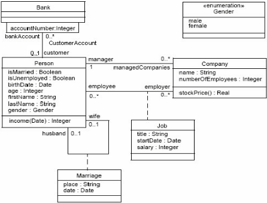

## 7.2.3 Character Set

OCL text comprises characters in the UNICODE character set. In particular, string literals, comments, and the names of types, features, and other elements in the UML model may contain any valid UNICODE character.

## 7.3 Relation to the UML Metamodel

## 7.3.1 Self

Each OCL expression is written in the context of an instance of a specific type. In an OCL expression, the reserved word self is used to refer to the contextual instance. For example, if the context is Company, then self refers to an instance of Company.

## 7.3.2 Specifying the UML Context

The context of an OCL expression within a UML model can be specified through a so-called context declaration at the beginning of an OCL expression. The context declaration of the constraints in the following sub clauses is shown.

If the constraint is shown in a diagram, with the proper stereotype and the dashed lines to connect it to its contextual element, there is no need for an explicit context declaration in the test of the constraint. The context declaration is optional.

## 7.3.3 Invariants

The OCL expression can be part of an Invariant which is a Constraint stereotyped as an «invariant». When the invariant is associated with a Classifier, the latter is referred to as a 'type' in this clause. An OCL expression is an invariant of the type and must be true for all instances of that type at any time. (Note that all OCL expressions that express invariants are of the type Boolean.)

For example, if in the context of the Company type in Figure 7.1, the following expression would specify an invariant that the number of employees must always exceed 50:

```
self.numberOfEmployees > 50
```

where self is an instance of type Company. (We can view self as the object from where we start evaluating the expression.) This invariant holds for every instance of the Company type.

The type of the contextual instance of an OCL expression, which is part of an invariant, is written with the context keyword, followed by the name of the type as follows. The label inv: declares the constraint to be an «invariant» constraint.

```
context Company inv : self.numberOfEmployees > 50
```

In most cases, the keyword self can be dropped because the context is clear, as in the above examples. As an alternative for self, a different name can be defined playing the part of self. For example:

```
context c : Company inv : c.numberOfEmployees > 50
```

This invariant is equivalent to the previous one.

Optionally, the name of the constraint may be written after the inv keyword, allowing the constraint to be referenced by name. In the following example the name of the constraint is enoughEmployees .

```
context c : Company inv enoughEmployees: c.numberOfEmployees > 50
```

## 7.3.4 Pre- and Postconditions

The OCL expression can be part of a Precondition or Postcondition, corresponding to «precondition» and «postcondition» stereotypes of Constraint associated with an Operation or other behavioral feature. The contextual instance self then is an instance of the type that owns the operation or method as a feature. The context declaration in OCL uses the context keyword, followed by the type and operation declaration. The stereotype of constraint is shown by putting the labels 'pre:' and 'post:' before the actual Preconditions and Postconditions. For example:

context Typename::operationName(param1 : Type1, ... ): ReturnType

```
pre :  param1 > ... post :  result = ...
```

The name self can be used in the expression referring to the object on which the operation was called. The reserved word result denotes the result of the operation, if there is one. The names of the parameters ( param1 ) can also be used in the OCL expression. In the example diagram, we can write:

```
context Person::income(d : Date) : Integer post :  result = 5000
```

Optionally, the name of the precondition or postcondition may be written after the pre or post keyword, allowing the constraint to be referenced by name. In the following example the name of the precondition is parameterOk and the name of the postcondition is resultOk . In the UML metamodel, these names are the values of the attribute name of the metaclass Constraint that is inherited from ModelElement.

```
context Typename::operationName(param1 : Type1, ... ): ReturnType pre parameterOk:  param1 > ... post resultOk   :  result = ...
```

## 7.3.5 Package Context

The above context declaration is precise enough when the package in which the Classifier belongs is clear from the environment. To specify explicitly in which package invariant, pre or postcondition Constraints belong, these constraints can be enclosed between 'package' and 'endpackage' statements. The package statements have the syntax:

```
package Package::SubPackage context X inv : ... some invariant ... context X::operationName(..) pre : ... some precondition ... endpackage
```

An OCL file (or stream) may contain any number package statements, thus allowing all invariant, preconditions, and postconditions to be written and stored in one file. This file may co-exist with a UML model as a separate entity.

## 7.3.6 Operation Body Expression

An OCL expression may be used to indicate the result of a query operation. This can be done using the following syntax:

```
context Typename::operationName(param1 : Type1, ... ): ReturnType body :  -- some expression
```

The expression must conform to the result type of the operation. Like in the pre- and postconditions, the parameters may be used in the expression. Pre-, and postconditions, and body expressions may be mixed together after one operation context. For example:

```
context Person::getCurrentSpouse() : Person pre :   self.isMarried = true body :  self.mariages->select( m | m.ended = false ).spouse
```

## 7.3.7 Initial and Derived Values

An OCL expression may be used to indicate the initial or derived value of an attribute or association end. This can be done using the following syntax:

```
context Typename::attributeName: Type init :  -- some expression representing the initial value context Typename::assocRoleName: Type derive :  -- some expression representing the derivation rule
```

The expression must conform to the result type of the attribute. In the case the context is an association end the expression must conform to the classifier at that end when the multiplicity is at most one, or Set, or OrderedSet when the multiplicity may be more than one. Initial and derivation expressions may be mixed together after one context. For example:

```
context Person::income : Integer init :   parents.income->sum() * 1% -- pocket allowance derive :  if underAge then parents.income->sum() * 1% -- pocket allowance else job.salary                 -- income from regular job endif
```

The derivation constraint must be satisfied at any time, hence the derivation includes the initialization. Both are allowed on the same property but they must not be contradictory. For each property there should be at most one initialization constraint and at most one derivation constraint.

## 7.3.8 Other Types of Expressions

Any OCL expression can be used as the value for an attribute of the UML metaclass Expression or one of its subtypes. In that case, the semantics sub clause describes the meaning of the expression. A special subclass of Expression, called ExpressionInOcl is used for this purpose. See 12.1, 'Introduction' for a definition.

## 7.4 Basic Values and Types

In OCL, a number of basic types are predefined and available to the modeler at all times. These predefined value types are independent of any object model and are part of the definition of OCL.

The most basic value in OCL is a value of one of the basic types. The basic types of OCL, with corresponding examples of their values, are shown in the following table.

Table 7.1 - - Basic OCL types and their values

| type             | values                   | consistent with implementation definitions           |
|------------------|--------------------------|------------------------------------------------------|
| OclInvalid       | invalid                  |                                                      |
| OclVoid          | null, invalid            |                                                      |
| Boolean          | true, false              | (MOF) http://www.w3.org/TR/xmlschema-2/#boolean      |
| Integer          | 1, -5, 2, 34, 26524, ... | (MOF) http://www.w3.org/TR/xmlschema-2/#integer      |
| Real             | 1.5, 3.14, ...           | http://www.w3.org/TR/xmlschema-2/#double             |
| String           | 'To be or not to be...'  | (MOF) http://www.w3.org/TR/xmlschema-2/#string       |
| UnlimitedNatural | 0, 1, 2, 42, ..., *      | http://www.w3.org/TR/xmlschema-2/#nonNegativeInteger |

OCL defines a number of operations on the predefined types. Table 7.2 - gives some examples of the operations on the predefined types. See 11.4, 'Primitive Types' for a complete list of all operations.

Table 7.2 - - Examples of operations on the predefined types

| type    | operations                               |
|---------|------------------------------------------|
| Integer | *, +, -, /, abs()                        |
| Real    | *, +, -, /, floor()                      |
| Boolean | and, or, xor, not, implies, if-then-else |

Table 7.2 - - Examples of operations on the predefined types

| String           | concat(), size(), substring()   |
|------------------|---------------------------------|
| UnlimitedNatural | *, +, /                         |

Collection, Set, Bag, Sequence, and Tuple are basic types as well. Their specifics will be described in the upcoming sub clauses.

Multiple adjacent strings are concatenated allowing a long string to be specified on multiple lines.

'This is a '



'concatenated string'          -- 'This is a concatenated string'

Unicode characters are used within single quoted sequences, with the following backslash based escape sequences used to define backslash and other characters.

```
\b          -- backspace  \t          -- horizontal tab  \n          -- linefeed  \f          -- form feed  \r          -- carriage return  \"         -- double quote  \'          -- single quote  \\          -- backslash  \x hh -- #x00 to #xFF  \u hhhh -- #x0000 to #xFFFF
```

where h is a hex digit: 0 to 9, A to F or a to f.

Reserved words such as true and arbitrary awkward spellings may be used as names by enclosing the name in underscoreprefixed single quotes.

self.'if' = 'tabbed\tvariable'.'spaced operation'()

## 7.4.1 Types from the UML Model

Each OCL expression is written in the context of a UML model, a number of classifiers (types/classes, ...), their features and associations, and their generalizations. All classifiers from the UML model are types in the OCL expressions that are attached to the model.

## 7.4.2 Enumeration Types

Enumerations are Datatypes in UML and have a name, just like any other Classifier. An enumeration defines a number of enumeration literals that are the possible values of the enumeration. Within OCL one can refer to the value of an enumeration. When we have Datatype named Gender in the example model with values 'female' or 'male' they can be used as follows:

```
context Person inv: gender = Gender::male
```

## 7.4.3 Let Expressions

Sometimes a sub-expression is used more than once in a constraint. The let expression allows one to define a variable that can be used in the constraint.

```
context Person inv : let income : Integer = self.job.salary->sum() in
```

```
if isUnemployed then income < 100 else income >= 100 endif
```

A let expression may be included in any kind of OCL expression. It is only known within this specific expression. A variable declaration inside a let must have a declared type and an initial value.

## 7.4.4 Additional operations/attributes through «definition» expressions

The Let expression allows a variable to be used in one OCL expression. To enable reuse of variables/operations over multiple OCL expressions one can use a Constraint with the stereotype «definition», in which helper variables/operations are defined. This «definition» Constraint must be attached to a Classifier and may only contain variable and/or operation definitions, nothing else. All variables and operations defined in the «definition» constraint are known in the same context as where any property of the Classifier can be used. Such variables and operations are attributes and operations with stereotype «OclHelper» of the classifier. They are used in an OCL expression in exactly the same way as normal attributes or operations are used. The syntax of the attribute or operation definitions is similar to the Let expression, but each attribute and operation definition is prefixed with the keyword 'def' as shown below.

```
context Person def : income : Integer = self.job.salary->sum() def : nickname : String = 'Little Red Rooster' def : hasTitle(t : String) : Boolean = self.job->exists(title = t)
```

Operations or attributes defined by "definitions expressions" may be static (classifier scoped). In that case the static keyword should be used before "def."

```
context MyClass static def : globalId() : Integer = ...
```

The names of the attributes / operations in a let expression may not conflict with the names of respective attributes/ associationEnds and operations of the Classifier.

Using this definition syntax is identical to defining an attribute/operation in the UML with stereotype «OclHelper» with an attached OCL constraint for its derivation.

## 7.4.5 Type Conformance

OCL is a typed language and the basic value types are organized in a type hierarchy. This hierarchy determines conformance of the different types to each other. You cannot, for example, compare an Integer with a Boolean or a String.

An OCL expression in which all the types conform is a valid expression. An OCL expression in which the types don't conform is an invalid expression. It contains a type conformance error . A type type1 conforms to a type type2 when an instance of type1 can be substituted at each place where an instance of type2 is expected. The type conformance rules for types in the class diagrams are simple.

- Each type conforms to each of its supertypes.
- Type conformance is transitive: if type1 conforms to type2 , and type2 conforms to type3 , then type1 conforms to type3 .

The effect of this is that a type conforms to its supertype, and all the supertypes above. The type conformance rules for the types from the OCL Standard Library are listed in Table 7.3 -, where the third column specifies an additional condition which must be satisfied by the involved types to verify the type conformance rule..

Table 7.3 - - Type conformance rules

| Type             | Conforms to/Is a subtype of   | Condition               |
|------------------|-------------------------------|-------------------------|
| Set(T1)          | Collection(T2)                | if T1 conforms to T2    |
| Sequence(T1)     | Collection(T2)                | if T1 conforms to T2    |
| Bag(T1)          | Collection(T2)                | if T1 conforms to T2    |
| OrderedSet(T1)   | Collection(T2)                | if T1 conforms to T2    |
| Integer          | Real                          |                         |
| UnlimitedNatural | Integer                       | * is an invalid Integer |

Although UnlimitedNatural conforms to Integer, '*' is an invalid Integer, so that the evaluation of the expression '1 + *' results in invalid.

The conformance relation between the collection types only holds if they are collections of element types that conform to each other. See 7.5.13, 'Collection Type Hierarchy and ype Conformance Rules' for the complete conformance rules for collections.

Table 7.4 - provides examples of valid and invalid expressions.

Table 7.4 - - Valid and Invalid Expressions

| OCL expression   | valid   | explanation                                  |
|------------------|---------|----------------------------------------------|
| 1 + 2 * 34       | yes     |                                              |
| 1 + 'motorcycle' | no      | type String does not conform to type Integer |
| 23 * false       | no      | type Boolean does not conform to Integer     |
| 12 + 13.5        | yes     |                                              |

## 7.4.6 Re-typing or Casting Objects

In some circumstances, it is desirable to use a property of an object that is defined on a subtype of the current known type of the object. Because the property is not defined on the current known type, this results in a type conformance error.

When it is certain that the actual type of the object is the subtype, the object can be re-typed using the operation oclAsType(Classifier) . This operation results in the same object, but the known type is the argument Classifier . When there is an object object of type Type1 and Type2 is another type, it is allowed to write:

object.oclAsType(Type2) --- changes the static type of the expression to Type2

An object can only be re-typed to a type to which it conforms.  If the actual type of the object, at evaluation time, is not a subtype of the type to which it is re-typed, then the result of oclAsType is invalid .

Casting provides visibility, at parse time, of features not defined in the context of an expression's static type. It does not coerce objects to instances of another type, nor can it provide access to hidden or overridden features of a type.  For this, the feature call is qualified by the name of the type (a path name, if necessary) whose definition of the feature is to be accessed.

For example, if class Employee redefines the age() : Integer operation of the Person class, a constraint may access the Person definition as in context Employee

```
inv:  self.age() <= self.Person::age() For clarity, the qualified form may only be used with an explicit source expression.
```

## 7.4.7 Re-typing or Casting Collections

A Collection may be retyped in a similar way, but using the collection navigation operator. aCollection-&gt;oclAsType(Set(String))

This will return invalid if either aCollection is not a Set or the elements of aCollection are not conformant with String.

The elements of a collection may be retyped individually using a collect iteration. aCollection-&gt;collect(oclAsType(String))

This preserves the kind of collection (Set or Sequence or ...) but retypes the elements.

The selectByKind operation may be used to select a type conformant sub-collection. aCollection-&gt;selectByKind(Person)

This returns a sub-collection of the same kind as aCollection containing all the non-null elements that are conformant to Person. Similarly selectByType returns a sub-collection of the non-null elements with the exact type.

## 7.4.8 Precedence Rules

The precedence order for the operations, starting with highest precedence, in OCL is:

- literal and variable expressions, '(' and ')', 'if-then-else-endif'
- 'let-in'
- @pre
- call expressions: "^", "^^", '.' and '-&gt;'
- unary 'not' and unary '-'
- '*' and '/'
- '+' and binary '-'
- '&lt;', '&gt;', '&lt;=', '&gt;='
- '=', '&lt;&gt;'
- 'and'
- 'or'
- 'xor'
- 'implies'
- 'in'

All infix operators are left associative, equal precedence operators are evaluated left to right.

A let expression is both high precedence and low precedence; high on the left so that a let expression behaves as an atomic value in operations, low on the right so that the in-expression can be an arbitrary expression. "a + let ... in a + let ... in a + a" is "a + (let ... in (a + (let ... in (a + a))))".

Parentheses '(' and ')' can be used to change precedence and associativity.

## 7.4.9 Use of Infix Operators

The use of infix operators is allowed in OCL. The operators '+', '-', '*', '/', '=', '&lt;&gt;', '&lt;', '&gt;', '&lt;=', '&gt;=' are used as infix operators. If a type defines one of those operators with the correct signature, they will be used as infix operators. The expression:

```
a + b
```

is equal to the expression:

```
a._'+'(b)
```

that is, invoking the '+' operation on a with b as the parameter to the operation.

The infix operators defined for a type must have exactly one parameter. For the infix operators '&lt;,' '&gt;,' '&lt;=,' '&gt;=,' '&lt;&gt;,' 'and,' 'or,' and 'xor' the return type must be Boolean.

## 7.4.10  Navigation Operators and Navigation Shorthands

There are two navigation operators: "." and "-&gt;".

```
The "." navigation operator supports navigation from an object using a property or operation. anObject.name aString.indexOf(':') The "->" navigation operator supports navigation from a collection using a property, operation or iteration. aBag->elementType aSet->union(anotherSet) aSet->collect(name) Additionally there are two navigation shorthands: "." and "->". The "." navigation shorthand performs an implicit collect of a property or operation on a collection. aSet.name is a shorthand for aSet->collect(name) The "->" navigation shorthand performs an implicit set conversion of an object. anObject->union(aSet) is a shorthand for anObject.oclAsSet()->union(aSet)
```

These operators and shorthands are summarized in Table 7.5.

Table 7.5 - - Navigation Operators and Shorthands

|    | Object Source                                | Collection Source                                |
|----|----------------------------------------------|--------------------------------------------------|
| .  | Object Navigation Operator                   | Implicit Collect Conversion Navigation Shorthand |
| -> | Implicit Set Conversion Navigation Shorthand | Collection Navigation Operator                   |

## 7.4.11  Keywords

Keywords in OCL are reserved words. That means that the keywords cannot occur as a name. A reserved word may be used as the name of a package, a type, a feature, a variable or a constraint by enclosing the word in underscore-prefixed single quotes. The list of keywords is shown below:

| and        | if      | or      |
|------------|---------|---------|
| body       | implies | package |
| context    | in      | post    |
| def        | init    | pre     |
| derive     | inv     | self    |
| else       | invalid | static  |
| endif      | let     | then    |
| endpackage | not     | true    |
| false      | null    | xor     |

The following words are restricted. A restricted word can only be used as a name when preceded by a "::". A restricted word may also be used by enclosing the word in underscore-prefixed single quotes.

| Bag        | OrderedSet       |
|------------|------------------|
| Boolean    | Real             |
| Collection | Sequence         |
| Integer    | Set              |
| OclAny     | String           |
| OclInvalid | Tuple            |
| OclMessage | UnlimitedNatural |
| OclVoid    |                  |

Note that operation names such as iterate, forAll, and oclType, are not reserved or restricted.

## 7.4.12 Comment

Comments in OCL are written following two successive dashes (minus signs). Everything immediately following the two dashes up to and including the end of line is part of the comment.

For example:



- -- this is a comment

## 7.4.13  Invalid Values

Some expressions will, when evaluated, have an invalid value. For instance, typecasting with oclAsType() to a type that the object does not support or getting the -&gt;first() element of an empty collection will result in invalid. In general, an expression where one of the parts is null or invalid will itself be invalid. There are some important exceptions to this rule, however. First, there are the logical operators:

- True OR-ed with anything is True
- False AND-ed with anything is False
- False IMPLIES anything is True
- anything IMPLIES True is True

The rules for OR and AND are valid irrespective of the order of the arguments and they are valid whether the value of the other sub-expression is known or not.

The rules for OR and AND apply to the exists and forAll iterations that are defined as iterated OR and AND.

The IF-expression is another exception. It will be valid as long as the condition and the chosen branch is valid, irrespective of the value of the other branch.

null objects may be compared with non-invalid objects in = and &lt;&gt; comparisons.

Finally, there are explicit operations for testing if the value of an expression is undefined. oclIsUndefined() is an operation on OclAny that results in true if its argument is null or invalid and false otherwise. Similarly oclIsInvalid() is an operation on OclAny that results in true if its argument is invalid and false otherwise. All explicit operations are defined in 11.3.2 and 11.3.3.

## 7.5 Objects and Properties

OCL expressions can refer to Classifiers, e.g., types, classes, interfaces, associations (acting as types), and datatypes. Also all attributes, association-ends, methods, and operations without side effects that are defined on these types, etc. can be used. In a class model, an operation or method is defined to be side effect free if the isQuery attribute of the operations is true. For the purpose of this document, we will refer to attributes, association-ends, and side effect free methods and operations as being properties . A property is one of:

- an Attribute
- an AssociationEnd
- an Operation with isQuery being true
- a Method with isQuery being true

The value of a property on an object that is defined in a class diagram is specified in an OCL expression by a dot followed by the name of the property. For example:

```
context Person inv : self.isMarried
```

If self is a reference to an object, then self.property is the value of the property property on self .

## 7.5.1 Properties: Attributes

For example, the age of a Person is written as self.age :

```
context Person inv : self.age > 0
```

The value of the subexpression self.age is the value of the age attribute on the particular instance of Person identified by self . The type of this subexpression is the type of the attribute age , which is the standard type Integer.

Using attributes and operations defined on the basic value types, we can express calculations etc. over the class model. For example, a business rule might be 'the age of a Person is always greater than zero.' This can be stated by the invariant above.

Attributes may have multiplicities in a UML model. Whenever the multiplicity of an attribute is greater than 1, the result type is collection of values. Collections in OCL are described later in this clause.

## 7.5.2 Properties: Operations

Operations may have parameters. For example, as shown earlier, a Person object has an income expressed as a function of the date. This operation would be accessed as follows, for a Person aPerson and a date aDate :

```
aPerson.income(aDate)
```

The result of this operation call is a value of the return type of the operation, which is Integer in this example. If the operation has out or in/out parameters, the result of this operation is a tuple containing all out, in/out parameters and the return value. For example, if the income operation would have an out parameter bonus , the result of the above operation call is of type Tuple( bonus: Integer, result: Integer) . You can access these values using the names of the out parameters, and the keyword result . For example:

```
aPerson.income(aDate).bonus = 300 and aPerson.income(aDate).result = 5000
```

Note that the out parameters need not be included in the operation call. Values for all in or in/out parameters are necessary.

## Defining operations

The operation itself could be defined by a postcondition constraint. This is a constraint that is stereotyped as «postcondition». The object that is returned by the operation can be referred to by result . It takes the following form:

```
context Person::income (d: Date) : Integer post : result = age * 1000
```

The right-hand-side of this definition may refer to the operation being defined (i.e., the definition may be recursive) as long as the recursion is not infinite. Inside a pre- or postcondition one can also use the parameters of the operation. The type of result , when the operation has no out or in/out parameters, is the return type of the operation, which is Integer in the above example. When the operation does have out or in/out parameters, the return type is a Tuple as explained above. The postcondition for the income operation with out parameter bonus may take the following form:

```
context Person::income (d: Date, bonus: Integer) : Integer post : result = Tuple { bonus = ..., result = .... }
```

To refer to an operation or a method that doesn't take a parameter, parentheses with an empty argument list are mandatory:

```
context Company inv: self.stockPrice() > 0
```

## 7.5.3 Properties:  AssociationEnds and Navigation

Starting from a specific object, we can navigate an association on the class diagram to refer to other objects and their properties. To do so, we navigate the association by using the opposite association-end:

```
object.associationEndName
```

The value of this expression is the set of objects on the other side of the associationEndName association. If the multiplicity of the association-end has a maximum of one ('0..1' or '1'), then the value of this expression is an object. In the example class diagram, when we start in the context of a Company (i.e., self is an instance of Company), we can write:

```
context Company inv : self.manager.isUnemployed = false
```

```
inv : self.employee->notEmpty()
```

In the first invariant self.manager is a Person, because the multiplicity of the association is one. In the second invariant self.employee will evaluate in a Set of Persons. By default, navigation will result in a Set. When the association on the Class Diagram is adorned with {ordered}, the navigation results in an OrderedSet.

Collections, like Sets, OrderedSets, Bags, and Sequences are predefined types in OCL. They have a large number of predefined operations on them. A property of the collection itself is accessed by using an arrow '-&gt;' followed by the name of the property. The following example is in the context of a person:

```
context Person inv : self.employer->size() < 3
```

This applies the size property on the Set self.employer , which results in the number of employers of the Person self .

```
context Person inv : self.employer->isEmpty()
```

This applies the isEmpty property on the Set self.employer . This evaluates to true if the set of employers is empty and false otherwise.

## Missing Association names

The association name is never missing. If no explicit name is available, an implicit name is constructed in accordance with the UML style guide. Associations that are not explicitly named, are given names that are constructed according to the following production rule:

'A\_' &lt;association-end-name1&gt; '\_' &lt;association-end-name2&gt;

where &lt;association-end-name1&gt; is the name of one association end and lexically precedes  &lt;association-end-name2&gt; which is the name of the other association end.

## Missing Association End names

The name of an association-end is never missing. If no explicit name is available an implicit name is taken from the name of the class to which the end is attached.

Note to tool vendors; this is a non-normative change from OCL 2.2, where the UML style guidance of converting the first letter of the implicit name to lowercase was endorsed. The normative text has never defined how implicit names are obtained. Tool vendors may wish to provide backward/forward compatibility warnings for this change.

Figure 7.2 Ambiguous name example


This may result in an ambiguity between an implicit association end name and another explicit name, unless only one of the association ends is navigable. The ambiguous name cannot be used in OCL.

aPerson.role   -- ambiguous

## Qualifying association ends with association names

An association end name may be qualified with its association name or its source classifier name to resolve an ambiguity.

- aPerson.Person::role -- still ambiguous  aPerson.A\_person\_role::role -- some Parts, using implicit Person to Part association name  aPerson.A\_owner\_role::role -- a Role, using implicit Person to Role association name

## Ends owned by associations

In a UML association, an end may be owned by the Classifier at that end, or by the association, itself.  The ownership of the end is not significant to OCL.  In either case, the association end is considered as a property of the Classifier and can be navigated from that end to the other.

## Navigation over Associations with Multiplicity Zero or One

Because the multiplicity of the role manager is one, self.manager is an object of type Person. Such a single object can be used as a Set as well by using oclAsSet() or its "-&gt;" shorthand. It then behaves as if it is a Set containing the single object. The usage as a set is done through the arrow followed by a property of Set. This is shown in the following example:

```
context Company inv : self.manager->size() = 1
```

The sub-expression self.manager is used as a Set, because the arrow is used to access the size property on Set. This expression evaluates to true.

```
context Company inv : self.manager->foo
```

The sub-expression self.manager is used as Set, because the arrow is used to access the foo property on the Set. This expression is incorrect, because foo is not a defined property of Set.

```
context Company inv : self.manager.age > 40
```

The sub-expression self.manager is used as a Person, because the dot is used to access the age property of Person.

In the case of an optional (0..1 multiplicity) association, this is especially useful to check whether there is an object or not when navigating the association. In the example we can write:

```
context Person inv : self.wife->notEmpty() implies self.wife.gender = Gender::female
```

## Combining Properties

Properties can be combined to make more complicated expressions. An important rule is that an OCL expression always evaluates to a specific object of a specific type. After obtaining a result, one can always apply another property to the result to get a new result value. Therefore, each OCL expression can be read and evaluated left-to-right.

Following are some invariants that use combined properties on the example class diagram:

```
[1] Married people are of age >= 18 context Person inv : (self.wife->notEmpty() implies self.wife.age >= 18) and (self.husband->notEmpty() implies self.husband.age >= 18) [2] a company has at most 50 employees context Company inv : self.employee->size() <= 50
```

## 7.5.4 Navigation to Association Classes

To specify navigation to association classes (Job and Marriage in the example), OCL uses a dot and the name of the association class:

```
context Person inv : self.Job
```

The sub-expression self.Job evaluates to a Set of all the jobs a person has with the companies that are his/her employer. In the case of an association class, there is no explicit rolename in the class diagram. The name Job used in this navigation is the name of the association class.

In case of a recursive association, that is an association of a class with itself, the name of the association class alone is not enough. We need to distinguish the direction in which the association is navigated as well as the name of the association class. Take the following model as an example.

Figure 7.3  - Navigating recursive association classes

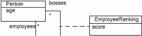

When navigating to an association class such as EmployeeRanking there are two possibilities depending on the direction. For instance, in the above example, we may navigate towards the employees end, or the bosses end. By using the name of the association class alone, these two options cannot be distinguished. To make the distinction, the rolename of the direction in which we want to navigate is added to the association class name, enclosed in square brackets. In the expression

```
context Person inv : self.EmployeeRanking[bosses]->sum() > 0
```

the self.EmployeeRanking[bosses] evaluates to the set of EmployeeRankings belonging to the collection of bosses . And in the expression

```
context Person inv : self.EmployeeRanking[employees]->sum() > 0
```

the self.EmployeeRanking[employees] evaluates to the set of EmployeeRankings belonging to the collection of employees .

The unqualified use of the association class name is not allowed in such a recursive situation. Thus, the following example is invalid:

```
context Person inv :
```

```
self.EmployeeRanking->sum() > 0 -- INVALID!
```

In a non-recursive situation, the association class name alone is enough, although the qualified version is allowed as well. Therefore, the examples at the start of this sub clause could also be written as:

```
context Person inv : self.Job[employer]
```

## 7.5.5 Navigation from Association Classes

We can navigate from the association class itself to the objects that participate in the association. This is done using the dot-notation and the role-names at the association-ends.

```
context Job inv : self.employer.numberOfEmployees >= 1 inv : self.employee.age > 21
```

Navigation from an association class to one of the objects on the association will always deliver exactly one object. This is a result of the definition of AssociationClass. Therefore, the result of this navigation is exactly one object, although it can be used as a Set using oclAsSet() or its "-&gt;" shorthand.

## 7.5.6 Navigation through Qualified Associations

Qualified associations use one or more qualifier attributes to select the objects at the other end of the association. To navigate them, we can add the values for the qualifiers to the navigation. This is done using square brackets, following the role-name. It is permissible to leave out the qualifier values, in which case the result will be all objects at the other end of the association. The following example results in a Set(Person) containing all customers of the Bank.

```
context Bank inv : self.customer The next example results in one Person, having account number 8764423. context Bank inv :
```

```
self.customer[8764423]
```

If there is more than one qualifier attribute, the values are separated by commas, in the order which is specified in the UML class model. It is not permissible to partially specify the qualifier attribute values.

## 7.5.7 Using Pathnames for Packages

Within UML, types are organized in packages. OCL provides a way of explicitly referring to types in other packages by using a package-pathname prefix. The syntax is a package name, followed by a double colon:

```
Packagename::Typename
```

This usage of pathnames is transitive and can also be used for packages within packages:

Packagename1::Packagename2::Typename

## 7.5.8 Accessing overridden properties of supertypes

Whenever properties are redefined within a type, the property of the supertypes can be accessed using the oclAsType() operation. Whenever we have a class B as a subtype of class A, and a property p1 of both A and B, we can write:

```
context B inv : self.oclAsType(A).p1  -- accesses the p1 property defined in A self.p1 -- accesses the p1 property defined in B
```

Figure 7.4 shows an example where such a construct is needed. In this model fragment there is an ambiguity with the OCL expression on Dependency:

```
context Dependency inv : self.source <> self
```

This can either mean normal association navigation, which is inherited from ModelElement, or it might also mean navigation through the dotted line as an association class. Both possible navigations use the same role-name, so this is always ambiguous. Using oclAsType() we can distinguish between them with:

## context

```
Dependency inv : self.oclAsType(Dependency).source->isEmpty() inv : self.oclAsType(ModelElement).source->isEmpty()
```

Figure 7.4 - Accessing Overridden Properties Example

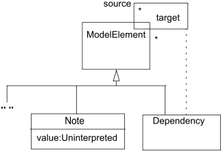

## 7.5.9 Predefined properties on All Objects

There are several properties that apply to all objects, and are predefined in OCL. These are:

```
oclIsTypeOf (t : Classifier)  : Boolean oclIsKindOf (t : Classifier) : Boolean oclIsInState (s : OclState)  : Boolean oclIsNew   () : Boolean oclAsType (t : Classifier) : instance of Classifier
```

The operation is oclIsTypeOf results in true if the type of self and t are the same. For example:

```
context Person inv : self.oclIsTypeOf( Person )        -- is true inv : self.oclIsTypeOf( Company)     -- is false
```

The above property deals with the direct type of an object. The oclIsKindOf property determines whether t is either the direct type or one of the supertypes of an object.

The operation oclIsInState(s) results in true if the object is in the state s . Possible states for the operation oclIsInState(s) are all states of the statemachine that defines the classifier's behavior . For nested states the statenames can be combined using the double colon '::'.

Figure 7.5 - Statemachine Example

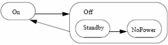

In the example statemachine above, values for s can be On , Off , Off::Standby , Off::NoPower . If the classifier of object has the above associated statemachine, valid OCL expressions are:

```
object.oclIsInState(On) object.oclIsInState(Off) object.oclIsInState(Off::Standby) object.oclIsInState(Off::NoPower)
```

If there are multiple statemachines attached to the object's classifier, then the statename can be prefixed with the name of the statemachine containing the state and the double colon '::,' as with nested states.

The operation oclIsNew evaluates to true if, used in a postcondition, the object is created during performing the operation (i.e., it didn't exist at precondition time).

The operation oclAsType(t) casts the source to the type t , which must be a subtype or supertype of the source type.

## 7.5.10  Features on Classes Themselves

All properties discussed until now in OCL are properties on instances of classes. The types are either predefined in OCL or defined in the class model. In OCL, it is also possible to use static features, applicable to the types/classes themselves rather than to their instances.  For example, the Employee class may define a static operation 'uniqueID' that computes a unique ID to use in the initialization of the employee ID attribute:

```
context Employee::id : String init : Employee::uniqueID()
```

Static features are invoked using the '::' operator and are distinct from the features of the Classifier metaclass, which include the allInstances operation pre-defined by OCL.  If we want to make sure that all instances of Person have unique names, we can write:

```
context Person inv : Person.allInstances()->forAll(p1, p2 | p1 <> p2 implies p1.name <> p2.name)
```

Invocation of allInstances uses the '.' operator rather than '::' because it is not a static operation. It is an operation applicable to instances of the Classifier metaclass, of which Person is an example.

## 7.5.11 Collections

Single navigation of an association results in a Set, combined navigations in a Bag, and navigation over associations adorned with {ordered} results in an OrderedSet. Therefore, the collection types defined in the OCL Standard Library play an important role in OCL expressions.

The type Collection is predefined in OCL. The Collection type defines a large number of predefined operations to enable the OCL expression author (the modeler) to manipulate collections. Consistent with the definition of OCL as an expression language, collection operations never change collections; isQuery is always true. They may result in a collection, but rather than changing the original collection they project the result into a new one.

Collection is an abstract type, with the concrete collection types as its subtypes. OCL distinguishes three different collection types: Set, Sequence, and Bag. A Set is the mathematical set. It does not contain duplicate elements. A Bag is like a set, which may contain duplicates (i.e., the same element may be in a bag twice or more). A Sequence is like a Bag in which the elements are ordered. Both Bags and Sets have no order defined on them.

## Collection Literals

Sets, Sequences, and Bags can be specified by a literal in OCL. Curly brackets surround the elements of the collection, elements in the collection are written within, separated by commas. The type of the collection is written before the curly brackets:

```
Set { 1 , 88, 5, 2 } Set { 'strawberry', 'apple', 'orange' }
```

```
A Sequence: Sequence { 45, 3, 3, 2, 1 } Sequence { 'ape', 'nut' } A bag: Bag {1, 3, 4, 3, 5 }
```

Because of the usefulness of a Sequence of consecutive Integers, there is a separate literal to create them. The elements inside the curly brackets can be replaced by an interval specification, which consists of two expressions of type Integer, Int-expr1 and Int-expr2 , separated by '..'. This denotes all the Integers between the values of Int-expr1 and Int-expr2 , including the values of Int-expr1 and Int-expr2 themselves:

```
Sequence{ 1..(6 + 4) } Sequence{ 1..10 } -- are both identical to Sequence{ 1, 2, 3, 4, 5, 6, 7, 8, 9, 10 }
```

The complete list of Collection operations is described in Clause 11 ('The OCL Standard Library').

Collections can be specified by a literal, as described above. The only other way to get a collection is by navigation. To be more precise, the only way to get a Set, OrderedSet, Sequence, or Bag is:

1. a literal, this will result in a Set, OrderedSet, Sequence, or Bag:
2. a navigation starting from a single object can result in a collection:
3. operations on collections may result in new collections:

```
Set        {2 , 4, 1 , 5 , 7 , 13, 11, 17 } OrderedSet {1 , 2, 3 , 5 , 7 , 11, 13, 17 } Sequence   {1 , 2, 3 , 5 , 7 , 11, 13, 17 } Bag        {1, 2, 3, 2, 1}
```

```
context Company inv : self.employee
```

collection1-&gt;union(collection2)

## 7.5.12    Collections of Collections

OCL allows elements of collections to be collections themselves. The OCL Standard Library includes specific flattened operations for collections. These can be used to flatten collections of collections explicitly.

## 7.5.13   Collection Type Hierarchy and  ype Conformance Rules

In addition to the type conformance rules in 7.4.5, 'Type Conformance' the following rules hold for all types, including the collection types:

- The types Set (X), Bag (X), and Sequence (X) are all subtypes of Collection (X).

Type conformance rules are as follows for the collection types:

- Type1 conforms to Type2 when they are identical (standard rule for all types).
- Type1 conforms to Type2 when it is a subtype of Type2 (standard rule for all types).
- Collection(Type1) conforms to Collection(Type2) , when Type1 conforms to Type2 . This is also true for Set(Type1)/ Set(Type2) , Sequence(Type1)/Sequence(Type2) , Bag(Type1)/Bag(Type2) .
- Type conformance is transitive: if Type1 conforms to Type2 , and Type2 conforms to Type3 , then Type1 conforms to Type3 (standard rule for all types).

For example, if Bicycle is a subtype of Transport:

Set(Bicycle)  conforms to  Set(Transport)

```
Set(Bicycle)  conforms to  Collection(Bicycle) Set(Bicycle)  conforms to  Collection(Transport)
```

Note that Set(Bicycle) does not conform to Bag(Bicycle), nor the other way around, since Set and Bag are subtypes of Collection but not of each other.

## 7.5.14   Previous Values in Postconditions

As stated in 7.3.4, 'Pre- and Postconditions' OCL can be used to specify pre- and postconditions on operations and behaviors in UML. In a postcondition, the expression can refer to values of any feature of an object at two moments in time:

- the value of a feature at the start of the operation or behavior
- the value of a feature upon completion of the operation or behavior

The value of an operation call or a property navigation in a postcondition is the value upon completion of the operation.

To refer to the value of a feature at the start of the operation, one has to postfix the property name with the keyword ' @pre ':

```
context Person::birthdayHappens() post : age = age@pre + 1
```

The property age refers to the property of the instance of Person that executes the operation. The property age@pre refers to the value of the property age of the Person that executes the operation, at the start of the operation.

In the case of an operation call, the '@pre' is postfixed to the operation name, before the parameters.

```
context Company::hireEmployee(p : Person)
```



```
post : employees = employees@pre->including(p) and stockprice() = stockprice@pre() + 10
```

When the pre-value of a feature evaluates to an object, all further properties that are accessed of this object are the new values (upon completion of the operation) of this object. So:

```
a.b@pre.c -- takes the old value of property b of a, say x -- and then the new value of c of x. a.b@pre.c@pre-- takes the old value of property b of a, say x -- and then the old value of c of x.
```

The '@pre' postfix is allowed only in OCL expressions that are part of a Postcondition, and only on invocations of the features of model classifiers. Asking for a current property of an object that has been destroyed during execution of the operation results in null. Also, referring to the previous value of an object that has been created during execution of the operation results in null.

## 7.5.15   Tuples

It is possible to compose several values into a tuple . A tuple consists of named parts, each of which can have a distinct type. Some examples of tuples are:

```
Tuple {name: String = 'John,'  age: Integer = 10} Tuple {a: Collection(Integer) = Set{1, 3, 4}, b: String = 'foo,' c: String = 'bar'}
```

This is also the way to write tuple literals in OCL; they are enclosed in curly brackets, and the parts are separated by commas. The type names are optional, and the order of the parts is unimportant. Thus:

```
Tuple {name: String = 'John,' age: Integer = 10} is equivalent to Tuple {name = 'John,' age = 10} and to Tuple {age = 10, name = 'John'}
```

Also, note that the values of the parts may be given by arbitrary OCL expressions, so for example we may write:

```
context Person def : statistics : Set(Tuple(company: Company, numEmployees: Integer, wellpaidEmployees: Set(Person), totalSalary: Integer)) = managedCompanies->collect(c | Tuple { company: Company = c, numEmployees: Integer = c.employee->size(), wellpaidEmployees: Set(Person) = c.Job->select(salary>10000).employee->asSet(), totalSalary: Integer = c.Job.salary->sum() } )
```

This results in a bag of tuples summarizing the company, number of employees, the best paid employees, and total salary costs of each company a person manages.

The parts of a tuple are accessed by their names, using the same dot notation that is used for accessing attributes. Thus:

```
Tuple {x: Integer = 5, y: String = 'hi'}.x = 5
```

is a true, if somewhat pointless, expression. Using the definition of statistics above, we can write:

context Person inv

:

statistics-&gt;sortedBy(totalSalary)-&gt;last().wellpaidEmployees-&gt;includes(self)

This asserts that a person is one of the best-paid employees of the company with the highest total salary that he manages. In this expression, both 'totalSalary' and 'wellpaidEmployees' are accessing tuple parts.

## 7.6 Collection Operations

OCL defines many operations on the collection types. These operations are specifically meant to enable a flexible and powerful way of projecting new collections from existing ones. The different constructs are described in the following sub clauses.

## 7.6.1 Select and Reject Operations

Sometimes an expression using operations and navigations results in a collection, while we are interested only in a special subset of the collection. OCL has special constructs to specify a selection from a specific collection. These are the select and reject operations. The select specifies a subset of a collection. A select is an operation on a collection and is specified using the arrow-syntax:

```
collection->select( ... )
```

The parameter of select has a special syntax that enables one to specify which elements of the collection we want to select. There are three different forms, of which the simplest one is:

```
collection->select( boolean-expression )
```

This results in a collection that contains all the elements from collection for which the boolean-expression evaluates to true. To find the result of this expression, for each element in collection the expression boolean-expression is evaluated. If this evaluates to true, the element is included in the result collection, otherwise not. As an example, the following OCL expression specifies that the collection of all the employees older than 50 years is not empty:

```
context Company inv : self.employee->select(age > 50)->notEmpty()
```

The self.employee is of type Set(Person). The select takes each person from self.employee and evaluates age &gt; 50 for this person. If this results in true , then the person is in the result Set.

As shown in the previous example, the context for the expression in the select argument is the element of the collection on which the select is invoked. Thus the age property is taken in the context of a person.

In the above example, it is impossible to refer explicitly to the persons themselves; you can only refer to properties of them. To enable to refer to the persons themselves, there is a more general syntax for the select expression:

```
collection->select( v | boolean-expression-with-v )
```

The variable v is called the iterator. When the select is evaluated, v iterates over the collection and the booleanexpression-with-v is evaluated for each v . The v is a reference to the object from the collection and can be used to refer to the objects themselves from the collection . The two examples below are identical:

```
context Company inv : self.employee->select(age > 50)->notEmpty() context Company inv : self.employee->select(p | p.age > 50)->notEmpty()
```

The result of the complete select is the collection of persons p for which the p.age &gt; 50 evaluates to True. This amounts to a subset of self.employee .

As a final extension to the select syntax, the expected type of the variable v can be given. The select now is written as:

```
collection->select( v : Type | boolean-expression-with-v )
```

The meaning of this is that the objects in collection must be of type Type . The next example is identical to the previous examples:

```
context Company inv : self.employee.select(p : Person | p.age > 50)->notEmpty() The complete select syntax now looks like one of: collection->select( v : Type | boolean-expression-with-v ) collection->select( v | boolean-expression-with-v )
```

```
collection->select( boolean-expression )
```

The reject operation is identical to the select operation, but with reject we get the subset of all the elements of the collection for which the expression evaluates to False. The reject syntax is identical to the select syntax:

```
collection->reject( v : Type | boolean-expression-with-v ) collection->reject( v | boolean-expression-with-v ) collection->reject( boolean-expression )
```

As an example, specify that the collection of all the employees who are not married is empty:

```
context Company inv : self.employee->reject( isMarried )->isEmpty()
```

The reject operation is available in OCL for convenience, because each reject can be restated as a select with the negated expression. Therefore, the following two expressions are identical:

```
collection->reject( v : Type | boolean-expression-with-v ) collection->select( v : Type  | not (boolean-expression-with-v) )
```

## 7.6.2 Collect Operation

As shown in the previous sub clause, the select and reject operations always result in a sub-collection of the original collection. When we want to specify a collection that is derived from some other collection, but which contains different objects from the original collection (i.e., it is not a sub-collection), we can use a collect operation. The collect operation uses the same syntax as the select and reject and is written as one of:

```
collection->collect( v : Type | expression-with-v ) collection->collect( v | expression-with-v ) collection->collect( expression )
```

The value of the collect operation is the collection of the results of all the evaluations of expression-with-v .

An example: specify the collection of birthDates for all employees in the context of a company. This can be written in the context of a Company object as one of:

```
self.employee->collect( birthDate ) self.employee->collect( person | person.birthDate ) self.employee->collect( person : Person | person.birthDate )
```

An important issue here is that when the source collection is a Set the resulting collection is not a Set but a Bag. Moreover, if the source collection is a Sequence or an OrderedSet, the resulting collection is a Sequence. When more than one employee has the same value for birthDate , this value will be an element of the resulting Bag more than once. The Bag resulting from the collect operation always has the same size as the original collection.

It is possible to make a Set from the Bag, by using the asSet property on the Bag. The following expression results in the Set of different birthDates from all employees of a Company:

```
self.employee->collect( birthDate )->asSet()
```

## Shorthand for Collect

Because navigation through many objects is very common, there is a shorthand notation for the collect that makes the OCL expressions more readable. Instead of

```
self.employee->collect(birthdate) we can also write: self.employee.birthdate
```

In general, when we apply a property to a collection of Objects, then it will automatically be interpreted as a collect over the members of the collection with the specified property.

For any propertyname that is defined as a property on the objects in a collection, the following two expressions are identical:

```
collection.propertyname
```

```
collection->collect(propertyname) and so are these if the property is parameterized: collection.propertyname (par1, par2, ...) collection->collect (propertyname(par1, par2, ...))
```

## 7.6.3 ForAll Operation

Many times a constraint is needed on all elements of a collection. The forAll operation in OCL allows specifying a Boolean expression, which must hold for all objects in a collection:

```
collection->forAll( v : Type | boolean-expression-with-v ) collection->forAll( v | boolean-expression-with-v ) collection->forAll( boolean-expression )
```

This forAll expression results in a Boolean. The result is true if the boolean-expression-with-v is true for all elements of collection . If the boolean-expression-with-v is false for one or more v in collection , then the complete expression evaluates to false. For example, in the context of a company:

```
context Company inv : self.employee->forAll( age <= 65 ) inv : self.employee->forAll( p | p.age <= 65 ) inv : self.employee->forAll( p : Person | p.age <= 65 )
```

These invariants evaluate to true if the age property of each employee is less or equal to 65.

The forAll operation has an extended variant in which more than one iterator is used. Both iterators will iterate over the complete collection. Effectively this is a forAll on the Cartesian product of the collection with itself.

```
context Company inv : self.employee->forAll( e1, e2 : Person | e1 <> e2 implies e1.forename <> e2.forename)
```

This expression evaluates to true if the forenames of all employees are different. It is semantically equivalent to:

context Company inv :

```
self.employee->forAll (e1 | self.employee->forAll (e2 | e1 <> e2 implies e1.forename <> e2.forename))
```

## 7.6.4 Exists Operation

Many times one needs to know whether there is at least one element in a collection for which a constraint holds. The exists operation in OCL allows you to specify a Boolean expression that must hold for at least one object in a collection:

```
collection->exists( v : Type | boolean-expression-with-v ) collection->exists( v | boolean-expression-with-v ) collection->exists( boolean-expression )
```

This exists operation results in a Boolean. The result is true if the boolean-expression-with-v is true for at least one element of collection . If the boolean-expression-with-v is false for all v in collection , then the complete expression evaluates to false. For example, in the context of a company:

```
context Company inv : self.employee->exists( forename = 'Jack' ) context Company inv : self.employee->exists( p | p.forename = 'Jack' ) context Company inv : self.employee->exists( p : Person | p.forename = 'Jack' )
```

These expressions evaluate to true if the forename property of at least one employee is equal to 'Jack.'

Similarly to forAll expression an exists expression may declare multiple iterators.

## 7.6.5 Closure Operation

The iterators described in the preceding sub-clauses return results from the elements of a collection. The closure supports returning results from the elements of a collection, the elements of the elements of a collection, the elements of the elements of the elements of a collection, and so forth. This can be useful for iterating over a transitive relationship such as a UML generalization. closure operation uses the same syntax as the select and reject iterators and is written as one of

```
source >closure( v : Type | expression-with-v ) source >closure( v | expression-with-v ) source >closure( expression )
```

The returned collection of the closure iteration is an accumulation of the sources, and the collections resulting from the recursive invocation of expression-with-v in which v is associated exactly once with each distinct element of the returned collection. The iteration terminates when expression-with-v returns empty collections or collections containing only already accumulated elements. The collection type of the result collection is the unique form (Set or OrderedSet) of the original source collection. If the source collection is ordered, the result is in depth first preorder. The result satisfies the postconditions:

```
post: result->includesAll(source)  post: result->asSet() = result->collect(expression)->asSet() For a simple parent-children relationship and known parents parents->closure(children) computes the set of parents, parents.children, parents.children.children etc. In the opposite direction self->asOrderedSet()->closure(mother)
```

computes the maternal line.

```
For a more complex relationship such as UML Classifier generalization aClassifier.generalization()->closure(general.generalization).general()->including(aClassifier)
```

computes the set comprising aClassifier and all its generalizations. The closure recurses over the Generalizations to compute the transitive set of all Generalizations. The generalized classifier is collected from each of these before including the originating aClassifier in the result.

As with all other iterators, self remains unchanged throughout the recursion, and an implicit source attempts to resolve features against iterators.

## 7.6.6 Iterate Operation

The iterate operation is slightly more complicated, but is very generic. The operations reject, select, forAll, exists, collect can all be described in terms of iterate . An accumulation builds one value by iterating over a collection.

```
collection->iterate( elem : Type; acc : Type = <expression> | expression-with-elem-and-acc )
```

The variable elem is the iterator, as in the definition of select, forAll, etc. The variable acc is the accumulator. The accumulator gets an initial value &lt;expression&gt; . When the iterate is evaluated, elem iterates over the collection and the expression-with-elem-and-acc is evaluated for each elem . After each evaluation of expression-with-elem-and-acc , its value is assigned to acc . In this way, the value of acc is built up during the iteration of the collection. The collect operation described in terms of iterate will look like:

```
collection->collect(x : T | x.property) -- is identical to: collection->iterate(x : T; acc : T2 = Bag{} | acc->including(x.property))
```

Or written in Java-like pseudocode the result of the iterate can be calculated as:

```
iterate(elem : T; acc : T2 = value) { acc = value; for(Enumeration e = collection.elements() ; e.hasMoreElements(); ){ elem = e.nextElement(); acc.add(<expression-with-elem-and-acc> } return acc; }
```

Although the Java pseudo code uses a 'next element,' the iterate operation is defined not only for Sequence, but for each collection type. The order of the iteration through the elements in the collection is not defined for Set and Bag. For a Sequence the order is the order of the elements in the sequence.

## 7.7 Messages in OCL

This sub clause contains some examples of the concrete syntax and explains the finer details of the message expression. In earlier versions the phrase 'actions in OCL' was used, but message was found to capture the meaning more precisely.

## 7.7.1 Calling operations and sending signals

To specify that communication has taken place, the hasSent ('^') operator is used:

```
context Subject::hasChanged() post :  observer^update(12, 14)
```

The observer^update(12, 14) results in true if an update message with arguments 12 and 14 was sent to observer during the execution of the operation. Update() is either an Operation that is defined in the class of observer , or it is a Signal specified in the UML model. The argument(s) of the message expression (12 and 14 in this example) must conform to the parameters of the operation/signal definition.

If the actual arguments of the operation/signal are not known, or not restricted in any way, it can be left unspecified. This is shown by using a question mark. Following the question mark is an optional type, which may be needed to find the correct operation when the same operation exists with different parameter types.

```
context Subject::hasChanged() post :  observer^update(? : Integer, ? : Integer)
```

This example states that the message update has been sent to observer , but that the values of the parameters are not known.

OCL also defines a special OclMessage type. One can get the actual OclMessages through the message operator: ^^.

```
context Subject::hasChanged() post :  observer^^update(12, 14)
```

This results in the Sequence of messages sent. Each element of the collection is an instance of OclMessage . In the remainder of the constraint one can refer to the parameters of the operation using their formal parameter name from the operation definition. If the operation update has been defined with formal parameters named i and j , then we can write:

```
context Subject::hasChanged() post : let messages : Sequence(OclMessage) = observer^^update(? : Integer, ? : Integer) in messages->notEmpty() and messages->exists( m | m.i > 0 and m.j >= m.i )
```

The value of the parameter i is not known, but it must be greater than zero and the value of parameter j must be larger or equal to i.

Because the ^^ operator results in an instance of OclMessage , the message expression can also be used to specify collections of messages sent to different targets. For an observer pattern we can write:

```
context Subject::hasChanged() post : let messages : Sequence(OclMessage) = observers->collect(o | o^^update(? : Integer, ? : Integer) ) in messages->forAll(m | m.i <= m.j )
```

Messages is now a set of OclMessage instances, where every OclMessage instance has one of the observers as a target .

## 7.7.2 Accessing result values

A signal sent message is by definition asynchronous, so there never is a return value. If there is a logical return value it must be modeled as a separate signal message. Yet, for an operation call there is a potential return value. This is only available if the operation has already returned (not necessary if the operation call is asynchronous), and it specifies a return type in its definition. The standard operation result() of OclMessage contains the return value of the called operation. If getMoney(...) is an operation on Company that returns a Boolean, as in Company::getMoney(amount : Integer) : Boolean , we can write:

```
context Person::giveSalary(amount : Integer) post : let message : OclMessage = company^getMoney(amount) in message.hasReturned()                         -- getMoney was sent and returned and message.result() = true                         -- the getMoney call returned true
```

As with the previous example we can also access a collection of return values from a collection of OclMessages. If message.hasReturned() is false, then message.result() will be invalid .

## 7.7.3 An example

This sub clause shows an example of using the OCL message expression.

## The Example and Problem

Suppose we have built a component, which takes any form of input and transforms it into garbage (aka encrypts it). The component GarbageCan uses an interface UsefulInformationProvider that must be implemented by users of the component to provide the input. The operation getNextPieceOfGarbage of GarbageCan can then be used to retrieve the garbled data. Figure 7.6 shows the component's class diagram. Note that none of the operations are marked as queries.

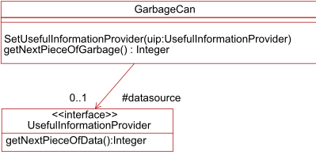

## Figure 7.6 - OclMessageExample

When selling the component, we do not want to give the source code to our customers. However, we want to specify the component's behavior as precisely as possible. So, for example, we want to specify, what getNextPieceOfGarbage does. Note that we cannot write:

```
context GarbageCan::getNextPieceOfGarbage() : Integer post : result = (datasource.getNextPieceOfData() * .7683425 + 10000) / 20 + 3
```

because UsefulInformationProvider::getNextPieceOfData() is not a query (e.g., it may increase some internal pointer so that it can return the next piece of data at the next call). Still we would like to say something about how the garbage is derived from the original data.

## The solution

To solve this problem, we can use an OclMessage to represent the call to getNextPieceOfData . This allows us to check for the result. Note that we need to demand that the call has returned before accessing the result:

```
context GarbageCan::getNextPieceOfGarbage() : Integer post : let message : OclMessage = datasource^^getNextPieceOfData()->first() in message.hasReturned() and result = (message.result() * .7683425 + 10000) / 20 + 3
```

## 7.8 Resolving Properties

For any property (attribute, operation, or navigation) the full notation includes the object of which the property is taken. As seen in 7.3.3, 'Invariants' self can be left implicit, and so can the iterator variables in collection operations. At any place in an expression, when an iterator is left out, an implicit iterator-variable is introduced. For example in:

```
context Person inv : employer->forAll( employee->exists( lastName = name) )
```

three implicit variables are introduced. The first is self , which is always the instance from which the constraint starts. Secondly an implicit iterator is introduced by the forAll and third by the exists . The implicit iterator variables are unnamed. The properties employer , employee , lastName , and name all have the object on which they are applied left out. Resolving these goes as follows:

- at the place of employer there is one implicit variable: self : Person . Therefore employer must be a property of self .
- at the place of employee there are two implicit variables: self : Person and iter1 : Company . Therefore employer must be a property of either self or iter1 . If employee is a property of both self and iter1 , then it is defined to belong to the variable in the most inner scope, which is iter1 .
- at the place of lastName and name there are three implicit variables: self : Person , iter1 : Company and iter2 : Person . Therefore lastName and name must both be a property of either self or iter1 or iter2 . In the UML model property name is a property of iter1 . However , lastName is a property of both self and iter2 . This is ambiguous and therefore the lastName refers to the variable in the most inner scope, which is iter2 .

Both of the following invariant constraints are correct, but have a different meaning:

```
context Person inv : employer->forAll( employee->exists( p | p.lastName = name) ) inv : employer->forAll( employee->exists( self.lastName = name) )
```

A closure iteration may introduce an implicit iterator-variable at each level of recursion and so multiple iterator-variable candidates for consideration as the implicit self. Since all candidates have the same static type, it is only the least deeply nested candidate, with respect to the iteration body, that need be considered as the implicit iterator-variable for a closure.

## 8 Abstract Syntax

This clause describes the abstract syntax of the OCL. In this abstract syntax a number of metaclasses from the UML metamodel are imported. These metaclasses are shown in the models with a transparent fill color. All metaclasses defined as part of the OCL abstract syntax are shown with a light gray background.

## 8.1 Introduction

The abstract syntax as described below defines the concepts that are part of the OCL using a MOF compliant metamodel. The abstract syntax is divided into several packages.

- The Types package describes the concepts that define the type system of OCL. It shows which types are predefined in OCL and which types are deduced from the UML models.
- The Expressions package describes the structure of OCL expressions.

## 8.2 The Types Package

OCL is a typed language. Each expression has a type that is either explicitly declared or can be statically derived. Evaluation of the expression yields a value of this type. Therefore, before we can define expressions, we have to provide a model for the concept of type. A metamodel for OCL types is shown in this sub clause. Note that instances of the classes in the metamodel are the types themselves (e.g., Integer) not instances of the domain they represent (e.g., -15, 0, 2, 3).

The model in Figure 8.1 shows the OCL types. The basic type is the UML Classifier, which includes all subtypes of Classifier from the UML Superstructure.

In the model, the CollectionType (and its subclasses) and the TupleType are special. One can never instantiate all collection types, because there is an infinite number, especially when nested collections are taken into account. Conceptually all these types do exist, but such a type should be (lazily) instantiated by a tool, whenever it is needed in an expression. For convenience an instance representing a collection type or a tuple type may be replicated in different namespaces (such as in a top-level package or within the expression referencing it), however they represent semantically the same type.

Figure 8.1 - Abstract Syntax Kernel Metamodel for OCL Types

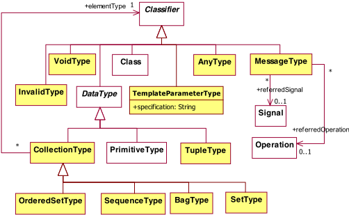

## AnyType

AnyType is the metaclass of the special type OclAny , which is the type to which all other types conform. OclAny is the sole instance of AnyType .  This metaclass allows defining the special property of being the generalization of all other Classifiers, including Classes, DataTypes, and PrimitiveTypes.

## BagType

BagType is a collection type that describes a multiset of elements where each element may occur multiple times in the bag. The elements are unordered. Part of a BagType is the declaration of the type of its elements.

## CollectionType

CollectionType describes a list of elements of a particular given type. CollectionType is a concrete metaclass whose instances are the family of abstract Collection(T) data types. Its subclasses are SetType, OrderedSetType, SequenceType, and BagType, whose instances are the concrete Set(T), OrderedSet(T), Sequence(T), and Bag(T), data types, respectively.

Part of every collection type is the declaration of the type of its elements (i.e., a collection type is parameterized with an element type). In the metamodel, this is shown as an association from CollectionType to Classifier. Note that there is no restriction on the element type of a collection type. This means in particular that a collection type may be parameterized with other collection types allowing collections to be nested arbitrarily deep.

## Associations

elementType The type of the elements in a collection. All elements in a collection must conform to this type.

## InvalidType

InvalidType represents a type that conforms to all types except the VoidType type. The only instance of InvalidType is Invalid , which is further defined in the standard library. Furthermore Invalid has exactly one runtime instance identified as OclInvalid .

## MessageType

MessageType describes ocl messages. Similar to the collection types, MessageType describes a set of types in the standard library. Part of every MessageType is a reference to the declaration of the type of its operation or signal, i.e., an ocl message type is parameterized with an operation or signal. In the metamodel, this is shown as an association from MessageType to Operation and to Signal . MessageType is part of the abstract syntax of OCL, residing on M2 level. Its instances, called OclMessage , and subtypes of OclMessage , reside on M1 level.

## Associations

referredSignal The Signal that is sent by the message.

referredOperation The Operation that is called by the message.

## OrderedSetType

OrderedSetType is a collection type that describes a set of elements where each distinct element occurs only once in the set. The elements are ordered by their position in the sequence. Part of an OrderedSetType is the declaration of the type of its elements.

## SequenceType

SequenceType is a collection type that describes a list of elements where each element may occur multiple times in the sequence. The elements are ordered by their position in the sequence. Part of a SequenceType is the declaration of the type of its elements.

## SetType

SetType is a collection type that describes a set of elements where each distinct element occurs only once in the set. The elements are not ordered. Part of a SetType is the declaration of the type of its elements.

## TemplateParameterType

A TemplateParameterType is used to refer to generic types in parameterized definitions. It is used in the standard library to represent the parameterized collection operations. A TemplateParameterType is usually named 'T' (or 'T2,' 'T3,' and so on, when more than one type parameter is involved).

The TemplateParameterType is a sub-class of Classifier .

## Attributes

specification An un-interpreted opaque definition of the template parameter type.

## TupleType

TupleType (informally known as record type or struct) combines different types into a single aggregate type. The parts of a TupleType are described by its attributes, each having a name and a type. There is no restriction on the kind of types that can be used as part of a tuple. In particular, a TupleType may contain other tuple types and collection types. Each attribute of a TupleType represents a single feature of a TupleType . Each part is uniquely identified by its name.

## VoidType

VoidType is the metaclass of the OclVoid type that conforms to all types except the OclInvalid type. The only instance of VoidType is OclVoid , which is further defined in the standard library. Furthermore OclVoid has exactly one instance called null - corresponding to the UML NullLiteral literal specification - and representing the absence of value . Note that in contrast with invalid , null is a valid value and as such can be owned by collections.

## 8.2.1 Type Conformance

The type conformance rules are formally underpinned in the Semantics sub clause of the specification. To ensure that the rules are accessible to UML modelers they are specified in this sub clause using OCL. For this, the additional operation conformsTo(c : Classifier) : Boolean is defined on Classifier . It evaluates to true, if the self Classifier conforms to the argument c . The following OCL statements define type conformance for individual types .

## BagType

- [1] Different bag types conform to each other if their element types conform to each other.

```
context BagType inv: BagType.allInstances()->forAll(b | self.elementType.conformsTo(b.elementType) implies self.conformsTo(b)) Classifier [1] Conformance is a transitive relationship. context Classifier inv Transitivity: Classifier.allInstances()->forAll(x|Classifier.allInstances() ->forAll(y| (self.conformsTo(x) and x.conformsTo(y)) implies self.conformsTo(y))) [2] Classes conform to superclasses and interfaces that they realize. context Class inv : self.generalization.general->forAll (p | (p.oclIsKindOf(Class) or p.oclIsKindOf(Interface)) implies self.conformsTo(p.oclAsType(Classifier))) [3] Interfaces conforms to super interfaces. context Interface  inv : self.generalization.general->forAll (p |  p.oclIsKindOf(Interface) implies self.conformsTo(p.oclAsType(Interface)))
```

- [4] The Conforms operation between Types is reflexive, a Classifier always conforms to itself.
- [5] The Conforms operation between Types is anti-symmetric.

```
context Classifier inv: self.conformsTo(self)
```

```
context Classifier inv: Classifier.allInstances()->forAll(t1, t2 | (t1.conformsTo(t2) and t2.conformsTo(t1)) implies t1 = t2)
```

## CollectionType

- [1] Specific collection types conform to collection type.
- [2] Collections do not conform to any primitive type.
- [3] Collections of non-conforming types do not conform.

```
context CollectionType inv: -- all instances of SetType, SequenceType, BagType conform to a -- CollectionType if the elementTypes conform CollectionType.allInstances()->forAll (c | c.oclIsKindOf(CollectionType) and self.elementType.conformsTo(c.elementType) implies self.conformsTo(c))
```

```
context CollectionType inv: PrimitiveType.allInstances()->forAll (p | not self.conformsTo(p))
```

```
context CollectionType inv: CollectionType.allInstances()->forAll (c | (not self.elementType.conformsTo (c.elementType)) implies (not self.conformsTo (c)))
```

## InvalidType

- [1]

```
OclInvalid conforms to all other types. context InvalidType inv: Classifier.allInstances()->forAll (c | self.conformsTo (c))
```

## OrderedSetType

- [1] Different ordered set types conform to each other if their element types conform to each other.

```
context OrderedSetType inv: OrderedSetType.allInstances()->forAll(s | self.elementType.conformsTo(s.elementType) implies self.conformsTo(s))
```

## PrimitiveType

- [1] Integer conforms to Real.

```
context PrimitiveType inv: (self.name = 'Integer') implies PrimitiveType.allInstances()->forAll (p | (p.name = 'Real') implies (self.conformsTo(p)))
```

- [2] UnlimitedNatural conforms to Integer.

```
context PrimitiveType inv: (self.name = 'UnlimitedNatural') implies PrimitiveType.allInstances()->forAll (p | (p.name = 'Integer') implies (self.conformsTo(p)))
```

Note that * is an invalid Integer and so conversion of * to Integer yields invalid whose type conforms to all types.

## SequenceType

- [1] Different sequence types conform to each other if their element types conform to each other.

```
context SequenceType inv: SequenceType.allInstances()->forAll(s | self.elementType.conformsTo(s.elementType) implies self.conformsTo(s))
```

## SetType

- [1] Different set types conform to each other if their element types conform to each other.

```
context SetType inv: SetType.allInstances()->forAll(s | self.elementType.conformsTo(s.elementType) implies self.conformsTo(s))
```

## TupleType

- [1] Tuple types conform to each other when their names and types conform to each other.  Note that allProperties is an additional operation in the UML.

```
context TupleType inv: TupleType.allInstances()->forAll (t | ( t.allProperties()->forAll (tp | -- make sure at least one tuplepart has the same name -- (uniqueness of tuplepart names will ensure that not two -- tupleparts have the same name within one tuple) self.allProperties()->exists(stp|stp.name = tp.name) and -- make sure that all tupleparts with the same name conforms. self.allProperties()->forAll(stp | (stp.name = tp.name) implies stp.type.conformsTo(tp.type)) ) implies self.conformsTo(t) )
```

## VoidType

- [1] OclVoid conforms to all other types except OclInvalid.

```
context VoidType inv: Classifier.allInstances()->forAll (c |  not c.oclIsTypeOf(OclInvalid) implies self.conformsTo (c))
```

## 8.2.2 Operations and Well-formedness Rules for the Types Package

## BagType

- [1] The name of a bag type is 'Bag' followed by the element type's name in parentheses.

```
context BagType inv: self.name = 'Bag(' + self.elementType.name + ')'
```

## BooleanType

```
allInstances() : Set(Boolean) Returns Set{true,false}.
```

## CollectionType

- [1] The name of a collection type is 'Collection' followed by the element type's name in parentheses.

```
context CollectionType inv: self.name = 'Collection(' + self.elementType.name + ')'
```

## InvalidType

```
allInstances() : Set(OclInvalid)
```

Returns invalid, since the notional return of Set{invalid} is not well-formed.

## MessageType

- [1] MessageType has either a link with a Signal or with an operation, but not both.
- [2] The parameters of the referredOperation become attributes of the instance of MessageType.
- [3] The attributes of the referredSignal become attributes of the instance of MessageType.

```
context MessageType inv: referredOperation->size() + referredSignal->size() = 1
```

```
context MessageType: inv: referredOperation->size()=1 implies Set{1..self.ownedAttribute->size()}->forAll(i | self.ownedAttribute.at(i).cmpSlots( referredOperation.ownedParameter.asProperty()->at(i)))
```

```
context MessageType inv: referredSignal->size() = 1 implies Set{1..self.ownedAttribute->size()}->forAll(i | self.ownedAttribute.asOrderedSet().at(i).cmpSlots( referredSignal.ownedAttribute.asOrderedSet()->at(i)))
```

## OrderedSetType

- [1] The name of a set type is 'OrderedSet' followed by the element type's name in parentheses.

```
context OrderedSetType inv: self.name = 'OrderedSet(' + self.elementType.name + ')'
```

## SequenceType

- [1] The name of a sequence type is 'Sequence' followed by the element type's name in parentheses.

```
context SequenceType inv: self.name = 'Sequence(' + self.elementType.name + ')'
```

## SetType

- [1] The name of a set type is 'Set' followed by the element type's name in parentheses.

```
context SetType inv: self.name = 'Set(' + self.elementType.name + ')'
```

## TupleType

- [1] The name of a tuple type includes the names of the individual parts and the types of those parts.
- [2] All parts belonging to a tuple type have unique names.
- [3] A TupleType instance has only features that are Properties(tuple parts).

```
context TupleType inv: name = 'Tuple('.concat ( Sequence{1.allProperties()->size()}->iterate (pn; s: String = '' | let p: Attribute = allProperties()->at (pn) in ( s.concat ( (if (pn>1) then ',' else '' endif) .concat (p.name).concat (í:í) .concat (p.type.name) ) ) ) ).concat (í)í)
```

```
context TupleType inv: -- always true, because attributes must have unique names.
```

```
context TupleType inv: feature->forAll (f | f.oclIsTypeOf(Property))
```

## VoidType

```
allInstances() : Set(OclVoid) Returns Set{null}.
```

## 8.3 The Expressions Package

This sub clause defines the abstract syntax of the expressions package. This package defines the structure that OCL expressions can have. An overview of the inheritance relationships between all classes defined in this package is shown in Figure 8.2.

Figure 8.2 - The basic structure of the abstract syntax kernel metamodel for Expressions

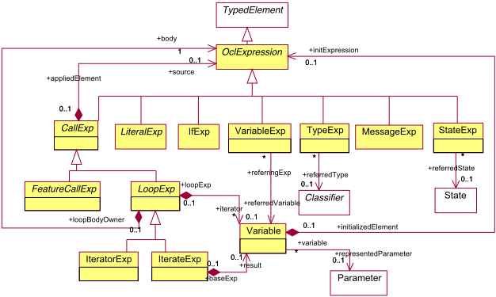

## 8.3.1 Expressions Core

Figure 8.2 shows the core part of the Expressions package. The basic structure in the package consists of the classes OclExpression , CallExp , and VariableExp . An OclExpression always has a type, which is usually not explicitly modeled, but derived. Each CallExp has exactly one source, identified by an OclExpression . In this sub clause we use the term 'property' that is a generalization of Feature , AssociationEnd , and predefined iterating OCL collection operations.

A FeatureCallExp generalizes all property calls that refer to Features in the UML metamodel. In Figure 8.3 the various subtypes of FeatureCallExp are defined.

Most of the remainder of the expressions package consists of a specification of the different subclasses of CallExp and their specific structure. From the metamodel it can be deduced that an OCL expression always starts with a variable or literal, on which a property is recursively applied.

## CallExp

A CallExp is an expression that refers to a feature (operation, property) or to a predefined iterator for collections. Its result value is the evaluation of the corresponding feature. This is an abstract metaclass.

## Associations

source The result value of the source expression is the instance that performs the property call.

## FeatureCallExp

A FeatureCallExp expression is an expression that refers to a feature that is defined for a Classifier in the UML model to which this expression is attached. Its result value is the evaluation of the corresponding feature.

## Attributes

isPre

## IfExp

An IfExp is defined in 8.3.3, 'If Expressions' but included in this diagram for completeness.

## IterateExp

An IterateExp is an expression that evaluates its body expression for each element of a collection. It acts as a loop construct that iterates over the elements of its source collection and results in a value. An iterate expression evaluates its body expression for each element of its source collection. The evaluated value of the body expression in each iterationstep becomes the new value for the result variable for the succeeding iteration-step. The result can be of any type and is defined by the result association. The IterateExp is the most fundamental collection expression defined in the OCL Expressions package.

## Associations

result The Variable that represents the result variable.

## IteratorExp

An IteratorExp is an expression that evaluates its body expression for each element of a collection. It acts as a loop construct that iterates over the elements of its source collection and results in a value. The type of the iterator expression depends on the name of the expression, and sometimes on the type of the associated source expression. The IteratorExp represents all other predefined collection operations that use an iterator. This includes select, collect, reject, forAll, exists, etc. The OCL Standard Library defines a number of predefined iterator expressions. Their semantics is defined in terms of the iterate expression in 11.7, 'Predefined Iterator Expressions.'

## LiteralExp

A LiteralExp is an expression with no arguments producing a value. In general the result value is identical with the expression symbol. This includes things like the integer 1 or literal strings like 'this is a LiteralExp.'

## LoopExp

A LoopExp is an expression that represents a loop construct over a collection. It has an iterator variable that represents the elements of the collection during iteration. The body expression is evaluated for each element in the collection. The result of a loop expression depends on the specific kind and its name.

Boolean indicating whether the expression accesses the precondition-time value of the referred feature.

## Associations

| iterator   | The iterator variables. These variables are, each in its turn, bound to every element value of the source collection while evaluating the body expression.   |
|------------|--------------------------------------------------------------------------------------------------------------------------------------------------------------|
| body       | The OclExpression that is evaluated for each element in the source collection.                                                                               |

## MessageExp

MessageExp is defined in 8.3.4, but included in this diagram for completeness.

## OclExpression

An OclExpression is an expression that can be evaluated in a given environment. OclExpression is the abstract superclass of all other expressions in the metamodel - except for the ExpressionInOcl container class. It is the top-level element of the OCL Expressions package. Every OclExpression has a type that can be statically determined by analyzing the expression and its context. Evaluation of an expression results in a value. Expressions with Boolean result can be used as constraints (e.g., to specify an invariant of a class). Expressions of any type can be used to specify queries, initial attribute values, target sets, etc.

The environment of an OclExpression defines what model elements are visible and can be referred to in an expression. At the topmost level the environment will be defined by the Element to which the OCL expression is attached, for example by a Classifier if the OCL expression is used as an invariant. On a lower level, each iterator expression can also introduce one or more iterator variables into the environment. The environment is not modeled as a separate metaclass because it can be completely derived using derivation rules. The complete derivation rules can be found in Clause 9 ('Concrete Syntax').

## StateExp

A StateExp is an expression used to refer to a state of a class within an expression. It is used to pass directly to the predefined operation oclIsInState the reference of a state of a class defined in the UML model.

## Associations

referredState The State being referred.

## TypeExp

A TypeExp is an expression used to refer to an existing type within an expression. It is used in particular to pass the reference of the type when invoking the operations oclIsKindOf, oclIsTypeOf, and oclAsType.

## Associations

referredType The type being referred.

## Variable

Variables are typed elements for passing data in expressions. The variable can be used in expressions where the variable is in scope. This metaclass represents among others the variables self and result and the variables defined using the Let expression.

## Associations

initExpression

representedParameter

## VariableExp

A VariableExp is an expression that consists of a reference to a variable. References to the variables self and result or to variables defined by Let expressions are examples of such variable expressions.

## Associations

referredVariable The Variable to which this variable expression refers.

## 8.3.2 FeatureCall Expressions

A FeatureCallExp can refer to any of the subtypes of Feature as defined in the UML kernel. This is shown in Figure 8.3 by the three different subtypes, each of which is associated with its own type of Element .

Figure 8.3 - Abstract syntax metamodel for FeatureCallExp in the Expressions package

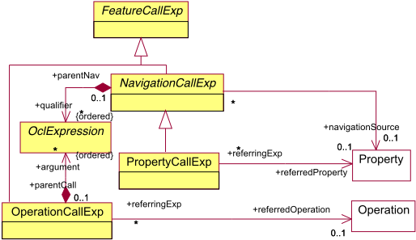

## AssociationClassCallExp

An AssociationClassCallExp is a reference to an AssociationClass defined in a UML model. It is used to determine objects linked to a target object by an association class. The expression refers to these target objects by the name of the target associationclass.

The OclExpression that represents the initial value of the variable. Depending on the role that a variable declaration plays, the init expression might be mandatory.

The Parameter in the current operation this variable is representing. Any access to the variable represents an access to the parameter value.

## Associations

referredAssociationClass The AssociationClass to which this AssociationClassCallExp is a reference. This refers to an AssociationClass that is defined in the UML model.

## PropertyCallExp

A PropertyCallExpression is a reference to an Attribute of a Classifier defined in a UML model. It evaluates to the value of the attribute.

## Associations

referredProperty The Attribute to which this AttributeCallExp is a reference.

## NavigationCallExp

A NavigationCallExp is a reference to a Property or an AssociationClass defined in a UML model. It is used to determine objects linked to a target object by an association, whether explicitly modeled as an Association or implicit. If there is a qualifier attached to the source end of the association, then additional qualifier expressions may be used to specify the values of the qualifying attributes.

## Associations

qualifier

navigationSource The values for the qualifier attributes if applicable.

The source denotes the association end Property at the end of the object itself. This is used to resolve ambiguities when the same Classifier is at more than one end (plays more than one role) in the same association. In other cases it can be derived.

## OperationCallExp

An OperationCallExp refers to an operation defined in a Classifier. The expression may contain a list of argument expressions if the operation is defined to have parameters. In this case, the number and types of the arguments must match the parameters.

## Associations

argument

referredOperation The arguments denote the arguments to the operation call. This is only useful when the operation call is related to an Operation that takes parameters.

The Operation to which this OperationCallExp is a reference. This is an Operation of a Classifier that is defined in the UML model.

## 8.3.3 If Expressions

This sub clause describes the if expression in detail. Figure 8.4 shows the structure of the if expression.

Figure 8.4 - Abstract syntax metamodel for if expression

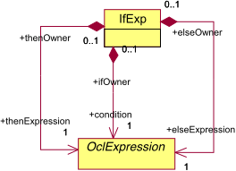

## IfExp

An IfExp results in one of two alternative expressions depending on the evaluated value of a condition . Note that both the thenExpression and the elseExpression are mandatory. The reason behind this is that an if expression should always result in a value, which cannot be guaranteed if the else part is left out.

## Associations

condition

thenExpression The OclExpression that represents the Boolean condition. If this condition evaluates to true, the result of the if expression is identical to the result of the thenExpression . If this condition evaluates to false, the result of the if expression is identical to the result of the elseExpression .

The OclExpression that represents the then part of the if expression.

elseExpression The OclExpression that represents the else part of the if expression.

## 8.3.4 Message Expressions

In the specification of communication between instances we unify the notions of asynchronous and synchronous communication. The structure of the message expressions is shown in Figure 8.5.

Figure 8.5 - The abstract syntax of OCL messages

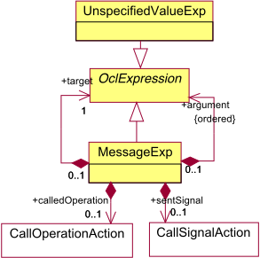

## MessageExp

A MessageExp is an expression that results in a collection of OclMessage value. An OclMessage is the unification of a signal sent, and an operation call. The target of the operation call or signal sent is specified by the target OclExpression. Arguments are OclExpressions , in particular they may be unspecified value expressions for arguments whose value is not specified. It covers both synchronous and asynchronous actions.

## Associations

| target          | The OclExpression that represents the target instance to which the signal is sent.                                                                                                                                                                                                                 |
|-----------------|----------------------------------------------------------------------------------------------------------------------------------------------------------------------------------------------------------------------------------------------------------------------------------------------------|
| argument        | The OclExpressions that represent the parameters to the Operation or Signal . The number and type of arguments should conform to those defined in the Operation or Signal . The order of the arguments is the same as the order of the parameters of the Operation or the attributes of a Signal . |
| calledOperation | If this is a message to request an operation call, this is the requested CallOperationAction .                                                                                                                                                                                                     |
| sentSignal      | If this is a UML signal sent, this is the SendSignalAction .                                                                                                                                                                                                                                       |

## UnspecifiedValueExp

An UnpecifiedValueExp is an expression whose value is unspecified in an OCL expression. It is used within OCL messages to leave parameters of messages unspecified.

## 8.3.5 Literal Expressions

This sub clause defines the different types of literal expressions of OCL. It also refers to enumeration types and enumeration literals. Figure 8.6 shows all types of literal expressions.

Figure 8.6 - Abstract syntax metamodel for Literal expression


Figure 8.7 - Abstract syntax metamodel for Collection and Tuple Literal expression


## BooleanLiteralExp

A BooleanLiteralExp represents the value true or false of the predefined type Boolean.

## Attributes

booleanSymbol The Boolean that represents the value of the literal.

## CollectionItem

A CollectionItem represents an individual element of a collection.

## CollectionKind

The CollectionKind enumeration lists the kinds of collections. Its literals are Collection , Set , OrderedSet , Bag , and Sequence .

## CollectionLiteralExp

A CollectionLiteralExp represents a reference to collection literal.

## Attributes

kind The kind of collection literal that is specified by this CollectionLiteralExp .

## Associations

part The parts of the collection literal expression.

## CollectionLiteralPart

A CollectionLiteralPart is a member of the collection literal.

## Associations

type The type of the collection literal.

## CollectionRange

A CollectionRange represents a range of integers from a first integer up to and including a last integer.

## EnumLiteralExp

An EnumLiteralExp represents a reference to an enumeration literal.

## Associations

referredEnumLiteral The EnumLiteral to which the enum expression refers.

## IntegerLiteralExp

An IntegerLiteralExp denotes a value of the predefined type Integer.

## Attributes

integerSymbol The Integer that represents the value of the literal.

## NumericLiteralExp

A NumericLiteralExp denotes a value of either the type UnlimitedNatural, Integer or Real types.

## PrimitiveLiteralExp

A PrimitiveLiteralExp literal denotes a value of a primitive type.

## Attributes

symbol The String that represents the value of the literal.

## RealLiteralExp

A RealLiteralExp denotes a value of the predefined type Real.

## Attributes

realSymbol The Real that represents the value of the literal.

## StringLiteralExp

A StringLiteralExp denotes a value of the predefined type String.

## Attributes

stringSymbol The String that represents the value of the literal.

## TupleLiteralExp

A TupleLiteralExp denotes a tuple value. It contains a name and a value for each part of the tuple type.

## Associations

part The Variable declarations defining the parts of the literal.

## UnlimitedNaturalLiteralExp

An UnlimitedNaturalLiteralExp denotes a value of the predefined type UnlimitedNatural.

## Attributes

unlimitedNaturalSymbol The UnlimitedNatural that represents the value of the literal.

## 8.3.6 Let Expressions

This sub clause defines the abstract syntax metamodel for Let expressions. The only addition to the abstract syntax is the metaclass LetExp as shown in Figure 8.8. The other metaclasses are re-used from the previous diagrams.

Note :  Let expressions that take arguments are no longer allowed in OCL 2.0. This feature is redundant. Instead, a modeler can define an additional operation in the UML Classifier, potentially with a special stereotype to denote that this operation is only meant to be used as a helper operation in OCL expressions. The postcondition of such an additional operation can then define its result value. Removal of Let functions will therefore not affect the expressibility of the modeler. Another way to define such helper operations is through the «definition» constraint, which reuses some of the concrete syntax defined for Let expressions (see 12.5, 'Definition'), but is nothing more than an OCL-based syntax for defining helper attributes and operations.

Figure 8.8 - Abstract syntax metamodel for let expression

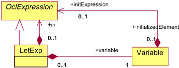

## LetExp

A LetExp is a special expression that defined a new variable with an initial value. A variable defined by a LetExp cannot change its value. The value is always the evaluated value of the initial expression. The variable is visible in the in expression.

## Associations

```
variable The Variable introduced by the Let expression. in The OclExpression in whose environment the defined variable is visible.
```

## 8.3.7 Well-formedness Rules of the Expressions package

The metaclasses defined in the abstract syntax have the following well-formedness rules:

## PropertyCallExp

The type of the call expression is the type of the referred property.

context PropertyCallExp

```
inv: type = referredProperty.type
```

## BooleanLiteralExp

- [1] The type of a Boolean Literal expression is the type Boolean.

```
context BooleanLiteralExp inv: self.type.name = 'Boolean'
```

## CollectionLiteralExp

- [1] 'Collection' is an abstract class on the M1 level and has no M0 instances.

context CollectionLiteralExp

inv: kind &lt;&gt; CollectionKind::Collection

- [2] The type of a collection literal expression is determined by the collection kind selection and the common supertype of all elements. Note that the definition below implicitly states that empty collections have OclVoid as their elementType .

```
context CollectionLiteralExp inv: kind = CollectionKind::Set  implies type.oclIsKindOf (SetType) inv: kind = CollectionKind::OrderedSet implies type.oclIsKindOf (OrderedSetType) inv: kind = CollectionKind::Sequence  implies type.oclIsKindOf (SequenceType) inv: kind = CollectionKind::Bag implies type.oclIsKindOf (BagType) inv: type.oclAsType (CollectionType).elementType = part->iterate (p; c : Classifier = OclV oid | c.commonSuperType (p.type))
```

## CollectionLiteralPart

No additional well-formedness rules.

## CollectionItem

- [1] The type of a CollectionItem is the type of the item expression.

```
context CollectionItem inv: type = item.type
```

## CollectionRange

- [1] The type of a CollectionRange is the common supertype of the expressions taking part in the range.
- [2] The last value follows the first value.

```
context CollectionRange inv: type = first.type.commonSuperType (last.type)
```

```
context CollectionRange inv IncreasingRange: first <= last
```

## EnumLiteralExp

- [1] The type of an enum Literal expression is the type of the referred literal.

```
context EnumLiteralExp inv: self.type = referredEnumLiteral.enumeration
```

## IfExp

- [1] The type of the condition of an if expression must be Boolean.
- [2] The type of the if expression is the most common supertype of the else and then expressions.

```
context IfExp inv: self.condition.type.oclIsKindOf(PrimitiveType) and self.condition.type.name = 'Boolean'
```

```
context IfExp inv: self.type = thenExpression.type.commonSuperType(elseExpression.type)
```

## IntegerLiteralExp

- [1] The type of an integer Literal expression is the type Integer.

context IntegerLiteralExp

```
inv: self.type.name = 'Integer'
```

## IteratorExp any

- [1] There is exactly one iterator.
- [2] The type is the same as the source element type
- [3] The type of the body must be Boolean.

```
context IteratorExp inv: name = 'any' implies iterator->size() = 1
```

```
context IteratorExp inv: name = 'any' implies type = source.type.oclAsType(CollectionType).elementType
```

```
context IteratorExp inv: name = 'any' implies body.type.oclIsKindOf(PrimitiveType) and body.type.name = 'Boolean'
```

## IteratorExp closure

- [1] There is exactly one iterator.
- [2] The collection type for an OrderedSet or a Sequence source type is OrderedSet. For any other source the collection type is Set.
- [3] The source element type is the same as type of the body elements or element.
- [4] The element type is the same as the source element type.

```
context IteratorExp  inv: name = 'closure' implies iterator->size() = 1
```

```
context IteratorExp inv: name = 'closure' implies if source.type.oclIsKindOf(SequenceType) or source.type.oclIsKindOf(OrderedSetType) then type.oclIsKindOf(OrderedSetType) else type.oclIsKindOf(SetType) endif
```

```
context IteratorExp inv: name = 'closure' implies source.type.oclAsType(CollectionType).elementType = if body.type.oclIsKindOf(CollectionType) then body.type.oclAsType(CollectionType).elementType else body.type endif
```

```
context IteratorExp inv: name = 'closure' implies type.oclAsType(CollectionType).elementType = source.type.oclAsType(CollectionType).elementType
```

## IteratorExp collect

- [1] There is exactly one iterator.
- [2] The collection type for an OrderedSet or a Sequence type is a Sequence, the result type for any other collection type is a Bag.

```
context IteratorExp inv: name = 'collect' implies iterator->size() = 1
```

```
context IteratorExp inv: name = 'collect' implies if source.type.oclIsKindOf(SequenceType) or source.type.oclIsKindOf(OrderedSetType) then type.oclIsKindOf(SequenceType) else type.oclIsKindOf(BagType) endif
```

```
[3] The element type is the type of the body elements. context IteratorExp  inv: name = 'collect' implies  type.oclAsType(CollectionType).elementType =  body.type.oclAsType(CollectionType).elementType  IteratorExp collectNested [1] There is exactly one iterator. context IteratorExp inv: name = 'collectNested' implies iterator->size() = 1 [2] The type is a Bag. context IteratorExp inv: name = 'collectNested' implies type.oclIsKindOf(BagType) [3] The type is the type of source. context IteratorExp inv: name = 'collectNested' implies type = body.type IteratorExp exists [1] The type must be Boolean. context IteratorExp inv: name = 'exists' implies type.oclIsKindOf(PrimitiveType) and type.name = 'Boolean' [2] The type of the body must be Boolean. context IteratorExp inv: name = 'exists' implies body.type.oclIsKindOf(PrimitiveType) and body.type.name = 'Boolean' IteratorExp forAll [1] The type must be Boolean. context IteratorExp inv: name = 'forAll' implies type.oclIsKindOf(PrimitiveType) and type.name = 'Boolean' [2] The type of the body must be Boolean. context IteratorExp inv: name = 'forAll' implies body.type.oclIsKindOf(PrimitiveType) and body.type.name = 'Boolean' IteratorExp isUnique [1] There is exactly one iterator. context IteratorExp inv: name = 'isUnique' implies iterator->size() = 1 [2] The type must be Boolean. context IteratorExp inv: name = 'isUnique' implies type.oclIsKindOf(PrimitiveType) and type.name = 'Boolean'
```

## IteratorExp one

```
[1] There is exactly one iterator. context IteratorExp inv: name = 'one' implies iterator->size() = 1 [2] The type is Boolean context IteratorExp inv: name = 'one' implies type.oclIsKindOf(PrimitiveType) and type.name = 'Boolean' [3] The type of the body must be Boolean. context IteratorExp inv: name = 'one' implies body.type.oclIsKindOf(PrimitiveType) and body.type.name = 'Boolean' IteratorExp reject or select [1] There is exactly one iterator. context IteratorExp inv: name = 'reject' or name = 'select' implies iterator->size() = 1 [2] The type is the same as the source. context IteratorExp inv: name = 'reject' or name = 'select' implies type = source.type [3] The type of the body must be Boolean. context IteratorExp inv: name = 'reject' or name = 'select' implies body.type.oclIsKindOf(PrimitiveType) and body.type.name = 'Boolean' IteratorExp sortedBy [1] There is exactly one iterator. context IteratorExp inv: name = 'sortedBy' implies iterator->size() = 1 [2] The collection type for an OrderedSet or a Sequence type is a Sequence, the result type for any other collection type is Bag. context IteratorExp inv: name = 'sortedBy' implies if source.type.oclIsKindOf(SequenceType) or source.type.oclIsKindOf(BagType) then type.oclIsKindOf(SequenceType) else type.oclIsKindOf(OrderedSetType) endif [3] The element type is the type of the body elements. context IteratorExp
```

```
inv: name = 'sortedBy' implies type.oclAsType(CollectionType).elementType = body.type.oclAsType(CollectionType).elementType
```

## IterateExp

- [1] The type of the iterate is the type of the result variable.

context IterateExp

```
inv: type = result.type
```

- [2] The type of the body expression must conform to the declared type of the result variable.
- [3] A result variable must have an init expression.

```
context IterateExp inv: body.type.conformsTo(result.type)
```

```
context IterateExp inv: self.result.initExpression->size() = 1
```

## LetExp

- [1] The type of a Let expression is the type of the in expression.

```
context LetExp inv: type = in.type
```

## LiteralExp

No additional well-formedness rules.

## LoopExp

- [1] The type of the source expression must be a collection.
- [2] The loop variable of an iterator expression has no init expression.
- [3] The type of each iterator variable must be the type of the elements of the source collection.

```
context LoopExp inv: source.type.oclIsKindOf (CollectionType)
```

```
context LoopExp inv: self.iterator->forAll(initExpression->isEmpty())
```

```
context IteratorExp inv: self.iterator->forAll(type = source.type.oclAsType (CollectionType).elementType)
```

## FeatureCallExp

No additional well-formedness rules.

## NumericLiteralExp

No additional well-formedness rules.

## OclExpression

No additional well-formedness rules.

## MessageExp

- [1] If the message is an operation call action, the arguments must conform to the parameters of the operation.

```
context MessageExp  inv: calledOperation->notEmpty() implies  argument->forAll (a | a.type.conformsTo  (self.calledOperation.operation.ownedParameter-> select( kind = ParameterDirectionKind::in )  ->at (argument->indexOf (a)).type))
```



- [2] If the message is a send signal action, the arguments must conform to the attributes of the signal.
- [3] If the message is a call operation action, the operation must be an operation of the type of the target expression.
- [4] An OCL message has either a called operation or a sent signal.
- [5] The target of an OCL message cannot be a collection.

```
context MessageExp inv: sentSignal->notEmpty() implies argument->forAll (a | a.type.conformsTo (self.sentSignal.signal.ownedAttribute ->at (argument->indexOf (a)).type))
```

```
context MessageExp inv: calledOperation->notEmpty() implies target.type.allOperations()->includes(calledOperation.operation)
```

```
context MessageExp inv: calledOperation->size() + sentSignal->size() = 1
```

```
context MessageExp inv: not target.type.oclIsKindOf (CollectionType)
```

## OperationCallExp

- [1] All the arguments must conform to the parameters of the referred operation.
- [2] There must be exactly as many arguments as the referred operation has parameters.
- [3] An additional attribute refParams lists all parameters of the referred operation except the return and out parameter(s).

```
context OperationCallExp inv: arguments->forAll (a | a.type.conformsTo (self.refParams->at (arguments->indexOf (a)).type))
```

```
context OperationCallExp inv: arguments->size() = refParams->size()
```

```
context OperationCallExp def: refParams: Sequence(Parameter) = referredOperation.ownedParameter->select (p | p.kind <> ParameterDirectionKind::return or p.kind <> ParameterDirectionKind::out)
```

## CallExp

No additional well-formedness rules.

## RealLiteralExp

- [1] The type of a real Literal expression is the type Real.

```
context RealLiteralExp inv: self.type.name = íRealí
```

## StateExp

No additional well-formedness rules.

## StringLiteralExp

- [1] The type of a string Literal expression is the type String.

```
context StringLiteralExp inv: self.type.name = 'String'
```

## TypeExp

No additional well-formedness rules.

## TupleLiteralExp

- [1] The type of a TupleLiteralExp is a TupleType with the specified parts.
- [2] All tuple literal expression parts of one tuple literal expression have unique names.

```
context TupleLiteralExp inv: type.oclIsKindOf (TupleType) and  part->size() = type.allProperties()->size() and part->forAll (tlep |
```

```
type.allProperties()->exists (tp | tlep.attribute.name = tp.name and tlep.attribute.type = tp.type))
```

```
context TupleLiteralExp inv: part->isUnique (attribute.name)
```

## TupleLiteralPart

- [1] The type of the attribute conforms to the type of the value expression.

```
context TupleLiteralPart inv: attribute.type.conformsTo(value.type)
```

## UnlimitedNaturalLiteralExp

- [1] The type of an unlimited natural Literal expression is the type UnlimitedNatural.

```
context UnlimitedNaturalLiteralExp inv: self.type.name = 'UnlimitedNatural'
```

## UnspecifiedValueExp

No additional well-formedness rules.

## Variable

- [1] For initialized variable declarations, the type of the initExpression must conform to the type of the declared variable.

```
context Variable inv: initExpression->notEmpty() implies initExpression.type.conformsTo (type)
```

## VariableExp

- [1] The type of a VariableExp is the type of the variable to which it refers.

```
context VariableExp inv: type = referredVariable.type
```

## 8.3.8 Additional Operations on UML metaclasses

In the clauses 'Abstract Syntax,' 'Concrete Syntax,' and 'The Use of Ocl Expressions in UML Models' many additional operations on UML metaclasses are used. They are defined in this sub clause. The next sub clause defines additional operations for the OCL metaclasses.

## Classifier

The operation commonSuperType results in the most specific common supertype of two classifiers.

```
context Classifier def: commonSuperType (c : Classifier) : Classifier = Classifier.allInstances()->select (cst | c.conformsTo (cst) and self.conformsTo (cst) and not Classifier.allInstances()->exists (clst | c.conformsTo (clst) and self.conformsTo (clst) and clst.conformsTo (cst) and clst <> cst ) )->any (true) The following operations have been added to Classifier to lookup properties and operations. context Classifier
```

```
def: lookupProperty(attName : String) : Attribute = self.allProperties()->any(me | me.name = attName) def: lookupAssociationClass(name : String) : AssociationClass = self.allAssociationClasses()->any (ae | ae.name = name) def: lookupOperation (name: String, paramTypes: Sequence(Classifier)): Operation = self.allOperations()->any (op | op.name = name and op.hasMatchingSignature(paramTypes)) def: lookupSignal (sigName: String, paramTypes: Sequence(Classifier)): Signal = self.allReceptions().signal->any (sig | sig.name = sigName and sig.hasMatchingSignature(paramTypes)) def: allReceptions() : Set(Reception) = self.allFeatures()->select(f | f.oclIsKindOf(Reception)) def: allProperties() : Set(Property) = self.allFeatures()->select(f | f.oclIsKindOf(Property)) def: allOperations() : Set(Property) = self.allFeatures()->select(f | f.oclIsKindOf(Operation))
```

The operation allFeatures() is defined in the UML semantics.

```
The operation allInstances() context Classifier def: allInstances() : Set( T ) = -- all instances of self
```

returns all instances of the classifier and the classifiers specializing it. May only be used for classifiers that have a finite number of instances. This is the case, for example, for user defined classes because instances need to be created explicitly, and for enumerations, the standard Boolean type, and other special types such as OclVoid. This is not the case, for example, for data types such as collection types or the standard String, UnlimitedNatural, Integer, and Real types.

## Operation

An additional operation is added to Operation, which checks whether its signature matches with a sequence of Classifiers. Note that in making the match only parameters with direction kind 'in' are considered.

```
context Operation def: hasMatchingSignature(paramTypes: Sequence(Classifier)) : Boolean = -- check that operation op has a signature that matches the given parameter lists let sigParamTypes: Sequence(Classifier) = self.allProperties().type in ( ( sigParamTypes->size() = paramTypes->size() ) and ( Set{1..paramTypes->size()}->forAll ( i | paramTypes->at (i).conformsTo (sigParamTypes->at (i)) ) ) ) def: allProperties() : Set(Property) = self.ownedParameter->asProperty()
```

## Parameter

The operation asProperty results in a property that has the same name, type, etc. as the parameter.

```
context Parameter::asProperty(): Property pre: -- none post: result.name = self.name post: result.type = self.type post: result.upperValue = 1 post: result.lowerValue = 1 post: result.isOrdered = true post: result.isStatic = false post: result.visibility
```

```
= VisibilityKind::private An additional class operation is added to Parameter to return a Parameter. context Parameter::make(n : String, c : Classifier, k : ParameterDirectionKind) :Parameter
```

```
post: result.name = n post: result.kind = k post: result.type = c
```

## Property

The operation cmpSlots returns true if the compared property has identical name and type.

```
context Parameter::cmpSlots(): Boolean = result.name = self.name and result.type = self.type
```

## Signal

An additional operation is added to Signal, which checks whether its signature matches with a sequence of Classifiers. Note that in making the match the parameters of the signal are its attributes.

```
context Signal def: hasMatchingSignature(paramTypes: Sequence(Classifier)) : Boolean = -- check that signal has a signature that matches the given parameter lists let opParamTypes: Sequence(Classifier) = self.ownedParameter->select (p | p.kind <> ParameterDirectionKind::return).type in ( ( opParamTypes->size() = paramTypes->size() ) and ( Set{1..paramTypes->size()}->forAll ( i | paramTypes->at (i).conformsTo (opParamTypes->at (i)) ) ) )
```

## State

The operation getStateMachine() returns the statemachine to which a state belongs.

```
context State::getStateMachine() : StateMachine post: result = container.stateMachine
```

## Transition

The operation getStateMachine() returns the statemachine to which a transition belongs.

```
context Transition::getStateMachine() : StateMachine post: result = container.stateMachine
```

## 8.3.9 Additional Operations on OCL Metaclasses

In clauses 'Abstract Syntax,' 'Concrete Syntax,' and 'The Use of Ocl Expressions in UML Models' many additional operations on OCL metaclasses are used. They are defined in this sub clause. The previous sub clause defines additional operations for the UML metaclasses.

## OclExpression

The following operation returns an operation call expression for the predefined asSet() operation with the self expression as its source.

```
context OclExpression::withAsSet() : OperationCallExp post: result.name = 'asSet' post: result.argument->isEmpty() post: result.source = self
```

## TupleType

An additional class operation is added to Tuple to return a new tuple. The name of a tupletype is defined in the abstract syntax clause and need not be specified here.

```
context TupleType::make(atts : Sequence(Property) ) : TupleType post: Sequence{1...atts->size()}->forAll(i | result.ownedAttribute.at(i).cmpSlots(atts.at(i))
```

## Variable

An additional operation is added to Variable to return a corresponding Parameter.

```
context Variable::asParameter() : Parameter  post: result.name = self.name  post: result.direction = ParameterDirectionKind::in  post: result.type = self.type An additional operation is added to Variable to return a corresponding Property. context Variable::asProperty() : Attribute post: result.name = self.name post: result.type = self.type upperValue = 1 post: result.lowerValue = 1 post: result.isOrdered = true post: result.isStatic = false post: result.visibility = VisibilityKind::private
```

```
post: result.constraint.specification.bodyExpression = self.initExpression
```

## 8.3.10  Overview of class hierarchy of OCL Abstract Syntax metamodel

Figure 8.9 - Overview of the abstract syntax metamodel for Expressions

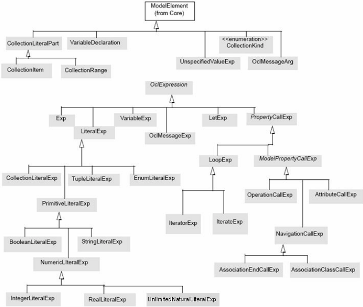

## 9 Concrete Syntax

This clause describes the concrete syntax of the OCL. This allows modelers to write down OCL expressions in a standardized way. A formal mapping from the concrete syntax to the abstract syntax from Clause 8 ('Abstract Syntax') is given. Although not required, sub clause 9.6 describes a mapping from the abstract syntax to the concrete syntax. This allows one to produce a standard human readable version of any OCL expression that is represented as an instance of the abstract syntax.

Sub clause 9.1, Structure of the Concrete Syntax describes the structure of the grammar and the motivation for the use of an attribute grammar.

## 9.1 Structure of the Concrete Syntax

The concrete syntax of OCL is described in the form of a full attribute grammar. Each production in an attribute grammar may have synthesized attributes attached to it. The value of synthesized attributes of elements on the left hand side of a production rule is always derived from attributes of elements at the right hand side of that production rule. Each production may also have inherited attributes attached to it. The value of inherited attributes of elements on the right hand side of a production rule is always derived from attributes of elements on the left hand side of that production.

In the attribute grammar that specifies the concrete syntax, every production rule is denoted using the EBNF formalism and annotated with synthesized and inherited attributes, and disambiguating rules. There are a number of special annotations, as follows.

## Synthesized Attributes

Each production rule has one synthesized attribute called ast (short for abstract syntax tree), that holds the instance of the OCL Abstract Syntax that is returned by the rule. The type of ast is different for every rule, but it always is an element of the abstract syntax. The type is stated with each production rule under the heading 'Abstract Syntax Mapping.' The ast attribute constitutes the formal mapping from concrete syntax to abstract syntax.

The motivation for the use of an attribute grammar is the easiness of the construction and the clarity of this mapping. Note that each name in the EBNF format of the production rule is postfixed with 'CS' to clearly distinguish between the concrete syntax elements and their abstract syntax counterparts.

## Inherited Attributes

Each production rule has one inherited attribute called env (short for environment), that holds a list of names that are visible from the expression. All names are references to elements in the model. In fact, env is a name space environment for the expression or expression part denoted according to the production rule. The type of the env attribute is Environment, as shown in Figure 9.1. A number of operations are defined for this type. Their definitions and more details on the Environment type can be found in sub clause 9.4. The manner in which both the ast and env attributes are determined is given using OCL expressions.

Figure 9.1 - The Environment type

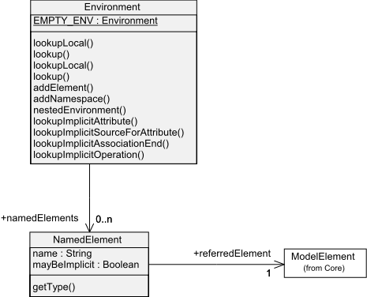

Note that the contents of the env attribute are fully determined by the context of the OCL expression. When an OCL expression is used as an invariant to class X, its environment will be different than in the case the expression is used as a postcondition to an operation of class Y. In Clause 12 ('The Use of Ocl Expressions in UML Models') the context of OCL expressions is defined in detail.

## Multiple Production Rules

For some elements there is a choice of multiple production rules. In that case the EBNF format of each production rule is prefixed by a capital letter between square brackets. The same prefix is used for the corresponding determination rules for the ast and env attributes.

## Multiple Occurrences of Production Names

In some production rules the same element name is used more than once. To distinguish between these occurrences the names will be postfixed by a number in square brackets, as in the following example.

CollectionRangeCS ::= OclExpressionCS[1] '..' OclExpressionCS[2]

## Disambiguating Rules

Some of the production rules are syntactically ambiguous. For such productions disambiguating rules have been defined. Using these rules, each production and thus the complete grammar becomes nonambiguous. For example in parsing a.b() , there are at least three possible parsing solutions:

1. a is a VariableExpr             (a reference to a let or an iterator variable)



2. a is an AttributeCallExp     (self is implicit)
3. a is a NavigationCallExp    (self is implicit)

A decision on which grammar production rule to use can only be made when the environment of the expression is taken into account. The disambiguating rules describe these choices based on the environment and allow unambiguous parsing of a.b() . In this case the rules (in plain English) would be:

- If a is a defined variable in the current scope, a is a VariableExp.
- If not, check self and all iterator variables in scope. The inner-most scope for which as is either
- an attribute with the name a , resulting in an AttributeCallExp, or
- an opposite association-end with the name a , resulting in a NavigationCallExp, defines the meaning of a.b() .
- If neither of the above is true, the expression is illegal / incorrect and cannot be parsed.

Disambiguating rules may be based on the UML model to which the OCL expression is attached (e.g., does an attribute exist or not). Because of this, the UML model must be available when an OCL expression is parsed, otherwise it cannot be validated as a correct expression. The grammar is structured in such a way that at most one of the production rules will fulfill all the disambiguating rules, thus ensuring that the grammar as a whole is unambiguous. The disambiguating rules are written in OCL, and use some metaclasses and additional operations from UML.

## 9.2 A Note to Tool Builders

## 9.2.1 Parsing

The grammar in this clause might not prove to be the most efficient way to directly construct a tool. Of course, a toolbuilder is free to use a different parsing mechanism. He can, for example, first parse an OCL expression using a special concrete syntax tree, and do the semantic validation against a UML model in a second pass. Also, error correction or syntax directed editing might need hand-optimized grammars. This document does not prescribe any specific parsing approach. The only restriction is that at the end of all processing a tool should be able to produce the same well-formed instance of the abstract syntax, as would be produced by this grammar.

## 9.2.2 Visibility

The OCL specification puts no restriction on the visibility declared for a property defined in the model (such as 'private,' 'protected,' or 'public'). In OCL, all modelelements are considered visible. The reason for this is to allow a modeler to specify constraints, even between 'hidden' elements. At the lowest implementation level this might be useful.

As a separate option OCL tools may enforce all UML visibility rules to support OCL expressions to be specified only over visible modelelements. Especially when a tool needs to generate code for runtime evaluation of OCL expressions, this visibility enforcement is necessary.

## 9.3 Concrete Syntax

In the concrete syntax, names that are reserved words or include punctuation characters can be used by enclosing the required name in underscore-prefixed single quotes.

```
_'and' _'>='
```

```
[In OCL 2.0 and 2.2 a reserved word could be used as a name after prefixing it with an underscore. _and
```

The subsequent symbol lookup would look first for the spelling with an underscore in the metamodel and if that was not found would attempt a further lookup after removing the underscore. This behavior was indeterminate, could not access names that existed both with and without prefixes, and did not support punctuation characters. The simple underscore prefix was therefore deprecated in OCL 2.3 and will be removed in OCL 3.0.]

## 9.3.1 ExpressionInOclCS

The ExpressionInOcl symbol has been added to set up the initial environment of an expression.

ExpressionInOclCS ::= OclExpressionCS

## Abstract syntax mapping

ExpressionInOclCS.ast : OclExpression

## Synthesized attributes

ExpressionInOclCS.ast = OclExpressionCS.ast

## Inherited attributes

The environment of the OCL expression must be defined, but what exactly needs to be in the environment depends on the context of the OCL expression. The following rule is therefore not complete. It defines the env attribute by adding the self variable to an empty environment, as well as a Namespace containing all elements visible from self. In sub clause 12.2, the contextualClassifier will be defined for the various places where an ocl expression may occur. In the context of a preor postcondition, the result variable as well as variable definitions for any named operation parameters can be added in a similar way.

```
OclExpressionCS.env = ExpressionInOclCS.contextualClassifier.namespace.getEnvironmentWithParents() .addElement ('self,' ExpressionInOclCS.contextualClassifier, true)
```

## 9.3.2 OclExpressionCS

An OclExpression has several production rules, one for each subclass of OclExpression. Note that UnspecifiedValueExp is handled explicitly in OclMessageArgCS, because that is the only place where it is allowed.

```
[A] OclExpressionCS ::= CallExpCS [B] OclExpressionCS ::= VariableExpCS [C] OclExpressionCS ::= LiteralExpCS [D] OclExpressionCS ::= LetExpCS [E] OclExpressionCS ::= OclMessageExpCS [F] OclExpressionCS ::= IfExpCS Abstract syntax mapping OclExpressionCS.ast : OclExpression
```

## Synthesized attributes

[A] OclExpressionCS.ast = CallExpCS.ast

```
[B] OclExpressionCS.ast = VariableExpCS.ast [C] OclExpressionCS.ast = LiteralExpCS.ast  [D] OclExpressionCS.ast = LetExpCS.ast [E] OclExpressionCS.ast = OclMessageExpCS.ast [F] OclExpressionCS.ast = IfExpCS.ast
```

## Inherited attributes

```
[A] CallExpCS.env = OclExpressionCS.env [B] VariableExpCS.env = OclExpressionCS.env [C] LiteralExpCS.env = OclExpressionCS.env [D] LetExpCS.env = OclExpressionCS.env [E] OclMessageExpCS.env = OclExpressionCS.env [F] IfExpCS.env = OclExpressionCS.env
```

## Disambiguating rules

The disambiguating rules are defined in the children.

## 9.3.3 VariableExpCS

A variable expression is just a name that refers to a variable or self.

```
[A] VariableExpCS ::= simpleNameCS [B] VariableExpCS ::= 'self'
```

## Abstract syntax mapping

VariableExpCS.ast : VariableExpression

## Synthesized attributes

```
[A] VariableExpCS.ast.referredVariable = env.lookup(simpleNameCS.ast).referredElement.oclAsType(VariableDeclaration) [B] VariableExpCS.ast.referredVariable = env.lookup('self').referredElement.oclAsType(VariableDeclaration)
```

## Inherited attributes

```
-- none
```

## Disambiguating rules

[1][A] simpleNameCS must be a name of a visible VariableDeclaration in the current environment

env.lookup (simpleNameCS.ast).referredElement.oclIsKindOf (VariableDeclaration)

## 9.3.4 simpleNameCS

This production rule represents a single name. No special rules are applicable. The abstract syntax of a simpleNameCS String is undefined in UML, and so is undefined in OCL. The reason for this is internationalization.

The concrete syntax of a simpleNameCS String supports a Unicode letter-prefixed identifier (form [A]). Reserved words and names involving awkward characters such as punctuation may be specified by prefixing a String Literal with an '\_' (form [B] and [C]).

```
[A] simpleNameCS ::= NameStartChar NameChar* [B] simpleNameCS ::= '_' #x27 StringChar* #x27 [C] simpleNameCS[1] ::= simpleNameCS[2] WhiteSpaceChar* #x27 StringChar* #x27 The identifier form starts with a Unicode letter: NameStartChar ::= [A-Z] | "_" | "$" | [a-z] | [#xC0-#xD6] | [#xD8-#xF6] | [#xF8-#x2FF] | [#x370-#x37D] | [#x37F-#x1FFF] | [#x200C-#x200D] | [#x2070-#x218F] | [#x2C00-#x2FEF] | [#x3001-#xD7FF] | [#xF900-#xFDCF] | [#xFDF0-#xFFFD] | [#x10000-#xEFFFF] and may continue with a Unicode letter or digit. NameChar ::= NameStartChar | [0-9] The StringChar form is defined under StringLiteralExpCS. Example simpleNameCS values are: String    i3 αρετη MAX_VALUE   isLetterOrDigit    _'true'    _'>='    _'\'' Abstract syntax mapping simpleNameCS.ast : String Synthesized attributes [A] simpleNameCS.ast = <CodePoints of NameStartChar NameChar*> [B] simpleNameCS.ast = <CodePoints of StringChar*> [C] simpleNameCS[1].ast = simpleNameCS[2] + <CodePoints of StringChar*> Inherited attributes -- none Disambiguating rules [1] [A]  the character, if any, following the last NameChar is not a NameChar. [2] [A]  simpleNameCS.ast is not a reserved word [3] [B]  No whitespace is permitted between the '_' and the first NameChar. [4] [C]  simpleNameCS[2] is a simpleNameCS [B] or [C]. 9.3.5 restrictedKeywordCS This production rule represents any name that is not a reserved keyword. [A] restrictedKeywordCS ::= CollectionTypeIdentifierCS [B] restrictedKeywordCS ::= primitiveTypeCS [C] restrictedKeywordCS ::= oclTypeCS [D] restrictedKeywordCS ::= 'Tuple' Abstract syntax mapping
```

```
restrictedKeywordCS.ast : String
```

## Synthesized attributes

- [A] restrictedKeywordCS.ast = CollectionTypeIdentifierCS.ast.name
- [B] restrictedKeywordCS.ast = primitiveTypeCS.ast.name
- [C] restrictedKeywordCS.ast = oclTypeCS.ast.name
- [D] restrictedKeywordCS.ast = 'Tuple'

## Inherited attributes

-- none

## Disambiguating rules

- -- none

## 9.3.6 unreservedSimpleNameCS

This production rule represents any name that is not a reserved keyword.

- [A] unreservedSimpleNameCS ::= simpleNameCS

```
[B] unreservedSimpleNameCS ::= restrictedKeywordCS
```

## Abstract syntax mapping

```
unreservedSimpleNameCS.ast : String
```

## Synthesized attributes

- [A] unreservedSimpleNameCS.ast = simpleNameCS.ast
- [B] unreservedSimpleNameCS.ast = restrictedKeywordCS.ast

## Inherited attributes

-- none

## Disambiguating rules

-- none

## 9.3.7 pathNameCS

This rule represents a path name, which is held in its ast as a sequence of Strings.

- [A] pathNameCS ::= simpleNameCS
- [B] pathNameCS ::= pathNameCS '::' unreservedSimpleNameCS

## Abstract syntax mapping

```
pathNameCS.ast : Sequence(String)
```

## Synthesized attributes

- [A] pathNameCS.ast = Sequence{simpleNameCS .ast}
- [B] pathNameCS.ast = pathNameCS.ast-&gt;append(unreservedSimpleNameCS.ast)

## Inherited attributes

-- none

## Disambiguating rules

```
-- none
```

## 9.3.8 LiteralExpCS

This rule represents literal expressions.

[A] LiteralExpCS ::= EnumLiteralExpCS

```
[B] LiteralExpCS ::= CollectionLiteralExpCS [C] LiteralExpCS ::= TupleLiteralExpCS [D] LiteralExpCS ::= PrimitiveLiteralExpCS [E] LiteralExpCS ::= TypeLiteralExpCS
```

## Abstract syntax mapping

```
LiteralExpCS.ast : LiteralExp
```

## Synthesized attributes

```
[A] LiteralExpCS.ast = EnumLiteralExpCS.ast [B] LiteralExpCS.ast = CollectionLiteralExpCS.ast [C] LiteralExpCS.ast = TupleLiteralExpCS.ast [D] LiteralExpCS.ast = PrimitiveLiteralExpCS.ast [E] LiteralExpCS.ast = TypeLiteralExpCS.ast
```

## Inherited attributes

- [A] EnumLiteralExpCS.env = LiteralExpCS.env

```
[B] CollectionLiteralExpCS.env = LiteralExpCS.env [C] TupleLiteralExpCS.env = LiteralExpCS.env [D] PrimitiveLiteralExpCS.env  = LiteralExpCS.env [E] TypeLiteralExpCS.env  = LiteralExpCS.env
```

## Disambiguating rules

```
-- none
```

## 9.3.9 EnumLiteralExpCS

The rule represents Enumeration Literal expressions.

```
EnumLiteralExpCS ::= pathNameCS '::' simpleNameCS
```

## Abstract syntax mapping

```
EnumLiteralExpCS.ast : EnumLiteralExp
```

## Synthesized attributes

```
EnumLiteralExpCS.ast.type = env.lookupPathName (pathNameCS.ast).referredElement.oclAsType (Classifier) EnumLiteralExpCS.ast.referredEnumLiteral = EnumLiteralExpCS.ast.type.oclAsType (Enumeration).literal-> select (l  | l.name = simpleNameCS.ast )->any(true)
```

## Inherited attributes

-- none

## Disambiguating rules

- [1] The specified name must indeed reference an enumeration:

```
not EnumLiteralExpCS.ast.type.oclIsUndefined() and EnumLiteralExpCS.ast.type.oclIsKindOf (Enumeration)
```

## 9.3.10  CollectionLiteralExpCS

This rule represents a collection literal expression.

```
CollectionLiteralExpCS ::= CollectionTypeIdentifierCS '{' CollectionLiteralPartsCS? '}'
```

## Abstract syntax mapping

CollectionLiteralExpCS.ast : CollectionLiteralExp

## Synthesized attributes

```
CollectionLiteralExpCS.ast.parts = CollectionLiteralPartsCS.ast CollectionLiteralExpCS.ast.kind  = CollectionTypeIdentifierCS.ast
```

## Inherited attributes

```
CollectionTypeIdentifierCS.env = CollectionLiteralExpCS.env CollectionLiteralPartsCS.env   = CollectionLiteralExpCS.env
```

## Disambiguating rules

- [1] In a literal the collection type may not be Collection.

CollectionTypeIdentifierCS.ast &lt;&gt; 'Collection'

## 9.3.11  CollectionTypeIdentifierCS

This rule represents the type identifier in a collection literal expression. The Collection type is an abstract type on M1 level, so it has no corresponding literals.

- [A] CollectionTypeIdentifierCS ::= 'Set'

```
[B] CollectionTypeIdentifierCS ::= 'Bag' [C] CollectionTypeIdentifierCS ::= 'Sequence' [D] CollectionTypeIdentifierCS ::= 'Collection' [E] CollectionTypeIdentifierCS ::= 'OrderedSet'
```

## Abstract syntax mapping

CollectionTypeIdentifierCS.ast : CollectionKind

## Synthesized attributes

- [A] CollectionTypeIdentifierCS.ast = CollectionKind::Set  [B] CollectionTypeIdentifierCS.ast = CollectionKind::Bag  [C] CollectionTypeIdentifierCS.ast = CollectionKind::Sequence  [D] CollectionTypeIdentifierCS.ast = CollectionKind::Collection  [E] CollectionTypeIdentifierCS.ast = CollectionKind::OrderedSet

## Inherited attributes

-- none

## Disambiguating rules

-- none

## 9.3.12  CollectionLiteralPartsCS

This production rule describes a sequence of items that are the contents of a collection literal.

```
CollectionLiteralPartsCS[1] = CollectionLiteralPartCS ( ',' CollectionLiteralPartsCS[2] )?
```

## Abstract syntax mapping

CollectionLiteralPartsCS[1].ast : Sequence(CollectionLiteralPart)

## Synthesized attributes

```
CollectionLiteralPartsCS[1].ast = Sequence{CollectionLiteralPartCS.ast}->union(CollectionLiteralPartsCS[2].ast)
```

## Inherited attributes

```
CollectionLiteralPartCS.env = CollectionLiteralPartsCS[1].env CollectionLiteralPartSCS[2].env = CollectionLiteralPartsCS[1].env
```

## Disambiguating rules

-- none

## 9.3.13  CollectionLiteralPartCS

```
[A] CollectionLiteralPartCS ::= CollectionRangeCS [B] CollectionLiteralPartCS ::= OclExpressionCS
```

## Abstract syntax mapping

CollectionLiteralPartCS.ast : CollectionLiteralPart

## Synthesized attributes

- [A] CollectionLiteralPartCS.ast = CollectionRange.ast
- [B] CollectionLiteralPartCS.ast.oclIsKindOf(CollectionItem) and

CollectionLiteralPartCS.ast.oclAsType(CollectionItem).OclExpression =  OclExpressionCS.ast

## Inherited attributes

```
[A] CollectionRangeCS.env = CollectionLiteralPartCS.env [B] OclExpressionCS.env   = CollectionLiteralPartCS.env
```

## Disambiguating rules

```
-- none
```

## 9.3.14  CollectionRangeCS

```
CollectionRangeCS ::= OclExpressionCS[1] '..' OclExpressionCS[2]
```

## Abstract syntax mapping

CollectionRangeCS.ast : CollectionRange

## Synthesized attributes

```
CollectionRangeCS.ast.first = OclExpressionCS[1].ast CollectionRangeCS.ast.last  = OclExpressionCS[2].ast
```

## Inherited attributes

```
OclExpressionCS[1].env = CollectionRangeCS.env OclExpressionCS[2].env = CollectionRangeCS.env
```

## Disambiguating rules

```
-- none
```

## 9.3.15  PrimitiveLiteralExpCS

This includes Real, Boolean, UnlimitedNatural, Integer, and String literals. Especially String literals must take internationalization into account and might need to remain undefined in this specification.

- [A] PrimitiveLiteralExpCS ::= IntegerLiteralExpCS

```
[B] PrimitiveLiteralExpCS ::= RealLiteralExpCS [C] PrimitiveLiteralExpCS ::= StringLiteralExpCS [D] PrimitiveLiteralExpCS ::= BooleanLiteralExpCS [E] PrimitiveLiteralExpCS ::= UnlimitedNaturalLiteralExpCS [F] PrimitiveLiteralExpCS ::= NullLiteralExpCS [G] PrimitiveLiteralExpCS ::= InvalidLiteralExpCS
```

## Abstract syntax mapping

PrimitiveLiteralExpCS.ast : PrimitiveLiteralExp

## Synthesized attributes

- [A] PrimitiveLiteralExpCS.ast = IntegerLiteralExpCS.ast

```
[B] PrimitiveLiteralExpCS.ast = RealLiteralExpCS.ast [C] PrimitiveLiteralExpCS.ast = StringLiteralExpCS.ast [D] PrimitiveLiteralExpCS.ast = BooleanLiteralExpCS.ast
```

This rule represents unlimited natural literal expressions. The lexical representation is either the lexical representation of an integer value or the single character * that represents the unlimited value. The -1 representation of the unlimited value is only

```
[E] PrimitiveLiteralExpCS.ast = UnlimitedNaturalLiteralExpCS.ast [F] PrimitiveLiteralExpCS.ast = NullLiteralExpCS.ast [G] PrimitiveLiteralExpCS.ast = InvalidLiteralExpCS.ast Inherited attributes -- none Disambiguating rules -- none 9.3.16  TupleLiteralExpCS This rule represents tuple literal expressions. TupleLiteralExpCS ::= 'Tuple' '{' variableDeclarationListCS '}' Abstract syntax mapping TupleLiteralExpCS.ast : TupleLiteralExp Synthesized attributes TupleLiteralExpCS.tuplePart = variableDeclarationListCS.ast Inherited attributes variableDeclarationListCS[1].env = TupleLiteralExpCS.env Disambiguating rules [1] The initExpression and type of all VariableDeclarations must exist. TupleLiteralExpCS.tuplePart->forAll( varDecl | varDecl.initExpression->notEmpty() and not varDecl.type.oclIsUndefined() ) 9.3.17  UnlimitedNaturalLiteralExpCS visible in the abstract systax and its serialization.. [A] UnlimitedNaturalLiteralExpCS ::= <Integer Lexical Representation>  [B] UnlimitedNaturalLiteralExpCS ::= '*' Abstract syntax mapping UnlimitedNaturalLiteralExpCS.ast : UnlimitedNaturalLiteralExp Synthesized attributes UnlimitedNaturalLiteralExpCS.ast.unlimitedNaturalSymbol = <IntegerValue>  UnlimitedNaturalLiteralExpCS.ast.unlimitedNaturalSymbol = -1 Inherited attributes -- none
```

## Disambiguating rules

-- none

## 9.3.18  IntegerLiteralExpCS

This rule represents integer literal expressions. The lexical representation of an integer is a sequence of at least one of the decimal digit characters, without a leading zero; except that a single leading zero character is required for the zero value.

IntegerLiteralExpCS ::= &lt;Integer Lexical Representation&gt;

## Abstract syntax mapping

IntegerLiteralExpCS.ast : IntegerLiteralExp

## Synthesized attributes

IntegerLiteralExpCS.ast.integerSymbol = &lt;Integer Value&gt;

## Inherited attributes

-- none

## Disambiguating rules

-- none

## 9.3.19  RealLiteralExpCS

This rule represents real literal expressions. A real literal consists of an integer part, a fractional part, and an exponent part. The exponent part consists of either the letter 'e' or 'E', followed optionally by a '+' or '-' letter followed by an exponent integer part. Each integer part consists of a sequence of at least one of the decimal digit characters. The fractional part consists of the letter '.' followed by a sequence of at least one of the decimal digit characters. Either the fraction part or the exponent part may be missing but not both.

RealLiteralExpCS ::= &lt;Real Lexical Representation&gt;

## Abstract syntax mapping

RealLiteralExpCS.ast : RealLiteralExp

## Synthesized attributes

RealLiteralExpCS.ast.realSymbol = &lt;Real Value&gt;

## Inherited attributes

-- none

## Disambiguating rules

-- none

## 9.3.20  StringLiteralExpCS

This rule represents string literal expressions. The concrete syntax comprises a sequence of zero or more characters or escape sequences surrounded by single quote characters.  The [B] form with adjacent strings allows a long string literal to be split into fragments or to be written across multiple lines.

```
[B] StringLiteralExpCS[1] ::= StringLiteralExpCS[2] WhiteSpaceChar* #x27 StringChar* #x27 StringChar ::= Char | EscapeSequence WhiteSpaceChar ::= #x09 | #x0a | #x0c | #x0d | #x20 Char ::= [#x20-#x26] | [#x28-#x5B] | [#x5D-#xD7FF] | [#xE000-#xFFFD] | [#x10000-#x10FFFF] EscapeSequence ::=  '\' 'b'                                     -- #x08: backspace BS | '\' 't'                                      -- #x09: horizontal tab HT | '\' 'n'                                     -- #x0a: linefeed LF | '\' 'f'                                     -- #x0c: form feed FF | '\' 'r'                                     -- #x0d: carriage return CR | '\' '"'                                     -- #x22: double quote " | '\' '''                                      -- #x27: single quote ' | '\' '\'                                      -- #x5c: backslash \ | '\' 'x'  Hex Hex                    -- #x00 to #xFF | '\' 'u'  Hex Hex Hex Hex     -- #x0000 to #xFFFF
```

```
[B] StringLiteralExpCS.ast.symbol = StringLiteralExpCS[2] + <CodePoints of StringChar*>
```

```
[A] StringLiteralExpCS ::= #x27 StringChar* #x27 where Hex ::= [0-9] | [A-F] | [a-f] Abstract syntax mapping StringLiteralExpCS.ast : StringLiteralExp Synthesized attributes [A] StringLiteralExpCS.ast.symbol = <CodePoints of StringChar*> Inherited attributes -- none Disambiguating rules -- none 9.3.21  BooleanLiteralExpCS This rule represents Boolean literal expressions. [A] BooleanLiteralExpCS ::= 'true' [B] BooleanLiteralExpCS ::= 'false' Abstract syntax mapping BooleanLiteralExpCS.ast : BooleanLiteralExp
```

## Synthesized attributes

- [A] BooleanLiteralExpCS.ast.booleanSymbol = true
- [B] BooleanLiteralExpCS.ast.booleanSymbol = false

## Inherited attributes

-- none

## Disambiguating rules

-- none

## 9.3.22  TypeLiteralExpCS

This production rule references a type name.

## Abstract syntax mapping

TypeLiteralExpCS ::= typeCS

## Synthesized attributes

TypeLiteralExpCS.ast = typeCS.ast

## Inherited attributes

typeCS.env =  TypeLiteralExpCS.env

## Disambiguating rules

-- none

## 9.3.23  CallExpCS

This rule represents property call expressions.

<!-- formula-not-decoded -->

[B] CallExpCS ::= LoopExpCS

## Abstract syntax mapping

```
CallExpCS.ast : CallExp
```

## Synthesized attributes

- [A] CallExpCS.ast = ModelPropertyCallCS.ast

```
[B] CallExpCS.ast = LoopExpCS.ast
```

## Inherited attributes

- [A] ModelPropertyCallCS.env  = CallExpCS.env

```
[B] LoopExpCS.env = CallExpCS.env
```

## Disambiguating rules

The disambiguating rules are defined in the children.

## 9.3.24  LoopExpCS

This rule represents loop expressions.

```
[A] LoopExpCS ::= IteratorExpCS [B] LoopExpCS ::= IterateExpCS Abstract syntax mapping LoopExpCS.ast : LoopExp Synthesized attributes [A] LoopExpCS.ast = IteratorExpCS.ast [B] LoopExpCS.ast = IterateExpCS.ast Inherited attributes [A] IteratorExpCS.env  = LoopExpCS.env [B] IterateExpCS.env   = LoopExpCS.env Disambiguating rules -- none
```

## 9.3.25  IteratorExpCS

The first alternative is a straightforward Iterator expression, with optional iterator variable. The second and third alternatives are so-called implicit collect iterators. B is for operations and C for attributes, D for navigations, and E for associationclasses.

```
[A] IteratorExpCS ::= OclExpressionCS[1] '->' simpleNameCS '(' (VariableDeclarationCS[1], (',' VariableDeclarationCS[2])? '|' )? OclExpressionCS[2] ')' [B] IteratorExpCS ::= OclExpressionCS '.' simpleNameCS '('argumentsCS?')' [C] IteratorExpCS ::= OclExpressionCS '.' simpleNameCS [D] IteratorExpCS ::= OclExpressionCS '.' simpleNameCS ('[' argumentsCS ']')? [E] IteratorExpCS ::= OclExpressionCS '.' simpleNameCS ('[' argumentsCS ']')?
```

## Abstract syntax mapping

```
IteratorExpCS.ast : IteratorExp
```

## Synthesized attributes

```
-- the ast needs to be determined bit by bit, first the source association of IteratorExp [A] IteratorExpCS.ast.source = OclExpressionCS[1].ast -- next the iterator association of IteratorExp
```

```
-- when the variable declaration is present, its ast is the iterator of this iteratorExp -- when the variable declaration is not present, the iterator has a default name and -- type -- In any case, the iterator does not have an init expression [A] IteratorExpCS.ast.iterators->at(1).name = if VariableDeclarationCS[1]->isEmpty() then íí else VariableDeclarationCS[1].ast.name endif [A] IteratorExpCS.ast.iterator->at(1).type = if VariableDeclarationCS[1]->isEmpty() or (VariableDeclarationCS[1]->notEmpty() and VariableDeclarationCS[1].ast.type.oclIsUndefined() ) then OclExpressionCS[1].type.oclAsType (CollectionType).elementType else VariableDeclarationCS[1].ast.type endif - The optional second iterator [A] if VariableDeclarationCS[2]->isEmpty() then IteratorExpCS.ast.iterators->size() = 1 else IteratorExpCS.ast.iterators->at(2).name = VariableDeclarationCS[2].ast.name and IteratorExpCS.ast.iterators->at(2).type = if VariableDeclarationCS[2]->isEmpty() or (VariableDeclarationCS[2]->notEmpty() and VariableDeclarationCS[2].ast.type.oclIsUndefined() ) then OclExpressionCS[1].type.oclAsType (CollectionType).elementType else VariableDeclarationCS[2].ast.type endif endif [A] IteratorExpCS.ast.iterators->forAll(initExpression->isEmpty()) -- next the name attribute and body association of the IteratorExp [A] IteratorExpCS.ast.name   = simpleNameCS.ast and [A] IteratorExpCS.ast.body   = OclExpressionCS[2].ast -- Alternative B is an implicit collect of an operation over a collection [B] IteratorExpCS.ast.iterator.type OclExpressionCS.ast.type.oclAsType (CollectionType).elementType [B] IteratorExpCS.ast.source  = OclExpressionCS.ast [B] IteratorExpCS.ast.name    = ícollectí [B] -- the body of the implicit collect is the operation call referred to by ínameí IteratorExpCS.ast.body.oclIsKindOf (OperationCallExp) and let body : OperationCallExp = IteratorExpCS.ast.body.oclAsType(OperationCallExp) in body.arguments = argumentsCS.ast
```

```
and body.source.oclIsKindOf(VariableExp) and body.source.oclAsType (VariableExp).referredVariable = IteratorExpCS.ast.iterator and body.referredOperation = OclExpressionCS.ast.type.oclAsType (CollectionType ).elementType lookupOperation( simpleNameCS.ast, if (argumentsCS->notEmpty()) then arguments.ast->collect(type) else Sequence{} endif) -- Alternative C/D is an implicit collect of an association or attribute over a collection [C, D] IteratorExpCS.ast.iterator.type = OclExpressionCS.ast.type.oclAsType (CollectionType).elementType [C, D] IteratorExpCS.ast.source  = OclExpressionCS.ast [C, D] IteratorExpCS.ast.name    = 'collect' [C] -- the body of the implicit collect is the attribute referred to by 'name' let refAtt : Attribute = OclExpressionCS.ast.type.oclAsType (CollectionType). elementType.lookupAttribute( simpleNameCS.ast), in IteratorExpCS.ast.body.oclIsKindOf (AttributeCallExp) and let body : AttributeCallExp = IteratorExpCS.ast.body.oclAsType(AttributeCallExp) in body.source.oclIsKindOf(VariableExp) and body.source.oclAsType (VariableExp).referredVariable = IteratorExpCS.ast.iterator and body.referredAttribute = refAtt [D] -- the body of the implicit collect is the navigation call referred to by 'name' let  refNav : AssociationEnd = OclExpressionCS.ast.type.oclAsType (CollectionType). elementType.lookupAssociationEnd(simpleNameCS.ast) in IteratorExpCS.ast.body.oclIsKindOf (AssociationEndCallExp) and let body : AssociationEndCallExp = IteratorExpCS.ast.body.oclAsType(AssociationEndCallExp) in body.source.oclIsKindOf(VariableExp) and body.source.oclAsType (VariableExp).referredVariable = IteratorExpCS.ast.iterator and body.referredAssociationEnd = refNav and body.ast.qualifiers = argumentsCS.ast [E] -- the body of the implicit collect is the navigation to the association class -- referred to by ínameí let  refClass : AssociationClass = OclExpressionCS.ast.type.oclAsType (CollectionType).
```

```
elementType.lookupAssociationClass(simpleNameCS.ast) in IteratorExpCS.ast.body.oclIsKindOf (AssociationClassCallExp) and let body : AssociationClassCallExp = IteratorExpCS.ast.body.oclAsType(AssociationClassCallExp) in body.source.oclIsKindOf(VariableExp) and body.source.oclAsType (VariableExp).referredVariable = IteratorExpCS.ast.iterator and body.referredAssociationClass = refNav and body.ast.qualifiers = argumentsCS.ast
```

```
Inherited attributes [A] OclExpressionCS[1].env    = IteratorExpCS.env [A] VariableDeclarationCS.env = IteratorExpCS.env -- inside an iterator expression the body is evaluated with a new environment that -- includes the iterator variable. [A] OclExpressionCS[2].env    = IteratorExpCS.env.nestedEnvironment().addElement(VariableDeclarationCS.ast.varName, VariableDeclarationCS.ast, true) [B] OclExpressionCS.env    = IteratorExpCS.env [B] argumentsCS.env          = IteratorExpCS.env [C] OclExpressionCS.env    = IteratorExpCS.env [D] OclExpressionCS.env    = IteratorExpCS.env Disambiguating rules [1] [A] When the variable declaration is present, it may not have an init expression. VariableDeclarationCS->notEmpty() implies VariableDeclarationCS.ast.initExpression->isEmpty() [2] [B] The source must be of a collection type. OclExpressionCS.ast.type.oclIsKindOf(CollectionType) [3] [C] The source must be of a collection type. OclExpressionCS.ast.type.oclIsKindOf(CollectionType) [4] [C] The referred attribute must be present. refAtt->notEmpty() [5] [D] The referred navigation must be present.
```

- refNav-&gt;notEmpty()

## 9.3.26  IterateExpCS

```
IterateExpCS ::= OclExpressionCS[1] '->' 'iterate'  '(' (VariableDeclarationCS[1] ';')?  VariableDeclarationCS[2] '|'  OclExpressionCS[2]  ')' Abstract syntax mapping IterateExpCS.ast : IterateExp Synthesized attributes -- the ast needs to be determined bit by bit, first the source association of IterateExp IterateExpCS.ast.source   = OclExpressionCS[1].ast -- next the iterator association of IterateExp -- when the first variable declaration is present, its ast is the iterator of this -- iterateExp, when the variable declaration is not present, the iterator has a default -- name and type, -- in any case, the iterator has an empty init expression. IterateExpCS.ast.iterator.name = if VariableDeclarationCS[1]->isEmpty() then '' else VariableDeclarationCS[1].ast.name endif IterateExpCS.ast.iterator.type = if VariableDeclarationCS[1]->isEmpty() or (VariableDeclarationCS[1]->notEmpty() and VariableDeclarationCS[1].ast.type.oclIsUndefined() ) then OclExpressionCS[1].type.oclAsType (CollectionType).elementType else VariableDeclarationCS[1].ast.type endif IterateExpCS.ast.iterator.initExpression->isEmpty() -- next the name attribute and body and result association of the IterateExp IterateExpCS.ast.result   = VariableDeclarationCS[2].ast IterateExpCS.ast.name   = 'iterate' IterateExpCS.ast.body    = OclExpressionCS[2].ast Inherited attributes OclExpressionCS[1].env  = IteratorExpCS.env VariableDeclarationCS[1].env = IteratorExpCS.env VariableDeclarationCS[2].env = IteratorExpCS.env -- Inside an iterate expression the body is evaluated with a new environment that includes -- the iterator variable and the result variable. OclExpressionCS[2].env       = IteratorExpCS.env.nestedEnvironment().addElement (VariableDeclarationCS[1].ast.varName, VariableDeclarationCS[1].ast,
```

```
true).addElement (VariableDeclarationCS[2].ast.varName, VariableDeclarationCS[2].ast, true)
```

## Disambiguating rules

- [1] A result variable declaration must have a type and an initial value.

```
not VariableDeclarationCS[2].ast.type.oclIsUndefined() VariableDeclarationCS[2].ast.initExpression->notEmpty() [2] When the first variable declaration is present, it may not have an init expression. VariableDeclarationCS[1]->notEmpty() implies VariableDeclarationCS[1].ast.initExpression->isEmpty()
```

## 9.3.27  VariableDeclarationCS

In the variable declaration, the type and init expression are optional. When these are required, this is defined in the production rule where the variable declaration is used.

```
VariableDeclarationCS ::= simpleNameCS (':' typeCS)? ( '=' OclExpressionCS )?
```

## Abstract syntax mapping

VariableDeclarationCS.ast : VariableDeclaration

## Synthesized attributes

```
VariableDeclarationCS.ast.name = simpleNameCS.ast VariableDeclarationCS.ast.initExpression = OclExpressionCS.ast -- A well-formed VariableDeclaration must have a type according to the abstract syntax. -- The value null is used when no type has been given in the concrete syntax. -- Production rules that use this need to check on this type. VariableDeclarationCS.ast.type = if typeCS->notEmpty() then typeCS.ast if OclExpressionCS.ast.type->notEmpty() then
```

```
else OclExpressionCS.ast.type else null endif endif
```

## Inherited attributes

```
OclExpressionCS.env = VariableDeclarationCS.env typeCS.env = VariableDeclarationCS.env
```

## Disambiguating rules

```
-- none
```

## 9.3.28  TypeCS

A typename is either a Classifier, or a collection of some type.

```
[A] typeCS ::= pathNameCS [B] typeCS ::= collectionTypeCS [C] typeCS ::= tupleTypeCS [D] typeCS ::= primitiveTypeCS [E] typeCS ::= oclTypeCS
```

## Abstract syntax mapping

```
typeCS.ast : Classifier
```

## Synthesized attributes

[A] typeCS.ast = typeCS.env.lookupPathName(pathNameCS.ast).referredElement.oclAsType(Classifier)

```
[B] typeCS.ast = CollectionTypeCS.ast [C] typeCS.ast = tupleTypeCS.ast [D] typeCS.ast = primitiveTypeCS.ast [E] typeCS.ast = oclTypeCS.ast
```

## Inherited attributes

- [B] collectionTypeCS.env = typeCS.env

```
[C] tupleTypeCS.env      = typeCS.env
```

## Disambiguating rules

- [1] [A] pathName must be a name of a Classifier in current environment.

typeCS.env.lookupPathName(pathNameCS.ast).referredElement.oclIsKindOf (Classifier)

## 9.3.29  primitiveTypeCS

This production rule denotes a primitive type.

## Abstract syntax mapping

```
[A] primitiveTypeCS ::= 'Boolean' [B] primitiveTypeCS ::= 'Integer' [C] primitiveTypeCS ::= 'Real' [D] primitiveTypeCS ::= 'String' [E] primitiveTypeCS ::= 'UnlimitedNatural'
```

## Synthesized attributes

- [A] primitiveTypeCS.ast = Boolean

```
[B] primitiveTypeCS.ast = Integer [C] primitiveTypeCS.ast = Real [D] primitiveTypeCS.ast = String [E] primitiveTypeCS.ast = UnlimitedNatural
```

## Inherited attributes

-- none

## Disambiguating rules

-- none

## 9.3.30  oclTypeCS

This production rule denotes a built-in OCL type.

## Abstract syntax mapping

[A] oclTypeCS ::= 'OclAny'

[B] oclTypeCS ::= 'OclInvalid'

[C] oclTypeCS ::= 'OclMessage'

[D] oclTypeCS ::= 'OclVoid'

## Synthesized attributes

[A] oclTypeCS.ast = OclAny

[B] oclTypeCS.ast = OclInvalid

[C] oclTypeCS.ast = OclMessage

[D] oclTypeCS.ast = OclVoid

## Inherited attributes

-- none

## Disambiguating rules

-- none

## 9.3.31  collectionTypeCS

A typename is either a Classifier, or a collection of some type.

collectionTypeCS ::= collectionTypeIdentifierCS '(' typeCS ')'

## Abstract syntax mapping

typeCS.ast : CollectionType

## Synthesized attributes

collectionTypeCS.ast.elementType = typeCS.ast

-- We know that the 'ast' is a collectiontype, all we need to state now is which

-- specific collection type it is.

kind = CollectionKind::Set  implies collectionTypeCS.ast.oclIsKindOf (SetType)

kind = CollectionKind::Sequence implies collectionTypeCS.ast.oclIsKindOf (SequenceType)

kind = CollectionKind::Bag  implies collectionTypeCS.ast.oclIsKindOf (BagType)

kind = CollectionKind::Collection implies collectionTypeCS.ast.oclIsKindOf (CollectionType)

kind = CollectionKind::OrderedSetimplies collectionTypeCS.ast.oclIsKindOf (OrderedSetType)

## Inherited attributes

typeCS.env = collectionTypeCS.env

```
Disambiguating rules -- none 9.3.32  tupleTypeCS This represents a tuple type declaration. tupleTypeCS ::= 'Tuple' '(' variableDeclarationListCS? ')' Abstract syntax mapping typeCS.ast : TupleType Synthesized attributes typeCS.ast =  TupleType::make( variableDeclarationListCS->collect( v | v.asAttribute() )) Inherited attributes variableDeclarationListCS.env = tupleTypeCS.env Disambiguating rules [1] Of all VariableDeclarations the initExpression must be empty and the type must exist. variableDeclarationListCS.ast->forAll( varDecl | varDecl.initExpression->notEmpty() and varDecl.type->notEmpty() ) 9.3.33  variableDeclarationListCS This production rule represents the formal parameters of a tuple or attribute definition. variableDeclarationListCS[1] = VariableDeclarationCS (','variableDeclarationListCS[2] )? Abstract syntax mapping variableDeclarationListCS[1].ast : Sequence( VariableDeclaration ) Synthesized attributes variableDeclarationListCS[1].ast = Sequence{VariableDeclarationCS.ast} ->union(variableDeclarationListCS[2].ast) Inherited attributes VariableDeclarationCS.env = variableDeclarationListCS[1].env variableDeclarationListCS[2].env  = variableDeclarationListCS[1].env Disambiguating rules -- none
```

## 9.3.34  FeatureCallExpCS

A FeatureCallExp expression may have three different productions. Which one is chosen depends on the disambiguating rules defined in each of the alternatives.

```
[A] FeatureCallExpCS ::= OperationCallExpCS
```

```
[B] FeatureCallExpCS ::= PropertyCallExpCS [C] FeatureCallExpCS ::= NavigationCallExpCS Abstract syntax mapping FeatureCallExpCS.ast : FeatureCallExp Synthesized attributes The value of this production is the value of its child production. [A] FeatureCallExpCS.ast = OperationCallExpCS.ast [B] FeatureCallExpCS.ast = PropertyCallExpCS.ast [C] FeatureCallExpCS.ast = NavigationCallExpCS.ast Inherited attributes [A] OperationCallExpCS.env  = FeatureCallExpCS.env [B] PropertyCallExpCS.env  = FeatureCallExpCS.env [C] NavigationCallExpCS.env = FeatureCallExpCS.env
```

## Disambiguating rules

These are defined in the children.

## 9.3.35  OperationCallExpCS

An operation call has many different forms. A is used for infix, B for using an object as an implicit collection. C is a straightforward operation call, while D has an implicit source expression. E, F and J are like C, D, and I, with the @pre addition. G covers the static operation call. Rule H is for unary prefix expressions. I and J use pathNameCS to permit qualification of operation names in access to redefined operations.

```
[A] OperationCallExpCS ::= OclExpressionCS[1]  simpleNameCS OclExpressionCS[2] [B] OperationCallExpCS ::= OclExpressionCS '->' simpleNameCS '(' argumentsCS? ')' [C] OperationCallExpCS ::= OclExpressionCS '.' simpleNameCS '(' argumentsCS? ')' [D] OperationCallExpCS ::= simpleNameCS  '(' argumentsCS? ')' [E] OperationCallExpCS ::= OclExpressionCS '.' simpleNameCS  isMarkedPreCS '(' argumentsCS? ')' [F] OperationCallExpCS ::= simpleNameCS isMarkedPreCS '(' argumentsCS? ')' [G] OperationCallExpCS ::= pathNameCS  '(' argumentsCS? ')' [H] OperationCallExpCS ::= simpleNameCS OclExpressionCS [I] OperationCallExpCS ::= OclExpressionCS '.' pathNameCS '::' simpleNameCS  '(' argumentsCS? ')' [J] OperationCallExpCS ::= OclExpressionCS '.' pathNameCS  '::' simpleNameCS  isMarkedPreCS '(' argumentsCS? ')' Abstract syntax mapping OperationCallExpCS.ast  : OperationCallExp Synthesized attributes -- this rule is for binary operators as '+,' '-,' '*,' etc. It has only one argument. [A] OperationCallExpCS.ast.arguments  = Sequence{OclExpression2[2].ast} OperationCallExpCS.ast.source     = OclExpressionCS[1].ast OperationCallExpCS.ast.referredOperation = OclExpressionCS.ast.type.lookupOperation ( simpleNameCS.ast, Sequence{OclExpression[2].ast.type} ) -- The source is either a collection or a single object used as a collection. [B] OperationCallExpCS.ast.arguments = argumentsCS.ast -- if the OclExpressionCS is a collectiontype, then the source is this OclExpressionCS. -- Otherwise, the source must be build up by defining a singleton set containing -- the OclExpressionCS. This is done though inserting a call to the standard -- operation "asSet()" OperationCallExpCS.ast.source = if OclExpressionCS.ast.type.oclIsKindOf(CollectionType) then OclExpressionCS.ast else OclExpressionCS.ast.withAsSet() endif ---- The referred operation: OperationCallExpCS.ast.referredOperation = if OclExpressionCS.ast.type.oclIsKindOf (CollectionType) then  -- this is a collection operation called on a collection OclExpressionCS.ast.type.lookupOperation (simpleNameCS.ast, if (argumentsCS->notEmpty()) then argumentsCS.ast->collect(type) else Sequence{} endif )
```

```
else -- this is a set operation called on an object => implicit Set with one element SetType.allInstances()->any (st | st.elementType = OclExpressionCS.ast.type).lookupOperation ( simpleNameCS.ast, if (argumentsCS->notEmpty()) then argumentsCS.ast->collect(type) else Sequence{} endif ) endif [C] OperationCallExpCS.ast.referredOperation = OclExpressionCS.ast.type.lookupOperation (simpleNameCS.ast, if argumentsCS->notEmpty() then arguments.ast->collect(type) else Sequence{} endif) OperationCallExpCS.ast.arguments = argumentsCS.ast OperationCallExpCS.ast.source = OclExpressionCS.ast [D] OperationCallExpCS.ast.arguments  = argumentsCS.ast and OperationCallExpCS.ast.referredOperation = env.lookupImplicitOperation(simpleName.ast, if argumentsCS->notEmpty() then arguments.ast->collect(type) else Sequence{} endif) OperationCallExpCS.ast.source = env.lookupImplicitSourceForOperation( simpleName.ast, if argumentsCS->notEmpty() then arguments.ast->collect(type) else Sequence{} endif) [E] -- incorporate the isPre() operation. OperationCallExpCS.ast.referredOperation = OclExpressionCS.ast.type.lookupOperation (simpleNameCS.ast, if argumentsCS->notEmpty() then arguments.ast->collect(type) else Sequence{} endif) OperationCallExpCS.ast.arguments = argumentsCS.ast OperationCallExpCS.ast.source  = OclExpressionCS.ast.isPre = true [F] -- incorporate atPre() operation with the implicit source OperationCallExpCS.ast.arguments  = argumentsCS.ast and OperationCallExpCS.ast.referredOperation = env.lookupImplicitOperation(simpleName.ast, if argumentsCS->notEmpty() then arguments.ast->collect(type) else Sequence{} endif) ) OperationCallExpCS.ast.source = env.lookupImplicitSourceForOperation(simpleName.ast, if argumentsCS->notEmpty() then arguments.ast->collect(type) else Sequence{} endif)
```

```
).isPre = true [G] OperationCallExpCS.ast.arguments  = argumentsCS.ast and OperationCallExpCS.ast.referredOperation = env.lookupPathName(pathName.ast, e{} endif) OperationCallExpCS.ast.source->isEmpty() -- this rule is for unary operators as '-' and 'not' etc. It has no argument. [H] OperationCallExpCS.ast.arguments->isEmpty() OperationCallExpCS.ast.source     = OclExpressionCS.ast OperationCallExpCS.ast.referredOperation = OclExpressionCS.ast.type.lookupOperation ( simpleNameCS.ast, Sequence{} ) [I] let owner : Classifier = pathNameCS.env.lookupPathName(pathNameCS.ast).referredElement.oclAsType(Classifier) in OperationCallExpCS.ast.referredOperation = owner.lookupOperation (simpleNameCS.ast, if argumentsCS->notEmpty() then arguments.ast->collect(type) else Sequence{} endif) OperationCallExpCS.ast.arguments = argumentsCS.ast OperationCallExpCS.ast.source = OclExpressionCS.ast [J] -- incorporate the isPre() operation. let owner : Classifier = pathNameCS.env.lookupPathName(pathNameCS.ast).referredElement.oclAsType(Classifier) in OperationCallExpCS.ast.referredOperation = owner.lookupOperation (simpleNameCS.ast, if argumentsCS->notEmpty() then arguments.ast->collect(type) else Sequence{} endif) OperationCallExpCS.ast.arguments = argumentsCS.ast OperationCallExpCS.ast.source = OclExpressionCS.ast.isPre = true
```

## Inherited attributes

```
[A] OclExpressionCS[1].env= OperationCallExpCS.env [A] OclExpressionCS[2].env= OperationCallExpCS.env [B] OclExpressionCS.env= OperationCallExpCS.env [B] argumentsCS.env = OperationCallExpCS.env [C] OclExpressionCS.env= OperationCallExpCS.env [C] argumentsCS.env = OperationCallExpCS.env [D] argumentsCS.env = OperationCallExpCS.env [E] OclExpressionCS.env= OperationCallExpCS.env [E] argumentsCS.env = OperationCallExpCS.env [F] argumentsCS.env = OperationCallExpCS.env [I] OclExpressionCS.env= OperationCallExpCS.env [I] argumentsCS.env = OperationCallExpCS.env [J] OclExpressionCS.env= OperationCallExpCS.env [J] argumentsCS.env = OperationCallExpCS.env
```

## Disambiguating rules

```
[1] [A] The name of the referred Operation must be an operator. Set{'+','-','*','/','and','or','xor','=','<=','>=','<','>'}->includes(simpleNameCS.ast) [2] [A,B,C,D,E,F] The referred Operation must be defined for the type of source. not OperationCallExpCS.ast.referredOperation.oclIsUndefined() [3] [I,J] pathNameCS must be a name of a Classifier in current environment. OperationCallExpCS.env.lookupPathName(pathNameCS.ast).referredElement.oclIsKindOf(Classifier) [4] [I,J] The type of the source expression must conform to the owner type of the referenced operation. let owner : Classifier = pathNameCS.env.lookupPathName(pathNameCS.ast).referredElement.oclAsType(Classifier) in
```

OclExpressionCS.ast.type.conformsTo(owner)

## 9.3.36  PropertyCallExpCS

This production rule results in a PropertyCallExp. In production [A] the source is explicit, while production [B] is used for an implicit source. Alternative C covers the use of a static attribute. Alternative D uses pathNameCS to permit qualification of attribute names in access to redefined attributes.

```
[A] PropertyCallExpCS ::= OclExpressionCS '.' simpleNameCS isMarkedPreCS?
```

```
[B] PropertyCallExpCS ::= simpleNameCS isMarkedPreCS? [C] PropertyCallExpCS ::= pathNameCS [D] PropertyCallExpCS ::= OclExpressionCS '.' pathNameCS '::' simpleNameCS isMarkedPreCS? Abstract syntax mapping PropertyCallExpCS.ast : PropertyCallExp Synthesized attributes [A] PropertyCallExpCS.ast.referredAttribute = OclExpressionCS.ast.type.lookupAttribute(simpleNameCS.ast) [A] PropertyCallExpCS.ast.source = if isMarkedPreCS->isEmpty() then  OclExpressionCS.ast else  OclExpressionCS.ast.isPre = true endif [B] PropertyCallExpCS.ast.referredAttribute = env.lookupImplicitAttribute(simpleNameCS.ast) [B] PropertyCallExpCS.ast.source = if isMarkedPreCS->isEmpty() then env.findImplicitSourceForAttribute(simpleNameCS.ast) else env.findImplicitSourceForAttribute(simpleNameCS.ast).isPre = true endif [C] PropertyCallExpCS.ast.referredAttribute = env.lookupPathName(pathNameCS.ast).oclAsType(Attribute) [D] let owner : Classifier = pathNameCS.env.lookupPathName(pathNameCS.ast).referredElement.oclAsType(Classifier) in PropertyCallExpCS.ast.referredAttribute = owner.lookupAttribute(simpleNameCS.ast) [D] PropertyCallExpCS.ast.source = if isMarkedPreCS->isEmpty() then  OclExpressionCS.ast
```

else  OclExpressionCS.ast.isPre = true endif

## Inherited attributes

```
[A] OclExpressionCS.env = PropertyCallExpCS.env [D] OclExpressionCS.env = PropertyCallExpCS.env
```

## Disambiguating rules

- [1] [A, B] 'simpleName' is name of a Property of the type of source or if source is empty the name of an attribute of 'self' or any of the iterator variables in (nested) scope. In OCL:

not PropertyCallExpCS.ast.referredAttribute.oclIsUndefined()

- [2] [C] The pathName refers to a class attribute.

env.lookupPathName(pathNameCS.ast).oclIsKindOf(Attribute)

and

PropertyCallExpCS.ast.referredAttribute.ownerscope = ScopeKind::instance

- [3] [D] pathNameCS must be a name of a Classifier in current environment.

PropertyCallExpCS.env.lookupPathName(pathNameCS.ast).referredElement.oclIsKindOf(Classifier)

- [4] [D] The type of the source expression must conform to the owner type of the referenced attribute.

let owner : Classifier = pathNameCS.env.lookupPathName(pathNameCS.ast).referredElement.oclAsType(Classifier) in OclExpressionCS.ast.type.conformsTo(owner)

## 9.3.37  NavigationCallExpCS

This production rule represents a navigation call expression.

```
[A] NavigationCallExpCS ::= PropertyCallExpCS [B] NavigationCallExpCS ::= AssociationClassCallExpCS
```

## Abstract syntax mapping

NavigationCallExpCS.ast : NavigationCallExp

## Synthesized attributes

The value of this production is the value of its child production.

- [A] NavigationCallExpCS.ast = PropertyCallExpCS.ast

```
[B] NavigationCallExpCS.ast = AssociationClassCallExpCS.ast
```

## Inherited attributes

- [A] PropertyCallExpCS.env    = NavigationCallExpCS.env

```
[B] AssociationClassCallExpCS.env  = NavigationCallExpCS.env
```

## Disambiguating rules

These are defined in the children.

## 9.3.38  AssociationClassCallExpCS

This production rule represents a navigation to an association class.

```
[A] AssociationClassCallExpCS ::= OclExpressionCS '.' simpleNameCS ('[' argumentsCS ']')? isMarkedPreCS?
```

```
[B] AssociationClassCallExpCS ::= simpleNameCS ('[' argumentsCS ']')? isMarkedPreCS?
```

## Abstract syntax mapping

AssociationClassCallExpCS.ast : AssociationClassCallExp

## Synthesized attributes

```
[A] AssociationClassCallExpCS.ast.referredAssociationClass = OclExpressionCS.ast.type.lookupAssociationClass(simpleNameCS.ast) AssociationClassCallExpCS.ast.source = if isMarkedPreCS->isEmpty() then  OclExpressionCS.ast else  OclExpressionCS.ast.isPre = true endif [A] AssociationClassCallExpCS.ast.qualifiers = argumentsCS.ast [B] AssociationClassCallExpCS.ast.referredAssociationClass = env.lookupImplicitAssociationClass(simpleNameCS.ast) AssociationClassCallExpCS.ast.source = if isMarkedPreCS->isEmpty() then env.findImplicitSourceForAssociationClass(simpleNameCS.ast) else env.findImplicitSourceForAssociationClass(simpleNameCS.ast).isPre = true endif [B] AssociationClassCallExpCS.ast.qualifiers = argumentsCS.ast
```

## Inherited attributes

```
[A] OclExpressionCS.env = AssociationClassCallExpCS.env [A, B] argumentsCS.env  = AssociationClassCallExpCS.env
```

## Disambiguating rules

[1]

'simpleName' is name of an AssociationClass of the type of source.

not AssociationClassCallExpCS.ast.referredAssociationClass.oclIsUndefined()

## 9.3.39  isMarkedPreCS

This production rule represents the marking @pre in an ocl expression.

```
isMarkedPreCS ::= '@' 'pre' Abstract syntax mapping isMarkedPreCS.ast : Boolean Synthesized attributes self.ast = true
```

## Inherited attributes

-- none

## Disambiguating rules

-- none

## 9.3.40  argumentsCS

This production rule represents a sequence of arguments.

```
argumentsCS[1] ::= OclExpressionCS ( ',' argumentsCS[2] )?
```

## Abstract syntax mapping

argumentsCS[1].ast : Sequence(OclExpression)

## Synthesized attributes

argumentsCS[1].ast = Sequence{OclExpressionCS.ast}-&gt;union(argumentsCS[2].ast)

## Inherited attributes

```
OclExpressionCS.env = argumentsCS[1].env argumentsCS[2].env  = argumentsCS[1].env
```

## Disambiguating rules

```
-- none
```

## 9.3.41  LetExpCS

This production rule represents a let expression. The LetExpSubCS nonterminal has the purpose of allowing directly nested let expressions with the shorthand syntax, i.e., ending with one 'in' keyword.

```
LetExpCS ::= 'let' VariableDeclarationCS LetExpSubCS
```

## Abstract syntax mapping

```
LetExpCS.ast : LetExp
```

## Synthesized attributes

```
LetExpCS.ast.variable = VariableDeclarationCS.ast LetExpCS.ast.in = LetExpSubCS.ast
```

## Inherited attributes

```
LetExpSubCS.env = LetExpCS.env.nestedEnvironment().addElement( VariableDeclarationCS.ast.varName, VariableDeclarationCS.ast, false)
```

## Disambiguating rules

```
[1] The variable name must be unique in the current scope. LetExpCS.env.lookup (VariableDeclarationCS.ast.varName).oclIsUndefined() [2] A variable declaration inside a let must have a declared type and an initial value. not VariableDeclarationCS.ast.type.oclIsUndefined() and VariableDeclarationCS.ast.initExpression->notEmpty() 9.3.42  LetExpSubCS [A] LetExpSubCS[1] ::= ',' VariableDeclarationCS LetExpSubCS[2] [B] LetExpSubCS    ::= 'in' OclExpressionCS Abstract syntax mapping LetExpSubCS.ast : OclExpression Synthesized attributes [A] LetExpSubCS[1].ast.oclAsType(LetExp).variable      = VariableDeclarationCS.ast [A] LetExpSubCS[1].ast.oclAsType(LetExp).OClExpression = LetExpSubCS[2].ast [B] LetExpSubCS.ast = OclExpressionCS.ast Inherited attributes [A] VariableDeclarationCS.env = LetExpSubCS[1].env [A] LetExpSubCS[2].env = LetExpSubCS[1].env.nestedEnvironment().addElement( VariableDeclarationCS.ast.varName, VariableDeclarationCS.ast, false) [B] OClExpressionCS.env = LetExpSubCS.env Disambiguating rules [A] The variable name must be unique in the current scope. LetExpSubCS[1].env.lookup (VariableDeclarationCS.ast.varName).oclIsUndefined() [A] A variable declaration inside a let must have a declared type and an initial value. not VariableDeclarationCS.ast.type.oclIsUndefined() and VariableDeclarationCS.ast.initExpression->notEmpty()
```

## 9.3.43  OclMessageExpCS

The message Name must either be the name of a Signal, or the name of an Operation belonging to the target object(s).

```
[A] OclMessageExpCS ::= OclExpressionCS '^^'  simpleNameCS '(' OclMessageArgumentsCS? ')'
```

```
[B] OclMessageExpCS ::= OclExpressionCS '^'   simpleNameCS '(' OclMessageArgumentsCS? ')' Abstract syntax mapping [A] OclMessageExpCS.ast : OclMessageExp  [B] OclMessageExpCS.ast : OclMessageExp Synthesized attributes [A] OclMessageExpCS.ast.target    = OclExpressionCS.ast [A] OclMessageExpCS.ast.arguments = OclMessageArgumentsCS.ast -- first, find the sequence of types of the operation/signal parameters [A] let params : Sequence(Classifier) = OclMessageArguments.ast->collect(messArg | messArg.getType() ), -- try to find either the called operation or the sent signal [A] operation : Operation = OclMessageExpCS.ast.target.type. lookupOperation(simpleNameCS.ast, params), signal : Signal = OclMessageExpCS.ast.target.type. lookupSignal(simpleNameCS.ast, params) in OclMessageExpCS.ast.calledOperation = if operation->isEmpty() then invalid else = operation endif OclMessageExpCS.ast.sentSignal = if signal->isEmpty() then invalid else signal endif [B] -- OclExpression^simpleNameCS(OclMessageArguments) is identical to -- OclExpression^^simpleNameCS(OclMessageArguments)->size() = 1 -- actual mapping: straigthforward, TBD... Inherited attributes OclExpressionCS.env = OclMessageExpCS.env OclMessageArgumentsCS.env = OclMessageExpCS.env Disambiguating rules -- none 9.3.44  OclMessageArgumentsCS OclMessageArgumentsCS[1] ::= OclMessageArgCS ( ',' OclMessageArgumentsCS[2] )? Abstract syntax mapping OclMessageArgumentsCS[1].ast : Sequence(OclMessageArg)
```

## Synthesized attributes

```
OclMessageArgumentsCS[1].ast = Sequence{OclMessageArgCS.ast}->union(OclMessageArgumentsCS[2].ast)
```

## Inherited attributes

OclMessageArgCS.env = OclMessageArgumentsCS[1].env

```
OclMessageArgumentsCS[2].env = OclMessageArgumentsCS[1].env
```

## Disambiguating rules

```
-- none
```

## 9.3.45  OclMessageArgCS

<!-- formula-not-decoded -->

```
[B] OclMessageArgCS ::= OclExpressionCS
```

## Abstract syntax mapping

```
OclMessageArgCS.ast : OclMessageArg
```

## Synthesized attributes

```
[A] OclMessageArgCS.ast.expression->isEmpty() [A] OclMessageArgCS.ast.unspecified->notEmpty() [A] OclMessageArgCS.ast.type = typeCS.ast [B] OclMessageArgCS.ast.unspecified->isEmpty() [B] OclMessageArgCS.ast.expression = OclExpressionCS.ast
```

## Inherited attributes

OclExpressionCS.env = OclMessageArgCS.env

## Disambiguating rules

-- none

## 9.3.46  IfExpCS

```
IfExpCS ::= 'if' OclExpression[1] 'then' OclExpression[2] 'else' OclExpression[3] 'endif'
```

## Abstract syntax mapping

```
IfExpCS.ast : IfExp
```

## Synthesized attributes

```
IfExpCS.ast.condition = OclExpression[1].ast IfExpCS.ast.thenExpression = OclExpression[2].ast IfExpCS.ast.elseExpression = OclExpression[3].ast
```

## Inherited attributes

OclExpression[1].env = IfExpCS.env

```
OclExpression[2].env = IfExpCS.env OclExpression[3].env = IfExpCS.env
```

## Disambiguating rules

```
-- none
```

## 9.3.47  NullLiteralExpCS

This production rule results in a NullLiteralExp.

```
[A] NullLiteralExpCS ::= 'null'
```

## Abstract syntax mapping

```
NullLiteralExpCS.ast : NullLiteralExp
```

## Synthesized attributes

-- none

## Inherited attributes

-- none

## Disambiguating rules

-- none

## 9.3.48  InvalidLiteralExpCS

This production rule results in an InvalidLiteralExp.

```
[A] InvalidLiteralExpCS ::= 'invalid'
```

## Abstract syntax mapping

InvalidLiteralExpCS.ast : InvalidLiteralExp

## Synthesized attributes

-- none

## Inherited attributes

-- none

## Disambiguating rules

-- none

## 9.3.49  Comments

It is possible to include comments anywhere in a text composed according to the above concrete syntax. There will be no mapping of any comments to the abstract syntax. Comments are simply skipped when the text is being parsed. There are two forms of comments, a line comment, and a paragraph comment. The line comment starts with the string '--' and ends with the next newline. The paragraph comment starts with the string '/*' and ends with the string '*/.' Paragraph comments may be nested.

## 9.4 Environment Definition

The Environment type used in the rules for the concrete syntax is defined according to the following invariants and additional operations. A diagrammatic view can be found in Figure 9.1. Environments can be nested, denoted by the existence of a parent environment. Each environment keeps a list of named elements, that have a name a reference to a ModelElement.

## 9.4.1 Environment

The definition of Environment has the following invariants and specifications of its operations.

- [1] The attribute EMPTY\_ENV is really just a helper to avoid having to say new Environment (...).
- [2] Find a named element in the current environment, not in its parents, based on a single name.
- [3] Find a named element in the current environment or recursively in its parent environment, based on a single name.
- [4] Find a named element in the current environment or recursively in its parent environment, based on a path name.
- [5] Add a new named element to the environment. Note that this operation is defined as a query operation so that it can be

```
context Environment inv EMPTY_ENV_Definition: EMPTY_ENV.namedElements->isEmpty()
```

```
context Environment::lookupLocal(name : String) : NamedElement post: result = namedElements->any(v | v.name = name)
```

```
context Environment::lookup(name: String) : ModelElement post: result = if not lookupLocal(name).oclIsUndefined() then lookupLocal(name).referredElement else parent.lookup(name) endif
```

```
context Environment::lookupPathName(names: Sequence(String)) : ModelElement post: let firstNamespace : ModelElement = lookupLocal( names->first() ).referredElement in if firstNamespace.oclIsKindOf(Namespace) -- indicates a sub namespace of the namespace in which self is present then result = self.nestedEnvironment().addNamespace( firstNamespace ).lookupPathName( names->subSequence(2, names->size()) ) else -- search in surrounding namespace result = parent.lookupPathName( names ) endif
```

used in OCL constraints.

```
context Environment::addElement (name : String, elem : ModelElement, imp : Boolean) : Environment pre : -- the name must not clash with names already existing in this environment self.lookupLocal(name).oclIsUndefined() post: result.parent = self.parent and result.namedElements->includesAll (self.namedElements) and result.namedElements->count (v | v.oclIsNew()) = 1 and result.namedElements->forAll (v | v.oclIsNew() implies v.name = name and v.referredElement = elem) and v.mayBeImplicit = imp ) [6] Combine two environments resulting in a new environment. Note that this operation is defined as a query operation so that it can be used in OCL constraints. context Environment::addEnvironment(env : Environment) : Environment pre : -- the names must not clash with names already existing in this environment enf.namedElements->forAll(nm | self.lookupLocal(nm).oclIsUndefined() ) post: result.parent = self.parent and result.namedElements = self.namedElements->union(env.namedElements) [7] Add all elements in the namespace to the environment. context Environment::addNamespace(ns: Namespace) : Environment post: result.namedElements = ns.getEnvironmentWithoutParents().namedElements->union( self.namedElements) post: result.parent = self.parent [8] This operation results in a new environment that has the current one as its parent. context Environment::nestedEnvironment() : Environment post: result.namedElements->isEmpty() post: result.parent = self post: result.oclIsNew() [9] Lookup a given attribute name of an implicitly named element in the current environment, including its parents. context Environment::lookupImplicitAttribute(name: String) : Attribute pre: -- none post: result = lookupImplicitSourceForAttribute(name).referredElement.oclAsType(Attribute) [10] Lookup the implicit source belonging to a given attribute name in the current environment, including the parents. context Environment::lookupImplicitSourceForAttribute(name: String) : NamedElement pre: -- none post: let foundElement : NamedElement = namedElements->select(mayBeImplicit) ->any( ne | not ne.getType().lookupAttribute(name).oclIsUndefined() ) in result = if foundElement.oclIsUndefined() then self.parent.lookupImplicitSource ForAttribute(name) else foundElement end
```

- [11]  Lookup a given association end name of an implicitly named element in the current environment, including its parents.
2. [12]Lookup an operation of an implicitly named element with given name and parameter types in the current environment, including its parents.

```
context Environment::lookupImplicitAssociationEnd(name: String) : AssociationEnd pre: -- none post: let foundAssociationEnd : AssociationEnd = namedElements->select(mayBeImplicit) ->any( ne | not ne.getType().lookupAssociationEnd(name).oclIsUndefined() ) in result = if foundAssociationEnd.oclIsUndefined() then self.parent.lookupImplicitAssociationEnd(name) else foundAssociationEnd end
```

```
context Environment::lookupImplicitOperation(name: String, params : Sequence(Classifier)) : Operation pre: -- none post: let foundOperation : Operation = namedElements->select(mayBeImplicit) ->any( ne | not ne.getType().lookupOperation(name, params).oclIsUndefined() ) in result = if foundOperation.oclIsUndefined() then self.parent.lookupImplicitOperation(name) else foundOperation end
```

In OCL 2.0 and 2.2 a reserved word could be used as a name after prefixing it with an underscore. Therefore, for compatibility, a lookup of simpleNameCS[A] name with a leading underscore may need to be looked up twice. The symbol is first looked up in the metamodel with the underscore prefix, and if no value is found, the symbol is looked up gain without the underscore prefix.

A double lookup is not required for a simpleNameCS[B] or [C] name (an underscore-prefixed singly quoted string).

The second lookup after removing the underscore prefix was deprecated in OCL 2.3 and will be discontinued in OCL 3.0. Tool implementors should provide a warning message for this deprecated usage.

## 9.4.2 NamedElement

A named element is a modelelement that is referred to by a name. A modelelement itself has a name, but this is not always the name that is used to refer to it.

The operation getType() returns the type of the referred modelelement.

```
context NamedElement::getType() : Classifier pre: -- none post: referredElement.oclIsKindOf(VariableDeclaration) implies result = referredElement.oclAsType(VariableDeclaration).type post: referredElement.oclIsKindOf(Classifier) implies result = referredElement post: referredElement.oclIsKindOf(State) implies result = -- TBD: when aligning with UML 2.0 Infrastructure
```

## 9.4.3 Namespace

The following additional operation returns the information of the contents of the namespace in the form of an Environment object, where Environment is the class defined in this clause. Note that the parent association of Environment is not filled.

Because the definition of this operation is completely dependent on the UML metamodel, and this model will be considerably different in the 2.0 version, the definition is left to be done.

```
context Namespace::getEnvironmentWithoutParents() : Environment post: self.isTypeOf(Classifier)  implies -- TBD when aligning with UML 2.0 Infrastructure -- include all class features and contained classifiers post: self.isTypeOf(Package)  implies -- TBD when aligning with UML 2.0 Infrastructure -- include all classifiers and subpackages post: self.isTypeOf(StateMachine)  implies -- TBD when aligning with UML 2.0 Infrastructure -- include all states post: self.isTypeOf(Subsystem)   implies -- TBD when aligning with UML 2.0 Infrastructure -- include all classifiers and subpackages
```

The following operation returns an Environment that contains a reference to its parent environment, which is itself created by this operation by means of a recursive call, and therefore contains a parent environment too.

```
context Namespace::getEnvironmentWithParents() : Environment post: result.NamedElements = self.getEnvironmentWithoutParents() post: if self.namespace->notEmpty() -- this namespace has an owning namespace then result.parent = self.namespace.getEnvironmentWithParents() else result.parent = invalid endif
```

## 9.5 Concrete to Abstract Syntax Mapping

The mapping from concrete to abstract syntax is described as part of the grammar. It is described by adding a synthesized attribute ast to each production that has the corresponding metaclass from the abstract syntax as its type. This allows the mapping to be fully formalized within the attribute grammar formalism.

## 9.6 Abstract Syntax to Concrete Syntax Mapping

It is often useful to have a defined mapping from the abstract syntax to the concrete syntax. This mapping can be defined by applying the production rules in sub clause 9.3 from left to right. As a general guideline nothing will be implicit (for example, implicit collect, implicit use of object as set) and all iterator variables will be filled in completely. The mapping is not formally defined in this document but should be obvious.

## 10 Semantics Described Using UML

This clause describes the semantics of the OCL using the UML itself to describe the semantic domain and the mapping between semantic domain and abstract syntax.

## 10.1 Introduction

In sub clause 8.3, The Expressions Package an OCL expression is defined as: 'an expression that can be evaluated in a given environment,' and in sub clause 8.2, The Types Package it is stated that an 'evaluation of the expression yields a value.' The 'meaning' (semantics) of an OCL expression, therefore, can be defined as the value yielded by its evaluation in a given environment.

To specify the semantics of OCL expressions we need to define two things: (1) the set of possible values that evaluations of expressions may yield, and (2) evaluations and their environment. The set of possible values is called the semantic domain . The set of evaluations together with their associations with the concepts from the abstract syntax represent the mapping from OCL expressions to values from the semantic domain. Together the semantic domain and the evaluations with their environment will be called domain in this clause.

The semantic domain is described in the form of a UML package, containing a UML class diagram, classes, associations, and attributes. The real semantic domain is the (infinite) set of instances that can be created according to this class diagram. To represent the evaluation of the OCL expressions in the semantic domain a second UML package is used. In it, a set of so-called evaluation classes is defined (in short eval ). Each evaluation class is associated with a value (its result value), and a name space environment that binds names to values. Note that the UML model comprising both packages, resides on layer 1 of the OMG 4-layered architecture, while the abstract syntax defined in Clause 8 ('Abstract Syntax'), resides on layer 2.

The semantics of an OCL expression is given by association: each value defined in the semantic domain is associated with a type defined in the abstract syntax, each evaluation is associated with an expression from the abstract syntax. The value yielded by an OCL expression in a given environment, its 'meaning' is the result value of its evaluation within a certain name space environment. The semantics are also described in the form of a UML package called 'AS-DomainMapping.' Note that this package links the domain on layer 1 of a 4-layered metamodel architecture with the abstract syntax on layer 2. The AS-Domain-Mapping package itself cannot be positioned in one of the layers of the OMG 4layered architecture. Note also that this package contains associations only, no new classes are defined.

Figure 10.1 shows how the packages defined in this clause relate to each other, and to the packages from the abstract syntax.

Figure 10.1  - Overview of Packages in the UML-based Semantics

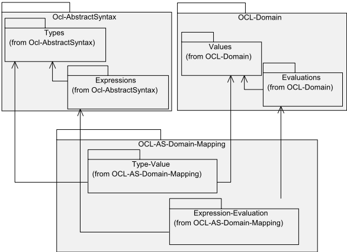

- The Domain package describes the values and evaluations. It is subdivided into two subpackages:
-  The Values package describes the semantic domain. It shows the values OCL expressions may yield as result.
-  The Evaluations package describes the evaluations of OCL expressions. It contains the rules that determine the result value for a given expression.
- The AS-Domain-Mapping package describes the associations of the values and evaluations with elements from the abstract syntax. It is subdivided into two subpackages:
-  The Type-Value package contains the associations between the instances in the semantics domain and the types in the abstract syntax.
-  The Expression-Evaluation package contains the associations between the evaluation classes and the expressions in the abstract syntax.

## 10.2 The Values Package

OCL is an object language. A value can be either an object, which can change its state in time, or a data type, which can not change its state. The model in Figure 10.2 shows the values that form the semantic domain of an OCL expression. The basic type is the Value, which includes both objects and data values. There is a special subtype of Value called UndefinedValue, which is used to represent the undefined value for any Type in the abstract syntax.

Figure 10.3 shows a number of special data values, the collection and tuple values. To distinguish between instances of the Set, Bag, and Sequence types defined in the standard library, and the classes in this package that represent instances in the semantic domain, the names SetTypeValue, BagTypeValue, and SequenceTypeValue are used, instead of SetValue, BagValue, and SequenceValue.

Figure 10.2  - The kernel values in the semantic domain

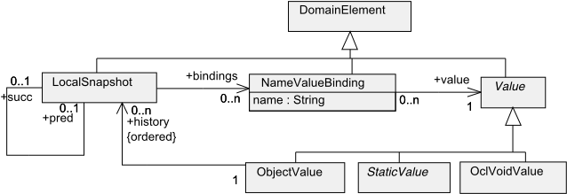

The value resulting from an ocl message expression is shown in Figure 10.4. It links an ocl message value to the snapshot of an object.

## 10.2.1  Definitions of Concepts for the Values Package

The sub clause lists the definitions of concepts in the Values package in alphabetical order.

## BagTypeValue

A bag type value is a collection value that is a multiset of values, where each value may occur multiple times in the bag. The values are unordered. In the metamodel, this list of values is shown as an association from CollectionValue (a generalization of BagTypeValue ) to Element .

## CollectionValue

A collection value is a list of values. In the metamodel, this list of values is shown as an association from CollectionValue to Element .

## Associations

elements The values of the elements in a collection.

## DomainElement

A domain element is an element of the domain of OCL expressions. It is the generic superclass of all classes defined in this clause, including Value and OclExpEval. It serves the same purpose as ModelElement in the UML metamodel.

Figure 10.3  - The collection and tuple values in the semantic domain

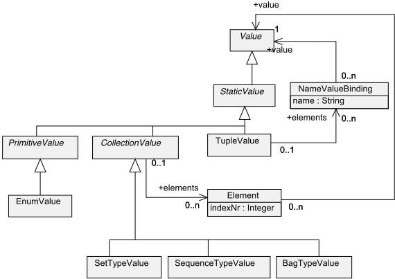

## Element

An element represents a single component of a tuple value, or collection value. An element has an index number and a value. The purpose of the index number is to identify uniquely the position of each element within the enclosing value, when it is used as an element of a SequenceValue.

## LocalSnapshot

A local snapshot is a domain element that holds for one point in time the subvalues of an object value. It is always part of an ordered list of local snapshots of an object value, which is represented in the metamodel by the associations pred , succ, and history . An object value may also hold a sequence of OclMessageValues , which the object value has sent, and a sequence of OclMessageValues , which the object value has received. Both sequences can change in time, therefore they are included in a local snapshot. This is represented by the associations in the metamodel called inputQ , and outputQ .

A local snapshot has two attributes, isPost and isPre , that indicate whether this snapshot is taken at postcondition or precondition time of an operation execution. Within the history of an object value it is always possible to find the local snapshot at precondition time that corresponds with a given snapshot at postcondition time. The association pre (shown in Figure 10.3) is redundant, but added for convenience.

## Associations

| bindings   | The set of name value bindings that hold the changes in time of the subvalues of the associated object value.                                                                                            |
|------------|----------------------------------------------------------------------------------------------------------------------------------------------------------------------------------------------------------|
| outputQ    | The sequence of OclMessageValues that the associated ObjectValue at the certain point in time has sent, and are not yet put through to their targets.                                                    |
| inputQ     | The sequence of OclMessageValues that the associated ObjectValue at the certain point in time has received, but not yet dealt with.                                                                      |
| pred       | The predecessor of this local snapshot in the history of an object value.                                                                                                                                |
| succ       | The successor of this local snapshot in the history of an object value.                                                                                                                                  |
| pre        | If this snapshot is a snapshot at postcondition time of a certain operation execution, then pre is the associated snapshot at precondition time of the same operation in the history of an object value. |

## NameValueBinding

A name value binding is a domain element that binds a name to a value.

## ObjectValue

An object value is a value that has an identity, and a certain structure of subvalues. Its subvalues may change over time, although the structure remains the same. Its identity may not change over time. In the metamodel, the structure is shown as a set of NameValueBindings . Because these bindings may change over time, the ObjectValue is associated with a sequence of LocalSnapshots that hold a set of NameValueBindings at a certain point in time.

## Associations

history The sequence of local snapshots that hold the changes in time of the subvalues of this object value.

Figure 10.4  - The message values in the semantic domain

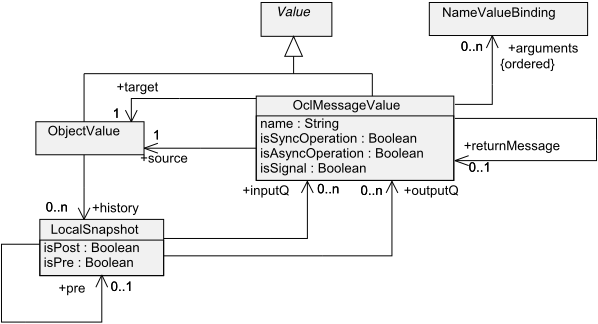

## OclMessageValue

An ocl message value is a value that has as target and as source an object value. An ocl message value has a number of attributes. The name attribute corresponds to the name of the operation called, or signal sent. The isSyncOperation , isAsyncOperation , and isSignal attributes indicate respectively whether the message corresponds to a synchronous operation, an asynchronous operation, or a signal.

## Associations

arguments

source A sequence of name value bindings that hold the arguments of the message from the source to the target.

The object value that has sent this signal.

target The object value for which this signal has been intended.

returnMessage The ocl message value that holds the values of the result and out parameters of a synchronous operation call in its arguments. Is only present if this message represents a synchronous operation call.

## OclVoidValue

An undefined value is a value that represents void or undefined for any type.

## PrimitiveValue

A primitive value is a predefined static value, without any relevant substructure (i.e., it has no parts).

## SequenceTypeValue

A sequence type value is a collection value that is a list of values where each value may occur multiple times in the sequence. The values are ordered by their position in the sequence. In the metamodel, this list of values is shown as an association from CollectionValue (a generalization of SequenceTypeValue ) to Element . The position of an element in the list is represented by the attribute indexNr of Element .

## SetTypeValue

A set type value is a collection value that is a set of elements where each distinct element occurs only once in the set. The elements are not ordered. In the metamodel, this list of values is shown as an association from CollectionValue (a generalization of SetTypeValue ) to Element .

## StaticValue

A static value is a value that will not change over time. 1

## TupleValue

A tuple value (also known as record value) combines values of different types into a single aggregate value. The components of a tuple value are described by tuple parts each having a name and a value. In the metamodel, this is shown as an association from TupleValue to NameValueBinding .

## Associations

elements The names and values of the elements in a tuple value.

## Value

A part of the semantic domain.

## 10.2.2  Well-formedness Rules for the Values Package

## BagTypeValue

No additional well-formedness rules.

## CollectionValue

No additional well-formedness rules.

## DomainElement

No additional well-formedness rules.

## Element

No additional well-formedness rules.

1. As StaticValue is the counterpart of the DataType concept in the abstract syntax, the name DataValue would be preferable. StaticValue is used for historical reasons concerning past versions of UML.

## EnumValue

No additional well-formedness rules.

## LocalSnapshot

- [1] Only one of the attributes isPost and isPre may be true at the same time.

context LocalSnapshot

```
inv: isPost implies isPre = false inv: isPre implies isPost = false
```

- [2] Only if a snapshot is a postcondition snapshot does it have an associated precondition snapshot.

context LocalSnapshot

```
inv: isPost implies pre->size() = 1
```

```
inv: not isPost implies pre->size() = 0 inv: self.pre->size() = 1 implies self.pre.isPre = true
```

## NameValueBinding

No additional well-formedness rules.

## ObjectValue

- [1] The history of an object is ordered. The first element does not have a predecessor, the last does not have a successor.

```
context ObjectValue
```

```
inv: history->oclIsTypeOf( Sequence(LocalSnapShot) ) inv: history->last().succ->size() = 0 inv: history->first().pre->size() = 0
```

## OclMessageValue

- [1] Only one of the attributes isSyncOperation , isAsyncOperation , and isSignal may be true at the same time.

context OclMessageValue

```
inv: isSyncOperation implies isAsyncOperation = false and isSignal = false inv: isAsyncOperation implies isSyncOperation = false and isSignal = false inv: isSignal implies isSyncOperation = false and isAsyncOperation = false
```

- [2] The return message is only present if, and only if, the ocl message value is a synchronous operation call.

```
context OclMessageValue inv: isSyncOperation implies returnMessage->size() = 1
```

```
inv: not isSyncOperation implies returnMessage->size() = 0
```

## OclVoidValue

No additional well-formedness rules.

## PrimitiveValue

No additional well-formedness rules.

## SequenceTypeValue

- [1] All elements belonging to a sequence value have unique index numbers.

```
context SequenceTypeValue
```

```
inv: self.elements->isUnique(e : Element | e.indexNr)
```

## SetTypeValue

- [1] All elements belonging to a set value have unique values.

```
context SetTypeValue
```

```
inv: self.elements->isUnique(e : Element | e.value)
```

## StaticValue

No additional well-formedness rules.

## TupleValue

- [1] All elements belonging to a tuple value have unique names.

```
context TupleValue
```

```
inv: self.elements->isUnique(e : NameValueBinding | e.name)
```

## Value

No additional well-formedness rules.

## 10.2.3  Additional Operations for the Values Package

## LocalSnapshot

- [1] The operation allPredecessors returns the collection of all snapshots before a snapshot, allSuccessors returns the collection of all snapshots after a snapshot.

```
context LocalSnapshot def: allPredecessors() : Sequence(LocalSnapshot) = if pred->notEmpty() then pred->union(pred.allPredecessors()) else Sequence {} endif def: allSuccessors() : Sequence(LocalSnapshot) = if succ->notEmpty() then succ->union(succ.allSuccessors()) else Sequence {} endif
```

## ObjectValue

- [1] The operation getCurrentValueOf results in the value that is bound to the name parameter in the bindings of the latest snapshot in the history of an object value. Note that the value may be the UndefinedValue.



```
context ObjectValue::getCurrentValueOf(n: String): Value  pre: -- none  post: result = history->last().bindings->any(name = n).value
```

- [2] The operation outgoingMessages results in the sequence of OclMessageValues that have been in the output queue of the object between the last postcondition snapshot and its associated precondition snapshot.

context OclExpEval::outgoingMessages() : Sequence( OclMessageValue )

```
pre: -- none post: let end: LocalSnapshot = history->last().allPredecessors()->select( isPost = true )->first() in let start: LocalSnapshot = end.pre  in let inBetween: Sequence( LocalSnapshot ) = start.allSuccessors()->excluding( end.allSuccessors())->including( start ) in result = inBetween.outputQ->iterate ( -- creating a sequence with all elements present once m : oclMessageValue; res: Sequence( OclMessageValue ) = Sequence{} | if not res->includes( m ) then res->append( m ) else res endif )
```

endif

## TupleValue

- [1] The operation getValueOf results in the value that is bound to the name parameter in the tuple value. context TupleValue::getValueOf(n: String): Value

```
pre: -- none post: result = elements->any(name = n).value
```

## 10.2.4  Overview of the Values Package

Figure 10.5 shows an overview of the inheritance relationships between the classes in the Values package.

Figure 10.5  - The inheritance tree of classes in the Values package

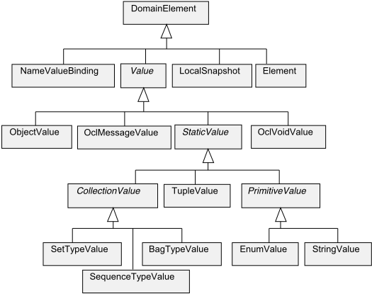

## 10.3 The Evaluations Package

This sub clause defines the evaluations of OCL expressions. The evaluations package is a mirror image of the expressions

package from the abstract syntax. Figure 10.6 shows how the environment of an OCL expression evaluation is structured. The environment is determined by the placement of the expression within the UML model as discussed in Clause 12 ('The Use of Ocl Expressions in UML Models'). The calculation of the environment is done in the ExpressionInOclEval, which will be left undefined here.

Figure 10.6  - The environment for ocl evaluations

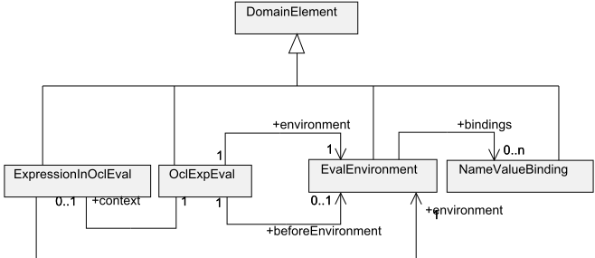

Figure 10.6 shows the core part of the Evaluations package. In Figure 10.7 the various subtypes of OclExpEval are defined. An OclExpEval always has a result value, and a name space that binds names to values.

Figure 10.7 -  Domain model for ocl evaluations

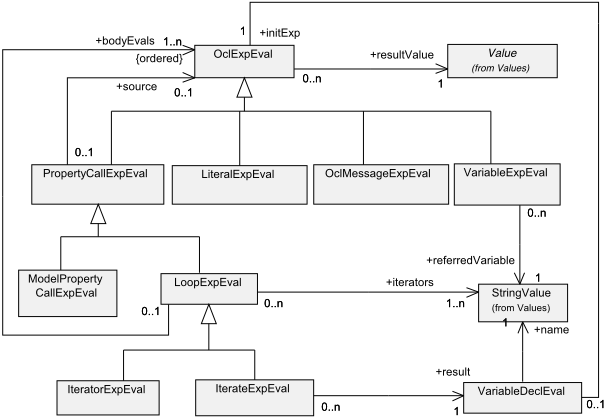

Most of the OCL expressions can be simply evaluated , i.e., their value can be determined based on a non-changing set of name value bindings. Operation call expressions, however, need the execution of the called operation. The semantics of the execution of an operation will be defined in the UML infrastructure. For our purposes it is enough to assume that an operation execution will add to the environment of an OCL expression the name 'result' bound to a certain value. In order not to become tangled in a mix of terms, the term evaluation is used in the following to denote both the 'normal' OCL evaluations and the executions of operation call expressions.

In 10.3.1.1 to 10.3.1.5 special subclasses of OclExpEval will be defined.

## 10.3.1  Definitions of Concepts for the Evaluations Package

This sub clause lists the definitions of concepts in the Evaluations package in alphabetical order.

## EvalEnvironment

An EvalEnvironment is a set of NameValueBindings that form the environment in which an OCL expression is evaluated. An EvalEnvironment has three operations that are defined in 'Additional Operations of the Evaluations Package.'

## Associations

bindings The NameValueBindings that are the elements of this name space.

## IterateExpEval

An IterateExpEval is an expression evaluation that evaluates its body expression for each element of a collection value, and accumulates a value in a result variable. It evaluates an IterateExp.

## IteratorExpEval

An IteratorExp is an expression evaluation that evaluates its body expression for each element of a collection.

## ExpressionInOclEval

An ExpressionInOclEval is an evaluation of the context of an OCL expression. It is the counterpart in the domain of the ExpressionInOcl metaclass defined in Clause 12 ('The Use of Ocl Expressions in UML Models'). It is merely included here to be able to determine the environment of an OCL expression.

## LiteralExpEval

A Literal expression evaluation is an evaluation of a Literal expression.

## LoopExpEval

A loop expression evaluation is an evaluation of a Loop expression.

## Associations

| bodyEvals   | The oclExpEvaluations that represent the evaluation of the body expression for each element in the source collection.   |
|-------------|-------------------------------------------------------------------------------------------------------------------------|
| iterators   | The names of the iterator variables in the loop expression.                                                             |

## ModelPropertyCallExpEval

A model property call expression evaluation is an evaluation of a ModelPropertyCallExp. In Figure 10.8 the various subclasses of ModelPropertyCallExpEval are shown.

## Operations

atPre The atPre operation returns true if the property call is marked as being evaluated at precondition time.

## OclExpEval

An ocl expression evaluation is an evaluation of an OclExpression . It has a result value, and it is associated with a set of name-value bindings called environment . These bindings represent the values that are visible for this evaluation, and the names by which they can be referenced. A second set of name-value bindings is used to evaluate any sub expression for which the operation atPre returns true, called beforeEnvironment .

Note that as explained in Clauses 9 ('Concrete Syntax') and 12 ('The Use of Ocl Expressions in UML Models') these bindings need to be established, based on the placement of the OCL expression within the UML model. A binding for an invariant will not need the beforeEnvironment, and it will be different from a binding of the same expression when used as precondition.

## Associations

| environment       | The set of name value bindings that is the context for this evaluation of an ocl expression.                                                                                      |
|-------------------|-----------------------------------------------------------------------------------------------------------------------------------------------------------------------------------|
| beforeEnvironment | The set of name value bindings at the precondition time of an operation, to evaluate any sub expressions of type ModelPropertyCallExp for which the operation atPre returns true. |
| resultValue       | The value that is the result of evaluating the OclExpression .                                                                                                                    |

## OclMessageExpEval

An ocl message expression evaluation is defined in sub clause 10.3.1.3, but included in this diagram for completeness.

## PropertyCallExpEval

A property call expression evaluation is an evaluation of a PropertyCallExp .

## Associations

source The result value of the source expression evaluation is the instance that performs the property call.

## VariableDeclEval

A variable declaration evaluation represents the evaluation of a variable declaration. Note that this is not a subtype of OclExpEval, therefore it has no resultValue.

## Associations

name

initExp The name of the variable.

The value that will be initially bound to the name of this evaluation.

## VariableExpEval

A variable expression evaluation is an evaluation of a VariableExp , which in effect is the search of the value that is bound to the variable name within the environment of the expression.

## Associations

variable The name that refers to the value that is the result of this evaluation.

## 10.3.1.1 Model PropertyCall Evaluations

The subtypes of ModelPropertyCallExpEval are shown in Figure 10.8, and are defined in this sub clause in alphabetical order.

Figure 10.8 - Domain model for ModelPropertyCallExpEval and subtypes

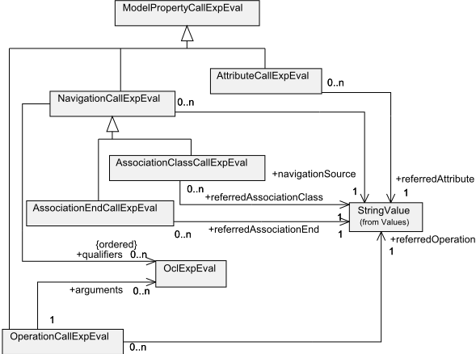

## AssociationClassCallExpEval

An association end call expression evaluation is an evaluation of an AssociationClassCallExp, which in effect is the search of the value that is bound to the associationClass name within the expression environment.

## Associations

referredAssociationClass

## AssociationEndCallExpEval

An association end call expression evaluation is an evaluation of an AssociationEndCallExp, which in effect is the search of the value that is bound to the associationEnd name within the expression environment.

The name of the AssociationClass to which the corresponding AssociationClassCallExp is a reference.

## Associations

referredAssociationEnd

## AttributeCallExpEval

An attribute call expression evaluation is an evaluation of an AttributeCallExp , which in effect is the search of the value that is bound to the attribute name within the expression environment.

## Associations

referredAttribute The name of the Attribute to which the corresponding AttributeCallExp is a reference.

## NavigationCallExpEval

A navigation call expression evaluation is an evaluation of a NavigationCallExp .

## Associations

navigationSource

## OperationCallExpEval

An operation call expression evaluation is an evaluation of an OperationCallExp .

## Associations

arguments The arguments denote the arguments to the operation call. This is only useful when the operation call is related to an Operation that takes parameters.

referredOperation The name of the Operation to which this OperationCallExp is a reference. This is an Operation of a Classifier that is defined in the UML model.

## 10.3.1.2 If Expression Evaluations

If expression evaluations are shown in Figure 10.9 and defined in this sub clause.

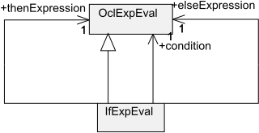

The name of the AssociationEnd to which the corresponding NavigationCallExp is a reference.

The name of the AssociationEnd of which the corresponding NavigationCallExp is the source.

Figure 10.9 - Domain model for if expression

## IfExpEval

An IfExpEval is an evaluation of an IfExp.

## Associations

condition

thenExpression The OclExpEval that evaluates the condition of the corresponding IfExpression.

The OclExpEval that evaluates the thenExpression of the corresponding IfExpression.

elseExpression The OclExpEval that evaluates the elseExpression of the corresponding IfExpression.

## 10.3.1.3 Ocl Message Expression Evaluations

Ocl message expressions are used to specify the fact that an object has, or will send some message to another object at some moment in time. Ocl message expression evaluations are shown in Figure 10.10, and defined in this sub clause.

Figure 10.10 - Domain model for message evaluation

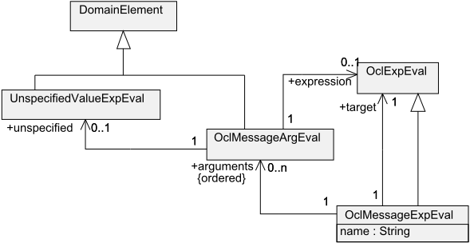

## OclMessageArgEval

An ocl message argument evaluation is an evaluation of an OclMessageArg . It represents the evaluation of the actual parameters to the Operation or Signal . An argument of a message expression is either an ocl expression, or a variable declaration.

## Associations

| variable   | The OclExpEval that represents the evaluation of the argument, in case the argument is a VariableDeclaration .   |
|------------|------------------------------------------------------------------------------------------------------------------|
| expression | The OclExpEval that represents the evaluation of the argument, in case the argument is an OclExpression .        |

## OclMessageExpEval

An ocl message expression evaluation is an evaluation of an OclMessageExp . The only demand we can put on the ocl message expression is that the OclMessageValue it represents (either an operation call, or a UML signal), has been at some time between 'now' and a reference point in time in the output queue of the sending instance. The 'now' timepoint is the point in time at which this evaluation is performed. This point is represented by the environment link of the OclMessageExpEval (inherited from OclExpEval ).

## Associations

| target    | The OclExpEval that represents the evaluation of the target instance or instances on which the action is performed.   |
|-----------|-----------------------------------------------------------------------------------------------------------------------|
| arguments | The OclMessageArgEvals that represent the evaluation of the actual parameters to the Operation or Message .           |

## UnspecifiedValueExpEval

An unspecified value expression evaluation is an evaluation of an UnSpecifiedValueExp. It results in a randomly picked instance of the type of the expression.

## 10.3.1.4 Literal Expression Evaluations

This sub clause defines the different types of literal expression evaluations in OCL, as shown in Figure 10.11. Again it is a complete mirror image of the abstract syntax.

Figure 10.11 - Domain model for literal expressions

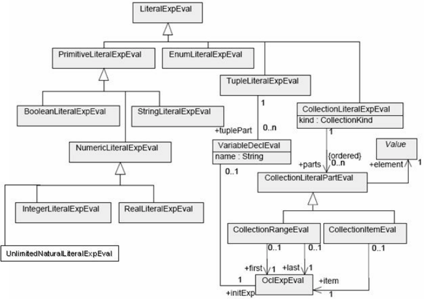

## BooleanLiteralExpEval

A Boolean literal expression evaluation represents the evaluation of a Boolean literal expression.

## CollectionItemEval

A collection item evaluation represents the evaluation of a collection item.

## CollectionLiteralExpEval

A collection literal expression evaluation represents the evaluation of a collection literal expression.

## CollectionLiteralPartEval

A collection literal part evaluation represents the evaluation of a collection literal part.

## CollectionRangeEval

A collection range evaluation represents the evaluation of a collection range.

## EnumLiteralExpEval

An enumeration literal expression evaluation represents the evaluation of an enumeration literal expression.

## IntegerLiteralExpEval

A integer literal expression evaluation represents the evaluation of an integer literal expression.

## NumericLiteralExpEval

A numeric literal expression evaluation represents the evaluation of a numeric literal expression.

## PrimitiveLiteralExpEval

A primitive literal expression evaluation represents the evaluation of a primitive literal expression.

## RealLiteralExpEval

A real literal expression evaluation represents the evaluation of a real literal expression.

## StringLiteralExpEval

A string literal expression evaluation represents the evaluation of a string literal expression.

## TupleLiteralExpEval

A tuple literal expression evaluation represents the evaluation of a tuple literal expression.

## TupleLiteralExpPartEval

A tuple literal expression part evaluation represents the evaluation of a tuple literal expression part.

## UnlimitedNaturalLiteralExpEval

An unlimited natural literal expression evaluation represents the evaluation of an unlimited natural literal expression.

## 10.3.1.5 Let Expressions

Let expressions define new variables. The structure of the let expression evaluation is shown in Figure 10.12.

Figure 10.12  - Domain model for let expression

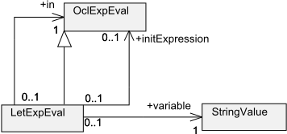

## LetExpEval

A Let expression evaluation is an evaluation of a Let expression that defines a new variable with an initial value. A Let expression evaluation changes the environment of the in expression evaluation.

## Associations

| variable       | The name of the variable that is defined.                                 |
|----------------|---------------------------------------------------------------------------|
| in             | The expression in whose environment the defined variable is visible.      |
| initExpression | The expression that represents the initial value of the defined variable. |

## 10.3.2  Well-formedness Rules of the Evaluations Package

The metaclasses defined in the evaluations package have the following well-formedness rules. These rules state how the result value is determined. This defines the semantics of the OCL expressions.

## AssociationClassCallExpEval

- [1] The result value of an association class call expression is the value bound to the name of the association class to which it refers. Note that the determination of the result value when qualifiers are present is specified in 10.4.2.1, Well-formedness rules for the AS-Domain-Mapping.exp-eval Package. The operation getCurrentValueOf is an operation defined on ObjectValue in 10.2.3, Additional Operations for the Values Package.

```
context AssociationClassCallExpEval inv: qualifiers->size = 0 implies resultV alue = source.resultValue.getCurrentValueOf(referredAssociationClass.name)
```

## AssociationEndCallExpEval

- [1] The result value of an association end call expression is the value bound to the name of the association end to which it refers. Note that the determination of the result value when qualifiers are present is specified in 10.4.2.1, Well-formedness rules for the AS-Domain-Mapping.exp-eval Package.

context  AssociationEndCallExpEval inv:

```
qualifiers->size = 0 implies resultValue = source.resultValue.getCurrentValueOf(referredAssociationEnd.name)
```

## AttributeCallExpEval

- [1] The result value of an attribute call expression is the value bound to the name of the attribute to which it refers.

context AttributeCallExpEval inv:

```
resultValue = if source.resultValue->oclIsTypeOf( ObjectValue) then source.resultValue->oclAsType( ObjectValue ) .getCurrentV alueOf(referredAttribute.value) else -- must be a tuple value source.resultValue->oclAsType( TupleValue ) .getV alueOf(referredAttribute.value)
```

endif

## BooleanLiteralExpEval

No extra well-formedness rules. The manner in which the resultValue is determined is given in 10.4.2.1, Well-formedness rules for the AS-Domain-Mapping.exp-eval Package.

## CollectionItemEval

- [1] The value of a collection item is the result value of its item expression. The environment of this item expression is equal to the environment of the collection item evaluation.

```
context CollectionItemEval inv: element = item.resultValue inv: item.environment = self.environment
```

## CollectionLiteralExpEval

- [1] The environment of its parts is equal to the environment of the collection literal expression evaluation.

context CollectionLiteralExpEval

inv: parts-&gt;forAll( p | p.environment = self.environment )

- [2] The result value of a collection literal expression evaluation is a collection literal value, or one of its subtypes.

context CollectionLiteralExpEval inv:

resultValue.oclIsKindOf( CollectionValue )

- [3] The number of elements in the result value is equal to the number of elements in the collection literal parts, taking into account that a collection range can result in many elements.

context CollectionLiteralExpEval inv:

resultValue.elements-&gt;size() = parts-&gt;collect( element )-&gt;size()-&gt;sum()

- [4] The elements in the result value are the elements in the collection literal parts, taking into account that a collection range can result in many elements.

context CollectionLiteralExpEval inv:

```
let allElements = parts->collect( element )->flatten() in Sequence{1..allElements->size()}->forAll( i: Integer | resultValue.elements->at(i).name = íí and resultValue.elements->at(i).value = allElements->at(i) and self.kind = CollectionKind::Sequence implies resultValue.elements->at(i).indexNr = i )
```

## CollectionLiteralPartEval

No extra well-formedness rules. The manner in which its value is determined is given by its subtypes.

## CollectionRangeEval

- [1] The value of a collection range is the range of integer numbers between the result value of its first expression and its last expression.

context CollectionRangeEval

```
inv: element.oclIsTypeOf( Sequence(Integer) ) and element = getRange( first->oclAsType(Integer), last->oclAsType(Integer) )
```

## EnumLiteralExpEval

No extra well-formedness rules.

## EvalEnvironment

- [1] All names in a name space must be unique.

```
context EvalEnvironment inv: bindings->collect(name)->forAll( name: String | bindings->collect(name)->isUnique(name))
```

## ExpressionInOclEval

No extra well-formedness rules.

## IfExpEval

- [1] The result value of an if expression is the result of the thenExpression if the condition is true, otherwise it is the result of the elseExpression if the condition is false, otherwise the result is invalid.

context IfExpEval inv:

```
resultValue = if condition then thenExpression.resultValue else elseExpression.resultValue endif
```

- [2] The environment of the condition, thenExpression and elseExpression are equal to the environment of the if expression.

context IfExpEval

```
inv: condition.environment = environment inv: thenExpression.environment = environment inv: elseExpression.environment = environment
```

## IntegerLiteralExpEval

No extra well-formedness rules. The manner in which the resultValue is determined is given in 10.4.2.1, Well-formedness rules for the AS-Domain-Mapping.exp-eval Package.

## IterateExpEval

- [1] All sub evaluations have a different environment. The first sub evaluation will start with an environment in which all iterator variables are bound to the first element of the source, plus the result variable that is bound to the init expression of the variable declaration in which it is defined.
- [2] The environment of any sub evaluation is the same environment as the one from its previous sub evaluation, taking  into account the bindings of the iterator variables, plus the result variable which is bound to the result value of the last

```
context IterateExpEval inv: let bindings: Sequence( NameValueBinding ) = iterators->collect( i | NameValueBinding( i.value, source->asSequence()->first() ) in bodyEvals->at(1).environment = self.environment->addAll( bindings ) ->add( NameValueBinding( result.name, result.initExp.resultValue ))
```



```
sub evaluation. inv: let SS: Integer = source.value->size() in if iterators->size() = 1 then Sequence{2..SS}->forAll( i: Integer | bodyEvals->at(i).environment = bodyEvals->at(i-1).environment ->replace( NameValueBinding( iterators->at(1).varName, source.value->asSequence()->at(i))) ->replace( NameValueBinding( result.varName, bodyEvals->at(i-1).resultV alue ))) else -- iterators->size() = 2 Sequence{2..SS*SS}->forAll( i: Integer | bodyEvals->at(i).environment = bodyEvals->at(i-1).environment ->replace( NameValueBinding( iterators->at(1).varName, source->asSequence()->at(i.div(SS) + 1) )) ->replace( NameValueBinding( iterators->at(2).varName, source.value->asSequence()->at(i.mod(SS)))) ->replace( NameValueBinding( result.varName, bodyEvals->at(i-1).resultV alue )))
```

endif

- [3] The result value of an IteratorExpEval is the result of the last of its body evaluations.

context IteratorExpEval

```
inv: resultValue = bodyEvals->last().resultValue
```

## IteratorExpEval

The IteratorExp in the abstract syntax is merely a placeholder for the occurrence of one of the predefined iterator expressions in the standard library (see Clause 11 'The OCL Standard Library'). These predefined iterator expressions are all defined in terms of an iterate expression. The semantics defined for the iterate expression are sufficient to define the iterator expression. No well-formedness rules for IteratorExpEval are defined.

## LetExpEval

- [1] A let expression results in the value of its in expression.
- [2] A let expression evaluation adds a name value binding that binds the variable to the value of its initExpression, to the environment of its in expression.

```
context LetExpEval inv: resultValue = in.resultValue
```

context LetExpEval

```
inv: in.environment = self.environment ->add( NameValueBinding( variable.varName, variable.initExpression.resultValue ))
```

- [3] The environment of the initExpression is equal to the environment of this Let expression evaluation.

context LetExpEval

```
inv: initExpression.environment = self.environment
```

## LiteralExpEval

No extra well-formedness rules.

## LoopExpEval

The result value of a loop expression evaluation is determined by its subtypes.

- [1] There is an OclExpEval (a sub evaluation) for combination of values for the iterator variables. Each iterator variable will run through every element of the source collection.
- [2] All sub evaluations (in the sequence bodyEvals ) have a different environment. The first sub evaluation will start with an environment in which all iterator variables are bound to the first element of the source. Note that this is an  arbitrary choice, one could easily start with the last element of the source, or any other combination.
- [3] All sub evaluations (in the sequence bodyEvals ) have a different environment. The environment is the same  environment as the one from the previous bodyEval, where the iterator variable or variables are bound to the subsequent elements of the source.

```
context LoopExpEval inv: bodyEvals->size() = if iterators->size() = 1 then source.value->size() else -- iterators->size() = 2 source.value->size() * source.value->size() endif
```

```
context LoopExpEval inv: let bindings: Sequence( NameValueBindings ) = iterators->collect( i | NameValueBinding( i.varName, source->asSequence()->first() ) ) in bodyEvals->at(1).environment = self.environment->addAll( bindings )
```

```
context LoopExpEval inv: let SS: Integer = source.value->size() in if iterators->size() = 1 then Sequence{2..SS}->forAll( i: Integer | bodyEvals->at(i).environment = bodyEvals->at(i-1).environment ->replace( NameValueBinding( iterators->at(1).varName, source.value->asSequence()->at(i) ))) else -- iterators->size() = 2 Sequence{2..SS*SS}->forAll( i: Integer | bodyEvals->at(i).environment = bodyEvals->at(i-1).environment ->replace( NameValueBinding( iterators->at(1).varName, source->asSequence()->at(i.div(SS) + 1) )) ->replace( NameValueBinding( iterators->at(2).varName, source.value->asSequence()->at(i.mod(SS)) )) ) endif
```







## ModelPropertyCallExpEval

Result value is determined by its subtypes.

- [1] The environment of a ModelPropertyCall expression is equal to the environment of its source.

```
context ModelPropertyCallExpEval inv: environment = source.environment
```

## NavigationCallExpEval

- [1] When the navigation call expression has qualifiers, the result value is limited to those elements for which the qualifier value equals the value of the attribute.
2. -- To be done.

## NumericLiteralExpEval

No extra well-formedness rules. Result value is determined by its subtypes.

## OclExpEval

The result value of an ocl expression is determined by its subtypes.

- [1] The environment of an OclExpEval is determined by its context, i.e., the ExpressionInOclEval.

context OclExpEval

```
inv: environment = context.environment
```

- [2] Every OclExpEval has an environment in which at most one self instance is known.

context OclExpEval

```
inv: environment->select( name = 'self' )->size() = 1
```

## OclMessageExpEval

- [1] The result value of an ocl message expression is an ocl message value.

context OclMessageExpEval

```
inv: resultValue->isTypeOf( OclMessageValue )
```

- [2] The result value of an ocl message expression is the sequence of the outgoing messages of the 'self' object that  matches the expression. Note that this may result in an empty sequence when the expression does not match any of the outgoing messages.

```
context OclMessageExpEval inv: resultValue = environment.getValueOf( 'self' ).outgoingMessages->select( m | m.target = target.resultValue and m.name = self.name and self.arguments->forAll( expArg: OclMessageArgEval | not expArg.resultValue.oclIsUndefined() implies m.arguments->exists( messArg | messArg.value = expArg.value )))
```





- [3] The source of the resulting ocl message value is equal to the 'self' object of the ocl message expression.
- [4] The isSent attribute of the resulting ocl message value is true only if the message value is in the outgoing messages of the 'self' object.

```
context OclMessageExpEval  inv: resultValue.source = environment.getValueOf( 'self' )
```

context OclMessageExpEval

```
inv: if resultValue.oclIsUndefined() then resultValue.isSent = false else resultValue.isSent = true endif
```

- [5] The target of an ocl message expression is an object value.

context OclMessageExpEval

```
inv: target.resultValue->isTypeOf( ObjectValue )
```

- [6] The environment of all arguments, and the environment of the target expression are equal to the environment of this ocl message value.

context OclMessageExpEval

```
inv: arguments->forAll( a | a.environment = self.environment ) inv: target.environment = self.environment
```

## OclMessageArgEval

- [1] An ocl message argument evaluation has either an ocl expression evaluation, or an unspecified value expression evaluation, not both.

context OclMessageArgEval

```
inv: expression->size() = 1 implies unspecified->size() = 0 inv: expression->size() = 0 implies unspecified->size() = 1
```

- [2] The result value of an ocl message argument is determined by the result value of its expression, or its unspecified value expression.

context OclMessageArgEval inv:

```
if expression->size() = 1 then resultValue = expression.resultValue else resultValue = unspecified.resultValue endif
```

- [3] The environment of the expression and unspecified value are equal to the environment of this ocl message argument.

context OclMessageArgEval

```
inv: expression.environment = self.environment
```

```
inv: unspecified.environment = self.environment
```









## OperationCallExpEval

The definition of the semantics of the operation call expression depends on the definition of operation call execution in the UML semantics. This is part of the UML infrastructure specification, and will not be defined here. For the semantics of the OperationCallExp it suffices to know that the execution of an operation call will produce a result of the correct type, as specified in 10.4, The AS-Domain-Mapping Package.

- [1] The environments of the arguments of an operation call expression are equal to the environment of this call.

context  OperationCallExpEval inv:

```
arguments->forall( a | a.environment = self.environment )
```

## PropertyCallExpEval

The result value and environment are determined by its subtypes.

- [1] The environment of the source of a property call expression is equal to the environment of this call.

context  PropertyCallExpEval inv:

source.environment = self.environment

## PrimitiveLiteralExpEval

No extra well-formedness rules. The result value is determined by its subtypes.

## RealLiteralExpEval

No extra well-formedness rules. The manner in which the resultValue is determined is given in 10.4.2.1, Well-formedness rules for the AS-Domain-Mapping.exp-eval Package.

## StringLiteralExpEval

No extra well-formedness rules. The manner in which the resultValue is determined is given in 10.4.2.1, Well-formedness rules for the AS-Domain-Mapping.exp-eval Package.

## TupleLiteralExpEval

- [1] The result value of a tuple literal expression evaluation is a tuple value whose elements correspond to the parts of the tuple literal expression evaluation.

context TupleLiteralExpEval inv:

```
resultValue.oclIsTypeOf( TupleValue ) and tuplePart->size() = resultValue.elements->size() and Sequence{1..tuplePart->size()}->forAll( i: Integer | resultValue.elements->at(i).name = tuplePart.name and resultValue.elements->at(i).value = tuplePart.initExpression.resultValue )
```

## UnlimitedNaturalLiteralExpEval

No extra well-formedness rules. The manner in which the resultValue is determined is given in 10.4.2.1, Well-formedness rules for the AS-Domain-Mapping.exp-eval Package.



## UnspecifiedValueExpEval

The result of an unspecified value expression is a randomly picked instance of the type of the expression. This rule will be defined in 10.4.2.1, Well-formedness rules for the AS-Domain-Mapping.exp-eval Package.

## VariableDeclEval

No extra well-formedness rules.

## VariableExpEval

- [1] The result of a VariableExpEval is the value bound to the name of the variable to which it refers.

context VariableExpEval inv:

resultValue = environment.getValueOf(referredVariable.varName)

## 10.3.3  Additional Operations of the Evaluations Package

## EvalEnvironment

- [1] The operation getValueOf results in the value that is bound to the name parameter in the bindings of a name space. Note that the value may be the UndefinedValue.
- [2] The operation replace replaces the value of a name, by the value given in the nvb parameter.

```
context EvalEnvironment::getValueOf(n: String): Value pre: -- none post: result = bindings->any(name = n).value
```

context EvalEnvironment::replace(nvb: NameValueBinding): EvalEnvironment

```
pre: -- none post: result.bindings = self.bindings ->excluding( self.bindings->any( name = nvb.name) )->including( nvb )
```

- [3] The operation add adds the name and value indicated by the NameValueBinding given by the nvb parameter.
- [4] The operation addAll adds all NameValueBindings in the nvbs parameter.

```
context EvalEnvironment::add(nvb: NameValueBinding): EvalEnvironment pre: -- none post: result.bindings = self.bindings->including( nvb )
```

context EvalEnvironment::add(nvbs: Collection(NameValueBinding)): EvalEnvironment

pre: -- none

post: result.bindings = self.bindings-&gt;union( nvbs )

## CollectionRangeEval

- [1] The operation getRange() returns a sequence of integers that contains all integer in the collection range.

context CollectionRangeEval::getRange(first, last: Integer): Sequence(Integer)

```
pre: -- none
```



```
post: result = if first = last then  first->asSequence()  else  first->asSequence()->union(getRange(first + 1, last)) endif
```

## 10.3.4  Overview of the Values Package

Figure 10.13 shows an overview of the inheritance relationships between the classes in the Values package.

Figure 10.13 - The inheritance tree of classes in the Evaluations package

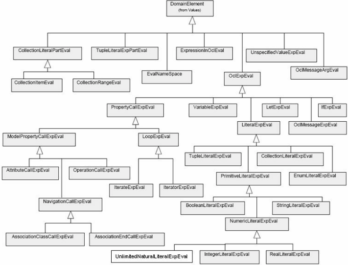

## 10.4 The AS-Domain-Mapping Package

Figure 10.14 shows the associations between the abstract syntax concepts and the domain concepts defined in this clause. Each domain concept has a counterpart called model in the abstract syntax. Each model has one or more instances in the semantic domain. Note that in particular every OCL expression can have more than one evaluation. Still every evaluation has only one value. For example, the 'asSequence' applied to a Set may have n! evaluations, which each give a different permutation of the elements in the set, but each evaluation has exactly one result value.



Figure 10.14 - Associations between values and the types defined in the abstract syntax

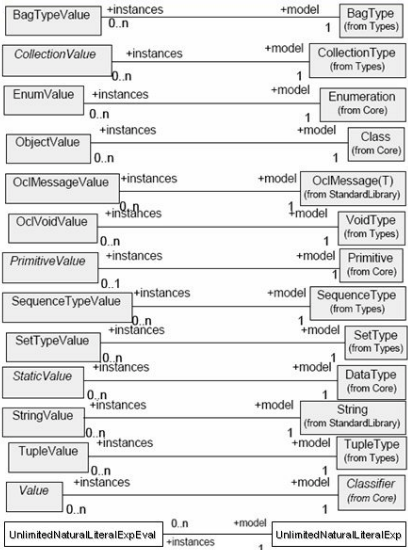

AssociationClassCallExpEval AssociationClassCallExp

AssociationEndCallExpEval AssociationEndCallExp

AttributeCallExpEval AttributeCallExp

BooleanLiteralExpEval

CollectionItemEval BooleanLiteralExp

+model

1

1

+model

1

1

+model

1

1

+model

1

1

+model

1

1

+model

+instances

0..n 0..n

+instances

0..n 0..n

+instances

0..n 0..n

+instances

0..n 0..n

+instances

0..n 0..n CollectionItem

CollectionLiteralExpEval CollectionLiteralExp

CollectionLiteralPartEval

CollectionRangeEval

EnumLiteralExpEval

IfExpEval

+instances

0..n 0..n

IntegerLiteralExpEval EnumLiteralExp CollectionLiteralPart CollectionRange

1

1

+model

1

1

+model IfExp

+model

1

1

IntegerLiteralExp

IterateExpEval IterateExp

IteratorExpEval IteratorExp

LetExpEval LetExp

LiteralExpEval LiteralExp

LoopExpEval LoopExp

+instances

0..n 0..n

+instances

0..n 0..n

+instances

0..n 0..n

+instances

0..n 0..n

+instances

0..n 0..n

+instances

0..n 0..n

+instances

0..n 0..n +instances

0..n 0..n

+instances

0..n 0..n +instances

0..n 0..n

ModelPropertyCallExpEval

1

1

+model

1 1

+model

1 1 +model

1

1

+model

1 1 +model

1

1

+model ModelPropertyCallExp

NavigationCallExpEval

+instances

0..n 0..n +instances

0..n 0..n

NumericLiteralExpEval

+instances

+instances

OclExpEval

0..n 0..n

OclMessageArgEval

OclMessageExpEval

OperationCallExpEval

PrimitiveLiteralExpEval

PropertyCallExpEval

0..n 0..n

0..n 0..n NavigationCallExp

1 1 +model

1 +model 1

1 +model 1

1 1

+instances

0..n 0..n

1 1

+instances NumericLiteralExp OclExpression

1

1

+model

+model

+instances

0..n 0..n

+instances

0..n +instances 0..n

0..n +instances 0..n

0..n +instances 0..n

0..n +instances 0..n

RealLiteralExpEval

StringLiteralExpEval

TupleLiteralExpEval

0..n +instances 0..n

UnspecifiedValueExpEval

+instances

VariableExpEval

0..n 0..n

0..n 0..n

+model

+model OclMessageArg OclMessageExp OperationCallExp

1

1

PrimitiveLiteralExp

+model

1

PropertyCallExp

1

1 +model 1

RealLiteralExp

1 +model 1

1 +model 1

StringLiteralExp

TupleLiteralExp

1 +model 1

UnspecifiedValueExp

1 +model 1

VariableExp

1

1

+model

1

1

+model

1

1

Figure 10.15 - Associations between Evaluation and Abstact Syntax Types

## 10.4.1  Well-formedness rules for the AS-Domain-Mapping.type-value Package

## CollectionValue

- [1] All elements in a collection value must have a type that conforms to the elementType of its corresponding CollectionType.

context CollectionValue inv:

elements-&gt;forAll( e: Element | e.value.model.conformsTo( model.elementType ) )

## DomainElement

No additional well-formedness rules.

## Element

No additional well-formedness rules.

## EnumValue

No additional well-formedness rules.

## ObjectValue

- [1] All bindings in an object value must correspond to attributes or associations defined in the object's Classifier.

context ObjectValue inv:

```
history->forAll( snapshot | snapshot.bindings->forAll( b | self.model.allAttributes()->exists (attr | b.name = attr.name) or self.model.allAssociationEnds()->exists ( role | b.name = role.name) ) )
```

## OclMessageValue

No additional well-formedness rules.

## PrimitiveValue

No additional well-formedness rules.

## SequenceTypeValue

No additional well-formedness rules.

## SetTypeValue

No additional well-formedness rules.

## StaticValue

No additional well-formedness rules.

## TupleValue

- [1] The elements in a tuple value must have a type that conforms to the type of the corresponding tuple parts.

```
context TupleValue inv: elements->forAll( elem | let correspondingPart: Attribute = self.model.allAttributes()->any( part | part.name = elem.name ) in elem.value.model.conformsTo( correspondingPart.type ) )
```

## UndefinedValue

No additional well-formedness rules.

## Value

No additional well-formedness rules.

## 10.4.2  Additional Operations for the AS-Domain-Mapping.type-value Package

## Value

- [1] The additional operation isInstanceOf returns true if this value is an instance of the parameter classifier.

```
context Value::isInstanceOf( c: Classifier ): Boolean pre: -- none post: result = self.model.conformsTo( c )
```

## 10.4.2.1 Well-formedness rules for the AS-Domain-Mapping.exp-eval Package

## AssociationClassCallExpEval

- [1] The string that represents the referredAssociationClass in the evaluation must be equal to the name of the referredAssociationClass in the corresponding expression.

context AssociationClassCallExpEval inv:

```
referredAssociationClass = model.referredAssociationClass.name
```

- [2] The result value of an association class call expression evaluation that has qualifiers, is determined according to the following rule. The 'normal' determination of result value is already given in 10.3.2, Well-formedness Rules of the Evaluations Package.

```
let -- the attributes that are the formal qualifiers. Because and association class has two or -- more association ends, we must select the qualifiers from the other end(s), not from -- the source of this expression. We allow only 2-ary associations. formalQualifiers : Sequence(Attribute) = self.model.referredAssociationClass.connection->any( c | c <> self.navigationSource).qualifier.asSequence() , -- the attributes of the class at the qualified end. Here we already assume that an -- AssociationEnd will be owned by a Classifier, as will most likely be the case in the -- UML 2.0 Infrastructure.
```

```
objectAttributes: Sequence(Attribute) = self.model.referredAssociationClass.connection->any( c | c <> self.navigationSource).owner.feature->select( f | f.oclIsTypeOf( Attribute ).asSequence() , -- the rolename of the qualified association end qualifiedEnd: String = self.model.referredAssociationClass.connection->any( c | c <> self.navigationSource).name , -- the values for the qualifiers given in the ocl expression qualifierValues : Sequence( Value ) = self.qualifiers.asSequence() -- the objects from which a subset must be selected through the qualifiers normalResult = source.resultValue.getCurrentValueOf(referredAssociationClass.name) in -- if name of attribute of object at qualified end equals name of formal qualifier then -- if value of attribute of object at qualified end equals the value given in the exp -- then select this object and put it in the resultValue of this expression. qualifiers->size <> 0 implies normalResult->select( obj | Sequence{1..formalQualifiers->size()}->forAll( i | objectAttributes->at(i).name = formalQualifiers->at(i).name and obj.qualifiedEnd.getCurrentValueOf( objectAttributes->at(i).name ) = qualifiersV alues->at(i) ))
```

## AssociationEndCallExpEval

- [1] The string that represents the referredAssociationEnd in the evaluation must be equal to the name of the referredAssociationEnd in the corresponding expression.

context AssociationEndCallExpEval inv:

```
referredAssociationEnd = model.referredAssociationEnd.name
```

- [2] The result value of an association end call expression evaluation that has qualifiers, is determined according to the following rule. The 'normal' determination of result value is already given in 10.3.2, Well-formedness Rules of the Evaluations Package.

```
let -- the attributes that are the formal qualifiers formalQualifiers : Sequence(Attribute) = self.model.referredAssociationEnd.qualifier , -- the attributes of the class at the qualified end  objectAttributes: Sequence(Attribute) =  (if self.resultV alue.model.oclIsKindOf( Collection ) implies  then self.resultValue.model.oclAsType( Collection ).elementType->  collect( feature->oclAsType( Attribute ) )  else self.resultValue.model->collect( feature->oclAsType( Attribute ) )  endif).asSequence() ,
```

```
-- the values for the qualifiers given in the ocl expression qualifierValues : Sequence( Value ) = self.qualifiers.asSequence() -- the objects from which a subset must be selected through the qualifiers normalResult = source.resultValue.getCurrentValueOf(referredAssociationEnd.name) in -- if name of attribute of object at qualified end equals name of formal qualifier then -- if value of attribute of object at qualified end equals the value given in the exp -- then select this object and put it in the resultValue of this expression. qualifiers->size <> 0 implies normalResult->select( obj | Sequence{1..formalQualifiers->size()}->forAll( i | objectAttributes->at(i).name = formalQualifiers->at(i).name and obj.getCurrentValueOf( objectAttributes->at(i).name ) = qualifiersV alues->at(i) ))
```

## AttributeCallExpEval

- [1] The string that represents the referredAttribute in the evaluation must be equal to the name of the referredAttribute in the corresponding expression.

context AttributeCallExpEval inv:

```
referredAttribute = model.referredAttribute.name
```

## BooleanLiteralExpEval

- [1] The result value of a Boolean literal expression is equal to the literal expression itself ('true' or 'false'). Because the booleanSymbol attribute in the abstract syntax is of type Boolean as defined in the MOF, and resultValue is of type Primitive as defined in this clause, a conversion is necessary. For the moment, we assume the additional operation MOFbooleanToOCLboolean() exists. This will need to be re-examined when the MOF and/or UML Infrastructure submissions are finalized.

context BooleanLiteralExpEval inv:

```
resultValue = model.booleanSymbol.MOFbooleanToOCLboolean()
```

## CollectionItemEval

No extra well-formedness rules.

## CollectionLiteralExpEval

No extra well-formedness rules.

## CollectionLiteralPartEval

No extra well-formedness rules.

## CollectionRangeEval

No extra well-formedness rules.

## EvalEnvironment

Because there is no mapping of name space to an abstract syntax concept, there are no extra well-formedness rules.

## LiteralExpEval

No extra well-formedness rules.

## LoopExpEval

No extra well-formedness rules.

## EnumLiteralExpEval

- [1] The result value of an EnumLiteralExpEval must be equal to one of the literals defined in its type.

context EnumLiteralExpEval inv:

model.type-&gt;includes( self.resultValue )

## IfExpEval

- [1] The condition evaluation corresponds with the condition of the expression, and likewise for the thenExpression and the else Expression.

context IfExpEval

inv: condition.model = model.condition

inv: thenExpression.model = model.thenExpression

inv: elseExpression.model = model.elseExpression

## IntegerLiteralExpEval

context IntegerLiteralExpEval inv:

```
resultValue = model.integerSymbol
```

## IterateExpEval

- [1] The model of the result of an iterate expression evaluation is equal to the model of the result of the associated IterateExp.

context IterateExpEval

```
inv: result.model = model.result
```

## IteratorExpEval

No extra well-formedness rules.

## LetExpEval

- [1] All parts of a let expression evaluation correspond to the parts of its associated LetExp.



```
context LetExpEval inv:  in.model = model.in and  initExpression.model = model.initExpression and variable = model.variable.varName
```

## LoopExpEval

- [1] All sub evaluations have the same model, which is the body of the associated LoopExp.

context LoopExpEval

```
inv: bodyEvals->forAll( model = self.model )
```

## ModelPropertyCallExpEval

No extra well-formedness rules.

## NumericLiteralExpEval

No extra well-formedness rules.

## NavigationCallExpEval

- [1] The string that represents the navigation source in the evaluation must be equal to the name of the navigationSource in the corresponding expression.

context NavigationCallExpEval inv:

navigationSource = model.navigationSource.name

- [2] The qualifiers of a navigation call expression evaluation must correspond with the qualifiers of the associated expression.

context NavigationCallExpEval inv:

```
Sequence{1..qualifiers->size()}->forAll( i | qualifiers->at(i).model = model.qualifiers->at(i).type )
```

## OclExpEval

- [1] The result value of the evaluation of an ocl expression must be an instance of the type of that expression.

context OclExpEval

```
inv: resultValue.isInstanceOf( model.type )
```

## OclMessageExpEval

- [1] An ocl message expression evaluation must correspond with its message expression.

context OclMessageExpEval

```
inv: target.model = model.target inv: Set{1..arguments->size()}->forall (i | arguments->at(i) = model.arguments->at(i) )
```

- [2] The name of the resulting ocl message value must be equal to the name of the operation or signal indicated in the message expression.

context OclMessageExpEval inv:

```
if model.operation->size() = 1 then resultValue.name = model.operation.name else resultValue.name = model.signal.name
```

```
endif
```

- [3] The isSignal , isSyncOperation , and isAsyncOperation attributes of the result value of an ocl message expression

evaluation must correspond to the operation indicated in the ocl message expression.

```
context OclMessageExpEval inv: if model.calledOperation->size() = 1 then model.calledOperation.isAsynchronous = true implies resultValue.isAsyncOperation = true else -- message represents sending a signal resultValue.isSignal = true endif
```

- [4] The arguments of an ocl message expression evaluation must correspond to the formal input parameters of the operation, or the attributes of the signal indicated in the ocl message expression.
- [5] The arguments of the return message of an ocl message expression evaluation must correspond to the names given by the formal output parameters, and the result type of the operation indicated in the ocl message expression. Note that the Parameter type is defined in the UML metamodel.

```
context OclMessageExpEval inv: model.calledOperation->size() = 1 implies Sequence{1.. arguments->size()} ->forAll( i | arguments->at(i).variable->size() = 1 implies model.calledOperation.operation.parameter-> select( kind = ParameterDirectionKind::in )->at(i).name = arguments->at(i).variable and arguments->at(i).expression->size() = 1 implies model.calledOperation.operation.parameter-> select( kind = ParameterDirectionKind::in )->at(i).type = arguments->at(i).expression.model ) inv: model.sentSignal->size() = 1 implies Sequence{1.. arguments->size()} ->forAll( i | arguments->at(i).variable->size() = 1 implies model.sentSignal.signal.feature->select( arguments->at(i).variable )->notEmpty() and arguments->at(i).expression->size() = 1 implies model.sentSignal.signal.feature.oclAsType(StructuralFeature).type = arguments->at(i).expression.model  )
```

```
context OclMessageExpEval inv: let returnArguments: Sequence( NameValueBindings ) = resultValue.returnMessage.arguments , formalParameters: Sequence( Parameter ) = model.calledOperation.operation.parameter in resultValue.returnMessage->size() = 1 and model.calledOperation->size() = 1 implies -- 'result' must be present and have correct type
```

```
returnArguments->any( name = 'result' ).value.model = formalParameters->select( kind = ParameterDirectionKind::return ).type and -- all 'out' parameters must be present and have correct type Sequence{1.. returnArguments->size()} ->forAll( i | returnArguments->at(i).name = formalParameters->select( kind = ParameterDirectionKind::out )->at(i).name and returnArguments->at(i).value.model = formalParameters->select( kind = ParameterDirectionKind::out )->at(i).type )
```

## OclMessageArgEval

- [1] An ocl message argument evaluation must correspond with its argument expression.

```
context OclMessageArgEval inv: model.variable->size() = 1 implies variable->size() = 1 and variable.symbol = model.variable.name inv: model.expression->size() = 1 implies expression and expression.model = model.expression
```

## OperationCallExpEval

- [1] The result value of an operation call expression will have the type given by the Operation being called, if the operation has no out or in/out parameters, else the type will be a tuple containing all out, in/out parameters and the result value.

context  OperationCallEval inv:

```
let outparameters : Set( Parameter ) = referredOperation.parameter->select( p | p.kind = ParameterDirectionKind::in/out or p.kind = ParameterDirectionKind::out) in if outparameters->isEmpty() then resultValue.model = model.referredOperation.parameter ->select( kind = ParameterDirectionKind::result ).type else resultValue.model.oclIsType( TupleType ) and outparameters->forAll( p | resultV alue.model.attribute->exist( a | a.name = p.name and a.type = p.type )) endif
```

- [2] The string that represents the referred operation in the evaluation must be equal to the name of the referredOperation in the corresponding expression.

context OperationCallExpEval inv:

```
referredOperation = model.referredOperation.name
```

- [3] The arguments of an operation call expression evaluation must correspond to the arguments of its associated expression.

```
context OperationCallExpEval inv: Sequence{1..arguments->size}->forAll( i |
```

```
arguments->at(i).model = model.arguments->at(i) )
```

## PropertyCallExpEval

- [1] The source of the evaluation of a property call corresponds to the source of its associated expression.

context PropertyCallExpEval inv:

source.model = model.source

## PrimitiveLiteralExpEval

No extra well-formedness rules.

## RealLiteralExpEval

context RealLiteralExpEval inv: resultValue = model.realSymbol

## StringLiteralExpEval

context StringLiteralExpEval inv:

resultValue = model.stringSymbol

## TupleLiteralExpEval

context TupleLiteralExpEval inv: model.tuplePart = tuplePart.model

## UnlimitedNaturalLiteralExpEval

context UnlimitedNaturalLiteralExpEval inv: resultValue = model.unlimitedNaturalSymbol

## UnspecifiedValueExpEval

- [1] The result of an unspecified value expression is a randomly picked instance of the type of the expression.

context UnspecifiedValueExpEval

inv: resultValue = model.type.allInstances()-&gt;any( true ) inv: resultValue.model = model.type

## VariableDeclEval

context VariableDeclEval inv: model.initExpression = initExpression.model

## VariableExpEval

No extra well-formedness rules.

## 11 OCL Standard Library

This clause describes the OCL Standard Library of predefined types, their operations, and predefined expression templates in the OCL. This sub clause contains all standard types defined within OCL, including all the operations defined on those types. For each operation the signature and a description of the semantics is given. Within the description, the reserved word 'result' is used to refer to the value that results from evaluating the operation. In several places, post conditions are used to describe properties of the result. When there is more than one postcondition, all postconditions must be true. A similar thing is true for multiple preconditions. If these are used, the operation is only defined if all preconditions evaluate to true.

## 11.1 Introduction

The structure, syntax, and semantics of the OCL is defined in Clauses 8 ('Abstract Syntax'), 9 ('Concrete Syntax'), and 10 ('Semantics Described using UML'). This sub clause adds another part to the OCL definition: a library of predefined types and operations. Any implementation of OCL must include this library package. This approach has also been taken by e.g., the Java definition, where the language definition and the standard libraries are both mandatory parts of the complete language definition.

The OCL standard library defines a number of types. It includes several primitive types: UnlimitedNatural, Integer, Real, String, and Boolean. These are familiar from many other languages. The second part of the standard library consists of the collection types. They are Bag, Set, Sequence, and Collection where Collection is an abstract type. Note that all types defined in the OCL standard library are instances of an abstract syntax class. The OCL standard library exists at the modeling level, also referred to as the M1 level, where the abstract syntax is the metalevel or M2 level.

Next to definitions of types the OCL standard library defines a number of template expressions. Many operations defined on collections map not on the abstract syntax metaclass FeatureCallExp, but on the IteratorExp. For each of these a template expression that defines the name and format of the expression is defined in 11.8, Predefined Iterator Expressions.

The Standard Library may be extended with new types, new operations, and new iterators. In particular new operations can be defined for collections.

Certain String operations depend on the prevailing locale to ensure that Strings are collated and characters are caseconverted in an appropriate fashion. A locale is defined as a concatenation of up to three character sequences separated by underscores, with the first sequence identifying the language and the second sequence identifying the country. The third sequence is empty but may encode an implementation-specific variant. Trailing empty strings and separators may be omitted.

The character sequences for languages are defined by ISO 639.

The character sequences for countries are defined by ISO 3166.

'fr\_CA' therefore identifies the locale for the French language in the Canada country.

Comparison of strings and consequently the collation order of Collection::sortedBy() conforms to the Unicode Collation algorithm defined by Unicode Technical Standard#10.

The locale is 'en\_us' by default but may be configured by a property constraint on OclAny::oclLocale.

The prevailing locale is defined by the prevailing value of oclLocale within the current environment; it may therefore be changed temporarily by using a Let expression.

let oclLocale : String = 'fr\_CA' in aString.toUpperCase()

## 11.2 The OclAny, OclVoid, OclInvalid, and OclMessage Types

## 11.2.1  OclAny

All types in the UML model and the primitive and collection types in the OCL standard library conforms to the type OclAny. Conceptually, OclAny behaves as a supertype for all the types. Features of OclAny are available on each object in all OCL expressions. OclAny is itself an instance of the metatype AnyType.

All classes in a UML model inherit all operations defined on OclAny. To avoid name conflicts between properties in the model and the properties inherited from OclAny, all names on the properties of OclAny start with 'ocl.'  Although theoretically there may still be name conflicts, they can be avoided.  One can also use qualification by OclAny (name of the type) to explicitly refer to the OclAny properties.

## 11.2.2  OclMessage

This sub clause contains the definition of the standard type OclMessage . As defined in this sub clause, each ocl message type is actually a template type with one parameter. 'T' denotes the parameter. A concrete ocl message type is created by substituting an operation or signal for the T.

The predefined type OclMessage is an instance of MessageType . Every OclMessage is fully determined by either the operation, or signal given as parameter. Note that there is conceptually an undefined (infinite) number of these types, as each is determined by a different operation or signal. These types are unnamed. Every type has as attributes the name of the operation or signal, and either all formal parameters of the operation, or all attributes of the signal. OclMessage is itself an instance of the metatype MessageType.

OclMessage has a number of predefined operations, as shown in the OCL Standard Library.

## 11.2.3  OclVoid

The type OclVoid is a type that conforms to all other types except OclInvalid. It has one single instance, identified as null , that corresponds with the UML LiteralNull value specification. Any property call applied on null results in invalid . Any operation call applied on null results in invalid , except for the operations specified in 11.3.2 (=, &lt;&gt;, oclAsType, oclIsInState, oclIsKindOf, oclIsTypeOf, oclIsInvalid, oclIsNew, oclIsUndefined, oclType) and 11.5.4 (and, implies, not, or, xor). However, by virtue of the implicit conversion to a collection literal, an expression evaluating to null can be used as source of collection operations (such as 'isEmpty'). If the source is the null literal, it is implicitly converted to an empty Set by invoking oclAsSet().

OclVoid is itself an instance of the metatype VoidType.

## 11.2.4  OclInvalid

The type OclInvalid is a type that conforms to all other types. It has one single instance, identified as invalid . Any property call applied on invalid results in invalid . Any operation call applied on invalid results in invalid , except for the operations specified in 11.3.3 (=, &lt;&gt;, oclAsType, oclIsInState, oclIsKindOf, oclIsTypeOf, oclIsInvalid, oclIsNew, oclIsUndefined, oclType) and 11.5.4 (and, implies, not, or, xor).  OclInvalid is itself an instance of the metatype InvalidType.

## 11.3 Operations and Well-formedness Rules

## 11.3.1  OclAny

```
=(object2 : OclAny) : Boolean Evaluates to invalid if object2 is invalid .  Evaluates to true if self is the same object as object2 .  Evaluates to true if self and object2 are instances of the same DataType and have the same value.  Evaluates to false otherwise. Infix operator. post: result = (self = object2) <> (object2 : OclAny) : Boolean Evaluates to invalid if object2 is invalid .  Evaluates to false if self is the same object as object2 .  Evaluates to false if self and object2 are instances of the same DataType and have the same value. Evaluates to true otherwise. Infix operator. post: result = not (self = object2)
```

 oclAsSet() : Set(T) The oclAsSet() operation is used to perform the implicit set conversion of a non-collection to a collection value. Evaluates to a Set containing the source object. post: result = Set{self} oclIsNew() : Boolean Can only be used in a postcondition. Evaluates to true if the self is created during performing the operation (for instance, it didn't exist at precondition time). post: self@pre.oclIsUndefined() oclIsUndefined() : Boolean Evaluates to true if the self is equal to invalid or equal to null. post: result = self.isTypeOf( OclVoid )  or self.isTypeOf(OclInvalid) oclIsInvalid() : Boolean Evaluates to true if the self is equal to OclInvalid. post: result = self.isTypeOf( OclInvalid) oclAsType(type : Classifier) : T Evaluates to self, where self is of the type identified by T. The type T may be any classifier defined in the UML model;

if the actual type of self at evaluation time does not conform to T, then the oclAsType operation evaluates to invalid .

In the case of feature redefinition, casting an object to a supertype of its actual type does not access the supertype's definition of the feature; according to the semantics of redefinition, the redefined feature simply does not exist for the object.  However, when casting to a supertype, any features additionally defined by the subtype are suppressed. post: (result = self) and result.oclIsKindOf( type )

## oclIsTypeOf(type : Classifier) : Boolean

Evaluates to true if self is of the type t but not a subtype of t. post: self.oclType() = type oclIsKindOf(type : Classifier) : Boolean Evaluates to true if the type of self conforms to t.  That is, self is of type t or a subtype of t. post: self.oclType().conformsTo(type) oclIsInState(statespec : OclState) : Boolean Evaluates to true if the self is in the state indentified by statespec. post: -- TBD oclType() : Classifier Evaluates to the type of which self is an instance. post: self.oclIsTypeOf(result) oclLocale : String Defines the default locale for local-dependent library operations such as String::toUpperCase().

## 11.3.2  OclVoid

Evaluation using null and other values for and , implies , not, or, and xor operations is defined in 11.5.4 and for exists and forAll iterations in 11.9.1.

```
= (object2 : OclAny) : Boolean
```

```
Evaluates to invalid if object2 is invalid. Evaluates to true if object2 is the null object. Evaluates to false otherwise. post: result = object2.oclIsTypeOf(OclVoid) <> (object2 : OclAny) : Boolean Evaluates to invalid if object2 is invalid . Evaluates to false if object2 is the null object. Evaluates to true otherwise. oclAsSet() : Set(T) Evaluates to an empty Set. post: result = Set{} oclAsType(type : Classifier) : T Evaluates to self . oclIsInState(statespec : OclState) : Boolean Evaluates to false.
```

## oclIsInvalid() : Boolean

Evaluates to false.

oclIsKindOf(type : Classifier) : Boolean

Evaluates to invalid .

oclIsNew() : Boolean

Evaluates to false.

oclIsTypeOf(type : Classifier) : Boolean

Evaluates to invalid .

oclIsUndefined() : Boolean

Evaluates to true.

oclType() : Classifier

Evaluates to OclVoid.

## 11.3.3  OclInvalid

Evaluation using invalid and other values for and , implies , not, or and xor operations is defined in 11.5.4 and for exists and forAll iterations in 11.9.1.

```
= (object : OclAny) : Boolean Evaluates to invalid . <> (object : OclAny) : Boolean Evaluates to invalid . oclAsSet() : Set(T) Evaluates to invalid . oclAsType(type : Classifier) : T Evaluates to invalid . oclIsInState(statespec : OclState) : Boolean Evaluates to invalid . oclIsInvalid() : Boolean Evaluates to true. oclIsKindOf(type : Classifier) : Boolean Evaluates to invalid .
```

```
oclIsNew() : Boolean Evaluates to invalid . oclIsTypeOf(type : Classifier) : Boolean Evaluates to invalid . oclIsUndefined() : Boolean Evaluates to true. oclType() : Classifier Evaluates to OclInvalid.
```

## 11.3.4  OclMessage

## hasReturned() : Boolean

True if type of template parameter is an operation call, and the called operation has returned a value. This implies the fact that the message has been sent. False in all other cases.

post: --

## result() : &lt;&lt;The return type of the called operation&gt;&gt;

Returns the result of the called operation, if type of template parameter is an operation call, and the called operation has returned a value. Otherwise the invalid value is returned.

pre: hasReturned()

## isSignalSent() : Boolean

Returns true if the OclMessage represents the sending of a UML Signal.

## isOperationCall() : Boolean

Returns true if the OclMessage represents the sending of a UML Operation call.

## 11.4 Primitive Types

The primitive types defined in the OCL standard library are UnlimitedNatural, Integer, Real, String, and Boolean. They are all instances of the metaclass Primitive from the UML core package.

## 11.4.1  Real

The standard type Real represents the mathematical concept of real. Note that UnlimitedNatural is a subclass of Integer and that Integer is a subclass of Real, so for each parameter of type Real, you can use an unlimited natural or an integer as the actual parameter. Real is itself an instance of the metatype PrimitiveType (from UML).

## 11.4.2  Integer

The standard type Integer represents the mathematical concept of integer. Note that UnlimitedNatural is a subclass of Integer, so for each parameter of type Integer, you can use an unlimited natural as the actual parameter. Integer is itself an instance of the metatype PrimitiveType (from UML).

## 11.4.3  String

The standard type String represents string. A string is a sequence of characters in some suitable character set used to display information about the model. Character sets may include non-Roman alphabets and characters. String is itself an instance of the metatype PrimitiveType (from UML).

## 11.4.4  Boolean

The standard type Boolean represents the common true/false values. Boolean is itself an instance of the metatype PrimitiveType (from UML).

## 11.4.5  UnlimitedNatural

The standard type UnlimitedNatural is used to encode the non-negative values of a multiplicity specification. This includes a special unlimited value (*) that encodes the upper value of  a multiplicity specification. UnlimitedNatural is itself an instance of the metatype UnlimitedNaturalType.

Note that although UnlimitedNatural is a subclass of Integer, the unlimited value cannot be represented as an Integer. Any use of the unlimited value as an integer or real is replaced by the invalid value.

## 11.5 Operations and Well-formedness Rules

This sub clause contains the operations and well-formedness rules of the primitive types.

## 11.5.1  Real

Note that UnlimitedNatural is a subclass of Integer and that Integer is a subclass of Real, so for each parameter of type Real, you can use an unlimited natural or an integer as the actual parameter.

```
+ (r : Real) : Real
```

The value of the addition of self and r .

- (r : Real) : Real

The value of the subtraction of r from self .

```
* (r : Real) : Real
```

The value of the multiplication of self and r .

- : Real

The negative value of self .

```
/ (r : Real) : Real The value of self divided by r . Evaluates to invalid if r is equal to zero. abs() : Real The absolute value of self . post: if self < 0 then result = - self else result = self endif floor() : Integer The largest integer that is less than or equal to self . post: (result <= self) and (result + 1 > self) round() : Integer The integer that is closest to self . When there are two such integers, the largest one. post: ((self - result).abs() < 0.5) or ((self - result).abs() = 0.5 and (result > self)) max(r : Real) : Real The maximum of self and r . post: if self >= r then result = self else result = r endif min(r : Real) : Real The minimum of self and r . post: if self <= r then result = self else result = r endif < (r : Real) : Boolean True if self is less than r . > (r : Real) : Boolean True if self is greater than r . post: result = not (self <= r) <= (r : Real) : Boolean True if self is less than or equal to r . post: result = ((self = r) or (self < r)) >= (r : Real) : Boolean True if self is greater than or equal to r . post: result = ((self = r) or (self > r)) toString() : String Converts self to a string value.
```

## 11.5.2  Integer

Note that UnlimitedNatural is a subclass of Integer, so for each parameter of type Integer, you can use an unlimited natural as the actual parameter.

## - : Integer

```
Object Constraint Language, v2.4 The negative value of self . + (i : Integer) : Integer The value of the addition of self and i . - (i : Integer) : Integer The value of the subtraction of i from self . * (i : Integer) : Integer The value of the multiplication of self and i . / (i : Integer) : Real The value of self divided by i .Evaluates to invalid if r is equal to zero. abs() : Integer The absolute value of self . post: if self < 0 then result = - self else result = self endif div( i : Integer) : Integer The number of times that i fits completely within self . pre : i <> 0 post: if self / i >= 0 then result = (self / i).floor() else result = -((-self/i).floor()) endif mod( i : Integer) : Integer The result is self modulo i . post: result = self - (self.div(i) * i) max(i : Integer) : Integer The maximum of self an i . post: if self >= i then result = self else result = i endif min(i : Integer) : Integer The minimum of self an i . post: if self <= i then result = self else result = i endif toString() : String Converts self to a string value.
```

## 11.5.3  String

## + (s : String) : String

The concatenation of self and s. post: result = self.concat(s)

## size() : Integer

The number of characters in self .

## concat(s : String) : String

```
The concatenation of self and s . post: result.size() = self.size() + string.size() post: result.substring(1, self.size() ) = self post: result.substring(self.size() + 1, result.size() ) = s
```

## substring(lower : Integer, upper : Integer) : String

The sub-string of self starting at character number lower , up to and including character number upper . Character numbers run from 1 to self.size() .

```
pre: 1 <= lower pre: lower <= upper pre: upper <= self.size()
```

## toInteger() : Integer

Converts self to an Integer value.

## toReal() : Real

Converts self to a Real value.

## toUpperCase() : String

Converts self to upper case, using the locale defined by looking up oclLocale in the current environment. Otherwise, returns the same string as self.

## toLowerCase() : String

Converts self to lower case, using the locale defined by looking up oclLocale in the current environment.  Otherwise, returns the same string as self.

## indexOf(s : String) : Integer

Queries the index in self at which s is a substring of self, or zero if s is not a substring of self. The empty string is a substring of every string at index 1 (and also at all other indexes).

```
post: self.size() = 0 implies result = 0 post: s.size() = 0 implies result = 1 post: s.size() > 0 and result > 0 implies self.substring(result, result + s.size() - 1) = s
```

## equalsIgnoreCase(s : String) : Boolean

```
Queries whether s and self are equivalent under case-insensitive collation. post: result = (self.toUpperCase() = s.toUpperCase()) at(i : Integer) : String Queries the character at position i in self. pre: i > 0 pre: i <= self.size() post: result = self.substring(i, i) characters() : Sequence(String) Obtains the characters of self as a sequence. post: result = if self.size() = 0 then Sequence{} else Sequence{1..self.size()}->iterate(i; acc : Sequence(String) = Sequence{} | acc->append(self.at(i))) endif toBoolean() : Boolean Converts self to a Boolean value. post: result = (self = 'true') < (s : String) : Boolean True if self is less than s, using the locale defined by looking up oclLocale in the current environment. > (s : String) : Boolean True if self is greater than s, using the locale defined by looking up oclLocale in the current environment. post: result = not (self <= s) <= (s : String) : Boolean True if self is less than or equal to s, using the locale defined by looking up oclLocale in the current environment. post: result = ((self = s) or (self < s)) >= (s : String) : Boolean True if self is greater than or equal to s, using the locale defined by looking up oclLocale in the current environment.
```

post: result = ((self = s) or (self &gt; s))

## 11.5.4  Boolean

```
or (b : Boolean) : Boolean True if either self or b is true.  Otherwise invalid if either self or b is invalid.  Otherwise null if either self or b is null.  Otherwise false. xor (b : Boolean) : Boolean True if self is true and b is false, or if self is false and b is true.  False if self is true and b is true, or if self is false and b is false. Otherwise invalid if either self or b is invalid.  Otherwise null. post: (self or b) and not (self = b) and (b : Boolean) : Boolean False if either self or b is false.  Otherwise invalid if either self or b is invalid .  Otherwise null if either self or b is null.  Otherwise true. not : Boolean True if self is false.  False if self is true.  null if self is null.  Otherwise invalid . post: if self = null then result = null  else if self then result = false  else result = true  endif  endif implies (b : Boolean) : Boolean True if self is false, or if b is true.  Otherwise invalid if either self or b is invalid.  Otherwise null if either self or b is null.  Otherwise false. post: (not self) or b toString() : String
```

```
Converts self to a string value.
```

## 11.5.5  UnlimitedNatural

## + (u : UnlimitedNatural) : UnlimitedNatural

The value of the addition of self and u . Evaluates to invalid if self or u is unlimited .



## * (u : UnlimitedNatural) : UnlimitedNatural

The value of the multiplication of self and u . Evaluates to invalid if self or u is unlimited .

## / (u : UnlimitedNatural) : Real

The value of self divided by u . Evaluates to invalid if u is equal to zero or unlimited , or if self is unlimited .

## div(u : UnlimitedNatural) : UnlimitedNatural

The number of times that u fits completely within self . Evaluates to invalid if u is equal to zero or unlimited , or if self is unlimited .

```
post: result = (self / u).floor()
```

## mod(u : UnlimitedNatural) : UnlimitedNatural

The result is self modulo u . Evaluates to invalid if u is equal to zero or unlimited , or if self is unlimited .

```
post: result = self - (self.div(u) * u)
```

## max(u : UnlimitedNatural) : UnlimitedNatural

```
The maximum of self and u . post: if self = * or u = * then result = * else if self >= u then result = self else result = u endif endif
```

## min(u : UnlimitedNatural) : UnlimitedNatural

```
The minimum of self and u . post: if self = * then result = u else if u = * then result = self else if self <= u then result = self else result = u endif endif endif
```

## &lt; (u : UnlimitedNatural) : Boolean

True if self is less than u

```
. post: if self = * then result = false else if u = * then result = true else result = self.toInteger() < u.toInteger() endif endif
```

## &gt; (u : UnlimitedNatural) : Boolean

True if self is greater than u

```
. post: if u = * then result = false else if self = * then result = true else result = self.toInteger() > u.toInteger() endif endif
```

## &lt;= (u : UnlimitedNatural) : Boolean

```
True if self is less than or equal to u . post: if u = * then result = true else if self = * then result = false else result = self.toInteger() <= u.toInteger() endif endif
```

## &gt;= (u : UnlimitedNatural) : Boolean

```
True if self is greater than or equal to u . post: if self = * then result = true else if u = * then result = false else result = self.toInteger() >= u.toInteger() endif endif toInteger() : Integer Converts self to an integer value. If self is unlimited the result is invalid .
```

```
post: if self = * then result = invalid else result = self.oclAsType(Integer) endif
```

## toString() : String

Converts self to a string value, using the canonical form as defined by http://www.w3.org/TR/xmlschema-2/ #nonNegativeInteger. If self is unlimited the result is '*'.

## 11.6 Collection-Related Types

This sub clause defines the collection types and their operations. As defined in this sub clause, each collection type is actually a template type with one parameter. 'T' denotes the parameter. A concrete collection type is created by substituting a type for the T. So Set (Integer) and Bag (Person) are collection types.

## 11.6.1  Collection

Collection is the abstract supertype of all collection types in the OCL Standard Library. Each occurrence of an object in a collection is called an element . If an object occurs twice in a collection, there are two elements. This sub clause defines the properties on Collections that have identical semantics for all collection subtypes. Some operations may be defined within the subtype as well, which means that there is an additional postcondition or a more specialized return value. Collection is itself an instance of the metatype CollectionType.

The definition of several common operations is different for each subtype. These operations are not mentioned in this sub clause.

The semantics of the collection operations is given in the form of a postcondition that uses the IterateExp of the IteratorExp construct. The semantics of those constructs is defined in Clause 10 ('Semantics Described using UML'). In several cases the postcondition refers to other collection operations, which in turn are defined in terms of the IterateExp or IteratorExp constructs.

## 11.6.2  Set

The Set is the mathematical set. It contains elements without duplicates. Set is itself an instance of the metatype SetType.

## 11.6.3  OrderedSet

The OrderedSet is a Set, the elements of which are ordered. It contains no duplicates. OrderedSet is itself an instance of the metatype OrderedSetType.

An OrderedSet is not a subtype of Set, neither a subtype of Sequence. The common supertype of Sets and OrderedSets is Collection.

## 11.6.4  Bag

A bag is a collection with duplicates allowed. That is, one object can be an element of a bag many times. There is no ordering defined on the elements in a bag. Bag is itself an instance of the metatype BagType.

## 11.6.5  Sequence

A sequence is a collection where the elements are ordered. An element may be part of a sequence more than once. Sequence is itself an instance of the metatype SequenceType.

Sequence is not a subtype of Bag. The common supertype of Sequence and Bag is Collection.

## 11.7 Operations and Well-formedness Rules

This sub clause contains the operations and well-formedness rules of the collection types.

## 11.7.1  Collection

```
= (c : Collection(T)) : Boolean
```

True if c is a collection of the same kind as self and contains the same elements in the same quantities and in the same order, in the case of an ordered collection type.

## &lt;&gt; (c : Collection(T)) : Boolean

```
True if c is not equal to self. post: result = not (self = c) size() : Integer The number of elements in the collection self . post: result = self->iterate(elem; acc : Integer = 0 | acc + 1) includes(object : T) : Boolean True if object is an element of self , false otherwise. post: result = (self->count(object) > 0) excludes(object : T) : Boolean True if object is not an element of self , false otherwise. post: result = (self->count(object) = 0) count(object : T) : Integer The number of times that object occurs in the collection self . post: result = self->iterate( elem; acc : Integer = 0 | if elem = object then acc + 1 else acc endif) includesAll(c2 : Collection(T)) : Boolean Does self contain all the elements of c2 ? post: result = c2->forAll(elem | self->includes(elem))
```

## excludesAll(c2 : Collection(T)) : Boolean

```
Does self contain none of the elements of c2 ? post: result = c2->forAll(elem | self->excludes(elem)) isEmpty() : Boolean Is self the empty collection? post: result = ( self->size() = 0 ) Note: null->isEmpty() returns 'true' in virtue of the implicit casting from null to Bag{} notEmpty() : Boolean Is self not the empty collection? post: result = ( self->size() <> 0 ) null->notEmpty() returns 'false' in virtue of the implicit casting from null to Bag{}.
```

## max() : T

The element with the maximum value of all elements in self. Elements must be of a type supporting the max operation. The max operation - supported by the elements - must take one parameter of type T and be both associative and commutative. UnlimitedNatural, Integer, and Real fulfill this condition.

```
post: result = self->iterate( elem; acc : T = self->any(true)  | acc.max(elem) )
```

## min() : T

The element with the minimum value of all elements in self. Elements must be of a type supporting the min operation.

The min operation - supported by the elements - must take one parameter of type T and be both associative and commutative. UnlimitedNatural, Integer, and Real fulfill this condition.

```
post: result = self->iterate( elem; acc : T = self->any(true) | acc.min(elem) )
```

## sum() : T

The addition of all elements in self . Elements must be of a type supporting the + operation. The + operation must take one parameter of type T and be both associative: (a+b)+c = a+(b+c), and commutative: a+b = b+a. UnlimitedNatural, Integer, and Real fulfill this condition.

```
post: result = self->iterate( elem; acc : T = 0 | acc + elem )
```

If the + operation is not both associative and commutative, the sum expression is not well-formed, which may result in unpredictable results during evaluation. If an implementation is able to detect a lack of associativity or commutativity, the implementation may bypass the evaluation and return an invalid result.

## product(c2: Collection(T2)) : Set( Tuple( first: T, second: T2) )

```
The cartesian product operation of self and c2 . post: result = self->iterate (e1; acc: Set(Tuple(first: T, second: T2)) = Set{} | c2->iterate (e2; acc2: Set(Tuple(first: T, second: T2)) = acc |
```

```
acc2->including (Tuple{first = e1, second = e2}) ) )
```

## selectByKind(type : Classifier) : Collection(T)

Returns the sub-Collection containing the non-null elements of self whose type is type or a subtype of type .

The returned Collection element type T is the type specified as type . post: result = self -&gt;collect(if oclIsKindOf(type) then oclAsType(type) else null endif) -&gt;excluding(null) selectByType(type : Classifier) : Collection(T) Returns the sub-Collection containing the non-null elements of self whose type is type but which are not a subtype of type . The returned Collection element type T is the type specified as type . post: result = self -&gt;collect(if oclIsTypeOf(type) then oclAsType(type) else null endif) -&gt;excluding(null) asSet() : Set(T) The Set containing all the elements from self, with duplicates removed. post: result-&gt;forAll(elem | self  -&gt;includes(elem)) post: self  -&gt;forAll(elem | result-&gt;includes(elem)) asOrderedSet() : OrderedSet(T) An OrderedSet that contains all the elements from self, with duplicates removed, in an order dependent on the particular concrete collection type. post: result-&gt;forAll(elem | self-&gt;includes(elem)) post: self  -&gt;forAll(elem | result-&gt;includes(elem)) asSequence() : Sequence(T) A Sequence that contains all the elements from self, in an order dependent on the particular concrete collection type. post: result-&gt;forAll(elem | self-&gt;includes(elem)) post: self  -&gt;forAll(elem | result-&gt;includes(elem)) asBag() : Bag(T) The Bag that contains all the elements from self. post: result-&gt;forAll(elem | self-&gt;includes(elem)) post: self  -&gt;forAll(elem | result-&gt;includes(elem)) flatten() : Collection(T2) If the element type is not a collection type, this results in the same collection as self.  If the element type is a collection type, the result is a collection containing all the elements of all the recursively flattened elements of self. Well-formedness rules [1] A collection cannot contain invalid values. context Collection inv: self-&gt;forAll(not oclIsInvalid()) 11.7.2  Set union(s : Set(T)) : Set(T) The union of self and s . post: result-&gt;forAll(elem | self-&gt;includes(elem) or s-&gt;includes(elem))

```
post: self  ->forAll(elem | result->includes(elem)) post: s     ->forAll(elem | result->includes(elem))
```

## union(bag : Bag(T)) : Bag(T)

```
The union of self and bag . post: result->forAll(elem | result->count(elem) = self->count(elem) + bag->count(elem)) post: self->forAll(elem | result->includes(elem)) post: bag ->forAll(elem | result->includes(elem)) = (s : Set(T)) : Boolean Evaluates to true if self and s contain the same elements. post: result = (self->forAll(elem | s->includes(elem)) and s->forAll(elem | self->includes(elem)) ) intersection(s : Set(T)) : Set(T) The intersection of self and s (i.e., the set of all elements that are in both self and s ). post: result->forAll(elem | self->includes(elem) and s->includes(elem)) post: self->forAll(elem | s   ->includes(elem) = result->includes(elem)) post: s   ->forAll(elem | self->includes(elem) = result->includes(elem)) intersection(bag : Bag(T)) : Set(T) The intersection of self and bag . post: result = self->intersection( bag->asSet ) - (s : Set(T)) : Set(T) The elements of self , which are not in s . post: result->forAll(elem | self->includes(elem) and s->excludes(elem)) post: self  ->forAll(elem | result->includes(elem) = s->excludes(elem)) including(object : T) : Set(T) The set containing all elements of self plus object . post: result->forAll(elem | self->includes(elem) or (elem = object)) post: self-  >forAll(elem | result->includes(elem)) post: result->includes(object) excluding(object : T) : Set(T) The set containing all elements of self without object . post: result->forAll(elem | self->includes(elem) and (elem <> object)) post: self-  >forAll(elem | result->includes(elem) = (object <> elem)) post: result->excludes(object) symmetricDifference(s : Set(T)) : Set(T) The sets containing all the elements that are in self or s , but not in both. post: result->forAll(elem | self->includes(elem) xor s->includes(elem)) post: self->forAll(elem | result->includes(elem) = s   ->excludes(elem)) post: s   ->forAll(elem | result->includes(elem) = self->excludes(elem))
```

## count(object : T) : Integer

The number of occurrences of object in self . post: result &lt;= 1 flatten() : Set(T2) Redefines the Collection operation. If the element type is not a collection type, this results in the same set as self .  If the element type is a collection type, the result is the set containing all the elements of all the recursively flattened elements of self . post: result = if self.oclType().elementType.oclIsKindOf(CollectionType) then self-&gt;iterate(c; acc : Set(T2) = Set{} | acc-&gt;union(c-&gt;flatten()-&gt;asSet() ) ) else self endif selectByKind(type : Classifier) : Set(T) Returns the sub-Set containing the non-null elements of self whose type is type or a subtype of type . selectByType(type : Classifier) : Set(T) Returns the sub-Set containing the non-null elements of self whose type is type but which are not a subtype of type . asSet() : Set(T) Redefines the Collection operation. A Set identical to self. This operation exists for convenience reasons. post: result = self asOrderedSet() : OrderedSet(T) Redefines the Collection operation. An OrderedSet that contains all the elements from self, in undefined order. post: result-&gt;forAll(elem | self-&gt;includes(elem)) asSequence() : Sequence(T) Redefines the Collection operation. A Sequence that contains all the elements from self, in undefined order. post: result-&gt;forAll(elem | self-&gt;includes(elem)) post: self-&gt;forAll(elem | result-&gt;count(elem) = 1) asBag() : Bag(T) Redefines the Collection operation. The Bag that contains all the elements from self . post: result-&gt;forAll(elem | self-&gt;includes(elem)) post: self-&gt;forAll(elem | result-&gt;count(elem) = 1) 11.7.3  OrderedSet append (object: T) : OrderedSet(T) The set of elements, consisting of all elements of self , followed by object .

```
post: result->size() = self->size() + 1 post: result->at(result->size() ) = object
```

```
post:   Sequence{1..self->size() }->forAll(index : Integer |
```

```
result->at(index) = self ->at(index)) prepend(object : T) : OrderedSet(T) The sequence consisting of object , followed by all elements in self . post: result->size = self->size() + 1 post: result->at(1) = object post:   Sequence{1..self->size()}->forAll(index : Integer | self->at(index) = result->at(index + 1)) insertAt(index : Integer, object : T) : OrderedSet(T) The set consisting of self with object inserted at position index . post: result->size = self->size() + 1 post: result->at(index) = object post: Sequence{1..(index - 1)}->forAll(i : Integer | self->at(i) = result->at(i)) post: Sequence{(index + 1)..self->size()}->forAll(i : Integer | self->at(i) = result->at(i + 1)) subOrderedSet(lower : Integer, upper : Integer) : OrderedSet(T) The sub-set of self starting at number lower , up to and including element number upper . pre : 1 <= lower pre : lower <= upper pre : upper <= self->size() post: result->size() = upper -lower + 1 post: Sequence{lower..upper}->forAll( index | result->at(index - lower + 1) = self->at(index)) at(i : Integer) : T The i-th element of self . pre : i >= 1 and i <= self->size() indexOf(obj : T) : Integer The index of object obj in the sequence. pre  : self->includes(obj) post : self->at(i) = obj first() : T The first element in self . post: result = self->at(1) last() : T The last element in self . post: result = self->at(self->size() )
```

## reverse() : OrderedSet(T)

The ordered set of elements with same elements but with the opposite order.

```
post: result->size() = self->size()
```

## sum() : T

Redefines the Collection operation to remove the requirement for the + operation to be associative and/or commutative, since the order of evaluation is well-defined by the iteration over an ordered collection.

## selectByKind(type : Classifier) : OrderedSet(T)

Returns the sub-OrderedSet containing the non-null elements of self whose type is type or a subtype of type .

## selectByType(type : Classifier) : OrderedSet(T)

Returns the sub-OrderedSet containing the non-null elements of self whose type is type but which are not a subtype of type .

## asSet() : Set(T)

Redefines the Set operation. Returns a Set containing all of the elements of self, in undefined order.

## asOrderedSet() : OrderedSet(T)

```
Redefines the Set operation. An OrderedSet identical to self. post: result = self post: Sequence{1..self.size()}->forAll(i | result->at(i) = self->at(i))
```

## asSequence() : Sequence(T)

Redefines the Set operation. A Sequence that contains all the elements from self, in the same order. post: Sequence{1..self.size()}-&gt;forAll(i | result-&gt;at(i) = self-&gt;at(i))

## asBag() : Bag(T)

Redefines the Set operation. The Bag that contains all the elements from self, in undefined order.

## 11.7.4  Bag

= (bag : Bag(T)) : Boolean True if self and bag contain the same elements, the same number of times. post: result = (self-&gt;forAll(elem | self-&gt;count(elem) = bag-&gt;count(elem)) and bag-&gt;forAll(elem | bag-&gt;count(elem) = self-&gt;count(elem)) ) union(bag : Bag(T)) : Bag(T) The union of self and bag .

```
post: result->forAll( elem | result->count(elem) = self->count(elem) + bag->count(elem)) post: self  ->forAll( elem | result->count(elem) = self->count(elem) + bag->count(elem)) post: bag   ->forAll( elem | result->count(elem) = self->count(elem) + bag->count(elem))
```

## union(set : Set(T)) : Bag(T)

```
The union of self and set . post: result->forAll(elem | result->count(elem) = self->count(elem) + set->count(elem)) post: self  ->forAll(elem | result->count(elem) = self->count(elem) + set->count(elem)) post: set   ->forAll(elem | result->count(elem) = self->count(elem) + set->count(elem)) intersection(bag : Bag(T)) : Bag(T) The intersection of self and bag . post: result->forAll(elem | result->count(elem) = self->count(elem).min(bag->count(elem)) ) post: self->forAll(elem | result->count(elem) = self->count(elem).min(bag->count(elem)) ) post: bag->forAll(elem | result->count(elem) = self->count(elem).min(bag->count(elem)) ) intersection(set : Set(T)) : Set(T) The intersection of self and set . post: result->forAll(elem|result->count(elem) = self->count(elem).min(set->count(elem)) ) post: self  ->forAll(elem|result->count(elem) = self->count(elem).min(set->count(elem)) ) post: set   ->forAll(elem|result->count(elem) = self->count(elem).min(set->count(elem)) ) including(object : T) : Bag(T) The bag containing all elements of self plus object . post: result->forAll(elem | if elem = object then result->count(elem) = self->count(elem) + 1 else result->count(elem) = self->count(elem) endif) post: self->forAll(elem | if elem = object then result->count(elem) = self->count(elem) + 1 else result->count(elem) = self->count(elem) endif) excluding(object : T) : Bag(T) The bag containing all elements of self apart from all occurrences of object . post: result->forAll(elem |  if elem = object then  result->count(elem) = 0  else  result->count(elem) = self->count(elem)  endif)
```

```
post: self->forAll(elem |  if elem = object then  result->count(elem) = 0  else  result->count(elem) = self->count(elem) endif)
```

## count(object : T) : Integer

The number of occurrences of object in self .

## flatten() : Bag(T2)

Redefines the Collection operation. If the element type is not a collection type, this results in the same bag as self . If the element type is a collection type, the result is the bag containing all the elements of all the recursively flattened elements of self .

```
post: result = if self.oclType().elementType.oclIsKindOf(CollectionType) then self->iterate(c; acc : Bag(T2) = Bag{} | acc->union(c->flatten()->asBag() ) ) else self endif
```

## selectByKind(type : Classifier) : Bag(T)

Returns the sub-Bag containing the non-null elements of self whose type is type or a subtype of type .

## selectByType(type : Classifier) : Bag(T)

Returns the sub-Bag containing the non-null elements of self whose type is type but which are not a subtype of type .

## asBag() : Bag(T)

Redefines the Collection operation. A Bag identical to self . This operation exists for convenience reasons. post: result = self

## asSequence() : Sequence(T)

Redefines the Collection operation. A Sequence that contains all the elements from self , in undefined order.

```
post: result->forAll(elem | self->count(elem) = result->count(elem)) post: self  ->forAll(elem | self->count(elem) = result->count(elem))
```

## asSet() : Set(T)

Redefines the Collection operation. The Set containing all the elements from self , with duplicates removed.

```
post: result->forAll(elem | self  ->includes(elem)) post: self  ->forAll(elem | result->includes(elem))
```

## asOrderedSet() : OrderedSet(T)

Redefines the Collection operation. An OrderedSet that contains all the elements from self, in undefined order, with duplicates removed.

```
post: result->forAll(elem | self  ->includes(elem)) post: self  ->forAll(elem | result->includes(elem)) post: self  ->forAll(elem | result->count(elem) = 1)
```



## 11.7.5  Sequence

count(object : T) : Integer The number of occurrences of object in self . = (s : Sequence(T)) : Boolean True if self contains the same elements as s in the same order. post: result = Sequence{1..self-&gt;size()}-&gt;forAll(index : Integer | self-&gt;at(index) = s-&gt;at(index)) and self-&gt;size() = s-&gt;size() union (s : Sequence(T)) : Sequence(T) The sequence consisting of all elements in self , followed by all elements in s . post: result-&gt;size() = self-&gt;size() + s-&gt;size() post: Sequence{1..self-&gt;size()}-&gt;forAll(index : Integer | self-&gt;at(index) = result-&gt;at(index)) post: Sequence{1..s-&gt;size()}-&gt;forAll(index : Integer | s-&gt;at(index) =  result-&gt;at(index + self-&gt;size() ))) flatten() : Sequence(T2) Redefines the Collection operation. If the element type is not a collection type, this results in the same sequence as self . If the element type is a collection type, the result is the sequence containing all the elements of all the recursively flattened elements of self . The order of the elements is partial. post: result = if self.oclType().elementType.oclIsKindOf(CollectionType) then self-&gt;iterate(c; acc : Sequence(T2) = Sequence{} | acc-&gt;union(c-&gt;flatten()-&gt;asSequence() ) ) else self endif append (object: T) : Sequence(T) The sequence of elements, consisting of all elements of self , followed by object . post: result-&gt;size() = self-&gt;size() + 1 post: result-&gt;at(result-&gt;size() ) = object post:   Sequence{1..self-&gt;size() }-&gt;forAll(index : Integer | result-&gt;at(index) = self -&gt;at(index)) prepend(object : T) : Sequence(T) The sequence consisting of object , followed by all elements in self . post: result-&gt;size = self-&gt;size() + 1 post: result-&gt;at(1) = object post:   Sequence{1..self-&gt;size()}-&gt;forAll(index : Integer | self-&gt;at(index) = result-&gt;at(index + 1))

## insertAt(index : Integer, object : T) : Sequence(T)

```
The sequence consisting of self with object inserted at position index . post: result->size = self->size() + 1 post: result->at(index) = object post: Sequence{1..(index - 1)}->forAll(i : Integer | self->at(i) = result->at(i)) post: Sequence{(index + 1)..self->size()}->forAll(i : Integer | self->at(i) = result->at(i + 1)) subSequence(lower : Integer, upper : Integer) : Sequence(T) The sub-sequence of self starting at number lower , up to and including element number upper . pre : 1 <= lower pre : lower <= upper pre : upper <= self->size() post: result->size() = upper -lower + 1 post: Sequence{lower..upper}->forAll( index | result->at(index - lower + 1) = self->at(index)) at(i : Integer) : T The i-th element of sequence. pre : i >= 1 and i <= self->size() indexOf(obj : T) : Integer The index of object obj in the sequence. pre  : self->includes(obj) post : self->at(i) = obj first() : T The first element in self . post: result = self->at(1) last() : T The last element in self . post: result = self->at(self->size() ) including(object : T) : Sequence(T) The sequence containing all elements of self plus object added as the last element. post: result = self.append(object) excluding(object : T) : Sequence(T) The sequence containing all elements of self apart from all occurrences of object . The order of the remaining elements is not changed. post:result->includes(object) = false post: result->size() = self->size() - self->count(object)
```

```
post: result = self->iterate(elem; acc : Sequence(T)  = Sequence{}|  if elem = object then acc else acc->append(elem) endif )
```

## reverse() : Sequence(T)

The sequence containing the same elements but with the opposite order.

```
post: result->size() = self->size()
```

## sum() : T

Redefines the Collection operation to remove the requirement for the + operation to be associative and/or commutative, since the order of evaluation is well-defined by the iteration over an ordered collection.

## selectByKind(type : Classifier) : Sequence(T)

Returns the sub-Sequence containing the non-null elements of self whose type is type or a subtype of type .

```
selectByType(type : Classifier) : Sequence(T)
```

Returns the sub-Sequence containing the non-null elements of self whose type is type but which are not a subtype of type .

## asBag() : Bag(T)

Redefines the Collection operation. The Bag containing all the elements from self , including duplicates.

```
post: result->forAll(elem | self->count(elem) = result->count(elem) ) post: self->forAll(elem | self->count(elem) = result->count(elem) )
```

## asSequence() : Sequence(T)

Redefines the Collection operation. The Sequence identical to the object itself. This operation exists for convenience reasons.

```
post: result = self
```

```
asSet() : Set(T)
```

Redefines the Collection operation. The Set containing all the elements from self , with duplicates removed.

```
post: result->forAll(elem | self  ->includes(elem)) post: self  ->forAll(elem | result->includes(elem))
```

## asOrderedSet() : OrderedSet(T)

Redefines the Collection operation. An OrderedSet that contains all the elements from self, in the same order, with duplicates removed.

```
post: result->forAll(elem | self  ->includes(elem)) post: self  ->forAll(elem | result->includes(elem)) post: self  ->forAll(elem | result->count(elem) = 1) post: self  ->forAll(elem1, elem2 | self->indexOf(elem1) < self->indexOf(elem2) implies result->indexOf(elem1) < result->indexOf(elem2) )
```

## 11.8 Predefined Iterator Expressions

This sub clause defines the standard OCL iterator expressions. In the abstract syntax these are all instances of IteratorExp. These iterator expressions always have a collection expression as their source, as is defined in the well-formedness rules in Clause 8 ('Abstract Syntax'). The defined iterator expressions are shown per source collection type. The semantics of each iterator expression is defined through a mapping from the iterator to the ' iterate ' construct. This means that the semantics of the iterator expressions do not need to be defined separately in the semantics sub clauses.

In all of the following OCL expressions, the lefthand side of the equals sign is the IteratorExp to be defined, and the righthand side of the equals sign is the equivalent as an IterateExp . The names source , body , and iterator refer to the role names in the abstract syntax:

| source   | The source expression of the IteratorExp.   |
|----------|---------------------------------------------|
| body     | The body expression of the IteratorExp.     |
| iterator | The iterator variable of the IteratorExp.   |
| result   | The result variable of the IterateExp.      |

## 11.8.1  Extending the Standard Library with Iterator Expressions

It is possible to add new iterator expressions in the standard library. If this is done the semantics of a new iterator should be defined by mapping it to existing constructs, in the same way the semantics of pre-defined iterators is done (see sub clause 11.9)

## 11.9 Mapping Rules for Predefined Iterator Expressions

This sub clause contains the operations and well-formedness rules of the collection types.

## 11.9.1  Collection

## any

Returns any element in the source collection for which body evaluates to true. Returns invalid if any body evaluates to invalid for any element, otherwise if there are one or more elements for which body is true, an indeterminate choice of one of them is returned, otherwise the result is invalid .

```
source->any(iterator | body) = source->select(iterator | body)->asSequence()->first()
```

any may have at most one iterator variable.

## closure

The closure of the source elements and all elements reached by applying body transitively to every distinct element of the source collection.

```
source->closure(iterator | body) = anonRecurse(source, Result {})
```

where:

```
anonRecurse is an invocation-site-specific helper function synthesized by lexical substitution of iterator , body , add, and Result in: context OclAny def: anonRecurse(anonSources : Collection( T ), anonInit : Result ( T )) : Result ( T ) = anonSources->iterate( iterator : T ; anonAcc : Result ( T ) = anonInit | if anonAcc->includes( iterator ) then anonAcc else let anonBody : OclAny = body in let anonResults : Result ( T ) = anonAcc-> add ( iterator ) in if anonBody.oclIsKindOf(CollectionType)  then anonRecurse(anonBody.oclAsType(Collection( T )), anonResults)  else anonRecurse(anonBody.oclAsType( T )->asSet(), anonResults)  endif endif) where: T is the element type of the source collection.  Result is 'OrderedSet' if the source collection is ordered, 'Set' otherwise.  add is 'append' if the source collection is ordered, 'including' otherwise.
```

The anonymous variables 'anonRecurse', 'anonAcc', 'anonInit', 'anonResults', and 'anonSources' are named for exposition purposes; they do not form part of the evaluation environment for body.

## collect

The Collection of elements that results from applying body to every member of the source set. The result is flattened. Notice that this is based on collectNested , which can be of different type depending on the type of source . collectNested is defined individually for each subclass of CollectionType .

```
source->collect (iterator | body) = source->collectNested (iterator | body)->flatten()
```

collect may have at most one iterator variable.

## collectNested

The Bag of elements which results from applying body to every member of the source collection. The collection specific details are described as part of the corresponding collection type.

collectNested may have at most one iterator variable.

## exists

Results in true if body evaluates to true for any element in the source collection.,  otherwise invalid if body evaluates to invalid for any element in the source collection, otherwise null if body evaluates to null for any element in the source collection,  otherwise result is false. source-&gt;exists(iterators | body) = source-&gt;iterate(iterators; result : Boolean = false | result or body)



## forAll

Results in false if body evaluates to false for any element in the source collection;  otherwise invalid if body evaluates to invalid for any element in the source otherwise null if body evaluates to null for any element in the source collection; 

```
collection; otherwise result is true. source->forAll(iterators | body ) =
```

```
source->iterate(iterators; result : Boolean = true | result and body)
```

## isUnique

Results in invalid if if body evaluates to invalid for any element in the source collection,  otherwise true if body evaluates to a different, possibly null, value for each element in the source collection; otherwise result is false.

```
source->isUnique (iterator | body) = source->collect (iterator | Tuple{iter = Tuple{iterator}, value = body}) ->forAll (x, y | (x.iter <> y.iter) implies (x.value <> y.value))
```

isUnique may have at most one iterator variable.

## one

Results in invalid if there is any element in the source collection for which body is invalid,  otherwise true if there is exactly one element in the source collection for which body is true, otherwise result is false.

```
source->one(iterator | body) = source->select(iterator | body)->size() = 1
```

one may have at most one iterator variable.

## reject

The subcollection of the source collection for which body is false. The collection specific details are described as part of the corresponding collection type.

reject may have at most one iterator variable.

## select

The subcollection of the source collection for which body is true. The collection specific details are described as part of the corresponding collection type.

select may have at most one iterator variable.

## sortedBy

Results in a collection sorted by the value of body values containing all elements of the source collection. The collection specific details are described as part of the corresponding collection type.

sortedBy may have at most one iterator variable.

## 11.9.2  Set

The standard iterator expressions with source of type Set(T) are:







## select

The subset of set for which expr is true.

```
source->select(iterator | body) = source->iterate(iterator; result : Set(T) = Set{} | if body then result->including(iterator) else result endif)
```

select may have at most one iterator variable.

## reject

The subset of the source set for which body is false.

```
source->reject(iterator | body) = source->select(iterator | not body)
```

reject may have at most one iterator variable.

## collectNested

The Bag of elements which results from applying body to every member of the source set.

```
source->collectNested(iterator | body) = source->iterate(iterator; result : Bag(body.type) = Bag{} | result->including(body ) )
```

collectNested may have at most one iterator variable.

## sortedBy

Results in the OrderedSet containing all elements of the source collection. The element for which body has the lowest value comes first, and so on. The type of the body expression must have the &lt; operation defined. The &lt; operation must return a Boolean value and must be transitive (i.e., if a &lt; b and b &lt; c then a &lt; c).

```
source->sortedBy(iterator | body) = iterate( iterator ; result : OrderedSet(T) : OrderedSet {} | if result->isEmpty() then result.append(iterator) else let position : Integer = result->indexOf ( result->select (item | body (item) > body (iterator)) ->first() ) in result.insertAt(position, iterator) endif
```

sortedBy may have at most one iterator variable.

## 11.9.3  Bag

The standard iterator expressions with source of type Bag(T) are:

## select

The sub-bag of the source bag for which body is true.

```
source->select(iterator | body) = source->iterate(iterator; result : Bag(T) = Bag{} | if body then result->including(iterator) else result endif)
```

select may have at most one iterator variable.

## reject

The sub-bag of the source bag for which body is false.

```
source->reject(iterator | body) = source->select(iterator | not body)
```

reject may have at most one iterator variable.

## collectNested

The Bag of elements which results from applying body to every member of the source bag.

```
source->collectNested(iterator | body) = source->iterate(iterator; result : Bag(body.type) = Bag{} | result->including(body ) )
```

collectNested may have at most one iterator variable.

## sortedBy

Results in the Sequence containing all elements of the source collection. The element for which body has the lowest value comes first, and so on. The type of the body expression must have the &lt; operation defined. The &lt; operation must return a Boolean value and must be transitive (i.e., if a &lt; b and b &lt; c then a &lt; c).

```
source->sortedBy(iterator | body) = iterate( iterator ; result : Sequence(T) : Sequence {} | if result->isEmpty() then result.append(iterator) else let position : Integer = result->indexOf ( result->select (item | body (item) > body (iterator)) ->first() ) in result.insertAt(position, iterator) endif
```

sortedBy may have at most one iterator variable.

## 11.9.4  Sequence

The standard iterator expressions with source of type Sequence(T) are:

```
select(expression : OclExpression) : Sequence(T)
```

The subsequence of the source sequence for which body is true .



```
source->select(iterator | body) =  source->iterate(iterator; result : Sequence(T) = Sequence{} | if body then result->including(iterator)  else result  endif)
```

select may have at most one iterator variable.

## reject

The subsequence of the source sequence for which body is false.

```
source->reject(iterator | body) = source->select(iterator | not body)
```

reject may have at most one iterator variable.

## collectNested

The Sequence of elements that results from applying body to every member of the source sequence.

```
source->collectNested(iterator | body) = source->iterate(iterator; result : Sequence(body.type) = Sequence{} | result->append(body ) )
```

collectNested may have at most one iterator variable.

## sortedBy

Results in the Sequence containing all elements of the source collection. The element for which body has the lowest value comes first, and so on. The type of the body expression must have the &lt; operation defined. The &lt; operation must return a Boolean value and must be transitive (i.e., if a &lt; b and b &lt; c then a &lt; c).

```
source->sortedBy(iterator | body) = iterate( iterator ; result : Sequence(T) : Sequence {} | if result->isEmpty() then result.append(iterator) else let position : Integer = result->indexOf ( result->select (item | body (item) > body (iterator)) ->first() ) in result.insertAt(position, iterator) endif
```

sortedBy may have at most one iterator variable.

## 11.9.5  OrderedSet

The standard iterator expressions with source of type OrderedSet(T) are:

```
select(expression : OclExpression) : OrderedSet(T)
```

The ordered set of the source ordered set for which body is true.



```
source->select(iterator | body) =  source->iterate(iterator; result : OrderedSet(T) = OrderedSet{} | if body then result->including(iterator)  else result  endif)
```

select may have at most one iterator variable.

## reject (expression : OclExpression) : OrderedSet(T)

The ordered set of the source ordered set for which body is false.

```
source->reject(iterator | body) = source->select(iterator | not body) reject may have at most one iterator variable.
```

## collectNested (expression : OclExpression) : Sequence(T)

The sequence of elements that results from applying body to every member of the source ordered set.

```
source->collectNested(iterator | body) = source->iterate(iterator; result : Sequence(body.type) = Sequence{} | result->append(body ) )
```

collectNested may have at most one iterator variable.

## sortedBy  (expression : OclExpression) : OrderedSet(T)

Results in the ordered set containing all elements of the source collection. The element for which body has the lowest value comes first, and so on. The type of the body expression must have the &lt; operation defined. The &lt; operation must return a Boolean value and must be transitive (i.e., if a &lt; b and b &lt; c, then a &lt; c).

```
source->sortedBy(iterator | body) = iterate( iterator ; result : OrderedSet(T) : OrderedSet {} | if result->isEmpty() then result.append(iterator) else let position : Integer = result->indexOf ( result->select (item | body (item) > body (iterator)) ->first() ) in  result.insertAt(position, iterator) endif)
```

sortedBy may have at most one iterator variable.

## 12 The Use of OCL Expressions in UML Models

This clause describes the various manners in which OCL expressions can be used in UML models.

## 12.1 Introduction

In principle, everywhere in the UML specification where the term expression is used, an OCL expression can be used (e.g., for invariants, preconditions, and postconditions), but other placements are possible too. The meaning of the value, which results from the evaluation of the OCL expression, depends on its placement within the UML model.

In this specification the structure of an expression, and its evaluation are separated from the usage of the expression. Clause 8 ('Abstract Syntax') defines the structure of an expression. In Clause 9 ('Concrete Syntax') it was already noted that the contents of the name space environment of an OCL expression are fully determined by the placement of the OCL expression in the model. In that clause an inherited attribute env was introduced for every production rule in the attribute grammar to represent this name space environment.

This sub clause specifies a number of predefined places where OCL expressions can be used, their associated meaning, and the contents of the name space environment. The modeler has to define his/her own meaning if OCL is used at a place in the UML model that is not defined in this sub clause.

For every occurrence of an OCL expression three things need to be separated: the placement, the contextual classifier, and the self instance of an OCL expression.

- The placement is the position where the OCL expression is used in the UML model (e.g., as invariant connected to class Person).
- The contextual classifier defines the namespace in which the expression is evaluated. For example, the contextual classifier of a precondition is the classifier that is the owner of the operation for which the precondition is defined. Visible within the precondition are all model elements that are visible in the contextual classifier.
- The self instance is the reference to the object that evaluates the expression. It is always an instance of the contextual classifier. Note that evaluation of an OCL expression may result in a different value for every instance of the contextual classifier.

In the next sub clause a number of placements are stated explicitly. For each, the contextual classifier is defined and wellformedness rules are given that exactly define the place where the OCL expression is attached to the UML model.

## 12.2 The ExpressionInOcl Type

Because in the abstract syntax OclExpression is defined recursively, we need a new metaclass to represent the top of the abstract syntax tree that represents an OCL expression. This metaclass is called ExpressionInOcl , and it is defined to be a subclass of the Expression metaclass from the UML core, as shown in Figure 12.1. In UML  the Expression metaclass has an attribute language that may have the value 'OCL.' The body attribute contains a text representation of the actual expression. The bodyExpression association of ExpressionInOcl is an association to the OCL expression as represented by the OCL Abstract syntax metamodel. The body attribute (inherited from Expression) may still be used to store the string representation of the OCL expression. The language attribute (also inherited from Expression) has the value 'OCL.'

Figure 12.1  - Metaclass ExpressionInOcl added to the UML metamodel

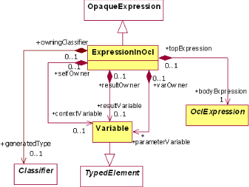

## 12.2.1  ExpressionInOcl

An expression in OCL is an expression that is written in OCL. The value of the language attribute is therefore always equal to 'OCL.'

## Associations

bodyExpression

contextVariable The bodyExpression is an OclExpression that is the root of the actual OCL expression, which is described fully by the OCL abstract syntax metamodel.

The 'self' variable. The contextual classifier is the type of the 'self' variable.

resultVariable The 'result' variable representing the value to be returned by the operation.

parameterVariable The variables representing the owned parameters of the current operation.

generatedType Types, such as collection types, that are created on demand by OCL to serve as the types of OclExpressions in the bodyExpression .

## 12.3 Well-formedness Rules

## 12.3.1  ExpressionInOcl

- [1] This expression is always written in OCL

```
context ExpressionInOcl inv: language = 'OCL'
```

## 12.4 Standard Placements of OCL Expressions

This sub clause defines the standard places where OCL expressions may occur, and defines for each case the value for the contextual classifier. Note that this list of places is not exhausting, and can be enhanced.

## 12.4.1  How to Extend the Use of OCL at Other Places

At many places in the UML where an Expression is used, one can write this expression in OCL. To define the use of OCL at such a place, the main task is to define what the contextual classifier is. When that is given, the OCL expression is fully defined. This sub clause defines a number of often used placements of OCL expressions.

## 12.5 Definition

A definition constraint is a constraint that is linked to a Classifier. It may only consist of one or more LetExps. The variable or function defined by the Let expression can be used in an identical way as an attribute or operation of the Classifier. Their visibility is equal to that of a public attribute or operation. The purpose of a definition constraint is to define reusable sub-expressions for use in other OCL expressions.

The placement of a definition constraint in the UML metamodel is shown in Figure 12.2. The following well-formedness rule must hold. This rule also defines the value of the contextual Classifier.

Figure 12.2  - Situation of Ocl expression used as definition or invariant

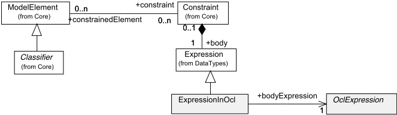

## 12.5.1  Well-formedness Rules

- [1]  The ExpressionInOcl is a definition constraint if it has the stereotype «definition» (A) and the constraint is attached to only one model element (B) and the constraint is attached to a Classifier (C).

```
context ExpressionInOcl def: isDefinitionConstraint : Boolean = self.constraint.stereotype.name = 'definition'                         -- A and self.constraint.constrainedElement->size() = 1                       -- B and self.constraint.constrainedElement.any(true).oclIsKindOf(Classifier) -- C
```

```
[2] For a definition constraint the contextual classifier is the constrained element. context ExpressionInOcl inv: isDefinitionConstraint implies contextualClassifier = self.constraint.constrainedElement.any(true).oclAsType(Classifier) [3] Inside a definition constraint the use of @pre is not allowed. context ExpressionInOcl inv: --
```

## 12.6 Invariant

An invariant constraint is a constraint that is linked to a Classifier. The purpose of an invariant constraint is to specify invariants for the Classifier. An invariant constraint consists of an OCL expression of type Boolean. The expression must be true for each instance of the classifier at any moment in time. Only when an instance is executing an operation, this does not need to evaluate to true.

The placement of an invariant constraint in the UML metamodel is equal to the placement of a definition constraint, which is shown in Figure 12.3. The following well-formedness rule must hold. This rule also defines the value of the contextual Classifier.

## 12.6.1  Well-formedness rules

- [1] The constraint has the stereotype «invariant» (A) and the constraint is attached to only one model element (B) the constraint is attached to a Classifier (C). The contextual classifier is the constrained element and the type of the OCL expression must be Boolean.
- [2] Inside an invariant constraint the use of @pre is not allowed.

```
context ExpressionInOcl inv: self.constraint.stereotype.name = 'invariant'                          -- A and self.constraint.constrainedElement->size() = 1                         -- B and self.constraint.constrainedElement.any(true).oclIsKindOf(Classifier)   -- C implies contextualClassifier = self.constraint.constrainedElement->any(true).oclAsType(Classifier) and self.bodyExpression.type.name = 'Boolean'
```

```
context ExpressionInOcl inv: --
```

## 12.7 Precondition

A precondition is a constraint that may be linked to an Operation of a Classifier. The purpose of a precondition is to specify the conditions that must hold before the operation executes. A precondition consists of an OCL expression of type Boolean. The expression must evaluate to true whenever the operation starts executing, but only for the instance that will execute the operation.

The placement of a precondition in the UML metamodel is shown in Figure 12.4. The following well-formedness rule must hold. This rule also defines the value of the contextual Classifier.

Figure 12.3 - An OCL ExpressionInOcl used as a pre- or postcondition

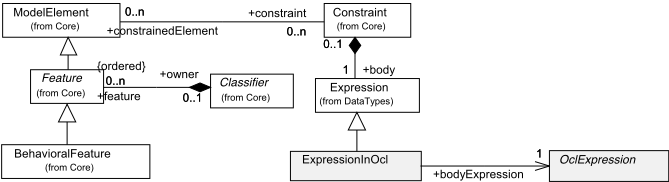

## 12.7.1  Well-formedness rules

- [1] The Constraint has the stereotype «precondition» (A), and is attached to only one model element (B), and to a BehavioralFeature (C), which has an owner (D). The contextual classifier is the owner of the operation to which the constraint is attached, and the type of the OCL expression must be Boolean.
- [2] Inside a precondition constraint the use of @pre is not allowed.

```
context Expression inv: self.constraint.stereotype.name = 'precondition'                                 -- A and self.constraint.constrainedElement->size() = 1                                     -- B and self.constraint.constrainedElement->any(true).oclIsKindOf(BehavioralFeature)     -- C and self.constraint.constrainedElement->any(true)                                     -- D .oclAsType(BehavioralFeature).owner->size() = 1 implies contextualClassifier = self.constraint.constrainedElement->any(true) .oclAsType(BehavioralFeature).owner and self.bodyExpression.type.name = 'Boolean'
```

```
context ExpressionInOcl inv: --
```

## 12.7.2  Postcondition

Like a precondition, a postcondition is a constraint that may be linked to an Operation of a Classifier. The purpose of a postcondition is to specify the conditions that must hold after the operation executes. A postcondition consists of an OCL expression of type Boolean. The expression must evaluate to true at the moment that the operation stops executing, but only for the instance that has just executed the operation. Within an OCL expression used in a postcondition, the "@pre" mark can be used to refer to values at precondition time. The variable result refers to the return value of the operation if there is any.

The placement of a postcondition in the UML metamodel is equal to the placement of a precondition, which is shown in Figure 12.4. The following well-formedness rule must hold. This rule also defines the value of the contextual Classifier.

## 12.7.3  Well-formedness rules

- [1] The Constraint has the stereotype «postcondition» (A), and it is attached to only one model element (B), that is a BehavioralFeature (C), which has an owner (D). The contextual classifier is the owner of the operation to which the constraint is attached, and the type of the OCL expression must be Boolean.

```
context Expression inv: self.constraint.stereotype.name = 'postcondition'                                -- A and self.constraint.constrainedElement->size() = 1                                     -- B and self.constraint.constrainedElement->any(true).oclIsKindOf(BehavioralFeature)     -- C and self.constraint.constrainedElement->any(true)                                     -- D .oclAsType(BehavioralFeature).owner->size() = 1 implies contextualClassifier = self.constraint.constrainedElement->any().oclAsType(BehavioralFeature).owner and self.bodyExpression.type.name = 'Boolean'
```

## 12.8 Initial Value Expression

An initial value expression is an expression that may be linked to a Property which may be owned by a Classifier or an Association. The type of an OCL expression acting as the initial value of a Property must conform to the OCL type of the Property. When the upperbound on the Property multiplicity is one, the OCL type of the Property is the UML type of the Property. When the upperbound on the multiplicity is more than one, the OCL type of the Property is a Collection of elements whose type is that of the UML type of the Property. The kind of the Collection (Bag, OrderedSet, Sequence, Set) is determined by the UML unique and ordered properties of the Property.

The OCL expression is evaluated at the creation time of the instance that owns the attribute for this created instance in the case of an initial value for an attribute. In the case of an initial value for an association end, the OCL expression is evaluated at the creation time of the instance of the Classifier at the other end(s) of the association.

The placement of an attribute initial value in the UML metamodel is shown in Figure 12.5. The following wellformedness rule must hold. This rule also defines the value of the contextual Classifier.

Note - The placement of an initial value of an association end is dependent upon the UML 2.0 metamodel. So are the wellformedness rules for this case.

## 12.8.1  Well-formedness rules

- [1] The Expression is the initial value of an attribute (A), and the Attribute has an owner (B). The contextual classifier is the

owner of the attribute, and the type of the OCL expression must conform to the type of the attribute.

```
context ExpressionInOcl inv: self.attribute->notEmpty()                                                      -- A and self.attribute.owner->size() = 1                                                -- B implies contextualClassifier = self.attribute.owner and self.bodyExpression.type.conformsTo(self.attribute.type)
```

- [2] Inside an initial attribute value the use of @pre is not allowed.

```
context ExpressionInOcl inv: -- TBD
```

Figure 12.4  - Expression used to define the initial value of an attribute

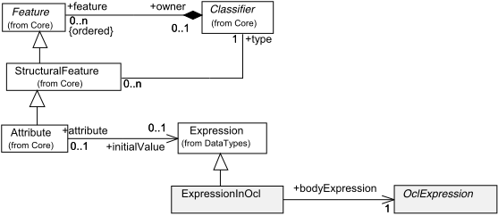

## 12.9 Derived Value Expression

A derived value expression is an expression that may be linked to a Property which may be owned by a Classifier or an Association. The type of an OCL expression acting as the derived value of a Property must conform to the OCL type of the Property. When the upperbound on the Property multiplicity is one, the OCL type of the Property is the UML type of the Property. When the upperbound on the multiplicity is more than one, the OCL type of the Property is a Collection of elements whose type is that of the UML type of the Property. The kind of the Collection (Bag, OrderedSet, Sequence, Set) is determined by the UML unique and ordered properties of the Property.

A derived value expression is an invariant that states that the value of the attribute or association end must always be equal to the value obtained from evaluating the expression.

Note - The placement of a derived value expression is dependent upon the UML 2.0 metamodel. So are the well-formedness rules for this case.

## 12.10 Operation Body Expression

A body expression is an expression that may be linked to an Operation of a Classifier, that is marked Query operation. An OCL expression acting as the body of an operation must conform to the result type of the operation. Evaluating the body expression gives the result of the operation at a certain point in time.

Note - The placement of an operation body expression is dependent upon the UML 2.0 metamodel. So are the well-formedness rules for this case.

## 12.11 Guard

A guard is an expression that may be linked to a Transition in a StateMachine. An OCL expression acting as the guard of a transition restricts the transition. An OCL expression acting as value of a guard is of type Boolean. The expression is evaluated at the moment that the transition attached to the guard is attempted.

The placement of a guard in the UML metamodel is shown in Figure 12.5. The following well-formedness rule must hold. In order to state the rule a number of additional operations are defined. The rule also defines the value of the contextual Classifier.

Figure 12.5 - An OCL expression used as a Guard expression

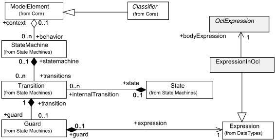

## 12.11.1 Well-formedness rules

- [1]  The statemachine in which the guard appears must have a context (A), that is a Classifier (B). The contextual classifier is the owner of the statemachine, and the type of the OCL expression must be Boolean.

```
context ExpressionInOcl inv: not self.guard.transition.getStateMachine().context.oclIsUndefined()         -- A and self.guard.transition.getStateMachine().context.oclIsKindOf(Classifier)      -- B implies contextualClassifier =
```



```
self.guard.transition.getStateMachine().context.oclAsType(Classifier) and self.bodyExpression.type.name = 'Boolean' [2] Inside a guard the use of @pre is not allowed. context ExpressionInOcl inv: --
```

## 12.12 Concrete Syntax of Context Declarations

This sub clause describes the concrete syntax for specifying the context of the different types of usage of OCL expressions. It makes use of grammar rules defined in Clause 9 ('Concrete Syntax'). Here too, every production rule is associated to the abstract syntax by the type of the attribute ast . However, we must sometimes refer to the abstract syntax of the UML to find the right type for each production.

Visibility rules etc. must be defined in the UML metamodel. Here we assume that every classifier has an operation visibleElements() , which returns an instance of type Environment, as defined in Clause 9 ('Concrete Syntax').

Note - The context declarations as described in this sub clause are not needed when the OCL expressions are attached directly to the UML model. This concrete syntax for context declarations is only there to facilitate separate OCL expressions in text files.

Because of the assumption that the concrete syntax below is used separate from the UML model, we assume the existence of an operation getClassifier() on the UML model that allows us to find a Classifier anywhere in the corresponding model. The signature of this operation is defined as follows:

```
context Model::findClassifier( pathName : Sequence(String) ) : Classifier
```

The pathName need not be a fully qualified name (it may be), as long as it can uniquely identify the classifier somewhere in the UML model. If a classifier name occurs more than once, it needs to be qualified with its owning package (recursively) until the qualified name is unique. If more than one classifier is found, the operation returns invalid . The variable Model is used to refer to the UML Model. It is used as Model.findClassifier() .

Likewise, we assume the existence of an operation getPackage() on the UML model that allows us to find a Package anywhere in the corresponding model. The signature of this operation is defined as follows:

```
context Model::findPackage( pathName : Sequence(String) ) : Package
```

In this case the pathName needs to be a fully qualified name.

Note - The rules for the synthesized and inherited attributes associated with the grammar all depend upon the UML 2.0  metamodel. They cannot be written until this metamodel has been stabilized. Therefore only the grammar rules are given.

## 12.12.1 packageDeclarationCS

This production rule represents a package declaration.

```
[A] packageDeclarationCS ::= 'package' pathNameCS contextDeclarationCS* 'endpackage' [B] packageDeclarationCS ::= contextDeclarationCS*
```



## 12.12.2 contextDeclarationCS

This production rule represents all different context declarations.

- [A] contextDeclarationCS ::= propertyContextDeclCS

```
[B] contextDeclarationCS ::= classifierContextDeclCS [C] contextDeclarationCS ::= operationContextDeclCS
```

## 12.12.3 propertyContextDeclCS

This production rule represents a context declaration for expressions that can be coupled to a property. The path name refers to the 'owner' of the property, the simple name refers to its name, the type states its type.

```
propertyContextDeclCS ::= 'context' pathNameCS '::' simpleName':' typeCS initOrDerValueCS
```

## 12.12.4 initOrDerValueCS

This production rule represents an initial or derived value expression.

```
[A] initOrDerValueCS[1] ::= 'init'   ':'  OclExpression  initOrDerValueCS[2]? [B] initOrDerValueCS[1] ::= 'derive' ':'  OclExpression initOrDerValueCS[2]?
```

## 12.12.5 classifierContextDeclCS

This production rule represents a context declaration for expressions that can be coupled to classifiers. The variable declaration to the classifier context is 'self' for the A form and explicitly specified for the B form.

```
[A] classifierContextDeclCS ::= 'context' pathNameCS invOrDefCS
```

[B] classifierContextDeclCS ::= 'context' simpleNameCS ':' pathNameCS invOrDefCS

## 12.12.6 invOrDefCS

This production rule represents an invariant or definition.

```
[A] invOrDefCS[1] ::= 'inv' (simpleNameCS)? ':' OclExpressionCS  invOrDefCS[2] [B] invOrDefCS[1] ::= ('static')? 'def' (simpleNameCS)? ':' defExpressionCS invOrDefCS[2]
```





## 12.12.7 defExpressionCS

This production rule represents a definition expression. The defExpressionCS nonterminal has the purpose of defining additional attributes or operations in OCL. They map directly to a UML attribute or operation with a constraint that defines the derivation of the attribute or operation result value. Note that VariableDeclarationCS has been defined in Clause 9.

```
[A] defExpressionCS ::= VariableDeclarationCS '=' OclExpression [B] defExpressionCS ::= operationCS '=' OclExpression
```

## 12.12.8 operationContextDeclCS

This production rule represents a context declaration for expressions that can be coupled to an operation.

operationContextDeclCS ::= 'context' operationCS prePostOrBodyDeclCS

## 12.12.9 prePostOrBodyDeclCS

This production rule represents a pre- or postcondition or body expression.

```
[A] prePostOrBodyDeclCS[1] ::= 'pre' (simpleNameCS)? ':' OclExpressionCS  prePostOrBodyDeclCS[2]? [B] prePostOrBodyDeclCS[1] ::= 'post' (simpleNameCS)? ':' OclExpressionCS  prePostOrBodyDeclCS[2]? [C] prePostOrBodyDeclCS[1] ::= 'body' (simpleNameCS)? ':' OclExpressionCS prePostOrBodyDeclCS[2]?
```

## 12.12.10 operationCS

This production rule represents an operation in a context declaration or definition expression.

```
[A] operationCS ::= pathNameCS '::' simpleNameCS '(' parametersCS? ')' ':' typeCS? [B] operationCS ::= simpleNameCS '(' parametersCS? ')' ':' typeCS?
```

## 12.12.11 parametersCS

This production rule represents the formal parameters of an operation.

```
parametersCS[1] ::= VariableDeclarationCS (',' parametersCS[2] )?
```



## 13 The Basic OCL and Essential OCL

This clause describes the connections between the OCL and UML metamodels.

## 13.1 Introduction

BasicOCL is the package exposing the minimal OCL required to work with Core::Basic.

Basic OCL depends on the Core::Basic Package. It references explicitly the following Core::Basic classes: Property, Operation, Parameter, TypedElement, Type, Class, DataType, Enumeration, PrimitiveType, and EnumerationLiteral.

EssentialOCL is the package exposing the minimal OCL required to work with EMOF. EssentialOcl depends on the EMOF Package. It references explicitly the EMOF classes: Property, Operation, Parameter, TypedElement, Type, Class, DataType, Enumeration, PrimitiveType, and EnumerationLiteral.

EssentialOCL is built from Core::Basic and BasicOcl using package merge with copy semantics in a similar way as EMOF is built from Core::Basic. Structurally there is no difference between BasicOCL and EssentialOCL. For this reason we provide in this clause a unique set of diagrams that defines the abstract syntax for both packages.

For convenience, because BasicOCL (respectively EssentialOCL) is - conceptually a subset of the complete OCL language for UML superstructure, we will not repeat or redefine here all the class descriptions and the well-formedness rules defined in the other clauses. When applicable, all these definitions are to be re-interpreted in the specific context of Core::Basic (respectively EMOF). The sub clause 'OCL adaptation for meta-modeling' defines specific rules for the reinterpretation of the 'complete' OCL, whereas the 'Diagrams' sub clause provides the complete diagrams defining the BasicOCL (respectively EssentialOCL) abstract syntax.

## 13.2 OCL Adaptation for Metamodeling

We provide below a set of rules and conventions that are applied to define BasicOCL (and consequently EssentialOCL) from the OCL defined for UML superstructure - called 'complete OCL' in this sub clause.

1. The following metaclasses defined in complete OCL are not part of BasicOCL (and EssentialOCL):
- MessageType
- ElementType
- AssociationClassCallExp
- MessageExp
- StateExp
- UnspecifiedValueExp

Any well-formedness rules defined for these classes are consequently not part of the definition of Basic OCL.

The properties NavigationCallExp::qualifier and NavigationCallExp::navigationSource are suppressed since not needed in this context.



2. Core::Basic does not contain the intermediate notion of Classifier but uses instead directly the Type notion as the base class for the type system. Consequently, any reference to the Classifier class in the complete OCL specification has to be re-interpreted as a reference to the Type class.

3. The following operations do not form part of Essential OCL:

```
@pre ^  ^^
```



4. The following names are not reserved or restricted in Essential OCL:



```
OclMessage body  context  def  derive  endpackage  init  inv  package  post  pre  static
```

Note - It is expected that further revisions of this specification will provide explicitly the complete set of well-formedness rules and additional operations that apply to Core::Basic - to replace the lazy re-interpretation statement we are using here.

5. In complete OCL, TupleType has DataType as base type. In BasicOCL Tuple also has Class as base type so that the attributes of the tuple can be defined in the same way as in complete OCL - as Property instances.
6. In complete OCL, pre-defined types have pre-defined operations defined in the standard library. However, a DataType in Core::Basic cannot define such operations since it inherits from Type (and not from Class). For all data types and special types - like VoidType, InvalidType, and AnyType - the following convention is used: in the standard library the instance representing the pre-defined type is accompanied with a class instance with the same name that holds the operations. An access to an operation of the pre-defined type implies an access to the operation of the complementary class instance.
7. The  EMOF Reflection capability is not merged to the metamodel. AnyType plays the role of Object. At instance level, reflection is provided by the oclIsKindOf(), oclIsTypeOf(), and oclType() operations.

## 13.3 Diagrams

The diagrams below completely define the abstract syntax of BasicOCL (respectively EssentialOCL). The classes that are not imported from Core::Basic (respectively EMOF) are shown with a transparent fill color.

Figure 13.1  - Types

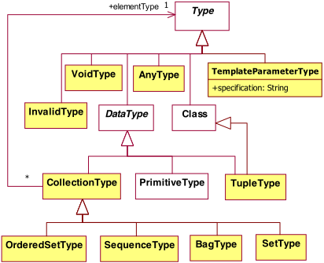

Figure 13.2 - The top container expression

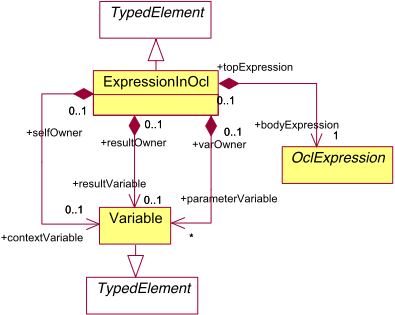

Figure 13.3 - Main Expression Concept

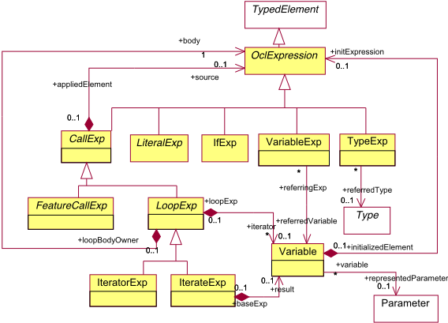

Figure 13.4 - Feature Property Call expressions

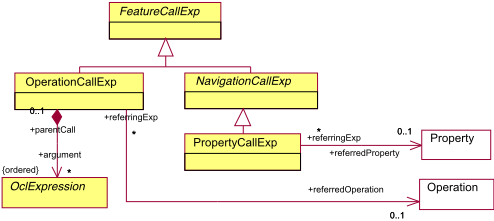

Figure 13.5 - If Expressions

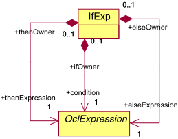

Figure 13.6 - Let Expressions

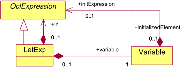

Figure 13.7 - Literals

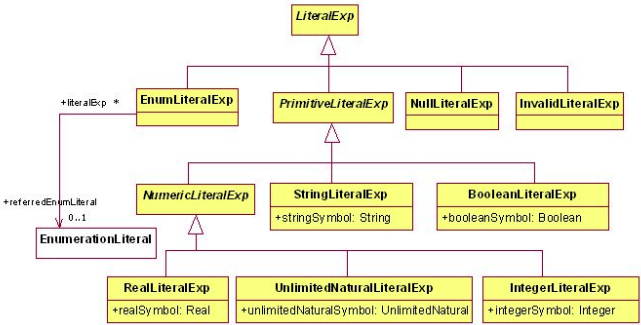

Figure 13.8 - Collection and tuple literals

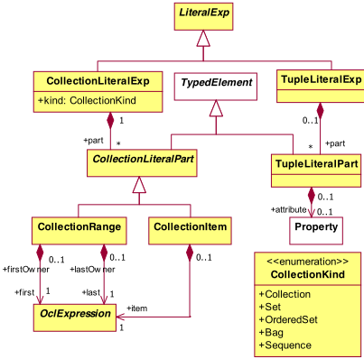

## Annex A: Semantics

(informative)

This annex formally defines the syntax and semantics of OCL and is organized as follows. Sub clause A.1 defines the concept of object models. Object models provide information used as context for OCL expressions and constraints. Sub clause A.2 defines the type system of OCL and the set of standard operations. Finally, sub clause A.3 defines the syntax and semantics of OCL expressions.

## A.1 Object Models

In this sub clause, the notion of an object model is formally defined. An object model provides the context for OCL expressions and constraints. A precise understanding of object models is required before a formal definition of OCL expressions can be given. Sub clause A.1.1 proceeds with a formal definition of the syntax of object models. The semantics of object models is defined in sub clause A.1.2. This sub clause also defines the notion of system states as snapshots of a running system.

## A.1.1 Syntax of Object Models

In this sub clause, we formally define the syntax of object models. Such a model has the following components:

- a set of classes
- a set of attributes for each class
- a set of operations for each class
- a set of associations with role names and multiplicities
- a generalization hierarchy over classes

Additionally, types such as Integer , String , Set ( Real ) are available for describing types of attributes and operation parameters. In the following, each of the model components is considered in detail. The following definitions are combined in A.1.1.7, 'Formal Syntax' to give a complete definition of the syntax of object models. For naming model components, we assume in this sub clause an alphabet A and a set of finite, non-empty names N  A+ over alphabet A to be given.

## A.1.1.1  Types

Types are considered in depth in sub clause A.2. For now, we assume that there is a signature with T being a set of type names, and  being a set of operations over types in T . The set T includes the basic types UnlimitedNatural , Integer , Real , Boolean , and Strin g. These are the predefined basic types of OCL. All type domains include  an invalid value, and ε , a null value, that allow one to operate respectively  with invalid and undefined values. The unlimited natural domain includes ∞ , the unlimited value. Operations in include, for example, the usual arithmetic operations +, - , \_ , / , etc. for integers. Furthermore, collection types are available for describing collections of values, for example, Set ( Strin g), Bag ( Intege r), and Sequence ( Real ). Structured values are described by tuple types with named components, for example, Tupl e( name:String, age:Integer ).  T   = 

## A.1.1.2   Classes

The central concept of UML for modeling entities of the problem domain is the class. A class provides a common description for a set of objects sharing the same properties.

## Definition A.1 (Classes)

The set of classes is a finite set of names . CLASS N 

Each class induces an object type t c  T having the same name as the class. A value of an object type refers to an object of the corresponding class. The main difference between classes and object types is that the interpretation of the latter includes a special undefined value and a special invalid value. c CLASS 

Note that for a definition of the semantics of OCL, UML's distinction between classes and interfaces does not matter. OCL specifies constraints for instances of a given interface specification. Whether this specification is stated in the form of a class or interface definition makes no difference.

## A.1.1.3  Attributes

Attributes are part of a class declaration in UML. Objects are associated with attribute values describing properties of the object. An attribute has a name and a type specifying the domain of attribute values.

## Definition A.2 (Attributes)

Let t  T be a type. The attributes of a class c  CLASS are defined as a set ATT c of signatures a : t c  t where the attribute name a is an element of N , and t c  T is the type of class c .

All attributes of a class have distinct names. In particular, an attribute name may not be used again to define another attribute with a different type.

```
 t, t   T : (a : t c  t  ATT c and a : t c  t   ATT c )  t = t 
```

Attributes with the same name may, however, appear in different classes that are not related by generalization. Details are given in sub clause A.1.1.6 where we discuss generalization. The set of attribute names and class names need not be disjoint.

## A.1.1.4  Operations

Operations are part of a class definition. They are used to describe behavioral properties of objects. The effect of an operation may be specified in a declarative way with OCL pre- and postconditions. Sub clause A.3  discusses pre- and postconditions in detail. Furthermore, operations performing computations without side effects can be specified with OCL. In this case, the computation is determined by an explicit OCL expression. This is also discussed in sub clause A.3. Here, we focus on the syntax of operation signatures declaring the interface of user-defined operations. In contrast, other kinds of operations which are not explicitly defined by a modeler are, for example, navigation operations derived from associations. These are discussed in the next sub clause and in sub clause A.2.

## Definition A.3 (Operations)

Let t and t 1 , . . . , t n be types in T .  Operations of a class c  CLASS with type t c  T are defined by a set OP c of signatures  : t c  t 1  · · ·  t n  t with operation symbols  being elements of N .

The name of an operation is determined by the symbol  . The first parameter t c denotes the type of the class instance to which the operation is applied. An operation may have any number of parameters but only a single return type. In general, UML allows multiple return values. We currently do not support this feature in OCL.

## A.1.1.5   Associations

Associations describe structural relationships between classes. Generally, classes may participate in any number of associations, and associations may connect two or more classes.

## Definition A.4 (Associations)

The set of associations is given by

i. a finite set of names ASSOC  N ,

ii. a function associates:

ASSOC



CLASS +

as





c

1

, …,

c n



with (

n



2)

The function associates maps each association name as  ASSOC to a finite list  c 1 , . . . , c n  of classes participating in the association. The number n of participating classes is also called the degree of an association; associations with degree n are called n -ary associations. For many problems the use of binary associations is often sufficient. A self-association (or recursive association) sa is a binary association where both ends of the association are attached to the same class c such that associates ( sa ) =  c, c  . The function associates does not have to be injective. Multiple associations over the same set of classes are possible.

## Role Names

Classes may appear more than once in an association each time playing a different role. For example, in a self-association PhoneCall on a class Person we need to distinguish between the person having the role of a caller and another person being the callee. Therefore we assign each class participating in an association a unique role name. Role names are also important for OCL navigation expressions. A role name of a class is used to determine the navigation path in this kind of expression.

## Definition A.5 (Role Names)

Let as  ASSOC be an association with associates( as ) =  c 1 , . . . , c n  . Role names for an association are defined by a function

<!-- formula-not-decoded -->

where all role names must be distinct, i.e.,

<!-- formula-not-decoded -->

The function roles( as ) =  r 1 , . . . , r n  assigns each class c i for 1 &lt; i &lt; n participating in the association a unique role name r i . If role names are omitted in a class diagram, implicit names are constructed in UML by using the name of the class at the target end and changing its first letter to lower case. As mentioned above, explicit role names are mandatory for selfassociations.

Additional syntactical constraints are required for ensuring the uniqueness of role names when a class is part of many associations. We first define a function participating that gives the set of associations a class participates in.

<!-- formula-not-decoded -->

The following function navends gives the set of all role names reachable (or navigable) from a class over a given association.

<!-- formula-not-decoded -->

The set of role names that are reachable from a class along all associations the class participates in can then be determined by the following function.

<!-- formula-not-decoded -->

## Multiplicities

An association specifies the possible existence of links between objects of associated classes. The number of links that an object can be part of is specified with multiplicitie s. A multiplicity specification in UML can be represented by a set of natural numbers.

## Definition A.6 (Multiplicities)

Let as  ASSOC be an association with associates( as ) =  c 1 , . . . , c n  . The function multiplicities( as ) =  M 1 , . . . , Mn  assigns each class c i participating in the association a non-empty set Mi  N 0 with Mi  {0} for all 1 &lt; i &lt; n .

The precise meaning of multiplicities is defined as part of the interpretation of object models in sub clause A.1.2.

## Remark: Aggregation and Composition

Special forms of associations are aggregation and composition. In general, aggregations and compositions impose additional restrictions on relationships. An aggregation is a special kind of binary association representing a part-of relationship. The aggregate is marked with a hollow diamond at the association end in class diagrams. An aggregation implies the constraint that an object cannot be part of itself. Therefore, a link of an aggregation may not connect the same object. In case of chained aggregations, the chain may not contain cycles.

An even stronger form of aggregation is composition. The composite is marked with a filled diamond at the association end in class diagrams. In addition to the requirements for aggregations, a part may only belong to at most one composite.

These seemingly simple concepts can have quite complex semantic issues [ AFGP96 , Mot96 , Pri97 , GR99 , HSB99 , BHS99 , BHSOG01 ]. Here, we are concerned only with syntax. The syntax of aggregations and compositions is very similar to associations. Therefore, we do not add an extra concept to our formalism. As a convention, we always use the first component in an association for a class playing the role of an aggregate or composite. The semantic restrictions then have to be expressed as an explicit constraint. A systematic way for mapping aggregations and compositions to simple associations plus OCL constraints is presented in [ GR99 ].

## A.1.1.6  Generalization

A generalization is a taxonomic relationship between two classes. This relationship specializes a general class into a more specific class. Specialization and generalization are different views of the same concept. Generalization relationships form a hierarchy over the set of classes.

## Definition A.7 (Generalization Hierarchy)

 A generalization hierarchy ≺ is a partial order on the set of classes CLASS.

 Pairs in ≺ describe generalization relationships between two classes.  For classes c 1 , c 2  CLASS with c 1 ≺ c 2 , the class c 1 is called a child class of c 2 , and c 2 is called a parent class of c 1 .

## Full Descriptor of a Class

A child class implicitly inherits attributes, operations, and associations of its parent classes. The set of properties defined in a class together with its inherited properties is called a full descriptor in UML. We can formalize the full descriptor in our framework as follows. First, we define a convenience function for collecting all parents of a given class.

<!-- formula-not-decoded -->

The full set of attributes of class c is the set ATT\_ c * containing all inherited attributes and those that are defined directly in the class.

<!-- formula-not-decoded -->

We define the set of inherited user-defined operations analogously.

<!-- formula-not-decoded -->

Finally, the set of navigable role names for a class and all of its parents is given as follows.

<!-- formula-not-decoded -->

c  parents(c)

## Definition A.8 (Full Descriptor of a Class)

The full descriptor of a class c  CLASS is a structure FD c = (ATT * c , OP * c , navends*( c )) containing all attributes, userdefined operations, and navigable role names defined for the class and all of its parents.

The UML standard requires that properties of a full descriptor must be distinct. For example, a class may not define an attribute that is already defined in one of its parent classes. These constraints are captured more precisely by the following well-formedness rules in our framework. Each constraint must hold for each class c  CLASS.

1. Attributes are defined in exactly one class.

<!-- formula-not-decoded -->

<!-- formula-not-decoded -->

<!-- formula-not-decoded -->

<!-- formula-not-decoded -->

2. In a full class descriptor, an operation may only be defined once. The first parameter of an operation signature indicates the class in which the operation is defined. The following condition guarantees that each operation in a full class descriptor is defined in a single class.

<!-- formula-not-decoded -->

3. Role names are defined in exactly one class.



c

1,

c

2



parents(

c

)

U

{

c

}  :

<!-- formula-not-decoded -->

4. Attribute names and role names must not conflict. This is necessary because in OCL the same notation is used for attribute access and navigation by role name. For example, the expression self.x may either be a reference to an attribute x or a reference to a role name x.

<!-- formula-not-decoded -->

Note that operations may have the same name as attributes or role names because the concrete syntax of OCL allows us to distinguish between these cases. For example, the expression self.age is either an attribute or role name reference, but a call to an operation age without parameters is written as self.age( ).

## A.1.1.7  Formal Syntax

We combine the components introduced in the previous sub clause to formally define the syntax of object models.

Definition A.9 (Syntax of Object Models)

The syntax of an object model is a structure.

```
M = (CLASS, ATTc, OPc, ASSOC, associates, roles, multiplicities, ≺  )
```

where

- i. CLASS is a set of classes (Definition A.1).
- ii. ATT c is a set of operation signatures for functions mapping an object of class c to an associated attribute value (Definition A.2).
- iii. OP c is a set of signatures for user-defined operations of a class c (Definition A.3).
- iv. ASSOC is a set of association names (Definition A.4).
5. (a) associates is a function mapping each association name to a list of participating classes (Definition A.4).
6. (b) roles is a function assigning each end of an association a role name (Definition A.5).
7. (c) multiplicities is a function assigning each end of an association a multiplicity specification (Definition A.6).
8.  v. ≺ is a partial order on CLASS reflecting the generalization hierarchy of classes (Definitions A.7 and A.8).

## A.1.2 Interpretation of Object Models

In the previous sub clause, the syntax of object models has been defined. An interpretation of object models is presented as  follows.

## A.1.2.1  Objects

The domain of a class c  CLASS is the set of objects that can be created by this class and all of its child classes. Objects are referred to by unique object identifiers. In the following, we will make no conceptual distinction between objects and their identifiers. Each object is uniquely determined by its identifier and vice versa. Therefore, the actual representation of an object is not important for our purposes.

## Definition A.10 (Object Identifiers)

```
i.  The set of object identifiers of a class c  CLASS is defined by an infinite set oid( c ) = { c 1 , c 2 , . . .} ii. The domain of a class c  CLASS is defined as I CLASS ( c  ) = U {oid(c  ) | c   CLASS ^ c  ≼ c }
```





In the following, we will omit the index for a mapping I when the context is obvious. The concrete scheme for naming objects is not important as long as every object can be uniquely identified, i.e., there are no different objects having the same name. We sometimes use single letters combined with increasing indexes to name objects if it is clear from the context to which class these objects belong.

## A.1.2.2  Generalization

The above definition implies that a generalization hierarchy induces a subset relation on the semantic domain of classes. The set of object identifiers of a child class is a subset of the set of object identifiers of its parent classes. In other words, we have

<!-- formula-not-decoded -->

From the perspective of programming languages this closely corresponds to the domain-inclusion semantics commonly associated with subtyping and inheritance [ CW85 ]. Data models for object-oriented databases such as the generic OODB model presented in [ AHV95 ] also assume an inclusion semantics for class extensions. This requirement guarantees two fundamental properties of generalizations. First, an object of a child class has (inherits) all the properties of its parent classes because it is an instance of the parent classes. Second, this implies that an object of a more specialized class can be used anywhere where an object of a more general class is expected (principle of substitutability) because it has at least all the properties of the parent classes. In general, the interpretation of classes is pairwise disjoint if two classifiers are not related by generalization and do not have a common child.

## A.1.2.3   Links

An association describes possible connections between objects of the classes participating in the association. A connection is also called a link in UML terminology. The interpretation of an association is a relation describing the set of all possible links between objects of the associated classes and their children.

## Definition A.11 (Links)

Each association as  ASSOC with associates( as ) =  c 1 , . . . , c n  is interpreted as the Cartesian product of the sets of object identifiers of the participating classes: I ASSOC ( as ) = I CLASS ( c 1 ) ×· · · × I CLASS ( c n ). A link denoting a connection between objects is an element l as  I ASSOC ( as ).

## A.1.2.4  System State

Objects, links, and attribute values constitute the state of a system at a particular moment in time. A system is in different states as it changes over time. Therefore, a system state is also called a snapshot of a running system. With respect to OCL, we can in many cases concentrate on a single system state given at a discrete point in time. For example, a system state provides the complete context for the evaluation of OCL invariants. For pre- and postconditions, however, it is necessary to consider two consecutive states.

## Definition A.12 (System State)

A system state for a model M is a structure  ( M ) = (  CLASS ,  ATT ,  ASSOC ).

- i. The finite sets  CLASS ( c ) contain all objects of a class c  CLASS existing in the system state:

<!-- formula-not-decoded -->

ii. Functions  ATT  assign attribute values to each object:  ATT ( a ) :  CLASS ( c )  I ( t ) for each



<!-- formula-not-decoded -->

- iii. The finite sets  ASSOC  contain links connecting objects. For each as  ASSOC:  ASSOC ( as )  I ASSOC ( as ). A link set must satisfy all multiplicity specifications defined for an association (the function  i ( l ) projects  the i th component of a tuple or list l , whereas the function projects all but the i th component):  i l  

```
i  1  n      l    ASSOC as    : l  l   ASSOC as     i l     i l   =       i multiplicities as     
```

## A.2 OCL Types and Operations

OCL is a strongly typed language. A type is assigned to every OCL expression and typing rules determine in which ways well-formed expressions can be constructed. In addition to those types introduced by UML models, there are a number of predefined OCL types and operations available for use with any UML model. This sub clause formally defines the type system of OCL. Types and their domains are fixed, and the abstract syntax and semantics of operations is defined.

Our general approach to defining the type system is as follows. Types are associated with a set of operations. These operations describe functions combining or operating on values of the type domains. In our approach, we use a data signature  = (T,  ) to describe the syntax of types and operations. The semantics of types in T and operations in  is defined by a mapping that assigns each type a domain and each operation a function. The definition of the syntax and semantics of types and operations will be developed and extended in several steps. At the end of this sub clause, the complete set of types is defined in a single data signature.

Sub clause A.2.1 defines the basic types UnlimitedNatural, Intege r, Real , Boolean, and Strin g. Enumeration types are defined in sub clause A.2.3. Sub clause A.2.4 introduces object types that correspond to classes in a model. Collection and tuple types are discussed in sub clause A.2.5. The special types OclAny and OclState are considered in sub clause A.2.6. Sub clause A.2.7 introduces subtype relationships forming a type hierarchy. All types and operations are finally summarized in a data signature defined in sub clause A.2.8.

## A.2.1 Basic Types

Basic types are UnlimitedNatural, Intege r, Real , Boolean, and Strin g. The syntax of basic types and their operations is defined by a signature  B  = ( T B ,  B ). T B is the set of basic types,  B is the set of signatures describing operations over basic types.

## Definition A.13 (Syntax Of Basic Types)

The set of basic types T B is defined as T B = { UnlimitedNatural , Intege r, Real , Boolean , String }. Next we define the semantics of basic types by mapping each type to a domain.

## Definition A.14 (Semantics Of Basic Types)

Let A * be the set of finite sequences of characters from a finite alphabet A . The semantics of a basic type t  T B is a function I mapping each type to a set:

- I ( OclInvalid ) = {  }
- I ( OclVoid ) = { ε ,  }
- I ( Intege r) = ℤ U { ε ,  }
- I ( Rea l) = ℝ U { ε ,  }
- I ( Boolea n) = { true, false} U { ε ,  }



- I ( Strin g) = A * U { ε ,  }
- I ( UnlimitedNatural ) = ℕ U { ∞ , ε ,  }.

The basic type UnlimitedNatural represents the set of non-negative integers, Integer represents the set of integers, Real the set of real numbers, Boolean the truth values true and false, and String all finite strings over a given alphabet. Each domain also contains two special values ε and  . ε coresponds to the null value, and  , pronounced bottom, corresponds to the invalid value. These are motivated in the next sub clause. The UnlimitedNatural domain also includes a special value to denote the unlimited natural number.

## A.2.1.1  Error Handling

Each domain of a basic type t contains two special values ε and  . ε represents a null or undefined value and  an invalid value  These are useful for the following purposes:

1. An undefined or null value may, for example, be assigned to an attribute of an object. In this case the undefined value helps to model the situation where the attribute value is not yet known (for example, the email address of a customer is unknown at the time of the first contact, but will be added later) or does not apply to this specific object instance (e.g., the customer does not have an email address). This usage of undefined values is well-known in database modeling and querying with SQL [ Dat90 , EN94 ]), in the Extended ER-Model [ Gog94 ], and in the object specification language TROLL light [ Her95 ].
2. An invalid value can signal an error in the evaluation of an expression. An example for an expression that is defined by a partial function is the division of integers. The result of a division by zero is undefined. The problems with partial functions can be eliminated by including an invalid value  into the domains of types. For all operations we can then extend their interpretation to total functions.

The interpretation of operations is considered strict unless there is an explicit statement in the following. Hence, an invalid or null argument value causes an invalid operation result. This ensures the propagation of error conditions.

## A.2.1.2  Operations

There are a number of predefined operations on basic types. The set  B contains the signatures of these operations. An operation signature describes the name, the parameter types, and the result type of an operation.

## Definition A.15 (Syntax Of Operations)

The syntax of an operation is defined by a signature  : t 1 × · · · × tn  t . The signature contains the operation symbol  , a list of parameter types t 1 , . . . , t n  T , and a result type t  T .

Table A.1 shows a schema defining most predefined operations over basic types. The left column contains partially parameterized signatures in  B . The right column specifies variations for the operation symbols or types in the left column.

The set of predefined operations includes the usual arithmetic operations +, - , \_ , /, etc. for integers and real numbers, division (div) and modulo (mod) of integers, sign manipulation ( - , abs), conversion of Real values to Integer values (floor, round), and comparison operations (&lt;, &gt;, &lt; , &gt; ).

Operations for equality and inequality are presented later in sub clause A.2.2, since they apply to all types. Boolean values can be combined in different ways (and, or, xor, implies), and they can be negated (not). For strings the length of a string (size) can be determined, a string can be projected to a substring, and two strings can be concatenated (concat). Finally, assuming a standard alphabet like ASCII or Unicode, case translations are possible with toUpperCase and toLowerCase.

Some operation symbols (such as + and -) are overloaded, that is there are signatures having the same operation symbol but different parameters (concerning number or type) and possibly different result types. Thus in general, the full argument list has to be considered in order to identify a signature unambiguously.

The operations in Table A.1 all have at least one parameter. There is another set of operations in  B that do not have parameters. These operations are used to produce constant values of basic types. For example, the integer value 12 can be generated by the operation 12 :  Integer . Similar operations exist for the other basic types. For each value, there is an operation with no parameters and an operation symbol that corresponds to the common notational representation of this value.

Table A.1 - - Schema for operations on basic types

|             | Signature                                               | Schema parameters                                                            |
|-------------|---------------------------------------------------------|------------------------------------------------------------------------------|
|  :         | UnlimitedNatural X UnlimitedNatural  UnlimitedNatural |   {+,*,max, min}                                                         |
|  :         | Integer X t  Integer t X Integer  Integer           |   {+,-,*,max, min} t  { UnlimitedNatural , Integer }                    |
|  :         | Real X t  Real t X Real  Real                       |   {+,-,*,max, min} t  { UnlimitedNatural , Integer , Real }             |
|  :         | t X t  t                                              |   {div, mod} t  { UnlimitedNatural , Integer }                          |
| / :         | t 1 X t 2  Real                                       | t 1 , t 2  { UnlimitedNatural , Integer , Real }                            |
| - :         | t  t                                                   | t  { Integer , Real }                                                       |
| abs:        | t  t                                                   | t  { UnlimitedNatural , Integer , Real }                                    |
| floor:      | t  Integer                                             | t  { UnlimitedNatural , Integer , Real }                                    |
| round:      | t  Integer                                             | t  { UnlimitedNatural , Integer , Real }                                    |
|  :         | t 1 X t 2  Boolean                                    |   {<, >, <, >} t 1 , t 2  { UnlimitedNatural , Integer , Real, String } |
|  :         | Boolean X Boolean  Boolean                            |   {and, or, xor, implies}                                                |
| not:        | Boolean  Boolean                                      |                                                                              |
| size:       | String  Integer                                       |                                                                              |
| concat:     | String X String  String                               |                                                                              |
| toUpperCase | String  String                                        |                                                                              |
| toLowerCase | String  String                                        |                                                                              |
| substring:  | String X Integer X Integer  String                    |                                                                              |
| toString    | t  String                                             | t  { UnlimitedNatural , Integer , Real, String, Boolean }                   |

## A.2.1.3  Semantics of Operations

Definition A.16 (Semantics of Operations)

```
The semantics of an operation with signature  : t 1 × · · · × t n  t is a total function I (  : t 1 × · · · × t n  t ) : I ( t 1 ) × · · · × I ( t n )  I ( t ).
```



When we refer to an operation, we usually omit the specification of the parameter and result types and only use the operation symbol if the full signature can be derived from the context.

The next example shows the interpretation of the operation + for adding two integers. The operation has two arguments i 1 , i 2  I ( Intege r). This example also demonstrates the strict evaluation semantics for undefined arguments.

<!-- formula-not-decoded -->

We can define the semantics of the other operations in Table A.1 analogously. The usual semantics of the Boolean operations and, or, xor, implies, and not, is extended for dealing with undefined argument values. Table A.2 shows the interpretation of Boolean operations following the proposal in [ CKM+99 ] based on three-valued logic. Since the semantics of the other basic operations for UnlimitedNatural , Intege r, Real , and String values is rather obvious, we will not further elaborate on them here.

Table A.2 - - Semantics of Boolean operations

| b 1   | b 2       | b 1 and b 2   | b 1 or b 2   | b 1 xor b 2   | b 1 implies b 2   | not b 1   |
|-------|-----------|---------------|--------------|---------------|-------------------|-----------|
| false | false     | false         | false        | false         | true              | true      |
| false | true      | false         | true         | true          | true              | true      |
| true  | false     | false         | true         | true          | false             | false     |
| true  | true      | true          | true         | false         | true              | false     |
| false | ε         | false         | ε            | ε             | true              | true      |
| true  | ε         | ε             | true         | ε             | ε                 | false     |
| false |          | false         |             |              | true              | true      |
| true  |          |              | true         |              |                  | false     |
| ε     | false     | false         | ε            | ε             | ε                 | ε         |
| ε     | true      | ε             | true         | ε             | true              | ε         |
| ε     | ε         | ε             | ε            | ε             | ε                 | ε         |
| ε     |         |              |             |              |                  | ε         |
|      | false     | false         |             |              |                  |          |
|      | true      |              | true         |              | true              |          |
|     |  or  ε |              |             |              |                  |          |

Table A.3 - - Additional semantics of unlimited natural comparisons

| v 1   | v 2   | v 1 = v 2   | v 1 <> v 2   | v 1 < v 2   | v 1 < v 2   | v 1 > v 2   | v 1 > v 2   |
|-------|-------|-------------|--------------|-------------|-------------|-------------|-------------|
| a     | b     | a = b       | a <> b       | a < b       | a < b       | a > b       | a > b       |
| a     | ∞     | false       | true         | true        | true        | false       | false       |
| ∞     | b     | false       | true         | false       | false       | true        | true        |
| ∞     | ∞     | true        | false        | false       | true        | true        | false       |

Table A.4 - - Additional semantics of unlimited natural monadic operations

| v   | abs(v)   | toInteger(v)   |
|-----|----------|----------------|
| a   | a        | a              |
| ∞   | ∞        |               |

Table A.5 - - Additional semantics of unlimited natural diadic operations

| v 1   | v 2   | v 1 + v 2   | v 1 * v 2   | v 1 / v 2   | mod(v 1 , v 2 )   | max(v 1 , v 2 )   | min(v 1 , v 2 )   |
|-------|-------|-------------|-------------|-------------|-------------------|-------------------|-------------------|
| a     | b     | a + b       | a * b       | a / b       | mod(a , b)        | max(a , b)        | min(a , b)        |
| a     | ∞     |            |            |            |                  | ∞                 |                  |
| ∞     | b     |            |            |            |                  | ∞                 |                  |
| ∞     | ∞     |            |            |            |                  | ∞                 | ∞                 |

## A.2.2 Common Operations On All Types

At this point, we introduce some operations that are defined on all types (including those that are defined in subsequent sub clauses). The equality of values of the same type can be checked with the operation = t : t × t  Boolean . Furthermore, the semantics of = t is defined to be strict. For two values v 1 , v 2  I ( t ), we have

<!-- formula-not-decoded -->

A test for inequality  t : t × t  Boolean can be defined analogously. It is also useful to have an operation that allows one to check whether an arbitrary value is invalid or undefined. This can be done with the operations oclIsInvalid t : t  Boolean and oclIsUndefined t : t  Boolean for any type t  T .  The semantics of these operations is given for any v  I ( t ) by:

<!-- formula-not-decoded -->

## A.2.3 Enumeration Types

Enumeration types are user-defined types. An enumeration type is defined by specifying a name and a set of literals. An enumeration value is one of the literals used for its type definition. The syntax of enumeration types and their operations is defined by a signature  E = ( T E ,  E ). T E is the set of enumeration types and  E the set of signatures describing the operations on enumeration types.

## Definition A.17 (Syntax Of Enumeration Types)

An enumeration type t  T E is associated with a finite non-empty set of enumeration literals by a function literals ( t ) = { e 1 t , . . . , e nt }.

An enumeration type is interpreted by the set of literals used for its declaration.

Definition A.18 (Semantics Of Enumeration Types)

The semantics of an enumeration type t  T E is a function I ( t ) = literals( t ) U { ε ,  }.

## A.2.3.1  Operations

There is only a small number of operations defined on enumeration types: the test for equality or inequality of two enumeration values. The syntax and semantics of these general operations was defined in sub clause A.2.2 and applies to enumeration types as well.

In addition, the operation allInstances t :  Set ( t ) is defined for each t  T E to return the set of all literals of the enumeration:

```
 t  T E : I (allInstances t ()) = literals(t)
```

## A.2.4 Object Types

A central part of a UML model are classes that describe the structure of objects in a system. For each class, we define a corresponding object type describing the set of possible object instances. The syntax of object types and their operations is defined by a signature  C = ( T C ,  C ). T C is the set of object types, and  C is the set of signatures describing operations on object types.

Definition A.19 (Syntax Of Object Types)

Let M be a model with a set CLASS of class names. The set T C of object types is defined such that for each class c  CLASS there is a type t  T C having the same name as the class c .

We define the following two functions for mapping a class to its type and vice versa.

```
typeOf : CLASS  T C classOf : T C  CLASS
```

The interpretation of classes is used for defining the semantics of object types. The set of object identifiers I CLASS ( c ) was introduced in 'Definition A.10 (Object Identifiers)' on page 209.

Definition A.20 (Semantics Of Object Types)

The semantics of an object type t  T C with classOf( t ) = c is defined as I ( t ) = I CLASS ( c ) U { ε ,  }.



In summary, the domain of an object type is the set of object identifiers defined for the class and its children. The undefined null value that is only available with the type - not the class - allows us to work with values not referring to any existing object. This is useful, for example, when we have a navigation expression pointing to a class with multiplicity 0..1 . The result of the navigation expression is a value referring to the actual object only if a target object exists. Otherwise, the result is the invalid value.

## A.2.4.1  Operations

There are four different kinds of operations that are specific to object types:

1. Predefined operations : These are operations that are implicitly defined in OCL for all object types.
2. Attribute operations : An attribute operation allows access to the attribute value of an object in a given system state.
3. Object operations : A class may have operations that do not have side effects. These operations are marked in the UML model with the tag isQuery . In general, OCL expressions could be used to define object operations. The semantics of an object operation is therefore given by the semantics of the associated OCL expression.
4. Navigation operations : An object may be connected to other objects via association links. A navigation expression allows one to follow these links and to retrieve connected objects.

## A.2.4.2  Predefined Operations

For all classes c  CLASS with object type t c = typeOf( c ) the operations

<!-- formula-not-decoded -->

are in  C . The semantics is defined as

<!-- formula-not-decoded -->

This interpretation of allInstances is safe in the sense that its result is always limited to a finite set. The extension of a class is always a finite set of objects.

## A.2.4.3  Attribute Operations

Attribute operations are declared in a model specification by the set ATT c for each class c . The set contains signatures  a : t c  t with a being the name of an attribute defined in the class c . The type of the attribute is t . All attribute operations in ATT c are elements of  C . The semantics of an attribute operation is a function mapping an object identifier to a value of the attribute domain. An attribute value depends on the current system state.

## Definition A.21 (Semantics of Attribute Operations)

An attribute signature a : tc  t in  C is interpreted by an attribute value function I ATT ( a : t c  t ) : I ( t c )  I ( t ) mapping objects of class c to a value of type t.

<!-- formula-not-decoded -->



Note that attribute functions are defined for all possible objects. The attempt to access an attribute of a non-existent object results in the invalid value.

## A.2.4.4  Object Operations

Object operations are declared in a model specification. For side-effect free operations the computation can often be described with an OCL expression. The semantics of a side-effect free object operation can then be given by the semantics of the OCL expression associated with the operation. We give a semantics for object operations in sub clause A.3 when OCL expressions are introduced.

## A.2.4.5  Navigation Operations

A fundamental concept of OCL is navigation along associations. Navigation operations start from an object of a source class and retrieve all connected objects of a target class. In general, every n -ary association induces a total of n  ( n - 1) directed navigation operations, because OCL navigation operations only consider two classes of an association at a time. For defining the set of navigation operations of a given class, we have to consider all associations the class is participating in. A corresponding function named participating was defined in 'Definition A.5 (Role Names)' on page 205.

Definition A.22 (Syntax of Navigation Operations)

Let M be a model

```
M = (CLASS , ATT c , OP c , ASSOC , associates , roles , multiplicities , ≺ ).
```

The set  nav ( c ) of navigation operations for a class c  CLASS is defined such that for each association as  participating( c ) with associates( as ) =  c 1 , . . . , c n  , roles( as ) =  r 1 , . . . ,r n  , and multiplicities( as ) =  M 1 , . . . , Mn  the following signatures are in  nav ( c ).

<!-- formula-not-decoded -->

All navigation operations are elements of  C .

As discussed in sub clause A.1, we use unique role names instead of class names for navigation operations in order to avoid ambiguities. The index of the navigation operation name specifies the association to be navigated along as well as the source role name of the navigation path. The result type of a navigation over binary associations is the type of the target class if the multiplicity of the target is given as 0..1 or 1 (i). All other multiplicities allow an object of the source class to be linked with multiple objects of the target class. Therefore, we need a set type to represent the navigation result (ii). Non-binary associations always induce set-valued results since a multiplicity at the target end is interpreted in terms of all source objects. However, for a navigation operation, only a single source object is considered.

Navigation operations are interpreted by navigation functions. Such a function has the effect of first selecting all those links of an association where the source object occurs in the link component corresponding to the role of the source class. The resulting links are then projected onto those objects that correspond to the role of the target class.

Definition A.23 (Semantics of Navigation Operations)

The set of objects of class cj linked to an object c i via association as is defined as

```
L ( as )( c i ) = { c j | ( c 1 , . . . , c i , . . . , c j , . . . , c n )   CLASS ( c )}
```

The semantics of operations in  nav ( c ) is then defined as

<!-- formula-not-decoded -->



<!-- formula-not-decoded -->

## A.2.5 Collection and Tuple Types

We call a type that allows the aggregation of several values into a single value a complex type. OCL provides the complex types Set ( t ), Sequence ( t ), and Bag ( t ) for describing collections of values of type t . There is also a supertype Collection ( t ) that describes common properties of these types. The OCL collection types are homogeneous in the sense that all elements of a collection must be of the same type t . This restriction is slightly relaxed by the substitution rule for subtypes in OCL (see sub clause A.2.7). The rule says that the actual elements of a collection must have a type that is a subtype of the declared element type. For example, a Set ( Person ) may contain elements of type Customer or Employee .

## A.2.5.1  Syntax and Semantics

Since complex types are parameterized types, we define their syntax recursively by means of type expressions.

Definition A.24 (Type Expressions)

Let Tˆ be a set of types and l 1 , . . . , ln  N a set of disjoint names. The set of type expressions T Expr ( T ˆ) over ^ T is defined as follows.

<!-- formula-not-decoded -->

<!-- formula-not-decoded -->

The definition says that every type t  ^ T can be used as an element type for constructing a set, sequence, bag, or collection type. The components of a tuple type are marked with labels l 1 , . . . , l n . Complex types may again be used as element types for constructing other complex types. The recursive definition allows unlimited nesting of type expressions.

For the definition of the semantics of type expressions we make the following conventions. Let F ( S ) denote the set of all finite subsets of a given set S , S* is the set of all finite sequences over S , and B ( S ) is the set of all finite multisets (bags) over S .

Definition A.25 (Semantics of Type Expressions)

Let ^ T be a set of types where the domain of each t  ^ T is I ( t ). The semantics of type expressions T Expr ( ^ T ) over ^ T is defined for all t  ^ T as follows.

```
i. I ( t ) is defined as given. ii. I ( Set ( t )) = F ( I ( t )) U {  I ( Sequence ( t )) = ( I ( t )) * U { 
```

```
I ( Bag ( t )) = B ( I ( t )) U {  iii. I ( Collection ( t )) = I ( Set ( t )) U I ( Sequence ( t )) U I ( Bag ( t )). iv. I ( Tuple ( l 1 : t 1 , . . . , l n : t n )) = I ( t 1 ) x . . . x I ( t n ) U { 
```

In this definition, we observe that the interpretation of the type Collection ( t ) subsumes the semantics of the set, sequence, and bag type. In OCL, the collection type is described as a supertype of Set ( t ), Sequence ( t ), and Bag ( t ). This construction greatly simplifies the definition of operations having a similar semantics for each of the concrete collection types. Instead of explicitly repeating these operations for each collection type, they are defined once for Collection ( t ). Examples for operations that are 'inherited' in this way are the size and includes operations that determine the number of elements in a collection or test for the presence of an element in a collection, respectively.

## A.2.5.2  Operations

## A.2.5.3  Constructors

The most obvious way to create a collection value is by explicitly enumerating its element values. We therefore define a set of generic operations that allow us to construct sets, sequences, and bags from an enumeration of element values. For example, the set {1 ; 2 ; 5} can be described in OCL by the expression Set {1,2,5} , the list {1 ; 2 ; 5} by Sequence { 1,2,5} , and the bag {{2 ; 2 ; 7}} by Bag {2,2,7} . A shorthand notation for collections containing integer intervals can be used by specifying lower and upper bounds of the interval. For example, the expression Sequence { 3..6} denotes the sequence {3 ; 4 ; 5 ; 6}. This is only syntactic sugar because the same collection can be described by explicitly enumerating all values of the interval.

Operations for constructing collection values by enumerating their element values are called constructors . For types t  T Expr ( ^ T ) constructors in  T Expr( ^ T ) are defined below. A parameter list t x . . . x t denotes n ( n &gt; 0) parameters of the same type t . We define constructors mkSet t , mkSequence t , and mkBag t not only for any type t but also for any finite number n of parameters.

- mkSet t : t x . . . x t  Set ( t )
- mkSequence t : t x . . . x t  Sequence ( t )
- mkBag t : t x . . . x t  Bag ( t )

The semantics of constructors is defined for values v 1 , . . . , v n  I ( t ) by the following functions.

```
· I (mkSet t )( v 1 , . . . , v n ) = { v 1 , . . . , v n } · I (mkSequence t ) ( v 1 , . . . , v n ) =  v 1 , . . . , v n  · I (mkBag t )( v 1 , . . . , v n ) = {{ v 1 , . . . , v n }}
```

A tuple constructor in OCL specifies values and labels for all components, for example, Tuple{number:3, fruit:'apple', flag:true} . A constructor for a tuple with component types t 1 , . . . , t n  T Expr ( ^ T ) ( n &gt; 1) is given in abstract syntax by the following operation.

- mkTuple : l 1 : t 1 x . . . x l n : t n  Tuple ( l 1 : t 1 , . . . , l n : t n )

The semantics of tuple constructors is defined for values v i  I ( t i ) with i = 1 , . . . , n by the following function.

- I (mkTuple)( l 1 : v 1 , . . . , l n : v n ) = ( v 1 , . . . , v n )

Note that constructors having element values as arguments are deliberately defined not to be strict. A collection value therefore may contain undefined null values while still being well defined.

## A.2.5.4  Collection Operations

The definition of operations of collection types comprises the set of all predefined collection operations. Operations common to the types Set ( t ), Sequence ( t ), and Bag ( t ) are defined for the supertype Collection ( t ). Table A.3 shows the operation schema for these operations. For all t  T Expr ( ^ T ), the signatures resulting from instantiating the schema are included 

in  TExpr ( ^ T ) . The right column of the table illustrates the intended set-theoretic interpretation. For this purpose, C, C , C 2 are values of type Collection ( t ), and v is a value of type t .

Table A.6 - - Operations for type Collection(t)

|              | Signature                                | Semantics               |
|--------------|------------------------------------------|-------------------------|
| size:        | Collection(t)  Integer                 | &#124; C &#124;         |
| count:       | Collection(t) x t  Integer             | &#124; C  { v } &#124; |
| includes:    | Collection(t) x t  Boolean             | v  C                  |
| excludes:    | Collection(t) x t  Boolean             |                         |
| includesAll: | Collection(t) x Collectiont x  Boolean | C 2  C 1              |
| excludesAll: | Collection(t) x Collectiont x  Boolean | C 2  C 1 =          |
| isEmpty      | Collection(t)  Boolean                 | C =                    |
| notEmpty     | Collection(t)  Boolean                 | C                     |
| sum:         | Collection(t)  t                       | c 1  c                 |
|              |                                          | i =1                    |

The operation schema in Table A.3 can be applied to sets (sequences, bags) by substituting Set ( t ) ( Sequence ( t ), Bag ( t )) for all occurrences of type Collection ( t ). A semantics for the operations in Table A.3 can be easily defined for each of the concrete collection types Set ( t ), Sequence ( t ), and Bag ( t ). The semantics for the operations of Collection ( t ) can then be reduced to one of the three cases of the concrete types because every collection type is either a set, a sequence, or a bag. Consider, for example, the operation count : Set ( t ) x t  Integer that counts the number of occurrences of an element v in a set s . The semantics of count is:

<!-- formula-not-decoded -->

Note that count is not strict. A set may contain the undefined null value so that the result of count is 1 if the null value is passed as the second argument, for example, count({ ε }, ε ) = 1 and count({1}, ε ) = 0.

For bags (and very similar for sequences), the meaning of count is

<!-- formula-not-decoded -->

As explained before, the semantics of count for values of type Collection ( t ) can now be defined in terms of the semantics of count for sets, sequences, and bags.

I (count : Collection )( t ) x t  Integer )( c , v )



<!-- formula-not-decoded -->

## A.2.5.5  Set Operations

Operations on sets include the operations listed in Table A.6 -. These are inherited from Collection ( t ). Operations that are specific to sets are shown in Table A.4 where S, S 1 , S 2 are values of type Set ( t ), B is a value of type Bag(t) and v is a value of type t .

Table A.7 - - Operations for type Set(t)

|                      | Signature                 | Semantics                   |
|----------------------|---------------------------|-----------------------------|
| union:               | Set(t) x Set(t)  Set(t) | S 1 U S 2                   |
| union:               | Set(t) x Bag(t)  Bag(t) | S U B                       |
| intersection:        | Set(t) x Set(t)  Set(t) | S 1 ∩ S 2                   |
| intersection:        | Set(t) x Bag(t)  Set(t) | S ∩ B                       |
| -:                   | Set(t) x Set(t)  Set(t) | S 1 - S 2                   |
| symmetricDifference: | Set(t) x Set(t)  Set(t) | (S 1 U S 2 ) - (S 1 ∩ S 2 ) |
| including:           | Set(t) x t  Set(t)      | S U { v }                   |
| excluding:           | Set(t) x t  Set(t)      | S - { v }                   |
| asSequence:          | Set(t) x t  Sequence(t) |                             |
| asBag:               | Set(t)  Bag(t)          |                             |

Note that the semantics of the operation as Sequence is nondeterministic. Any sequence containing only the elements of the source set (in arbitrary order) satisfies the operation specification in OCL.

## A.2.5.6  Bag Operations

Operations for bags are shown in Table A.8 -, the operation asSequence is nondeterministic also for bags.

Table A.8 - - Operations for type Bag(t)

|               | Signature                 | Semantics   |
|---------------|---------------------------|-------------|
| union:        | Bag(t) x Bag(t)  Bag(t) | B 1 U B 2   |
| union:        | Bag(t) x Set(t)  Bag(t) | B U S       |
| intersection: | Bag(t) x Bag(t)  Bag(t) | B 1 ∩ B 2   |
| intersection: | Bag(t) x Set(t)  Set(t) | B ∩ S       |
| including:    | Bag(t) x t  Bag(t)      | B U {{ v }} |
| excluding:    | Bag(t) x t  Bag(t)      | B - {{ v }} |
| asSequence:   | Bag(t) x t  Sequence(t) |             |
| asSet:        | Bag(t)  Set(t)          |             |

## A.2.5.7  Sequence Operations

Sequence operations are displayed in Table A.9 -. The intended semantics again is shown in the right column of the table. S, S 1 , S 2 are sequences occurring as argument values, v is a value of type t , and i, j are arguments of type Integer . The length of sequence S is n . The operator  denotes the concatenation of lists,  i ( S ) projects the i th element of a sequence S , and  i ,j ( S ) results in a subsequence of S starting with the i th element up to and including the j th element. The result is  if an index is out of range. S  -  v  produces a sequence equal to S but with all elements equal to v removed. Note that the operations append and including are also defined identically in the OCL standard.

Table A.9 - - Operations for type Sequence(t)

|              | Signature                                      | Semantics    |
|--------------|------------------------------------------------|--------------|
| union:       | Sequence(t) x Sequence(t)  Sequence(t)       | S 1 o S 2    |
| append:      | Sequence(t) x t  Sequence(t)                 | S o  e     |
| prepend:     | Sequence(t) x t  Sequence(t)                 |  e  o S  |
| subSequence: | Sequence(t) x Integer x Integer  Sequence(t) |  i ,j ( S ) |
| at:          | Sequence(t) x Integer  t                     |  i ( S )    |
| first:       | Sequence(t)  t                              |  1 ( S )    |
| last:        | Sequence(t)  t                              |  n ( S )    |
| including:   | Sequence(t) x t  Sequence(t)                 | S o  e     |
| excluding:   | Sequence(t) x t  Sequence(t)                 | S -  e     |
| asSet:       | Sequence(t)  Set ( t)                        |              |
| asBag:       | Sequence(t)  Bag ( t)                       |              |

## A.2.5.8  Flattening Of Collections

Type expressions as introduced in Definition A.24 allow arbitrarily deep nested collection types. We pursue the following approach for giving a precise meaning to collection flattening. First, we keep nested collection types because they not only make the type system more orthogonal, but they are also necessary for describing the input of the flattening process. Second, we define flattening by means of an explicit function making the effect of the flattening process clear. There may be a shorthand notation omitting the flatten operation in concrete syntax that would expand in abstract syntax to an expression with an explicit flattening function.

Flattening in OCL does apply to all collection types. We have to consider all possible combinations first. Table A.10 - shows all possibilities for combining Set , Bag , and Sequence into a nested collection type. For each of the different cases, the collection type resulting from flattening is shown in the right column. Note that the element type t can be any type. In particular, if t is also a collection type the indicated rules for flattening can be applied recursively until the element type of the result is a non-collection type.

Table A.10 - - Flattening of nested collections

| Nested collection type     | Type after flattening   |
|----------------------------|-------------------------|
| Set ( Sequence ( t ))      | Set ( t )               |
| Set ( Set ( t ))           | Set ( t )               |
| Set ( Bag ( t ))           | Set ( t )               |
| Bag ( Sequence ( t ))      | Bag ( t )               |
| Bag ( Set ( t ))           | Bag ( t )               |
| Bag ( Bag ( t ))           | Bag ( t )               |
| Sequence ( Sequence ( t )) | Sequence ( t )          |
| Sequence ( Set ( t ))      | Sequence ( t )          |
| Sequence ( Bag ( t ))      | Sequence ( t )          |

A signature schema for a flatten operation that removes one level of nesting can be defined as

```
flatten : C 1 ( C 2 ( t ))  C 1 ( t )
```

where C 1 and C 2  denote any collection type name Set , Sequence , or Bag . The meaning of the flatten operations can be defined by the following generic iterate expression. The semantics of OCL iterate expressions is defined in sub clause A.3.1.2.

```
<collection-of-type-C1(C2(t))>->iterate(e1 : C2(t); acc1 : C1(t) = C1 {} | e1->iterate(v : t; acc2 : C1(t) = acc1 | acc2->including(v)))
```

The following example shows how this expression schema is instantiated for a bag of sets of integers, that is, C 1 = Bag , C 2 = Set , and t = Integer . The result of flattening the value Bag {Set {3,2} , Set {1,2,4} is Bag {1,2,2,3,4} .

```
Bag { Set { 3,2} , Set{1,2,4} ->iterate(e1 : Set(Integer); acc1 : Bag(Integer) = Bag {} | e1->iterate(v : Integer; acc2 : Bag(Integer) = acc1 |
```

```
acc2->including(v)))
```

It is important to note that flattening sequences of sets and bags (see the last two rows in Table A.10 -) is potentially nondeterministic. For these two cases, the flatten operation would have to map each element of the (multi-) set to a distinct position in the resulting sequence, thus imposing an order on the elements that did not exist in the first place. Since there are types (e.g., object types) that do not define an order on their domain elements, there is no obvious mapping for these types. Fortunately, these problematic cases do not occur in standard navigation expressions. Furthermore, these kinds of collections can be flattened if the criteria for ordering the elements is explicitly specified.

## A.2.5.9  Tuple Operations

An essential operation for tuple types is the projection of a tuple value onto one of its components. An element of a tuple with labeled components can be accessed by specifying its label.

- element li : Tuple ( l 1 : t 1 , . . . , l i : t i , . . . , l n : t n )  t i
- I (element li : Tuple ( l 1 : t 1 , . . . , l i : t i , . . . , l n : t n )  t i )( v 1 , . . . , v i , . . . , v n ) = v i

## A.2.6 Special Types

Special types in OCL that do not fit into the categories discussed so far are OclAny , OclState, and OclVoid .

- OclAny is the supertype of all other types except for the collection types. The exception has been introduced in UML because it considerably simplifies the type system [CKM+99]. A simple set inclusion semantics for subtype relationships as described in the next sub section would not be possible due to cyclic domain definitions if OclAny were the supertype of Set ( OclAny ).
- OclState is a type very similar to an enumeration type. It is only used in the operation oclIsInState for referring to state names in a state machine. There are no operations defined on this type. OclState is therefore not treated specially.
- OclVoid is the subtype of types other than OclVoid and OclInvalid . The only value of this type is null , the undefined value. Notice that there is no problem with cyclic domain definitions as ε is an instance of every type other than OclInvalid .
- OclInvalid is the subtype of all other types. The only value of this type is invalid , the invalid value. Notice that there is no problem with cyclic domain definitions as  is an instance of every type.

## Definition A.26 (Special Types)

The set of special types is T S = { OclAny, OclVoid, OclInvalid }.

Let be the set of basic, enumeration, and object types . The domain of OclAny is given as T ˆ T ˆ T B T E T C   =

<!-- formula-not-decoded -->

The domain of OclVoid is I ( OclVoid ) = { ε ,  }.

The domain of OclInvalid is I ( OclInvalid ) = {  }.

Operations on OclAny include equality (=) and inequality ( &lt;&gt; ) that already have been defined for all types in sub clause A.2.2. The operations oclIsKindOf, oclIsTypeOf, and oclAsType expect a type as argument. We define them as part of the OCL expression syntax in the next sub-clause. The operation oclIsNew is only allowed in postconditions and will be discussed in sub clause A.3.2.

For OclVoid and OclInvalid , the constant operation oclIsUndefined :  Boolean results in the true value, and for OclInvalid , the constant operation oclIsInvalid :  Boolean results in the true value. The semantics is given by I ( OclVoid ) = { ε ,  } and I ( OclInvalid ) =  .

## A.2.7 Type Hierarchy

The type system of OCL supports inclusion polymorphism by introducing the concept of a type hierarchy . The type hierarchy is used to define the notion of type conformance . Type conformance is a relationship between two types, expressed by the conformsTo ( ) operation from the abstract syntax metamodel. A valid OCL expression is an expression in which all the types conform. The consequence of type conformance can be loosely stated as: a value of a conforming type B may be used wherever a value of type A is required.

The type hierarchy reflects the subtype/supertype relationship between types. The following relationships are defined in OCL.

1. UnlimitedNatural is a subtype of Integer .
2. Integer is a subtype of Real .
3. All types, except for the collection and tuple types, are subtypes of OclAny .
4. Set ( t ), Sequence ( t ), and Bag ( t ) are subtypes of Collection ( t ).
5. OclVoid is a subtype of all types other than OclVoid and OclInvalid .
6. OclInvalid is a subtype of all other types.
7. The hierarchy of types introduced by UML model elements mirrors the generalization hierarchy in the UML model.

Type conformance is a relation that is identical to the subtype relation introduced by the type hierarchy. The relation is reflexive and transitive.

## Definition A.27 (Type Hierarchy)

Let T be a set of types and TC a set of object types with TC \_ T .  The relation \_ is a partial order on T and is called the type hierarchy over T .  The type hierarchy is defined for all t; t0; t00 2 T and all tc; t0 c 2 TC; n; m 2 N as follows:

```
i. < is (a) reflexive, (b) transitive, and (c) antisymmetric:
```

```
(a) t < t (b) t' < t' ^ t' < t  t' < t (c) t' < t' ^ t < t  t= t' ii. UnlimitedNatural < Integer . iii. Integer < Real . iv. t < OclAny for all t  ( T B U T E U T C ). v. OclVoid < t .
```

```
vi. OclInvalid < OclVoid . vii. Set ( t ) < Collection ( t ),  Sequence ( t ) < Collection ( t ), and  Bag ( t ) < Collection ( t ). viii. If t' <  t then Set ( t' ) < Set ( t ), Sequence ( t' ) <  Sequence ( t ), Bag ( t' ) < Bag ( t ), and Collection ( t' ) < Collection ( t ). ix. If t' i < t i for i = 1 , . . . , n and n <  m then  Tuple ( l 1 : t' 1 , . . . , l n : t' n , . . . , l m : t' m ) < Tuple ( l 1 : t 1 , . . . , l n : t n ). x. If classOf( t' c ) ≺ classOf( t c ) then t' c <  t c .
```



If a type t' is a subtype of another type t (i.e., t' &lt; t ), we say that t' conforms to t . Type conformance is associated with the principle of substitutability. A value of type t' may be used wherever a value of type t is expected. This rule is defined more formally in sub clause A.3.1, which defines the syntax and semantics of expressions.

The principle of substitutability and the interpretation of types as sets suggest that the type hierarchy should be defined as a subset relation on the type domains. Hence, for a type t' being a subtype of t , we postulate that the interpretation of t' is a subset of the interpretation of t . It follows that every operation  accepting values of type t has the same semantics for values of type t' , since I (  ) is already well-defined for values in I ( t' ):

If t' &lt; t then I ( t' )  I ( t ) for all types t', t  T .

## A.2.8 Data Signature

We now have available all elements necessary to define the final data signature for OCL expressions. The signature provides the basic set of syntactic elements for building expressions. It defines the syntax and semantics of types, the type hierarchy, and the set of operations defined on types.

## Definition A.28 (Data Signature)

Let ^ T be the set of non-collection types: ^ T = T B U T E U T C U T S . The syntax of a data signature over an object model M is a structure  M = ( T M , &lt;,  M ) where

i.

T  M

ii.

&lt;

Expr

( ^

T

=

T

),

is a type hierarchy over T  M

,

iii.



S

C

T

Expr

)

U



B

U



E

U



M

=

( ^

T

.

U





The semantics of  M is a structure I (  M ) = ( I ( T M ) , I ( &lt; ) , I (  M )) where

i.

T M

) assigns each

I

(

ii.

I



T M

an interpretation

I

(

t

(&lt;

) implies for all types t', t



T M

that

iii.

I

(



I

(

M

t

I

(

t'

).

)



I

(

) assigns each operation

) :

I

(





t

1

)

x

. . .

x

I

(

t

n

)



I

(

t

).

:

t

1

x

t

) if t' &lt; t

. . .

x

tn



t





.

M

a total function



## A.3 OCL Expressions and Constraints

The core of OCL is given by an expression language. Expressions can be used in various contexts, for example, to define constraints such as class invariants and pre-/postconditions on operations. In this sub clause, we formally define the syntax and semantics of OCL expressions, and give precise meaning to notions like context, invariant, and pre-/ postconditions.

Sub clause A.3.1 defines the abstract syntax and semantics of OCL expressions and shows how other OCL constructs can be derived from this language core. The context of expressions and other important concepts such as invariants, queries, and shorthand notations are discussed. Sub clause A.3.2 defines the meaning of operation specifications with pre- and postconditions.

## A.3.1 Expressions

In this sub clause, we define the syntax and semantics of expressions. The definition of expressions is based upon the data signature we developed in the previous sub clause. A data signature  M = ( T M , &lt;,  M ) provides a set of types T M , a relation &lt; on types reflecting the type hierarchy, and a set of operations  M . The signature contains the initial set of syntactic elements upon which we build the expression syntax.

## A.3.1.1  Syntax of Expressions

We define the syntax of expressions inductively so that more complex expressions are recursively built from simple structures. For each expression the set of free occurrences of variables is also defined. Also, each sub clause in the definition corresponds to a subclass of OCLExpression in the abstract syntax. The mapping is indicated.

## Definition A.29 (Syntax of Expressions)

Let  M = ( T M , &lt;,  M ) be a data signature over an object model M . Let Var = {Var t } t  T M be a family of variable sets where each variable set is indexed by a type t . The syntax of expressions over the signature  M is given by a set Expr = {Expr t }t  T M and a function free : Expr  F (Var) that are defined as follows.

- i.  If v  Var t , then v  Expr t and free( v ) := { v }. This maps into the VariableExp class in the abstract syntax.

ii. If v  Var t 1 , e 1  Expr t 1 , e 2  Expr t 2 then let v = e 1 in e 2  Expr t 2 and free (let v = e 1 in e 2 ) := free( e 2 ) - { v }. This maps into LetExpression in the abstract syntax. v = e 1 is the VariableDeclaration referred through the variable association; e 2 is the OclExpression referred through association end in . e 1 is the OclExpression referred from the VariableDeclaration through the initExpression association.



- iii. (a) If t  T M and  :  t  M then   Expr t and undefined  Expr OclVoid and free (  ) :=  and free(undefined) :=  .  This maps into the ConstantExp class and its subclasses from the abstract syntax.
2. (b) If  : t x . . . x t  t  and e i  Expr for all i = 1, . . . , n then  ( e , . . . , e n )  Expr and

1 1 subclasses, with e 1 representing the source and e 2 to en the arguments .

- 1 n M ti 1 t free(  ( e , . . . , e n )) := free( e ) U . . . U free( e n ). This maps into ModelPropertyCallExp and its 
- iv. If e 1  Expr Boolean and e 2 , e 3  Expr t then if e 1 then e 2 else e 3 endif  Expr t and free(if e 1 then e 2 else e 3 endif) := free( e 1 ) U free(e2) U free( e 3 ). This corresponds to the IfExpression in the abstract syntax. e 1 is the  OclExpression referred through condition , e 2 corresponds to the thenExpression association, and e 3 maps into  the OclExpression elseExpression .







- v.  If e  Expr t and t' &lt; t or t &lt; t' then ( e asType t' )  Expr t' ( e isTypeOf t' )  Expr Boolean , (e isKindOf t' )   Expr Boolean and free(( e asType t' )) := free( e ), free(( e isTypeOf t' ))  :=free( e ), free(( e isKindOf t' ))  :=free( e ).  This maps into some special instances of OclOperationWithTypeArgument . vi. If e 1  Expr Collection(t1),  v 1  Var t 1 , v 2  Var t 2 , and e 2 , e 3  Expr t2 then e 1  iterate ( v 1 ; v 2 = e 2 | e 3 )   Expr t2 and free( e 1  iterate( v 1 ; v 2 = e 2 | e 3 )) := (free( e 1 ) U free( e 2 ) U free( e 3 )) - { v 1 , v 2 }. This is a  representation of the IterateExp . e 1 is the source , v 2 = e 2 is the VariableDeclaration which is referred to  through the result association in the abstract syntax. v 1 corresponds to the iterator VariableDeclaration . Finally,  e 3 is the OclExpression body . Instances of IteratorExp are defined in the OCL Standard Library.

An expression of type t' is also an expression of a more general type t . For all t' &lt; t : if e  Expr t' then e  Expr t' .

A variable expression (i) refers to the value of a variable. Variables (including the special variable self ) may be introduced by the context of an expression, as part of an iterate expression, and by a let expression. Let expressions (ii) do not add to the expressiveness of OCL but help to avoid repetitions of common sub-expressions. Constant expressions (iiia) refer to a value from the domain of a type. Operation expressions (iiib) apply an operation from  M . The set of operations includes:

- predefined data operations: +, -, *, &lt;, &gt;, size, max
- attribute operations: self.age, e.salary



- side-effect free operations defined by a class: b.rentalsForDay(...)
- navigation by role names: self.employee

As demonstrated by the examples, an operation expression may also be written in OCL path syntax as e 1 .  ( e 2 , . . . , e n ). This notational style is common in many object-oriented languages. It emphasizes the role of the first argument as the 'receiver' of a 'message.' If e 1 denotes a collection value, an arrow symbol is used in OCL instead of the period: e 1   ( e 2 , . . . , e n ). Collections may be bags, sets, or lists.

An if-expression (iv) provides an alternative selection of two expressions depending on the result of a condition given by a Boolean expression.

An asType expression (v) can be used in cases where static type information is insufficient. It corresponds to the oclAsType operation in OCL and can be understood as a cast of a source expression to an equivalent expression of a (usually) more specific target type. The target type must be related to the source type, that is, one must be a subtype of the other. The isTypeOf and isKindOf expressions correspond to the oclIsTypeOf and oclIsKindOf operations, respectively. An expression ( e isTypeOf t' ) can be used to test whether the type of the value resulting from the expression e has the type t' given as argument. An isKindOf expression ( e isKindOf t ' ) is not as strict in that it is sufficient for the expression to become true if t' is a supertype of the type of the value of e . Note that in previous OCL versions these type casts and tests were defined as operations with parameters of type OclType . Here, we technically define them as first class expressions, which has the benefit that we do not need the metatype OclType . Thus the type system is kept simple while preserving compatibility with standard OCL syntax.

An iterate expression (vi) is a general loop construct that evaluates an argument expression e 3 repeatedly for all elements of a collection that is given by a source expression e 1 . Each element of the collection is bound in turn to the variable v 1 for each evaluation of the argument expression. The argument expression e 3 may contain the variable v 1 to refer to the current element of the collection. The result variable v 2 is initialized with the expression e 2 . After each evaluation of the argument expression e 3 , the result is bound to the variable v 2 . The final value of v 2 is the result of the whole iterate expression.

The iterate construct is probably the most important kind of expression in OCL. Many other OCL constructs (such as select , reject , collect , exists , forAll , and isUnique ) can be equivalently defined in terms of an iterate expression (see sub clause A.3.1.3).

Following the principle of substitutability, the syntax of expressions is defined such that wherever an expression e  Expr t is expected as part of another expression, an expression with a more special type t ' , ( t' &lt; t ) may be used. In particular, operation arguments and variable assignments in let and iterate expressions may be given by expressions of more special types.

## A.3.1.2  Semantics of Expressions

The semantics of expressions is made precise in the following definition. A context for evaluation is given by an environment  = (  ,  ) consisting of a system state  and a variable assignment  : Var t  I ( t ). A system state  provides access to the set of currently existing objects, their attribute values, and association links between objects. A variable assignment  maps variable names to values.

## Definition A.30 (Semantics of Expressions)

Let Env be the set of environments  = (  ,  ). The semantics of an expression e  Expr t is a function I [[ e ]] : Env  I ( t ) that is defined as follows.

- i. I [[ v ]]( r ) =  ( v ).
- ii. I [[let v = e 1 in e 2 ]]( r ) = I [[ e 2 ]](  ,  { v / I [[ e 1 ]]( r )}).
- iii. I [[undefined]] ( r ) =  and I [[ w ]]( r  I ( w )
- iv. I [[ w ( e 1 , . . . , e n )]]( r ) = I ( w ) (  ) ( I [[ e 1 ]]( r ), . . . , I [[ e n ]]( r )).

<!-- formula-not-decoded -->

<!-- formula-not-decoded -->

vii.

I

[[

e

1



iterate(

v

1

;

v

2

=

e

2

|

e

3

)]] (

r

) =

I

[[

e

1



iterate



(

v

|

e

1

3

)]] (r



) where  r



=  (



,



) and r'

= (



,



") are



environments with modified variable assignments

```
 :=  { v 2 / I [[ e 2 ]] ( r )}  " :=  { v 2 / I [[e3]] (  ,  { v 1 / x 1 })} and iterate  is defined as: (a)  If e 1  Expr Sequence(t1) then (b)  If e 1  Expr Set(t1) then (c)  If e 1  Expr Bag(t1) then  I[[ e 1  iterate  v 1 | e 3 )]] ( r  ) = I [[ v 2 ]] ( r )  I[[mkSequence t1 (x 2 , . . . , x n )  iterate  (v 1 | e 3 )]] (r') if I [[ e 1 ]] ( r  ) =  x 1 , . . . , x n  .  if I [[ e 1 ]] ( r  ) =  ,   I[[ e 1  iterate  v 1 | e 3 )]] ( r  ) = I [[ v 2 ]] ( r )  I[[mkSet t1 (x 2 , . . . , x n )  iterate  (v 1 | e 3 )]] (r') if I [[ e 1 ]] ( r  ) =  x 1 , . . . , x n  .  if I [[ e 1 ]] ( r  ) =   I[[ e 1  iterate  v 1 | e 3 )]] ( r  ) = I [[ v 2 ]] ( r )  I[[mkBag t1 (x 2 , . . . , x n )  iterate  (v 1 | e 3 )]] (r') if I [[ e 1 ]] ( r  ) =  x 1 , . . . , x n  }.  if I [[ e 1 ]] ( r  ) = 
```

The semantics of a variable expression (i) is the value assigned to the variable. A let expression (ii) results in the value of the sub-expression e 2 . Free occurrences of the variable v in e 2 are bound to the value of the expression e 1 . An operation expression (iv) is interpreted by the function associated with the operation. Each argument expression is evaluated separately. The state  is passed to operations whose interpretation depends on the system state. These include, for example, attribute and navigation operations as defined in sub clause A.2.4.

The computation of side-effect free operations can often be described with OCL expressions. We can extend the definition to allow object operations whose effects are defined in terms of OCL expressions. The semantics of a side-effect free operation can then be given by the semantics of the OCL expression associated with the operation. Recall that object operations in OP c are declared in a model specification. Let oclexp : OP c  Expr be a partial function mapping object operations to OCL expressions. We define the semantics of an operation with an associated OCL expression as

```
I [[  ( p 1 : e 1 , . . . , p n : e n ) ]]( r ) = I [[ oclexp(  ) ]]( r  )
```

where p 1 , . . . p n are parameter names, and r  = (  ,  ) denotes an environment with a modified variable assignment defined as

<!-- formula-not-decoded -->

Argument expressions are evaluated and assigned to parameters that bind free occurrences of p 1 , . . . , p n in the  expression oclexp(  ). For a well-defined semantics, we need to make sure that there is no infinite recursion resulting from an expansion of the operation call. A strict solution that can be statically checked is to forbid any occurrences of  in oclexp(  ). However, allowing recursive operation calls considerably adds to the expressiveness of OCL. We therefore allow recursive invocations as long as the recursion is finite. Unfortunately, this property is generally undecidable.

The result of an if-expression (v) is given by the then-part if the condition is true. If the condition is false, the else-part is the result of the expression. A null or invalid condition makes the whole expression invalid. Note that when an expression in one of the alternative branches is null or invalid, the whole expression may still have a well-defined result. For example, the result of the following expression is 1.

## if true then 1 else 1 div 0 endif

The result of a cast expression (vi) using asType is the value of the expression, if the value lies within the domain of the specified target type, otherwise it is invalid. A type test expression with isTypeOf is true if the expression value lies exactly within the domain of the specified target type without considering subtypes. An isKindOf type test expression is true if the expression value lies within the domain of the specified target type or one of its subtypes. Note that these type cast and test expressions also work with null or invalid  values since every value - including a null or invalid one - has a well-defined type.

An iterate expression (vii) loops over the elements of a collection and allows the application of a function to each collection element. The function results are successively combined into a value that serves as the result of the whole iterate expression. This kind of evaluation is also known in functional style programming languages as fold operation (see, e.g., [ Tho99 ]).

In Definition A.30, the semantics of iterate expressions is given by a recursive evaluation scheme. Information is passed between different levels of recursion by modifying the variable assignment  appropriately in each step. The interpretation of iterate starts with the initialization of the accumulator variable. The recursive evaluation following thereafter uses a simplified version of iterate, namely an expression iterate  where the initialization of the accumulator variable is left out, since this sub-expression needs to be evaluated only once. If the source collection is not empty, (1) an element from the collection is bound to the iteration variable, (2) the argument expression is evaluated, and (3) the result is bound to the accumulator variable. These steps are all part of the definition of the variable assignment  ". The recursion terminates when there are no more elements in the collection to iterate over. The constructor operations mkSequence t ; mkBag t , and mkSet t are in  M and provide the abstract syntax for collection literals like Set { 1,2} in concrete OCL syntax.

The result of an iterate expression applied to a set or bag is deterministic only if the inner expression is both commutative and associative.

## A.3.1.3  Derived Expressions Based on Iterate

A number of important OCL constructs such as exists , forAll , select , reject , collect , and isUnique are defined in terms of iterate expressions. The following schema shows how these expressions can be translated to equivalent iterate expressions. A similar translation can be found in [ Cla99 ].

```
I [[ e 1  exists( v 1 | e 3 ) ]]( r ) =
```



```
I [[ e 1  iterate( v 1 ; v 2 = false | v 2 or e 3 ) ]]( r ) I [[ e 1  forAll( v 1 | e 3 ) ]]( r ) =  I [[ e 1  iterate( v 1; v 2 = true | v 2 and e 3 ) ]]( r ) I [[ e 1  select( v 1 | e 3 ) ]]( r ) =  I [[ e 1  iterate( v 1; v 2 = e 1 |  if e 3 then v 2 else v 2  excluding( v 1 ) endif) ]]( r ) I [[ e 1  reject( v 1 | e 3 ) ]]( r ) =  I [[ e 1  iterate( v 1; v 2 = e 1 |  if e 3 then v 2  excluding( v 1 ) else v 2 endif) ]]( r ) I [[ e 1  collect( v 1 | e 3 ) ]]( r ) =  I [[ e 1  iterate( v 1; v 2 = mkBag type-of-e 3 () | v 2  including( e 3 )) ]]( r ) I [[ e 1  isUnique( v 1 | e 3 ) ]]( r ) =  I [[ e 1  iterate( v 1; v 2 = true | v 2 and e 1  count( v 1 ) = 1) ]]( r )
```

## A.3.1.4  Expression Context

An OCL expression is always written in some syntactical context. Since the primary purpose of OCL is the specification of constraints on a UML model, it is obvious that the model itself provides the most general kind of context. In our approach, the signature  M contains types (e.g., object types) and operations (e.g., attribute operations) that are 'imported' from a model, thus providing a context for building expressions that depend on the elements of a specific model.

On a much smaller scale, there is also a notion of context in OCL that simply introduces variable declarations. This notion is closely related to the syntax for constraints written in OCL. A context clause declares variables in invariants, and parameters in pre- and postconditions.

A context of an invariant is a declaration of variables. The variable declaration may be implicit or explicit. In the implicit form, the context is written as

```
context C inv:  <expression>
```

In this case, the &lt;expression&gt; may use the variable self of type C as a free variable. In the explicit form, the context is written as

```
context v 1 : C 1 , . . . , v n : Cn inv: <expression>
```



The &lt;expression&gt; may use the variables v 1 , . . . , v n of types C 1 , . . . , C n as free variables.

A context of a pre-/postcondition is a declaration of variables. In this case, the context is written as



```
context C :: op ( p 1 : T 1 , . . . ,  p n : T n ) : T pre : P  post : Q
```

This means that the variable self (of type C ) and the parameters p 1 , . . . , p n may be used as free variables in the precondition P and the postcondition Q . Additionally, the postcondition may use result (of type T ) as a free variable. The details are explained in sub clause A.3.2.

## A.3.1.5  Invariants

An invariant is an expression with Boolean result type and a set of (explicitly or implicitly declared) free variables

```
v 1 : C 1 , . . . , v n : Cn where C 1 , . . . , C n are classifier types. An invariant context v 1 : C 1 , . . . , v n : Cn inv :  <expression>
```

is equivalent to the following expression without free variables that must be valid in all system states.

```
C 1 .allInstances->forAll( v 1 : C 1 | ... Cn .allInstances->forAll( v n : Cn | <expression> ) ... )
```

A system state is called valid with respect to an invariant if the invariant evaluates to true. Invariants with null or invalid result invalidate a system state.

## A.3.2 Pre- and Postconditions

The definition of expressions in the previous sub clause is sufficient for invariants and queries where we have to consider only single system states. For pre- and postconditions, there are additional language constructs in OCL that enable references to the system state before the execution of an operation and to the system state that results from the operation execution. The general syntax of an operation specification with pre- and postconditions is defined as

```
context C :: op ( p 1 : T 1 , . . . , p n : T n ) pre: P  post: Q
```



First, the context is determined by giving the signature of the operation for which pre- and postconditions are to be specified. The operation op which is defined as part of the classifier C has a set of typed parameters PARAMS op  =  { p 1 , . . . , p n }. The UML model providing the definition of an operation signature also specifies the direction kind of each parameter. We use a function kind : PARAMS op  {in , out, inout , return} to map each parameter to one of these kinds. Although UML makes no restriction on the number of return parameters, there is usually only at most one return parameter considered in OCL, which is referred to by the keyword result in a postcondition. In this case, the signature is also written as C :: op ( p 1 : T 1 , . . . , p n -1 : T n1 ) : T with T being the type of the result parameter.

The precondition of the operation is given by an expression P , and the postcondition is specified by an expression Q . P, and Q must have a Boolean result type. If the precondition holds, the contract of the operation guarantees that the postcondition is satisfied after completion of op . Pre- and postconditions form a pair. A condition defaults to true if it is not explicitly specified.

## A.3.2.1  Example

Before we give a formal definition of operation specifications with pre- and postconditions, we demonstrate the fundamental concepts by means of an example. Figure A.1 shows a class diagram with two classes A and B that are related to each other by an association R. Class A has an operation op() but no attributes. Class B has an attribute c and no operations. The implicit role names a and b at the link ends allow navigation in OCL expressions from a B object to the associated A object and vice versa.

Figure A.1  - Example class diagram

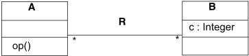

Figure A.2 shows an example for two consecutive states of a system corresponding to the given class model. The object diagrams show instances of classes A and B and links of the association R. The left object diagram shows the state before the execution of an operation, whereas the right diagram shows the state after the operation has been executed. The effect of the operation can be described by the following changes in the post-state: (1) the value of the attribute c in object b 1 has been incremented by one, (2) a new object b 2 has been created, (3) the link between a and b 1 has been removed, and (4) a new link between a and b 2 has been established.

Figure A.2  - Object diagrams showing a pre- and a post-state

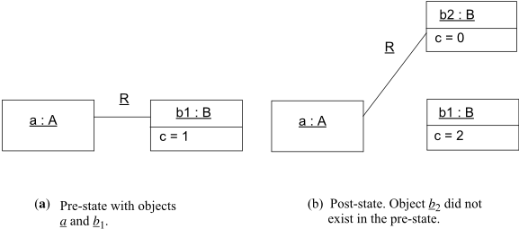

For the following discussion, consider the OCL expression a.b.c where a is a variable denoting the object a . The expression navigates to the associated object of class B and results in the value of the attribute c . Therefore, the expression evaluates to 1 in the pre-state shown in Figure A.2(a). As an example of how the OCL modifier @pre may be used in a postcondition to refer to properties of the previous state, we now look at some variations of the expression a.b.c that may appear as part of a postcondition. For each case, the result is given and explained.

- a.b.c = 0  Because the expression is completely evaluated in the post-state, the navigation from a leads to the b object.

2



- ·
- ·

The value of the attribute c of b 2 is 0 in Figure A.2(b).

a.b@pre.c = 2  This expression refers to both the pre- and the post-state. The previous value of a.b is a reference to  object b 1 . However, since the @pre modifier only applies to the expression a.b , the following reference to the attribute c is evaluated in the post-state of b 1 , even though b 1 is not connected anymore to a . Therefore,  the result is 2.



a.b@pre.c@pre = 1  In this case, the value of the attribute c of object b 1 is taken from the pre-state. This expression is semantically equivalent to the expression a.b.c in a precondition.



· a.b.c@pre =   The expression a.b evaluated in the post-state yields a reference to object b 2 which is now connected to a . Since b 2 has just been created by the operation, there is no previous state of b 2 . Hence, a reference to the  previous value of attribute c is invalid.



Note that the @pre modifier may only be applied to operations not to arbitrary expressions. An expression such as (a.b)@pre is syntactically illegal.

OCL provides the standard operation oclIsNew for checking whether an object has been created during the execution of an operation. This operation may only be used in postconditions. For our example, the following conditions indicate that the object b 2 has just been created in the post-state and b 1 already existed in the pre-state.

```
· a.b.oclIsNew = true · a.b@pre.oclIsNew = false
```

## A.3.2.2  Syntax and Semantics of Postconditions

All common OCL expressions can be used in a precondition P . Syntax and semantics of preconditions are defined exactly like those for plain OCL expressions in sub clause A.3.1. Also, all common OCL expressions can be used in a postcondition Q . Additionally, the @pre construct, the special variable result , and the operation oclIsNew may appear in a postcondition. In the following, we extend Definition A.29 for the syntax of OCL expressions to provide these additional features.

## Definition A.31 (Syntax of Expressions In Postconditions)

Let op be an operation with a set of parameters PARAMS op . The set of parameters includes at most one parameter of kind 'return.' The basic set of expressions in postconditions is defined by repeating Definition A.29 while substituting all occurrences of Expr t with Post-Expr t . Furthermore, we define that:

- Each non-return parameter p  PARAMSop  with a declared type t is available as variable: p  Var t .
- If PARAMS op  contains a parameter of kind 'return' and type t then result is a variable: result  Var t .
- The operation oclIsNew : c  Boolean is in  M for all object types c  TM .

The syntax of expressions in postconditions is extended by the following rule.

```
vii. If  : t 1 x . . . x t n  t   M and e i  Post-Expr t' for all i = 1 , . . . , n then  @pre ( e 1 , . . . , e n )  Post-Expr t' .
```



All general OCL expressions may be used in a postcondition. Moreover, the basic rules for recursively constructing expressions do also apply. Operation parameters are added to the set of variables. For operations with a return type, the variable result refers to the operation result. The set of operations is extended by oclIsNew which is defined for all object types. Operations  @pre are added for allowing references to the previous state (vii). The rule says that the @pre modifier may be applied to all operations, although, in general, not all operations do actually depend on a system state (for example, operations on data types). The result of these operations will be the same in all states. Operations that do depend on a system state are, e.g., attribute access and navigation operations.

For a definition of the semantics of postconditions, we will refer to environments describing the previous state and the state resulting from executing the operation. An environment  = (  ,  is a pair consisting of a system state  and a variable assignment  (see sub clause A.3.1.2). The necessity of including variable assignments into environments will be discussed shortly. We call an environment  pre  = (  pre ,  pre ) describing a system state and variable assignments before the execution of an operation a pre-environment . Likewise, an environment  post = (  post ,  post ) after the completion of an operation is called a post-environment .

## Definition A.32 (Semantics of Postcondition Expressions)

Let Env be the set of environments. The semantics of an expression e  Post-Expr t is a function I [[ e ]] : Env x Env  I ( t ). The semantics of the basic set of expressions in postconditions is defined by repeating Definition A.30 while substituting all occurrences of Expr t with Post-Expr t . References to I [[ e ]]( r ) are replaced by I [[ e ]]( r pre , r post ) to include the pre-environment. Occurrences of r are changed to r post   which is the default environment in a postcondition.

- For all p  PARAMSop : I [[ p ]]( r pre , r post ) =  post ( p ).
- Input parameters may not be modified by an operation: kind( p ) = in implies  pre ( p ) =  post ( p ).
- Output parameters are null on entry: kind( p ) = out implies  pre ( p ) = ε .



- I [[ result ]]( r pre , r post) =  post( result ).

<!-- formula-not-decoded -->

<!-- formula-not-decoded -->

Standard expressions are evaluated as defined in Definition A.30 with the post-environment determining the context of evaluation. Input parameters do not change during the execution of the operation. Therefore, their values are equal in the pre- and post-environment. The value of the result variable is determined by the variable assignment of the postenvironment. The oclIsNew operation yields true if an object did not exist in the previous system state. Operations referring to the previous state are evaluated in context of the pre-environment (vii). Note that the operation arguments may still be evaluated in the post-environment. Therefore, in a nested expression, the environment only applies to the current operation, whereas deeper nested operations may evaluate in a different environment.

With these preparations, the semantics of an operation specification with pre- and postconditions can be precisely defined as follows. We say that a precondition P satisfies a pre-environment r pre  - written as r pre | = P - if the expression P evaluates to true according to Definition A.30. Similarly, a postcondition Q satisfies a pair of pre-and post-environments, if the expression Q evaluates to true according to Definition A.32:



<!-- formula-not-decoded -->

Definition A.33 (Semantics of Operation Specifications)

The semantics of an operation specification is a set R  Env x Env defined as

```
[[ context C :: op ( p 1 : T 1 , . . . , p n : T n ) pre: P  post: Q ]] = R
```



where R is the set of all pre- and post-environment pairs such that the pre-environment r pre satisfies the precondition P and the pair of both environments satisfies the postcondition Q :

```
R = {( r pre , r post ) | r pre | = P ^ ( r pre , r post ) | = Q }
```

The satisfaction relation for Q is defined in terms of both environments since the postcondition may contain references to the previous state. The set R defines all legal transitions between two states corresponding to the effect of an operation. It therefore provides a framework for a correct implementation.

## Definition A.34 (Satisfaction of Operation Specifications)

An operation specification with pre- and postconditions is satisfied by a program S in the sense of total correctness if the computation of S is a total function fS : dom( R )  im( R ) and graph( fS )  R .

In other words, the program S accepts each environment satisfying the precondition as input and produces an environment that satisfies the postcondition. The definition of R allows us to make some statements about the specification. In general, a reasonable specification implies a non-empty set R allowing one or more different implementations of the operation. If R =  , then there is obviously no implementation possible. We distinguish two cases: (1) no environment satisfying the precondition exists, or (2) there are environments making the precondition true, but no environments do satisfy the postcondition. Both cases indicate that the specification is inconsistent with the model. Either the constraint or the model providing the context should be changed. A more restrictive definition might even prohibit the second case.

## Annex B:  Bibliography

## (informative)

[AFGP96] A. Artale, E. Franconi, N. Guarino, and L. Pazzi. Part-whole relations in object-centered systems: An overview. Data &amp; Knowledge Engineering , 20(3):347-383, November 1996.

[AHV95] S. Abiteboul, R. Hull, and V. Vianu. Foundations of Databases . Addison-Wesley, 1995.

[Akehurst2001] D.H. Akehurst and B. Bordbar, On Querying UML Data Models with OCL, proceedings of the UML 2001 conference.

[BHSOG01] F. Barbier, B. Henderson-Sellers, A. L. Opdahl, and M. Gogolla. The whole-part relationship in the Unified Modeling Language: A new approach. In K. Siau and T. Halpin, editors, Unified Modeling Language: Systems Analysis, Design and Development Issues , chapter 12, pages 185-209. Idea Publishing Group, 2001.

[BHS99] F. Barbier and B. Henderson-Sellers. Object metamodeling of the whole-part relationship. In C. Mingins, editor, Proceedings of TOOLS Pacific 1999 . IEEE Computer Society, 1999.

[CKM+99] S. Cook, A. Kleppe, R. Mitchell, B. Rumpe, J. Warmer, and A. Wills. The Amsterdam manifesto on OCL. Technical Report TUM-I9925, Technische Universit¨at M¨unchen, December 1999.

[Clark2000] Tony Clark, Andy Evans, Stuart Kent, Steve Brodsky, Steve Cook, A feasibility Study in Rearchitecting UML as a Family of Languages using a Precise OO Meta-Modeling Approach, version 1.0 , September 2000, available from www.puml.org.

[Cla99] T. Clark. Type checking UML static diagrams. In R. France and B. Rumpe, editors, UML'99 - The Unified Modeling Language. Beyond the Standard . Second International Conference, Fort Collins, CO, USA, October 28-30. 1999, Proceedings, volume 1723 of LNCS , pages 503-517. Springer, 1999.

[CW85] L. Cardelli and P. Wegner. On understanding types, data abstraction and polymorphism. ACM Computing Surveys , 17(4):471-522, December 1985.

[Dat90] C. J. Date. An Introduction to Database Systems - Vol. I . Addison-Wesley, Reading (MA), 1990.

[EN94] R. Elmasri and S. B. Navathe. Fundamentals of Database Systems . The Benjamin/Cummings Publishing Company, Inc., 2 edition, 1994.

[Gog94] M. Gogolla. An Extended Entity-Relationship Model - Fundamentals and Pragmatics , volume 767 of LNCS . Springer, Berlin, 1994.

[GR99] M. Gogolla and M. Richters. Transformation rules for UML class diagrams. In J. B´ezivin and P.-A. Muller, editors, The Unified Modeling Language, UML'98 - Beyond the Notation. First International Workshop, Mulhouse, France, June 1998, Selected Papers , volume 1618 of LNCS , pages 92-106. Springer, 1999.

[Her95] R. Herzig. Zur Spezifikation von Objektgesellschaften mit TROLL light . VDI-Verlag, D¨usseldorf, Reihe 10 der Fortschritt-Berichte, Nr. 336, 1995. (Dissertation, Naturwissenschaftliche Fakult¨at, Technische Universit¨at Braunschweig, 1994).

[HSB99] B. Henderson-Sellers and F. Barbier. Black and white diamonds. In R. France and B. Rumpe, editors, UML'99 - The Unified Modeling Language. Beyond the Standard . Second International Conference, Fort Collins, CO, USA, October 28-30. 1999, Proceedings, volume 1723 of LNCS , pages 550-565. Springer, 1999.

[Kleppe2000] Anneke Kleppe and Jos Warmer, Extending OCL to include Actions , in Andy Evans, Stuart Kent and Bran Selic (editors), &lt;&lt;UML&gt;&gt;2000 - The Unified Modeling Language. Advancing the Standard. Third International Conference, York, UK, October 2000, Proceedings, volume 1939 of LNCS . Springer, 2000.

[Kleppe2001] Anneke Kleppe and Jos Warmer, Unification of Static and Dynamic Semantics of UML: a Study in redefining the Semantics of the UML using the pUML OO Meta Modeling Approach, available from:  http://www.klasse.nl/english/uml/uml-semantics.html.

[Mot96] R. Motschnig-Pitrik. Analyzing the notions of attribute, aggregate, part and member in data/knowledge modeling. The Journal of Systems and Software , 33(2):113-122, May 1996.

[Pri97] S. Pribbenow. What's a part? On formalizing part-whole relations. In Foundations of Computer Science: Potential - Theory - Cognition , volume 1337 of LNCS , pages 399-406. Springer, 1997.

[Richters1998] Mark Richters and Martin Gogolla. On formalizing the UML Object Constraint Language OCL . In Tok Wang Ling, Sudha Ram, and Mong Li Lee, editors, Proc. 17th Int. Conf. Conceptual Modeling (ER'98) , volume 1507 of LNCS , pages 449-464. Springer, 1998.

[Richters1999] Mark Richters and Martin Gogolla, A metamodel for OCL , in Robert France and Bernhard Rumpe, editors, UML'99 - The Unified Modeling Language. Beyond the Standard. Second International Conference, Fort Collins, CO, USA, October 28-30. 1999, Proceedings, volume 1723 of LNCS . Springer, 1999.

[Ric02] M. Richters. A Precise Approach to Validating UML Models and OCL Constraints . Ph.D. thesis, Universit¨at Bremen, Logos Verlag, Berlin, BISS Monographs, No. 14, 2002.

[Tho99] S. Thompson. Haskell: The Craft of Functional Programming . Addison-Wesley, 2nd edition, 1999.

[Warmer98] Jos Warmer en Anneke Kleppe, The Object Constraint Language: precise modeling with UML , AddisonWesley, 1999.

## Index

BooleanLiteralExp  53

|                                                                           | concrete syntax 82                                             |
|---------------------------------------------------------------------------|----------------------------------------------------------------|
| Symbols                                                                   | well-formedness rules 56                                       |
|                                                                           | BooleanLiteralExpEval 128                                      |
| - 157, 159, 168                                                           | well-formedness rules 131, 145                                 |
| @pre 14, 26, 99                                                           | BooleanType                                                    |
| * 10, 157, 159, 163 / 158, 159, 163                                       | operations 43                                                  |
| + 157, 159, 160, 162                                                      |                                                                |
|                                                                           | C                                                              |
| < 158, 161, 163                                                           | CallExp 45                                                     |
| <= 158, 161, 163                                                          |                                                                |
|                                                                           | casting 13                                                     |
| >= 158, 161, 164                                                          | characters 161 class features 24                               |
| <> 153, 154, 155, 165 = 153, 154, 155, 165, 168, 171, 174 > 158, 161, 163 | class properties 24 Classifier                                 |
|                                                                           | additional operations 64                                       |
| A                                                                         |                                                                |
|                                                                           | type conformance 40                                            |
| abs 158, 159 abstract syntax                                              | closure operation 31, 58, 177                                  |
| tree 69 Additional Information                                            | collation order 151                                            |
| 2                                                                         | collect operation 29, 58, 178                                  |
| Additional operations Package 143                                         | shorthand 30                                                   |
| AS-Domain-Mapping.type-value Evaluations package 138                      | Collection 164 collection operations                           |
| Values package 117                                                        | reject 28 select 28                                            |
|                                                                           | 25, 28 collect 29                                              |
| and 162                                                                   | exists 31                                                      |
| any operation 57, 177                                                     |                                                                |
| AnyType 38                                                                |                                                                |
| append 169, 174                                                           | collection type hierarchy 26 CollectionItem 53                 |
| asBag 167, 169, 171, 173, 176 asOrderedSet 167, 169, 171,                 | well-formedness rules CollectionItemEval 128                   |
| 173, 176 asSequence 167, 169, 171, 173, 176                               | 56 well-formedness rules 145                                   |
| asSet 167, 169, 171, 173, 176 AssociationClassCallExp 48, 124             | 131, CollectionKind 53                                         |
| AssociationClassCallExpEval                                               | CollectionLiteralExp 53                                        |
| 124,                                                                      |                                                                |
| 130 well-formedness rules 130, 143                                        | concrete syntax 77 well-formedness rules                       |
| AssociationEnd 125                                                        | 57 CollectionLiteralExpEval                                    |
| AssociationEndCallExp 124 AssociationEndCallExpEval 124, 130              | 128 well-formedness rules 131, 145 CollectionLiteralPart 53    |
| well-formedness rules 130, 144                                            | concrete syntax 78                                             |
| associativity 15                                                          | well-formedness rules 56                                       |
| at 161, 170, 175                                                          |                                                                |
| attribute grammar 69 inherited attributes 69                              | CollectionLiteralPartEval 128 well-formedness rules 131, 145   |
| synthesized attributes 69 AttributeCallExp 125                            | CollectionRange 53 concrete syntax 79 well-formedness rules 57 |
| well-formedness rules                                                     |                                                                |
| 56 AttributeCallExpEval 125                                               | CollectionRangeEval                                            |
| well-formedness rules 130,                                                | 128 additional operations well-formedness rules                |
| 145                                                                       | 138 131, 164                                                   |
| B                                                                         | 146                                                            |
| Bag 169, 180 BagType 38                                                   | Collection-Related Typed collections 24                        |
| type conformance 40 well-formedness                                       | collections of collections 26 collections operations forAll 30 |
| rules BagTypeValue 111                                                    | CollectionType 37, 38                                          |
| 43 well-formedness rules                                                  | type conformance                                               |
| 115                                                                       |                                                                |
| basic types 10                                                            | 41 well-formedness                                             |
| BasicOCL 197                                                              | rules 43 collectionType                                        |
| body expression                                                           | concrete syntax 91                                             |
| 192 body expressions 9                                                    |                                                                |
|                                                                           | CollectionTypeIdentifier                                       |
| bodyExpression 185                                                        | concrete syntax 77                                             |
| Boolean 162                                                               |                                                                |

CollectionValue  111

well-formedness rules  115, 142

collectNested  180, 181, 182, 183

collectNested operation  59, 178

combining properties  20

comment  16

comments  16, 105

concat  160

Conformance  1

context  8

contextual classifier  185

count  165, 169, 173, 174

country  151

## D

Definitions  2

derived value  9

derived value expression  191

disambiguating rules  70

div  159, 163

DomainElement  111

well-formedness rules  115, 142

## E

Element  112

EBNF  69

well-formedness rules  115, 142

enumeration types  11

EnumLiteralExp  53

concrete syntax  76

well-formedness rules  57

EnumLiteralExpEval  129

well-formedness rules  132, 146

EnumValue

well-formedness rules  116, 142

Environment  69, 105

additional operations  105

environment  119

equalsIgnoreCase  161

EssentialOCL  197

EvalEnvironment  121

additional operations  138

well-formedness rules  132, 146

evaluation  109, 119, 121

evaluations package  130

excludes  165

excludesAll  166

excluding  168, 172, 175

exists operation  31, 59, 178

ExpressionInOcl  185

ExpressionInOclEval  121

well-formedness rules  132

Expressions package  37

abstract syntax  44

expressions package  44

## F

FeatureCallExp  46, 48

false  157

first  170, 175

flatten  167, 169, 173, 174

floor  158

forAll operation  30, 59, 179

## G

getValueOf  118

getCurrentValueOf  117

guard  192

## H

How to Read this Specification  3

hasReturned  156

## I

identifier  73

IfExp  46, 50

concrete syntax  103

well-formedness rules  57

IfExpEval  126

well-formedness rules  132

implicit collect  15, 84, 93, 108

implicit self  35

implicit set  15, 108, 153

implicit source  32

implies  162

includes  165

includesAll  165

including  168, 172, 175

indexOf  160, 170, 175

infix operators  15

initial value  9

initial value expression  190

insertAt  170, 175

Integer  157, 159

IntegerLiteralExp  54

well-formedness rules  57, 63

IntegerLiteralExpCS  81

IntegerLiteralExpEval  129

well-formedness rules  132, 146

intersection  168, 172

invalid  152

invalid value  10, 16, 203, 212

InvalidType

operations  43

invariant  8

invariants  8

isAsyncOperation  114

isEmpty  166

ISO 3166  151

ISO 639  151

isOperationCall  156

isSignal  114

isSignalSent  156

issues/problems  xvi

isSyncOperation  114

isUnique operation  59, 179

Iterate Operation  32

iterate operation  32

IterateExp  46

concrete syntax  88

well-formedness rules  61

IterateExpEval  121

well-formedness rules  132, 146

IteratorExp  46, 57, 121

concrete syntax  84

IteratorExpEval  121

well-formedness rules  133, 146

## J

job  21

## K

keywords  16

## L

language  151

language attribute  186

last  170, 175

legend  6

Let expression  130

let expression  11

LetExp  55

concrete syntax  100

well-formedness rules  61

LetExpEval  130

well-formedness rules  133, 146

LiteralExp  46

concrete syntax  76

well-formedness rules  61

LiteralExpEval  121

well-formedness rules  134, 146

locale  151, 154

LocalSnapshot  112

additional operations  117

well-formedness rules  116

LocalSnapshots  113

LoopExp  46

concrete syntax  84

LoopExpEval  121

well-formedness rules  134, 146

## M

mapping

abstract syntax to concrete syntax  108

abstract syntax to semantic domain  109, 139

concrete syntax to abstract syntax  69, 108

max  158, 159, 163, 166

message expression  32

MessageExp  47, 51

min  158, 159, 163, 166

Missing

association end name  19

association name  19

missing rolenames  20

mod  159, 163

ModelPropertyCallExp  46

concrete syntax  92

well-formedness rules  61

ModelPropertyCallExpEval  122, 123

well-formedness rules  135, 147

## N

NamedElement  107

Namespace  108

NameValueBinding  113

well-formedness rules  116

NameValueBindings  113

navigation

associations with multiplicity zero or one  20

from association class  22

through qualified associations  22

to association class  21

Navigation Operators  15

Navigation Shorthands  15

NavigationCallExp  49, 125

concrete syntax  98

NavigationCallExpEval  125

well-formedness rules  135, 147

Normative References  2

not  162

notEmpty  166

null value  10, 152, 203, 212

NumericLiteralExp  54

well-formedness rules  61

NumericLiteralExpEval  129

well-formedness rules  135, 147

## O

Object Constraint Language (OCL)  5

Object Management Group, Inc. (OMG)  xv

ObjectValue  113

additional operations  117

well-formedness rules  116, 142

OCL expression  185

Ocl message expressions  126

OCL Standard Library  151

OclAny  152

oclLocale  151, 154

oclAsSet  20, 22, 152, 153, 154, 155

oclAsType  153, 154, 155

OclExpEval  122, 127

well-formedness rules  135, 147

OclExpression  47, 127

concrete syntax  72

well-formedness rules  61

OclInvalid  155

oclIsInState  154, 155

oclIsInvalid  153, 155

oclIsKindOf  154, 155

oclIsNew  153, 155, 156

oclIsTypeOf  154, 155, 156

oclIsUndefined  153, 155, 156

oclLocale  151

OclMessageArg

concrete syntax  103

OclMessageArgEval  126

well-formedness rules  136, 149

OclMessageExp  47, 127

concrete syntax  101

OclMessageExpEval  122, 127

well-formedness rules  135, 147

OclMessageType

well-formedness rules  43

OclMessageValue

well-formedness rules  116, 142

oclType  154, 155, 156

concrete syntax  91

OclVoid  154

OclVoidValue  114

well-formedness rules  116

OMG specifications  xv

one operation  60, 179

Operation

additional operations  65

operation definition  12

OperationCallExp  49, 125

concrete syntax  93

well-formedness rules  62

OperationCallExpEval

well-formedness rules  137, 149

or  162

OrderedSetType  39

well-formedness rules  43

outgoingMessages  118

## P

package statements  9

parse  71

parsing  71

pathNameCS  75

pathnames  22

placement  185

postcondition  8, 189

postconditions  8

pre and postconditions  8

precedence rules  14

precondition  8, 188

preconditions  8

predefined properties  23

prepend  170, 174

previous values in postconditions  26

PrimitiveLiteralExp  54

concrete syntax  79

PrimitiveLiteralExpEval  129

well-formedness rules  137, 150

primitiveType

concrete syntax  90

PrimitiveValue  114

well-formedness rules  116, 142

product  166

production rule  69

properties  17

association ends and navigation  18

attributes  17

operations  18

properties of object  17

PropertyCallExp  122

concrete syntax  83, 97

PropertyCallExpEval  122

well-formedness rules  137, 150

PropertyCallExpression  49

propertyContextDecl

concrete syntax  194

## Q

Qualified association end  19

| qualified association 22 qualifier 22 R Real 156, 157, 164 RealLiteralExp 54 concrete syntax 81 well-formedness rules 63 RealLiteralExpEval 129                                                                       |
|-----------------------------------------------------------------------------------------------------------------------------------------------------------------------------------------------------------------------|
| result values 33 re-typing 13 reverse 171, 176 round 158 S Scope 1, 3, 5, 37, 69,                                                                                                                                     |
| self.job 21 self.manager 20 semantic domain 109 Sequence 165, 174, 181 SequenceType 39 type conformance 42                                                                                                            |
| well-formedness rules 44 SequenceTypeValue 115                                                                                                                                                                        |
| well-formedness rules 117, 142                                                                                                                                                                                        |
| Set 167, 169, 179 SetType 39 type conformance 42                                                                                                                                                                      |
| well-formedness rules 44 SetTypeValue 115                                                                                                                                                                             |
| well-formedness rules 117, 142                                                                                                                                                                                        |
| shorthand for collect 30 simpleNameCS 73 size 160, 165 183                                                                                                                                                            |
| 109, select 28, 180, 181, 182 select operation 28, 60, 179 selectByKind 14, 166, 169, 173, 176 selectByType 14, 167, 169, self 7 self instance 185                                                                    |
| well-formedness rules 137, 150 References 2 reject 28, 180, 181, 182, 183 reject operation 28, 60, 179 reserved word 16, 71, 73, 107, 198 restricted word 16, 198 restrictedKeyword concrete syntax 74 result 18, 156 |
| 151, 185, 197                                                                                                                                                                                                         |
| 171, 171, 173, 176                                                                                                                                                                                                    |
| sortedBy 180, 181, 182,                                                                                                                                                                                               |
| sortedBy operation 60, 179                                                                                                                                                                                            |
| State                                                                                                                                                                                                                 |
| 66                                                                                                                                                                                                                    |
| additional operations                                                                                                                                                                                                 |
| StateExp 47 StaticValue 115                                                                                                                                                                                           |
| well-formedness rules 117, 142 String 157, 160                                                                                                                                                                        |
| StringLiteralExp 54                                                                                                                                                                                                   |
| concrete syntax 82                                                                                                                                                                                                    |

| StringLiteralExpEval 129 well-formedness rules 150 subOrderedSet 170                                                                                                                                                                                                                                                                                                             |                                              |
|----------------------------------------------------------------------------------------------------------------------------------------------------------------------------------------------------------------------------------------------------------------------------------------------------------------------------------------------------------------------------------|----------------------------------------------|
| subSequence 175 substring 160 sum 166, 171, 176 Symbols 2 symmetricDifference 168 T Terms and definitions toBoolean 161 toInteger 160, 164 toLowerCase 160 tool-builder 71 toReal 160 toString 158, 159, toUpperCase 160 Transition additional operations true 157 TupleLiteralExp 54 concrete syntax 80 well-formedness TupleLiteralExpEval well-formedness TupleLiteralExpPart | 2 162, 164 66 rules 63 129 rules 137, 150 55 |
| TupleLiteralExpPartEval tuples 27 TupleType 37, 39, 40 additional operations 66 type conformance 42 well-formedness rules TupleValue 115 additional operations                                                                                                                                                                                                                   | 129                                          |
| 44 118 well-formedness rules 117, Type concrete syntax 90                                                                                                                                                                                                                                                                                                                        | 143                                          |
| type conformance 12, Type conformance rules 26 type conformance rules 40 TypeExp 47 TypeLiteralExp concrete syntax 83 types from the UML model Types package 37 abstract syntax 37 typographical conventions xvi U                                                                                                                                                               | 26, 40 11                                    |
| undefined 203 undefined value 203 UndefinedValue well-formedness rules                                                                                                                                                                                                                                                                                                           | 143                                          |
| underscore prefix 107 underscore-prefix 16 Unicode 73, 151                                                                                                                                                                                                                                                                                                                       |                                              |
| Technical Standard#10 union 167, 168, 171, 172, unlimited 157                                                                                                                                                                                                                                                                                                                    | 151                                          |
|                                                                                                                                                                                                                                                                                                                                                                                  | 174                                          |
| UnlimitedNatural 162                                                                                                                                                                                                                                                                                                                                                             |                                              |

UnlimitedNaturalLiteralExpCS  80

UnlimitedNaturalLiteralExpEval  129, 137, 150

UnpecifiedValueExp  51

UnspecifiedValueExp  51

well-formedness rules  63

UnspecifiedValueExpEval  127

well-formedness rules  138, 150

use of OCL expressions  5

## V

additional operations  143

Value  115

well-formedness rules  117, 143

VariableDeclaration  47, 127

concrete syntax  89

VariableDeclEval  123

well-formedness rules  138, 150

VariableExp  48, 123

concrete syntax  73

well-formedness rules  64

VariableExpEval  123

well-formedness rules  138, 150

visibility  71

VoidType  40

operations  44

type conformance  42

## W

Well-formedness Rules

AS-Domain-Mapping.exp-eval package  143

AS-Domain-Mapping.type-value package  142

Evaluations package  130

Well-formedness rules

Expressions package  56

Types Package  43

Values package  115

## X

xor  162

XSD and XMI for MOF 2.0  239