> Converted from [`lecture-0-introduction.pdf`](lecture-0-introduction.pdf) with docling. Figures are in [`lecture-0-introduction-images/`](lecture-0-introduction-images/). Page numbers for each section are in [`INDEX.md`](../INDEX.md).

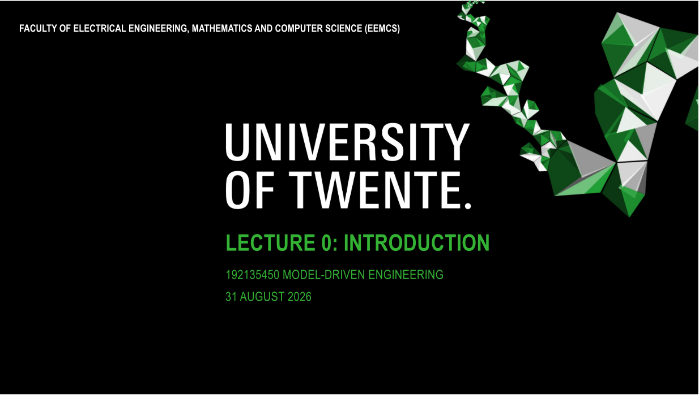

## IN THIS PRESENTATION:

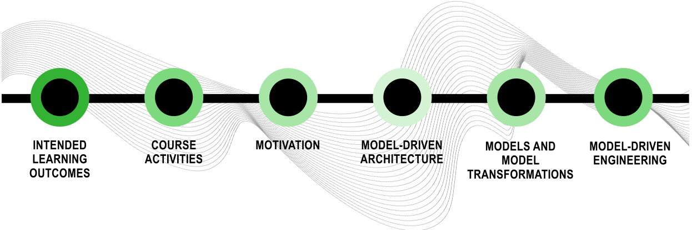

## TEACHERS

- Dr. Luís Ferreira Pires e-mail: l.ferreirapires@utwente.nl
- Dr. João Luiz Rebelo Moreira e-mail: j.luizrebelomoreira@utwente.nl

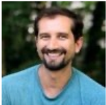

## INTENDED LEARNING OUTCOMES

| Explain                              | the principles and main concepts of Model-Driven Engineering (e.g., model, metamodel, model transformation, model-to-text transformation)                                          |
|--------------------------------------|------------------------------------------------------------------------------------------------------------------------------------------------------------------------------------|
| Apply                                | the Model-Driven Engineering concepts in projects of medium complexity                                                                                                             |
| Identify and evaluate                | alternative solutions for model-driven development of small and medium size projects starting from a domain- specific problem description and finishing with a working application |
| Critically evaluate and select among | new and emerging model-driven tools and technologies                                                                                                                               |

## COURSE PREREQUISITES

## Mandatory

- Bachelor degree

## Convenient

- Software Engineering Models
- Design of Software Architectures
- Software Management
- Or equivalent…

## COURSE ACTIVITIES

## Lectures

- Eight sessions (plus one reserved for students' presentations)

## Practical sessions

- Performed in groups of 2 students
- Seven practical sessions
- Last sessions are dedicated to the project

## Final exam

- Checks insight and reflection on MDE technologies

## LECTURES

|   Week | Date           | Subject                                                        |
|--------|----------------|----------------------------------------------------------------|
|     36 | Mon 31/08/2026 | 0. Introduction                                                |
|        | Mon 31/08/2026 | 1. Modelling and metamodelling                                 |
|     37 | Mon 07/09/2026 | 2. Object Constraint Language / Domain-Specific Languages      |
|     38 | Mon 14/09/2026 | 3. Textual Concrete Syntaxes (Xtext)                           |
|     39 | Mon 21/09/2026 | 4. Transformation languages I                                  |
|     40 | Mon 28/09/2026 | 5. Transformation languages II                                 |
|     41 | Mon 05/10/2026 | 6. Model to Text Transformation / Transformations in Java      |
|     42 | Mon 12/10/2026 | Reserved for project consultation &#124; project presentations |
|     43 | Mon 19/10/2026 | 7. Open issues and evaluation &#124; Guest lecture             |

## BOOK

- Excellent reference for Model-Driven Engineering
- Not mandatory, but highly recommended to understand better what is presented during the lectures
- Second edition is preferred

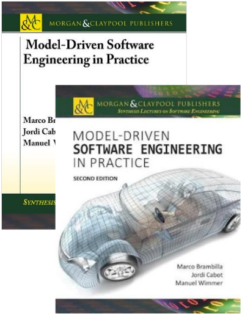

## PROJECT

## Goal

- Application of MDE technologies to solve a specific problem

## Tasks

· Task 0: Project description. No marking but approval · Task 1: Metamodelling · Task 2: Transformations · Task 3: Text (code) generation Reports and code are submitted and assessed (graded) 11/09 25/09 16/10 30/10

## Presentation

- Each student presents at least once (for individual grading)
- After the presentation, both students answer questions

## PROJECT TYPES

## Type 1: Interoperability

- Two tools have similar purposes but use different data structures

## Type 2: Model discovery ('Harvesting')

- Possibly complex code needs to be analysed based on models generated from the code

## Type 3: Code generation

- Domain experts make domain models that are automatically transformed to some code to be interpreted by a tool

## PRACTICAL SESSIONS

- Practical sessions are scheduled on Thursday 13:45-15:30 (see https://cloud.timeedit.net/nl\_utwente/web/)
- At least one teacher is present during practical sessions
- Practical assignments require technologies like Eclipse EMF, Xtext, ECore, UML/OCL, ATL, QVT OM and Acceleo
- Session deliverables must be uploaded to Canvas afterwards

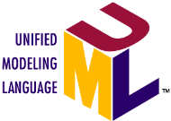

## PRACTICAL SESSIONS

|   Week | Date           | Subject                                                 |
|--------|----------------|---------------------------------------------------------|
|     36 |                | 0. Acquaintance with EMF and Ecore (performed at home!) |
|        |                | 1. Metamodelling                                        |
|     37 | Thu 10/09/2026 | 2. OCL and DSLs                                         |
|     38 | Thu 17/09/2026 | 3. Textual Concrete Syntaxes (Xtext)                    |
|     39 | Thu 24/09/2026 | 4. ATL transformations                                  |
|     40 | Thu 01/10/2026 | 5. QVT transformations                                  |
|     41 | Thu 08/10/2026 | Project consultation &#124; project presentations       |
|     42 | Thu 15/10/2026 | 6. Model to Text Transformation (Acceleo)               |
|     43 | Thu 22/10/2026 | Project consultation &#124; project presentations       |

## ASSESSMENT (GRADING)

## Group assessment

- Three reports on the project: metamodels definition, model transformations and text/code generation

## Individual assessment

- Presentation
- Final exam
- Answers to questions stated in the beginning of each lecture

## Final exam

- Assesses insight and reflection on MDE technologies

## GRADING

## Exam Component ( E )

- Exam grade ( E 0 ) and questions grade (Q): E = 0.9* E 0 + 0.1*Q
- 7 questions for Q , but we divide the sum of the marks by 5

## Project component ( P )

- Grades for metamodels ( P 1 ), model transformations ( P 2 ), code generation ( P 3 ) and presentation (individual, P 4 )
- Project grade ( P ) is the weighted average of P 1 .. P 4 : P  = 0.2* P 1 + 0.3* P 2 + 0.4* P 3 + 0.1* P 4

## FORMULA FOR THE FINAL GRADE

## Final grade

- Exam component lower than 5.5 or Project component lower than 5.0 limits final grade to a maximum of 5.0 (not passing the course)

<!-- formula-not-decoded -->

<!-- formula-not-decoded -->

## COMMUNICATION: CANVAS SITE

## Available information

- Announcements
- Syllabus
- Calendar
- Material
- Grades
- Check this site regularly!
- Give feedback on the site,
- mainly if something is wrong or missing · We will build and maintain the site together!

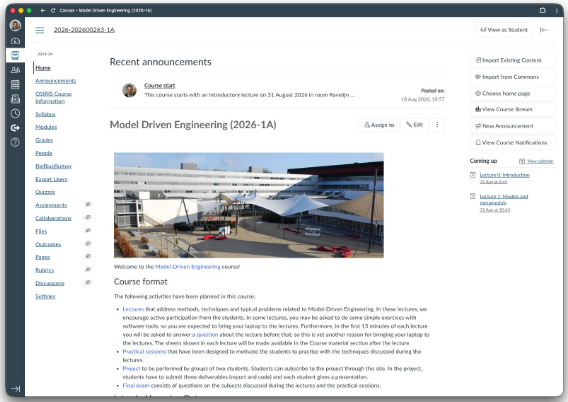

## Do you want a Teams site?

## PROACTIVE ATTITUDE

There is more you need to know than what is told during the lectures in order to do the exercises and the final exam

You learn what you do as a student,

- Not everything can be explained in the lectures
- Basic Java programming · UML modeling (class diagrams) · Use of development tools (Eclipse) · Metamodelling and model transformations · Etc... Constructive alignment not what I do as a teacher!
- ® be prepared to search, read, fight with tools and bugs, and think a lot!

## PROACTIVE ATTITUDE

## Originality

- Groups must deliver original work
- ® copying work from other groups will be punished as fraud

## Feedback

- Use the lectures to ask for feedback!
- Consultation hours with teacher about the projects
- Teacher does not know everything, but can help you find the answers ® we are all constantly learning!

Please fill in the Motivation and expectations survey on Canvas!

Dick Dastardly

## USE OF LLMS

Teachers are not cops

+ You are grown-ups who want to learn We will be responsible and open!
- If you use it, be honest about it!
- Discuss this with the teachers beforehand if you are not sure
- Clearly report on which tools you have used, why and how

## USE OF LLMS

In this course, LLMs can be used at two levels:

- Level 1 - AI support (e.g., grammar, language, feedback)
- Level 2 - AI-assisted work (co-creation with clear disclosure)
- Anyway, students are responsible for what they deliver, and should be able to explain what they did
- Failing to do that can have consequences on the grade of the corresponding activity (e.g., a milestone report)

## IN THIS PRESENTATION:

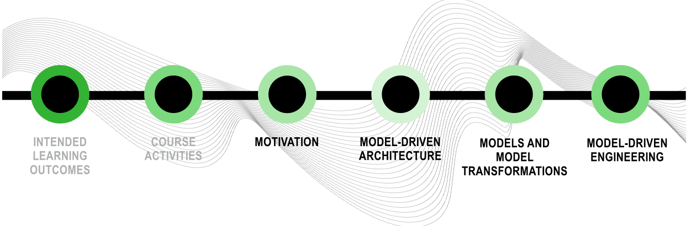

## WHAT SEEMED TO BE 'THE PROBLEM' BACK IN THE 90'S?

- 1.Software projects often failed to meet planned targets
- 2.Software was expensive to build, even more expensive to maintain

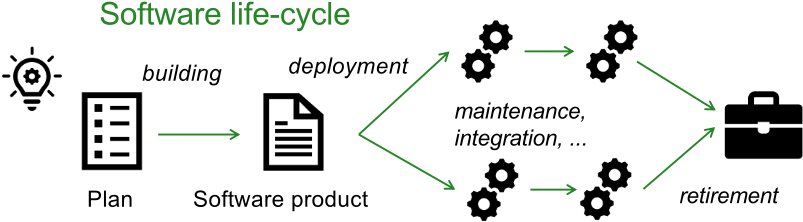

People talked about the 'software crisis'!

## FACTORS THAT AFFECT SOFTWARE DEVELOPMENT

Changing requirements (business)

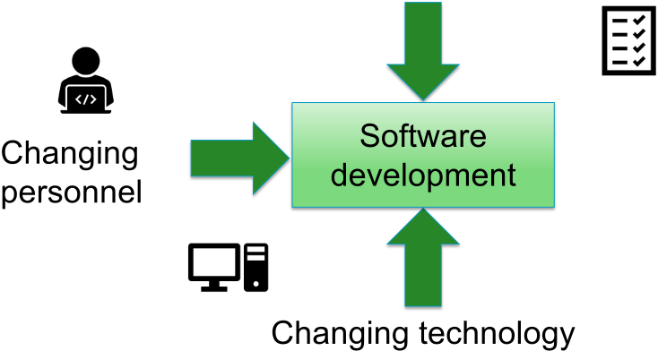

## FACTORS THAT AFFECT SOFTWARE DEVELOPMENT

## System requirements changes

- Strong impact on the existing systems

## Constant technology change

- Various heterogeneous platforms (Java, C#, SOAP, REST)
- Constant need to port applications to new technology
- Software assets in a particular technology are not resilient to changes

## Personnel changes

- When software developers leave a development team their knowledge about the system also disappears

## HOW CAN WE COPE WITH THESE PROBLEMS?

## FROM BUSINESS REQUIREMENTS (FUNCTIONALITY) TO TECHNOLOGY

- Problem
- Business logic (functionality) and technology were too much intertwined
- Change in business logic implied in change in the whole system
- Change in technology implied in change in the same system
- Possible solution
- Create stable assets to protect investments and at the same time to profit from technology advances
- Separation of functionality (concepts) from technology
- In school we learn that this can be done by using models!

## REALITY OF MODELS BACK IN 2000

- The 'model burning party' is an ancient ritual performed by programmers when the so-called architects leave the building for coffee

Thanks to R. Soley (OMG CEO)

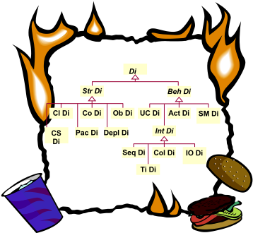

## MODEL-DRIVEN ARCHITECTURE

## Proposed by OMG

- Object Management Group (OMG)
- [http://www.omg.org/mda/         ~ 2001](http://www.omg.org/mda/)

## MDA Guide

- [http://www.omg.org/cgi-bin/doc?ormsc/14-06-01.pdf](http://www.omg.org/cgi-bin/doc?ormsc/14-06-01.pdf)

## Model Driven Architecture

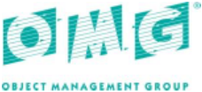

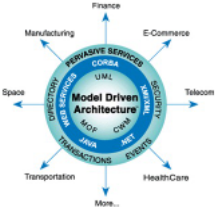

'An approach to IT system specification that separates the specification of functionality from the specification of the implementation of that functionality on a specific technology platform'

## MODEL-DRIVEN ARCHITECTURE

- Approach to the development of software systems that separates functionality from implementation and gives a central role to models
- At a minimum: a sophisticated way of using UML
- At its best: practical and well-founded model support, spanning the complete software lifecycle
- Under the hood: raising the level of abstraction Old wine in a new bottle?

## MDA APPROACH

- Promote models as major software artifacts
- Models beyond mere documentation
- Models are specified at higher abstraction level than implementation logic
- Business logic is specified first, technology-specific information is omitted in the initial models
- Implementations are obtained from models via model transformations
- If new technology is adopted, then new implementation is (automatically) derived via transformations

## BUT WHAT IS A 'MODEL' ANY WAY?

- 'A model is a formal specification of the function, structure and/or behavior of an application or system'(old OMG definition)
- 'A model is information selectively representing some aspect of a system based on a specific set of concerns' (current OMG definition)
- 'A model is an abstraction (also called representation or denotation) of an object system (also called system under study) expressed in some language. An interpretation of a model gives the meaning of the model relative to the object system.' (After Seidewitz, 2003)

In the next lecture we discuss models (and modelling) in more detail

## TYPICAL MDA-BASED DEVELOPMENT

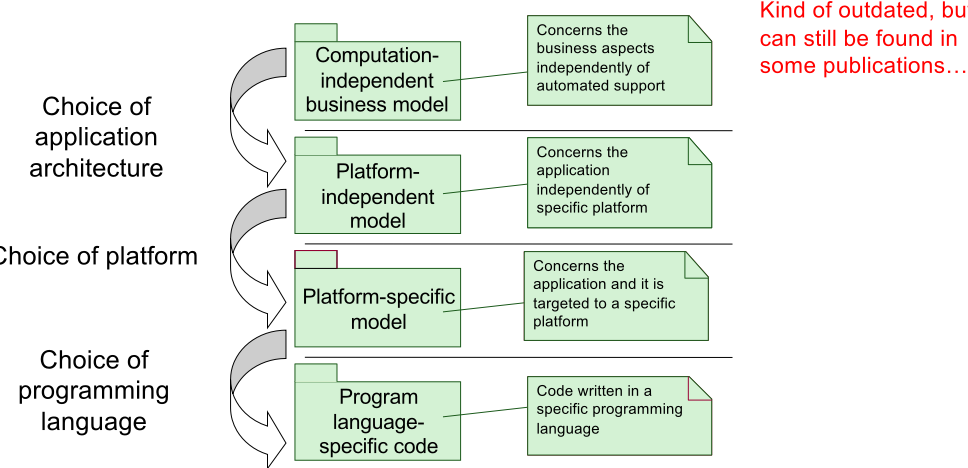

## BUT WHAT IS THEN A 'PLATFORM'?

## Platform

'A set of subsystems/technologies that provide a coherent set of functionality through interfaces and specified usage patterns that any subsystem that depends on the platform can use without concern for the details of how the functionality provided by the platform is implemented' (old definition)

'The set of resources on which a system is realized' (current definition)

## Technologies (resources)

· Java, C#, Linux, Windows, MacOS, XML, HTML, SOAP, UML, J2EE, .NET, JSP, ASP, REST, etc.

## PLATFORM-INDEPENDENT MODELLING

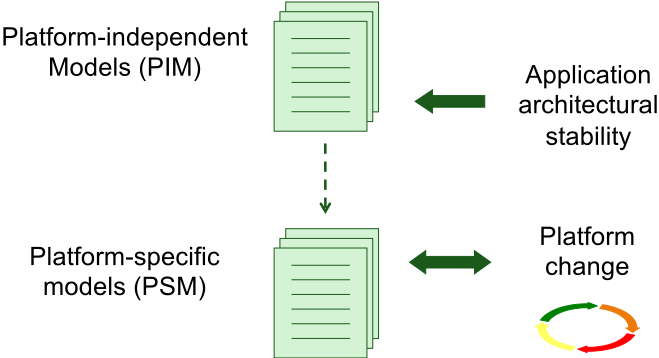

## OMG FOUR-LAYERED METAMODELLING ARCHITECTURE

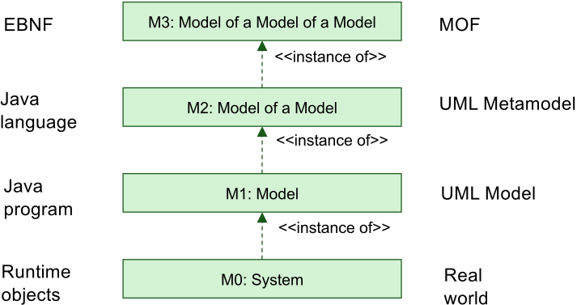

Kleppe et al. 2003

## OMG METALEVELS: EXAMPLE

M3 (MOF)

M2 (UML)

Association

&lt;&lt;instanceOf&gt;&gt;

Class

&lt;&lt;instanceOf&gt;&gt;

&lt;&lt;instanceOf&gt;&gt;

&lt;&lt;instanceOf&gt;&gt;

Attribute

0..n

&lt;&lt;instanceOf&gt;&gt;

M1 (User model)

M0 (Runtime instances)

&lt;&lt;instanceOf&gt;&gt;

classifier

Class InstanceSpecification

&lt;&lt;instanceOf&gt;&gt;

Person +age : Integer

&lt;&lt;snapshot&gt;&gt;

&lt;&lt;instanceOf&gt;&gt;

aPerson

&lt;&lt;instanceOf&gt;&gt;

: Person

age = 28

## WHAT IS A MODEL TRANSFORMATION?

- Process of converting one model (source model) to another model (target model) of the same system (OMG, MDA Guide)

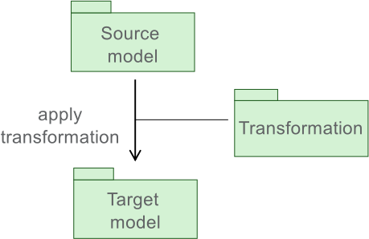

## HOW TO TRANSFORM?

## Example: UML to Java

- Borland Together, Rational Rose in the early days, and many other tools nowadays

## What kind of transformation rules?

- Mappings from source model(s) to target model(s)
- Metamodel / Annotations

## How to specify transformation rules?

- General-purpose language (e.g., in Java)
- Domain-specific transformation languages (e.g., OMG QVT)

## MDA TRANSFORMATION PATTERN

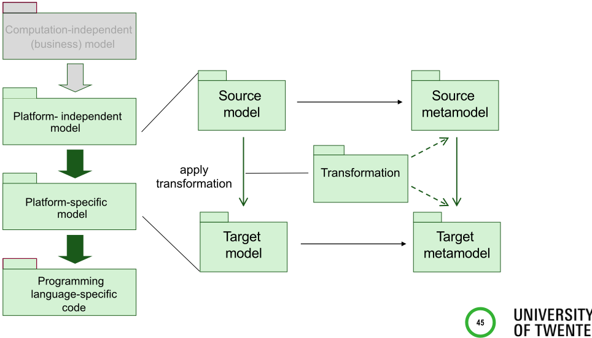

## MDA IS NOT A METHODOLOGY

- MDA prescribes no specific development methodology or process (like RUP, Agile, etc.)
- Any practical use of MDA requires the selection of a development process
- Considering the PIM to PSM step, this means the selection of
- Platform-independent modelling techniques
- Platform-specific modelling techniques
- Transformations that take PIMs as input and produce PSMs as output, or vice-versa
- Etc...

## THE MD* JUNGLE FROM BRAMBILLA ET AL 2017

- MDD is a development paradigm with models as primary artifact
- MDA is an MDD approach based on OMG standards
- MDE goes beyond development, including other engineering tasks
- MBE is more relaxed with respect to the role of models (not necessarily primary artifacts)
- MDSE is about MDE for Software Systems

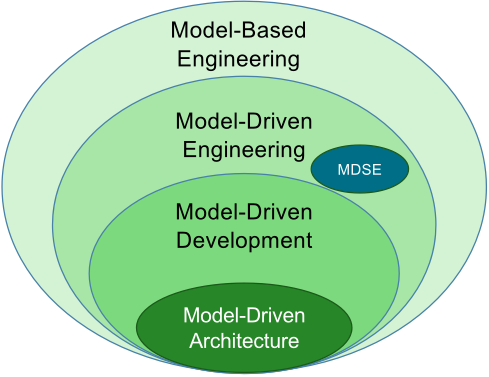

## MODEL-DRIVEN ENGINEERING (MDE)

- Model-Driven Engineering is an engineering approach in which models are the primary artefacts
- Beyond development, involving other engineering tasks, like model and system evolution, reverse engineering, etc.
- Required activities
- Selection of transformations, implementation platforms and development platforms
- Development of metamodels (language engineering and metaprogramming techniques!)

## WHY SHOULD WE USE MDE?

- Raise the level of abstraction via modelling
- Helps manage complexity
- Modelling languages intended for the domain experts (DomainSpecific Languages, DSLs) not for developers
- Better communication between problem domain experts and solution domain experts
- Rigorous techniques for reasoning on models
- Better system quality
- → implicit expectation: better models lead to better implementation

## WHY SHOULD WE USE MDE?

- Better automation via model transformations
- Improve the productivity and time-to-market
- Mature engineering disciplines employ strong modelling techniques
- Closing the gap between software engineering and other engineering disciplines

## IN WHICH PROJECTS IS MDE USEFUL?

## Code generation / Software development

- From models to system (code) by lowering the abstraction levels (adding design details)

## Systems interoperability

- Information abstraction and transformation

## Model discovery (Harvesting)

- From system (code) to model by applying abstraction
- Legacy system modernization, Refactoring
- Large software assets (e.g., libraries): abstracting assets via DSLs

## CODE GENERATION

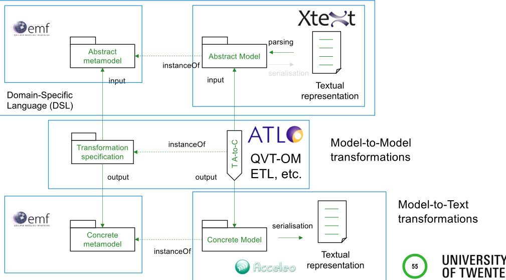

## SYSTEMS INTEROPERABILITY

- Different languages (data representations) for same purpose
- (Semantic) transformations are necessary ('common meaning')

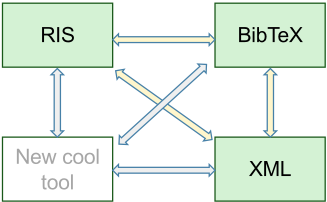

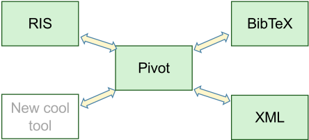

## SYSTEMS INTEROPERABILITY

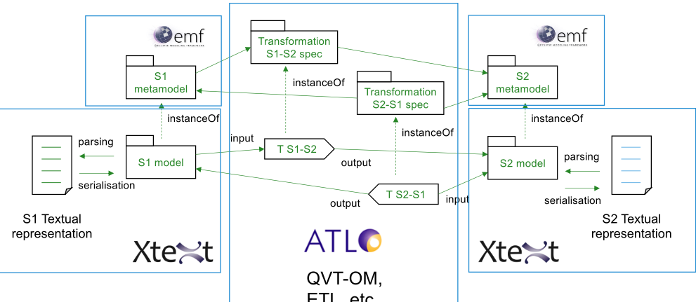

ETL, etc.

## MODEL DISCOVERY (HARVESTING)

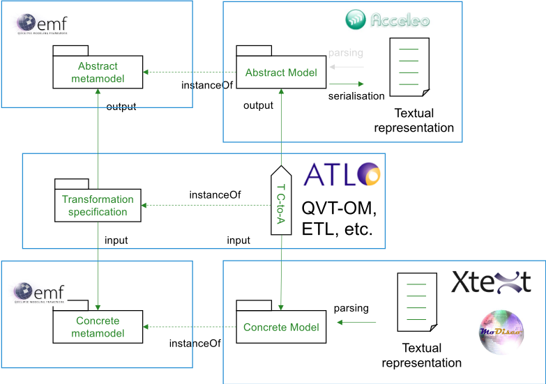

## MDE IN THE INDUSTRY

- Big software vendors support MDA/MDE at different levels
- There are many success stories
- DSLs are (still) spreading
- MDE technologies (especially metamodelling and model transformations) are becoming commodity
- Many tools are available, some free open-source tools exist, but some people find them difficult to learn and use
- Most free MDE tools are based on the Eclipse Modeling Framework (EMF)

## MORE MODERN MDE APPLICATIONS

- Digital threads (hot topic related to Digital Twins) are enabled by Model-Driven / Model-Based Development, especially metamodelling (SysML, DSLs) and model transformations
- Low code programming is supported 'under the hood' by DSLs and code generation

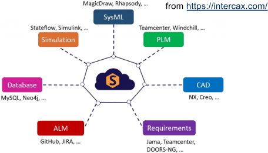

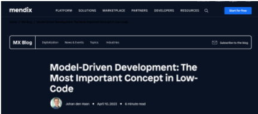

[from https://www.mendix.com/](https://www.mendix.com/)

## TAKE-HOME MESSAGES

- OMG MDA initiative aimed at better separation of functionality (modelling) and technology (implementation) to tackle some software engineering problems
- MDE is an engineering approach with models in a primary role
- MDE is strongly based on metamodelling and model transformations (originally MDA technologies)
- Metamodelling and model transformations are powerful and generally applicable techniques, with many successful applications in software (systems) engineering projects

## REFERENCES

- OMG. MDA Guide rev. 2.0. ormsc/2014-06-01, 2014
- Kent, S. Model Driven Engineering. Proceedings of the Third International Conference on Integrated Formal Methods, pp. 286-298, 2002
- Schmidt, D.C. Guest Editor's Introduction: Model-Driven Engineering. Computer 39(2), pp. 25-31, 2006
- Bezivin, J. and Gerbe, O. Towards a precise definition of the OMG/MDA framework. Proceedings 16th Annual International Conference on Automated Software Engineering (ASE 2001), San Diego, CA, USA, 2001, pp. 273-280
- Paige, R.F., Zolotas, A., Kolovos, D. (2017). The changing face of Model-Driven Engineering. Present and Ulterior Software Engineering. Springer, Cham
- Bucchiarone, A., Cabot, J., Paige, R.F. et al. Grand challenges in Model-Driven Engineering: an analysis of the state of the research. Softw Syst Model 19, 5-13 (2020)

