> Converted from [`lecture-1-models-and-metamodels.pdf`](lecture-1-models-and-metamodels.pdf) with docling. Figures are in [`lecture-1-models-and-metamodels-images/`](lecture-1-models-and-metamodels-images/). Page numbers for each section are in [`INDEX.md`](../INDEX.md).

FACULTY OF ELECTRICAL ENGINEERING, MATHEMATICS AND COMPUTER SCIENCE (EEMCS)

## LECTURE 1: MODELS AND METAMODELS

192135450 MODEL-DRIVEN ENGINEERING 31 AUGUST 2026

## IN THIS PRESENTATION:

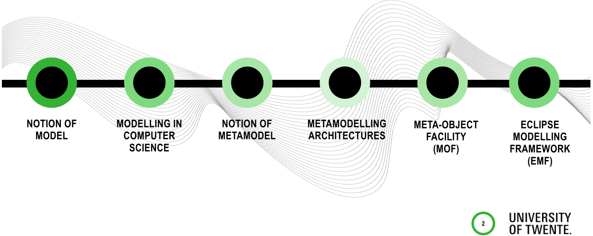

## WHAT IS A 'MODEL'?

## 'AIRPLANE MODEL' IMAGES IN GOOGLE

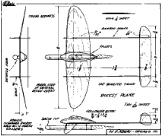

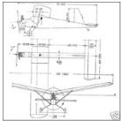

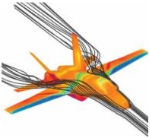

## NOTION OF MODEL

## WHAT IS A MODEL?

- In Latin: 'modulus' means 'small measure' (first used in 1575)
- Merriam-Webster online gives 14 meanings to the noun 'model' (see       ), amongst others
- 'Miniature representation of something; also a pattern of something to be made'
- 'Example for imitation and emulation'
- Different science and engineering disciplines give different definitions of model adapted to their specific context and purposes

## MODELS IN PHILOSOPHY OF SCIENCE DEFINITIONS

'Any subject using a system A that is neither directly nor indirectly interacting with a system B to obtain information about the system B, is using A as a model for B' Leo Apostel, 1960

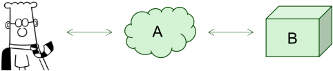

'The object of study in modelling is the real world, where the observerresearcher attempts to detect patterns of recurring relationships which can be represented systematically. To model is to represent this pattern or relationships in a manner which can lead itself to a formal study' John van Gigch

## MODELS IN COMPUTER SCIENCE DEFINITIONS

- 'A model is a purposely abstracted, clear, precise and unambiguous conception'
- 'A model denotation is a precise and unambiguous representation of a model, in some appropriate formal or semiformal language' FRISCO Report *
- 'A model is a representation of a concept. The representation is purposeful: the model purpose is used to abstract from the reality the irrelevant details' Starfield, Smith and Bleloch, 1990

* A Framework of Information Systems Concepts,

[http://www.mathematik.uni-marburg.de/~hesse/papers/fri-full.pdf](http://www.mathematik.uni-marburg.de/~hesse/papers/fri-full.pdf)

## MODELS IN COMPUTER SCIENCE MORE DEFINITIONS

- 'A model of a system is a description or specification of that system and its environment for some certain purpose. A model is often presented as a combination of drawings and text.  The text may be in a modelling language or in a natural language' MDA Guide v1.0.1
- 'A model is information selectively representing some aspect of a system based on a specific set of concerns' MDA Guide rev. 2.0
- 'A model is a simplification of a system built with an intended goal in mind. The model should be able to answer questions in place of the actual system' Bézivin and Gerbe, 2001

## (GENERAL) CHARACTERISTICS OF MODELS

- Representation of something in the real world (some system)
- Simplification (abstraction)
- Conception or concrete representation
- → concrete representation is necessary!
- Purpose: often descriptive, prescriptive or predictive
- Desired qualities: precise, unambiguous, allows analysis

## SYSTEM AND MODEL

- A model requires a part of the real world that is modelled
- System being modelled
- ModelOf relation
- Model can be seen as a role
- A model may also be the subject of modelling → 'Model of a model'

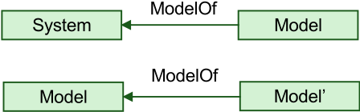

## MODELS AS ABSTRACTIONS

- Abstraction is a powerful cognitive tool for mastering complexity!
- In models, some of the characteristics of the reality are ignored (abstracted from)
- The purpose of the model guides the abstraction process in which models are produced!
- Models are abstractions!

Which characteristics are represented and abstracted from in this model?

## NATURE OF THE MODELOF RELATION

- Denotation: some of the properties of the system are represented or denoted in the model
- Demonstration: knowledge is obtained from the model in the terms of the model elements
- Interpretation: the obtained knowledge is translated in terms of the system

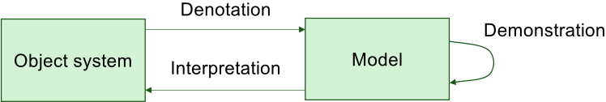

DDI account (Hughes 1999)

## WORKING DEFINITION OF MODEL

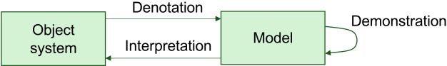

- A model
- represents a part of the reality called the object system
- is expressed in a modelling language
- provides knowledge for a certain purpose
- This knowledge can be interpreted in terms of the object system

## PURPOSE OF MODELS

## [BRAMBILLA, CABOT, WIMMER 2012]

- Models as sketches: used for communication, often partial (incomplete) views of the object system
- Models as blueprints: used to provide detailed and complete specification as prescription of what should be built
- Models as programs: used to develop the system, as opposed to code

http://www.martinfowler.com/bliki/UmlMode.html discusses how UML can be used in these three modes (and is very critical about MDA 😳 )

- MDE stresses 'Models as programs', without disallowing the others

## SOFTWARE SYSTEMS AS MODELS

- A running software system can be considered as a model of a system

## Examples

- Information system of a university
- Model of a car in a CAD program
- Climate simulator
- Airplane aerodynamic flow simulator
- However, running software may interact with and change the real world
- → Be careful when considering these systems as models!

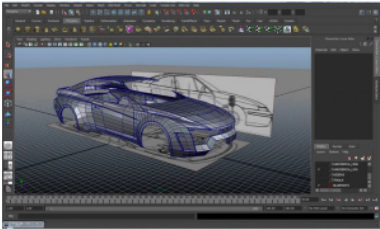

## SOFTWARE ARTIFACTS AS MODELS

- The concept of model is a powerful unifying concept in MDE
- Original OMG definition of model is very (too?) general → 'representation of a system in a textual or graphical language'
- Popular slogan then: Everything is a model!

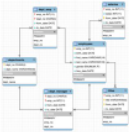

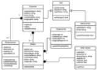

## MODELLING IN SOFTWARE ENGINEERING

- Modelling is well-established in many engineering disciplines!!!
- Potential benefits for Software Engineering
- Productivity increase
- Reasoning about the system before building it
- Proving properties of the system at model level
- Ultimately MDE should lead to software with a better quality

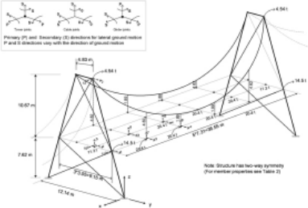

## IN THIS PRESENTATION:

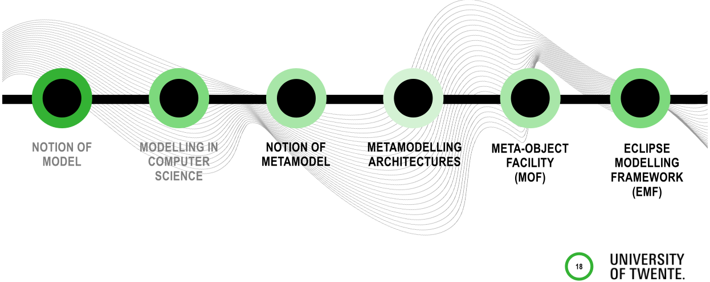

## METAMODEL

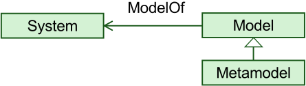

- A metamodel is a model, as the name suggests
- What is the system modelled by a metamodel?
- What is the nature of the ModelOf relation?
- Which aspect of the model is being modelled in its metamodel?
- Why do we sometimes say that a model is an instance of a metamodel?

## METAMODEL AND METAMODELLING MORE DEFINITIONS

Metamodel as a model of a modelling language

'A meta-model is a model of models expressed in a given modelling language' Ed Seidewitz

'A meta-model is a model of the conceptual foundation of a language, consisting of a set of basic concepts, and a set of rules determining the set of possible models denotable in that language' FRISCO Report

## DEFINITION OF METAMODEL

- In MDE, the view that a metamodel represents a modelling language is widely accepted
- We assume that a metamodel is a model of a modelling language

## However

- What is a modelling language?
- Which language components are modelled in the language metamodel?

## DEFINITION OF METAMODEL

Language is a set of sentences (models)

- A metamodel models the valid members of the set
- A metamodel constrains the valid models expressible in a given modelling language

Analogy with natural languages (English, Dutch, etc.)

- Words allow sentences to be formed
- Language grammar determines which sentences are allowed (the valid members of the set)

## DEFINITION OF METAMODEL

Language has concrete syntax, abstract syntax and semantics

- A metamodel should focus on the concepts that can be expressed with the language and their relationships
- Very roughly corresponds to the language 'abstract syntax' → syntax elements without considering how they are represented

Simplification: metamodel ≈ language abstract syntax

## EXAMPLE: A GRAPHICAL LANGUAGE FOR GENEALOGY [GUIZZARDI]

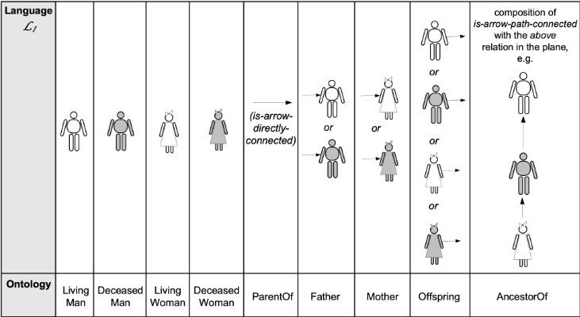

## MODEL EXAMPLES

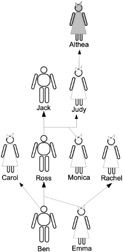

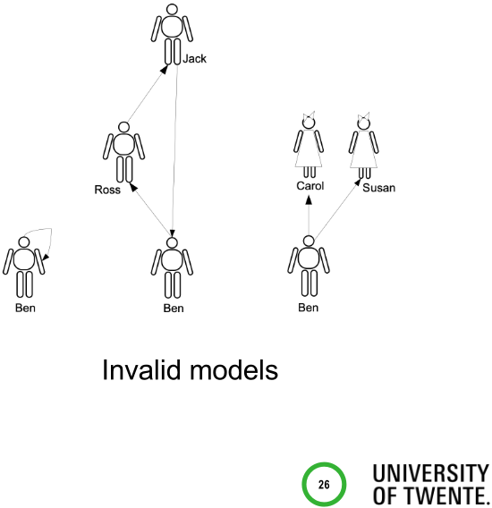

## GENEALOGY METAMODEL

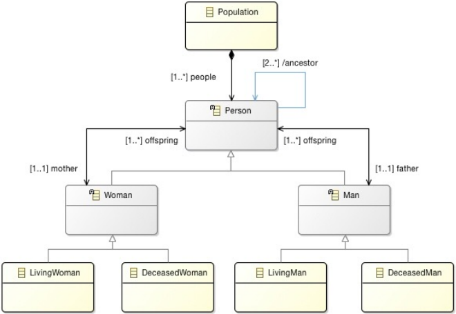

## METAMODEL AS A 'MODEL OF A MODEL'

## Alternative line of reasoning

- A metamodel can be defined as a model of a model
- Different characteristics of a model can in principle be chosen to be modelled in a metamodel
- In MDE, metamodelling considers the 'types of the model elements' and consequently the abstract syntax of the modelling language as the characteristic represented in the metamodel!

## MODELS, METAMODELS, INSTANCEOF RELATION

- A language may have its metamodel expressed in different modelling languages

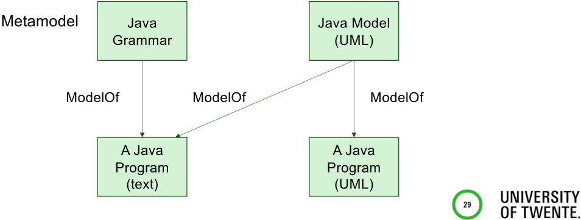

## MODELS, METAMODELS, INSTANCEOF RELATION

- We often say that a model is an instance of a metamodel
- There are different (language-specific) instanceOf relations
- InstanceOf allows to interpret a metamodel 'formally' (systematically)

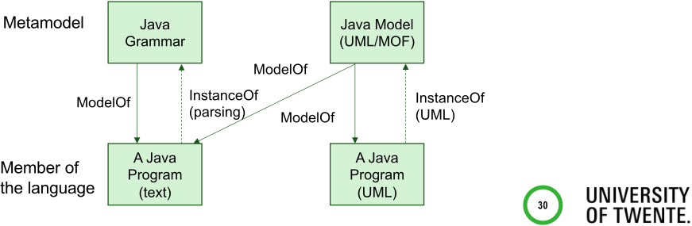

## METALEVELS

- Model is expressed in a language L
- Metamodel of L is expressed in ML
- Metamodel of ML is expressed in MML
- Metamodel of MML is expressed in MMML
- Etc.

How often should or can we repeat it?

## METAMODELLING ARCHITECTURES

- Two alternative ways to finish the recursive (possibly infinite) tower
1. Assume that some language is just given (e.g., XML DTD)
2. Model the 'top-language' in itself
- Option 2 is the most popular in metamodelling architectures

## METAMODELLING ARCHITECTURES

...

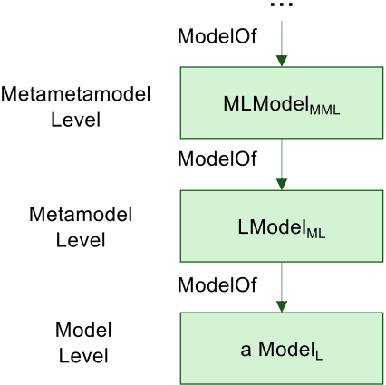

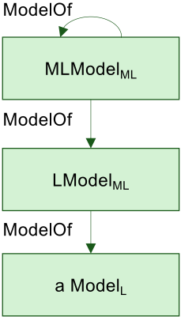

## METAMODELLING ARCHITECTURES EXAMPLES

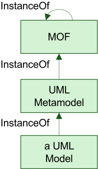

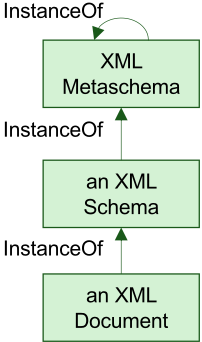

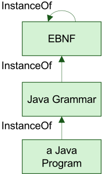

## OMG METALEVELS

## META-OBJECT FACILITY (MOF)

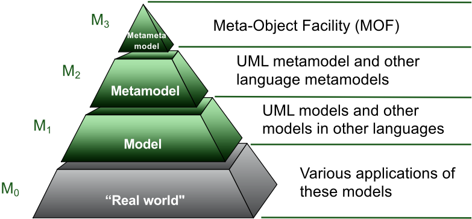

## OMG METALEVELS: EXAMPLE

M3 (MOF)

M2 (UML)

Association

&lt;&lt;instanceOf&gt;&gt;

Class

&lt;&lt;instanceOf&gt;&gt;

&lt;&lt;instanceOf&gt;&gt;

&lt;&lt;instanceOf&gt;&gt;

Attribute

0..n

&lt;&lt;instanceOf&gt;&gt;

M1 (User model)

M0 (Runtime instances)

&lt;&lt;instanceOf&gt;&gt;

classifier

Class InstanceSpecification

&lt;&lt;instanceOf&gt;&gt;

Person

&lt;&lt;snapshot&gt;&gt;

+age : Integer

&lt;&lt;instanceOf&gt;&gt;

&lt;&lt;instanceOf&gt;&gt;

: Person

age = 28

aPerson

## IN THIS PRESENTATION:

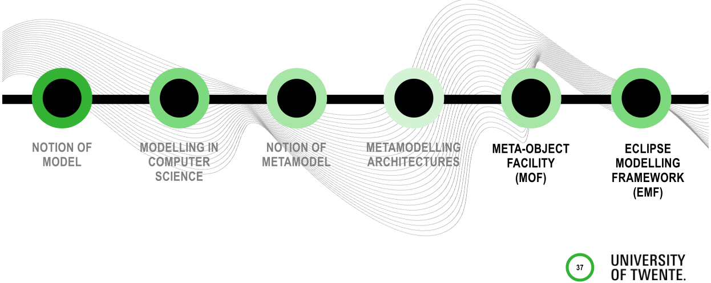

## META-OBJECT FACILITY (MOF)

- Metadata management framework
- Language to be used for defining languages
- OMG-standard metamodelling language
- UML metamodel is defined in MOF
- MOF 2.0 shares a common core with UML 2.x
- Simpler rules for modelling metadata
- Easier to map from/to MOF
- Broader tool support for metamodelling
- → alignment allows UML 2.x tool to be used for 'drawing' a metamodel

## EVOLUTION OF OMG LANGUAGES MOF HISTORY

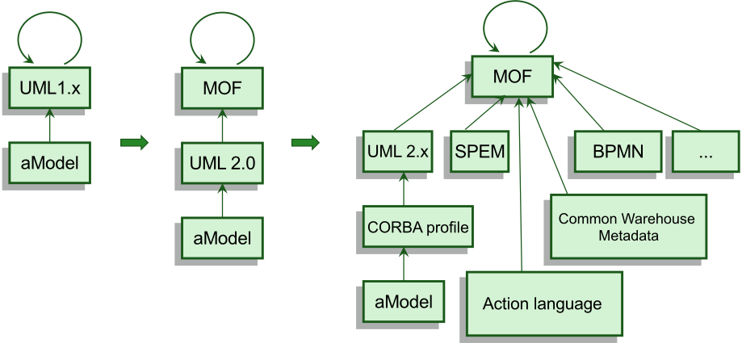

## MOF VERSIONS

- MOF 1.x was the most widely supported by tools
- MOF 2.x (2.5.1)
- Current standard, has been substantially influenced by UML 2.0
- Critical for the support of transformations, e.g., QVT and Model-to-text

## MOF 1.X MAIN CLASS DIAGRAM

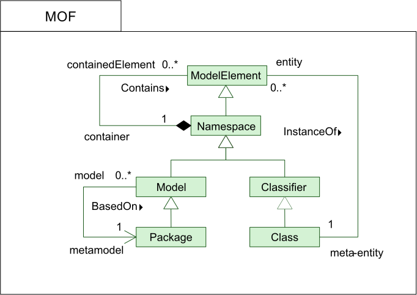

## MOF 1.X COMPLETE MODEL

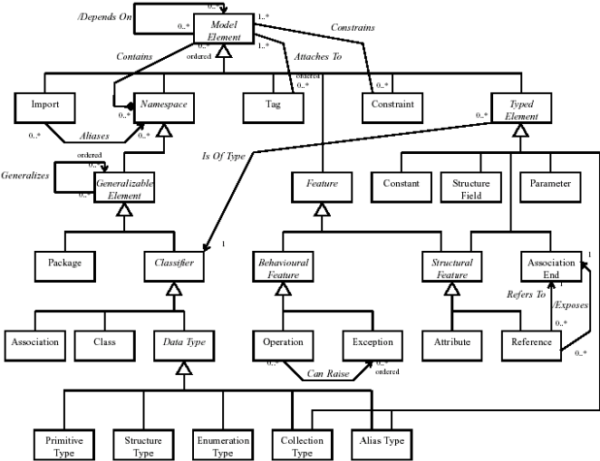

## MOF 1.X KEY ABSTRACT CLASSES

## NOT DIRECTLY INSTANTIATED, FOR STRUCTURING ONLY

- ModelElement is the common base Class of all metaclasses
- Every ModelElement has a name
- Namespace is the base Class for metaclasses that are containers
- GeneralizableElement is the base Class for metaclasses that allow generalization (similar to inheritance in OOP)
- TypedElement is the base Class for metaclasses that have a type (e.g., Attribute , Parameter and Constant )
- Classifier is the base Class for metaclasses that define types (e.g., Class and DataType )

## MOF 1.X MAIN CONCRETE (META)CLASSES

- Class
- Association
- Exception (for defining abnormal behaviours)
- Attribute
- Constant
- Constraint

## MOF 1.X KEY ASSOCIATIONS

- Contains : relates a ModelElement to its Namespace
- Generalizes : relates a GeneralizableElement to its ancestors (superclass and subclass)
- IsOfType : relates a TypedElement to the Classifier of its type
- DependsOn : relates a ModelElement to another ModelElement to represent dependence

## MOF 2.X STRUCTURE

- MOF 2.x consists of Essential MOF (EMOF) and Complete MOF (CMOF)
- EMOF corresponds to facilities found in OOP and XML
- Easy to map EMOF models to JMI, XMI, etc.
- CMOF is used to specify the metamodels of languages such as, e.g., UML 2
- Built from EMOF and the core constructs of UML 2
- Both EMOF and CMOF are based on parts of UML 2

XML-based standard notation for model serialisation and exchange

## MOF 2.5.1 STRUCTURE

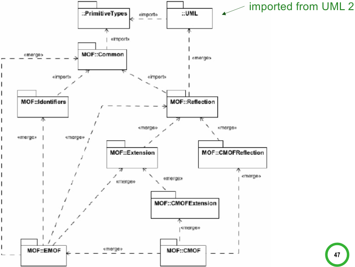

## EMOF CORE CLASSES

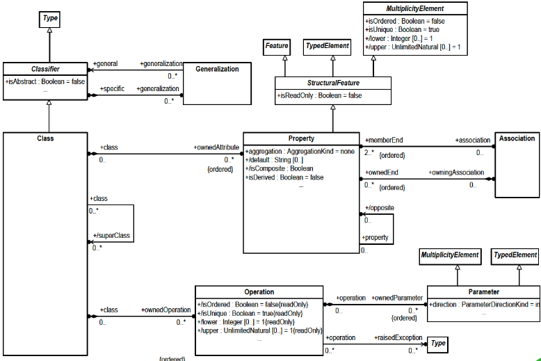

## CMOF CORE CONSTRUCTS

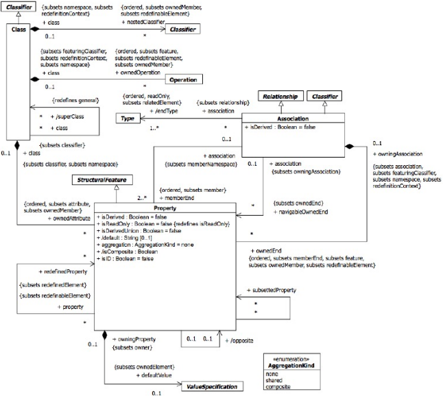

## MOF IMPLEMENTATIONS

- Ecore is the most widely known and used, and has been defined in the Eclipse Modelling Framework (EMF)
- Mostly compatible with MOF 1.x, and allows EMOF metamodels to be imported via XMI

Other environments and tools (historical importance)

- XMF-Mosaic implements ExMOF, which subsets and extends MOF 1.x
- UML2MOF is a transformation from UML metamodels to MOF 1.x metamodels Sun MDR implementation
- Commercial implementations from Adaptive, Compuware, MetaMatrix, MEGA, Unicorn

## ECLIPSE MODELLING FRAMEWORK (EMF) AND ECORE

- Just about every program manipulates some data model
- Defined in Java, UML, XML Schemas, or some other definition language
- EMF aims to extract this intrinsic model from programs and generate implementation code from this model
- Can realise a tremendous productivity gain
- Ecore is a metametamodelling language similar to the MOF → Ecore and MOF are not identical (and not the same)!

## EMF (ECORE) MODEL DEFINITION

- Specification of application data
- Attributes of objects
- Relationships (associations) between objects
- Operations available on each object
- Simple constraints (e.g., multiplicity) on objects and relationships
- Essentially the Class Diagram subset of UML

## EMF (ECORE) MODEL DEFINITION

- EMF (Ecore) models can be defined in (at least) three ways
- Java interfaces
- UML Class Diagram
- XML Schema
- From these artifacts, EMF can generate the others as well as the implementation code
- In this course, we use the Ecore tools SDK to create Ecore models by drawing them (similarly to UML class diagrams in a UML tool)

Important!

## ECORE MAIN CLASSES

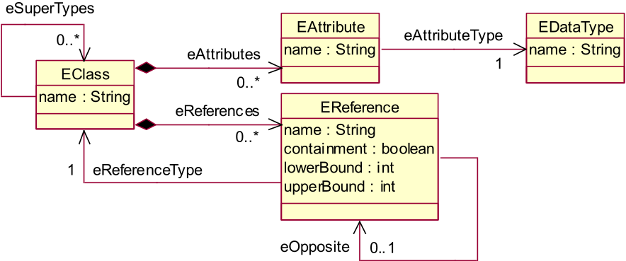

## SIMPLE EXAMPLE: PURCHASEORDER

- Ecore diagram drawn with the Ecore editor
- Ecore model structure

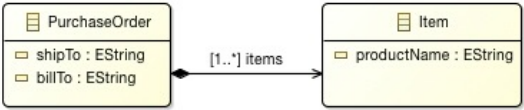

Demo!

## PURCHASEORDER ECORE MODEL GRAPH REPRESENTATION

Eclass (Name= 'PurchaseOrder')

Eclass (name= 'Item')

EAttribute (Name= 'ShipTo' Eatribute Type=Estring ...)

EAttribute (Name= 'billTo' EAtribute Type=Estring ...)

- EReference (Name= 'items' Containment=true EType=Item ...)

## TAKE-HOME MESSAGES

- In MDE
- A metamodel defines the modelling language used to represent a model
- A model is an instance of its metamodel
- A metamodel is an instance of a metametamodel
- → language to define metamodels
- MOF is the OMG standard metametamodel
- EMF (Ecore) is a de facto standard used to experiment with models and metamodels

## REFERENCES

- Hughes, R. I. G. Models and Representation. Philosophy of Science, vol. 64, 1997, pp. S325-S336.
- Atkinson, C. and Kühne, T. Model-Driven Development: A metamodeling foundation. IEEE Software, 20(5):36-41, 2003.
- Bézivin, J. On the unification power of models. Software and Systems Modeling, 4(2):171188, 2005.
- Kühne, T. Matters of (meta-)modeling, Software and Systems Modeling, 5(4):369-385, 2006.
- Brambilla, M., Cabot, J. and Wimmer. M. Model-Driven Software Engineering in Practice. Morgan &amp; Claypool Publishers, 2017.
- Richard F. Paige, Dimitrios S. Kolovos, Fiona A.C. Polack. A tutorial on metamodelling for grammar researchers. Science of Computer Programming, 96(4): 396-416, 2014.

