> Converted from [`lecture-2-object-constraint-language.pdf`](lecture-2-object-constraint-language.pdf) with docling. Figures are in [`lecture-2-object-constraint-language-images/`](lecture-2-object-constraint-language-images/). Page numbers for each section are in [`INDEX.md`](../INDEX.md).

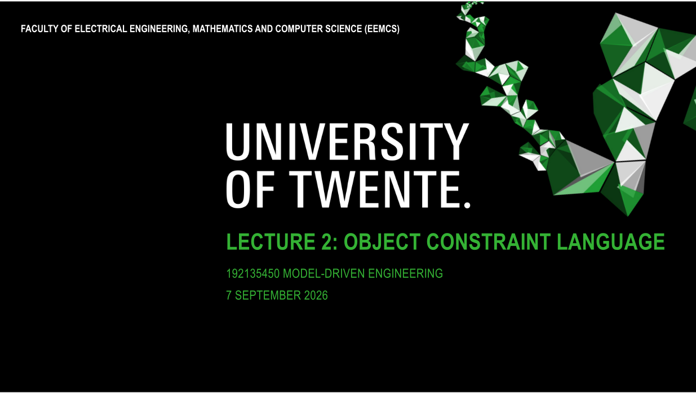

## IN THIS PRESENTATION:

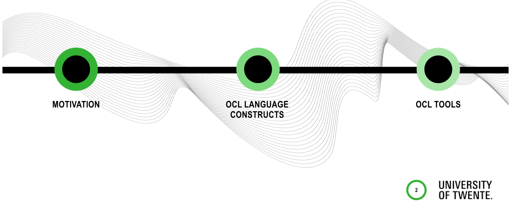

## MOTIVATION

- Many modelling and other languages require additional notation to express all the constraints over its sentences (models) Examples
- Grammars for context-free languages
- Additional constraints are known as static semantics
- XML documents
- Additional constraints are known as well-formedness constraints

## MOTIVATION

- Graphical specification languages such as UML often allow its users to describe only partial aspects of a system
- Additional constraints can be described as annotations in some language
- Formal languages (with mathematical interpretation) are preferable

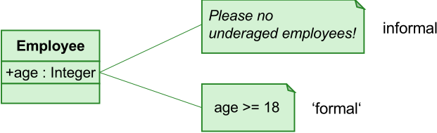

## OBJECT CONSTRAINT LANGUAGE (OCL)

- Purpose
- To provide formal, precise and unambiguous specification of constraints over models
- → limits the set of valid models!
- To be usable by a large number of users, ranging from business or system modellers, programmers
- OCL is a declarative language, not a programming language!
- We introduce OCL in this lecture by means of examples, not trying to be complete!

## OCL CONSTRAINT LIMIT THE SET OF VALID MODELS

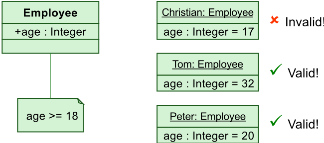

Some instances of the class Employee

## OCL LANGUAGE FEATURES

- Side effects free language in functional style → evaluation of OCL expression returns value, while model remains unchanged
- OCL is not a programming language → no program logic or flow control, no invocation of processes or activation of non-query operations, only queries
- OCL is a typed language → each OCL expression has a type, and OCL includes a set of predefined types
- Evaluation of OCL expression is instantaneous → the states of objects in a model cannot change during evaluation

## OCL APPLICATIONS

- Originally: constraints specification for model elements in UML and MOF models
- Invariants
- Pre-conditions and post-conditions (Operations and Methods)
- Initial or derived values for attributes and association ends
- Query language for obtaining values from models
- Navigation language in model transformation languages
- Like XPath for XML documents

## OCL EXPRESSION

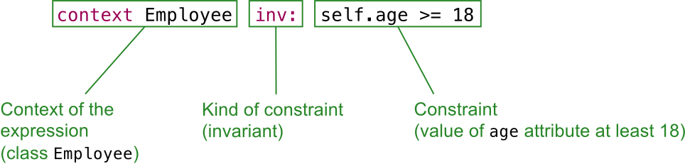

## INVARIANTS

## inv invariant: constraint must be true

- § For all instances of constrained type at any time
- § Constraint is always of type Boolean

context Employee

inv: self.age &gt;= 18

| Employee                     |
|------------------------------|
| age : Integer wage : integer |
| raiseWage(newWage : Integer) |

## PRE- AND POST-CONDITIONS

pre precondition: must be true before execution of an operation post postcondition: must be true after execution of an operation

- § self refers to the object on which the operation was called
- § return designates the result of the operation (if available)
- § Conditions may also involve operation parameters

## context

```
Employee::raiseWage(newWage:Integer) pre: newWage > self.wage post: self.wage = newWage
```

| Employee            | Employee   |
|---------------------|------------|
| age                 | : Integer  |
| wage : integer      |            |
| raiseWage(newWage : | Integer)   |

## OTHER CONSTRAINTS

Body of a query operation

Initialization of value of an attribute or association end

Derivation rule of an attribute or association end

OCL helper expression

## Employee

age : Integer

wage : integer

raiseWage(newWage : Integer)

getWage() : Integer

```
context Employee::getWage() : Integer body: self.wage context Employee init: wage = 900 context Employee derive: wage = self.age * 50 context Employee def: annualIncome : Integer = 12 * wage
```

## OCL METAMODEL

- OCL 2.x has a MOF metamodel
- We know already that a metamodel defines the abstract syntax of a language 😃

## Metamodel

- OCL types
- OCL expressions

## OCL TYPES METAMODEL (TYPE HIERARCHY)

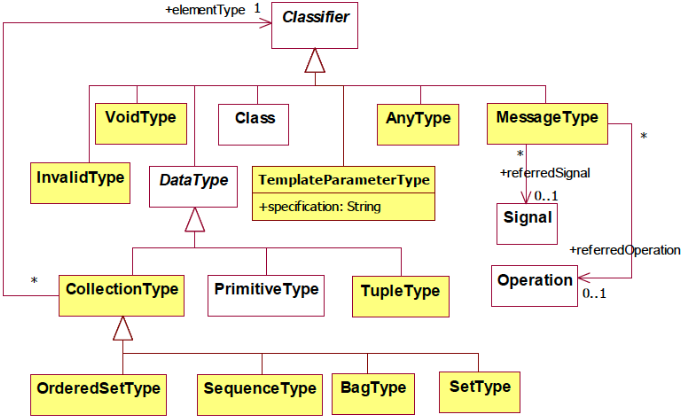

## OCL TYPES

## · Primitive types

- Integer , Real , Boolean , String
- OCL defines several operations for primitive types:
- + , - , * , / , min() , max() , etc.  for Integer and Real
- concat() , size() , substring() , etc. for String

## OCL TYPES

- Collection types
- Set : contains elements without duplicates, no ordering
- Bag : may contain elements possibly with duplicates, no ordering
- Sequence : ordered, possibly with duplicates
- OrderedSet : ordered, without duplicates
- TupleType
- Represents a structure: combination of different types into a single aggregate type
- VoidType
- Conforms to all types except for OCLInvalidType

## BASIC CONSTRUCTS FOR OCL EXPRESSIONS

- let-in expression allows to define a variable to be used in one constraint
- If-then-else construct (complete syntax)

```
if <boolean OCL expression> then <OCL expression> else <OCL expression> endif
```

To be understood as implication not control flow!

## LET-IN AND IF-THEN-ELSE EXAMPLE

```
context Employee inv: let annualIncome : Integer = wage * 12 in
```

```
if self.isUnemployed then annualIncome < 5000 else annualIncome >= 5000 endif can only used in the
```

This feature is redundant. The standard suggests defining an operation in the class for this.

## Employee

age : Integer

wage : integer

isUnemployed : Boolean

annualIncome scope of this constraint ( in block)

## ACCESSING OBJECTS AND THEIR PROPERTIES

## · Attributes

```
context Employee inv: self.age >= 18 context Employee inv: self.wage < 10000
```

```
context Employee inv: not(self.isUnemployed)
```

## · Operations

```
context Employee inv: self.getWage() > 1000
```

```
Employee age : Integer wage : integer isUnemployed : Boolean getWage() : Integer
```

## ACCESSING OBJECTS AND THEIR PROPERTIES

- Accessing enumeration values with ::

```
context Employee inv:
```

self.position=Position::TRAINEE implies self.wage &lt; 500

| Employee                                                                                    |
|---------------------------------------------------------------------------------------------|
| age : Integer wage : integer isUnemployed : Boolean position : Position getWage() : Integer |

| <<Enumeration>> Position                              |
|-------------------------------------------------------|
| CTO CEO JUNIOR_MANAGER SENIOR_MANAGER STUDENT TRAINEE |

## ACCESSING OBJECTS AND THEIR PROPERTIES

## Association ends

- Allow navigation to other objects
- Result in Set , or in OrderedSet when association ends are ordered

## Example

```
context Company inv: if self.budget < 50000 then self.employees->size() < 31 else true endif operation on a collection
```

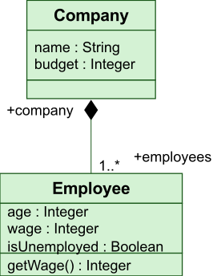

## OPERATIONS ON COLLECTIONS

- Predefined operations for collections
- isEmpty() , size() , includes() , etc.
- Iteration operations
- select / reject
- collect
- forAll
- exists
- iterate

## ITERATORS ON COLLECTIONS

- Operations select and reject create a subset of a collection based on a Boolean condition

Operations on collections

```
Examples context Company inv: self.employees->select(age < 18)->isEmpty() context Company inv: self.employees->reject(age >= 18)->isEmpty()
```

## ITERATORS ON COLLECTIONS

- Operation collect specifies a collection that is derived from some other collection

## Example

```
context Company inv:
```

self.employees-&gt;collect(wage)-&gt;sum() &lt; self.budget

Collection (bag) of Integer values derived from the employees' wage attribute values

## ITERATORS ON COLLECTIONS

- forAll specifies  a Boolean condition (expression) that must hold for all objects in a collection ( resulttype : Boolean )

## Example

forall

```
context Company inv: self.employees->forAll(age >= 18) expressions can be nested! context Company inv: self.employees->forAll (e1 | self.employees->forAll (e2 |
```

```
e1 <> e2 implies e1.pnum <> e2.pnum))
```

```
Employee age : Integer wage : integer isUnemployed : Boolean position : Position pnum : Integer getWage() : Integer
```

## ITERATORS ON COLLECTIONS

- exists returns true if the expression is true for at least one element of the collection ( resulttype: Boolean )

## Example

```
context Company inv: self.employees->exists(e|e.pnum=1)
```

## PRE-DEFINED OPERATIONS

OCL defines several operations that apply to all objects

- oclIsTypeOf(t:OclType):Boolean
- result is true if the self is of type t

## Example

```
context Employee inv: self.oclIsTypeOf(Employee) not(self.oclIsTypeOf(Company))
```

- oclIsKindOf(t:OclType):Boolean
- result is true if t is either the direct type or one of the supertypes of the object

## PRE-DEFINED OPERATIONS

Corresponds to casting in programming languages

- oclAsType(t:OclType):T
- results in the same object, but with type t (if the object conforms to t )
- allInstances()
- Predefined feature on classes, interfaces and enumerations
- Results in the collection of all instances of the type that exist at the specific time when the expression is evaluated

```
Example
```

```
context Company inv: Employee.allInstances()->forAll(p1| Employee.allInstances()->forAll(p2| p1 <> p2 implies p1.pnum <> p2.pnum))
```

## BREAK


## OCL SUPPORT IN ECLIPSE

Supports the OMG OCL 2.4 specification for Ecore and UML

- Editing
- Embedded in Ecore with the OCLinEcore editor ü
- As separate document with the Complete OCL editor
- Interactive with the Interactive OCL console ü
- Programmatic with the Java API
- 'Execution'
- Interactive OCL and Java API
- Debugging
- OCL debugger, Interactive Xtext OCL

## OCLINECORE TOOLS

- Allows Ecore metamodels to be textually edited (generated with Xtext)
- OCL constraints are added as annotation and evaluated by the Eclipse OCL tools

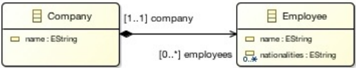

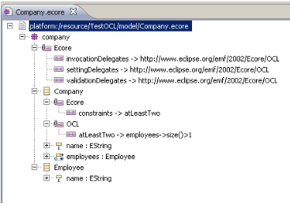

## OCLINECORE EDITOR

## CREATING MODEL INSTANCES

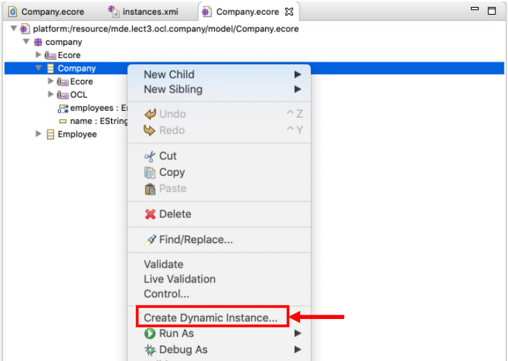

## VALIDATION

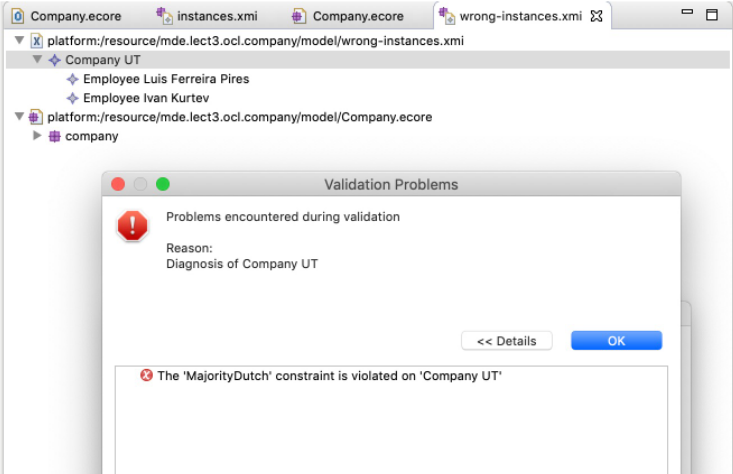

## INTERACTIVE OCL CONSOLE

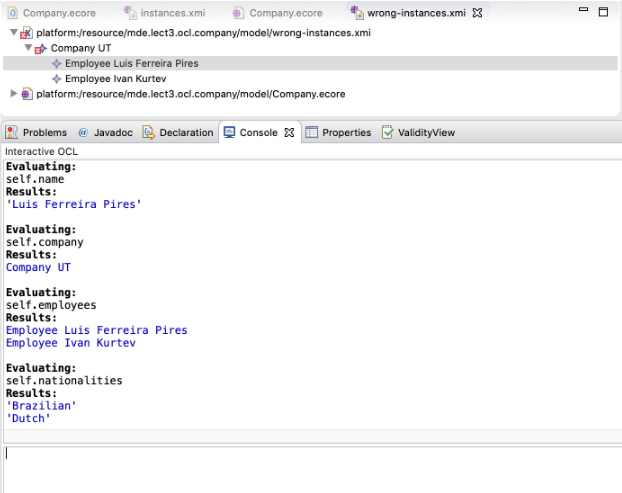

## GENEALOGY EXAMPLE (REVISITED)

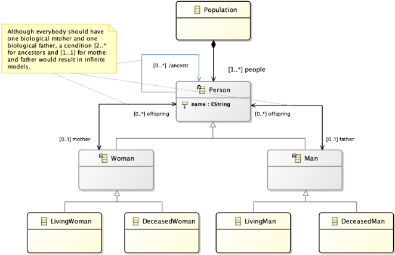

## RECURSIVE OCL CONSTRAINT

We could have defined a constraint NoSelfAncestor, but this causes a StackOverflow exception with self.ancestor-&gt;forAll(a | a &lt;&gt; self)

DEMO!

## PRACTICAL SESSION PREPARATION

- Install 'OCL Examples and Editor SDK' package
- Follow the steps of the OCLinEcore tutorial in the Eclipse Help
- Discuss your doubts with the teacher!

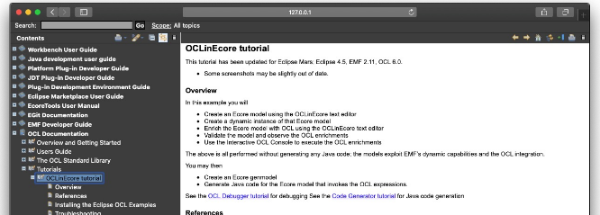

## TAKE-HOME MESSAGES


- OCL (or some similar solution) is absolutely necessary to be able to represent more realistic (meta)models
- OCL is used in UML2, MOF metamodels and QVT transformations
- We only covered the OCL core (main elements), but we gave pointers to work further with OCL
- Eclipse OCL gives support to many OCL applications

## REFERENCES


- Jos Warmer and Anneke Kleppe. The Object Constraint Language, 2nd Edition, 2003.
- OCL 2.4 Final Adopted Specification (formal/14-02-03), 2014.
- Christian Damus, Adolfo Sánchez-Barbudo Herrera, Axel Uhl, Edward Willink et al. Eclipse OCL 6.6.0 Documentation. 2002-2018
- [Eclipse OCL documentation](https://help.eclipse.org/latest/nav/60)

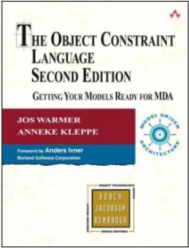

