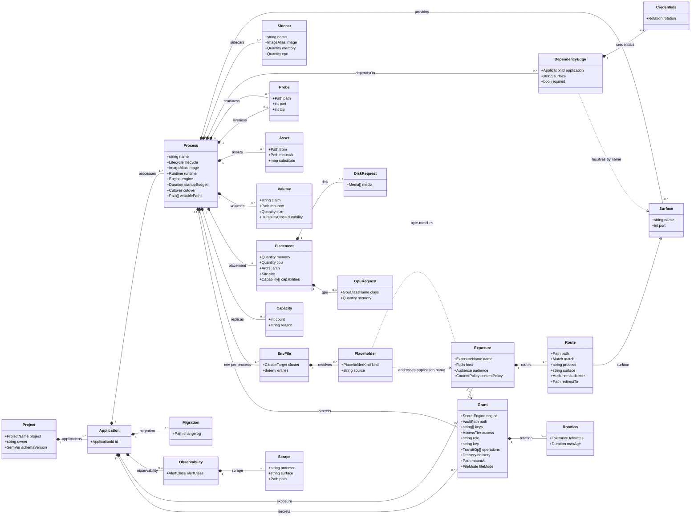

# The project document, in full

The source of the project-document class diagram in the Task 1 report
(`project-document.pdf`). The class diagram in `spec/v1/10-project-intent.md`
leaves out the classes shared between levels (`Grant`, `Placement`, `EnvFile`,
`DependencyEdge`, `Asset` and the classes under them); the report shows every
class, so this block is that chapter's block with those classes added. The
platform document and the target metamodel are drawn from the blocks in
`spec/v1/14-platform-intent.md` and `spec/v1/20-resolved-deployment.md`
directly.

Render with `scripts/diagrams/class-diagram.py --report`; the commands are in
that script's docstring.

