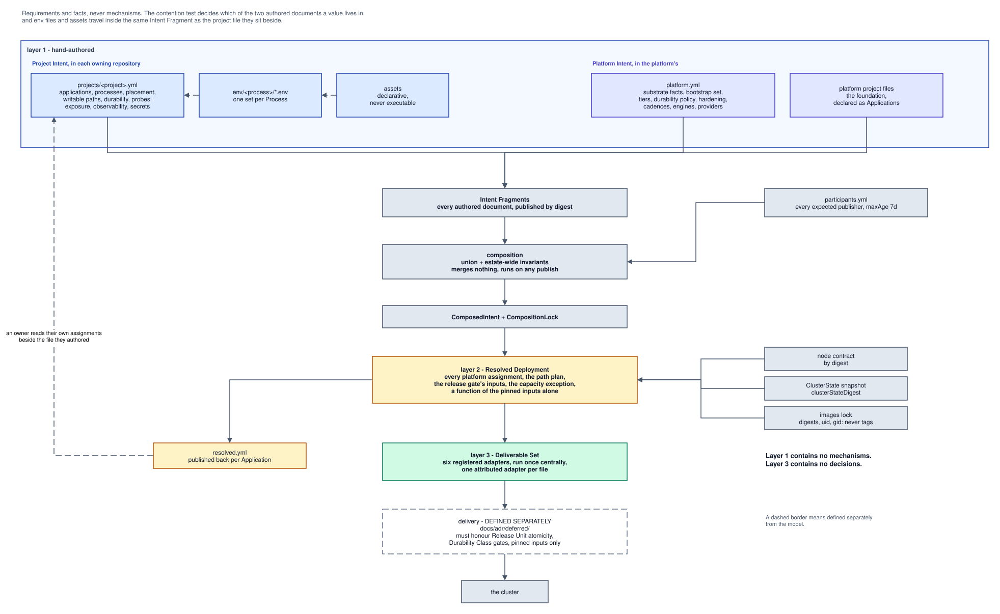
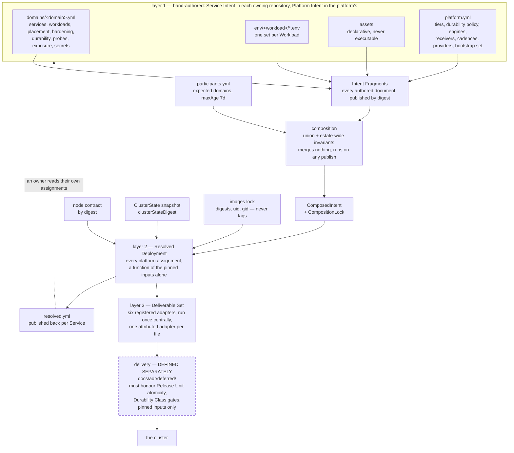

# deploy-config-schema v1 — specification index

This branch holds the v1 specification. The decisions that justify it live in
[`docs/adr/`](../../docs/adr/README.md); the vocabulary lives in
[`CONTEXT.md`](../../CONTEXT.md). None of the three restates the others: the
glossary defines terms, the ADRs record why, and **these chapters are
normative** — where a chapter and an ADR disagree, the chapter wins and the ADR
is what gets fixed.

One boundary runs through the whole document and is stated once here: **how the
estate deploys, and how dependency on other units for testing gates a deploy,
are defined separately from the model** (owner decision, 2026-09-07). This
specification defines the model. The separate definition is scoped in
[`docs/adr/deferred/`](../../docs/adr/deferred/README.md), and nothing in these
chapters specifies push delivery, deploy workflows, pruning, field managers,
deploy RBAC, break-glass or co-test gating.

## The estate

Every mechanism in this specification must justify itself at the scale that
exists, not at the scale of an imagined organisation
([0001](../../docs/adr/model/0001-estate-scale-and-ownership.md)).

| fact | value | how it is counted |
|---|---|---|
| regular human maintainers | 1, across three git identities | `git shortlog -sn --all`: 35 commits by the one human, 99 by five bot accounts |
| production clusters | 1, seven nodes | clusters serving production traffic |
| Services | about 30 | in about 10 repositories — reviewers who wrote "~30 repositories" were counting Services |
| horizon | 2028-08-31 | re-run the counts at that date, or earlier on a falsifying observation |

Two consequences are normative for the rest of the specification. First,
invariants that arbitrate **between people** — a self-reviewed publish-back pull
request, an authorisation control protecting the author from the author — are
out of v1 scope; the invariants v1 builds are the ones that catch the
maintainer's own mistakes. Second, if a second regular maintainer or a second
production cluster appears before the horizon, every decision resting on this
premise is re-opened against the new scale rather than re-worded.

## Substrate

Kubernetes stays, and not for the reasons it is usually bought
([0002](../../docs/adr/model/0002-kubernetes-as-substrate.md)). Rescheduling does not
exist here: storage is `local-path`, all fourteen PVCs are `ReadWriteOnce`, and
a `local-path` volume does not survive its node, so every stateful Workload is
pinned to one machine by construction. Control-plane HA does not exist: every
platform fixture carries exactly one `k3s-control-plane` host. Horizontal scale
is not exercised: `auth-api`'s two replicas were a capacity decision on freed
budget, and on one node two replicas are two processes on one kernel. The
overhead is counted — 405 rendered objects for about 30 Services, 41 of them
foundation, and the foundation is the part carrying the CVEs and the CRD
upgrades.

The substrate is retained as **a declarative object store with field-level
ownership and an authorisation boundary, that happens to also run containers**.
Two properties earn it: the API server as an authorisation boundary between
appliers, and server-side-apply field ownership as the signal that a human
edited a field something else owns. No design in this specification may cite
rescheduling, HA or horizontal scale as justification.

Both retained properties are made real by *how objects are applied* — which
identity applies, under which field manager. That is delivery, and it is
defined separately: see
[`docs/adr/deferred/`](../../docs/adr/deferred/README.md). The model's own
obligation is narrower and is discharged in these chapters: every Deliverable is
a serialized object attributed to exactly one adapter, so there is always a
single answer to "what should own this field".

The layer-1 documents — Service Intent and Platform Intent alike — survive a
substrate swap: neither names a Kubernetes kind, a Traefik field or a k3s flag
([0097](../../docs/adr/model/0097-authored-values-name-model-concepts.md)). The
registered adapters do not: five of the six emit Kubernetes kinds and the sixth
emits Vault configuration, which is why the swap is a v2 migration rather than
an undo once repositories author against a shipped v1.

## The meta-model

Deployment configuration is split into three layers, and the middle one is a
contract ([0003](../../docs/adr/model/0003-three-layer-meta-model.md)).

| Layer | Name | Authored | Owns |
|---|---|---|---|
| 1 | Service Intent, and Platform Intent | by hand — a Service's in its owning repo, the estate's in the platform's | requirements and facts, never mechanisms |
| 2 | Resolved Deployment | never — derived | every platform decision |
| 3 | Deliverable Set | never — serialized | files, no decisions |

The rule that makes this worth naming: **Layer 1 contains no mechanisms, Layer 3
contains no decisions.** Every field is assignable to exactly one layer, decided
by two questions — must a human author it, and does it record a decision or
merely serialize one. Which side of layer 1 a value falls on is decided by the
contention test: a value is platform-assigned if and only if it must be unique
across the estate or draws on a shared finite resource
([0004](../../docs/adr/model/0004-contention-decides-authority.md), normative in
[chapter 20](20-resolved-deployment.md#authority)). The same test decides which
of the two authored documents a value is written in: a Service's own in
[chapter 10](10-service-intent.md), the estate's in
[chapter 14](14-platform-intent.md)
([0095](../../docs/adr/model/0095-platform-intent-is-the-second-authored-document.md)).

The counter-experiment is on record. Two layers, with resolution private to the
renderer, produced three mutually incompatible documents all claiming
`deployment.jorisjonkers.dev/v2` — the authoring shape, the collection shape and
the resolved shape — and the estate documented the consequence as a trap rather
than fixing it, because a two-layer vocabulary could not say which document was
wrong.

Layer 2 is derived from a **closed set of pinned, digested inputs** — Service
Intent, the Platform Intent, the locks, and a ClusterState snapshot carrying its
own digest ([0006](../../docs/adr/model/0006-pinned-inputs.md),
[0034](../../docs/adr/model/0034-cluster-state-pinned-input.md)). Nothing at render
time reads live cluster state. Reproducibility is therefore conditional and
true: identical inputs *including* `clusterStateDigest` produce a byte-identical
tree, so a differing render with identical digests is a defect, never weather.

[Diagram source](#the-meta-model) · edit by opening the SVG in draw.io

## Programme scope

v1 is the model ([0059](../../docs/adr/model/0059-v1-scope-stopping-rule.md)): the
two layer-1 vocabularies, composition, layer-2 derivation, and the registered
renderer that serializes layer 3. It ships when it renders the live estate —
foundation included ([0096](../../docs/adr/model/0096-the-foundation-is-declared.md))
— from declared intent, and that render is delivered by today's Flux
installation applying a tree the model rendered. No deferred decision can block
it.

The partition is structural rather than enumerated, so it cannot drift:
`docs/adr/` carries **one directory per decision domain**, and **every ADR in
`docs/adr/model/` is v1 model scope; every ADR in `docs/adr/deferred/` is
not.** A future decision moves a file across that boundary or it does not move
at all. The first draft of this rebuild defined a "core" and a "group G" that
failed to partition the decision set — six ADRs landed on neither side — which
is why membership of a directory, not a list, is the line.

A third domain, `docs/adr/architecture/`, carries decisions about the
compiler's own structure. It is neither model nor delivery: its `normative:`
pointers name sections of [`docs/architecture.md`](../../docs/architecture.md)
rather than of these chapters, and nothing in it can change what the model
means. `scripts/lint-adrs.mjs` holds each domain to its own normative root.

The model makes exactly three demands on whatever delivery is eventually
defined. They are model decisions, not delivery ones, and together they are the
complete interface between the two scopes.

| demand | decided in | what any delivery definition must do |
|---|---|---|
| Release Unit atomicity | [0060](../../docs/adr/model/0060-release-unit.md) | no member's new version receives traffic until every member's new version is healthy; if any member fails its budget, none switch and the old versions keep serving |
| Durability Class gating | [0015](../../docs/adr/model/0015-durability-class-per-volume.md) | no destructive operation proceeds automatically against a volume declared `recoverable` or `irreplaceable` |
| Pinned inputs only | [0006](../../docs/adr/model/0006-pinned-inputs.md), [0034](../../docs/adr/model/0034-cluster-state-pinned-input.md) | render from recorded digests — Intent, Platform Intent, locks, ClusterState — never from live cluster state |

Anything else the delivery definition chooses — push or pull, who applies, what
prunes, what reconciles, how co-testing gates — is its own business. A delivery
definition that needs a fourth demand amends the model first, in one ADR.

**The stopping rule.** The deferred set is taken up only after
[workspace#45](https://github.com/JorisJonkers-dev/workspace/issues/45) runs and
the test-substrate measurement exists; that experiment informs the separate
definition and gates nothing in v1. Review date **2026-11-30**: deferred work
still unstarted then is cut from planning, not extended. The named failure mode
this rule exists to prevent is not collapse but partial completion with both
delivery models live.

Live-defect fixes ride independently of both scopes — the unpinned foundation
charts and this repository's own unpinned CI are operational fixes that proceed
regardless of any delivery decision.

## Decision register

The register is [`docs/adr/README.md`](../../docs/adr/README.md). It is not
reproduced here, and there is no second table.

It carries the premises (0001–0007, 0009) and the decisions (0010–0040,
0052–0057, 0059–0060) that make up v1, each with its claim — `settled`, `open`
or `accepted-untested` — and its `normative:` pointer naming the section of
these chapters where its detail lives. A `claim: open` means decided in
direction and untested; its owner and settling test are in the ADR file, never
here. The delivery and co-testing decisions have their own inventory at
[`docs/adr/deferred/README.md`](../../docs/adr/deferred/README.md); they are not
in the register, not linted, and their `normative:` pointers name sections these
chapters deliberately do not carry.

Citation rule, in the ADRs and in these chapters: never a bare ADR number.
In-set references are relative links; workspace decisions live in a separate
namespace and are always linked absolutely.

## Chapters

**Diagrams are drawn, not sketched in a fence.** Each chapter's diagram is a
draw.io drawing committed beside it under [`diagrams/`](diagrams/README.md) as
an SVG with the editable diagram embedded: GitHub renders it inline, and opening
the same `.svg` in draw.io recovers the drawing. One palette runs through all of
them, so a box's colour says which layer it belongs to without a legend.

The mermaid each chapter used to embed is kept at the **foot** of the chapter
under `## Diagram sources`. It is the same structure in text, so a diagram change
still shows up in a plain diff — and where the two disagree, the SVG is the
diagram and the mermaid is what gets fixed. That is the precedence this
repository already uses between a chapter and an ADR.

| Chapter | Covers | Diagram |
|---|---|---|
| [`10-service-intent.md`](10-service-intent.md) | Service, Workload, and every layer-1 field by concern: identity, configuration, assets, probes, storage and durability, hardening and size, placement, exposure, observability, secrets and grants, release units | drawn |
| [`14-platform-intent.md`](14-platform-intent.md) | the second authored document: substrate facts, the bootstrap set, the declared foundation, tiers as edge facts, durability policy, engines as images, providers — and no observability policy, which the observability service owns | none |
| [`16-dependencies.md`](16-dependencies.md) | dependency edges, per-Workload identity, derived network policy, the derivation map | drawn |
| [`20-resolved-deployment.md`](20-resolved-deployment.md) | the Resolved Deployment, the authority table in one place, the pinned input set including ClusterState, derived mechanics, the one capacity exception, the Reconcile Unit, publish-back | drawn |
| [`30-deliverables.md`](30-deliverables.md) | adapters, the adapter port, attribution, ledgers, coverage re-derived from the registry | drawn |
| [`40-composition.md`](40-composition.md) | Intent Fragments, participants and the staleness bound, schema versioning and rollout, unmanaged surfaces | drawn |
| [`50-lifecycle.md`](50-lifecycle.md) | model-level lifecycle: Release Unit switchover, expand/contract for cross-Service contract changes, lock lifecycle — and the statement that delivery mechanics and co-testing are defined separately | drawn |
| [`60-setup.md`](60-setup.md) | bootstrap order, secrets at rest, CNI selection, node facts, restore, onboarding and adoption | drawn |

**Chapter 16's derivation map is the load-bearing artefact**, and its value is
that it is checkable by a script rather than read by eye. Three properties hold
over it:

1. **Totality** — no Deliverable has in-degree zero. An object reachable from no
   declaration is hand-written, and must either become derived or be entered in
   a Bidirectional Ledger. This is what was violated seven ways over by
   `kb.jorisjonkers.dev`.
2. **Single authority** — no field of a Deliverable has two declaring sites.
   Checked against the renderer's attribution table, not the diagram, because
   the diagram is object-level and this property is field-level.
3. **No dead declarations** — no declaration has out-degree zero. A declared
   field that derives nothing is ceremony, which is exactly what
   `rollbackTargetRetention` and `platform.layer` were: the former is validated,
   scorecarded, documented in three files, and read by no renderer or adapter.

Convergence on an *object* is normal — a `Deployment` legitimately draws on
`image`, `config`, `claims`, `health` and `placement`. Convergence on the same
*field* of an object is the defect. An earlier draft's rule, "any node with two
inbound arrows is a bled concern", is superseded by that distinction.

## Examples

Every example is rendered from live state, and every YAML and JSON file is
parse-checked in CI.

| path | what it shows |
|---|---|
| `examples/domains/{auth,knowledge,data}.yml` | Service Intent, one file per domain: two-level secret grants, `probes: none` stated explicitly, TCP probes, `placement` dimensions and declared hardening exceptions, `durability` per volume, and the `auth` pair as two Workloads of one Service |
| `examples/{knowledge-api,knowledge-ingest-worker,auth-api,platform-postgres}.base.env` | env files, one set **per Workload**, threaded with `${dependency:…}` and `${secret:<granted-path>#<key>}` placeholders whose paths byte-match a granted path |
| `examples/workflows/service-publish-fragment.yml` | publish on merge, `oras push` then `oras resolve`, read back |
| `examples/workflows/compose.yml` | pull participants, assert the estate-wide invariants, **prove the gate can fail** |
| `examples/negative/duplicate-service-id/` | a negative fixture, so an invariant that stops running is detectable |

Delivery examples are no longer part of this specification. `aggregator.yml`,
both aggregator workflows, the generated deployer RBAC, the re-apply CronJob and
the Renovate manager that pinned the aggregator moved to
[`docs/adr/deferred/examples/`](../../docs/adr/deferred/examples/) with the
decisions they illustrate.

Both remaining workflows are **one job with many steps**, each step carrying
`if: ${{ !cancelled() }}`. The
[estate agent contract](https://github.com/JorisJonkers-dev/workspace/blob/main/CLAUDE.md)
measured why: *"561 minutes of real compute billed 2,845 — four fifths of the
spend was rounding"*, and *"prefer one job with many steps."*

## Open items

Decisions this specification depends on and does not itself make. Every
unresolved entry carries three lines: who owns it, the observation that settles
it, and what it blocks. An entry that an ADR has since decided is struck
through, with the deciding ADR named.

1. ~~**`exposure[].name` and apex hosts.**~~ Decided by
   [0018](../../docs/adr/model/0018-exposure-by-audience.md) as amended: the hostname
   is **authored on the Service**, never assigned. An `exposure` entry carries
   `host` as the full FQDN, so no zone rule and no `<service>.<zone>`
   derivation exists anywhere — and with none, there is no apex flag left to
   grade, because an apex host is written `host: jorisjonkers.dev` exactly like
   every other host. `name` is required and unique **within the Service**,
   which is what `E_DUPLICATE_EXPOSURE_NAME` had always checked and nothing had
   defined, and what `${exposure:<service>.<name>#url}` addresses. Estate-wide
   uniqueness of `host` becomes a composition check,
   `E_DUPLICATE_HOST`, evaluated over the composed union together with the
   Registered Unmanaged Surfaces ([chapter 40](40-composition.md#identity)):
   the Service authors the value and composition arbitrates the collision,
   which is [0004](../../docs/adr/model/0004-contention-decides-authority.md)
   restated as contention deciding who arbitrates rather than who authors.

2. **Four ConfigMap-hosted scripts, three images to build.** Code is not
   configuration ([0012](../../docs/adr/model/0012-assets-not-code.md)), and an Asset
   may not be executable — so `hermes-bootstrap` (221 lines of shell),
   `n8n-hooks` (499 lines of JavaScript) and the `garage` bootstrap need
   first-party images, and the `alpine:3.21`-plus-ConfigMap pattern retires with
   them. The fourth, `postgres-init-script`, is decided: it is the derived
   database catalog ([0080](../../docs/adr/model/0080-database-catalog-is-derived-data.md)),
   applied by an engine image on the same rule that makes a backup method an
   image ([0097](../../docs/adr/model/0097-authored-values-name-model-concepts.md)).
   - **Owner:** joris, as owner of `hermes`, `garage` and `n8n`.
   - **Settled by:** three published first-party images referenced from intent,
     then a ConfigMap census (`kubectl get configmap -A -o yaml`) in which no
     data key contains an executable script.
   - **Blocks:** rendering the live estate from intent — which is the settling
     test of [0059](../../docs/adr/model/0059-v1-scope-stopping-rule.md) itself, so
     this blocks v1's own stopping condition.

3. **Label prefix retirement.** Node facts are authored once and generate the
   contract ([0056](../../docs/adr/model/0056-node-facts-single-source.md)), and
   placement is declared as capabilities rather than labels
   ([0017](../../docs/adr/model/0017-placement-by-capability.md)) — so retiring a
   prefix costs no edit in any service repository. The live nodes still carry
   two: 110 labels across 7 nodes, 55 under `platform.jorisjonkers.dev/*` and
   the same 55 under `personal-stack/*`, named after an archived repository that
   rejects pushes. A hand-applied `kubectl label` drifts back on the next
   reconcile, so retirement must go through the generated contract.
   - **Owner:** joris.
   - **Settled by:** regenerate the node contract without `personal-stack/*`,
     apply it through the generated path, and confirm `kubectl get nodes -o
     json` contains zero `personal-stack/` keys after a full reconcile.
   - **Blocks:** [0056](../../docs/adr/model/0056-node-facts-single-source.md)'s
     single-source claim. It blocks no render: adapters emit
     `<cluster>/capability-<name>`.

4. **Closing the coverage gap, re-derived.** Every kind the 2026-08-31 survey
   found unrendered now has a decision, and the three items that travelled with
   this one are gone: the duplicated adapter pairs are deleted
   ([0098](../../docs/adr/model/0098-one-publication-path.md)),
   `E_PATH_COLLISION` is a check on the path plan
   ([0070](../../docs/adr/model/0070-path-authority-is-layer-2.md)) awaiting a
   compiler, and Grafana's 45 authored objects become Assets of the declared
   observability Services ([0096](../../docs/adr/model/0096-the-foundation-is-declared.md)).
   What remains is the number, which is [chapter 30](30-deliverables.md#open-in-this-chapter)'s
   one open item and is owned there.
   - **Owner:** joris.
   - **Settled by:** one full render of the estate diffed against
     `fleet-infra/cluster` by object identity, recorded as the class-A number.
   - **Blocks:** the v1 schedule, not the model.

5. ~~**`minAvailable`.**~~ Chapter 10 proposed three fields. One became
   `placement` ([0061](../../docs/adr/model/0061-placement-is-hard-dimensions.md)),
   `sidecars` is graded by
   [0064](../../docs/adr/model/0064-sidecars-are-workload-vocabulary.md), and this
   one is **graded by deletion**
   ([0089](../../docs/adr/model/0089-replicas-derived-no-minavailable.md)). The six
   live PodDisruptionBudgets are re-homed rather than derived from a declaration:
   a budget is emitted only where `replicas` exceeds one, because
   `minAvailable: 1` over a single replica blocks a drain forever.
   - **Owner:** joris.
   - **Settled by:** one grading pass per field against the contention test,
     landed either as a decision in `docs/adr/model/` with a `normative:` pointer into
     chapter 10, or as an explicit rejection with the live objects re-homed in a
     Bidirectional Ledger.
   - **Blocks:** approving chapter 10; the availability half of item 4.

6. **Whether the composed union may span clusters** (chapter 40). The lock is
   keyed by cluster while Service Id uniqueness is estate-wide. With one cluster
   ([0001](../../docs/adr/model/0001-estate-scale-and-ownership.md)) the question is
   invisible, and neither
   [0037](../../docs/adr/model/0037-composition-oci-fragments.md) nor
   [0038](../../docs/adr/model/0038-participants-list-staleness.md) settles it.
   - **Owner:** joris.
   - **Settled by:** only observable at a second cluster — decide at the 0001
     horizon review (2028-08-31) or on the day a second production cluster is
     proposed, whichever comes first.
   - **Blocks:** nothing today; it is recorded so the assumption is not silent.

7. **Fragment signing** (chapter 40). Composition verifies `MANIFEST.sha256`
   per file and pins every fragment by digest
   ([0037](../../docs/adr/model/0037-composition-oci-fragments.md)), which fixes
   *what* is composed but says nothing about *who* published it — while the
   artifact publishing workflow already carries `id-token: write` and
   `attestations: write`.
   - **Owner:** joris.
   - **Settled by:** choose between digest pinning alone and provenance
     verification inside composition, recorded as an ADR resting on 0037; the
     test is a fragment published by an identity outside the estate failing
     composition.
   - **Blocks:** nothing in v1's render.

### Retired since the rebuild

- ~~**Kubernetes secrets-at-rest encryption.**~~ Decided by
  [0028](../../docs/adr/model/0028-secrets-at-rest-gate.md): the renderer refuses
  `delivery: env` and `delivery: file` unless the pinned Platform Intent
  advertises `secretsEncryption: true` (`E_SECRETS_AT_REST_REQUIRED`), normative
  in [chapter 60](60-setup.md#secrets-at-rest). The claim is open and owned
  there, not here.
- ~~**Default-deny promotion criterion.**~~ Decided by
  [0035](../../docs/adr/model/0035-network-policy-default-deny.md) — zero undeclared
  flows observed over 14 days — and by
  [0036](../../docs/adr/model/0036-cni-selection.md), which supplies the non-enforcing
  policy stage the old audit-mode precondition assumed and `networking.k8s.io/v1`
  does not have.
- ~~**Where third-party Service Intent lives.**~~ Decided by
  [0037](../../docs/adr/model/0037-composition-oci-fragments.md): publication is
  repository-scoped and a fragment declares the domains it contributes to, so
  splitting a multi-domain repository is a convenience, never a prerequisite.
- ~~**Fragment publication trigger**~~ and ~~**who runs composition.**~~ Decided
  by [0037](../../docs/adr/model/0037-composition-oci-fragments.md): fragments publish
  on merge, independently of any image release; composition runs on any publish
  and merges nothing.
- ~~**The `resolved.yml` drift check's failure mode.**~~ Decided by
  [0033](../../docs/adr/model/0033-assignments-published-back.md): the file is
  generated, never hand-edited, and its drift check fails the build in the
  repository holding it when it disagrees with a fresh compose.
- ~~**Grading the resource class.**~~ Decided by
  [0061](../../docs/adr/model/0061-placement-is-hard-dimensions.md): the closed
  `xs`–`xl` class is replaced by `placement`, which states `memory` and `cpu` as
  raw quantities alongside the other node dimensions and is matched against
  allocatable.
- ~~**Aggregator CI cost**~~, ~~**whether the test substrate runs Flux for the
  foundation**~~, ~~**the lag bound**~~ and ~~**what replaces
  `deploy/production`.**~~ All four are delivery or co-testing questions, and
  both are defined separately from the model: they are carried, with their
  evidence, in [`docs/adr/deferred/`](../../docs/adr/deferred/README.md).

## Diagram sources

Each diagram above is drawn in draw.io and committed as an SVG with the editable
diagram embedded, so opening the `.svg` in draw.io recovers the drawing. The
mermaid below is the same structure in text, kept so a diagram change shows up in
a plain diff. **Where the two disagree the SVG is the diagram and the mermaid is
what gets fixed** — the same precedence this repository uses between a chapter and
an ADR.

### The meta-model

