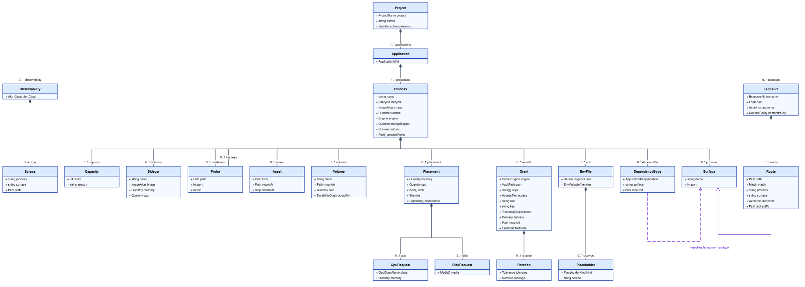
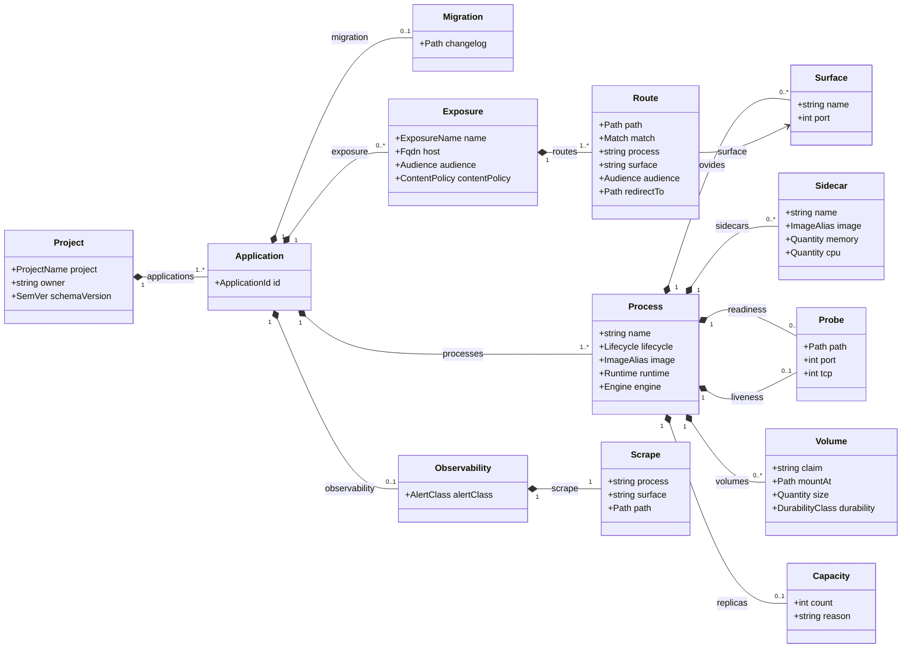

# Chapter 10: Project Intent

Layer 1. The only layer a human authors, and the only layer that lives in the
project's own repository.

Two rules govern everything below, and every field is justified against one of
them:

1. **Project Intent contains no mechanisms.** A field belongs here only if it
   states a requirement. `RollingUpdate`, `nodeSelector`, `IngressRoute`,
   `VaultStaticSecret`, `securityContext` and `statefulset` are mechanisms and
   appear nowhere. What they should be is derived from what is declared
   ([0005](../../docs/adr/model/0005-derivation-is-total.md),
   [0030](../../docs/adr/model/0030-runtime-mechanics-derived.md)).
2. **Project Intent never gets the last word on a contended value.** A value
   that must be unique across the estate, or that draws on a shared finite
   resource, is **arbitrated** by layer 2
   ([0004](../../docs/adr/model/0004-contention-decides-authority.md)). Contention
   decides who **arbitrates**, not who **authors**: the Application states its
   requirement, the platform decides whether it fits and where, and the Application
   reads the assignment back from its generated `resolved.yml`
   ([0033](../../docs/adr/model/0033-assignments-published-back.md)).

The second rule reads as it does because placement forced it. `memory` and `cpu`
are contended (they draw on a finite pool of node capacity) and they are
nevertheless authored here, as raw quantities per Process
([0061](../../docs/adr/model/0061-placement-is-hard-dimensions.md)). An authors-only
reading of contention would forbid the field and leave the estate exactly where
it is, because a number no Application may write is a number nobody writes, and what
that produced is BestEffort on every pod. Arbitration is real and it is the
platform's: eligibility is checked against node allocatable at build time, and
the scheduler places at apply.

## Two artefacts

Layer 1 is authored as two kinds of file:

| file | owns |
|---|---|
| `platform/<project>.project.yml` | one project: its `owner`, and every Application in it: processes, surfaces, dependencies, exposure, probes, volumes, placement, hardening, and secret **access**, each declared at whichever of the three levels shares it ([Shared intent](#shared-intent)) |
| `platform/env/<process>/base.env` + `platform/env/<process>/<cluster>.env` | every environment variable that **that Process** receives |
| `platform/env/_project/base.env` + `platform/env/_project/<cluster>.env` | every environment variable **every Process of the project** receives |
| `platform/env/_applications/<application>/base.env` + `.../<cluster>.env` | every environment variable **every Process of that Application** receives |

Both paths are normative, and the worked examples follow them. The
`.project.yml` suffix names the `kind` the file carries, `Project`, so a
`platform/` tree holding several project files beside its `env/` tree says which
files a publish step reads without a convention nobody wrote down. A Process's
env files live in **a directory named for the Process**, never in one file per
Process named after it: the overlay `<cluster>.env` has to sit beside its
`base.env`, and a flat `<process>.base.env` leaves the overlay nowhere to go.

The two shared scopes are directories beside the Processes' own, named
`_project` and `_applications`. The leading underscore is what keeps them
unambiguous: a Process name is a Kubernetes object name, so it is a DNS-1123
label and can never begin with one. A directory under `platform/env/` whose
name begins with `_` is therefore a scope, and any other is a Process.

One file is one project and one Intent Fragment
([0063](../../docs/adr/model/0063-intent-authored-per-project.md)). A repository may
hold several project files (which is what lets `homelab-collections` stay one
repository holding three Applications rather than three repositories with three
publish workflows) and a project never spans repositories, so composition unions
fragments and never has to union a project (chapter 40).

**A composition fixture that stands in for an already-published fragment does
not carry `.project.yml`.** `spec/v1/examples/negative/*/intent*/` holds
documents fed directly to composition to exercise an invariant at the union
(chapter 40), never rendered and never read out of a `platform/` tree. The
suffix above names a file a publish step reads from a project's own
repository; putting it on a fixture that is published by nothing and has no
`platform/` tree to sit in would claim a layout that does not exist. The
difference is deliberate: a directory under `spec/v1/examples/<project>/` is a
worked project meant to render, and one under `spec/v1/examples/negative/` is
meant to make composition fail, at least one of them
(`duplicate-process-name`) before a union of two fragments ever runs. A test
that discovers project files by the `.project.yml` suffix is meant to find
only the former, and must keep finding only the former.

The split that matters is not file-level but concern-level. A secret's **access**
is declared in the project file, beside the `dependsOn` edge that motivates it; the
**environment variable** that carries it is a placeholder in the env file. Each
file therefore checks the other: an env file referencing a secret with no grant is
an unauthorised reference, and a grant with no reference is a dead grant.

```yaml
apiVersion: intent.jorisjonkers.dev/v1
kind: Project
schemaVersion: 1.0.0
```

The `apiVersion` deliberately does not reuse `deployment.jorisjonkers.dev`, which
three mutually incompatible documents already share: the defect
[0003](../../docs/adr/model/0003-three-model-pipeline.md) exists to fix. Each layer
gets its own namespace. `kind` names the authored document (one project holding
many Applications) while chapter 40's `IntentFragment` is the envelope that
publishes it. `schemaVersion` is the **data model's own semver**, not the
toolkit package's version, and composition accepts a range rather than an
equality ([0039](../../docs/adr/model/0039-artifact-schema-versioning.md)); chapter 40
defines the range and what the lock records.

## The model



<sub>[Diagram source](#the-layer-1-model) · generated by
[`scripts/diagrams/class-diagram.py`](../../scripts/diagrams/class-diagram.py)</sub>

The diagram is embedded rather than kept as a separate `.mmd`. A standalone
`.mmd` does not render on GitHub, so it would be invisible in exactly the review
this chapter exists for.

It carries the levels, what each one is made of, and nothing else. Three things
are deliberately absent.

The **closed vocabularies** an attribute's type names are tabulated under
[The closed vocabularies](#the-closed-vocabularies) rather than drawn: as boxes
they added a line each and told a reader nothing the type name had not.

**No Shared Intent family is drawn at all**: not `secrets`, not `env`, not
`dependsOn`, `assets`, `writablePaths`, `placement`, `cutover` or
`startupBudget`. Eight families, each declarable at three levels, is more
relations than a drawing can carry and still be read; and drawing each one at a
single level would say the level is where it lives, which is the one thing that
is not true of them. They are [tabulated](#shared-intent) instead, and each has
its own section. What the drawing is for is the part that *is* structural: which
level holds which, and what a Process is made of that no other level may
declare.

The **relations that reach across layers** are not drawn either. A
`Placeholder` byte-matches a granted path and an exposure placeholder addresses
`application.name`; both are stated where they are enforced, under
[Validation](#validation).

Nothing in it is ungraded. `minAvailable` was the last such field and it is
**deleted** rather than graded
([0089](../../docs/adr/model/0089-replicas-derived-no-minavailable.md)):
availability by replica count does not exist on this substrate, so the field
could only ever have been a request the platform could not honour. `sidecars` is
graded by
[0064](../../docs/adr/model/0064-sidecars-are-process-vocabulary.md). `placement` is not among them: it is graded by
[0061](../../docs/adr/model/0061-placement-is-hard-dimensions.md) and specified in
full below. It is the one composite an **effective** Process cannot be without,
and the one an authored Process may leave to a level above it, because the node
dimensions are shared and the quantities are not
([A quantity is never shared](#a-quantity-is-never-shared)).
`provides` hangs off the **Process**, and is drawn: a port is a property of a
process and of nothing above it. `exposure` hangs off the **Application**, because
a hostname is a property of the product rather than of any one process, and one
hostname routes into two of them. Those two are in the drawing precisely because
they are *not* shared, which is what the drawing is now about.

## Shared intent

Eight of the things a Process holds are not facts about that program. They are
facts about the product it belongs to, or about the project that owns it, and
declaring them per Process is how they drift. Those eight are **Shared Intent**,
and each may be declared at the **Project** header, on an **Application**, or on a
**Process** ([0124](../../docs/adr/model/0124-shared-intent-descends-to-the-process.md)):

| family | what a shared declaration means | where the family is specified |
|---|---|---|
| `secrets` | every Process below the level holds the grant | [Secrets](#secrets) |
| `env` | every Process below the level receives the variables | [Configuration](#configuration) |
| `dependsOn` | every Process below the level gets the edge, and the egress it derives | [Dependencies](#dependencies) |
| `assets` | the file is mounted into every Process below the level | [Assets](#assets) |
| `writablePaths` | every Process below the level may write the path | [Writable paths are declared, not exempted](#writable-paths-are-declared-not-exempted) |
| `placement` | every Process below the level requires those node dimensions | [Placement](#placement) |
| `cutover` | every Process below the level cuts over that way, except a prepare Process, which cuts over nothing | [Cutover is declared, not promised](#cutover-is-declared-not-promised) |
| `startupBudget` | every Process below the level gets that budget | [Rollout](#rollout) |

Nothing else is shared. `id`, `observability` and `exposure` are the Application's
own; `owner` and `project` are the project's; `name`, `image`, `lifecycle`,
`runtime`, `engine`, `provides`, `sidecars`, `probes`, `volumes` and `replicas`
identify the Process and are declared on it. An `image` shared between two
Processes is one Process, and a `probes` block shared between two Processes
asserts that two programs answer the same URL.

### Sharing merges, and a duplicate is refused

A Process's **effective** declaration of a family is every level above it merged
with its own. Lists extend each other: an Application that holds six grants where its
sibling holds two is the normal case, and the two they share are written once,
above both. Where two levels declare **the same thing**, the **lowest**
declaration is the one that holds, because the lower level is the more specific
statement of it.

Restating the same thing **identically** at two levels is duplication, and it is
refused: `E_SHARED_DECLARATION_DUPLICATED`, **at the lower declaration**, which
is the one an author deletes to fix it. A family with an object of its own (a
grant, an edge, an Asset) is refused at that object; the families that have none
share one refusal at the level that wrote them, naming each of them, because the
level is the only thing a pointer can name.

What counts as the same thing is the family's own identity, and **an identity
plus equal terms** is what makes a second declaration a duplicate rather than a
replacement: a grant on the same path with a different `access` or `rotation` is
that Process's version of the grant, not a copy of it.

| family | one declaration is identified by | merging two levels gives |
|---|---|---|
| `secrets` | the **derived** read path ([Secrets](#secrets)), so a `kv` grant and a `database` grant never collide | every path either level grants; the lower grant's access, delivery and rotation where both grant a path |
| `env` | the variable name, within one Cluster Target | every variable either scope sets; the lower scope's value where both set one |
| `dependsOn` | `{application, surface}`; `required` is a term rather than part of the identity, so an edge that differs in it is a replacement | every edge either level declares; the lower edge's `required` where both declare one |
| `assets` | `mountAt`: two files cannot arrive at one path | every mount either level declares; the lower Asset's `from` where both mount a path |
| `writablePaths` | the path | the union of the paths |
| `placement` | the key: `arch`, `site`, `disk`, `gpu` or `capabilities`, each separately and by value | every key either level sets; the lower value where both set one |
| `cutover` | the family, which is one value | the lowest level's value |
| `startupBudget` | the family, which is one value | the lowest level's value |

There is no removal syntax. A Process that must not hold a shared declaration at
all is evidence the declaration was never shared, and it moves down a level; the
lower level replaces a shared declaration, it never deletes one.

**Refusing the identical restatement is what keeps the effective set readable.** A
lower declaration that changes nothing is either a copy that will drift from the
one above it or an author who misread the level, and in both cases it is the one
case where a reader cannot tell by looking whether a value holds or is shadowed.
Refuse it, and every lower declaration means something: it always differs from
what it replaces, visibly, at the place it is written.

**This is not the `overrides` field.** That field was a second declaring site for
a value the model **derives**, and it stays deleted, with `replicas: {count,
reason}` as the sole exception
([0031](../../docs/adr/model/0031-derived-overrides-with-reason.md),
[No overrides](#no-overrides)). Nothing here overrides a derived value. A lower
level of Shared Intent is the same field, written at the level it belongs to, in
the vocabulary it already has: there is no `overrides` key, no exception map and
no second spelling of anything.

### A quantity is never shared

`memory` and `cpu` may **not** be declared above the Process:
`E_SHARED_QUANTITY`, at the declaration. Every other `placement` key describes
the node a pod needs, which is naturally a property of a product. A quantity is
per container, and eligibility **sums** every container's
([Eligibility sums](#sidecars)), so a shared quantity would be a number added
once per Process and meaning something different each time.

The consequence is that `placement` is the one family whose legal keys depend on
the level it is written at, and the one whose completeness is checked after the
levels are unioned rather than by the schema: a Process whose effective
`placement` has no `memory` or no `cpu` is `E_PLACEMENT_INCOMPLETE`. `cutover`
is checked the same way and for the same reason, because it is required on every
Process and may now be answered above one: a Process with no effective `cutover`
is `E_CUTOVER_MISSING`.

### Why the project level exists

[0022](../../docs/adr/model/0022-grants-live-on-the-application.md), superseded by
[0124](../../docs/adr/model/0124-shared-intent-descends-to-the-process.md),
refused a project level, and the refusal was about grants alone: a project-level
grant hands every Application in the file a reader slot on a path it may not need,
and a read grant covers the whole document
([0009](../../docs/adr/model/0009-vault-read-is-per-path.md)). That argument is
unchanged and it is now an argument about what an author should put at the
project level rather than about whether the level exists. The widening is
visible where it is written, because the Applications that receive it are listed in
the same file, and `E_ROLL_AFFECTS_OTHER_READERS` (chapter 40) computes over the
readers of a path whatever level granted it. The other seven families carry no
such argument at all.

The levels are an access boundary **only** for `secrets`, and only because
identity is per Process
([0024](../../docs/adr/model/0024-identity-per-process.md)). A project-level
grant reaches three principals because three Processes hold it, not because a
project is one: there is no project ServiceAccount and no project Vault role.

## The effective intent

The **Effective Intent** is Project Intent with every shared declaration lowered
onto the Processes that hold it. In it, the Project holds `project` and `owner`,
an Application holds `id`, `observability` and `exposure`, and a Process holds
everything it runs with. It is the only shape anything downstream reads
([0125](../../docs/adr/model/0125-the-effective-intent-is-a-lowering.md)):
composition, every derivation of [chapter 16](16-dependencies.md), and
resolution into layer 2 all read lowered Processes, so no derivation unions
levels for itself.

The lowering is a step, not an accessor. It runs after a document's own
constraints, because a duplication diagnostic has to point at the two
declarations an author wrote, and before composition, because composition's
invariants are about what Processes hold: a reader set computed over authored
levels under-reports
([Grant unit](#grant-unit), `E_ROLL_AFFECTS_OTHER_READERS` in chapter 40).

Nobody authors the Effective Intent and nothing publishes it. It carries no
`schemaVersion` and no digest of its own: the pinned-input chain runs from the
authored documents
([0006](../../docs/adr/model/0006-pinned-inputs.md)), and the Intent Fragment a
project publishes is the authored file
([0037](../../docs/adr/model/0037-composition-oci-fragments.md)). A compiler
must be able to **print** it, because a reviewer reading one Process block now
under-counts what that Process holds at three levels rather than two.

## Application identity

Intent is authored one file per project. The file states the project, raises
exactly one field to it, and lists the Applications it holds
([0063](../../docs/adr/model/0063-intent-authored-per-project.md)):

```yaml
project: auth                 # the file header; one project per file
owner: joris                 # who is notified, for every Application in the file
applications:
  - id: auth                 # the referencable identity; namespace auth-system
    processes:
      - name: auth-api       # the process's own name, and its identity
        image: auth-api
      - name: auth-ui
        image: auth-ui
```

An Application is identified by one short string, unique across the estate, and that
string is the only identity another Application may reference
([0010](../../docs/adr/model/0010-flat-application-identity.md)). The id is the repository
or product name. Process names are whatever the processes are actually called,
and so are their images: neither is a derivative of the id.

**The namespace derives from the project**, as `<project>-system`, and from nothing
else. That reproduces all ten live Application namespaces (`auth-system`,
`data-system`, `knowledge-system`, `app-system`, `agents-system`, `mail-system`,
`media-system`, `notes-system`, `automation-system`, `utility-system`) with zero
renames and not one live object moved.

Which is why nothing remains for an alias field to express, and why there is
none. `fleet-infra/docs/live-divergence.md` records the case one was invented
for (*"the project repository is home-portal; live called the image app-ui. A
rename, not a different image"*) and under these rules the row describes a
divergence that no longer exists. The id is the repository name, `home-portal`.
The Process is called what the process is called, `app-ui`, and so is its
image. The project is `app`, so the namespace is `app-system`, which is where the
Application already runs. The three things an alias used to carry are the namespace
(now derived from the project), the Process name and the image (both authored
explicitly), and the one divergence it still expressed (a namespace of the
Application's own choosing) is exactly the move that let an Application claim another
project's namespace. Deleting the field deletes that move with it.

**An Application is the unit of atomic release.** Some products are one thing in two
processes: a new frontend against an old API is a broken product even though each
pod individually reports healthy. That coupling is carried by the Application
boundary itself ([0062](../../docs/adr/model/0062-application-is-the-release-unit.md)).
The Processes of one Application switch together or none switches. No Process's new
version receives traffic until **every** Process's new version is healthy, where
healthy means that Process's own declared readiness
([0014](../../docs/adr/model/0014-probes-are-siblings.md)). If any member fails its
`startupBudget`, **no** member switches and the old versions keep serving.
Rollback is Application-scoped: reverting one Process reverts all of them.

There is no mechanism to couple two Applications, and no field naming a set. A pair
that must release together is **one Application** (`auth-api` and `auth-ui` are
Processes of Application `auth`, `stalwart` and `stalwart-provisioner` Processes of
Application `stalwart`) and a surviving pair that cannot merge is evidence the
Application boundary is drawn wrong, not a missing field. Merging costs nothing in
this estate because nothing references the folded names: the complete set of
`dependsOn` targets across the composed union is `platform-postgres`,
`platform-rabbitmq`, `stalwart` and `platform-valkey`, and `auth-api`'s
estate-wide role is the forward-auth middleware derived from every route's
audience ([0018](../../docs/adr/model/0018-exposure-by-audience.md)), never an edge.

Atomicity is declared rather than derived, because lockstep release is a product
choice the graph cannot see: a frontend depends on its API, but a dependency edge
does not mean the two must cut over together, and deriving atomicity from every
edge would make the whole estate one unit. An Application is therefore not a Reconcile
Unit:

| | Reconcile Unit | Application |
|---|---|---|
| answers | in what order | all at once, or not at all |
| origin | derived from the dependency graph ([0032](../../docs/adr/model/0032-reconcile-unit-derived.md)) | declared, by drawing a boundary |
| example | `platform-postgres` before `knowledge` | `auth-api` and `auth-ui`, in Application `auth` |
| failure | the later unit waits | nothing switches |

The Application says **what** must hold, never **how** it is achieved. The mechanism (
what applies the change, in what order, behind what gate) is
[chapter 55](55-delivery.md)'s.

**A namespace holds several Applications by construction, so it is not a trust
boundary.** This was once a footnote to an exception; it is now the normal case
for every namespace in the estate, and it must be read as normal rather than as
an edge case. No isolation claim may rest on a namespace wall. Isolation is the
derived default-deny edge set
([0035](../../docs/adr/model/0035-network-policy-default-deny.md)), evaluated per pod,
plus per-Process identity ([0024](../../docs/adr/model/0024-identity-per-process.md)).

| field | level | required | notes |
|---|---|---|---|
| `project` | file header | yes | One project per file. The namespace is `<project>-system`; the project also owns the Secret Subtree and is the unit of Intent Fragment publication ([0037](../../docs/adr/model/0037-composition-oci-fragments.md), [0063](../../docs/adr/model/0063-intent-authored-per-project.md)). |
| `owner` | file header | yes | Who is notified. Not shared and not inherited: it is the project's, and an Application needing a different owner needs its own project. |
| the eight Shared Intent families | file header | no | `secrets`, `env`, `dependsOn`, `assets`, `writablePaths`, `placement`, `cutover`, `startupBudget`, each held by every Process in the file ([Shared intent](#shared-intent)). `memory` and `cpu` are refused here: `E_SHARED_QUANTITY`. |
| `id` | Application | yes | The one referencable identity, estate-unique. The repository or product name. |
| `observability` | Application | no | `{alertClass, scrape {process, surface, path}}`, whole or absent. Absent means no monitoring is rendered. Urgency, never routing ([0021](../../docs/adr/model/0021-observability-scrape-and-alert-class.md)). Never raised to the project: a project would then page as loudly as its loudest member. See [Observability](#observability). |
| `processes` | Application | yes | One or more. They switch together. |
| the eight Shared Intent families | Application | no | The same eight, held by every Process of this Application ([Shared intent](#shared-intent)). The level a family is written at is an author's choice about where the fact belongs, never about what it means. |
| `exposure` | Application | no | The hostnames this Application serves and how each routes into its Processes. On the Application, not the Process: one hostname fronts two processes in the live `auth` case. An Application nothing reaches from outside declares none. See [Exposure](#exposure). |

Uniqueness cannot be had by construction, only by check: the id encodes neither
project nor repository, so nothing structural stops two repositories claiming one
string. `E_DUPLICATE_APPLICATION_ID` fires at composition (chapter 40), and the
window in which two repositories both claim an id is an accepted cost.

Process names carry a second uniqueness rule, and it is scoped to the **project
file** rather than to the Application, because the ServiceAccount and the Vault role
are the Process name alone: `auth-system.auth-api`, never
`auth-system.auth-auth-api` ([0024](../../docs/adr/model/0024-identity-per-process.md),
derived in chapter 16). Two Applications in one file therefore cannot both call a
Process `api`: that is `E_DUPLICATE_PROCESS_NAME` at composition (chapter 40),
raised where a reader can see both declarations at once.

No field can move an Application out of its project's namespace, so the old question of
whether an Application may name a namespace some other applier owns has lost its
subject matter: see
[Delivery reads these declarations, and co-testing stays parked](#delivery-reads-these-declarations-and-co-testing-stays-parked).

## The label set

Labels are **derived and fixed**, and no authored field contributes to them
([0072](../../docs/adr/model/0072-the-label-set-is-fixed.md)). The set is stated
here rather than left to a renderer because two of these labels are a
Deployment's `selector.matchLabels` and are therefore **immutable on a live
object**: changing the convention later is delete-and-recreate on every process
in the estate.

| label | value | mutable |
|---|---|---|
| `app.kubernetes.io/name` | the Process `name` | **no** (selector) |
| `app.kubernetes.io/instance` | the Process `name` | **no** (selector) |
| `app.kubernetes.io/part-of` | the Application Id | yes |
| `app.kubernetes.io/managed-by` | `deploy-kit` | yes |
| `app.kubernetes.io/component` | the Process `runtime` | yes |

`part-of` carries the Application, which is what makes the Release Unit selectable
by whatever performs a switchover ([chapter
20](20-resolved-deployment.md#the-release-gate)). It is deliberately not a
selector: an Application gaining or losing a Process must not require recreating
the others.

`name` and `instance` are both the Process name rather than one naming the
Application, because the selector must match exactly one controller's pods. A
`name` of the Application and an `instance` of the Process would read better and
would make every Process of a multi-Process Application selector-ambiguous the
moment anything selected on `name` alone.

No `app.kubernetes.io/version`. A version label would have to come from the
images lock, so it changes on every image bump, for a label that no selector
may use and that the image digest already states exactly, on the object, where
a reader looks anyway.

An estate-scoped Deliverable carries `managed-by` and nothing else: it belongs
to no Process and to no Application, and `part-of` on such an object would name a
Application that does not own it.

## Ports and surfaces

There is no `ports` list. A port is an **integer**, written where it is used, and
`provides` is a flat map of surface name to port declared **on the Process**,
because a port is a property of a process:

```yaml
# in the data project file, under Application platform-postgres
processes:
  - name: platform-postgres
    provides:
      db: 5432          # the process itself
      metrics: 9187     # its exporter sidecar, in the same pod
```

A Process with no listener declares no `provides` at all: the ingest worker of
`knowledge` has none, and the map is absent rather than empty.

```yaml
probes:                       # on the Process: the integer, at its point of use
  readiness:
    path: /api/actuator/health/readiness
    port: 8080
```

An [exposure](#exposure) route and an [observability](#observability) scrape are
the two places a port is *not* written: both sit on the Application and name
`{process, surface}`, so the integer stays declared once, by the process that
listens on it.

Surface **names** are unique within an Application, not within a Process, because a
dependency edge names `{application, surface}` and never a Process
([0020](../../docs/adr/model/0020-dependency-edges-carry-surface.md)). An Application's
surface set is the union of its Processes' `provides` maps, and one name declared
twice inside that union is a build error: the edge would otherwise be ambiguous
about which process it means.

The rendered Kubernetes port name is **the name of the `provides` surface
declaring that same integer**; where no surface declares it, the name derives
from the role: `http` for an exposure, `metrics` for a scrape. That rule
reproduces every port name the live cluster uses, because the live names already
are surface names: `http` (23 references), `metrics`, `db`, `smtp`, `sieve`, `s3`,
`submissions`.

`containerPort` entries are derived. They are documentational in Kubernetes (
traffic routes by `targetPort` regardless) so declaring them would be a third
place to state a number.

**One thing to settle:** the live cluster names Postgres's port `db` while the
surface a consumer would naturally write is `postgres`. Either the surface is
named `db`, or the rename is accepted as a parity entry. `submissions` and
`submission` both appear live, which is a separate inconsistency this rule
happens to expose.

## Process

`name` is the process's own name, unique within the project file. It is not a
derivative of the Application id, and it is what the Process's ServiceAccount and
Vault role are called (chapter 16).

`image` is an alias resolved to a digest through the images lock, never a tag,
never a digest here.

`lifecycle` is `application`, `job` or `prepare`. Not `deployment` /
`statefulset` / `job`, because those are mechanisms; the object kind derives from
`lifecycle` and `volumes`. `prepare` is forward-only setup that runs before the
Application's new version starts ([Prepare Processes](#prepare-processes)).

`runtime` selects the Runtime Profile: `jvm`, `python`, `node`, `static`, `none`.
`none` is correct for a third-party image and injects no profile values at all.

`engine` names **what the process is**, where that is something the platform
has to treat specially: `postgres`, `rabbitmq`, `valkey`, `files`, or absent.
It is a fact about the Process rather than a mechanism, which is why it belongs
here ([0078](../../docs/adr/model/0078-engine-is-process-vocabulary.md)), and
it is what the platform keys its backup method off
([Storage and durability](#storage-and-durability)). It is required on a Process
holding a volume of a class that derives a backup, and refused on one that
derives none: `E_ENGINE_WITHOUT_DURABILITY` and `E_DURABILITY_WITHOUT_ENGINE`.

`engine` is not `runtime`. `runtime` says how the process is instrumented (
`jvm`, `python`, `node`) and `engine` says what its data is. `platform-postgres`
runs a third-party image, so its `runtime` is `none` and its `engine` is
`postgres`.

`provides` and `placement` are Process fields, specified in
[Ports and surfaces](#ports-and-surfaces) and [Placement](#placement). Every
Process declares a `placement` block, because two of its dimensions are
required.

`exposure` is **not** a Process field. A Process states which ports it listens
on; which hostname reaches it, and on what path, is stated once on the Application
([Exposure](#exposure)).

### Sidecars

A Process is one pod, and a pod holds more than one container three times in
this estate. `sidecars` names the others
([0064](../../docs/adr/model/0064-sidecars-are-process-vocabulary.md)):

```yaml
- name: postgres
  image: postgres-17
  engine: postgres
  provides: {postgres: 5432, metrics: 9187}   # the exporter serves 9187
  placement: {memory: 2Gi, cpu: 500m}
  sidecars:
    - name: postgres-exporter
      image: postgres-exporter
      memory: 64Mi
      cpu: 50m
      # the platform's posture applies; a container authors no hardening
```

| field | required | shape | notes |
|---|---|---|---|
| `name` | yes | one value | The container's own name, unique among the Process's containers. The Process is one of them, so a sidecar may not take its name. A collision is refused at composition (chapter 40). |
| `image` | yes | an alias | Resolved to a digest through the images lock, exactly as a Process's is. A tag would put a mutable reference in a Deliverable, which `E_FLOATING_IMAGE` (chapter 30) refuses. |
| `memory` | yes | one quantity | This container's request. Shape rules are the Process's ([Placement](#placement)). |
| `cpu` | yes | one quantity | The same. |

The split follows Kubernetes rather than a rule of the model's own: `nodeSelector`
and affinity are **pod**-level, `resources` and `securityContext` are
**container**-level. So the node dimensions (`arch`, `site`, `disk`, `gpu`,
`capabilities`) stay on the Process and describe the pod, and a sidecar
declares neither them nor a `placement` block. `memory` and `cpu`
are per container, and a sidecar declares its own.

Nothing is inherited, and nothing needs to be: every container in the pod meets
`restricted` or the Process is refused, so there is no per-container relaxation
to push onto a sidecar in the first place.

**Eligibility sums.** A node must fit the pod's containers together, so the
placement check adds every sidecar's `memory` and `cpu` to the Process's before
matching against allocatable
([0061](../../docs/adr/model/0061-placement-is-hard-dimensions.md)). `postgres` at
2Gi with a 64Mi exporter needs a node with 2112Mi free, not 2Gi. This is the one
place the addition matters and the one place it is easy to miss.

A sidecar has no identity, no probes, no exposure and no release semantics of
its own: it is not independently deployable, which is what makes it a sidecar
rather than a Process. `provides` therefore stays on the **Process** even when
the listener is a sidecar: `platform-postgres` declares `metrics: 9187` and the
exporter is the container that serves it, which is exactly the attribution the
model could not state before this field existed.

### Dependencies

```yaml
dependsOn:
  - {application: platform-postgres, surface: postgres}
  - {application: auth-api, surface: http, required: false}
```

Declared at whichever level needs the edge, and the reason to keep declaring it
per Process is that network policy is precise: within `knowledge`, the API
reaches Postgres while the ingest worker reaches RabbitMQ, and neither inherits
the other's egress ([0020](../../docs/adr/model/0020-dependency-edges-carry-surface.md),
[0035](../../docs/adr/model/0035-network-policy-default-deny.md)). An edge shared
up a level is a real widening for exactly that reason, and it is the right
declaration where every Process of the Application genuinely talks to the thing:
`stalwart` and `stalwart-provisioner` both reach `platform-postgres`. An edge
declared at two levels merges, identified by `{application, surface}`: the lower
declaration's `required` holds, and the same edge declared identically twice is
`E_SHARED_DECLARATION_DUPLICATED`. The Application's edge
set is the union, and that union drives the Reconcile Unit DAG
([0032](../../docs/adr/model/0032-reconcile-unit-derived.md)). Chapter 16 covers what an
edge derives, inbound as well as outbound.

An edge says one Process needs another to run. It says nothing about which
suites must pass before either may ship: that is co-testing, which stays parked
in [docs/adr/deferred/](../../docs/adr/deferred/README.md).

## Configuration

Configuration is authored as dotenv, **per Process**
([0011](../../docs/adr/model/0011-configuration-env-files-per-process.md)), because
Processes do not share an environment: `knowledge-api` and
`knowledge-ingest-worker` overlap on the database and RabbitMQ coordinates and
credentials, and on nothing else.
They do overlap, though, and `env` is one of the eight Shared Intent families, so
there are two shared **scopes** beside the per-Process one
([Two artefacts](#two-artefacts)):

| scope | directory | received by |
|---|---|---|
| project | `platform/env/_project/` | every Process in the file |
| Application | `platform/env/_applications/<application>/` | every Process of that Application |
| Process | `platform/env/<process>/` | that Process |

A scope is a directory rather than a block in the project file because these are
files, and a file is what a dotenv is. Each scope holds the same pair a Process's
own does, a `base.env` and one overlay per Cluster Target, so a shared variable
that differs per cluster says so where it is written.

A scope directory that names no Application and no Process the project file
declares is `E_UNKNOWN_ENV_SCOPE`, at the file. A directory is how a variable
reaches a level, so a misspelt one is a file every build reads and no Process
receives, which is the failure this refusal exists to make loud.

```
# platform/env/knowledge-api/base.env
SPRING_PROFILES_ACTIVE=prod
KNOWLEDGE_MODE=lite
DB_HOST=${dependency:platform-postgres.host}
DB_USER=${secret:secret/data/platform/postgres/kb#user}
```

`base.env` carries everything that does not vary; one overlay per Cluster Target
(`<cluster>.env` beside it) carries only what differs, overlay
winning key by key. **The overlay is the only place a key is written twice.**
Across scopes the rule is the same one every Shared Intent family follows
([Sharing merges, and a duplicate is refused](#sharing-merges-and-a-duplicate-is-refused)):
a Process's effective environment is the three scopes merged, per Cluster Target,
the narrower scope's value holds for a variable two scopes set, and the same
variable set to the same value in two scopes is
`E_SHARED_DECLARATION_DUPLICATED`. So `DB_HOST` on the project scope and
`DB_HOST` in one Process's `base.env` is that Process reading a different
database, said where a reader sees it; the same line copied into both is refused. With one cluster the overlay is usually empty, which is
already what `stalwart-provisioner` half-invented, its `production.env` and
`staging.env` being byte-identical.

A literal is written literally. A derived value is a **named placeholder**:
`${dependency:…}` for a coordinate, `${secret:…}` for a secret, `${exposure:…}`
for a hostname the estate serves, and `${identity:…}` for what the platform
derived about **this** Process
([0091](../../docs/adr/model/0091-identity-placeholders-not-framework-wiring.md)):

| key | value |
|---|---|
| `${identity:vaultRole}` | the Process's Vault role, its own name ([0024](../../docs/adr/model/0024-identity-per-process.md)) |
| `${identity:serviceAccount}` | the Process's ServiceAccount name |
| `${identity:namespace}` | `<project>-system` |

The key set is closed. It exists because a self-delivering Process has to wire
its own Vault client, and one of the values it wires (the role name) is
derived: written as a literal it is the same staleness class as the
`serviceAccountName()` defect, where a hand-maintained name and a derived one
disagreed and nothing noticed. Writing a derived value as a literal is a build
error, and so is writing a Runtime Profile key at all: `OTEL_*` and
`PYROSCOPE_*` come from `runtime`, and an exceptional value is not a layer-1
concept: there is no `overrides` field to put it in. Ten `OTEL_*` variables are
byte-identical today across `auth-api`,
`agents-api` and `knowledge-api` except `OTEL_SERVICE_NAME`, sixty duplicated
lines that leave the project repositories under this rule. What a Runtime Profile
does not cover and several Processes still share is what the project and
Application scopes are for: written once, in one file, rather than once per Process
directory.

Placeholders are named-source references and never a template language: no
conditionals, no arithmetic. The placeholder names the source; the key names the
variable. That is what lets `knowledge` write `DB_HOST` and `n8n` write
`DB_POSTGRESDB_HOST` from the same Postgres.

### The dotenv subset that is read

An env file is a model artefact and not a blob the renderer passes through, so
the subset it may use is fixed here and anything outside it is refused rather
than interpreted, exactly as the YAML subset is
([Two artefacts](#two-artefacts)):

- a line is a comment (`#` first, after any indentation), blank, or one
  assignment;
- an assignment is `NAME=value`, where `NAME` matches `[A-Za-z_][A-Za-z0-9_]*`:
  the shape a process can actually read from its environment;
- a value is **either** a literal **or** exactly one placeholder, never a
  literal with a placeholder inside it. `${secret:…}/db` is refused, because a
  value half-derived is a value no renderer can partition
  ([Delivery](#delivery)): a `${secret:…}` key becomes an `envFrom` secretRef
  entry, and there is no such thing as half an entry;
- a literal carries no `#`, which is a comment wherever it appears;
- there is no quoting, no `export`, no line continuation and no multi-line
  value. Each is a dotenv dialect rather than dotenv, and a value that needs
  one is a value that wants to be an [Asset](#assets).

A variable named twice in one file is refused for the same reason a variable
named in two scopes is, and by the same code: the second line changes nothing a
reader can see, and which one holds would take evaluating the file.

A derived value is *forbidden* as a literal rather than *defaulted*, because a
permitted override is indistinguishable from a stale copy. The renderer partitions
the file: literal keys become plain env entries, and `${secret:…}` keys become
`envFrom` secretRef entries: the author never partitions.

## Assets

File-shaped configuration is an **Asset**: a declarative settings file in the
consuming application's own format, optionally threaded with the same named
placeholders env files use ([0012](../../docs/adr/model/0012-assets-not-code.md)).

```yaml
assets:
  - from: config/postgresql.conf
    mountAt: /etc/postgresql/postgresql.conf
```

An Asset is Shared Intent, so the same block may sit on the project header or an
Application: a CA bundle or a shared logging configuration mounted into every
Process is one declaration rather than one per Process. Two Assets reaching one `mountAt` are one
declaration, so the lower level's `from` is the file that arrives there, and the
same `from` mounted at the same path by two levels is
`E_SHARED_DECLARATION_DUPLICATED`.

**Change propagation is unconditional and there is no `onChange` field**
([0094](../../docs/adr/model/0094-asset-change-restarts-unconditionally.md)).
Every Asset renders a **content-hashed object name**, so an edit reaches the pod
(16 of the estate's 18 ConfigMaps are plain today, meaning an edit applies
successfully and has no effect) and the resulting pod-template change restarts
the Process.

There is no `reload`. Nothing in Kubernetes reloads a process, no image in this
estate watches its own config file, and a reload would need an actor the model
does not have. The consequence is stated rather than hidden: with `replicas: 1`
and an `interrupted` cutover ([0089](../../docs/adr/model/0089-replicas-derived-no-minavailable.md)),
editing one line of `postgresql.conf` takes `platform-postgres` down for a
restart. That is the true cost of an Asset edit on this substrate, and an author
who needs it to be cheaper needs a different mechanism than a field.

`rotation.tolerates: reload` on a **secret** is a different word for a different
actor and stays: there the client library re-reads the value itself
([Delivery](#delivery)), which is something that genuinely happens under
`delivery: self`. An Asset has no such actor.

The eighteen ConfigMaps were three unrelated things, and only two of them are
Assets. **Six fixed files** with no derived values (`postgresql.conf`,
`enabled_plugins`, `cors.ini` + `single-node.ini`, `gatus` `config.yaml`, `hermes`
`sources.conf`, `stalwart` `config.json`) and **seven mixed files**: a large
static body threaded with a few derived values, `rabbitmq.conf` most starkly with
one derived line in twenty-four (`auth_oauth2.issuer = https://auth.jorisjonkers.dev`,
a hostname belonging to another Application). Those thirteen are Assets. The other
**five are derived catalogs** (`gatus-endpoints` (41 derived references in 288
lines), `platform-edge-route-catalog` (30/163), `platform-edge-catalog` (28/146),
`grafana-datasources` (6/104), `postgres-init-script` (18/98)) and they leave
*authored* configuration entirely: each is an **inbound derivation** for the
platform Application that consumes it, rendered as that Application's own Asset
([chapter 16](16-dependencies.md#what-an-edge-derives-read-inbound),
[0098](../../docs/adr/model/0098-one-publication-path.md)).

An Asset may not be executable. `hermes-bootstrap` is 221 lines of shell and
`n8n-hooks` 499 lines of JavaScript, both run by `alpine:3.21` from a ConfigMap:
first-party code with no image, no tests and no version. That is a build error
here, and the fix is an image, not a template language.

## Probes

```yaml
probes:
  readiness:
    path: /api/actuator/health/readiness
    port: 8080
  liveness:
    path: /api/actuator/health/liveness
    port: 8080
```

`probes.readiness` and `probes.liveness` are sibling declarations, each carrying
its own `path` and `port`. **There is no
fallback** ([0014](../../docs/adr/model/0014-probes-are-siblings.md)). Readiness means
*can I serve traffic*; liveness means *is my process wedged*. A liveness probe
pointed at a readiness endpoint turns a dependency outage into a crash-loop, and
the v2 model made that the default for anyone declaring one path:
`src/adapters/kubernetes-workload-fragment.ts:166` renders
`livenessProbe: probe(health.livenessPath ?? health.path)`, and `app-ui` and
`agents-login` both rely on it today.

An application with no HTTP surface uses `tcp`, which is not decoration: `postgres`
probes with `tcpSocket` on port `db` for both, and the rest of the data tier does
the same.

```yaml
probes:
  readiness: {tcp: 5432}
  liveness:  {tcp: 5432}
```

A Process with no listener declares the absence, so a forgotten probe block is
never mistaken for a deliberate one:

```yaml
probes: none        # knowledge-ingest-worker: no ports, nothing to probe
```

Timings, thresholds and deadlines stay derived. A Process that declares ports
but no probe declaration is refused.

### What the probe derivation completes

Three things were derived only halfway, and a renderer filled the gap by
choosing ([0088](../../docs/adr/model/0088-startup-probe-targets-liveness.md)):

| derived | from |
|---|---|
| the startup probe's **target** | the **liveness** declaration: its `path` + `port`, or its `tcp` port |
| the startup probe's period and failure threshold | `startupBudget`, as before |
| the readiness and liveness cadence | the Platform Intent's probe policy: its `period`, `timeout` and `failures`, carried on every rendered probe |
| `initialDelaySeconds` | `0` on readiness and liveness, because the startup probe already gates both |

**The startup probe targets liveness, not readiness.** Exceeding a startup
probe's failure threshold kills the container, exactly as a failing liveness
probe does, so pointing it at a readiness endpoint reproduces the defect
[0014](../../docs/adr/model/0014-probes-are-siblings.md) exists to prevent: a
dependency outage makes readiness fail, startup never succeeds, and the pod
crash-loops on somebody else's outage.

A Process declaring readiness and no liveness therefore derives **no startup
probe** (there is nothing safe to poll) and its start is bounded by the
progress deadline alone.

Readiness is also what the Application's atomic switchover waits on: healthy means
*this* Process's declared readiness, so an Application with a Process that never
reports ready never switches any of them.

### Replicas, and the disruption budget

`replicas` derives as **1**
([0089](../../docs/adr/model/0089-replicas-derived-no-minavailable.md)). Storage
is `local-path` and every claim is `ReadWriteOnce`, so a stateful Process is
pinned to one machine by construction; on one node, two replicas are two
processes on one kernel. A Process that wants more states it as
[Capacity](#capacity) (a `count` above one with a reason) which is what
`auth-api`'s two replicas always were: a capacity decision on freed budget,
recorded now instead of inferred.

A `PodDisruptionBudget` is emitted **only where `replicas` exceeds one**, and as
`maxUnavailable: 1`:

| replicas | PDB |
|---|---|
| 1 | none |
| more than 1 | `maxUnavailable: 1` |

`minAvailable: 1` against `replicas: 1` permits **zero** voluntary evictions, so
`kubectl drain` on that node blocks forever, and on this estate that node is
also the control plane. That is a deadlock dressed as a guarantee. Expressing the
budget as `maxUnavailable` means a drain can always make progress, and it does
not have to be recomputed when a replica count changes.

## Storage and durability

```yaml
volumes:
  - claim: knowledge-vault-clone
    mountAt: /var/lib/knowledge-vault
    size: 20Gi
    durability: irreplaceable
```

Every volume declares a **Durability Class**
([0015](../../docs/adr/model/0015-durability-class-per-volume.md)), what the data is
worth, which only the owning Application knows:

| class | means | derives | live example |
|---|---|---|---|
| `reconstructible` | losing it costs a rebuild, not data | no backup job | `valkey`: *"deliberately unbacked as reconstructible cache"* |
| `recoverable` | a nightly application-level backup with a retention sweep suffices | backup job + sweep | the Postgres logical dumps |
| `irreplaceable` | needs an off-cluster copy, and a rehearsed restore before its first production apply | backup job + sweep + off-cluster copy | `knowledge-vault-clone`, a personal vault on `local-path` |

**The terms are platform-assigned, the class is not**
([0077](../../docs/adr/model/0077-durability-derives-a-backup.md)). The window a
backup runs in, how many copies are kept, and where an off-cluster copy goes are
contended (one node's IO, one remote target) so by
[0004](../../docs/adr/model/0004-contention-decides-authority.md) the Platform
Intent carries one policy per class and the volume declares only what the data
is worth. A volume that genuinely needs different terms is a platform policy
change, not a per-volume restatement.

**The method is platform-assigned too**, keyed by the Process's
[`engine`](#process): the method **is an image**: one purpose-built image per
engine whose entrypoint performs the backup, named in the Platform document and
resolved through the images lock ([chapter 14](14-platform-intent.md#engines),
[0097](../../docs/adr/model/0097-authored-values-name-model-concepts.md)).
Nothing authored is executable, which is what [0012](../../docs/adr/model/0012-assets-not-code.md)
requires and what a `backup.sh` Asset (or a shell string in a platform file)
would have violated.

The `kubernetes` adapter emits the resulting `CronJob` (one per volume that
derives a backup, plus its retention sweep) because that kind is already its
([chapter 30](30-deliverables.md#the-registered-set)). The credential for an
off-cluster destination is a **derived** grant against the platform's own Secret
Store path, recorded in the projection its owner reads back
([chapter 20](20-resolved-deployment.md#authority)): the platform chose the
destination, so the platform owns the credential, and it still appears in the
derived Vault policy ([0073](../../docs/adr/model/0073-vault-policy-is-a-deliverable.md)).

There is no platform durability to fall back on. Storage is `local-path`, not
Longhorn: all fourteen PVCs are `ReadWriteOnce`, and
[workspace ADR-0011](https://github.com/JorisJonkers-dev/workspace/blob/main/docs/decisions/ADR-0011-backup-coverage-gaps.md)
records that *"PVC-level snapshots are impossible here: no VolumeSnapshot CRDs,
and `local-path` has no CSI snapshot support."* Two consequences follow: a volume
pins its Process to the node holding the PV, and retention can only be an
application-level backup job.

The first of those is why `disk` in [Placement](#placement) filters only the
**first** placement of a Process. Once a claim is bound, the binding recorded in
the pinned `ClusterState` outranks the declared media, and a `disk` value that
contradicts it is `E_DISK_BINDING_CONFLICT` rather than a term quietly ignored.

The class replaces `rollbackTargetRetention`, which every Application declared
identically as `{minimumDays: 90, acknowledged: true}`, which no renderer read,
and which asserted a ninety-day rollback a snapshot-less cluster cannot perform.
**A volume declares its `size`; the platform decides whether it fits**
([0081](../../docs/adr/model/0081-volume-size-is-a-hard-dimension.md)). How much
data a volume holds is a fact only its owner knows, so it is a hard dimension
authored beside `claim` and `mountAt`, exactly the shape
[0061](../../docs/adr/model/0061-placement-is-hard-dimensions.md) uses for
`memory` and `cpu`. The platform matches it against the node contract's
`disks[].usable_gib`, and a volume that fits no eligible node is
`E_STORAGE_UNSATISFIABLE` rather than a PVC that parses and cannot bind.

`storageClassName` still does not appear, and is still assigned: everything takes
k3s's default `local-path`.

`placement.disk.size` is **derived** (the sum of the Process's volume sizes)
so the quantity has one declaring site. Authoring it in both places let the same
number be stated twice and disagree, which is what chapter 16's single-authority
property forbids. `placement.disk.media` stays authored: which media a Process
needs is not implied by how much it needs. `volumeClaimTemplate` is forbidden: a template ties the volume to
the Process's name, so a rename orphans the claim.

Durability is also the model's gate on destruction: a claim backing
non-`reconstructible` data may not be removed as a side effect of a render. What
any particular delivery mechanism must do to honour that is one of the model's
three demands on the separately-defined delivery work. `irreplaceable` adds a
precondition on standing up the cluster at all: the restore rehearsal in
chapter 60.

## Pod hardening

One required-by-default field per Process, added before the first production
apply because the retrofit gets strictly more expensive every week
([0016](../../docs/adr/model/0016-pod-hardening.md)). Like the other seven
families of [Shared Intent](#shared-intent), it may be declared above the Process
and reaches every Process below.

```yaml
writablePaths: [/var/cache/nginx, /var/run]
```

The field does not exist today, in either renderer generation:
`grep -rniE 'securityContext|runAsNonRoot|readOnlyRootFilesystem|seccompProfile' src/ schemas/`
returns **0 hits**, and `src/deployment/render/workloads.ts:130` builds a
container from name, image, pullPolicy, ports, command, args, env, envFrom,
volumeMounts, probes and resources, and stops. Rendered pods run as their image's
UID, with a writable root and default capabilities, and the standing QoS class for
the estate is BestEffort on a node the k3s server, the datastore and every
application pod share.

Capacity left this record with [0016](../../docs/adr/model/0016-pod-hardening.md)'s
amendment. Requests, limits and the QoS class are settled by
[Placement](#placement), and a reader chasing BestEffort here finds only the
symptom.

### Hardening

The posture itself is **not authored per Process**. It is one estate-wide value,
`restricted`, declared once in the Platform document
([chapter 14](14-platform-intent.md#hardening-policy)), a Process that repeated
it thirty times would be restating the only value there is, and a field with one
legal value carries no information ([0089](../../docs/adr/model/0089-replicas-derived-no-minavailable.md)
deleted `minAvailable` for the same reason). What a Process authors is the
paths it must write, and nothing else. `restricted` is four controls, applied
together:

| control | rendered as |
|---|---|
| non-root | `runAsNonRoot: true`, with the numeric UID the images lock resolved ([0082](../../docs/adr/model/0082-images-lock-carries-uid-and-gid.md)) |
| immutable root filesystem | `readOnlyRootFilesystem: true` |
| no capabilities | `capabilities.drop: [ALL]` |
| default syscall filter | `seccompProfile.type: RuntimeDefault` |

### Writable paths are declared, not exempted

A read-only root filesystem is not a filesystem nothing writes. A JVM needs
`/tmp`; nginx needs `/var/cache/nginx` and `/var/run`. A Process therefore
lists the paths it must write ([0092](../../docs/adr/model/0092-writable-paths-are-declared.md)):

```yaml
writablePaths: [/tmp]
```

Each derives an `emptyDir` mounted at that path, and `readOnlyRootFilesystem`
**stays `true`**, which is what the control means: the image's own filesystem is
immutable, and the paths a process writes are mounted. A writable path is
therefore **not** a relaxation of the control: a mounted tmpfs is not the same
thing as a pod running as root, and only one of the two is expressible here.

The ephemeral `size` is **not** authored per path. Ephemeral storage is finite node disk
and therefore contended
([0004](../../docs/adr/model/0004-contention-decides-authority.md)), so the
Platform Intent carries one default that covers every case the estate has. There
is no per-path restatement: a value reachable two ways has no single declaring
site.

Nothing is implicit. `/tmp` is not supplied unless it is declared (a mount
nobody asked for would appear in every static image that never writes) and the
worked `auth` project claiming that "the render supplies `/tmp` as an `emptyDir`"
described behaviour no chapter specified.

`writablePaths` is Shared Intent, and the level it is written at is still a
declaration rather than an exemption: `/tmp` on an Application whose Processes all
run the `jvm` profile is the same statement made once. It is not an inheritance
of a relaxation, because there is no relaxation to inherit: every path is a mount
and `readOnlyRootFilesystem` stays `true` at every level. The paths merge, and one path declared at two
levels is `E_SHARED_DECLARATION_DUPLICATED`: a mount stated twice is a copy, not
a narrower statement, because a path is its own whole value.

This is what retired the estate's last two exceptions. nginx declaring
`writablePaths: [/var/cache/nginx, /var/run]` meets the `restricted` class
without relaxing anything, which is what `auth-ui`'s own recorded reason
predicted.

**A Process that cannot meet the class is refused.** There is no exception
vocabulary, no `allow` list and no `hardening: privileged` shorthand: an image
that needs root, a writable root filesystem, a dropped capability back or a
relaxed syscall filter is `E_HARDENING_UNMET` at composition. The fix is the
image, or an entry in a Bidirectional Ledger with an owner and a reason
([0055](../../docs/adr/model/0055-bidirectional-ledgers.md)) while the image is
replaced.

An escape hatch in the DSL is the thing this model exists to remove. A per-field
relaxation carried with a reason is an override under another name, and it
outlives the image that justified it: the estate's own inventory of "what we
cannot harden" was written once and never shortened. Refusing instead puts the
cost where the defect is. The worked estate proves the point: after
`writablePaths` and the images lock, **no Process in the example set declares an
exception at all**, and the two that used to are `auth-ui`, which lists the paths
nginx writes, and `platform-postgres`, whose UID comes from the lock.

### A privileged port needs the capability that binds it

A `provides` port below 1024 cannot be bound by a non-root process without
`CAP_NET_BIND_SERVICE`, and the `restricted` class drops all capabilities. A
Process declaring one is `E_PRIVILEGED_PORT_UNDER_NONROOT`
([0083](../../docs/adr/model/0083-privileged-port-needs-the-capability.md)),
and the answer is a port above 1024. Deriving the capability silently would
re-add what the class dropped for every Process that happens to declare a low
port.

`auth-ui` is the live case and its answer is to listen on 8080. A route names a
**surface**, not a number, so the container's port is invisible to every consumer
and to the rendered IngressRoute; the Service object keeps whatever port the edge
expects.

### The UID is a pinned input, and the volume needs a group

"The UID from the image" was not a derivation: the images lock resolves an alias
to a digest and records nothing about the user, so `runAsNonRoot: true` rendered
without a UID at all. Three failures follow, and one lock field closes all three
([0082](../../docs/adr/model/0082-images-lock-carries-uid-and-gid.md)).

The lock records the **resolved `uid` and `gid`** for each alias, read from the
image config when the lock is built, the one moment a registry may legitimately
be consulted, since the lock is an output. `runAsUser` and `runAsGroup` then
derive from a pinned input like everything else.

An image whose `USER` is a **name** rather than a number is refused when the lock
is built: `E_IMAGE_USER_NOT_NUMERIC`. The kubelet cannot verify non-root from a
name and fails the pod with `CreateContainerConfigError`, so the choice is a
lock-time error with a name or a runtime error without one.

**A volume gets `fsGroup`.** A freshly provisioned `local-path` directory is
root-owned, so without a group a non-root pod cannot write its own PV:
`platform-postgres` cannot `initdb`. Any Process holding a volume therefore
derives `fsGroup` from the resolved `gid`, with
`fsGroupChangePolicy: OnRootMismatch` so the kubelet does not re-chown a large
volume on every start. No authored field, and no root-capable init container,
which every stateful Process would then need, to solve a problem `fsGroup`
solves.

Enforcement from the platform side was rejected rather than overlooked. Pod
Security Admission can reject but never fill in, so a non-conforming pod fails at
apply with no exception path an Application can author; a mutating admission default is
a value the render cannot see, which contradicts
[0005](../../docs/adr/model/0005-derivation-is-total.md).

## Placement

```yaml
placement:
  memory: 768Mi                              # required
  cpu: 250m                                  # required
  arch: [amd64]                              # optional; a set, no ordering
  site: enschede                             # optional
  disk: {media: [nvme, ssd]}                 # optional; size is derived
  gpu: {class: transcode, memory: 4Gi}       # optional
  capabilities: [public-ingress]             # optional; flat strings
```

Six dimensions and a flat capability set, all of them **hard**
([0061](../../docs/adr/model/0061-placement-is-hard-dimensions.md)). `memory` and `cpu`
are required on every Process; every other term defaults to *any node*.

`placement` is Shared Intent, and it is the one family whose **legal keys depend
on the level**. The five node dimensions (`arch`, `site`, `disk`, `gpu`,
`capabilities`) describe the node a pod needs, which is naturally a property of a
product: `arch: [arm64]` and `site: enschede` on the Application say it once for
every Process. `memory` and `cpu` are per container and eligibility sums them
([Eligibility sums](#sidecars)), so above the Process they are refused,
`E_SHARED_QUANTITY`, and a Process whose effective block lacks either is
`E_PLACEMENT_INCOMPLETE`
([A quantity is never shared](#a-quantity-is-never-shared)). Each key merges
separately: `site: enschede` on the Application and `site: home` on one Process is
that Process pinned elsewhere, `site` above and `arch` below is two declarations
of two things, and `site: enschede` in both places is
`E_SHARED_DECLARATION_DUPLICATED`.

| dimension | required | shape | matched against, in the pinned node contract |
|---|---|---|---|
| `memory` | yes | one quantity | the node's allocatable memory |
| `cpu` | yes | one quantity | the node's allocatable cpu |
| `arch` | no | a set of values | the node's architecture |
| `site` | no | one value | the node's site |
| `disk` | no | `{media: [...]}` | the media of the node's disks; the capacity term is derived from the Process's volume sizes ([Storage and durability](#storage-and-durability)) |
| `gpu` | no | `{class: <name>, memory: <quantity>}` | `gpus[].class` and `gpus[].memory_mib` |
| `capabilities` | no | a set of flat strings | the capabilities the node advertises |

**Every declared dimension must match.** There is no soft half: no weight, no
ordering, no second shape the scheduler is free to discard. A list is always a
**set**, and what a set means follows from the dimension rather than from a
modifier the author writes. On a dimension a node has exactly one value of (
`arch`, `disk.media`), the set is the set of **acceptable** values, so
`arch: [arm64, amd64]` says *either*, never *arm64 first*. On `capabilities`,
which a node advertises many of, the set is what the node must **carry**. Neither
reading admits a preference, and no ordering is significant in either.

If no node satisfies every declared term, the build fails with
`E_PLACEMENT_UNSATISFIABLE` (chapter 40). Before the manifest exists is the only
place this can be broken loudly. The estate has already paid for the alternative:
*"No affinity preference for `gpu-model-gtx960m`: no node advertises it… **An
unsatisfiable preference is silently ignored, so it read as GPU-aware placement
while doing nothing.**"* An unmet hard term at least leaves a pod `Pending`; an
unmet preference is discarded by the scheduler without an event, a warning or a
condition. Making every term hard removes the shape that could fail in silence,
and the fallback the soft shape was reached for comes back as a value set.

### Eligibility, not bin-packing

Each term is compared against **one node's allocatable**, the node's total minus
a reserve declared in the node file, published by the node contract
([0056](../../docs/adr/model/0056-node-facts-single-source.md), chapter 60). It is never
a live read of free capacity, which would put an assignment outside the pinned
input set ([0006](../../docs/adr/model/0006-pinned-inputs.md)).

A Process is eligible on a node when every declared term matches that node
**alone**. The check never sums Processes. Three Processes each declaring
`memory: 2Gi` therefore **all pass** against a 4096Mi node (each is compared
against allocatable on its own) and the scheduler refuses the third at apply.
State that plainly to anyone reading this gate as a capacity plan: it proves a
home exists for each Process, not that every Process fits at once.

`memory` and `cpu` are contended, and they are authored here anyway. That is not
a hole in [0004](../../docs/adr/model/0004-contention-decides-authority.md): contention
decides who **arbitrates**, not who **authors**. The Application states its
requirement, the platform decides whether it fits, refuses what no node can hold,
and the scheduler decides where. The accepted cost is stated rather than
hidden: nothing stops an author writing `memory: 8Gi`, and no arbitration exists
beyond that refusal.

### What the dimensions must discriminate on

Seven nodes, from `nix-config/inventory/nodes/*.yml`:

| node | site | arch | cpu | mem | gpu | disks | roles |
|---|---|---|---|---|---|---|---|
| enschede-t1000-1 | enschede | amd64 | 54000m | 32000Mi | t1000, transcode | nvme 120+500G, hdd 4096G | worker, utility |
| enschede-rx7900xtx-1 | enschede | amd64 | 72800m | 32000Mi | rx7900xtx, render-compute | nvme 160+1000G, hdd 8192G | worker, utility |
| enschede-gtx-960m-1 | enschede | amd64 | 28800m | 16384Mi | gtx960m, transcode, 2048MiB | ssd 100+500G, hdd 2048G | worker, utility |
| enschede-pi-1 | enschede | arm64 | 6000m | 8192Mi | - | sdcard 64G | worker |
| enschede-pi-2 | enschede | arm64 | 6000m | 4096Mi | - | sdcard 64G | worker |
| enschede-pi-3 | enschede | arm64 | 6000m | 4096Mi | - | sdcard 64G | worker |
| frankfurt-contabo-1 | frankfurt | amd64 | 16000m | 32768Mi | - | ssd 80+120G | control-plane, worker |

Memory alone spans 4096Mi on `enschede-pi-2` and `enschede-pi-3` to 32768Mi on
`frankfurt-contabo-1`, across two architectures, two sites and four disk media.
No number is safe to assume, which is why both quantities are required rather
than defaulted.

Capabilities advertised, with node counts: `adguard` (5), `lan-ingress` (3),
`nvidia` (2), `samba` (1), `public-ingress` (1), `llm-host` (1), `backup-store`
(1), `amd-gpu` (1). No node carries a taint, so a capability set is the only
thing keeping a Process off a node it should not be on.

`tailscale` is absent from that list deliberately. It was advertised on 7 of 7
nodes, where it excluded nothing, and a filter that never excludes teaches
authors that filters do nothing. It leaves the capability vocabulary in one
node-contract change.

Longhorn is declared eligible on four nodes, but no PVC in `fleet-infra` sets a
`storageClassName`: everything takes k3s's default `local-path`. No `disk` term
may be written as though Longhorn were in use.

### Why `gpu` is structured

A flat capability string cannot describe a GPU, and treating it as one is a live
trap rather than a hypothetical. `nvidia` is advertised on 2 of 7 nodes and those
two are not interchangeable: `enschede-t1000-1` carries a T1000, while
`enschede-gtx-960m-1` is a 2048MiB Maxwell, re-enabled on 2026-09-02.
`enschede-rx7900xtx-1` is not `nvidia` at all. Today `jellyfin` and
`immich-machine-learning` avoid the Maxwell only because they also select
`capability-samba`, which exactly one node advertises, placement working by
accident of an unrelated filter, and breaking the day that filter is relaxed or
a second node gains samba.

`gpu` therefore carries `class` and `memory`, matched against the node contract's
`gpus[].class` and `gpus[].memory_mib`, so a transcode job needing 4Gi of VRAM is
ineligible on a 2048MiB card by arithmetic rather than by luck. `gpu-nvidia` is
not vocabulary, and neither is any other flat string standing in for a device.

### Labels are not the Application's to name

`nix-config/generated/node-contract.yml` emits 110 labels for 7 nodes: 55 under
`platform.jorisjonkers.dev/*` and the same 55 under `personal-stack/*`, named
after an archived repository that rejects pushes. Authored as selectors, retiring
that prefix is an edit in every project repository; authored as placement
dimensions it touches none
([0056](../../docs/adr/model/0056-node-facts-single-source.md)).

Placement already implied is not declared either: a `local-path` volume pins its
Process to the node holding the PV, and the resolver states that, reading the
binding from the pinned `ClusterState` snapshot, never from a live cluster
([0034](../../docs/adr/model/0034-cluster-state-pinned-input.md)). A PV that rebinds
after a node failure therefore surfaces as a new lock, not as drift, and a `disk`
term contradicting that binding is `E_DISK_BINDING_CONFLICT`.

### The two shape rules are derived, not authored

The author writes **one** number per dimension. Two shape rules follow from it,
and neither is a field:

- **Memory request equals memory limit.** Memory is incompressible and it is what
  drives eviction on a shared kernel: one leaking container puts the node under
  pressure and the kubelet evicts from a pool where every candidate is
  BestEffort. A pod that cannot exceed its own request cannot be the one that
  causes that, and cannot be evicted for exceeding it either.
- **CPU carries a request and no limit.** CPU is compressible, and a limit
  throttles precisely the class-loading burst the 250–300 s JVM cold start
  consists of, the same burst `startupBudget` exists to bound. Throttling gets
  misdiagnosed as slow application code, over and over, by whoever did not set
  the limit.

Both shape rules are derivations and neither is authorable: there is no second
field inside `placement`, and no hatch to reach one
([No overrides](20-resolved-deployment.md#no-overrides)).

What the numbers look like against real Processes, with the evidence that fixed
them:

| process | `memory` | `cpu` | why |
|---|---|---|---|
| `app-ui` | `64Mi` | `10m` | nginx serving static files, measured at *"~10–20Mi RAM each"*; `postgres-exporter` sits in the same band |
| `knowledge-ingest-worker` | `256Mi` | `50m` | an interpreted single-consumer queue worker, not a server |
| `knowledge-api` | `768Mi` | `250m` | a JVM application at its default heap; `knowledge/knowledge.project.yml` measures its cold start at *"~250-300s"* |
| `platform-postgres` | `2Gi` | `500m` | the datastore with pgvector that eight Applications queue behind |

A wrong number now mis-sizes one Process rather than every member of a class,
and correcting it is an edit in that Process's own file. The cost is the mirror
image: raising every JVM application from 768Mi to 1Gi is an edit in every repository
holding one, on every retune.

## Exposure

An exposure entry says *this hostname routes here*. It sits on the **Application**,
beside its Processes, and it carries its own routing:

```yaml
applications:
  - id: auth
    exposure:
      - name: public                    # unique within the Application
        host: auth.jorisjonkers.dev     # the full FQDN, authored
        audience: anonymous
        contentPolicy: strict           # optional: strict | admin | workflow
        routes:
          - {path: /api, match: prefix, process: auth-api, surface: http}
          - {path: /,    match: prefix, process: auth-ui,  surface: http}
```

| field | level | required | notes |
|---|---|---|---|
| `name` | exposure | yes | Unique within the Application. It is what `E_DUPLICATE_EXPOSURE_NAME` checks and what a `${exposure:…}` placeholder addresses. An Application serving two hostnames (`jellyfin` public and lan) needs it to tell them apart. |
| `host` | exposure | yes | The full FQDN, written out. Unique across the estate. |
| `audience` | exposure | yes | `anonymous` \| `authenticated` \| `internal` \| `lan`. The default for every route beneath it. |
| `contentPolicy` | exposure | no | `strict` \| `admin` \| `workflow`. The Content-Security-Policy profile: the one header choice an author makes, from a closed list. |
| `routes` | exposure | yes | One or more. |
| `path` | route | yes | The path this rule matches. |
| `match` | route | yes | `prefix` \| `exact`. |
| `process` | route | yes | A Process of **this** Application. |
| `surface` | route | yes | A surface that Process declares in `provides`: a name, never a port integer. |
| `audience` | route | no | Overrides the exposure's audience, for this path alone. |
| `redirectTo` | route | no | A path this route redirects to. A path, never a regex. |

A route carries two optional fields and no others. It may state its own
`audience`, which is the anonymous endpoint inside an otherwise authenticated
host:

```yaml
routes:
  - {path: /mcp, match: exact,  process: knowledge-api, surface: http, audience: anonymous}
  - {path: /,    match: prefix, process: knowledge-api, surface: http}
```

and a path may redirect:

```yaml
routes:
  - {path: /, match: exact, process: stalwart, surface: http, redirectTo: /admin/}
```

**Precedence is derived, not inherited from the proxy**
([0093](../../docs/adr/model/0093-route-precedence-is-derived.md)). `auth`
declares `/api` and `/` as prefixes on one host, and which one serves a request
is a routing decision, so the model makes it rather than leaving it to how
Traefik happens to sort:

| rule | comes first |
|---|---|
| `match: exact` | before any `prefix` |
| a longer `prefix` | before a shorter one |

The rendered route carries that ordering explicitly, so what the document says
is what the edge does, the ordering is visible in a diff, and a proxy that
tie-breaks differently changes nothing.

Two routes on one host with the same `path` and `match` are `E_DUPLICATE_ROUTE`
([chapter 40](40-composition.md#references)). There is no correct
interpretation of the pair: whichever wins is decided by a string comparison
inside a proxy, which no author can see in the document.

Everything else at the edge is **derived** from the audience and the tier that
carries it: forward-auth, the security-headers baseline, the tier's listener and
certificates, and the middleware chain that assembles them
([0018](../../docs/adr/model/0018-exposure-by-audience.md),
[0030](../../docs/adr/model/0030-runtime-mechanics-derived.md)).

### Why the host is authored rather than derived

A zone mapping does exist, so the derivation was available and was rejected on
the evidence rather than on principle. `homelab-inventory/catalog/reachability.yml`
groups every reachable host into a channel (`public-frankfurt`, `lan`) which is
the input a `<application>.<zone>` rule would need. What that rule cannot survive is
the host labels themselves, because they do not follow the Application id:

- `knowledge.jorisjonkers.dev` and `kb.jorisjonkers.dev` both resolve, and one
  Application id cannot derive two labels.
- `platform-rabbitmq` serves `rabbitmq.jorisjonkers.dev`, dropping the prefix its
  id carries.
- `root`, `status`, `dashboard` and `faro` belong to no Application at all.

A derivation would therefore be right for most of the set and silently wrong for
the rest, and the wrong ones are precisely the ones nobody would catch: a derived
hostname is written down nowhere, so there is no second copy for a reader to
disagree with. The host is authored instead: one FQDN, in full, in the Application
that serves it. There is no zone field, no `<application>.<zone>` rule and no suffix
appended anywhere in the render.

An apex host needs no field either. `host: jorisjonkers.dev` is a host like any
other, and two Applications claiming it collide exactly as two Applications claiming any
other name do.

Authoring the host does not make it uncontended. A hostname must be unique across
the estate, which is what contention means, and
[0004](../../docs/adr/model/0004-contention-decides-authority.md), as this chapter's
preamble restates it, decides who **arbitrates**, not who **authors**. The Application
writes the FQDN it serves; composition refuses the collision with
`E_DUPLICATE_HOST`, over the composed union together with the Registered Unmanaged
Surfaces, so an authored host cannot quietly take a name the estate already
answers on.

What this ends is the duplication. `kb.jorisjonkers.dev` was declared in seven
authoritative places: the reachability channel, both edge catalogs, both Traefik
IngressRoutes, the Gatus endpoint, and the Application itself. It is now written once,
here, and the other six derive from it; anything that needs the literal reads it
back through `${exposure:…}` rather than repeating it (see
[Secret references](#secret-references)). The two conformance tests that existed
only to detect their disagreement become unnecessary, not merely green.

### Why exposure sits on the Application and `provides` stays on the Process

`provides` and `exposure` look like one fact and are two. `provides` says *this
process listens on this port*, which is a property of a process and stays on the
Process. `exposure` says *this hostname routes here*, which is a property of the
product and belongs to the Application.

The case that forced the split is live and unexceptional: `auth.jorisjonkers.dev`
serves `/api` from `auth-api` and `/` from `auth-ui`. One hostname, two Processes.
At the Process level that is inexpressible: each Process would have to declare
a host the other also claims, the two halves of one hostname would be authored in
two files with nothing joining them but a repeated string, and the estate would be
back to the duplication the previous section just removed. On the Application the
hostname is written once and its routes name the Processes they reach.

It also puts the hostname on the boundary that already governs it. An Application is
the unit of atomic release
([0062](../../docs/adr/model/0062-application-is-the-release-unit.md)), so the Processes
behind one host switch together; a hostname authored per Process would have been
a per-process fact spanning a release boundary no single process controls.

### Audience is the single vocabulary

`audience` is the single vocabulary (`anonymous`, `authenticated`, `internal`,
`lan`) shared by exposures, by routes and by the tiers that carry them
([0018](../../docs/adr/model/0018-exposure-by-audience.md)). One vocabulary replaces
three carrying seven values:

| where | values |
|---|---|
| application `route.authMode` | `anonymous`, `sso`, `forward-auth` |
| tier `authModes` | `forward-auth`, `internal`, `lan` |
| rule `auth.scope` | `anonymous`, `authenticated`, `application` |

Because the values were never comparable, the gate that should have caught a
mismatch could not, and did not fire anyway: `src/deployment/v2-model.ts:199-203`
checks `authMode` against a tier only `if (tier && …)`, and three of the four
routed applications declare no `expose.tier` at all. `E_ROUTE_AUTH_MODE_NOT_IN_TIER`
was implemented, had an error code, and was vacuous exactly where it mattered; it
is deleted rather than repaired. `E_NO_TIER_FOR_AUDIENCE` (chapter 40) replaces it
and cannot be vacuous, because the audience is always present.

### The authored proxy vocabulary is two fields

`contentPolicy` on an exposure and `redirectTo` on a route. There is no third, and
the closure is a decision rather than an oversight: no provider-shaped
passthrough, no raw middleware reference, no headers block, no annotations map, no
escape hatch shaped like any of them. Layer 1 carries no mechanism, and a Traefik
middleware name written into Project Intent is a mechanism
([0030](../../docs/adr/model/0030-runtime-mechanics-derived.md)).

The vocabulary is two fields because the estate's own edge is four middlewares,
counted:

| middleware | live instances | disposition |
|---|---|---|
| `forwardAuth` | 3 definitions, 15 references | derived from `audience: authenticated` |
| `headers`: the security baseline, plus a CSP profile `strict` / `admin` / `workflow` | 7 | baseline derived from the tier; the **profile choice** authored, as `contentPolicy` |
| `chain` | 2 | derived composition |
| `redirectRegex` | 2: `stalwart` `/` → `/admin/`, `traefik` `/` → `/dashboard/` | authored, as `redirectTo` |

`forwardAuth` and `chain` are pure derivation: fifteen references to three
definitions, all reproducible from an audience and a tier. `headers` is mostly
derivation (the security baseline is the tier's and is identical everywhere it
appears) except for the CSP profile, which is a per-product judgement no
derivation can make, and of which there are exactly three. That judgement is
`contentPolicy`, a value from a closed list rather than a header block.

Nothing else exists. There are **zero** live instances of timeouts, rate limits,
IP allowlists, basic auth, compression, retries and circuit breakers (not one of
any of them, anywhere in the estate) and none of them becomes vocabulary here.
Writing fields for an estate that does not exist is the failure this model was
built to stop: a field costs a schema, a derivation, a test and a reader's
attention, and one nobody populates costs all four and returns nothing. A
genuinely new case gets a field and a decision record, not a passthrough that
would readmit every provider fragment at once and take the mechanism rule with it.

**`redirectTo` is a path, never a regex.** Both live redirects are the same
shape (an exact root sent to a subpath) and the author writes the destination
path. The renderer produces the provider's `redirectRegex` form from it, so
`${1}`-style capture groups appear nowhere in layer 1: a capture group is a
pattern language, and a pattern language in Project Intent brings its own
escaping rules, its own tests and its own way to fail silently.

`AUTH_CORS_ALLOWED_ORIGINS` is the case that tested the closure hardest, and it is
deliberately **not** proxy vocabulary. It is an application environment variable
that happens to list hostnames, and it is derivable from the inbound edge set once
that predicate is written. Modelling it as edge configuration would be wrong
twice: it would move an application's own setting to the edge, and it would author
a value the graph can compute. The derivation does not exist yet. That is an open
gap, not an argument for a field.

### What is checked

| condition | error |
|---|---|
| two exposures declare the same `host` | `E_DUPLICATE_HOST` |
| two exposures of one Application share a `name` | `E_DUPLICATE_EXPOSURE_NAME` |
| two routes of one exposure share the same `path` + `match` pair | `E_DUPLICATE_ROUTE_MATCH` |
| a route names a Process its Application does not have | `E_UNKNOWN_PROCESS` |
| a route's `{process, surface}` pair names no surface that Process provides | `E_UNKNOWN_SURFACE` |

`E_DUPLICATE_HOST` is evaluated at composition over the whole union, Registered
Unmanaged Surfaces included, because a name the estate already answers on is taken
whether or not this model deploys what answers (chapter 40). The other four are
scoped to a single document and are refused as soon as the fragment is read.

A route's `process` and `surface` are **references**, not strings: reading the
document links each to the Process and the surface it names, inside the one
Application that holds the route, and a name that links to nothing is refused at
the route's own path. When the Process does not resolve, the surface is not
reported as well: there is no Process to look it up in.

`E_DUPLICATE_EXPOSURE_NAME` has had an implementation and an error code for longer
than it has had a definition: nothing said what a name was, or whether an
exposure had one. It is unique **within the Application**. `jellyfin` may declare
`public` and `lan`, and no other Application is thereby prevented from having a
`public` of its own, because a placeholder that reads one names the Application too.

`E_DUPLICATE_ROUTE_MATCH` catches the pair that cannot be ordered rather than
merely duplicated: two routes with the same path and the same match on one
hostname have no defined winner, and the provider picks one without saying so.
`E_UNKNOWN_SURFACE` is the same code a dependency edge uses (chapter 16), holding
routes to the same rule: a route names a surface by name, never by port, so the
integer stays written once, by the process that listens on it. Either half of the
pair failing raises it: a route naming a Process this Application does not hold names
no surface either.

A hostname the estate serves but does not deploy is a Registered Unmanaged Surface
([0019](../../docs/adr/model/0019-registered-unmanaged-surfaces.md)), declared in the
composition input rather than here, and it takes part in `E_DUPLICATE_HOST` on
equal terms with everything authored.

## Observability

One optional block on the Application, or nothing at all
([0021](../../docs/adr/model/0021-observability-scrape-and-alert-class.md)):

```yaml
observability:
  alertClass: business-hours
  scrape:
    process: notes-api      # which Process publishes it
    surface: metrics         # a name from that Process's `provides`
    path: /metrics
```

**Absent means no monitoring, and that is a complete answer.** An Application that
declares nothing gets no monitor, no rule and no alert, and nothing is refused.
The vocabulary carries no `none` member, because an omission already says it and
a member that means "I wrote the field to say I did not want the field" is
ceremony. `platform-valkey` is the case: a cache with no exporter beside it and
no exposure to check publishes nothing, so it declares nothing.

The block is **whole or absent**. Declaring `alertClass` without `scrape` is
`E_ALERT_CLASS_WITHOUT_SIGNAL`: a class is a statement about how loudly to wake
someone, and it is meaningless without a signal to wake them about. That refusal
is the one guarantee this chapter makes about monitoring, and it exists because
the estate's two holes were both silent ones: Gatus watched 41 endpoints and
notified nobody, its ConfigMap carrying `storage` and `ui` and no `alerting`
section at all.

`scrape` names a **surface, not a port**, the same way a route does
([Exposure](#exposure)). The port is already declared once in `provides`, and a
second statement of it would be a second declaring site for one fact. Its
`process` and `surface` are references linked the same way a route's are: a
scrape naming a Process its Application does not have is `E_UNKNOWN_PROCESS`, and
one naming a surface that Process does not provide is `E_UNKNOWN_SURFACE`, both
at the scrape's path. The path
genuinely varies ( `/actuator/prometheus`, `/api/actuator/prometheus`,
`/metrics`) so it is authored, and a platform that guessed would collect
nothing and report success.

The whole block sits on the **Application** and is never raised to the project
header, for the same reason `owner` is: urgency is a per-Application fact, and a
project that pages because one of its Applications does is a project that gets muted.
`process` points into the Application's own Processes, which is what lets one
declaration name the exporter sidecar's surface without the sidecar authoring
anything.

### What the model derives, and what it does not

From `scrape` the model derives the **ServiceMonitor or PodMonitor**: its
target, its port name and its path are the declared surface and path, and the
cadence is the one estate-wide value in the Platform document
([chapter 14](14-platform-intent.md#monitor-cadence)). Nothing about
that needs a monitoring stack's opinion, so it stays a Deliverable like any
other and takes part in the derivation map's properties
([chapter 16](16-dependencies.md#the-derivation-map)).

From `alertClass` the model derives **nothing at all**. It is carried into
`resolved.yml` as a resolved fact and stops there. Rule expressions, severity
mapping, receiver routing and notifier channels are the monitoring stack's, and
they are the parts a deployment model has no business owning: PromQL in a project
file is a mechanism in layer 1, and a receiver is a shared notification channel,
so by [0004](../../docs/adr/model/0004-contention-decides-authority.md) it is
platform-assigned.

| concern | where it lives |
|---|---|
| `alertClass`, `scrape {process, surface, path}` | authored, per Application |
| ServiceMonitor / PodMonitor | derived by the model, from `scrape` and `provides` |
| scrape cadence | the Platform document, one value for the estate |
| rule expressions, severity, receivers | the monitoring stack, reading `resolved.yml` |
| external checks | derived from `exposure`, as the Gatus endpoint already is |

There is no second configuration document in this specification and no runner
contract, because neither is the model's to define. A monitoring stack that
wants the estate's alert classes reads the published projection, which is what
[chapter 20](20-resolved-deployment.md#publish-back) publishes it for.

### What does not move

`probes`, `startupBudget` and the release gate stay in the model. Readiness and
liveness are facts about the application process, and the Application's atomic
switchover waits on the declared readiness surface
([The release gate](20-resolved-deployment.md#the-release-gate)). Moving the
checks into an out-of-band configuration would make the gate depend on a file the
model does not read. A Process with no listener continues to say `probes: none`.

## Secrets

A `secrets` list declares what a Process may do to a Secret Store path. It is
one of the eight Shared Intent families, so it sits at **whichever level the
secret is shared**: the project header when every Process in the file holds it,
an Application when every Process of that Application does, a Process when only that one
does ([0124](../../docs/adr/model/0124-shared-intent-descends-to-the-process.md),
superseding [0022](../../docs/adr/model/0022-grants-live-on-the-application.md)).

```yaml
# on the Application: every Process of it gets these
secrets:
  - path: secret/data/platform/postgres/kb
    keys: [user, password]
    access: read
    delivery: env
    rotation: {tolerates: restart}

processes:
  - name: knowledge-ingest-worker
    # on the Process: only this one gets it
    secrets:
      - path: secret/data/knowledge-system/vault-deploy-key
        keys: [key]
        access: read
        delivery: file
        mountAt: /home/worker/.ssh/id_ed25519
        fileMode: "0400"
        rotation: {tolerates: restart}
```

A grant is a **discriminated union on `engine`**, because the estate uses three
and they authorise different things
([0085](../../docs/adr/model/0085-a-grant-is-a-union-on-engine.md)). `engine`
defaults to `kv`, so every grant written before this rule stays valid.

| field | engine | required | notes |
|---|---|---|---|
| `engine` | all | no | `kv` \| `database` \| `transit`; defaults to `kv` |
| `path` | `kv` | yes | The full KV path. This is the grant unit ([0023](../../docs/adr/model/0023-grant-unit-is-the-path.md)). |
| `keys` | `kv` | yes | The keys the Process expects there. Documentation and a validation input, **not** an access boundary. No wildcard exists. |
| `access` | `kv` | yes | `read` \| `self-renew` \| `self-roll` \| `custody`. A KV intent, and only a KV intent. |
| `role` | `database` | yes | The database role that issues the credential. The read path derives as `database/creds/<role>`. |
| `key` | `transit` | yes | The transit key name. |
| `operations` | `transit` | yes | A closed set: `sign`, `verify`, `encrypt`, `decrypt`, `rotate`. Each maps to exactly one Vault path. |
| `delivery` | all | yes | `env` \| `file` \| `self`; a `transit` grant is `self` only (`E_NON_KV_DELIVERY`). |
| `mountAt`, `fileMode` | `file` only | Where the projected file lands, and its mode. |
| `rotation` | all | yes | `tolerates: restart` \| `reload`, plus an optional `maxAge`. |

**Every grant derives a read path**, and that derived path (not the declared
one) is what a placeholder byte-matches
([Secret references](#secret-references), amending
[0027](../../docs/adr/model/0027-secret-reference-join-key.md)):

| engine | derived read path |
|---|---|
| `kv` | `secret/data/<path>`, and `secret/metadata/<path>` for the same document ([0086](../../docs/adr/model/0086-kv-read-covers-its-metadata-sibling.md)) |
| `database` | `database/creds/<role>` |
| `transit` | one path per declared operation: `transit/sign/<key>`, `transit/keys/<key>/rotate`, and so on |

For a `kv` grant the derived path is the string the author already wrote, so
nothing about today's placeholders changes. For the other two it is the path the
credential is actually read from, which is what R20 recorded as missing: the
declared thing and the readable thing were different, and no policy covered the
second.

**A project-level grant widens by whole documents.** It hands every Application in
the file a reader slot on a path it may not need, and a read grant covers the
whole document ([0009](../../docs/adr/model/0009-vault-read-is-per-path.md)), so
the widening is real rather than notional. That is an argument about what belongs
at the project level, not about whether the level exists: the Applications that
receive the grant are listed in the same file, and
`E_ROLL_AFFECTS_OTHER_READERS` (chapter 40) computes over the readers of a path
whatever level granted it
([Why the project level exists](#why-the-project-level-exists)).

A Process's effective set is every level's list merged with its own by the
[lowering](#the-effective-intent), identified by the **derived** read path. Lists
extend each other, which is the point: `knowledge` holds six grants across two
Processes and two are identical for both, so those two are written once above
both and each Process keeps the four that are its own. Where both levels grant one
path, the lower grant holds, so a Process that needs `custody` of a path the
Application reads says so on the Process and nothing else changes. The same grant
written identically at two levels is `E_SHARED_DECLARATION_DUPLICATED`. There is
no removal syntax: a Process that must *not* hold a shared secret at all is
evidence the secret was never shared, and it moves down a level.

The levels are an access boundary **only** because identity is per Process.
The ServiceAccount and Vault role are derived as the **Process name alone** (
`auth-system.auth-api`, never `auth-system.auth-auth-api`) unique within the
project file ([0024](../../docs/adr/model/0024-identity-per-process.md), specified in
chapter 16). At review time they were not: `serviceAccountName()` in
`src/adapters/kubernetes.ts:665-669` returned `applicationName`, so two Processes of
one Application authenticated as the same principal and received the union of both
policies whatever level a grant was written at. The nesting was documentation. The
declaration and the identity ship together or not at all.

## Grant unit

**The grant unit is the path.** On this estate's KV-v2 mount the `read` capability
attaches to the API path `secret/data/<path>`, and a token holding it receives the
entire document (every key) on each read
([0009](../../docs/adr/model/0009-vault-read-is-per-path.md)). No policy stanza narrows a
read to a key subset.

The estate's own production configuration depends on that fact.
`cluster/flux/apps/data/vault/metrics-token-renewal.yaml` chose `patch` over
`update` and records why: *"`-method=patch` forces the HTTP PATCH path, which the
`patch` capability allows without read access to the other keys in this document.
A read/modify/write fallback would need `read` on the Discord webhook and Grafana
client secret too."* That sentence is only true if `read` is per-document.

Three consequences are normative here:

1. **`keys:` confers nothing.** It documents the expected keys and feeds the dead-
   grant and unauthorised-reference checks. An author must never read it as a
   narrowing. Three worked examples used to grant three different key subsets
   of one `secret/data/platform/postgres` document (`[auth.user, auth.password]`,
   `[kb.user, kb.password]`, `[exporter.datasource]`) and every one of those
   readers held `read` on all of them, so `knowledge`'s pod could read
   `auth-api`'s database password. The example set now grants
   `.../postgres/kb`, `.../postgres/auth` and `.../postgres/exporter`.
2. **No path may hold keys for more than one reader set.** That is the Secret
   Subtree's layout rule, and it is what draws the boundary the store can actually
   enforce. It is one path per reader **set**, not one path per consumer: a path
   read by exactly one Application's Processes stays whole, and splits on the day a
   second reader is granted it. `secret/data/platform/postgres` splits per
   consumer under that rule, and `secret/platform/observability` (Prometheus
   token, Discord webhook and Grafana client secret in one document) must split
   before its blast radius closes.
3. **There is no wildcard.** `keys: ['*']` is not vocabulary. It makes a reader set
   undecidable without reading live Vault contents, which the pinned-input rule
   forbids; `auth-api` enumerates the keys of `secret/data/auth-api` instead, and
   adding a key becomes an Application edit.

Reader sets are therefore computable from the composed union with no Vault read,
and `E_ROLL_AFFECTS_OTHER_READERS` (chapter 40) computes over the readers of a
**path**. Computed over declared key sets it under-reports by the difference
between the subset and the document, which is the same gap that makes the old
spec sentence *"`read` on the granted path and keys only"* false.

## Access tiers

Four intents, from which the platform derives the Vault policy
([0025](../../docs/adr/model/0025-access-tiers-derive-policy.md)). The author writes the
intent; the renderer makes the least-privilege choice once:

| tier | privilege derived | scope | value changes | downstream |
|---|---|---|---|---|
| `read` | `read` | the granted path | no | none |
| `self-renew` | **none** | none (an identity, no capability) | no | none |
| `self-roll` | `patch`, never `update` | the granted path | **yes** | consumers must re-read |
| `custody` | `create`, `update`, `delete` | a **prefix** below the granted path | n/a | none |

`self-renew` derives no privilege because renewal needs none:
*"`vault token renew` with no argument renews the token it authenticated with,
which every token may do. It also leaves the value unchanged, so nothing
downstream re-reads or restarts. Minting is the fallback for a token already
expired or revoked, and is the only reason this has a Vault identity at all."* A
single read/write axis would grant privilege to that job and lose the distinction
between extending a lease and replacing a value: the distinction that decides
whether anything restarts.

`self-roll` derives `patch` rather than `update` because `patch` writes without
reading the document's other keys. Once the Subtree is laid out one path per reader
set that motivation relaxes, but `patch` stays: it is still the smaller capability,
and merged documents outlive the migration.

`custody` is a prefix grant because `agents-api` creates and deletes secrets at
runtime under `secret/data/agents/projects/<id>/repos/<id>`, paths that cannot be
enumerated at render time. Its blast radius is bounded only by the prefix.

**The four tiers are KV intents and nothing else**
([0085](../../docs/adr/model/0085-a-grant-is-a-union-on-engine.md)). A `transit`
grant declares `operations` instead, because no tier means anything there:
`self-roll` derives `patch`, and `patch` on a transit key permits neither
`transit/keys/<name>/rotate` nor `transit/sign/<name>`, which is what
`auth-api`'s JWT key needs and has never had. A `database` grant declares a role
and takes no tier at all: the engine issues the credential, so there is no
capability to choose.

The tiers are intents, not a privilege lattice. A Process that both reads a path
and rolls it declares two entries.

### Which tier may use which delivery

Twelve cells; not all are legal, and the illegal ones are refused by the schema
rather than left as traps:

| access | `env` | `file` | `self` |
|---|---|---|---|
| `read` | legal | legal | legal |
| `self-renew` | **refused** | open, see below | legal |
| `self-roll` | legal, with a `read` entry on the same path | legal, with a `read` entry on the same path | legal |
| `custody` | **refused** | **refused** | legal |

A refusal is `E_ILLEGAL_DELIVERY_FOR_ACCESS`. `custody` with `env` or `file` asks
the renderer to sync paths that do not exist yet; `self-renew` with `env` hands a
token with no capability on its path a Secret it never reads. `self-roll` needs a
companion `read` entry for `env` or `file` because `patch` does not include read,
that is the whole point of choosing it.

`self-renew` × `file` survives the letter of
[0025](../../docs/adr/model/0025-access-tiers-derive-policy.md) and
[0026](../../docs/adr/model/0026-delivery-env-file-self.md) but not their argument: an
identity with no capability on the path cannot have that path projected for it. It
is recorded as open rather than refused, because refusing it changes those
decisions instead of restating them.

## Delivery

Three mechanisms, and which one applies is a property of the consumer, not of the
secret ([0026](../../docs/adr/model/0026-delivery-env-file-self.md)):

| delivery | renders | persists a Kubernetes Secret |
|---|---|---|
| `env` | a Vault Secrets Operator sync and a `Secret`; the env file's `${secret:…}` placeholders resolve to `envFrom` secretRef entries, never to literal values | yes |
| `file` | a projected file at `mountAt` with `fileMode`, and nothing in the environment | yes |
| `self` | a Vault policy and a Kubernetes auth role ([0073](../../docs/adr/model/0073-vault-policy-is-a-deliverable.md)). No Secret, no env var, nothing injected: the application's own client wiring stays in its env file ([0091](../../docs/adr/model/0091-identity-placeholders-not-framework-wiring.md)) | no |

In all three the derived policy is granted per **path**: delivery decides how a
value reaches a process, never what its token may read.

`self` is not an edge case. `auth-api` runs it today ( `SPRING_CONFIG_IMPORT:
vault://`, `VAULT_AUTHENTICATION: KUBERNETES`,
`VAULT_KUBERNETES_ROLE: ${identity:vaultRole}`) and those lines stay in its own
env file, because they are spring-cloud-vault's configuration surface and the
model does not know what a framework is
([0091](../../docs/adr/model/0091-identity-placeholders-not-framework-wiring.md)).
The one value that must not drift is a placeholder, so the role a pod claims and
the role the platform derived cannot disagree. It is also the only delivery achieving zero-downtime
rotation, because a pod's environment is fixed for its lifetime. That same fact
makes `delivery: env` with `rotation.tolerates: reload` a build error
(`E_ENV_CANNOT_RELOAD`), not a slow path. `file` is not an edge case either: an SSH
private key cannot be an environment variable, and
`secret/data/knowledge-system/vault-deploy-key` is projected at `0400` today,
alongside `jorisjonkers-dev-tls`, `garage-node-secrets` and
`vault-prometheus-token`.

`rotation.tolerates` is what the consumer can survive when the value changes (
`restart` or `reload`) and `rolloutRestartTargets` derives from it rather than
being hand-declared.

### Zero-downtime rotation

**Replacing a secret without downtime is an option, and it is one combination**
([0026](../../docs/adr/model/0026-delivery-env-file-self.md)):

| delivery | `tolerates` | replacing the value costs |
|---|---|---|
| `self` | `reload` | **nothing**: the client re-reads; no pod restarts |
| `file` | `reload` | nothing, for a consumer that watches its projected file |
| `self` or `file` | `restart` | a rollout |
| `env` | `restart` | a rollout; `env` cannot do better |
| `env` | `reload` | refused: `E_ENV_CANNOT_RELOAD` |

`env` is refused rather than degraded because a pod's environment is **fixed for
its lifetime**: a rotated value cannot reach a running process that way, so a
declaration claiming otherwise would be a promise the substrate cannot keep.

`auth-api` is the case this exists for. It runs `delivery: self` today, its
client re-reads from Vault, and its credential can be replaced while it serves
traffic. An Application that needs the same property declares `delivery: self` with
`rotation.tolerates: reload` and gets it; one that declares `env` has chosen a
rollout, and the model says so at schema time rather than at rotation time.

Two gates apply to the two deliveries that persist a Secret:

- **Secrets at rest.** `env` and `file` are refused unless the pinned Platform
  Intent advertises `secretsEncryption: true`, with
  `E_SECRETS_AT_REST_REQUIRED` ([0028](../../docs/adr/model/0028-secrets-at-rest-gate.md),
  specified in chapter 60). Shipping them before the flag lands is a regression
  against what runs today, since the agent-inject path being replaced never touched
  the datastore. `self` and `custody` persist nothing and are unaffected.
- **Non-KV engines take neither.** A `transit/` grant is never materialised into a
  variable or a file, so `self` is its only legal delivery (`E_NON_KV_DELIVERY`).

## Secret references

An env-delivered grant is bound to a variable by a placeholder in the Process's
env file, and the placeholder's path half **byte-matches the grant's derived read
path** ([0027](../../docs/adr/model/0027-secret-reference-join-key.md), amended by
[0085](../../docs/adr/model/0085-a-grant-is-a-union-on-engine.md)):

```
${secret:<derived-read-path>#<key>}
```

For a `kv` grant the derived read path is the declared path, so this is the rule
0027 always stated. For a `database` grant it is `database/creds/<role>`, which
is where the credential is read from and what the derived policy covers. The join
stays byte equality, with no mount rewrite and no engine taxonomy in the
comparison, one rule over one string, which is the property that made the join
checkable in the first place.

```yaml
# platform/knowledge.project.yml
- path: secret/data/platform/postgres/kb
  keys: [user, password]
```

```
# platform/env/knowledge-api/base.env
DB_USER=${secret:secret/data/platform/postgres/kb#user}
```

The string between `${secret:` and `#` is compared to the grant's `path:` with no
transform. There is no mount table, no `data/` strip rule and no engine taxonomy,
and no read of live Vault contents, which the pinned-input rule forbids anyway. The
unstated rewrite the old design relied on did not generalise: `transit/keys/auth-api-jwt`
has no `data/` segment, and a rule dropping two segments yields `auth-api-jwt`, a
string a KV path could equally produce, so the one check that enforces the grant
boundary at build time could be satisfied by a grant the author never intended.

The `#<key>` half selects which value fills the variable and confers nothing; the
key is checked against the grant's `keys:` list.

The cost is thirteen extra characters per placeholder. What it buys is that one
`grep -r` over env files finds every reader of a path, which is what makes the
reader-set model auditable from the repository.

### Three placeholder sources

`${secret:…}` is one of three, and all three obey one grammar: a placeholder
**names a source and resolves to one value**.

| placeholder | resolves to | resolved from |
|---|---|---|
| `${secret:<path>#<key>}` | one key of one granted Secret Store path | the grant, byte-matched ([0027](../../docs/adr/model/0027-secret-reference-join-key.md)) |
| `${dependency:<application>.<coordinate>}` | one coordinate of an Application this Process depends on | the edge set (chapter 16) |
| `${exposure:<application>.<name>#<field>}` | one field of a declared exposure | the composed union's exposure set ([Exposure](#exposure)) |

`${exposure:…}` addresses an exposure by the Application that declares it and the
`name` it carries there (which is what that `name` is for) and `<field>` is one
of exactly three:

| field | for `exposure: {name: public, host: auth.jorisjonkers.dev}` on Application `auth` |
|---|---|
| `url` | `https://auth.jorisjonkers.dev`: scheme and host, no trailing slash and no path |
| `host` | `auth.jorisjonkers.dev` |
| `scheme` | `https` |

**A path is written outside the placeholder.** `AUTH_ISSUER`, `AUTH_LOGIN_URL`
and `CONFIRMATION_URL` all carry a hardcoded `https://auth.jorisjonkers.dev`
today, and `rabbitmq.conf` carries the same host a fourth time as its one derived
line in twenty-four (`auth_oauth2.issuer`). Under this rule each becomes one
placeholder, plus ordinary text after it where a path is needed:

```
# platform/env/<process>/base.env, in each Process that needs the host
AUTH_ISSUER=${exposure:auth.public#url}
AUTH_LOGIN_URL=${exposure:auth.public#url}/login
CONFIRMATION_URL=${exposure:auth.public#url}/confirm
```

`${exposure:auth.public#url:/login}` (the same thing with the path moved
inside) is not grammar, and the reason is the rule
[Configuration](#configuration) already states: a placeholder is a named source,
never a template language, with no conditionals and no arithmetic. A path
argument is the smallest possible first argument; the second is a query string
and the third is a conditional. Keeping the path outside also keeps the hostname
greppable: `grep -r 'exposure:auth.public'` finds every reader of that host
whatever each appends, which is the same audit the byte-match rule buys for
secrets.

Both halves of the address are checked at composition, over the union that
already checks the other two sources: the Application must resolve in it, exactly as
a `dependsOn` target must (`E_UNRESOLVED_APPLICATION`), and it must declare an
exposure by that name. Reading a host this way is **not** a dependency edge: it
resolves to a string at build time and derives no egress, so a Process that
actually calls the host still declares `dependsOn`
([0035](../../docs/adr/model/0035-network-policy-default-deny.md)).

### Validation

Because binding and access live in different files, each checks the other. The
first four run at composition, over the union
([chapter 40](40-composition.md)); the rest are schema or render-time refusals
this chapter owns:

| condition | error | when |
|---|---|---|
| a `delivery: env` grant with no matching `${secret:…}` placeholder | `E_UNBOUND_SECRET_GRANT` | composition |
| a `${secret:…}` placeholder whose path matches no grant | `E_UNAUTHORISED_SECRET_REFERENCE` | composition |
| `access: self-roll` on a path with other readers, unacknowledged | `E_ROLL_AFFECTS_OTHER_READERS` | composition |
| a literal secret value in an env file or an Asset | `E_RAW_SECRET` | composition |
| `delivery: env` with `rotation.tolerates: reload` | `E_ENV_CANNOT_RELOAD` | schema |
| an illegal access × delivery cell | `E_ILLEGAL_DELIVERY_FOR_ACCESS` | schema |
| a non-KV grant with `delivery: env` or `file` | `E_NON_KV_DELIVERY` | schema |
| `delivery: env` or `file` against a Platform Intent without `secretsEncryption` | `E_SECRETS_AT_REST_REQUIRED` | render |

`keys: ['*']` has no error code because it is not in the grammar: a document
carrying it fails schema validation. `E_ROLL_AFFECTS_OTHER_READERS` is the check
nothing in the estate has today, and the case that motivates it is live:
`secret/platform/observability` holds three unrelated credentials and one job rolls
one of them.

## Rollout

```yaml
startupBudget: 600s     # knowledge-api: JVM cold start measured at ~250-300s
cutover: continuous     # required: continuity during the cutover, or an accepted stop-then-start
```

Derived from these plus `placement` and `volumes`: the switchover (blue/green or
stop-start, [chapter 55](55-delivery.md#switchover)) and its rollout strategy,
startup probe period and threshold, the progress deadline, and the health-gate
deadline the Application's switchover waits on.

Both are Shared Intent. `cutover` on the Application is the natural declaration,
because the Application is the release unit
([0062](../../docs/adr/model/0062-application-is-the-release-unit.md)) and its
Processes switch together: answering the question once for the unit that switches
is what the level is for. `startupBudget` shares less often, because a budget is
usually measured per image, and it shares honestly where two Processes run the
same runtime cold start.

### Cutover is declared, not promised

`cutover` is **required on every Process** but a prepare one
([Prepare Processes](#prepare-processes)) and has **no default**. Required is
not the same as written on the Process: the answer may be given once, at the
project header or on the Application, and it is then the answer for every Process
below ([Shared intent](#shared-intent)). What is refused is a Process with no
answer at all, `E_CUTOVER_MISSING`, checked on the effective shape rather than by
the schema. It is the owner's answer to one question (must the next revision keep
serving while it cuts over?) and requiring the answer is what keeps the
availability consequence visible in every declaration instead of implicit in a
boolean nobody reads:

| value | means | validation |
|---|---|---|
| `continuous` | the next revision must keep serving throughout its cutover: it starts beside the old one and takes traffic only once every member of its Application has passed analysis, a **blue/green** switchover | refused over storage that cannot hold a second copy, including an **`ReadWriteOnce`** volume: `E_CUTOVER_UNHONOURABLE`; eligible only on a node that fits two copies of the Process ([chapter 20](20-resolved-deployment.md#layer-2-does-not-assign-a-node)) |
| `interrupted` | the owner accepts a stop-then-start cutover | accepted for any storage; the adapter derives the safe strategy |

The two values name the owner's promise, not a mechanism: the Kubernetes and
Flagger spellings (`RollingUpdate`, `Recreate`, `maxSurge`, a Canary) are
derived by the adapters and appear nowhere in layer 1
([0097](../../docs/adr/model/0097-authored-values-name-model-concepts.md),
[0128](../../docs/adr/model/0128-cutover-names-the-promise.md)). They were
`rolling` and `recreate` until 2026-09-24, and `rolling` named a Kubernetes
strategy the switchover no longer is.

An RWO volume cannot attach to two pods at once, so a `continuous` cutover over
one is a promise the substrate cannot keep. Refusing it is the point: the old
`zeroDowntime: true` could ask for continuity while the derived strategy was
`Recreate`, and the contradiction was silent: the Process rendered, reported
success, and simply stopped serving during every roll
([0030](../../docs/adr/model/0030-runtime-mechanics-derived.md)). A Process
whose storage forces `interrupted` now says so, and a Process with no such
storage says `continuous` only if its owner actually requires continuity.

**One Application, one answer.** The Processes of an Application switch as one
([0062](../../docs/adr/model/0062-application-is-the-release-unit.md)), so every
`lifecycle: application` Process of one Application has the same effective
`cutover`. Mixed, the interrupted member's gap sits inside a unit that promised
to keep serving, and neither answer is true of the unit:
`E_RELEASE_UNIT_MIXED_CUTOVER`, at the Application. The part that cannot keep
serving (the one holding storage, as a rule) becomes an Application of its own;
`knowledge-ingest` is the worked case.

## Migration

```yaml
migration:
  changelog: knowledge-api/src/main/resources/db/changelog.yml   # from the repository root
# or
migration: self      # the image migrates its own schema at startup
# or
migration: none      # this Application moves no schema
```

`migration` is an Application field, and it is how the Application's schema
moves when its new version replaces the old one
([0130](../../docs/adr/model/0130-migration-is-declared-on-the-application.md)).
When the migration runs, and what undoes it, is
[chapter 55](55-delivery.md#migrations)'s; this section is what an author
writes.

| form | means | what is derived |
|---|---|---|
| `{changelog: <path>}` | the platform's runner applies a **Liquibase YAML changelog**, the one migration system of the estate | the migration image (`FROM` the Platform document's runner, plus the changelog), the migration identity `<application>-migration`, which alone holds the owner role, the deadline and the requests ([chapter 14](14-platform-intent.md#migration-policy)) |
| `self` | a third-party image migrates its own schema at startup | the owner role for the Application's Processes; `startupBudget` must cover the migration, and nothing checks the schema contract |
| `none` | the Application reads a database whose schema another Application of its project moves, or no schema at all | nothing |

The path is relative to the **repository root**, because the changelog lives
where the application keeps it, and a project with several Applications keeps
several. It must exist and parse when the Intent Fragment is published.

**The rules**, each at the object an author changes:

- **Required where a database is derived, refused elsewhere.** An Application
  whose Processes reach a provider whose engine owns databases derives the
  project's database ([chapter 16](16-dependencies.md#the-database-catalog)), and
  must answer: `E_MIGRATION_UNDECLARED`. An Application that derives none has no
  schema to move: `E_MIGRATION_WITHOUT_DATABASE`. Both are decided across the
  documents read together, and only where every provider the Application reaches
  was read, because a provider outside the set could be either.
- **One Application of a project moves its schema.** A project has one database,
  and every consuming Application reads it; a second `changelog` or `self` in one
  project file is `E_MIGRATION_OWNER_DUPLICATED`, and the others say `none`.
- **The owner role is never granted by hand.** It changes the schema, and it is
  derived for the migration alone: a `database` grant naming `<project>-owner`
  is `E_OWNER_ROLE_GRANTED`. An application Process reads its data through the
  credential its database edge derives.
- **A changelog needs a runner.** A Platform document offering no migration
  policy cannot build one: `E_NO_MIGRATION_POLICY`.
- **A missing changelog** is `E_CHANGELOG_MISSING`, raised where the fragment is
  published, because only the repository holds the file.

**The credential an edge derives.** An edge to a provider whose engine owns
databases derives the consuming Process's data-only credential: the project's
data role, delivered `self`, tolerating a `reload`. An application whose client
cannot re-read a rotated credential says so on the edge, and says nothing else:

```yaml
dependsOn:
  - application: platform-postgres
    surface: postgres
    credentials: {rotation: {tolerates: restart}}
```

`credentials` on an edge to a provider that owns no database derives nothing,
and is `E_CREDENTIALS_WITHOUT_DATABASE`.

## Prepare Processes

```yaml
processes:
  - name: auth-seed-clients
    lifecycle: prepare       # runs to completion before the new version starts
    image: auth-seed
    runtime: none
    placement: {memory: 128Mi, cpu: 50m}
    startupBudget: 120s      # for a prepare Process: the run deadline
```

A `prepare` Process is **idempotent, forward-only setup** that must finish
before an Application's new version starts: registering a client, creating a
bucket, seeding a row
([0131](../../docs/adr/model/0131-prepare-processes-are-forward-only-setup.md)).
It is not a migration: a migration has a down, a schema and an owner role, and is
declared on the Application ([Migration](#migration)); a prepare step has none of
them, and nothing undoes it.

- **When it runs.** Once per Application revision, after the migration and in
  parallel with every other prepare Process of the Application, and before any
  new version of the Application starts
  ([chapter 55](55-delivery.md#release-order)). Two steps that must run in order
  are one image.
- **Its deadline** is its `startupBudget`, not the three times it a serving
  Process's progress deadline derives
  ([chapter 20](20-resolved-deployment.md#derived-mechanics)): the budget is how
  long the step may take, and there is no readiness to wait for afterwards. A
  `startupBudget` shared from above reaches it like any other Process, so a
  JVM cold-start budget written on the Application is also the seed's deadline
  unless the prepare Process writes its own. With none at any level, it derives
  the deadline every Process without a budget derives. It is never retried
  within a revision; a failure holds the release.
- **What it cannot declare.** It listens on nothing, has no readiness, runs once
  and cuts over nothing, so `provides`, `probes`, `replicas` and a `cutover` of its
  own are `E_PREPARE_PROCESS_SERVES`. A `cutover` shared from above does not
  reach it, and it is not required to have one.

## Capacity

```yaml
replicas:
  count: 2
  reason: Capacity retained after the Frankfurt consolidation; the replicas are spread across two nodes.
```

`replicas` derives as **1**
([0089](../../docs/adr/model/0089-replicas-derived-no-minavailable.md)). Storage
is `local-path` and every claim is `ReadWriteOnce`, so a stateful Process is
pinned to one machine by construction; on one node, two replicas are two
processes on one kernel.

**`replicas` is the only exception to a derived value in layer 1, and it is
narrow on purpose.** Where a Process genuinely needs more than one, the count
is stated here rather than routed through a general mechanism:

- `count` must be **greater than one**: the field cannot become a verbose
  spelling of the default;
- `reason` is **required whenever `replicas` is present**: a capacity decision
  is data, not a YAML comment no tool can read;
- the effective count continues to decide whether a PDB is rendered
  ([Replicas, and the disruption budget](#replicas-and-the-disruption-budget)).

There is no generic override, no free-form exception map, and no second
override vocabulary. Where a derived value is wrong for a whole process class,
the central derivation is repaired and re-rendered against the estate; where it
is genuinely a fact only one Application knows, it earns one narrowly named field
with its own authority and validation
([0031](../../docs/adr/model/0031-derived-overrides-with-reason.md)).

## No overrides

**There is no `overrides` field.** A derived value has exactly one declaring
site (the derivation) and an assignment has exactly one author (the platform)
([0004](../../docs/adr/model/0004-contention-decides-authority.md),
[0005](../../docs/adr/model/0005-derivation-is-total.md)). The one local
exception is [Capacity](#capacity) above.

The escape this replaces existed because the alternative was said to be a
falsified input: an owner who needed a different deadline and could not say so
would misreport their `startupBudget` to coax the number out of the derivation.
That argument proved to license more than it justified: it was used to carry
values that were either a process class the central rule should have covered, or
platform policy an Application had no business setting. Both are now handled where
they belong: the rule, or the platform. An owner whose `startupBudget` is
genuinely special states it accurately, and the derivation reads it.

## The closed vocabularies

Seventeen attributes take a value from a fixed list rather than a free string.
Values are **exhaustive**: one absent from a list here fails schema validation,
and adding one is a change to this chapter. The type in the class diagram names
the list; the list itself is here rather than in the drawing, because seventeen
boxes of two or three words each told a reader nothing the type name had not
already told them, and the lines reaching them made the model harder to read.

| vocabulary | named by | values |
|---|---|---|
| `Lifecycle` | `Process.lifecycle` | `application`, `job`, `prepare` |
| `Runtime` | `Process.runtime` | `jvm`, `python`, `node`, `static`, `none` |
| `Engine` | `Process.engine` | `postgres`, `rabbitmq`, `valkey`, `files` |
| `Cutover` | `Process.cutover` | `continuous`, `interrupted` |
| `DurabilityClass` | `Volume.durability` | `reconstructible`, `recoverable`, `irreplaceable` |
| `Arch` | `Placement.arch` | `amd64`, `arm64` |
| `Media` | `DiskRequest.media` | `nvme`, `ssd`, `hdd` |
| `AlertClass` | `Observability.alertClass` | `business-hours`, `urgent`, `page` |
| `Audience` | `Exposure.audience`, `Route.audience` | `anonymous`, `authenticated`, `internal`, `lan` |
| `ContentPolicy` | `Exposure.contentPolicy` | `strict`, `admin`, `workflow` |
| `Match` | `Route.match` | `prefix`, `exact` |
| `SecretEngine` | `Grant.engine` | `kv`, `database`, `transit` |
| `AccessTier` | `Grant.access` | `read`, `self-renew`, `self-roll`, `custody` |
| `TransitOp` | `Grant.operations` | `sign`, `verify`, `encrypt`, `decrypt`, `rotate` |
| `Delivery` | `Grant.delivery` | `env`, `file`, `self` |
| `Tolerance` | `Rotation.tolerates` | `restart`, `reload` |
| `PlaceholderKind` | `Placeholder.kind` | `secret`, `dependency`, `exposure`, `identity` |

### Absent or `none`

One convention decides how a document opts out of something, and it depends on
which mistake is worse. **Where forgetting a block is harmless, absence is the
opt-out**: an Application with no `observability` block wants no monitoring, and
there is no `none` to write, because a forgotten alert is a gap someone notices.
**Where forgetting a block is dangerous, `none` must be written**: a Process with
no listener declares `probes: none`, because a forgotten probe block would let a
Process that serves traffic start without anyone checking it. The metamodel
encodes both: `observability` is optional, and `probes` is either a block or the
word `none`.

Three carry a constraint the list alone does not state. `AccessTier` is `kv`-only
except for `read`, and `TransitOp` applies to a `transit` grant only
([Access tiers](#access-tiers)). `AlertClass` has no `none` member: an Application
that wants no monitoring omits its `observability` block
([Observability](#observability)).

Every other attribute type is either a primitive (`string`, `int`, `bool`,
`map`) or a named string this chapter constrains: `ProjectName`, `ApplicationId`,
`ImageAlias`, `Fqdn`, `ExposureName`, `VaultPath`, `ClusterTarget`, `Site`,
`Capability`, `GpuClassName`, `Path`, `Quantity`, `Duration`, `FileMode`,
`SemVer` and `dotenv`. Each is defined where the field that uses it is defined.

## What layer 1 may never contain

A build error, not a warning. This is the layer-1 face of the authority table in
[chapter 20](20-resolved-deployment.md#authority), which is where each value's
declaring site is fixed:

| forbidden | where the value comes from |
|---|---|
| a hostname another Application serves, written as a literal | `${exposure:…}`, addressing the exposure that declares it |
| a namespace | derived from `project`, as `<project>-system` |
| a node label or selector | `placement` |
| a scheduler weight, or any soft placement term | every dimension is hard ([0061](../../docs/adr/model/0061-placement-is-hard-dimensions.md)) |
| `replicas` | derived as **1**, and more than one is a `replicas: {count, reason}` declaration ([0089](../../docs/adr/model/0089-replicas-derived-no-minavailable.md)), never a live cluster read |
| storage class, volume capacity | assigned |
| `resources`, requests or limits | derived from `placement` |
| a `securityContext` field | the platform's `hardening` posture, and `writablePaths` |
| a ServiceAccount, Vault role or policy name | derived per Process (chapter 16) |
| a Reconcile Unit or `platform.layer` | derived from the edge set |
| a field coupling the release of two Applications | one Application, or two that release independently ([0062](../../docs/adr/model/0062-application-is-the-release-unit.md)) |
| an image tag or digest | the images lock |
| a `ports` list, or a port as a string | an integer at its point of use |
| a migration image, a migration Job, an owner or data role name | derived from `migration`, the project and the Platform document's migration policy |
| `RollingUpdate`, `maxSurge`, a Canary, `progressDeadlineSeconds` | the adapters' spelling of the switchover and deadline derived from `cutover`, `startupBudget` and the declared volumes |
| `statefulset` / `deployment` | derived from `lifecycle` + volumes |
| a liveness probe with no path | state it, or use `tcp`, or `probes: none` |
| a Dependency Coordinate as a literal | `${dependency:…}` |
| a Runtime Profile key in an env file | `runtime`: the model injects them, and an exceptional value is not a layer-1 concept |
| a secret value, anywhere | a grant plus `${secret:…}` |
| a secret grant with no reference | remove it: it is a dead grant |
| `keys: ['*']` | enumerate the keys |
| a route tier, an `authMode`, a middleware name, a headers block, a `redirectRegex` | derived from `audience` and the tier; the authored proxy vocabulary is `contentPolicy` and `redirectTo`, and nothing else |
| a `volumeClaimTemplate` | declare the claim cluster-side |
| an executable Asset | an image |
| a deploy workflow, applier or gate | delivery's, derived: see below |

## Delivery reads these declarations, and co-testing stays parked

How a change reaches the cluster is [chapter 55](55-delivery.md)'s, and nothing
about it is authored here. No field in this chapter names an applier, a
workflow, a field manager, a pruning rule or a co-test suite, and none may be
added: the applier, the switch and the pins are fixed by
[chapter 55](55-delivery.md), and read what this chapter does declare
([0127](../../docs/adr/model/0127-delivery-is-part-of-the-model.md)).
Whether one unit's tests gate another's deploy stays parked in
[docs/adr/deferred/](../../docs/adr/deferred/README.md).

The declarations delivery reads are these:

1. **Application atomicity**: no Process of an Application switches until every Process
   of that Application is healthy
   ([0062](../../docs/adr/model/0062-application-is-the-release-unit.md)).
2. **Durability Class gating**: a destructive operation on a non-`reconstructible`
   claim is refused ([0015](../../docs/adr/model/0015-durability-class-per-volume.md)).
3. **Pinned inputs only**: every rendered value is a function of digested inputs,
   `clusterStateDigest` included
   ([0006](../../docs/adr/model/0006-pinned-inputs.md),
   [0034](../../docs/adr/model/0034-cluster-state-pinned-input.md)).

## Still to be graded

Two items no decision in the register covers:

1. ~~**`minAvailable`.**~~ Graded by deletion
   ([0089](../../docs/adr/model/0089-replicas-derived-no-minavailable.md)):
   `auth-api`'s two replicas were a capacity decision on freed Frankfurt budget,
   not an availability requirement, and this substrate cannot deliver
   availability by replica count. `replicas` derives as 1; a second is a
   `replicas: {count, reason}` declaration carrying its reason.
2. **`self-renew` × `file`.** Refusing it follows from the tiers' own argument but
   not from the decisions' text.

The list was five. Two items left it by being answered rather than graded, and
`sidecars` left it by being graded
([0064](../../docs/adr/model/0064-sidecars-are-process-vocabulary.md)).

The first asked what checks that a Process's declared capacity can be satisfied
by a node it is also allowed to run on: capacity and eligibility are one
comparison against the node contract, and failing it is
`E_PLACEMENT_UNSATISFIABLE` ([0061](../../docs/adr/model/0061-placement-is-hard-dimensions.md)).

The second asked how an exposure entry is named, and it is now
[vocabulary](#exposure). An exposure carries an authored `name`, unique within
its Application, and an authored `host` that is the full FQDN, so the chapters no
longer disagree about what an exposure is called, and
`E_DUPLICATE_EXPOSURE_NAME` finally has a definition to check. An apex host is
`host: jorisjonkers.dev` and needs no flag, no field and no check of its own: two
Applications claiming it is `E_DUPLICATE_HOST`, like any other collision. That closes
chapter 00's first open item, of which this entry was the chapter-10 half. What
the entry flagged (a value the contention test had placed on the platform side,
now authored) is the same move `placement` makes, and it is settled the same
way: contention decides who arbitrates, not who authors
([0004](../../docs/adr/model/0004-contention-decides-authority.md)).

## Worked examples

| example | what it exercises |
|---|---|
| [`minimal/notes.project.yml`](examples/minimal/notes.project.yml) + [`env`](examples/minimal/env/notes-api/base.env) | **read this first.** One project, one Application, one Process, and no field that is not required: 26 authored lines reaching 10 objects, with no grant, no volume and no gap row. It is also the only set that renders on today's pinned inputs, because it holds nothing the secrets-at-rest gate can refuse: see [`minimal/README.md`](examples/minimal/README.md) |
| [`knowledge/knowledge.project.yml`](examples/knowledge/knowledge.project.yml) + [`env`](examples/knowledge/env/knowledge-api/base.env) + [`worker env`](examples/knowledge/env/knowledge-ingest-worker/base.env) | two Applications because their cutovers differ (`continuous` and `interrupted`), two runtimes and therefore two identities, `probes: none` and no `provides` on the worker, grants and env shared at the project header and granted on a Process, a split Subtree path, a `0400` file secret, an `irreplaceable` volume |
| [`auth/auth.project.yml`](examples/auth/auth.project.yml) + [`env`](examples/auth/env/auth-api/base.env) | one Application, two Processes switching atomically; `delivery: self` with `tolerates: reload`, a `self-roll` transit grant taking no placeholder, and the writable paths that retired its hardening exception |
| [`data/data.project.yml`](examples/data/data.project.yml) + [`env`](examples/data/env/postgres/base.env) | three Applications releasing independently in one project, third-party images, a `disk` dimension, TCP probes, and a surface eight Applications consume |

The env-file-to-`secrets` cross-check runs over the three larger sets; the
minimal one has no grant and no placeholder, which is the base case. `knowledge-api` has
5 placeholders matching 5 env-delivered keys, and its ingest worker 4 more against
the same Application-level grants; `platform-postgres` has 1 matching 1; `auth-api` has
**0 and 0**, because all three of its grants are `delivery: self`, which
demonstrates the check does not false-positive on runtime fetch. The byte-match rule
changes how each placeholder is spelled, not how many there are. No dead grants, no
unauthorised references, and no `delivery: env` paired with `tolerates: reload`.

Two negative fixtures sit beside them: `negative/duplicate-application-id/` asserts
`E_DUPLICATE_APPLICATION_ID` across two repositories, and
`negative/duplicate-process-name/` asserts `E_DUPLICATE_PROCESS_NAME` for two
Applications in one project reusing a Process name: the check that lets a
ServiceAccount be the Process name alone.

## Diagram sources

Each diagram above is drawn in draw.io and committed as an SVG with the editable
diagram embedded, so opening the `.svg` in draw.io recovers the drawing. The
mermaid below is the same structure in text, kept so a diagram change shows up in
a plain diff. **Where the two disagree the SVG is the diagram and the mermaid is
what gets fixed**, the same precedence this repository uses between a chapter and
an ADR.

### The layer-1 model


