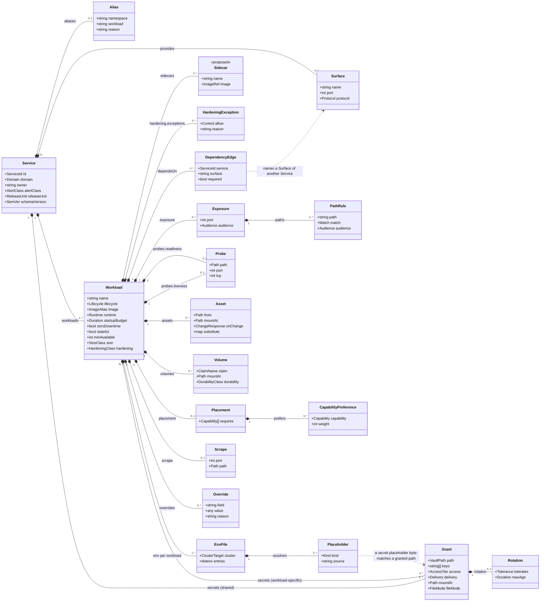

# Chapter 10 — Service Intent

Layer 1. The only layer a human authors, and the only layer that lives in a
Service's own repository.

Two rules govern everything below, and every field is justified against one of
them:

1. **Service Intent contains no mechanisms.** A field belongs here only if it
   states a requirement. `RollingUpdate`, `nodeSelector`, `IngressRoute`,
   `VaultStaticSecret`, `securityContext` and `statefulset` are mechanisms and
   appear nowhere. What they should be is derived from what is declared
   ([0005](../../docs/adr/0005-derivation-is-total.md),
   [0030](../../docs/adr/0030-runtime-mechanics-derived.md)).
2. **Service Intent contains no contended values.** A value that must be unique
   across the estate, or that draws on a shared finite resource, is assigned by
   layer 2 ([0004](../../docs/adr/0004-contention-decides-authority.md)). A
   Service expresses a need and reads the assignment back from its generated
   `resolved.yml` ([0033](../../docs/adr/0033-assignments-published-back.md)).

## Two artefacts

Layer 1 is authored as two kinds of file:

| file | owns |
|---|---|
| `platform/service.yml` | shape: workloads, surfaces, dependencies, exposure, probes, volumes, placement, size, hardening, release unit, and secret **access** |
| `platform/env/<workload>/base.env` + `platform/env/<workload>/<cluster>.env` | every environment variable that **that Workload** receives |

The split that matters is not file-level but concern-level. A secret's **access**
is declared in `service.yml`, beside the `dependsOn` edge that motivates it; the
**environment variable** that carries it is a placeholder in the env file. Each
file therefore checks the other: an env file referencing a secret with no grant is
an unauthorised reference, and a grant with no reference is a dead grant.

```yaml
apiVersion: intent.jorisjonkers.dev/v1
kind: Service
schemaVersion: 1.0.0
```

The `apiVersion` deliberately does not reuse `deployment.jorisjonkers.dev`, which
three mutually incompatible documents already share — the defect
[0003](../../docs/adr/0003-three-layer-meta-model.md) exists to fix. Each layer
gets its own namespace. `schemaVersion` is the **data model's own semver**, not
the toolkit package's version, and composition accepts a range rather than an
equality ([0039](../../docs/adr/0039-artifact-schema-versioning.md)); chapter 40
defines the range and what the lock records.

## The model



The diagram is embedded rather than kept as a separate `.mmd`. A standalone
`.mmd` does not render on GitHub, so it would be invisible in exactly the review
this chapter exists for.

Two things in it are still ungraded and marked as such: `sidecars`, and
`minAvailable` on the Workload. `size` is no longer proposed — it is a closed
class, graded by
[0016](../../docs/adr/0016-pod-hardening-and-resource-class.md) and tabulated
below. Env files hang off the **Workload**, not the Service
([0011](../../docs/adr/0011-configuration-env-files-per-workload.md)).

## Service identity

A Service is identified by one short string, unique across the estate, and that
string is the only identity another Service may reference
([0010](../../docs/adr/0010-flat-service-identity.md)). Namespace, workload name
and image reference derive from the id by rule; a deliberate divergence is an
`alias` carrying its reason.

| field | required | notes |
|---|---|---|
| `id` | yes | The one referencable identity, estate-unique. |
| `domain` | yes | Ownership grouping, owner of the Secret Subtree, and the unit of Intent Fragment publication ([0037](../../docs/adr/0037-composition-oci-fragments.md)). |
| `owner` | yes | Who is notified. |
| `alertClass` | yes | `none` \| `business-hours` \| `urgent` \| `page`. Urgency, never routing ([0021](../../docs/adr/0021-observability-scrape-and-alert-class.md)). |
| `releaseUnit` | no | At most one. Members switch together or not at all ([0060](../../docs/adr/0060-release-unit.md)). |
| `aliases` | no | A deliberate divergence from a derived coordinate, with `reason`. |
| `provides` | no | Surfaces other Services may depend on, as a flat map of name to port integer. |
| `workloads` | yes | One or more. |

Renames are permanent here, not migration artifacts. `fleet-infra/docs/live-divergence.md`
records one — *"the service repository is home-portal; live called the image
app-ui. A rename, not a different image"* — and `stalwart` /
`stalwart-provisioner` is a second. An `alias` turns that prose row into a
validated field:

```yaml
id: home-portal
aliases:
  namespace: app-system
  reason: pre-existing namespace; a rename would break four inbound references.
```

Uniqueness cannot be had by construction, only by check: the id encodes neither
domain nor repository, so nothing structural stops two repositories claiming one
string. `E_DUPLICATE_SERVICE_ID` fires at composition (chapter 40), and the
window in which two repositories both claim an id is an accepted cost.

Whether an alias may name a namespace some other applier owns is not a model
question — see
[Delivery and co-testing are defined separately](#delivery-and-co-testing-are-defined-separately).

## Ports and surfaces

There is no `ports` list. A port is an **integer**, written where it is used:

```yaml
provides:
  http: 8080
  metrics: 9187
```

```yaml
exposure:
  - port: 8080
    audience: authenticated
probes:
  readiness:
    path: /api/actuator/health/readiness
    port: 8080
scrape:
  port: 9187
  path: /metrics
```

The rendered Kubernetes port name is **the name of the `provides` surface
declaring that same integer**; where no surface declares it, the name derives
from the role — `http` for an exposure, `metrics` for a scrape. That rule
reproduces every port name the live cluster uses, because the live names already
are surface names: `http` (23 references), `metrics`, `db`, `smtp`, `sieve`, `s3`,
`submissions`.

`containerPort` entries are derived. They are documentational in Kubernetes —
traffic routes by `targetPort` regardless — so declaring them would be a third
place to state a number.

**One thing to settle:** the live cluster names Postgres's port `db` while the
surface a consumer would naturally write is `postgres`. Either the surface is
named `db`, or the rename is accepted as a parity entry. `submissions` and
`submission` both appear live, which is a separate inconsistency this rule
happens to expose.

## Workload

`image` is an alias resolved to a digest through the images lock — never a tag,
never a digest here.

`lifecycle` is `service` or `job`. Not `deployment` / `statefulset` / `job`,
because those are mechanisms; the object kind derives from `lifecycle`, `stateful`
and `volumes`.

`runtime` selects the Runtime Profile: `jvm`, `python`, `node`, `static`, `none`.
`none` is correct for a third-party image and injects no profile values at all.

### Dependencies

```yaml
dependsOn:
  - {service: platform-postgres, surface: postgres}
  - {service: auth-api, surface: http, required: false}
```

Declared per Workload, so network policy is precise: within `knowledge`, the API
reaches Postgres while the ingest worker reaches RabbitMQ, and neither inherits
the other's egress ([0020](../../docs/adr/0020-dependency-edges-carry-surface.md),
[0035](../../docs/adr/0035-network-policy-default-deny.md)). The Service's edge
set is the union, and that union drives the Reconcile Unit DAG
([0032](../../docs/adr/0032-reconcile-unit-derived.md)). Chapter 16 covers what an
edge derives, inbound as well as outbound.

An edge says one Workload needs another to run. It says nothing about which
suites must pass before either may ship: that is defined separately.

## Configuration

Configuration is authored as dotenv, **per Workload**
([0011](../../docs/adr/0011-configuration-env-files-per-workload.md)), because
Workloads of one Service do not share an environment: `knowledge-api` and
`knowledge-ingest-worker` overlap on the RabbitMQ coordinates and on nothing else.

```
# platform/env/knowledge-api/base.env
SPRING_PROFILES_ACTIVE=prod
KNOWLEDGE_MODE=lite
DB_HOST=${dependency:platform-postgres.host}
DB_USER=${secret:secret/data/platform/postgres/kb#user}
```

`base.env` carries everything that does not vary; one overlay per Cluster Target
(`platform/env/<workload>/<cluster>.env`) carries only what differs, overlay
winning key by key. With one cluster the overlay is usually empty — which is
already what `stalwart-provisioner` half-invented, its `production.env` and
`staging.env` being byte-identical.

A literal is written literally. A derived value is a **named placeholder** —
`${dependency:…}` for a coordinate, `${secret:…}` for a secret. Writing a derived
value as a literal is a build error, and so is writing a Runtime Profile key at
all: `OTEL_*` and `PYROSCOPE_*` come from `runtime`, and an exceptional value goes
in `overrides`, not here. Ten `OTEL_*` variables are byte-identical today across
`auth-api`, `agents-api` and `knowledge-api` except `OTEL_SERVICE_NAME` — sixty
duplicated lines that leave the service repositories under this rule.

Placeholders are named-source references and never a template language: no
conditionals, no arithmetic. The placeholder names the source; the key names the
variable. That is what lets `knowledge` write `DB_HOST` and `n8n` write
`DB_POSTGRESDB_HOST` from the same Postgres.

A derived value is *forbidden* as a literal rather than *defaulted*, because a
permitted override is indistinguishable from a stale copy. The renderer partitions
the file: literal keys become plain env entries, and `${secret:…}` keys become
`envFrom` secretRef entries — the author never partitions.

## Assets

File-shaped configuration is an **Asset**: a declarative settings file in the
consuming application's own format, optionally threaded with the same named
placeholders env files use ([0012](../../docs/adr/0012-assets-not-code.md)).

```yaml
assets:
  - from: config/postgresql.conf
    mountAt: /etc/postgresql/postgresql.conf
    onChange: restart
```

`onChange` defaults to `restart`, which renders a content-hashed object name so
the change actually reaches the pod — 16 of the estate's 18 ConfigMaps are plain
today, meaning an edit applies successfully and has no effect.

The eighteen ConfigMaps were three unrelated things, and only two of them are
Assets. **Six fixed files** with no derived values (`postgresql.conf`,
`enabled_plugins`, `cors.ini` + `single-node.ini`, `gatus` `config.yaml`, `hermes`
`sources.conf`, `stalwart` `config.json`) and **seven mixed files** — a large
static body threaded with a few derived values, `rabbitmq.conf` most starkly with
one derived line in twenty-four (`auth_oauth2.issuer = https://auth.jorisjonkers.dev`,
a hostname belonging to another Service). Those thirteen are Assets. The other
**five are derived catalogs** — `gatus-endpoints` (41 derived references in 288
lines), `platform-edge-route-catalog` (30/163), `platform-edge-catalog` (28/146),
`grafana-datasources` (6/104), `postgres-init-script` (18/98) — and they leave
configuration entirely: they are Deliverables, rendered from the dependency graph
(chapter 30).

An Asset may not be executable. `hermes-bootstrap` is 221 lines of shell and
`n8n-hooks` 499 lines of JavaScript, both run by `alpine:3.21` from a ConfigMap:
first-party code with no image, no tests and no version. That is a build error
here, and the fix is an image, not a template language.

## Probes

```yaml
probes:
  readiness:
    path: /api/actuator/health/readiness
    port: 8080
  liveness:
    path: /api/actuator/health/liveness
    port: 8080
```

`probes.readiness` and `probes.liveness` are sibling declarations, each carrying
its own `path` and `port`. **There is no
fallback** ([0014](../../docs/adr/0014-probes-are-siblings.md)). Readiness means
*can I serve traffic*; liveness means *is my process wedged*. A liveness probe
pointed at a readiness endpoint turns a dependency outage into a crash-loop, and
the v2 model made that the default for anyone declaring one path —
`src/adapters/kubernetes-workload-fragment.ts:166` renders
`livenessProbe: probe(health.livenessPath ?? health.path)`, and `app-ui` and
`agents-login` both rely on it today.

A service with no HTTP surface uses `tcp`, which is not decoration: `postgres`
probes with `tcpSocket` on port `db` for both, and the rest of the data tier does
the same.

```yaml
probes:
  readiness: {tcp: 5432}
  liveness:  {tcp: 5432}
```

A Workload with no listener declares the absence, so a forgotten probe block is
never mistaken for a deliberate one:

```yaml
probes: none        # knowledge-ingest-worker: no ports, nothing to probe
```

Timings, thresholds and deadlines stay derived. A Workload that declares ports
but no probe declaration is refused.

## Storage and durability

```yaml
volumes:
  - claim: knowledge-vault-clone
    mountAt: /var/lib/knowledge-vault
    durability: irreplaceable
```

Every volume declares a **Durability Class**
([0015](../../docs/adr/0015-durability-class-per-volume.md)) — what the data is
worth, which only the owning Service knows:

| class | means | derives | live example |
|---|---|---|---|
| `reconstructible` | losing it costs a rebuild, not data | no backup job | `valkey` — *"deliberately unbacked as reconstructible cache"* |
| `recoverable` | a nightly application-level backup with a retention sweep suffices | backup job + sweep | the Postgres logical dumps |
| `irreplaceable` | needs an off-cluster copy, and a rehearsed restore before its first production apply | backup job + sweep + off-cluster copy | `knowledge-vault-clone`, a personal vault on `local-path` |

There is no platform durability to fall back on. Storage is `local-path`, not
Longhorn: all fourteen PVCs are `ReadWriteOnce`, and
[workspace ADR-0011](https://github.com/JorisJonkers-dev/workspace/blob/main/docs/decisions/ADR-0011-backup-coverage-gaps.md)
records that *"PVC-level snapshots are impossible here: no VolumeSnapshot CRDs,
and `local-path` has no CSI snapshot support."* Two consequences follow: a volume
pins its Workload to the node holding the PV, and retention can only be an
application-level backup job.

The class replaces `rollbackTargetRetention`, which every Service declared
identically as `{minimumDays: 90, acknowledged: true}`, which no renderer read,
and which asserted a ninety-day rollback a snapshot-less cluster cannot perform.
Storage class and size do not appear: they draw on finite node disk and are
assigned. `volumeClaimTemplate` is forbidden — a template ties the volume to the
Workload's name, so a rename orphans the claim.

Durability is also the model's gate on destruction: a claim backing
non-`reconstructible` data may not be removed as a side effect of a render. What
any particular delivery mechanism must do to honour that is one of the model's
three demands on the separately-defined delivery work. `irreplaceable` adds a
precondition on standing up the cluster at all — the restore rehearsal in
chapter 60.

## Pod hardening and resource class

Two required-by-default fields per Workload, added before the first production
apply because the retrofit gets strictly more expensive every week
([0016](../../docs/adr/0016-pod-hardening-and-resource-class.md)).

```yaml
size: m
hardening:
  exceptions:
    - allow: writableRootFilesystem
      reason: nginx writes /var/cache/nginx; no upstream image with a writable-free layout.
```

Neither field exists today, in either renderer generation:
`grep -rniE 'securityContext|runAsNonRoot|readOnlyRootFilesystem|seccompProfile' src/ schemas/`
returns **0 hits**, and `src/deployment/render/workloads.ts:130` builds a
container from name, image, pullPolicy, ports, command, args, env, envFrom,
volumeMounts, probes and resources — and stops. Rendered pods run as their image's
UID, with a writable root and default capabilities, and the standing QoS class for
the estate is BestEffort on a node the k3s server, the datastore and every
application pod share.

### Hardening

`hardening` defaults to `restricted`. The class is four controls, applied
together:

| control | rendered as |
|---|---|
| non-root | `runAsNonRoot: true`, with the UID from the image |
| immutable root filesystem | `readOnlyRootFilesystem: true` |
| no capabilities | `capabilities.drop: [ALL]` |
| default syscall filter | `seccompProfile.type: RuntimeDefault` |

A Workload that cannot meet the class declares the **specific** control it
relaxes, with a reason, in the shape derived-value overrides already use
([0031](../../docs/adr/0031-derived-overrides-with-reason.md)). `allow` is a
closed vocabulary — `runAsRoot`, `writableRootFilesystem`,
`capability:<NAME>`, `seccompUnconfined` — and one entry relaxes exactly one
control. An exception with an empty or missing `reason` fails schema validation.
There is no `hardening: privileged` shorthand: the exception list is the estate's
inventory of what it cannot harden, and a shorthand would hide its length.

Enforcement from the platform side was rejected rather than overlooked. Pod
Security Admission can reject but never fill in, so a non-conforming pod fails at
apply with no exception path a Service can author; a mutating admission default is
a value the render cannot see, which contradicts
[0005](../../docs/adr/0005-derivation-is-total.md).

### Resource class

`size` is a closed class. The class name is what an author writes; the requests
and limits behind it reach the render through the pinned Cluster Context
([0006](../../docs/adr/0006-pinned-inputs.md)), because capacity is contended and
[0004](../../docs/adr/0004-contention-decides-authority.md) therefore puts the
numbers on the platform side. The mapping the current cluster's Context carries:

| class | cpu request | memory request = limit | what it is for, and the evidence |
|---|---|---|---|
| `xs` | `10m` | `64Mi` | a static file server or an exporter sidecar. `app-ui` runs nginx at *"~10–20Mi RAM each"*; `postgres-exporter` sits in the same band |
| `s` | `50m` | `256Mi` | an interpreted service or worker: `knowledge-ingest-worker` (python), `stalwart-provisioner` |
| `m` | `250m` | `768Mi` | a JVM service at its default heap: `auth-api`, `agents-api`, `knowledge-api`. This is the class whose cold start `knowledge.service.yml` measures at *"~250-300s"* |
| `l` | `500m` | `2Gi` | the data tier: `platform-postgres` with pgvector, the datastore eight Services queue behind; `platform-rabbitmq` |
| `xl` | `1000m` | `4Gi` | no member today. One step of headroom above the data tier, so absorbing a bigger consumer is a class move rather than a schema change |

Two shape rules hold across every row, and they are the reason the table is a
class rather than a free-form block:

- **Memory request equals memory limit.** Memory is incompressible and it is what
  drives eviction on a shared kernel: one leaking container puts the node under
  pressure and the kubelet evicts from a pool where every candidate is
  BestEffort. A pod that cannot exceed its own request cannot be the one that
  causes that, and cannot be evicted for exceeding it either.
- **CPU carries a request and no limit.** CPU is compressible, and a limit
  throttles precisely the class-loading burst the 250–300 s JVM cold start
  consists of — the same burst `startupBudget` exists to bound.

A wrong row mis-sizes every Service in the class at once, and the correction
reschedules all of them on the next reconcile. That is the price of a name an
owner can defend; a millicore number in thirty repositories is not one.

## Placement

```yaml
placement:
  requires: [public-ingress]
  prefers:
    - {capability: arm64, weight: 50}
```

Capabilities, never labels ([0017](../../docs/adr/0017-placement-by-capability.md)).
Both shapes are needed and they fail differently: an unmet `requires` leaves a pod
`Pending`, which is loud, while an unmet `prefers` is discarded by the scheduler
without an event, a warning or a condition. That silence is why an unsatisfiable
**preference** is a build error (`E_CAPABILITY_UNSATISFIABLE`, chapter 40) — before
the manifest exists is the only place it can be broken. The estate has already paid
for the alternative: *"No affinity preference for `gpu-model-gtx960m` — no node
advertises it… **An unsatisfiable preference is silently ignored, so it read as
GPU-aware placement while doing nothing.**"*

Labels are not the Service's to name. `nix-config/generated/node-contract.yml`
emits 110 labels for 7 nodes — 55 under `platform.jorisjonkers.dev/*` and the same
55 under `personal-stack/*`, named after an archived repository that rejects
pushes. Authored as selectors, retiring that prefix is an edit in every service
repository; as capabilities it touches none
([0056](../../docs/adr/0056-node-facts-single-source.md)).

Placement already implied is not declared: a `local-path` volume pins its Workload
to the node holding the PV, and the resolver states that — reading the binding from
the pinned `ClusterState` snapshot, never from a live cluster
([0034](../../docs/adr/0034-cluster-state-pinned-input.md)). A PV that rebinds after
a node failure therefore surfaces as a new lock, not as drift.

## Exposure

```yaml
exposure:
  - port: 8080
    audience: authenticated
    paths:
      - {path: /mcp, match: exact, audience: anonymous}
      - {path: /,    match: prefix, audience: authenticated}
```

`audience` is the single vocabulary — `anonymous`, `authenticated`, `internal`,
`lan` — shared by Services and route tiers
([0018](../../docs/adr/0018-exposure-by-audience.md)). No hostname appears: one
hostname, `kb.jorisjonkers.dev`, was declared in seven authoritative places, and
six of them derive from this block — the reachability channel, both edge catalogs,
both Traefik IngressRoutes and the Gatus endpoint. The two conformance tests that
existed only to detect their disagreement become unnecessary, not merely green.

One vocabulary replaces three carrying seven values:

| where | values |
|---|---|
| service `route.authMode` | `anonymous`, `sso`, `forward-auth` |
| tier `authModes` | `forward-auth`, `internal`, `lan` |
| rule `auth.scope` | `anonymous`, `authenticated`, `application` |

Because the values were never comparable, the gate that should have caught a
mismatch could not, and did not fire anyway: `src/deployment/v2-model.ts:199-203`
checks `authMode` against a tier only `if (tier && …)`, and three of the four
routed services declare no `expose.tier` at all. `E_ROUTE_AUTH_MODE_NOT_IN_TIER`
was implemented, had an error code, and was vacuous exactly where it mattered; it
is deleted rather than repaired. `E_NO_TIER_FOR_AUDIENCE` (chapter 40) replaces it
and cannot be vacuous, because the audience is always present.

A hostname the estate serves but does not deploy is a Registered Unmanaged Surface
([0019](../../docs/adr/0019-registered-unmanaged-surfaces.md)), declared in the
composition input rather than here.

## Observability

```yaml
alertClass: business-hours     # on the Service
scrape:                        # on the Workload
  port: 9187
  path: /metrics
```

Two declarations, one derived pipeline
([0021](../../docs/adr/0021-observability-scrape-and-alert-class.md)). The scrape
surface stays service-declared because it genuinely varies —
`/actuator/prometheus`, `/api/actuator/prometheus`, `/metrics` — and a platform
that guessed would collect nothing and report success. The Alert Class states
urgency and never routing: `none`, `business-hours`, `urgent`, `page`. Receivers,
notifier routes, Gatus checks, ServiceMonitors and PrometheusRules all derive.

`none` is a value an author must write, not an omission, because the estate's two
holes are both silent ones. Gatus monitors 41 endpoints and notifies nobody — its
ConfigMap has `storage` and `ui` and no `alerting` section at all — and 8
ServiceMonitors plus 2 PodMonitors cover roughly thirty workloads, with exactly one
`PrometheusRule` in the estate.

Rendering the rules also closes a documented trap: a `PrometheusRule` without
`release: metrics-stack` in `metadata.labels` is accepted by the API server, its
Kustomization goes Ready, the operator logs nothing, and the rules never evaluate.
A generated rule always carries the label; an authored one relies on the author
remembering.

## Release units

Some Services are one product in two processes. A new frontend against an old API
is a broken product even though each pod individually reports healthy. A **Release
Unit** carries that coupling in the model
([0060](../../docs/adr/0060-release-unit.md)):

```yaml
id: auth-api
releaseUnit: auth        # auth-ui declares the same name
```

**Declaration.** `releaseUnit` is a Service-level field naming one unit. A Service
belongs to **at most one** unit; a Service that declares none releases alone.
Composition materialises the set by name over the composed union, so no member
lists its neighbours and adding a member is one line in one repository.

**Semantics.** No member's new version receives traffic until **every** member's
new version is healthy, where healthy means that member's own declared readiness.
If any member fails its `startupBudget`, **no** member switches and the old
versions keep serving. Rollback is unit-scoped: reverting one member reverts the
unit.

**Orthogonality.** A Release Unit is not a Reconcile Unit:

| | Reconcile Unit | Release Unit |
|---|---|---|
| answers | in what order | all at once, or not at all |
| origin | derived from the dependency graph ([0032](../../docs/adr/0032-reconcile-unit-derived.md)) | declared |
| example | `platform-postgres` before `knowledge` | `auth-api` and `auth-ui` |
| failure | the later unit waits | nothing switches |

Atomicity is declared rather than derived because lockstep release is a product
choice the graph cannot see: a frontend depends on its API, but a dependency edge
does not mean the two must cut over together, and deriving atomicity from every
edge would make the whole estate one unit. The estate already contains the pairs —
`auth-api` / `auth-ui`, and `stalwart` / `stalwart-provisioner`, which move in
lockstep for the same reason.

The unit says **what** must hold, never **how** it is achieved. The mechanism —
what applies the change, in what order, behind what gate — is defined separately.

## Secrets

A `secrets` list declares what a Workload may do to a Secret Store path. It sits
at **whichever level the secret is shared**: on the Service when every Workload
holds it, on a Workload when only that one does
([0022](../../docs/adr/0022-grants-live-on-the-service.md)).

```yaml
# on the Service: every Workload gets these
secrets:
  - path: secret/data/platform/postgres/kb
    keys: [user, password]
    access: read
    delivery: env
    rotation: {tolerates: restart}

workloads:
  - name: knowledge-ingest-worker
    # on the Workload: only this one gets it
    secrets:
      - path: secret/data/knowledge-system/vault-deploy-key
        keys: [key]
        access: read
        delivery: file
        mountAt: /home/worker/.ssh/id_ed25519
        fileMode: "0400"
        rotation: {tolerates: restart}
```

| field | required | notes |
|---|---|---|
| `path` | yes | The full Secret Store path, exactly as the derived policy names it. This is the grant unit. |
| `keys` | yes | The keys the Workload expects at that path. Documentation and a validation input — **not** an access boundary. No wildcard exists. |
| `access` | yes | `read` \| `self-renew` \| `self-roll` \| `custody`. |
| `delivery` | yes | `env` \| `file` \| `self`. |
| `mountAt`, `fileMode` | `file` only | Where the projected file lands, and its mode. |
| `rotation` | yes | `tolerates: restart` \| `reload`, plus an optional `maxAge`. |

A Workload's effective set is the Service-level list plus its own. There is no
override or removal syntax: a Workload that must *not* hold a shared secret is
evidence the secret was never shared, and it moves down a level. Sharing is the
common case and duplication is what drifts — `knowledge` holds six grants across
two Workloads and two are identical for both.

The two levels are an access boundary **only** because identity is per Workload.
The ServiceAccount and Vault role are derived as `<service>-<workload>`, collapsing
to `<service>` for a single-Workload Service
([0024](../../docs/adr/0024-identity-per-workload.md), specified in chapter 16). At
review time they were not: `serviceAccountName()` in
`src/adapters/kubernetes.ts:665-669` returned `serviceName`, so two Workloads of
one Service authenticated as the same principal and received the union of both
policies whatever level a grant was written at. The nesting was documentation. The
declaration and the identity ship together or not at all.

## Grant unit

**The grant unit is the path.** On this estate's KV-v2 mount the `read` capability
attaches to the API path `secret/data/<path>`, and a token holding it receives the
entire document — every key — on each read
([0009](../../docs/adr/0009-vault-read-is-per-path.md)). No policy stanza narrows a
read to a key subset.

The estate's own production configuration depends on that fact.
`cluster/flux/apps/data/vault/metrics-token-renewal.yaml` chose `patch` over
`update` and records why: *"`-method=patch` forces the HTTP PATCH path, which the
`patch` capability allows without read access to the other keys in this document.
A read/modify/write fallback would need `read` on the Discord webhook and Grafana
client secret too."* That sentence is only true if `read` is per-document.

Three consequences are normative here:

1. **`keys:` confers nothing.** It documents the expected keys and feeds the dead-
   grant and unauthorised-reference checks. An author must never read it as a
   narrowing. Three worked examples used to grant three different key subsets
   of one `secret/data/platform/postgres` document — `[auth.user, auth.password]`,
   `[kb.user, kb.password]`, `[exporter.datasource]` — and every one of those
   readers held `read` on all of them, so `knowledge`'s pod could read
   `auth-api`'s database password. The example set now grants
   `.../postgres/kb`, `.../postgres/auth` and `.../postgres/exporter`.
2. **No path may hold keys for more than one reader set.** That is the Secret
   Subtree's layout rule, and it is what draws the boundary the store can actually
   enforce. It is one path per reader **set**, not one path per consumer: a path
   read by exactly one Service's Workloads stays whole, and splits on the day a
   second reader is granted it. `secret/data/platform/postgres` splits per
   consumer under that rule, and `secret/platform/observability` — Prometheus
   token, Discord webhook and Grafana client secret in one document — must split
   before its blast radius closes.
3. **There is no wildcard.** `keys: ['*']` is not vocabulary. It makes a reader set
   undecidable without reading live Vault contents, which the pinned-input rule
   forbids; `auth-api` enumerates the keys of `secret/data/auth-api` instead, and
   adding a key becomes a Service edit.

Reader sets are therefore computable from the composed union with no Vault read,
and `E_ROLL_AFFECTS_OTHER_READERS` (chapter 40) computes over the readers of a
**path**. Computed over declared key sets it under-reports by the difference
between the subset and the document — which is the same gap that makes the old
spec sentence *"`read` on the granted path and keys only"* false.

## Access tiers

Four intents, from which the platform derives the Vault policy
([0025](../../docs/adr/0025-access-tiers-derive-policy.md)). The author writes the
intent; the renderer makes the least-privilege choice once:

| tier | privilege derived | scope | value changes | downstream |
|---|---|---|---|---|
| `read` | `read` | the granted path | no | none |
| `self-renew` | **none** | — (an identity, no capability) | no | none |
| `self-roll` | `patch`, never `update` | the granted path | **yes** | consumers must re-read |
| `custody` | `create`, `update`, `delete` | a **prefix** below the granted path | n/a | none |

`self-renew` derives no privilege because renewal needs none:
*"`vault token renew` with no argument renews the token it authenticated with,
which every token may do. It also leaves the value unchanged, so nothing
downstream re-reads or restarts. Minting is the fallback for a token already
expired or revoked, and is the only reason this has a Vault identity at all."* A
single read/write axis would grant privilege to that job and lose the distinction
between extending a lease and replacing a value — the distinction that decides
whether anything restarts.

`self-roll` derives `patch` rather than `update` because `patch` writes without
reading the document's other keys. Once the Subtree is laid out one path per reader
set that motivation relaxes, but `patch` stays: it is still the smaller capability,
and merged documents outlive the migration.

`custody` is a prefix grant because `agents-api` creates and deletes secrets at
runtime under `secret/data/agents/projects/<id>/repos/<id>`, paths that cannot be
enumerated at render time. Its blast radius is bounded only by the prefix.

The tiers are intents, not a privilege lattice. A Workload that both reads a path
and rolls it declares two entries.

### Which tier may use which delivery

Twelve cells; not all are legal, and the illegal ones are refused by the schema
rather than left as traps:

| access | `env` | `file` | `self` |
|---|---|---|---|
| `read` | legal | legal | legal |
| `self-renew` | **refused** | open — see below | legal |
| `self-roll` | legal, with a `read` entry on the same path | legal, with a `read` entry on the same path | legal |
| `custody` | **refused** | **refused** | legal |

A refusal is `E_ILLEGAL_DELIVERY_FOR_ACCESS`. `custody` with `env` or `file` asks
the renderer to sync paths that do not exist yet; `self-renew` with `env` hands a
token with no capability on its path a Secret it never reads. `self-roll` needs a
companion `read` entry for `env` or `file` because `patch` does not include read —
that is the whole point of choosing it.

`self-renew` × `file` survives the letter of
[0025](../../docs/adr/0025-access-tiers-derive-policy.md) and
[0026](../../docs/adr/0026-delivery-env-file-self.md) but not their argument: an
identity with no capability on the path cannot have that path projected for it. It
is recorded as open rather than refused, because refusing it changes those
decisions instead of restating them.

## Delivery

Three mechanisms, and which one applies is a property of the consumer, not of the
secret ([0026](../../docs/adr/0026-delivery-env-file-self.md)):

| delivery | renders | persists a Kubernetes Secret |
|---|---|---|
| `env` | a Vault Secrets Operator sync and a `Secret`; the env file's `${secret:…}` placeholders resolve to `envFrom` secretRef entries, never to literal values | yes |
| `file` | a projected file at `mountAt` with `fileMode`, and nothing in the environment | yes |
| `self` | a Vault policy, a Kubernetes auth role, and the application's own client wiring. No Secret, no env var, nothing injected | no |

In all three the derived policy is granted per **path**: delivery decides how a
value reaches a process, never what its token may read.

`self` is not an edge case. `auth-api` runs it today — `SPRING_CONFIG_IMPORT:
vault://`, `VAULT_AUTHENTICATION: KUBERNETES`, `VAULT_KUBERNETES_ROLE: auth-api`,
`VAULT_DB_ENABLED: true` — and it is the only delivery achieving zero-downtime
rotation, because a pod's environment is fixed for its lifetime. That same fact
makes `delivery: env` with `rotation.tolerates: reload` a build error
(`E_ENV_CANNOT_RELOAD`), not a slow path. `file` is not an edge case either: an SSH
private key cannot be an environment variable, and
`secret/data/knowledge-system/vault-deploy-key` is projected at `0400` today,
alongside `jorisjonkers-dev-tls`, `garage-node-secrets` and
`vault-prometheus-token`.

`rotation.tolerates` is what the consumer can survive when the value changes —
`restart` or `reload` — and `rolloutRestartTargets` derives from it rather than
being hand-declared.

Two gates apply to the two deliveries that persist a Secret:

- **Secrets at rest.** `env` and `file` are refused unless the pinned Cluster
  Context advertises `secretsEncryption: true`, with
  `E_SECRETS_AT_REST_REQUIRED` ([0028](../../docs/adr/0028-secrets-at-rest-gate.md),
  specified in chapter 60). Shipping them before the flag lands is a regression
  against what runs today, since the agent-inject path being replaced never touched
  the datastore. `self` and `custody` persist nothing and are unaffected.
- **Non-KV engines take neither.** A `transit/` grant is never materialised into a
  variable or a file, so `self` is its only legal delivery (`E_NON_KV_DELIVERY`).

## Secret references

An env-delivered grant is bound to a variable by a placeholder in the Workload's
env file, and the placeholder's path half **byte-matches the granted path**
([0027](../../docs/adr/0027-secret-reference-join-key.md)):

```
${secret:<granted-path>#<key>}
```

```yaml
# platform/service.yml
- path: secret/data/platform/postgres/kb
  keys: [user, password]
```

```
# platform/env/knowledge-api/base.env
DB_USER=${secret:secret/data/platform/postgres/kb#user}
```

The string between `${secret:` and `#` is compared to the grant's `path:` with no
transform. There is no mount table, no `data/` strip rule and no engine taxonomy —
and no read of live Vault contents, which the pinned-input rule forbids anyway. The
unstated rewrite the old design relied on did not generalise: `transit/keys/auth-api-jwt`
has no `data/` segment, and a rule dropping two segments yields `auth-api-jwt`, a
string a KV path could equally produce — so the one check that enforces the grant
boundary at build time could be satisfied by a grant the author never intended.

The `#<key>` half selects which value fills the variable and confers nothing; the
key is checked against the grant's `keys:` list. Dependency coordinates use the
same mechanism against a different source: `${dependency:<service>.<coordinate>}`,
resolved from the edge set (chapter 16).

The cost is thirteen extra characters per placeholder. What it buys is that one
`grep -r` over env files finds every reader of a path, which is what makes the
reader-set model auditable from the repository.

### Validation

Because binding and access live in different files, each checks the other. The
first four run at composition, over the union
([chapter 40](40-composition.md)); the rest are schema or render-time refusals
this chapter owns:

| condition | error | when |
|---|---|---|
| a `delivery: env` grant with no matching `${secret:…}` placeholder | `E_UNBOUND_SECRET_GRANT` | composition |
| a `${secret:…}` placeholder whose path matches no grant | `E_UNAUTHORISED_SECRET_REFERENCE` | composition |
| `access: self-roll` on a path with other readers, unacknowledged | `E_ROLL_AFFECTS_OTHER_READERS` | composition |
| a literal secret value in an env file or an Asset | `E_RAW_SECRET` | composition |
| `delivery: env` with `rotation.tolerates: reload` | `E_ENV_CANNOT_RELOAD` | schema |
| an illegal access × delivery cell | `E_ILLEGAL_DELIVERY_FOR_ACCESS` | schema |
| a non-KV grant with `delivery: env` or `file` | `E_NON_KV_DELIVERY` | schema |
| `delivery: env` or `file` against a Context without `secretsEncryption` | `E_SECRETS_AT_REST_REQUIRED` | render |

`keys: ['*']` has no error code because it is not in the grammar: a document
carrying it fails schema validation. `E_ROLL_AFFECTS_OTHER_READERS` is the check
nothing in the estate has today, and the case that motivates it is live —
`secret/platform/observability` holds three unrelated credentials and one job rolls
one of them.

## Rollout

```yaml
startupBudget: 600s     # knowledge-api: JVM cold start measured at ~250-300s
zeroDowntime: true
```

Derived from these plus `stateful`, `size` and `volumes`: rollout strategy, surge
and unavailability, startup probe period and threshold, the progress deadline, and
the health-gate deadline a Release Unit's switchover waits on. `minAvailable` is
still ungraded — see below.

## Overrides

```yaml
overrides:
  - field: progressDeadlineSeconds
    value: 600
    reason: nginx pods, ~10-20Mi each; the derived 1800 assumes a JVM cold start.
```

An override targets a **derivation**, never an **assignment**
([0031](../../docs/adr/0031-derived-overrides-with-reason.md)). The escape exists
because the alternative is not a better rule but a falsified input: an owner who
needs 600 and cannot say so will misreport their `startupBudget` to coax the number
out of the derivation, corrupting the one field only they could know. The `reason`
makes the rationale data rather than a YAML comment no tool can read.

## What layer 1 may never contain

A build error, not a warning. This is the layer-1 face of the authority table in
[chapter 20](20-resolved-deployment.md#authority), which is where each value's
declaring site is fixed:

| forbidden | where the value comes from |
|---|---|
| a hostname | assigned; read from `resolved.yml` |
| a namespace | derived from `id`, or an alias |
| a node label or selector | `placement.requires` |
| `replicas` | assigned from `minAvailable` and the node capacity recorded in the pinned `ClusterState` snapshot ([0034](../../docs/adr/0034-cluster-state-pinned-input.md)) — never a live cluster read |
| storage class, volume size | assigned |
| `resources`, requests or limits | `size` |
| a `securityContext` field | `hardening`, plus a declared exception |
| a ServiceAccount, Vault role or policy name | derived per Workload (chapter 16) |
| a Reconcile Unit or `platform.layer` | derived from the edge set |
| an image tag or digest | the images lock |
| a `ports` list, or a port as a string | an integer at its point of use |
| `RollingUpdate`, `maxSurge`, `progressDeadlineSeconds` | derived; `overrides` if exceptional |
| `statefulset` / `deployment` | derived from `lifecycle` + volumes |
| a liveness probe with no path | state it, or use `tcp`, or `probes: none` |
| a Dependency Coordinate as a literal | `${dependency:…}` |
| a Runtime Profile key in an env file | `runtime`; `overrides` if exceptional |
| a secret value, anywhere | a grant plus `${secret:…}` |
| a secret grant with no reference | remove it — it is a dead grant |
| `keys: ['*']` | enumerate the keys |
| a route tier, middleware, or `authMode` | `audience` |
| a `volumeClaimTemplate` | declare the claim cluster-side |
| an executable Asset | an image |
| a deploy workflow, applier or gate | not a model concern — see below |

## Delivery and co-testing are defined separately

How a change reaches the cluster, and how dependency on other units for testing
gates a deploy, are **defined separately from this model**. No field in this
chapter names an applier, a workflow, a field manager, a pruning rule, a
break-glass path or a co-test suite, and none may be added. The parked direction
work lives in [docs/adr/deferred/](../../docs/adr/deferred/README.md).

The model's complete interface to that work is three demands, all decided here:

1. **Release Unit atomicity** — no member switches until every member is healthy
   ([0060](../../docs/adr/0060-release-unit.md)).
2. **Durability Class gating** — a destructive operation on a non-`reconstructible`
   claim is refused ([0015](../../docs/adr/0015-durability-class-per-volume.md)).
3. **Pinned inputs only** — every rendered value is a function of digested inputs,
   `clusterStateDigest` included
   ([0006](../../docs/adr/0006-pinned-inputs.md),
   [0034](../../docs/adr/0034-cluster-state-pinned-input.md)).

## Still to be graded

Five items no decision in the register covers:

1. **`sidecars`.** A Workload holds more than one container, and this is not an
   edge case: `postgres` runs `postgres-exporter` on 9187, `stalwart` runs a
   `stalwart-apply` sidecar, `agent-runner` carries the `agent-gateway` jar. Whether
   a sidecar carries its own `size` and `hardening` is part of the same question.
2. **`minAvailable`.** `replicas` is contended, and `auth-api`'s two replicas were a
   capacity decision on freed Frankfurt budget, not an availability requirement.
   Like `size`, it must resolve through the pinned inputs, never through observed
   capacity.
3. **Naming an exposure entry.** The chapters disagree today: this one writes
   `port:` alone, chapter 20's projection keys the assignment `kb`, and chapter
   20 places a Service-declared hostname label this chapter defines no field
   for. Chapter 40 checks
   `E_DUPLICATE_EXPOSURE_NAME` against a name none of them agrees on. Grading it
   moves a value the contention test previously placed on the platform side.
4. **`self-renew` × `file`.** Refusing it follows from the tiers' own argument but
   not from the decisions' text.
5. **A size class that fits nowhere.** Nothing yet checks that a Workload's `size`
   can be satisfied by a node advertising its `placement.requires` capabilities.
   Both inputs are pinned, so the check is available; no invariant claims it.

## Worked examples

| example | what it exercises |
|---|---|
| [`knowledge.service.yml`](examples/knowledge.service.yml) + [`env`](examples/knowledge-api.base.env) + [`worker env`](examples/knowledge-ingest-worker.base.env) | two Workloads, two runtimes and therefore two identities, five path rules, `probes: none`, grants at **both** levels, a split Subtree path beside an unsplit one, a `0400` file secret, an `irreplaceable` volume |
| [`auth-api.service.yml`](examples/auth-api.service.yml) + [`env`](examples/auth-api.base.env) | `delivery: self` with `tolerates: reload`, a `self-roll` transit grant taking no placeholder, four dependencies, inbound-derived CORS, and a `releaseUnit` shared with its UI |
| [`platform-postgres.service.yml`](examples/platform-postgres.service.yml) + [`env`](examples/platform-postgres.base.env) | third-party image with `runtime: none`, the one declared hardening exception in the set, `size: l`, a proposed sidecar, TCP probes, a static Asset, `provides` consumed by eight Services |

The env-file-to-`secrets` cross-check runs over all three sets. `knowledge-api` has
5 placeholders matching 5 env-delivered keys, and its ingest worker 4 more against
the same Service-level grants; `platform-postgres` has 1 matching 1; `auth-api` has
**0 and 0**, because all three of its grants are `delivery: self` — which
demonstrates the check does not false-positive on runtime fetch. The byte-match rule
changes how each placeholder is spelled, not how many there are. No dead grants, no
unauthorised references, and no `delivery: env` paired with `tolerates: reload`.
