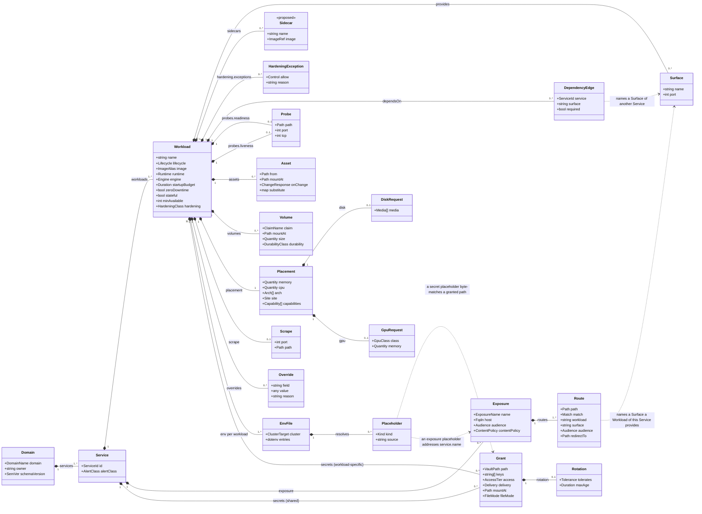

# Chapter 10 — Service Intent

Layer 1. The only layer a human authors, and the only layer that lives in the
domain's own repository.

Two rules govern everything below, and every field is justified against one of
them:

1. **Service Intent contains no mechanisms.** A field belongs here only if it
   states a requirement. `RollingUpdate`, `nodeSelector`, `IngressRoute`,
   `VaultStaticSecret`, `securityContext` and `statefulset` are mechanisms and
   appear nowhere. What they should be is derived from what is declared
   ([0005](../../docs/adr/model/0005-derivation-is-total.md),
   [0030](../../docs/adr/model/0030-runtime-mechanics-derived.md)).
2. **Service Intent never gets the last word on a contended value.** A value
   that must be unique across the estate, or that draws on a shared finite
   resource, is **arbitrated** by layer 2
   ([0004](../../docs/adr/model/0004-contention-decides-authority.md)). Contention
   decides who **arbitrates**, not who **authors**: the Service states its
   requirement, the platform decides whether it fits and where, and the Service
   reads the assignment back from its generated `resolved.yml`
   ([0033](../../docs/adr/model/0033-assignments-published-back.md)).

The second rule reads as it does because placement forced it. `memory` and `cpu`
are contended — they draw on a finite pool of node capacity — and they are
nevertheless authored here, as raw quantities per Workload
([0061](../../docs/adr/model/0061-placement-is-hard-dimensions.md)). An authors-only
reading of contention would forbid the field and leave the estate exactly where
it is, because a number no Service may write is a number nobody writes, and what
that produced is BestEffort on every pod. Arbitration is real and it is the
platform's: eligibility is checked against node allocatable at build time, and
the scheduler places at apply.

## Two artefacts

Layer 1 is authored as two kinds of file:

| file | owns |
|---|---|
| `platform/<domain>.yml` | one domain: its `owner`, and every Service in it — workloads, surfaces, dependencies, exposure, probes, volumes, placement, hardening, and secret **access** |
| `platform/env/<workload>/base.env` + `platform/env/<workload>/<cluster>.env` | every environment variable that **that Workload** receives |

One file is one domain and one Intent Fragment
([0063](../../docs/adr/model/0063-intent-authored-per-domain.md)). A repository may
hold several domain files — which is what lets `homelab-collections` stay one
repository holding three Services rather than three repositories with three
publish workflows — and a domain never spans repositories, so composition unions
fragments and never has to union a domain (chapter 40).

The split that matters is not file-level but concern-level. A secret's **access**
is declared in the domain file, beside the `dependsOn` edge that motivates it; the
**environment variable** that carries it is a placeholder in the env file. Each
file therefore checks the other: an env file referencing a secret with no grant is
an unauthorised reference, and a grant with no reference is a dead grant.

```yaml
apiVersion: intent.jorisjonkers.dev/v1
kind: Domain
schemaVersion: 1.0.0
```

The `apiVersion` deliberately does not reuse `deployment.jorisjonkers.dev`, which
three mutually incompatible documents already share — the defect
[0003](../../docs/adr/model/0003-three-layer-meta-model.md) exists to fix. Each layer
gets its own namespace. `kind` names the authored document — one domain holding
many Services — while chapter 40's `IntentFragment` is the envelope that
publishes it. `schemaVersion` is the **data model's own semver**, not the
toolkit package's version, and composition accepts a range rather than an
equality ([0039](../../docs/adr/model/0039-artifact-schema-versioning.md)); chapter 40
defines the range and what the lock records.

## The model



The diagram is embedded rather than kept as a separate `.mmd`. A standalone
`.mmd` does not render on GitHub, so it would be invisible in exactly the review
this chapter exists for.

One thing in it is still ungraded and marked as such: `minAvailable` on the
Workload. `sidecars` is graded by
[0064](../../docs/adr/model/0064-sidecars-are-workload-vocabulary.md). `placement` is not among them: it is graded by
[0061](../../docs/adr/model/0061-placement-is-hard-dimensions.md) and specified in
full below, and it is the only composite on the Workload that is **required**.
Env files hang off the **Workload**, not the Service
([0011](../../docs/adr/model/0011-configuration-env-files-per-workload.md)), and so
does `provides` — a port is a property of a process. `exposure` hangs off the
**Service**, because a hostname is a property of the product rather than of any
one process, and one hostname routes into two of them.

## Service identity

Intent is authored one file per domain. The file states the domain, raises
exactly one field to it, and lists the Services it holds
([0063](../../docs/adr/model/0063-intent-authored-per-domain.md)):

```yaml
domain: auth                 # the file header; one domain per file
owner: joris                 # the only field raised to the domain
services:
  - id: auth                 # the referencable identity; namespace auth-system
    alertClass: page
    workloads:
      - name: auth-api       # the process's own name, and its identity
        image: auth-api
      - name: auth-ui
        image: auth-ui
```

A Service is identified by one short string, unique across the estate, and that
string is the only identity another Service may reference
([0010](../../docs/adr/model/0010-flat-service-identity.md)). The id is the repository
or product name. Workload names are whatever the processes are actually called,
and so are their images: neither is a derivative of the id.

**The namespace derives from the domain**, as `<domain>-system`, and from nothing
else. That reproduces all ten live Service namespaces — `auth-system`,
`data-system`, `knowledge-system`, `app-system`, `agents-system`, `mail-system`,
`media-system`, `notes-system`, `automation-system`, `utility-system` — with zero
renames and not one live object moved.

Which is why nothing remains for an alias field to express, and why there is
none. `fleet-infra/docs/live-divergence.md` records the case one was invented
for — *"the service repository is home-portal; live called the image app-ui. A
rename, not a different image"* — and under these rules the row describes a
divergence that no longer exists. The id is the repository name, `home-portal`.
The Workload is called what the process is called, `app-ui`, and so is its
image. The domain is `app`, so the namespace is `app-system`, which is where the
Service already runs. The three things an alias used to carry are the namespace
(now derived from the domain), the Workload name and the image (both authored
explicitly), and the one divergence it still expressed — a namespace of the
Service's own choosing — is exactly the move that let a Service claim another
domain's namespace. Deleting the field deletes that move with it.

**A Service is the unit of atomic release.** Some products are one thing in two
processes: a new frontend against an old API is a broken product even though each
pod individually reports healthy. That coupling is carried by the Service
boundary itself ([0062](../../docs/adr/model/0062-service-is-the-release-unit.md)).
The Workloads of one Service switch together or none switches. No Workload's new
version receives traffic until **every** Workload's new version is healthy, where
healthy means that Workload's own declared readiness
([0014](../../docs/adr/model/0014-probes-are-siblings.md)). If any member fails its
`startupBudget`, **no** member switches and the old versions keep serving.
Rollback is Service-scoped: reverting one Workload reverts all of them.

There is no mechanism to couple two Services, and no field naming a set. A pair
that must release together is **one Service** — `auth-api` and `auth-ui` are
Workloads of Service `auth`, `stalwart` and `stalwart-provisioner` Workloads of
Service `stalwart` — and a surviving pair that cannot merge is evidence the
Service boundary is drawn wrong, not a missing field. Merging costs nothing in
this estate because nothing references the folded names: the complete set of
`dependsOn` targets across the composed union is `platform-postgres`,
`platform-rabbitmq`, `stalwart` and `platform-valkey`, and `auth-api`'s
estate-wide role is the forward-auth middleware derived from every route's
audience ([0018](../../docs/adr/model/0018-exposure-by-audience.md)), never an edge.

Atomicity is declared rather than derived, because lockstep release is a product
choice the graph cannot see: a frontend depends on its API, but a dependency edge
does not mean the two must cut over together, and deriving atomicity from every
edge would make the whole estate one unit. A Service is therefore not a Reconcile
Unit:

| | Reconcile Unit | Service |
|---|---|---|
| answers | in what order | all at once, or not at all |
| origin | derived from the dependency graph ([0032](../../docs/adr/model/0032-reconcile-unit-derived.md)) | declared, by drawing a boundary |
| example | `platform-postgres` before `knowledge` | `auth-api` and `auth-ui`, in Service `auth` |
| failure | the later unit waits | nothing switches |

The Service says **what** must hold, never **how** it is achieved. The mechanism —
what applies the change, in what order, behind what gate — is defined separately.

**A namespace holds several Services by construction, so it is not a trust
boundary.** This was once a footnote to an exception; it is now the normal case
for every namespace in the estate, and it must be read as normal rather than as
an edge case. No isolation claim may rest on a namespace wall. Isolation is the
derived default-deny edge set
([0035](../../docs/adr/model/0035-network-policy-default-deny.md)), evaluated per pod,
plus per-Workload identity ([0024](../../docs/adr/model/0024-identity-per-workload.md)).

| field | level | required | notes |
|---|---|---|---|
| `domain` | file header | yes | One domain per file. The namespace is `<domain>-system`; the domain also owns the Secret Subtree and is the unit of Intent Fragment publication ([0037](../../docs/adr/model/0037-composition-oci-fragments.md), [0063](../../docs/adr/model/0063-intent-authored-per-domain.md)). |
| `owner` | file header | yes | Who is notified. The **only** field raised to the domain; a Service needing a different owner needs its own domain. |
| `id` | Service | yes | The one referencable identity, estate-unique. The repository or product name. |
| `alertClass` | Service | yes | `none` \| `business-hours` \| `urgent` \| `page`. Urgency, never routing ([0021](../../docs/adr/model/0021-observability-scrape-and-alert-class.md)). Never raised to the domain: a domain would then page as loudly as its loudest member. |
| `workloads` | Service | yes | One or more. They switch together. |
| `exposure` | Service | no | The hostnames this Service serves and how each routes into its Workloads. On the Service, not the Workload: one hostname fronts two processes in the live `auth` case. A Service nothing reaches from outside declares none. See [Exposure](#exposure). |

Uniqueness cannot be had by construction, only by check: the id encodes neither
domain nor repository, so nothing structural stops two repositories claiming one
string. `E_DUPLICATE_SERVICE_ID` fires at composition (chapter 40), and the
window in which two repositories both claim an id is an accepted cost.

Workload names carry a second uniqueness rule, and it is scoped to the **domain
file** rather than to the Service, because the ServiceAccount and the Vault role
are the Workload name alone — `auth-system.auth-api`, never
`auth-system.auth-auth-api` ([0024](../../docs/adr/model/0024-identity-per-workload.md),
derived in chapter 16). Two Services in one file therefore cannot both call a
Workload `api`: that is `E_DUPLICATE_WORKLOAD_NAME` at composition (chapter 40),
raised where a reader can see both declarations at once.

No field can move a Service out of its domain's namespace, so the old question of
whether a Service may name a namespace some other applier owns has lost its
subject matter — see
[Delivery and co-testing are defined separately](#delivery-and-co-testing-are-defined-separately).

## The label set

Labels are **derived and fixed**, and no authored field contributes to them
([0072](../../docs/adr/model/0072-the-label-set-is-fixed.md)). The set is stated
here rather than left to a renderer because two of these labels are a
Deployment's `selector.matchLabels` and are therefore **immutable on a live
object**: changing the convention later is delete-and-recreate on every workload
in the estate.

| label | value | mutable |
|---|---|---|
| `app.kubernetes.io/name` | the Workload `name` | **no** — selector |
| `app.kubernetes.io/instance` | the Workload `name` | **no** — selector |
| `app.kubernetes.io/part-of` | the Service Id | yes |
| `app.kubernetes.io/managed-by` | `deploy-kit` | yes |
| `app.kubernetes.io/component` | the Workload `runtime` | yes |

`part-of` carries the Service, which is what makes the Release Unit selectable
by whatever performs a switchover ([chapter
20](20-resolved-deployment.md#the-release-gate)). It is deliberately not a
selector: a Service gaining or losing a Workload must not require recreating
the others.

`name` and `instance` are both the Workload name rather than one naming the
Service, because the selector must match exactly one controller's pods. A
`name` of the Service and an `instance` of the Workload would read better and
would make every Workload of a multi-Workload Service selector-ambiguous the
moment anything selected on `name` alone.

No `app.kubernetes.io/version`. A version label would have to come from the
images lock, so it changes on every image bump — for a label that no selector
may use and that the image digest already states exactly, on the object, where
a reader looks anyway.

An estate-scoped Deliverable carries `managed-by` and nothing else: it belongs
to no Workload and to no Service, and `part-of` on such an object would name a
Service that does not own it.

## Ports and surfaces

There is no `ports` list. A port is an **integer**, written where it is used, and
`provides` is a flat map of surface name to port declared **on the Workload**,
because a port is a property of a process:

```yaml
# in the data domain file, under Service platform-postgres
workloads:
  - name: platform-postgres
    provides:
      db: 5432          # the process itself
      metrics: 9187     # its exporter sidecar, in the same pod
```

A Workload with no listener declares no `provides` at all — the ingest worker of
`knowledge` has none, and the map is absent rather than empty.

```yaml
probes:                       # on the Workload: the integer, at its point of use
  readiness:
    path: /api/actuator/health/readiness
    port: 8080
scrape:
  port: 9187
  path: /metrics
```

An [exposure](#exposure) route is the one place a port is *not* written: it sits
on the Service and names `{workload, surface}`, so the integer stays declared
once, by the process that listens on it.

Surface **names** are unique within a Service, not within a Workload, because a
dependency edge names `{service, surface}` and never a Workload
([0020](../../docs/adr/model/0020-dependency-edges-carry-surface.md)). A Service's
surface set is the union of its Workloads' `provides` maps, and one name declared
twice inside that union is a build error: the edge would otherwise be ambiguous
about which process it means.

The rendered Kubernetes port name is **the name of the `provides` surface
declaring that same integer**; where no surface declares it, the name derives
from the role — `http` for an exposure, `metrics` for a scrape. That rule
reproduces every port name the live cluster uses, because the live names already
are surface names: `http` (23 references), `metrics`, `db`, `smtp`, `sieve`, `s3`,
`submissions`.

`containerPort` entries are derived. They are documentational in Kubernetes —
traffic routes by `targetPort` regardless — so declaring them would be a third
place to state a number.

**One thing to settle:** the live cluster names Postgres's port `db` while the
surface a consumer would naturally write is `postgres`. Either the surface is
named `db`, or the rename is accepted as a parity entry. `submissions` and
`submission` both appear live, which is a separate inconsistency this rule
happens to expose.

## Workload

`name` is the process's own name, unique within the domain file. It is not a
derivative of the Service id, and it is what the Workload's ServiceAccount and
Vault role are called (chapter 16).

`image` is an alias resolved to a digest through the images lock — never a tag,
never a digest here.

`lifecycle` is `service` or `job`. Not `deployment` / `statefulset` / `job`,
because those are mechanisms; the object kind derives from `lifecycle`, `stateful`
and `volumes`.

`runtime` selects the Runtime Profile: `jvm`, `python`, `node`, `static`, `none`.
`none` is correct for a third-party image and injects no profile values at all.

`engine` names **what the process is**, where that is something the platform
has to treat specially: `postgres`, `rabbitmq`, `valkey`, `files`, or absent.
It is a fact about the Workload rather than a mechanism, which is why it belongs
here ([0078](../../docs/adr/model/0078-engine-is-workload-vocabulary.md)), and
it is what the platform keys its backup method off
([Storage and durability](#storage-and-durability)). It is required on a Workload
holding a volume of a class that derives a backup, and refused on one that
derives none — `E_ENGINE_WITHOUT_DURABILITY` and `E_DURABILITY_WITHOUT_ENGINE`.

`engine` is not `runtime`. `runtime` says how the process is instrumented —
`jvm`, `python`, `node` — and `engine` says what its data is. `platform-postgres`
runs a third-party image, so its `runtime` is `none` and its `engine` is
`postgres`.

`provides` and `placement` are Workload fields, specified in
[Ports and surfaces](#ports-and-surfaces) and [Placement](#placement). Every
Workload declares a `placement` block, because two of its dimensions are
required.

`exposure` is **not** a Workload field. A Workload states which ports it listens
on; which hostname reaches it, and on what path, is stated once on the Service
([Exposure](#exposure)).

### Dependencies

```yaml
dependsOn:
  - {service: platform-postgres, surface: postgres}
  - {service: auth-api, surface: http, required: false}
```

Declared per Workload, so network policy is precise: within `knowledge`, the API
reaches Postgres while the ingest worker reaches RabbitMQ, and neither inherits
the other's egress ([0020](../../docs/adr/model/0020-dependency-edges-carry-surface.md),
[0035](../../docs/adr/model/0035-network-policy-default-deny.md)). The Service's edge
set is the union, and that union drives the Reconcile Unit DAG
([0032](../../docs/adr/model/0032-reconcile-unit-derived.md)). Chapter 16 covers what an
edge derives, inbound as well as outbound.

An edge says one Workload needs another to run. It says nothing about which
suites must pass before either may ship: that is defined separately.

## Configuration

Configuration is authored as dotenv, **per Workload**
([0011](../../docs/adr/model/0011-configuration-env-files-per-workload.md)), because
Workloads of one Service do not share an environment: `knowledge-api` and
`knowledge-ingest-worker` overlap on the RabbitMQ coordinates and on nothing else.

```
# platform/env/knowledge-api/base.env
SPRING_PROFILES_ACTIVE=prod
KNOWLEDGE_MODE=lite
DB_HOST=${dependency:platform-postgres.host}
DB_USER=${secret:secret/data/platform/postgres/kb#user}
```

`base.env` carries everything that does not vary; one overlay per Cluster Target
(`platform/env/<workload>/<cluster>.env`) carries only what differs, overlay
winning key by key. With one cluster the overlay is usually empty — which is
already what `stalwart-provisioner` half-invented, its `production.env` and
`staging.env` being byte-identical.

A literal is written literally. A derived value is a **named placeholder** —
`${dependency:…}` for a coordinate, `${secret:…}` for a secret, `${exposure:…}`
for a hostname the estate serves. Writing a derived value as a literal is a
build error, and so is writing a Runtime Profile key at all: `OTEL_*` and
`PYROSCOPE_*` come from `runtime`, and an exceptional value goes in `overrides`,
not here. Ten `OTEL_*` variables are byte-identical today across `auth-api`,
`agents-api` and `knowledge-api` except `OTEL_SERVICE_NAME` — sixty duplicated
lines that leave the service repositories under this rule.

Placeholders are named-source references and never a template language: no
conditionals, no arithmetic. The placeholder names the source; the key names the
variable. That is what lets `knowledge` write `DB_HOST` and `n8n` write
`DB_POSTGRESDB_HOST` from the same Postgres.

A derived value is *forbidden* as a literal rather than *defaulted*, because a
permitted override is indistinguishable from a stale copy. The renderer partitions
the file: literal keys become plain env entries, and `${secret:…}` keys become
`envFrom` secretRef entries — the author never partitions.

## Assets

File-shaped configuration is an **Asset**: a declarative settings file in the
consuming application's own format, optionally threaded with the same named
placeholders env files use ([0012](../../docs/adr/model/0012-assets-not-code.md)).

```yaml
assets:
  - from: config/postgresql.conf
    mountAt: /etc/postgresql/postgresql.conf
    onChange: restart
```

`onChange` defaults to `restart`, which renders a content-hashed object name so
the change actually reaches the pod — 16 of the estate's 18 ConfigMaps are plain
today, meaning an edit applies successfully and has no effect.

The eighteen ConfigMaps were three unrelated things, and only two of them are
Assets. **Six fixed files** with no derived values (`postgresql.conf`,
`enabled_plugins`, `cors.ini` + `single-node.ini`, `gatus` `config.yaml`, `hermes`
`sources.conf`, `stalwart` `config.json`) and **seven mixed files** — a large
static body threaded with a few derived values, `rabbitmq.conf` most starkly with
one derived line in twenty-four (`auth_oauth2.issuer = https://auth.jorisjonkers.dev`,
a hostname belonging to another Service). Those thirteen are Assets. The other
**five are derived catalogs** — `gatus-endpoints` (41 derived references in 288
lines), `platform-edge-route-catalog` (30/163), `platform-edge-catalog` (28/146),
`grafana-datasources` (6/104), `postgres-init-script` (18/98) — and they leave
configuration entirely: they are Deliverables, rendered from the dependency graph
(chapter 30).

An Asset may not be executable. `hermes-bootstrap` is 221 lines of shell and
`n8n-hooks` 499 lines of JavaScript, both run by `alpine:3.21` from a ConfigMap:
first-party code with no image, no tests and no version. That is a build error
here, and the fix is an image, not a template language.

## Probes

```yaml
probes:
  readiness:
    path: /api/actuator/health/readiness
    port: 8080
  liveness:
    path: /api/actuator/health/liveness
    port: 8080
```

`probes.readiness` and `probes.liveness` are sibling declarations, each carrying
its own `path` and `port`. **There is no
fallback** ([0014](../../docs/adr/model/0014-probes-are-siblings.md)). Readiness means
*can I serve traffic*; liveness means *is my process wedged*. A liveness probe
pointed at a readiness endpoint turns a dependency outage into a crash-loop, and
the v2 model made that the default for anyone declaring one path —
`src/adapters/kubernetes-workload-fragment.ts:166` renders
`livenessProbe: probe(health.livenessPath ?? health.path)`, and `app-ui` and
`agents-login` both rely on it today.

A service with no HTTP surface uses `tcp`, which is not decoration: `postgres`
probes with `tcpSocket` on port `db` for both, and the rest of the data tier does
the same.

```yaml
probes:
  readiness: {tcp: 5432}
  liveness:  {tcp: 5432}
```

A Workload with no listener declares the absence, so a forgotten probe block is
never mistaken for a deliberate one:

```yaml
probes: none        # knowledge-ingest-worker: no ports, nothing to probe
```

Timings, thresholds and deadlines stay derived. A Workload that declares ports
but no probe declaration is refused.

Readiness is also what the Service's atomic switchover waits on: healthy means
*this* Workload's declared readiness, so a Service with a Workload that never
reports ready never switches any of them.

## Storage and durability

```yaml
volumes:
  - claim: knowledge-vault-clone
    mountAt: /var/lib/knowledge-vault
    size: 20Gi
    durability: irreplaceable
```

Every volume declares a **Durability Class**
([0015](../../docs/adr/model/0015-durability-class-per-volume.md)) — what the data is
worth, which only the owning Service knows:

| class | means | derives | live example |
|---|---|---|---|
| `reconstructible` | losing it costs a rebuild, not data | no backup job | `valkey` — *"deliberately unbacked as reconstructible cache"* |
| `recoverable` | a nightly application-level backup with a retention sweep suffices | backup job + sweep | the Postgres logical dumps |
| `irreplaceable` | needs an off-cluster copy, and a rehearsed restore before its first production apply | backup job + sweep + off-cluster copy | `knowledge-vault-clone`, a personal vault on `local-path` |

**The terms are platform-assigned, the class is not**
([0077](../../docs/adr/model/0077-durability-derives-a-backup.md)). The window a
backup runs in, how many copies are kept, and where an off-cluster copy goes are
contended — one node's IO, one remote target — so by
[0004](../../docs/adr/model/0004-contention-decides-authority.md) the Cluster
Context carries one policy per class and the volume declares only what the data
is worth. A volume that genuinely needs different terms restates one with a
reason ([chapter 20](20-resolved-deployment.md#overrides)).

**The method is platform-assigned too**, keyed by the Workload's
[`engine`](#workload): an application-level backup is `pg_dump` for `postgres`, a
definitions export for `rabbitmq`, a file-level copy for `files`, and the image
and command for each arrive with the blueprint packs
([0013](../../docs/adr/model/0013-blueprint-packs-pinned-checkout.md)). Nothing
authored is executable, which is what [0012](../../docs/adr/model/0012-assets-not-code.md)
requires and what a `backup.sh` Asset would have violated.

The `kubernetes` adapter emits the resulting `CronJob` — one per volume that
derives a backup, plus its retention sweep — because that kind is already its
([chapter 30](30-deliverables.md#the-registered-set)). The credential for an
off-cluster destination is a **derived** grant against the platform's own Secret
Store path, recorded in the projection its owner reads back
([chapter 20](20-resolved-deployment.md#authority)): the platform chose the
destination, so the platform owns the credential, and it still appears in the
derived Vault policy ([0073](../../docs/adr/model/0073-vault-policy-is-a-deliverable.md)).

There is no platform durability to fall back on. Storage is `local-path`, not
Longhorn: all fourteen PVCs are `ReadWriteOnce`, and
[workspace ADR-0011](https://github.com/JorisJonkers-dev/workspace/blob/main/docs/decisions/ADR-0011-backup-coverage-gaps.md)
records that *"PVC-level snapshots are impossible here: no VolumeSnapshot CRDs,
and `local-path` has no CSI snapshot support."* Two consequences follow: a volume
pins its Workload to the node holding the PV, and retention can only be an
application-level backup job.

The first of those is why `disk` in [Placement](#placement) filters only the
**first** placement of a Workload. Once a claim is bound, the binding recorded in
the pinned `ClusterState` outranks the declared media, and a `disk` value that
contradicts it is `E_DISK_BINDING_CONFLICT` rather than a term quietly ignored.

The class replaces `rollbackTargetRetention`, which every Service declared
identically as `{minimumDays: 90, acknowledged: true}`, which no renderer read,
and which asserted a ninety-day rollback a snapshot-less cluster cannot perform.
**A volume declares its `size`; the platform decides whether it fits**
([0081](../../docs/adr/model/0081-volume-size-is-a-hard-dimension.md)). How much
data a volume holds is a fact only its owner knows, so it is a hard dimension
authored beside `claim` and `mountAt` — exactly the shape
[0061](../../docs/adr/model/0061-placement-is-hard-dimensions.md) uses for
`memory` and `cpu`. The platform matches it against the node contract's
`disks[].usable_gib`, and a volume that fits no eligible node is
`E_STORAGE_UNSATISFIABLE` rather than a PVC that parses and cannot bind.

`storageClassName` still does not appear, and is still assigned: everything takes
k3s's default `local-path`.

`placement.disk.size` is **derived** — the sum of the Workload's volume sizes —
so the quantity has one declaring site. Authoring it in both places let the same
number be stated twice and disagree, which is what chapter 16's single-authority
property forbids. `placement.disk.media` stays authored: which media a Workload
needs is not implied by how much it needs. `volumeClaimTemplate` is forbidden — a template ties the volume to
the Workload's name, so a rename orphans the claim.

Durability is also the model's gate on destruction: a claim backing
non-`reconstructible` data may not be removed as a side effect of a render. What
any particular delivery mechanism must do to honour that is one of the model's
three demands on the separately-defined delivery work. `irreplaceable` adds a
precondition on standing up the cluster at all — the restore rehearsal in
chapter 60.

## Pod hardening

One required-by-default field per Workload, added before the first production
apply because the retrofit gets strictly more expensive every week
([0016](../../docs/adr/model/0016-pod-hardening.md)).

```yaml
hardening:
  exceptions:
    - allow: writableRootFilesystem
      reason: nginx writes /var/cache/nginx; no upstream image with a writable-free layout.
```

The field does not exist today, in either renderer generation:
`grep -rniE 'securityContext|runAsNonRoot|readOnlyRootFilesystem|seccompProfile' src/ schemas/`
returns **0 hits**, and `src/deployment/render/workloads.ts:130` builds a
container from name, image, pullPolicy, ports, command, args, env, envFrom,
volumeMounts, probes and resources — and stops. Rendered pods run as their image's
UID, with a writable root and default capabilities, and the standing QoS class for
the estate is BestEffort on a node the k3s server, the datastore and every
application pod share.

Capacity left this record with [0016](../../docs/adr/model/0016-pod-hardening.md)'s
amendment. Requests, limits and the QoS class are settled by
[Placement](#placement), and a reader chasing BestEffort here finds only the
symptom.

### Hardening

`hardening` defaults to `restricted`. The class is four controls, applied
together:

| control | rendered as |
|---|---|
| non-root | `runAsNonRoot: true`, with the UID from the image |
| immutable root filesystem | `readOnlyRootFilesystem: true` |
| no capabilities | `capabilities.drop: [ALL]` |
| default syscall filter | `seccompProfile.type: RuntimeDefault` |

A Workload that cannot meet the class declares the **specific** control it
relaxes, with a reason, in the shape derived-value overrides already use
([0031](../../docs/adr/model/0031-derived-overrides-with-reason.md)). `allow` is a
closed vocabulary — `runAsRoot`, `writableRootFilesystem`,
`capability:<NAME>`, `seccompUnconfined` — and one entry relaxes exactly one
control. An exception with an empty or missing `reason` fails schema validation.
There is no `hardening: privileged` shorthand: the exception list is the estate's
inventory of what it cannot harden, and a shorthand would hide its length.

Enforcement from the platform side was rejected rather than overlooked. Pod
Security Admission can reject but never fill in, so a non-conforming pod fails at
apply with no exception path a Service can author; a mutating admission default is
a value the render cannot see, which contradicts
[0005](../../docs/adr/model/0005-derivation-is-total.md).

## Placement

```yaml
placement:
  memory: 768Mi                              # required
  cpu: 250m                                  # required
  arch: [amd64]                              # optional; a set, no ordering
  site: enschede                             # optional
  disk: {media: [nvme, ssd]}                 # optional; size is derived
  gpu: {class: transcode, memory: 4Gi}       # optional
  capabilities: [public-ingress]             # optional; flat strings
```

Six dimensions and a flat capability set, all of them **hard**
([0061](../../docs/adr/model/0061-placement-is-hard-dimensions.md)). `memory` and `cpu`
are required on every Workload; every other term defaults to *any node*.

| dimension | required | shape | matched against, in the pinned node contract |
|---|---|---|---|
| `memory` | yes | one quantity | the node's allocatable memory |
| `cpu` | yes | one quantity | the node's allocatable cpu |
| `arch` | no | a set of values | the node's architecture |
| `site` | no | one value | the node's site |
| `disk` | no | `{media: [...]}` | the media of the node's disks; the capacity term is derived from the Workload's volume sizes ([Storage and durability](#storage-and-durability)) |
| `gpu` | no | `{class: <name>, memory: <quantity>}` | `gpus[].class` and `gpus[].memory_mib` |
| `capabilities` | no | a set of flat strings | the capabilities the node advertises |

**Every declared dimension must match.** There is no soft half: no weight, no
ordering, no second shape the scheduler is free to discard. A list is always a
**set**, and what a set means follows from the dimension rather than from a
modifier the author writes. On a dimension a node has exactly one value of —
`arch`, `disk.media` — the set is the set of **acceptable** values, so
`arch: [arm64, amd64]` says *either*, never *arm64 first*. On `capabilities`,
which a node advertises many of, the set is what the node must **carry**. Neither
reading admits a preference, and no ordering is significant in either.

If no node satisfies every declared term, the build fails with
`E_PLACEMENT_UNSATISFIABLE` (chapter 40). Before the manifest exists is the only
place this can be broken loudly. The estate has already paid for the alternative:
*"No affinity preference for `gpu-model-gtx960m` — no node advertises it… **An
unsatisfiable preference is silently ignored, so it read as GPU-aware placement
while doing nothing.**"* An unmet hard term at least leaves a pod `Pending`; an
unmet preference is discarded by the scheduler without an event, a warning or a
condition. Making every term hard removes the shape that could fail in silence,
and the fallback the soft shape was reached for comes back as a value set.

### Eligibility, not bin-packing

Each term is compared against **one node's allocatable** — the node's total minus
a reserve declared in the node file, published by the node contract
([0056](../../docs/adr/model/0056-node-facts-single-source.md), chapter 60). It is never
a live read of free capacity, which would put an assignment outside the pinned
input set ([0006](../../docs/adr/model/0006-pinned-inputs.md)).

A Workload is eligible on a node when every declared term matches that node
**alone**. The check never sums Workloads. Three Workloads each declaring
`memory: 2Gi` therefore **all pass** against a 4096Mi node — each is compared
against allocatable on its own — and the scheduler refuses the third at apply.
State that plainly to anyone reading this gate as a capacity plan: it proves a
home exists for each Workload, not that every Workload fits at once.

`memory` and `cpu` are contended, and they are authored here anyway. That is not
a hole in [0004](../../docs/adr/model/0004-contention-decides-authority.md): contention
decides who **arbitrates**, not who **authors**. The Service states its
requirement, the platform decides whether it fits, refuses what no node can hold,
and the scheduler decides where. The accepted cost is stated rather than
hidden — nothing stops an author writing `memory: 8Gi`, and no arbitration exists
beyond that refusal.

### What the dimensions must discriminate on

Seven nodes, from `nix-config/inventory/nodes/*.yml`:

| node | site | arch | cpu | mem | gpu | disks | roles |
|---|---|---|---|---|---|---|---|
| enschede-t1000-1 | enschede | amd64 | 54000m | 32000Mi | t1000, transcode | nvme 120+500G, hdd 4096G | worker, utility |
| enschede-rx7900xtx-1 | enschede | amd64 | 72800m | 32000Mi | rx7900xtx, render-compute | nvme 160+1000G, hdd 8192G | worker, utility |
| enschede-gtx-960m-1 | enschede | amd64 | 28800m | 16384Mi | gtx960m, transcode, 2048MiB | ssd 100+500G, hdd 2048G | worker, utility |
| enschede-pi-1 | enschede | arm64 | 6000m | 8192Mi | — | sdcard 64G | worker |
| enschede-pi-2 | enschede | arm64 | 6000m | 4096Mi | — | sdcard 64G | worker |
| enschede-pi-3 | enschede | arm64 | 6000m | 4096Mi | — | sdcard 64G | worker |
| frankfurt-contabo-1 | frankfurt | amd64 | 16000m | 32768Mi | — | ssd 80+120G | control-plane, worker |

Memory alone spans 4096Mi on `enschede-pi-2` and `enschede-pi-3` to 32768Mi on
`frankfurt-contabo-1`, across two architectures, two sites and four disk media.
No number is safe to assume, which is why both quantities are required rather
than defaulted.

Capabilities advertised, with node counts: `adguard` (5), `lan-ingress` (3),
`nvidia` (2), `samba` (1), `public-ingress` (1), `llm-host` (1), `backup-store`
(1), `amd-gpu` (1). No node carries a taint, so a capability set is the only
thing keeping a Workload off a node it should not be on.

`tailscale` is absent from that list deliberately. It was advertised on 7 of 7
nodes, where it excluded nothing, and a filter that never excludes teaches
authors that filters do nothing. It leaves the capability vocabulary in one
node-contract change.

Longhorn is declared eligible on four nodes, but no PVC in `fleet-infra` sets a
`storageClassName` — everything takes k3s's default `local-path`. No `disk` term
may be written as though Longhorn were in use.

### Why `gpu` is structured

A flat capability string cannot describe a GPU, and treating it as one is a live
trap rather than a hypothetical. `nvidia` is advertised on 2 of 7 nodes and those
two are not interchangeable: `enschede-t1000-1` carries a T1000, while
`enschede-gtx-960m-1` is a 2048MiB Maxwell, re-enabled on 2026-09-02.
`enschede-rx7900xtx-1` is not `nvidia` at all. Today `jellyfin` and
`immich-machine-learning` avoid the Maxwell only because they also select
`capability-samba`, which exactly one node advertises — placement working by
accident of an unrelated filter, and breaking the day that filter is relaxed or
a second node gains samba.

`gpu` therefore carries `class` and `memory`, matched against the node contract's
`gpus[].class` and `gpus[].memory_mib`, so a transcode job needing 4Gi of VRAM is
ineligible on a 2048MiB card by arithmetic rather than by luck. `gpu-nvidia` is
not vocabulary, and neither is any other flat string standing in for a device.

### Labels are not the Service's to name

`nix-config/generated/node-contract.yml` emits 110 labels for 7 nodes — 55 under
`platform.jorisjonkers.dev/*` and the same 55 under `personal-stack/*`, named
after an archived repository that rejects pushes. Authored as selectors, retiring
that prefix is an edit in every service repository; authored as placement
dimensions it touches none
([0056](../../docs/adr/model/0056-node-facts-single-source.md)).

Placement already implied is not declared either: a `local-path` volume pins its
Workload to the node holding the PV, and the resolver states that — reading the
binding from the pinned `ClusterState` snapshot, never from a live cluster
([0034](../../docs/adr/model/0034-cluster-state-pinned-input.md)). A PV that rebinds
after a node failure therefore surfaces as a new lock, not as drift, and a `disk`
term contradicting that binding is `E_DISK_BINDING_CONFLICT`.

### The two shape rules are derived, not authored

The author writes **one** number per dimension. Two shape rules follow from it,
and neither is a field:

- **Memory request equals memory limit.** Memory is incompressible and it is what
  drives eviction on a shared kernel: one leaking container puts the node under
  pressure and the kubelet evicts from a pool where every candidate is
  BestEffort. A pod that cannot exceed its own request cannot be the one that
  causes that, and cannot be evicted for exceeding it either.
- **CPU carries a request and no limit.** CPU is compressible, and a limit
  throttles precisely the class-loading burst the 250–300 s JVM cold start
  consists of — the same burst `startupBudget` exists to bound. Throttling gets
  misdiagnosed as slow application code, over and over, by whoever did not set
  the limit.

The escape is an override with a reason
([0031](../../docs/adr/model/0031-derived-overrides-with-reason.md)) — the same shape
every other derived value uses — never a second field inside `placement`.

What the numbers look like against real Workloads, with the evidence that fixed
them:

| workload | `memory` | `cpu` | why |
|---|---|---|---|
| `app-ui` | `64Mi` | `10m` | nginx serving static files, measured at *"~10–20Mi RAM each"*; `postgres-exporter` sits in the same band |
| `knowledge-ingest-worker` | `256Mi` | `50m` | an interpreted single-consumer queue worker, not a server |
| `knowledge-api` | `768Mi` | `250m` | a JVM service at its default heap; `knowledge/knowledge.domain.yml` measures its cold start at *"~250-300s"* |
| `platform-postgres` | `2Gi` | `500m` | the datastore with pgvector that eight Services queue behind |

A wrong number now mis-sizes one Workload rather than every member of a class,
and correcting it is an edit in that Workload's own file. The cost is the mirror
image: raising every JVM service from 768Mi to 1Gi is an edit in every repository
holding one, on every retune.

## Exposure

An exposure entry says *this hostname routes here*. It sits on the **Service**,
beside its Workloads, and it carries its own routing:

```yaml
services:
  - id: auth
    exposure:
      - name: public                    # unique within the Service
        host: auth.jorisjonkers.dev     # the full FQDN, authored
        audience: anonymous
        contentPolicy: strict           # optional: strict | admin | workflow
        routes:
          - {path: /api, match: prefix, workload: auth-api, surface: http}
          - {path: /,    match: prefix, workload: auth-ui,  surface: http}
```

| field | level | required | notes |
|---|---|---|---|
| `name` | exposure | yes | Unique within the Service. It is what `E_DUPLICATE_EXPOSURE_NAME` checks and what a `${exposure:…}` placeholder addresses. A Service serving two hostnames — `jellyfin` public and lan — needs it to tell them apart. |
| `host` | exposure | yes | The full FQDN, written out. Unique across the estate. |
| `audience` | exposure | yes | `anonymous` \| `authenticated` \| `internal` \| `lan`. The default for every route beneath it. |
| `contentPolicy` | exposure | no | `strict` \| `admin` \| `workflow`. The Content-Security-Policy profile — the one header choice an author makes, from a closed list. |
| `routes` | exposure | yes | One or more. |
| `path` | route | yes | The path this rule matches. |
| `match` | route | yes | `prefix` \| `exact`. |
| `workload` | route | yes | A Workload of **this** Service. |
| `surface` | route | yes | A surface that Workload declares in `provides` — a name, never a port integer. |
| `audience` | route | no | Overrides the exposure's audience, for this path alone. |
| `redirectTo` | route | no | A path this route redirects to. A path, never a regex. |

A route carries two optional fields and no others. It may state its own
`audience`, which is the anonymous endpoint inside an otherwise authenticated
host:

```yaml
routes:
  - {path: /mcp, match: exact,  workload: knowledge-api, surface: http, audience: anonymous}
  - {path: /,    match: prefix, workload: knowledge-api, surface: http}
```

and a path may redirect:

```yaml
routes:
  - {path: /, match: exact, workload: stalwart, surface: http, redirectTo: /admin/}
```

Everything else at the edge is **derived** from the audience and the tier that
carries it: forward-auth, the security-headers baseline, the entryPoint, TLS
and the middleware chain that assembles them
([0018](../../docs/adr/model/0018-exposure-by-audience.md),
[0030](../../docs/adr/model/0030-runtime-mechanics-derived.md)).

### Why the host is authored rather than derived

A zone mapping does exist, so the derivation was available and was rejected on
the evidence rather than on principle. `homelab-inventory/catalog/reachability.yml`
groups every reachable host into a channel — `public-frankfurt`, `lan` — which is
the input a `<service>.<zone>` rule would need. What that rule cannot survive is
the host labels themselves, because they do not follow the Service id:

- `knowledge.jorisjonkers.dev` and `kb.jorisjonkers.dev` both resolve, and one
  Service id cannot derive two labels.
- `platform-rabbitmq` serves `rabbitmq.jorisjonkers.dev`, dropping the prefix its
  id carries.
- `root`, `status`, `dashboard` and `faro` belong to no Service at all.

A derivation would therefore be right for most of the set and silently wrong for
the rest, and the wrong ones are precisely the ones nobody would catch: a derived
hostname is written down nowhere, so there is no second copy for a reader to
disagree with. The host is authored instead — one FQDN, in full, in the Service
that serves it. There is no zone field, no `<service>.<zone>` rule and no suffix
appended anywhere in the render.

An apex host needs no field either. `host: jorisjonkers.dev` is a host like any
other, and two Services claiming it collide exactly as two Services claiming any
other name do.

Authoring the host does not make it uncontended. A hostname must be unique across
the estate, which is what contention means — and
[0004](../../docs/adr/model/0004-contention-decides-authority.md), as this chapter's
preamble restates it, decides who **arbitrates**, not who **authors**. The Service
writes the FQDN it serves; composition refuses the collision with
`E_DUPLICATE_HOST`, over the composed union together with the Registered Unmanaged
Surfaces, so an authored host cannot quietly take a name the estate already
answers on.

What this ends is the duplication. `kb.jorisjonkers.dev` was declared in seven
authoritative places: the reachability channel, both edge catalogs, both Traefik
IngressRoutes, the Gatus endpoint, and the Service itself. It is now written once,
here, and the other six derive from it; anything that needs the literal reads it
back through `${exposure:…}` rather than repeating it (see
[Secret references](#secret-references)). The two conformance tests that existed
only to detect their disagreement become unnecessary, not merely green.

### Why exposure sits on the Service and `provides` stays on the Workload

`provides` and `exposure` look like one fact and are two. `provides` says *this
process listens on this port*, which is a property of a process and stays on the
Workload. `exposure` says *this hostname routes here*, which is a property of the
product and belongs to the Service.

The case that forced the split is live and unexceptional: `auth.jorisjonkers.dev`
serves `/api` from `auth-api` and `/` from `auth-ui`. One hostname, two Workloads.
At the Workload level that is inexpressible — each Workload would have to declare
a host the other also claims, the two halves of one hostname would be authored in
two files with nothing joining them but a repeated string, and the estate would be
back to the duplication the previous section just removed. On the Service the
hostname is written once and its routes name the Workloads they reach.

It also puts the hostname on the boundary that already governs it. A Service is
the unit of atomic release
([0062](../../docs/adr/model/0062-service-is-the-release-unit.md)), so the Workloads
behind one host switch together; a hostname authored per Workload would have been
a per-process fact spanning a release boundary no single process controls.

### Audience is the single vocabulary

`audience` is the single vocabulary — `anonymous`, `authenticated`, `internal`,
`lan` — shared by exposures, by routes and by the tiers that carry them
([0018](../../docs/adr/model/0018-exposure-by-audience.md)). One vocabulary replaces
three carrying seven values:

| where | values |
|---|---|
| service `route.authMode` | `anonymous`, `sso`, `forward-auth` |
| tier `authModes` | `forward-auth`, `internal`, `lan` |
| rule `auth.scope` | `anonymous`, `authenticated`, `application` |

Because the values were never comparable, the gate that should have caught a
mismatch could not, and did not fire anyway: `src/deployment/v2-model.ts:199-203`
checks `authMode` against a tier only `if (tier && …)`, and three of the four
routed services declare no `expose.tier` at all. `E_ROUTE_AUTH_MODE_NOT_IN_TIER`
was implemented, had an error code, and was vacuous exactly where it mattered; it
is deleted rather than repaired. `E_NO_TIER_FOR_AUDIENCE` (chapter 40) replaces it
and cannot be vacuous, because the audience is always present.

### The authored proxy vocabulary is two fields

`contentPolicy` on an exposure and `redirectTo` on a route. There is no third, and
the closure is a decision rather than an oversight: no provider-shaped
passthrough, no raw middleware reference, no headers block, no annotations map, no
escape hatch shaped like any of them. Layer 1 carries no mechanism, and a Traefik
middleware name written into Service Intent is a mechanism
([0030](../../docs/adr/model/0030-runtime-mechanics-derived.md)).

The vocabulary is two fields because the estate's own edge is four middlewares,
counted:

| middleware | live instances | disposition |
|---|---|---|
| `forwardAuth` | 3 definitions, 15 references | derived from `audience: authenticated` |
| `headers` — the security baseline, plus a CSP profile `strict` / `admin` / `workflow` | 7 | baseline derived from the tier; the **profile choice** authored, as `contentPolicy` |
| `chain` | 2 | derived composition |
| `redirectRegex` | 2 — `stalwart` `/` → `/admin/`, `traefik` `/` → `/dashboard/` | authored, as `redirectTo` |

`forwardAuth` and `chain` are pure derivation: fifteen references to three
definitions, all reproducible from an audience and a tier. `headers` is mostly
derivation — the security baseline is the tier's and is identical everywhere it
appears — except for the CSP profile, which is a per-product judgement no
derivation can make, and of which there are exactly three. That judgement is
`contentPolicy`, a value from a closed list rather than a header block.

Nothing else exists. There are **zero** live instances of timeouts, rate limits,
IP allowlists, basic auth, compression, retries and circuit breakers — not one of
any of them, anywhere in the estate — and none of them becomes vocabulary here.
Writing fields for an estate that does not exist is the failure this model was
built to stop: a field costs a schema, a derivation, a test and a reader's
attention, and one nobody populates costs all four and returns nothing. A
genuinely new case gets a field and a decision record, not a passthrough that
would readmit every provider fragment at once and take the mechanism rule with it.

**`redirectTo` is a path, never a regex.** Both live redirects are the same
shape — an exact root sent to a subpath — and the author writes the destination
path. The renderer produces the provider's `redirectRegex` form from it, so
`${1}`-style capture groups appear nowhere in layer 1: a capture group is a
pattern language, and a pattern language in Service Intent brings its own
escaping rules, its own tests and its own way to fail silently.

`AUTH_CORS_ALLOWED_ORIGINS` is the case that tested the closure hardest, and it is
deliberately **not** proxy vocabulary. It is an application environment variable
that happens to list hostnames, and it is derivable from the inbound edge set once
that predicate is written. Modelling it as edge configuration would be wrong
twice: it would move an application's own setting to the edge, and it would author
a value the graph can compute. The derivation does not exist yet. That is an open
gap, not an argument for a field.

### What is checked

| condition | error |
|---|---|
| two exposures declare the same `host` | `E_DUPLICATE_HOST` |
| two exposures of one Service share a `name` | `E_DUPLICATE_EXPOSURE_NAME` |
| two routes of one exposure share the same `path` + `match` pair | `E_DUPLICATE_ROUTE_MATCH` |
| a route's `{workload, surface}` pair names no surface that Workload provides | `E_UNKNOWN_SURFACE` |

`E_DUPLICATE_HOST` is evaluated at composition over the whole union, Registered
Unmanaged Surfaces included, because a name the estate already answers on is taken
whether or not this model deploys what answers (chapter 40). The other three are
scoped to a single document and are refused as soon as the fragment is read.

`E_DUPLICATE_EXPOSURE_NAME` has had an implementation and an error code for longer
than it has had a definition — nothing said what a name was, or whether an
exposure had one. It is unique **within the Service**. `jellyfin` may declare
`public` and `lan`, and no other Service is thereby prevented from having a
`public` of its own, because a placeholder that reads one names the Service too.

`E_DUPLICATE_ROUTE_MATCH` catches the pair that cannot be ordered rather than
merely duplicated: two routes with the same path and the same match on one
hostname have no defined winner, and the provider picks one without saying so.
`E_UNKNOWN_SURFACE` is the same code a dependency edge uses (chapter 16), holding
routes to the same rule — a route names a surface by name, never by port, so the
integer stays written once, by the process that listens on it. Either half of the
pair failing raises it: a route naming a Workload this Service does not hold names
no surface either.

A hostname the estate serves but does not deploy is a Registered Unmanaged Surface
([0019](../../docs/adr/model/0019-registered-unmanaged-surfaces.md)), declared in the
composition input rather than here, and it takes part in `E_DUPLICATE_HOST` on
equal terms with everything authored.

## Observability

```yaml
alertClass: business-hours     # on the Service
scrape:                        # on the Workload
  port: 9187
  path: /metrics
```

Two declarations, one derived pipeline
([0021](../../docs/adr/model/0021-observability-scrape-and-alert-class.md)). The scrape
surface stays service-declared because it genuinely varies —
`/actuator/prometheus`, `/api/actuator/prometheus`, `/metrics` — and a platform
that guessed would collect nothing and report success. The Alert Class states
urgency and never routing: `none`, `business-hours`, `urgent`, `page`. Receivers,
notifier routes, Gatus checks, ServiceMonitors and PrometheusRules all derive.

`alertClass` sits on the Service and is never raised to the domain header, for the
same reason `owner` is: urgency is a per-Service fact, and a domain that pages
because one of its Services does is a domain that gets muted.

`none` is a value an author must write, not an omission, because the estate's two
holes are both silent ones. Gatus monitors 41 endpoints and notifies nobody — its
ConfigMap has `storage` and `ui` and no `alerting` section at all — and 8
ServiceMonitors plus 2 PodMonitors cover roughly thirty workloads, with exactly one
`PrometheusRule` in the estate.

Rendering the rules also closes a documented trap: a `PrometheusRule` without
`release: metrics-stack` in `metadata.labels` is accepted by the API server, its
Kustomization goes Ready, the operator logs nothing, and the rules never evaluate.
A generated rule always carries the label; an authored one relies on the author
remembering.

### What the class derives

**A rule catalog, not authored PromQL**
([0079](../../docs/adr/model/0079-alert-class-derives-from-a-rule-catalog.md)).
The platform carries the rules; the class carries urgency:

| input | supplies |
|---|---|
| `scrape` on a Workload | the baseline rule set — target absent, restart loop, probe failure — one instance per scraped Workload |
| `engine` on a Workload | the engine's rules, where the catalog has them |
| `alertClass` on the Service | the severity of each derived rule, and which receiver it routes to |

The catalog and the class-to-receiver mapping are platform data, pinned with the
Cluster Context, for the same reason the backup method is
([0004](../../docs/adr/model/0004-contention-decides-authority.md)): a receiver is
a shared notification channel, and PromQL in a domain file would put a mechanism
in layer 1. The mapping feeds **both** producers, so a Service's urgency means
one thing whether the signal came from a scrape or from a Gatus endpoint check.

**A class above `none` requires a signal.** `alertClass` on a Service with no
`scrape` on any Workload and no `exposure` for Gatus to check is
`E_ALERT_CLASS_WITHOUT_SIGNAL`. `platform-postgres` is the live case: it declares
`page`, the loudest value in the vocabulary, and produces no monitoring object at
all, because Gatus derives from exposure and a datastore is correctly not
exposed. Refusing it is what makes the declaration mean something.

**Scrape timing is platform policy, stated rather than defaulted.** The Cluster
Context carries the interval and the timeout, and every rendered `ServiceMonitor`
and `PodMonitor` names them
([0079](../../docs/adr/model/0079-alert-class-derives-from-a-rule-catalog.md)).
Omitting the fields takes the metrics stack's global default — a value decided
outside the model, so a render would not be a complete description of how the
estate is scraped. A Workload needing different timing restates it with a reason.

## Secrets

A `secrets` list declares what a Workload may do to a Secret Store path. It sits
at **whichever level the secret is shared**: on the Service when every Workload
holds it, on a Workload when only that one does
([0022](../../docs/adr/model/0022-grants-live-on-the-service.md)).

```yaml
# on the Service: every Workload gets these
secrets:
  - path: secret/data/platform/postgres/kb
    keys: [user, password]
    access: read
    delivery: env
    rotation: {tolerates: restart}

workloads:
  - name: knowledge-ingest-worker
    # on the Workload: only this one gets it
    secrets:
      - path: secret/data/knowledge-system/vault-deploy-key
        keys: [key]
        access: read
        delivery: file
        mountAt: /home/worker/.ssh/id_ed25519
        fileMode: "0400"
        rotation: {tolerates: restart}
```

| field | required | notes |
|---|---|---|
| `path` | yes | The full Secret Store path, exactly as the derived policy names it. This is the grant unit. |
| `keys` | yes | The keys the Workload expects at that path. Documentation and a validation input — **not** an access boundary. No wildcard exists. |
| `access` | yes | `read` \| `self-renew` \| `self-roll` \| `custody`. |
| `delivery` | yes | `env` \| `file` \| `self`. |
| `mountAt`, `fileMode` | `file` only | Where the projected file lands, and its mode. |
| `rotation` | yes | `tolerates: restart` \| `reload`, plus an optional `maxAge`. |

There is a third level the list does **not** have: the domain header. A
domain-level grant would hand every Service in the file a reader slot on a path
it may not need, and a read grant covers the whole document
([0009](../../docs/adr/model/0009-vault-read-is-per-path.md)), so the widening would be
real rather than notional. `secrets` stays per Service and per Workload
([0063](../../docs/adr/model/0063-intent-authored-per-domain.md)).

A Workload's effective set is the Service-level list plus its own. There is no
override or removal syntax: a Workload that must *not* hold a shared secret is
evidence the secret was never shared, and it moves down a level. Sharing is the
common case and duplication is what drifts — `knowledge` holds six grants across
two Workloads and two are identical for both.

The two levels are an access boundary **only** because identity is per Workload.
The ServiceAccount and Vault role are derived as the **Workload name alone** —
`auth-system.auth-api`, never `auth-system.auth-auth-api` — unique within the
domain file ([0024](../../docs/adr/model/0024-identity-per-workload.md), specified in
chapter 16). At review time they were not: `serviceAccountName()` in
`src/adapters/kubernetes.ts:665-669` returned `serviceName`, so two Workloads of
one Service authenticated as the same principal and received the union of both
policies whatever level a grant was written at. The nesting was documentation. The
declaration and the identity ship together or not at all.

## Grant unit

**The grant unit is the path.** On this estate's KV-v2 mount the `read` capability
attaches to the API path `secret/data/<path>`, and a token holding it receives the
entire document — every key — on each read
([0009](../../docs/adr/model/0009-vault-read-is-per-path.md)). No policy stanza narrows a
read to a key subset.

The estate's own production configuration depends on that fact.
`cluster/flux/apps/data/vault/metrics-token-renewal.yaml` chose `patch` over
`update` and records why: *"`-method=patch` forces the HTTP PATCH path, which the
`patch` capability allows without read access to the other keys in this document.
A read/modify/write fallback would need `read` on the Discord webhook and Grafana
client secret too."* That sentence is only true if `read` is per-document.

Three consequences are normative here:

1. **`keys:` confers nothing.** It documents the expected keys and feeds the dead-
   grant and unauthorised-reference checks. An author must never read it as a
   narrowing. Three worked examples used to grant three different key subsets
   of one `secret/data/platform/postgres` document — `[auth.user, auth.password]`,
   `[kb.user, kb.password]`, `[exporter.datasource]` — and every one of those
   readers held `read` on all of them, so `knowledge`'s pod could read
   `auth-api`'s database password. The example set now grants
   `.../postgres/kb`, `.../postgres/auth` and `.../postgres/exporter`.
2. **No path may hold keys for more than one reader set.** That is the Secret
   Subtree's layout rule, and it is what draws the boundary the store can actually
   enforce. It is one path per reader **set**, not one path per consumer: a path
   read by exactly one Service's Workloads stays whole, and splits on the day a
   second reader is granted it. `secret/data/platform/postgres` splits per
   consumer under that rule, and `secret/platform/observability` — Prometheus
   token, Discord webhook and Grafana client secret in one document — must split
   before its blast radius closes.
3. **There is no wildcard.** `keys: ['*']` is not vocabulary. It makes a reader set
   undecidable without reading live Vault contents, which the pinned-input rule
   forbids; `auth-api` enumerates the keys of `secret/data/auth-api` instead, and
   adding a key becomes a Service edit.

Reader sets are therefore computable from the composed union with no Vault read,
and `E_ROLL_AFFECTS_OTHER_READERS` (chapter 40) computes over the readers of a
**path**. Computed over declared key sets it under-reports by the difference
between the subset and the document — which is the same gap that makes the old
spec sentence *"`read` on the granted path and keys only"* false.

## Access tiers

Four intents, from which the platform derives the Vault policy
([0025](../../docs/adr/model/0025-access-tiers-derive-policy.md)). The author writes the
intent; the renderer makes the least-privilege choice once:

| tier | privilege derived | scope | value changes | downstream |
|---|---|---|---|---|
| `read` | `read` | the granted path | no | none |
| `self-renew` | **none** | — (an identity, no capability) | no | none |
| `self-roll` | `patch`, never `update` | the granted path | **yes** | consumers must re-read |
| `custody` | `create`, `update`, `delete` | a **prefix** below the granted path | n/a | none |

`self-renew` derives no privilege because renewal needs none:
*"`vault token renew` with no argument renews the token it authenticated with,
which every token may do. It also leaves the value unchanged, so nothing
downstream re-reads or restarts. Minting is the fallback for a token already
expired or revoked, and is the only reason this has a Vault identity at all."* A
single read/write axis would grant privilege to that job and lose the distinction
between extending a lease and replacing a value — the distinction that decides
whether anything restarts.

`self-roll` derives `patch` rather than `update` because `patch` writes without
reading the document's other keys. Once the Subtree is laid out one path per reader
set that motivation relaxes, but `patch` stays: it is still the smaller capability,
and merged documents outlive the migration.

`custody` is a prefix grant because `agents-api` creates and deletes secrets at
runtime under `secret/data/agents/projects/<id>/repos/<id>`, paths that cannot be
enumerated at render time. Its blast radius is bounded only by the prefix.

The tiers are intents, not a privilege lattice. A Workload that both reads a path
and rolls it declares two entries.

### Which tier may use which delivery

Twelve cells; not all are legal, and the illegal ones are refused by the schema
rather than left as traps:

| access | `env` | `file` | `self` |
|---|---|---|---|
| `read` | legal | legal | legal |
| `self-renew` | **refused** | open — see below | legal |
| `self-roll` | legal, with a `read` entry on the same path | legal, with a `read` entry on the same path | legal |
| `custody` | **refused** | **refused** | legal |

A refusal is `E_ILLEGAL_DELIVERY_FOR_ACCESS`. `custody` with `env` or `file` asks
the renderer to sync paths that do not exist yet; `self-renew` with `env` hands a
token with no capability on its path a Secret it never reads. `self-roll` needs a
companion `read` entry for `env` or `file` because `patch` does not include read —
that is the whole point of choosing it.

`self-renew` × `file` survives the letter of
[0025](../../docs/adr/model/0025-access-tiers-derive-policy.md) and
[0026](../../docs/adr/model/0026-delivery-env-file-self.md) but not their argument: an
identity with no capability on the path cannot have that path projected for it. It
is recorded as open rather than refused, because refusing it changes those
decisions instead of restating them.

## Delivery

Three mechanisms, and which one applies is a property of the consumer, not of the
secret ([0026](../../docs/adr/model/0026-delivery-env-file-self.md)):

| delivery | renders | persists a Kubernetes Secret |
|---|---|---|
| `env` | a Vault Secrets Operator sync and a `Secret`; the env file's `${secret:…}` placeholders resolve to `envFrom` secretRef entries, never to literal values | yes |
| `file` | a projected file at `mountAt` with `fileMode`, and nothing in the environment | yes |
| `self` | a Vault policy, a Kubernetes auth role, and the application's own client wiring. No Secret, no env var, nothing injected | no |

In all three the derived policy is granted per **path**: delivery decides how a
value reaches a process, never what its token may read.

`self` is not an edge case. `auth-api` runs it today — `SPRING_CONFIG_IMPORT:
vault://`, `VAULT_AUTHENTICATION: KUBERNETES`, `VAULT_KUBERNETES_ROLE: auth-api` —
and that role name is the Workload's own, which is what the identity rule now
derives rather than renames. It is also the only delivery achieving zero-downtime
rotation, because a pod's environment is fixed for its lifetime. That same fact
makes `delivery: env` with `rotation.tolerates: reload` a build error
(`E_ENV_CANNOT_RELOAD`), not a slow path. `file` is not an edge case either: an SSH
private key cannot be an environment variable, and
`secret/data/knowledge-system/vault-deploy-key` is projected at `0400` today,
alongside `jorisjonkers-dev-tls`, `garage-node-secrets` and
`vault-prometheus-token`.

`rotation.tolerates` is what the consumer can survive when the value changes —
`restart` or `reload` — and `rolloutRestartTargets` derives from it rather than
being hand-declared.

Two gates apply to the two deliveries that persist a Secret:

- **Secrets at rest.** `env` and `file` are refused unless the pinned Cluster
  Context advertises `secretsEncryption: true`, with
  `E_SECRETS_AT_REST_REQUIRED` ([0028](../../docs/adr/model/0028-secrets-at-rest-gate.md),
  specified in chapter 60). Shipping them before the flag lands is a regression
  against what runs today, since the agent-inject path being replaced never touched
  the datastore. `self` and `custody` persist nothing and are unaffected.
- **Non-KV engines take neither.** A `transit/` grant is never materialised into a
  variable or a file, so `self` is its only legal delivery (`E_NON_KV_DELIVERY`).

## Secret references

An env-delivered grant is bound to a variable by a placeholder in the Workload's
env file, and the placeholder's path half **byte-matches the granted path**
([0027](../../docs/adr/model/0027-secret-reference-join-key.md)):

```
${secret:<granted-path>#<key>}
```

```yaml
# platform/knowledge.yml
- path: secret/data/platform/postgres/kb
  keys: [user, password]
```

```
# platform/env/knowledge-api/base.env
DB_USER=${secret:secret/data/platform/postgres/kb#user}
```

The string between `${secret:` and `#` is compared to the grant's `path:` with no
transform. There is no mount table, no `data/` strip rule and no engine taxonomy —
and no read of live Vault contents, which the pinned-input rule forbids anyway. The
unstated rewrite the old design relied on did not generalise: `transit/keys/auth-api-jwt`
has no `data/` segment, and a rule dropping two segments yields `auth-api-jwt`, a
string a KV path could equally produce — so the one check that enforces the grant
boundary at build time could be satisfied by a grant the author never intended.

The `#<key>` half selects which value fills the variable and confers nothing; the
key is checked against the grant's `keys:` list.

The cost is thirteen extra characters per placeholder. What it buys is that one
`grep -r` over env files finds every reader of a path, which is what makes the
reader-set model auditable from the repository.

### Three placeholder sources

`${secret:…}` is one of three, and all three obey one grammar: a placeholder
**names a source and resolves to one value**.

| placeholder | resolves to | resolved from |
|---|---|---|
| `${secret:<path>#<key>}` | one key of one granted Secret Store path | the grant, byte-matched ([0027](../../docs/adr/model/0027-secret-reference-join-key.md)) |
| `${dependency:<service>.<coordinate>}` | one coordinate of a Service this Workload depends on | the edge set (chapter 16) |
| `${exposure:<service>.<name>#<field>}` | one field of a declared exposure | the composed union's exposure set ([Exposure](#exposure)) |

`${exposure:…}` addresses an exposure by the Service that declares it and the
`name` it carries there — which is what that `name` is for — and `<field>` is one
of exactly three:

| field | for `exposure: {name: public, host: auth.jorisjonkers.dev}` on Service `auth` |
|---|---|
| `url` | `https://auth.jorisjonkers.dev` — scheme and host, no trailing slash and no path |
| `host` | `auth.jorisjonkers.dev` |
| `scheme` | `https` |

**A path is written outside the placeholder.** `AUTH_ISSUER`, `AUTH_LOGIN_URL`
and `CONFIRMATION_URL` all carry a hardcoded `https://auth.jorisjonkers.dev`
today, and `rabbitmq.conf` carries the same host a fourth time as its one derived
line in twenty-four (`auth_oauth2.issuer`). Under this rule each becomes one
placeholder, plus ordinary text after it where a path is needed:

```
# platform/env/<workload>/base.env, in each Workload that needs the host
AUTH_ISSUER=${exposure:auth.public#url}
AUTH_LOGIN_URL=${exposure:auth.public#url}/login
CONFIRMATION_URL=${exposure:auth.public#url}/confirm
```

`${exposure:auth.public#url:/login}` — the same thing with the path moved
inside — is not grammar, and the reason is the rule
[Configuration](#configuration) already states: a placeholder is a named source,
never a template language, with no conditionals and no arithmetic. A path
argument is the smallest possible first argument; the second is a query string
and the third is a conditional. Keeping the path outside also keeps the hostname
greppable — `grep -r 'exposure:auth.public'` finds every reader of that host
whatever each appends, which is the same audit the byte-match rule buys for
secrets.

Both halves of the address are checked at composition, over the union that
already checks the other two sources: the Service must resolve in it, exactly as
a `dependsOn` target must (`E_UNRESOLVED_SERVICE`), and it must declare an
exposure by that name. Reading a host this way is **not** a dependency edge: it
resolves to a string at build time and derives no egress, so a Workload that
actually calls the host still declares `dependsOn`
([0035](../../docs/adr/model/0035-network-policy-default-deny.md)).

### Validation

Because binding and access live in different files, each checks the other. The
first four run at composition, over the union
([chapter 40](40-composition.md)); the rest are schema or render-time refusals
this chapter owns:

| condition | error | when |
|---|---|---|
| a `delivery: env` grant with no matching `${secret:…}` placeholder | `E_UNBOUND_SECRET_GRANT` | composition |
| a `${secret:…}` placeholder whose path matches no grant | `E_UNAUTHORISED_SECRET_REFERENCE` | composition |
| `access: self-roll` on a path with other readers, unacknowledged | `E_ROLL_AFFECTS_OTHER_READERS` | composition |
| a literal secret value in an env file or an Asset | `E_RAW_SECRET` | composition |
| `delivery: env` with `rotation.tolerates: reload` | `E_ENV_CANNOT_RELOAD` | schema |
| an illegal access × delivery cell | `E_ILLEGAL_DELIVERY_FOR_ACCESS` | schema |
| a non-KV grant with `delivery: env` or `file` | `E_NON_KV_DELIVERY` | schema |
| `delivery: env` or `file` against a Context without `secretsEncryption` | `E_SECRETS_AT_REST_REQUIRED` | render |

`keys: ['*']` has no error code because it is not in the grammar: a document
carrying it fails schema validation. `E_ROLL_AFFECTS_OTHER_READERS` is the check
nothing in the estate has today, and the case that motivates it is live —
`secret/platform/observability` holds three unrelated credentials and one job rolls
one of them.

## Rollout

```yaml
startupBudget: 600s     # knowledge-api: JVM cold start measured at ~250-300s
zeroDowntime: true
```

Derived from these plus `stateful`, `placement` and `volumes`: rollout strategy,
surge and unavailability, startup probe period and threshold, the progress
deadline, and the health-gate deadline the Service's switchover waits on.
`minAvailable` is still ungraded — see below.

## Overrides

```yaml
overrides:
  - field: progressDeadlineSeconds
    value: 600
    reason: nginx pods, ~10-20Mi each; the derived 1800 assumes a JVM cold start.
```

An override targets a **derivation**, never an **assignment**
([0031](../../docs/adr/model/0031-derived-overrides-with-reason.md)). The escape exists
because the alternative is not a better rule but a falsified input: an owner who
needs 600 and cannot say so will misreport their `startupBudget` to coax the number
out of the derivation, corrupting the one field only they could know. The `reason`
makes the rationale data rather than a YAML comment no tool can read.

The memory and cpu shape rules are derivations, so they are reachable this way:
a Workload that genuinely needs a cpu limit, or a memory limit above its request,
writes an override with a reason rather than a second placement field.

## What layer 1 may never contain

A build error, not a warning. This is the layer-1 face of the authority table in
[chapter 20](20-resolved-deployment.md#authority), which is where each value's
declaring site is fixed:

| forbidden | where the value comes from |
|---|---|
| a hostname another Service serves, written as a literal | `${exposure:…}`, addressing the exposure that declares it |
| a namespace | derived from `domain`, as `<domain>-system` |
| a node label or selector | `placement` |
| a scheduler weight, or any soft placement term | every dimension is hard ([0061](../../docs/adr/model/0061-placement-is-hard-dimensions.md)) |
| `replicas` | assigned from `minAvailable` and the node capacity recorded in the pinned `ClusterState` snapshot ([0034](../../docs/adr/model/0034-cluster-state-pinned-input.md)) — never a live cluster read |
| storage class, volume capacity | assigned |
| `resources`, requests or limits | derived from `placement` |
| a `securityContext` field | `hardening`, plus a declared exception |
| a ServiceAccount, Vault role or policy name | derived per Workload (chapter 16) |
| a Reconcile Unit or `platform.layer` | derived from the edge set |
| a field coupling the release of two Services | one Service, or two that release independently ([0062](../../docs/adr/model/0062-service-is-the-release-unit.md)) |
| an image tag or digest | the images lock |
| a `ports` list, or a port as a string | an integer at its point of use |
| `RollingUpdate`, `maxSurge`, `progressDeadlineSeconds` | derived; `overrides` if exceptional |
| `statefulset` / `deployment` | derived from `lifecycle` + volumes |
| a liveness probe with no path | state it, or use `tcp`, or `probes: none` |
| a Dependency Coordinate as a literal | `${dependency:…}` |
| a Runtime Profile key in an env file | `runtime`; `overrides` if exceptional |
| a secret value, anywhere | a grant plus `${secret:…}` |
| a secret grant with no reference | remove it — it is a dead grant |
| `keys: ['*']` | enumerate the keys |
| a route tier, an `authMode`, a middleware name, a headers block, a `redirectRegex` | derived from `audience` and the tier; the authored proxy vocabulary is `contentPolicy` and `redirectTo`, and nothing else |
| a `volumeClaimTemplate` | declare the claim cluster-side |
| an executable Asset | an image |
| a deploy workflow, applier or gate | not a model concern — see below |

## Delivery and co-testing are defined separately

How a change reaches the cluster, and how dependency on other units for testing
gates a deploy, are **defined separately from this model**. No field in this
chapter names an applier, a workflow, a field manager, a pruning rule, a
break-glass path or a co-test suite, and none may be added. The parked direction
work lives in [docs/adr/deferred/](../../docs/adr/deferred/README.md).

The model's complete interface to that work is three demands, all decided here:

1. **Service atomicity** — no Workload of a Service switches until every Workload
   of that Service is healthy
   ([0062](../../docs/adr/model/0062-service-is-the-release-unit.md)).
2. **Durability Class gating** — a destructive operation on a non-`reconstructible`
   claim is refused ([0015](../../docs/adr/model/0015-durability-class-per-volume.md)).
3. **Pinned inputs only** — every rendered value is a function of digested inputs,
   `clusterStateDigest` included
   ([0006](../../docs/adr/model/0006-pinned-inputs.md),
   [0034](../../docs/adr/model/0034-cluster-state-pinned-input.md)).

## Still to be graded

Two items no decision in the register covers:

1. **`minAvailable`.** `replicas` is contended, and `auth-api`'s two replicas were a
   capacity decision on freed Frankfurt budget, not an availability requirement.
   Like the placement quantities, it must resolve through the pinned inputs, never
   through observed capacity.
2. **`self-renew` × `file`.** Refusing it follows from the tiers' own argument but
   not from the decisions' text.

The list was five. Two items left it by being answered rather than graded, and
`sidecars` left it by being graded
([0064](../../docs/adr/model/0064-sidecars-are-workload-vocabulary.md)).

The first asked what checks that a Workload's declared capacity can be satisfied
by a node it is also allowed to run on: capacity and eligibility are one
comparison against the node contract, and failing it is
`E_PLACEMENT_UNSATISFIABLE` ([0061](../../docs/adr/model/0061-placement-is-hard-dimensions.md)).

The second asked how an exposure entry is named, and it is now
[vocabulary](#exposure). An exposure carries an authored `name`, unique within
its Service, and an authored `host` that is the full FQDN — so the chapters no
longer disagree about what an exposure is called, and
`E_DUPLICATE_EXPOSURE_NAME` finally has a definition to check. An apex host is
`host: jorisjonkers.dev` and needs no flag, no field and no check of its own: two
Services claiming it is `E_DUPLICATE_HOST`, like any other collision. That closes
chapter 00's first open item, of which this entry was the chapter-10 half. What
the entry flagged — a value the contention test had placed on the platform side,
now authored — is the same move `placement` makes, and it is settled the same
way: contention decides who arbitrates, not who authors
([0004](../../docs/adr/model/0004-contention-decides-authority.md)).

## Worked examples

| example | what it exercises |
|---|---|
| [`knowledge/knowledge.domain.yml`](examples/knowledge/knowledge.domain.yml) + [`env`](examples/knowledge/env/knowledge-api.base.env) + [`worker env`](examples/knowledge/env/knowledge-ingest-worker.base.env) | two Workloads, two runtimes and therefore two identities, `probes: none` and no `provides` on the worker, grants at **both** levels, a split Subtree path, a `0400` file secret, an `irreplaceable` volume |
| [`auth/auth.domain.yml`](examples/auth/auth.domain.yml) + [`env`](examples/auth/env/auth-api.base.env) | one Service, two Workloads switching atomically; `delivery: self` with `tolerates: reload`, a `self-roll` transit grant taking no placeholder, and the one hardening exception in the set |
| [`data/data.domain.yml`](examples/data/data.domain.yml) + [`env`](examples/data/env/platform-postgres.base.env) | three Services releasing independently in one domain, third-party images, a `disk` dimension, TCP probes, and a surface eight Services consume |

The env-file-to-`secrets` cross-check runs over all three sets. `knowledge-api` has
5 placeholders matching 5 env-delivered keys, and its ingest worker 4 more against
the same Service-level grants; `platform-postgres` has 1 matching 1; `auth-api` has
**0 and 0**, because all three of its grants are `delivery: self` — which
demonstrates the check does not false-positive on runtime fetch. The byte-match rule
changes how each placeholder is spelled, not how many there are. No dead grants, no
unauthorised references, and no `delivery: env` paired with `tolerates: reload`.

Two negative fixtures sit beside them: `negative/duplicate-service-id/` asserts
`E_DUPLICATE_SERVICE_ID` across two repositories, and
`negative/duplicate-workload-name/` asserts `E_DUPLICATE_WORKLOAD_NAME` for two
Services in one domain reusing a Workload name — the check that lets a
ServiceAccount be the Workload name alone.
