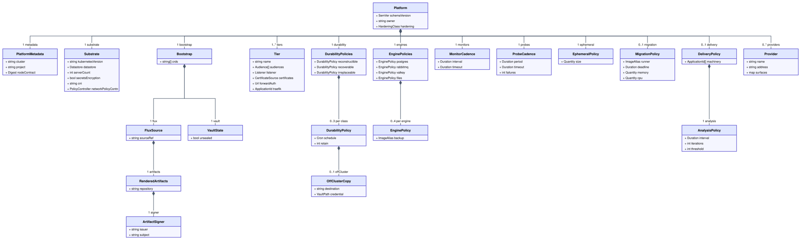
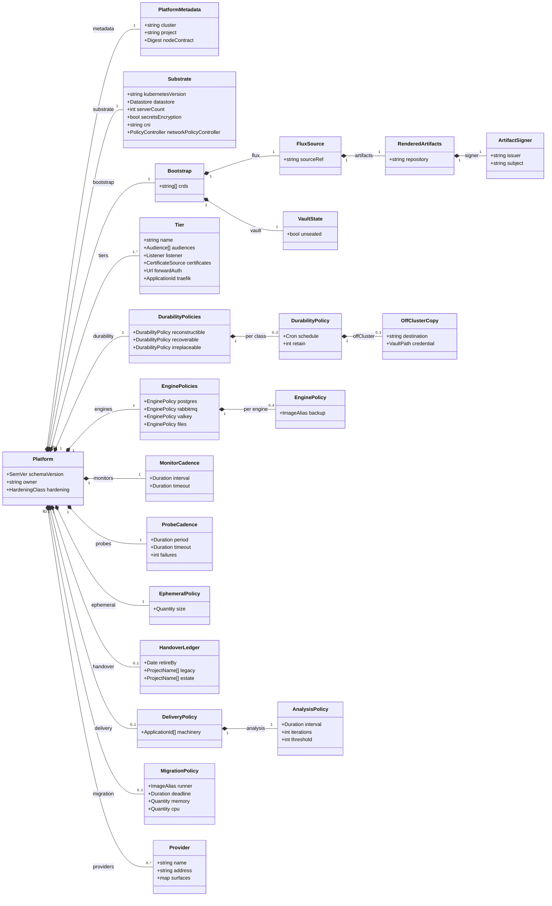

# Chapter 14: Platform Intent

Layer 1 has **two** authored documents, and this chapter is the second. Project
Intent (chapter 10) says what an Application needs; Platform Intent says what the
estate offers. Both are held to the same rule, **requirements and facts, never
mechanisms**, and one test decides which document a value lives in: the
contention test ([0004](../../docs/adr/model/0004-contention-decides-authority.md)).
A value an Application could state for itself belongs in chapter 10; a value that
must be unique across the estate or draws on a shared finite resource belongs
here.

Until [0095](../../docs/adr/model/0095-platform-intent-is-the-second-authored-document.md)
this document was called the Cluster Context, had no chapter, and acquired its
fields one decision at a time. The name changes because the content is
authored intent, not observed context, and because it now enters composition
the way every other authored document does.

## The document

```yaml
apiVersion: intent.jorisjonkers.dev/v1
kind: Platform
schemaVersion: 1.0.0
owner: joris
```

One Platform document per estate. It is published as an **Intent Fragment**
([chapter 40](40-composition.md#fragments)) by the repository that owns the
platform, pushed by digest like any project, and it is a **required participant**
whose staleness bound is the same seven days
([chapter 40](40-composition.md#participants)). There is no side channel: a
render that cannot find the platform fragment is `E_PARTICIPANT_MISSING`, and a
render against a stale one is `E_PARTICIPANT_STALE`.

## The model



<sub>[Diagram source](#the-platform-intent-model) · generated by
[`scripts/diagrams/class-diagram.py`](../../scripts/diagrams/class-diagram.py)</sub>

The Platform document's classes and how they compose. A policy keyed by a
closed vocabulary is a class with one optional field per literal, so a policy
the platform does not offer is a field it does not write. Two fields refer into
another document: a tier's `traefik` and each name in `delivery.machinery` name
an Application declared in a project file the platform owns.

A Platform document is checked on its own and together with the project files
read beside it. On its own, a tier that carries `authenticated` needs its
`forwardAuth` ([Tiers](#tiers)), and the `handover` ledger puts no Project on
both delivery paths (`E_HANDOVER_BOTH_PATHS`,
[chapter 60](60-setup.md#handing-over-one-project-at-a-time)). Together, every reference one makes into the
other resolves and every policy one asks for the other offers:

| condition | error |
|---|---|
| a tier's `traefik` names an Application no project file read beside it declares | `E_UNKNOWN_TIER_PROXY` |
| an exposure's or a route's audience is carried by no tier | `E_NO_TIER_FOR_AUDIENCE` |
| a Process's `engine` has no entry in `engines` | `E_NO_ENGINE_POLICY` |
| a volume's Durability Class has no entry in `durability` | `E_NO_DURABILITY_POLICY` |
| a grant delivered as `env` or `file` where `secretsEncryption` is false | `E_SECRETS_AT_REST_REQUIRED` |
| a name in `delivery.machinery` names an Application no project file read beside it declares | `E_UNKNOWN_MACHINERY` |
| an Application moves its schema with a changelog and the platform declares no `migration` policy | `E_NO_MIGRATION_POLICY` |
| an Application's cutover is `continuous` and the platform declares no `delivery` policy | `E_NO_DELIVERY_POLICY` |
| a project file names a project the `handover` ledger puts on neither delivery path | `E_HANDOVER_UNLISTED` |

A refusal names the document it points into as well as the path, because the
object at fault can sit in either: a proxy nothing declares is the tier's, and an
audience nothing carries is the exposure's.

## Where a vocabulary lives

A vocabulary is a closed set of literals a field may hold: `Engine`,
`AlertClass`, `HardeningClass`, `Datastore`, and the rest this specification
enumerates. One rule decides which authored document declares a vocabulary's
literals, applied per vocabulary rather than per document: **fixed in the
metamodel, in Project Intent, when either a model derivation branches on which
literal was named, or the literal is the Application's own authored intent, a
fact only its owner could state, for a reader past this model's edge to act on;
defined by the platform, or by whatever reads the projection past this model's
edge, only where neither holds, because the literal names a platform fact no
Process or Application could state for itself.**

`Engine`'s literals stay fixed by the first branch: `engine: postgres` derives
a database catalog no other engine derives, and answers an Asset's change
response differently than `engine: rabbitmq` does
([0078](../../docs/adr/model/0078-engine-is-process-vocabulary.md)). What each
literal *does*, the backup method, is still the platform's to state, in
`engines` above; only the set of names is Project Intent's.

`AlertClass`'s literals stay fixed by the second branch. No derivation in this
model reads which of `business-hours`, `urgent` or `page` an Application chose:
the value is carried into the published projection unread. But an Application
authors its own `alertClass` exactly as it authors `engine`, and what the
literal means, the severity and the receiver, is decided by the monitoring
stack that reads the projection, past this model's edge, not by this metamodel
([0079](../../docs/adr/model/0079-alert-class-derives-from-a-rule-catalog.md)).
0079 keeps the vocabulary in Intent for that reason: once the rule catalog, the
cadence and the receiver table were deleted from this specification, they
followed the stack that evaluates them, but the urgency vocabulary stayed,
because it is the Application's own claim about itself, not the stack's.

Either way, a reference a Project Intent field makes into a platform-defined
set is checked as an invariant, the same way `Tier.traefik` is checked against
the Applications a project file declares ([Tiers](#tiers)): a literal this
document assigns no policy to is refused at the point the two documents are
read together, never accepted and left to fail silently downstream.

## What it does not contain

Three things a reader might expect here live elsewhere, each for a reason.

| not here | where | why |
|---|---|---|
| the foundation components, Vault, VSO, Traefik, the metrics stack, Gatus | project files the platform owns, as ordinary Applications ([The foundation is declared](#the-foundation-is-declared)) | an Application is an Application; a second way to declare one is the duplicate vocabulary [0003](../../docs/adr/model/0003-three-model-pipeline.md) exists to end |
| the node contract, site, arch, allocatable, gpus, disks per node | its own pinned input, authored once where nix reads it ([0056](../../docs/adr/model/0056-node-facts-single-source.md), [chapter 60](60-setup.md#node-facts)) | folding it in would make nix read a deployment-model document or duplicate the facts |
| anything executable | the images lock, as a purpose-built image per engine ([Engines](#engines)) | [0012](../../docs/adr/model/0012-assets-not-code.md) applies to the platform's own files |

The Platform document names the node contract it was composed against, by
digest, so the pinned input set stays closed
([0006](../../docs/adr/model/0006-pinned-inputs.md)).

## Substrate facts

Facts about the cluster that decide other decisions
([0057](../../docs/adr/model/0057-datastore-and-restore.md)). Each is named for
what it is, never for how k3s is told about it: a CLI flag is a derivation
nobody authors, or an observation recorded under 0057, and it appears in no
authored file.

```yaml
substrate:
  kubernetesVersion: v1.31.4+k3s1
  datastore: sqlite                  # sqlite | etcd
  serverCount: 1
  secretsEncryption: false           # gates delivery: env and file (0028)
  cni: flannel
  networkPolicyController: embedded  # none | embedded | cni
```

| fact | read by |
|---|---|
| `kubernetesVersion` | schema validation of every rendered object; [0036](../../docs/adr/model/0036-cni-selection.md)'s evaluation |
| `datastore`, `serverCount` | the restore rehearsal; every decision resting on [0002](../../docs/adr/model/0002-kubernetes-as-substrate.md) |
| `secretsEncryption` | `E_SECRETS_AT_REST_REQUIRED` ([0028](../../docs/adr/model/0028-secrets-at-rest-gate.md)) |
| `cni`, `networkPolicyController` | whether a non-enforcing policy stage exists ([0084](../../docs/adr/model/0084-render-only-is-the-v1-policy-stage.md)) |

## The bootstrap set

A render cannot apply itself. The things that must exist before the first
rendered object can land are **recorded, not declared**
([0096](../../docs/adr/model/0096-the-foundation-is-declared.md)), and the set is
enumerated here so that growing it is a decision:

```yaml
bootstrap:
  flux:
    sourceRef: flux-system/platform          # the source that pulls the tree
    artifacts:                               # where each Project's render is fetched from
      repository: ghcr.io/jorisjonkers-dev/render
      signer:                                # the keyless identity Flux verifies against
        issuer: "https://token.actions.githubusercontent.com"
        subject: "https://github.com/JorisJonkers-dev/estate/.github/workflows/compose.yml@refs/heads/main"
  vault:
    unsealed: true                           # unseal is out of band
  crds:                                      # cluster-scoped schema, pinned
    - traefik.io/v1alpha1
    - secrets.hashicorp.com/v1beta1
    - monitoring.coreos.com/v1
```

| in the set | why it cannot be declared |
|---|---|
| k3s itself | it is what applies |
| the Flux source | `sourceRef` pulls the estate repository, which holds every Project's pinned source; `artifacts` says where those sources fetch each Project's render and whose keyless signature they accept ([chapter 55](55-delivery.md#rendered-artifacts-and-pins)) |
| Vault's unseal | a secret the model must never hold |
| the CRDs the estate uses | cluster-scoped schema that must exist before any object of that kind can apply; the components that *use* them are declared Applications |

Everything not in this table is a declared Application. The set is a
[Bidirectional Ledger](30-deliverables.md#ledgers) in shape: an entry nothing
needs fails the build, and a component that should be declared and is not is
`E_UNATTRIBUTED_OBJECT`.

## The foundation is declared

Vault, VSO, Traefik, Prometheus and Gatus are Applications in project files the
platform owns: `platform/edge.project.yml`, `platform/secrets.project.yml`,
`platform/observability.project.yml`, with an `image`, Processes, `engine`, grants,
`exposure`, volumes and a Durability Class like any tenant Application
([0096](../../docs/adr/model/0096-the-foundation-is-declared.md)). Nothing
about them is hand-written, and every estate-wide invariant in
[chapter 40](40-composition.md#the-estate-wide-invariants) sees them.

Two consequences are normative:

- **No chart is rendered.** A component whose upstream ships a Helm chart is
  declared from its image; what the chart added (defaults and CRDs) is
  respectively what a declaration replaces and what the bootstrap set pins.
  `HelmRelease` and `HelmRepository` are not rendered kinds.
- **Two Traefik instances are two Applications**, placed by capability: one on the
  `public-ingress` node, one on a LAN node. That placement, and the tier facts
  below, are what keep LAN traffic off the Frankfurt proxy, not which adapter
  emitted the route.

The estate-scoped Deliverables that used to have adapters of their own, the
Gatus endpoints, the edge catalogs, are **inbound derivations** of the platform
Application that consumes them ([chapter 16](16-dependencies.md#what-an-edge-derives-read-inbound)),
rendered as that Application's own Assets, exactly as the database catalog is for
`postgres` ([0080](../../docs/adr/model/0080-database-catalog-is-derived-data.md)).

## Tiers

A tier is where the edge terminates. It declares **four edge facts**, in the
model's words, and the `traefik` adapter maps them to Traefik's
([0097](../../docs/adr/model/0097-authored-values-name-model-concepts.md)):

```yaml
tiers:
  - name: public-frankfurt
    audiences: [anonymous, authenticated]
    listener: tls                      # tls | plain
    certificates: acme                 # acme | none
    forwardAuth: http://auth-api.auth-system.svc.cluster.local:8081/api/auth/forward
    traefik: traefik-public            # the declared Application that is this tier's proxy
  - name: lan
    audiences: [lan]
    listener: plain
    certificates: none
    traefik: traefik-lan
```

| fact | meaning |
|---|---|
| `audiences` | which audiences this tier carries; a route's audience selects its tier, and an audience no tier carries is `E_NO_TIER_FOR_AUDIENCE` |
| `listener` | whether the edge terminates TLS |
| `certificates` | how certificates are issued for what it terminates |
| `forwardAuth` | the endpoint that authenticates for it; required where `authenticated` is carried, `E_NO_FORWARD_AUTH_ENDPOINT` otherwise ([0076](../../docs/adr/model/0076-middleware-has-one-producer.md)) |
| `traefik` | the platform Application whose proxy this tier is; an Application no project file declares is `E_UNKNOWN_TIER_PROXY` |

`entryPoint`, `certResolver` and every other Traefik spelling appear only in the
adapter. A route's audience is the **only** way it reaches a tier, so a `lan`
exposure can reach the LAN proxy and no other, by construction, not by which
adapter ran.

## Durability policy

One policy per Durability Class
([0077](../../docs/adr/model/0077-durability-derives-a-backup.md)). The window
is one node's IO and the destination one remote target, so both are
platform-assigned. A volume whose class has no policy here is
`E_NO_DURABILITY_POLICY`:

```yaml
durability:
  reconstructible: {}
  recoverable:   {schedule: "15 3 * * *", retain: 14}
  irreplaceable: {schedule: "45 2 * * *", retain: 90,
                  offCluster: {destination: s3://backup-storage/jorisjonkers-dev,
                               credential: secret/data/platform/backup/off-cluster}}
```

## Engines

The method for an `engine` **is an image**: one purpose-built image per engine,
whose entrypoint performs the backup, resolved through the images lock like every
other image ([0097](../../docs/adr/model/0097-authored-values-name-model-concepts.md)).
The Platform document names the alias and nothing executable, and a Process
whose `engine` has no entry here is `E_NO_ENGINE_POLICY`.

```yaml
engines:
  postgres: {backup: postgres-backup}
  rabbitmq: {backup: rabbitmq-backup}
  files:    {backup: file-backup}
```

A shell command in an authored file is what [0012](../../docs/adr/model/0012-assets-not-code.md)
refuses for an Application, and it is refused here for the same reason: what the
image does is versioned and digested; a string in YAML is neither.

## Monitor cadence

```yaml
monitors:
  interval: 30s
  timeout: 10s
```

One cadence for every monitor the estate renders, here for the same reason the
probe cadence below is: it is contended, and no Application knows better
([0004](../../docs/adr/model/0004-contention-decides-authority.md)).

That is the whole observability surface of this document. No receiver map, no
severity mapping, no rule catalog: those belong to the monitoring stack, which
reads `alertClass` from the published projection
([chapter 10](10-project-intent.md#observability)).

## Hardening policy

One posture for every container the estate renders
([0016](../../docs/adr/model/0016-pod-hardening.md)):

```yaml
hardening: restricted
```

The class is the platform's because it is uniform and contended: thirty
declarations of the only legal value are thirty copies of one decision
([0004](../../docs/adr/model/0004-contention-decides-authority.md)). A Process
therefore authors no hardening at all: it declares the paths it must write, and
an image that cannot meet the class is `E_HARDENING_UNMET`
([chapter 10](10-project-intent.md#pod-hardening)). There is no per-control
relaxation to author, because a relaxation carried with a reason is an override
under another name.

A second class earns a value here when an image exists that cannot meet
`restricted` and cannot be rebuilt. Until then this is one value, and the
vocabulary stays one value wide.

## Probe and ephemeral policy

One probe cadence for the estate
([0088](../../docs/adr/model/0088-startup-probe-targets-liveness.md)) and one
ephemeral size for a declared writable path
([0092](../../docs/adr/model/0092-writable-paths-are-declared.md)):

```yaml
probes:    {period: 10s, timeout: 5s, failures: 3}
ephemeral: {size: 64Mi}
```

Both blocks name model concepts, not the target's fields
([0097](../../docs/adr/model/0097-authored-values-name-model-concepts.md)). They
did not always: until this amendment they were written `periodSeconds`,
`timeoutSeconds`, `failureThreshold` and `sizeLimit`, which are the Kubernetes
probe and volume field names, in the one document whose own rule is that no
authored value carries a target's spelling. `period` and `timeout` are
Durations, written as `monitors` above already writes them, so the unit is in
the value rather than in the name and the estate has one way to write ten
seconds. The `kubernetes` adapter is where the target's spelling is produced,
and it is the only place it appears.

## Migration policy

```yaml
migration:
  runner: liquibase-runner   # an image alias, resolved to a digest by the images lock
  deadline: 10m
  memory: 256Mi
  cpu: 100m
```

The estate has one migration system, Liquibase with YAML changelogs
([0130](../../docs/adr/model/0130-migration-is-declared-on-the-application.md)),
and the platform owns its runner: every Application declaring
`migration: {changelog}` builds its migration image `FROM` this runner's digest
([chapter 10](10-project-intent.md#migration)). The deadline and the requests
are the platform's too, because the runner is its image and a migration's length
is bounded estate-wide: a backfill that needs longer is split across releases.
The runner's contract, its `up` and `down` commands and how it reads its
credential, is [chapter 55](55-delivery.md#failure-and-undo)'s.

The block is optional. A Platform document without it offers no runner, and a
changelog read beside it is `E_NO_MIGRATION_POLICY`.

## Delivery policy

```yaml
delivery:
  machinery: [traefik-public, traefik-lan, flagger, release-gate]
  analysis:
    interval: 30s
    iterations: 4
    threshold: 3
```

How a release is switched ([chapter 55](55-delivery.md#the-release-gate),
[0132](../../docs/adr/model/0132-the-release-gate-answers-the-switch.md)). Two
facts, both the platform's:

- **`machinery`** names the Applications that perform a switch: the Release
  Gate, Flagger, and the edge proxies. They are never gated, because a gate
  cannot gate its own release and a proxy bound to a host port cannot run two
  copies, so their `continuous` Processes derive a `rolling` switchover rather
  than `blue-green`. Each name links to an Application a project file declares,
  as a tier's proxy does: `E_UNKNOWN_MACHINERY` otherwise. Flux is not among
  them: it is in the bootstrap set, not an Application.
- **`analysis`** is the cadence every `blue-green` member is analysed at: how
  often a check runs, how many passing checks promote, and how many failing ones
  roll back. No Application authors its own.

The platform owns the machinery's Applications in a project file of its own, the
worked [`delivery`](examples/delivery/delivery.project.yml) project, whose
Release Gate projects a `rolling` switchover and no gate
([`resolved.json`](examples/delivery/expected/resolved.json)).

The block is optional, and a platform that omits it offers no switch that keeps
serving: a `continuous` Application read beside it is `E_NO_DELIVERY_POLICY`,
because its blue/green switch has no cadence to be analysed at. A platform whose
every Application is `interrupted` needs neither the gate nor the block.

## Providers

Things the estate runs and this model does not deploy, that an Application may
depend on. A **provider is a fact, not a hole**
([0095](../../docs/adr/model/0095-platform-intent-is-the-second-authored-document.md)):
it has an address and surfaces, an edge resolves against it
([0090](../../docs/adr/model/0090-edges-resolve-against-the-register.md)), and
it carries no review date because it is not going away.

```yaml
providers:
  - name: stalwart
    address: 10.0.0.12
    surfaces: {smtp: 25, http: 8080}
```

A hostname nobody deploys and nobody depends on is still a hole, and stays a
Registered Unmanaged Surface in the ledger
([chapter 40](40-composition.md#unmanaged-surfaces)) with an owner, a reason and
a review date. The two were one list until 0095 split them; an edge resolves
against facts, never against exemptions.

## There is nothing to override here

**Layer 1 has no generic override mechanism and this document carries no
overridable-derivations table.** A derived value has one declaring site, the
derivation, and an assignment has one author, the platform. The sole local
exception is capacity ([chapter 10](10-project-intent.md#capacity)):

```yaml
replicas:
  count: 2
  reason: Capacity retained after the Frankfurt consolidation; the replicas are spread across two nodes.
```

There is no `E_UNKNOWN_OVERRIDE`, because there is no key set to be outside.
What used to sit in a ten-row table resolves three ways:

- **A process-class difference is a derivation bug.** If one rule is wrong for a
  whole class of Process, the rule is repaired and the estate re-rendered,
  which is what `startupDeadline` was, and why it is now one rule over
  `startupBudget` rather than a per-Process exception.
- **A platform policy stays platform policy.** Cadence, retention, ephemeral
  size, probe timing and route precedence are contended and shared; they are
  stated once here or derived, and no Application restates them.
- **An irreducible Application fact earns a named field** with its own authority,
  validation and example, not a generic entry pointing at a rendered field.

That is deliberately more demanding than adding a row. An unbounded exception
system becomes the normal configuration interface, and a value reachable two ways
has no single declaring site, which is the property chapter 16's
single-authority check exists to protect.

## Open in this chapter

1. **Whether one Platform document may describe two clusters.** It is one per
   estate today because the estate has one cluster; the union-across-clusters
   question in [chapter 40](40-composition.md#open-in-this-chapter) decides
   this with it.
   - **Owner:** joris.
   - **Settled by:** the second production cluster appearing, or the horizon in
     [0001](../../docs/adr/model/0001-estate-scale-and-ownership.md) passing
     without one.
   - **Blocks:** nothing in v1.

## Diagram sources

### The Platform Intent model


