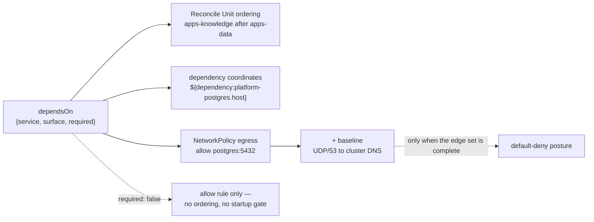
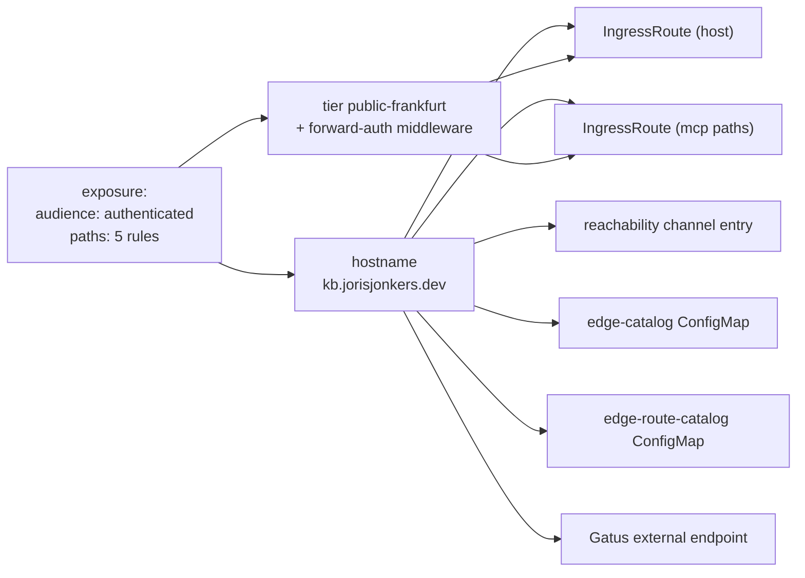

# Chapter 16 — Dependencies, identity, and derivation

Chapter 10 defined what a Service declares. This chapter defines what those
declarations *produce*: the edge set between Services, the identity each
Workload authenticates as, the network policy both derive, and the derivation
map that gives this specification its one machine-checkable property.

## Dependency edges

An edge is a triple. It names the provider, the surface, and whether the
consumer requires it
([0020](../../docs/adr/0020-dependency-edges-carry-surface.md)).

```yaml
dependsOn:
  - {service: platform-postgres, surface: postgres}
  - {service: auth-api, surface: http, required: false}
```

| field | required | meaning |
|---|---|---|
| `service` | yes | A Service Id — the only referencable identity ([0010](../../docs/adr/0010-flat-service-identity.md)). It must resolve in the composed union: `E_UNRESOLVED_SERVICE`. |
| `surface` | yes | One entry of that Service's `provides` map. The port is written once, by the provider, and never restated by a consumer: `E_UNKNOWN_SURFACE` where the name matches nothing. |
| `required` | no | Defaults to `true`. |

Edges are declared **per Workload**, and a Service's edge set is the union of
its Workloads' edges. Within `knowledge` the API reaches Postgres while the
ingest worker reaches RabbitMQ, and neither inherits the other's egress.

An id alone would not carry enough. The only NetworkPolicy code this estate
ever wrote derived policy from credential claims matched to provider exports
carrying an endpoint — `src/deployment/render/networkpolicy.ts:68` returns
nothing when `!provider.endpoint`, and line 70 filters the credential set by
claim name — so a dependency with no credential, `knowledge` calling `auth-api`
over HTTP, produced neither a policy nor a coordinate. Chapter 10 forbids the
consumer writing `AUTH_API_URL` as a literal, so an id-only edge would leave
that dependency with no legal home at all. Naming the surface gives it one, and
puts the port in exactly one place.

### What an edge derives, read outbound



`required: false` yields an allow rule but no reconcile ordering and no startup
gate, so an optional dependency cannot deadlock a rollout; the consumer's own
startup code must tolerate the provider being absent. `required: true` — the
default — buys both. The graph of required edges must be acyclic
(`E_DEPENDENCY_CYCLE`, [chapter 40](40-composition.md)).

An edge orders; it does not group. Two Services that must switch versions
together declare a **Release Unit** by name in layer 1
([chapter 10](10-service-intent.md#release-units)). Atomicity is declared
because the graph cannot see it: a frontend depends on its API, but a
dependency edge does not mean the two must cut over together, and deriving
atomicity from every edge would make the whole estate one unit
([0060](../../docs/adr/0060-release-unit.md)).

### What an edge derives, read inbound

The same edges read from the provider's side produce derivations no Service
could declare locally, because no Service knows its own consumers. They are
computable only over the composed union
([0037](../../docs/adr/0037-composition-oci-fragments.md)), which is this
chapter's hard dependency on [chapter 40](40-composition.md).

| inbound derivation | evidence it is needed |
|---|---|
| a database and owning user per consumer | `init-databases.sh` creates `auth_db`, `agents_db`, `knowledge_db` and `n8n_db` — one per Service claiming a Postgres credential. 98 lines the graph already knows. |
| NetworkPolicy **ingress** | a provider must admit its consumers, and only the inbound set says who they are |
| browser origin allow-lists | `auth-api` hand-maintains `AUTH_CORS_ALLOWED_ORIGINS` with nine hostnames |
| rotation blast radius | "who breaks if I rotate this?" is the reader set of a Secret Subtree **path**, computed over readers of the path and never over declared key sets |

Which test suites exercise a provider together with its consumers is the same
inbound question. Whether that membership gates anything is not settled in this
specification — see [Defined separately](#defined-separately).

## Workload identity

Every Workload authenticates as its own principal. The ServiceAccount, the
Vault Kubernetes auth role and the Vault policy bound to it are derived **per
Workload** and named `<service>-<workload>`; a Service with exactly one Workload
collapses to `<service>`
([0024](../../docs/adr/0024-identity-per-workload.md)). No author writes an
identity name ([0030](../../docs/adr/0030-runtime-mechanics-derived.md)).

| Service | Workloads | derived identity |
|---|---|---|
| `auth-api` | `auth-api` | `auth-api` — the identity already live, `VAULT_KUBERNETES_ROLE: auth-api` |
| `knowledge` | `knowledge-api`, `knowledge-ingest-worker` | `knowledge-knowledge-api`, `knowledge-knowledge-ingest-worker` |

Vault's Kubernetes auth method binds a role to ServiceAccount names and
namespaces and to nothing finer, so two Pods presenting one ServiceAccount token
are one principal holding the union of the policies bound to it. Deriving the
account from the Service Id — which `src/adapters/kubernetes.ts:665-669` does
today, and which the previous version of this chapter drew as
`id --> ServiceAccount` — makes the two grant levels of
[0022](../../docs/adr/0022-grants-live-on-the-service.md) documentation rather
than a boundary. Under it, `knowledge-api`, which serves anonymous paths from
the public internet, authenticated as the principal holding `read` on
`secret/data/knowledge-system/vault-deploy-key`, the `0400` deploy key only the
ingest worker declares.

A Workload's **effective grant set** is the Service-level `secrets` list plus
its own. Layer 2 flattens that set per Workload before deriving policy, so a
Service-level grant renders one policy statement per Workload that holds it,
never one shared statement. Renaming a Workload renames its identity: role,
policy and bindings churn, and the new identity must be granted before it
starts.

### What a grant confers

**The grant unit is the path.** A KV-v2 `read` returns the whole document stored
at that path ([0009](../../docs/adr/0009-vault-read-is-per-path.md)), so a
policy naming a key subset would promise a narrowing the store never enforces.
The previous version of this chapter promised exactly that — "`read` on the
granted path and keys only" — and it was false. That claim is deleted.

`keys:` documents the keys a reader expects and feeds validation; it confers
nothing, and no author may read it as an access boundary. `keys: ['*']` is not
vocabulary. The boundary can therefore be drawn only at the path, which fixes
the Secret Subtree layout: **no path may hold keys for more than one reader
set** ([0023](../../docs/adr/0023-grant-unit-is-the-path.md)).
`secret/data/platform/postgres` splits per consumer, and until it does, every
one of its readers holds `read` on its neighbours' credentials.

### Worked trace — one secret grant

```yaml
# platform/service.yml — on the Service, since both Workloads hold it
secrets:
  - path: secret/data/platform/postgres/kb          # one path, one reader set
    keys: [user, password]                          # documentation + validation
    access: read
    delivery: env
    rotation: {tolerates: restart}
```

```
# platform/env/knowledge-api/base.env
DB_USER=${secret:secret/data/platform/postgres/kb#user}
DB_PASSWORD=${secret:secret/data/platform/postgres/kb#password}
```

The placeholder's path half **byte-matches** the granted path — no mount table,
no `data/` strip, no engine taxonomy
([0027](../../docs/adr/0027-secret-reference-join-key.md)). The `#<key>` half
selects which value fills the variable and confers nothing.

| derives | detail |
|---|---|
| `VaultStaticSecret` | in the Workload's namespace, syncing the granted path |
| `Secret` | the synced document — every key at the path, because that is what a read returns; not a projection of `keys:` |
| `envFrom` secretRef | where the two placeholders resolve; they never become literal `env` entries |
| Vault policy + auth role | bound to `knowledge-knowledge-api`, carrying the tier's capabilities on the granted **path**. `read` covers the whole document |
| `rolloutRestartTargets` | from `tolerates: restart`, no longer hand-declared |
| engine choice | static, because `restart` does not require `delivery: self` |
| `NetworkPolicy` egress | to the Secret Store, from the Workloads holding the grant and not from their siblings |
| Secret Subtree cross-check | the `data` domain must declare this path and list this Service as a reader |
| reader set and roll impact | the readers of the path, over the composed union |
| **inbound**, on the provider | one database and one owning user in `init-databases.sh` |

The last two are computable only over the composed union, which is this
chapter's dependency on [chapter 40](40-composition.md).

Splitting access from binding buys a bidirectional check the single-document
form could not express:

| condition | error |
|---|---|
| a `delivery: env` grant with no matching placeholder | `E_UNBOUND_SECRET_GRANT` — a dead grant, property 3 |
| a `${secret:…}` placeholder whose path byte-matches no grant | `E_UNAUTHORISED_SECRET_REFERENCE` |
| `delivery: env` with `rotation.tolerates: reload` | impossible; a pod's environment is fixed for its lifetime |
| `delivery: env` or `file` on a non-KV engine (`transit/`) | impossible; `self` is the only legal delivery for a key that is never materialised |
| `access: self-roll` on a path other Services read, unacknowledged | `E_ROLL_AFFECTS_OTHER_READERS`, computed over the readers of the path |
| `delivery: env` or `file` where the pinned context does not advertise secrets at rest | `E_SECRETS_AT_REST_REQUIRED` ([chapter 60](60-setup.md#secrets-at-rest)) |

The roll-impact check is the one nothing in the estate has today:
`secret/platform/observability` holds the Prometheus token, the Discord webhook
and the Grafana client secret in one document, and one CronJob rolls one of
those keys.

## Network policy

Policy is **default-deny and derived**. A Workload's legal flows are exactly its
declared edges, its declared surfaces and exposure, its effective grant set, and
a platform baseline no Service authors
([0035](../../docs/adr/0035-network-policy-default-deny.md)).

Opt-in was already measured here and it lost: three NetworkPolicy objects exist
for roughly thirty workloads, so the cluster is effectively open east-west.
Three of thirty is what opt-in produces on this estate, and the number is the
argument. Default-deny is expressible only because the edge set is complete —
every legal flow named by a declaration someone owns.

### The derived allow set

| rule | derived from | direction |
|---|---|---|
| to a provider's surface port | each `dependsOn` edge of the Workload | egress |
| from each consumer of a surface | the inbound edge set, over the composed union | ingress |
| to the Secret Store | any grant in the Workload's effective set | egress |
| from the route tier carrying the audience | an `exposure` entry | ingress |
| from the metrics stack, to the scrape port | `observability.scrape` | ingress |

### The baseline

Two rules are in the rendered set for every Workload and appear in no
declaration:

| baseline rule | why it cannot be optional |
|---|---|
| **egress UDP/53 to the cluster DNS service**, in every policy carrying `Egress` in `policyTypes` | once any egress policy selects a pod, all unmatched egress is denied — DNS included. The dead renderer generation shows the failure: `providerPolicy` (`src/deployment/render/networkpolicy.ts:86-102`) emits an egress rule to the provider's pod and nothing else, so the consumer cannot resolve the `svc.cluster.local` name the coordinate derivation just handed it, and fails with a DNS timeout diagnosed as "Postgres is down". TCP/53 rides the same rule, for truncated responses. |
| **ingress from the metrics stack** to any declared scrape port | the same file omits it; a workload that silently loses scrape stops alerting, which is the failure observability exists to prevent |

The DNS half is checkable statically: **every rendered NetworkPolicy carrying
`Egress` in `policyTypes` also matches UDP/53**. A `conftest` rule asserts it
over the rendered set, and that assertion is the property this baseline exists
to hold.

A baseline rule is not authorable and not exceptable from a Service document. An
exception to one is a change to the derivation — reviewed once, applied to every
Workload at once.

### Audit before enforce

Default-deny does not ship on `networking.k8s.io/v1` alone. That API has no
audit, dry-run or log-only mode — a policy is enforced the moment it selects a
pod — and k3s's embedded kube-router controller has none either. The previous
setup checklist made "default-deny NetworkPolicy is in **audit** mode, not
enforce" a hard precondition of the first production apply, and that item could
never be ticked: a grep for `cilium|calico|kube-router|flannel` across `src/`,
`spec/`, `schemas/`, `fixtures/` and `docs/` returned zero hits, and no decision
had picked a CNI. It becomes satisfiable only through a CNI carrying a
non-enforcing policy stage ([chapter 60](60-setup.md#cni),
[0036](../../docs/adr/0036-cni-selection.md)).

| stage | what runs | exit criterion |
|---|---|---|
| render-only | the policy set is rendered and diffed in review; nothing is loaded | the CNI decision lands |
| audit | the set is loaded into the non-enforcing stage; observed flows are diffed against the rendered allow set | **zero undeclared flows over 14 days** |
| enforce | the set is enforced estate-wide | — |

Two costs are accepted rather than mitigated. An undeclared east-west path —
this estate is known to hold some — stays invisible until promotion, and then
breaks a workload. And a typo in a `surface` name narrows the allow set silently
while still rendering a valid policy: the on-call sees a connection timeout, not
an error code.

## The derivation map

The normative set of derivations. The left column is declared in Service Intent;
the middle is the pinned platform input set of [chapter 20](20-resolved-deployment.md#pinned-inputs);
the right is produced by layers 2 and 3.

```mermaid
flowchart LR
    subgraph DEC["Declared — Service Intent (layer 1)"]
        d_id["id"]
        d_dom["domain"]
        d_own["owner"]
        d_alert["alertClass"]
        d_rel["releaseUnit"]
        d_wl["workload name"]
        d_prov["provides<br/>surface: port"]
        d_dep["dependsOn"]
        d_img["image alias"]
        d_run["runtime"]
        d_env["env files<br/>per Workload"]
        d_sec["secrets<br/>path, access, delivery"]
        d_ast["assets"]
        d_exp["exposure"]
        d_prb["probes<br/>readiness + liveness"]
        d_bud["startupBudget"]
        d_zdt["zeroDowntime"]
        d_life["lifecycle"]
        d_sf["stateful"]
        d_vol["volumes + durability"]
        d_plc["placement"]
        d_size["size"]
        d_hard["hardening<br/>+ exceptions"]
        d_scr["observability.scrape"]
        d_ovr["overrides"]
    end

    subgraph PIN["Pinned inputs (layer 2)"]
        p_ctx["Cluster Context"]
        p_cs["ClusterState snapshot"]
        p_img["images lock"]
    end

    subgraph DER["Derived — assignments and Deliverables (layers 2 and 3)"]
        r_ns["namespace"]
        r_host["hostname (FQDN)"]
        r_tier["route tier + middleware"]
        r_ru["Reconcile Unit + DAG"]
        r_rlu["Release Unit + switch gate"]
        r_sa["identity name<br/>service-workload"]
        r_vp["Secret Store path grant"]
        r_dig["image digest"]
        r_rep["replicas"]
        r_res["requests + limits"]
        r_sc["securityContext"]
        r_strat["rollout strategy + surge"]
        r_prb["container probe timings"]
        r_dl["progressDeadlineSeconds"]
        r_tc["Flux health timeout class"]
        r_plc["nodeSelector + affinity"]
        r_bind["recorded PV binding"]

        k_dep["Deployment / StatefulSet / Job"]
        k_svc["Service"]
        k_sa["ServiceAccount"]
        k_cm["ConfigMap"]
        k_sec["VaultStaticSecret / Secret"]
        k_pol["Vault policy + auth role"]
        k_ir["IngressRoute"]
        k_np["NetworkPolicy"]
        k_sm["ServiceMonitor"]
        k_pr["PrometheusRule"]
        k_gat["Gatus endpoint"]
        k_rch["reachability entry"]
        k_edg["edge catalogs"]
        k_flx["Flux Kustomization"]
        k_bkp["backup CronJob + sweep"]
        k_ntf["notifier route"]
        k_res["resolved.yml"]
    end

    d_id --> r_ns
    d_id --> r_sa
    d_wl --> r_sa
    d_dom --> r_ru
    d_dom --> r_vp
    d_own --> k_ntf
    d_alert --> k_pr
    d_alert --> k_ntf
    d_rel --> r_rlu

    d_prov --> k_svc
    d_prov --> k_np
    d_prov --> k_gat

    d_dep --> r_ru
    d_dep --> k_np
    d_dep --> k_cm

    d_img --> r_dig
    p_img --> r_dig
    d_run --> k_dep
    d_env --> k_dep
    d_env --> k_sec

    d_sec --> k_sec
    d_sec --> r_vp
    d_sec --> k_np
    d_sec --> k_dep

    d_ast --> k_cm
    d_ast --> k_dep

    d_exp --> r_host
    d_exp --> r_tier
    d_exp --> k_ir
    d_exp --> k_rch
    d_exp --> k_edg
    d_exp --> k_gat
    d_exp --> k_np

    d_prb --> r_prb
    d_prb --> r_tc
    d_prb --> k_gat
    d_prb --> r_rlu
    d_bud --> r_prb
    d_bud --> r_dl
    d_zdt --> r_strat

    d_life --> k_dep
    d_sf --> k_dep
    d_sf --> r_tc
    d_vol --> k_dep
    d_vol --> r_strat
    d_vol --> k_bkp
    d_vol --> r_bind

    d_plc --> r_plc
    d_size --> r_res
    d_hard --> r_sc
    d_scr --> k_sm
    d_scr --> k_pr
    d_scr --> k_np

    p_ctx --> r_host
    p_ctx --> r_res
    p_cs --> r_rep
    p_cs --> r_bind
    p_cs --> r_plc

    r_sa --> k_sa
    r_sa --> k_pol
    r_sa --> k_dep
    r_vp --> k_pol
    r_prb --> k_dep
    r_strat --> k_dep
    r_dl --> k_dep
    r_rep --> k_dep
    r_res --> k_dep
    r_sc --> k_dep
    r_ns --> k_dep
    r_dig --> k_dep
    r_plc --> k_dep
    r_bind --> k_dep
    r_host --> k_ir
    r_tier --> k_ir
    r_tc --> k_flx
    r_ru --> k_flx
    r_rlu --> k_flx

    d_ovr -.->|"replaces one derived value"| r_dl

    r_ns --> k_res
    r_host --> k_res
    r_sa --> k_res
    r_vp --> k_res
    r_bind --> k_res
```



The map is dense on purpose and is not meant to be read by eye. Its value is
that the three properties below are **checkable by a script** over the
renderer's attribution table, which
[0054](../../docs/adr/0054-adapter-attribution.md) requires every Deliverable to
carry.

### Worked trace — one exposure declaration



One declaration, six artefacts, plus the two conformance tests that existed only
to detect when those six disagreed (`route-auth-conformance.test.js`,
`gatus-route-coverage.test.js`). Under property 1 those tests have nothing left
to check, because the six cannot disagree — they share one upstream. The
hostname itself is assembled by layer 2 from the label the Service declares and
the tier that carries the audience
([chapter 20](20-resolved-deployment.md#authority)).

## The three properties

An earlier draft said the criterion was "any node with two inbound arrows is a
bled concern". That is wrong. A `Deployment` legitimately draws on image,
configuration, grants, probes, placement, size and hardening — many inbound
arrows, no bleed. Convergence on an *object* is normal; convergence on the same
*field* of an object is the defect.

### 1. Totality — no Deliverable has in-degree zero

Every rendered object is reachable from at least one declaration or one pinned
input. An object with no inbound edge is hand-written, and must either become
derived or be entered in a Bidirectional Ledger with an owner and a reason
([0055](../../docs/adr/0055-bidirectional-ledgers.md)).

This is the property that was violated seven ways over: `reachability.yml`, both
edge catalogs, both IngressRoutes and the Gatus endpoint each declared
`kb.jorisjonkers.dev` independently, with no declaration upstream of any of
them.

### 2. Single authority — no field has two declaring sites

For each field of each Deliverable, exactly one declaration is its authority.
Checked against the attribution table rather than the diagram, because the
diagram is object-level and this property is field-level. That granularity gap
is deliberate: drawing it per-field would make the map unreadable without making
the check any stronger. Which side of the layer boundary each field's authority
sits on is settled once, in
[chapter 20](20-resolved-deployment.md#authority).

### 3. No dead declarations — no declaration has out-degree zero

A declared field that derives nothing is ceremony, and this property is the one
that would have caught the estate's clearest example.
`rollbackTargetRetention` was validated for `minimumDays >= 90` and
`acknowledged: true`, appeared in the readiness scorecard, was documented in
three `PLATFORM.md` files as failing *never*, and was read by no renderer or
adapter. Every service declared the identical value. Out-degree zero.

The one surface exempt from this check is `overrides`, whose entries replace a
derived value by name and are therefore invisible to it
([0031](../../docs/adr/0031-derived-overrides-with-reason.md)). A dead override
looks exactly like a load-bearing one; that cost is accepted, not solved.

## What the properties would have caught

| defect | property | how it presents |
|---|---|---|
| `kb.jorisjonkers.dev` in seven places | 1 | six Deliverables with in-degree zero |
| `rollbackTargetRetention` inert | 3 | a declaration with out-degree zero |
| `platform.layer` wrong in 7 of 7 services | 3 | out-degree zero — it fed a registry, never placement |
| a ServiceAccount per Service, two Workloads sharing one principal | 2 | one identity field with two Workloads' grant sets declaring it |
| 41 Gatus checks, no notifier | 1 | `notifier route` unreachable from any declaration |
| 60 duplicated `OTEL_*` lines | 2 | six declaring sites for one field |
| a secret granted but never referenced | 3 | a `delivery: env` grant with out-degree zero |
| unsatisfiable `gpu-model-gtx960m` preference | 1 | a declaration pointing at a capability no node advertises |

## Defined separately

How the estate deploys, and how dependency on other units for testing gates a
deploy, are defined separately from this model. This chapter derives the edge
set, the identities and the policy set; it does not say who applies them, in
what order a pipeline runs, or which suites must pass first. The model's whole
interface to that work is three demands — Release Unit atomicity, Durability
Class gating on destructive operations, and rendering from pinned inputs only.
The parked direction work is in
[docs/adr/deferred/](../../docs/adr/deferred/README.md).

## Open in this chapter

1. **The CORS predicate.** `AUTH_CORS_ALLOWED_ORIGINS` lists nine hostnames, and
   the inbound derivation above claims they are the inbound edge set projected
   onto assigned hostnames. The shape is right; the predicate is not
   established. A browser origin is needed only by a consumer making
   cross-origin requests *to* `auth-api`, whereas an OIDC redirect flow — what
   `GrafanaOidc`, `N8nOidc` and `RabbitMqOidc` exercise — needs no CORS entry.
   The derivation is probably "inbound edges declaring a browser surface", not
   "all inbound edges".
   **Owner:** joris.
   **Settled by:** diff `auth-api`'s live `AUTH_CORS_ALLOWED_ORIGINS` against
   the inbound edge set, classifying each of the nine as browser or redirect.
   **Blocks:** rendering the allow-list at all; it stays hand-maintained until
   the predicate is written here.
2. **Nothing enforces the rendered policy set.** Audit mode requires a CNI with
   a non-enforcing policy stage, and that evaluation has not run.
   **Owner:** joris.
   **Settled by:** the lab evaluation on the pinned k3s version required by
   [0036](../../docs/adr/0036-cni-selection.md) (chapter 60
   [`#cni`](60-setup.md#cni)).
   **Blocks:** the audit stage, and therefore the 14-day promotion window and
   enforce.
