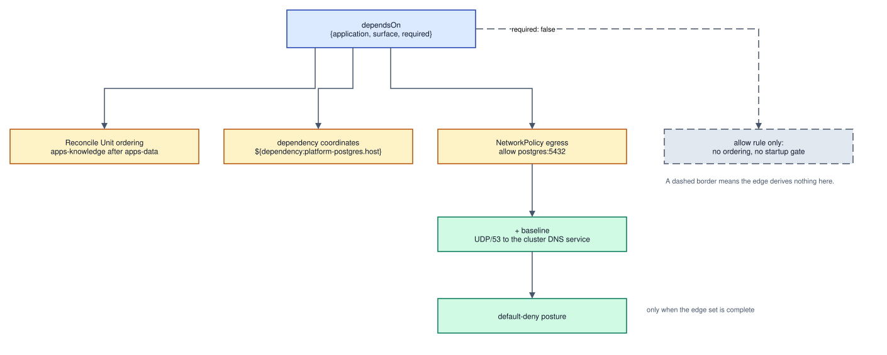
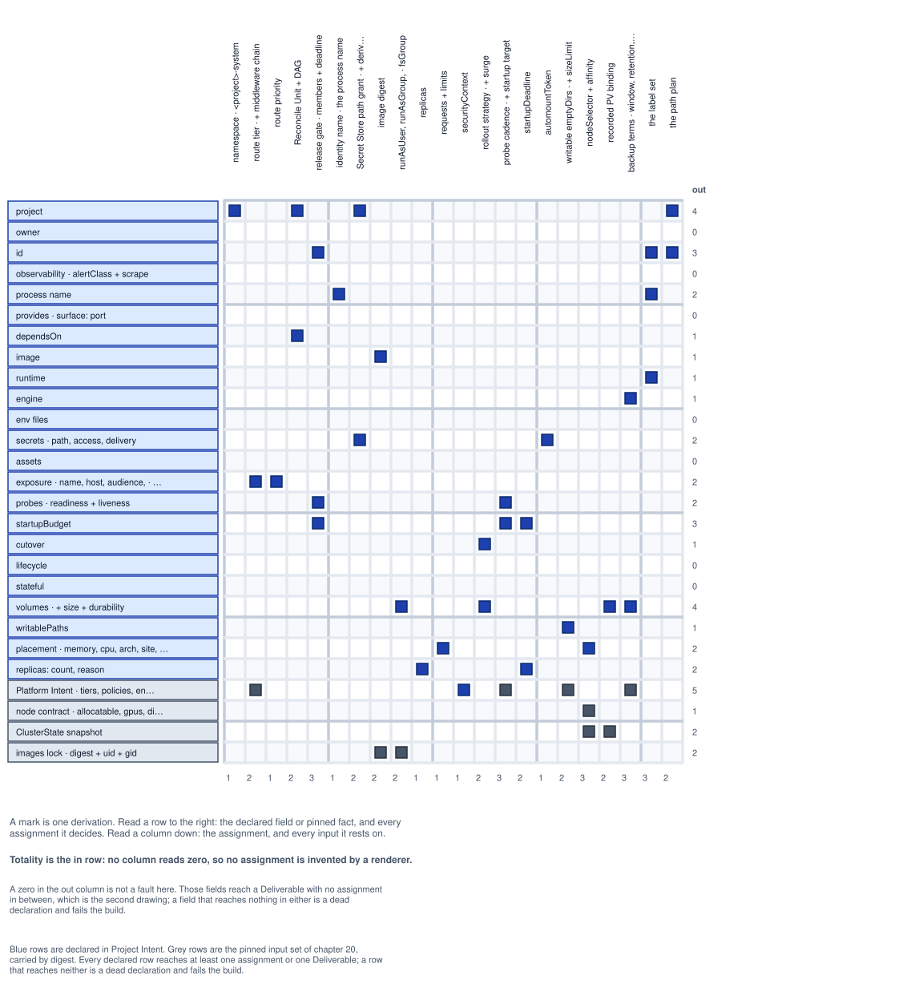
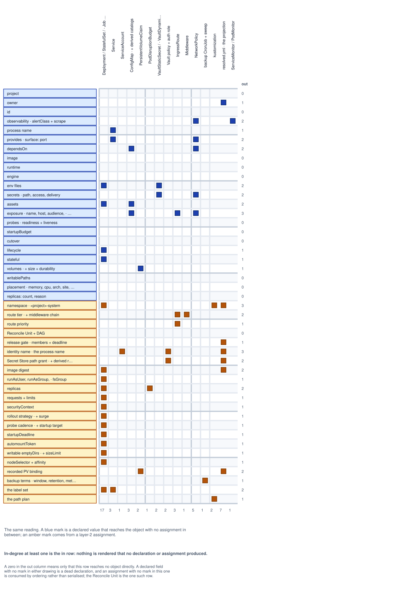
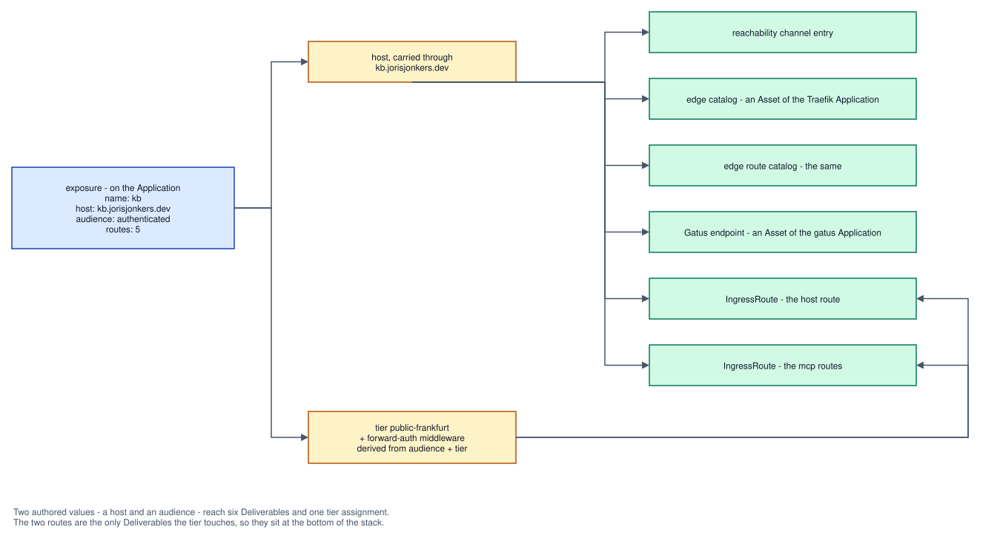
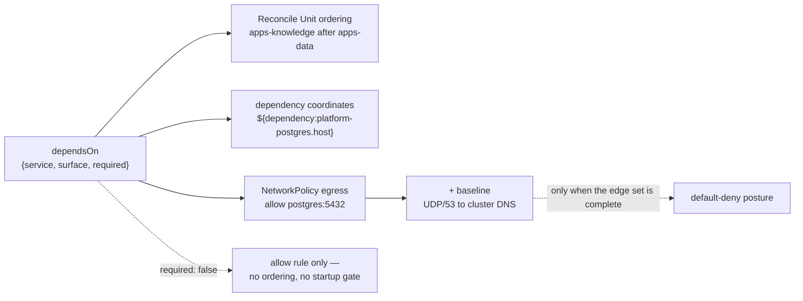
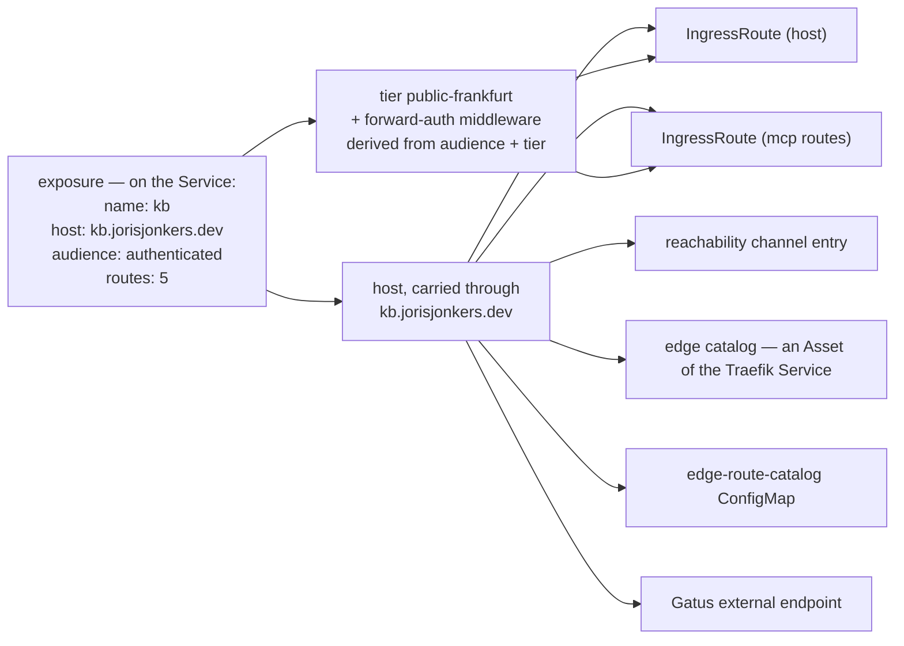

# Chapter 16 — Dependencies, identity, and derivation

Chapter 10 defined what a domain file declares: Services, and the Workloads
under them. This chapter defines what those declarations *produce* — the edge
set between Services, the identity each Workload authenticates as, the network
policy both derive, and the derivation map that gives this specification its one
machine-checkable property.

## Dependency edges

An edge is a triple. It names the provider, the surface, and whether the
consumer requires it
([0020](../../docs/adr/model/0020-dependency-edges-carry-surface.md)).

```yaml
dependsOn:
  - {service: platform-postgres, surface: postgres}
  - {service: auth, surface: http, required: false}
```

| field | required | meaning |
|---|---|---|
| `service` | yes | A Service Id — the only referencable identity ([0010](../../docs/adr/model/0010-flat-service-identity.md)). It must resolve in the composed union: `E_UNRESOLVED_SERVICE`. |
| `surface` | yes | One surface declared by one of that Service's Workloads. The port is written once, by the provider, and never restated by a consumer: `E_UNKNOWN_SURFACE` where the name matches nothing. |
| `required` | no | Defaults to `true`. |

**`provides` moved to the Workload; the edge did not.** A port is a property of
a process, so surfaces are declared by the Workload that listens
([chapter 10](10-service-intent.md#ports-and-surfaces)). `dependsOn` still
targets `{service, surface}` and nothing a consumer writes changes. Surface
names stay unique within a Service, so the pair resolves to exactly one
Workload, one port and one address: `{service: auth, surface: http}` is carried
by Workload `auth-api`, and the consumer neither names that Workload nor learns
it exists. A provider may move a surface between its own Workloads without a
single consumer edit. The Service Id remains the only referencable identity, and
a Workload is not referencable from outside its Service
([0062](../../docs/adr/model/0062-service-is-the-release-unit.md)).

Edges are declared **per Workload**, and a Service's edge set is the union of
its Workloads' edges. Within `knowledge` the API reaches Postgres while the
ingest worker reaches RabbitMQ, and neither inherits the other's egress.

An id alone would not carry enough. The only NetworkPolicy code this estate
ever wrote derived policy from credential claims matched to provider exports
carrying an endpoint — `src/deployment/render/networkpolicy.ts:68` returns
nothing when `!provider.endpoint`, and line 70 filters the credential set by
claim name — so a dependency with no credential, `knowledge` calling `auth`'s
`http` surface, produced neither a policy nor a coordinate. Chapter 10 forbids
the consumer writing `AUTH_API_URL` as a literal, so an id-only edge would leave
that dependency with no legal home at all. Naming the surface gives it one, and
puts the port in exactly one place.

### What an edge derives, read outbound



<sub>[Diagram source](#what-a-dependency-edge-derives) · edit by opening the SVG in draw.io</sub>

`required: false` yields an allow rule but no reconcile ordering and no startup
gate, so an optional dependency cannot deadlock a rollout; the consumer's own
startup code must tolerate the provider being absent. `required: true` — the
default — buys both. The graph of required edges must be acyclic
(`E_DEPENDENCY_CYCLE`, [chapter 40](40-composition.md)).

An edge orders; it does not group. Things that must switch versions together are
Workloads of **one Service**: a Service is the unit of atomic release, its
Workloads switch together or none switches, and there is no mechanism to couple
two Services ([0062](../../docs/adr/model/0062-service-is-the-release-unit.md)).
Atomicity is authored by drawing the Service boundary, because the graph cannot
see it: a frontend depends on its API, but a dependency edge does not mean the
two must cut over together, and deriving atomicity from every edge would make
the whole estate one unit. A lockstep pair that survives as two Services is not
a missing feature — it is evidence the boundary is drawn wrong, and the fix is
redrawing it.

### What an edge derives, read inbound

The same edges read from the provider's side produce derivations no Service
could declare locally, because no Service knows its own consumers. They are
computable only over the composed union
([0037](../../docs/adr/model/0037-composition-oci-fragments.md)), which is this
chapter's hard dependency on [chapter 40](40-composition.md).

| inbound derivation | evidence it is needed |
|---|---|
| a database and owning user per consumer | `init-databases.sh` creates `auth_db`, `agents_db`, `knowledge_db` and `n8n_db` — one per Service claiming a Postgres credential. 98 lines the graph already knows. |
| the Gatus endpoint list | one check per route on every exposure in the union, for the declared `gatus` Service — 41 derived references in 288 hand-maintained lines today ([0098](../../docs/adr/model/0098-one-publication-path.md)) |
| the edge catalogs | every host and route the estate serves, for the declared Traefik Services — 30 and 28 derived references in two hand-maintained ConfigMaps |
| NetworkPolicy **ingress** | a provider must admit its consumers, and only the inbound set says who they are |
| browser origin allow-lists | `auth-api` hand-maintains `AUTH_CORS_ALLOWED_ORIGINS` with nine hostnames |
| rotation blast radius | "who breaks if I rotate this?" is the reader set of a Secret Subtree **path**, computed over readers of the path and never over declared key sets |

Which test suites exercise a provider together with its consumers is the same
inbound question. Whether that membership gates anything is not settled in this
specification — see [Defined separately](#defined-separately).

### The database catalog

The first row of that table has a producer
([0080](../../docs/adr/model/0080-database-catalog-is-derived-data.md)). For a
provider Workload whose [`engine`](10-service-intent.md#workload) is a datastore
that owns databases, the inbound edge set derives a **catalog**: one entry per
consuming Service naming its database, its owning user, and the Vault role that
issues that user's credentials.

The catalog is **data, not a procedure**. It renders as a `ConfigMap` and the
platform's engine catalog supplies the image and command that applies it — the
same split [0077](../../docs/adr/model/0077-durability-derives-a-backup.md) makes
for backups, and for the same reason: [0012](../../docs/adr/model/0012-assets-not-code.md)
forbids an executable Asset, and a rendered shell script is a diff no reviewer
can validate except by running it. What exists today is 98 lines of
`init-databases.sh` creating `auth_db`, `agents_db`, `knowledge_db` and `n8n_db`
— one per Service claiming a Postgres credential, which is exactly the inbound
edge set.

**No password is rendered.** The catalog names a Vault role; Vault's database
secrets engine issues the credential, and `vso` projects it with the
`VaultDynamicSecret` it already emits. The engine mount and its connection
configuration are platform fixtures like the auth method
([chapter 60](60-setup.md#secrets-at-rest)); what the render owns is the per-
consumer role name and the catalog entry.

The credential lives at `database/creds/<role>`, which a `database` grant names
by deriving it from the role
([0085](../../docs/adr/model/0085-a-grant-is-a-union-on-engine.md)). That was the
mismatch R20 recorded — a grant path is not the path a credential is read from —
and it is why the catalog could not render until the grant vocabulary became a
union on engine.

## Workload identity

Every Workload authenticates as its own principal. The ServiceAccount, the
Vault Kubernetes auth role and the Vault policy bound to it are derived **per
Workload** and named for the **Workload alone**
([0024](../../docs/adr/model/0024-identity-per-workload.md)). The namespace is the
domain's, `<domain>-system`
([0063](../../docs/adr/model/0063-intent-authored-per-domain.md)), so the principal a
Pod presents is `<domain>-system.<workload>`. No author writes an identity name
([0030](../../docs/adr/model/0030-runtime-mechanics-derived.md)).

| domain | Service | Workloads | derived identity |
|---|---|---|---|
| `auth` | `auth` | `auth-api`, `auth-ui` | `auth-system.auth-api` — the identity already live, `VAULT_KUBERNETES_ROLE: auth-api` — and `auth-system.auth-ui` |
| `knowledge` | `knowledge` | `knowledge-api`, `knowledge-ingest-worker` | `knowledge-system.knowledge-api`, `knowledge-system.knowledge-ingest-worker` |

A `<service>-<workload>` prefix is what the domain file makes absurd. Service
`auth` holds Workload `auth-api`, so the prefixed rule would render
`auth-system.auth-auth-api` for no gain: `auth-api` is the process name, and it
is the role the live cluster already carries. The uniqueness the prefix existed
to give moves to where a reader can check it — two Workloads in one domain may
not share a name, `E_DUPLICATE_WORKLOAD_NAME` at composition
([chapter 40](40-composition.md#identity)).

Vault's Kubernetes auth method binds a role to ServiceAccount names and
namespaces and to nothing finer, so two Pods presenting one ServiceAccount token
are one principal holding the union of the policies bound to it. Two things
follow. Deriving the account from the Service Id — which
`src/adapters/kubernetes.ts:665-669` does today, and which the previous version
of this chapter drew as `id --> ServiceAccount` — makes the two grant levels of
[0022](../../docs/adr/model/0022-grants-live-on-the-service.md) documentation rather
than a boundary. Under it, `knowledge-api`, which serves anonymous paths from
the public internet, authenticated as the principal holding `read` on
`secret/data/knowledge-system/vault-deploy-key`, the `0400` deploy key only the
ingest worker declares. And because the binding's other half is the namespace,
while a namespace now holds every Service of its domain by construction, the
**namespace is not a trust boundary**: `auth-system` is shared, and no grant is
narrowed by living in it. What separates two Workloads is the ServiceAccount
name alone, which is exactly why its uniqueness is checked across the whole
domain rather than within one Service.

A Workload's **effective grant set** is the Service-level `secrets` list plus
its own. Layer 2 flattens that set per Workload before deriving policy, so a
Service-level grant renders one policy statement per Workload that holds it,
never one shared statement. Renaming a Workload renames its identity: role,
policy and bindings churn, and the new identity must be granted before it
starts.

### What a grant confers

**The grant unit is the path.** A KV-v2 `read` returns the whole document stored
at that path ([0009](../../docs/adr/model/0009-vault-read-is-per-path.md)), so a
policy naming a key subset would promise a narrowing the store never enforces.
The previous version of this chapter promised exactly that — "`read` on the
granted path and keys only" — and it was false. That claim is deleted.

That is the `kv` engine's rule. A grant is a union on `engine`
([0085](../../docs/adr/model/0085-a-grant-is-a-union-on-engine.md)): a `database`
grant names a role and confers a read on `database/creds/<role>`, and a `transit`
grant names a key and the operations it performs, each conferring exactly one
Vault path. The unit is still one path per grant; what differs is which path the
declaration derives.

`keys:` documents the keys a reader expects and feeds validation; it confers
nothing, and no author may read it as an access boundary. `keys: ['*']` is not
vocabulary. The boundary can therefore be drawn only at the path, which fixes
the Secret Subtree layout: **no path may hold keys for more than one reader
set** ([0023](../../docs/adr/model/0023-grant-unit-is-the-path.md)).
`secret/data/platform/postgres` splits per consumer, and until it does, every
one of its readers holds `read` on its neighbours' credentials.

### Worked trace — one secret grant

```yaml
# the knowledge domain file — the grant sits on the Service, since both
# Workloads hold it
domain: knowledge
owner: joris
services:
  - id: knowledge
    secrets:
      - path: secret/data/platform/postgres/kb    # one path, one reader set
        keys: [user, password]                    # documentation + validation
        access: read
        delivery: env
        rotation: {tolerates: restart}
```

```
# platform/env/knowledge-api/base.env
DB_USER=${secret:secret/data/platform/postgres/kb#user}
DB_PASSWORD=${secret:secret/data/platform/postgres/kb#password}
```

The placeholder's path half **byte-matches** the granted path — no mount table,
no `data/` strip, no engine taxonomy
([0027](../../docs/adr/model/0027-secret-reference-join-key.md)). The `#<key>` half
selects which value fills the variable and confers nothing.

| derives | detail |
|---|---|
| `VaultStaticSecret` | in the domain's namespace, `knowledge-system`, syncing the granted path |
| `Secret` | the synced document — every key at the path, because that is what a read returns; not a projection of `keys:` |
| `envFrom` secretRef | where the two placeholders resolve; they never become literal `env` entries |
| Vault policy + auth role | bound to `knowledge-api` in `knowledge-system`, carrying the tier's capabilities on the granted **path**. `read` covers the whole document |
| `rolloutRestartTargets` | from `tolerates: restart`, no longer hand-declared |
| engine choice | static, because `restart` does not require `delivery: self` |
| `NetworkPolicy` egress | to the Secret Store, from the Workloads holding the grant and not from their siblings |
| Secret Subtree cross-check | the `data` domain must declare this path and list this Service as a reader |
| reader set and roll impact | the readers of the path, over the composed union |
| **inbound**, on the provider | one database and one owning user in `init-databases.sh` |

The last two are computable only over the composed union, which is this
chapter's dependency on [chapter 40](40-composition.md).

Splitting access from binding buys a bidirectional check the single-document
form could not express:

| condition | error |
|---|---|
| a `delivery: env` grant with no matching placeholder | `E_UNBOUND_SECRET_GRANT` — a dead grant, property 3 |
| a `${secret:…}` placeholder whose path byte-matches no grant | `E_UNAUTHORISED_SECRET_REFERENCE` |
| `delivery: env` with `rotation.tolerates: reload` | impossible; a pod's environment is fixed for its lifetime |
| `delivery: env` or `file` on a non-KV engine (`transit/`) | impossible; `self` is the only legal delivery for a key that is never materialised |
| `access: self-roll` on a path other Services read, unacknowledged | `E_ROLL_AFFECTS_OTHER_READERS`, computed over the readers of the path |
| `delivery: env` or `file` where the pinned context does not advertise secrets at rest | `E_SECRETS_AT_REST_REQUIRED` ([chapter 60](60-setup.md#secrets-at-rest)) |

The roll-impact check is the one nothing in the estate has today:
`secret/platform/observability` holds the Prometheus token, the Discord webhook
and the Grafana client secret in one document, and one CronJob rolls one of
those keys.

## Network policy

Policy is **default-deny and derived**. A Workload's legal flows are exactly its
declared edges, the surfaces it declares, the exposure routes that name it, its
effective grant set, and a platform baseline no Service authors
([0035](../../docs/adr/model/0035-network-policy-default-deny.md)).

It is evaluated **per pod**, and it has to be. A namespace holds every Service
of its domain ([0063](../../docs/adr/model/0063-intent-authored-per-domain.md)), so a
namespace wall separates nothing and no isolation claim may rest on one.
Isolation in this model is the derived edge set plus per-Workload identity
([0024](../../docs/adr/model/0024-identity-per-workload.md)) — both per Workload, both
readable in one file.

Opt-in was already measured here and it lost: three NetworkPolicy objects exist
for roughly thirty workloads, so the cluster is effectively open east-west.
Three of thirty is what opt-in produces on this estate, and the number is the
argument. Default-deny is expressible only because the edge set is complete —
every legal flow named by a declaration someone owns.

The producer is the `networking` adapter
([0074](../../docs/adr/model/0074-networking-adapter-emits-policy.md)): every
`NetworkPolicy` in the estate, per Workload from the allow set below plus the two
baseline rules, and one namespace-wide default-deny per domain. Nothing else
emits one, which is what makes the DNS assertion checkable against a single
producer.

### The derived allow set

| rule | derived from | direction |
|---|---|---|
| to a provider's surface port | each `dependsOn` edge of the Workload; for an edge to a Registered Unmanaged Surface, to the address and port the register carries ([0090](../../docs/adr/model/0090-edges-resolve-against-the-register.md)) | egress |
| from each consumer of a surface | the inbound edge set, over the composed union | ingress |
| to the Secret Store | any grant in the Workload's effective set | egress |
| from the route tier carrying the audience | a route on the Service's `exposure` naming this Workload | ingress |
| from the metrics stack, to the scrape port | the Workload's `scrape` surface | ingress |

### The baseline

Two rules are in the rendered set for every Workload and appear in no
declaration:

| baseline rule | why it cannot be optional |
|---|---|
| **egress UDP/53 to the cluster DNS service**, in every policy carrying `Egress` in `policyTypes` | once any egress policy selects a pod, all unmatched egress is denied — DNS included. The dead renderer generation shows the failure: `providerPolicy` (`src/deployment/render/networkpolicy.ts:86-102`) emits an egress rule to the provider's pod and nothing else, so the consumer cannot resolve the `svc.cluster.local` name the coordinate derivation just handed it, and fails with a DNS timeout diagnosed as "Postgres is down". TCP/53 rides the same rule, for truncated responses. |
| **ingress from the metrics stack** to any declared scrape port | the same file omits it; a workload that silently loses scrape stops alerting, which is the failure observability exists to prevent |

The DNS half is checkable statically: **every rendered NetworkPolicy carrying
`Egress` in `policyTypes` also matches UDP/53**. A `conftest` rule asserts it
over the rendered set, and that assertion is the property this baseline exists
to hold.

A baseline rule is not authorable and not exceptable from a Service document. An
exception to one is a change to the derivation — reviewed once, applied to every
Workload at once.

### The token is mounted only where the pod authenticates

`automountServiceAccountToken` derives from **`delivery`**, and from nothing else
([0087](../../docs/adr/model/0087-token-mounted-only-for-delivery-self.md)):

| the Workload's grants | token |
|---|---|
| at least one with `delivery: self` | mounted |
| only `env` or `file`, or none at all | **not** mounted |

The obvious rule — no grant, no token — is wrong, and `platform-postgres` is the
counter-example. It holds a grant and needs no token: under `delivery: env` the
VSO operator performs the Vault read and projects the result, so the pod never
authenticates to anything. Under `delivery: file` the kubelet does the
projecting. Only `delivery: self` means *the pod itself* presents its
ServiceAccount token to Vault, which is the one case a token is for.

This is [0075](../../docs/adr/model/0075-no-workload-rbac-in-v1.md)'s reasoning
applied to the token instead of the Role, and it reaches the same place: the
privilege a Workload of this estate actually needs is smaller than the default,
and the field that says so already exists.

A Workload that calls the **Kubernetes** API — `agents-api` creates Services at
runtime — needs a token that no grant implies. It declares so with a reason,
recorded in the projection its owner reads back, which lets the estate count how
many pods hold a token they were not derived one for
([0087](../../docs/adr/model/0087-token-mounted-only-for-delivery-self.md)).

### No Role grants what an absence already denies

Three Services share `data-system`, and the only thing stopping `platform-valkey`'s
ServiceAccount from reading `platform-postgres`'s Secret is that no Role grants
it. That is an absence rather than a boundary, and the model turns it into a
checked property rather than rendering RBAC
([0075](../../docs/adr/model/0075-no-workload-rbac-in-v1.md)).

**v1 renders no `Role`, `ClusterRole`, `RoleBinding` or `ClusterRoleBinding` for
a Workload**, and no rendered Deliverable may grant access to `secrets` —
`E_WORKLOAD_RBAC_GRANT`, a composition-time invariant
([chapter 40](40-composition.md#secrets)). Under `delivery: env` and
`delivery: file` the kubelet projects the Secret and the pod never calls the API,
so a least-privilege Role for these Workloads grants nothing; rendering sixty
objects that grant nothing would make an empty Role read as an oversight and
give a future broad grant somewhere to hide.

A Workload that genuinely needs the Kubernetes API — `agents-api` creates
Services at runtime — is the case this rule refuses to guess at. It is an
unregistered capability today, so it belongs in a Bidirectional Ledger with an
owner until the model has vocabulary for it
([0055](../../docs/adr/model/0055-bidirectional-ledgers.md)), not in an
adapter's default.

### Audit before enforce

Default-deny does not ship on `networking.k8s.io/v1` alone. That API has no
audit, dry-run or log-only mode — a policy is enforced the moment it selects a
pod — and k3s's embedded kube-router controller has none either. The previous
setup checklist made "default-deny NetworkPolicy is in **audit** mode, not
enforce" a hard precondition of the first production apply, and that item could
never be ticked: a grep for `cilium|calico|kube-router|flannel` across `src/`,
`spec/`, `schemas/`, `fixtures/` and `docs/` returned zero hits, and no decision
had picked a CNI. It becomes satisfiable only through a CNI carrying a
non-enforcing policy stage ([chapter 60](60-setup.md#cni),
[0036](../../docs/adr/model/0036-cni-selection.md)).

**Render-only is the v1 stage**
([0084](../../docs/adr/model/0084-render-only-is-the-v1-policy-stage.md)). The
`networking` adapter emits the complete policy set and the tree is diffed in
review; nothing loads it until [0036](../../docs/adr/model/0036-cni-selection.md)
picks a CNI with a non-enforcing stage. What v1 owes is the policies, and
promoting them is a rollout decision waiting on a premise nobody has settled —
so an unpicked CNI does not block the render.

| stage | what runs | exit criterion |
|---|---|---|
| render-only — **v1** | the policy set is rendered and diffed in review; nothing is loaded | the CNI decision lands |
| audit | the set is loaded into the non-enforcing stage; observed flows are diffed against the rendered allow set | **zero undeclared flows over 14 days** |
| enforce | the set is enforced estate-wide | — |

An edge whose target resolves to neither a Service in the union nor a Registered
Unmanaged Surface is `E_UNRESOLVED_SERVICE`, and one resolving to a register
entry without coordinates for that surface is
`E_UNMANAGED_SURFACE_WITHOUT_COORDINATES`
([0090](../../docs/adr/model/0090-edges-resolve-against-the-register.md)). Both
existed as silence before: `{service: stalwart, surface: smtp}` derived no
coordinates and therefore no egress rule, producing a valid policy with a
missing rule — a timeout on-call rather than a build error.

One cost is accepted rather than mitigated: an undeclared east-west path — this
estate is known to hold some — stays invisible until promotion, and then breaks
a workload.

The second cost this section used to accept is now refused. A typo in a
`surface` name is `E_UNKNOWN_SURFACE` on the consuming edge, and a target
outside both namespaces is `E_UNRESOLVED_SERVICE`; a rendered policy can no
longer be silently short a rule while every gate stays green. What remains
genuinely silent is a flow nobody declared at all, which is what the audit stage
exists to find.

## The derivation map

The normative set of derivations, as two matrices. A **mark is one
derivation**: read a row to the right for everything that input decides, and a
column down for everything an output rests on. Ninety arrows between two tall
columns is a hairball no layout fixes — which line ends where stops being
answerable — so the relation is carried by position instead.

The first matrix has the fields of Service Intent and the pinned input set of
[chapter 20](20-resolved-deployment.md#pinned-inputs) as rows, and the layer-2
assignments as columns. The second has those assignments **and** the declared
fields as rows, and the Deliverables as columns. The `in` row under each grid is
the in-degree of that column and the `out` column is the out-degree of that row,
so both properties below are countable off the drawing.



*Assignments — every declared field and pinned fact, and the assignment it decides. No column
reads zero: that is totality.*



*Deliverables — every declaration and assignment, and the object it reaches. No column reads
zero: that is in-degree at least one. A blue mark is a declared value that reaches the object with
no assignment in between.*

<sub>[Diagram source](#the-derivation-map) · edit by opening the SVG in draw.io</sub>

Two edges carry the amendment. `namespace` hangs off `domain`, not off `id`, so
ten live namespaces come out unchanged and no Service can name its own
([0063](../../docs/adr/model/0063-intent-authored-per-domain.md)). And `placement`
feeds both `nodeSelector` and `requests + limits`, so the numbers a Workload
asks for and the nodes it may land on are one declaration compared against one
pinned input — the node contract's `allocatable`, never a live read
([0061](../../docs/adr/model/0061-placement-is-hard-dimensions.md)). No node
satisfying every declared dimension is `E_PLACEMENT_UNSATISFIABLE` at build,
before an object is rendered. Eligibility is not bin-packing: three Workloads
asking `memory: 2Gi` each pass against a 4096Mi node, and the scheduler refuses
the third at apply.

A node left the map altogether, and with it four edges. There is no derived
`hostname (FQDN)` any more: `exposure` hangs off the **Service**, and the `host`
it carries is a full authored FQDN
([0018](../../docs/adr/model/0018-exposure-by-audience.md)), so the
IngressRoute, the reachability entry, both edge catalogs, the Gatus endpoint and
the published `resolved.yml` all hang off the declaration itself rather than off
a value layer 2 assembled from a label, a tier policy and a cluster domain. The
Platform Intent no longer contributes to a hostname at all. What layer 2 still
decides on that path is `r_tier` — the tier carrying the audience and the
middleware chain that comes with it — which is why the exposure node keeps an
arrow into it. `provides` stays on the Workload, so the two ends of a route are
declared in the same document without a port ever being restated: the Service
says which host and path, the Workload says which port.

The map is dense on purpose and is not meant to be read by eye. Its value is
that the three properties below are **checkable by a script** over the
renderer's attribution table, which
[0054](../../docs/adr/model/0054-adapter-attribution.md) requires every Deliverable to
carry.

### Worked trace — one exposure declaration



<sub>[Diagram source](#worked-trace--one-exposure-declaration) · edit by opening the SVG in draw.io</sub>

One declaration, six artefacts, plus the two conformance tests that existed only
to detect when those six disagreed (`route-auth-conformance.test.js`,
`gatus-route-coverage.test.js`). Under property 1 those tests have nothing left
to check, because the six cannot disagree — they share one upstream. That
upstream is a **Service** field: one host fronting two Workloads,
`auth.jorisjonkers.dev/api` to `auth-api` and `/` to `auth-ui`, is a single
exposure with two routes, and it is unexpressible while `exposure` sits on a
Workload.

The hostname is no longer assembled. `host` is the full FQDN as authored and is
carried through untouched; what layer 2 decides on this path is the tier that
carries the audience and the middleware chain that follows from it,
`contentPolicy` included
([chapter 20](20-resolved-deployment.md#authority)).

## The three properties

An earlier draft said the criterion was "any node with two inbound arrows is a
bled concern". That is wrong. A `Deployment` legitimately draws on image,
configuration, grants, probes, placement and hardening — many inbound arrows, no
bleed. Convergence on an *object* is normal; convergence on the same *field* of
an object is the defect.

### 1. Totality — no Deliverable has in-degree zero

Every rendered object is reachable from at least one declaration or one pinned
input. An object with no inbound edge is hand-written, and must either become
derived or be entered in a Bidirectional Ledger with an owner and a reason
([0055](../../docs/adr/model/0055-bidirectional-ledgers.md)).

This is the property that was violated seven ways over: `reachability.yml`, both
edge catalogs, both IngressRoutes and the Gatus endpoint each declared
`kb.jorisjonkers.dev` independently, with no declaration upstream of any of
them.

### 2. Single authority — no field has two declaring sites

For each field of each Deliverable, exactly one declaration is its authority.
Checked against the attribution table rather than the diagram, because the
diagram is object-level and this property is field-level. That granularity gap
is deliberate: drawing it per-field would make the map unreadable without making
the check any stronger. Which side of the layer boundary each field's authority
sits on is settled once, in
[chapter 20](20-resolved-deployment.md#authority).

### 3. No dead declarations — no declaration has out-degree zero

A declared field that derives nothing is ceremony, and this property is the one
that would have caught the estate's clearest example.
`rollbackTargetRetention` was validated for `minimumDays >= 90` and
`acknowledged: true`, appeared in the readiness scorecard, was documented in
three `PLATFORM.md` files as failing *never*, and was read by no renderer or
adapter. Every service declared the identical value. Out-degree zero.

No surface is exempt from this check. The override mechanism that used to be
exempt is deleted
([0031](../../docs/adr/model/0031-derived-overrides-with-reason.md)), so the
dead-declaration property now runs over every declaration in every domain file.

## What the properties would have caught

| defect | property | how it presents |
|---|---|---|
| `kb.jorisjonkers.dev` in seven places | 1 | six Deliverables with in-degree zero |
| `rollbackTargetRetention` inert | 3 | a declaration with out-degree zero |
| `platform.layer` wrong in 7 of 7 services | 3 | out-degree zero — it fed a registry, never the Reconcile Unit |
| a ServiceAccount per Service, two Workloads sharing one principal | 2 | one identity field with two Workloads' grant sets declaring it |
| 41 Gatus checks, no notifier | 1 | `notifier route` unreachable from any declaration |
| 60 duplicated `OTEL_*` lines | 2 | six declaring sites for one field |
| a secret granted but never referenced | 3 | a `delivery: env` grant with out-degree zero |
| a `gpu-model-gtx960m` term no node advertises | 3 | out-degree zero — the scheduler dropped the soft term without an event and it rendered nothing; every dimension is now hard, so it is `E_PLACEMENT_UNSATISFIABLE` at build |

## Defined separately

How the estate deploys, and how dependency on other units for testing gates a
deploy, are defined separately from this model. This chapter derives the edge
set, the identities and the policy set; it does not say who applies them, in
what order a pipeline runs, or which suites must pass first. The model's whole
interface to that work is three demands — all-or-nothing switchover per Service
([0062](../../docs/adr/model/0062-service-is-the-release-unit.md)), Durability Class
gating on destructive operations, and rendering from pinned inputs only. The
parked direction work is in
[docs/adr/deferred/](../../docs/adr/deferred/README.md).

## Open in this chapter

1. **The CORS predicate.** `AUTH_CORS_ALLOWED_ORIGINS` lists nine hostnames, and
   the inbound derivation above claims they are the inbound edge set projected
   onto the hosts those Services declare. The shape is right; the predicate is not
   established. A browser origin is needed only by a consumer making
   cross-origin requests *to* `auth-api`, whereas an OIDC redirect flow — what
   `GrafanaOidc`, `N8nOidc` and `RabbitMqOidc` exercise — needs no CORS entry.
   The derivation is probably "inbound edges declaring a browser surface", not
   "all inbound edges".
   **Owner:** joris.
   **Settled by:** diff `auth-api`'s live `AUTH_CORS_ALLOWED_ORIGINS` against
   the inbound edge set, classifying each of the nine as browser or redirect.
   **Blocks:** rendering the allow-list at all; it stays hand-maintained until
   the predicate is written here.
2. ~~**Nothing enforces the rendered policy set.**~~ Decided: render-only is
   v1's stage ([0084](../../docs/adr/model/0084-render-only-is-the-v1-policy-stage.md)),
   so this is not a gap in the model but the first stage of a sequence whose
   exit criterion is [0036](../../docs/adr/model/0036-cni-selection.md)'s lab
   evaluation. That evaluation is 0036's own settling test and is recorded
   there, not here.

## Diagram sources

Each diagram above is drawn in draw.io and committed as an SVG with the editable
diagram embedded, so opening the `.svg` in draw.io recovers the drawing. The
mermaid below is the same structure in text, kept so a diagram change shows up in
a plain diff. **Where the two disagree the SVG is the diagram and the mermaid is
what gets fixed** — the same precedence this repository uses between a chapter and
an ADR.

### What a dependency edge derives



### The derivation map

```mermaid
flowchart LR
    subgraph DEC["Declared — Service Intent (layer 1)"]
        d_dom["domain"]
        d_own["owner"]
        d_id["id"]
        d_alert["alertClass"]
        d_wl["workload name"]
        d_prov["provides<br/>surface: port<br/>on the Workload"]
        d_dep["dependsOn"]
        d_img["image"]
        d_run["runtime"]
        d_env["env files<br/>per Workload"]
        d_sec["secrets<br/>path, access, delivery"]
        d_ast["assets"]
        d_exp["exposure — on the Service<br/>name, host (authored FQDN),<br/>audience, contentPolicy,<br/>routes: path, match,<br/>workload, surface"]
        d_prb["probes<br/>readiness + liveness"]
        d_bud["startupBudget"]
        d_cut["cutover<br/>rolling | recreate"]
        d_life["lifecycle"]
        d_sf["stateful"]
        d_vol["volumes + durability"]
        d_plc["placement<br/>hard dimensions:<br/>memory, cpu, arch,<br/>site, disk, gpu,<br/>capabilities"]
        d_hard["hardening<br/>+ exceptions"]
        d_scr["scrape<br/>port + path"]
        d_rep["replicas<br/>count + reason"]
    end

    subgraph PIN["Pinned inputs (layer 2)"]
        p_ctx["Platform Intent<br/>+ node contract<br/>(allocatable)"]
        p_cs["ClusterState snapshot"]
        p_img["images lock"]
    end

    subgraph DER["Derived — assignments and Deliverables (layers 2 and 3)"]
        r_ns["namespace<br/>domain-system"]
        r_tier["route tier + middleware"]
        r_ru["Reconcile Unit + DAG"]
        r_sw["switch gate<br/>per Service"]
        r_sa["identity name<br/>the workload name"]
        r_vp["Secret Store path grant"]
        r_dig["image digest"]
        r_rep["replicas"]
        r_res["requests + limits"]
        r_sc["securityContext"]
        r_strat["rollout strategy + surge"]
        r_prb["container probe timings"]
        r_dl["progressDeadlineSeconds"]
        r_tc["Flux health timeout class"]
        r_plc["nodeSelector + affinity"]
        r_bind["recorded PV binding"]

        k_dep["Deployment / StatefulSet / Job"]
        k_svc["Service"]
        k_sa["ServiceAccount"]
        k_cm["ConfigMap"]
        k_sec["VaultStaticSecret / Secret"]
        k_pol["Vault policy + auth role"]
        k_ir["IngressRoute"]
        k_np["NetworkPolicy"]
        k_sm["ServiceMonitor"]
        k_pr["PrometheusRule"]
        k_gat["Gatus endpoint"]
        k_rch["reachability entry"]
        k_edg["edge catalogs"]
        k_flx["Flux Kustomization"]
        k_bkp["backup CronJob + sweep"]
        k_res["resolved.yml"]

        subgraph OBS["observability service — outside the model"]
            obs_run["observability runner<br/>monitors, cadence, rules,<br/>severity, receiver routes<br/>from resolved Service facts"]
        end
    end

    d_dom --> r_ns
    d_dom --> r_ru
    d_dom --> r_vp
    d_id --> r_sw
    d_alert --> obs_run
    d_scr --> obs_run
    d_scr --> k_np
    d_wl --> r_sa
    d_wl --> k_svc

    d_prov --> k_svc
    d_prov --> k_np
    d_prov --> k_gat

    d_dep --> r_ru
    d_dep --> k_np
    d_dep --> k_cm

    d_img --> r_dig
    p_img --> r_dig
    d_run --> k_dep
    d_env --> k_dep
    d_env --> k_sec

    d_sec --> k_sec
    d_sec --> r_vp
    d_sec --> k_np
    d_sec --> k_dep

    d_ast --> k_cm
    d_ast --> k_dep

    d_exp --> r_tier
    d_exp --> k_ir
    d_exp --> k_rch
    d_exp --> k_edg
    d_exp --> k_gat
    d_exp --> k_np
    d_exp --> k_res

    d_prb --> r_prb
    d_prb --> r_tc
    d_prb --> k_gat
    d_prb --> r_sw
    d_bud --> r_prb
    d_bud --> r_dl
    d_cut --> r_strat

    d_rep --> r_rep

    d_life --> k_dep
    d_sf --> k_dep
    d_sf --> r_tc
    d_vol --> k_dep
    d_vol --> r_strat
    d_vol --> k_bkp
    d_vol --> r_bind

    d_plc --> r_plc
    d_plc --> r_res
    d_hard --> r_sc
    d_scr --> k_np

    obs_run --> k_sm
    obs_run --> k_pr
    obs_run --> k_gat

    p_ctx --> r_plc
    p_cs --> r_rep
    p_cs --> r_bind
    p_cs --> r_plc

    r_sa --> k_sa
    r_sa --> k_pol
    r_sa --> k_dep
    r_vp --> k_pol
    r_prb --> k_dep
    r_strat --> k_dep
    r_dl --> k_dep
    r_rep --> k_dep
    r_res --> k_dep
    r_sc --> k_dep
    r_ns --> k_dep
    r_dig --> k_dep
    r_plc --> k_dep
    r_bind --> k_dep
    r_tier --> k_ir
    r_tc --> k_flx
    r_ru --> k_flx
    r_sw --> k_flx

    r_ns --> k_res
    r_sa --> k_res
    r_vp --> k_res
    r_bind --> k_res
```



### Worked trace — one exposure declaration


