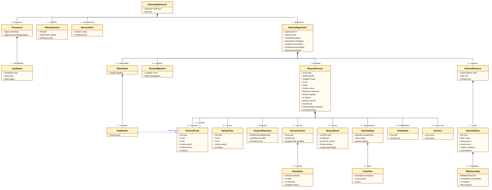
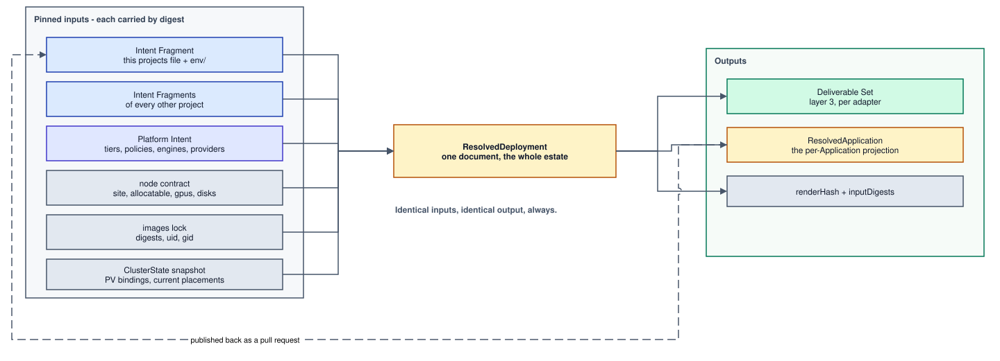
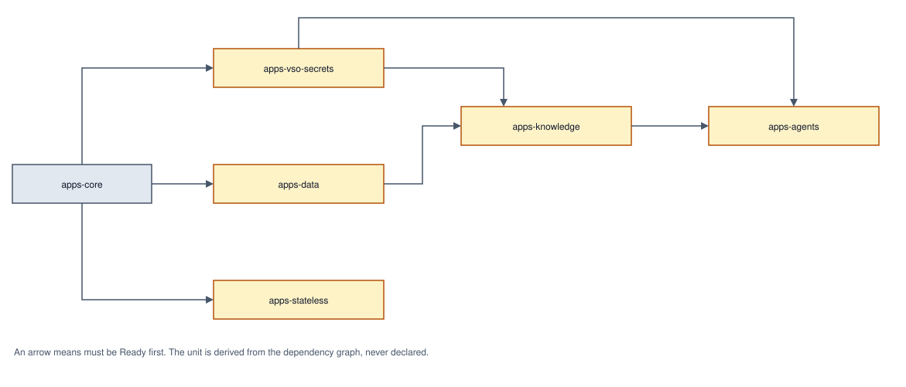
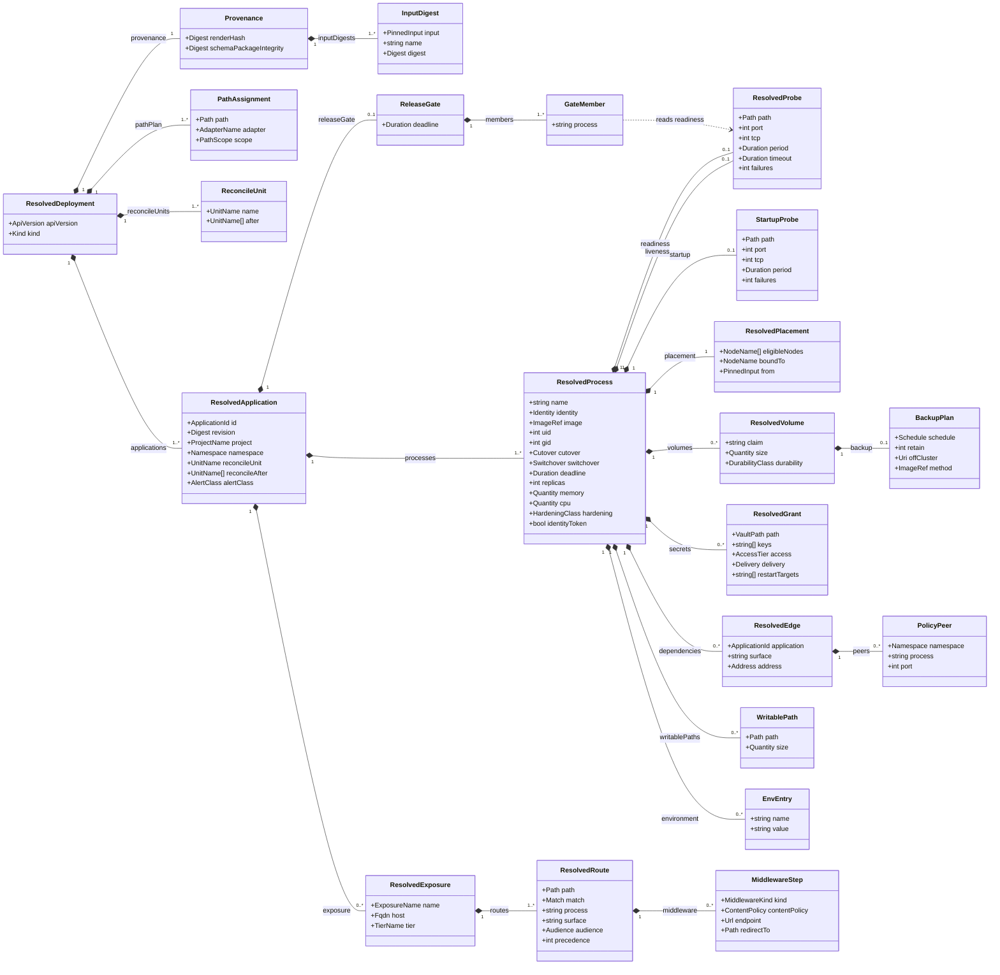
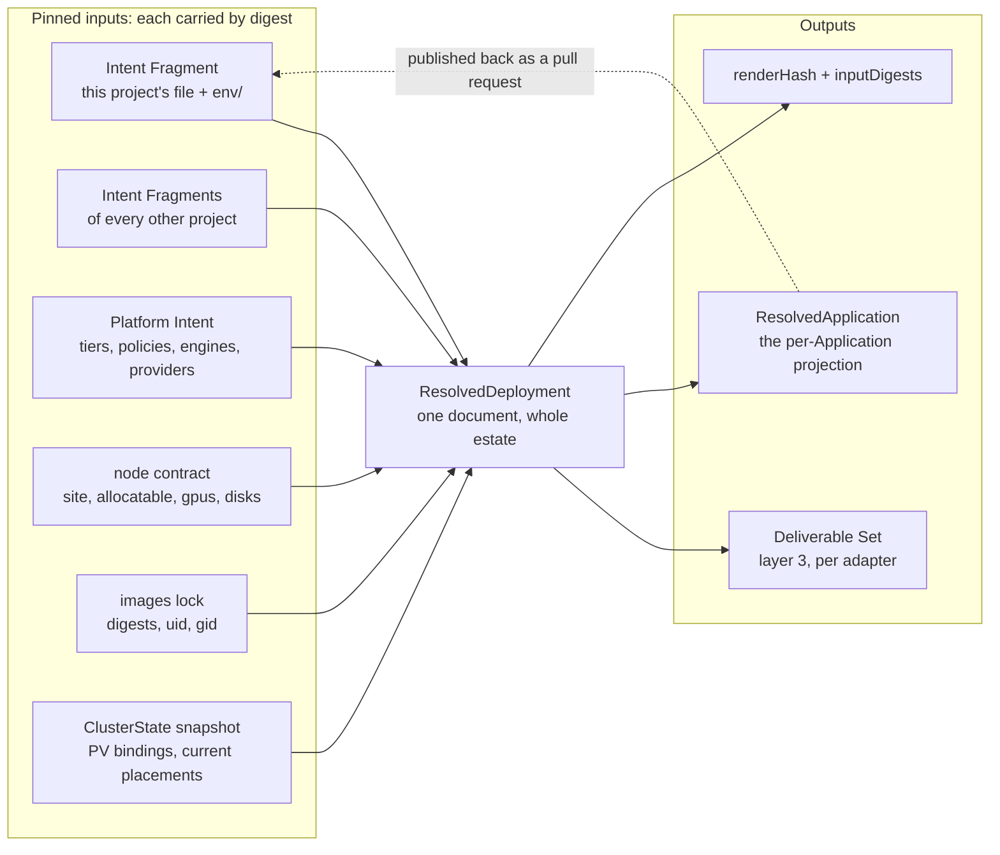
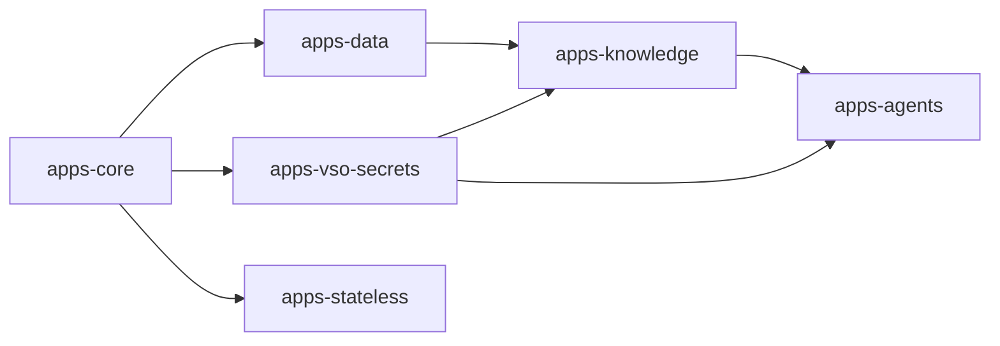

# Chapter 20: Resolved Deployment

Layer 2. Never authored. It is where every platform decision is recorded, and it
is the reason layer 3 can contain none.

## The Resolved Deployment

The Resolved Deployment is a **versioned, reviewable artifact**: emitted on every
render, validated against its own schema, and diffed against the previous render
as part of the change under review
([0029](../../docs/adr/model/0029-resolved-deployment-versioned-artifact.md)). A
reviewer reads that diff and sees what the platform decided on their behalf,
including decisions nobody asked for.

Two kinds share one schema family:

```yaml
apiVersion: resolved.jorisjonkers.dev/v1
kind: ResolvedDeployment     # one document, the whole composed estate
---
apiVersion: resolved.jorisjonkers.dev/v1
kind: ResolvedApplication        # the projection published back to one repository
```

`ResolvedDeployment` covers the whole composed estate because assignments are
not separable: the tier carrying each host, the Reconcile Unit DAG, inbound-edge
derivations and the reader set of a Secret Store path are global properties
([chapter 16](16-dependencies.md)). `ResolvedApplication` is a **projection**: the
slice belonging to one Application, obtained by filtering and never computed
separately, so the two cannot disagree about what was decided.

The version is the data model's own semver, not the package's
([chapter 40](40-composition.md#versioning)), so a field appearing in an artifact
is attributable to a model change rather than to a release. That matters here
because the estate has already paid for the alternative:
`schemas/deployment.schema.json` pins `apiVersion` to the bare const
`deployment.jorisjonkers.dev` while five sibling schemas carry a version segment,
and the only versioned deployment apiVersion in the tree,
`deployment.jorisjonkers.dev/v2` (`src/deployment/v2-model.ts:65`), names the
*authoring* shape. Two incompatible documents therefore share one name, and
`validate deployment` (`src/cli.ts:343`) dispatches on the bare const and rejects
the resolved shape on `/apiVersion`. The estate wrote that up as a trap rather
than fixing it.

An artifact nobody diffs is the documented-but-unversioned option wearing a
directory name. This repository already contains one resolved tree (
`fixtures/deployment/golden/`) and `grep -rn 'deployment/golden' test/ scripts/
.github/ package.json` returns nothing. The decision is therefore the emission
**and** the gate: render, validate, diff, review.

## The model



<sub>[Diagram source](#the-resolved-deployment-model) · edit by opening the SVG in draw.io</sub>

The layer-2 model records every decision in the words
[`CONTEXT.md`](../../CONTEXT.md) defines, and no field of it is named after a
Kubernetes or Traefik field: a Process carries the `cutover` it was granted, not
a rollout strategy, and the `hardening` posture with the paths it must write,
not a security context. Each Adapter is the one place its own target vocabulary
is spelled ([chapter 30](30-deliverables.md#adapters)).

Two relations the drawing does not carry are stated here instead, because a line
that long is what makes the drawing unreadable
([the diagram conventions](diagrams/README.md)). A `ResolvedRoute` names the
Process and the surface it serves, resolved against that Application's own
Processes. A `PathAssignment` names the Adapter that owns the path and, where
the path is an Application's or a project's rather than the estate's, the
element it belongs to.

A `ResolvedApplication` is both the element the estate-wide document contains
and the document published back to one repository
([Publish back](#publish-back)). Standing alone it carries its own
`provenance`; nested, it does not, because the enclosing document's provenance
already covers it. That is what keeps the projection a filtering rather than a
second computation.

The startup probe is its own class rather than a third `ResolvedProbe`, because
its cadence derives from a different input: readiness and liveness take the
Platform Intent's probe cadence, while the startup probe's period and failure
count derive from the Process's own `startupBudget` and its target from the
liveness declaration ([0088](../../docs/adr/model/0088-startup-probe-targets-liveness.md)).



<sub>[Diagram source](#the-resolved-deployment-pinned-inputs-and-outputs) · edit by opening the SVG in draw.io</sub>

One project file is one Intent Fragment
([0063](../../docs/adr/model/0063-intent-authored-per-project.md)), so the input a
Application owner edits and the input composition unions are the same document. The
two node-facing inputs are deliberately drawn apart: what a node **can hold** is
declared in the node contract and pinned with the Platform Intent; what the
cluster **currently holds** is observed into the ClusterState snapshot. They
answer different questions and are never read for each other's
([Cluster state](#cluster-state)).

The registered adapters accept the Resolved Deployment and nothing else
([chapter 30](30-deliverables.md#the-adapter-port)), so an adapter change cannot
relocate a decision into layer 3 unnoticed: an empty artifact diff across such a
change proves it did not.

## Authority

**A value is platform-arbitrated if and only if it must be unique across the
estate or draws on a shared finite resource; every other value is
Application-declared and carried through untouched**
([0004](../../docs/adr/model/0004-contention-decides-authority.md)). One question (
does the value contend?) replaces a per-field negotiation.

Three readings of the rule matter, and none is an exception to it:

- **Contention decides who *arbitrates*, not who *authors*.** A contended value
  does not silence the Application; it means the Application does not get the last word.
  The Application states its requirement, and the platform decides whether it fits
  and where. Placement forced this reading and settles it. `memory` and `cpu`
  are required on every Process and authored there as raw quantities
  ([0061](../../docs/adr/model/0061-placement-is-hard-dimensions.md)), and both are
  draws on a finite pool. An authors-only reading of the rule would have to
  forbid the field, which leaves the estate exactly where it is: BestEffort on
  every pod, because a number no Application may write is a number nobody writes.
  The platform arbitrates against node `allocatable` published by the node
  contract ([0056](../../docs/adr/model/0056-node-facts-single-source.md)) and refuses
  what no node can hold with `E_PLACEMENT_UNSATISFIABLE`.
- **Uniqueness alone is not contention.** A value that must be unique but is
  drawn from no finite pool is *declared* by the Application and *checked* at
  composition; there is nothing to arbitrate. A value drawn from a shared finite
  pool is *arbitrated*, and only the platform can arbitrate. The table's
  `placed by` column records which reading placed each row.
- **The rule places values someone must state.** A derived value is stated by
  nobody: it is a function of the rows above it, which is what
  [0005](../../docs/adr/model/0005-derivation-is-total.md) claims is always possible.
  Whether such a value may be restated locally is settled in
  [No overrides](#no-overrides), not here, and the answer is no, with one
  named exception.

The cost of the first reading is accepted and named here rather than discovered
later: **nothing stops an author writing `memory: 8Gi`.** The rule places
arbitration, not restraint, and the arbitration that exists today is a single
eligibility test against one node's allocatable. Every Process in the estate
could claim 8Gi, every one of them would pass against `frankfurt-contabo-1`'s
32768Mi, and the only thing that would refuse is the scheduler, at apply, for
whichever pods arrive last. That is [open item 5](#open-in-this-chapter).

The estate is the argument for having a rule at all. One hostname,
`kb.jorisjonkers.dev`, ended up declared in seven authoritative places across
three repositories (`homelab-inventory/catalog/reachability.yml`, three
`fleet-infra` manifests, a bearer-token secret and the application's own
`platform/deployment.yml`) plus hardcoded in `ServicePermission.kt`, with two
conformance tests existing for no purpose but detecting when the seven disagree.
The guard was cheaper to write than the fix.

The `placed by` column takes five values:

| value | meaning |
|---|---|
| `no contention` | the Application has the last word |
| `unique, checked` | estate-unique, declared by the Application; a collision is a build error |
| `unique, arbitrated` | estate-unique and drawn from no set the Application can see |
| `pool` | a draw on a shared finite resource, decided by the platform |
| `pool, stated` | a draw on a shared finite resource the Application states and the platform arbitrates |

This table is the only place field authority is stated. Records needing a
field's placement link to this anchor rather than copying rows.

| field | authority | placed by | note |
|---|---|---|---|
| `project` | Application | no contention | the file header, and the unit of fragment publication ([0063](../../docs/adr/model/0063-intent-authored-per-project.md)); the namespace derives from it |
| `owner` | Application | no contention | the project's own field, shared with nothing below it; notification target, never routing |
| `id` | Application | unique, checked | estate-unique; `E_DUPLICATE_APPLICATION_ID` at composition. It is also the atomic release boundary ([0062](../../docs/adr/model/0062-application-is-the-release-unit.md)) |
| `observability` `{alertClass, scrape}` | Application | no contention | urgency and the surface that carries the signal, per Application and never raised: a project would page as loudly as its loudest member. Absent means no monitoring ([chapter 10](10-project-intent.md#observability)) |
| process `name` | Application | unique, checked | unique within the **project**; `E_DUPLICATE_PROCESS_NAME`, and it names the derived identity |
| `provides` surface names and ports | Application | no contention | declared on the Process, because a port is a property of a process; written once, there |
| `dependsOn` edges | Application | no contention | provider, surface, necessity ([chapter 16](16-dependencies.md#dependency-edges)) |
| `image`, `runtime`, `lifecycle` | Application | no contention | what the Process is |
| env files, `assets` | Application | no contention | per Process; derived values appear only as placeholders |
| `secrets` grants: `path`, `keys`, `access`, `delivery`, `rotation` | Application | no contention to declare | per Application and never raised; the *path* is arbitrated (below), what an Application asks of a path is its own |
| `exposure[].name` | Application | unique, checked | required; unique **within the Application**, `E_DUPLICATE_EXPOSURE_NAME` at composition. It is the half `${exposure:<application>.<name>#url}` addresses |
| `exposure[].host` | Application | unique, checked | the full FQDN, authored: no label, no zone rule, no apex flag. Estate-unique across the composed union taken together with the register of unmanaged surfaces: `E_DUPLICATE_HOST` ([chapter 40](40-composition.md#identity)) |
| `exposure` `audience`, and a route's `audience` override | Application | no contention | one closed audience vocabulary; the per-route form is the anonymous path inside an authenticated host |
| `exposure[].contentPolicy` | Application | no contention | `strict`, `admin` or `workflow`. Which profile an application needs is a fact about the application; the header set it selects is derived |
| `exposure[].routes`: `path`, `match`, `process`, `surface`, `redirectTo` | Application | no contention | which of the Application's own Processes serves which path of the host. The surface must be one that Process `provides` (`E_UNKNOWN_SURFACE`); no two routes may share a `path` + `match` pair (`E_DUPLICATE_ROUTE_MATCH`); `redirectTo` is a path, never a regex |
| `probes`, `startupBudget`, `cutover` | Application | no contention | what only the Application knows about its own start, health and cutover; `cutover` is required and has no default |
| `hardening` | platform | no contention | one estate-wide posture, `restricted`. A Process authors no hardening at all: it declares the paths it must write, and an image that cannot meet the class is `E_HARDENING_UNMET` ([0016](../../docs/adr/model/0016-pod-hardening.md)) |
| `placement.memory`, `placement.cpu` | Application | pool, stated | required on every Process; the Application states the requirement, the platform arbitrates it against node allocatable |
| `placement.gpu` | Application | pool, stated | `class` and `memory`, matched against the node contract's `gpus[].class` and `gpus[].memory_mib`; a card is held by one Process at a time |
| `placement.disk` | Application | pool, stated | a `media` set; it filters the first placement and the PV binding wins thereafter: `E_DISK_BINDING_CONFLICT` |
| `volumes[].size` | Application | pool, stated | how much data the volume holds, matched against the node contract's `disks[].usable_gib`; no eligible node is `E_STORAGE_UNSATISFIABLE` ([0081](../../docs/adr/model/0081-volume-size-is-a-hard-dimension.md)) |
| PVC capacity and the disk capacity filter | derived | - | the volume's `size`, and their sum per Process for placement |
| `placement.arch`, `.site`, `.capabilities` | Application | no contention | filters over facts the node contract publishes; a list is a set of equally acceptable values, never a ranking |
| `writablePaths` | Application | no contention | which paths the process must write; the size of each is platform-assigned ([0092](../../docs/adr/model/0092-writable-paths-are-declared.md)) |
| `volumes[].durability` | Application | no contention | what losing the data costs; only the owner knows ([0015](../../docs/adr/model/0015-durability-class-per-volume.md)) |
| `engine` | Application | no contention | what the process is, which the platform keys its backup method off ([0078](../../docs/adr/model/0078-engine-is-process-vocabulary.md)) |
| `replicas` | Application | no contention | the sole local capacity exception: `count` above one with a required `reason` ([No overrides](#no-overrides)) |
| route tier | platform | pool | the shared edge is finite; `E_NO_TIER_FOR_AUDIENCE` where no tier carries the audience |
| route precedence | derived | - | `exact` before `prefix`, longer prefix before shorter; carried explicitly on the rendered route rather than left to the proxy's sort ([0093](../../docs/adr/model/0093-route-precedence-is-derived.md)) |
| middleware chain | platform | pool | tier + audience + `contentPolicy`; `forward-auth` for `authenticated` on a public tier, the security-headers baseline with the named content profile, and the redirect rule a route's `redirectTo` asks for |
| backup window, retention count, off-cluster destination | platform | pool | one policy per Durability Class; the window is one node's IO and the destination is one remote target ([0077](../../docs/adr/model/0077-durability-derives-a-backup.md)) |
| the backup method | platform | pool | the image the Platform document names per `engine`, resolved through the images lock; nothing executable is authored ([chapter 14](14-platform-intent.md#engines)) |
| alert rules, their severity and their receiver | the monitoring stack | pool | derived nowhere in this model. `alertClass` is published as a resolved fact and the stack that reads it decides what a class means ([chapter 10](10-project-intent.md#observability)) |
| monitor `interval` and `timeout` | platform | pool | the metrics stack's ingest budget is shared, so it is one estate-wide value in the Platform document ([chapter 14](14-platform-intent.md#monitor-cadence)) |
| the backup identity's grant on the destination | platform | pool | derived, never authored: the platform chose the destination, so it owns the credential |
| Reconcile Unit and its ordering | platform | unique, arbitrated | one estate-wide DAG ([The Reconcile Unit](#the-reconcile-unit)) |
| identity name, Vault role, Vault policy | platform | pool | named for the **Process alone**; the auth role namespace is shared ([chapter 16](16-dependencies.md#process-identity)) |
| Secret Store path layout and grants | platform | pool | one path per reader set; `E_SUBTREE_PREFIX_COLLISION` across Subtrees ([chapter 40](40-composition.md#identity)) |
| image digest | platform | unique, arbitrated | one image reference resolves to one digest estate-wide, from the pinned images lock |
| eligible node set, `nodeSelector` and affinity | platform | pool | every declared dimension matched against the node contract; no eligible node is `E_PLACEMENT_UNSATISFIABLE` ([Derived mechanics](#derived-mechanics)) |
| recorded PV binding | platform | pool | one `local-path` PV lives on one node; read from the ClusterState snapshot |
| `replicas` | derived | - | **1**; more than one is the `replicas: {count, reason}` declaration ([0089](../../docs/adr/model/0089-replicas-derived-no-minavailable.md)) |
| `PodDisruptionBudget` | derived | - | emitted only where `replicas` exceeds one, as `maxUnavailable: 1`; a budget over a single replica is a drain deadlock |
| `namespace` | derived | - | `<project>-system`, and nothing else ([0063](../../docs/adr/model/0063-intent-authored-per-project.md)); several Applications share one by construction |
| requests and limits | derived | - | from `placement.memory` and `placement.cpu`: memory request equals memory limit, cpu request with no cpu limit |
| `securityContext` | derived | - | from the one platform `hardening` posture and the Process's declared `writablePaths`; no Process authors a control and no exception relaxes one |
| `automountServiceAccountToken` | derived | - | `true` only where a grant carries `delivery: self`; the pod authenticates in that case and in no other ([0087](../../docs/adr/model/0087-token-mounted-only-for-delivery-self.md)) |
| the ephemeral mount per writable path, and its size | derived | - | one mount per declared path, sized from the Platform Intent's ephemeral `size` ([0092](../../docs/adr/model/0092-writable-paths-are-declared.md)) |
| `runAsUser`, `runAsGroup`, `fsGroup` | derived | - | the `uid` and `gid` the images lock resolved; `fsGroup` only where the Process holds a volume ([0082](../../docs/adr/model/0082-images-lock-carries-uid-and-gid.md)) |
| container probe timings | derived | - | the startup probe's target from the **liveness** declaration and its period from `startupBudget`; readiness and liveness cadence from the Platform Intent's probe policy ([0088](../../docs/adr/model/0088-startup-probe-targets-liveness.md)) |
| `progressDeadlineSeconds` | derived | - | from `startupBudget` |
| switchover | derived | - | from `cutover`: `continuous` derives `blue-green`, `interrupted` derives `stop-start` ([chapter 55](55-delivery.md#switchover)), which the adapters spell; `cutover: continuous` over an RWO volume is `E_CUTOVER_UNHONOURABLE`, not a silent downgrade |
| object kind | derived | - | from `lifecycle` and `volumes` |
| the Application's release-gate deadline | derived | - | `max` over the Application's Processes of `progressDeadlineSeconds` ([The release gate](#the-release-gate)) |
| the object label set | derived | - | fixed, from Process name, Application Id and the images lock ([chapter 10](10-project-intent.md#the-label-set)) |
| Secret and VSO sync objects | derived | - | from grants with `delivery: env` or `file`, plus `rolloutRestartTargets` from `rotation`; a grant with `delivery: self` and `tolerates: reload` derives **no** restart target, which is what makes its rotation zero-downtime ([chapter 10](10-project-intent.md#zero-downtime-rotation)) |
| an Asset's object name, and the restart it causes | derived | - | content-hashed unconditionally; there is no authored change response ([0094](../../docs/adr/model/0094-asset-change-restarts-unconditionally.md)) |
| env entries and `envFrom` refs | derived | - | from env files, after placeholder resolution, including `${identity:…}`, the Process's own derived facts ([0091](../../docs/adr/model/0091-identity-placeholders-not-framework-wiring.md)) |
| dependency coordinates | derived | - | from the edge set and the provider's surfaces, bound to the key the consumer chose |
| Runtime Profile values | derived | - | from `runtime` |
| ServiceMonitor, PodMonitor | derived | - | target and port name from `observability.scrape` and the named surface in `provides`; cadence from the Platform document |
| PrometheusRule, severity, receiver route | the monitoring stack | - | not rendered by this model. PromQL is a mechanism and a receiver is a shared channel ([chapter 10](10-project-intent.md#observability)) |
| backup job and retention sweep | derived | - | from `volumes[].durability`; `reconstructible` renders none |
| NetworkPolicy set | derived | - | from the edge set, exposure, grants, plus the baseline ([chapter 16](16-dependencies.md#network-policy)) |

A field the rule cannot place falsifies
[0004](../../docs/adr/model/0004-contention-decides-authority.md) and forces an
amendment to the rule, never an exceptions row in this table.

### The hostname changed sides

Until this amendment the table carried two rows for one value: an Application-declared
*label*, and a platform-arbitrated *fully-qualified hostname* assembled from that
label, the tier's hostname policy and the cluster domain. There is no such
assembly to run. `knowledge` serves `kb`, `platform-rabbitmq` serves `rabbitmq`,
`knowledge.jorisjonkers.dev` and `kb.jorisjonkers.dev` both resolve, and `root`,
`status`, `dashboard` and `faro` belong to no Application at all, and
so a hostname policy would be right for most hosts and silently wrong for the
rest, and the wrong ones are the ones nobody would check. `host` is therefore
authored in full on the Application's `exposure` entry and carried through untouched
([0018](../../docs/adr/model/0018-exposure-by-audience.md)); both old rows are gone,
replaced by one.

That is the rule's second reading, not an exception to it. A hostname must be
unique across the estate and draws on no pool the platform holds, so the Application
declares it and the **uniqueness check is arbitrated at composition**:
`E_DUPLICATE_HOST` over the composed union taken together with the Registered
Unmanaged Surfaces ([chapter 40](40-composition.md#identity)). Nobody's fragment
wins a contested host: the union fails and no `ComposedIntent` is produced until
an author changes one of them. Contention decided who arbitrates, not who
authors, which is the same restatement `placement` forced
([0004](../../docs/adr/model/0004-contention-decides-authority.md)).

What stays on the platform side of this path is everything mechanical about the
edge: the tier that carries the audience, and the middleware chain that follows
from the tier, the audience and `contentPolicy`. The authored proxy vocabulary is
exactly two fields (`contentPolicy` on an exposure and `redirectTo` on a route)
and no Application names a middleware, a listener or a certificate issuer.

### The namespace row was wrong, and this is the correction

Until this amendment the table derived `namespace` from `id`, with a per-Application
exception field that could name a different namespace and record a reason. Both
halves of that rule are retired, because the rule was wrong about this estate.

Namespaces here have never been per Application. They have always been per project,
and there are ten of them (`auth-system`, `data-system`, `knowledge-system`,
`app-system`, `agents-system`, `mail-system`, `media-system`, `notes-system`,
`automation-system`, `utility-system`) each of which equals `<project>-system`
today. Deriving from `project` renames nothing and moves no live object.

The exception field existed only because the rule pointed at the wrong input.
`home-portal` is the repository and the product, so the id rule derives
`home-portal-system`: a namespace that does not exist and never has. The Application
runs in `app-system`, because its project is `app`. Once the derivation reads
`project`, `app-system` falls out directly and there is nothing left for an
exception to express, which is why the field is deleted rather than narrowed.

Two consequences follow, and both are now the normal case rather than a
footnote to an exception:

- **`namespace` is derived, not arbitrated.** It leaves the platform half of
  this table. There is no pool to draw from and no collision to resolve, because
  a namespace is shared on purpose. An Application owner can therefore read their own
  namespace out of their own file, which is the one decision
  [Publish back](#publish-back) no longer has to tell them about.
- **A namespace is not a trust boundary.** It holds several Applications by
  construction, so no isolation claim may rest on a namespace wall. Isolation is
  the derived default-deny edge set
  ([0035](../../docs/adr/model/0035-network-policy-default-deny.md)), evaluated per
  pod, plus per-Process identity
  ([0024](../../docs/adr/model/0024-identity-per-process.md)), and nothing else.

## Pinned inputs

> **Every assignment is a pure function of the pinned input set: every Intent
> Fragment (the project files and the Platform document
> ([chapter 14](14-platform-intent.md)), the node contract the Platform document
> names, the locks, and the ClusterState snapshot) each carried by digest.**
> Identical inputs, identical output, always.

The set is **closed**. No assignment consults live cluster state, a mutable
pool, a counter, or state remembered between renders. There is no allocation
registry and no assignment state, which is why `renderHash` means something and
why publishing assignments back to a project repository cannot drift.

Placement is the case that tests the rule hardest, and it stays inside it.
Every declared dimension is matched against node `allocatable`, the node's
total minus a reserve declared in the same node file, published by the node
contract ([0056](../../docs/adr/model/0056-node-facts-single-source.md)) and pinned
with the Platform Intent. It is never matched against free capacity read from a
cluster, which is not a pinned input and cannot be made into one: free capacity
changes with every pod that starts anywhere in the estate.

The rule has teeth because it forces a decision whenever something cannot be a
pure function of what is pinned. Such a value moves **up** into layer 1, where
it is declared and checked; **sideways** into the Platform Intent, where it is
platform data republished deliberately; **into the node contract**, where it is
a node fact authored once and generated from
([chapter 60](60-setup.md#node-facts)); or **into the ClusterState snapshot**,
where it is an observed fact captured once and digested
([Cluster state](#cluster-state)). It may not stay in layer 2 as remembered
state, and it may not be read ad hoc. Anything a future assignment needs is
first a schema change to a pinned input, and only then a feature.

The artifact carries what makes it reproducible: `renderHash`,
`schemaPackageIntegrity`, and **one digest per pinned input**, each named and
classified by which input it is. The set is the set this section opened with:
every Intent Fragment (each project file, and the Platform document), the node
contract the Platform document names, the images lock, and the ClusterState
snapshot. One entry per fragment rather than one `intent` digest for all of
them, because the claim is that re-rendering from *these* inputs reproduces this
tree, and a single digest over the union cannot say which fragment moved.

Two fields the previous generation carried are gone.
`contextRef`, an OCI digest of a published context bundle, named a second
publication path that [0098](../../docs/adr/model/0098-one-publication-path.md)
deleted: a repository publishes its Intent Fragment and nothing else.
`adapterCompat.digest` paired publish-time producers with their consumers, and
those producers are deleted with it ([chapter 30](30-deliverables.md#adapters)),
so the field padded `renderHash` with a digest over a map that no longer exists.
A digest of something nothing reads makes `renderHash` change for a reason no
input explains, which is the opposite of the second property below.

Two properties follow, and both are conditional on the whole digest set:

1. **Reproducibility.** Re-rendering from *identical* recorded digests (
   `clusterStateDigest` included) yields a byte-identical Deliverable Set and
   the same `renderHash`. A mismatch under identical digests means an input was
   not pinned, which is a defect in the lock or the renderer, not weather.
2. **Attributable change.** If `renderHash` changes, at least one `inputDigests`
   entry changed. There is no third possibility, because nothing is remembered
   between renders.

The earlier, unconditional form of property 1 misfired exactly when it mattered.
A re-render taken after a node failure rebound a PersistentVolume legitimately
differed from the render at merge time with every recorded digest identical, and
the diagnostic reported a lock defect where the truth was a changed cluster fact.
Enlarging the pinned input set repairs the property instead of weakening it.

The settling test is a **double render**: render twice from identical pinned
inputs, at different times and on different machines, and byte-diff the output
trees. Any difference (map ordering, timestamps, absolute paths) falsifies the
premise and must be fixed in the renderer before the gate is trusted.

## Cluster state

Some assignments need facts the cluster alone can supply: which node holds a
bound PersistentVolume, and where a Process currently runs. Those facts are
captured **once**, by a read-only collector, into a snapshot that is digested
and pinned like every other input
([0034](../../docs/adr/model/0034-cluster-state-pinned-input.md)). Assignments read
the snapshot. Nothing reads the live cluster.

| the snapshot enumerates | used by |
|---|---|
| PersistentVolume bindings, with the node holding each | recording where a Process's data already sits; `E_DISK_BINDING_CONFLICT` where a declared `disk` dimension contradicts the binding |
| current placements | detecting a move before it is rendered |

**What a node can hold is not on that list.** `allocatable`, `site`, `arch`,
`gpus[]` and `disks[]` are *declared* platform facts: authored once per node and
published by the node contract
([0056](../../docs/adr/model/0056-node-facts-single-source.md)), pinned with the
Platform Intent, never observed. Placement reads them there and only there.
[0034](../../docs/adr/model/0034-cluster-state-pinned-input.md) enumerates node
capacity among the snapshot's facts because it predates the node contract
carrying `allocatable`; the spec is normative, and that record is the one that
gets fixed.

The distinction is not bookkeeping. Observed capacity is free capacity, and free
capacity is a function of whatever else was scheduled when the collector ran:
the same Process would be eligible at 03:00 and ineligible at 09:00 with no
input of its own changed, and the build result would depend on the hour.
Matching declared requirements against declared allocatable is
**eligibility, not bin-packing**: three Processes each declaring `memory: 2Gi`
all pass against a 4096Mi node, because each is compared against allocatable
alone. The scheduler refuses the third at apply. That is the accepted cost of
keeping the answer a pure function of pinned inputs, and it is why the estate
still needs the arbitration [open item 5](#open-in-this-chapter) names.

**The PV binding outranks the `disk` dimension.** `disk` filters where a volume
may first land; once the PersistentVolume exists, the binding recorded in the
snapshot is the fact. A `disk` dimension that no longer admits the node holding
the bound volume is `E_DISK_BINDING_CONFLICT` at composition, a build error,
never a silent re-placement, because moving the data is a state-move-plan and
not a re-render.

Four documents must not be conflated:

| | node contract | ResolvedDeployment | ClusterState snapshot | live health document |
|---|---|---|---|---|
| answers | what a node can hold | what should be true | what was true when we decided | what is true now |
| source | one authored YAML file per node, generated from | the pinned inputs | one read-only capture, digested | the cluster, continuously |
| pinned | yes: named by the Platform document | it *is* the output | yes: `clusterStateDigest` | no |
| changes | when a node is re-declared | when an input changes | when the collector runs | continuously |

The fourth is the existing `schemas/cluster-state.schema.json`: `flux_ready`,
`observed_image_digest`, `gatus_status`, `last_reconcile`. It is **not** the
pinned input and cannot become it: its digest would move on every reconcile, and
it carries neither PV bindings nor node facts, which are precisely what the
assignments need. Promoting it would make one document answer both "what is
true" and "what was true when we decided".

Two rules follow.

**Re-render from the recorded snapshot, never a fresh one.** Any render that
reproduces a recorded lock (a verification, an audit, a scheduled
re-reconciliation) reads the snapshot that lock names. Capturing afresh
reclassifies weather as a lock defect and destroys property 1.

**A changed cluster fact is a new lock.** When a PV rebinds after a node
failure, the next capture produces a new `clusterStateDigest`, and the
assignment that follows the data is a visible decision someone lands (with a
state-move-plan where the volume's Durability Class requires one) not a silent
correction between renders.

This is also what makes two long-standing contradictions expressible. Placement
against a bound PV, and a `replicas` assignment bounded by the eligible node
set, are pure functions of pinned inputs: the snapshot for the binding, the
node contract for what each node can hold. Reading either from the *live*
cluster remains forbidden; the difference is the digest.

Between captures the estate renders against facts that may already be stale.
That cost is accepted and named: a render is correct as of its snapshot, and the
snapshot's age is on the artifact.

## Derived mechanics

An Application declares what only it can know (its cold-start budget, whether its
next cutover must keep serving, which paths answer readiness and liveness, what a
volume's data is worth, what it can survive when an input changes) and what
only it can state: how much memory and cpu each of its Processes needs. Probe
timings, rollout strategy, surge and unavailability, progress deadlines, health
timeout classes, object kind, resource requests and limits, pod hardening,
backup jobs and retention sweeps all follow
([0030](../../docs/adr/model/0030-runtime-mechanics-derived.md)).
**None of the derived values may be authored**, and writing one in an env file
or an Application document is a build error ([chapter 10](10-project-intent.md)).

The rollout configuration is the evidence. All four first-party deployments
carry the same pattern (`RollingUpdate` with `maxSurge: 1` and
`maxUnavailable: 0`, `startupProbe` at `periodSeconds: 5` and
`failureThreshold: 120`, readiness and liveness at `timeoutSeconds: 5`, and
`progressDeadlineSeconds: 1800` on the three JVM applications) and the comments
record what it cost to arrive there: *"under `Recreate` every image roll opened
a zero-pod window, so a slow cold start or a flaky ghcr image pull took the MCP
fully down (503)"*; *"JVM cold start (~250–300 s); the 600 s startupProbe budget
covers it"*. Four identical blocks is one derivation performed four times by
hand, with the reasoning trapped in comments no tool can read.

Five rules carry most of the weight:

- **The switchover is a function of `cutover` and volumes, not a preference.** A
  `ReadWriteOnce` volume cannot attach to two pods at once, so a Process
  holding one cannot run its new version beside its old one, and a Process that
  declares `cutover: continuous` over one is refused with
  `E_CUTOVER_UNHONOURABLE` rather than silently derived to a stop-start
  switchover. Estate-wide the split is 21 `Recreate` to 9 `RollingUpdate`, and
  every RWO holder is on the `Recreate` side. The renderer being replaced reads
  an authored enum (`src/adapters/kubernetes.ts:608`) and inspects no volume,
  which is a trap: a stateful Process whose author forgets `strategy: recreate`
  gets `maxSurge: 1` against an RWO volume, appears to work on one node, and
  wedges the first time a second worker exists. Under `cutover`, that forgetting
  is impossible: the two declarations are checked against each other at
  composition, and the contradiction is a build error naming the Process and
  the volume. `continuous` derives a `blue-green` switchover, which also needs
  room for the second copy: a continuous Process is eligible only on a node
  that fits two copies of it, sidecars included, or it is
  `E_PLACEMENT_UNSATISFIABLE` ([Layer 2 does not assign a node](#layer-2-does-not-assign-a-node)).
- **The progress deadline must exceed the startup budget, strictly.** It derives
  as budget × 3, floored. The current renderer emits `600` against a 600-second
  budget, so a JVM still inside its legitimate startup window is marked
  `ProgressDeadlineExceeded`.
- **There is no health timeout class.** The generation being replaced carried a
  table over declarations (`stateless: 5m`, `stateful: 10m`,
  `control-plane: 15m`, `job: 10m`
  (`src/schemas/health-timeout-map.ts:1-6`), strongest class across an Application)
  and it is a second derivation over the same input as
  `progressDeadlineSeconds`. The two already disagree: `auth-api` declares a
  600-second `startupBudget`, derives an 1800-second deadline, and its class
  gives up at 5 minutes on a Process the model says may legitimately take ten.
  One input has one derivation, and the Application-scoped number that a switchover
  waits on is the release-gate deadline below.
- **Durability derives objects, not just a label.** A volume of class
  `recoverable` derives a backup `CronJob` and a retention sweep; `irreplaceable`
  derives both plus an off-cluster copy and a derived grant for the destination;
  `reconstructible` derives nothing. The schedule, retention and destination come
  from the platform's per-class policy and the method from the Process's
  `engine`, so two Applications of the same class and engine derive the same objects
  with different volumes, which is the property that makes a restore rehearsal
  meaningful ([0077](../../docs/adr/model/0077-durability-derives-a-backup.md)).
- **Hardening is one platform posture, and nothing else.** `restricted` (
  `runAsNonRoot`, `readOnlyRootFilesystem`, all capabilities dropped, seccomp
  `RuntimeDefault`) is declared once in the Platform document and authored by no
  Process. There is no per-control relaxation and no exception vocabulary: a
  Process declares the paths it must write, and an image that cannot meet the
  class is `E_HARDENING_UNMET`
  ([0016](../../docs/adr/model/0016-pod-hardening.md),
  [Hardening has no exception surface either](#hardening-has-no-exception-surface-either)).
- **Capacity is not a class.** Requests and limits no longer resolve through a
  named table in the Platform Intent; they derive from the raw quantities the
  Process declares, under two shape rules the author does not write. Memory
  request **equals** memory limit, because memory is incompressible and an OOM
  kill beats eviction roulette. Cpu is a request with **no** limit, because
  throttling gets misdiagnosed as slow application code
  ([0061](../../docs/adr/model/0061-placement-is-hard-dimensions.md)). One number per
  dimension goes in, the shape stays derived, and there is no hatch to reach it
  ([No overrides](#no-overrides)).

Neither hardening nor resources exists in either renderer today:
`grep -rniE 'securityContext|runAsNonRoot|readOnlyRootFilesystem|seccompProfile'
src/ schemas/` returns 0 hits, so every rendered pod runs as its image's UID
with a writable root and no reservation at all: BestEffort is the estate's
standing QoS class, and ending that is what `memory` and `cpu` being required
on every Process buys.

### Layer 2 does not assign a node

Earlier drafts said layer 2 decides "which node". That is wrong. Kubernetes
schedules pods; the platform only constrains where they may land. Layer 2
computes an **eligible node set** from the placement dimensions the Process
declared ([chapter 10](10-project-intent.md#placement)) matched against the node
contract, and emits a **selector and an affinity** that express it.

Every dimension is hard. A list is a set of equally acceptable values ( `arch:
[arm64, amd64]` is a fallback written down, not a ranking) and there is no soft
term the scheduler may quietly discard. The estate already paid for the soft
half: a preference naming `gpu-model-gtx960m`, a label no node advertised, was
dropped by the scheduler with no event, no warning and no condition, and read
for months as GPU-aware placement while doing nothing. An eligible set of zero
is therefore `E_PLACEMENT_UNSATISFIABLE` at build time, not a `Pending` pod at
apply time. A `continuous` Process counts **twice**: its blue/green switchover
runs the new version beside the old one for the length of its analysis, so a
node is eligible only if its allocatable fits two copies of the Process and its
sidecars ([0128](../../docs/adr/model/0128-cutover-names-the-promise.md),
amending [0061](../../docs/adr/model/0061-placement-is-hard-dimensions.md)).
This is still eligibility, a per-Process test, and not bin-packing: a canary that
cannot schedule would otherwise hit its deadline and read as a failed release. The same reasoning retires a capability advertised by 7 of 7 nodes:
a filter that never excludes anything teaches authors that filters do nothing.

The case that looks like a node assignment is not a scheduling decision either.
A `local-path` volume binds to the node holding its PersistentVolume; that
binding is a fact read from the pinned ClusterState snapshot, so recording it is
an assignment like any other, a pure function of an input, carrying the
provenance of the digest it came from. What it is not is a re-schedulable
choice: moving the data requires a state-move-plan, not a re-render, and a
declared `disk` dimension that contradicts the binding is
`E_DISK_BINDING_CONFLICT` rather than a quiet move.

### The forward-auth endpoint

The middleware chain is derived, and one of its members needs an address: a
forward-auth Middleware must name the endpoint that performs the check. **The
tier names it** ([0076](../../docs/adr/model/0076-middleware-has-one-producer.md)).
A tier in the Platform Intent that serves the `authenticated` audience carries
the address of the endpoint that authenticates for it, beside the audiences it
serves; a tier that serves no `authenticated` route carries no such field and
needs none.

It is not derived from the authenticating Application's own surface. `auth-api`'s
estate-wide role *is* this middleware
([chapter 10](10-project-intent.md#application-identity)), and resolving it as if it
were a dependency edge would make the edge tree depend on resolving an Application
and would write one Application's id into a platform derivation. It is a platform
fact, so it sits where platform facts sit: the Platform Intent, pinned by
digest ([Pinned inputs](#pinned-inputs)).

A route declaring `audience: authenticated` on a tier whose declaration carries
no endpoint is `E_NO_FORWARD_AUTH_ENDPOINT`, checked when the chain is derived
rather than discovered as a 500 at the edge.

## The release gate

An Application is the Release Unit, and no member's new version receives traffic
until every member's new version is healthy
([chapter 50](50-lifecycle.md#release-unit-switchover)). *Performing* the switch
belongs to delivery ([chapter 55](55-delivery.md#switchover)). What the model owes is the
gate's **inputs**, and it owes them as a derivation rather than as an object
([0071](../../docs/adr/model/0071-release-gate-inputs-are-layer-2.md)).

Layer 2 therefore carries, per Application whose cutover is `continuous`:

| field | derived from |
|---|---|
| the member list | the Application's Processes; membership is structural |
| each member's readiness reference | that Process's `probes.readiness`: its `path` + `port`, or its `tcp` port |
| the gate deadline | `max` over the members of `progressDeadlineSeconds`, itself `startupBudget × 3` |

`max` is the reading "held, not partial" requires: the unit waits for its
slowest legitimate starter. `auth` declares a 600-second budget on `auth-api`
and 30 seconds on `auth-ui`, so its gate deadline is 1800 seconds: the API's,
because a UI that is ready in 30 seconds must still not receive traffic while
the API it talks to is inside its own legitimate startup window.

**Nothing is rendered for the gate.** The inputs live in the Resolved
Deployment and in each Application's projection, which is where decisions live and
where a delivery mechanism reading a pinned lock already looks
([0006](../../docs/adr/model/0006-pinned-inputs.md)). Layer 3 emits the fixed
label set ([chapter 10](10-project-intent.md#the-label-set)) and nothing else on
the Application's behalf: an object no controller consumes is the defect
`app.kubernetes.io/instance` already is, and rendering a second one would not
make the gate real.

An `interrupted` Application carries no gate: its Processes stop before their
new versions start, so there is no moment at which an old version serves while
a new one waits, and nothing to hold ([0128](../../docs/adr/model/0128-cutover-names-the-promise.md)).

A `continuous` Application whose Processes all declare `probes: none` publishes
no readiness signal and cannot be gated: `E_RELEASE_UNIT_NO_READINESS`, checked
at composition time ([chapter 40](40-composition.md#completeness)), not
discovered by a delivery mechanism at apply time.

## The Application revision

Every Application's element of the Resolved Deployment carries its **revision**:
the `sha256` digest of the element's canonical JSON (RFC 8785, the form every
oracle file is written in), with the revision itself left out ([0129](../../docs/adr/model/0129-the-application-revision-is-the-digest-of-its-element.md)).
It is the identity of one release of one Application, and it is what delivery
names that release by ([chapter 55](55-delivery.md)): a migration Job, the tag a
database is marked with after its migration, the Canary annotation the Release
Gate reads, and the pair a held release is reported as (serving revision,
pinned revision).

Three properties follow from what the digest covers:

| property | because |
|---|---|
| it moves when any decision about the Application moves | every field of the element is covered: an image digest, a grant, a route, a deadline, a switchover |
| it does not move when only another Application does | the provenance, which names every pinned input of the estate, is not part of the element; neither are a projection's `apiVersion` and `kind` |
| it is the same in the estate-wide document and in the published projection | the projection is the element plus a provenance and a document header, none of which is covered |

A revision is **derived**, never authored, and nothing reads the live cluster to
compute it: it is a function of the element, which is a function of the pinned
inputs ([0006](../../docs/adr/model/0006-pinned-inputs.md)).

## The path plan

Layer 2 assigns **every output path**
([0070](../../docs/adr/model/0070-path-authority-is-layer-2.md)). The Resolved
Deployment carries, for each object to be rendered, the Adapter that owns it and
the path it is written to. Layer 3 serialises what it is handed and chooses
nothing.

The rule follows from the layer rule rather than adding to it. A path is a
decision: it says which directory owns an object, and therefore which
kustomization includes it, which Reconcile Unit applies it, and who is
answerable for the field. A decision taken while serialising appears in no
schema, is recorded in no lock, and is invisible in the projection its owner
reads back.

Two live cases show that the alternative does not work. A per-project object (
`namespace.yaml`, and the namespace-wide default-deny) is one object per
project, while an Adapter keyed off the Application emits one directory per Application:
`auth` has one Application and nothing collides, `data` has three and produces three
identical Namespace objects at three paths. And an estate-scoped Deliverable,
the Gatus endpoints ConfigMap, lands in `utility-system` rather than in the
namespace of the Application that motivated it. Under an adapter-computed path both
are accidents of who ran last; under a path plan both are assignments, with one
owner and a recorded reason.

The consequence for the build is a check that arrives earlier. `E_PATH_COLLISION`
is decidable when the plan is assembled, before any Adapter runs, because the
complete set of paths is known at that point. Two Adapters claiming one path is
a defect in the plan.

## No overrides

**There is no override mechanism.** A derived value has exactly one declaring
site (the derivation) and an assignment has exactly one author (the platform)
([0004](../../docs/adr/model/0004-contention-decides-authority.md),
[0005](../../docs/adr/model/0005-derivation-is-total.md)). Nothing in this
chapter is restated with a reason, and there is no `E_UNKNOWN_OVERRIDE` because
there is no key set to fall outside.

The one local exception is capacity, and it is a named field rather than a hatch
([chapter 10](10-project-intent.md#capacity)):

```yaml
replicas:
  count: 2
  reason: Capacity retained after the Frankfurt consolidation; the replicas are spread across two nodes.
```

`replicas` derives as 1; `count` above one requires a `reason`. The effective
count still decides whether a PDB is emitted.

### Why the hatch closed

The hatch existed because the alternative was said to be a falsified input: the
deadline derives from `startupBudget` (and so do the startup probe's period and
threshold) so an owner who needed 600 and could not say so would declare a
200-second budget to coax the number out. That argument was sound and it was
then used to license more than it justified.

The historic case is `app-ui`: `progressDeadlineSeconds: 600` against the three
JVM applications' `1800`, justified as *\"nginx pods, ~10–20Mi RAM each\"*. That is
not evidence of a value only its owner could know; it is evidence that one rule
over `startupBudget` was wrong for a whole process class. A JVM cold start and a
static-bundle start differ by **two orders of magnitude**, and the correct
response is a rule that reads an input the Process already declares, not a
per-Process exception carrying a number the rule should have produced.

So the classification, and the evidence it rests on:

| old override key | what it actually was | where it went |
|---|---|---|
| `replicas` | irreducible local capacity knowledge | the named `replicas: {count, reason}` field, the one survivor |
| `startupDeadline` | a process class (`runtime: static` starts in seconds, `jvm` in minutes) | repaired central rule over `startupBudget` and `runtime` |
| `gateDeadline` | `max` over members, already a derivation, never a decision | derived, unchanged |
| `automountToken` | a derivation from `delivery: self` | derived, unchanged ([0087](../../docs/adr/model/0087-token-mounted-only-for-delivery-self.md)) |
| `ephemeralSize`, `probeCadence`, `backupTerms`, `monitorCadence` | platform policy over shared resources | platform, stated once |
| `routePriority` | derived by design, to prevent hand-tuning | derived, unchanged ([0093](../../docs/adr/model/0093-route-precedence-is-derived.md)) |
| `volumeSize` | the volume's authored `size` | authored, never derived |

**The deadline rule is the one open proof.** `runtime: static` is recorded here
as the classification, not as a settled multiplier: the estate's actual deadline
differences and their rollout evidence must be inventoried before the corrected
rule is selected and tested. Until that inventory passes, the single
`startupBudget × 3` rule stands and no Process restates it.

Two properties were bought by the hatch and are kept without it. A wrong
derivation is now visible as a wrong render for a whole class rather than hidden
behind a per-Process reason, which is what makes it fixable. And no value has
two declaring sites, so chapter 16's single-authority property runs over every
surface with no exemption for hand-tuning.

### `namespace` is still not restatable

`<project>-system` has exactly one input, the author writes it, and an author who
wants a different namespace changes `project`: one edit, in the open, which moves
the Application to another file and another fragment. A second way to say where a
Application lives is a second record of one fact, and it drifts.

### Hardening has no exception surface either

The posture is platform policy and a Process authors none of it. There is no
per-control relaxation carried with a reason, because that is an override under
another name and it outlives the image that justified it. An image that cannot
meet `restricted` is `E_HARDENING_UNMET`; the fix is the image, or a
Bidirectional Ledger entry with an owner while it is replaced
([0055](../../docs/adr/model/0055-bidirectional-ledgers.md)).

## The Reconcile Unit

The Reconcile Unit is **derived from the dependency graph**, never declared
([0032](../../docs/adr/model/0032-reconcile-unit-derived.md)). An Application's unit is
`apps-<project>`; the ordering between units is the edge set of
[chapter 16](16-dependencies.md#dependency-edges) projected onto projects, plus an
edge to the secrets-provisioning unit wherever an Application holds any grant.



<sub>[Diagram source](#the-reconcile-unit-dag) · edit by opening the SVG in draw.io</sub>

An arrow means *must be Ready first*. `apps-knowledge` follows `apps-data`
because `knowledge` depends on `platform-postgres` and `platform-rabbitmq`;
`apps-agents` follows `apps-knowledge` because the agent applications consume
`knowledge`, and follows `apps-vso-secrets` because they hold grants: a
Process cannot start before the credential it holds is materialised. That is
the fourteen-node graph `fleet-infra` maintains by hand today, rendered instead.

`platform.layer` is **deleted from Project Intent**. It was a free-form string
typed `"type": "string"` with no enumeration; every Application declared `apps-core`
and not one reconciled there: `auth-api`, `agents-api` and `app-ui` land in
`apps-stateless`, `knowledge` in `apps-knowledge`, `agent-runtime` in
`apps-agents`. A field wrong in 100% of observed cases at no cost is a comment,
not a declaration. It is also inexpressible: `agents-login`'s objects appear in
two units at once, and one string cannot name two. What survives is optional and
*observed*, the unit the live health document found Flux reconciling an object
in, useful only for diffing observation against derivation, never authored, and
not part of the pinned snapshot.

Two consequences are the price. An Application owner cannot pin their reconcile
position; a wrong order is fixed by correcting the dependency declaration that
produced it. And an Application's objects may split across units with nothing
declaring that they do, as `agents-login`'s do, which is what makes a partially
applied Application hard to read. A dependency cycle becomes a build failure
(`E_DEPENDENCY_CYCLE`) rather than a reconcile deadlock.

**The Reconcile Unit orders; it does not make anything atomic.** Ordering is
derived from the graph. Atomicity is the **Application boundary itself**
([0062](../../docs/adr/model/0062-application-is-the-release-unit.md)): every Process of
one Application switches together or none switches, and there is no mechanism to
couple two Applications. The two are orthogonal: postgres before knowledge is
ordering; `auth-api` and `auth-ui` moving together is atomicity, and they move
together because they are two Processes of one Application, not because they agree
on a name declared in two repositories. A pair that must release together and
cannot be one Application is not a missing feature; it is evidence the Application
boundary is drawn wrong.

The derived unit has one consumer in v1: the Flux `Kustomization` DAG, whose
`dependsOn` edges are this derivation's output. The health timeout class that
sentence used to name with them is deleted
([0071](../../docs/adr/model/0071-release-gate-inputs-are-layer-2.md),
[There is no health timeout class](#derived-mechanics)); what an applier waits
on per Application is the release gate's deadline, and what it waits on between
units is this ordering. How objects reach a cluster, and the mechanism that makes
an Application's switchover all-or-nothing, are [chapter 55](55-delivery.md)'s;
the push design that would have read this ordering a second way is retired
([0127](../../docs/adr/model/0127-delivery-is-part-of-the-model.md)). The
derivation does not change with its consumers; only their number does.

## Publish back

Because contended values are platform-arbitrated, an Application owner cannot read
their own node placement or Secret Store paths out of their own repository.
Composition therefore writes each Application's `ResolvedApplication` projection into
that Application's repository as a generated file (
`platform/resolved.yml`) and opens a pull request when it changes
([0033](../../docs/adr/model/0033-assignments-published-back.md)).

The projection carries, per Process, the **image it runs at the digest the lock
resolved**, the image metadata the previous generation rendered as a separate
document. That is a layer-2 fact and it is published back like every other
([0098](../../docs/adr/model/0098-one-publication-path.md)); nothing about it was
ever a Deliverable.

Two entries left this list. The namespace is now derived from `project`, which
the owner writes in the header of the file they are already editing, so
answering "which namespace am I in" needs no published assignment at all. The
hostname followed it for another reason: `host` is authored, so the owner reads
it back out of the line they wrote
([0018](../../docs/adr/model/0018-exposure-by-audience.md)). Both still appear in the
projection, because the projection records every layer-2 decision whether or not
the owner could have predicted it, and on that path the decisions that remain
are the tier and the middleware chain, not the name.

| rule | why |
|---|---|
| generated, never hand-edited | it is output, not source |
| guarded by a drift check that fails the build when it disagrees with a fresh compose | a snapshot nobody verifies looks authoritative while being stale: `render-local.sh`'s own header records a hardcoded schema version four minor releases stale and a context digest two republications behind |
| delivered as a pull request, not a silent commit | the diff *is* the notification |

The gap this closes is an assignment that changes because of **someone else's**
change. The estate already shows an owner their own render during their own pull
request, the `deploy-preview` sticky comment, reproducible locally through the
same package CI runs. That was never the gap. When `auth-api` raises its route
tier, `knowledge`'s derived forward-auth middleware changes with it and nothing
in the `knowledge` repository is touched; a sticky comment on a pull request
nobody is opening communicates nothing. A node re-declared with a smaller
reserve does the same thing to every eligible node set in the estate.

The discipline is the one `homelab-inventory` already applies to `context/`:
committed, generated, never hand-edited, with a drift check proving it still
matches its inputs. Answering "which tier fronts me, where may I run, or what is
my Vault path" becomes a `grep` in the owner's own checkout, with no render and
no cluster access.

The cost is real and accepted: a commit-back mechanism holds write access to
every participating repository, so a bug in composition can open a pull request
in all of them at once; and an assignment change nobody needed to see still
arrives as a review request.

## Worked example: knowledge's projection

```yaml
# applications/knowledge/platform/resolved.yml
# GENERATED. Never hand-edit. Written by compose; guarded by a drift check.
apiVersion: resolved.jorisjonkers.dev/v1
kind: ResolvedApplication
project: knowledge
id: knowledge
revision: sha256:…                   # the Application revision: this element's digest

provenance:
  renderHash: sha256:…
  schemaPackageIntegrity: sha256:…
  inputDigests:                        # one entry per pinned input, named
    - {input: intent-fragment, name: knowledge, digest: sha256:…}
    - {input: intent-fragment, name: auth, digest: sha256:…}
    - {input: intent-fragment, name: data, digest: sha256:…}
    # … one per project in the composed union, the Platform document included
    - {input: platform-intent, name: jorisjonkers.dev, digest: sha256:…}
    - {input: node-contract, name: production, digest: sha256:…}
    - {input: images-lock, name: estate, digest: sha256:…}
    - {input: cluster-state, name: production, digest: sha256:…}

namespace: knowledge-system          # <project>-system, derived, not arbitrated
reconcileUnit: apps-knowledge
reconcileAfter: [apps-core, apps-data, apps-vso-secrets]

releaseGate:                         # the inputs, not an object (0071)
  deadline: 1800s                    # max over the members
  members:
    - {process: knowledge-api, readiness: {path: /api/actuator/health/readiness, port: 8080}}
  # A continuous Application whose Processes ALL declare `probes: none` is
  # E_RELEASE_UNIT_NO_READINESS at composition: nothing could gate its switch.

exposure:                            # on the Application: one host, its routes
  - name: public
    host: knowledge.jorisjonkers.dev # authored; carried through untouched
    tier: public-frankfurt           # arbitrated: the tier carrying `authenticated`
    routes:                          # five authored, two shown
      - path: /mcp
        match: exact
        process: knowledge-api
        surface: http
        audience: anonymous          # the route's override
        precedence: 1
        middleware:                  # no forward-auth: the audience is anonymous
          - {kind: security-headers} # the baseline: this Application names no profile
      - path: /
        match: prefix
        process: knowledge-api
        surface: http
        audience: authenticated      # the Application's, carried onto the route
        precedence: 3
        middleware:
          - {kind: forward-auth, endpoint: 'http://auth-api.auth-system.svc.cluster.local:8081/api/auth/forward'}
          - {kind: security-headers}

processes:
  - name: knowledge-api
    identity: knowledge-api          # the Process name alone
    image: ghcr.io/jorisjonkers-dev/knowledge/knowledge-api@sha256:1ad39d5…
    uid: 1000
    gid: 1000
    cutover: continuous              # granted: this Process holds no volume
    switchover: blue-green           # derived from the cutover
    deadline: 1800s                  # startupBudget × 3
    replicas: 1
    memory: 768Mi                    # request and limit alike; the shape is derived
    cpu: 250m                        # request only
    hardening: restricted
    identityToken: false             # no grant carries `delivery: self`
    readiness: {path: /api/actuator/health/readiness, port: 8080, period: 10s, timeout: 5s, failures: 3}
    liveness:  {path: /api/actuator/health/liveness,  port: 8080, period: 10s, timeout: 5s, failures: 3}
    startup:   {path: /api/actuator/health/liveness,  port: 8080, period: 5s,  failures: 120}
    writablePaths:
      - {path: /tmp, size: 64Mi}     # the Platform document's ephemeral size
    placement:
      eligibleNodes: [frankfurt-contabo-1]   # the one node advertising public-ingress
    secrets:
      - {path: secret/data/platform/postgres/kb, access: read, delivery: env}
      - {path: secret/data/platform/rabbitmq,    access: read, delivery: env}
      - {path: secret/data/knowledge-system/mcp-bearer, access: read, delivery: env}
    dependencies:
      - {application: platform-postgres, surface: postgres, address: 'platform-postgres.data-system.svc.cluster.local:5432'}
      - {application: platform-rabbitmq, surface: amqp,     address: 'platform-rabbitmq.data-system.svc.cluster.local:5672'}
```

The ingest worker is an Application of its own, `knowledge-ingest`, because its
cutover is not the API's: its volume forces a stop-start cutover, and one
Application switches as one ([chapter 10](10-project-intent.md#cutover-is-declared-not-promised)).
Its projection, abridged to what differs:

```yaml
kind: ResolvedApplication
project: knowledge
id: knowledge-ingest
revision: sha256:…
namespace: knowledge-system          # the same project, so the same namespace
reconcileUnit: apps-knowledge
# No `releaseGate`: an interrupted Application stops before it starts, so there
# is no traffic switch to gate, and this one publishes no readiness either.

processes:
  - name: knowledge-ingest-worker
    identity: knowledge-ingest-worker
    image: ghcr.io/jorisjonkers-dev/knowledge/knowledge-ingest-worker@sha256:8b0c41e…
    uid: 1000
    gid: 1000
    cutover: interrupted             # granted: forced by the volume below
    switchover: stop-start           # derived from the cutover
    deadline: 360s
    replicas: 1
    memory: 256Mi
    cpu: 50m
    hardening: restricted
    identityToken: false
    placement:
      # Wide, because nothing narrows it: this Process declares no arch, no
      # capability and no disk medium, so every node holding 256Mi, 50m and a
      # disk of at least 20GiB is eligible.
      eligibleNodes: [enschede-t1000-1, enschede-rx7900xtx-1, enschede-gtx-960m-1,
                      enschede-pi-1, enschede-pi-2, enschede-pi-3, frankfurt-contabo-1]
      boundTo: enschede-t1000-1
      from: cluster-state            # PV knowledge-vault-clone is bound there
    volumes:
      - claim: knowledge-vault-clone
        size: 20Gi                   # the authored size, carried through
        durability: irreplaceable
        backup:
          schedule: '45 2 * * *'     # the platform's policy for the class
          retain: 90
          offCluster: 's3://backup-storage/jorisjonkers-dev'
          method: ghcr.io/jorisjonkers-dev/platform/file-backup@sha256:…
    secrets:
      - {path: secret/data/platform/postgres/kb, access: read, delivery: env}
      - {path: secret/data/platform/rabbitmq,    access: read, delivery: env}
      - {path: secret/data/knowledge-system/vault-deploy-key, access: read, delivery: file}
    dependencies:
      - {application: platform-rabbitmq, surface: amqp,     address: 'platform-rabbitmq.data-system.svc.cluster.local:5672'}
      - {application: platform-postgres, surface: postgres, address: 'platform-postgres.data-system.svc.cluster.local:5432'}
```

Six things in those blocks are worth reading closely.

**Every key names a model concept.** There is no `objectKind`, no
`strategy: {type: RollingUpdate, maxSurge: 1, maxUnavailable: 0}`, no
`resources.requests`, no `securityContext`, no `nodeSelector` label key and no
`secretObjects[].kind`. Layer 2 records that this Process was granted a
`continuous` cutover and derives a `blue-green` switchover, that it takes the `restricted` posture, and that it needs
768Mi and 250m; the `kubernetes` adapter is where those become a strategy
block, a security context and a resource block, exactly as Traefik's spellings
belong to the `traefik` adapter
([0097](../../docs/adr/model/0097-authored-values-name-model-concepts.md),
[chapter 30](30-deliverables.md#adapters)). A reviewer who wants the rendered
spelling reads the Deliverable, which is one artifact away.

**`releaseGate` replaced the health timeout class.** The projection used to
carry `healthTimeoutClass: stateful`, a second derivation over the same
`startupBudget` that `deadline` already derives from, and the two disagreed:
the class gave up at ten minutes on an Application the model says may
legitimately take thirty. One input has one derivation
([0005](../../docs/adr/model/0005-derivation-is-total.md)), and the
Application-scoped number a switchover waits on is the gate's
([The release gate](#the-release-gate)).

**Provenance is one digest per pinned input.** Every fragment is named, not
folded into one `intent` digest, and neither `contextRef` nor
`adapterCompat.digest` appears: both named machinery
[0098](../../docs/adr/model/0098-one-publication-path.md) deleted
([Pinned inputs](#pinned-inputs)).

**The worker declares what chapter 10 says it declares.** `memory: 256Mi` and
`cpu: 50m`, and **no disk dimension at all**. An earlier draft of this block
showed `disk: {media: [nvme], size: 100Gi}` under `declared:`, which was wrong
twice over: the numbers were not the ones the project file carries, and a
`placement.disk` dimension filters which nodes may hold a claim without saying
how large the claim is. The size is the volume's own authored `size`, 20Gi,
and it appears under `volumes`, once
([0081](../../docs/adr/model/0081-volume-size-is-a-hard-dimension.md)).
`placement` here carries only what the platform decided: the eligible set, the
binding, and the input the binding was read from.

**`boundTo` sits under `placement` because it *is* an assignment**, a pure
function of the `cluster-state` digest recorded above, and `from:` names the
pinned input it read. `eligibleNodes` beside it comes from a different pinned
input, the node contract, and would not change if the collector never ran
again.

The worker's eligible set is the whole estate, and that is the honest answer
rather than a weak one: eligibility is what the declared dimensions exclude,
and this Process declares nothing that excludes a node. What pins it is the
binding, a different fact from a different input. An earlier draft of this
block showed two nodes, which is exactly the set a `disk: {media: [nvme]}`
dimension produces against the node contract, in a projection that also
authored that dimension and should not have.

Re-rendering with the same digests reproduces both byte for byte; a
rebound volume produces a different digest and therefore a new lock, which
someone lands deliberately.

**Two identities appear because `knowledge` has two Processes**
([chapter 16](16-dependencies.md#process-identity)), and each is named for its
Process alone: `knowledge-system.knowledge-api`, never
`knowledge-system.knowledge-knowledge-api`. There is no Application prefix, and
no collapsing rule for a single-Process Application: an Application with one
Process shows that Process's name, which may or may not equal the Application
id. The uniqueness the prefix used to guarantee now comes from the project
file, where two Processes may not share a name
(`E_DUPLICATE_PROCESS_NAME`).

Two smaller points. `exposure` sits beside `processes:`, not inside one,
because it belongs to the Application
([0018](../../docs/adr/model/0018-exposure-by-audience.md)): a host fronts
Processes, and the routes under it are how it picks between them. The
projection records the entry although the owner authored `host` and every route
themselves, because the two things they did not write are the ones worth a pull
request: `tier` and `middleware`, which change when the platform's edge changes
and not when the `knowledge` repository does.

**The chain hangs off the route, not off the host.** It derives from the tier,
the audience and `contentPolicy`, and a route may override the audience
([chapter 10](10-project-intent.md#exposure)), so two routes on one host derive
two different chains: `/mcp` is anonymous and renders no `forward-auth`, while
`/` keeps the Application's `authenticated` and does. Putting the chain on the
exposure would make the common case (an anonymous path inside an authenticated
host) inexpressible, which is the case the per-route override exists for.
`security-headers` carries no `contentPolicy` here because `knowledge` names no
profile, so the chain takes the tier's baseline; an Application that writes
`contentPolicy: admin` gets that profile named on the step.

And `precedence` is an ordinal over specificity alone, smallest evaluated
first: `exact` before `prefix`, longer prefix before shorter
([0093](../../docs/adr/model/0093-route-precedence-is-derived.md)). The three
exact routes share precedence 1, which is not a missing tie-break: two exact
paths cannot both match one request, so no order between them decides anything.
The prefixes are ordered, `/mcp/` at 2 ahead of `/` at 3, and that ordering is
the one thing a proxy used to decide by sorting rule names.

## Open in this chapter

1. ~~**Whether the hostname label survives the contention rule.**~~ There is no
   label to survive. The evidence that settled it is the evidence that opened
   it (`knowledge` serves `kb`, `auth-api` serves `auth`, `headlamp`
   `dashboard`, `gatus` `status`, `agents-api` two) and the conclusion drawn
   from it is that nothing derives a hostname at all: `host` is the full FQDN,
   authored on the Application's `exposure` entry
   ([0018](../../docs/adr/model/0018-exposure-by-audience.md)), placed
   *unique, checked* above, and arbitrated only as a collision at composition
   (`E_DUPLICATE_HOST`). No third category was needed and no row of the table is
   an exception, so [0004](../../docs/adr/model/0004-contention-decides-authority.md)
   stands as restated: who arbitrates, not who authors. What still keeps that
   premise's claim open is item 5, not this one.
2. ~~**Apex hosts need a convention.**~~ The convention is that an apex host
   needs none. With `host` authored in full and no zone derivation anywhere,
   `home-portal` writes `host: jorisjonkers.dev` exactly as `auth` writes
   `host: auth.jorisjonkers.dev`; `apex: true` is not vocabulary
   ([0018](../../docs/adr/model/0018-exposure-by-audience.md)). Two Applications writing
   the bare project are one duplicated host like any other
   ([chapter 40](40-composition.md#identity)), which is what `E_DUPLICATE_APEX`
   names when the contested name is that one.
3. **The drift check's failure mode for upstream-caused staleness.** A
   hand-edited `resolved.yml` fails the build. What is not settled is the copy
   that is merely behind (stale because someone else's change has not yet
   arrived as a pull request) and whether that blocks the owner's own pipeline
   or is merely reported.
   **Owner:** joris.
   **Settled by:** the publish-back experiment: raise `auth-api`'s route tier on
   a branch, compose, and observe what the `knowledge` pipeline does between the
   pull request opening and merging.
   **Blocks:** enabling the check across the participating repositories.
4. **The node contract's `allocatable` is a guess.** The reserve is authored,
   not measured, and on the 4096Mi `enschede-pi-2` and `enschede-pi-3` it is a
   large fraction of the node, so a wrong guess bites there first: as a pod
   the build says fits and the scheduler refuses. (The other half this item
   used to carry (whether the ClusterState digest is stable) is
   [0034](../../docs/adr/model/0034-cluster-state-pinned-input.md)'s own
   settling test and is recorded there.)
   **Owner:** joris.
   **Settled by:** reconciling each node's declared `allocatable` against
   `kubectl describe node`, and deciding whether the reserve is authored or
   observed.
   **Blocks:** trusting `E_PLACEMENT_UNSATISFIABLE` on the two small nodes.
5. **Nothing arbitrates a declared requirement.** `memory` and `cpu` are stated
   by the Application and arbitrated by the platform, but the arbitration today is
   one eligibility test against one node's allocatable. Nothing compares the sum
   of what the estate has declared against what the estate has, so every author
   writing `memory: 8Gi` passes the build (each claim fits
   `frankfurt-contabo-1`'s 32768Mi on its own) and the refusal arrives from the
   scheduler, at apply, for whichever pods start last.
   **Owner:** joris.
   **Settled by:** summing declared `memory` and `cpu` across the composed union
   against total estate allocatable, then deciding whether over-subscription is
   a build error, a warning, or a number carried on the artifact.
   **Blocks:** nothing today. It is the conceded cost of restating
   [0004](../../docs/adr/model/0004-contention-decides-authority.md) as
   who-arbitrates, and it comes due the first time an Application cannot place.

## Diagram sources

Each diagram above is drawn in draw.io and committed as an SVG with the editable
diagram embedded, so opening the `.svg` in draw.io recovers the drawing. The
mermaid below is the same structure in text, kept so a diagram change shows up in
a plain diff. **Where the two disagree the SVG is the diagram and the mermaid is
what gets fixed**, the same precedence this repository uses between a chapter and
an ADR.

### The Resolved Deployment model



### The Resolved Deployment: pinned inputs and outputs



### The Reconcile Unit DAG


