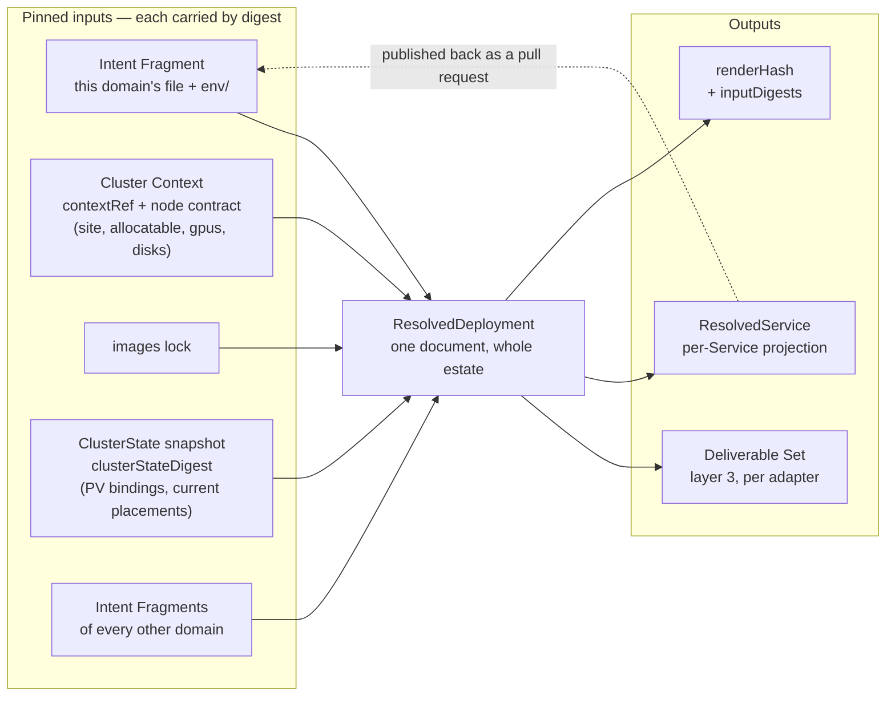
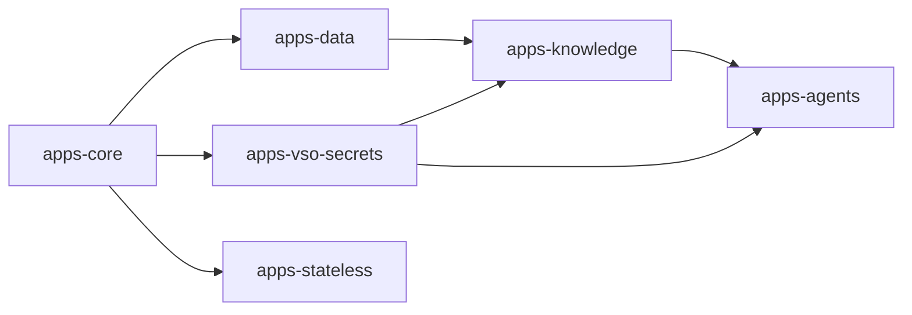

# Chapter 20 — Resolved Deployment

Layer 2. Never authored. It is where every platform decision is recorded, and it
is the reason layer 3 can contain none.

## The Resolved Deployment

The Resolved Deployment is a **versioned, reviewable artifact**: emitted on every
render, validated against its own schema, and diffed against the previous render
as part of the change under review
([0029](../../docs/adr/model/0029-resolved-deployment-versioned-artifact.md)). A
reviewer reads that diff and sees what the platform decided on their behalf,
including decisions nobody asked for.

Two kinds share one schema family:

```yaml
apiVersion: resolved.jorisjonkers.dev/v1
kind: ResolvedDeployment     # one document, the whole composed estate
---
apiVersion: resolved.jorisjonkers.dev/v1
kind: ResolvedService        # the projection published back to one repository
```

`ResolvedDeployment` covers the whole composed estate because assignments are
not separable: the tier carrying each host, the Reconcile Unit DAG, inbound-edge
derivations and the reader set of a Secret Store path are global properties
([chapter 16](16-dependencies.md)). `ResolvedService` is a **projection** — the
slice belonging to one Service, obtained by filtering and never computed
separately, so the two cannot disagree about what was decided.

The version is the data model's own semver, not the package's
([chapter 40](40-composition.md#versioning)), so a field appearing in an artifact
is attributable to a model change rather than to a release. That matters here
because the estate has already paid for the alternative:
`schemas/deployment.schema.json` pins `apiVersion` to the bare const
`deployment.jorisjonkers.dev` while five sibling schemas carry a version segment,
and the only versioned deployment apiVersion in the tree,
`deployment.jorisjonkers.dev/v2` (`src/deployment/v2-model.ts:65`), names the
*authoring* shape. Two incompatible documents therefore share one name, and
`validate deployment` (`src/cli.ts:343`) dispatches on the bare const and rejects
the resolved shape on `/apiVersion`. The estate wrote that up as a trap rather
than fixing it.

An artifact nobody diffs is the documented-but-unversioned option wearing a
directory name. This repository already contains one resolved tree —
`fixtures/deployment/golden/` — and `grep -rn 'deployment/golden' test/ scripts/
.github/ package.json` returns nothing. The decision is therefore the emission
**and** the gate: render, validate, diff, review.



One domain file is one Intent Fragment
([0063](../../docs/adr/model/0063-intent-authored-per-domain.md)), so the input a
Service owner edits and the input composition unions are the same document. The
two node-facing inputs are deliberately drawn apart: what a node **can hold** is
declared in the node contract and pinned with the Cluster Context; what the
cluster **currently holds** is observed into the ClusterState snapshot. They
answer different questions and are never read for each other's
([Cluster state](#cluster-state)).

The registered adapters accept the Resolved Deployment and nothing else
([chapter 30](30-deliverables.md#the-adapter-port)), so an adapter change cannot
relocate a decision into layer 3 unnoticed: an empty artifact diff across such a
change proves it did not.

## Authority

**A value is platform-arbitrated if and only if it must be unique across the
estate or draws on a shared finite resource; every other value is
Service-declared and carried through untouched**
([0004](../../docs/adr/model/0004-contention-decides-authority.md)). One question —
does the value contend? — replaces a per-field negotiation.

Three readings of the rule matter, and none is an exception to it:

- **Contention decides who *arbitrates*, not who *authors*.** A contended value
  does not silence the Service; it means the Service does not get the last word.
  The Service states its requirement, and the platform decides whether it fits
  and where. Placement forced this reading and settles it. `memory` and `cpu`
  are required on every Workload and authored there as raw quantities
  ([0061](../../docs/adr/model/0061-placement-is-hard-dimensions.md)), and both are
  draws on a finite pool. An authors-only reading of the rule would have to
  forbid the field, which leaves the estate exactly where it is — BestEffort on
  every pod, because a number no Service may write is a number nobody writes.
  The platform arbitrates against node `allocatable` published by the node
  contract ([0056](../../docs/adr/model/0056-node-facts-single-source.md)) and refuses
  what no node can hold with `E_PLACEMENT_UNSATISFIABLE`.
- **Uniqueness alone is not contention.** A value that must be unique but is
  drawn from no finite pool is *declared* by the Service and *checked* at
  composition; there is nothing to arbitrate. A value drawn from a shared finite
  pool is *arbitrated*, and only the platform can arbitrate. The table's
  `placed by` column records which reading placed each row.
- **The rule places values someone must state.** A derived value is stated by
  nobody: it is a function of the rows above it, which is what
  [0005](../../docs/adr/model/0005-derivation-is-total.md) claims is always possible.
  Whether such a value may be overridden is settled in
  [Overrides](#overrides), not here.

The cost of the first reading is accepted and named here rather than discovered
later: **nothing stops an author writing `memory: 8Gi`.** The rule places
arbitration, not restraint, and the arbitration that exists today is a single
eligibility test against one node's allocatable. Every Workload in the estate
could claim 8Gi, every one of them would pass against `frankfurt-contabo-1`'s
32768Mi, and the only thing that would refuse is the scheduler, at apply, for
whichever pods arrive last. That is [open item 5](#open-in-this-chapter).

The estate is the argument for having a rule at all. One hostname,
`kb.jorisjonkers.dev`, ended up declared in seven authoritative places across
three repositories — `homelab-inventory/catalog/reachability.yml`, three
`fleet-infra` manifests, a bearer-token secret and the service's own
`platform/deployment.yml` — plus hardcoded in `ServicePermission.kt`, with two
conformance tests existing for no purpose but detecting when the seven disagree.
The guard was cheaper to write than the fix.

The `placed by` column takes five values:

| value | meaning |
|---|---|
| `no contention` | the Service has the last word |
| `unique — checked` | estate-unique, declared by the Service; a collision is a build error |
| `unique — arbitrated` | estate-unique and drawn from no set the Service can see |
| `pool` | a draw on a shared finite resource, decided by the platform |
| `pool — stated` | a draw on a shared finite resource the Service states and the platform arbitrates |

This table is the only place field authority is stated. Records needing a
field's placement link to this anchor rather than copying rows.

| field | authority | placed by | note |
|---|---|---|---|
| `domain` | Service | no contention | the file header, and the unit of fragment publication ([0063](../../docs/adr/model/0063-intent-authored-per-domain.md)); the namespace derives from it |
| `owner` | Service | no contention | the only field raised to the domain header; notification target, never routing |
| `id` | Service | unique — checked | estate-unique; `E_DUPLICATE_SERVICE_ID` at composition. It is also the atomic release boundary ([0062](../../docs/adr/model/0062-service-is-the-release-unit.md)) |
| `alertClass` | Service | no contention | urgency, per Service and never raised — a domain would page as loudly as its loudest member |
| workload `name` | Service | unique — checked | unique within the **domain**; `E_DUPLICATE_WORKLOAD_NAME`, and it names the derived identity |
| `provides` surface names and ports | Service | no contention | declared on the Workload, because a port is a property of a process; written once, there |
| `dependsOn` edges | Service | no contention | provider, surface, necessity ([chapter 16](16-dependencies.md#dependency-edges)) |
| `image`, `runtime`, `lifecycle`, `stateful` | Service | no contention | what the Workload is |
| env files, `assets` | Service | no contention | per Workload; derived values appear only as placeholders |
| `secrets` grants — `path`, `keys`, `access`, `delivery`, `rotation` | Service | no contention to declare | per Service and never raised; the *path* is arbitrated (below), what a Service asks of a path is its own |
| `exposure[].name` | Service | unique — checked | required; unique **within the Service**, `E_DUPLICATE_EXPOSURE_NAME` at composition. It is the half `${exposure:<service>.<name>#url}` addresses |
| `exposure[].host` | Service | unique — checked | the full FQDN, authored — no label, no zone rule, no apex flag. Estate-unique across the composed union taken together with the register of unmanaged surfaces: `E_DUPLICATE_HOST` ([chapter 40](40-composition.md#identity)) |
| `exposure` `audience`, and a route's `audience` override | Service | no contention | one closed audience vocabulary; the per-route form is the anonymous path inside an authenticated host |
| `exposure[].contentPolicy` | Service | no contention | `strict`, `admin` or `workflow`. Which profile an application needs is a fact about the application; the header set it selects is derived |
| `exposure[].routes` — `path`, `match`, `workload`, `surface`, `redirectTo` | Service | no contention | which of the Service's own Workloads serves which path of the host. The surface must be one that Workload `provides` (`E_UNKNOWN_SURFACE`); no two routes may share a `path` + `match` pair (`E_DUPLICATE_ROUTE_MATCH`); `redirectTo` is a path, never a regex |
| `probes`, `startupBudget`, `zeroDowntime` | Service | no contention | what only the Service knows about its own start and health |
| `hardening` and its exceptions | Service | no contention | the class is declared; each exception names itself and carries a reason ([0016](../../docs/adr/model/0016-pod-hardening.md)) |
| `volumes[].durability` | Service | no contention | what the data is worth cannot be observed |
| `placement.memory`, `placement.cpu` | Service | pool — stated | required on every Workload; the Service states the requirement, the platform arbitrates it against node allocatable |
| `placement.gpu` | Service | pool — stated | `class` and `memory`, matched against the node contract's `gpus[].class` and `gpus[].memory_mib`; a card is held by one Workload at a time |
| `placement.disk` | Service | pool — stated | a `media` set; it filters the first placement and the PV binding wins thereafter — `E_DISK_BINDING_CONFLICT` |
| `volumes[].size` | Service | pool — stated | how much data the volume holds, matched against the node contract's `disks[].usable_gib`; no eligible node is `E_STORAGE_UNSATISFIABLE` ([0081](../../docs/adr/model/0081-volume-size-is-a-hard-dimension.md)) |
| PVC capacity and the disk capacity filter | derived | — | the volume's `size`, and their sum per Workload for placement |
| `placement.arch`, `.site`, `.capabilities` | Service | no contention | filters over facts the node contract publishes; a list is a set of equally acceptable values, never a ranking |
| `observability.scrape` | Service | no contention | port and path of its own metrics surface |
| `writablePaths` | Service | no contention | which paths the process must write; the size of each is platform-assigned ([0092](../../docs/adr/model/0092-writable-paths-are-declared.md)) |
| `volumes[].durability` | Service | no contention | what losing the data costs; only the owner knows ([0015](../../docs/adr/model/0015-durability-class-per-volume.md)) |
| `engine` | Service | no contention | what the process is, which the platform keys its backup method off ([0078](../../docs/adr/model/0078-engine-is-workload-vocabulary.md)) |
| `overrides` | Service | no contention | a derived value restated with a recorded reason ([Overrides](#overrides)) |
| route tier | platform | pool | the shared edge is finite; `E_NO_TIER_FOR_AUDIENCE` where no tier carries the audience |
| middleware chain | platform | pool | tier + audience + `contentPolicy`; `forward-auth` for `authenticated` on a public tier, the security-headers baseline with the named content profile, and the redirect rule a route's `redirectTo` asks for |
| backup window, retention count, off-cluster destination | platform | pool | one policy per Durability Class; the window is one node's IO and the destination is one remote target ([0077](../../docs/adr/model/0077-durability-derives-a-backup.md)) |
| the backup method — image, command, arguments | platform | pool | keyed by `engine`, arriving with the blueprint packs |
| alert rules, their severity and their receiver | platform | pool | the rule catalog keyed by `scrape` and `engine`; severity and receiver from `alertClass` ([0079](../../docs/adr/model/0079-alert-class-derives-from-a-rule-catalog.md)) |
| scrape `interval` and `scrapeTimeout` | platform | pool | the metrics stack's ingest budget is shared; stated in the Cluster Context, never defaulted |
| the backup identity's grant on the destination | platform | pool | derived, never authored: the platform chose the destination, so it owns the credential |
| Reconcile Unit and its ordering | platform | unique — arbitrated | one estate-wide DAG ([The Reconcile Unit](#the-reconcile-unit)) |
| identity name, Vault role, Vault policy | platform | pool | named for the **Workload alone**; the auth role namespace is shared ([chapter 16](16-dependencies.md#workload-identity)) |
| Secret Store path layout and grants | platform | pool | one path per reader set; `E_SUBTREE_PREFIX_COLLISION` across Subtrees ([chapter 40](40-composition.md#identity)) |
| image digest | platform | unique — arbitrated | one image reference resolves to one digest estate-wide, from the pinned images lock |
| eligible node set, `nodeSelector` and affinity | platform | pool | every declared dimension matched against the node contract; no eligible node is `E_PLACEMENT_UNSATISFIABLE` ([Derived mechanics](#derived-mechanics)) |
| recorded PV binding | platform | pool | one `local-path` PV lives on one node; read from the ClusterState snapshot |
| `replicas` | derived | — | **1**; more than one is an override with a reason ([0089](../../docs/adr/model/0089-replicas-derived-no-minavailable.md)) |
| `PodDisruptionBudget` | derived | — | emitted only where `replicas` exceeds one, as `maxUnavailable: 1`; a budget over a single replica is a drain deadlock |
| `namespace` | derived | — | `<domain>-system`, and nothing else ([0063](../../docs/adr/model/0063-intent-authored-per-domain.md)); several Services share one by construction |
| requests and limits | derived | — | from `placement.memory` and `placement.cpu`: memory request equals memory limit, cpu request with no cpu limit |
| `securityContext` | derived | — | from `hardening` and its declared exceptions |
| `automountServiceAccountToken` | derived | — | `true` only where a grant carries `delivery: self`; the pod authenticates in that case and in no other ([0087](../../docs/adr/model/0087-token-mounted-only-for-delivery-self.md)) |
| the `emptyDir` per writable path, and its `sizeLimit` | derived | — | one mount per declared path, sized from the Cluster Context's ephemeral default ([0092](../../docs/adr/model/0092-writable-paths-are-declared.md)) |
| `runAsUser`, `runAsGroup`, `fsGroup` | derived | — | the `uid` and `gid` the images lock resolved; `fsGroup` only where the Workload holds a volume ([0082](../../docs/adr/model/0082-images-lock-carries-uid-and-gid.md)) |
| container probe timings | derived | — | the startup probe's target from the **liveness** declaration and its period from `startupBudget`; readiness and liveness cadence from the Cluster Context's probe policy ([0088](../../docs/adr/model/0088-startup-probe-targets-liveness.md)) |
| `progressDeadlineSeconds` | derived | — | from `startupBudget` |
| rollout strategy, surge, unavailability | derived | — | from `zeroDowntime` and `volumes` |
| object kind | derived | — | from `lifecycle`, `stateful` and `volumes` |
| the Service's release-gate deadline | derived | — | `max` over the Service's Workloads of `progressDeadlineSeconds` ([The release gate](#the-release-gate)) |
| the object label set | derived | — | fixed, from Workload name, Service Id and the images lock ([chapter 10](10-service-intent.md#the-label-set)) |
| Secret and VSO sync objects | derived | — | from grants with `delivery: env` or `file`, plus `rolloutRestartTargets` from `rotation` |
| env entries and `envFrom` refs | derived | — | from env files, after placeholder resolution — including `${identity:…}`, the Workload's own derived facts ([0091](../../docs/adr/model/0091-identity-placeholders-not-framework-wiring.md)) |
| dependency coordinates | derived | — | from the edge set and the provider's surfaces, bound to the key the consumer chose |
| Runtime Profile values | derived | — | from `runtime` |
| ServiceMonitor, PrometheusRule | derived | — | from `scrape` and `alertClass` |
| notifier route | derived | — | from `alertClass` and `owner` |
| backup job and retention sweep | derived | — | from `volumes[].durability`; `reconstructible` renders none |
| NetworkPolicy set | derived | — | from the edge set, exposure, grants, plus the baseline ([chapter 16](16-dependencies.md#network-policy)) |

A field the rule cannot place falsifies
[0004](../../docs/adr/model/0004-contention-decides-authority.md) and forces an
amendment to the rule — never an exceptions row in this table.

### The hostname changed sides

Until this amendment the table carried two rows for one value: a Service-declared
*label*, and a platform-arbitrated *fully-qualified hostname* assembled from that
label, the tier's hostname policy and the cluster domain. There is no such
assembly to run. `knowledge` serves `kb`, `platform-rabbitmq` serves `rabbitmq`,
`knowledge.jorisjonkers.dev` and `kb.jorisjonkers.dev` both resolve, and `root`,
`status`, `dashboard` and `faro` belong to no Service at all
— so a hostname policy would be right for most hosts and silently wrong for the
rest, and the wrong ones are the ones nobody would check. `host` is therefore
authored in full on the Service's `exposure` entry and carried through untouched
([0018](../../docs/adr/model/0018-exposure-by-audience.md)); both old rows are gone,
replaced by one.

That is the rule's second reading, not an exception to it. A hostname must be
unique across the estate and draws on no pool the platform holds, so the Service
declares it and the **uniqueness check is arbitrated at composition**:
`E_DUPLICATE_HOST` over the composed union taken together with the Registered
Unmanaged Surfaces ([chapter 40](40-composition.md#identity)). Nobody's fragment
wins a contested host — the union fails and no `ComposedIntent` is produced until
an author changes one of them. Contention decided who arbitrates, not who
authors, which is the same restatement `placement` forced
([0004](../../docs/adr/model/0004-contention-decides-authority.md)).

What stays on the platform side of this path is everything mechanical about the
edge: the tier that carries the audience, and the middleware chain that follows
from the tier, the audience and `contentPolicy`. The authored proxy vocabulary is
exactly two fields — `contentPolicy` on an exposure and `redirectTo` on a route —
and no Service names a middleware, an entryPoint or a TLS resolver.

### The namespace row was wrong, and this is the correction

Until this amendment the table derived `namespace` from `id`, with a per-Service
exception field that could name a different namespace and record a reason. Both
halves of that rule are retired, because the rule was wrong about this estate.

Namespaces here have never been per Service. They have always been per domain,
and there are ten of them — `auth-system`, `data-system`, `knowledge-system`,
`app-system`, `agents-system`, `mail-system`, `media-system`, `notes-system`,
`automation-system`, `utility-system` — each of which equals `<domain>-system`
today. Deriving from `domain` renames nothing and moves no live object.

The exception field existed only because the rule pointed at the wrong input.
`home-portal` is the repository and the product, so the id rule derives
`home-portal-system`: a namespace that does not exist and never has. The Service
runs in `app-system`, because its domain is `app`. Once the derivation reads
`domain`, `app-system` falls out directly and there is nothing left for an
exception to express — which is why the field is deleted rather than narrowed.

Two consequences follow, and both are now the normal case rather than a
footnote to an exception:

- **`namespace` is derived, not arbitrated.** It leaves the platform half of
  this table. There is no pool to draw from and no collision to resolve, because
  a namespace is shared on purpose. A Service owner can therefore read their own
  namespace out of their own file, which is the one decision
  [Publish back](#publish-back) no longer has to tell them about.
- **A namespace is not a trust boundary.** It holds several Services by
  construction, so no isolation claim may rest on a namespace wall. Isolation is
  the derived default-deny edge set
  ([0035](../../docs/adr/model/0035-network-policy-default-deny.md)), evaluated per
  pod, plus per-Workload identity
  ([0024](../../docs/adr/model/0024-identity-per-workload.md)) — and nothing else.

## Pinned inputs

> **Every assignment is a pure function of the pinned input set: Service Intent,
> the pinned Cluster Context and the node contract it carries, the locks, and
> the ClusterState snapshot — each carried by digest.** Identical inputs,
> identical output, always.

The set is **closed**. No assignment consults live cluster state, a mutable
pool, a counter, or state remembered between renders. There is no allocation
registry and no assignment state, which is why `renderHash` means something and
why publishing assignments back to a service repository cannot drift.

Placement is the case that tests the rule hardest, and it stays inside it.
Every declared dimension is matched against node `allocatable` — the node's
total minus a reserve declared in the same node file, published by the node
contract ([0056](../../docs/adr/model/0056-node-facts-single-source.md)) and pinned
with the Cluster Context. It is never matched against free capacity read from a
cluster, which is not a pinned input and cannot be made into one: free capacity
changes with every pod that starts anywhere in the estate.

The rule has teeth because it forces a decision whenever something cannot be a
pure function of what is pinned. Such a value moves **up** into layer 1, where
it is declared and checked; **sideways** into the Cluster Context, where it is
platform data republished deliberately; **into the node contract**, where it is
a node fact authored once and generated from
([chapter 60](60-setup.md#node-facts)); or **into the ClusterState snapshot**,
where it is an observed fact captured once and digested
([Cluster state](#cluster-state)). It may not stay in layer 2 as remembered
state, and it may not be read ad hoc. Anything a future assignment needs is
first a schema change to a pinned input, and only then a feature.

The artifact carries what makes it reproducible, reusing the fields
`artifact-contract.schema.json` already defines: `renderHash`, `inputDigests`
(`intent`, `imagesLock`, `clusterState`), `contextRef` as an OCI digest,
`adapterCompat.digest`, and `schemaPackageIntegrity`.

Two properties follow, and both are conditional on the whole digest set:

1. **Reproducibility.** Re-rendering from *identical* recorded digests —
   `clusterStateDigest` included — yields a byte-identical Deliverable Set and
   the same `renderHash`. A mismatch under identical digests means an input was
   not pinned, which is a defect in the lock or the renderer, not weather.
2. **Attributable change.** If `renderHash` changes, at least one `inputDigests`
   entry changed. There is no third possibility, because nothing is remembered
   between renders.

The earlier, unconditional form of property 1 misfired exactly when it mattered.
A re-render taken after a node failure rebound a PersistentVolume legitimately
differed from the render at merge time with every recorded digest identical, and
the diagnostic reported a lock defect where the truth was a changed cluster fact.
Enlarging the pinned input set repairs the property instead of weakening it.

The settling test is a **double render**: render twice from identical pinned
inputs, at different times and on different machines, and byte-diff the output
trees. Any difference — map ordering, timestamps, absolute paths — falsifies the
premise and must be fixed in the renderer before the gate is trusted.

## Cluster state

Some assignments need facts the cluster alone can supply: which node holds a
bound PersistentVolume, and where a Workload currently runs. Those facts are
captured **once**, by a read-only collector, into a snapshot that is digested
and pinned like every other input
([0034](../../docs/adr/model/0034-cluster-state-pinned-input.md)). Assignments read
the snapshot. Nothing reads the live cluster.

| the snapshot enumerates | used by |
|---|---|
| PersistentVolume bindings, with the node holding each | recording where a Workload's data already sits; `E_DISK_BINDING_CONFLICT` where a declared `disk` dimension contradicts the binding |
| current placements | detecting a move before it is rendered |

**What a node can hold is not on that list.** `allocatable`, `site`, `arch`,
`gpus[]` and `disks[]` are *declared* platform facts: authored once per node and
published by the node contract
([0056](../../docs/adr/model/0056-node-facts-single-source.md)), pinned with the
Cluster Context, never observed. Placement reads them there and only there.
[0034](../../docs/adr/model/0034-cluster-state-pinned-input.md) enumerates node
capacity among the snapshot's facts because it predates the node contract
carrying `allocatable`; the spec is normative, and that record is the one that
gets fixed.

The distinction is not bookkeeping. Observed capacity is free capacity, and free
capacity is a function of whatever else was scheduled when the collector ran:
the same Workload would be eligible at 03:00 and ineligible at 09:00 with no
input of its own changed, and the build result would depend on the hour.
Matching declared requirements against declared allocatable is
**eligibility, not bin-packing** — three Workloads each declaring `memory: 2Gi`
all pass against a 4096Mi node, because each is compared against allocatable
alone. The scheduler refuses the third at apply. That is the accepted cost of
keeping the answer a pure function of pinned inputs, and it is why the estate
still needs the arbitration [open item 5](#open-in-this-chapter) names.

**The PV binding outranks the `disk` dimension.** `disk` filters where a volume
may first land; once the PersistentVolume exists, the binding recorded in the
snapshot is the fact. A `disk` dimension that no longer admits the node holding
the bound volume is `E_DISK_BINDING_CONFLICT` at composition — a build error,
never a silent re-placement, because moving the data is a state-move-plan and
not a re-render.

Four documents must not be conflated:

| | node contract | ResolvedDeployment | ClusterState snapshot | live health document |
|---|---|---|---|---|
| answers | what a node can hold | what should be true | what was true when we decided | what is true now |
| source | one authored YAML file per node, generated from | the pinned inputs | one read-only capture, digested | the cluster, continuously |
| pinned | yes — with the Cluster Context | it *is* the output | yes — `clusterStateDigest` | no |
| changes | when a node is re-declared | when an input changes | when the collector runs | continuously |

The fourth is the existing `schemas/cluster-state.schema.json` — `flux_ready`,
`observed_image_digest`, `gatus_status`, `last_reconcile`. It is **not** the
pinned input and cannot become it: its digest would move on every reconcile, and
it carries neither PV bindings nor node facts, which are precisely what the
assignments need. Promoting it would make one document answer both "what is
true" and "what was true when we decided".

Two rules follow.

**Re-render from the recorded snapshot, never a fresh one.** Any render that
reproduces a recorded lock — a verification, an audit, a scheduled
re-reconciliation — reads the snapshot that lock names. Capturing afresh
reclassifies weather as a lock defect and destroys property 1.

**A changed cluster fact is a new lock.** When a PV rebinds after a node
failure, the next capture produces a new `clusterStateDigest`, and the
assignment that follows the data is a visible decision someone lands — with a
state-move-plan where the volume's Durability Class requires one — not a silent
correction between renders.

This is also what makes two long-standing contradictions expressible. Placement
against a bound PV, and a `replicas` assignment bounded by the eligible node
set, are pure functions of pinned inputs — the snapshot for the binding, the
node contract for what each node can hold. Reading either from the *live*
cluster remains forbidden; the difference is the digest.

Between captures the estate renders against facts that may already be stale.
That cost is accepted and named: a render is correct as of its snapshot, and the
snapshot's age is on the artifact.

## Derived mechanics

A Service declares what only it can know — its cold-start budget, whether it
requires zero-downtime rolls, which paths answer readiness and liveness, what a
volume's data is worth, what it can survive when an input changes — and what
only it can state: how much memory and cpu each of its Workloads needs. Probe
timings, rollout strategy, surge and unavailability, progress deadlines, health
timeout classes, object kind, resource requests and limits, pod hardening,
backup jobs and retention sweeps all follow
([0030](../../docs/adr/model/0030-runtime-mechanics-derived.md)).
**None of the derived values may be authored**, and writing one in an env file
or a Service document is a build error ([chapter 10](10-service-intent.md)).

The rollout configuration is the evidence. All four first-party deployments
carry the same pattern — `RollingUpdate` with `maxSurge: 1` and
`maxUnavailable: 0`, `startupProbe` at `periodSeconds: 5` and
`failureThreshold: 120`, readiness and liveness at `timeoutSeconds: 5`, and
`progressDeadlineSeconds: 1800` on the three JVM services — and the comments
record what it cost to arrive there: *"under `Recreate` every image roll opened
a zero-pod window, so a slow cold start or a flaky ghcr image pull took the MCP
fully down (503)"*; *"JVM cold start (~250–300 s); the 600 s startupProbe budget
covers it"*. Four identical blocks is one derivation performed four times by
hand, with the reasoning trapped in comments no tool can read.

Five rules carry most of the weight:

- **Strategy is a function of volumes, not a preference.** A `ReadWriteOnce`
  volume cannot attach to two pods at once, so a Workload holding one renders
  `Recreate`. Estate-wide the split is 21 `Recreate` to 9 `RollingUpdate`, and
  every RWO holder is on the `Recreate` side. The renderer today reads an
  authored enum (`src/adapters/kubernetes.ts:608`) and inspects no volume, which
  is a trap: a stateful Workload whose author forgets `strategy: recreate` gets
  `maxSurge: 1` against an RWO volume, appears to work on one node, and wedges
  the first time a second worker exists.
- **The progress deadline must exceed the startup budget, strictly.** It derives
  as budget × 3, floored. The current renderer emits `600` against a 600-second
  budget, so a JVM still inside its legitimate startup window is marked
  `ProgressDeadlineExceeded`.
- **There is no health timeout class.** The generation being replaced carried a
  table over declarations — `stateless: 5m`, `stateful: 10m`,
  `control-plane: 15m`, `job: 10m`
  (`src/schemas/health-timeout-map.ts:1-6`), strongest class across a Service —
  and it is a second derivation over the same input as
  `progressDeadlineSeconds`. The two already disagree: `auth-api` declares a
  600-second `startupBudget`, derives an 1800-second deadline, and its class
  gives up at 5 minutes on a Workload the model says may legitimately take ten.
  One input has one derivation, and the Service-scoped number that a switchover
  waits on is the release-gate deadline below.
- **Durability derives objects, not just a label.** A volume of class
  `recoverable` derives a backup `CronJob` and a retention sweep; `irreplaceable`
  derives both plus an off-cluster copy and a derived grant for the destination;
  `reconstructible` derives nothing. The schedule, retention and destination come
  from the platform's per-class policy and the method from the Workload's
  `engine`, so two Services of the same class and engine derive the same objects
  with different volumes — which is the property that makes a restore rehearsal
  meaningful ([0077](../../docs/adr/model/0077-durability-derives-a-backup.md)).
- **Hardening is a class.** It defaults to `restricted` — `runAsNonRoot`,
  `readOnlyRootFilesystem`, all capabilities dropped, seccomp `RuntimeDefault` —
  and each declared exception names itself and carries a reason
  ([0016](../../docs/adr/model/0016-pod-hardening.md)).
- **Capacity is not a class.** Requests and limits no longer resolve through a
  named table in the Cluster Context; they derive from the raw quantities the
  Workload declares, under two shape rules the author does not write. Memory
  request **equals** memory limit, because memory is incompressible and an OOM
  kill beats eviction roulette. Cpu is a request with **no** limit, because
  throttling gets misdiagnosed as slow application code
  ([0061](../../docs/adr/model/0061-placement-is-hard-dimensions.md)). One number per
  dimension goes in, the shape stays derived, and the escape is an override with
  a reason ([Overrides](#overrides)).

Neither hardening nor resources exists in either renderer today:
`grep -rniE 'securityContext|runAsNonRoot|readOnlyRootFilesystem|seccompProfile'
src/ schemas/` returns 0 hits, so every rendered pod runs as its image's UID
with a writable root and no reservation at all — BestEffort is the estate's
standing QoS class, and ending that is what `memory` and `cpu` being required
on every Workload buys.

### Layer 2 does not assign a node

Earlier drafts said layer 2 decides "which node". That is wrong. Kubernetes
schedules pods; the platform only constrains where they may land. Layer 2
computes an **eligible node set** from the placement dimensions the Workload
declared ([chapter 10](10-service-intent.md#placement)) matched against the node
contract, and emits a **selector and an affinity** that express it.

Every dimension is hard. A list is a set of equally acceptable values — `arch:
[arm64, amd64]` is a fallback written down, not a ranking — and there is no soft
term the scheduler may quietly discard. The estate already paid for the soft
half: a preference naming `gpu-model-gtx960m`, a label no node advertised, was
dropped by the scheduler with no event, no warning and no condition, and read
for months as GPU-aware placement while doing nothing. An eligible set of zero
is therefore `E_PLACEMENT_UNSATISFIABLE` at build time, not a `Pending` pod at
apply time. The same reasoning retires a capability advertised by 7 of 7 nodes:
a filter that never excludes anything teaches authors that filters do nothing.

The case that looks like a node assignment is not a scheduling decision either.
A `local-path` volume binds to the node holding its PersistentVolume; that
binding is a fact read from the pinned ClusterState snapshot, so recording it is
an assignment like any other — a pure function of an input, carrying the
provenance of the digest it came from. What it is not is a re-schedulable
choice: moving the data requires a state-move-plan, not a re-render, and a
declared `disk` dimension that contradicts the binding is
`E_DISK_BINDING_CONFLICT` rather than a quiet move.

### The forward-auth endpoint

The middleware chain is derived, and one of its members needs an address: a
forward-auth Middleware must name the endpoint that performs the check. **The
tier names it** ([0076](../../docs/adr/model/0076-middleware-has-one-producer.md)).
A tier in the Cluster Context that serves the `authenticated` audience carries
the address of the endpoint that authenticates for it, beside the audiences it
serves; a tier that serves no `authenticated` route carries no such field and
needs none.

It is not derived from the authenticating Service's own surface. `auth-api`'s
estate-wide role *is* this middleware
([chapter 10](10-service-intent.md#service-identity)), and resolving it as if it
were a dependency edge would make the edge tree depend on resolving a Service
and would write one Service's id into a platform derivation. It is a platform
fact, so it sits where platform facts sit — the Cluster Context, pinned by
digest ([Pinned inputs](#pinned-inputs)).

A route declaring `audience: authenticated` on a tier whose declaration carries
no endpoint is `E_NO_FORWARD_AUTH_ENDPOINT`, checked when the chain is derived
rather than discovered as a 500 at the edge.

## The release gate

A Service is the Release Unit, and no member's new version receives traffic
until every member's new version is healthy
([chapter 50](50-lifecycle.md#release-unit-switchover)). *Performing* the switch
belongs to delivery, which is defined separately. What the model owes is the
gate's **inputs**, and it owes them as a derivation rather than as an object
([0071](../../docs/adr/model/0071-release-gate-inputs-are-layer-2.md)).

Layer 2 therefore carries, per Service:

| field | derived from |
|---|---|
| the member list | the Service's Workloads; membership is structural |
| each member's readiness reference | that Workload's `probes.readiness` — its `path` + `port`, or its `tcp` port |
| the gate deadline | `max` over the members of `progressDeadlineSeconds`, itself `startupBudget × 3` |

`max` is the reading "held, not partial" requires: the unit waits for its
slowest legitimate starter. `auth` declares a 600-second budget on `auth-api`
and 30 seconds on `auth-ui`, so its gate deadline is 1800 seconds — the API's,
because a UI that is ready in 30 seconds must still not receive traffic while
the API it talks to is inside its own legitimate startup window.

**Nothing is rendered for the gate.** The inputs live in the Resolved
Deployment and in each Service's projection, which is where decisions live and
where a delivery mechanism reading a pinned lock already looks
([0006](../../docs/adr/model/0006-pinned-inputs.md)). Layer 3 emits the fixed
label set ([chapter 10](10-service-intent.md#the-label-set)) and nothing else on
the Service's behalf: an object no controller consumes is the defect
`app.kubernetes.io/instance` already is, and rendering a second one would not
make the gate real.

A Service whose Workloads all declare `probes: none` publishes no readiness
signal and cannot be gated — `E_RELEASE_UNIT_NO_READINESS`, checked at
composition time ([chapter 40](40-composition.md#completeness)), not discovered
by a delivery mechanism at apply time.

## The path plan

Layer 2 assigns **every output path**
([0070](../../docs/adr/model/0070-path-authority-is-layer-2.md)). The Resolved
Deployment carries, for each object to be rendered, the Adapter that owns it and
the path it is written to. Layer 3 serialises what it is handed and chooses
nothing.

The rule follows from the layer rule rather than adding to it. A path is a
decision: it says which directory owns an object, and therefore which
kustomization includes it, which Reconcile Unit applies it, and who is
answerable for the field. A decision taken while serialising appears in no
schema, is recorded in no lock, and is invisible in the projection its owner
reads back.

Two live cases show that the alternative does not work. A per-domain object —
`namespace.yaml`, and the namespace-wide default-deny — is one object per
domain, while an Adapter keyed off the Service emits one directory per Service:
`auth` has one Service and nothing collides, `data` has three and produces three
identical Namespace objects at three paths. And an estate-scoped Deliverable,
the Gatus endpoints ConfigMap, lands in `utility-system` rather than in the
namespace of the Service that motivated it. Under an adapter-computed path both
are accidents of who ran last; under a path plan both are assignments, with one
owner and a recorded reason.

The consequence for the build is a check that arrives earlier. `E_PATH_COLLISION`
is decidable when the plan is assembled, before any Adapter runs, because the
complete set of paths is known at that point. Two Adapters claiming one path is
a defect in the plan.

## Overrides

A derived value is **overridable with a reason**; an assignment is not
([0031](../../docs/adr/model/0031-derived-overrides-with-reason.md)).

```yaml
overrides:
  - field: progressDeadlineSeconds
    value: 600
    reason: nginx pods, ~10-20Mi RAM each; a 1800s deadline is 3x the real budget
```

The exception already exists in the tree: `app-ui` runs
`progressDeadlineSeconds: 600` while the three JVM services run `1800`, and a
JVM cold start and an nginx start are genuinely different. One rule over one
input cannot be right for both.

Refusing the hatch does not buy a better rule; it buys a falsified input. The
deadline derives from the Startup Budget, and so do the startup probe's period
and failure threshold — its target comes from the liveness declaration
([0088](../../docs/adr/model/0088-startup-probe-targets-liveness.md)). An owner who needs 600 and cannot say so declares a
200-second budget to coax the number out — corrupting the one field only they
could know and mis-deriving the probe along with it. The lie is invisible; an
override is not. Requiring a reason makes the rationale data rather than a YAML
comment no tool can read.

Three boundaries:

- **Assignments are outside the hatch.** Every row of the
  [Authority](#authority) table whose authority is *platform* — route tier, the
  middleware chain it carries, the eligible node set and the selector that
  expresses it, Secret Store path, Reconcile Unit, image digest — may not be
  overridden. They arbitrate shared resources, and a local override
  reintroduces exactly the collision arbitration exists to prevent, at the
  layer with no arbiter. Widening a
  selector past what the declared dimensions admit is not a correction; it is a
  `Pending` pod with the diagnostic removed. A Workload that should run
  somewhere else edits `placement` in its own file, which is authored intent and
  needs no hatch; a Service wanting a different assignment goes through
  arbitration and [Publish back](#publish-back). `host` left this list with the
  hostname row it used to sit in: it is authored, so an owner wanting a different
  one edits their own `exposure` entry and there is nothing derived to override.
- **`namespace` is derived and still not overridable.** It is the one derivation
  the hatch does not cover, and the reason is the hatch's own argument. The
  hatch exists because a derivation's inputs can be too poor to state the truth,
  so refusing it buys a falsified input. Nothing here is too poor to state:
  `<domain>-system` has exactly one input, the author writes it, and an author
  who wants a different namespace changes `domain` — one edit, in the open,
  which moves the Service to another file and another fragment. An override
  would buy nothing except a second way to say where a Service lives, and a
  second record of one fact drifts.
- **`hardening.exceptions` is the same shape for a different surface.** A
  Workload that cannot meet the default class names the specific exception and
  its reason, in the shape used here.

Two costs are accepted. Overrides cannot be enumerated estate-wide, so a dead
override looks identical to a load-bearing one and both persist; and the
dead-declaration check of [chapter 16](16-dependencies.md#the-three-properties)
cannot run over the one surface that permits hand-tuning. Both stay recoverable:
composition already reads every Intent Fragment, so a register of active
overrides is a later read over data already in hand.

## The Reconcile Unit

The Reconcile Unit is **derived from the dependency graph**, never declared
([0032](../../docs/adr/model/0032-reconcile-unit-derived.md)). A Service's unit is
`apps-<domain>`; the ordering between units is the edge set of
[chapter 16](16-dependencies.md#dependency-edges) projected onto domains, plus an
edge to the secrets-provisioning unit wherever a Service holds any grant.



An arrow means *must be Ready first*. `apps-knowledge` follows `apps-data`
because `knowledge` depends on `platform-postgres` and `platform-rabbitmq`;
`apps-agents` follows `apps-knowledge` because the agent services consume
`knowledge`, and follows `apps-vso-secrets` because they hold grants — a
Workload cannot start before the credential it holds is materialised. That is
the fourteen-node graph `fleet-infra` maintains by hand today, rendered instead.

`platform.layer` is **deleted from Service Intent**. It was a free-form string
typed `"type": "string"` with no enumeration; every Service declared `apps-core`
and not one reconciled there — `auth-api`, `agents-api` and `app-ui` land in
`apps-stateless`, `knowledge` in `apps-knowledge`, `agent-runtime` in
`apps-agents`. A field wrong in 100% of observed cases at no cost is a comment,
not a declaration. It is also inexpressible: `agents-login`'s objects appear in
two units at once, and one string cannot name two. What survives is optional and
*observed* — the unit the live health document found Flux reconciling an object
in, useful only for diffing observation against derivation, never authored, and
not part of the pinned snapshot.

Two consequences are the price. A Service owner cannot pin their reconcile
position; a wrong order is fixed by correcting the dependency declaration that
produced it. And a Service's objects may split across units with nothing
declaring that they do, as `agents-login`'s do — which is what makes a partially
applied Service hard to read. A dependency cycle becomes a build failure
(`E_DEPENDENCY_CYCLE`) rather than a reconcile deadlock.

**The Reconcile Unit orders; it does not make anything atomic.** Ordering is
derived from the graph. Atomicity is the **Service boundary itself**
([0062](../../docs/adr/model/0062-service-is-the-release-unit.md)): every Workload of
one Service switches together or none switches, and there is no mechanism to
couple two Services. The two are orthogonal — postgres before knowledge is
ordering; `auth-api` and `auth-ui` moving together is atomicity, and they move
together because they are two Workloads of one Service, not because they agree
on a name declared in two repositories. A pair that must release together and
cannot be one Service is not a missing feature; it is evidence the Service
boundary is drawn wrong.

The derived unit has one consumer in v1: the Flux `Kustomization` DAG, whose
`dependsOn` edges and health timeout class are this derivation's output. What a
push-based applier would do with the same ordering — apply its slice layer by
layer — belongs to the separately-defined delivery work in
[docs/adr/deferred/](../../docs/adr/deferred/README.md), along with everything
else about how objects reach a cluster, and with the mechanism that makes a
Service's switchover all-or-nothing. The derivation does not change if that
consumer is ever added; only the number of consumers does.

## Publish back

Because contended values are platform-arbitrated, a Service owner cannot read
their own node placement or Secret Store paths out of their own repository.
Composition therefore writes each Service's `ResolvedService` projection into
that Service's repository as a generated file —
`platform/resolved.yml` — and opens a pull request when it changes
([0033](../../docs/adr/model/0033-assignments-published-back.md)).

Two entries left this list. The namespace is now derived from `domain`, which
the owner writes in the header of the file they are already editing, so
answering "which namespace am I in" needs no published assignment at all. The
hostname followed it for another reason: `host` is authored, so the owner reads
it back out of the line they wrote
([0018](../../docs/adr/model/0018-exposure-by-audience.md)). Both still appear in the
projection, because the projection records every layer-2 decision whether or not
the owner could have predicted it — and on that path the decisions that remain
are the tier and the middleware chain, not the name.

| rule | why |
|---|---|
| generated, never hand-edited | it is output, not source |
| guarded by a drift check that fails the build when it disagrees with a fresh compose | a snapshot nobody verifies looks authoritative while being stale — `render-local.sh`'s own header records a hardcoded schema version four minor releases stale and a context digest two republications behind |
| delivered as a pull request, not a silent commit | the diff *is* the notification |

The gap this closes is an assignment that changes because of **someone else's**
change. The estate already shows an owner their own render during their own pull
request — the `deploy-preview` sticky comment, reproducible locally through the
same package CI runs. That was never the gap. When `auth-api` raises its route
tier, `knowledge`'s derived forward-auth middleware changes with it and nothing
in the `knowledge` repository is touched; a sticky comment on a pull request
nobody is opening communicates nothing. A node re-declared with a smaller
reserve does the same thing to every eligible node set in the estate.

The discipline is the one `homelab-inventory` already applies to `context/`:
committed, generated, never hand-edited, with a drift check proving it still
matches its inputs. Answering "which tier fronts me, where may I run, or what is
my Vault path" becomes a `grep` in the owner's own checkout, with no render and
no cluster access.

The cost is real and accepted: a commit-back mechanism holds write access to
every participating repository, so a bug in composition can open a pull request
in all of them at once; and an assignment change nobody needed to see still
arrives as a review request.

## Worked example — knowledge's projection

```yaml
# services/knowledge/platform/resolved.yml
# GENERATED. Never hand-edit. Written by compose; guarded by a drift check.
apiVersion: resolved.jorisjonkers.dev/v1
kind: ResolvedService
domain: knowledge
service: knowledge

provenance:
  renderHash: sha256:…
  contextRef: ghcr.io/jorisjonkers-dev/cluster-deploy-context-public@sha256:…
  inputDigests:
    intent: sha256:…                   # the knowledge domain file
    imagesLock: sha256:…
    clusterState: sha256:…             # the snapshot the bindings below were read from

assigned:
  namespace: knowledge-system          # <domain>-system — derived, not arbitrated
  reconcileUnit: apps-knowledge
  reconcileAfter: [apps-core, apps-data, apps-vso-secrets]
  healthTimeoutClass: stateful         # 10m — strongest class across the two Workloads

  exposure:                            # on the Service: one host, its routes
    public:
      host: knowledge.jorisjonkers.dev # authored; carried through untouched
      tier: public-frankfurt           # arbitrated: the tier carrying `authenticated`
      middleware: [forward-auth]       # derived from audience + tier; the
                                       # anonymous routes render without it
      routes:                          # five authored, two shown
        - {path: /mcp, match: exact,  workload: knowledge-api, surface: http, audience: anonymous}
        - {path: /,    match: prefix, workload: knowledge-api, surface: http}

  workloads:
    knowledge-api:
      serviceAccount: knowledge-api    # the Workload name alone
      objectKind: Deployment
      image: ghcr.io/jorisjonkers-dev/knowledge/knowledge-api@sha256:1ad39d5…
      probes:
        readiness: {path: /api/actuator/health/readiness, port: 8080, periodSeconds: 10, timeoutSeconds: 5, failureThreshold: 3}
        liveness:  {path: /api/actuator/health/liveness, port: 8080, periodSeconds: 10, timeoutSeconds: 5, failureThreshold: 3}
        startup:   {path: /api/actuator/health/liveness, port: 8080, periodSeconds: 5, failureThreshold: 120}
      strategy: {type: RollingUpdate, maxSurge: 1, maxUnavailable: 0}
      progressDeadlineSeconds: 1800
      resources:                       # memory request == limit; cpu request, no cpu limit
        requests: {memory: 768Mi, cpu: 250m}
        limits:   {memory: 768Mi}
      securityContext:                 # from hardening: restricted, no exceptions
        runAsNonRoot: true
        readOnlyRootFilesystem: true
        capabilities: {drop: [ALL]}
        seccompProfile: {type: RuntimeDefault}
      placement:
        declared: {memory: 768Mi, cpu: 250m, capabilities: [public-ingress]}
        eligibleNodes: [frankfurt-contabo-1]   # the one node advertising public-ingress
        nodeSelector:
          platform.jorisjonkers.dev/capability-public-ingress: "true"
      secretObjects:
        - {kind: VaultStaticSecret, path: secret/data/platform/postgres/kb}

    knowledge-ingest-worker:
      serviceAccount: knowledge-ingest-worker
      objectKind: Deployment
      strategy: {type: Recreate}       # forced: RWO volume
      resources:
        requests: {memory: 512Mi, cpu: 100m}
        limits:   {memory: 512Mi}
      placement:
        declared: {memory: 512Mi, cpu: 100m, disk: {media: [nvme], size: 100Gi}}
        eligibleNodes: [enschede-t1000-1, enschede-rx7900xtx-1]
        boundTo: enschede-t1000-1
        from: clusterState             # PV knowledge-vault-clone is bound there
        moveRequires: state-move-plan
```

Four things in that block are worth reading closely.

`exposure` sits beside `workloads:`, not inside one, because it belongs to the
Service ([0018](../../docs/adr/model/0018-exposure-by-audience.md)): a host fronts
Workloads, and the routes under it are how it picks between them. The projection
records the entry even though the owner authored `host` and every route
themselves, because the two lines they did not write are the ones worth a pull
request — `tier` and `middleware`, which change when the platform's edge changes
and not when the `knowledge` repository does. A route carrying `audience:
anonymous` derives a different chain from the same host, which is the whole
purpose of the override.

`placement.declared` echoes back what the Workload authored, beside what the
platform did with it. That is the whole of [Authority](#authority)'s first
reading on one screen: the requirement is the Service's, the eligible set and
the binding are the platform's, and the diff shows both moving. Where the two
disagree — a `disk` dimension the bound node no longer satisfies — composition
fails with `E_DISK_BINDING_CONFLICT` rather than re-placing.

`placement.boundTo` sits under `assigned:` because it *is* an assignment — a
pure function of the `clusterState` digest recorded above — and `from:` names
the pinned input it read. `eligibleNodes` beside it comes from a different
pinned input, the node contract, and would not change if the collector never ran
again. Re-rendering with the same digests reproduces both byte for byte; a
rebound volume produces a different `clusterStateDigest` and therefore a new
lock, which someone lands deliberately.

Two identities appear because `knowledge` has two Workloads
([chapter 16](16-dependencies.md#workload-identity)), and each is named for its
Workload alone: `knowledge-system.knowledge-api`, never
`knowledge-system.knowledge-knowledge-api`. There is no Service prefix, and no
collapsing rule for a single-Workload Service — a Service with one Workload
shows that Workload's name, which may or may not equal the Service id. The
uniqueness the prefix used to guarantee now comes from the domain file, where
two Workloads may not share a name (`E_DUPLICATE_WORKLOAD_NAME`).

## Open in this chapter

1. ~~**Whether the hostname label survives the contention rule.**~~ There is no
   label to survive. The evidence that settled it is the evidence that opened
   it — `knowledge` serves `kb`, `auth-api` serves `auth`, `headlamp`
   `dashboard`, `gatus` `status`, `agents-api` two — and the conclusion drawn
   from it is that nothing derives a hostname at all: `host` is the full FQDN,
   authored on the Service's `exposure` entry
   ([0018](../../docs/adr/model/0018-exposure-by-audience.md)), placed
   *unique — checked* above, and arbitrated only as a collision at composition
   (`E_DUPLICATE_HOST`). No third category was needed and no row of the table is
   an exception, so [0004](../../docs/adr/model/0004-contention-decides-authority.md)
   stands as restated — who arbitrates, not who authors. What still keeps that
   premise's claim open is item 5, not this one.
2. ~~**Apex hosts need a convention.**~~ The convention is that an apex host
   needs none. With `host` authored in full and no zone derivation anywhere,
   `home-portal` writes `host: jorisjonkers.dev` exactly as `auth` writes
   `host: auth.jorisjonkers.dev`; `apex: true` is not vocabulary
   ([0018](../../docs/adr/model/0018-exposure-by-audience.md)). Two Services writing
   the bare domain are one duplicated host like any other
   ([chapter 40](40-composition.md#identity)), which is what `E_DUPLICATE_APEX`
   names when the contested name is that one.
3. **The drift check's failure mode for upstream-caused staleness.** A
   hand-edited `resolved.yml` fails the build. What is not settled is the copy
   that is merely behind — stale because someone else's change has not yet
   arrived as a pull request — and whether that blocks the owner's own pipeline
   or is merely reported.
   **Owner:** joris.
   **Settled by:** the publish-back experiment — raise `auth-api`'s route tier on
   a branch, compose, and observe what the `knowledge` pipeline does between the
   pull request opening and merging.
   **Blocks:** enabling the check across the participating repositories.
4. **The ClusterState snapshot is unmeasured, and `allocatable` is a guess.** No
   collector exists, and the claim that its digest is stable between
   operator-visible events is untested; every reproducibility statement in this
   chapter and in [chapter 30](30-deliverables.md) depends on it. The node
   contract's `allocatable` has the same problem from the other side: the
   reserve is authored, not measured, and on the 4096Mi `enschede-pi-2` and
   `enschede-pi-3` it is a large fraction of the node, so a wrong guess bites
   there first — as a pod the build says fits and the scheduler refuses.
   **Owner:** joris.
   **Settled by:** running the collector twice, ten minutes apart, against an
   idle cluster and comparing `sha256sum` of the two snapshots; and reconciling
   each node's declared `allocatable` against `kubectl describe node`.
   **Blocks:** the double-render determinism test, and therefore properties 1
   and 2 of [Pinned inputs](#pinned-inputs).
5. **Nothing arbitrates a declared requirement.** `memory` and `cpu` are stated
   by the Service and arbitrated by the platform, but the arbitration today is
   one eligibility test against one node's allocatable. Nothing compares the sum
   of what the estate has declared against what the estate has, so every author
   writing `memory: 8Gi` passes the build — each claim fits
   `frankfurt-contabo-1`'s 32768Mi on its own — and the refusal arrives from the
   scheduler, at apply, for whichever pods start last.
   **Owner:** joris.
   **Settled by:** summing declared `memory` and `cpu` across the composed union
   against total estate allocatable, then deciding whether over-subscription is
   a build error, a warning, or a number carried on the artifact.
   **Blocks:** nothing today. It is the conceded cost of restating
   [0004](../../docs/adr/model/0004-contention-decides-authority.md) as
   who-arbitrates, and it comes due the first time a Service cannot place.
