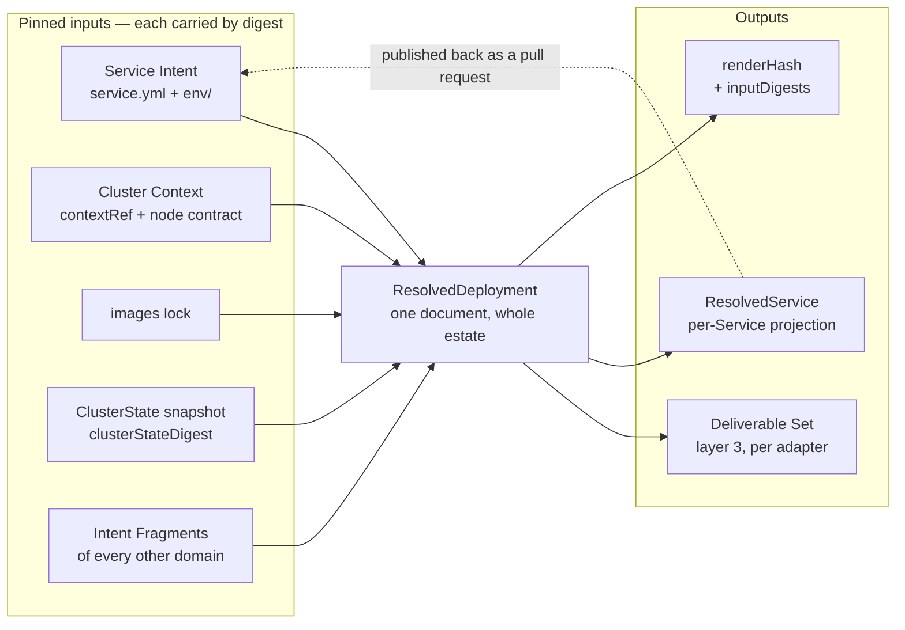
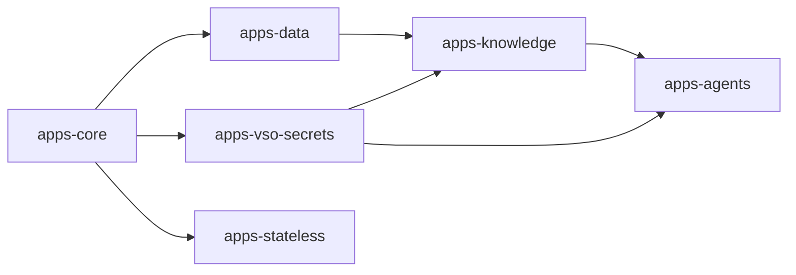

# Chapter 20 — Resolved Deployment

Layer 2. Never authored. It is where every platform decision is recorded, and it
is the reason layer 3 can contain none.

## The Resolved Deployment

The Resolved Deployment is a **versioned, reviewable artifact**: emitted on every
render, validated against its own schema, and diffed against the previous render
as part of the change under review
([0029](../../docs/adr/0029-resolved-deployment-versioned-artifact.md)). A
reviewer reads that diff and sees what the platform decided on their behalf,
including decisions nobody asked for.

Two kinds share one schema family:

```yaml
apiVersion: resolved.jorisjonkers.dev/v1
kind: ResolvedDeployment     # one document, the whole composed estate
---
apiVersion: resolved.jorisjonkers.dev/v1
kind: ResolvedService        # the projection published back to one repository
```

`ResolvedDeployment` covers the whole composed estate because assignments are
not separable: hostname uniqueness, the Reconcile Unit DAG, inbound-edge
derivations and the reader set of a Secret Store path are global properties
([chapter 16](16-dependencies.md)). `ResolvedService` is a **projection** — the
slice belonging to one Service, obtained by filtering and never computed
separately, so the two cannot disagree about what was decided.

The version is the data model's own semver, not the package's
([chapter 40](40-composition.md#versioning)), so a field appearing in an artifact
is attributable to a model change rather than to a release. That matters here
because the estate has already paid for the alternative:
`schemas/deployment.schema.json` pins `apiVersion` to the bare const
`deployment.jorisjonkers.dev` while five sibling schemas carry a version segment,
and the only versioned deployment apiVersion in the tree,
`deployment.jorisjonkers.dev/v2` (`src/deployment/v2-model.ts:65`), names the
*authoring* shape. Two incompatible documents therefore share one name, and
`validate deployment` (`src/cli.ts:343`) dispatches on the bare const and rejects
the resolved shape on `/apiVersion`. The estate wrote that up as a trap rather
than fixing it.

An artifact nobody diffs is the documented-but-unversioned option wearing a
directory name. This repository already contains one resolved tree —
`fixtures/deployment/golden/` — and `grep -rn 'deployment/golden' test/ scripts/
.github/ package.json` returns nothing. The decision is therefore the emission
**and** the gate: render, validate, diff, review.



The registered adapters accept the Resolved Deployment and nothing else
([chapter 30](30-deliverables.md#the-adapter-port)), so an adapter change cannot
relocate a decision into layer 3 unnoticed: an empty artifact diff across such a
change proves it did not.

## Authority

**A value is platform-assigned if and only if it must be unique across the
estate or draws on a shared finite resource; every other value is
Service-declared** ([0004](../../docs/adr/0004-contention-decides-authority.md)).
One question — does the value contend? — replaces a per-field negotiation.

Two readings of the rule matter, and neither is an exception to it:

- **Uniqueness alone is not contention.** A value that must be unique but is
  drawn from no finite pool is *declared* by the Service and *checked* at
  composition; there is nothing to arbitrate. A value drawn from a shared finite
  pool is *arbitrated*, and only the platform can arbitrate. The table's
  `placed by` column records which half placed each row.
- **The rule places values someone must state.** A derived value is stated by
  nobody: it is a function of the rows above it, which is what
  [0005](../../docs/adr/0005-derivation-is-total.md) claims is always possible.
  Whether such a value may be overridden is settled in
  [Overrides](#overrides), not here.

The estate is the argument for having a rule at all. One hostname,
`kb.jorisjonkers.dev`, ended up declared in seven authoritative places across
three repositories — `homelab-inventory/catalog/reachability.yml`, three
`fleet-infra` manifests, a bearer-token secret and the service's own
`platform/deployment.yml` — plus hardcoded in `ServicePermission.kt`, with two
conformance tests existing for no purpose but detecting when the seven disagree.
The guard was cheaper to write than the fix.

This table is the only place field authority is stated. Records needing a
field's placement link to this anchor rather than copying rows.

| field | authority | placed by | note |
|---|---|---|---|
| `id` | Service | unique — checked | estate-unique; `E_DUPLICATE_SERVICE_ID` at composition |
| `domain` | Service | no contention | ownership grouping and the unit of fragment publication |
| `owner`, `alertClass` | Service | no contention | urgency and notification target, never routing |
| `releaseUnit` | Service | no contention | at most one per Service; members agreeing on a name is the mechanism, not a collision |
| `provides` surface names and ports | Service | no contention | the port is written once, here |
| `dependsOn` edges | Service | no contention | provider, surface, necessity ([chapter 16](16-dependencies.md#dependency-edges)) |
| workload names | Service | unique — checked | unique within the Service; they name the derived identity |
| `image` alias, `runtime`, `lifecycle`, `stateful` | Service | no contention | what the Workload is |
| env files, `assets` | Service | no contention | per Workload; derived values appear only as placeholders |
| `secrets` grants — `path`, `keys`, `access`, `delivery`, `rotation` | Service | no contention to declare | the *path* is arbitrated (below); what a Service asks of a path is its own |
| `exposure` audience and paths | Service | no contention | one closed audience vocabulary |
| hostname label | Service | unique — checked | not one live hostname is derivable from a Service Id; see [open item 1](#open-in-this-chapter) |
| `probes`, `startupBudget`, `zeroDowntime` | Service | no contention | what only the Service knows about its own start and health |
| `size`, `hardening` and its exceptions | Service | no contention | the class name is declared; the numbers behind it are platform data |
| `volumes[].durability` | Service | no contention | what the data is worth cannot be observed |
| `placement.requires` / `.prefers` | Service | no contention | capabilities, never labels |
| `observability.scrape` | Service | no contention | port and path of its own metrics surface |
| `overrides`, `aliases` | Service | no contention | a named divergence with a recorded reason |
| `namespace` | platform | unique — arbitrated | from `id`, or from a declared `aliases.namespace` with a reason; two Services may share one, so a namespace is not a trust boundary |
| fully-qualified hostname | platform | unique — arbitrated | the declared label + the tier's hostname policy + the cluster domain |
| route tier | platform | pool | the shared edge is finite; `E_NO_TIER_FOR_AUDIENCE` where no tier carries the audience |
| middleware chain | platform | pool | tier + audience; `forward-auth` for `authenticated` on a public tier |
| Reconcile Unit and its ordering | platform | unique — arbitrated | one estate-wide DAG ([The Reconcile Unit](#the-reconcile-unit)) |
| Release Unit membership and switch gate | platform | unique — arbitrated | the set is one estate-wide object; members declare the name |
| identity name, Vault role, Vault policy | platform | pool | `<service>-<workload>`; the auth role namespace is shared ([chapter 16](16-dependencies.md#workload-identity)) |
| Secret Store path layout and grants | platform | pool | one path per reader set; `E_SUBTREE_PREFIX_COLLISION` across Subtrees ([chapter 40](40-composition.md#versioning)) |
| image digest | platform | unique — arbitrated | one alias resolves to one digest estate-wide, from the pinned images lock |
| `nodeSelector` and affinity | platform | pool | node capacity is finite ([Derived mechanics](#derived-mechanics)) |
| recorded PV binding | platform | pool | one `local-path` PV lives on one node; read from the ClusterState snapshot |
| `replicas` | platform | pool | from `minAvailable` and the capacity in the ClusterState snapshot |
| requests and limits | derived | — | from `size`, through the class table in the pinned Cluster Context |
| `securityContext` | derived | — | from `hardening` and its declared exceptions |
| container probe timings | derived | — | from `probes` and `startupBudget` |
| `progressDeadlineSeconds` | derived | — | from `startupBudget` |
| rollout strategy, surge, unavailability | derived | — | from `zeroDowntime` and `volumes` |
| object kind | derived | — | from `lifecycle`, `stateful` and `volumes` |
| Flux health timeout class | derived | — | from `stateful` and `lifecycle` |
| Secret and VSO sync objects | derived | — | from grants with `delivery: env` or `file`, plus `rolloutRestartTargets` from `rotation` |
| env entries and `envFrom` refs | derived | — | from env files, after placeholder resolution |
| dependency coordinates | derived | — | from the edge set and the provider's surfaces, bound to the key the consumer chose |
| Runtime Profile values | derived | — | from `runtime` |
| ServiceMonitor, PrometheusRule | derived | — | from `scrape` and `alertClass` |
| notifier route | derived | — | from `alertClass` and `owner` |
| backup job and retention sweep | derived | — | from `volumes[].durability`; `reconstructible` renders none |
| NetworkPolicy set | derived | — | from the edge set, exposure, grants, plus the baseline ([chapter 16](16-dependencies.md#network-policy)) |

A field the rule cannot place falsifies
[0004](../../docs/adr/0004-contention-decides-authority.md) and forces an
amendment to the rule — never an exceptions row in this table.

## Pinned inputs

> **Every assignment is a pure function of the pinned input set: Service Intent,
> the pinned Cluster Context, the locks, and the ClusterState snapshot — each
> carried by digest.** Identical inputs, identical output, always.

The set is **closed**. No assignment consults live cluster state, a mutable
pool, a counter, or state remembered between renders. There is no allocation
registry and no assignment state, which is why `renderHash` means something and
why publishing assignments back to a service repository cannot drift.

The rule has teeth because it forces a decision whenever something cannot be a
pure function of what is pinned. Such a value moves **up** into layer 1, where
it is declared and checked; **sideways** into the Cluster Context, where it is
platform data republished deliberately; or **into the ClusterState snapshot**,
where it is an observed fact captured once and digested
([Cluster state](#cluster-state)). It may not stay in layer 2 as remembered
state, and it may not be read ad hoc. Anything a future assignment needs is
first a schema change to a pinned input, and only then a feature.

The artifact carries what makes it reproducible, reusing the fields
`artifact-contract.schema.json` already defines: `renderHash`, `inputDigests`
(`intent`, `imagesLock`, `clusterState`), `contextRef` as an OCI digest,
`adapterCompat.digest`, and `schemaPackageIntegrity`.

Two properties follow, and both are conditional on the whole digest set:

1. **Reproducibility.** Re-rendering from *identical* recorded digests —
   `clusterStateDigest` included — yields a byte-identical Deliverable Set and
   the same `renderHash`. A mismatch under identical digests means an input was
   not pinned, which is a defect in the lock or the renderer, not weather.
2. **Attributable change.** If `renderHash` changes, at least one `inputDigests`
   entry changed. There is no third possibility, because nothing is remembered
   between renders.

The earlier, unconditional form of property 1 misfired exactly when it mattered.
A re-render taken after a node failure rebound a PersistentVolume legitimately
differed from the render at merge time with every recorded digest identical, and
the diagnostic reported a lock defect where the truth was a changed cluster fact.
Enlarging the pinned input set repairs the property instead of weakening it.

The settling test is a **double render**: render twice from identical pinned
inputs, at different times and on different machines, and byte-diff the output
trees. Any difference — map ordering, timestamps, absolute paths — falsifies the
premise and must be fixed in the renderer before the gate is trusted.

## Cluster state

Some assignments need facts about the cluster: which node holds a bound
PersistentVolume, how much capacity a node has, where a Workload currently runs.
Those facts are captured **once**, by a read-only collector, into a snapshot
that is digested and pinned like every other input
([0034](../../docs/adr/0034-cluster-state-pinned-input.md)). Assignments read
the snapshot. Nothing reads the live cluster.

| the snapshot enumerates | used by |
|---|---|
| PersistentVolume bindings, with the node holding each | placement of a Workload whose volume already exists |
| node capacity, against `schemas/node-contract.schema.json` | `replicas` from `minAvailable` and capacity |
| current placements | detecting a move before it is rendered |

Three documents must not be conflated:

| | ResolvedDeployment | ClusterState snapshot | live health document |
|---|---|---|---|
| answers | what should be true | what was true when we decided | what is true now |
| source | the pinned inputs | one read-only capture, digested | the cluster, continuously |
| pinned | it *is* the output | yes — `clusterStateDigest` | no |
| changes | when an input changes | when the collector runs | continuously |

The third is the existing `schemas/cluster-state.schema.json` — `flux_ready`,
`observed_image_digest`, `gatus_status`, `last_reconcile`. It is **not** the
pinned input and cannot become it: its digest would move on every reconcile, and
it carries neither PV bindings nor node capacity, which are precisely the facts
the assignments need. Promoting it would make one document answer both "what is
true" and "what was true when we decided".

Two rules follow.

**Re-render from the recorded snapshot, never a fresh one.** Any render that
reproduces a recorded lock — a verification, an audit, a scheduled
re-reconciliation — reads the snapshot that lock names. Capturing afresh
reclassifies weather as a lock defect and destroys property 1.

**A changed cluster fact is a new lock.** When a PV rebinds after a node
failure, the next capture produces a new `clusterStateDigest`, and the
assignment that follows the data is a visible decision someone lands — with a
state-move-plan where the volume's Durability Class requires one — not a silent
correction between renders.

This is also what makes two long-standing contradictions expressible. Placement
against a bound PV, and a `replicas` assignment informed by capacity, are pure
functions of a pinned input. Reading either from the *live* cluster remains
forbidden; the difference is the digest.

Between captures the estate renders against facts that may already be stale.
That cost is accepted and named: a render is correct as of its snapshot, and the
snapshot's age is on the artifact.

## Derived mechanics

A Service declares what only it can know — its cold-start budget, whether it
requires zero-downtime rolls, which paths answer readiness and liveness, what a
volume's data is worth, what it can survive when an input changes. Probe
timings, rollout strategy, surge and unavailability, progress deadlines, health
timeout classes, object kind, resource requests, pod hardening, backup jobs and
retention sweeps all follow ([0030](../../docs/adr/0030-runtime-mechanics-derived.md)).
**None of the derived values may be authored**, and writing one in an env file
or a Service document is a build error ([chapter 10](10-service-intent.md)).

The rollout configuration is the evidence. All four first-party deployments
carry the same pattern — `RollingUpdate` with `maxSurge: 1` and
`maxUnavailable: 0`, `startupProbe` at `periodSeconds: 5` and
`failureThreshold: 120`, readiness and liveness at `timeoutSeconds: 5`, and
`progressDeadlineSeconds: 1800` on the three JVM services — and the comments
record what it cost to arrive there: *"under `Recreate` every image roll opened
a zero-pod window, so a slow cold start or a flaky ghcr image pull took the MCP
fully down (503)"*; *"JVM cold start (~250–300 s); the 600 s startupProbe budget
covers it"*. Four identical blocks is one derivation performed four times by
hand, with the reasoning trapped in comments no tool can read.

Four rules carry most of the weight:

- **Strategy is a function of volumes, not a preference.** A `ReadWriteOnce`
  volume cannot attach to two pods at once, so a Workload holding one renders
  `Recreate`. Estate-wide the split is 21 `Recreate` to 9 `RollingUpdate`, and
  every RWO holder is on the `Recreate` side. The renderer today reads an
  authored enum (`src/adapters/kubernetes.ts:608`) and inspects no volume, which
  is a trap: a stateful Workload whose author forgets `strategy: recreate` gets
  `maxSurge: 1` against an RWO volume, appears to work on one node, and wedges
  the first time a second worker exists.
- **The progress deadline must exceed the startup budget, strictly.** It derives
  as budget × 3, floored. The current renderer emits `600` against a 600-second
  budget, so a JVM still inside its legitimate startup window is marked
  `ProgressDeadlineExceeded`.
- **The health timeout class is a table over declarations**, not a number:
  `stateless: 5m`, `stateful: 10m`, `control-plane: 15m`, `job: 10m`
  (`src/schemas/health-timeout-map.ts:1-6`), taking the strongest class across a
  Service's Workloads.
- **Hardening and size are classes, not values.** `hardening` defaults to
  `restricted` — `runAsNonRoot`, `readOnlyRootFilesystem`, all capabilities
  dropped, seccomp `RuntimeDefault` — and each declared exception carries a
  reason. `size` resolves to requests and limits through the class table held in
  the pinned Cluster Context. Neither field exists in either renderer today:
  `grep -rniE 'securityContext|runAsNonRoot|readOnlyRootFilesystem|seccompProfile'
  src/ schemas/` returns 0 hits, so every rendered pod runs as its image's UID
  with a writable root and no reservation.

### Layer 2 does not assign a node

Earlier drafts said layer 2 decides "which node". That is wrong. Kubernetes
schedules pods; the platform only constrains where they may land. Layer 2
assigns a **selector and an affinity**, derived from declared capabilities.

The case that looks like a node assignment is not a scheduling decision either.
A `local-path` volume binds to the node holding its PersistentVolume; that
binding is a fact read from the pinned ClusterState snapshot, so recording it is
an assignment like any other — a pure function of an input, carrying the
provenance of the digest it came from. What it is not is a re-schedulable
choice: moving the data requires a state-move-plan, not a re-render.

## Overrides

A derived value is **overridable with a reason**; an assignment is not
([0031](../../docs/adr/0031-derived-overrides-with-reason.md)).

```yaml
overrides:
  - field: progressDeadlineSeconds
    value: 600
    reason: nginx pods, ~10-20Mi RAM each; a 1800s deadline is 3x the real budget
```

The exception already exists in the tree: `app-ui` runs
`progressDeadlineSeconds: 600` while the three JVM services run `1800`, and a
JVM cold start and an nginx start are genuinely different. One rule over one
input cannot be right for both.

Refusing the hatch does not buy a better rule; it buys a falsified input. The
deadline derives from the Startup Budget, and so do the startup probe's period
and failure threshold. An owner who needs 600 and cannot say so declares a
200-second budget to coax the number out — corrupting the one field only they
could know and mis-deriving the probe along with it. The lie is invisible; an
override is not. Requiring a reason makes the rationale data rather than a YAML
comment no tool can read.

Three boundaries:

- **Assignments are outside the hatch.** Every row of the
  [Authority](#authority) table whose authority is *platform* — hostname,
  namespace, placement, Secret Store path, Reconcile Unit, image digest — may
  not be overridden. They arbitrate shared resources, and a local override
  reintroduces exactly the collision arbitration exists to prevent, at the layer
  with no arbiter. A Service wanting a different one goes through arbitration and
  [Publish back](#publish-back).
- **`aliases` is not an override.** A declared alias — a namespace, a coordinate
  key — is an *input* to an assignment, carried into the render and checked
  against every other Service's, with its reason recorded. Overriding an
  assignment happens after arbitration; an alias happens before it.
- **`hardening.exceptions` is the same shape for a different surface.** A
  Workload that cannot meet the default class names the specific exception and
  its reason, in the shape used here.

Two costs are accepted. Overrides cannot be enumerated estate-wide, so a dead
override looks identical to a load-bearing one and both persist; and the
dead-declaration check of [chapter 16](16-dependencies.md#the-three-properties)
cannot run over the one surface that permits hand-tuning. Both stay recoverable:
composition already reads every Intent Fragment, so a register of active
overrides is a later read over data already in hand.

## The Reconcile Unit

The Reconcile Unit is **derived from the dependency graph**, never declared
([0032](../../docs/adr/0032-reconcile-unit-derived.md)). A Service's unit is
`apps-<domain>`; the ordering between units is the edge set of
[chapter 16](16-dependencies.md#dependency-edges) projected onto domains, plus an
edge to the secrets-provisioning unit wherever a Service holds any grant.



An arrow means *must be Ready first*. `apps-knowledge` follows `apps-data`
because `knowledge` depends on `platform-postgres` and `platform-rabbitmq`;
`apps-agents` follows `apps-knowledge` because the agent services consume
`knowledge`, and follows `apps-vso-secrets` because they hold grants — a
Workload cannot start before the credential it holds is materialised. That is
the fourteen-node graph `fleet-infra` maintains by hand today, rendered instead.

`platform.layer` is **deleted from Service Intent**. It was a free-form string
typed `"type": "string"` with no enumeration; every Service declared `apps-core`
and not one reconciled there — `auth-api`, `agents-api` and `app-ui` land in
`apps-stateless`, `knowledge` in `apps-knowledge`, `agent-runtime` in
`apps-agents`. A field wrong in 100% of observed cases at no cost is a comment,
not a declaration. It is also inexpressible: `agents-login`'s objects appear in
two units at once, and one string cannot name two. What survives is optional and
*observed* — the unit the live health document found Flux reconciling an object
in, useful only for diffing observation against derivation, never authored, and
not part of the pinned snapshot.

Two consequences are the price. A Service owner cannot pin their reconcile
position; a wrong order is fixed by correcting the dependency declaration that
produced it. And a Service's objects may split across units with nothing
declaring that they do, as `agents-login`'s do — which is what makes a partially
applied Service hard to read. A dependency cycle becomes a build failure
(`E_DEPENDENCY_CYCLE`) rather than a reconcile deadlock.

**The Reconcile Unit orders; it does not make anything atomic.** Ordering is
derived; atomicity is declared as a Release Unit
([chapter 10](10-service-intent.md#release-units)), whose members switch together
or not at all. The two are orthogonal: postgres before knowledge is ordering;
auth-api and auth-ui moving together is atomicity.

The derived unit has one consumer in v1: the Flux `Kustomization` DAG, whose
`dependsOn` edges and health timeout class are this derivation's output. What a
push-based applier would do with the same ordering — apply its slice layer by
layer — belongs to the separately-defined delivery work in
[docs/adr/deferred/](../../docs/adr/deferred/README.md), along with everything
else about how objects reach a cluster. The derivation does not change if that
consumer is ever added; only the number of consumers does.

## Publish back

Because contended values are platform-assigned, a Service owner cannot read
their own hostname, namespace, placement or Secret Store paths out of their own
repository. Composition therefore writes each Service's `ResolvedService`
projection into that Service's repository as a generated file —
`platform/resolved.yml` — and opens a pull request when it changes
([0033](../../docs/adr/0033-assignments-published-back.md)).

| rule | why |
|---|---|
| generated, never hand-edited | it is output, not source |
| guarded by a drift check that fails the build when it disagrees with a fresh compose | a snapshot nobody verifies looks authoritative while being stale — `render-local.sh`'s own header records a hardcoded schema version four minor releases stale and a context digest two republications behind |
| delivered as a pull request, not a silent commit | the diff *is* the notification |

The gap this closes is an assignment that changes because of **someone else's**
change. The estate already shows an owner their own render during their own pull
request — the `deploy-preview` sticky comment, reproducible locally through the
same package CI runs. That was never the gap. When `auth-api` raises its route
tier, `knowledge`'s derived forward-auth middleware changes with it and nothing
in the `knowledge` repository is touched; a sticky comment on a pull request
nobody is opening communicates nothing.

The discipline is the one `homelab-inventory` already applies to `context/`:
committed, generated, never hand-edited, with a drift check proving it still
matches its inputs. Answering "what is my hostname, namespace, or Vault path"
becomes a `grep` in the owner's own checkout, with no render and no cluster
access.

The cost is real and accepted: a commit-back mechanism holds write access to
every participating repository, so a bug in composition can open a pull request
in all of them at once; and an assignment change nobody needed to see still
arrives as a review request.

## Worked example — knowledge's projection

```yaml
# services/knowledge/platform/resolved.yml
# GENERATED. Never hand-edit. Written by compose; guarded by a drift check.
apiVersion: resolved.jorisjonkers.dev/v1
kind: ResolvedService
service: knowledge

provenance:
  renderHash: sha256:…
  contextRef: ghcr.io/jorisjonkers-dev/cluster-deploy-context-public@sha256:…
  inputDigests:
    intent: sha256:…
    imagesLock: sha256:…
    clusterState: sha256:…             # the snapshot every assignment below read

assigned:
  namespace: knowledge-system
  reconcileUnit: apps-knowledge
  reconcileAfter: [apps-core, apps-data, apps-vso-secrets]
  healthTimeoutClass: stateful         # 10m — strongest class across the two Workloads

  workloads:
    knowledge-api:
      serviceAccount: knowledge-knowledge-api
      objectKind: Deployment
      image: ghcr.io/jorisjonkers-dev/knowledge/knowledge-api@sha256:1ad39d5…
      exposure:
        kb:
          host: kb.jorisjonkers.dev
          tier: public-frankfurt
          middleware: [forward-auth]
      probes:
        readiness: {path: /api/actuator/health/readiness, port: 8080}
        startup:   {periodSeconds: 5, failureThreshold: 120}
      strategy: {type: RollingUpdate, maxSurge: 1, maxUnavailable: 0}
      progressDeadlineSeconds: 1800
      resources: {…}                   # from size: m — the class table is chapter 10's
      securityContext:                 # from hardening: restricted, no exceptions
        runAsNonRoot: true
        readOnlyRootFilesystem: true
        capabilities: {drop: [ALL]}
        seccompProfile: {type: RuntimeDefault}
      placement:
        nodeSelector: {platform.jorisjonkers.dev/capability-public-ingress: "true"}
      secretObjects:
        - {kind: VaultStaticSecret, path: secret/data/platform/postgres/kb}

    knowledge-ingest-worker:
      serviceAccount: knowledge-knowledge-ingest-worker
      objectKind: Deployment
      strategy: {type: Recreate}       # forced: RWO volume
      placement:
        boundTo: enschede-t1000-1
        from: clusterState             # PV knowledge-vault-clone is bound there
        moveRequires: state-move-plan
```

Note the shape of `placement.boundTo`. It sits under `assigned:` because it *is*
an assignment — a pure function of the `clusterState` digest recorded four lines
above — and `from:` names the pinned input it read. Re-rendering with the same
digest reproduces it byte for byte; a rebound volume produces a different digest
and therefore a new lock, which someone lands deliberately. Two identities
appear because `knowledge` has two Workloads
([chapter 16](16-dependencies.md#workload-identity)); a single-Workload Service
would show `serviceAccount: <service>`.

## Open in this chapter

1. **Whether the hostname label survives the contention rule.** The table above
   places it as *identity — declared and checked*, on the evidence that not one
   live hostname is derivable from a Service Id: `knowledge` serves `kb`,
   `auth-api` serves `auth`, `home-portal` the apex, `headlamp` `dashboard`,
   `gatus` `status`, and `agents-api` serves two. If that placement really needs
   a third category rather than a reading of the rule, premise
   [0004](../../docs/adr/0004-contention-decides-authority.md) is falsified and
   the rule is amended, not the table.
   **Owner:** joris.
   **Settled by:** deriving every row of the table above from the rule alone,
   with no row marked as an exception — including the label, and including the
   next field added to the model.
   **Blocks:** 0004 moving from `open` to `settled`; the shape of the exposure
   entry that carries the label in chapter 10.
2. **Apex hosts need a convention.** `home-portal` serves the bare domain, and
   `apex: true` is proposed rather than decided.
   **Owner:** joris.
   **Settled by:** rendering `home-portal`'s route from a declared apex marker
   and diffing against the live IngressRoute; `E_DUPLICATE_APEX` where two
   Services claim it.
   **Blocks:** `home-portal` leaving hand-written manifests.
3. **The drift check's failure mode for upstream-caused staleness.** A
   hand-edited `resolved.yml` fails the build. What is not settled is the copy
   that is merely behind — stale because someone else's change has not yet
   arrived as a pull request — and whether that blocks the owner's own pipeline
   or is merely reported.
   **Owner:** joris.
   **Settled by:** the publish-back experiment — raise `auth-api`'s route tier on
   a branch, compose, and observe what the `knowledge` pipeline does between the
   pull request opening and merging.
   **Blocks:** enabling the check across the participating repositories.
4. **The ClusterState snapshot is unmeasured.** No collector exists, and the
   claim that its digest is stable between operator-visible events is untested;
   every reproducibility statement in this chapter and in
   [chapter 30](30-deliverables.md) depends on it.
   **Owner:** joris.
   **Settled by:** running the collector twice, ten minutes apart, against an
   idle cluster and comparing `sha256sum` of the two snapshots.
   **Blocks:** the double-render determinism test, and therefore properties 1
   and 2 of [Pinned inputs](#pinned-inputs).
