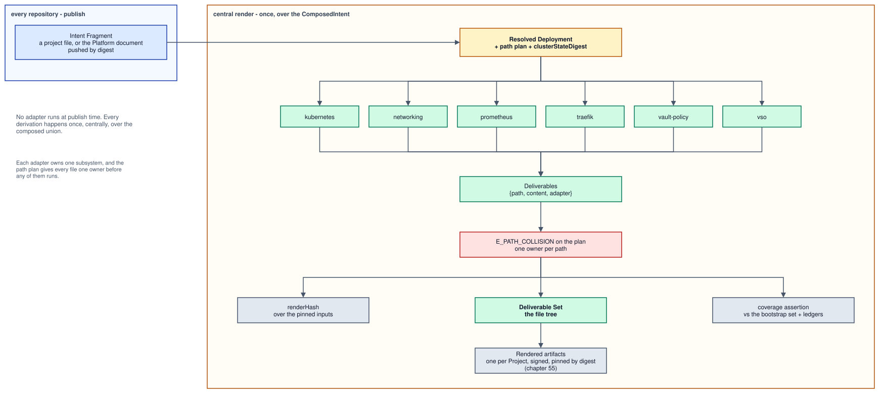
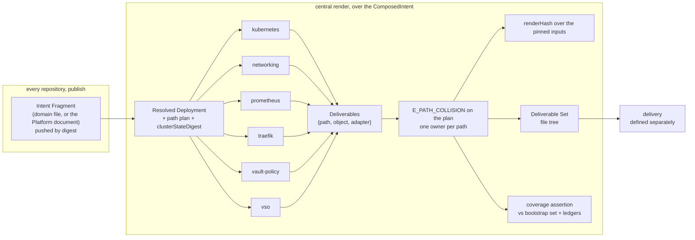

# Chapter 30: Deliverable Set

Layer 3. Never authored, and the property that makes the other two layers
worth separating) it contains **no decisions**.

## The rule

> A Deliverable's content is a pure function of the Resolved Deployment, and its
> path is **assigned by** the Resolved Deployment
> ([0070](../../docs/adr/model/0070-path-authority-is-layer-2.md), normative in
> [chapter 20](20-resolved-deployment.md#the-path-plan)).

Layer 2 decided everything (chapter 20). Layer 3 serialises. If a renderer has to
choose, the choice belongs one layer up, and the choice being made here is the
defect, because a decision taken during serialisation appears in no schema, is
recorded in no lock, and is invisible in the published projection a Service owner
reads back.

An earlier form of this rule made the path a function of the adapter and the
object it carries. That form could not answer which Service directory owns a
per-domain object, and it put an estate-scoped Deliverable in whichever
namespace the emitting adapter happened to key off; both are recorded in
chapter 20's path plan as the reason authority moved up a layer. An Adapter
still declares a `defaultPath` (that is how the registry states what an Adapter
is for, and it is what the plan assigns from), but the path a Deliverable
carries comes from the plan.

## Adapters

An **Adapter** is a named renderer registered in one registry. A **Deliverable**
is the unit of output and of attribution:

```ts
{ path: string, object: TypedObject, adapter: string }
```

Every Deliverable names its producing adapter. That is what makes the
attribution assertion below possible without new machinery.

An adapter is a model-to-model step: it maps the Resolved Deployment into the
narrow Kubernetes and Vault object model (`TypedObject`), and nothing more. The
Deliverable's `object` is that model object, and its `content` is the output of
the one serializer turning that object into bytes. An adapter never formats
bytes itself: there is exactly one serializer, so determinism, key order and
line endings are one module's responsibility
([0067](../../docs/adr/architecture/0067-adapters-build-objects-one-serializer.md)).
A Deliverable holds `path`, `object` and `adapter`; it has no `content` string
an adapter would write, and no `executable` flag: nothing in the model is
executable ([0012](../../docs/adr/model/0012-assets-not-code.md)).

**The registry is the enumeration**
([0052](../../docs/adr/model/0052-registered-adapters-are-v1.md), rewritten by
[0098](../../docs/adr/model/0098-one-publication-path.md)): nothing renders
that is not registered, `adapterContract()` is the only list, and a change to the
set is a decision with its own ADR. The set is six, one per subsystem, and every
one of them is a **central** adapter running once over the composed union:

| adapter | subsystem | emits |
|---|---|---|
| `kubernetes` | workloads | per Service: the controller, `Service`, `ServiceAccount`, `ConfigMap` (including every inbound-derived Asset) `PersistentVolumeClaim`, `PodDisruptionBudget` above one replica, the backup and sweep `CronJob`, `Namespace` per domain, and the kustomize `Kustomization` per directory |
| `networking` | policy | every `NetworkPolicy` ([0074](../../docs/adr/model/0074-networking-adapter-emits-policy.md)) |
| `prometheus` | monitoring | one `ServiceMonitor` or `PodMonitor` per Service that declares `observability`, from the named surface and the Platform document's cadence. No `PrometheusRule`: PromQL is the monitoring stack's ([chapter 10](../../spec/v1/10-service-intent.md#observability)) |
| `traefik` | edge | one `IngressRoute` set and one `Middleware` set **per tier** the Platform document declares ([0076](../../docs/adr/model/0076-middleware-has-one-producer.md), [0098](../../docs/adr/model/0098-one-publication-path.md)) |
| `vault-policy` | secret store | one policy and one auth role per Workload identity, as JSON ([0073](../../docs/adr/model/0073-vault-policy-is-a-deliverable.md)) |
| `vso` | secret delivery | `VaultConnection`, `VaultAuth`, the operator `ServiceAccount` per namespace, `VaultStaticSecret`, `VaultDynamicSecret` |

**There is one publication path.** A repository publishes its Intent Fragment
by digest ([chapter 40](40-composition.md#fragments)) and nothing else; no
adapter runs at publish time. The five publish-time `*-fragment` producers of the
previous generation, and the `adapter-compat` map that paired them with their
consumers, are deleted: every kind they emitted is derived centrally from the
same declaration, so they were a second render of the same intent, and their
map's digest padded `renderHash` for no reason but to pair them. A Service owner
who wants to see their own render runs the same core locally over the same pinned
inputs: a use-case, not a second adapter set.

Three former adapters are not deleted so much as reclassified. The Gatus
endpoints and the two edge catalogs are **inbound derivations** of the platform
Service that consumes them ([chapter 16](16-dependencies.md#what-an-edge-derives-read-inbound)),
rendered as that Service's own Assets by `kubernetes`. Image metadata is a
**projection of the images lock** and joins the Resolved Deployment artifact set
([chapter 20](20-resolved-deployment.md#publish-back)). `flux-root` (one Flux
`Kustomization` per layer, with `dependsOn` and health checks) is one delivery
mechanism's reading of the Reconcile Unit DAG, and lives in
[`docs/adr/deferred/`](../../docs/adr/deferred/README.md) with the rest of
delivery. `flux-packs` and `flux-source` had nothing left to render once the
foundation was declared ([0096](../../docs/adr/model/0096-the-foundation-is-declared.md)).

A second, unregistered renderer generation exists in the tree being replaced: `src/deployment/render/`, 14 modules and 1,967 lines, reachable from neither
entry point, imported only by 11 test files, yet inside the `--lines 90` coverage
gate that guards every pull request. It is deleted in the code pass, and nothing
it contains is promoted for free: bringing its behaviour back is a port across
the adapter port and costs what writing a new adapter costs.

## The adapter port

Every adapter satisfies one typed port
([0053](../../docs/adr/model/0053-adapter-port-contract.md)):

> **Documents in, attributed Deliverables out. Deterministic. No ambient reads. A
> path claimed twice is a build error.**

| invariant | normative statement | failure |
|---|---|---|
| one input shape | An adapter receives the Resolved Deployment as parsed, pinned documents and nothing else. There is no discriminated union and no hand-set input string. | compile error |
| attributed output | Every returned Deliverable carries `adapter`, set by the port, not by the adapter. | compile error |
| deterministic | Same documents in, byte-identical Deliverables out, in a stable order. | `E_RENDER_NONDETERMINISTIC` |
| no ambient reads | No environment variable, clock, network or filesystem read inside `render`. Reading manifests from disk is the caller's job; the parsed documents are passed in. | `E_AMBIENT_INPUT_FORBIDDEN`, `E_INPUT_OUTSIDE_WORKDIR` |
| one owner per path | Two adapters may never claim the same output path. | `E_PATH_COLLISION` |
| safe paths | Every path is relative and normalised; `..` and absolute paths are rejected. | `E_UNSAFE_OUTPUT_PATH` |

Each of these is stated because the seam does not have it today. The registry
declares `render: (input: never) => RenderResult` under a comment calling the
entries "intentionally heterogeneous"; `never` accepts every function, both call
sites launder the argument through a double cast, and the only runtime check is
`typeof render === "function"`. Which of three declared input shapes an adapter
receives is one string comparison, `adapter.input === "canonical-artifacts"`, and
the five publish-time producers match no branch of their own, they fall through
to the `deploy-config` branch and are handed the wrong document. One of them
reads raw manifests from disk inside `render`. `E_PATH_COLLISION` has **zero
occurrences under `src/`**, while the writer applies each prepared file in turn:
two adapters sharing a path both write, second wins, silently, both reporting
`action: "create"`. The collision check belongs where the Deliverable set is
assembled, on the path plan, before any adapter runs
([chapter 20](20-resolved-deployment.md#the-path-plan)), and it must exist in
code before the coverage assertion means anything.

Two ratchets carry the port:

- **The `@ts-nocheck` count may only fall.** It stands at 10 files under `src/`,
  four of them registered adapters (`adapters/kubernetes.ts` and three flux
  adapters), while `tsconfig.json` sets `"strict": true` and the lint rule that
  would catch the pragma is off. The count becomes a CI gate; the four adapter
  files lose the pragma before v1.
- **The ambient-input prohibition has no public escape hatch.** The helper that
  skips it is a test-only path and stops being exported; tests pass the documents
  explicitly.

Narrowing the port is cheap now and expensive later. Once adapters outside this
repository register through the public `registerAdapter` export, the port is a
compatibility surface every out-of-tree adapter pins, and narrowing it means a
major toolkit release, a version number separate from `schemaVersion`
([0039](../../docs/adr/model/0039-artifact-schema-versioning.md), chapter 40).

## Vault configuration is rendered, not applied

`vso` emits the operator's Kubernetes objects: `VaultConnection`, `VaultAuth`,
the operator `ServiceAccount` per target namespace, `VaultStaticSecret`,
`VaultDynamicSecret`. None of those is a policy or an auth role, so until
[0073](../../docs/adr/model/0073-vault-policy-is-a-deliverable.md) the policy
that [0025](../../docs/adr/model/0025-access-tiers-derive-policy.md) derives had
no output at all, and a derivation with no output is not total
([0005](../../docs/adr/model/0005-derivation-is-total.md)).

The `vault-policy` adapter emits, **per Workload identity**, two documents:

| document | derived from |
|---|---|
| the Vault policy | the Workload's grants and their access tiers: `read` on the granted path, `patch` for `self-roll`, `create`/`update`/`delete` on a prefix for `custody`, nothing for `self-renew` |
| the Kubernetes auth role | the Workload's ServiceAccount and namespace ([0024](../../docs/adr/model/0024-identity-per-workload.md)), bound to that one policy |

One document per identity, not per Service: identity is per Workload, so a
two-Workload Service produces two policies and a diff says which principal's
privilege changed. Both are JSON, which Vault accepts and which lets the one
serializer own key order.

**Rendered, not applied.** Writing a policy into Vault is an act against a live
system by an identity with privilege, which is delivery
([`docs/adr/deferred/`](../../docs/adr/deferred/README.md)). This chapter emits
the documents and attributes them; nothing here says who writes them.

**The auth method itself is a platform fixture.** Mounting `kubernetes` auth,
configuring its JWT issuer and CA, and creating the KV mounts are estate-unique
and draw on a shared resource, so by
[0004](../../docs/adr/model/0004-contention-decides-authority.md) they are
platform-assigned, and they are Assets of the declared `vault` Service in the
platform's secrets domain ([0096](../../docs/adr/model/0096-the-foundation-is-declared.md),
[chapter 60](60-setup.md#secrets-at-rest)) rather than per-Service render. The
per-Service render owns what varies per Workload and nothing else.

## Attribution

**Every Deliverable is attributed to exactly one Adapter**
([0054](../../docs/adr/model/0054-adapter-attribution.md)). Attribution is a property of
the producer, declared in the registry, not a property of the output that an edit
could lose:

- Every registry entry declares a `defaultPath`, and registration throws
  `adapter definition missing defaultPath` without one. It is what the path plan
  assigns from ([0070](../../docs/adr/model/0070-path-authority-is-layer-2.md)).
- `adapterContract()` is the only enumeration of the set. A tool that needs to
  know who produces what reads it; nothing reconstructs ownership by scanning
  rendered YAML.
- An adapter emits a file set, every file of it a Deliverable naming that adapter
  and no other.
- A file no adapter claims cannot ship silently. It becomes a ledger entry with
  an owner and a reason, or the build fails.

There is **no target-neutral deliverable IR**. Nomad appears in this estate only
in a `flux-modules` denylist and in a reserved `extensions.nomad` slot annotated
*"Reserved extension area for future Nomad inputs. No renderer consumes it in
this feature."*, with `renderer_status: design_only` enforced by the artifact
validator. An abstraction with one consumer is shaped entirely by that consumer,
so a neutral IR built today would be Kubernetes-shaped and wrong for Nomad on the
day Nomad arrived. If a second target ever exists, that is when the abstraction
gets lifted, with two real consumers to shape it.

Two adapters may render objects of the same **kind**, `kubernetes` creates the
Service's own `ServiceAccount`, `vso` mirrors the VSO operator's `ServiceAccount`
into each target namespace. That is allowed: attribution is per Deliverable, and
single authority is per **field**, not per kind. What is never allowed is two
adapters claiming one path.

### Path allocation

Paths are assigned by the Resolved Deployment's path plan
([chapter 20](20-resolved-deployment.md#the-path-plan)) from each adapter's
`defaultPath`, never configured per Service:

```
<gitopsRoot>/apps/<domain>/<service>/<object>.yaml
<gitopsRoot>/apps/<domain>/namespace.yaml
<gitopsRoot>/apps/vso-secrets/…
<gitopsRoot>/apps/vso-secrets/policies/<workload>.{policy,role}.json
<gitopsRoot>/apps/edge/<tier>/…
```

Two adapters (`kubernetes` and `networking`) declare the same `apps` prefix
and are kept apart by the object segment. That is why `E_PATH_COLLISION` is
decided on the plan, before any adapter runs, rather than left as a convention.

## Ledgers

**Every accepted hole is a bidirectional ledger**
([0055](../../docs/adr/model/0055-bidirectional-ledgers.md)). Each ledger fails **both**
when something is missing from it and when one of its own entries no longer
matches anything, which is the property `catalog/accepted-fragment-drift.yml`
already has and states:

> *"fails on anything absent from this file, and also fails on an entry here that
> no longer matches anything, so the list cannot quietly outlive the thing it
> excuses. Every entry is a deferred fix, not a permanent exemption."*

| ledger | holds | absent from it | stale entry in it |
|---|---|---|---|
| coverage ledger | every live object with no producing adapter | `E_UNATTRIBUTED_OBJECT` | `E_LEDGER_ENTRY_STALE` |
| accepted fragment drift | differences between the render and what a Service published, each a deferred fix | `E_UNACCEPTED_DRIFT` | `E_LEDGER_ENTRY_STALE` |
| registered unmanaged surfaces | hostnames the model does not deploy ([0019](../../docs/adr/model/0019-registered-unmanaged-surfaces.md), chapter 40) | `E_UNREGISTERED_SURFACE` | `E_LEDGER_ENTRY_STALE` |

Every entry carries three fields and a build consequence:

| field | rule |
|---|---|
| `owner` | a person, never a team alias; required |
| `reason` | why the hole is accepted, in prose a reviewer can disagree with |
| `review-date` | a date; **a date in the past fails the build**, `E_LEDGER_REVIEW_OVERDUE` |

A review date with no consequence is an adjective. With one maintainer across
three identities in `git shortlog`, every review date is a note to self, and the
build failure, not the review, is what enforces the deadline.

The check runs against the pinned `ClusterState` snapshot
([0034](../../docs/adr/model/0034-cluster-state-pinned-input.md), chapter 20), so a
ledger verdict is exactly as fresh as that snapshot's `clusterStateDigest` and no
fresher. Closing a hole is therefore always two changes, register the adapter,
delete the entry, and forgetting the second breaks the build. That is the whole
point of the stale half: without it, a coverage entry outlives the adapter that
closed it and no build says so.

One live drift entry marks where the limit genuinely is: `agent-gateway` cannot be
probed because it is *"a sidecar jar inside agent-runner pods, not a workload of
its own"*, and its per-runner Services are created and destroyed by `agents-api`
at runtime. Some objects are outside any declarative model. The ledger is where
they belong: with an owner and a reason, not with silence.

## Coverage

Coverage is re-derived from the registry, never asserted from memory. What
follows is the enumeration of `adapterContract()` as it stands, and the gap that
enumeration genuinely leaves.

### The registered set

The six adapters above are the set, and their `defaultPath`s are the roots of
the path plan. The estate's coverage is the union of what they emit plus the
bootstrap set ([chapter 14](14-platform-intent.md#the-bootstrap-set)) plus the
ledgers; anything live that is in none of the three is `E_UNATTRIBUTED_OBJECT`.

### The estate, by class

The 2026-08-31 survey stands and is retained as scale. Counted across
`fleet-infra/cluster`, excluding the Flux installer (`gotk-components.yaml`, 32
objects rendered from nothing): **450 objects, 39 distinct kinds, 329 files**.
`kind: Kustomization` is two unrelated APIs and is counted separately: 74
`kustomize.config.k8s.io/v1beta1` (a file list per directory) and 15
`kustomize.toolkit.fluxcd.io/v1` (a Flux reconcile unit); a claim that conflates
them is wrong by 74.

| class | objects | share | how it is produced |
|---|---|---|---|
| **A, derived from Service Intent** | 364 | 81% | a registered adapter, per Service |
| **B, the foundation** | 41 | 9% | was pack-delivered from `flux-modules` at a pinned ref; now **declared** as Services of the platform domains and rendered like class A ([0096](../../docs/adr/model/0096-the-foundation-is-declared.md)). The CRDs among them are the bootstrap set |
| **C, authored content** | 45 | 10% | not derivable; ledgered until its owner lands |

Class C is entirely Grafana: 31 `GrafanaDashboard`, 14 `GrafanaFolder`. Nothing
in Service Intent implies a dashboard's panels; deriving one would be inventing a
dashboard DSL. It is ledgered rather than permanent: 14 service dashboards become
Assets on the owning Service ([0012](../../docs/adr/model/0012-assets-not-code.md)), 3
runtime-family dashboards ship with the Runtime Profile, 14 platform dashboards
become Assets of the declared observability Services, and `service-overview` / `service-template` derive
per Service from the scrape surface and exposure
([0021](../../docs/adr/model/0021-observability-scrape-and-alert-class.md)).

### The true gap

Every kind the 2026-08-31 survey found unrendered now has a decision: `Role` and
`RoleBinding` are not rendered ([0075](../../docs/adr/model/0075-no-workload-rbac-in-v1.md)),
`NetworkPolicy` is `networking`'s ([0074](../../docs/adr/model/0074-networking-adapter-emits-policy.md)),
`ServiceMonitor` and `PodMonitor` are `prometheus`'s, from the declared
`observability.scrape` surface, and `PrometheusRule` is rendered by nothing here
([0079](../../docs/adr/model/0079-alert-class-derives-from-a-rule-catalog.md)),
and `GitRepository` is a bootstrap fact
([0099](../../docs/adr/model/0099-bootstrap-set-is-recorded.md)), created by
`flux bootstrap`, never rendered.

The number itself is arithmetic on an old survey, not a fresh measurement. The
object-level gap is re-measured per adapter against the registered generation
before any schedule is committed, because counting files under
`fleet-infra/cluster` measures the cluster tree rather than the registry.

## Determinism and parity



<sub>[Diagram source](#the-render-end-to-end) · edit by opening the SVG in draw.io</sub>

`renderHash` is taken over the recorded input digests (every Intent Fragment
including the Platform document, the images lock, the node contract, the
ClusterState snapshot), prefixed with the schema package integrity
([chapter 20](20-resolved-deployment.md#pinned-inputs)). It moves when and only
when an input moves. Combined with the pinned-input rule this gives the property
that matters: **re-rendering from the recorded digests, `clusterStateDigest`
included, produces a byte-identical tree.** A mismatch means an input was not
pinned.

The parity check compares the rendered tree against the pinned `ClusterState` by
object identity, `apiVersion/kind/namespace/name`, with a behavioural profile so
that coordinates differing for structural reasons do not read as drift. The
estate's own last comparison is the model for it: 324 objects, 316 identical once
account, publish-path and pin coordinates were neutralised, 8 differing and every
one explained. *"Anything left that is not in the table above is real drift and
needs a decision, not an allowlist entry."*

## Forbidden in a Deliverable

| forbidden | why |
|---|---|
| a kind on the forbidden list, `Secret`, `ClusterRole`, `ClusterRoleBinding`, `CustomResourceDefinition` | `E_FORBIDDEN_KIND`; a CRD is a bootstrap fact ([chapter 14](14-platform-intent.md#the-bootstrap-set)), a Secret arrives through VSO, and RBAC is not rendered ([0075](../../docs/adr/model/0075-no-workload-rbac-in-v1.md)) |
| an object in a namespace the Service does not own | `E_FOREIGN_NAMESPACE` |
| a floating image tag | `E_FLOATING_IMAGE`; digests only |
| a path claimed by two adapters | `E_PATH_COLLISION`; attribution becomes ambiguous |
| a path outside the gitops root, or containing `..` | `E_UNSAFE_OUTPUT_PATH` |
| a hand-added file inside the rendered tree | `E_RENDER_OVERWRITE_REFUSED`; the writer refuses to overwrite a file it does not manage, and parity would stay red |
| a hand-written object of any kind, a raw manifest, a pack file | there is no pass-through ([0096](../../docs/adr/model/0096-the-foundation-is-declared.md)); what cannot be declared yet is a ledger entry with a review date |

## Delivery is defined separately

The model's obligation ends at a **complete, attributed, deterministic file
tree**. What applies that tree to a cluster, the delivery mechanism, apply and
prune ordering, inventories, field managers, deploy RBAC, break-glass, and whether
another unit's tests gate a deploy, is **defined separately from the model** and
is not specified in v1. See [docs/adr/deferred/](../../docs/adr/deferred/README.md).

One model-level consequence belongs here, because it is what makes coverage
load-bearing rather than hygiene: **an object the render omits is an object no
Deliverable Set claims.** Any delivery definition that reconciles a cluster
towards this tree will treat an unclaimed object as removable, so a coverage gap
is a correctness problem in the model, not a tidiness problem downstream. That is
why the coverage assertion fails the build, why the ledger fails in both
directions, and why a domain that silently fails to publish must show up as a
stale participant (chapter 40) rather than as a quietly smaller render.

## Open in this chapter

The first three items this section carried (`rbac`, `NetworkPolicy`,
`PrometheusRule`) are decided
([0075](../../docs/adr/model/0075-no-workload-rbac-in-v1.md),
[0074](../../docs/adr/model/0074-networking-adapter-emits-policy.md),
[0079](../../docs/adr/model/0079-alert-class-derives-from-a-rule-catalog.md)).
Four more, the `E_PATH_COLLISION` implementation, the `@ts-nocheck` ratchet, the
Service `ServiceAccount` name and the gitops root in the allocator, are code
work against a compiler that does not exist yet, and belong in its issue tracker
rather than in a normative chapter; `docs/architecture.md` carries the gates that
will hold them. What remains open here is a model question:

1. **The object-level gap is arithmetic on an old survey.** *Settled by:* a
   per-adapter measurement against the six registered adapters, recorded as the
   class-A number, before any schedule is committed.
   - **Owner:** joris.
   - **Settled by:** one full render of the estate diffed against
     `fleet-infra/cluster` by object identity.
   - **Blocks:** the v1 schedule, not the model.

## Diagram sources

Each diagram above is drawn in draw.io and committed as an SVG with the editable
diagram embedded, so opening the `.svg` in draw.io recovers the drawing. The
mermaid below is the same structure in text, kept so a diagram change shows up in
a plain diff. **Where the two disagree the SVG is the diagram and the mermaid is
what gets fixed**, the same precedence this repository uses between a chapter and
an ADR.

### The render, end to end


