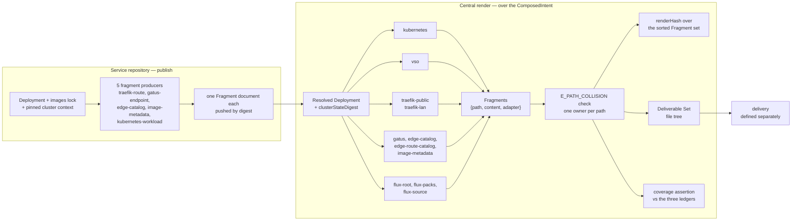

# Chapter 30 — Deliverable Set

Layer 3. Never authored, and — the property that makes the other two layers
worth separating — it contains **no decisions**.

## The rule

> A Fragment's content is a pure function of the Resolved Deployment, and its
> path is **assigned by** the Resolved Deployment
> ([0070](../../docs/adr/model/0070-path-authority-is-layer-2.md), normative in
> [chapter 20](20-resolved-deployment.md#the-path-plan)).

Layer 2 decided everything (chapter 20). Layer 3 serialises. If a renderer has to
choose, the choice belongs one layer up, and the choice being made here is the
defect — because a decision taken during serialisation appears in no schema, is
recorded in no lock, and is invisible in the published projection a Service owner
reads back.

An earlier form of this rule made the path a function of the adapter and the
object it carries. That form could not answer which Service directory owns a
per-domain object, and it put an estate-scoped Deliverable in whichever
namespace the emitting adapter happened to key off; both are recorded in
chapter 20's path plan as the reason authority moved up a layer. An Adapter
still declares a `defaultPath` — that is how the registry states what an Adapter
is for, and it is what the plan assigns from — but the path a Fragment carries
comes from the plan.

## Adapters

An **Adapter** is a named renderer registered in one registry. A **Fragment** is
the unit of output and of attribution, already implemented as exactly this shape:

```ts
{ path: string, content: string, adapter: string, executable?: boolean }
```

Every Fragment names its producing adapter. That is what makes the attribution
assertion below possible without new machinery, and it is why a blueprint pack is
not a special case — a pack **is a list of Fragments**, each tagged
`adapter: flux-packs`.

**The eighteen registered adapters are the v1 set**
([0052](../../docs/adr/model/0052-registered-adapters-are-v1.md), amended for
`vault-policy` by
[0073](../../docs/adr/model/0073-vault-policy-is-a-deliverable.md) and for
`networking` by
[0074](../../docs/adr/model/0074-networking-adapter-emits-policy.md)). They are enumerated
only by `adapterContract()`; nothing renders that is not registered. A second,
unregistered renderer generation exists in the tree today —
`src/deployment/render/`, 14 modules and 1,967 lines, reachable from neither
entry point, imported only by 11 test files, yet inside the `--lines 90` coverage
gate that guards every pull request. It is deleted in the code pass. Nothing it
contains is promoted for free: its renderers consume `ProjectModel` while the
registry hands adapters an `AdapterContext` of artifact documents, so bringing
its behaviour back is a port across that seam and costs what writing a new
adapter costs.

The eighteen fall into two roles, on the two sides of the composition seam
(chapter 40):

| role | count | runs in | input | output |
|---|---|---|---|---|
| **fragment producer** — the five `*-fragment` adapters | 5 | the Service repository, at publish time | that repository's `Deployment`, images lock and pinned cluster context | exactly one Fragment document per Adapter per Service, pushed by digest |
| **central adapter** | 13 | centrally, over the composed union | the Resolved Deployment as an `AdapterContext` of artifact documents | the file set for its subsystem |

The pairing is recorded, not folklore: `src/adapters/adapter-compat.ts` maps each
producer's `outputKind` and `outputSchema` to the central adapters that accept it
— `TraefikRouteFragment` to `traefik-public` and `traefik-lan`,
`KubernetesWorkloadFragment` to `kubernetes`, and so on — and the digest of that
map enters the render hash. A producer and its consumer therefore own different
kinds at different paths; they are not two generations of the same renderer, and
the earlier reading of them as duplicate "twins" is withdrawn here.

## The adapter port

Every adapter satisfies one typed port
([0053](../../docs/adr/model/0053-adapter-port-contract.md)):

> **Documents in, attributed Fragments out. Deterministic. No ambient reads. A
> path claimed twice is a build error.**

| invariant | normative statement | failure |
|---|---|---|
| one input shape | An adapter receives parsed, pinned documents and nothing else. `deploy-config` is one entry of that context; a published fragment is the same documents parsed and pinned. There is no discriminated union and no hand-set input string. | compile error |
| attributed output | Every returned Fragment carries `adapter`, set by the port, not by the adapter. | compile error |
| deterministic | Same documents in, byte-identical Fragments out, in a stable order. | `E_RENDER_NONDETERMINISTIC` |
| no ambient reads | No environment variable, clock, network or filesystem read inside `render`. Reading manifests from disk is the caller's job; the parsed documents are passed in. | `E_AMBIENT_INPUT_FORBIDDEN`, `E_INPUT_OUTSIDE_WORKDIR` |
| one owner per path | Two adapters may never claim the same output path. | `E_PATH_COLLISION` |
| safe paths | Every path is relative and normalised; `..` and absolute paths are rejected. | `E_UNSAFE_OUTPUT_PATH` |

Each of these is stated because the seam does not have it today. The registry
declares `render: (input: never) => RenderResult` under a comment calling the
entries "intentionally heterogeneous"; `never` accepts every function, both call
sites launder the argument through a double cast, and the only runtime check is
`typeof render === "function"`. Which of three declared input shapes an adapter
receives is one string comparison, `adapter.input === "canonical-artifacts"`, and
the five `deployment-fragment` adapters match no branch of their own — they fall
through to the `deploy-config` branch and are handed the wrong document.
`kubernetes-workload-fragment` reads raw manifests from disk inside `render`;
under the port that read moves to the caller, as `loadFragmentInput` already
does. `E_PATH_COLLISION` has **zero occurrences under `src/`**, while the writer
applies each prepared file in turn: two adapters sharing a path both write, second
wins, silently, both reporting `action: "create"`. The collision check belongs
where the Fragment set is assembled, not at the writer, and it must exist in code
before the coverage assertion means anything.

Two ratchets carry the port:

- **The `@ts-nocheck` count may only fall.** It stands at 10 files under `src/`,
  four of them registered adapters (`adapters/kubernetes.ts` and three flux
  adapters), while `tsconfig.json` sets `"strict": true` and the lint rule that
  would catch the pragma is off. The count becomes a CI gate; the four adapter
  files lose the pragma before v1.
- **The ambient-input prohibition has no public escape hatch.** The helper that
  skips it is a test-only path and stops being exported; tests pass the documents
  explicitly.

Narrowing the port is cheap now and expensive later. Once adapters outside this
repository register through the public `registerAdapter` export, the port is a
compatibility surface every out-of-tree adapter pins, and narrowing it means a
major toolkit release — a version number separate from `schemaVersion`
([0039](../../docs/adr/model/0039-artifact-schema-versioning.md), chapter 40).

## Vault configuration is rendered, not applied

`vso` emits the operator's Kubernetes objects — `VaultConnection`, `VaultAuth`,
the operator `ServiceAccount` per target namespace, `VaultStaticSecret`,
`VaultDynamicSecret`. None of those is a policy or an auth role, so until
[0073](../../docs/adr/model/0073-vault-policy-is-a-deliverable.md) the policy
that [0025](../../docs/adr/model/0025-access-tiers-derive-policy.md) derives had
no output at all, and a derivation with no output is not total
([0005](../../docs/adr/model/0005-derivation-is-total.md)).

The `vault-policy` adapter emits, **per Workload identity**, two documents:

| document | derived from |
|---|---|
| the Vault policy | the Workload's grants and their access tiers: `read` on the granted path, `patch` for `self-roll`, `create`/`update`/`delete` on a prefix for `custody`, nothing for `self-renew` |
| the Kubernetes auth role | the Workload's ServiceAccount and namespace ([0024](../../docs/adr/model/0024-identity-per-workload.md)), bound to that one policy |

One document per identity, not per Service: identity is per Workload, so a
two-Workload Service produces two policies and a diff says which principal's
privilege changed. Both are JSON, which Vault accepts and which lets the one
serializer own key order.

**Rendered, not applied.** Writing a policy into Vault is an act against a live
system by an identity with privilege, which is delivery
([`docs/adr/deferred/`](../../docs/adr/deferred/README.md)). This chapter emits
the documents and attributes them; nothing here says who writes them.

**The auth method itself is a platform fixture.** Mounting `kubernetes` auth,
configuring its JWT issuer and CA, and creating the KV mounts are estate-unique
and draw on a shared resource, so by
[0004](../../docs/adr/model/0004-contention-decides-authority.md) they are
platform-assigned, and they arrive through a blueprint pack
([chapter 60](60-setup.md#secrets-at-rest)) rather than per-Service render. The
render owns what varies per Workload and nothing else.

## Attribution

**Every Deliverable is attributed to exactly one Adapter**
([0054](../../docs/adr/model/0054-adapter-attribution.md)). Attribution is a property of
the producer, declared in the registry, not a property of the output that an edit
could lose:

- Every registry entry declares a `defaultPath`, and registration throws
  `adapter definition missing defaultPath` without one. Verified 2026-08-31
  against `src/adapters/registry.ts`: 16 definitions, all sixteen carrying one.
  `vault-policy` and `networking` are the seventeenth and eighteenth and carry
  one by the same rule.
- `adapterContract()` is the only enumeration of the set. A tool that needs to
  know who produces what reads it; nothing reconstructs ownership by scanning
  rendered YAML.
- A fragment producer emits one Fragment per Adapter per Service. A central
  adapter emits a file set, every file of it a Fragment naming that adapter and
  no other.
- A file no adapter claims cannot ship silently. It becomes a ledger entry with
  an owner and a reason, or the build fails.

There is **no target-neutral deliverable IR**. Nomad appears in this estate only
in a `flux-modules` denylist and in a reserved `extensions.nomad` slot annotated
*"Reserved extension area for future Nomad inputs. No renderer consumes it in
this feature."*, with `renderer_status: design_only` enforced by the artifact
validator. An abstraction with one consumer is shaped entirely by that consumer,
so a neutral IR built today would be Kubernetes-shaped and wrong for Nomad on the
day Nomad arrived. If a second target ever exists, that is when the abstraction
gets lifted, with two real consumers to shape it.

Two adapters may render objects of the same **kind** — `kubernetes` creates the
Service's own `ServiceAccount`, `vso` mirrors the VSO operator's `ServiceAccount`
into each target namespace. That is allowed: attribution is per Fragment, and
single authority is per **field**, not per kind. What is never allowed is two
adapters claiming one path.

### Path allocation

Paths are deterministic and derived, never configured per Service:

```
<gitopsRoot>/apps/<group>/<service>/<fragment>.yaml
<gitopsRoot>/apps/vso-secrets/<fragment>.yaml
<gitopsRoot>/apps/edge/traefik-ingressroutes.yaml
<gitopsRoot>/clusters/<cluster>/kustomizations.yaml
fragments/<producer>/<fragment>.yaml
```

Three central adapters — `kubernetes`, `flux-packs`, `flux-source` — declare the
same `platform/cluster/flux/apps` prefix and are kept apart only by the group and
service segments they append. That is a live path-collision hazard with no
enforcement behind it, and it is the concrete reason `E_PATH_COLLISION` is a
build error in this chapter rather than a convention.

## Ledgers

**Every accepted hole is a bidirectional ledger**
([0055](../../docs/adr/model/0055-bidirectional-ledgers.md)). Each ledger fails **both**
when something is missing from it and when one of its own entries no longer
matches anything, which is the property `catalog/accepted-fragment-drift.yml`
already has and states:

> *"fails on anything absent from this file, and also fails on an entry here that
> no longer matches anything — so the list cannot quietly outlive the thing it
> excuses. Every entry is a deferred fix, not a permanent exemption."*

| ledger | holds | absent from it | stale entry in it |
|---|---|---|---|
| coverage ledger | every live object with no producing adapter | `E_UNATTRIBUTED_OBJECT` | `E_LEDGER_ENTRY_STALE` |
| accepted fragment drift | differences between the render and what a Service published, each a deferred fix | `E_UNACCEPTED_DRIFT` | `E_LEDGER_ENTRY_STALE` |
| registered unmanaged surfaces | hostnames the model does not deploy ([0019](../../docs/adr/model/0019-registered-unmanaged-surfaces.md), chapter 40) | `E_UNREGISTERED_SURFACE` | `E_LEDGER_ENTRY_STALE` |

Every entry carries three fields and a build consequence:

| field | rule |
|---|---|
| `owner` | a person, never a team alias; required |
| `reason` | why the hole is accepted, in prose a reviewer can disagree with |
| `review-date` | a date; **a date in the past fails the build** — `E_LEDGER_REVIEW_OVERDUE` |

A review date with no consequence is an adjective. With one maintainer across
three identities in `git shortlog`, every review date is a note to self, and the
build failure — not the review — is what enforces the deadline.

The check runs against the pinned `ClusterState` snapshot
([0034](../../docs/adr/model/0034-cluster-state-pinned-input.md), chapter 20), so a
ledger verdict is exactly as fresh as that snapshot's `clusterStateDigest` and no
fresher. Closing a hole is therefore always two changes — register the adapter,
delete the entry — and forgetting the second breaks the build. That is the whole
point of the stale half: without it, a coverage entry outlives the adapter that
closed it and no build says so.

One live drift entry marks where the limit genuinely is: `agent-gateway` cannot be
probed because it is *"a sidecar jar inside agent-runner pods, not a workload of
its own"*, and its per-runner Services are created and destroyed by `agents-api`
at runtime. Some objects are outside any declarative model. The ledger is where
they belong — with an owner and a reason, not with silence.

## Coverage

Coverage is re-derived from the registry, never asserted from memory. What
follows is the enumeration of `adapterContract()` as it stands, and the gap that
enumeration genuinely leaves.

### The registered set

Paths abbreviate `platform/cluster/flux` as `…`.

| adapter | target | declared path | emits |
|---|---|---|---|
| `edge-catalog` | edge | `…/apps/edge/edge-catalog-configmap.yaml` | the platform edge catalog `ConfigMap` |
| `edge-catalog-fragment` | fragment | `fragments/edge-catalog` | one `EdgeCatalogFragment` |
| `edge-route-catalog` | edge | `…/apps/edge/edge-route-catalog-configmap.yaml` | the route catalog `ConfigMap` |
| `flux-packs` | flux | `…/apps` | pack trees copied at a pinned ref, plus `Namespace`, `VaultStaticSecret` and each group's kustomize `Kustomization` |
| `flux-root` | flux | `…/clusters/production/kustomizations.yaml` | the cluster root: one Flux `Kustomization` per layer, plus the cluster kustomize `Kustomization` |
| `flux-source` | flux | `…/apps` | `HelmRepository` and `HelmRelease` per chart |
| `gatus` | edge | `…/apps/utility-system/gatus/gatus-endpoints-configmap.yaml` | the endpoints `ConfigMap` |
| `gatus-endpoint-fragment` | fragment | `fragments/gatus-endpoint` | one `GatusEndpointFragment` |
| `image-metadata` | edge | `…/apps/edge/image-metadata.yaml` | the image metadata document — not a Kubernetes object |
| `image-metadata-fragment` | fragment | `fragments/image-metadata` | one `ImageMetadataFragment` |
| `kubernetes` | kubernetes | `…/apps` | per Service: `Namespace`, `ServiceAccount`, `Deployment`/`StatefulSet`/`Job`/`CronJob`, `Service`, `ConfigMap`, `PersistentVolume` + `PersistentVolumeClaim`, **`PodDisruptionBudget`**, `HorizontalPodAutoscaler`, **`ServiceMonitor`**, **`PodMonitor`**, guarded raw manifests, and the directory's kustomize `Kustomization` |
| `kubernetes-workload-fragment` | fragment | `fragments/kubernetes-workload` | one `KubernetesWorkloadFragment` |
| `networking` | networking | `…/apps` | every `NetworkPolicy`: one per Workload from the derived allow set plus the two baseline rules, and one namespace-wide default-deny per domain ([0074](../../docs/adr/model/0074-networking-adapter-emits-policy.md)) |
| `vault-policy` | vault | `…/apps/vso-secrets/policies` | per Workload identity: its derived Vault policy and its Kubernetes auth role, as JSON ([0073](../../docs/adr/model/0073-vault-policy-is-a-deliverable.md)) |
| `traefik-lan` | edge | `…/apps/edge/traefik-lan-ingressroutes.yaml` | `IngressRoute` per LAN route, with middleware references |
| `traefik-public` | edge | `…/apps/edge/traefik-ingressroutes.yaml` | `IngressRoute` per public route, with middleware references |
| `traefik-route-fragment` | fragment | `fragments/traefik-route` | one `TraefikRouteFragment` |
| `vso` | vault | `…/apps/vso-secrets` | `VaultConnection`, `VaultAuth`, the operator `ServiceAccount` per target namespace, `VaultStaticSecret`, `VaultDynamicSecret`, and its kustomize `Kustomization` |

### Correction to the earlier table

The previous version of this chapter recorded `PodDisruptionBudget` as *"no
adapter, no renderer"* and `ServiceMonitor` / `PodMonitor` / `PrometheusRule` as
*"exists but is not a registered adapter"*. **Both rows were wrong.** The
registered `kubernetes` adapter pushes `pdb.yaml`, `servicemonitor.yaml` and
`podmonitor.yaml`, and builds the PDB from `rollout.availability`. The table was
wrong on two of its four rows, and the bootstrap step that sequenced off it —
"22 of the 36-object coverage gap" — was costed against a number matching neither
renderer generation.

### The estate, by class

The 2026-08-31 survey stands and is retained as scale. Counted across
`fleet-infra/cluster`, excluding the Flux installer (`gotk-components.yaml`, 32
objects rendered from nothing): **450 objects, 39 distinct kinds, 329 files**.
`kind: Kustomization` is two unrelated APIs and is counted separately — 74
`kustomize.config.k8s.io/v1beta1` (a file list per directory) and 15
`kustomize.toolkit.fluxcd.io/v1` (a Flux reconcile unit); a claim that conflates
them is wrong by 74.

| class | objects | share | how it is produced |
|---|---|---|---|
| **A — derived from Service Intent** | 364 | 81% | a registered adapter, per Service |
| **B — pack-delivered platform infrastructure** | 41 | 9% | `flux-packs` / `flux-source` from `flux-modules` at a pinned ref ([0013](../../docs/adr/model/0013-blueprint-packs-pinned-checkout.md)) |
| **C — authored content** | 45 | 10% | not derivable; ledgered until its owner lands |

Class C is entirely Grafana — 31 `GrafanaDashboard`, 14 `GrafanaFolder`. Nothing
in Service Intent implies a dashboard's panels; deriving one would be inventing a
dashboard DSL. It is ledgered rather than permanent: 14 service dashboards become
Assets on the owning Service ([0012](../../docs/adr/model/0012-assets-not-code.md)), 3
runtime-family dashboards ship with the Runtime Profile, 14 platform dashboards
ship in the observability pack, and `service-overview` / `service-template` derive
per Service from the scrape surface and exposure
([0021](../../docs/adr/model/0021-observability-scrape-and-alert-class.md)).

### The true gap

With the two wrong rows removed, the class A gap is **20 objects, not 36** — and
it is three kinds, all genuinely unrendered by anything registered:

| kind | objects (2026-08-31) | the model demands it because | producer today |
|---|---|---|---|
| `ClusterRole` 6, `ClusterRoleBinding` 4, `Role` 4, `RoleBinding` 2 | 16 | workloads hold their own identity ([0024](../../docs/adr/model/0024-identity-per-workload.md), chapter 16) | **none.** No `rbac` adapter exists. `ClusterRole` and `ClusterRoleBinding` are also on the raw-manifest forbidden list, so they cannot ride in as authored YAML either |
| `NetworkPolicy` | 3 | network policy is default-deny, derived from the edge set ([0035](../../docs/adr/model/0035-network-policy-default-deny.md), chapter 16) | **none.** The only implementation is `src/deployment/render/networkpolicy.ts`, which the deletion in [0052](../../docs/adr/model/0052-registered-adapters-are-v1.md) removes; coverage for this kind goes from unregistered to absent |
| `PrometheusRule` | 1 | every Service declares an Alert Class ([0021](../../docs/adr/model/0021-observability-scrape-and-alert-class.md), chapter 10) | **none.** Zero occurrences anywhere under `src/`, in either generation |

`GitRepository` is a fourth honest correction: no registered adapter emits one.
`flux-root` only *references* `flux-system` as a `sourceRef`, and the estate's
single `GitRepository` is created by `flux bootstrap`. It is a bootstrap fact
(chapter 60), not a rendered Deliverable, and the earlier claim that `flux-source`
owned the kind was false.

Two rules govern the number itself. First, **20 is the corrected arithmetic on the
old survey, not a fresh measurement**: the object-level gap must be re-measured
per adapter against the registered generation before any schedule is committed,
because counting files under `fleet-infra/cluster` measures the cluster tree
rather than the registry. Second, no adapter is registered "for free" — writing
`rbac`, `networking` and `prometheus` against `AdapterContext` is three pieces of
adapter work of comparable size, and the v1 schedule prices them that way —
`rbac` excepted, which 0075 decides against writing at all
([0059](../../docs/adr/model/0059-v1-scope-stopping-rule.md)).

## Determinism and parity



`renderHash` is taken over the sorted Fragment set — each path, a NUL, then its
newline-normalised content — prefixed with the schema package integrity, the
deployment, images and context digests, and the `adapter-compat` digest. It is
therefore stable against emission order, and it moves when the adapter set's
compatibility map moves. Combined with chapter 20's pinned-input rule this gives
the property that matters: **re-rendering from the recorded input digests,
including `clusterStateDigest`, produces a byte-identical tree.** A mismatch means
an input was not pinned.

The parity check compares the rendered tree against the pinned `ClusterState` by
object identity — `apiVersion/kind/namespace/name` — with a behavioural profile so
that coordinates differing for structural reasons do not read as drift. The
estate's own last comparison is the model for it: 324 objects, 316 identical once
account, publish-path and pin coordinates were neutralised, 8 differing and every
one explained. *"Anything left that is not in the table above is real drift and
needs a decision, not an allowlist entry."*

## Forbidden in a Deliverable

| forbidden | why |
|---|---|
| a raw `Secret` with a literal value | the raw-manifests guard scans for it; secrets arrive through VSO or are fetched by the workload (chapter 10) |
| a kind on the forbidden list — `Secret`, `ClusterRole`, `ClusterRoleBinding`, `CustomResourceDefinition`, `Namespace` | `E_FORBIDDEN_KIND`; the guard reports kind, filename and line |
| a `PersistentVolumeClaim` or a cluster-scoped kind out of a fragment producer | `E_FORBIDDEN_KIND`; those objects are the central adapter's to render, not a Service repository's |
| an object in a namespace the Service does not own | `E_FOREIGN_NAMESPACE` |
| a floating image tag | `E_FLOATING_IMAGE`; digests only |
| a path claimed by two adapters | `E_PATH_COLLISION`; attribution becomes ambiguous |
| a path outside the gitops root, or containing `..` | `E_UNSAFE_OUTPUT_PATH` |
| a hand-added file inside the rendered tree | `E_RENDER_OVERWRITE_REFUSED`; the writer refuses to overwrite a file it does not manage, and parity would stay red |

## Delivery is defined separately

The model's obligation ends at a **complete, attributed, deterministic file
tree**. What applies that tree to a cluster — the delivery mechanism, apply and
prune ordering, inventories, field managers, deploy RBAC, break-glass, and whether
another unit's tests gate a deploy — is **defined separately from the model** and
is not specified in v1. See [docs/adr/deferred/](../../docs/adr/deferred/README.md).

One model-level consequence belongs here, because it is what makes coverage
load-bearing rather than hygiene: **an object the render omits is an object no
Deliverable Set claims.** Any delivery definition that reconciles a cluster
towards this tree will treat an unclaimed object as removable, so a coverage gap
is a correctness problem in the model, not a tidiness problem downstream. That is
why the coverage assertion fails the build, why the ledger fails in both
directions, and why a domain that silently fails to publish must show up as a
stale participant (chapter 40) rather than as a quietly smaller render.

## Open in this chapter

1. ~~**`rbac` does not exist.**~~ **Decided:** it will not.
   [0075](../../docs/adr/model/0075-no-workload-rbac-in-v1.md) renders no
   `Role` or `RoleBinding` for a Workload, because under `delivery: env` and
   `delivery: file` the kubelet projects the Secret and the pod never calls the
   API, so a least-privilege Role grants nothing. The absence becomes a checked
   property instead — `E_WORKLOAD_RBAC_GRANT`
   ([chapter 40](40-composition.md#secrets)) — and the 16 objects counted here
   are objects that will not be rendered rather than a gap.
   [0024](../../docs/adr/model/0024-identity-per-workload.md)'s per-Workload
   identity is still bound, by the Vault auth role
   ([0073](../../docs/adr/model/0073-vault-policy-is-a-deliverable.md)), which
   is where that identity is actually used.
2. ~~**`NetworkPolicy` regresses to zero producers**~~ **Decided:** the
   `networking` adapter
   ([0074](../../docs/adr/model/0074-networking-adapter-emits-policy.md)) is the
   producer — per-Workload policies from the derived allow set plus the two
   baseline rules, and one namespace-wide default-deny per domain. Still a port
   rather than a registration, and still unwritten; the decision is which
   adapter owns it.
3. **`PrometheusRule` has no implementation in either generation.** *Settled by:*
   a `prometheus` adapter deriving rules from the Alert Class.
4. **`E_PATH_COLLISION` is specified here and implemented nowhere** — zero
   occurrences under `src/`, three central adapters sharing one path prefix.
   *Settled by:* the check at Fragment-set assembly, plus a test registering two
   adapters on one path and asserting the build fails.
5. **The `@ts-nocheck` count is 10, four of them registered adapters.** *Settled
   by:* the CI ratchet landing, and the four adapter files type-checking under
   `strict: true`.
6. **The object-level gap is arithmetic on an old survey.** *Settled by:* a
   per-adapter measurement against the registered generation, recorded as the
   corrected class-A gap in [The true gap](#the-true-gap).
7. **The Service `ServiceAccount` name is the Service Id today**, while
   [0024](../../docs/adr/model/0024-identity-per-workload.md) requires
   `<service>-<workload>`, collapsing to `<service>` only for single-workload
   Services. *Settled by:* the `kubernetes` adapter deriving the name per
   Workload, and chapter 16's identity table matching what renders.
8. **The gitops root is still `platform/cluster/flux` in the allocator** while
   `fleet-infra` uses `cluster/flux`. One of the two is stale; the packs' Fragment
   paths carry the `platform/` prefix, which suggests the allocator predates the
   monorepo split. *Settled by:* rendering against the live tree and comparing
   paths.
