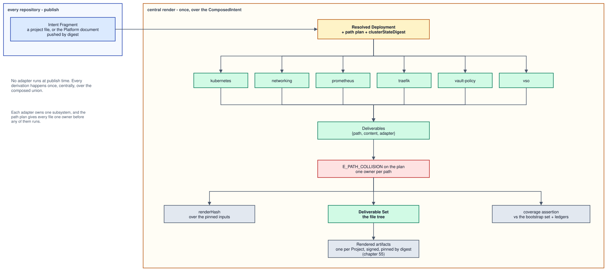
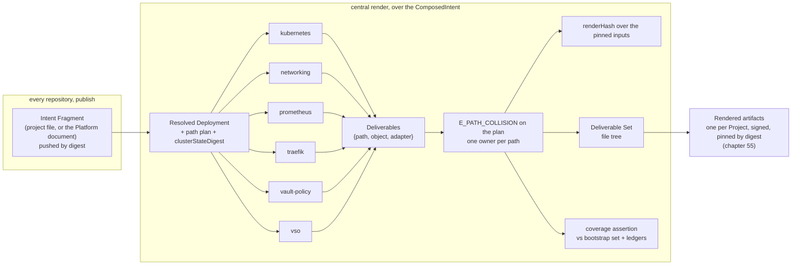

# Chapter 30: Deliverable Set

Layer 3. Never authored, and the property that makes the other two layers
worth separating) it contains **no decisions**.

## The rule

> A Deliverable's content is a pure function of the Resolved Deployment, and its
> path is **assigned by** the Resolved Deployment
> ([0036](../../docs/adr/model/0036-path-authority-is-layer-2.md), normative in
> [chapter 20](20-resolved-deployment.md#the-path-plan)).

Layer 2 decided everything (chapter 20). Layer 3 serialises. If a renderer has to
choose, the choice belongs one layer up, and the choice being made here is the
defect, because a decision taken during serialisation appears in no schema, is
recorded in no lock, and is invisible in the published projection an Application owner
reads back.

An earlier form of this rule made the path a function of the adapter and the
object it carries. That form could not answer which Application directory owns a
per-project object, and it put an estate-scoped Deliverable in whichever
namespace the emitting adapter happened to key off; both are recorded in
chapter 20's path plan as the reason authority moved up a layer. An Adapter
still declares a `defaultPath` (that is how the registry states what an Adapter
is for, and it is what the plan assigns from), but the path a Deliverable
carries comes from the plan.

## Adapters

An **Adapter** is a named renderer registered in one registry. A **Deliverable**
is the unit of output and of attribution:

```ts
{ path: string, object: TypedObject, adapter: string }
```

Every Deliverable names its producing adapter. That is what makes the
attribution assertion below possible without new machinery.

An adapter is a model-to-model step: it maps the Resolved Deployment into the
narrow Kubernetes and Vault object model (`TypedObject`), and nothing more. The
Deliverable's `object` is that model object, and its `content` is the output of
the one serializer turning that object into bytes. An adapter never formats
bytes itself: there is exactly one serializer, so determinism, key order and
line endings are one module's responsibility
([0058](../../docs/adr/architecture/0058-every-step-links-through-one-trace.md)).
A Deliverable holds `path`, `object` and `adapter`; it has no `content` string
an adapter would write, and no `executable` flag: nothing in the model is
executable ([0014](../../docs/adr/model/0014-file-shaped-configuration-is-an-asset.md)).

**The registry is the enumeration**
([0037](../../docs/adr/model/0037-six-registered-adapters-satisfy-one-port.md), rewritten by
[0047](../../docs/adr/model/0047-one-publication-path.md)): nothing renders
that is not registered, `adapterContract()` is the only list, and a change to the
set is a decision with its own ADR. The set is six, one per subsystem, and every
one of them is a **central** adapter running once over the composed union:

| adapter | subsystem | emits |
|---|---|---|
| `kubernetes` | processes | per Application: the controller, `Service` (none for a `blue-green` Process, whose Services Flagger generates), the `Canary` of each `blue-green` Process with its `HorizontalPodAutoscaler` where it declares `replicas` ([Flagger-ready objects](#flagger-ready-objects)), `ServiceAccount` (and each backup identity's), `ConfigMap` (including every inbound-derived Asset, and each gated Application's `<application>-release-gate`, [chapter 20](20-resolved-deployment.md#the-release-gate)) `PersistentVolumeClaim` (and each backup claim), `PodDisruptionBudget` above one replica, the backup `CronJob`, the migration identity with its per-revision migration `Job` and suspended down `Job` ([chapter 55](../../spec/v1/55-delivery.md#failure-and-undo)), `Namespace` per project, and the kustomize `Kustomization` per directory |
| `networking` | policy | every `NetworkPolicy` ([0035](../../docs/adr/model/0035-network-policy-is-default-deny-and-render-only.md)) |
| `prometheus` | monitoring | one `ServiceMonitor` or `PodMonitor` per Application that declares `observability`, from the named surface and the Platform document's cadence. No `PrometheusRule`: PromQL is the monitoring stack's ([chapter 10](../../spec/v1/10-project-intent.md#observability)) |
| `traefik` | edge | one `IngressRoute` set and one `Middleware` set **per tier** the Platform document declares ([0023](../../docs/adr/model/0023-exposure-is-declared-by-audience.md), [0047](../../docs/adr/model/0047-one-publication-path.md)) |
| `vault-policy` | secret store | one policy and one auth role per Process identity, as JSON ([0040](../../docs/adr/model/0040-vault-policy-is-a-deliverable.md)) |
| `vso` | secret delivery | `VaultConnection` per namespace, `VaultAuth` per identity that holds a synced grant, `VaultStaticSecret`, `VaultDynamicSecret` |

**There is one publication path.** A repository publishes its Intent Fragment
by digest ([chapter 40](40-composition.md#fragments)) and nothing else; no
adapter runs at publish time. The five publish-time `*-fragment` producers of the
previous generation, and the `adapter-compat` map that paired them with their
consumers, are deleted: every kind they emitted is derived centrally from the
same declaration, so they were a second render of the same intent, and their
map's digest padded `renderHash` for no reason but to pair them. An Application owner
who wants to see their own render runs the same core locally over the same pinned
inputs: a use-case, not a second adapter set.

Three former adapters are not deleted so much as reclassified. The Gatus
endpoints and the two edge catalogs are **inbound derivations** of the platform
Application that consumes them ([chapter 16](16-dependencies.md#what-an-edge-derives-read-inbound)),
rendered as that Application's own Assets by `kubernetes`. Image metadata is a
**projection of the images lock** and joins the Resolved Deployment artifact set
([chapter 20](20-resolved-deployment.md#publish-back)). `flux-root` (one Flux
`Kustomization` per layer, with `dependsOn` and health checks) is one delivery
mechanism's reading of the Reconcile Unit DAG, and is taken up by
[chapter 55](55-delivery.md#rendered-artifacts-and-pins), where each Project's
pinned source is what a Kustomization applies. `flux-packs` and `flux-source` had nothing left to render once the
foundation was declared ([0046](../../docs/adr/model/0046-the-foundation-is-declared.md)).

A second, unregistered renderer generation exists in the tree being replaced: `src/deployment/render/`, 14 modules and 1,967 lines, reachable from neither
entry point, imported only by 11 test files, yet inside the `--lines 90` coverage
gate that guards every pull request. It is deleted in the code pass, and nothing
it contains is promoted for free: bringing its behaviour back is a port across
the adapter port and costs what writing a new adapter costs.

## The adapter port

Every adapter satisfies one typed port
([0037](../../docs/adr/model/0037-six-registered-adapters-satisfy-one-port.md)):

> **Documents in, attributed Deliverables out. Deterministic. No ambient reads. A
> path claimed twice is a build error.**

| invariant | normative statement | failure |
|---|---|---|
| one input shape | An adapter receives the Resolved Deployment as parsed, pinned documents and nothing else. There is no discriminated union and no hand-set input string. | compile error |
| attributed output | Every returned Deliverable carries `adapter`, set by the port, not by the adapter. | compile error |
| deterministic | Same documents in, byte-identical Deliverables out, in a stable order. | `E_RENDER_NONDETERMINISTIC` |
| no ambient reads | No environment variable, clock, network or filesystem read inside `render`. Reading manifests from disk is the caller's job; the parsed documents are passed in. | `E_AMBIENT_INPUT_FORBIDDEN`, `E_INPUT_OUTSIDE_WORKDIR` |
| one owner per path | Two adapters may never claim the same output path. | `E_PATH_COLLISION` |
| safe paths | Every path is relative and normalised; `..` and absolute paths are rejected. | `E_UNSAFE_OUTPUT_PATH` |

Each of these is stated because the seam does not have it today. The registry
declares `render: (input: never) => RenderResult` under a comment calling the
entries "intentionally heterogeneous"; `never` accepts every function, both call
sites launder the argument through a double cast, and the only runtime check is
`typeof render === "function"`. Which of three declared input shapes an adapter
receives is one string comparison, `adapter.input === "canonical-artifacts"`, and
the five publish-time producers match no branch of their own, they fall through
to the `deploy-config` branch and are handed the wrong document. One of them
reads raw manifests from disk inside `render`. `E_PATH_COLLISION` has **zero
occurrences under `src/`**, while the writer applies each prepared file in turn:
two adapters sharing a path both write, second wins, silently, both reporting
`action: "create"`. The collision check belongs where the Deliverable set is
assembled, on the path plan, before any adapter runs
([chapter 20](20-resolved-deployment.md#the-path-plan)), and it must exist in
code before the coverage assertion means anything.

Two ratchets carry the port:

- **The `@ts-nocheck` count may only fall.** It stands at 10 files under `src/`,
  four of them registered adapters (`adapters/kubernetes.ts` and three flux
  adapters), while `tsconfig.json` sets `"strict": true` and the lint rule that
  would catch the pragma is off. The count becomes a CI gate; the four adapter
  files lose the pragma before v1.
- **The ambient-input prohibition has no public escape hatch.** The helper that
  skips it is a test-only path and stops being exported; tests pass the documents
  explicitly.

Narrowing the port is cheap now and expensive later. Once adapters outside this
repository register through the public `registerAdapter` export, the port is a
compatibility surface every out-of-tree adapter pins, and narrowing it means a
major toolkit release, a version number separate from `schemaVersion`
([0044](../../docs/adr/model/0044-artifact-schema-versioning.md), chapter 40).

## Vault configuration is rendered, not applied

`vso` emits the operator's Kubernetes objects: one `VaultConnection` per project
namespace, to the Secret Store's endpoint the projection carries; one
`VaultAuth` per identity that holds a grant delivered `env` or `file`, a
Process or a backup identity, in its Application's directory; and one
`VaultStaticSecret` per such grant, beside it, or a `VaultDynamicSecret`. A
grant delivered `self` is read by the Process itself and syncs nothing. The
objects are applied with the Application they serve, not by
`apps-vso-secrets`: the namespace and the ServiceAccount a `VaultAuth` names
exist only once the Application's own unit applies, and its pod waits on the
Secret. Every destination Secret it asks for is excluded from
Flagger's configuration tracking, and a restart target names a `blue-green`
Process's `<name>-primary`, so rotating a value never starts a release
([chapter 55](55-delivery.md#secret-rotation)). None of those is a policy or an auth role, so until
[0040](../../docs/adr/model/0040-vault-policy-is-a-deliverable.md) the policy
that [0029](../../docs/adr/model/0029-a-grant-is-a-union-on-engine.md) derives had
no output at all, and a derivation with no output is not total
([0005](../../docs/adr/model/0005-derivation-is-total.md)).

The `vault-policy` adapter emits, **per identity that holds a grant** (each
Process, and each backup identity that holds its destination's credential), two
documents, at `apps/vso-secrets/policies/<namespace>/<identity>.{policy,role}.json`:

| document | derived from |
|---|---|
| the Vault policy | the Process's grants and their access tiers: `read` on the granted path, `patch` for `self-roll`, `create`/`update`/`delete` on a prefix for `custody`, nothing for `self-renew` |
| the Kubernetes auth role | the identity's ServiceAccount and namespace ([0031](../../docs/adr/model/0031-identity-per-process.md)), bound to that one policy by its name, `<namespace>-<identity>`; the role carries the same name, which is what its `VaultAuth` asks for ([chapter 16](16-dependencies.md#process-identity)) |

One document per identity, not per Application: identity is per Process, so a
two-Process Application produces two policies and a diff says which principal's
privilege changed. Both are JSON, which Vault accepts and which lets the one
serializer own key order.

**Rendered here, applied in the cluster.** Writing a policy into Vault is an act
against a live system by an identity with privilege, which is delivery
([0087](../../docs/adr/model/0087-in-cluster-consumers-read-the-render.md)). The
**Vault policy job** writes them: a Job in the `apps-vso-secrets` Reconcile Unit,
so it runs before any Application that holds a grant, whose image is the
`delivery` project's. The Reconcile Unit carries the documents into the job as a
generated `ConfigMap`, so the job writes exactly the documents of the render
that applied it, and nothing else. The job is named by the digest of those
documents, `vault-policy-<12 hex>`: a Job's template cannot change once created,
so a changed policy set is a new Job, and the one it replaces leaves the render
with it. Until [#202](https://github.com/JorisJonkers-dev/deploy-kit/issues/202)
lands, the render carries the documents alone, and no job applies them.

- It authenticates as a dedicated **policy-admin** role, a platform fixture
  created with the auth method, because it cannot grant itself the privilege to
  write policies.
- It writes each policy and each auth role under its rendered name,
  `<namespace>-<identity>`, and leaves an unchanged one as it is.
- It never deletes. A role and policy Vault holds that the render no longer
  names are reported, and a human removes them.
- A job that fails stops the Reconcile Unit, so no Application that holds a
  grant starts against policies Vault does not hold yet.

**The auth method itself is a platform fixture.** Mounting `kubernetes` auth,
configuring its JWT issuer and CA, and creating the KV mounts are estate-unique
and draw on a shared resource, so by
[0004](../../docs/adr/model/0004-contention-decides-authority.md) they are
platform-assigned, and they are Assets of the declared `vault` Application in the
platform's secrets project ([0046](../../docs/adr/model/0046-the-foundation-is-declared.md),
[chapter 60](60-setup.md#secrets-at-rest)) rather than per-Application render. The
per-Application render owns what varies per Process and nothing else.

## Attribution

**Every Deliverable is attributed to exactly one Adapter**
([0037](../../docs/adr/model/0037-six-registered-adapters-satisfy-one-port.md)). Attribution is a property of
the producer, declared in the registry, not a property of the output that an edit
could lose:

- Every registry entry declares a `defaultPath`, and registration throws
  `adapter definition missing defaultPath` without one. It is what the path plan
  assigns from ([0036](../../docs/adr/model/0036-path-authority-is-layer-2.md)).
- `adapterContract()` is the only enumeration of the set. A tool that needs to
  know who produces what reads it; nothing reconstructs ownership by scanning
  rendered YAML.
- An adapter emits a file set, every file of it a Deliverable naming that adapter
  and no other.
- A file no adapter claims cannot ship silently. It becomes a ledger entry with
  an owner and a reason, or the build fails.

There is **no target-neutral deliverable IR**. Nomad appears in this estate only
in a `flux-modules` denylist and in a reserved `extensions.nomad` slot annotated
*"Reserved extension area for future Nomad inputs. No renderer consumes it in
this feature."*, with `renderer_status: design_only` enforced by the artifact
validator. An abstraction with one consumer is shaped entirely by that consumer,
so a neutral IR built today would be Kubernetes-shaped and wrong for Nomad on the
day Nomad arrived. If a second target ever exists, that is when the abstraction
gets lifted, with two real consumers to shape it.

Two adapters may render objects of the same **kind**, `kubernetes` creates the
Application's own `ServiceAccount`, `vso` mirrors the VSO operator's `ServiceAccount`
into each target namespace. That is allowed: attribution is per Deliverable, and
single authority is per **field**, not per kind. What is never allowed is two
adapters claiming one path.

### Path allocation

Paths are assigned by the Resolved Deployment's path plan
([chapter 20](20-resolved-deployment.md#the-path-plan)) from each adapter's
`defaultPath`, never configured per Application:

```
<gitopsRoot>/apps/<project>/<application>/<object>.yaml
<gitopsRoot>/apps/<project>/namespace.yaml
<gitopsRoot>/apps/<project>/networkpolicy.yaml
<gitopsRoot>/apps/<project>/vaultconnection.yaml
<gitopsRoot>/apps/vso-secrets/policies/<namespace>/<identity>.{policy,role}.json
<gitopsRoot>/apps/edge/<tier>/<application>-<exposure>.yaml
```

The project's `networkpolicy.yaml` is its one namespace-wide default-deny
([chapter 16](16-dependencies.md#network-policy)), a per-project object with an
owner, the `networking` adapter. Under an Application's directory the objects
are `workload.yaml`, `serviceaccount.yaml` and `canary.yaml` (`kubernetes`),
`networkpolicy.yaml` (`networking`) and `podmonitor.yaml` (`prometheus`). Every
directory the render writes carries a `kustomization.yaml` (`kubernetes`)
listing what that directory applies: its files and, for a project's directory,
each Application's directory beside its `namespace.yaml`. **No kustomization
lists a `networkpolicy.yaml`** while chapter 16's stage is render-only
([Audit before enforce](16-dependencies.md#audit-before-enforce)): the policy set
is in the artifact, reviewed and signed with everything else, and applied by
nothing, and none lists a Vault document, which is no Kubernetes object. The
paths under `apps/edge/` and `apps/vso-secrets/` are estate-scoped, so they are
the `_estate` artifact's ([chapter 55](55-delivery.md#rendered-artifacts-and-pins)),
while each IngressRoute stays in its Application's own namespace
([Forbidden in a Deliverable](#forbidden-in-a-deliverable)).

### How each adapter spells the projection

Each adapter is the one place its target's vocabulary is spelled, and it
spells only what the projection holds:

| model value | adapter | spelled as |
|---|---|---|
| a `blue-green` Process | `kubernetes` | a `Deployment` with no `replicas` and a `RollingUpdate` of surge 1, unavailability 0, which Flagger scales and promotes; a `Canary` whose `service` is the Process's first surface and whose three webhooks are the gate's `endpoint` with `/may-start`, `/checks` and `/may-promote`, each carrying the Application, the Process and the Application revision |
| a `stop-start` Process | `kubernetes` | a `Deployment` of its `replicas` with a `Recreate` strategy, and a `Service` named for the Process that selects its `instance` and serves each of its surfaces by name |
| a volume | `kubernetes` | a `ReadWriteOnce` `PersistentVolumeClaim` named for the claim at the volume's `size`, mounted at its `mountAt`, the pod's `fsGroup` the image's `gid` |
| a backed-up volume's `backup` | `kubernetes` | a `CronJob` named for the backup claim at the plan's `schedule`, `concurrencyPolicy: Forbid`, running the `method` image as the plan's `uid` and `gid` under the backup identity's `ServiceAccount` with no token mounted; the volume mounted read-only at `/data`, the backup claim at `/backup`, `BACKUP_RETAIN` the `retain` count, `BACKUP_OFF_CLUSTER` the destination and the credential's Secret as variables where it copies off-cluster; the backup claim a second `PersistentVolumeClaim` at the volume's `size`, and both carrying `kustomize.toolkit.fluxcd.io/prune: disabled` |
| an Asset | `kubernetes` | an immutable `ConfigMap` under the Asset's `name`, its one key the file name of `from`; a volume of that name, mounted at `mountAt` by that key, read-only |
| a gated Application's `releaseGate` | `kubernetes` | a `ConfigMap` named `<application>-release-gate` in the Application's namespace, the first object of its `configmap.yaml`, labelled `part-of` the Application and `managed-by`; its one key `releaseGate.json`, the element as canonical JSON (RFC 8785) on one line. Not immutable: the name stays and the content changes with a release |
| a grant's holder | `vault-policy` | a policy and an auth role, both to be written as `<namespace>-<identity>`, at `policies/<namespace>/<identity>.{policy,role}.json`; the role binds the identity's `ServiceAccount` in that namespace to that one policy |
| a sidecar | `kubernetes` | a second container of the pod, its own `memory` and `cpu`, the same posture and the Process's variables |
| a writable path | `kubernetes` | an `emptyDir` at the path's `size`, named `writable` and the path with every run of other characters a `-`, mounted at the path |
| a secret reference | `kubernetes` | `valueFrom.secretKeyRef`, the grant's `destination` and the reference's `key` |
| the `secretStore` endpoint | `vso` | a `VaultConnection` named `secret-store` in the project's namespace, at that address, `skipTLSVerify: false` |
| a grant delivered `env` or `file` | `vso` | a `VaultAuth` per holding identity, its `ServiceAccount` that identity and its role `<namespace>-<identity>`, over the `secret-store` connection; a `VaultStaticSecret` named for the `destination`, `kv-v2` on the `secret` mount at the path below `secret/data/`, `refreshAfter: 1h`, its destination created and `flagger.app/config-tracking: disabled`, each restart target a `Deployment`, a `blue-green` Process's `-primary` |
| a `read` grant | `vault-policy` | `read` on its path and on the same document's `secret/metadata/` path |
| `hardening: restricted` | `kubernetes` | `runAsNonRoot`, the images lock's `uid` and `gid`, seccomp `RuntimeDefault`, a read-only root filesystem, every capability dropped |
| a probe's `period`, `timeout`, `failures` | `kubernetes` | `periodSeconds`, `timeoutSeconds`, `failureThreshold`; `initialDelaySeconds: 0` on readiness and liveness only |
| `ingress`, `egress`, an edge's `peers` | `networking` | one rule per peer, from or to its namespace (by `kubernetes.io/metadata.name`) and, where the peer is a Process, its `instance`, on TCP; the `cluster-dns` peer on UDP and TCP both |
| `scrape` of a `blue-green` Process | `prometheus` | a `PodMonitor` in the Application's namespace, `jobLabel` the `instance` label, the scrape's surface, path, interval and timeout |
| `scrape` of a `stop-start` Process | `prometheus` | a `ServiceMonitor` over the Process's own `Service`, with the same selection and endpoint |
| a tier's `listener` | `traefik` | the entry point: `tls` is `websecure`, `plain` is `web` |
| a tier's `certificates` | `traefik` | `acme` is the certificate resolver of that name; `none` writes no TLS block |
| a route's `precedence` | `traefik` | `priority` is 1000 less the precedence, since Traefik tries the higher priority first |
| a route's `middleware` | `traefik` | a reference into the proxy's namespace: `forward-auth`, and `security-headers` suffixed with the content profile where one is named; the edge project renders the Middleware objects themselves |

Two adapters (`kubernetes` and `networking`) declare the same `apps` prefix
and are kept apart by the object segment. That is why `E_PATH_COLLISION` is
decided on the plan, before any adapter runs, rather than left as a convention.

## Ledgers

**Every accepted hole is a bidirectional ledger**
([0038](../../docs/adr/model/0038-bidirectional-ledgers.md)). Each ledger fails **both**
when something is missing from it and when one of its own entries no longer
matches anything, which is the property `catalog/accepted-fragment-drift.yml`
already has and states:

> *"fails on anything absent from this file, and also fails on an entry here that
> no longer matches anything, so the list cannot quietly outlive the thing it
> excuses. Every entry is a deferred fix, not a permanent exemption."*

| ledger | holds | absent from it | stale entry in it |
|---|---|---|---|
| coverage ledger | every live object with no producing adapter | `E_UNATTRIBUTED_OBJECT` | `E_LEDGER_ENTRY_STALE` |
| accepted fragment drift | differences between the render and what an Application published, each a deferred fix | `E_UNACCEPTED_DRIFT` | `E_LEDGER_ENTRY_STALE` |
| registered unmanaged surfaces | hostnames the model does not deploy ([0024](../../docs/adr/model/0024-dependency-edges-resolve-against-the-union.md), chapter 40) | `E_UNREGISTERED_SURFACE` | `E_LEDGER_ENTRY_STALE` |

Every entry carries three fields and a build consequence:

| field | rule |
|---|---|
| `owner` | a person, never a team alias; required |
| `reason` | why the hole is accepted, in prose a reviewer can disagree with |
| `review-date` | a date; **a date in the past fails the build**, `E_LEDGER_REVIEW_OVERDUE` |

A review date with no consequence is an adjective. With one maintainer across
three identities in `git shortlog`, every review date is a note to self, and the
build failure, not the review, is what enforces the deadline.

The check runs against the pinned `ClusterState` snapshot
([0034](../../docs/adr/model/0034-cluster-state-is-a-pinned-input.md), chapter 20), so a
ledger verdict is exactly as fresh as that snapshot's `clusterStateDigest` and no
fresher. Closing a hole is therefore always two changes, register the adapter,
delete the entry, and forgetting the second breaks the build. That is the whole
point of the stale half: without it, a coverage entry outlives the adapter that
closed it and no build says so.

One live drift entry marks where the limit genuinely is: `agent-gateway` cannot be
probed because it is *"a sidecar jar inside agent-runner pods, not a process of
its own"*, and its per-runner Applications are created and destroyed by `agents-api`
at runtime. Some objects are outside any declarative model. The ledger is where
they belong: with an owner and a reason, not with silence.

## Coverage

Coverage is re-derived from the registry, never asserted from memory. What
follows is the enumeration of `adapterContract()` as it stands, and the gap that
enumeration genuinely leaves.

### The registered set

The six adapters above are the set, and their `defaultPath`s are the roots of
the path plan. The estate's coverage is the union of what they emit plus the
bootstrap set ([chapter 14](14-platform-intent.md#the-bootstrap-set)) plus the
ledgers; anything live that is in none of the three is `E_UNATTRIBUTED_OBJECT`.

### The estate, by class

The 2026-08-31 survey stands and is retained as scale. Counted across
`fleet-infra/cluster`, excluding the Flux installer (`gotk-components.yaml`, 32
objects rendered from nothing): **450 objects, 39 distinct kinds, 329 files**.
`kind: Kustomization` is two unrelated APIs and is counted separately: 74
`kustomize.config.k8s.io/v1beta1` (a file list per directory) and 15
`kustomize.toolkit.fluxcd.io/v1` (a Flux reconcile unit); a claim that conflates
them is wrong by 74.

| class | objects | share | how it is produced |
|---|---|---|---|
| **A, derived from Project Intent** | 364 | 81% | a registered adapter, per Application |
| **B, the foundation** | 41 | 9% | was pack-delivered from `flux-modules` at a pinned ref; now **declared** as Applications of the platform projects and rendered like class A ([0046](../../docs/adr/model/0046-the-foundation-is-declared.md)). The CRDs among them are the bootstrap set |
| **C, authored content** | 45 | 10% | not derivable; ledgered until its owner lands |

Class C is entirely Grafana: 31 `GrafanaDashboard`, 14 `GrafanaFolder`. Nothing
in Project Intent implies a dashboard's panels; deriving one would be inventing a
dashboard DSL. It is ledgered rather than permanent: 14 application dashboards become
Assets on the owning Application ([0014](../../docs/adr/model/0014-file-shaped-configuration-is-an-asset.md)), 3
runtime-family dashboards ship with the Runtime Profile, 14 platform dashboards
become Assets of the declared observability Applications, and `service-overview` / `service-template` derive
per Application from the scrape surface and exposure
([0025](../../docs/adr/model/0025-observability-is-one-optional-block.md)).

### The true gap

Every kind the 2026-08-31 survey found unrendered now has a decision: `Role` and
`RoleBinding` are not rendered ([0041](../../docs/adr/model/0041-no-process-rbac-in-v1.md)),
`NetworkPolicy` is `networking`'s ([0035](../../docs/adr/model/0035-network-policy-is-default-deny-and-render-only.md)),
`ServiceMonitor` and `PodMonitor` are `prometheus`'s, from the declared
`observability.scrape` surface, and `PrometheusRule` is rendered by nothing here
([0025](../../docs/adr/model/0025-observability-is-one-optional-block.md)),
and `GitRepository` is a bootstrap fact
([0046](../../docs/adr/model/0046-the-foundation-is-declared.md)), created by
`flux bootstrap`, never rendered.

The number itself is arithmetic on an old survey, not a fresh measurement. The
object-level gap is re-measured per adapter against the registered generation
before any schedule is committed, because counting files under
`fleet-infra/cluster` measures the cluster tree rather than the registry.

## Determinism and parity



<sub>[Diagram source](#the-render-end-to-end) · edit by opening the SVG in draw.io</sub>

The Deliverable Set leaves the render as Rendered artifacts, one per Project,
which [chapter 55](55-delivery.md#rendered-artifacts-and-pins) delivers.

`renderHash` is taken over the recorded input digests (every Intent Fragment
including the Platform document, the images lock, the node contract, the
ClusterState snapshot), prefixed with the schema package integrity
([chapter 20](20-resolved-deployment.md#pinned-inputs)). It moves when and only
when an input moves. Combined with the pinned-input rule this gives the property
that matters: **re-rendering from the recorded digests, `clusterStateDigest`
included, produces a byte-identical tree.** A mismatch means an input was not
pinned.

The parity check compares the rendered tree against the pinned `ClusterState` by
object identity, `apiVersion/kind/namespace/name`, with a behavioural profile so
that coordinates differing for structural reasons do not read as drift. The
estate's own last comparison is the model for it: 324 objects, 316 identical once
account, publish-path and pin coordinates were neutralised, 8 differing and every
one explained. *"Anything left that is not in the table above is real drift and
needs a decision, not an allowlist entry."*

## Forbidden in a Deliverable

| forbidden | why |
|---|---|
| a kind on the forbidden list, `Secret`, `ClusterRole`, `ClusterRoleBinding`, `CustomResourceDefinition` | `E_FORBIDDEN_KIND`; a CRD is a bootstrap fact ([chapter 14](14-platform-intent.md#the-bootstrap-set)), a Secret arrives through VSO, and RBAC is not rendered ([0041](../../docs/adr/model/0041-no-process-rbac-in-v1.md)) |
| an object in a namespace the Application does not own | `E_FOREIGN_NAMESPACE` |
| a floating image tag | `E_FLOATING_IMAGE`; digests only |
| a path claimed by two adapters | `E_PATH_COLLISION`; attribution becomes ambiguous |
| a path outside the gitops root, or containing `..` | `E_UNSAFE_OUTPUT_PATH` |
| a hand-added file inside the rendered tree | `E_RENDER_OVERWRITE_REFUSED`; the writer refuses to overwrite a file it does not manage, and parity would stay red |
| a hand-written object of any kind, a raw manifest, a pack file | there is no pass-through ([0046](../../docs/adr/model/0046-the-foundation-is-declared.md)); what cannot be declared yet is a ledger entry with a review date |

## Flagger-ready objects

A `blue-green` Process is switched by Flagger
([chapter 55](55-delivery.md#what-the-render-leaves-to-flagger)), and Flagger
generates objects of its own and rewrites a label on the ones it copies. Every
adapter renders so that Flux and Flagger never own the same field
([0055](../../docs/adr/model/0055-the-render-leaves-flaggers-objects-to-flagger.md)):

| rule | adapter | why |
|---|---|---|
| one `Canary` per `blue-green` Process, its cadence the Platform document's `delivery.analysis` and its three webhooks the Release Gate's | `kubernetes` | the Canary is how Flagger is told to switch the Process, and the gate is who decides |
| no `Service` named `<name>`, `<name>-primary` or `<name>-canary` for such a Process | `kubernetes` | Flagger generates all three; a rendered one would have two owners |
| no `replicas` on its Deployment; a `replicas` declaration becomes a `HorizontalPodAutoscaler` with `minReplicas` equal to `maxReplicas`, named by the Canary | `kubernetes` | Flagger scales the Deployment it watches to zero and owns the primary's count, so a count in the render is a field Flux would reset |
| a `blue-green` Process's `PodDisruptionBudget` selects `app.kubernetes.io/name: <name>-primary` | `kubernetes` | the primary is what serves between releases; the budget protects it, not the scaled-down source |
| every other selector names `app.kubernetes.io/instance`, never `app.kubernetes.io/name` | `networking`, `prometheus` | Flagger rewrites `app.kubernetes.io/name` on the primary and copies `instance` unchanged, so an `instance` selector matches the primary and the canary alike. It holds for every Process, not only `blue-green` ones, because every rendered Process carries the fixed label set ([0039](../../docs/adr/model/0039-the-label-set-is-fixed.md)), the foundation's included ([0046](../../docs/adr/model/0046-the-foundation-is-declared.md)); a pod monitor's `jobLabel` names `instance` for the same reason |
| a scraped `blue-green` Process is scraped by a `PodMonitor` | `prometheus` | the Services are Flagger's, and the canary's pods must be scraped for the Release Gate's checks |
| one configuration object per Process | `kubernetes` | Flagger tracks a changed `ConfigMap` as a new revision of every Canary that reads it; one per Process keeps a change to one Process from releasing another |
| a restart target names `<name>-primary` | `vso` | [chapter 55](55-delivery.md#secret-rotation) |
| the migration and prepare Jobs are named by Application revision and created once, never force-replaced; their pods keep a stable `instance`, `<application>-migration` or the Process name, so a network policy can select them | `kubernetes` | the Release Gate writes their `suspend`, which a replacement would reset ([0026](../../docs/adr/model/0026-migration-is-declared-on-the-application.md), [chapter 55](55-delivery.md#failure-and-undo)) |
| a claim whose Durability Class derives a backup carries `kustomize.toolkit.fluxcd.io/prune: disabled` | `kubernetes` | removing a Process from the render never deletes the data it held: Durability Class gating kept by the applier ([chapter 55](55-delivery.md#scope)) |

## Delivery reads this tree

The model's rendering obligation ends at a **complete, attributed,
deterministic file tree**. What applies that tree to a cluster, and how, is
[chapter 55](55-delivery.md)'s: the tree is published per Project as a signed
artifact, and one applier pulls it. Whether another unit's tests gate a deploy
is co-testing, parked in [docs/adr/deferred/](../../docs/adr/deferred/README.md).

One model-level consequence belongs here, because it is what makes coverage
load-bearing rather than hygiene: **an object the render omits is an object no
Deliverable Set claims.** The applier reconciles the cluster towards this tree
and prunes what it no longer claims: to it, an unclaimed object is removable, so a coverage gap
is a correctness problem in the model, not a tidiness problem downstream. That is
why the coverage assertion fails the build, why the ledger fails in both
directions, and why a project that silently fails to publish must show up as a
stale participant (chapter 40) rather than as a quietly smaller render.

## Open in this chapter

The first three items this section carried (`rbac`, `NetworkPolicy`,
`PrometheusRule`) are decided
([0041](../../docs/adr/model/0041-no-process-rbac-in-v1.md),
[0035](../../docs/adr/model/0035-network-policy-is-default-deny-and-render-only.md),
[0025](../../docs/adr/model/0025-observability-is-one-optional-block.md)).
Four more, the `E_PATH_COLLISION` implementation, the `@ts-nocheck` ratchet, the
Application `ServiceAccount` name and the gitops root in the allocator, are code
work against a compiler that does not exist yet, and belong in its issue tracker
rather than in a normative chapter; `docs/architecture.md` carries the gates that
will hold them. What remains open here is a model question:

1. **The object-level gap is arithmetic on an old survey.** *Settled by:* a
   per-adapter measurement against the six registered adapters, recorded as the
   class-A number, before any schedule is committed.
   - **Owner:** joris.
   - **Settled by:** one full render of the estate diffed against
     `fleet-infra/cluster` by object identity.
   - **Blocks:** the v1 schedule, not the model.

## Diagram sources

Each diagram above is drawn in draw.io and committed as an SVG with the editable
diagram embedded, so opening the `.svg` in draw.io recovers the drawing. The
mermaid below is the same structure in text, kept so a diagram change shows up in
a plain diff. **Where the two disagree the SVG is the diagram and the mermaid is
what gets fixed**, the same precedence this repository uses between a chapter and
an ADR.

### The render, end to end


```mermaid
flowchart LR
    subgraph pub["every repository, publish"]
      IF["Intent Fragment<br/>(project file, or the Platform document)<br/>pushed by digest"]
    end
    subgraph agg["central render, over the ComposedIntent"]
      RD["Resolved Deployment<br/>+ path plan + clusterStateDigest"]
      RD --> A1["kubernetes"]
      RD --> A2["networking"]
      RD --> A3["prometheus"]
      RD --> A4["traefik"]
      RD --> A5["vault-policy"]
      RD --> A6["vso"]
      A1 & A2 & A3 & A4 & A5 & A6 --> DL["Deliverables<br/>{path, object, adapter}"]
      DL --> COL["E_PATH_COLLISION on the plan<br/>one owner per path"]
      COL --> H["renderHash over the pinned inputs"]
      COL --> T["Deliverable Set<br/>file tree"]
      COL --> L["coverage assertion<br/>vs bootstrap set + ledgers"]
    end
    IF --> RD
    T --> X["Rendered artifacts<br/>one per Project, signed, pinned by digest<br/>(chapter 55)"]
```
