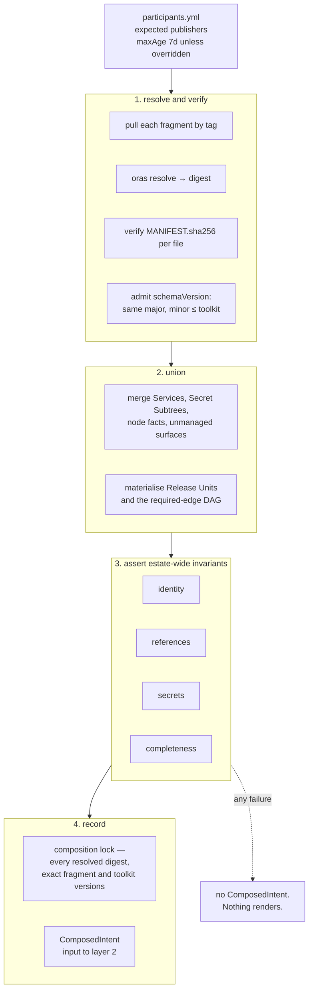

# Chapter 40 — Composition

Composition is the step that turns many independently-published declarations into
the single global view layer 2 needs. It runs before resolution, and nothing
downstream works without it.

## Why composition exists

Seven properties in this specification cannot be evaluated against one repository
in isolation:

| property | needs | decided in |
|---|---|---|
| Service Id uniqueness | every Service in the estate | [0010](../../docs/adr/0010-flat-service-identity.md) |
| exposure name and apex uniqueness | every exposure in the estate | [0018](../../docs/adr/0018-exposure-by-audience.md) |
| reachability completeness — derived ∪ registered | every exposure plus the unmanaged register | [0019](../../docs/adr/0019-registered-unmanaged-surfaces.md) |
| the Reconcile Unit DAG | every required dependency edge | [0032](../../docs/adr/0032-reconcile-unit-derived.md) |
| inbound derivations — CORS origins, one database per consumer | edges pointing *at* a Service | [0020](../../docs/adr/0020-dependency-edges-carry-surface.md) |
| the reader set of a secret path | every grant in the estate | [0023](../../docs/adr/0023-grant-unit-is-the-path.md) |
| Release Unit membership | every member's Service document | [0060](../../docs/adr/0060-release-unit.md) |

No Service knows its own consumers, so none of these are locally computable. That
is the whole argument for composition
([0037](../../docs/adr/0037-composition-oci-fragments.md)), and it is why this
chapter is a hard dependency of chapters 16, 20 and 30.

An eighth property — co-test membership — was counted here until 2026-09-07. It
moved out with the delivery and co-testing split; see
[docs/adr/deferred/README.md](../../docs/adr/deferred/README.md).

## Fragments

The unit of publication is a **repository**, not a domain. A fragment declares
which domains it contributes to, so the two need not be one-to-one:

```yaml
apiVersion: intent.jorisjonkers.dev/v1
kind: IntentFragment
metadata:
  repository: JorisJonkers-dev/knowledge
  sourceSha: 22b9d332a9e059eaeebaffbe49ab25f762985029
spec:
  schemaVersion: 1.0.0
  domains: [knowledge]
  contains:
    services: [knowledge]
    secretSubtrees: [knowledge-system/]
```

This refines the wording of
[0037](../../docs/adr/0037-composition-oci-fragments.md), which says "each domain
repository publishes". Repository-scoped publication means `homelab-collections`
may stay one repository publishing one fragment that declares five domains, or
split into five each publishing one: composition behaves identically, so the
split is a convenience rather than a prerequisite.

A fragment carries:

- Service documents (`service.yml`) and the per-Workload env files they name
- the Secret Subtree the domain owns — paths, keys, engines, readers
- node declarations, for the fragment that owns the fleet
- Registered Unmanaged Surfaces the domain is responsible for

A fragment publishes **on merge to the default branch, independently of any image
release**. An intent-only change — a changed exposure, a secret grant, a
dependency edge, a `releaseUnit` name — produces no image, and tying publication
to a version tag would leave such a change unpublished behind a staleness window.
The worked workflow is
[`examples/workflows/service-publish-fragment.yml`](examples/workflows/service-publish-fragment.yml).

### Publication, and why the lock is an output

A fragment is published as an OCI artifact, the pattern `homelab-inventory`
already runs for `cluster-deploy-context-{public,internal}`:

```
oras push  "$REF" --annotation ...
oras resolve "$REF"          # learn the digest AFTER pushing
```

That second line is the whole reason the lock is an output rather than an input.
**An artefact cannot contain its own digest.** The evidence is in the tree:
`context/public/context-manifest.yml` ships with `packageDigest: ""`, because the
digest does not exist until the push completes. A design where each repository
pinned its peers would require every fragment to know digests that cannot be
known at authoring time, so the digests are recorded by the **consumer** — the
composition lock — after resolution. This is what satisfies the property that
**no repository needs a merge before a change takes effect**.

`oras resolve` following `oras push` is also the estate's habit applied
correctly: the push's exit code is not the digest, and the digest is what
downstream pins.

Two source hashes are kept distinct, following the same repository's design:

| hash | over | why |
|---|---|---|
| `sourceSha` | the git commit | provenance: which commit produced this |
| `inputsSha` | the authored inputs only, never generated outputs | change detection that does not chase its own tail |

`homelab-inventory` derives `inventorySourceSha` from
`inventory/ + catalog/ + vault/ + providers/` and **never** from the generated
`context/` tree, and the value is identical in the public and internal manifests.
That is the property to copy: a hash that included generated output would change
on every publish and detect nothing.

## The composition run

Composition runs on each fragment publish, with no pull request in the path. The
worked workflow is
[`examples/workflows/compose.yml`](examples/workflows/compose.yml): a publish
dispatches it, a nightly schedule is a safety net for a missed dispatch, and
concurrency is serialised because two runs would race on `previousLockDigest`.



Composition is **order-independent**: the same fragment set yields the same
`ComposedIntent` regardless of pull order. That is not a nicety, it is what makes
the composed digest meaningful — and it forces a design consequence. Every merge
must be commutative, so **every collision is an error rather than a
last-write-wins merge.** There is no precedence between fragments, and no fragment
can override another.

## The estate-wide invariants

Normative. Composition fails on any of these, and produces no `ComposedIntent`.

### Identity

| invariant | error |
|---|---|
| Service Ids are unique across the union | `E_DUPLICATE_SERVICE_ID` |
| exposure names are unique across the union | `E_DUPLICATE_EXPOSURE_NAME` |
| at most one Service claims the apex | `E_DUPLICATE_APEX` |
| Secret Store path prefixes do not overlap between Subtrees | `E_SUBTREE_PREFIX_COLLISION` |

### References

| invariant | error |
|---|---|
| every `dependsOn.service` resolves to a Service in the union | `E_UNRESOLVED_SERVICE` |
| every `dependsOn.surface` exists in that Service's `provides` | `E_UNKNOWN_SURFACE` |
| the graph of **required** edges is acyclic | `E_DEPENDENCY_CYCLE` |
| every `placement.requires` and `prefers` capability is advertised by some node | `E_CAPABILITY_UNSATISFIABLE` |
| every exposure's audience is carryable by some tier | `E_NO_TIER_FOR_AUDIENCE` |
| every `releaseUnit` name resolves to two or more member Services | `E_RELEASE_UNIT_SINGLETON` |
| every Release Unit member declares readiness on at least one Workload | `E_RELEASE_UNIT_NO_READINESS` |

Optional edges are excluded from the cycle check deliberately. `required: false`
means a Workload starts without its peer, so a cycle through optional edges
cannot deadlock a rollout.

`E_RELEASE_UNIT_SINGLETON` exists because `releaseUnit` is a free string joined
at composition and nowhere else: a Service holds at most one, no Service can see
its co-members, and a misspelt name therefore yields two units of one rather than
an error. Atomicity would be silently gone with every gate green. Composition is
the only place the spelling is checkable
([0060](../../docs/adr/0060-release-unit.md)).

### Secrets

| invariant | error |
|---|---|
| every grant's `path` is declared by exactly one Subtree | `E_UNDECLARED_SECRET_PATH` |
| the Subtree lists the granting Service as a reader of that path | `E_READER_NOT_DECLARED` |
| every grant with `delivery: env` is named by at least one placeholder | `E_UNBOUND_SECRET_GRANT` |
| every `${secret:<path>#<key>}` placeholder byte-matches a granted path | `E_UNAUTHORISED_SECRET_REFERENCE` |
| `access: self-roll` on a path with other readers carries an acknowledgement | `E_ROLL_AFFECTS_OTHER_READERS` |
| no literal secret value appears in an env file or an Asset | `E_RAW_SECRET` |

Three points of precision, all following from the grant unit being the path
([0009](../../docs/adr/0009-vault-read-is-per-path.md),
[0023](../../docs/adr/0023-grant-unit-is-the-path.md),
[0027](../../docs/adr/0027-secret-reference-join-key.md)):

- The placeholder join is **byte equality against the granted path**, with no
  mount rewrite and no engine taxonomy. The `#<key>` half selects which value
  fills the variable and confers nothing; `keys:` documents and validates and
  confers nothing either.
- `delivery: file` and `delivery: self` grants carry no placeholder at all —
  a file grant renders a projected file, nothing in the environment — and both
  are excluded from `E_UNBOUND_SECRET_GRANT`. A non-KV engine — `transit/keys/auth-api-jwt` — is
  never materialised into a variable or a file, so a placeholder naming one is
  `E_UNAUTHORISED_SECRET_REFERENCE`.
- `E_ROLL_AFFECTS_OTHER_READERS` computes over the **readers of the path**, never
  over declared key sets; over key sets it under-reports by the difference
  between the subset and the document. The case is live:
  `secret/platform/observability` holds the Prometheus token, the Discord webhook
  and the Grafana client secret, and one CronJob rolls one of those keys.

### Completeness

| invariant | error |
|---|---|
| every expected participant resolves | `E_PARTICIPANT_MISSING` |
| every participant's publish is within its `maxAge` | `E_PARTICIPANT_STALE` |
| reachability equals derived ∪ registered exactly | `E_UNREGISTERED_SURFACE` |
| every live object is attributable or ledgered (chapter 30) | `E_UNATTRIBUTED_OBJECT` |
| every ledger entry still matches something | `E_LEDGER_ENTRY_STALE` |
| no derived value is removed while a consumer still depends on it (chapter 50) | `E_CONTRACT_TOO_EARLY` |

The last two are evaluated against the pinned `ClusterState` snapshot
([0034](../../docs/adr/0034-cluster-state-pinned-input.md)), so their verdict is
exactly as fresh as that snapshot — composition reads no live cluster.

## Participants

The expected set is **enumerated**, not derived. Deriving it from inbound
references was considered and rejected: a **leaf** Service that nothing depends
on can vanish without breaking any reference, and leaves are the majority —
`immich`, `jellyfin`, `sonarr`, `radarr`, `bazarr`, `prowlarr`, `qbittorrent`.
Seven media services, zero inbound edges, invisible to any edge-derived guard.

`participants.yml` is the one central artefact that survives composition by
fragments. It changes when a domain is added or retired, never when a
declaration changes.

```yaml
participants:
  intent-nodes:      {}          # maxAge defaults to 7d
  intent-data:       {}
  intent-knowledge:  {}
  intent-agents:     {}
  intent-media:
    maxAge: 21d
    reason: releases batch with the upstream chart, roughly fortnightly
  intent-observability:
    dormant: true
    owner: joris
    reason: stable since 2026-03; no declaration change expected before v1
    reviewBy: 2026-11-30
```

**`maxAge` defaults to 7 days.** The number is measured, not chosen for
roundness: `CHANGELOG.md` records 26 releases between 2026-06-09 and 2026-08-20 —
one every 2.8 days — so seven days is about 2.5 observed intervals. Long enough
to absorb two consecutive missed releases, short enough that a broken publish job
is caught in the week it breaks
([0038](../../docs/adr/0038-participants-list-staleness.md)). A participant that
genuinely publishes less often overrides the default **with a written reason**;
an override without one is a build error.

`dormant: true` is the separate exemption and is a Bidirectional Ledger entry
like any other (chapter 30): owner, reason, review date, and a date in the past
fails the build. It exempts a participant from `maxAge` **and from nothing
else** — a dormant fragment still unions, still satisfies every invariant above,
and still has to sit inside the accepted version range below. A domain nobody is
otherwise touching must therefore still be republished when the model moves.

### A missed publish is a deletion

`E_PARTICIPANT_MISSING` is not pedantry, and this is the reason the participants
list is load-bearing rather than hygiene. **A render that omits an entire domain
is a valid render.** Nothing inside it is wrong; it simply does not contain that
domain, so every one of the invariants above passes and the composed digest is
perfectly reproducible. The absence is indistinguishable from a retirement.

At the model level that means: an unpublished domain reaches whatever consumes
the `ComposedIntent` as an *intentional* absence. Composition is the only place
that can tell the difference, because it is the only place holding the
enumeration of what was expected. What a delivery mechanism then does with an
absent domain — including whether it removes objects — is defined separately
([docs/adr/deferred/README.md](../../docs/adr/deferred/README.md)); the model's
obligation is to refuse to emit the render in the first place.

## Versioning

`schemaVersion` is **the data model's own semver**. It starts at `1.0.0` and
moves only when the model moves:

| bump | when |
|---|---|
| major | a field is removed, or the meaning of an existing field changes |
| minor | vocabulary is added |
| patch | wording is clarified with no field change |

It is **not** the toolkit package's version. Today the two are one number by
construction: `src/cluster-context/schema.ts:75-79` throws
`E_SCHEMA_VERSION_MISMATCH` when `ctx.spec.schemaVersion !== getPackageVersion()`,
and `getPackageVersion()` reads `package.json`, which sits at `0.22.0` and moves
at release cadence — 26 releases in ten weeks, most of which changed code and not
the model. Under this rule the literal `schemaVersion: 1.0.0` written by every
document in this specification, including the lock below, is correct and stays
correct across those releases: the model is at `1.0.0`, the toolkit is at
`0.22.0`, and they are allowed to differ
([0007](../../docs/adr/0007-schema-version-separable.md),
[0039](../../docs/adr/0039-artifact-schema-versioning.md)).

Composition admits a fragment on a **range**, not on equality:

| fragment version vs the composing toolkit | verdict |
|---|---|
| major differs, either direction | `E_SCHEMA_VERSION_MISMATCH` |
| same major, minor > toolkit's minor | `E_SCHEMA_VERSION_MISMATCH` |
| same major, minor ≤ toolkit's minor | admitted |
| patch differs | admitted; patch never gates |

Those two conditions are the **only** ones that fire the error. The message must
name which of the two rules fired, which fragment, and at which digest; a gate
whose message says the wrong thing is the one people learn to ignore.

Minor > toolkit stays a hard stop because the union is silent about what it
drops. A fragment using vocabulary an older toolkit cannot read would compose
with the unknown fields discarded and exit zero — a declared volume, grant or
dependency edge leaving the tree with no digest, exit code or ledger noticing. A
loud stop is recoverable; a missing PVC is not.

Equality is rejected for the opposite reason: it fails closed over the **union**.
One stale participant blocks every composition, including the composition
carrying the fix, and dormancy does not exempt a fragment from a version check.
The estate already demonstrates that skew is survivable — `0.16.0` in four
service repos, `0.20.0` in `stalwart-provisioner`, `0.22.0` in the published
contexts, and it functions.

**Admission and reproduction are different jobs.** The range governs what
composition accepts; the **lock records the exact resolved versions** — each
fragment's `schemaVersion` and the toolkit version that produced the
`ComposedIntent` — so a replay runs the versions that actually ran, not the range
that admitted them. A lock recording ranges instead of exact versions would break
byte-identical replay at the only moment it matters.

The range's determinism rests on an untested claim: that a fragment written
against minor *m* renders identically under every toolkit minor ≥ *m* within the
same major. It is falsified by one render-hash inequality across the minors a
range admits (`computeRenderHash`, `src/artifact/contract.ts:41`); see the open
item below.

## Version rollout

A model bump is never one pull request, and this chapter says so rather than
claiming there is nothing to build. The sequence:

| step | who | verified by |
|---|---|---|
| 1. publish the toolkit at the new model version | release operator | pull by digest, read `schemaVersion` back out |
| 2. republish each fragment or context carrying documents at that version | that domain's owner | pull by digest, read `schemaVersion` back out |
| 3. open the pin bump in each consumer | Renovate | the ordering gate |
| 4. merge | a human | the gate, green |

Steps 1 and 2 are manual and outside CI, and they are verified **by pulling the
artefact by digest and reading `schemaVersion` back out of it — never by the
publish step's exit code**. That is the estate's own rule applied to its own
publish path.

Step 3 rides **Renovate**, because `renovate.json` is already present in every
pinning repository; no new bump automation is built. The only machinery this
specification adds is the **ordering gate**, and it exists because Renovate
cannot be sequenced: a consumer's pin PR may appear before the republish in step
2 has landed and will sit red until it does.

Three normative properties of the gate:

- **Its failure message says the context has not been republished yet** — the
  literal wording is *"context not yet republished"* — never that the version is
  wrong. A routinely-red Renovate PR whose message misdescribes the cause is the
  thing people learn to ignore.
- **It computes compatibility, not string equality**, against the range in
  [Versioning](#versioning). It therefore needs the toolkit's current model
  version readable at gate time, which this repository must publish somewhere the
  gate can fetch.
- **A model bump is never grouped and never auto-merged.** The gate must run and
  a human must read it; auto-merging on green removes the only reader of the
  message, and green before step 2 is meaningless.

The wiring is the part that has already gone wrong: the Renovate manager pattern,
the gate workflow's `paths:` filter and the path the gate actually reads must all
name **the same file**. When they diverge, a bump touches a file no workflow
reads, triggers no gate, and every run reports success. The check is mechanical —
for each consumer, compare `renovate.json`'s `managerFilePatterns` against both
the workflow's `paths:` filter and its read path, and require every pair to name
one file.

Under the range, most releases open no consumer PR at all: only a model change
moves the pin, so a bump becomes rare — and correspondingly less rehearsed.
Rollout of anything other than a version pin, including how a composed lock
reaches a cluster, is defined separately
([docs/adr/deferred/README.md](../../docs/adr/deferred/README.md)).

## Unmanaged surfaces

Service Intent covers Kubernetes workloads only. The estate has three deployment
targets, not one: `samba` exists only as a NixOS module yet owns
`samba.lan.jorisjonkers.dev`; `wolf` exists in neither target and owns
`wolf.jorisjonkers.dev`; `adguard` and `ollama` exist in both; and host-level
services — `tailscale`, `media-storage`, `backup-storage`,
`btrfs-backup-snapshots` — have no cluster presence at all. Modelling NixOS was
rejected: rendering it is not writing a file but producing a build and an
activation, an order of magnitude more v1 scope for roughly eight hosts.

That leaves a remainder, and an unbounded remainder is how the seven-way split of
`kb.jorisjonkers.dev` began: a scope boundary silent about what falls outside it
bounds nothing, it just moves the drift where no check looks.

Every hostname the model does not deploy is therefore a **Registered Unmanaged
Surface** — a Bidirectional Ledger entry (chapter 30) carrying an owner, a reason
and a review date:

```yaml
unmanagedSurfaces:
  - host: samba.lan.jorisjonkers.dev
    owner: joris
    reason: NixOS module; no Kubernetes workload exists
    reviewBy: 2026-11-30
  - host: wolf.jorisjonkers.dev
    owner: joris
    reason: deployed in neither target; public and unowned until this entry
    reviewBy: 2026-11-30
```

Composition asserts **set equality**: estate reachability equals the derived set
plus the registered set, exactly.

| condition | error |
|---|---|
| a reachable hostname is in neither set | `E_UNREGISTERED_SURFACE` |
| a registered entry matches no reachable hostname | `E_LEDGER_ENTRY_STALE` |
| an entry's `reviewBy` is in the past, or `owner`/`reason` is empty | `E_LEDGER_REVIEW_OVERDUE` |

Derived entries come from Audience declarations
([0018](../../docs/adr/0018-exposure-by-audience.md)); registered entries come
from the ledger; anything in neither is a build error
([0019](../../docs/adr/0019-registered-unmanaged-surfaces.md)). Because the check
is symmetric, the register cannot quietly outlive what it excuses.

A registration is an **unverified assertion**: nothing proves `samba` is actually
listening where the entry claims. What it buys is that every hostname in the
estate has exactly one owner of record — derived or registered — and that
`wolf`'s status becomes explicit data with a name against it rather than an
accident nobody had noticed.

## The composition lock

The output, generalising `cluster-composition-lock` from two pinned contexts to
N pinned fragments:

```yaml
apiVersion: resolved.jorisjonkers.dev/v1
kind: CompositionLock
metadata:
  cluster: production
  generatedAt: 2026-09-07T14:22:07Z
spec:
  schemaVersion: 1.0.0                # the model version of this document
  toolkitVersion: 0.22.0              # exact version that composed it
  composedDigest: sha256:…            # of the ComposedIntent
  previousLockDigest: sha256:…
  lockChain:
    - {digest: sha256:…, commit: 22b9d33, timestamp: …}
  fragments:
    intent-knowledge:
      ref: ghcr.io/jorisjonkers-dev/intent-knowledge@sha256:…
      schemaVersion: 1.0.0            # exact resolved model version
      sourceSha: 22b9d33…
      inputsSha: 84021c5…
    intent-data: {…}
  context:
    ref: ghcr.io/jorisjonkers-dev/cluster-deploy-context-public@sha256:…
    inventorySourceSha: 84021c5…
  clusterStateDigest: sha256:…        # the pinned snapshot, chapter 20
```

The two version fields are what makes the range in
[Versioning](#versioning) safe: `schemaVersion: 1.0.0` and
`toolkitVersion: 0.22.0` differ legitimately, and both are exact — no range is
ever recorded here.

`lockChain` is inherited deliberately: it answers "when did this fragment's digest
change, and which render did that produce" without diffing published artefacts.

Re-composing from a recorded lock pins every fragment by digest, runs the recorded
toolkit version, and must yield the identical `composedDigest`. Combined with
chapter 20's pinned-input rule and chapter 30's `renderHash`, that gives one
unbroken chain from a published fragment to a rendered file.

## Cross-service references

A reference is a Service Id and, where it names a connection, a surface name.
Resolution is a lookup in the union — no URL, no repository coordinate, no
network call at authoring time. Renaming a Service is therefore a breaking change
to every inbound reference, which is what `E_UNRESOLVED_SERVICE` reports, and the
`aliases` block ([0010](../../docs/adr/0010-flat-service-identity.md)) exists so
that a *coordinate* can diverge without the identity moving.

## Delivery and co-testing are defined separately

Composition ends at two published artefacts: the `ComposedIntent` and its lock.
What consumes that lock, how objects reach a cluster, which identity applies
them, what is removed and when, and how a dependency on another unit for testing
gates a deploy are **not specified here and not specified anywhere in this
version of the model**. They are defined separately; the parked direction work
is [docs/adr/deferred/README.md](../../docs/adr/deferred/README.md).

The model makes exactly three demands on whatever that definition turns out to
be: all-or-nothing Release Unit switchover
([0060](../../docs/adr/0060-release-unit.md)), destructive operations gated by
Durability Class ([0015](../../docs/adr/0015-durability-class-per-volume.md)),
and rendering from pinned inputs only
([0006](../../docs/adr/0006-pinned-inputs.md),
[0034](../../docs/adr/0034-cluster-state-pinned-input.md)).

## Open in this chapter

1. **The range's determinism claim is untested.** Same-major, minor-≤ admission
   assumes a minor bump only adds vocabulary, so renders are identical across
   the minors a major admits.
   - **Owner:** joris.
   - **Settled by:** render the pinned estate inputs once per published toolkit
     minor within a major and assert `computeRenderHash`
     (`src/artifact/contract.ts:41`) is equal across the set; one inequality
     falsifies the range and forces a major bump.
   - **Blocks:** trusting the range. Until it runs, admission across minors is a
     decision in direction, not a proven property.
2. **The 7-day bound is calibrated against today's cadence.** It is 2.5 observed
   release intervals, not a general constant.
   - **Owner:** joris.
   - **Settled by:** `oras repo tags` against the GHCR namespace over 90 days;
     take the maximum inter-publish gap per participant. The default fails if any
     non-dormant participant routinely exceeds 7 days while healthy.
   - **Blocks:** nothing. A failure re-numbers the default; it does not remove
     the list.
3. **Whether the union may span clusters.** The lock is keyed by cluster, but the
   invariants — Service Id uniqueness in particular — are estate-wide rather than
   per-cluster.
   - **Owner:** joris.
   - **Settled by:** a second cluster existing. With one cluster the distinction
     is unobservable.
   - **Blocks:** nothing in v1.
4. **Fragment signing.** Composition verifies `MANIFEST.sha256` per file but not
   provenance, while the estate's publish already produces attestations
   (`id-token: write`, `attestations: write` in `deploy-artifact.yml`).
   - **Owner:** joris.
   - **Settled by:** deciding whether composition requires a verified signature,
     then asserting a tampered fragment with a valid `MANIFEST.sha256` is
     rejected.
   - **Blocks:** nothing today; it bounds what a compromised publish credential
     can do.
