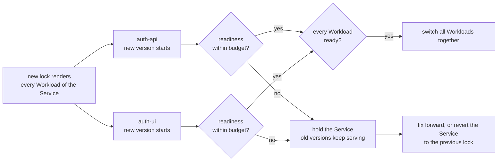
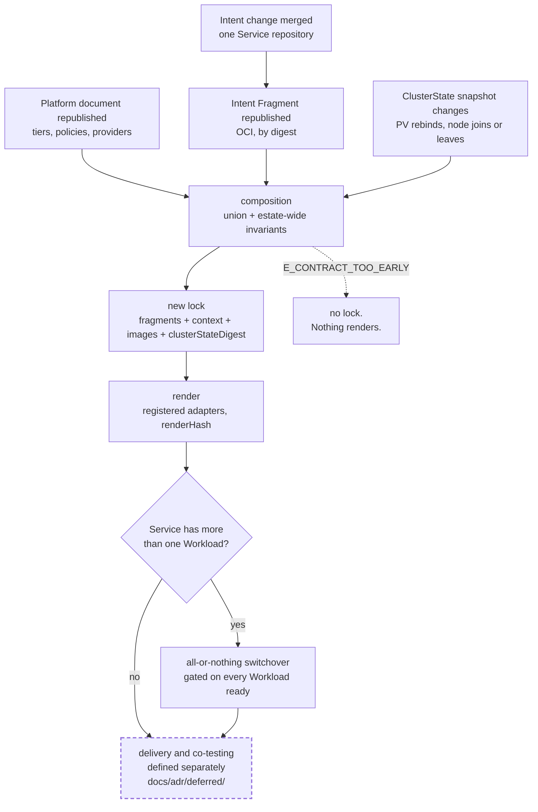

# Chapter 50 — Lifecycle

Model-level lifecycle: what changes over time, and what the model guarantees
while it is changing.

Three things here have a lifecycle. A **Release Unit** switches all at once or
not at all. A **cross-Service contract** changes in two steps, never one. A
**lock** names one pinned input set, and a new lock exists exactly when one of
those inputs changes.

How a change reaches the cluster — who applies, what prunes, what reconciles,
what tests gate a deploy — is not in this chapter and is not a v1 model
decision. The next section says where it lives and what the model demands of it.

## Delivery and co-testing are defined separately

On 2026-09-07 the owner drew the boundary: *how the estate deploys, and how
dependency on other units for testing gates a deploy, are defined separately
from the model.* Thirteen records — the premise 0008, the delivery decisions
0041–0048 and 0058, and the co-testing decisions 0049–0051 — are parked in
[`docs/adr/deferred/`](../../docs/adr/deferred/README.md) with the worked
delivery examples this chapter used to carry, now at
`docs/adr/deferred/examples/`. They are direction work: argued, evidenced,
reviewed, and **not normative**.

This chapter therefore specifies no applier, no prune pass, no field manager,
no deploy RBAC, no break-glass path, no reconcile CronJob and no co-test gate.
An earlier draft of this chapter specified all of them; that text moved with
its decisions. v1 is the authoring vocabulary, composition, and the registered
renderer, delivered by today's Flux pipeline unchanged
([0059](../../docs/adr/model/0059-v1-scope-stopping-rule.md)).

What the model does fix is the *interface* to whatever delivery is eventually
defined. Three demands, all decided in the model rather than in the parked work:

| demand | decided in | what it requires of any delivery mechanism |
|---|---|---|
| **Release Unit atomicity** | [0060](../../docs/adr/model/0060-release-unit.md) | no member's new version receives traffic until every member's new version is healthy; one failing member holds the whole unit |
| **Durability Class gating** | [0015](../../docs/adr/model/0015-durability-class-per-volume.md) | a destructive operation against a volume declared `recoverable` or `irreplaceable` is refused and reported, never performed; only the owning Service can state that class |
| **Pinned inputs only** | [0006](../../docs/adr/model/0006-pinned-inputs.md), [0034](../../docs/adr/model/0034-cluster-state-pinned-input.md) | what is applied is rendered from a named lock — Intent, Platform Intent, images lock, ClusterState snapshot — never from a live read at render time |

A mechanism honouring those three is compatible with this model. Everything
else it decides — push or pull, who holds cluster credentials, what prunes, how
often it reconciles, whether a neighbour's tests gate a merge — is its own
business, and the parked records are the evidence it starts from.

## The lock lifecycle

A **lock** is the record of one pinned input set. Chapter 40 defines the
`CompositionLock` document and its fields; this section is the time view — when
a new lock exists, what one guarantees, and what one is not.

A lock names, by digest:

- every Intent Fragment in the union, with its `sourceSha` and `inputsSha`;
- the Platform document's fragment, with its `sourceSha` and `inputsSha` like any other;
- the node contract, by digest;
- the images lock, which resolves every `image` alias to a digest — never a tag;
- the ClusterState snapshot, as `clusterStateDigest`
  ([0034](../../docs/adr/model/0034-cluster-state-pinned-input.md)).

The lock is an **output** of composition and never an input to it, because an
artefact cannot contain its own digest — chapter 40 carries the evidence and the
`oras push` / `oras resolve` pattern it comes from.

### When a new lock exists

A new lock exists exactly when one of the pinned inputs changes digest. No other
event produces one.

| event | new lock | why |
|---|---|---|
| a Service repository merges an Intent change and republishes its fragment | **yes** | a new fragment digest is a new input, whether the change was an image, a grant, an exposure or an edge |
| a fragment republishes with byte-identical content | no | digests are content-addressed, so the input set has not moved |
| the Platform document is republished — a tier, a durability policy, a receiver, a provider | **yes** | the Platform document is a pinned input, republished deliberately |
| the images lock resolves an alias to a new digest | **yes** | the rendered image reference changes |
| a PV rebinds after a node failure; a node joins or leaves | **yes** | the ClusterState snapshot changes, so `clusterStateDigest` changes, and the rebind lands as a visible decision rather than as drift |
| a node contract republishes new `allocatable` — a reserve is retuned, RAM is added | **yes** | placement is matched against allocatable, so eligibility can change without any Intent changing |
| a pod restarts; a Kustomization reports Ready; a health check flips | no | that is what is *running*. Chapter 20 keeps the health document (`cluster-state.schema.json`) distinct from the pinned ClusterState snapshot; only the snapshot is an input |
| the toolkit is upgraded with no model change | no | `schemaVersion` is the data model's own semver and moves only on a model change ([0039](../../docs/adr/model/0039-artifact-schema-versioning.md)); the lock records the exact versions it was composed under |

### What a lock guarantees

Re-rendering from a recorded lock yields a byte-identical Deliverable Set and
the same `renderHash` — **conditional on identical input digests,
`clusterStateDigest` included**. That conditional wording is the repaired form
of chapter 20's purity rule
([0006](../../docs/adr/model/0006-pinned-inputs.md)): the earlier absolute claim was
falsified by the spec's own normative example, which recorded an observed PV
binding while `inputDigests` listed only `intent` and `imagesLock`.

The repair is what makes the diagnostics work:

| observation | what it means |
|---|---|
| identical digests, differing render | a defect — an input was read that the lock does not name. Never weather |
| differing `clusterStateDigest`, differing render | the estate moved. The new lock is the record of it, and landing it is a decision, not a correction |
| `renderHash` changed | at least one entry in `inputDigests` changed. There is no third possibility, because nothing is remembered between renders |

### What a lock is not

A lock is not a deployment record. It says what a set of inputs renders to; it
does not say what is running, where, or under which lock a given live object was
applied. Those statements belong to the delivery definition
([deferred](../../docs/adr/deferred/README.md)), and conflating the two is how
"the Kustomization is Ready" comes to be read as "the consumer sees what you
intended".

A lock is only as re-renderable as the artefacts it names. Deleting a fragment
digest, a context digest or a snapshot that a live lock references makes that
lock un-re-renderable — which is why every pinned reference is a retained digest
and never a moving tag. `previousLockDigest` and `lockChain` (chapter 40) answer
*when did this fragment's digest change, and which render did that produce*
without diffing published artefacts.

## Release Unit switchover

Membership is structural, not declared: **a Service is the Release Unit**, and
its members are its Workloads ([0062](../../docs/adr/model/0062-service-is-the-release-unit.md)).
Nothing names a unit, because nothing needs to — things that must switch
together are Workloads of one Service, and things that must not are separate
Services. Chapter 10's [Service identity](10-service-intent.md#service-identity)
carries the authoring rules; this section is the lifecycle view.

**The Service is the unit of switchover.** The rule: no member's new version receives
traffic until every member's new version is healthy; if any member fails its
budget, none switch and the old versions keep serving.

Every term in that rule is already defined elsewhere in the model:

| term | means | where it comes from |
|---|---|---|
| **healthy** | the member's own declared readiness — `probes.readiness`, with its own `path` + `port` or `tcp` | chapter 10, [0014](../../docs/adr/model/0014-probes-are-siblings.md) |
| **budget** | the derived rollout budget: how long a new version has to report ready before it counts as failed | chapter 20's derived mechanics, [0030](../../docs/adr/model/0030-runtime-mechanics-derived.md) |
| **switch** | the moment traffic reaches the new versions rather than the old | the delivery mechanism performs it; the model states when it may happen |

A Workload declaring `probes: none` publishes no readiness signal and so cannot
contribute to the gate. A Service must therefore declare readiness on at least
one Workload — `E_RELEASE_UNIT_NO_READINESS`, a composition-time
check in [chapter 40](40-composition.md#versioning)'s estate-wide invariants,
not something a delivery mechanism discovers at apply time.

**Held, not partial.** A member that fails its budget does not switch on its
own, and does not let its neighbours switch either: the whole unit holds and
every member's old version keeps serving. That is the point. It converts the blast radius of a bad
member from a broken product — a new frontend against an old API, both pods
individually reporting healthy — into a visibly held release, paid for by
whoever shipped the failing member.

**Rollback is unit-scoped.** Reverting one member means reverting the unit, and
what a revert targets is a lock: the previous lock is the whole coherent input
set, so a unit-scoped rollback is a lock-scoped operation. The cost is a larger
rollback scope than a single Service, and the benefit is that the scope is
consistent — there is no state in which half a unit has been reverted.

**A Release Unit is not a Reconcile Unit.**

| | Release Unit | Reconcile Unit |
|---|---|---|
| answers | what switches together | what applies before what |
| origin | **structural** — the Service boundary; its members are its Workloads | **derived** from the dependency graph ([0032](../../docs/adr/model/0032-reconcile-unit-derived.md)) |
| property | atomicity | ordering |
| worked case | Service `auth`, Workloads `auth-api` + `auth-ui`: a new UI against an old API is a broken product although each pod reports healthy | `platform-postgres` before `knowledge`: the consumer cannot start without its provider |
| membership changes when | a Workload joins or leaves the Service | an edge is added or removed |

Atomicity follows the Service boundary rather than the dependency graph because
lockstep release is a product choice the graph cannot see. The frontend depends
on the API, but a dependency edge does not mean the two must cut over together;
deriving atomicity from every edge takes the transitive closure and turns the
estate into one unit, making every deploy estate-wide. Drawing the boundary is
therefore the decision, and a pair that must release together but cannot be one
Service is evidence the boundary is drawn wrong.

## Expand and contract

A Release Unit makes lockstep safe *inside* the unit. Everything else that
crosses a Service boundary — a surface, a port, a derived value, a name another
Service references — changes in two steps, because the estate's Services merge
and publish independently and no moment exists at which they all move.

The rule is asymmetric, and composition can enforce it because the union puts
both sides of every inbound derivation in one document:

- **additive is safe in any order.** A provider that declares a new surface, or
  a consumer that appears in a provider's derived set before it is deployed,
  breaks nothing.
- **removal is safe only last.** Withdrawing a value while any live declaration
  still depends on it is `E_CONTRACT_TOO_EARLY`.

The worked case is `auth-api`'s CORS origins, which are derived from its inbound
edges (chapter 16):

| change | at lock N | verdict |
|---|---|---|
| `auth-api` allows an origin whose Service is not deployed yet | additive | harmless |
| `auth-api` stops allowing an origin that is still live at N−1 | removal | broken — the consumer loses access on the switch |

The three phases, and what composition sees at each:

1. **Expand.** The provider declares the new surface, value or name *alongside*
   the old. Both are in the union; both render. Nothing has been withdrawn, so
   no consumer can be too early.
2. **Migrate.** Each consumer moves its edge or its `${dependency:…}` reference
   to the new name and republishes its fragment. Each merge produces a new lock.
   Consumers move at their own pace; the union records how far the migration has
   got.
3. **Contract.** The provider removes the old declaration. Composition finds no
   remaining inbound reference and accepts it. Attempted before the last
   consumer moved, this is where `E_CONTRACT_TOO_EARLY` fires.

Two limits are worth stating plainly. First, composition sees **declared** edges
only: an undeclared consumer is invisible to the check, which is why a
dependency edge names the provider and the surface
([0020](../../docs/adr/model/0020-dependency-edges-carry-surface.md)) and why a
hostname served by something outside the model is a Registered Unmanaged Surface
([0019](../../docs/adr/model/0019-registered-unmanaged-surfaces.md)) rather than an
absence. Second, the check is about *declarations*, not about running pods:
whether a consumer at an older lock is still serving is a delivery question, and
the delivery definition owns any stronger guarantee that wants to read live
state.

## The change, end to end

The dashed box is the boundary this chapter refuses to cross. Everything above
it is decided in `docs/adr/`; everything inside it is decided separately.

## Open in this chapter

1. **Release Unit atomicity is untested.**
   [0060](../../docs/adr/model/0060-release-unit.md) carries `claim: open`.
   Owner: joris. Settled by: rendering a two-member unit and handing the same
   derived gate to two different delivery mechanisms — today's Flux health
   checks on one Kustomization, and any future applier — and observing both
   honour it unchanged. Blocks: nothing in v1 authoring; it blocks the claim,
   not the field.
2. **Whether a unit may span ownership boundaries.** A Service belongs to at most
   one unit, and unit membership is estate-wide today. Whether a unit may cross
   whatever ownership boundary the delivery definition introduces is that
   definition's question, not this chapter's.
3. **How far the contraction check reaches.** It is exact over declared edges and
   silent over undeclared ones, so its value is bounded by the completeness of
   the edge set — the same completeness default-deny network policy depends on
   ([0035](../../docs/adr/model/0035-network-policy-default-deny.md)).
