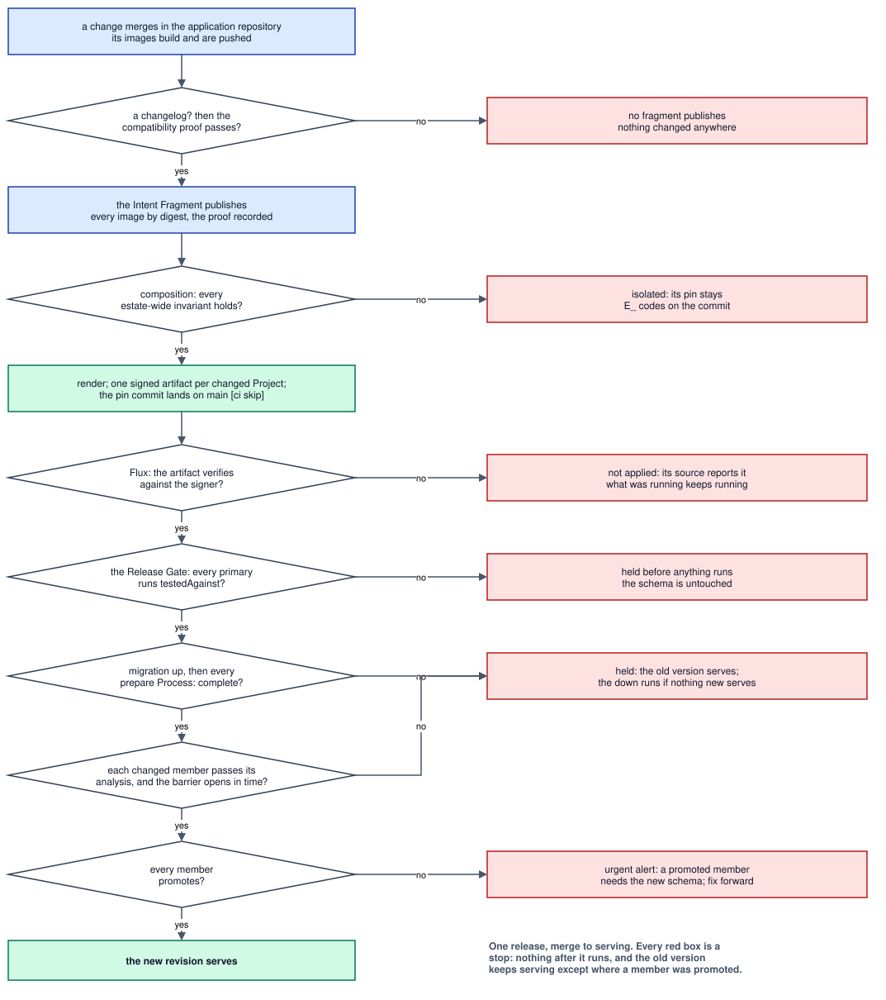
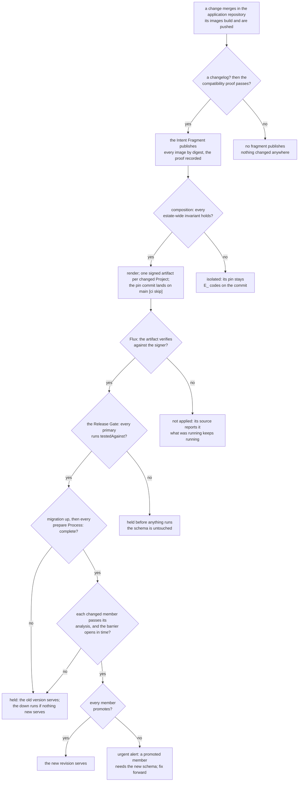

# Chapter 55: Delivery

How a render reaches the cluster, how an Application's new version replaces
the old one, and how its schema moves with it. Until 2026-09-24 this was
"defined separately" from the model; it is now part of it
([0050](../../docs/adr/model/0050-delivery-is-part-of-the-model.md)).

The model's three demands on delivery stand, and this chapter is how they are
met rather than a list of them:

| demand | decided in | how delivery meets it |
|---|---|---|
| **Release Unit atomicity** | [0052](../../docs/adr/model/0052-an-application-is-the-release-unit.md) | [Switchover](#switchover): a barrier over every member of the Application, run by the [Release Gate](#the-release-gate) |
| **Durability Class gating** | [0018](../../docs/adr/model/0018-durability-class-derives-a-backup.md) | no destructive operation proceeds automatically against a volume declared `recoverable` or `irreplaceable`: the applier never prunes such a claim ([chapter 30](30-deliverables.md#flagger-ready-objects)) |
| **Pinned inputs only** | [0006](../../docs/adr/model/0006-pinned-inputs.md), [0034](../../docs/adr/model/0034-cluster-state-is-a-pinned-input.md) | [Rendered artifacts and pins](#rendered-artifacts-and-pins): what is applied is a signed artifact named by digest, rendered from a recorded lock |

## Scope

Delivery is **pull**. Flux applies a render it fetches, and Flagger switches an
Application's Processes from the old version to the new one. Nothing pushes to
the cluster, so there is one applier, no deploy credential outside the
cluster, and Flagger owns only the objects it generates, which the render
therefore omits
([0050](../../docs/adr/model/0050-delivery-is-part-of-the-model.md)).

What is in scope, and the section that specifies each:

| concern | section |
|---|---|
| how a render becomes something Flux can fetch, and how a deploy is recorded | [Rendered artifacts and pins](#rendered-artifacts-and-pins) |
| how a Project is held still, or taken back to an earlier release | [Pause and Rollback](#pause-and-rollback) |
| how an Application's new version replaces the old one | [Switchover](#switchover) |
| what gates the switch, and who answers | [The Release Gate](#the-release-gate) |
| what a failed release leaves behind | [Held releases](#held-releases) |
| how a schema moves with its Application | [Migrations](#migrations) |
| what proves a migration safe to run while the old version serves | [Migration safety](#migration-safety) |
| what runs before a new version starts, in what order | [Release order](#release-order) |
| what undoes a failed migration, and when it may | [Failure and undo](#failure-and-undo) |
| who hears about a refusal, a hold or a failed step, and where | [Notifications](#notifications) |
| why rotating a secret is not a release | [Secret rotation](#secret-rotation) |
| what the render leaves to Flagger | [What the render leaves to Flagger](#what-the-render-leaves-to-flagger) |
| how a Project moves off the old path | [chapter 60](60-setup.md#handing-over-one-project-at-a-time) |

What is not in scope:

- **Co-testing**, whether one Application's tests gate another's deploy. It
  stays parked in [`docs/adr/deferred/`](../../docs/adr/deferred/README.md).
- **Image admission**: verifying an image's signature when a pod is admitted. A
  recorded gap with an owner, not a decision
  ([Rendered artifacts and pins](#rendered-artifacts-and-pins)).
- **A second cluster.** The estate is one cluster
  ([0001](../../docs/adr/model/0001-estate-scale-and-ownership.md)).
- **How the Vault policy and auth roles reach Vault** is not in this chapter's
  scope: they are Deliverables of the `vault-policy` adapter, and the Vault
  policy job applies them in the cluster
  ([chapter 30](30-deliverables.md#vault-configuration-is-rendered-not-applied),
  [0087](../../docs/adr/model/0087-in-cluster-consumers-read-the-render.md)).

## Rendered artifacts and pins

Each Project's render is one OCI artifact, signed, and named by digest. A deploy
is a commit that changes which digest a Project's source points at: the
estate's git history is its deploy log, and no rendered Deliverable is committed
anywhere ([0051](../../docs/adr/model/0051-a-project-is-delivered-as-a-signed-artifact.md)).

```text
ghcr.io/jorisjonkers-dev/render/auth@sha256:…     one Rendered artifact per Project
  dev.jorisjonkers.content-hash  sha256:…          this Project's share of the rendered tree
  dev.jorisjonkers.render-hash   sha256:…          the Resolved Deployment's renderHash
  dev.jorisjonkers.lock-digest   sha256:…          the composed artifact carrying the lock
```

- **One artifact per delivered Project.** Composition renders the estate once
  and publishes each Project's share of the rendered tree as one artifact at
  `<repository>/<project>`, where `repository` is the Platform document's
  `bootstrap.flux.artifacts.repository`
  ([chapter 14](14-platform-intent.md#the-bootstrap-set)). Each of the Project's
  Reconcile Units applies its own path inside it
  ([chapter 20](20-resolved-deployment.md#the-reconcile-unit)). The paths the
  path plan scopes to the estate rather than to a Project
  ([chapter 20](20-resolved-deployment.md#the-path-plan)) form one more artifact,
  `_estate`, published and pinned exactly like a Project's, at the sibling
  repository `<repository>-estate`: an OCI repository's path components start
  with a letter or a digit, and nothing below `<repository>/` is the estate's,
  so no Project can ever name it. While the estate is handed
  over, a Project still on the old path is rendered and checked but not
  published, and the `_estate` artifact holds only `estate-vso-secrets`, the
  Vault policy job for the Projects already on the estate path, whose units
  depend on it; the edge units join it once no Project is on the old path
  ([chapter 60](60-setup.md#handing-over-one-project-at-a-time)).
- **Signed keyless, and annotated.** The artifact is signed by the composition
  workflow's own OIDC identity, the Platform document's
  `bootstrap.flux.artifacts.signer`, so no signing key exists to leak or rotate.
  It carries the render hash and the digest of the composed artifact that holds
  the lock, so an artifact names the inputs that reproduce it, and the content
  hash of the files it holds.
- **An unchanged render publishes nothing.** The files an artifact holds are its
  Project's share of the rendered tree and nothing else. A composition that
  renders a Project whose content hash equals the pinned artifact's publishes
  no artifact and moves no pin, so another Project's fragment never redeploys
  this one; the pinned artifact keeps naming the composition that first
  produced its content.
- **The pin.** The estate repository holds one committed Flux source per
  Project, `projects/<project>/source.yaml`: an `OCIRepository` naming
  `<repository>/<project>` by `ref.digest` and verifying keyless against the
  signer, with one Kustomization per Reconcile Unit of the Project applying its
  path. Composition writes the file whole, from the Platform document and the
  Reconcile Unit DAG, each time it moves the pin, the first time a Project
  composes among them, so the units it applies are always the ones its artifact
  holds ([What a pin source holds](#what-a-pin-source-holds)). Removing a Project's file takes it off the estate path, which
  only a handover step reversed or a Project's retirement does
  ([chapter 60](60-setup.md#handing-over-one-project-at-a-time)). After publishing, composition commits to the
  estate repository's `main` the rewritten source of every Project whose
  artifact changed, at its new `ref.digest`, marked `[ci skip]` so the estate repository's push checks
  do not run on a commit that only moves digests. That commit is the deploy.
  These files are the only committed objects; the Deliverables themselves exist
  only inside artifacts.
- **Flux verifies before it applies.** An artifact whose signature does not
  verify against the signer is never applied: its source reports the failure,
  and what was running keeps running. Composition verifies each artifact the
  same way, against the Platform document's signer, before it commits a pin,
  and a composition that failed any step before it commits no pin at all.
- **A fragment names only images that exist.** An application repository
  publishes its Intent Fragment on a release tag, only after that release's
  images are built and pushed, with every image alias it names resolved to a
  digest, a UID and a GID in the fragment's own contribution to the images lock
  ([chapter 40](40-composition.md#fragments),
  [0083](../../docs/adr/model/0083-a-fragment-publishes-on-a-release-tag.md)). A
  composition therefore never renders a reference nothing can pull.
- **Reverting a pin commit is break-glass**, for when composition itself cannot
  run. It puts the estate on a render its current inputs no longer produce, so
  the next composition moves it back unless the Project is paused. The ordinary
  way back is a [Rollback](#pause-and-rollback).

**Image admission** is the recorded gap in [Scope](#scope): nothing verifies an
image's signature when a pod is admitted, only the render's when it is fetched.
The owner is joris, and the policy that closes it is part of the estate's
delivery machinery ([#148](https://github.com/JorisJonkers-dev/deploy-kit/issues/148)).

### What a pin source holds

The file composition writes for an artifact whose pin moves, a first delivery
among them, replacing whatever was committed before. Everything in it derives;
nothing is authored, and the cadence is this chapter's, stated once
as a grant's refresh is in [chapter 30](30-deliverables.md#vault-configuration-is-rendered-not-applied):

| object | field | value |
|---|---|---|
| `OCIRepository` | name, namespace | `project-<project>`, or `estate` for the estate-scoped artifact, which no Project's source can be named; the namespace of the Platform document's `bootstrap.flux.sourceRef` |
| | `url` | `oci://<repository>/<project>` for a Project's artifact and `oci://<repository>-estate` for the estate-scoped one, `<repository>` the Platform document's `bootstrap.flux.artifacts.repository` |
| | `ref.digest` | the digest of the published artifact. Until the first publish it is sixty-four zeros, which names no artifact: a source applied before its digest is set fetches nothing, where one with no `ref` would fetch whatever `latest` names |
| | `secretRef` | the Platform document's `bootstrap.flux.artifacts.pullSecret`, by name, where it names one; absent for a public repository ([chapter 14](14-platform-intent.md#the-bootstrap-set)) |
| | `verify` | `cosign`, against the Platform document's signer. Flux reads an identity as a pattern, so the issuer and the subject are each written anchored and escaped: the one workflow on the one branch, and no branch whose name merely begins the same |
| | `interval` | `10m` |
| `Kustomization`, one per Reconcile Unit the artifact holds | name | the unit's ([chapter 20](20-resolved-deployment.md#the-reconcile-unit)) |
| | `sourceRef`, `path` | the `OCIRepository` above, and the unit's directory in the artifact |
| | `dependsOn` | every unit this one follows that is on the estate path, by name, in name order; absent where it follows none. A unit of a Project still on the old path ([chapter 60](60-setup.md#handing-over-one-project-at-a-time)) is left out: it has no Kustomization here, so Flux would wait on it for ever, and the Project is already running where the old path put it. The source is rewritten on the dependent's next pin move after that Project hands over, and the edge returns then |
| | `interval`, `prune`, `wait` | `10m`, `true`, `true`: a unit is Ready when what it applied is, so a Job that fails holds every unit that follows it |
| | `patches` | on a Project's first delivery alone, the one that hands it over ([chapter 60](60-setup.md#handing-over-one-project-at-a-time)): one patch, targeting kind `Deployment`, that annotates each `kustomize.toolkit.fluxcd.io/force: Enabled`, so Flux recreates a Deployment whose selector the old path set differently rather than refuse it. Absent from every later rewrite, and from the estate-scoped artifact's source. No other kind is marked: a claim recreated is a claim emptied |

A Project's artifact holds its one unit. The estate-scoped artifact holds
`estate-vso-secrets` where it carries the Vault policy job, and one
`estate-edge-<tier>` per tier it carries routes for; while a Project is on the
old path, it carries no route. A unit the artifact gains changes what it holds,
so its pin moves and the rewritten source applies the new unit: the edge units
when the last Project leaves the old path, and a tier's unit when the tier first
carries a route. The rewrite keeps the annotations a Pause or a Rollback
recorded on the pin ([Pause and Rollback](#pause-and-rollback)).

## Pause and Rollback

A human can hold one Project still, or take it back to an earlier release,
without touching its repository
([0084](../../docs/adr/model/0084-pause-and-rollback.md)). Both are workflows in
the Estate repository, run by hand, and each is one commit to the Project's pin
file. Neither is a second applier: Flux still applies whatever the pin names.

**A Pause freezes the pin.** While a Project is paused, composition still checks
its newest fragment against every estate-wide invariant and reports what it
finds, and Flux still reconciles the pinned render, but no pin commit moves the
Project. Resuming removes the Pause, and the next composition moves the pin to
the Project's newest fragment, as for any other Project.

**A Rollback re-composes an earlier release.** It names its target by the
release version the Project's repository tagged
([chapter 40](40-composition.md#fragments)), and composes the Project at that
release's fragment with today's Platform document and toolkit, so the render is
one the current inputs produce. In order:

1. **Only a proven release is offered.** The database schema stays at its
   newest: no migration runs backwards in a Rollback, and the down remains the
   Release Gate's, for a held release only ([Failure and undo](#failure-and-undo)).
   So the target must be a release proven against the current schema, which is
   the release the current Migration Proof's `testedAgainst` names
   ([Migration safety](#migration-safety)). `testedAgainst` names an Application
   revision; the lock records, beside each fragment's version, the revision each
   of its Applications rendered at
   ([chapter 40](40-composition.md#the-composition-lock)), so the release is
   found by walking back along the lock chain. Where several Applications of the
   Project move a schema with a changelog, the target must be the release every
   one of their proofs names. A Project with no changelog may roll back to any
   earlier release. Anything else is refused before anything runs.
2. **A backup first.** The Rollback runs a backup of the data the Project
   reaches: each of its backed-up volumes, and its project database on the
   datastore its edges reach. That backup is kept for 7 days beside the
   Durability Class's own copies, which it never counts against.
3. **The pin moves only once the backup has succeeded.** A backup that fails
   stops the Rollback with the pin where it was, and reports it. Once it has
   succeeded, the Rollback records its target on the pin file, and composition
   moves the pin to that release's render: the one move a paused Project
   makes.
4. **The Project is left paused.** Its repository still publishes its newest
   release; without the Pause the next composition would deploy exactly what
   the Rollback removed. Resuming is a human's statement that the fix has
   landed.

**Both are recorded on the pin file**, as annotations on the `OCIRepository` in
`projects/<project>/source.yaml`, so the Estate repository's history says who
paused what, when and why:

| annotation | set by | value |
|---|---|---|
| `estate.jorisjonkers.dev/paused-by` | a Pause or a Rollback | the GitHub login that ran it |
| `estate.jorisjonkers.dev/paused-at` | a Pause or a Rollback | an RFC 3339 time |
| `estate.jorisjonkers.dev/paused-reason` | a Pause or a Rollback | the reason given, required |
| `estate.jorisjonkers.dev/rollback-version` | a Rollback | the release version rolled back to |
| `estate.jorisjonkers.dev/rollback-fragment` | a Rollback | that release's fragment, by digest |

Their JSON Schema is
[`schemas/pin-annotations.schema.json`](schemas/pin-annotations.schema.json).
Composition reads the annotations as an input: a Project carrying
`paused-by` moves no pin, save that one carrying `rollback-fragment` is
composed at that fragment and its pin moves to that render wherever it holds
another. A rewritten pin source keeps all of them. Resuming removes all five.

## Switchover

The **switchover** is how an Application's new version replaces the old one. It
is derived from the owner's `cutover`
([chapter 10](10-project-intent.md#cutover-is-declared-not-promised),
[0021](../../docs/adr/model/0021-runtime-mechanics-derive-from-cutover.md)) and recorded per
Process in the Resolved Deployment
([chapter 20](20-resolved-deployment.md#derived-mechanics)):

| `cutover` | switchover | what happens |
|---|---|---|
| `continuous` | `blue-green` | the new version starts beside the old one; the old keeps serving while the new is analysed, and traffic moves to the new version only once every member of the Application has passed |
| `continuous`, on delivery machinery | `rolling` | the new version replaces the old one pod by pod, never a pod more than its count, with no gate: the machinery that performs a switchover cannot be switched by itself ([The Release Gate](#the-release-gate)) |
| `interrupted` | `stop-start` | the old version stops, then the new one starts; the owner has accepted the gap |

Four rules hold the table true:

- **One Application, one switchover.** Every `lifecycle: application` Process of
  an Application answers `cutover` alike, because the Application switches as
  one (`E_RELEASE_UNIT_MIXED_CUTOVER`).
- **Room for the second copy.** A `blue-green` Process is eligible only on a node
  that fits two copies of it, for the length of its analysis
  ([chapter 20](20-resolved-deployment.md#layer-2-does-not-assign-a-node)).
- **A worker is a member too.** A `blue-green` Process with no Surface is gated
  like any other. Flagger needs a Service to switch, so the adapter derives one
  with no port for it; layer 2 carries nothing for that Service, because it
  follows from a member with no Surface. Its new version consumes
  real work while it is analysed, so a worker that switches continuously must be
  idempotent and must tolerate one version of skew with its siblings.
- **A job and a prepare step have none.** A `lifecycle: job` or
  `lifecycle: prepare` Process switches nothing, so it carries no switchover and
  never waits on a gate; a prepare Process runs before the switch instead
  ([Release order](#release-order)).

**The barrier, then the promotion.** A `blue-green` Application's members start
their new versions independently and are analysed independently. None is
promoted until **every** member has passed its analysis: that is the barrier,
and it is the Release Unit rule
([chapter 50](50-lifecycle.md#release-unit-switchover)) made mechanical. Once the
barrier opens, each member is promoted on its own, seconds apart, so members of
one Application must tolerate the old and the new version of each other for
that window. A single-instant switch across Processes does not exist: traffic
between Processes goes through their own Services, and no edge flip moves it.

## The Release Gate

The **Release Gate** is the first-party controller that answers the switchover's
two questions, from the Resolved Deployment and nothing else
([0052](../../docs/adr/model/0052-an-application-is-the-release-unit.md)):

| question | asked | the gate answers yes when |
|---|---|---|
| may this member's new version start? | once per member per revision, before its new version scales up | the Application's migration and every prepare Process for this revision have completed ([Release order](#release-order)); the migration itself was started only once its compatibility proof held ([Migration safety](#migration-safety)) |
| may this member be promoted? | after the member's own analysis passes | every member of the Application has passed its analysis for this revision, or did not change in it ([What the render leaves to Flagger](#what-the-render-leaves-to-flagger)): the barrier |

It reads the Application's release-gate inputs (its members, their readiness,
their analysis checks, the gate deadline and, where it has one, its migration;
[chapter 20](20-resolved-deployment.md#the-release-gate)) from the
`<application>-release-gate` ConfigMap the render puts in the Application's
namespace, and names the release
by its [Application revision](20-resolved-deployment.md#the-application-revision).
A missing or unreadable ConfigMap is a question the gate cannot answer, so it
answers no
([0087](../../docs/adr/model/0087-in-cluster-consumers-read-the-render.md)).
No executable code is rendered for it: a Canary names the gate's endpoint, and
the decision is the gate's, from data.

**Analysis** is the platform's. Its cadence (interval, iterations, threshold) is
the Platform document's `delivery.analysis`
([chapter 14](14-platform-intent.md#delivery-policy)), and the checks a member
is analysed on derive from its Runtime Profile: a profile that exposes HTTP
server metrics is checked for error rate and latency, and one that does not is
checked for readiness alone. Nothing about analysis is authored per Application.

**The gate fails closed.** When the gate cannot answer, it answers no: every
switch waits, the old versions keep serving, and an alert fires. A release is
never let through because the thing that would stop it is down.

**The gate keeps one record, and writes two things.** What an Application
*serves* is the last revision under which every member's primary ran what the
render held for it. No rendered object says so: once Flux applies a new
revision, every object in the cluster names the new one. So the gate records
it, in a `ConfigMap` of its own, `<namespace>.<application>-release-record` in
the gate's own namespace, naming the Application's namespace inside, which it advances
whenever that holds for the current revision. The render never carries the
record, so it has one writer, and it sits where no Application can write: a
record beside the Application would let anything that writes a `ConfigMap`
there say which revision serves, and so start a migration whose proof went
stale. The name carries the namespace as well as the Application, and a
namespace is a DNS label with no dot, so an Application of the same id in
another namespace names another record and can neither claim this one first nor
write over it. A record that names another namespace than the Application's is
one the gate cannot answer from. The gate
reads it for the proof ([Migration safety](#migration-safety)), for the down
([Failure and undo](#failure-and-undo)) and for the pair a held release is
reported as ([Held releases](#held-releases)). An Application with no record
serves nothing under the model, which is a first release; a record that is
there and cannot be read is a question the gate cannot answer. Besides the
record, the gate writes one field: `suspend`, on the Jobs it starts.

**Delivery machinery is never gated.** Flagger, the Release Gate and the edge
proxies are listed in the Platform document as the delivery machinery
([chapter 14](14-platform-intent.md#delivery-policy)); Flux is in the bootstrap
set, not an Application, so it is never switched at all. Their Processes derive a
`rolling` switchover when `continuous`, never `blue-green`: a gate cannot gate
its own release, and an edge proxy on a host port cannot run two copies.

## Held releases

A release that fails leaves the Application **held**: the old version keeps
serving while the pin names the new one. It is held before anything runs when
its compatibility proof names a revision that no longer serves
([Migration safety](#migration-safety)). It fails when a member does not pass
its analysis within the gate deadline, when the barrier does not open within it,
or when a migration or prepare step fails before any new version starts.

The Release Gate reports a held Application as the pair (serving revision,
pinned revision) and alerts until a new pin lands, whether that is a fix forward
or a revert in the application repository. Nothing reverts the pin
automatically: the old version is already serving, and an automatic revert would
race the fix.

## Migrations

The estate has **one migration system**: Liquibase, with YAML changelogs
([0026](../../docs/adr/model/0026-migration-is-declared-on-the-application.md)).
An Application that derives a database answers how its schema moves
([chapter 10](10-project-intent.md#migration)), and a project's one database has
one Application that moves it:

| declared | what runs |
|---|---|
| `migration: {changelog}` | the migration image, built `FROM` the platform's runner with the changelog in it, runs once per Application revision as the migration identity, which alone holds the owner role, **before any new version of the Application starts** and while the old one still serves |
| `migration: self` | nothing of the platform's: the image migrates at startup, inside its own `startupBudget`, holding the owner role |
| `migration: none` | nothing: another Application of the project moves the schema, or there is none |

Because the migration runs while the old version serves, every change it makes
must be one the old version tolerates. What proves that is
[Migration safety](#migration-safety); what undoes a migration whose release
then fails is [Failure and undo](#failure-and-undo).

## Migration safety

A migration is safe when the version still serving keeps working against the
schema it leaves behind. The model cannot read a changelog to decide that, so it
is proven where the changelog and both versions exist, the application's own
CI, and the proof travels with the Intent Fragment
([0026](../../docs/adr/model/0026-migration-is-declared-on-the-application.md)).
Three obligations, each a gate on publishing the fragment:

| obligation | what it runs | what it catches |
|---|---|---|
| **serving-version compatibility** | the serving revision's own test suite, against a database the new changelog has just migrated | a change the old version cannot survive: a dropped or renamed column it still reads, a new `NOT NULL` column it never writes |
| **reversibility** | Liquibase `update-testing-rollback`: every changeset applied, rolled back and applied again | a changeset with no working rollback, which a down could not undo |
| **a non-transactional changeset stands alone** | a check that a changeset marked `runInTransaction: false` is the only changeset in its release | a partial failure no rollback can repair, bundled with changes that could have been undone |

The first obligation is what makes **expand, then contract** mechanical rather
than a convention. A column, table or row shape leaves the schema in two
releases: version N stops using it, and only N+1, whose serving version is N,
may remove it. Removing it one release early fails the compatibility test,
because N's own suite still reads it.

The fragment records the proof: the serving revision the suite ran against, and
whether the release holds a non-transactional changeset. The application's CI
writes it as `migration-proof.yml` beside the project file, one entry per
Application that moves its schema with a changelog, and the fragment's digest
covers it, so a new proof is a new fragment:

```yaml
apiVersion: proof.jorisjonkers.dev/v1
kind: MigrationProof
schemaVersion: 1.0.0
applications:
  - id: auth
    testedAgainst: "sha256:…"   # the serving revision; absent on a first release
    nonTransactional: false
```

Layer 2 carries both as the migration's `testedAgainst` and `nonTransactional`
([chapter 20](20-resolved-deployment.md#the-migration)), and the worked
[`auth`](examples/auth/migration-proof.yml) project carries one. A first release, with
nothing serving, carries no `testedAgainst`, and has nothing to be compatible
with.

**The serving revision is published back.** Application CI learns which
revision serves from the projection published back to its repository
([chapter 20](20-resolved-deployment.md#publish-back)): its `revision` is what
the proof records, and its image digests name the commit whose test suite runs.

**The gate holds a proof that went stale, before anything runs.** The Release
Gate starts a release's migration, and so everything after it, only while every
primary of the Application runs the revision named by `testedAgainst`. If
another release landed in between, the proof was run against a version that no
longer serves, and the release is held with the schema untouched until a
fragment proven against the current one is published. A first release on this
path, with nothing serving under the model, carries no `testedAgainst` and
starts unchecked: there is nothing to be compatible with, and nothing to undo
to.

## A release, end to end

From a merge in an application repository to the new revision serving, with
every place a release can stop. Each red box is a stop: nothing after it runs,
and the old version keeps serving except where a member was already promoted.



<sub>[Diagram source](#the-release-end-to-end) · edit by opening the SVG in draw.io</sub>

## Release order

A release of one Application runs in three steps, each gated on the one before,
all while the old version still serves:

1. **Migration up**, if the Application declares a changelog
   ([Migrations](#migrations)), started only once its compatibility proof holds
   ([Migration safety](#migration-safety)).
2. **Every prepare Process, in parallel**
   ([chapter 10](10-project-intent.md#prepare-processes)), each rendered as a Job
   named by the Application revision, created suspended and started by the
   Release Gate once the migration has completed, exactly as the migration's own
   Job is ([Failure and undo](#failure-and-undo)). Each runs to completion
   within its `startupBudget`, once per Application revision, and is never retried
   within one; there is no order among them.
3. **The new version starts**, by the Application's switchover
   ([Switchover](#switchover)).

A step that fails holds the release: the next step never starts and the old
version keeps serving. What is undone afterwards, and only the migration ever
is, is [Failure and undo](#failure-and-undo)'s.

## Failure and undo

What each failure leaves serving, and whether the migration that already ran is
undone:

| fails | what serves afterwards | the migration |
|---|---|---|
| **the migration itself** | the old version; no new version ever started | Liquibase rolls back the failing changeset's own transaction and records nothing for it; the earlier changesets of the release stay, each proven compatible, and are undone by the down if the conditions below hold. A failing non-transactional changeset leaves partial state no rollback can repair, and is never undone automatically |
| **a prepare Process** | the old version; no new version ever started | undone by the down, if the conditions below hold |
| **analysis, or the barrier** | the old version; Flagger scales every member's new copy back to zero | undone by the down, if the conditions below hold |
| **promotion** | a mix: some members' primaries run the new version | **never undone automatically**: a promoted member needs the new schema. An urgent alert fires, and the fix is forward |

**The runner's contract.** The platform's runner takes two commands, each with
one argument, a **tag**: the Application revision's first 12 hex digits, the
same 12 the migration Jobs are named by.

| command | what it does |
|---|---|
| `up <tag>` | applies the changelog, then a `tagDatabase` changeset of its own naming `<tag>`, so every revision has its own row and its own tag even when it changes no schema |
| `down <tag>` | rolls the database back to `<tag>` |

Everything else the runner reads is a fixed variable the render sets, each a
function of the project and the Platform document, never authored:

| variable | value |
|---|---|
| `DATABASE_HOST`, `DATABASE_PORT` | the datastore surface the Application's edge to the project database reaches ([chapter 16](16-dependencies.md#the-database-catalog)) |
| `DATABASE_NAME` | `<project>_db` |
| `VAULT_ADDR` | the Secret Store's address ([chapter 14](14-platform-intent.md#the-secret-store)) |
| `VAULT_ROLE` | the migration identity's Vault role ([chapter 16](16-dependencies.md#process-identity)) |
| `VAULT_CREDENTIALS_PATH` | the owner credential, `database/creds/<project>-owner` |

Both commands run as the migration identity, which reads its owner credential
from Vault itself, as a `delivery: self` Process does
([chapter 10](10-project-intent.md#delivery)). The runner is its own
repository, `JorisJonkers-dev/liquibase-runner`, and an application's migration
image is built `FROM` it.

**Two Jobs per revision, both created suspended.** The render carries, per
Application revision, `<application>-migration-<tag>`, which runs `up`, and
`<application>-migration-down-<tag>`, which runs `down` to the tag of
`testedAgainst`, both named by the revision's 12-digit tag. Both are rendered with `suspend: true` and applied **once**:
Flux creates each Job if it is absent and never updates it afterwards, so the
Release Gate is the only writer of `suspend` from then on, and no field has two
writers. The gate unsuspends the up Job when the proof holds
([Migration safety](#migration-safety)). A release with no `testedAgainst`
renders no down, because there is no tag to return to: a held first release is
never undone automatically. The gate unsuspends the down only when **all** of
these hold:

- the Application is [held](#held-releases);
- every member's new copy is at zero replicas;
- every member's primary runs the revision `testedAgainst` names;
- the release holds no non-transactional changeset (`nonTransactional: false`).

When any of them does not hold, the gate undoes nothing and raises an **urgent**
alert naming the Application, the tag it would roll back to and the condition
that failed. A down that fails is reported the same way and never retried.
Undoing is never a side effect of a new pin: the down runs against the release
that failed, before anything replaces it, and a revision's Jobs leave the render
with the revision.

## Moves

A **Move** carries a provider from the Instance that serves to a new one,
inside the provider's own release, while its consumers keep the one name they
reach it by: its [Stable Address](16-dependencies.md#the-stable-address). It is
derived, never declared: a change of the provider's engine version that its
data cannot follow in place, or a change of where it runs, derives one, and
layer 2 carries its source, target, method, identity and bounds
([chapter 20](20-resolved-deployment.md#the-move),
[0094](../../docs/adr/model/0094-a-move-is-derived-from-one-authored-edit.md)).
A release that derives a Move does not switch the Process over: the Move is its
switchover.

The Release Gate runs it, as it runs a migration: every step is a Job the
render creates suspended and applies once, named by the revision's tag and the
step, run as the move identity with the engine's method image, and the gate
writes `suspend` and nothing else on it. A step's Job exits zero when the step
holds.

| step | what holds when it exits zero | serving meanwhile |
|---|---|---|
| **start** | the target Instance runs the new version with a volume of its own, and passes its readiness | the source, alone |
| **sync** | the method replicates from the source into the target, initial copy included | the source |
| **lag** | the target has applied everything the source has committed, polled until it holds | the source |
| **fence** | the source accepts no write and holds no client connection; what the method cannot carry continuously (a PostgreSQL sequence, say) is copied now | nobody writes: the write pause begins |
| **final lag** | the target has applied the last write the source accepted | nobody writes |
| **flip** | every Stable Address that named the source names the target | the target, for new connections |
| **unfence** | the target accepts writes | the target: the write pause ends |
| **reverse** | the method replicates from the target back into the source, where layer 2 records the Move as `reversible` | the target |

**The write pause is bounded.** From the fence to the unfence the platform's
`delivery.move.timeout` runs ([chapter 14](14-platform-intent.md#delivery-policy)).
A step that fails, or a timeout that expires, puts the source back: the gate
unfences the source, flips any Stable Address the Move already flipped back to
it, and holds the release ([Held releases](#held-releases)). The steps before
the fence can fail without anyone noticing a thing, because the source serves
throughout; that is why the guardrails sit there, and the `lag` step holds only
once the target has caught up, never on a timer.

**The flip is the Move's, not the render's.** The render creates each Stable
Address once, naming the Instance ClusterState records as active, and leaves
its target to the Move: Flux creates the object if it is absent and never
updates it afterwards, exactly as it creates a migration Job, so the flip Job is
the target's only writer while a Move is open. The flip runs as the move
identity, whose one Kubernetes permission is to update the Stable Addresses
that name the source ([chapter 16](16-dependencies.md#kubernetes-api-access-is-declared-and-admitted)).
Once the Collector captures the flip, the render names the target as well, so
the object and its source agree again.

**Consumers reconnect.** The fence closes the source's connections, and a
consumer that loses one resolves its provider again and reaches the target:
that is the obligation every consumer of a surface carries
([chapter 16](16-dependencies.md#the-stable-address)). After the flip the gate
watches every Application with a required edge to the provider, and an
Application whose readiness does not hold again within its own gate deadline is
reported, urgent, naming the provider and the Move. The gate does nothing more:
the provider is already serving from the target, and restarting a consumer is
its owner's call.

**Retention, then retirement.** Once the flip has held, the gate records it,
and the source stays, with the target replicating back into it, for the
platform's `delivery.move.retention`. A Rollback inside that window
([Pause and Rollback](#pause-and-rollback)) derives the Move back, whose sync is
the reverse replication already running. After it, composition derives the
source's retirement and the render drops the source, its claim and the reverse
step ([chapter 20](20-resolved-deployment.md#the-move)). A Move acknowledged
`rollback: forward-only` runs no reverse step, so a Rollback inside its window
restores the source as it was at the fence
([chapter 10](10-project-intent.md#rollback)).

**What the gate records.** The record the gate keeps per Application
([The Release Gate](#the-release-gate)) holds, for an open Move, its phase and
when its flip held. The Collector reads it into ClusterState, which is how a
composition learns that a Move it derived has finished
([chapter 20](20-resolved-deployment.md#cluster-state)).

## Notifications

What reaches a human, and where, depends on which side noticed. **The cluster's
side** is Alertmanager's: the Release Gate's alerts, a held release, a failed
down, a failing backup. Its rules are Assets of the observability project, and
it routes to the estate's Discord. **The composition side** is the composition
workflow's own, because a refusal there happens before anything reaches the
cluster. It writes each condition three ways:

| where | what it carries |
|---|---|
| a **commit status** on the commit that published the fragment | whether the fragment composed: composed, isolated, or refused, with the `E_` codes that name what to fix. A refusal shows on the commit the author merged |
| **one issue per Project condition** in the Estate repository | opened when a condition starts (a refused or isolated fragment, a stale fragment, a Pause, a Rollback), commented when it recurs, closed when it clears. One issue per pair of Project and condition, never one per run |
| a **Discord** post | refusals, isolations, pauses and rollbacks, posted when the issue opens or closes |

Nothing here is a second applier or a gate: a notification reports what
composition decided and never changes it.

## Secret rotation

Rotating a secret is not a release, so it never starts a switchover
([chapter 10](10-project-intent.md#rotation-is-not-a-release),
[0053](../../docs/adr/model/0053-rotating-a-secret-is-not-a-release.md)).
Flagger starts an analysis whenever a Canary's pod template changes, and by
default it also counts a change to any Secret or ConfigMap the template
references as one. It also gives the primary its own copies of the Secrets it
tracks, refreshed only on promotion, so a rotated value would never reach what
is serving without a release. The render removes both for the Secrets Vault
delivers:

- **Every Secret the render has the operator write from Vault is excluded from
  configuration tracking.** Its destination carries `flagger.app/config-tracking: disabled`,
  so a new value is never a new Canary revision. The exclusion is uniform: it is
  written on every Vault-delivered Secret, not only those a `blue-green` Process
  reads, so a Process that changes switchover does not change how its secrets
  behave.
- **A restart names what is serving.** Where a grant tolerates only `restart`,
  the Process's serving workload is restarted in place. For a `blue-green`
  Process that is `<name>-primary`, the Deployment Flagger promotes into; the
  Deployment named `<name>` is Flagger's source of new versions and serves
  nothing between releases. For every other Process it is `<name>`.

Layer 2 records which Processes a rotation restarts, by Process name
([chapter 20](20-resolved-deployment.md#authority)); the `-primary` spelling is
the `vso` adapter's ([chapter 30](30-deliverables.md#vault-configuration-is-rendered-not-applied)),
because it names a Flagger object rather than a model concept. Restarting
`<name>` instead would be worse than useless: it patches the pod template
Flagger watches, and so starts the very release this section rules out. The
primary is Flagger's ([What the render leaves to Flagger](#what-the-render-leaves-to-flagger)).

## What the render leaves to Flagger

Flux applies the render and Flagger switches `blue-green` Processes, so the two
must never own the same field
([0055](../../docs/adr/model/0055-the-render-leaves-flaggers-objects-to-flagger.md)).
For each `blue-green` Process, the render carries a `Canary` naming its
Deployment, and Flagger generates the rest:

| Flagger generates | so the render |
|---|---|
| the Services `<name>`, `<name>-primary` and `<name>-canary` | renders no Service for the Process; the edge's routes name `<name>`, which Flagger points at the primary |
| the primary Deployment, `<name>-primary`, promoted into from `<name>` | renders no `replicas` on `<name>`; a capacity exception is a `HorizontalPodAutoscaler` with equal bounds, which Flagger copies to the primary |
| a copy of every `ConfigMap` and Secret it tracks, for the primary | renders one configuration object per Process, and excludes every Vault-delivered Secret from tracking ([Secret rotation](#secret-rotation)) |
| the label `app.kubernetes.io/name: <name>-primary` on the primary's pods | selects by `app.kubernetes.io/instance` everywhere but the disruption budget, which selects the primary |

The Canary's analysis runs at the Platform document's cadence and asks the
Release Gate three questions through webhooks: `confirm-rollout` before the new
copy starts, `rollout` on each analysis iteration, which the gate answers from
the member's `checks`, and `confirm-promotion` at the barrier
([The Release Gate](#the-release-gate)). Each webhook carries the Application,
the Process and the Application revision, and nothing else: the gate reads the
rest from the Resolved Deployment.

**A member that did not change starts no analysis.** Flagger analyses a Canary
only when its target's pod template, or a configuration object it tracks,
changes; a new Application revision that leaves one member's template as it was
(an `auth` release that changes `auth-api` alone) starts nothing for that
member. The gate counts such a member as passed for the revision, because what
its primary serves is already exactly what the revision renders for it, and the
barrier waits only on the members that did change. No metric query and no threshold is rendered;
what a check measures is the gate's. Every rule, with the adapter that keeps it,
is [chapter 30](30-deliverables.md#flagger-ready-objects)'s.

Two marks keep Flux from undoing what it must not. A migration or prepare Job is
created once and never updated ([Failure and undo](#failure-and-undo)). A claim
whose Durability Class derives a backup is never pruned: a Process leaving the
render does not delete the data it held, which is Durability Class gating kept
by the applier ([Scope](#scope)).

## Diagram sources

The diagram above is drawn in draw.io and committed as an SVG with the editable
diagram embedded, so opening the `.svg` in draw.io recovers the drawing. The
mermaid below is the same structure in text. **Where the two disagree the SVG is
the diagram and the mermaid is what gets fixed.**

### The release, end to end


