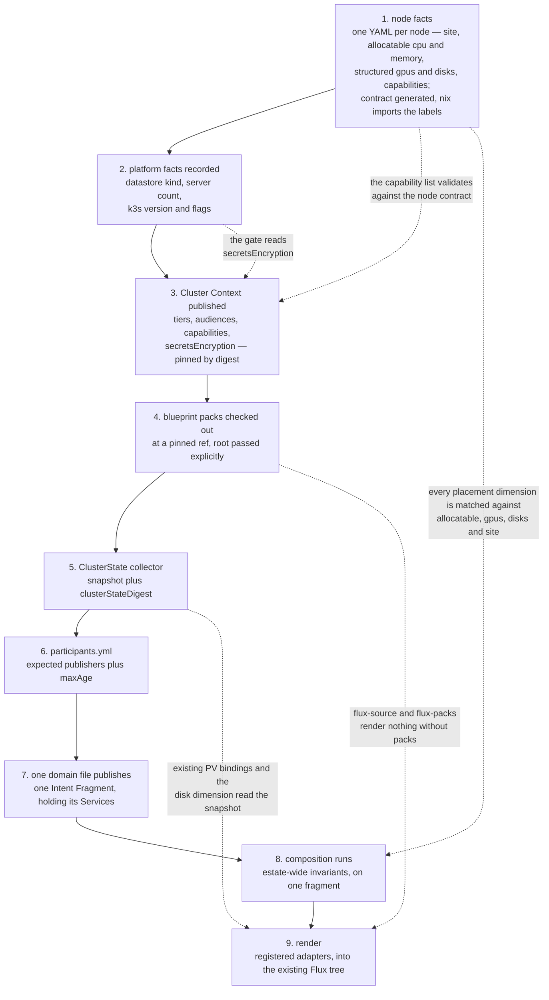

# Chapter 60 — Setup and adoption

How to stand this up, what facts have to exist before anything renders, and how
to move ~30 live Services onto the model without deleting any of them.

Two boundaries apply throughout. **Delivery mechanics and co-testing are defined
separately** ([chapter 50](50-lifecycle.md#delivery-and-co-testing-are-defined-separately),
[`docs/adr/deferred/`](../../docs/adr/deferred/README.md)): nothing here
specifies an applier, a prune pass, deploy RBAC or a test gate. And every
precondition below is either **tickable** — with the observation or command that
ticks it — or **explicitly blocked**, with an owner and the event that unblocks
it. An earlier draft of this chapter carried a precondition that could never be
satisfied at all; see [CNI](#cni).

## Bootstrap order

Nothing here is optional and the order matters, because each step's checks
depend on the previous step's output existing.



Steps 1–3 look like paperwork and are not: they are the facts every later step
reads, and since [0061](../../docs/adr/model/0061-placement-is-hard-dimensions.md)
every Workload's declared `memory` and `cpu` are compared against numbers step 1
publishes — so step 1 is arithmetic that other repositories' builds now fail
against. Step 4 is the one most often skipped, because the two pack-backed
adapters fail in quietly interesting ways without it. Step 5 exists because
layer 2 may read a pinned snapshot and may never read the live cluster
([0034](../../docs/adr/model/0034-cluster-state-pinned-input.md)).

## Node facts

Each node is currently declared three times by hand — `nix-config/inventory/`,
`nix/hosts/<n>/default.nix`, and `homelab-inventory/node-contract/inputs/` — in
two casings (`cpuMillicores` against `cpu_millicores`), and the estate does not
claim the copies agree: `specs/002-node-contract-drift` and
`scripts/audit-node-labels.sh` exist only to police the disagreement. The
duplication shows in the output: the generated contract emits **110 labels for
7 nodes**, 55 under `platform.jorisjonkers.dev/*` and the same 55 under
`personal-stack/*` — named after an archived repository that rejects pushes.

v1 requires the single source
([0056](../../docs/adr/model/0056-node-facts-single-source.md)):

| artefact | authored or generated | holds |
|---|---|---|
| one YAML file per node | **authored** — the only hand-edited copy | node totals and the **declared reserve** subtracted from them, site, gpus, disks, capabilities, taints, ssh |
| `node-contract.yml` | generated | the published node facts and the advertised label set, in one casing |
| the k3s label set | generated | what is applied to the live node |
| `nix/hosts/<n>/default.nix` | generated input, read with `readFile` / `fromJSON` | nix builds machines; it no longer authors labels |

**What the contract must publish, per node.** Placement is a set of hard
dimensions, every one of which must match
([0061](../../docs/adr/model/0061-placement-is-hard-dimensions.md)), so the contract
is the other half of that comparison and its shape is load-bearing:

| published fact | shape | what matches against it |
|---|---|---|
| `allocatable.cpu`, `allocatable.memory` | quantities — the node total minus the reserve declared in the node file | `placement.cpu` and `placement.memory`, required on every Workload |
| `site` | one string | `placement.site` |
| `arch` | one string | `placement.arch`, which is a set of acceptable values |
| `gpus[]` | one entry per card: `vendor`, `model`, `class`, `memory_mib` | `placement.gpu`, by `class` and by memory |
| `disks[]` | one entry per device: `media`, `usable_gib` | `placement.disk`, by `media` and by the amount asked for |
| capabilities | a flat list of strings | `placement.capabilities` |

Structure, not strings, is the point of the middle two rows.
`enschede-gtx-960m-1` and `enschede-t1000-1` both advertise `nvidia`; only
`memory_mib: 2048` on the 960M's Maxwell card separates them, and today
`jellyfin` and `immich-machine-learning` avoid that card only because they also
select `capability-samba`, which exactly one node carries — placement working by
accident of an unrelated filter.

**What that has to express today.** Seven nodes, from
`nix-config/inventory/nodes/*.yml`:

| node | site | arch | cpu | memory | gpu | disks | roles |
|---|---|---|---|---|---|---|---|
| `enschede-t1000-1` | enschede | amd64 | 54000m | 32000Mi | t1000, class `transcode` | nvme 120G + 500G, hdd 4096G | worker, utility |
| `enschede-rx7900xtx-1` | enschede | amd64 | 72800m | 32000Mi | rx7900xtx, class `render-compute` | nvme 160G + 1000G, hdd 8192G | worker, utility |
| `enschede-gtx-960m-1` | enschede | amd64 | 28800m | 16384Mi | gtx960m, class `transcode`, 2048MiB | ssd 100G + 500G, hdd 2048G | worker, utility |
| `enschede-pi-1` | enschede | arm64 | 6000m | 8192Mi | — | sdcard 64G | worker |
| `enschede-pi-2` | enschede | arm64 | 6000m | 4096Mi | — | sdcard 64G | worker |
| `enschede-pi-3` | enschede | arm64 | 6000m | 4096Mi | — | sdcard 64G | worker |
| `frankfurt-contabo-1` | frankfurt | amd64 | 16000m | 32768Mi | — | ssd 80G + 120G | control-plane, worker |

The cpu and memory columns are **node totals**. What the contract publishes is
allocatable — the total minus the reserve declared in the same node file — and
it is never read back from the live cluster, which would put an assignment
outside the pinned input set ([0006](../../docs/adr/model/0006-pinned-inputs.md)).

**The reserve is a guess until it is reconciled, and the cost is not evenly
spread.** An authored reserve is an assertion about what the kubelet, the
container runtime, the OS and the k3s agent take before a pod gets anything, and
nothing validates it until someone compares it with `kubectl describe node`.
Get it wrong and the contract says a Workload fits while the scheduler refuses
to place it — a build that passes and a pod that stays `Pending`. It bites first
on `enschede-pi-2` and `enschede-pi-3`: at 4096Mi total, a 512Mi error is an
eighth of the machine, where the same 512Mi against `frankfurt-contabo-1`'s
32768Mi is noise. Reconciling the seven reserves is a pre-flight item below, not
an implementation detail.

Allocatable is also an **eligibility bound, not a budget**. The contract records
what a node has, not what is already running on it, so three Workloads each
declaring `memory: 2Gi` all pass against a 4096Mi node and the scheduler refuses
the third at apply. Nothing in this chapter, and nothing in layer 2, bin-packs.

**Two facts this contract carries that are not what they look like.**

*Tailscale is on 7 of 7 nodes, so it stops being a capability.* A filter that
excludes nothing teaches authors that filters do nothing, so it leaves the
capability vocabulary
([0061](../../docs/adr/model/0061-placement-is-hard-dimensions.md)). What remains,
with node counts: `adguard` (5), `lan-ingress` (3), `nvidia` (2), `samba` (1),
`public-ingress` (1), `llm-host` (1), `backup-store` (1), `amd-gpu` (1). No node
carries a taint. The two GPU strings stay node facts and
stop being how a Workload asks for a GPU: `nvidia` cannot separate a 2048MiB
Maxwell from a T1000, and `enschede-rx7900xtx-1` — the fastest card in the
estate — is not `nvidia` at all. That selection is `gpus[]`.

*Longhorn is declared eligible on four nodes and is not in use.* No PVC in
`fleet-infra` sets a `storageClassName`, so every claim in the estate takes
k3s's default `local-path`. The contract publishes the eligibility as what it
is — a declared property of a node — and **nothing downstream may read it as
storage that exists**. Two things follow: [restore](#platform-facts-and-restore)
is a `local-path` problem because every volume is a `local-path` volume, and a
`disk` dimension filters first placement only, after which the existing PV
binding in the pinned ClusterState wins.

Two consequences bind other chapters. Placement declares **dimensions and
capabilities, never labels**
([0061](../../docs/adr/model/0061-placement-is-hard-dimensions.md)), and both are only
resolvable because the contract advertises exactly one label set and one set of
facts to validate against. And the selector key comes from the contract's prefix
rather than from `platform.name`, so retiring `personal-stack/*` changes
rendered output for every Workload carrying a `nodeSelector`. Retirement goes
through the generated contract, never a `kubectl label` — the estate agent
contract records that a hand-applied label drifts back on the next reconcile.

Ticked by: for all 7 hosts, with `nix flake check` green,
`nix eval .#nixosConfigurations.<n>.config.platformBlueprints.k3s.nodeLabels --json`
matches `yq -o=json '.nodes.<n>.labels' nix-config/generated/node-contract.yml`.

## Platform facts and restore

Three facts that decide other decisions are, today, expressible in no schema
here: what the datastore is, how many servers there are, and what the k3s
version and server flags are. `schemas/platform.schema.json` requires only
`version`, `name` and `domain`; `$defs/host.roles` is an unconstrained array, so
`k3s-control-plane` is a spelling convention rather than a validated fact.
Whether the single server keeps cluster state in SQLite or embedded etcd decides
whether `k3s etcd-snapshot` exists at all.

v1 makes them required platform intent
([0057](../../docs/adr/model/0057-datastore-and-restore.md)):

| fact | why it is load-bearing | read by |
|---|---|---|
| **datastore kind** (SQLite or embedded etcd) | decides whether a snapshot command exists, and what a restore is | the restore rehearsal; the secrets-at-rest settling check, which greps the datastore file |
| **server count** | decides whether the control plane is a single point of failure by design or by accident | every decision resting on [0002](../../docs/adr/model/0002-kubernetes-as-substrate.md) that would otherwise hedge about HA that is not there |
| **k3s version** | the version everything else is evaluated against | [0036](../../docs/adr/model/0036-cni-selection.md)'s lab evaluation; [0028](../../docs/adr/model/0028-secrets-at-rest-gate.md)'s flag |
| **server flag set** | flags are configuration that exists nowhere in-tree | `--secrets-encryption`, `--flannel-backend`, `--disable-network-policy` — the flags two open decisions turn on |
| **CNI and its flags** | whether a non-enforcing policy stage exists at all | [CNI](#cni), and default-deny's promotion path |
| **`secretsEncryption`** | the renderer's gate | [Secrets at rest](#secrets-at-rest) |
| **the durability policy per class** — backup window, retention count, off-cluster destination | a Durability Class derives objects, and their terms are contended rather than per-Service | [0077](../../docs/adr/model/0077-durability-derives-a-backup.md), [chapter 10](10-service-intent.md#storage-and-durability) |
| **the alert rule catalog and the class-to-receiver mapping** | a class derives rules and routes them, and both producers read one mapping | [0079](../../docs/adr/model/0079-alert-class-derives-from-a-rule-catalog.md), [chapter 10](10-service-intent.md#what-the-class-derives) |
| **scrape `interval` and `scrapeTimeout`** | otherwise a render is not a complete description of how the estate is scraped | [0079](../../docs/adr/model/0079-alert-class-derives-from-a-rule-catalog.md) |
| **the backup method per `engine`** — image, command, arguments | an application-level backup is the only mechanism `local-path` allows, and nothing authored may be executable | [0077](../../docs/adr/model/0077-durability-derives-a-backup.md), [0012](../../docs/adr/model/0012-assets-not-code.md) |

Recording a fact does not choose it. A one-server SQLite cluster stays a
one-server SQLite cluster; it stops being an assumption each reader re-derives
by ssh.

### Restore

Restore does not exist as a concept in this repository today: a grep for
`restore`, `RPO` and `RTO` across `src/`, `schemas/` and `spec/` returns two
hits, both about re-applying Flux manifests, neither about data.
[Workspace ADR-0011](https://github.com/JorisJonkers-dev/workspace/blob/main/docs/decisions/ADR-0011-backup-coverage-gaps.md)
records that *"PVC-level snapshots are impossible here: no VolumeSnapshot CRDs,
and `local-path` has no CSI snapshot support. The job that pretended otherwise
was deleted."* That is the whole estate, not a corner of it: as
[Node facts](#node-facts) records, Longhorn is declared eligible on four nodes
and no claim uses it. What remains is one off-cluster copy from the daily node
backup; three application-level jobs gained dated archives with age-based
retention when
[workspace#48](https://github.com/JorisJonkers-dev/workspace/issues/48) closed on
2026-08-27 — 30 days for `postgres` and `rabbitmq-definitions`, 14 for `vault` —
and no such history exists for an arbitrary `local-path` claim. Against that,
`knowledge-vault-clone` is declared `durability: irreplaceable` on `local-path`,
and it is a personal knowledge vault.

So the numbers are split by how they are obtained:

| number | value | how it is obtained |
|---|---|---|
| **RPO** | **24 hours** | stated, not measured — it is the daily node backup's period. A Workload wanting better declares `durability: recoverable` and gets an application-level backup job with a retention sweep ([0015](../../docs/adr/model/0015-durability-class-per-volume.md)) |
| **RTO** | **no number until the drill runs** | measured: wall time from a destroyed claim to a passing readiness probe. This record refuses to invent one |

**A restore is rehearsed before the first production apply of an
`irreplaceable` volume.** The drill: provision a claim declared `irreplaceable`
outside production, destroy it, restore it from the most recent node backup, and
record two numbers — wall time to a passing readiness probe, and the age of the
recovered data. A drill that cannot complete falsifies
[0057](../../docs/adr/model/0057-datastore-and-restore.md) rather than adjusting it.

## Secrets at rest

Mounting `kubernetes` auth, configuring its JWT issuer and CA, and creating the
KV mounts are **platform fixtures**: estate-unique, drawing on a shared
resource, and therefore platform-assigned
([0004](../../docs/adr/model/0004-contention-decides-authority.md)). They arrive
through a blueprint pack at a pinned ref
([0013](../../docs/adr/model/0013-blueprint-packs-pinned-checkout.md)), never
from per-Service render. What the render owns is the part that varies per
Workload — one derived policy and one auth role per identity
([chapter 30](30-deliverables.md#vault-configuration-is-rendered-not-applied)).

`delivery: env` and `delivery: file` write a Kubernetes Secret. With no
`--secrets-encryption` configuration anywhere in `nix-config` or the bootstrap
tree, that Secret is plaintext base64 in the datastore and in every backup taken
meanwhile — while the agent-inject path being replaced never touched the
datastore at all. Shipping those deliveries first is therefore not an unmet goal
but a **security regression against what runs today**.

The exposure is not marginal: `delivery: env` is what every worked example
except `auth-api` uses, and the item has now been written three times as prose
without acquiring an owner. v1 makes it mechanical
([0028](../../docs/adr/model/0028-secrets-at-rest-gate.md)):

> The pinned Cluster Context carries `secretsEncryption`. The renderer refuses
> any `secrets[]` entry with `delivery: env` or `delivery: file` against a
> context that does not advertise `secretsEncryption: true`, with
> `E_SECRETS_AT_REST_REQUIRED`.

Reading a pinned input rather than the live cluster keeps the check inside
layer-2 purity. `delivery: self` and `access: custody` persist nothing and are
unaffected, so a Workload that speaks Vault itself — `auth-api` does, through
spring-cloud-vault — is never blocked by this gate.

Two limits, stated so the gate is not read as more than it is. The fact is
**asserted, not measured**: a false `true` defeats the gate silently, which is
why the settling command is run per cluster and recorded. And the gate closes
the datastore-file and backup path only — a token with API read still gets
plaintext, so path grants
([0009](../../docs/adr/model/0009-vault-read-is-per-path.md),
[0023](../../docs/adr/model/0023-grant-unit-is-the-path.md)) and RBAC remain the real
boundary. A namespace is not one: it holds several Services by construction
([0063](../../docs/adr/model/0063-intent-authored-per-domain.md)).

Ticked by: enable the flag, then
`kubectl create secret generic canary --from-literal=k=<sentinel>`, then
`sudo strings <datastore file> | grep <sentinel>` returning nothing while
`kubectl get secret canary` still returns the value — the datastore file being
the one the [platform facts](#platform-facts-and-restore) record. Then the
context is republished with `secretsEncryption: true` and re-pinned. Owner:
joris. Blocks: `delivery: env` and `delivery: file` only.

The encryption key file becomes restore-critical: a backup without
`/var/lib/rancher/k3s/server/cred/encryption-config.json` restores nothing
readable, which is a dependency of the restore drill above.

## CNI

**This section replaces a precondition that could never be ticked.** The
previous draft of this chapter required *"default-deny NetworkPolicy is in audit
mode, not enforce"* before the first production apply.
`networking.k8s.io/v1` NetworkPolicy has no audit, dry-run or log-only mode — a
policy is enforced the moment it selects a pod — and k3s enforces with a bundled
kube-router controller that has none either. A non-enforcing stage is a **vendor
capability**, and no decision had ever picked a CNI: a repo-wide grep for
`cilium|calico|kube-router|flannel` returned zero hits outside the review files.
The item was unsatisfiable, so it was either going to be ignored — landing
default-deny as enforce across ~30 workloads on a cluster known to contain
undeclared paths — or nothing would ship.

The direction is **Cilium**, for the two properties
[0035](../../docs/adr/model/0035-network-policy-default-deny.md) needs: an audit stage
that logs what a policy would drop instead of dropping it, and per-flow records
that make the promotion criterion — **zero undeclared flows over 14 days** — an
evidence question rather than a calendar one. The claim is **open**: the estate
is seven nodes with exactly one control-plane host, and that host also runs the
API server and the datastore.

| | state |
|---|---|
| **Status** | open decision — direction fixed, fit unproven ([0036](../../docs/adr/model/0036-cni-selection.md)) |
| **Owner** | joris |
| **Settled by** | a lab evaluation on the recorded k3s version: install with `--flannel-backend=none --disable-network-policy`, sample `cilium-agent` memory and CPU per node over 24 h, then apply a default-deny policy in audit mode and confirm an undeclared connection both succeeds and appears in the flow log as a would-be-deny |
| **Blocks** | enforce-mode default-deny, and nothing else. Until it settles, default-deny does **not** ship — it is not silently shipped as enforce |
| **Does not block** | v1 rendering. The renderer emits portable `networking.k8s.io/v1` objects that any CNI honours, and nothing CNI-specific ever enters an artefact |

The agent's own footprint is a placement fact, not a free variable: sampled
per-node memory has to fit inside the same allocatable the
[node contract](#node-facts) publishes, and on the two 4096Mi Pis it comes out
of the reserve every Workload's `memory` is then compared against.

Installing it restarts the control-plane node's k3s server with flannel and the
bundled controller disabled, interrupting east-west traffic on the machine that
also runs the datastore — which is why it is a recorded platform fact and a
scheduled operation, not a step in a bootstrap script.

## Blueprint packs

The `flux-source` and `flux-packs` adapters need `flux-modules/packs/**` to
render source and release manifests and consumer-owned pack files. Packs arrive
by **pinned checkout, not a registry**
([0013](../../docs/adr/model/0013-blueprint-packs-pinned-checkout.md)):

| input | how it is supplied | effect |
|---|---|---|
| the pack tree | check out `flux-modules` at a pinned tag or ref | the content the two adapters read |
| the root | `--blueprints-root <dir>` or `DEPLOY_CONFIG_BLUEPRINTS_ROOT` | explicit, always. There is no implicit or default path — machine-specific defaults make CI behaviour depend on a workstation layout |
| the version | `--blueprints-version <tag>` | recorded in render-plan provenance, so output traces back to the pack version used |

A missing root, or a root without `packs/`, fails with a structured diagnostic
rather than silently rendering empty pack output.

This is a deliberate divergence from
[0037](../../docs/adr/model/0037-composition-oci-fragments.md), where a domain file
publishes as an OCI fragment. Packs are foundation material consumed whole by
two adapters: they join no composition union, carry no lock digest and hold no
participants-list row, and every consumer already obtains them by ref, while
private-registry auth has caused evidenced friction for `@jorisjonkers-dev`
packages. So two consumption models coexist — fragments by OCI digest, packs by
git ref — and the boundary is material class, not inconsistency. The declared
tag is **recorded, not verified**: provenance holds what the caller passed, so
whoever audits a render is trusting that CI pinned the checkout it declared.

## Onboarding a new Service

A Service is added **to a domain file**, not to a repository of its own. One
file per domain holds many Services, that file is one Intent Fragment, and a
domain never spans repositories
([0063](../../docs/adr/model/0063-intent-authored-per-domain.md)). The namespace is
derived — `<domain>-system` — so no step below names one.

1. Add the Service to its domain file, whose shape is
   [chapter 10](10-service-intent.md#two-artefacts). The file header carries
   `domain` and `owner`, the only field raised to the domain; the Service
   carries `id`, `alertClass`, `secrets[]` and its Workloads; each Workload
   carries its `image`, the ports it `provides`, and its `placement`. Workload
   names are unique within the domain (`E_DUPLICATE_WORKLOAD_NAME`), because the
   ServiceAccount and the Vault role are the Workload name alone
   ([0024](../../docs/adr/model/0024-identity-per-workload.md)). Two Workloads that
   must switch together belong to one Service — a Service is the unit of atomic
   release ([0062](../../docs/adr/model/0062-service-is-the-release-unit.md)), and
   there is no field that couples two of them.
2. Write `platform/env/<workload>/base.env` **per Workload** — never one file per
   Service — plus a cluster overlay only where something differs.
3. Declare `secrets[]` at the level they are shared, each entry carrying `path`,
   `keys`, `access`, `delivery` and `rotation`. They stay on the Service and are
   never raised to the domain header, which would hand every Service in the file
   a reader slot on a path it may not need
   ([0009](../../docs/adr/model/0009-vault-read-is-per-path.md)). Reference
   env-delivered values as `${secret:<granted-path>#<key>}`, where the path
   **byte-matches** a granted path, and cross-Service values as
   `${dependency:…}`. The declaration and the env file check each other in both
   directions.
4. Declare `placement` on **every** Workload: `memory` and `cpu` are required —
   this field exists to end BestEffort as the estate's standing QoS class — and
   `arch`, `site`, `disk`, `gpu` and `capabilities` are declared only where they
   are true. Every declared dimension is hard, a list is a set of equally
   acceptable values, and a dimension no node can satisfy is
   `E_PLACEMENT_UNSATISFIABLE` at build
   ([0061](../../docs/adr/model/0061-placement-is-hard-dimensions.md)).
5. Declare the rest of the runtime intent only this Service knows: any
   `hardening.exceptions` entries, each carrying `allow` and a `reason`, against
   the `restricted` default; `durability` per volume — `reconstructible`,
   `recoverable` or `irreplaceable`; and `probes.readiness` / `probes.liveness`,
   each with its own `path` + `port` or `tcp`, or `probes: none` stated
   explicitly where there is nothing to probe.
6. Add `.github/workflows/publish-fragment.yml`
   ([example](examples/workflows/service-publish-fragment.yml)).
7. Register the repository in `participants.yml` with its staleness bound —
   `maxAge` defaults to **7 days**
   ([0038](../../docs/adr/model/0038-participants-list-staleness.md)).
8. Confirm the fragment composes: composition accepts it, the render is clean,
   and the resulting `resolved.yml` projection is published back to the
   repository ([0033](../../docs/adr/model/0033-assignments-published-back.md)).

Step 7 is the one a Service cannot do for itself, and it fails loudly rather
than silently: an unregistered participant is invisible to composition, so its
Services simply are not in the union. Any additional onboarding the delivery
definition requires is that definition's, not this list's.

## Adopting a live Service

Adoption is a **source swap**: the objects a Service already has stop being
hand-written and start being rendered. The model half of that is checkable
before anything is applied, and it is the half worth doing carefully.

1. **Publish the fragment and let composition accept it.** Nothing is applied.
   If an invariant rejects it, nothing has changed.
2. **Render, and diff the render against what is live.** Every difference is one
   of three things: intent that is wrong, an object that is genuinely
   hand-written, or an adapter gap.
3. **Close the diff.** Wrong intent gets fixed. A genuine hand-written object
   becomes an entry in a Bidirectional Ledger
   ([0055](../../docs/adr/model/0055-bidirectional-ledgers.md)), whose header already
   says *"every entry is a deferred fix, not a permanent exemption."* An adapter
   gap is chapter 30's coverage work.
4. **Swap the source** once the render reproduces the live objects.

Two differences are expected at step 2 and are not adapter gaps. The namespace
is one the Service already runs in: `<domain>-system` reproduces all ten live
namespaces and renames nothing. The resource block is not: a Workload that runs
BestEffort today renders with a `memory` request equal to its limit and a `cpu`
request with no limit, from the `placement` numbers someone has to choose — the
first honest reading of what these Services actually need, and the one part of
adoption that is authoring rather than transcription.

Step 4 is delivery, and it is where adoption is dangerous: a source that prunes
will delete objects removed from it, so the order in which the old manifests
leave and the rendered ones arrive decides whether adoption is a no-op or an
outage. Those ordering rules, and anything that prunes at all, are defined
separately — [`docs/adr/deferred/`](../../docs/adr/deferred/README.md).

**What adoption leaves behind.** Any live object that no render produces is an
orphan: attributed to no adapter, and invisible to every later comparison.
Expect the ledger to grow during adoption and shrink as adapters become total.
That growth is the coverage assertion's problem
([chapter 30](30-deliverables.md#coverage)), and it is the honest cost of
adopting an estate that was hand-written first.

## Adoption order across the estate

Adopt one domain file at a time, in dependency order, providers before
consumers, so a consumer is never rendered against a provider that has published
no fragment:

```
1. node facts + platform facts   nothing depends on them; everything reads them
2. data                          postgres, valkey, rabbitmq -- 8 Services depend on them
3. auth                          every forward-auth route and OIDC consumer
4. knowledge                     depends on data
5. agents                        depends on knowledge and vso-secrets
6. media                         the largest set, the sparsest edges, the lowest blast radius
7. mail, notes, app,             the remainder
   automation, utility
```

`auth` third rather than last is deliberate: it has the densest edge set in the
estate, so it is where the derivation is proven — inbound CORS origins and
forward-auth middleware. It is also where the release rule shows its teeth. The
estate's clearest lockstep pair, `auth-api` and `auth-ui`, is not a pair of
Services to couple: under
[0062](../../docs/adr/model/0062-service-is-the-release-unit.md) it is one Service,
`auth`, holding two Workloads that switch together or not at all. Their images
still build wherever they build; what moves into one file is the intent, and
with it the atomicity claim, which is now checkable by reading a single Service.
`media` late is also deliberate: sparse edges mean a clean render says less, so
it should run on machinery already trusted.

## Before the first production apply

Each item fails silently if missing, so each one names how it is ticked and who
owns it. One item is blocked rather than open, and says so.

- [ ] **Node facts are generated from one source.** Ticked by: the `nix eval` /
      `yq` diff in [Node facts](#node-facts) matching for all 7 hosts with
      `nix flake check` green. Owner: joris. Blocks: placement resolution, which
      has nothing to match against until exactly one copy of the facts exists.
- [ ] **The node contract publishes allocatable, and the reserve has been
      reconciled.** Per node: `allocatable.cpu` and `allocatable.memory` — total
      minus the reserve declared in the node file — plus `site`, `gpus[]` with
      `vendor`, `model`, `class` and `memory_mib`, `disks[]` with `media` and
      `usable_gib`, and the capability list. Ticked by: the contract carrying
      all six for all 7 nodes, and each node's published allocatable compared
      once against `kubectl describe node <n>`, with any gap corrected in the
      node file rather than in the contract — the two 4096Mi Pis first, where
      the reserve is a large fraction of the machine. Owner: joris. Blocks: the
      first placement-gated apply — `memory` and `cpu` are required on every
      Workload and nothing can be matched against a contract that does not
      publish allocatable.
- [ ] **Platform facts are recorded and validate.** Datastore kind, server
      count, k3s version, server flag set, CNI, `secretsEncryption`. Ticked by:
      the platform document carrying all six and passing schema validation, in
      all three fixtures and the live file. Owner: joris. Blocks: the two gates
      below, which have nothing to read without it.
- [ ] **A `local-path` restore has been rehearsed and the RTO recorded.** Ticked
      by: the drill in [Platform facts and restore](#platform-facts-and-restore)
      completing, with wall time to a passing readiness probe and the age of the
      recovered data written into this chapter. Owner: joris. Blocks: the first
      production apply of any volume declared `durability: irreplaceable` —
      nothing else.
- [ ] **Secrets at rest are encrypted and the pinned context says so.** Ticked
      by: the canary sentinel check in [Secrets at rest](#secrets-at-rest), then
      a republished, re-pinned context advertising `secretsEncryption: true`.
      Owner: joris. Blocks: `delivery: env` and `delivery: file` — and only
      those, since `delivery: self` persists nothing.
- [ ] **Blueprint packs are wired into CI by pinned ref.** Ticked by: the render
      job checking out `flux-modules` at a pinned ref, passing
      `--blueprints-root` explicitly, and provenance recording
      `--blueprints-version`. Owner: joris. Blocks: `flux-source` and
      `flux-packs` output.
- [ ] **The ClusterState collector exists and its digest is in the lock.**
      Ticked by: two captures ten minutes apart against an idle cluster
      producing an equal `sha256sum`, and `clusterStateDigest` appearing beside
      `intent` and `imagesLock`. Owner: joris. Blocks: any assignment reading an
      existing PV binding — including `E_DISK_BINDING_CONFLICT`, where a `disk`
      dimension contradicts a binding the cluster already holds.
- [ ] **One renderer generation, with attribution unambiguous.** Ticked by:
      `src/deployment/render/` deleted with an identical before/after estate
      render ([0052](../../docs/adr/model/0052-registered-adapters-are-v1.md)), the
      `-fragment` twins collapsed to one owner per kind, and `E_PATH_COLLISION`
      implemented ([0054](../../docs/adr/model/0054-adapter-attribution.md)). Owner:
      the toolkit maintainer. Blocks: the coverage assertion in chapter 30.
- [ ] **One negative fixture exists per invariant, and composition runs them.**
      Ticked by: [`compose.yml`](examples/workflows/compose.yml) proving each
      gate can fail — `E_PLACEMENT_UNSATISFIABLE` and
      `E_DUPLICATE_WORKLOAD_NAME` included, since both are new — because an
      assertion that stopped running looks identical to one that passes. Owner:
      the toolkit maintainer. Blocks: relying on any estate-wide invariant as
      evidence.
- [ ] **The four images are built.** `hermes-bootstrap` (221 lines of shell),
      `n8n-hooks` (499 lines of JavaScript) and the `garage` bootstrap leave
      their ConfigMaps and become first-party images, retiring the `alpine:3.21`
      plus ConfigMap pattern; `postgres-init-script` needs no image because it
      becomes derived. Ticked by: no executable Asset remaining in any Service
      Intent ([0012](../../docs/adr/model/0012-assets-not-code.md)). Owners: the owners
      of `hermes`, `garage` and `n8n`. Blocks: rendering the current cluster
      from intent.
- **BLOCKED — a non-enforcing network-policy stage.** Not tickable today, and
  deliberately left un-tickable rather than quietly dropped. Owner: joris.
  Unblocked by: the [CNI](#cni) lab evaluation. Blocks: enforce-mode default-deny
  only; v1 rendering proceeds, and default-deny does not ship until a stage
  exists to promote it from — on the evidence of **zero undeclared flows over
  14 days**.

Preconditions belonging to delivery — who applies, what prunes, what
reconciles, what a break-glass path is, and whether a neighbour's tests gate a
merge — are deliberately absent from this list. They are defined separately,
with their evidence, in [`docs/adr/deferred/`](../../docs/adr/deferred/README.md).
