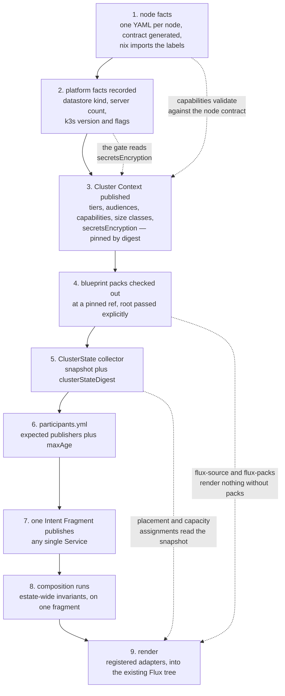

# Chapter 60 — Setup and adoption

How to stand this up, what facts have to exist before anything renders, and how
to move ~30 live Services onto the model without deleting any of them.

Two boundaries apply throughout. **Delivery mechanics and co-testing are defined
separately** ([chapter 50](50-lifecycle.md#delivery-and-co-testing-are-defined-separately),
[`docs/adr/deferred/`](../../docs/adr/deferred/README.md)): nothing here
specifies an applier, a prune pass, deploy RBAC or a test gate. And every
precondition below is either **tickable** — with the observation or command that
ticks it — or **explicitly blocked**, with an owner and the event that unblocks
it. An earlier draft of this chapter carried a precondition that could never be
satisfied at all; see [CNI](#cni).

## Bootstrap order

Nothing here is optional and the order matters, because each step's checks
depend on the previous step's output existing.



Steps 1–3 look like paperwork and are not: they are the facts every later step
reads. Step 4 is the one most often skipped, because the two pack-backed
adapters fail in quietly interesting ways without it. Step 5 exists because layer 2
may read a pinned snapshot and may never read the live cluster
([0034](../../docs/adr/0034-cluster-state-pinned-input.md)).

## Node facts

Each node is currently declared three times by hand — `nix-config/inventory/`,
`nix/hosts/<n>/default.nix`, and `homelab-inventory/node-contract/inputs/` — in
two casings (`cpuMillicores` against `cpu_millicores`), and the estate does not
claim the copies agree: `specs/002-node-contract-drift` and
`scripts/audit-node-labels.sh` exist only to police the disagreement. The
duplication shows in the output: the generated contract emits **110 labels for
7 nodes**, 55 under `platform.jorisjonkers.dev/*` and the same 55 under
`personal-stack/*` — named after an archived repository that rejects pushes.

v1 requires the single source
([0056](../../docs/adr/0056-node-facts-single-source.md)):

| artefact | authored or generated | holds |
|---|---|---|
| one YAML file per node | **authored** — the only hand-edited copy | capacity, capabilities, taints, disks, ssh |
| `node-contract.yml` | generated | the advertised label set and capacity, one casing |
| the k3s label set | generated | what is applied to the live node |
| `nix/hosts/<n>/default.nix` | generated input, read with `readFile` / `fromJSON` | nix builds machines; it no longer authors labels |

Two consequences bind other chapters. Placement declares **capabilities, never
labels** ([0017](../../docs/adr/0017-placement-by-capability.md)), and a
capability is only resolvable because the contract advertises exactly one label
set to validate against. And the selector key comes from the contract's prefix
rather than from `platform.name`, so retiring `personal-stack/*` changes
rendered output for every Workload carrying a `nodeSelector`. Retirement goes
through the generated contract, never a `kubectl label` — the estate agent
contract records that a hand-applied label drifts back on the next reconcile.

Ticked by: for all 7 hosts, with `nix flake check` green,
`nix eval .#nixosConfigurations.<n>.config.platformBlueprints.k3s.nodeLabels --json`
matches `yq -o=json '.nodes.<n>.labels' nix-config/generated/node-contract.yml`.

## Platform facts and restore

Three facts that decide other decisions are, today, expressible in no schema
here: what the datastore is, how many servers there are, and what the k3s
version and server flags are. `schemas/platform.schema.json` requires only
`version`, `name` and `domain`; `$defs/host.roles` is an unconstrained array, so
`k3s-control-plane` is a spelling convention rather than a validated fact.
Whether the single server keeps cluster state in SQLite or embedded etcd decides
whether `k3s etcd-snapshot` exists at all.

v1 makes them required platform intent
([0057](../../docs/adr/0057-datastore-and-restore.md)):

| fact | why it is load-bearing | read by |
|---|---|---|
| **datastore kind** (SQLite or embedded etcd) | decides whether a snapshot command exists, and what a restore is | the restore rehearsal; the secrets-at-rest settling check, which greps the datastore file |
| **server count** | decides whether the control plane is a single point of failure by design or by accident | every decision resting on [0002](../../docs/adr/0002-kubernetes-as-substrate.md) that would otherwise hedge about HA that is not there |
| **k3s version** | the version everything else is evaluated against | [0036](../../docs/adr/0036-cni-selection.md)'s lab evaluation; [0028](../../docs/adr/0028-secrets-at-rest-gate.md)'s flag |
| **server flag set** | flags are configuration that exists nowhere in-tree | `--secrets-encryption`, `--flannel-backend`, `--disable-network-policy` — the flags two open decisions turn on |
| **CNI and its flags** | whether a non-enforcing policy stage exists at all | [CNI](#cni), and default-deny's promotion path |
| **`secretsEncryption`** | the renderer's gate | [Secrets at rest](#secrets-at-rest) |

Recording a fact does not choose it. A one-server SQLite cluster stays a
one-server SQLite cluster; it stops being an assumption each reader re-derives
by ssh.

### Restore

Restore does not exist as a concept in this repository today: a grep for
`restore`, `RPO` and `RTO` across `src/`, `schemas/` and `spec/` returns two
hits, both about re-applying Flux manifests, neither about data.
[Workspace ADR-0011](https://github.com/JorisJonkers-dev/workspace/blob/main/docs/decisions/ADR-0011-backup-coverage-gaps.md)
records that *"PVC-level snapshots are impossible here: no VolumeSnapshot CRDs,
and `local-path` has no CSI snapshot support. The job that pretended otherwise
was deleted."* What remains is one off-cluster copy from the daily node backup;
three application-level jobs gained dated archives with age-based retention when
[workspace#48](https://github.com/JorisJonkers-dev/workspace/issues/48) closed on
2026-08-27 — 30 days for `postgres` and `rabbitmq-definitions`, 14 for `vault` —
and no such history exists for an arbitrary `local-path` claim. Against that,
`knowledge-vault-clone` is declared `durability: irreplaceable` on `local-path`,
and it is a personal knowledge vault.

So the numbers are split by how they are obtained:

| number | value | how it is obtained |
|---|---|---|
| **RPO** | **24 hours** | stated, not measured — it is the daily node backup's period. A Workload wanting better declares `durability: recoverable` and gets an application-level backup job with a retention sweep ([0015](../../docs/adr/0015-durability-class-per-volume.md)) |
| **RTO** | **no number until the drill runs** | measured: wall time from a destroyed claim to a passing readiness probe. This record refuses to invent one |

**A restore is rehearsed before the first production apply of an
`irreplaceable` volume.** The drill: provision a claim declared `irreplaceable`
outside production, destroy it, restore it from the most recent node backup, and
record two numbers — wall time to a passing readiness probe, and the age of the
recovered data. A drill that cannot complete falsifies
[0057](../../docs/adr/0057-datastore-and-restore.md) rather than adjusting it.

## Secrets at rest

`delivery: env` and `delivery: file` write a Kubernetes Secret. With no
`--secrets-encryption` configuration anywhere in `nix-config` or the bootstrap
tree, that Secret is plaintext base64 in the datastore and in every backup taken
meanwhile — while the agent-inject path being replaced never touched the
datastore at all. Shipping those deliveries first is therefore not an unmet goal
but a **security regression against what runs today**.

The exposure is not marginal: `delivery: env` is what every worked example
except `auth-api` uses, and the item has now been written three times as prose
without acquiring an owner. v1 makes it mechanical
([0028](../../docs/adr/0028-secrets-at-rest-gate.md)):

> The pinned Cluster Context carries `secretsEncryption`. The renderer refuses
> any `secrets[]` entry with `delivery: env` or `delivery: file` against a
> context that does not advertise `secretsEncryption: true`, with
> `E_SECRETS_AT_REST_REQUIRED`.

Reading a pinned input rather than the live cluster keeps the check inside
layer-2 purity. `delivery: self` and `access: custody` persist nothing and are
unaffected, so a Service that speaks Vault itself — `auth-api` does, through
spring-cloud-vault — is never blocked by this gate.

Two limits, stated so the gate is not read as more than it is. The fact is
**asserted, not measured**: a false `true` defeats the gate silently, which is
why the settling command is run per cluster and recorded. And the gate closes
the datastore-file and backup path only — a token with API read still gets
plaintext, so path grants
([0009](../../docs/adr/0009-vault-read-is-per-path.md),
[0023](../../docs/adr/0023-grant-unit-is-the-path.md)) and RBAC remain the real
boundary.

Ticked by: enable the flag, then
`kubectl create secret generic canary --from-literal=k=<sentinel>`, then
`sudo strings <datastore file> | grep <sentinel>` returning nothing while
`kubectl get secret canary` still returns the value — the datastore file being
the one the [platform facts](#platform-facts-and-restore) record. Then the
context is republished with `secretsEncryption: true` and re-pinned. Owner:
joris. Blocks: `delivery: env` and `delivery: file` only.

The encryption key file becomes restore-critical: a backup without
`/var/lib/rancher/k3s/server/cred/encryption-config.json` restores nothing
readable, which is a dependency of the restore drill above.

## CNI

**This section replaces a precondition that could never be ticked.** The
previous draft of this chapter required *"default-deny NetworkPolicy is in audit
mode, not enforce"* before the first production apply.
`networking.k8s.io/v1` NetworkPolicy has no audit, dry-run or log-only mode — a
policy is enforced the moment it selects a pod — and k3s enforces with a bundled
kube-router controller that has none either. A non-enforcing stage is a **vendor
capability**, and no decision had ever picked a CNI: a repo-wide grep for
`cilium|calico|kube-router|flannel` returned zero hits outside the review files.
The item was unsatisfiable, so it was either going to be ignored — landing
default-deny as enforce across ~30 workloads on a cluster known to contain
undeclared paths — or nothing would ship.

The direction is **Cilium**, for the two properties
[0035](../../docs/adr/0035-network-policy-default-deny.md) needs: an audit stage
that logs what a policy would drop instead of dropping it, and per-flow records
that make the promotion criterion — **zero undeclared flows over 14 days** — an
evidence question rather than a calendar one. The claim is **open**: the estate
is seven nodes with exactly one control-plane host, and that host also runs the
API server and the datastore.

| | state |
|---|---|
| **Status** | open decision — direction fixed, fit unproven ([0036](../../docs/adr/0036-cni-selection.md)) |
| **Owner** | joris |
| **Settled by** | a lab evaluation on the recorded k3s version: install with `--flannel-backend=none --disable-network-policy`, sample `cilium-agent` memory and CPU per node over 24 h, then apply a default-deny policy in audit mode and confirm an undeclared connection both succeeds and appears in the flow log as a would-be-deny |
| **Blocks** | enforce-mode default-deny, and nothing else. Until it settles, default-deny does **not** ship — it is not silently shipped as enforce |
| **Does not block** | v1 rendering. The renderer emits portable `networking.k8s.io/v1` objects that any CNI honours, and nothing CNI-specific ever enters an artefact |

Installing it restarts the control-plane node's k3s server with flannel and the
bundled controller disabled, interrupting east-west traffic on the machine that
also runs the datastore — which is why it is a recorded platform fact and a
scheduled operation, not a step in a bootstrap script.

## Blueprint packs

The `flux-source` and `flux-packs` adapters need `flux-modules/packs/**` to
render source and release manifests and consumer-owned pack files. Packs arrive
by **pinned checkout, not a registry**
([0013](../../docs/adr/0013-blueprint-packs-pinned-checkout.md)):

| input | how it is supplied | effect |
|---|---|---|
| the pack tree | check out `flux-modules` at a pinned tag or ref | the content the two adapters read |
| the root | `--blueprints-root <dir>` or `DEPLOY_CONFIG_BLUEPRINTS_ROOT` | explicit, always. There is no implicit or default path — machine-specific defaults make CI behaviour depend on a workstation layout |
| the version | `--blueprints-version <tag>` | recorded in render-plan provenance, so output traces back to the pack version used |

A missing root, or a root without `packs/`, fails with a structured diagnostic
rather than silently rendering empty pack output.

This is a deliberate divergence from
[0037](../../docs/adr/0037-composition-oci-fragments.md), where domain
declarations compose from published OCI fragments. Packs are foundation material
consumed whole by two adapters: they join no composition union, carry no lock
digest and hold no participants-list row, and every consumer already obtains
them by ref, while private-registry auth has caused evidenced friction for
`@jorisjonkers-dev` packages. So two consumption models coexist — fragments by
OCI digest, packs by git ref — and the boundary is material class, not
inconsistency. The declared tag is **recorded, not verified**: provenance holds
what the caller passed, so whoever audits a render is trusting that CI pinned
the checkout it declared.

## Onboarding a new Service

1. Write `platform/service.yml` — `id`, `domain`, `owner`, `alertClass`, and the
   Workloads. Add `releaseUnit: <name>` only if this Service must switch in
   lockstep with another ([chapter 50](50-lifecycle.md#release-unit-switchover));
   at most one per Service.
2. Write `platform/env/<workload>/base.env` **per Workload** — never one file per
   Service — plus a cluster overlay only where something differs.
3. Declare `secrets[]` at the level they are shared, each entry carrying `path`,
   `keys`, `access`, `delivery` and `rotation`. Reference env-delivered values as
   `${secret:<granted-path>#<key>}`, where the path **byte-matches** a granted
   path, and cross-Service values as `${dependency:…}`. The declaration and the
   env file check each other in both directions.
4. Declare the runtime intent only this Service knows: `size`; any
   `hardening.exceptions` entries, each carrying `allow` and a `reason`, against
   the `restricted` default; `durability` per volume — `reconstructible`,
   `recoverable` or `irreplaceable`; and `probes.readiness` / `probes.liveness`,
   each with its own `path` + `port` or `tcp`, or `probes: none` stated
   explicitly where there is nothing to probe.
5. Add `.github/workflows/publish-fragment.yml`
   ([example](examples/workflows/service-publish-fragment.yml)).
6. Register the repository in `participants.yml` with its staleness bound —
   `maxAge` defaults to **7 days**
   ([0038](../../docs/adr/0038-participants-list-staleness.md)).
7. Confirm the fragment composes: composition accepts it, the render is clean,
   and the resulting `resolved.yml` projection is published back to the
   repository ([0033](../../docs/adr/0033-assignments-published-back.md)).

Step 6 is the one a Service cannot do for itself, and it fails loudly rather
than silently: an unregistered participant is invisible to composition, so its
Services simply are not in the union. Any additional onboarding the delivery
definition requires is that definition's, not this list's.

## Adopting a live Service

Adoption is a **source swap**: the objects a Service already has stop being
hand-written and start being rendered. The model half of that is checkable
before anything is applied, and it is the half worth doing carefully.

1. **Publish the fragment and let composition accept it.** Nothing is applied.
   If an invariant rejects it, nothing has changed.
2. **Render, and diff the render against what is live.** Every difference is one
   of three things: intent that is wrong, an object that is genuinely
   hand-written, or an adapter gap.
3. **Close the diff.** Wrong intent gets fixed. A genuine hand-written object
   becomes an entry in a Bidirectional Ledger
   ([0055](../../docs/adr/0055-bidirectional-ledgers.md)), whose header already
   says *"every entry is a deferred fix, not a permanent exemption."* An adapter
   gap is chapter 30's coverage work.
4. **Swap the source** once the render reproduces the live objects.

Step 4 is delivery, and it is where adoption is dangerous: a source that prunes
will delete objects removed from it, so the order in which the old manifests
leave and the rendered ones arrive decides whether adoption is a no-op or an
outage. Those ordering rules, and anything that prunes at all, are defined
separately — [`docs/adr/deferred/`](../../docs/adr/deferred/README.md).

**What adoption leaves behind.** Any live object that no render produces is an
orphan: attributed to no adapter, and invisible to every later comparison.
Expect the ledger to grow during adoption and shrink as adapters become total.
That growth is the coverage assertion's problem
([chapter 30](30-deliverables.md#coverage)), and it is the honest cost of
adopting an estate that was hand-written first.

## Adoption order across the estate

Adopt in dependency order, providers before consumers, so a consumer is never
rendered against a provider that has published no fragment:

```
1. node facts + platform facts   nothing depends on them; everything reads them
2. intent-data                   postgres, valkey, rabbitmq -- 8 Services depend on them
3. intent-auth                   auth-api, auth-ui; every forward-auth route and OIDC consumer
4. intent-knowledge              depends on data
5. intent-agents                 depends on knowledge and vso-secrets
6. intent-media                  the largest set, the sparsest edges, the lowest blast radius
7. intent-mail, utility          the remainder
```

`intent-auth` third rather than last is deliberate: it has the densest edge set
in the estate, so it is where the derivation is proven — inbound CORS origins,
forward-auth middleware, and the estate's clearest lockstep pair, `auth-api`
with `auth-ui`.
`intent-media` late is also deliberate: sparse edges mean a clean render says
less, so it should run on machinery already trusted.

## Before the first production apply

Each item fails silently if missing, so each one names how it is ticked and who
owns it. One item is blocked rather than open, and says so.

- [ ] **Node facts are generated from one source.** Ticked by: the `nix eval` /
      `yq` diff in [Node facts](#node-facts) matching for all 7 hosts with
      `nix flake check` green. Owner: joris. Blocks: placement resolution.
- [ ] **Platform facts are recorded and validate.** Datastore kind, server
      count, k3s version, server flag set, CNI, `secretsEncryption`. Ticked by:
      the platform document carrying all six and passing schema validation, in
      all three fixtures and the live file. Owner: joris. Blocks: the two gates
      below, which have nothing to read without it.
- [ ] **A `local-path` restore has been rehearsed and the RTO recorded.** Ticked
      by: the drill in [Platform facts and restore](#platform-facts-and-restore)
      completing, with wall time to a passing readiness probe and the age of the
      recovered data written into this chapter. Owner: joris. Blocks: the first
      production apply of any volume declared `durability: irreplaceable` —
      nothing else.
- [ ] **Secrets at rest are encrypted and the pinned context says so.** Ticked
      by: the canary sentinel check in [Secrets at rest](#secrets-at-rest), then
      a republished, re-pinned context advertising `secretsEncryption: true`.
      Owner: joris. Blocks: `delivery: env` and `delivery: file` — and only
      those, since `delivery: self` persists nothing.
- [ ] **Blueprint packs are wired into CI by pinned ref.** Ticked by: the render
      job checking out `flux-modules` at a pinned ref, passing
      `--blueprints-root` explicitly, and provenance recording
      `--blueprints-version`. Owner: joris. Blocks: `flux-source` and
      `flux-packs` output.
- [ ] **The ClusterState collector exists and its digest is in the lock.**
      Ticked by: two captures ten minutes apart against an idle cluster
      producing an equal `sha256sum`, and `clusterStateDigest` appearing beside
      `intent` and `imagesLock`. Owner: joris. Blocks: any assignment reading a
      PV binding or node capacity — which is what made the old spec contradict
      itself in two places.
- [ ] **One renderer generation, with attribution unambiguous.** Ticked by:
      `src/deployment/render/` deleted with an identical before/after estate
      render ([0052](../../docs/adr/0052-registered-adapters-are-v1.md)), the
      `-fragment` twins collapsed to one owner per kind, and `E_PATH_COLLISION`
      implemented ([0054](../../docs/adr/0054-adapter-attribution.md)). Owner:
      the toolkit maintainer. Blocks: the coverage assertion in chapter 30.
- [ ] **One negative fixture exists per invariant, and composition runs them.**
      Ticked by: [`compose.yml`](examples/workflows/compose.yml) proving the gate
      can fail — an assertion that stopped running looks identical to one that
      passes. Owner: the toolkit maintainer.
- [ ] **The four images are built.** `hermes-bootstrap` (221 lines of shell),
      `n8n-hooks` (499 lines of JavaScript) and the `garage` bootstrap leave
      their ConfigMaps and become first-party images, retiring the `alpine:3.21`
      plus ConfigMap pattern; `postgres-init-script` needs no image because it
      becomes derived. Ticked by: no executable Asset remaining in any Service
      Intent ([0012](../../docs/adr/0012-assets-not-code.md)). Owners: the owners
      of `hermes`, `garage` and `n8n`. Blocks: rendering the current cluster
      from intent.
- **BLOCKED — a non-enforcing network-policy stage.** Not tickable today, and
  deliberately left un-tickable rather than quietly dropped. Owner: joris.
  Unblocked by: the [CNI](#cni) lab evaluation. Blocks: enforce-mode default-deny
  only; v1 rendering proceeds, and default-deny does not ship until a stage
  exists to promote it from — on the evidence of **zero undeclared flows over
  14 days**.

Preconditions belonging to delivery — who applies, what prunes, what
reconciles, what a break-glass path is, and whether a neighbour's tests gate a
merge — are deliberately absent from this list. They are defined separately,
with their evidence, in [`docs/adr/deferred/`](../../docs/adr/deferred/README.md).
